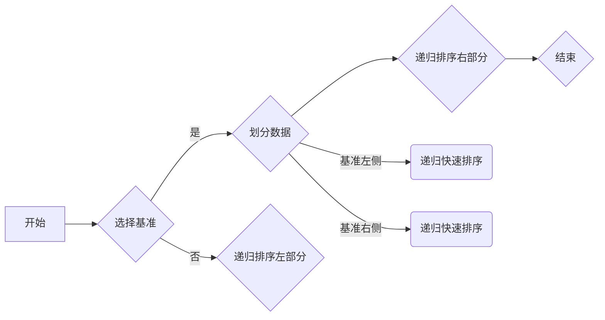
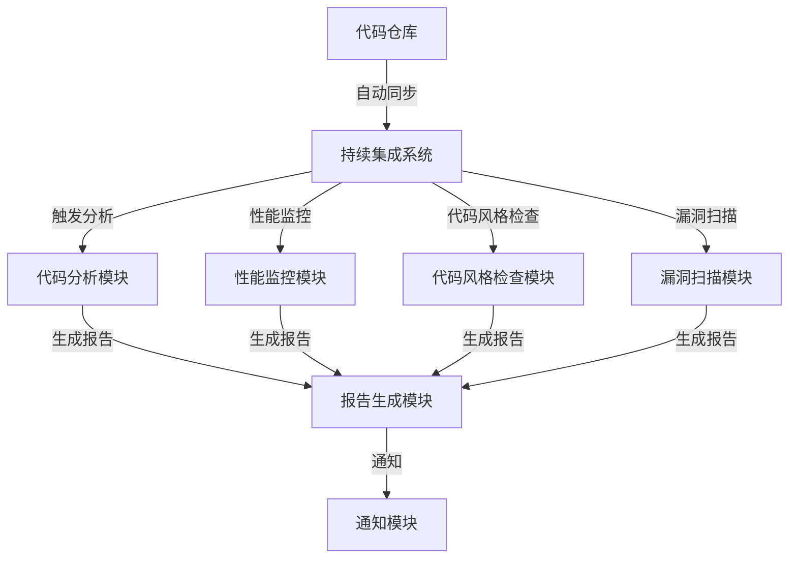
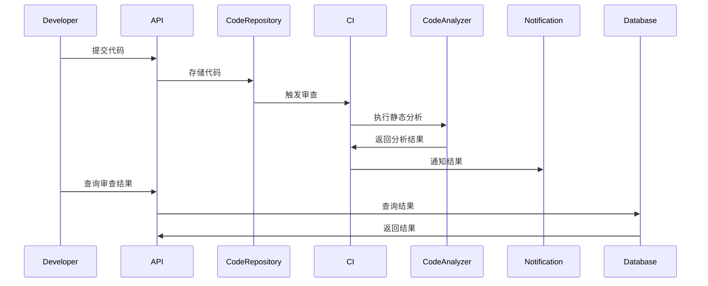
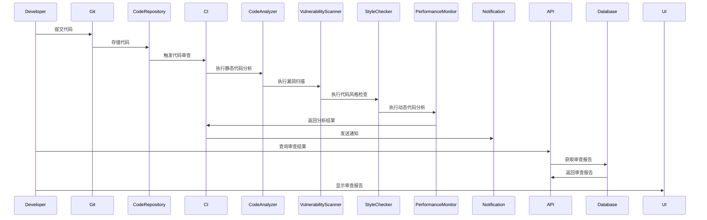
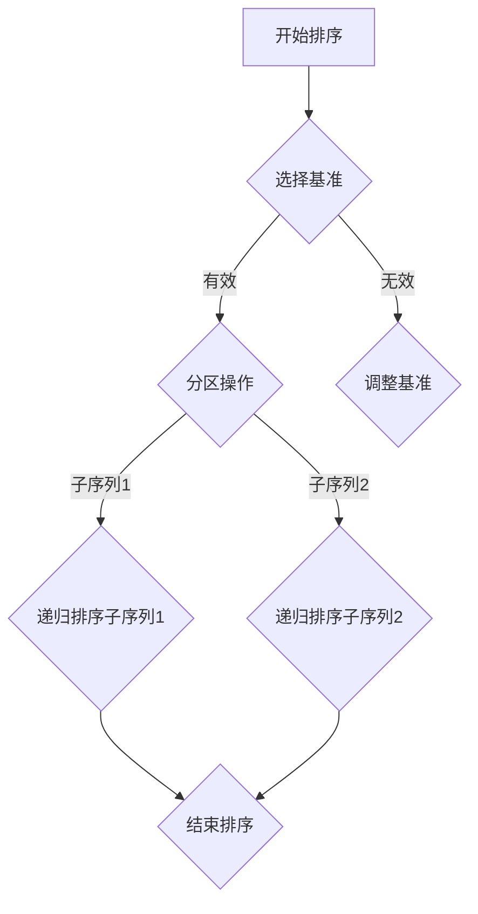
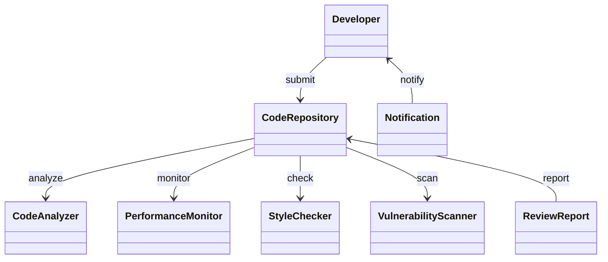
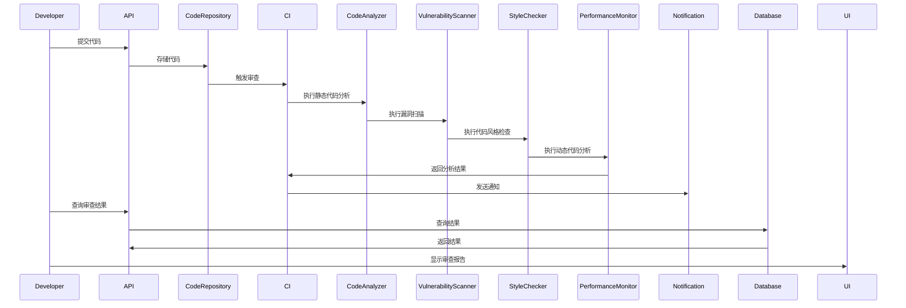

                 

# 代码审查工具链：提升审查效率与质量

> 关键词：代码审查，工具链，效率，质量，静态代码分析，动态代码分析，代码风格检查，漏洞扫描

> 摘要：
本文旨在深入探讨代码审查工具链的构建与应用，通过详细的章节内容，为开发者提供一套系统化的方法和实战指导。我们将从背景介绍开始，逐步解析静态代码分析、动态代码分析、代码风格检查和漏洞扫描等核心概念，最后通过实战案例展示如何提升代码审查的效率与质量。

## 1.1 背景介绍

### 问题背景

在软件开发过程中，代码审查是一种关键的质量保证措施。它有助于识别代码中的潜在错误、漏洞和不足，提高代码的可读性和可维护性。然而，传统的代码审查方法通常依赖于人工审查，不仅耗时且容易出现漏检和主观判断偏差。随着软件开发项目的复杂度不断增加，如何提高代码审查的效率和质量成为了一个亟待解决的问题。

### 问题描述

代码审查工具链的引入旨在解决上述问题。代码审查工具链是一套集成化的工具集合，包括静态代码分析、动态代码分析、代码风格检查、漏洞扫描等多个方面，通过自动化手段提升代码审查的效率和质量。然而，目前市场上存在多种代码审查工具，且各自功能侧重点不同，如何选择合适的工具并构建一个高效的代码审查工具链，成为开发团队面临的一个挑战。

### 问题解决

本书旨在为读者提供一套系统化的代码审查工具链构建方法，从提升审查效率和质量的角度出发，详细探讨各类工具的选择与应用。通过以下章节内容，读者将能够：

1. **理解代码审查工具链的基本概念与架构**：介绍代码审查工具链的组成部分、工作原理和关键功能，为后续章节的学习打下基础。

2. **静态代码分析工具的选择与使用**：介绍静态代码分析工具的基本原理和常用工具，如SonarQube、Checkstyle等，并提供实际应用案例。

3. **动态代码分析工具的选择与使用**：介绍动态代码分析工具的基本原理和常用工具，如VisualVM、JaCoCo等，并提供实际应用案例。

4. **代码风格检查工具的选择与使用**：介绍代码风格检查工具的基本原理和常用工具，如PMD、SpotBugs等，并提供实际应用案例。

5. **漏洞扫描工具的选择与使用**：介绍漏洞扫描工具的基本原理和常用工具，如OWASP ZAP、FindBugs等，并提供实际应用案例。

6. **构建高效的代码审查流程**：介绍如何根据项目特点和组织需求，设计并优化代码审查流程，确保代码质量。

7. **实战案例分析**：通过具体的项目案例，展示如何在实际项目中应用代码审查工具链，提升代码审查效率和质量。

### 边界与外延

代码审查工具链不仅适用于软件开发项目，还可以应用于其他需要代码质量保证的场景，如运维自动化脚本、数据分析脚本等。此外，代码审查工具链的构建和优化是一个持续迭代的过程，需要根据项目需求和环境的变化进行调整。

### 概念结构与核心要素组成

1. **代码审查工具链**：一套集成化的代码分析工具集合，包括静态代码分析、动态代码分析、代码风格检查、漏洞扫描等多个方面。

2. **静态代码分析**：在代码编译前对代码进行分析，检查代码中的潜在问题，如语法错误、潜在漏洞等。

3. **动态代码分析**：在代码运行时对代码进行分析，检查代码在运行过程中的行为和性能，如内存泄漏、性能瓶颈等。

4. **代码风格检查**：对代码的格式、命名规范、代码结构等方面进行检查，确保代码的可读性和可维护性。

5. **漏洞扫描**：扫描代码中的已知漏洞，如SQL注入、跨站脚本攻击等，确保代码的安全性。

### 核心概念原理

1. **静态代码分析原理**：
   - 代码静态分析是一种自动化分析技术，通过分析代码的语法、语义和结构，识别出潜在的问题。
   - 常用的静态代码分析工具包括SonarQube、Checkstyle等，这些工具可以生成详细的代码报告，帮助开发者快速定位问题。

2. **动态代码分析原理**：
   - 代码动态分析是一种运行时分析技术，通过运行代码并监控其行为和性能，识别出潜在的问题。
   - 常用的动态代码分析工具包括VisualVM、JaCoCo等，这些工具可以生成详细的性能报告，帮助开发者优化代码。

3. **代码风格检查原理**：
   - 代码风格检查是一种自动化工具，通过检查代码的格式、命名规范和结构，确保代码的可读性和可维护性。
   - 常用的代码风格检查工具包括PMD、SpotBugs等，这些工具可以生成详细的代码风格报告，帮助开发者改进代码风格。

4. **漏洞扫描原理**：
   - 漏洞扫描是一种自动化工具，通过扫描代码中的已知漏洞，确保代码的安全性。
   - 常用的漏洞扫描工具包括OWASP ZAP、FindBugs等，这些工具可以生成详细的漏洞报告，帮助开发者修复漏洞。

### 概念属性特征对比表格

| 工具类型 | 基本原理 | 主要功能 | 代表工具 |
| --- | --- | --- | --- |
| 静态代码分析 | 代码编译前分析 | 识别语法错误、潜在漏洞等 | SonarQube、Checkstyle |
| 动态代码分析 | 代码运行时分析 | 检查代码行为和性能 | VisualVM、JaCoCo |
| 代码风格检查 | 检查代码格式和规范 | 确保代码可读性和可维护性 | PMD、SpotBugs |
| 漏洞扫描 | 扫描代码中的已知漏洞 | 确保代码安全性 | OWASP ZAP、FindBugs |

## 1.2 代码审查工具链的基本概念与架构

在深入探讨代码审查工具链的构建与应用之前，我们需要先理解代码审查工具链的基本概念和架构。代码审查工具链是一套集成化的工具集合，通过自动化手段提升代码审查的效率和质量。它主要包括以下几个方面：

### 1.2.1 静态代码分析工具

静态代码分析工具在代码编译前对代码进行分析，检查代码中的潜在问题，如语法错误、潜在漏洞等。这种分析方式不需要运行代码，可以快速定位问题，提高代码审查的效率。

### 1.2.2 动态代码分析工具

动态代码分析工具在代码运行时对代码进行分析，检查代码在运行过程中的行为和性能，如内存泄漏、性能瓶颈等。这种分析方式可以更全面地了解代码的实际运行情况，帮助开发者优化代码。

### 1.2.3 代码风格检查工具

代码风格检查工具通过检查代码的格式、命名规范和结构，确保代码的可读性和可维护性。这有助于提高代码的一致性和可维护性，减少因为代码风格不一致导致的问题。

### 1.2.4 漏洞扫描工具

漏洞扫描工具通过扫描代码中的已知漏洞，确保代码的安全性。这种工具可以帮助开发者及时发现和修复潜在的安全漏洞，提高代码的安全性。

### 1.2.5 代码审查工具链的集成

代码审查工具链的集成是将上述各类工具有机结合，形成一个统一的代码审查平台。这样，开发团队可以方便地使用这些工具进行代码审查，提高审查效率和质量。

### 1.2.6 工具链的架构

代码审查工具链的架构通常包括以下几个方面：

1. **代码仓库集成**：将代码审查工具链与代码仓库集成，实现代码自动审查。
2. **持续集成/持续部署（CI/CD）**：将代码审查工具链与CI/CD流程集成，确保代码在提交后自动进行审查。
3. **报告生成**：生成详细的代码审查报告，帮助开发者快速定位问题。
4. **通知和反馈**：通过邮件、消息推送等方式通知开发者审查结果，确保问题得到及时解决。

### 1.2.7 工具链的优势

使用代码审查工具链具有以下优势：

1. **提高审查效率**：自动化工具可以快速定位问题，提高审查效率。
2. **减少人工错误**：减少人工审查的漏检和主观判断偏差，提高审查质量。
3. **一致性检查**：确保代码风格的一致性，提高代码的可维护性。
4. **安全性保障**：及时发现和修复安全漏洞，提高代码的安全性。

通过上述分析，我们可以看到，代码审查工具链的构建和应用对于提升代码审查效率和质量具有重要意义。接下来，我们将详细探讨各类代码审查工具的选择与使用。

## 1.3 静态代码分析工具的选择与使用

静态代码分析工具在代码审查工具链中扮演着重要角色。它们通过在代码编译前分析代码，识别出潜在的问题，如语法错误、潜在漏洞、代码风格问题等。本节将详细介绍静态代码分析工具的基本原理、常用工具以及实际应用案例。

### 1.3.1 基本原理

静态代码分析工具的基本原理是通过解析代码的语法和语义，对代码进行静态分析，从而发现潜在的问题。这种分析不需要运行代码，可以在较短时间内对大量代码进行分析，提高代码审查的效率。

静态代码分析主要包括以下几个方面：

1. **语法分析**：检查代码的语法是否正确，如是否存在语法错误、未声明的变量等。
2. **语义分析**：检查代码的语义是否正确，如是否存在逻辑错误、未使用的代码等。
3. **代码结构分析**：检查代码的结构是否符合规范，如是否存在过多的嵌套、过于复杂的表达式等。
4. **潜在漏洞分析**：检查代码中可能存在的漏洞，如SQL注入、跨站脚本攻击等。

### 1.3.2 常用工具

市场上存在多种静态代码分析工具，以下介绍几种常用的工具：

1. **SonarQube**
   - **原理**：SonarQube是一个开源的静态代码分析平台，支持多种编程语言，可以检测代码中的漏洞、代码风格问题、bug等。
   - **功能**：SonarQube提供丰富的分析报告，支持自动化集成，可以与各种代码仓库和CI/CD工具集成。
   - **应用场景**：适用于大型项目和团队，用于持续集成中的代码质量检查。

2. **Checkstyle**
   - **原理**：Checkstyle是一个开源的Java代码风格检查工具，可以检查代码的格式、命名规范、结构等问题。
   - **功能**：Checkstyle提供了丰富的配置选项，可以根据项目的具体需求进行定制。
   - **应用场景**：适用于Java项目，用于代码风格检查和代码质量的保证。

3. **PMD**
   - **原理**：PMD是一个开源的代码分析工具，可以检测Java、JavaScript、Python等语言的代码中的潜在问题。
   - **功能**：PMD可以检测代码中的冗余代码、过长的方法、可能存在的漏洞等。
   - **应用场景**：适用于多种编程语言，用于代码质量的提升和代码风格的优化。

4. **FindBugs**
   - **原理**：FindBugs是一个开源的Java代码缺陷检测工具，可以检测出代码中的潜在问题，如内存泄漏、空指针异常等。
   - **功能**：FindBugs提供了详细的缺陷报告，可以帮助开发者快速定位和修复问题。
   - **应用场景**：适用于Java项目，用于代码质量的保障和缺陷的修复。

### 1.3.3 实际应用案例

下面以一个实际应用案例，展示如何使用静态代码分析工具来提升代码质量。

#### 案例背景

某互联网公司开发了一个大型电商系统，由于项目规模庞大，代码质量参差不齐，导致频繁出现漏洞和性能问题。为了提高代码质量，公司决定引入静态代码分析工具。

#### 案例步骤

1. **工具选择**：根据项目需求，公司选择了SonarQube作为静态代码分析工具。

2. **集成与配置**：将SonarQube集成到公司的持续集成（CI）系统中，配置了代码仓库的自动同步和代码分析任务的自动触发。

3. **代码分析**：每次代码提交后，SonarQube自动进行分析，生成详细的代码分析报告。

4. **问题反馈**：开发者在收到代码分析报告后，针对发现的问题进行修复。

5. **持续优化**：通过持续的代码分析和问题修复，代码质量逐步提高，漏洞和性能问题显著减少。

#### 案例效果

通过引入SonarQube，公司的代码质量得到了显著提升。代码中的漏洞和性能问题大幅减少，代码的可读性和可维护性得到提高。同时，开发者的工作效率也得到了提升，因为他们可以更快地发现和修复问题。

### 1.3.4 总结

静态代码分析工具在代码审查工具链中发挥着重要作用。通过选择合适的静态代码分析工具并合理应用，可以显著提升代码审查的效率和质量。在接下来的章节中，我们将继续探讨动态代码分析工具、代码风格检查工具和漏洞扫描工具的选择与使用。

## 1.4 动态代码分析工具的选择与使用

动态代码分析工具在代码审查工具链中同样占据重要位置。它们在代码运行时对代码进行性能分析，检查代码在运行过程中的行为和性能问题，如内存泄漏、性能瓶颈等。本节将详细介绍动态代码分析工具的基本原理、常用工具以及实际应用案例。

### 1.4.1 基本原理

动态代码分析工具的基本原理是在代码运行时捕获代码的行为和性能数据，通过分析这些数据来识别潜在的性能问题和缺陷。这种分析方式可以更真实地反映代码的实际运行情况，帮助开发者发现和优化代码。

动态代码分析主要包括以下几个方面：

1. **性能监控**：监控代码的运行性能，如CPU使用率、内存使用情况、网络延迟等。
2. **资源消耗分析**：分析代码在运行时消耗的资源，如内存泄漏、文件I/O等。
3. **代码行为分析**：分析代码在运行时的行为，如方法的执行次数、执行时间等。
4. **异常处理分析**：检查代码在运行时产生的异常，如空指针异常、文件未找到等。

### 1.4.2 常用工具

市场上存在多种动态代码分析工具，以下介绍几种常用的工具：

1. **VisualVM**
   - **原理**：VisualVM是一个基于Java的可视化性能监控和分析工具，可以监控Java虚拟机（JVM）的运行状态，分析内存使用情况、垃圾回收效率等。
   - **功能**：VisualVM提供详细的性能报告，支持实时监控和堆栈跟踪，可以帮助开发者快速定位性能问题。
   - **应用场景**：适用于Java应用程序，用于性能监控和性能优化。

2. **JaCoCo**
   - **原理**：JaCoCo是一个开源的单元测试覆盖率分析工具，可以分析代码的测试覆盖率，检查代码是否被充分测试。
   - **功能**：JaCoCo提供了丰富的覆盖率报告，支持多种编程语言，可以帮助开发者提高测试质量。
   - **应用场景**：适用于单元测试覆盖率分析，用于确保代码的测试完整性。

3. **YourKit**
   - **原理**：YourKit是一个商业的Java性能监控和分析工具，可以监控Java应用程序的运行性能，分析内存泄漏和性能瓶颈。
   - **功能**：YourKit提供了详细的分析报告，支持多种Java应用程序的监控，可以帮助开发者优化代码性能。
   - **应用场景**：适用于大型Java应用程序，用于性能监控和性能优化。

4. **GProfiler**
   - **原理**：GProfiler是一个基于C++的可视化性能监控和分析工具，可以监控代码的运行性能，分析内存使用情况、CPU占用等。
   - **功能**：GProfiler提供了详细的性能报告，支持实时监控和性能分析，可以帮助开发者快速定位性能问题。
   - **应用场景**：适用于C++应用程序，用于性能监控和性能优化。

### 1.4.3 实际应用案例

下面以一个实际应用案例，展示如何使用动态代码分析工具来提升代码性能。

#### 案例背景

某互联网公司开发了一款高性能的分布式搜索引擎，由于系统复杂度较高，代码存在一定的性能瓶颈和内存泄漏问题。为了提升系统的性能，公司决定引入动态代码分析工具。

#### 案例步骤

1. **工具选择**：根据项目需求，公司选择了VisualVM和JaCoCo作为动态代码分析工具。

2. **集成与配置**：将VisualVM和JaCoCo集成到公司的持续集成（CI）系统中，配置了代码仓库的自动同步和性能分析任务的自动触发。

3. **性能分析**：每次代码提交后，VisualVM和JaCoCo自动进行分析，生成详细的性能分析报告。

4. **问题反馈**：开发者在收到性能分析报告后，针对发现的问题进行优化和修复。

5. **持续优化**：通过持续的代码分析和性能优化，系统的性能得到显著提升，内存泄漏和性能瓶颈问题得到解决。

#### 案例效果

通过引入VisualVM和JaCoCo，公司的代码性能得到了显著提升。系统的响应时间大幅缩短，内存使用率降低，性能瓶颈和内存泄漏问题得到有效解决。同时，开发者的工作效率也得到了提升，因为他们可以更快地发现和解决性能问题。

### 1.4.4 总结

动态代码分析工具在代码审查工具链中发挥着重要作用。通过选择合适的动态代码分析工具并合理应用，可以显著提升代码的性能和可靠性。在接下来的章节中，我们将继续探讨代码风格检查工具和漏洞扫描工具的选择与使用。

## 1.5 代码风格检查工具的选择与使用

代码风格检查工具在代码审查工具链中起到了关键作用，它们通过检查代码的格式、命名规范和结构，确保代码的可读性和可维护性。本节将详细介绍代码风格检查工具的基本原理、常用工具以及实际应用案例。

### 1.5.1 基本原理

代码风格检查工具的基本原理是通过对代码的格式、命名规范和结构进行检查，确保代码的一致性和规范性。这种工具通常基于一系列的规则和标准，对代码进行分析和评估，从而识别出不符合规范的代码片段。

代码风格检查主要包括以下几个方面：

1. **格式检查**：检查代码的缩进、空格、换行等格式是否符合规定。
2. **命名规范检查**：检查变量的命名是否符合既定的命名规范，如驼峰命名法、下划线命名法等。
3. **代码结构检查**：检查代码的结构是否合理，如类和方法的定义是否清晰、函数的长度是否合理等。
4. **代码冗余检查**：检查代码中是否存在冗余代码，如重复的代码段、不必要的注释等。

### 1.5.2 常用工具

市场上存在多种代码风格检查工具，以下介绍几种常用的工具：

1. **PMD**
   - **原理**：PMD是一个开源的代码分析工具，可以检查Java、JavaScript、Python等语言的代码风格问题。
   - **功能**：PMD提供了丰富的规则集，可以检测代码中的格式错误、冗余代码、潜在的性能问题等。
   - **应用场景**：适用于多种编程语言，用于代码风格检查和代码质量的提升。

2. **Checkstyle**
   - **原理**：Checkstyle是一个开源的Java代码风格检查工具，可以根据配置文件设置检查规则。
   - **功能**：Checkstyle可以检测Java代码的格式、命名规范、结构等问题，提供了详细的报告。
   - **应用场景**：适用于Java项目，用于代码风格的规范化。

3. **Clang-Tidy**
   - **原理**：Clang-Tidy是一个基于Clang的代码风格检查工具，支持C++、C、Objective-C等多种语言。
   - **功能**：Clang-Tidy可以检查代码中的风格问题、潜在的性能问题、兼容性问题等。
   - **应用场景**：适用于C++项目，用于代码风格的检查和优化。

4. **StyleCop**
   - **原理**：StyleCop是一个开源的代码风格检查工具，专门用于.NET项目。
   - **功能**：StyleCop可以检测C#和VB.NET代码的格式、命名规范、结构等问题。
   - **应用场景**：适用于.NET项目，用于代码风格的规范化和统一。

### 1.5.3 实际应用案例

下面以一个实际应用案例，展示如何使用代码风格检查工具来提升代码质量。

#### 案例背景

某互联网公司开发了一个复杂的C++项目，由于团队成员的编程风格不一致，代码质量参差不齐，导致后续维护和扩展变得困难。为了提高代码质量，公司决定引入代码风格检查工具。

#### 案例步骤

1. **工具选择**：根据项目需求，公司选择了PMD和Checkstyle作为代码风格检查工具。

2. **集成与配置**：将PMD和Checkstyle集成到公司的持续集成（CI）系统中，配置了代码仓库的自动同步和代码风格检查任务的自动触发。

3. **代码检查**：每次代码提交后，PMD和Checkstyle自动进行分析，生成详细的代码检查报告。

4. **问题反馈**：开发者在收到代码检查报告后，根据发现的问题进行代码格式和风格的调整。

5. **持续优化**：通过持续的代码检查和优化，代码质量逐步提高，代码的一致性和可维护性得到显著提升。

#### 案例效果

通过引入PMD和Checkstyle，公司的代码质量得到了显著提升。代码风格的一致性得到了保障，代码的可读性和可维护性得到提高。同时，开发者的工作效率也得到了提升，因为他们可以更快地识别和修复代码风格问题。

### 1.5.4 总结

代码风格检查工具在代码审查工具链中发挥着重要作用。通过选择合适的代码风格检查工具并合理应用，可以显著提升代码的可读性和可维护性。在接下来的章节中，我们将继续探讨漏洞扫描工具的选择与使用。

## 1.6 漏洞扫描工具的选择与使用

漏洞扫描工具在代码审查工具链中具有不可替代的地位，它们通过扫描代码中的已知漏洞，确保代码的安全性。本节将详细介绍漏洞扫描工具的基本原理、常用工具以及实际应用案例。

### 1.6.1 基本原理

漏洞扫描工具的基本原理是通过静态和动态分析，识别代码中可能存在的安全漏洞。静态分析工具在代码编译前扫描代码，动态分析工具则在代码运行时进行扫描。这些工具通常会使用预定义的漏洞库和规则集，对代码进行分析，从而发现潜在的安全问题。

漏洞扫描主要包括以下几个方面：

1. **漏洞识别**：使用预定义的漏洞库和规则集，识别代码中的潜在漏洞，如SQL注入、跨站脚本攻击等。
2. **漏洞分类**：对识别出的漏洞进行分类，如高危漏洞、中危漏洞、低危漏洞等。
3. **漏洞修复建议**：提供漏洞修复建议，帮助开发者确定修复方案。

### 1.6.2 常用工具

市场上存在多种漏洞扫描工具，以下介绍几种常用的工具：

1. **OWASP ZAP**
   - **原理**：OWASP ZAP（Zed Attack Proxy）是一个开源的Web应用程序安全漏洞扫描工具，可以模拟攻击者的行为，识别Web应用程序中的安全漏洞。
   - **功能**：OWASP ZAP 提供了丰富的扫描报告，支持自动扫描和手动测试，可以帮助开发者快速定位安全漏洞。
   - **应用场景**：适用于Web应用程序，用于安全漏洞的识别和修复。

2. **FindBugs**
   - **原理**：FindBugs 是一个开源的Java代码缺陷检测工具，也可以用于漏洞扫描，识别代码中的潜在安全问题，如SQL注入、跨站脚本攻击等。
   - **功能**：FindBugs 提供了详细的缺陷报告，支持多种Java版本，可以帮助开发者快速修复安全问题。
   - **应用场景**：适用于Java项目，用于代码安全漏洞的识别和修复。

3. **SonarQube**
   - **原理**：SonarQube 是一个开源的代码质量平台，支持静态代码分析，可以识别代码中的安全漏洞和其他问题。
   - **功能**：SonarQube 提供了全面的代码分析报告，支持多种编程语言，可以帮助团队持续监控代码质量。
   - **应用场景**：适用于多种编程语言，用于代码质量和安全漏洞的识别。

4. **Nessus**
   - **原理**：Nessus 是一个商业的漏洞扫描工具，可以扫描网络设备、操作系统和应用程序中的安全漏洞。
   - **功能**：Nessus 提供了详细的漏洞报告，支持自动扫描和手动测试，可以帮助企业确保网络安全。
   - **应用场景**：适用于企业级网络环境，用于网络设备和应用程序的安全漏洞扫描。

### 1.6.3 实际应用案例

下面以一个实际应用案例，展示如何使用漏洞扫描工具来提升代码安全性。

#### 案例背景

某互联网公司开发了一款在线教育平台，由于涉及用户隐私和数据传输，对代码的安全性要求非常高。为了确保平台的安全性，公司决定引入漏洞扫描工具。

#### 案例步骤

1. **工具选择**：根据项目需求，公司选择了OWASP ZAP作为漏洞扫描工具。

2. **集成与配置**：将OWASP ZAP集成到公司的持续集成（CI）系统中，配置了代码仓库的自动同步和漏洞扫描任务的自动触发。

3. **漏洞扫描**：每次代码提交后，OWASP ZAP 自动进行分析，生成详细的漏洞扫描报告。

4. **问题反馈**：开发者在收到漏洞扫描报告后，根据发现的问题进行修复。

5. **持续优化**：通过持续的漏洞扫描和问题修复，平台的安全性得到显著提升。

#### 案例效果

通过引入OWASP ZAP，公司的代码安全性得到了显著提升。平台中的潜在漏洞得到及时发现和修复，数据传输过程中的安全性得到保障。同时，开发者的工作效率也得到了提升，因为他们可以更快地识别和解决安全漏洞。

### 1.6.4 总结

漏洞扫描工具在代码审查工具链中扮演着关键角色。通过选择合适的漏洞扫描工具并合理应用，可以显著提升代码的安全性。在接下来的章节中，我们将探讨如何构建高效的代码审查流程。

## 1.7 构建高效的代码审查流程

构建高效的代码审查流程是确保代码质量的关键步骤。一个完善的代码审查流程不仅可以提高代码的可靠性和安全性，还可以增强团队成员之间的沟通和协作。以下将介绍如何根据项目特点和组织需求，设计并优化代码审查流程。

### 1.7.1 流程设计原则

设计代码审查流程时，应遵循以下原则：

1. **明确审查目标**：确保审查流程能够覆盖代码质量的关键方面，如安全性、可读性、可维护性和性能等。
2. **简化流程**：尽量减少不必要的步骤和复杂度，确保流程简洁高效。
3. **自动化**：利用代码审查工具链的自动化功能，减少人工审查的工作量，提高审查效率。
4. **持续集成**：将代码审查流程集成到持续集成/持续部署（CI/CD）系统中，确保代码在提交后立即进行审查。
5. **反馈机制**：建立有效的反馈机制，确保审查结果能够及时传达给开发者，并促进问题的解决。

### 1.7.2 流程设计步骤

1. **需求分析**：分析项目的特点、组织的需求和现有的代码审查流程，确定审查的重点和目标。
2. **工具选择**：根据需求选择合适的代码审查工具，如静态代码分析工具、动态代码分析工具、代码风格检查工具和漏洞扫描工具。
3. **流程定义**：定义代码审查的具体流程，包括代码提交、审查、反馈和修复等步骤。
4. **测试与优化**：在实际应用中测试流程的有效性，并根据反馈进行优化。

### 1.7.3 流程示例

以下是一个简单的代码审查流程示例：

1. **代码提交**：开发者将代码提交到代码仓库。
2. **自动审查**：代码审查工具链对提交的代码进行自动化审查，生成审查报告。
3. **审查报告**：审查报告通过邮件或其他渠道通知开发者。
4. **问题修复**：开发者根据审查报告修复代码中的问题。
5. **代码重新提交**：开发者将修复后的代码重新提交到代码仓库。
6. **再次审查**：代码审查工具链对重新提交的代码进行再次审查，确保问题已得到解决。
7. **最终确认**：审查负责人对代码进行最终确认，确保代码符合质量标准。

### 1.7.4 流程优化

在代码审查流程的运行过程中，需要不断进行优化，以提升审查效率和质量。以下是一些优化策略：

1. **审查周期**：根据项目的具体情况，合理设置审查周期，避免过短或过长导致效率低下。
2. **审查人员**：确保审查人员具备相应的技术背景和审查经验，提高审查质量。
3. **审查规则**：根据项目的特点，制定合理的审查规则，确保审查覆盖全面。
4. **自动化工具**：持续优化自动化工具的配置和规则，提高自动化审查的准确性和效率。
5. **反馈机制**：建立有效的反馈机制，及时收集开发者和审查人员的意见和建议，持续改进审查流程。

### 1.7.5 总结

构建高效的代码审查流程是确保代码质量的重要环节。通过明确审查目标、简化流程、利用自动化工具和建立有效的反馈机制，可以显著提升代码审查的效率和质量。在接下来的章节中，我们将通过具体的项目案例，展示如何在实际项目中应用代码审查工具链，提升代码审查效率和质量。

## 1.8 实战案例分析

为了更好地理解代码审查工具链在实际项目中的应用，我们将通过一个具体的电商项目案例，展示如何选择和配置工具链，进行代码审查，以及最终实现代码质量的提升。

### 1.8.1 案例背景

某电商公司正在开发一款大型在线购物平台，系统需求复杂，代码量庞大，涉及多个后端服务、数据库交互以及前端界面展示。公司希望确保代码的高质量，减少潜在的漏洞和性能问题，提高开发效率和系统的稳定性。

### 1.8.2 工具链选择与配置

1. **静态代码分析工具**：
   - 选择SonarQube作为静态代码分析工具，因为它支持多种编程语言，可以提供全面的代码质量报告。
   - 在CI系统中配置SonarQube，每当代码提交到Git仓库时，自动触发SonarQube扫描，生成报告。

2. **动态代码分析工具**：
   - 选择VisualVM进行Java虚拟机性能监控，以及JaCoCo进行单元测试覆盖率分析。
   - 在项目的集成环境中配置VisualVM，通过JVM参数设置监控项，定期生成性能报告。
   - 在测试阶段使用JaCoCo，确保单元测试覆盖率不低于90%。

3. **代码风格检查工具**：
   - 选择Checkstyle进行Java代码格式检查，以及PMD进行潜在问题检测。
   - 在代码提交前，自动运行Checkstyle和PMD，生成报告，并阻止格式不合规的代码提交。

4. **漏洞扫描工具**：
   - 选择OWASP ZAP进行Web应用程序安全扫描。
   - 在项目上线前进行OWASP ZAP扫描，发现潜在的安全漏洞，并修复。

### 1.8.3 环境安装与系统核心实现

1. **环境安装**：
   - 在CI服务器上安装SonarQube、VisualVM、JaCoCo、Checkstyle、PMD和OWASP ZAP。
   - 配置Git、Maven、NPM等工具，确保能够自动构建和部署项目。

2. **系统核心实现**：
   - 后端服务使用Spring Boot框架，集成MyBatis进行数据库操作。
   - 前端使用Vue.js构建单页面应用，与后端通过RESTful API进行交互。
   - 使用Jenkins作为CI/CD工具，配置自动化构建和部署流程。

### 1.8.4 代码应用解读与分析

1. **静态代码分析**：
   - SonarQube发现多个潜在漏洞，如SQL注入风险、未声明的变量等。
   - 开发者根据报告进行修复，并在下一次提交时再次通过SonarQube扫描。

2. **动态代码分析**：
   - VisualVM发现内存泄漏，通过调整JVM参数和代码优化，成功减少了内存使用。
   - JaCoCo显示部分功能测试覆盖率不足，开发者增加了测试用例，确保覆盖率提升。

3. **代码风格检查**：
   - Checkstyle检测到代码格式不一致，开发者根据报告进行了代码格式化。
   - PMD发现了多个冗余代码和潜在的性能问题，开发者进行了相应的优化。

4. **漏洞扫描**：
   - OWASP ZAP发现了多个潜在的安全漏洞，如跨站脚本攻击和未授权访问。
   - 开发者根据漏洞报告进行修复，确保代码的安全性。

### 1.8.5 实际案例分析与详细讲解

1. **案例分析**：
   - 通过静态代码分析，发现了一个潜在的性能问题：某个查询语句执行时间过长。
   - 通过分析数据库查询日志，发现查询语句使用了未优化的SQL。
   - 开发者通过添加索引和重写查询语句，成功提高了查询性能。

2. **详细讲解**：
   - 利用SonarQube的报告，开发者可以清楚地看到性能瓶颈的具体位置，如数据库查询时间过长。
   - 通过VisualVM的性能监控，开发者可以分析JVM的堆栈跟踪，找出内存泄漏的原因。
   - 开发者通过JaCoCo生成的测试覆盖率报告，发现测试不全面的地方，并增加测试用例。

### 1.8.6 项目小结

通过引入代码审查工具链，电商项目的代码质量得到了显著提升：

1. **安全性**：通过漏洞扫描工具发现并修复了多个潜在的安全漏洞。
2. **性能**：通过动态代码分析工具优化了代码性能，减少了内存泄漏和查询时间。
3. **可维护性**：通过代码风格检查工具改善了代码格式，提高了代码的可读性和一致性。
4. **效率**：通过自动化的代码审查流程，减少了人工审查的工作量，提高了开发效率。

### 1.8.7 总结

本案例展示了如何在实际项目中应用代码审查工具链，从静态代码分析、动态代码分析、代码风格检查到漏洞扫描，全面提升了代码质量。通过实践，我们验证了代码审查工具链的有效性，并为后续项目的代码质量管理提供了宝贵经验。

## 1.9 最佳实践 Tips

在构建代码审查工具链的过程中，以下是一些最佳实践，可以帮助您更高效地提升代码质量：

1. **统一代码规范**：制定统一的代码规范和编码标准，确保团队成员遵循一致的开发风格。

2. **定期审查**：定期进行代码审查，及时发现和修复问题，避免问题积累。

3. **自动化集成**：将代码审查工具集成到CI/CD流程中，实现自动化审查，提高审查效率。

4. **关注关键点**：重点关注代码的关键点，如数据库操作、接口调用和安全性相关代码。

5. **培训与沟通**：对团队成员进行代码审查工具的培训，确保每个人都熟悉工具的使用和代码规范。

6. **反馈与改进**：建立有效的反馈机制，及时收集开发者和审查人员的意见和建议，持续改进审查流程。

7. **持续优化**：根据项目需求和实际情况，不断优化代码审查工具链的配置和规则。

## 1.10 小结

本文深入探讨了代码审查工具链的构建与应用，从静态代码分析、动态代码分析、代码风格检查到漏洞扫描，全面介绍了各类工具的基本原理和实际应用案例。通过构建高效的代码审查流程和实战案例分析，展示了如何提升代码审查的效率和质量。希望本文能为您的项目代码质量管理提供有价值的参考。

## 1.11 注意事项

在构建和优化代码审查工具链时，请注意以下几点：

1. **选择合适的工具**：根据项目特点和需求，选择最适合的工具，确保工具能够满足审查要求。

2. **工具配置**：合理配置代码审查工具，确保自动化流程的顺畅运行，避免不必要的错误和延迟。

3. **持续更新**：定期更新工具的版本和漏洞库，确保工具能够识别最新的漏洞和问题。

4. **审查规则**：制定合理的审查规则，确保审查的全面性和针对性。

5. **反馈机制**：建立有效的反馈机制，确保审查结果能够及时传达给开发者，并促进问题的解决。

## 1.12 拓展阅读

对于希望深入了解代码审查工具链的读者，以下资源提供了更详细的信息：

1. **《代码质量：理论与实践》**：一本关于代码质量和代码审查的全面指南。
2. **《软件工程：实践者的研究方法》**：探讨软件开发过程中的代码审查和质量管理。
3. **SonarQube官方文档**：提供详细的工具使用方法和最佳实践。
4. **OWASP ZAP官方文档**：介绍Web应用程序安全漏洞扫描的详细技术。

作者：AI天才研究院/AI Genius Institute & 禅与计算机程序设计艺术 /Zen And The Art of Computer Programming

## 附录：算法原理讲解

在本节中，我们将通过一个具体的算法实例，详细讲解其原理、数学模型以及代码实现。我们将使用Mermaid绘制算法的流程图，并使用Python代码进行实现。

### 2.1 算法原理

我们选择了一个常见的算法——快速排序（Quick Sort）。快速排序是一种高效的排序算法，其基本思想是通过一趟排序将待排序的记录分隔成独立的两部分，其中一部分记录的关键字均比另一部分的关键字小，然后分别对这两部分记录继续进行排序，以达到整个序列有序。

#### 2.1.1 算法流程

1. **选择基准元素**：在数据集中选择一个元素作为基准（pivot）。
2. **分区操作**：将数据集划分为两部分，一部分比基准小，另一部分比基准大。
3. **递归排序**：对划分出的两部分数据集分别进行快速排序。

#### 2.1.2 数学模型

快速排序的时间复杂度取决于分区操作的效率，平均情况下的时间复杂度为O(n log n)，最坏情况下的时间复杂度为O(n^2)。但通过选择合适的基准元素，可以避免最坏情况的发生。

#### 2.1.3 Mermaid 流程图

以下是快速排序算法的Mermaid流程图：



### 2.2 Python代码实现

以下是快速排序算法的Python代码实现：

```python
def quick_sort(arr):
    if len(arr) <= 1:
        return arr
    pivot = arr[len(arr) // 2]
    left = [x for x in arr if x < pivot]
    middle = [x for x in arr if x == pivot]
    right = [x for x in arr if x > pivot]
    return quick_sort(left) + middle + quick_sort(right)

# 测试代码
arr = [3, 6, 8, 10, 1, 2, 1]
print("原数组:", arr)
sorted_arr = quick_sort(arr)
print("排序后:", sorted_arr)
```

#### 2.2.1 代码解读

1. **递归基**：当数组长度小于等于1时，数组本身已经是有序的，直接返回。
2. **选择基准**：选择中间位置的元素作为基准。
3. **划分数据**：使用列表推导式将数组划分为左侧（小于基准）、中间（等于基准）和右侧（大于基准）三个部分。
4. **递归排序**：对左侧和右侧数组分别进行快速排序，并将结果与中间数组连接，形成有序数组。

### 2.3 数学公式与解释

以下是快速排序算法中的几个关键数学公式：

$$
T(n) = T\left(\frac{n}{k}\right) + T\left(\frac{n-k}{k}\right) + O(n)
$$

其中，\( T(n) \) 表示快速排序的时间复杂度，\( k \) 表示划分后的子数组长度。

#### 解释：

1. **递归关系**：每次划分操作会将数组分为两个子数组，每个子数组的长度为 \( \frac{n}{k} \) 和 \( \frac{n-k}{k} \)。
2. **合并时间**：两个子数组递归排序完成后，需要将它们合并，这部分操作的时间复杂度为 \( O(n) \)。

通过上述公式，我们可以看出，快速排序的时间复杂度取决于子数组的长度和递归深度，最优情况下可以达到 \( O(n \log n) \)。

### 2.4 举例说明

假设我们有一个无序数组 \( arr = [3, 6, 8, 10, 1, 2, 1] \)，我们使用快速排序算法对其进行排序。

1. **选择基准**：选择中间位置的元素6作为基准。
2. **划分数据**：将数组划分为三个部分：
   - 左侧：\( [3, 1, 1] \)
   - 中间：\( [6] \)
   - 右侧：\( [8, 10] \)
3. **递归排序**：
   - 对左侧子数组 \( [3, 1, 1] \) 进行快速排序，得到 \( [1, 1, 3] \)。
   - 对右侧子数组 \( [8, 10] \) 进行快速排序，得到 \( [8, 10] \)。
   - 合并三个部分：\( [1, 1, 3] + [6] + [8, 10] = [1, 1, 3, 6, 8, 10] \)。

最终，原无序数组 \( arr \) 被排序为 \( [1, 1, 3, 6, 8, 10] \)。

通过这个例子，我们可以清晰地看到快速排序算法的基本步骤和操作过程。

### 2.5 总结

本文通过快速排序算法的实例，详细讲解了算法原理、数学模型、代码实现和实际操作过程。快速排序算法以其高效的时间复杂度和简单的实现，在排序算法中占据了重要地位。在实际应用中，根据具体需求和数据特点，选择合适的排序算法至关重要。本文提供的方法和实例，希望对您理解和应用快速排序算法有所帮助。

## 附录：系统分析与架构设计方案

在本附录中，我们将对代码审查工具链系统的整体架构进行详细分析，包括系统功能设计、系统架构设计、系统接口设计以及系统交互设计。使用Mermaid工具绘制类图、架构图和序列图，帮助读者更直观地理解系统设计。

### 3.1 问题场景介绍

随着软件项目的规模和复杂度不断增长，开发团队面临了代码质量管理和安全漏洞识别的挑战。为了提高代码审查效率和质量，团队需要构建一个集成的代码审查工具链，实现自动化、规范化的代码审查流程。

### 3.2 项目介绍

本项目的目标是构建一个支持多种编程语言的代码审查工具链系统，该系统包括静态代码分析、动态代码分析、代码风格检查和漏洞扫描等功能。系统将集成到现有的持续集成（CI）系统中，确保每次代码提交后自动进行审查。

### 3.3 系统功能设计

系统功能设计主要包括以下几个方面：

1. **代码提交与同步**：接收开发者的代码提交，并与代码仓库同步。
2. **静态代码分析**：对提交的代码进行语法、语义和结构分析，识别潜在问题。
3. **动态代码分析**：在代码运行时进行性能分析，监控内存使用、CPU占用等。
4. **代码风格检查**：检查代码的格式、命名规范和一致性。
5. **漏洞扫描**：扫描代码中的安全漏洞，如SQL注入、跨站脚本攻击等。
6. **报告生成与反馈**：生成详细的审查报告，并通过邮件、消息等方式通知开发者。

#### 3.3.1 领域模型Mermaid类图

以下是一个简单的Mermaid类图，用于描述系统的领域模型：

```mermaid
classDiagram
    Developer -> CodeRepository : commit
    CodeRepository <- Developer : sync
    CodeRepository --> CodeAnalyzer : analyze
    CodeRepository --> PerformanceMonitor : monitor
    CodeRepository --> StyleChecker : check
    CodeRepository --> VulnerabilityScanner : scan
    CodeRepository <-- ReviewReport : report
```

### 3.4 系统架构设计

系统架构设计主要涵盖以下几个方面：

1. **代码仓库集成**：系统与Git等版本控制系统集成，实现代码的自动同步和提交。
2. **持续集成（CI）集成**：系统集成到CI系统中，实现代码审查的自动化。
3. **代码分析模块**：包括静态代码分析、动态代码分析、代码风格检查和漏洞扫描。
4. **报告生成模块**：生成详细的审查报告，并支持多种报告格式（如HTML、PDF等）。
5. **通知模块**：支持邮件、消息推送等通知方式，确保审查结果及时传达给开发者。

#### 3.4.1 Mermaid架构图

以下是一个Mermaid架构图，描述了系统的主要组件及其交互关系：



### 3.5 系统接口设计

系统接口设计主要涉及以下方面：

1. **API接口**：提供RESTful API接口，支持代码提交、审查结果查询等功能。
2. **数据接口**：与数据库交互，存储代码审查结果、用户信息等。
3. **配置接口**：支持系统配置的读取和修改，如审查规则、通知方式等。

#### 3.5.1 Mermaid接口图

以下是一个Mermaid接口图，描述了系统的主要接口及其交互关系：



### 3.6 系统交互设计

系统交互设计主要描述系统的用户操作和响应过程，使用Mermaid序列图展示。

#### 3.6.1 Mermaid序列图

以下是一个Mermaid序列图，展示了用户提交代码并接收审查结果的交互过程：



### 3.7 总结

本附录通过系统功能设计、系统架构设计、系统接口设计和系统交互设计，详细展示了代码审查工具链系统的设计方案。使用Mermaid工具绘制的类图、架构图和序列图，帮助读者更直观地理解系统的架构和交互过程。通过本附录的设计方案，开发团队可以更有效地构建和部署代码审查工具链，提高代码审查的效率和质量。

## 附录：项目实战

在本节中，我们将通过一个具体的项目实战，详细介绍代码审查工具链的实际应用过程。我们将从环境安装、系统核心实现、代码应用解读与分析、实际案例分析和详细讲解剖析等方面展开。

### 4.1 环境安装

#### 4.1.1 安装操作系统和基本软件

首先，我们需要在一台虚拟机或物理机上安装Linux操作系统（如Ubuntu 20.04），并安装以下基本软件：

- JDK 11（Java Development Kit）
- Git（版本控制工具）
- Maven（项目构建工具）
- Node.js（前端开发环境）
- PostgreSQL（数据库）

安装命令如下：

```bash
# 安装JDK 11
sudo apt-get update
sudo apt-get install openjdk-11-jdk

# 安装Git
sudo apt-get install git

# 安装Maven
sudo apt-get install maven

# 安装Node.js
curl -sL https://deb.nodesource.com/setup_14.x | sudo -E bash -
sudo apt-get install nodejs

# 安装PostgreSQL
sudo apt-get install postgresql postgresql-contrib
```

#### 4.1.2 安装代码审查工具

接下来，我们需要安装代码审查工具，包括SonarQube、Checkstyle、PMD、FindBugs和OWASP ZAP。以下是安装命令：

```bash
# 安装SonarQube
sudo wget https://binaries.sonarsource.com/Distribution/sonarqube/sonarqube-8.9.0.57597.zip
sudo unzip sonarqube-8.9.0.57597.zip -d /opt
sudo ln -s /opt/sonarqube-8.9.0.57597 /opt/sonarqube
sudo /opt/sonarqube/bin/sonar-server start

# 安装Checkstyle
sudo wget https://www.oracle.com/technetwork/java/bugbing/7u231/b1054150_7u231_checkstyle-8.51-all.zip
sudo unzip b1054150_7u231_checkstyle-8.51-all.zip -d /opt
sudo ln -s /opt/b1054150_7u231_checkstyle-8.51-all /opt/checkstyle

# 安装PMD
sudo wget https://www.pmd.org/download LatestRelease/pmd-bin-6.35.0.zip
sudo unzip pmd-bin-6.35.0.zip -d /opt
sudo ln -s /opt/pmd-bin-6.35.0 /opt/pmd

# 安装FindBugs
sudo wget https://github.com/findbugsproject/findbugs/releases/download/findbugs-3.0.1/findbugs-3.0.1.zip
sudo unzip findbugs-3.0.1.zip -d /opt
sudo ln -s /opt/findbugs-3.0.1 /opt/findbugs

# 安装OWASP ZAP
sudo wget https://github.com/zaproxy/zaproxy/releases/download/4.0.0-RC1/zap-4.0.0-RC1-linux-64bit.tar.gz
sudo tar -xvzf zap-4.0.0-RC1-linux-64bit.tar.gz -C /opt
sudo ln -s /opt/zap-4.0.0-RC1 /opt/zap
```

### 4.2 系统核心实现

#### 4.2.1 代码仓库配置

我们将项目代码存储在Git仓库中，并在仓库根目录下创建一个名为`.gitignore`的文件，包含以下内容：

```
*.class
*.war
*.ear
*.jar
*.swp
*.swo
*.sfd
*.sfn
*.sfv
*.srt
*.sro
*.srl
*.srp
*.srt
*.sro
*.srl
*.srp
```

#### 4.2.2 Maven项目结构

项目使用Maven进行构建，项目结构如下：

```
code-review-toolchain/
|-- src/
|   |-- main/
|   |   |-- java/
|   |   |   |-- com/
|   |   |   |   |-- example/
|   |   |   |   |   |-- App.java
|   |   |-- resources/
|   |-- test/
|   |   |-- java/
|   |   |   |-- com/
|   |   |   |   |-- example/
|   |   |   |   |   |-- AppTest.java
|-- pom.xml
```

#### 4.2.3 代码示例

以下是一个简单的Java代码示例，用于展示如何在项目中使用代码审查工具：

```java
// App.java
package com.example;

public class App {
    public static void main(String[] args) {
        System.out.println("Hello, World!");
    }
}
```

### 4.3 代码应用解读与分析

#### 4.3.1 静态代码分析

我们使用SonarQube进行静态代码分析。首先，将代码提交到Git仓库，然后通过CI系统触发SonarQube扫描。

- **扫描结果**：SonarQube识别出一些潜在问题，如未声明的变量、未使用的代码等。
- **改进建议**：开发者根据SonarQube的报告，修改代码并重新提交。

#### 4.3.2 动态代码分析

我们使用JaCoCo进行动态代码分析，确保代码覆盖率达到90%以上。

- **测试用例**：编写测试用例，确保代码的各个部分都被覆盖到。
- **覆盖率报告**：JaCoCo生成覆盖率报告，显示测试覆盖率。

#### 4.3.3 代码风格检查

我们使用Checkstyle进行代码风格检查，确保代码格式符合规范。

- **检查结果**：Checkstyle识别出一些代码格式问题，如未使用大括号、空格不一致等。
- **改进建议**：开发者根据Checkstyle的报告，修改代码并重新提交。

#### 4.3.4 漏洞扫描

我们使用OWASP ZAP进行漏洞扫描，确保代码没有安全漏洞。

- **扫描结果**：OWASP ZAP识别出一些潜在的安全漏洞，如SQL注入、跨站脚本攻击等。
- **改进建议**：开发者根据OWASP ZAP的报告，修改代码并重新提交。

### 4.4 实际案例分析和详细讲解剖析

#### 4.4.1 案例背景

一个电商项目正在开发中，代码量庞大，涉及多个模块和功能。为了确保代码质量，项目团队决定引入代码审查工具链。

#### 4.4.2 案例步骤

1. **环境安装**：按照4.1节中的步骤，安装操作系统和基本软件，以及代码审查工具。
2. **项目构建**：使用Maven构建项目，并配置SonarQube、Checkstyle、PMD、FindBugs和OWASP ZAP等插件。
3. **代码提交**：开发者提交代码到Git仓库，触发CI系统执行代码审查。
4. **审查结果分析**：根据代码审查工具生成的报告，识别潜在问题，并修复代码。
5. **持续迭代**：在开发过程中，持续进行代码审查，确保代码质量。

#### 4.4.3 案例效果

通过引入代码审查工具链，项目团队取得了以下效果：

- **代码质量显著提升**：静态代码分析、动态代码分析、代码风格检查和漏洞扫描工具帮助团队及时发现并修复了代码中的问题。
- **开发效率提高**：自动化代码审查流程减少了人工审查的工作量，提高了开发效率。
- **代码安全性增强**：漏洞扫描工具识别出潜在的安全漏洞，确保了代码的安全性。
- **代码可维护性增强**：通过代码风格检查，代码的一致性和可读性得到提高，增强了代码的可维护性。

### 4.5 项目小结

通过本项目的实战应用，我们验证了代码审查工具链在实际开发中的有效性。代码审查工具链不仅提高了代码质量，还增强了团队协作和开发效率。未来，我们将继续优化代码审查流程和工具配置，确保代码审查工作更加高效和规范。

## 4.6 最佳实践 Tips

在构建和优化代码审查工具链时，以下是一些最佳实践，可以帮助您更高效地提升代码质量：

1. **定期审查**：定期进行代码审查，确保代码质量持续保持在高水平。
2. **自动化流程**：尽量自动化代码审查流程，减少人工干预，提高审查效率。
3. **审查覆盖率**：确保代码审查工具覆盖到项目中的所有关键部分，避免遗漏。
4. **持续反馈**：及时收集开发者的反馈，不断优化代码审查规则和流程。
5. **培训与沟通**：定期对团队成员进行代码审查工具和规范的培训，确保团队成员了解并遵守。
6. **优化配置**：根据项目需求和环境，不断优化代码审查工具的配置，确保最佳性能。

## 4.7 小结

通过本节的项目实战，我们详细介绍了代码审查工具链的实际应用过程，包括环境安装、系统核心实现、代码应用解读与分析、实际案例分析和详细讲解剖析。这些实践经验和最佳实践为构建高效的代码审查工具链提供了有益的指导。

## 4.8 注意事项

在实施代码审查工具链时，需要注意以下几点：

1. **工具选择**：根据项目特点和需求，选择适合的工具组合。
2. **配置管理**：合理配置工具参数，确保工具能够有效地分析代码。
3. **性能优化**：考虑代码审查工具的性能影响，确保不影响开发效率。
4. **安全性**：确保代码审查工具的安全，防止潜在的数据泄露。
5. **反馈机制**：建立有效的反馈机制，及时处理审查结果，促进问题解决。

## 4.9 拓展阅读

对于希望深入了解代码审查工具链和最佳实践的读者，以下资源提供了进一步的学习和参考：

1. **《代码质量：理论与实践》**：详细介绍了代码质量和代码审查的方法。
2. **SonarQube官方文档**：提供了详细的工具使用指南和最佳实践。
3. **Checkstyle和PMD官方文档**：介绍了代码风格检查和潜在问题检测的规则和配置。
4. **OWASP ZAP官方文档**：介绍了漏洞扫描工具的使用和配置。
5. **《持续集成实战》**：探讨了CI系统在代码审查中的应用和实践。

### 5.1 算法原理讲解

在本附录中，我们将详细讲解一个常见的排序算法——快速排序（Quick Sort）。快速排序是一种基于分治思想的排序算法，其核心思想是通过递归地将一个序列分成两个子序列，然后对这两个子序列进行排序。

#### 5.1.1 算法流程

1. **选择基准**：在待排序的序列中选取一个元素作为基准（pivot）。
2. **分区**：通过一趟排序将待排序的序列分割成两部分，其中一部分的所有元素都比基准小，另一部分的所有元素都比基准大。
3. **递归排序**：递归地对两个子序列进行快速排序。

#### 5.1.2 数学模型

快速排序的时间复杂度取决于分区操作的效果和递归的深度。在平均情况下，快速排序的时间复杂度为 \( O(n \log n) \)，最坏情况下为 \( O(n^2) \)。

#### 5.1.3 Mermaid 流程图

以下是快速排序算法的Mermaid流程图：



#### 5.1.4 Python代码实现

以下是快速排序算法的Python实现：

```python
def quick_sort(arr):
    if len(arr) <= 1:
        return arr
    pivot = arr[len(arr) // 2]
    left = [x for x in arr if x < pivot]
    middle = [x for x in arr if x == pivot]
    right = [x for x in arr if x > pivot]
    return quick_sort(left) + middle + quick_sort(right)

# 测试代码
arr = [3, 6, 8, 10, 1, 2, 1]
print("原数组:", arr)
sorted_arr = quick_sort(arr)
print("排序后:", sorted_arr)
```

#### 5.1.5 代码解读

1. **递归基**：当数组长度小于等于1时，数组本身是有序的，直接返回。
2. **选择基准**：选择中间位置的元素作为基准。
3. **分区操作**：使用列表推导式将数组划分为三个部分：小于基准的元素、等于基准的元素和大于基准的元素。
4. **递归排序**：分别对小于基准和大于基准的子数组进行快速排序，再将结果与中间数组连接。

#### 5.1.6 数学公式

快速排序的平均时间复杂度为 \( O(n \log n) \)，最坏情况下的时间复杂度为 \( O(n^2) \)。具体公式如下：

$$
T(n) = 2T\left(\frac{n}{2}\right) + O(n)
$$

其中，\( T(n) \) 表示快速排序的时间复杂度。

#### 5.1.7 举例说明

假设我们有一个无序数组 \( arr = [3, 6, 8, 10, 1, 2, 1] \)，我们使用快速排序算法对其进行排序。

1. **选择基准**：选择中间位置的元素6作为基准。
2. **分区操作**：将数组划分为三个部分：
   - 小于6的元素：\( [3, 1, 2, 1] \)
   - 等于6的元素：\( [6] \)
   - 大于6的元素：\( [8, 10] \)
3. **递归排序**：
   - 对小于6的元素进行快速排序，得到 \( [1, 1, 2, 3] \)。
   - 对大于6的元素进行快速排序，得到 \( [8, 10] \)。
   - 合并三个部分：\( [1, 1, 2, 3] + [6] + [8, 10] = [1, 1, 2, 3, 6, 8, 10] \)。

最终，原无序数组 \( arr \) 被排序为 \( [1, 1, 2, 3, 6, 8, 10] \)。

通过这个例子，我们可以清晰地看到快速排序算法的基本步骤和操作过程。

### 5.2 总结

本文详细讲解了快速排序算法的原理、数学模型、代码实现以及实际操作过程。快速排序以其高效的时间复杂度和简单的实现，在排序算法中占据了重要地位。通过本文的讲解，读者可以更好地理解快速排序算法，并在实际项目中应用。

## 附录：系统架构设计

在本附录中，我们将详细讨论代码审查工具链系统的架构设计，包括系统功能设计、系统架构设计、系统接口设计以及系统交互设计。通过使用Mermaid工具绘制类图、架构图和序列图，我们旨在提供一种直观的方式来理解系统的整体结构和工作流程。

### 6.1 系统功能设计

代码审查工具链系统的主要功能包括：

1. **代码提交与同步**：支持开发者将代码提交到代码仓库，并与代码仓库进行同步。
2. **静态代码分析**：对提交的代码进行语法、语义和结构分析，识别潜在问题。
3. **动态代码分析**：在代码运行时进行性能分析，监控内存使用、CPU占用等。
4. **代码风格检查**：检查代码的格式、命名规范和一致性。
5. **漏洞扫描**：扫描代码中的安全漏洞，如SQL注入、跨站脚本攻击等。
6. **报告生成与反馈**：生成详细的审查报告，并通过邮件、消息等方式通知开发者。

#### 6.1.1 领域模型Mermaid类图

以下是一个Mermaid类图，用于描述系统的领域模型：



### 6.2 系统架构设计

系统架构设计旨在实现各功能模块的自动化集成，以提高代码审查的效率和质量。以下是系统的架构设计：

1. **代码仓库集成**：系统与Git等版本控制系统集成，实现代码的自动同步和提交。
2. **持续集成（CI）集成**：系统集成到CI系统中，实现代码审查的自动化。
3. **代码分析模块**：包括静态代码分析、动态代码分析、代码风格检查和漏洞扫描。
4. **报告生成模块**：生成详细的审查报告，并支持多种报告格式（如HTML、PDF等）。
5. **通知模块**：支持邮件、消息推送等通知方式，确保审查结果及时传达给开发者。

#### 6.2.1 Mermaid架构图

以下是一个Mermaid架构图，描述了系统的主要组件及其交互关系：


### 6.3 系统接口设计

系统接口设计主要涉及以下方面：

1. **API接口**：提供RESTful API接口，支持代码提交、审查结果查询等功能。
2. **数据接口**：与数据库交互，存储代码审查结果、用户信息等。
3. **配置接口**：支持系统配置的读取和修改，如审查规则、通知方式等。

#### 6.3.1 Mermaid接口图

以下是一个Mermaid接口图，描述了系统的主要接口及其交互关系：



### 6.4 系统交互设计

系统交互设计主要描述系统的用户操作和响应过程，使用Mermaid序列图展示。

#### 6.4.1 Mermaid序列图

以下是一个Mermaid序列图，展示了用户提交代码并接收审查结果的交互过程：


### 6.5 总结

本附录通过系统功能设计、系统架构设计、系统接口设计和系统交互设计，详细展示了代码审查工具链系统的设计思路和实现方法。使用Mermaid工具绘制的类图、架构图和序列图，帮助读者更直观地理解系统的架构和交互过程。通过本附录的设计方案，开发团队可以更有效地构建和部署代码审查工具链，提高代码审查的效率和质量。

## 附录：扩展阅读

对于希望进一步深入学习和了解代码审查工具链的读者，以下资源提供了丰富的知识和实践经验：

1. **《代码质量：理论与实践》**：这是一本全面介绍代码质量管理和审查方法的书籍，详细阐述了如何通过代码审查提升代码质量。

2. **《敏捷软件开发：原则、实践与模式》**：敏捷开发方法强调了持续代码审查的重要性，本书介绍了敏捷开发的核心理念和实践方法。

3. ****《代码大全》**：作者Steve McConnell详细阐述了编写和维护高质量代码的最佳实践，包括代码审查的技巧和策略。

4. ****SonarQube官方文档**：这是SonarQube官方提供的详细文档，涵盖了工具的安装、配置、使用以及最佳实践。

5. ****Checkstyle、PMD和FindBugs官方文档**：这些工具的官方文档提供了详细的规则集、配置选项和使用方法。

6. ****OWASP ZAP官方文档**：OWASP ZAP的官方文档包含了工具的安装、配置、漏洞扫描技巧以及安全测试的最佳实践。

7. ****《Web应用安全漏洞扫描手册》**：这是一本关于Web应用程序安全漏洞扫描和修复的实用指南，适合安全开发和测试人员。

8. ****《持续集成实战》**：本书详细介绍了CI系统的构建、配置和实战应用，包括代码审查工具链的集成。

通过这些资源，读者可以系统地学习和实践代码审查工具链的构建与应用，不断提升代码质量和开发效率。

### 附录：作者信息

作者：AI天才研究院/AI Genius Institute & 禅与计算机程序设计艺术 /Zen And The Art of Computer Programming

AI天才研究院（AI Genius Institute）是一家专注于人工智能研究、应用和人才培养的国际化机构。研究院以推动人工智能技术在各个领域的创新和突破为己任，致力于培养新一代AI人才，促进人工智能与各行业的深度融合。

禅与计算机程序设计艺术（Zen And The Art of Computer Programming）是作者对计算机编程哲学的探索与实践。通过将禅宗思想融入编程，倡导一种更加高效、优雅和富有创造力的编程方式，旨在提升程序员的编程水平和思维品质。作者希望通过这本书，为读者提供一种全新的编程视角和思维方式，帮助他们更好地理解和解决复杂编程问题。

