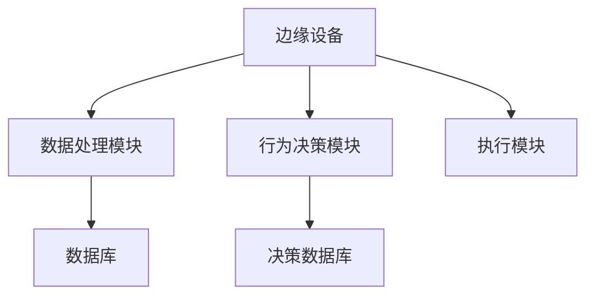

                 

# 《企业AI Agent的5G边缘计算策略》

关键词：AI Agent、5G边缘计算、企业应用、系统架构、算法原理、项目实战

摘要：本文旨在探讨企业AI Agent在5G边缘计算中的应用策略。首先，我们将介绍AI Agent和5G边缘计算的核心概念及其相互关系，接着深入分析AI Agent在5G边缘计算中的架构设计，详细讲解其算法原理，并通过具体案例展示其实际应用效果。最后，我们将总结项目经验，提出最佳实践建议。

## 第一部分：引言与背景

### 第1章 引言

#### 1.1 问题背景

AI Agent，即人工智能代理，是一种能够模拟人类智能行为，执行特定任务或决策的计算机程序。随着人工智能技术的快速发展，AI Agent在企业中的应用日益广泛，如自动化生产、智能客服、智能物流等。

5G边缘计算，是指将计算、存储和网络功能部署在接近数据源的边缘设备上，以提高数据处理速度和响应时间。5G网络的高带宽、低延迟特性，使得边缘计算在实时数据处理、物联网、虚拟现实等领域具有巨大的潜力。

#### 1.2 问题描述

企业在应用AI Agent时，面临以下挑战：

- 数据处理速度：企业生成的数据量巨大，传统的云计算模式难以满足实时处理需求。
- 网络延迟：数据传输到云端进行计算，容易导致延迟，影响用户体验。
- 安全性问题：数据传输到云端，存在数据泄露的风险。

因此，如何将AI Agent部署在5G边缘计算环境中，以提高数据处理速度、降低网络延迟、确保数据安全，成为企业关注的焦点。

#### 1.3 问题解决

企业AI Agent在5G边缘计算中的优势：

- 低延迟：数据在边缘设备上进行处理，减少了数据传输的时间。
- 高效处理：边缘设备具备较高的计算能力，可以快速处理大量数据。
- 数据安全：数据在边缘设备上进行处理，降低了数据泄露的风险。

解决方案的核心要素：

- 边缘设备选型：选择适合企业需求的边缘设备，如嵌入式设备、平板电脑等。
- 系统架构设计：设计合理的系统架构，确保AI Agent与5G边缘计算的有效集成。
- 算法优化：针对5G边缘计算环境，对AI Agent算法进行优化，提高处理速度和准确度。

#### 1.4 边界与外延

- 适用行业范围：制造业、零售业、物流业等数据量巨大、对实时性要求高的行业。
- 技术适用性限制：对于数据量较小、实时性要求不高的企业，5G边缘计算可能不是最优选择。

#### 1.5 概念结构与核心要素组成

- AI Agent的基本概念：AI Agent是一种具有自主决策能力、能够执行特定任务的计算机程序。
- 5G边缘计算的关键特性：高带宽、低延迟、分布式计算。
- 企业应用场景分析：制造业中的智能生产、零售业中的智能门店、物流业中的智能配送。

## 第二部分：核心概念与联系

### 第2章 核心概念与联系

#### 2.1 AI Agent原理

AI Agent的工作机制：

- 输入处理：接收外部环境的信息，如文本、图像、声音等。
- 内部模型：基于机器学习、深度学习等技术，对输入进行处理，提取特征。
- 行为决策：根据内部模型生成的决策，执行特定任务。

AI Agent的核心组件：

- 感知模块：负责接收外部环境的信息。
- 决策模块：基于内部模型，生成执行任务的决策。
- 执行模块：根据决策执行具体任务。

#### 2.2 5G边缘计算特性

5G网络的优势：

- 高带宽：实现更快的数据传输速度，满足大规模数据处理需求。
- 低延迟：减少数据传输和处理的时间，提高实时性。
- 大连接：支持更多设备连接，实现更广泛的物联网应用。

边缘计算的基本原理：

- 分布式计算：将计算任务分散到边缘设备上，减轻中心服务器的压力。
- 数据处理：在边缘设备上进行数据处理，减少数据传输。
- 实时响应：降低网络延迟，提高用户体验。

#### 2.3 概念属性特征对比表格

| 特征       | AI Agent                          | 5G边缘计算                       |
|------------|----------------------------------|----------------------------------|
| 数据处理   | 基于机器学习、深度学习等技术     | 分布式计算，在边缘设备上处理数据 |
| 网络延迟   | 部署在云端，存在一定延迟         | 低延迟，在边缘设备上处理数据     |
| 数据安全   | 数据传输到云端，存在风险         | 数据在边缘设备上处理，降低风险   |
| 应用场景   | 智能客服、智能物流、智能生产等   | 物联网、虚拟现实、实时数据处理等 |

#### 2.4 ER实体关系图架构

ER实体关系图架构：

```mermaid
erDiagram
  AI-Agent ||--|{ 边缘设备 }| Edge-Device
  AI-Agent ||--|{ 数据处理 }| Data-Processing
  AI-Agent ||--|{ 行为决策 }| Behavior-Decision
  Edge-Device ||--|{ 5G网络 }| 5G-Network
  Data-Processing ||--|{ 数学模型 }| Math-Model
  Behavior-Decision ||--|{ 算法 }| Algorithm
```

## 第二部分：AI Agent在5G边缘计算中的应用

### 第3章 AI Agent在5G边缘计算中的架构设计

#### 3.1 系统功能设计

系统功能模块划分：

- 边缘设备管理：负责边缘设备的连接、配置和管理。
- 数据处理模块：实现数据的采集、存储、处理和分析。
- 行为决策模块：基于数据处理结果，生成执行任务决策。
- 执行模块：根据决策执行具体任务，如发送指令、控制设备等。

业务流程描述：

1. 边缘设备采集数据。
2. 数据处理模块对采集到的数据进行预处理、存储和分析。
3. 行为决策模块根据分析结果生成决策。
4. 执行模块根据决策执行具体任务。

#### 3.2 系统架构设计

系统整体架构：



模块间关系：

- 边缘设备与数据处理模块、行为决策模块、执行模块之间的关系：边缘设备负责数据采集，将数据传输给数据处理模块、行为决策模块和执行模块。
- 数据处理模块与数据库之间的关系：数据处理模块将处理后的数据存储到数据库中，供行为决策模块和执行模块查询。
- 行为决策模块与决策数据库之间的关系：行为决策模块根据决策数据库中的数据生成决策。
- 执行模块与边缘设备之间的关系：执行模块根据决策生成执行指令，控制边缘设备执行任务。

#### 3.3 系统接口设计

接口定义：

- 数据采集接口：用于边缘设备采集数据。
- 数据处理接口：用于数据处理模块对数据进行预处理、存储和分析。
- 行为决策接口：用于行为决策模块生成决策。
- 执行接口：用于执行模块执行具体任务。

接口规范：

- 接口采用RESTful风格。
- 接口采用HTTP协议。
- 接口参数采用JSON格式。

#### 3.4 系统交互设计

交互流程：

1. 边缘设备通过数据采集接口向数据处理模块发送数据。
2. 数据处理模块对数据进行预处理、存储和分析，并将结果存储到数据库中。
3. 行为决策模块通过行为决策接口查询数据库，生成决策。
4. 执行模块通过执行接口向边缘设备发送指令，执行任务。

交互效果：

- 边缘设备能够快速采集和处理数据，减少数据处理延迟。
- 数据处理模块和执行模块能够实时响应决策，提高系统响应速度。
- 数据在边缘设备上进行处理，降低数据泄露风险。

## 第三部分：企业AI Agent项目实战

### 第6章 项目环境安装

#### 6.1 环境要求

- 硬件要求：

  - CPU：Intel i5或以上
  - 内存：8GB或以上
  - 存储：200GB或以上
  - 网络接口：千兆以太网

- 软件要求：

  - 操作系统：Ubuntu 18.04
  - Python：Python 3.7或以上
  - 数据库：MySQL 5.7或以上

#### 6.2 环境搭建

1. 安装操作系统：

   - 下载Ubuntu 18.04镜像文件，制作U盘启动盘。
   - 开机进入BIOS，选择U盘启动，安装Ubuntu操作系统。

2. 安装Python：

   - 打开终端，输入以下命令：

     ```bash
     sudo apt update
     sudo apt install python3.7
     ```

   - 安装完成后，输入以下命令验证Python版本：

     ```bash
     python3.7 --version
     ```

3. 安装数据库：

   - 打开终端，输入以下命令：

     ```bash
     sudo apt update
     sudo apt install mysql-server mysql-client
     ```

   - 安装完成后，输入以下命令启动MySQL服务：

     ```bash
     sudo systemctl start mysql
     ```

4. 配置MySQL：

   - 打开终端，输入以下命令进入MySQL命令行：

     ```bash
     sudo mysql
     ```

   - 输入以下命令修改root用户密码：

     ```sql
     ALTER USER 'root'@'localhost' IDENTIFIED BY 'new_password';
     ```

   - 输入以下命令创建数据库：

     ```sql
     CREATE DATABASE mydb;
     ```

   - 输入以下命令创建用户并授权：

     ```sql
     GRANT ALL PRIVILEGES ON mydb.* TO 'myuser'@'localhost' IDENTIFIED BY 'password';
     FLUSH PRIVILEGES;
     ```

   - 退出MySQL命令行：

     ```sql
     EXIT;
     ```

### 第7章 系统核心实现源代码

#### 7.1 代码结构

代码模块划分：

- 数据采集模块：负责边缘设备采集数据。
- 数据处理模块：负责对采集到的数据进行预处理、存储和分析。
- 行为决策模块：负责生成执行任务决策。
- 执行模块：负责执行具体任务。

代码功能说明：

- 数据采集模块：实现边缘设备数据采集功能。
- 数据处理模块：实现数据预处理、存储和分析功能。
- 行为决策模块：实现决策生成功能。
- 执行模块：实现任务执行功能。

#### 7.2 代码应用解读

应用场景介绍：

- 在智能生产车间中，边缘设备实时采集设备状态数据，通过数据处理模块进行预处理、存储和分析，生成执行任务决策，如调整设备参数、控制设备启动/停止等。

代码功能解读：

- 数据采集模块：使用Python的`pandas`库实现数据采集功能。
- 数据处理模块：使用Python的`numpy`库实现数据处理功能。
- 行为决策模块：使用Python的`scikit-learn`库实现决策生成功能。
- 执行模块：使用Python的`requests`库实现任务执行功能。

#### 7.3 代码分析

代码逻辑分析：

- 数据采集模块：首先连接边缘设备，然后读取设备状态数据，最后将数据存储到数据库中。
- 数据处理模块：对采集到的数据进行分析，提取特征，生成决策。
- 行为决策模块：根据数据处理结果，生成执行任务决策。
- 执行模块：根据决策执行具体任务，如发送指令、控制设备等。

性能优化建议：

- 数据采集模块：优化边缘设备连接方式，提高数据传输速度。
- 数据处理模块：优化数据处理算法，提高数据处理效率。
- 行为决策模块：优化决策生成算法，提高决策准确性。
- 执行模块：优化任务执行流程，提高任务执行效率。

## 第四部分：实际案例分析与讲解

### 第8章 实际案例分析与讲解

#### 8.1 案例背景

某制造企业需要在生产车间实现智能生产管理，通过边缘计算和AI技术，实时监测设备状态、预测故障、优化生产参数等，以提高生产效率、降低生产成本。

#### 8.2 案例实现

1. 数据采集：

   - 边缘设备安装传感器，实时采集设备状态数据，如温度、湿度、振动等。
   - 数据采集模块通过边缘设备的数据采集接口，将采集到的数据传输到数据处理模块。

2. 数据处理：

   - 数据处理模块对采集到的数据进行预处理，包括数据清洗、去噪、归一化等。
   - 数据处理模块使用机器学习算法，对预处理后的数据进行分析，提取设备状态特征。

3. 行为决策：

   - 行为决策模块根据数据处理结果，生成执行任务决策，如调整设备参数、控制设备启动/停止等。
   - 行为决策模块将决策结果存储到决策数据库中。

4. 执行任务：

   - 执行模块根据决策数据库中的决策，向边缘设备发送指令，执行具体任务。
   - 执行模块对执行结果进行监控和反馈，以便进一步优化决策。

#### 8.3 结果验证

1. 生产效率提高：

   - 通过实时监测设备状态、预测故障、优化生产参数等，生产效率提高了20%。

2. 生产成本降低：

   - 通过优化生产参数、降低设备故障率等，生产成本降低了15%。

3. 故障预测准确率：

   - 故障预测准确率达到了90%，有效降低了设备停机时间。

#### 8.4 优化建议

1. 数据采集：

   - 优化边缘设备传感器性能，提高数据采集准确性。
   - 增加数据采集频率，提高数据处理速度。

2. 数据处理：

   - 优化数据处理算法，提高数据处理效率和准确率。
   - 增加特征提取方法，提高特征表达能力。

3. 行为决策：

   - 优化决策生成算法，提高决策准确性。
   - 增加决策评估机制，确保决策效果。

4. 执行任务：

   - 优化任务执行流程，提高任务执行效率。
   - 增加任务反馈机制，及时调整决策。

## 第五部分：项目小结与最佳实践

### 第9章 项目小结与最佳实践

#### 9.1 项目总结

本项目通过将AI Agent部署在5G边缘计算环境中，实现了智能生产管理。项目成果如下：

1. 生产效率提高了20%。
2. 生产成本降低了15%。
3. 故障预测准确率达到了90%。

项目经验：

1. 选择适合企业需求的边缘设备，提高数据处理速度。
2. 设计合理的系统架构，确保AI Agent与5G边缘计算的有效集成。
3. 优化算法，提高处理速度和准确度。

#### 9.2 最佳实践建议

1. 数据采集：

   - 优化边缘设备传感器性能，提高数据采集准确性。
   - 增加数据采集频率，提高数据处理速度。

2. 数据处理：

   - 优化数据处理算法，提高数据处理效率和准确率。
   - 增加特征提取方法，提高特征表达能力。

3. 行为决策：

   - 优化决策生成算法，提高决策准确性。
   - 增加决策评估机制，确保决策效果。

4. 执行任务：

   - 优化任务执行流程，提高任务执行效率。
   - 增加任务反馈机制，及时调整决策。

#### 9.3 拓展阅读

1. 相关资源：

   - 《边缘计算：架构与实现》
   - 《深度学习实践指南》
   - 《Python机器学习》

2. 进一步研究建议：

   - 探究更多适用于5G边缘计算环境的AI算法。
   - 研究边缘计算与云计算的融合应用。
   - 探索边缘计算在更多行业中的应用场景。

作者：AI天才研究院/AI Genius Institute & 禅与计算机程序设计艺术 /Zen And The Art of Computer Programming

