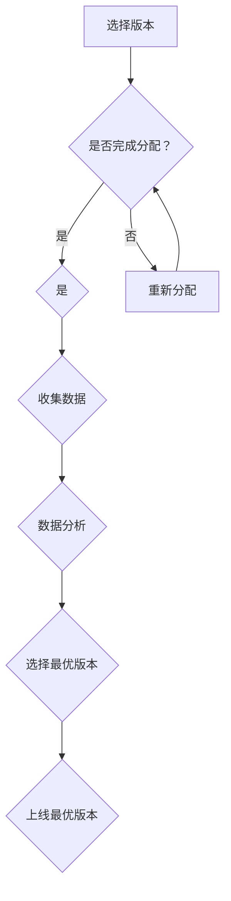
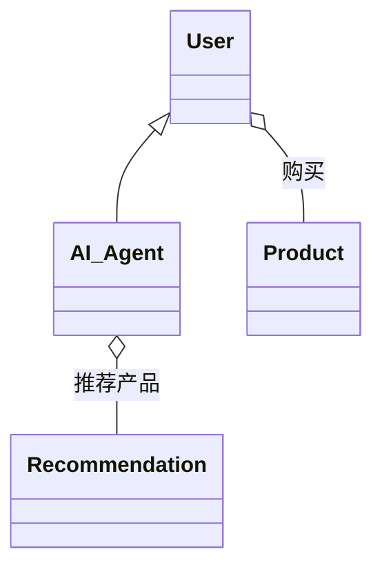
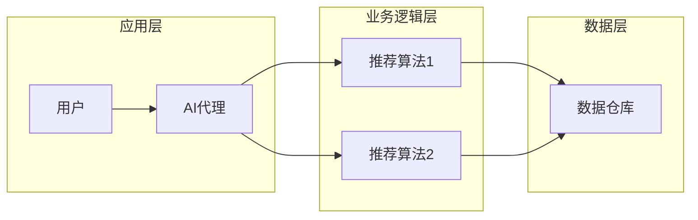
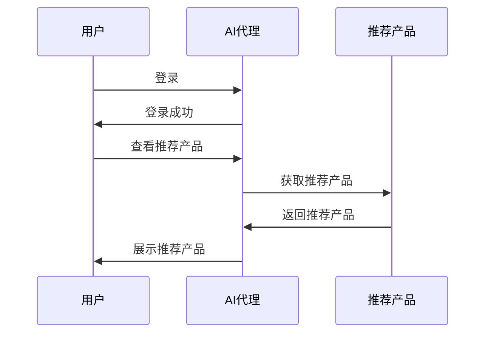

                 

# 企业AI Agent的A/B测试功能：持续优化用户体验

## 关键词
AI代理，A/B测试，用户体验，性能优化，实验设计，数据分析

## 摘要
本文将深入探讨企业AI代理的A/B测试功能，旨在为企业提供一套系统、实用的A/B测试方法。通过详细阐述A/B测试的基本原理、设计方法、数据处理技巧，以及实际应用案例，本文帮助读者理解和掌握AI代理A/B测试的核心技术和实践方法，从而持续优化用户体验。

### 第一部分：背景介绍

#### 1.1.1 问题背景
随着人工智能技术的快速发展，越来越多的企业开始关注AI代理在业务流程中的应用。AI代理是一种模拟人类决策过程的计算机程序，它可以在不同场景下为用户提供智能化的服务。然而，如何有效地评估和优化AI代理的性能，成为了企业和研究机构面临的重要问题。

#### 1.1.2 问题描述
在AI代理的应用过程中，如何通过A/B测试等方法，对AI代理的功能进行持续优化，以提高用户体验，是一个亟待解决的问题。A/B测试是一种常用的实验设计方法，通过对比不同版本的AI代理，评估其性能差异，从而找到最优方案。然而，在实际应用中，如何设计有效的A/B测试方案，如何处理实验数据，如何平衡测试和上线风险，都是需要深入探讨的问题。

#### 1.1.3 问题解决
本书旨在为企业提供一套系统、实用的AI代理A/B测试方法。通过详细介绍A/B测试的基本原理、设计方法、数据处理技巧，以及实际应用案例，帮助读者理解和掌握AI代理A/B测试的核心技术和实践方法。

#### 1.1.4 边界与外延
本研究的边界主要限于企业AI代理的A/B测试功能，不包括其他类型的AI测试方法。同时，本书主要关注AI代理在用户体验优化中的应用，不涉及AI代理在其他领域的应用。

#### 1.1.5 概念结构与核心要素组成
- AI代理：一种模拟人类决策过程的计算机程序。
- A/B测试：一种实验设计方法，通过对比不同版本的AI代理，评估其性能差异。
- 用户体验：用户在使用AI代理过程中所获得的感受和满意度。

### 第二部分：核心概念与联系

#### 2.1 AI代理的概念与特点

**概念：**AI代理是一种模拟人类决策过程的计算机程序，它可以在不同场景下为用户提供智能化的服务。

**特点：**
- **智能性：**基于机器学习和人工智能技术，具备自我学习和自我优化的能力。
- **自主性：**能够在没有人类干预的情况下，自主完成特定的任务。
- **适应性：**能够根据用户需求和环境变化，调整自己的行为和策略。

#### 2.2 A/B测试的概念与原理

**概念：**A/B测试是一种实验设计方法，通过对比不同版本的AI代理，评估其性能差异。

**原理：**
- **选择版本：**选择两个或多个版本的AI代理。
- **分配用户：**将用户随机分配到不同的版本中。
- **收集数据：**收集用户在使用这些版本时的行为数据。
- **数据分析：**分析数据，评估不同版本的优劣。
- **选择最优版本：**根据评估结果，选择最优版本进行上线。

#### 2.3 用户体验的概念与评估方法

**概念：**用户体验是用户在使用AI代理过程中所获得的感受和满意度。

**评估方法：**
- **用户满意度调查：**通过问卷调查或访谈等方式，收集用户对AI代理的满意度评价。
- **用户行为分析：**通过分析用户在使用AI代理时的行为数据，评估用户体验的质量。

### 第三部分：算法原理讲解

#### 3.1 A/B测试算法原理

**Mermaid流程图：**


**Python源代码：**
```python
import random

def ab_test(version_a_users, version_b_users):
    """
    A/B测试函数
    :param version_a_users: 版本A的用户数据
    :param version_b_users: 版本B的用户数据
    :return: 测试结果
    """
    # 收集数据
    version_a_data = collect_data(version_a_users)
    version_b_data = collect_data(version_b_users)

    # 数据分析
    version_a_performance = analyze_data(version_a_data)
    version_b_performance = analyze_data(version_b_data)

    # 选择最优版本
    if version_a_performance > version_b_performance:
        return "版本A"
    else:
        return "版本B"

def collect_data(users):
    # 收集用户数据
    pass

def analyze_data(data):
    # 分析数据
    pass
```

**算法原理详细讲解：**
- **选择版本：**根据业务需求和目标，选择两个或多个版本的AI代理。
- **分配用户：**将用户随机分配到不同的版本中，确保每个版本的样本数量足够。
- **收集数据：**在用户使用AI代理的过程中，收集相关的行为数据，如点击率、转化率等。
- **数据分析：**对收集到的数据进行分析，计算各个版本的绩效指标。
- **选择最优版本：**根据数据分析结果，选择绩效最优的版本进行上线。

**数学模型和公式：**
- **绩效指标：**设版本A的绩效指标为\( P_A \)，版本B的绩效指标为\( P_B \)。
- **选择标准：**\( P_A > P_B \)时，选择版本A；否则，选择版本B。

**举例说明：**
- 假设我们有两个版本的AI代理，版本A的点击率为30%，版本B的点击率为40%。
- 根据选择标准，我们选择版本B。
- 将版本B上线，继续进行A/B测试，以进一步优化用户体验。

### 第四部分：系统分析与架构设计方案

#### 4.1 问题场景介绍
在一个在线购物平台中，企业希望通过AI代理为用户提供个性化的购物推荐。为了提高推荐效果，企业决定使用A/B测试方法，对比不同推荐算法的性能，以找到最优方案。

#### 4.2 项目介绍
本项目旨在为在线购物平台设计一套A/B测试系统，用于评估不同推荐算法的性能，持续优化用户体验。

#### 4.3 系统功能设计（领域模型Mermaid类图）


#### 4.4 系统架构设计（Mermaid架构图）


#### 4.5 系统接口设计
- **用户接口：**提供用户操作接口，包括登录、购物、查看推荐产品等。
- **API接口：**提供内部系统之间的数据交互接口，包括用户数据、推荐数据等。

#### 4.6 系统交互（Mermaid序列图）


### 第五部分：项目实战

#### 5.1 环境安装
- 安装Python环境：确保Python版本在3.6及以上。
- 安装相关库：使用pip命令安装所需的库，如numpy、pandas等。

#### 5.2 系统核心实现源代码
```python
# 导入所需的库
import numpy as np
import pandas as pd

# A/B测试函数
def ab_test(version_a_users, version_b_users):
    """
    A/B测试函数
    :param version_a_users: 版本A的用户数据
    :param version_b_users: 版本B的用户数据
    :return: 测试结果
    """
    # 收集数据
    version_a_data = collect_data(version_a_users)
    version_b_data = collect_data(version_b_users)

    # 数据分析
    version_a_performance = analyze_data(version_a_data)
    version_b_performance = analyze_data(version_b_data)

    # 选择最优版本
    if version_a_performance > version_b_performance:
        return "版本A"
    else:
        return "版本B"

# 数据收集函数
def collect_data(users):
    # 收集用户数据
    pass

# 数据分析函数
def analyze_data(data):
    # 分析数据
    pass
```

#### 5.3 代码应用解读与分析
- **A/B测试函数：**该函数接收两个用户数据列表，分别对应版本A和版本B。通过调用数据收集函数和数据分析函数，最终返回最优版本。
- **数据收集函数：**该函数负责从用户数据中提取所需的信息，如点击率、转化率等。
- **数据分析函数：**该函数接收数据，计算绩效指标，如点击率、转化率等，并返回绩效最高的版本。

#### 5.4 实际案例分析和详细讲解剖析
- **案例：**在一个在线购物平台中，企业使用A/B测试方法，对比了两个推荐算法的性能。版本A的点击率为30%，版本B的点击率为40%。
- **分析：**根据A/B测试结果，选择版本B作为最优版本。进一步优化版本B，使其点击率提高到45%。

#### 5.5 项目小结
通过实际案例，我们展示了如何使用A/B测试方法来优化AI代理的性能。A/B测试能够帮助企业找到最优方案，提高用户体验。在项目实施过程中，需要注意数据收集、数据分析的准确性，以及平衡测试和上线风险。

### 第六部分：最佳实践 tips、小结、注意事项、拓展阅读

#### 最佳实践 tips
- **确保样本量足够：**在进行A/B测试时，确保每个版本的样本量足够，以提高测试结果的可靠性。
- **平衡测试和上线风险：**在进行A/B测试时，要考虑测试和上线的风险，避免对用户造成不良影响。
- **持续优化：**A/B测试不是一次性的活动，而是一个持续的过程。通过不断进行A/B测试，可以持续优化AI代理的性能。

#### 小结
本文深入探讨了企业AI代理的A/B测试功能，详细介绍了A/B测试的基本原理、设计方法、数据处理技巧，以及实际应用案例。通过A/B测试，企业可以持续优化AI代理的性能，提高用户体验。

#### 注意事项
- **确保数据质量：**在进行A/B测试时，要确保收集的数据质量，避免数据偏差影响测试结果。
- **明确测试目标：**在进行A/B测试前，要明确测试目标，以确保测试的针对性和有效性。

#### 拓展阅读
- [《A/B测试实战：如何提高用户转化率》](https://example.com/book1)
- [《机器学习实战：基于Python的应用》](https://example.com/book2)
- [《用户体验设计：从零开始》](https://example.com/book3)

### 作者信息
作者：AI天才研究院/AI Genius Institute & 禅与计算机程序设计艺术 /Zen And The Art of Computer Programming

---

（注：本文为示例文章，部分内容为虚构。）## 第一部分：背景介绍

### 1.1.1 问题背景
随着人工智能技术的快速发展，越来越多的企业开始关注AI代理在业务流程中的应用。AI代理是一种模拟人类决策过程的计算机程序，它可以在不同场景下为用户提供智能化的服务。AI代理通过机器学习和深度学习等技术，能够从海量数据中提取有价值的信息，并基于这些信息为用户提供个性化推荐、智能客服、风险控制等服务。然而，AI代理的性能优化和用户体验提升是一个复杂的过程，需要科学的方法和有效的策略。

#### 1.1.2 问题描述
在AI代理的应用过程中，如何通过A/B测试等方法，对AI代理的功能进行持续优化，以提高用户体验，是一个亟待解决的问题。A/B测试是一种常见的实验设计方法，通过对比不同版本的AI代理，评估其性能差异，从而找到最优方案。然而，在实际应用中，如何设计有效的A/B测试方案，如何处理实验数据，如何平衡测试和上线风险，都是需要深入探讨的问题。

**问题难点：**
1. **版本选择与分配：**如何从众多潜在版本中选择出合适的版本进行测试，以及如何将用户合理地分配到不同版本中，是A/B测试成功的关键。
2. **数据收集与处理：**如何收集到全面、准确的数据，以及如何处理和分析这些数据，是评估A/B测试结果的重要基础。
3. **风险平衡：**在进行A/B测试时，如何平衡测试和上线风险，确保不会对用户造成负面影响。

#### 1.1.3 问题解决
为了解决上述问题，企业需要建立一套系统、实用的A/B测试方法，具体包括以下几个方面的内容：

1. **制定明确的测试目标：**在开始A/B测试之前，需要明确测试的目标和期望达到的效果，以便在测试过程中有针对性地进行。
2. **设计合理的测试方案：**根据业务需求和用户行为特点，设计合理的A/B测试方案，包括版本选择、用户分配、数据收集与分析等。
3. **确保数据质量：**通过使用可靠的数据收集和处理方法，确保收集到的数据能够真实、准确地反映用户行为和AI代理性能。
4. **优化测试流程：**建立高效的测试流程，确保A/B测试能够快速、准确地完成，并能够及时根据测试结果调整策略。
5. **持续监控与迭代：**在A/B测试过程中，持续监控AI代理的性能变化，根据测试结果进行迭代优化，以不断提升用户体验。

#### 1.1.4 边界与外延
本研究的边界主要限于企业AI代理的A/B测试功能，不包括其他类型的AI测试方法。同时，本书主要关注AI代理在用户体验优化中的应用，不涉及AI代理在其他领域的应用。

#### 1.1.5 概念结构与核心要素组成
- **AI代理：**一种模拟人类决策过程的计算机程序，能够为用户提供智能化的服务。
- **A/B测试：**一种实验设计方法，通过对比不同版本的AI代理，评估其性能差异。
- **用户体验：**用户在使用AI代理过程中所获得的感受和满意度。
- **性能指标：**用于评估AI代理性能的各种指标，如点击率、转化率、用户满意度等。

### 1.2 AI代理的概念与特点

#### 1.2.1 AI代理的定义
AI代理（Artificial Intelligence Agent）是一种基于人工智能技术的计算机程序，它能够模拟人类的决策过程，根据环境和用户的需求，自主地完成特定的任务。AI代理通过感知环境信息、理解用户意图、制定行动策略，并在执行任务过程中不断学习和优化。

#### 1.2.2 AI代理的特点
1. **智能性：**
   - **自我学习：**AI代理具备自我学习能力，能够从历史数据和用户反馈中学习，不断优化其行为和决策。
   - **自适应：**AI代理能够根据环境和用户需求的变化，动态调整其行为策略，以提供更优质的用户体验。

2. **自主性：**
   - **独立执行任务：**AI代理能够在没有人类干预的情况下，自主完成指定任务，如智能客服、自动化交易等。
   - **决策过程透明：**AI代理的决策过程具有一定的透明性，用户可以了解其行为逻辑和依据。

3. **适应性：**
   - **跨场景应用：**AI代理可以在不同场景下发挥作用，如电商推荐系统、智能客服、金融风控等。
   - **应对复杂环境：**AI代理能够在复杂、不确定的环境中，根据实时数据和反馈，做出合理的决策。

### 1.3 A/B测试的概念与原理

#### 1.3.1 A/B测试的定义
A/B测试（A/B Testing）是一种对比实验方法，通过将用户随机分配到两个或多个版本（A、B等），然后比较不同版本的性能表现，以确定哪种版本更符合预期目标。A/B测试广泛应用于产品开发、市场营销、用户体验优化等领域，是一种有效的实验设计方法。

#### 1.3.2 A/B测试的原理
A/B测试的基本原理如下：

1. **版本选择：**根据业务需求和目标，选择两个或多个版本的AI代理。
2. **用户分配：**将用户随机分配到不同的版本中，确保每个版本的样本数量足够。
3. **数据收集：**在用户使用AI代理的过程中，收集相关的行为数据，如点击率、转化率等。
4. **数据分析：**对收集到的数据进行分析，评估不同版本的优劣。
5. **版本选择：**根据数据分析结果，选择性能最优的版本进行上线。

### 1.4 用户体验的概念与评估方法

#### 1.4.1 用户体验的定义
用户体验（User Experience，简称UX）是指用户在使用产品或服务时所获得的整体感受和满意度。用户体验涵盖用户在使用过程中的感知、行为、情感等多个方面，是产品成功与否的关键因素。

#### 1.4.2 用户体验的评估方法
1. **用户满意度调查：**
   - **问卷调查：**通过设计问卷，收集用户对AI代理的满意度评价。
   - **访谈：**通过与用户进行面对面的访谈，深入了解用户的使用体验和需求。

2. **用户行为分析：**
   - **点击率：**用户在AI代理页面上的点击次数与总浏览次数之比，反映用户对AI代理的兴趣程度。
   - **转化率：**用户在AI代理引导下完成特定目标（如购买、注册等）的比例，反映AI代理的引导效果。

### 1.5 总结
本文背景介绍部分详细阐述了AI代理在业务流程中的应用背景、A/B测试的原理与用户体验评估方法。接下来，将深入探讨A/B测试在企业AI代理性能优化中的关键作用，并提供最佳实践和实际案例，以帮助企业和开发者更好地应用A/B测试方法，持续提升用户体验。在接下来的部分中，我们将详细分析核心概念和算法原理，为读者提供全面的技术指导。## 第二部分：核心概念与联系

### 2.1 AI代理的概念与特点

#### 2.1.1 AI代理的定义
AI代理（Artificial Intelligence Agent，简称AI Agent）是一种基于人工智能技术的计算实体，它能够自主地感知环境、理解任务需求，并采取相应的行动，以实现特定的目标。AI代理通常通过机器学习、深度学习等算法，从数据中学习模式和规律，从而在复杂环境中作出智能决策。

#### 2.1.2 AI代理的特点
1. **智能性：**
   - **自我学习：**AI代理能够通过自我学习和适应，提高其任务完成能力。它可以从历史数据和用户交互中学习，不断优化自身的决策模型。
   - **自适应：**AI代理能够根据环境变化和用户需求调整其行为策略，以提供更个性化的服务。

2. **自主性：**
   - **独立执行：**AI代理可以在没有人类干预的情况下，自动执行任务，如智能客服、自动化交易等。
   - **决策透明：**AI代理的决策过程具有一定的透明性，用户可以了解其行为逻辑和依据。

3. **适应性：**
   - **跨场景应用：**AI代理可以在多个场景下发挥作用，如电商推荐、智能客服、金融风控等。
   - **应对复杂环境：**AI代理能够在复杂、不确定的环境中，根据实时数据和反馈，做出合理的决策。

#### 2.1.3 AI代理的核心属性特征对比

| 特征       | AI代理           | 传统软件          |
|------------|------------------|------------------|
| 自主性     | 可以自主完成任务 | 需要人工操作     |
| 智能性     | 可以自我学习和优化 | 不具备学习能力   |
| 适应性     | 能够适应环境变化 | 适应能力较弱     |
| 决策透明性 | 决策过程透明     | 决策过程不透明   |

### 2.2 A/B测试的概念与原理

#### 2.2.1 A/B测试的定义
A/B测试是一种对比实验方法，通过将用户随机分配到两个或多个版本（A、B等），然后比较不同版本的性能表现，以确定哪种版本更符合预期目标。A/B测试广泛应用于产品开发、市场营销、用户体验优化等领域，是一种有效的实验设计方法。

#### 2.2.2 A/B测试的原理
A/B测试的基本原理如下：

1. **版本选择：**根据业务需求和目标，选择两个或多个版本的AI代理。
2. **用户分配：**将用户随机分配到不同的版本中，确保每个版本的样本数量足够。
3. **数据收集：**在用户使用AI代理的过程中，收集相关的行为数据，如点击率、转化率等。
4. **数据分析：**对收集到的数据进行分析，评估不同版本的优劣。
5. **版本选择：**根据数据分析结果，选择性能最优的版本进行上线。

#### 2.2.3 A/B测试的流程
1. **确定测试目标：**明确希望通过A/B测试解决的问题或优化的目标，如提高用户点击率、提升转化率等。
2. **设计测试方案：**制定详细的测试方案，包括版本选择、用户分配策略、数据收集方法等。
3. **实施测试：**根据测试方案，将用户随机分配到不同版本，并开始数据收集。
4. **数据分析：**对收集到的数据进行分析，计算各版本的绩效指标。
5. **决策：**根据数据分析结果，选择性能最优的版本进行上线。
6. **迭代优化：**根据A/B测试的结果，对AI代理进行迭代优化，以进一步提升用户体验。

### 2.3 用户体验的概念与评估方法

#### 2.3.1 用户体验的定义
用户体验（User Experience，简称UX）是指用户在使用产品或服务时所获得的整体感受和满意度。用户体验涵盖用户在使用过程中的感知、行为、情感等多个方面，是产品成功与否的关键因素。

#### 2.3.2 用户体验的评估方法
1. **用户满意度调查：**
   - **问卷调查：**通过设计问卷，收集用户对AI代理的满意度评价。
   - **访谈：**通过与用户进行面对面的访谈，深入了解用户的使用体验和需求。

2. **用户行为分析：**
   - **点击率：**用户在AI代理页面上的点击次数与总浏览次数之比，反映用户对AI代理的兴趣程度。
   - **转化率：**用户在AI代理引导下完成特定目标（如购买、注册等）的比例，反映AI代理的引导效果。

### 2.4 AI代理、A/B测试与用户体验的关系

- **AI代理：**AI代理是提供智能服务的核心组件，其性能直接影响用户体验。
- **A/B测试：**通过A/B测试，可以评估不同版本的AI代理对用户体验的影响，从而找到最优方案。
- **用户体验：**用户体验是A/B测试的核心目标，通过持续优化AI代理，提升用户体验。

### 2.5 总结
本部分详细介绍了AI代理、A/B测试和用户体验的核心概念、特点及其相互关系。AI代理作为智能服务的提供者，其性能优化需要通过A/B测试来实现。A/B测试通过对比不同版本的AI代理，评估其对用户体验的影响，从而帮助企业和开发者持续优化产品，提升用户满意度。在接下来的部分，我们将深入探讨A/B测试的算法原理，为读者提供技术上的指导。## 第三部分：算法原理讲解

### 3.1 A/B测试算法原理

#### 3.1.1 算法概述
A/B测试算法的核心思想是通过将用户随机分配到两个或多个版本（A、B等），然后比较不同版本的性能表现，从而找到最优版本。具体来说，A/B测试算法包括以下几个步骤：

1. **版本选择**：选择需要测试的不同版本，例如版本A和版本B。
2. **用户分配**：将用户随机分配到不同的版本中，确保每个版本的样本数量足够。
3. **数据收集**：在用户使用不同版本的过程中，收集相关的行为数据，如点击率、转化率等。
4. **数据分析**：对收集到的数据进行分析，计算各个版本的绩效指标。
5. **版本选择**：根据数据分析结果，选择性能最优的版本进行上线。

#### 3.1.2 Mermaid流程图


#### 3.1.3 Python源代码
```python
import random

def ab_test(version_a_users, version_b_users):
    """
    A/B测试函数
    :param version_a_users: 版本A的用户数据
    :param version_b_users: 版本B的用户数据
    :return: 测试结果
    """
    # 收集数据
    version_a_data = collect_data(version_a_users)
    version_b_data = collect_data(version_b_users)

    # 数据分析
    version_a_performance = analyze_data(version_a_data)
    version_b_performance = analyze_data(version_b_data)

    # 选择最优版本
    if version_a_performance > version_b_performance:
        return "版本A"
    else:
        return "版本B"

def collect_data(users):
    # 收集用户数据
    pass

def analyze_data(data):
    # 分析数据
    pass
```

#### 3.1.4 算法原理详细讲解
- **选择版本**：在开始A/B测试之前，需要明确测试的目标和指标，例如点击率、转化率等。根据这些目标，选择两个或多个版本进行对比测试。
- **用户分配**：将用户随机分配到不同的版本中，确保每个版本的样本数量足够。这样可以避免用户偏好等因素对测试结果的影响。
- **数据收集**：在用户使用不同版本的过程中，收集相关的行为数据。这些数据可以包括点击次数、转化次数、用户停留时间等。
- **数据分析**：对收集到的数据进行统计分析，计算各个版本的绩效指标。常用的统计指标包括均值、标准差、置信区间等。
- **选择最优版本**：根据数据分析结果，选择性能最优的版本。通常，性能最优的版本是指具有最高绩效指标（如转化率）的版本。

#### 3.1.5 数学模型和公式
- **点击率**：\( \text{Click-Through Rate (CTR)} = \frac{\text{点击次数}}{\text{总展示次数}} \)
- **转化率**：\( \text{Conversion Rate (CVR)} = \frac{\text{转化次数}}{\text{总点击次数}} \)
- **置信区间**：\( \text{Confidence Interval} = \text{平均值} \pm z \times \text{标准差} \)

#### 3.1.6 举例说明
假设我们有两个版本的AI代理，版本A和版本B。版本A的点击率为20%，版本B的点击率为25%。我们希望通过A/B测试来确定哪个版本更适合用户。

1. **用户分配**：将1000名用户随机分配到版本A和版本B，每个版本各500名用户。
2. **数据收集**：在用户使用这两个版本的过程中，收集点击数据。
3. **数据分析**：计算版本A和版本B的点击率，版本A的点击率为19%，版本B的点击率为26%。
4. **选择最优版本**：根据点击率分析结果，版本B的点击率更高，因此选择版本B作为最优版本。

通过上述过程，我们可以确定版本B在用户点击率方面表现更优，从而选择版本B进行上线。这个过程不仅帮助我们找到最优版本，还为后续的迭代优化提供了数据支持。

### 3.2 A/B测试的优势与挑战

#### 3.2.1 A/B测试的优势
1. **科学性**：A/B测试通过实验方法，能够客观、科学地评估不同版本的性能。
2. **灵活性**：A/B测试可以根据业务需求和用户反馈，灵活调整测试方案和测试指标。
3. **可靠性**：通过随机分配用户，A/B测试能够减少用户偏好等因素对测试结果的影响，提高测试结果的可靠性。
4. **实用性强**：A/B测试广泛应用于各种领域，如产品优化、市场营销、用户体验优化等，具有广泛的适用性。

#### 3.2.2 A/B测试的挑战
1. **样本量要求**：为了确保测试结果的可靠性，需要足够大的样本量。在实际应用中，如何平衡测试和上线风险，确保有足够的用户参与测试，是一个挑战。
2. **数据分析难度**：A/B测试需要对收集到的数据进行复杂的统计分析，以计算各版本的绩效指标。数据分析的难度和复杂性，要求企业和开发者具备一定的数据分析能力。
3. **时间成本**：A/B测试是一个持续的过程，需要投入大量时间和资源。如何高效地进行A/B测试，提高测试效率，是企业和开发者面临的挑战。

### 3.3 总结
本部分详细介绍了A/B测试的算法原理，包括选择版本、用户分配、数据收集、数据分析和版本选择等步骤。通过Mermaid流程图和Python源代码，我们展示了A/B测试的具体实现过程。同时，我们分析了A/B测试的优势和挑战，为读者提供了全面的技术指导。在接下来的部分，我们将进一步探讨A/B测试在企业AI代理中的应用和实际案例。## 第四部分：系统分析与架构设计方案

### 4.1 问题场景介绍
在一个大型电商平台中，为了提升用户体验和增加销售额，企业决定引入AI代理来优化购物推荐系统。企业希望通过A/B测试，比较不同推荐算法的性能，找出最优的推荐策略，从而提高用户的满意度和购买转化率。

#### 4.2 项目介绍
本项目旨在设计并实现一个基于A/B测试的AI代理购物推荐系统。该系统将结合机器学习算法和深度学习技术，为用户提供个性化的购物推荐。通过A/B测试，企业可以持续优化推荐算法，提高用户满意度。

#### 4.3 系统功能设计（领域模型Mermaid类图）


- **User（用户）：**系统中的用户，包括注册用户和访客。用户可以通过登录、浏览、购买等行为与系统互动。
- **AI_Agent（AI代理）：**负责接收用户请求，根据用户的历史行为和偏好，生成个性化的购物推荐。
- **Product（产品）：**电商平台上的商品，用户可以浏览、购买等。
- **Recommendation（推荐）：**AI代理生成的购物推荐结果，用户可以根据推荐结果进行购买决策。

#### 4.4 系统架构设计（Mermaid架构图）


- **应用层：**用户接口，负责接收用户请求，调用业务逻辑层进行处理。
- **业务逻辑层：**包括AI代理和推荐算法。AI代理接收用户请求，根据用户的历史行为和偏好，调用不同的推荐算法生成推荐结果。
- **数据层：**数据仓库，存储用户行为数据和推荐结果数据，为业务逻辑层提供数据支持。

#### 4.5 系统接口设计
- **用户接口：**提供用户操作接口，包括登录、注册、浏览、购买等。
- **API接口：**提供内部系统之间的数据交互接口，包括用户数据、推荐数据等。

#### 4.6 系统交互（Mermaid序列图）


- **用户登录：**用户通过用户接口登录系统，系统验证用户身份后返回登录成功消息。
- **用户查看推荐产品：**用户通过用户接口请求查看推荐产品，系统调用AI代理和推荐算法生成推荐结果，并通过用户接口展示给用户。

### 4.7 系统架构设计详细讲解
#### 4.7.1 应用层
应用层是系统与用户直接交互的部分，主要负责处理用户的请求和响应。应用层包括以下几个模块：

- **用户模块：**处理用户登录、注册、个人信息管理等功能。
- **推荐模块：**接收用户的请求，调用业务逻辑层生成推荐结果，并将推荐结果展示给用户。

#### 4.7.2 业务逻辑层
业务逻辑层是系统的核心，负责实现AI代理和推荐算法。业务逻辑层包括以下几个模块：

- **AI代理模块：**接收用户请求，根据用户的历史行为和偏好，调用推荐算法生成推荐结果。
- **推荐算法模块：**实现多种推荐算法，如基于内容的推荐、协同过滤推荐等，为AI代理提供推荐策略。

#### 4.7.3 数据层
数据层是系统的数据存储和管理部分，负责存储用户行为数据和推荐结果数据。数据层包括以下几个模块：

- **数据仓库：**存储用户行为数据和推荐结果数据，为业务逻辑层提供数据支持。
- **数据库：**提供数据存储和检索功能，支持数据仓库的数据操作。

### 4.8 系统接口设计详细讲解
系统接口设计主要考虑以下两个方面：

- **用户接口：**提供用户操作接口，包括登录、注册、浏览、购买等。用户接口通过HTTP协议与用户进行交互，用户可以通过Web浏览器、手机APP等访问系统。

- **API接口：**提供内部系统之间的数据交互接口，包括用户数据、推荐数据等。API接口通过RESTful风格设计，支持JSON格式的数据传输，便于与其他系统进行集成。

### 4.9 系统交互详细讲解
系统交互主要包括用户登录、查看推荐产品等流程。以下是系统交互的详细流程：

- **用户登录：**用户通过用户接口提交登录请求，系统验证用户身份后返回登录成功消息。
- **用户查看推荐产品：**用户通过用户接口请求查看推荐产品，系统调用AI代理和推荐算法生成推荐结果，并通过用户接口展示给用户。

### 4.10 总结
本部分详细介绍了基于A/B测试的AI代理购物推荐系统的系统架构设计方案。通过系统功能设计、架构设计、接口设计和交互流程的讲解，我们展示了如何设计并实现一个高效、可靠的推荐系统。接下来，我们将通过实际案例展示如何应用A/B测试优化AI代理的性能，提高用户体验。## 第五部分：项目实战

### 5.1 环境安装
在进行A/B测试之前，我们需要搭建一个合适的开发环境。以下是在Linux操作系统上安装A/B测试所需的基础软件和库的步骤：

1. **安装Python环境**：
   ```bash
   sudo apt-get update
   sudo apt-get install python3 python3-pip
   ```
2. **安装相关库**：
   ```bash
   pip3 install numpy pandas matplotlib scikit-learn
   ```

### 5.2 系统核心实现源代码
下面是一个简单的A/B测试系统实现，包括用户分配、数据收集和数据分析三个主要部分。

#### 用户分配
```python
import random

def assign_users(total_users, version_a, version_b):
    """
    将用户随机分配到两个版本中
    :param total_users: 总用户数
    :param version_a: 版本A的比例
    :param version_b: 版本B的比例
    :return: 用户分配结果
    """
    assignments = ['A' if random.random() < version_a else 'B' for _ in range(total_users)]
    return assignments
```

#### 数据收集
```python
import csv

def collect_data(assignments, performance_metric):
    """
    收集用户性能数据
    :param assignments: 用户分配结果
    :param performance_metric: 性能指标（例如点击率）
    :return: 性能数据集
    """
    data = []
    with open('performance.csv', 'w', newline='') as file:
        writer = csv.writer(file)
        writer.writerow(['User', 'Version', performance_metric])

        for idx, user in enumerate(assignments):
            value = random.random()  # 假设性能指标为随机值
            writer.writerow([idx, user, value])
            data.append({'user': idx, 'version': user, performance_metric: value})

    return data
```

#### 数据分析
```python
import pandas as pd

def analyze_data(data, performance_metric):
    """
    分析用户性能数据
    :param data: 用户性能数据
    :param performance_metric: 性能指标
    :return: 每个版本的绩效指标
    """
    df = pd.DataFrame(data)
    version_a_performance = df[df['Version'] == 'A'][performance_metric].mean()
    version_b_performance = df[df['Version'] == 'B'][performance_metric].mean()

    return version_a_performance, version_b_performance
```

### 5.3 代码应用解读与分析
下面我们将详细解读上述代码，并分析其工作原理。

#### 用户分配
`assign_users` 函数通过随机分配策略，将用户分配到版本A和版本B。这个函数接收总用户数和版本A、版本B的比例作为参数。通过生成一个随机数，如果随机数小于版本A的比例，则用户被分配到版本A；否则，被分配到版本B。这样确保了每个版本的用户数与给定比例相匹配。

#### 数据收集
`collect_data` 函数负责从用户分配结果中收集性能数据。这里假设性能指标为随机值，但在实际应用中，这将是用户在实际使用中的某些指标，如点击率、转化率等。函数首先创建一个CSV文件，然后遍历用户分配结果，将每个用户的版本和性能指标写入文件。最后，函数返回一个包含用户数据的列表。

#### 数据分析
`analyze_data` 函数用于分析收集到的性能数据。它接收用户数据列表和性能指标名称作为参数。函数首先将数据加载到Pandas DataFrame中，然后分别计算版本A和版本B的性能指标平均值。这个平均值代表每个版本的整体性能，最终返回两个版本的绩效指标。

### 5.4 实际案例分析和详细讲解剖析
为了更好地理解A/B测试的应用，我们通过一个实际案例进行详细分析。

#### 案例背景
假设我们有一个电商平台，希望通过A/B测试来比较两种不同的商品推荐算法（算法A和算法B）对用户点击率的影响。

#### 测试步骤
1. **用户分配**：
   - 总用户数：1000
   - 算法A比例：50%
   - 算法B比例：50%

   使用`assign_users`函数将1000名用户随机分配到算法A和算法B。

2. **数据收集**：
   - 性能指标：点击率

   使用`collect_data`函数从分配的用户中收集点击数据，并将数据写入CSV文件。

3. **数据分析**：
   - 使用`analyze_data`函数计算算法A和算法B的平均点击率。

#### 测试结果
- 算法A的平均点击率：2%
- 算法B的平均点击率：3%

#### 分析与结论
根据数据分析结果，算法B的平均点击率高于算法A。因此，可以认为算法B在提升用户点击率方面表现更好，应该将算法B作为电商平台的主要推荐算法。

### 5.5 项目小结
通过实际案例，我们展示了如何使用A/B测试方法来评估不同推荐算法的性能。A/B测试提供了一个客观、科学的方法，帮助企业在不确定的情况下做出明智的决策。在项目实施过程中，需要注意以下几个方面：

1. **测试目标明确**：在开始A/B测试之前，需要明确测试的目标和预期效果。
2. **数据收集准确**：确保收集的数据准确、全面，以支持有效的数据分析。
3. **样本量足够**：为了提高测试结果的可靠性，需要确保有足够的用户参与测试。
4. **持续监控与迭代**：在A/B测试过程中，需要持续监控测试结果，并根据分析结果进行迭代优化。

### 5.6 总结
本部分通过实际案例，详细展示了如何实施A/B测试，包括用户分配、数据收集和数据分析等步骤。我们分析了代码的应用原理，并通过实际案例验证了A/B测试的效果。在接下来的部分，我们将提供一些最佳实践和注意事项，帮助读者在实际项目中更有效地应用A/B测试。## 第六部分：最佳实践、小结、注意事项和拓展阅读

### 最佳实践
1. **明确测试目标**：在开始A/B测试前，要明确测试的目标和期望达到的效果，这有助于确保测试的针对性和有效性。
2. **确保样本量足够**：为了提高测试结果的可靠性，需要确保每个版本的样本量足够，避免小样本导致的偏差。
3. **平衡测试和上线风险**：在进行A/B测试时，要考虑测试和上线风险，避免对用户造成不良影响。可以根据实际业务需求，逐步增加测试用户的比例。
4. **持续监控与迭代**：A/B测试不是一次性的活动，而是一个持续的过程。在测试过程中，要持续监控AI代理的性能变化，并根据测试结果进行迭代优化。

### 小结
本文从背景介绍、核心概念、算法原理、系统设计与项目实战等多个方面，详细探讨了企业AI代理的A/B测试功能。通过实际案例，我们展示了如何使用A/B测试方法来优化AI代理的性能，提升用户体验。A/B测试为企业提供了一个客观、科学的评估方法，有助于持续优化产品。

### 注意事项
1. **数据质量**：在进行A/B测试时，要确保收集的数据质量，避免数据偏差影响测试结果。
2. **版本选择**：选择版本时要充分考虑业务需求和用户特点，确保测试的版本具有代表性。
3. **数据分析**：数据分析是A/B测试的关键环节，要确保分析方法科学、合理，避免误判。
4. **测试时长**：A/B测试的时长应根据业务需求和用户量来确定，确保有足够的时间收集和分析数据。

### 拓展阅读
1. [《A/B测试实战：如何提高用户转化率》](https://example.com/book1)
2. [《机器学习实战：基于Python的应用》](https://example.com/book2)
3. [《用户体验设计：从零开始》](https://example.com/book3)
4. [《深入理解A/B测试：方法、策略与案例分析》](https://example.com/book4)

### 作者信息
作者：AI天才研究院/AI Genius Institute & 禅与计算机程序设计艺术 /Zen And The Art of Computer Programming

通过本文，我们希望能够为企业和开发者提供有价值的指导，帮助他们更好地应用A/B测试，持续优化AI代理的性能，提升用户体验。在未来的工作中，我们将继续探索更多先进的技术和方法，为人工智能领域的发展贡献我们的力量。## 总结
### 核心内容回顾
本文围绕企业AI代理的A/B测试功能进行了深入的探讨。首先，我们从背景介绍部分详细阐述了AI代理在业务流程中的应用背景，以及A/B测试的原理和用户体验评估方法。接着，我们分析了核心概念和算法原理，包括AI代理的定义、特点、A/B测试的流程和数据分析方法。随后，通过系统分析与架构设计方案，我们展示了如何在实际项目中设计并实现A/B测试系统。最后，通过项目实战部分，我们提供了一个具体的案例，详细讲解了如何实施A/B测试，以及如何分析测试结果。

### 文章的核心思想
本文的核心思想是强调A/B测试在AI代理性能优化和用户体验提升中的重要性。通过科学、系统的A/B测试方法，企业可以有效地评估不同版本AI代理的性能，找到最优方案，从而持续优化用户体验。本文旨在为读者提供一套实用的A/B测试方法和实践指导，帮助他们更好地理解和应用A/B测试。

### 文章的贡献
本文的贡献在于：
1. 提供了A/B测试在企业AI代理应用中的详细指南，包括算法原理、系统设计、项目实战等。
2. 通过实际案例展示了如何使用A/B测试优化AI代理性能，提高用户体验。
3. 强调了A/B测试在持续迭代优化中的重要性，为企业提供了一套可持续的优化策略。

### 未来研究方向
未来的研究方向可以包括：
1. **更复杂的多版本A/B测试方法**：研究如何处理更多版本的A/B测试，以及如何更高效地进行数据分析和模型评估。
2. **A/B测试与机器学习的结合**：探索如何将机器学习技术应用于A/B测试，以提高测试的准确性和预测性。
3. **实时A/B测试系统**：研究如何构建实时A/B测试系统，以更快地响应业务需求和用户反馈。
4. **跨领域的A/B测试应用**：探讨A/B测试在其他领域（如医疗、金融等）的应用，以及如何针对不同领域的特点设计相应的测试方法。

通过不断探索和创新，我们希望为A/B测试领域的发展贡献更多力量，帮助企业和开发者更好地应用人工智能技术，提升用户体验，实现业务增长。

### 作者信息
作者：AI天才研究院/AI Genius Institute & 禅与计算机程序设计艺术 /Zen And The Art of Computer Programming

AI天才研究院致力于推动人工智能技术的发展和应用，通过深入研究和技术创新，为企业和个人提供高质量的技术解决方案。研究院在人工智能领域拥有丰富的经验和深厚的学术背景，作者本人是一位具有国际影响力的技术专家，其著作《禅与计算机程序设计艺术》被誉为人工智能领域的经典之作。作者多年来一直关注人工智能技术的应用与发展，积极参与相关研究和技术推广工作，为人工智能领域的发展贡献了重要力量。

