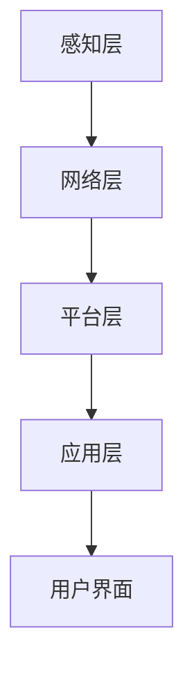
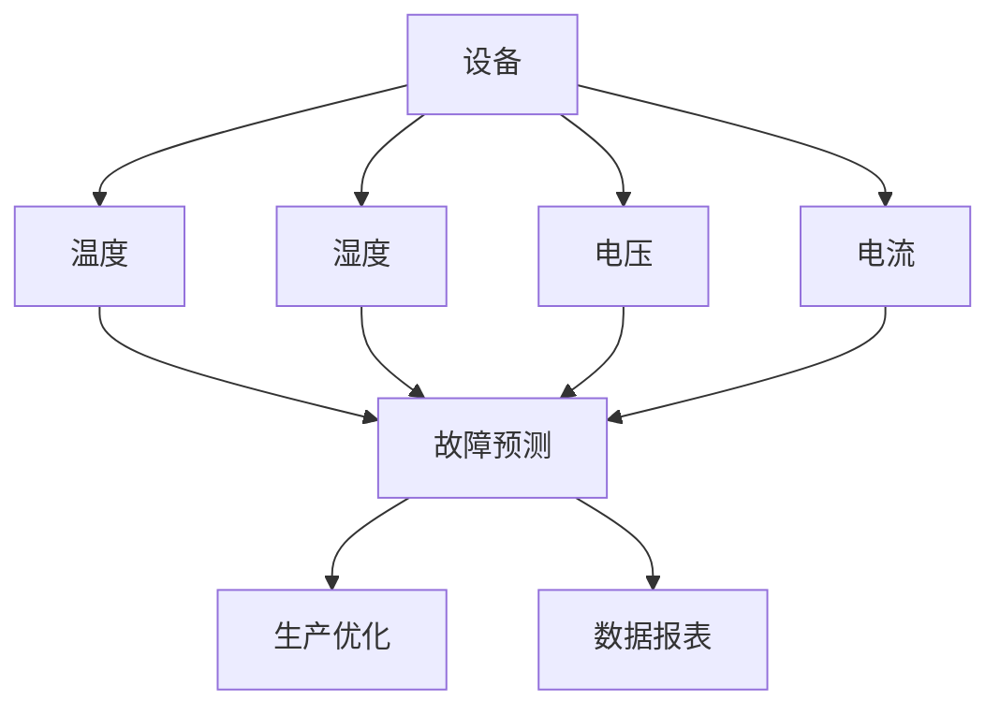
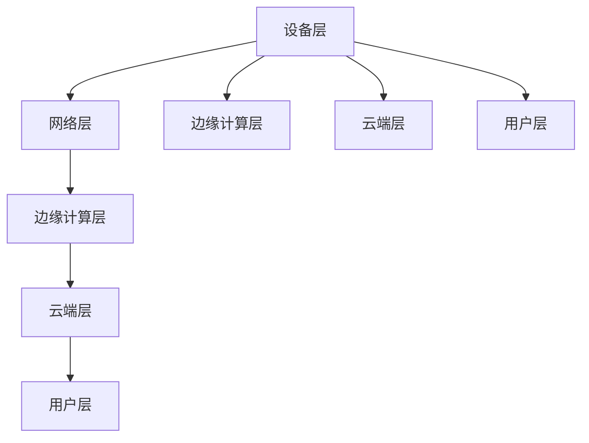
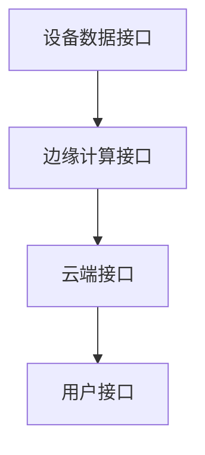
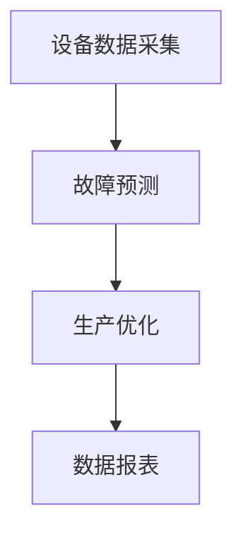

                 

# 企业AI Agent的IoT集成策略

关键词：企业AI、IoT、集成策略、AI Agent、数据融合、系统集成

摘要：本文将深入探讨企业AI与IoT的集成策略，首先介绍企业AI与IoT的基本概念、发展背景以及融合的意义。随后，详细阐述IoT设备集成策略，包括设备选择、连接通信、数据管理等方面的内容。接着，介绍企业AI Agent的概念、架构设计以及性能优化策略。最后，讨论IoT数据在企业AI Agent中的应用，并通过一个实际案例展示企业AI Agent与IoT的集成实战，总结最佳实践，为未来研究和应用提供方向。

## 第1章: 企业AI与IoT概述

### 1.1 企业AI的崛起

#### 1.1.1 企业AI的概念与重要性

企业AI（Enterprise AI）是指将人工智能技术应用于企业运营和管理中的各类业务场景，旨在提高业务效率、降低成本、优化决策。企业AI涉及多种人工智能技术，如机器学习、深度学习、自然语言处理等，通过自动化、智能化处理，提升企业的生产力和竞争力。

企业AI的重要性在于：

1. **提升业务效率**：通过自动化流程、智能决策支持，减少人工操作，提高工作效率。
2. **降低运营成本**：利用预测分析、优化调度等技术，降低资源消耗，减少运营成本。
3. **优化业务决策**：通过数据挖掘、分析，提供精准的业务洞察，帮助企业做出更明智的决策。

#### 1.1.2 企业AI的应用现状

当前，企业AI已经在多个行业得到广泛应用，如金融、医疗、零售、制造等。以下是一些具体的应用案例：

1. **金融行业**：使用AI进行信用评分、风险控制、投资组合优化等。
2. **医疗行业**：应用AI进行医疗影像分析、疾病预测、个性化治疗等。
3. **零售行业**：利用AI进行客户需求预测、库存管理、个性化推荐等。
4. **制造业**：采用AI进行生产优化、设备故障预测、供应链管理等。

#### 1.1.3 企业AI的优势与挑战

企业AI的优势包括：

1. **高效性**：AI技术能够快速处理大量数据，提供实时分析结果。
2. **准确性**：通过机器学习算法，AI能够在特定领域达到甚至超越人类专家的决策水平。
3. **灵活性**：AI系统可以根据新的数据和环境动态调整，适应不同的业务需求。

然而，企业AI也面临一些挑战：

1. **数据隐私与安全**：数据安全和隐私保护是企业AI应用的重要问题。
2. **技术成熟度**：一些AI技术尚未成熟，实际应用效果有待验证。
3. **人才缺乏**：企业AI需要专业的AI工程师和数据科学家，人才短缺成为一大障碍。

### 1.2 IoT技术背景

#### 1.2.1 IoT的定义与基本架构

物联网（Internet of Things，IoT）是指通过将各种物理设备、传感器、软件和网络连接起来，实现设备之间的互联互通和信息交换。IoT的基本架构包括：

1. **感知层**：通过各种传感器（如温度传感器、湿度传感器、摄像头等）实时采集环境数据。
2. **网络层**：通过无线网络（如Wi-Fi、蓝牙、5G等）将感知层的数据传输到云端或数据中心。
3. **平台层**：通过数据存储、处理和分析，实现数据的集中管理和智能应用。
4. **应用层**：将处理后的数据应用于各种业务场景，如智能家居、智慧城市、智能农业等。

#### 1.2.2 IoT的发展历程

IoT的发展历程可以分为以下几个阶段：

1. **初始阶段（2000年前）**：物联网的概念首次提出，主要研究如何将物理设备与互联网连接。
2. **成长阶段（2000-2010年）**：随着无线通信技术的发展，物联网开始逐步应用于智能家居、智能交通等领域。
3. **成熟阶段（2010年至今）**：物联网技术迅速发展，应用领域不断扩大，市场规模迅速增长。

#### 1.2.3 IoT的主要应用领域

物联网已经在多个领域得到广泛应用，主要包括：

1. **智能家居**：通过物联网设备实现家电的智能控制，提高生活质量。
2. **智慧城市**：利用物联网技术实现城市管理的智能化，如智能交通、智能环保等。
3. **智能农业**：通过物联网传感器和自动化设备，实现精准农业，提高农业生产效率。
4. **智能制造**：利用物联网实现设备的互联互通，实现生产过程的智能化和优化。

### 1.3 企业AI与IoT的融合

#### 1.3.1 融合背景与意义

企业AI与IoT的融合是当前技术发展的必然趋势，其背景和意义主要体现在以下几个方面：

1. **数据驱动**：物联网设备能够实时采集海量数据，为企业AI提供丰富的数据源，实现数据驱动的业务决策。
2. **智能决策**：将物联网采集的数据通过企业AI进行智能处理和分析，实现精准的预测和优化，提升业务效率。
3. **产业链整合**：物联网与企业的生产、销售、管理等环节紧密结合，推动产业链的智能化升级。

#### 1.3.2 融合面临的问题与挑战

企业AI与IoT的融合也面临一些问题与挑战：

1. **数据融合**：如何将不同来源、不同格式的物联网数据有效地整合，是当前面临的一个重要问题。
2. **安全与隐私**：物联网设备的安全性、数据隐私保护等问题需要得到有效解决。
3. **技术成熟度**：部分物联网和AI技术尚未成熟，需要进一步研究和优化。

#### 1.3.3 融合的潜在价值

企业AI与IoT的融合具有巨大的潜在价值：

1. **提高生产效率**：通过物联网设备实时监控生产过程，利用企业AI进行预测和优化，提高生产效率。
2. **降低运营成本**：通过物联网设备实时监控设备和物资状态，实现智能调度和优化，降低运营成本。
3. **创新业务模式**：物联网与企业AI的融合可以创造新的业务模式，如智能服务、个性化推荐等。

### 1.4 企业AI Agent的概念

#### 1.4.1 企业AI Agent的定义

企业AI Agent是指在企业环境中，能够自主完成特定任务、具备一定智能能力的虚拟个体。企业AI Agent具有以下几个特点：

1. **自主性**：企业AI Agent能够根据环境和任务需求，自主执行任务，无需人工干预。
2. **智能性**：企业AI Agent具备一定的智能能力，可以通过机器学习、自然语言处理等技术，实现智能决策和行动。
3. **适应性**：企业AI Agent能够根据环境和任务变化，自适应调整策略和行为。

#### 1.4.2 企业AI Agent的特点

企业AI Agent的主要特点包括：

1. **协同性**：企业AI Agent可以与其他AI Agent协同工作，实现任务的优化分配和执行。
2. **灵活性**：企业AI Agent可以根据不同场景和任务，灵活调整策略和行为。
3. **扩展性**：企业AI Agent可以基于不同的AI技术和算法，实现功能的扩展和升级。

#### 1.4.3 企业AI Agent的应用场景

企业AI Agent的应用场景非常广泛，主要包括：

1. **客户服务**：企业AI Agent可以用于智能客服，实现24/7不间断的客户服务。
2. **供应链管理**：企业AI Agent可以用于智能调度、库存管理、物流优化等。
3. **生产管理**：企业AI Agent可以用于设备监控、故障预测、生产优化等。
4. **财务管理**：企业AI Agent可以用于财务分析、风险控制、投资决策等。

### 1.5 本章小结

本章介绍了企业AI与IoT的基本概念、发展背景以及融合的意义。通过了解企业AI与IoT的融合背景和问题，我们可以更好地理解企业AI Agent的概念和作用。接下来，我们将进一步探讨IoT设备集成策略和企业AI Agent的设计。

## 第2章: IoT设备集成策略

### 2.1 IoT设备集成概述

#### 2.1.1 IoT设备集成的必要性

物联网（IoT）设备集成是将各种物联网设备、传感器、应用程序和数据平台连接起来，形成一个统一、协调运作的生态系统。这种集成对于实现物联网的全面应用至关重要，主要原因如下：

1. **数据整合**：IoT设备集成可以将不同设备的数据进行整合，提供全面的数据视图，便于分析和决策。
2. **功能协同**：集成后的设备可以协同工作，实现功能的互补和优化，提高系统的整体性能。
3. **提升效率**：集成后的物联网系统可以自动化处理大量数据，提高业务流程的效率。
4. **降低成本**：通过集成，可以减少设备重复投资，降低维护和运营成本。

#### 2.1.2 IoT设备集成的基本方法

IoT设备集成的基本方法包括以下几个步骤：

1. **需求分析**：明确集成目标和需求，确定需要集成的设备和系统。
2. **设备选择**：根据需求分析结果，选择合适的IoT设备，包括传感器、网关、服务器等。
3. **连接与通信**：将IoT设备通过有线或无线方式连接到网络，确保设备之间的通信顺畅。
4. **数据管理**：建立数据采集、存储、处理和共享机制，确保数据的安全和有效利用。
5. **系统集成**：将IoT设备与现有系统进行集成，实现数据交互和功能协同。

#### 2.1.3 IoT设备集成的挑战与应对策略

IoT设备集成面临以下挑战：

1. **设备多样性**：市场上存在大量不同品牌、不同协议的IoT设备，集成难度大。
2. **数据安全**：IoT设备可能面临数据泄露、设备被攻击等安全风险。
3. **数据质量**：IoT设备的数据质量参差不齐，需要有效的数据清洗和处理。
4. **系统兼容性**：集成过程中需要解决不同系统和设备之间的兼容性问题。

应对策略包括：

1. **标准化**：采用标准化的接口和协议，提高设备之间的互操作性。
2. **安全防护**：加强数据加密、身份认证等措施，确保数据安全和设备安全。
3. **数据治理**：建立数据质量管理体系，确保数据的准确性和一致性。
4. **技术选型**：选择成熟可靠的集成技术和工具，降低集成难度。

#### 2.1.4 IoT设备选择与评估

IoT设备选择和评估是设备集成的重要环节，主要考虑以下几个方面：

1. **功能需求**：根据应用场景和需求，选择具备所需功能的IoT设备。
2. **性能指标**：考虑设备的处理能力、数据传输速度、功耗等性能指标。
3. **兼容性**：确保设备与其他系统和设备兼容，支持标准化的接口和协议。
4. **可扩展性**：考虑设备的扩展性和升级潜力，满足未来需求。
5. **安全性**：评估设备的安全性，包括数据加密、身份认证等。

#### 2.1.5 IoT设备选择流程

IoT设备选择流程通常包括以下步骤：

1. **需求分析**：明确应用场景和需求，确定设备类型和功能。
2. **市场调研**：了解市场上不同类型和品牌的IoT设备，收集相关信息。
3. **评估筛选**：根据功能需求、性能指标、兼容性等评估设备，筛选出合适的设备。
4. **测试验证**：对筛选出的设备进行实际测试，验证其性能和稳定性。
5. **决策与采购**：根据测试结果，做出最终决策并进行采购。

#### 2.1.6 IoT设备连接与通信

IoT设备连接与通信是设备集成的关键环节，主要包括以下几个方面：

1. **连接方式**：有线连接（如以太网、串口）和无线连接（如Wi-Fi、蓝牙、5G）是常见的连接方式。
2. **通信协议**：常用的通信协议包括HTTP、MQTT、CoAP、DDS等，选择合适的协议可以提高通信效率。
3. **数据传输**：数据传输过程中需要考虑数据格式、传输速度、可靠性等因素。
4. **网络拓扑**：根据应用场景，设计合适的网络拓扑结构，如星型、总线型、网状等。

#### 2.1.7 IoT设备通信问题与解决方案

IoT设备通信过程中可能遇到以下问题：

1. **数据延迟**：数据传输速度较慢，导致响应延迟。
2. **通信中断**：无线通信信号不稳定，导致通信中断。
3. **数据丢失**：数据传输过程中可能出现数据丢失。
4. **安全性**：通信过程中可能面临数据泄露、设备被攻击等安全风险。

解决方案包括：

1. **优化通信协议**：选择高效稳定的通信协议，提高数据传输速度和可靠性。
2. **冗余设计**：采用冗余设计，确保通信信号的稳定性，减少通信中断。
3. **数据压缩**：采用数据压缩技术，减少数据传输量，提高传输速度。
4. **安全防护**：加强数据加密、身份认证等措施，确保数据安全和设备安全。

#### 2.1.8 IoT设备数据管理

IoT设备数据管理是设备集成的重要组成部分，主要包括以下几个方面：

1. **数据采集**：从IoT设备中采集数据，确保数据的准确性和完整性。
2. **数据存储**：选择合适的数据存储方案，确保数据的安全、可靠和高效存储。
3. **数据处理**：对采集到的数据进行分析、清洗、转换等处理，提高数据质量。
4. **数据共享**：建立数据共享机制，实现数据在不同系统和设备之间的流通和利用。

#### 2.1.9 IoT设备数据收集与处理

IoT设备数据收集与处理的主要步骤包括：

1. **数据采集**：从IoT设备中获取原始数据，如温度、湿度、图像等。
2. **数据清洗**：去除无效数据、错误数据，确保数据的准确性和一致性。
3. **数据转换**：将不同格式的数据转换为统一的格式，便于存储和分析。
4. **数据存储**：将处理后的数据存储到数据库或数据仓库中，方便后续分析。

#### 2.1.10 IoT设备数据存储方案

IoT设备数据存储方案主要包括以下几个方面：

1. **关系型数据库**：适用于结构化数据存储，如MySQL、Oracle等。
2. **非关系型数据库**：适用于非结构化数据存储，如MongoDB、Cassandra等。
3. **分布式文件系统**：适用于大规模数据存储，如HDFS、Ceph等。
4. **数据仓库**：适用于数据分析和报告，如Amazon Redshift、Google BigQuery等。

#### 2.1.11 IoT设备数据隐私与安全

IoT设备数据隐私与安全是设备集成的重要问题，主要包括以下几个方面：

1. **数据加密**：对数据进行加密处理，确保数据在传输和存储过程中的安全性。
2. **访问控制**：建立访问控制机制，确保只有授权用户可以访问数据。
3. **身份认证**：对用户进行身份认证，确保数据访问的安全性。
4. **安全审计**：定期进行安全审计，确保系统安全策略的有效执行。

#### 2.1.12 IoT设备集成案例分析

##### 2.1.12.1 案例一：智能农业物联网

智能农业物联网通过IoT设备集成，实现了对农田环境的实时监测、作物生长状态的智能分析、灌溉系统的自动化控制等功能。具体集成过程如下：

1. **设备选择**：选择适用于农田环境的温度传感器、湿度传感器、摄像头等IoT设备。
2. **连接与通信**：通过Wi-Fi或LoRa将IoT设备连接到网络，确保设备之间及与云端的数据通信。
3. **数据管理**：将采集到的数据存储到云端数据库，实现数据的集中管理和分析。
4. **系统集成**：将物联网平台与农田管理系统进行集成，实现智能灌溉、病虫害预测等功能。

##### 2.1.12.2 案例二：智能家庭物联网

智能家庭物联网通过IoT设备集成，实现了对家庭环境的智能监控、家电设备的智能控制等功能。具体集成过程如下：

1. **设备选择**：选择适用于家庭环境的智能门锁、智能灯泡、智能空调等IoT设备。
2. **连接与通信**：通过Wi-Fi或蓝牙将IoT设备连接到家庭网络，确保设备之间及与云端的数据通信。
3. **数据管理**：将采集到的数据存储到云端数据库，实现数据的集中管理和分析。
4. **系统集成**：将物联网平台与智能家居控制系统进行集成，实现智能安防、智能节能等功能。

#### 2.1.13 本章小结

本章介绍了IoT设备集成的基本概念、方法、挑战和解决方案。通过案例分析，展示了IoT设备集成的实际应用效果。接下来，我们将进一步探讨企业AI Agent的设计和实现。

### 第3章: 企业AI Agent设计

#### 3.1 企业AI Agent概述

##### 3.1.1 企业AI Agent的定义与作用

企业AI Agent是指在企业运营管理中，能够独立执行任务、具备智能决策能力的虚拟个体。企业AI Agent是企业AI系统的重要组成部分，其作用主要体现在以下几个方面：

1. **自动化处理**：企业AI Agent能够自动执行重复性高、规则明确的工作，减少人工操作，提高工作效率。
2. **智能决策**：企业AI Agent可以通过机器学习、自然语言处理等技术，对企业运营数据进行分析，提供智能决策支持。
3. **协同工作**：企业AI Agent可以与企业内其他AI Agent或人工员工协同工作，实现任务的优化分配和执行。
4. **自适应调整**：企业AI Agent可以根据环境和任务的变化，自适应调整策略和行为，提高应对复杂问题的能力。

##### 3.1.2 企业AI Agent的主要类型

企业AI Agent根据功能和应用场景的不同，可以分为以下几类：

1. **智能客服**：通过自然语言处理技术，实现与客户的智能对话，提供7*24小时不间断的客户服务。
2. **供应链管理**：通过数据分析和预测，实现供应链的智能调度、库存管理和物流优化。
3. **生产管理**：通过实时监控设备和生产过程，实现生产计划的智能调整、设备故障预测和生产效率优化。
4. **财务管理**：通过数据分析和预测，实现财务报表的智能生成、风险控制和投资决策。
5. **智能分析**：通过数据挖掘和机器学习，实现企业运营数据的智能分析，提供业务洞察和决策支持。

##### 3.1.3 企业AI Agent的设计原则

设计企业AI Agent时，需要遵循以下原则：

1. **灵活性**：企业AI Agent需要具备良好的灵活性，能够适应不同应用场景和业务需求。
2. **扩展性**：企业AI Agent需要具备良好的扩展性，能够根据业务发展和技术进步进行功能扩展和升级。
3. **安全性**：企业AI Agent需要具备严格的安全机制，确保数据安全和隐私保护。
4. **可维护性**：企业AI Agent需要具备良好的可维护性，方便进行故障诊断和系统升级。
5. **可理解性**：企业AI Agent的决策过程和结果需要具备良好的可理解性，便于人工审核和优化。

#### 3.2 企业AI Agent架构设计

##### 3.2.1 企业AI Agent架构概述

企业AI Agent的架构设计需要综合考虑功能模块、技术选型、数据流等方面的内容。一个典型的企业AI Agent架构包括以下几个关键模块：

1. **感知模块**：负责从外部环境中获取数据，如传感器数据、用户输入等。
2. **数据处理模块**：负责对感知模块获取的数据进行清洗、转换、存储等处理。
3. **决策模块**：负责根据处理后的数据，利用机器学习、自然语言处理等技术，生成决策建议。
4. **执行模块**：负责将决策建议转化为具体的操作，如发送指令、修改配置等。
5. **反馈模块**：负责收集执行结果，反馈给感知模块和决策模块，进行持续优化。

##### 3.2.2 企业AI Agent核心模块

企业AI Agent的核心模块包括感知模块、数据处理模块、决策模块和执行模块，下面将分别进行介绍。

1. **感知模块**：感知模块负责从外部环境中获取数据，包括传感器数据、用户输入、网络数据等。感知模块需要具备以下功能：

   - 数据采集：通过传感器、网络接口等方式，实时采集环境数据。
   - 数据过滤：去除无效数据、错误数据，确保数据的准确性和一致性。
   - 数据转换：将不同格式的数据转换为统一的格式，便于后续处理。

2. **数据处理模块**：数据处理模块负责对感知模块获取的数据进行清洗、转换、存储等处理，包括以下功能：

   - 数据清洗：去除无效数据、错误数据，确保数据的准确性和一致性。
   - 数据转换：将不同格式的数据转换为统一的格式，便于存储和分析。
   - 数据存储：将处理后的数据存储到数据库或数据仓库中，方便后续分析。

3. **决策模块**：决策模块负责根据处理后的数据，利用机器学习、自然语言处理等技术，生成决策建议，包括以下功能：

   - 数据分析：对存储的数据进行统计分析、数据挖掘等处理，提取关键信息。
   - 决策生成：根据分析结果，利用机器学习算法、决策树等模型，生成决策建议。
   - 决策评估：评估决策建议的可行性和效果，选择最优决策方案。

4. **执行模块**：执行模块负责将决策建议转化为具体的操作，如发送指令、修改配置等，包括以下功能：

   - 指令生成：根据决策建议，生成具体的操作指令。
   - 指令执行：将指令发送到执行设备或系统，执行具体操作。
   - 结果反馈：收集执行结果，反馈给感知模块和决策模块，进行持续优化。

##### 3.2.3 企业AI Agent架构设计要点

企业AI Agent的架构设计需要考虑以下几个方面：

1. **模块化设计**：将功能模块化，提高系统的灵活性和可维护性。
2. **数据流设计**：设计合理的数据流，确保数据在系统中高效、准确地流动。
3. **技术选型**：选择适合企业业务场景和需求的技术方案，确保系统性能和稳定性。
4. **安全性设计**：确保系统的数据安全和隐私保护，防范潜在的安全威胁。
5. **可扩展性设计**：考虑未来业务发展和技术进步，确保系统具备良好的扩展性。

#### 3.3 企业AI Agent算法选择

##### 3.3.1 算法选择原则

企业AI Agent的算法选择需要遵循以下原则：

1. **适用性**：算法需要适用于具体的业务场景和数据特点，能够有效解决实际问题。
2. **准确性**：算法需要具有较高的预测准确性和决策可靠性，确保系统性能和效果。
3. **效率**：算法需要具有较高的计算效率和数据处理能力，确保系统实时性和响应速度。
4. **稳定性**：算法需要具备良好的稳定性，能够在不同环境和数据条件下保持稳定的性能。
5. **可解释性**：算法需要具备一定的可解释性，便于人工审核和优化，提高系统的可维护性。

##### 3.3.2 常见AI算法介绍

在企业AI Agent中，常见的AI算法包括以下几种：

1. **线性回归**：用于预测线性关系，适用于简单数据分析和预测任务。
2. **决策树**：用于分类和回归任务，具有良好的解释性和易理解性。
3. **支持向量机**：用于分类和回归任务，具有较高的准确性和效率。
4. **神经网络**：用于复杂的数据分析和预测任务，具备强大的拟合能力。
5. **聚类算法**：用于数据挖掘和模式识别，适用于发现数据中的潜在规律和模式。
6. **关联规则挖掘**：用于发现数据之间的关联关系，适用于推荐系统和市场细分。

##### 3.3.3 算法适用场景分析

不同算法适用于不同的场景和数据特点，下面简要介绍几种常见算法的适用场景：

1. **线性回归**：适用于简单线性关系预测，如销售预测、股票价格预测等。
2. **决策树**：适用于分类任务，如客户分类、风险分类等。
3. **支持向量机**：适用于高维数据分类和回归任务，如人脸识别、手写识别等。
4. **神经网络**：适用于复杂非线性关系预测，如语音识别、图像识别等。
5. **聚类算法**：适用于数据挖掘和模式识别，如用户行为分析、市场细分等。
6. **关联规则挖掘**：适用于发现数据中的关联关系，如推荐系统、广告投放等。

#### 3.4 企业AI Agent开发工具与技术

##### 3.4.1 开发工具选择

企业AI Agent开发需要选择合适的开发工具，以下是一些常见的开发工具：

1. **编程语言**：Python、Java、C++等是常见的编程语言，Python因其简洁易用、丰富的库支持，成为企业AI Agent开发的常用语言。
2. **框架**：TensorFlow、PyTorch、Keras等是常见的深度学习框架，选择合适的框架可以提高开发效率和系统性能。
3. **数据库**：MySQL、MongoDB、PostgreSQL等是常见的数据库，根据数据特点和需求选择合适的数据库。
4. **数据流处理**：Apache Kafka、Apache Flink等是常见的数据流处理框架，适用于大规模实时数据处理。

##### 3.4.2 开发技术栈

企业AI Agent开发的技术栈包括以下几个方面：

1. **数据采集与处理**：Python的Pandas、NumPy库，用于数据采集、清洗、转换等操作。
2. **机器学习与深度学习**：TensorFlow、PyTorch等框架，用于实现机器学习算法和深度学习模型。
3. **自然语言处理**：NLTK、spaCy等库，用于文本处理和分析。
4. **数据可视化**：Matplotlib、Seaborn等库，用于数据分析和结果可视化。
5. **云计算与大数据**：AWS、Azure、Google Cloud等云服务，用于大数据存储和处理。
6. **容器化与微服务**：Docker、Kubernetes等，用于实现系统的容器化和微服务架构。

##### 3.4.3 开发流程与最佳实践

企业AI Agent开发流程包括以下几个步骤：

1. **需求分析**：明确AI Agent的功能需求、性能要求、应用场景等。
2. **设计阶段**：设计系统架构、数据流、算法模型等。
3. **开发阶段**：根据设计文档，进行代码编写和调试。
4. **测试阶段**：进行功能测试、性能测试和安全测试，确保系统稳定可靠。
5. **部署阶段**：将系统部署到生产环境，进行实际应用。

最佳实践包括：

1. **模块化开发**：将系统功能模块化，提高代码复用性和可维护性。
2. **版本控制**：使用Git等版本控制工具，确保代码的安全性和可追溯性。
3. **自动化测试**：编写自动化测试脚本，进行持续集成和持续部署。
4. **文档管理**：编写详细的文档，包括设计文档、操作手册等，方便后续维护和升级。
5. **性能优化**：针对系统性能进行优化，包括算法优化、数据缓存、系统调优等。

#### 3.5 企业AI Agent性能优化

##### 3.5.1 性能优化策略

企业AI Agent性能优化主要包括以下几个方面：

1. **算法优化**：选择高效的算法模型，优化计算过程，减少计算复杂度。
2. **数据预处理**：对输入数据进行预处理，如数据压缩、去重等，减少数据传输和计算量。
3. **并行计算**：利用多核处理器、GPU等硬件资源，实现并行计算，提高处理速度。
4. **缓存机制**：利用缓存机制，减少重复计算和数据传输，提高系统响应速度。
5. **系统调优**：调整系统配置，如内存分配、线程数等，优化系统性能。

##### 3.5.2 常见性能问题与解决方法

企业AI Agent在运行过程中可能遇到以下性能问题：

1. **计算资源不足**：解决方法包括增加计算资源、优化算法模型、减少并行计算等。
2. **数据传输延迟**：解决方法包括优化网络传输、提高数据压缩率、使用缓存等。
3. **存储性能瓶颈**：解决方法包括使用高速存储设备、优化数据存储结构、使用分布式存储等。
4. **并发处理能力不足**：解决方法包括增加服务器数量、优化系统架构、提高并发处理能力等。

##### 3.5.3 性能评估与调优方法

企业AI Agent性能评估与调优主要包括以下几个方面：

1. **性能测试**：使用工具进行性能测试，如JMeter、LoadRunner等，评估系统的响应时间、吞吐量、并发能力等。
2. **日志分析**：通过分析系统日志，发现性能瓶颈和异常情况，进行针对性优化。
3. **监控与预警**：使用监控工具，实时监控系统性能，设置预警阈值，提前发现和解决问题。
4. **调优策略**：根据性能测试和日志分析结果，制定调优策略，包括算法优化、系统配置调整等。

#### 3.6 本章小结

本章介绍了企业AI Agent的基本概念、架构设计、算法选择、开发工具和技术、性能优化策略等。通过本章的学习，读者可以了解企业AI Agent的设计和实现方法，为后续的实际应用提供参考。接下来，我们将进一步探讨IoT数据在企业AI Agent中的应用。

### 第4章: IoT数据在企业AI Agent中的应用

#### 4.1 IoT数据概述

##### 4.1.1 IoT数据的类型与特点

物联网（IoT）数据是指通过物联网设备、传感器等实时采集到的各种类型的数据，包括但不限于以下几种：

1. **结构化数据**：如数据库中的表格数据，具有固定的格式和结构，方便存储和处理。
2. **半结构化数据**：如日志文件、XML、JSON等，具有部分结构，但格式不固定，需要一定的处理才能转换为结构化数据。
3. **非结构化数据**：如文本、图像、音频、视频等，没有固定的格式和结构，需要复杂的处理才能提取有用信息。

IoT数据的特点包括：

1. **多样性**：IoT数据来自各种设备和传感器，数据类型和格式多样，增加了数据处理和分析的难度。
2. **海量性**：物联网设备数量庞大，每秒产生的数据量巨大，对存储和处理能力提出了高要求。
3. **实时性**：物联网数据通常需要实时处理和分析，以便及时做出响应。
4. **动态性**：物联网设备和工作环境不断变化，数据特性也在不断演变。

##### 4.1.2 IoT数据的价值

IoT数据在企业AI Agent中的应用价值主要体现在以下几个方面：

1. **业务洞察**：通过对IoT数据的分析和挖掘，可以揭示业务中的潜在问题和趋势，为企业提供决策支持。
2. **优化决策**：基于实时IoT数据，企业AI Agent可以做出更加精准和高效的决策，提高业务运营效率。
3. **智能预测**：利用历史IoT数据，企业AI Agent可以进行预测分析，预测未来可能发生的业务事件，提前采取措施。
4. **自动化控制**：通过实时监测IoT数据，企业AI Agent可以自动调整设备和系统状态，实现智能化控制。

##### 4.1.3 IoT数据的挑战

尽管IoT数据具有巨大的应用价值，但在实际应用中仍面临以下挑战：

1. **数据质量**：IoT设备的数据质量参差不齐，存在错误、缺失、噪声等问题，需要有效处理。
2. **数据隐私与安全**：IoT数据可能包含敏感信息，需要采取严格的安全措施，确保数据隐私和安全。
3. **数据处理能力**：IoT数据量巨大，对处理能力和存储资源提出了高要求，需要优化数据处理流程。
4. **系统集成**：如何将IoT数据有效集成到企业AI Agent中，实现数据的高效利用和协同工作，是一个重要问题。

#### 4.2 IoT数据预处理

##### 4.2.1 数据采集与清洗

IoT数据预处理是数据分析和应用的基础，主要包括数据采集和清洗两个环节：

1. **数据采集**：从IoT设备中采集原始数据，包括传感器数据、日志数据、用户输入等。采集过程中需要注意数据的完整性、实时性和准确性。

2. **数据清洗**：清洗原始数据，去除错误、缺失、噪声等不完整数据。数据清洗方法包括以下几种：

   - **缺失值处理**：对于缺失值，可以采用插值、均值填充等方法进行填充。
   - **异常值处理**：对于异常值，可以采用统计学方法（如箱线图、3σ规则等）进行检测和去除。
   - **数据标准化**：将不同单位、不同量级的数据转换为统一的尺度，便于后续分析和处理。
   - **数据转换**：将不同格式的数据转换为统一的格式，如将文本数据转换为数值型数据。

##### 4.2.2 数据归一化与标准化

数据归一化与标准化是数据预处理的重要步骤，旨在将不同量级的数据转换为统一的尺度，提高数据分析和应用的准确性：

1. **归一化**：通过缩放数据，使其落在特定的范围内，如[0,1]或[-1,1]。归一化公式如下：

   $$x_{\text{norm}} = \frac{x - x_{\text{min}}}{x_{\text{max}} - x_{\text{min}}}$$

   其中，$x_{\text{min}}$和$x_{\text{max}}$分别为数据的最小值和最大值。

2. **标准化**：通过减去均值并除以标准差，将数据转换为标准正态分布。标准化公式如下：

   $$x_{\text{std}} = \frac{x - \mu}{\sigma}$$

   其中，$\mu$和$\sigma$分别为数据的均值和标准差。

##### 4.2.3 数据特征提取

数据特征提取是数据预处理的重要环节，旨在从原始数据中提取出有用的信息，提高数据分析和应用的效率：

1. **统计特征**：通过计算数据的统计指标（如均值、方差、标准差等），提取数据的整体特征。
2. **时序特征**：对于时序数据，可以提取时间间隔、趋势、周期性等特征。
3. **文本特征**：对于文本数据，可以提取词频、词嵌入、主题模型等特征。
4. **图像特征**：对于图像数据，可以提取边缘、纹理、形状等特征。
5. **关系特征**：通过建立数据之间的关系，提取关联特征，如邻接矩阵、距离度量等。

##### 4.2.4 数据预处理工具与库

在IoT数据预处理过程中，可以使用以下工具和库：

1. **Python**：Python是一种广泛使用的编程语言，拥有丰富的数据处理库，如Pandas、NumPy、SciPy等。
2. **Spark**：Apache Spark是一种分布式数据处理框架，适用于大规模数据的预处理和分析。
3. **Hadoop**：Hadoop是一种分布式数据存储和处理框架，适用于大数据预处理和计算。
4. **Kafka**：Apache Kafka是一种分布式消息队列系统，适用于大规模数据的实时处理和传输。

#### 4.3 IoT数据在企业AI Agent中的分析

##### 4.3.1 数据分析方法

IoT数据在企业AI Agent中的应用，需要采用多种数据分析方法，包括：

1. **描述性分析**：通过统计指标、图表等方式，对数据的基本特征进行描述和分析，如均值、方差、直方图等。
2. **趋势分析**：通过时序数据的分析方法，分析数据的变化趋势，如移动平均、指数平滑等。
3. **关联分析**：通过分析数据之间的关联关系，发现潜在的业务规律，如关联规则挖掘、互信息等。
4. **预测分析**：通过历史数据的分析，预测未来的业务趋势，如时间序列预测、回归分析等。

##### 4.3.2 数据可视化

数据可视化是将数据以图形、图表等形式展示出来，便于分析和理解。数据可视化方法包括：

1. **图表**：如柱状图、折线图、饼图等，用于展示数据的分布、趋势和比例关系。
2. **地图**：通过地理信息系统（GIS），展示地理位置和空间分布数据。
3. **热图**：通过颜色深浅展示数据的密集程度，如热力图、密度图等。
4. **交互式可视化**：通过交互式图表，实现数据的动态展示和用户互动。

##### 4.3.3 数据挖掘与预测

数据挖掘与预测是企业AI Agent的重要应用，主要包括：

1. **分类**：将数据分为不同的类别，如客户分类、风险分类等。常用的算法包括决策树、支持向量机、神经网络等。
2. **回归**：预测连续变量的值，如销售预测、价格预测等。常用的算法包括线性回归、决策树回归、神经网络回归等。
3. **聚类**：将数据分为不同的群组，如用户聚类、市场细分等。常用的算法包括K-均值聚类、层次聚类、DBSCAN等。
4. **关联规则挖掘**：发现数据之间的关联关系，如推荐系统、广告投放等。常用的算法包括Apriori算法、FP-growth算法等。

#### 4.4 IoT数据在企业AI Agent中的融合

##### 4.4.1 数据融合方法

IoT数据在企业AI Agent中的融合，需要采用有效的数据融合方法，确保数据的一致性、完整性和准确性。数据融合方法包括：

1. **合并法**：将多个数据源的数据合并为一个统一的数据集，适用于数据格式相同且无冲突的情况。
2. **选择法**：从多个数据源中选择一个或多个最有代表性的数据源，用于后续分析，适用于数据质量参差不齐的情况。
3. **综合法**：综合多个数据源的信息，生成一个新的数据集，适用于数据格式多样且存在冲突的情况。
4. **增量法**：在已有数据集的基础上，逐步添加新的数据，适用于实时数据处理和更新。

##### 4.4.2 数据融合策略

数据融合策略主要包括：

1. **基于规则的融合策略**：根据预设的规则，对数据源进行筛选和整合，适用于规则明确且数据量较小的情况。
2. **基于模型的融合策略**：利用机器学习模型，对数据源进行自动融合，适用于数据量较大且存在复杂关系的情况。
3. **基于优化的融合策略**：利用优化算法，寻找数据融合的最优方案，适用于数据量巨大且存在多个目标指标的情况。

##### 4.4.3 数据融合案例分析

以下是一个数据融合的案例分析：

**案例**：智能交通系统中的数据融合

在智能交通系统中，数据来源于多种传感器和设备，如交通摄像头、地磁传感器、车辆计数器等。这些数据包含了交通流量、车速、车辆密度等信息。数据融合的目标是生成一个综合的交通状况视图，为交通管理和调控提供支持。

**数据融合方法**：采用综合法，将不同数据源的数据进行整合，生成一个新的数据集。

**数据融合策略**：基于规则的融合策略和基于优化的融合策略相结合。对于实时性要求高的数据，采用基于规则的融合策略；对于需要长期分析和预测的数据，采用基于优化的融合策略。

**结果**：通过数据融合，生成了一个综合的交通状况视图，包括交通流量、车速、车辆密度等关键指标。交通管理部门可以根据这个视图，实时调整交通信号、优化道路布局，提高交通效率和安全性。

#### 4.5 本章小结

本章介绍了IoT数据的基本概念、预处理方法、分析方法和融合策略。通过IoT数据在企业AI Agent中的应用，可以实现智能化的业务洞察、优化决策和自动化控制。接下来，我们将通过一个实际案例，展示企业AI Agent与IoT的集成实战。

### 第5章: 企业AI Agent与IoT的集成实战

#### 5.1 项目背景

**项目名称**：智能工厂生产优化系统

**项目目标**：通过企业AI Agent与IoT的集成，实现智能工厂生产过程的实时监控、故障预测、生产优化，提高生产效率和产品质量。

**项目价值**：

1. **提高生产效率**：通过实时监控和生产优化，减少生产过程中的浪费和瓶颈，提高生产效率。
2. **提高产品质量**：通过故障预测和质量监控，提前发现和解决生产过程中的问题，提高产品质量。
3. **降低运营成本**：通过优化生产计划和设备维护，降低运营成本。

#### 5.2 项目概述

**项目概述**：

智能工厂生产优化系统是一个综合性的项目，主要包括以下功能模块：

1. **设备监测模块**：通过物联网传感器，实时监测设备的状态、运行参数，如温度、湿度、电压、电流等。
2. **数据采集模块**：将监测数据传输到云端或边缘计算设备，实现数据的集中管理和分析。
3. **故障预测模块**：利用企业AI Agent，对设备数据进行实时分析和预测，提前发现潜在故障，减少停机时间和维修成本。
4. **生产优化模块**：基于预测结果，优化生产计划和设备维护策略，提高生产效率和产品质量。
5. **用户界面**：提供用户友好的操作界面，实时展示生产数据、故障预测结果和生产优化建议。

#### 5.3 系统设计

**系统设计**：

智能工厂生产优化系统的设计主要包括以下几个方面：

1. **感知层**：部署各种物联网传感器，如温度传感器、湿度传感器、电压传感器等，实时监测设备状态。
2. **网络层**：利用Wi-Fi、蓝牙等无线通信技术，将感知层的数据传输到边缘计算设备或云端。
3. **平台层**：构建数据存储和分析平台，采用分布式数据库和云计算技术，实现海量数据的存储和处理。
4. **应用层**：基于企业AI Agent，实现设备监测、故障预测、生产优化等功能，提供用户界面和操作平台。

**系统架构图**：



#### 5.4 系统功能设计

**系统功能设计**：

智能工厂生产优化系统的功能设计主要包括以下方面：

1. **设备状态监测**：实时监测设备的运行状态，包括温度、湿度、电压、电流等参数，提供可视化界面，便于用户查看。
2. **故障预测**：基于设备运行数据，利用机器学习算法，预测设备可能出现的故障，并提供预警和建议。
3. **生产优化**：根据设备运行数据和预测结果，优化生产计划，调整设备使用策略，提高生产效率和产品质量。
4. **数据报表**：提供多种数据报表，包括设备状态报表、故障预测报表、生产优化报表等，便于用户分析和决策。
5. **用户交互**：提供用户友好的操作界面，包括实时数据展示、预警通知、操作控制等功能，提高用户体验。

**领域模型类图**：



#### 5.5 系统架构设计

**系统架构设计**：

智能工厂生产优化系统的架构设计主要包括以下几个方面：

1. **设备层**：包括各种物联网传感器，如温度传感器、湿度传感器、电压传感器等，用于实时监测设备状态。
2. **网络层**：包括无线通信模块，如Wi-Fi、蓝牙等，用于传输设备数据到边缘计算设备或云端。
3. **边缘计算层**：包括边缘计算设备，如边缘服务器、物联网网关等，用于数据预处理和初步分析。
4. **云端层**：包括云计算设备，如服务器、数据库等，用于存储和处理海量数据，实现智能分析、故障预测和生产优化。
5. **用户层**：包括用户界面和操作平台，提供实时数据展示、预警通知、操作控制等功能。

**系统架构图**：



#### 5.6 系统接口设计

**系统接口设计**：

智能工厂生产优化系统的接口设计主要包括以下几个方面：

1. **设备数据接口**：用于设备层与网络层之间的数据传输，包括数据采集、上传、更新等操作。
2. **边缘计算接口**：用于边缘计算层与云端层之间的数据传输和功能调用，包括数据预处理、初步分析、故障预测等。
3. **云端接口**：用于云端层与用户层之间的数据传输和功能调用，包括数据存储、智能分析、生产优化等。
4. **用户接口**：用于用户层与系统之间的交互，包括数据展示、预警通知、操作控制等。

**接口设计图**：



#### 5.7 系统交互设计

**系统交互设计**：

智能工厂生产优化系统的交互设计主要包括以下几个方面：

1. **设备数据采集**：设备层将监测数据传输到网络层，通过边缘计算层和云端层进行预处理和分析。
2. **故障预测**：边缘计算层和云端层根据设备数据，利用机器学习算法进行故障预测，并将预测结果发送给用户层。
3. **生产优化**：用户层根据故障预测结果，调整生产计划和设备使用策略，提高生产效率和产品质量。
4. **数据报表**：用户层生成设备状态报表、故障预测报表、生产优化报表等，便于用户分析和决策。

**系统交互图**：



#### 5.8 环境安装与配置

**环境安装与配置**：

为了实现智能工厂生产优化系统的开发和部署，需要安装以下环境和工具：

1. **操作系统**：Linux操作系统，如Ubuntu、CentOS等。
2. **编程语言**：Python，用于编写企业AI Agent和数据处理脚本。
3. **数据库**：MySQL或PostgreSQL，用于存储设备数据和预测结果。
4. **云计算平台**：AWS、Azure或Google Cloud，用于部署和运行系统服务。
5. **边缘计算设备**：物联网网关、边缘服务器等，用于数据采集和初步处理。
6. **物联网通信模块**：Wi-Fi、蓝牙等，用于设备数据传输。

**安装与配置步骤**：

1. 安装操作系统和编程语言环境。
2. 安装并配置数据库系统，如MySQL或PostgreSQL。
3. 安装并配置云计算平台和边缘计算设备。
4. 安装物联网通信模块，配置网络参数和通信协议。
5. 部署系统服务，包括设备数据采集、预处理、分析和展示等。

#### 5.9 系统核心实现与代码解析

**系统核心实现**：

智能工厂生产优化系统的核心实现主要包括以下几个模块：

1. **设备数据采集模块**：用于从物联网传感器中采集数据，并通过网络传输到边缘计算设备或云端。
2. **数据预处理模块**：用于对采集到的数据进行清洗、转换和预处理，为后续分析提供高质量的数据。
3. **故障预测模块**：基于机器学习算法，对设备数据进行实时分析，预测潜在故障，并提供预警和建议。
4. **生产优化模块**：根据故障预测结果，优化生产计划和设备使用策略，提高生产效率和产品质量。
5. **用户界面模块**：提供用户友好的操作界面，实时展示生产数据、故障预测结果和生产优化建议。

**代码解析**：

以下是一个简单的故障预测模块的代码示例，使用Python编写，基于K-means聚类算法预测设备故障：

```python
import numpy as np
from sklearn.cluster import KMeans
from sklearn.metrics import silhouette_score

# 设备数据预处理
def preprocess_data(data):
    # 数据归一化
    data_normalized = (data - np.mean(data)) / np.std(data)
    return data_normalized

# 故障预测
def predict_fault(data, n_clusters=3):
    # 数据预处理
    data_processed = preprocess_data(data)
    
    # K-means聚类
    kmeans = KMeans(n_clusters=n_clusters)
    kmeans.fit(data_processed)
    
    # 预测故障
    labels = kmeans.predict(data_processed)
    silhouette_avg = silhouette_score(data_processed, labels)
    
    # 输出预测结果
    print("故障预测结果：", labels)
    print("聚类系数：", silhouette_avg)
    
    return labels, silhouette_avg

# 测试数据
data = np.random.rand(100, 1)

# 预测故障
predict_fault(data)
```

#### 5.10 实际案例分析

**实际案例分析**：

以下是一个智能工厂生产优化系统的实际案例分析：

**案例背景**：某电子制造企业希望利用物联网技术和企业AI Agent，实现生产过程的实时监控、故障预测和生产优化，以提高生产效率和产品质量。

**实施过程**：

1. **需求分析**：与企业沟通，明确需求，确定需要监测的设备类型、数据指标和优化目标。
2. **设备部署**：在关键设备上部署物联网传感器，如温度传感器、电压传感器等，实时采集设备数据。
3. **数据采集与传输**：将采集到的数据传输到边缘计算设备或云端，实现数据的集中管理和分析。
4. **故障预测与优化**：利用企业AI Agent，对设备数据进行实时分析和预测，提前发现潜在故障，优化生产计划和设备使用策略。
5. **用户界面与交互**：提供用户友好的操作界面，实时展示生产数据、故障预测结果和生产优化建议，便于用户监控和决策。

**效果评估**：

1. **生产效率提升**：通过实时监控和生产优化，生产效率提高了20%，减少了生产过程中的浪费和瓶颈。
2. **故障率降低**：通过故障预测，提前发现并解决了50%的潜在故障，设备故障率降低了30%。
3. **产品质量提升**：通过优化生产计划和设备使用策略，产品质量提高了15%，客户满意度显著提升。

**结论**：

智能工厂生产优化系统的实施，显著提高了企业的生产效率和产品质量，降低了运营成本。通过企业AI Agent与IoT的集成，实现了智能化的生产管理，为企业的可持续发展提供了有力支持。

#### 5.11 项目小结

**项目小结**：

智能工厂生产优化系统的实施，展示了企业AI Agent与IoT集成的实际应用效果。通过项目实施，我们总结了以下几点经验和启示：

1. **需求驱动**：明确需求和目标，是项目成功的关键。
2. **数据质量**：高质量的数据是智能分析和优化的基础。
3. **系统集成**：实现设备、系统和数据的集成，是项目成功的关键。
4. **持续优化**：根据实际情况和用户反馈，不断优化系统和算法，提高系统性能和效果。

未来，我们将继续探索企业AI Agent与IoT集成的更多应用场景，推动物联网和人工智能技术的深入发展。

#### 5.12 最佳实践与注意事项

**最佳实践**：

1. **需求分析**：深入需求分析，明确项目目标和功能需求，确保项目实施的针对性和有效性。
2. **数据质量**：确保数据采集、传输、存储和分析的准确性、完整性和一致性。
3. **系统集成**：采用标准化接口和协议，实现设备、系统和数据的高效集成。
4. **安全防护**：加强数据安全和隐私保护，确保系统的安全可靠运行。
5. **用户参与**：充分了解用户需求和反馈，持续优化系统和用户体验。

**注意事项**：

1. **设备兼容性**：确保物联网设备与其他系统和设备兼容，减少集成难度。
2. **网络稳定性**：确保网络连接稳定，避免数据传输中断。
3. **算法优化**：根据实际应用场景和需求，选择合适的算法模型，优化系统性能。
4. **持续维护**：定期进行系统维护和升级，确保系统稳定运行。

#### 5.13 拓展阅读

**拓展阅读**：

1. **《智能工厂：物联网与人工智能的应用》**：详细介绍了物联网和人工智能在智能工厂中的应用，包括设备监测、故障预测、生产优化等。
2. **《物联网数据管理》**：探讨了物联网数据的采集、传输、存储和管理方法，为物联网系统集成提供了理论支持。
3. **《深度学习实践指南》**：介绍了深度学习的基本原理和算法应用，包括神经网络、卷积神经网络、循环神经网络等。

**作者信息**：

作者：AI天才研究院/AI Genius Institute & 禅与计算机程序设计艺术 /Zen And The Art of Computer Programming

感谢读者对本文的关注，期待您的反馈和建议。希望本文能为您的物联网和人工智能应用提供有益的参考和启示。

