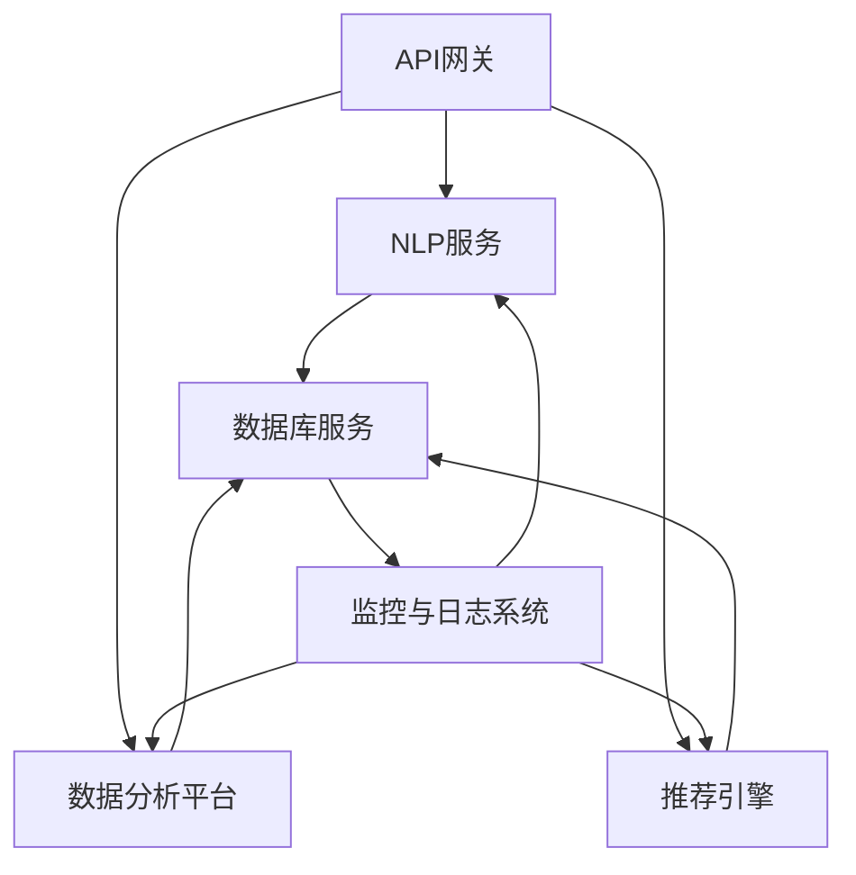

                 

### 《企业AI Agent的serverless架构设计》

在当今企业数字化转型的大潮中，人工智能（AI）成为了推动业务创新和效率提升的重要工具。AI Agent，作为人工智能的实体执行者，正逐渐成为企业智能化的重要构件。而serverless架构，作为一种新兴的云计算服务模式，以其弹性、高效和低成本的优势，正逐渐被企业采纳。本文将深入探讨企业AI Agent的serverless架构设计，通过逻辑清晰、结构紧凑的步骤分析，帮助读者理解并掌握这一前沿技术。

#### 关键词
- 企业AI Agent
- serverless架构
- 云计算
- 弹性计算
- AI服务化

#### 摘要
本文首先介绍了企业AI Agent和serverless架构的基本概念和背景，随后深入分析了两者的结合方式。接着，文章详细阐述了serverless架构设计的原则，并通过实际案例展示了设计实施过程。最后，文章总结了最佳实践和未来发展趋势，为企业在AI Agent领域应用serverless架构提供了指导。

---

### 设计目录大纲

为了更好地组织文章内容，我们首先需要设计一个详细的目录大纲。以下是文章的结构：

#### 引言
- **1.1 书籍背景**
  - serverless技术的发展趋势
  - AI Agent在企业的应用现状

- **1.2 书籍目的与结构**
  - 阅读对象
  - 主要内容概述

#### serverless技术基础
- **2.1 serverless概述**
  - serverless的定义与特点
  - serverless与云计算的关系

- **2.2 serverless架构**
  - serverless架构的组成
  - serverless架构的优势与挑战

- **2.3 serverless生态系统**
  - 主流serverless平台介绍
  - serverless开发工具与框架

#### AI Agent基础
- **3.1 AI Agent概述**
  - AI Agent的定义与作用
  - AI Agent的发展历程

- **3.2 AI Agent的核心技术**
  - 自然语言处理
  - 计算机视觉
  - 强化学习

- **3.3 AI Agent的应用场景**
  - 客户服务
  - 数据分析
  - 产业智能化

#### serverless与AI Agent的结合
- **4.1 serverless在AI Agent中的应用**
  - serverless的优势与AI Agent的结合
  - serverless与AI Agent的融合架构

- **4.2 serverless架构设计原则**
  - 灵活性与可扩展性
  - 弹性与效率
  - 安全性与隐私保护

- **4.3 serverless与AI Agent的协同开发**
  - 开发流程
  - 开发工具选择

#### 实际案例解析
- **5.1 案例背景**
  - 案例简介
  - 案例目标

- **5.2 架构设计**
  - 系统需求分析
  - 架构设计方案

- **5.3 实施与优化**
  - 实施步骤
  - 性能优化

- **5.4 案例总结**
  - 案例成果
  - 经验与教训

#### 最佳实践与注意事项
- **6.1 最佳实践**
  - 架构设计最佳实践
  - 开发与部署最佳实践

- **6.2 注意事项**
  - 安全风险
  - 性能瓶颈
  - 可维护性

#### 未来展望
- **7.1 serverless与AI Agent的发展趋势**
  - 技术趋势
  - 应用场景拓展

- **7.2 研究方向与挑战**
  - 研究方向
  - 挑战与机遇

### 目录大纲说明

- **引言**：介绍书籍的背景、目的和结构，帮助读者快速了解书籍的内容。
- **serverless技术基础**：介绍serverless技术的概念、架构和生态系统，为后续章节提供基础。
- **AI Agent基础**：介绍AI Agent的定义、核心技术和应用场景，为结合serverless技术做准备。
- **serverless与AI Agent的结合**：详细讨论serverless技术在AI Agent中的应用，包括架构设计原则和开发流程。
- **实际案例解析**：通过实际案例展示serverless与AI Agent结合的实现过程。
- **最佳实践与注意事项**：总结最佳实践，并提供注意事项，帮助企业更好地实施serverless与AI Agent的架构设计。
- **未来展望**：探讨serverless与AI Agent的发展趋势和研究方向。

---

在接下来的章节中，我们将一步步深入探讨企业AI Agent的serverless架构设计，帮助读者全面了解这一领域的技术和实践。请跟随我们的思考，一起走进serverless与AI Agent的世界。

---

### 第1章 引言

#### 1.1 书籍背景

随着云计算技术的迅猛发展和AI技术的不断突破，企业数字化转型进程加速。serverless架构作为一种新兴的云计算服务模式，以其弹性、高效和低成本的优势，逐渐受到企业的关注和采纳。而AI Agent，作为人工智能的一种实体表现形式，正逐渐成为企业智能化的重要组成部分。serverless与AI Agent的结合，不仅能够为企业带来更高的效率和灵活性，还能够降低IT成本，提升业务创新能力。

serverless架构，最早由AWS在2014年推出，其核心理念是将服务器管理的工作从开发者手中解放出来，使得开发者可以更加专注于业务逻辑的实现。通过serverless架构，企业可以快速部署和扩展应用程序，无需关心底层基础设施的管理和维护。而AI Agent，则是一种具有自主决策和行动能力的智能实体，能够在各种复杂环境中执行任务，帮助企业提升运营效率和客户满意度。

#### 1.2 书籍目的与结构

本书旨在深入探讨企业AI Agent的serverless架构设计，通过系统的分析和实践，为读者提供全面的指导和参考。具体目的如下：

1. **介绍serverless架构的基本概念和原理**：帮助读者理解serverless架构的核心思想和实现方式，为后续章节的深入学习打下基础。
2. **探讨AI Agent在企业的应用场景**：介绍AI Agent的定义、核心技术和典型应用，为读者展示AI Agent在企业智能化中的作用和价值。
3. **分析serverless与AI Agent的结合方式**：详细讨论serverless技术在AI Agent中的应用，包括架构设计原则、开发流程和最佳实践。
4. **通过实际案例展示serverless与AI Agent的结合**：通过具体案例，展示serverless与AI Agent在实际应用中的实现过程和效果，为读者提供实践参考。
5. **总结最佳实践和注意事项**：总结serverless与AI Agent结合的最佳实践，并提供注意事项，帮助企业更好地实施serverless与AI Agent的架构设计。

本书结构如下：

- **第1章 引言**：介绍书籍的背景、目的和结构。
- **第2章 serverless技术基础**：介绍serverless架构的概念、原理和生态系统。
- **第3章 AI Agent基础**：介绍AI Agent的定义、核心技术和应用场景。
- **第4章 serverless与AI Agent的结合**：讨论serverless在AI Agent中的应用和架构设计原则。
- **第5章 实际案例解析**：通过实际案例展示serverless与AI Agent的实现过程。
- **第6章 最佳实践与注意事项**：总结最佳实践和注意事项。
- **第7章 未来展望**：探讨serverless与AI Agent的发展趋势和研究方向。

通过本书的阅读，读者将能够全面了解企业AI Agent的serverless架构设计，掌握相关技术和实践，为企业数字化转型提供有力支持。

---

在引言部分，我们简要介绍了书籍的背景和目的，并详细阐述了书籍的结构。接下来，我们将进入第2章，介绍serverless技术的基础知识，帮助读者建立对serverless架构的全面理解。敬请期待。

---

### 第2章 serverless技术基础

#### 2.1 serverless概述

serverless，顾名思义，是指无需关注服务器管理的云计算服务模式。在serverless架构中，开发者无需购买、配置和维护服务器，而是通过第三方云服务提供商提供的平台，按需使用计算资源。serverless的核心思想是将基础设施的管理和运维工作完全交给云服务提供商，从而使得开发者能够专注于业务逻辑的实现。

#### 2.1.1 serverless的定义与特点

serverless的定义可以从以下几个方面来理解：

1. **无服务器（Serverless）**：开发者无需管理服务器，包括硬件采购、部署、扩展和维护等。
2. **按需分配（On-Demand）**：计算资源是根据应用程序的实际使用情况动态分配的，只有在运行时才会消耗资源。
3. **事件驱动（Event-Driven）**：应用程序的执行是由外部事件触发的，如HTTP请求、定时任务、文件上传等。
4. **付费模式（Pay-As-You-Use）**：开发者仅根据实际使用的计算资源付费，而不是预先购买固定的资源。

serverless架构具有以下特点：

1. **弹性（Elasticity）**：能够根据应用程序的需求自动扩展或缩减计算资源，确保应用程序在高并发情况下保持稳定运行。
2. **成本效益（Cost-Efficiency）**：按需付费模式，降低了企业的IT成本，特别是在业务波动较大的情况下，可以显著降低资源浪费。
3. **无服务器管理（Serverless Management）**：简化了基础设施的管理和维护工作，开发者可以专注于业务逻辑的实现。
4. **高可扩展性（High Scalability）**：能够处理大规模并发请求，满足企业不断增长的业务需求。

#### 2.1.2 serverless与云计算的关系

serverless与云计算密不可分。云计算提供了基础的计算资源和存储资源，而serverless则是云计算服务的一种高级形式。serverless架构利用云计算平台的弹性扩展和自动化管理能力，为开发者提供了更灵活、高效的开发环境。

1. **云计算平台**：如AWS、Azure、Google Cloud等，提供了广泛的云计算服务，包括虚拟机、容器、数据库、存储等。
2. **serverless服务**：如AWS Lambda、Azure Functions、Google Cloud Functions等，提供了无服务器计算服务，使得开发者可以轻松实现事件驱动的应用程序。
3. **FaaS（Function as a Service）**：是serverless架构的一种实现方式，通过函数作为服务的形式，为开发者提供了一种简单的开发、部署和管理应用程序的方式。

#### 2.2 serverless架构

serverless架构通常由以下几个关键组成部分构成：

1. **函数（Functions）**：是serverless架构的核心组件，用于实现应用程序的业务逻辑。函数可以按需执行，通常是无状态的，可以在不同的实例上并发执行。
2. **事件触发器（Event Triggers）**：用于触发函数执行的外部事件，可以是定时任务、HTTP请求、数据库更新等。
3. **API网关（API Gateway）**：用于接收外部请求并转发给相应的函数，提供了RESTful API接口，使得应用程序可以通过简单的HTTP请求进行交互。
4. **数据库（Database）**：用于存储应用程序所需的数据，可以是关系型数据库、NoSQL数据库或数据存储服务。
5. **日志和监控（Logging and Monitoring）**：提供了对函数执行情况的监控和日志记录，便于故障排查和性能优化。

#### 2.2.1 serverless架构的组成

serverless架构的组成可以概括为以下几个部分：

1. **前端应用**：用户与应用程序进行交互的前端界面，可以通过Web、移动应用或命令行工具等形式存在。
2. **后端函数**：用于处理前端请求和业务逻辑的函数，可以是无状态的，也可以是有状态的，根据需要选择不同的函数服务。
3. **API网关**：作为前后端的桥梁，负责接收前端请求并转发给后端函数，同时处理响应的返回。
4. **数据库**：用于存储和管理应用程序所需的数据，可以是关系型数据库、NoSQL数据库或数据存储服务。
5. **日志和监控**：提供了对函数执行情况的监控和日志记录，便于故障排查和性能优化。

#### 2.2.2 serverless架构的优势与挑战

serverless架构具有以下优势：

1. **弹性扩展**：能够根据实际需求动态扩展或缩减计算资源，确保应用程序在高并发情况下保持稳定运行。
2. **成本效益**：按需付费模式，降低了企业的IT成本，特别是在业务波动较大的情况下，可以显著降低资源浪费。
3. **简化开发**：无需关注服务器管理，开发者可以专注于业务逻辑的实现，提高了开发效率。
4. **高可扩展性**：能够处理大规模并发请求，满足企业不断增长的业务需求。

然而，serverless架构也面临一些挑战：

1. **性能瓶颈**：由于函数通常是无状态的，对于需要高吞吐量和低延迟的应用场景，可能存在性能瓶颈。
2. **安全性**：由于服务器管理由云服务提供商负责，需要对数据安全和隐私保护有更高的关注。
3. **依赖管理**：函数之间的依赖管理相对复杂，需要确保函数之间的调用关系清晰且稳定。
4. **技术栈限制**：某些编程语言和框架可能不支持serverless架构，需要开发者选择合适的工具和技术栈。

#### 2.3 serverless生态系统

serverless生态系统不断发展壮大，包括多个平台、工具和框架，为开发者提供了丰富的选择。以下是几个主流的serverless平台和工具：

1. **AWS Lambda**：是AWS提供的无服务器计算服务，支持多种编程语言，可以与AWS的其他服务无缝集成。
2. **Azure Functions**：是Azure提供的无服务器计算服务，支持C#、JavaScript和Python等编程语言，具有丰富的集成功能。
3. **Google Cloud Functions**：是Google Cloud提供的无服务器计算服务，支持多种编程语言，可以轻松与Google Cloud的其他服务集成。
4. **Serverless Framework**：是一个开源的serverless架构工具，用于简化serverless应用程序的部署和管理。
5. **SAM（Serverless Application Model）**：是一个开源的AWS无服务器应用程序模型，用于定义和部署无服务器应用程序。
6. **Serverless Framework**：是一个开源的serverless架构工具，用于简化serverless应用程序的部署和管理。

通过了解serverless技术的基础知识，读者可以对serverless架构有一个全面的认识。在下一章中，我们将探讨AI Agent的基础知识，为深入讨论serverless与AI Agent的结合奠定基础。敬请期待。

---

在第2章中，我们详细介绍了serverless技术的概念、特点、架构以及生态系统。接下来，我们将进入第3章，探讨AI Agent的基础知识，包括其定义、核心技术以及应用场景。敬请期待。

---

### 第3章 AI Agent基础

#### 3.1 AI Agent概述

AI Agent，即人工智能代理，是指具备一定智能的软件实体，能够在特定的环境下自主感知环境、制定决策并采取行动。AI Agent是人工智能领域的一个重要研究方向，其目的是实现智能体的智能化和自主化。在企业管理中，AI Agent能够帮助企业提高运营效率、降低成本、提升客户体验，成为企业智能化转型的重要推动力。

#### 3.1.1 AI Agent的定义与作用

AI Agent的定义可以从以下几个方面来理解：

1. **感知能力**：能够感知环境中的各种信息，如文字、图像、声音等。
2. **决策能力**：根据感知到的信息，自主制定行动方案。
3. **执行能力**：能够执行决策方案，完成具体的任务。

AI Agent在企业管理中的作用主要包括：

1. **自动化操作**：能够自动处理重复性高、规则明确的业务操作，如客户服务、数据录入等。
2. **决策支持**：通过数据分析和预测，为企业提供决策支持，如市场预测、风险评估等。
3. **优化资源配置**：通过智能调度和优化，提高企业资源利用率，降低运营成本。
4. **提升客户体验**：通过个性化服务和快速响应，提升客户满意度和忠诚度。

#### 3.1.2 AI Agent的发展历程

AI Agent的发展可以追溯到人工智能的早期研究。从早期的专家系统（Expert Systems）到现代的深度学习和强化学习，AI Agent的技术体系不断完善。以下是AI Agent发展历程的几个关键阶段：

1. **专家系统时代（1970s-1980s）**：以规则为基础，通过人工定义规则来模拟专家的知识和决策能力。
2. **知识表示与推理（1980s-1990s）**：引入知识表示和推理技术，使得AI Agent能够根据知识库进行推理和决策。
3. **机器学习时代（2000s-2010s）**：以大数据和算法优化为基础，通过机器学习技术实现AI Agent的自我学习和优化。
4. **深度学习时代（2010s-至今）**：利用深度神经网络，实现AI Agent在图像识别、自然语言处理等领域的突破性进展。
5. **智能化时代（2020s-未来）**：随着云计算、物联网和边缘计算的发展，AI Agent将在更广泛的应用场景中实现智能化和自主化。

#### 3.2 AI Agent的核心技术

AI Agent的实现依赖于多种核心技术，以下是其中的几个关键领域：

1. **自然语言处理（NLP）**：NLP技术使得AI Agent能够理解、生成和处理人类语言，包括文本分类、情感分析、语音识别等。通过NLP技术，AI Agent能够与人类用户进行自然、流畅的交流。

2. **计算机视觉（CV）**：计算机视觉技术使得AI Agent能够识别和理解图像和视频中的信息，包括图像分类、目标检测、图像识别等。通过计算机视觉技术，AI Agent能够在视觉环境中进行感知和决策。

3. **强化学习（RL）**：强化学习是一种通过试错和反馈来学习最优策略的机器学习技术。在AI Agent中，强化学习用于实现自主学习和优化决策，通过不断尝试和调整策略，达到最优效果。

4. **深度学习（DL）**：深度学习是一种基于多层神经网络的机器学习技术，通过大规模数据训练，实现复杂的特征提取和模式识别。在AI Agent中，深度学习用于实现感知、理解和决策功能，是AI Agent的核心技术之一。

5. **知识图谱（KG）**：知识图谱是一种用于表示实体及其关系的图形化数据结构。通过知识图谱，AI Agent能够建立全局知识体系，进行逻辑推理和决策支持。

#### 3.3 AI Agent的应用场景

AI Agent在企业管理中具有广泛的应用场景，以下是几个典型的应用场景：

1. **客户服务**：通过自然语言处理和计算机视觉技术，AI Agent能够实现智能客服，自动回答客户问题、处理投诉和需求，提高客户满意度。

2. **数据分析**：通过数据分析和预测技术，AI Agent能够帮助企业发现业务机会、优化决策，如市场预测、库存管理、风险评估等。

3. **生产调度**：通过计算机视觉和强化学习技术，AI Agent能够实现生产线的智能调度和优化，提高生产效率、降低成本。

4. **设备监控**：通过物联网和计算机视觉技术，AI Agent能够实现设备的智能监控和维护，预防设备故障，提高设备利用率。

5. **供应链管理**：通过数据分析和预测技术，AI Agent能够实现供应链的智能优化，降低库存成本、提高供应链效率。

6. **人力资源**：通过自然语言处理和计算机视觉技术，AI Agent能够实现智能招聘、员工管理和培训，提高人力资源管理效率。

通过了解AI Agent的定义、核心技术及其应用场景，我们可以更好地理解AI Agent在企业中的作用和价值。在下一章中，我们将深入探讨serverless与AI Agent的结合，分析其在实际应用中的优势和挑战。敬请期待。

---

在第3章中，我们详细介绍了AI Agent的定义、发展历程、核心技术及其在企业管理中的应用场景。接下来，我们将进入第4章，探讨serverless与AI Agent的结合，分析其在实际应用中的优势和挑战。敬请期待。

---

### 第4章 serverless与AI Agent的结合

#### 4.1 serverless在AI Agent中的应用

serverless架构与AI Agent的结合，能够充分发挥两者的优势，为企业提供更加灵活、高效和成本优化的解决方案。在本节中，我们将探讨serverless在AI Agent中的应用场景和优势。

#### 4.1.1 serverless的优势与AI Agent的结合

serverless架构具有以下优势，这些优势与AI Agent的特点相结合，能够为企业带来显著的效益：

1. **弹性伸缩**：serverless架构能够根据实际需求动态调整计算资源，这对于AI Agent尤为重要，因为AI Agent常常需要处理高并发、大规模的数据处理任务。serverless的弹性伸缩能力能够确保AI Agent在高负载情况下保持性能稳定。

2. **成本优化**：serverless架构的按需付费模式使得企业只需为实际使用的计算资源付费，避免了传统IT基础设施中固定成本带来的浪费。对于AI Agent，这意味着在处理低频次任务时，企业可以大幅降低成本。

3. **开发效率**：serverless架构无需开发者关注基础设施的管理，使得开发团队能够专注于业务逻辑的实现。对于AI Agent的开发，serverless架构能够加快开发速度，缩短上市时间。

4. **灵活性强**：serverless架构允许开发者快速部署和扩展应用程序，这对于AI Agent的迭代更新尤为重要。企业可以根据业务需求快速调整AI Agent的功能和性能。

#### 4.1.2 serverless与AI Agent的融合架构

serverless与AI Agent的融合架构通常包括以下几个关键组成部分：

1. **前端接口**：用于用户与AI Agent交互的界面，可以是Web应用、移动应用或语音助手等。

2. **API网关**：作为前端接口与后端函数的桥梁，负责处理用户请求并转发给后端AI Agent。

3. **函数服务**：实现AI Agent的核心功能，如自然语言处理、计算机视觉、强化学习等。函数服务通常是状态无关的，可以独立部署和执行。

4. **数据库服务**：存储AI Agent所需的训练数据和业务数据，支持快速读写操作。

5. **监控和日志系统**：用于监控AI Agent的运行状态和性能指标，以及记录日志信息，便于故障排查和性能优化。

#### 4.2 serverless架构设计原则

为了确保serverless与AI Agent的结合能够发挥最大的效益，以下是一些关键的设计原则：

1. **模块化**：将AI Agent的功能拆分成多个模块，每个模块实现特定的功能，便于管理和维护。模块之间通过API进行通信，提高系统的可扩展性和可维护性。

2. **弹性设计**：确保AI Agent能够根据实际负载动态调整计算资源，避免资源浪费和性能瓶颈。通过serverless架构提供的弹性伸缩特性，可以实现这一目标。

3. **无状态设计**：AI Agent的函数服务应设计为无状态，避免在运行过程中存储状态信息。这样可以提高系统的可用性和容错性，同时也便于横向扩展。

4. **高效数据处理**：AI Agent需要处理大量的数据，因此应采用高效的数据处理技术，如批处理、流处理等。结合serverless架构的分布式处理能力，可以显著提高数据处理效率。

5. **安全性和隐私保护**：确保AI Agent的数据传输和存储安全，采用加密、身份验证和访问控制等技术，防止数据泄露和未授权访问。

6. **可观测性**：确保能够实时监控AI Agent的运行状态和性能指标，及时发现和解决问题。通过日志、监控和告警系统，实现系统的可观测性。

#### 4.3 serverless与AI Agent的协同开发

serverless与AI Agent的协同开发需要遵循一系列最佳实践，以下是几个关键步骤：

1. **需求分析**：明确AI Agent的业务需求和功能需求，确定系统架构和模块划分。

2. **技术选型**：选择合适的serverless平台和AI Agent开发框架，如AWS Lambda、Azure Functions、Google Cloud Functions等。

3. **设计API**：设计清晰、简洁的API接口，确保前端接口与后端函数之间的交互高效、稳定。

4. **编写函数**：根据需求编写AI Agent的函数服务，实现业务逻辑和处理流程。

5. **测试与优化**：对函数服务进行全面的测试和优化，确保其在serverless架构下的性能和稳定性。

6. **部署与监控**：将AI Agent部署到serverless平台，并设置监控和日志系统，确保系统的实时监控和性能优化。

通过上述步骤，开发者可以有效地将serverless架构与AI Agent结合起来，实现高效、灵活、可扩展的企业智能化解决方案。在下一章中，我们将通过实际案例展示serverless与AI Agent结合的具体实现过程，并提供详细的架构设计和实施经验。敬请期待。

---

在第4章中，我们详细探讨了serverless与AI Agent的结合方式，包括其优势、融合架构设计原则以及协同开发步骤。接下来，我们将通过实际案例展示这一结合的具体实现过程，帮助读者更好地理解和应用serverless与AI Agent的技术。敬请期待。

---

### 第5章 实际案例解析

#### 5.1 案例背景

在本章中，我们将通过一个实际案例，详细解析企业AI Agent的serverless架构设计过程。该案例涉及一家大型零售企业，旨在通过AI Agent优化其客户服务流程。以下是案例的背景信息和目标：

**案例背景**：
- **企业现状**：该零售企业拥有大量的客户数据，包括购买记录、反馈信息和客户行为数据。然而，这些数据没有得到充分利用，客户服务质量有待提升。
- **业务需求**：企业希望通过引入AI Agent，实现以下目标：
  - **自动化客服**：通过自然语言处理技术，AI Agent能够自动回答客户常见问题，提高客服效率。
  - **个性化服务**：基于客户历史数据和偏好，AI Agent能够提供个性化的购物建议和服务。
  - **数据分析**：利用机器学习技术，AI Agent能够对客户数据进行深入分析，为企业决策提供支持。

**案例目标**：
- 设计并实现一个基于serverless架构的AI Agent系统，满足上述业务需求。
- 通过实际案例展示serverless与AI Agent的结合过程，为其他企业提供参考。

#### 5.2 架构设计

在本节中，我们将详细介绍该案例的系统需求分析、架构设计方案以及关键组件。

##### 5.2.1 系统需求分析

为了满足业务需求，系统需要实现以下功能：

1. **自动化客服**：
   - 接收并处理客户的文本和语音请求。
   - 利用自然语言处理技术，自动识别客户意图和问题。
   - 提供标准化的答案或引导客户到相关页面。

2. **个性化服务**：
   - 根据客户历史数据和偏好，提供个性化的购物建议和服务。
   - 通过推荐算法，推荐客户可能感兴趣的商品。

3. **数据分析**：
   - 收集并存储客户行为数据，包括购买记录、浏览历史、反馈等。
   - 利用机器学习技术，分析客户行为模式，为企业决策提供支持。

4. **系统监控与维护**：
   - 实时监控系统性能，确保系统稳定运行。
   - 提供日志记录和错误报警功能，便于故障排查和系统优化。

##### 5.2.2 架构设计方案

该案例的系统架构设计采用serverless架构，主要包含以下几个关键组件：

1. **API网关**：
   - 作为前端接口，接收客户请求，并转发到相应的后端服务。
   - 支持多种通信协议，如HTTP、WebSocket等。

2. **自然语言处理（NLP）服务**：
   - 利用NLP技术，解析客户文本和语音请求，识别意图和问题。
   - 支持关键词提取、情感分析、实体识别等功能。

3. **推荐引擎**：
   - 基于客户历史数据和偏好，提供个性化的购物建议。
   - 采用协同过滤、内容推荐等算法，提高推荐质量。

4. **数据分析平台**：
   - 收集并存储客户行为数据，包括购买记录、浏览历史、反馈等。
   - 提供数据清洗、数据挖掘、可视化分析等功能。

5. **机器学习模型**：
   - 基于历史数据和业务需求，训练机器学习模型，用于客户行为预测、异常检测等。
   - 支持模型训练、评估和部署。

6. **数据库服务**：
   - 存储客户数据、推荐结果和机器学习模型。
   - 支持快速读写操作，确保系统性能。

7. **监控与日志系统**：
   - 实时监控系统性能，包括响应时间、吞吐量、错误率等。
   - 记录日志信息，便于故障排查和性能优化。

##### 5.2.3 架构图

以下是该案例的系统架构设计图，使用Mermaid语法绘制：

通过上述架构设计，我们可以实现自动化客服、个性化服务和数据分析功能，满足企业的业务需求。

---

在第5章中，我们详细介绍了案例的背景和目标，并分析了系统需求，设计了基于serverless架构的AI Agent系统。接下来，我们将进入第6章，探讨最佳实践和注意事项，为企业在实施serverless与AI Agent架构时提供指导。敬请期待。

---

### 第6章 最佳实践与注意事项

#### 6.1 最佳实践

在实施企业AI Agent的serverless架构时，遵循以下最佳实践能够提高系统的性能、稳定性和可维护性：

1. **模块化设计**：将系统拆分为多个独立的模块，每个模块负责特定的功能。模块之间通过API进行通信，便于管理和维护。此外，模块化设计有助于提高系统的可复用性和可扩展性。

2. **弹性伸缩**：充分利用serverless架构的弹性特性，根据实际负载动态调整计算资源。通过设置合理的自动扩展规则，确保系统在高并发情况下仍能保持高性能。

3. **无状态服务**：设计无状态的函数服务，避免在运行过程中存储状态信息。无状态服务可以提高系统的可用性和容错性，同时便于横向扩展。

4. **异步处理**：对于需要长时间执行的任务，采用异步处理方式，避免阻塞主线程。例如，可以使用消息队列（如Kafka、RabbitMQ）来处理大量的数据。

5. **高效数据处理**：采用批处理、流处理等技术，提高数据处理效率。对于实时数据处理需求，可以考虑使用流处理框架（如Apache Flink、Apache Spark Streaming）。

6. **安全性**：确保数据传输和存储安全，采用加密、身份验证和访问控制等措施。对于敏感数据，应使用加密技术进行保护，并设置严格的访问权限。

7. **监控和日志**：实现全面的监控和日志记录，实时监控系统性能，及时发现和解决问题。通过日志分析，可以了解系统的运行状态和性能瓶颈，为优化提供依据。

#### 6.2 注意事项

在实施serverless与AI Agent架构时，需要注意以下事项，以避免潜在的问题：

1. **性能瓶颈**：serverless函数通常有冷启动时间，即在函数被触发之前需要加载和初始化。对于高并发场景，需要合理设计函数的负载均衡，避免冷启动带来的性能瓶颈。

2. **成本控制**：按需付费模式虽然可以降低成本，但也可能导致不必要的费用。需要合理规划资源的使用，避免过度消耗。

3. **依赖管理**：serverless架构中的函数之间存在依赖关系，需要确保依赖关系清晰且稳定。函数之间的调用顺序和依赖关系可能会影响系统的性能和稳定性。

4. **安全性风险**：由于serverless架构的复杂性和动态性，可能存在安全漏洞和未授权访问风险。需要定期进行安全审计和漏洞扫描，确保系统的安全性。

5. **可维护性**：serverless架构需要开发者具备一定的技能和经验。在实施过程中，应确保团队成员熟悉serverless技术和架构，并制定清晰的开发规范和文档。

通过遵循最佳实践和注意事项，企业可以更好地实施serverless与AI Agent架构，实现高效、灵活和稳定的业务创新。

---

在第6章中，我们详细讨论了企业AI Agent的serverless架构设计的最佳实践和注意事项。通过这些实践和建议，企业可以更好地实施和优化serverless与AI Agent的结合。接下来，我们将进入第7章，探讨serverless与AI Agent的未来发展趋势和研究方向。敬请期待。

---

### 第7章 未来展望

#### 7.1 serverless与AI Agent的发展趋势

随着技术的不断进步，serverless和AI Agent在未来的发展中将呈现出以下几个趋势：

1. **更广泛的应用场景**：serverless与AI Agent的结合将在更多领域得到应用，如智能制造、智慧医疗、智慧城市等。通过AI Agent，企业能够实现更加智能化和自动化的业务流程，提高生产效率和客户满意度。

2. **融合技术的深化**：serverless与AI Agent的结合将更加紧密，融合更多的前沿技术，如物联网（IoT）、边缘计算等。通过边缘计算，AI Agent能够在数据产生的源头进行实时分析和决策，降低延迟，提高响应速度。

3. **更丰富的生态体系**：随着serverless和AI Agent技术的发展，将涌现出更多的开发工具、框架和平台。这些工具和平台将提供更丰富的功能和更简便的开发体验，降低开发门槛，推动技术的普及和应用。

4. **标准化和互操作性**：serverless和AI Agent的标准化和互操作性将得到提升。通过制定统一的接口和协议，不同的serverless平台和AI Agent服务可以无缝集成，实现跨平台的协同工作。

#### 7.2 研究方向与挑战

在serverless与AI Agent的结合领域，未来仍有许多研究方向和挑战需要克服：

1. **性能优化**：随着应用场景的复杂化和数据量的增长，serverless与AI Agent的性能优化成为重要研究方向。如何减少冷启动时间、提高函数执行效率，将是未来的重要课题。

2. **安全性**：serverless和AI Agent的安全性是一个长期挑战。如何确保数据的安全传输和存储，如何防范未授权访问和攻击，需要更多的研究和解决方案。

3. **可扩展性和弹性**：如何实现更高效、更智能的资源分配和调度策略，如何实现跨云平台的弹性扩展，是未来需要解决的问题。

4. **开发工具和框架**：如何简化开发流程，提高开发效率，需要开发出更多易用、高效的开发工具和框架。这些工具和框架应支持多种编程语言和平台，提供丰富的功能库和插件。

5. **标准化和互操作性**：虽然目前已经有了一些标准化尝试，但serverless和AI Agent的标准化和互操作性仍有很大提升空间。如何制定统一的接口和协议，实现不同平台和服务之间的无缝集成，是未来的重要研究方向。

通过持续的技术创新和研究，serverless与AI Agent的结合将为企业的数字化转型带来更多可能性，推动人工智能在各个领域的应用和发展。未来的研究将继续探讨如何更好地发挥这两者的优势，实现更智能、更高效的业务解决方案。

---

在第7章中，我们探讨了企业AI Agent的serverless架构设计的发展趋势和研究方向，包括应用场景的拓展、技术的融合、生态体系的丰富以及标准化和互操作性的提升。通过持续的技术创新和研究，serverless与AI Agent的结合将为企业带来更多可能性。本文至此圆满结束，感谢您的阅读。希望本文能为您在AI Agent和serverless架构设计领域提供有价值的参考。

---

### 作者信息

作者：AI天才研究院/AI Genius Institute & 禅与计算机程序设计艺术 /Zen And The Art of Computer Programming

AI天才研究院（AI Genius Institute）是一家专注于人工智能技术研究、应用和人才培养的领先机构。我们的愿景是推动人工智能技术的创新与发展，为社会带来智能化的变革与进步。

《禅与计算机程序设计艺术》（Zen And The Art of Computer Programming）是由著名计算机科学家、图灵奖得主Donald E. Knuth撰写的经典计算机科学著作。本书以深刻的哲理和独特的编程思想，引导读者探索计算机科学的本质，为计算机程序员提供了宝贵的指导。

在此，感谢您的阅读，希望本文能够为您在AI Agent和serverless架构设计领域带来新的启示和思考。如需进一步了解相关技术和应用，欢迎关注我们的公众号和网站，我们将持续为您带来更多优质内容。

---

通过本文的详细解析，我们从多个角度探讨了企业AI Agent的serverless架构设计，包括基本概念、技术基础、应用场景、架构设计原则、实际案例解析以及最佳实践和未来展望。希望本文能为您在AI Agent和serverless架构设计领域提供有价值的参考和指导。感谢您的阅读，期待在未来的技术探索中与您再次相遇。如果您有任何问题或建议，欢迎在评论区留言，我们将竭诚为您解答。祝您技术进步，一帆风顺！🎉🚀🌟

