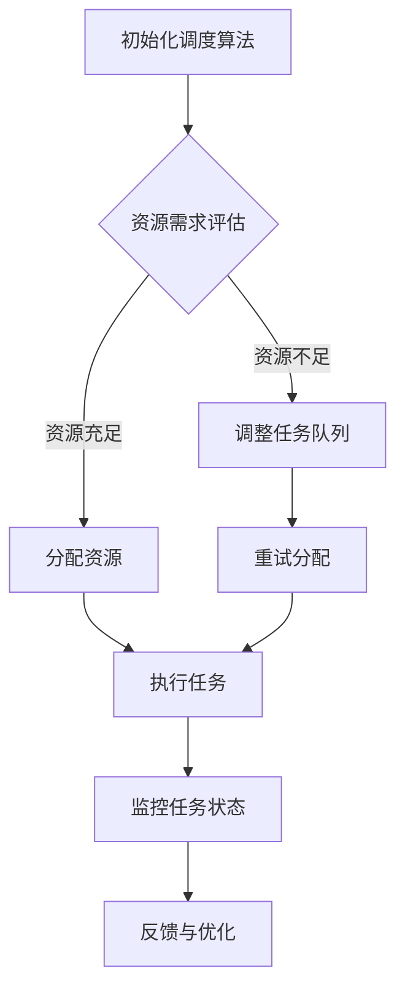

                 

### 1.1 AI Agent的基本概念与类型

#### 1.1.1 AI Agent的定义

AI Agent，即人工智能代理，是人工智能领域中的一个重要概念。它通常被定义为具有感知、决策和执行能力的智能实体。在具体实现中，AI Agent能够根据其感知到的环境信息，自主地做出决策并执行相应的动作，以实现某个特定的目标。例如，自动驾驶汽车中的AI Agent需要感知周围的道路情况、交通信号、其他车辆和行人的位置等信息，然后根据这些信息做出行驶决策，并在道路上自主行驶。

AI Agent可以按照不同的分类标准进行分类。一种常见的分类方式是按照AI Agent所依赖的技术进行分类，可以分为基于规则的方法、基于知识的方法、基于机器学习的方法和基于混合智能的方法。基于规则的方法依赖于预定义的规则集，通过匹配规则来做出决策；基于知识的方法依赖于领域知识库，通过推理来获取目标信息；基于机器学习的方法通过大量数据的学习，从数据中自动提取规律和模式；基于混合智能的方法则结合了多种方法，以实现更强大的决策能力。

另一种分类方式是按照AI Agent的应用场景进行分类，可以分为通用型AI Agent和专用型AI Agent。通用型AI Agent具有较强的通用性和适应性，能够在多种不同的应用场景中发挥作用，如自然语言处理、图像识别、推荐系统等；而专用型AI Agent则针对特定的应用场景进行优化，如智能家居控制、工业自动化、医疗诊断等。

AI Agent在企业中的主要应用场景包括但不限于以下几个方面：

1. **客户服务与支持**：企业可以利用AI Agent实现智能客服系统，自动回答客户的常见问题，提高客户服务效率和质量。
2. **决策支持**：AI Agent可以通过分析大量的企业数据，提供数据驱动的决策支持，帮助企业做出更加明智的决策。
3. **生产自动化**：在制造业中，AI Agent可以用于自动化生产线的监控与控制，提高生产效率和质量。
4. **供应链管理**：AI Agent可以优化供应链管理，通过实时分析供应链数据，提高供应链的响应速度和灵活性。
5. **风险管理**：AI Agent可以通过分析企业历史数据和行业动态，为企业提供风险预警和风险管理建议。

#### 1.1.2 AI Agent的分类

在AI Agent的分类中，通用型AI Agent和专用型AI Agent是两种主要的类型。

**通用型AI Agent**

通用型AI Agent具有较高的通用性和适应性，能够处理多种不同类型的问题。这类AI Agent通常具有较强的学习能力和推理能力，能够从大量的数据中学习，并能够自主地调整其行为以适应不同的环境。例如，自然语言处理中的聊天机器人就是一种通用型AI Agent，它能够理解并回应用户的自然语言输入，适用于各种不同的场景。

**专用型AI Agent**

专用型AI Agent则针对特定的应用场景进行优化，具有较强的针对性和高效性。这类AI Agent通常在特定领域具有深入的知识和经验，能够高效地解决特定的问题。例如，工业自动化中的机器人控制系统就是一种专用型AI Agent，它专门用于控制工业机器人的运行，确保生产过程的顺利进行。

**分类对比**

通用型AI Agent和专用型AI Agent各有优劣。通用型AI Agent具有较高的适应性和灵活性，能够处理多种不同类型的问题，但可能需要更多的时间和资源来学习和适应；而专用型AI Agent则具有更高的效率和针对性，能够快速地解决特定的问题，但可能无法适应其他类型的问题。

在实际应用中，企业需要根据自身的需求和资源情况，选择合适的AI Agent类型。对于需要处理复杂多变问题的企业，通用型AI Agent可能更为适合；而对于需要高效解决特定问题的企业，专用型AI Agent可能更为有效。

#### 1.1.3 AI Agent在企业中的应用

AI Agent在企业中的应用非常广泛，可以大大提高企业的效率、降低成本并提升服务质量。以下是一些典型的应用场景：

1. **客户服务与支持**

   企业可以利用AI Agent实现智能客服系统，自动回答客户的常见问题，提高客户服务效率和质量。例如，企业可以在网站上部署一个聊天机器人，实时解答客户的疑问，提供在线支持。这种自动化的客户服务不仅可以节省人力成本，还可以提供24/7的全天候服务，提高客户满意度。

2. **决策支持**

   AI Agent可以通过分析大量的企业数据，提供数据驱动的决策支持，帮助企业做出更加明智的决策。例如，企业可以使用AI Agent分析市场数据，预测市场需求和趋势，为企业制定生产和销售策略提供依据。此外，AI Agent还可以分析财务数据，为企业提供财务状况分析和风险预警。

3. **生产自动化**

   在制造业中，AI Agent可以用于自动化生产线的监控与控制，提高生产效率和质量。例如，AI Agent可以实时监控生产设备的运行状态，检测设备故障并提前预警，避免生产中断。同时，AI Agent还可以优化生产流程，提高生产效率。

4. **供应链管理**

   AI Agent可以优化供应链管理，通过实时分析供应链数据，提高供应链的响应速度和灵活性。例如，AI Agent可以实时监控库存水平，预测需求变化，调整采购计划，避免库存积压或短缺。此外，AI Agent还可以优化运输路线，降低运输成本。

5. **风险管理**

   AI Agent可以通过分析企业历史数据和行业动态，为企业提供风险预警和风险管理建议。例如，AI Agent可以分析金融市场数据，预测市场波动，为企业提供投资建议。同时，AI Agent还可以监控网络安全，识别潜在的安全威胁，提供安全防护措施。

6. **人力资源管理**

   AI Agent可以用于招聘、培训、员工绩效评估等方面，提高人力资源管理效率。例如，AI Agent可以自动处理招聘申请，筛选合适的候选人；在培训过程中，AI Agent可以提供个性化培训方案，提高培训效果；在员工绩效评估中，AI Agent可以分析员工的工作表现，提供评估结果和建议。

通过这些应用，AI Agent不仅可以帮助企业提高运营效率，降低成本，还可以提升客户满意度，增强企业的竞争力。因此，企业应该积极引入和应用AI Agent，以实现数字化、智能化转型。

#### 1.2 serverless计算资源概述

**1.2.1 serverless计算资源的基本原理**

serverless计算资源是一种云计算模型，它允许开发人员构建和运行应用程序而无需管理底层计算资源。在这个模型中，云服务提供商负责管理基础设施，包括服务器、虚拟机、存储和网络等，开发人员只需专注于编写和部署代码。serverless计算的核心思想是将计算能力作为一项服务提供，用户只需按需支付使用的资源量，无需担心资源的管理和维护。

serverless计算资源的基本原理包括以下几个方面：

1. **函数即服务（Function as a Service, FaaS）**
   FaaS是serverless计算的主要形式，它允许用户以函数的形式部署代码。用户只需上传代码，云服务提供商会自动管理代码的运行环境，包括虚拟机、容器和依赖库等。当有请求触发时，函数会被自动执行，并在执行完成后自动停止，用户只需为实际使用的计算时间付费。

2. **容器即服务（Container as a Service, CaaS）**
   CaaS是一种提供容器化应用的serverless计算服务。用户可以将预构建的容器镜像上传到云服务提供商，容器会在需要时被启动并运行，当容器不再需要时，会自动停止。与FaaS相比，CaaS提供了更大的灵活性和控制性，允许用户自定义容器的运行环境和配置。

3. **无服务器架构**
   无服务器架构是一种将应用程序分解为离散的函数或服务的架构风格。在这种架构中，每个功能或服务都是独立部署和管理的，可以独立扩展和缩放。无服务器架构简化了应用程序的部署和管理，提高了开发效率和系统的弹性。

**1.2.2 serverless计算资源的优势与挑战**

serverless计算资源具有许多优势，但也面临一些挑战。

**优势：**

1. **成本效益**
   serverless计算模式允许用户按需支付，无需支付未使用的资源，因此可以显著降低成本。此外，由于云服务提供商负责管理底层基础设施，用户无需投入大量资源进行硬件采购和维护。

2. **高可伸缩性**
   serverless计算资源可以根据实际需求自动扩展和缩放，无需人工干预。这意味着应用程序可以轻松处理高并发请求，确保系统的高可用性和性能。

3. **开发效率**
   serverless计算简化了应用程序的部署和管理，开发人员可以专注于编写业务逻辑代码，而不需要担心底层基础设施的管理。这提高了开发效率，缩短了产品上市时间。

4. **弹性**
   serverless计算资源可以在需要时自动分配资源，当请求减少时，可以自动释放资源。这种弹性有助于优化资源利用，提高系统的响应速度。

**挑战：**

1. **依赖性**
   serverless应用程序高度依赖于云服务提供商，如果服务提供商出现故障，可能会影响应用程序的运行。此外，用户可能受到服务提供商的策略和定价模型限制。

2. **性能限制**
   serverless计算资源可能存在性能瓶颈，特别是在高并发场景下，由于函数执行时间的限制，可能会导致响应时间变长。

3. **调试与监控**
   由于serverless资源是动态分配的，调试和监控应用程序可能比较复杂。开发人员需要熟悉云服务提供商提供的工具和平台，以确保应用程序的稳定运行。

4. **安全性**
   serverless计算环境可能面临安全挑战，如函数之间的数据泄露、访问控制等问题。开发人员需要采取适当的安全措施，确保数据的安全性和隐私性。

总之，serverless计算资源为企业提供了一种高效、灵活的计算模型，但同时也带来了一些挑战。企业在考虑采用serverless计算时，需要全面评估其优势和风险，以确保能够充分利用serverless的优势，同时避免潜在的问题。

### 1.3 AI Agent与serverless计算资源的联系

**1.3.1 AI Agent在serverless环境中的工作原理**

AI Agent在serverless环境中的工作原理主要基于函数即服务（FaaS）模型。FaaS模型允许AI Agent以函数的形式部署和运行，从而实现高效、弹性的计算能力。以下是AI Agent在serverless环境中的工作原理：

1. **部署与触发**
   AI Agent首先需要被部署到serverless平台上。部署过程通常涉及上传代码、配置环境变量和设置触发条件。一旦部署完成，AI Agent就准备就绪，可以响应外部触发事件，如HTTP请求、定时任务或事件流。

2. **执行任务**
   当触发事件发生时，serverless平台会自动启动AI Agent对应的函数，执行其中的业务逻辑。AI Agent可以根据感知到的环境信息，进行数据处理、推理决策和执行操作。

3. **资源管理**
   serverless平台会自动分配和管理AI Agent运行所需的计算资源。这些资源可以根据请求的规模动态扩展和缩放，确保AI Agent能够高效地处理任务。

4. **状态保存与恢复**
   AI Agent在执行任务过程中可能会保存状态信息，以便在下次执行时恢复。serverless平台通常提供存储服务，如数据库或对象存储，用于保存AI Agent的状态信息。

**1.3.2 serverless计算资源对AI Agent的影响**

serverless计算资源对AI Agent具有显著的影响，主要体现在以下几个方面：

1. **可伸缩性**
   serverless计算资源具有高可伸缩性，可以自动根据请求规模动态扩展和缩放计算资源。这使AI Agent能够轻松应对高并发场景，确保系统的高性能和高可用性。

2. **弹性**
   serverless计算资源可以根据需求自动分配和释放资源，使AI Agent能够在负载波动时保持稳定运行。这种弹性有助于优化资源利用，提高系统的响应速度。

3. **成本效益**
   serverless计算资源采用按需付费模式，AI Agent只需为实际使用的计算时间付费，无需支付未使用的资源。这有助于降低企业的运营成本，提高投资回报率。

4. **开发效率**
   serverless计算资源简化了应用程序的部署和管理，开发人员可以专注于业务逻辑的实现，而无需担心底层基础设施的管理。这提高了开发效率，缩短了产品上市时间。

5. **限制与依赖**
   serverless计算资源也存在一些限制和依赖。例如，AI Agent可能受到函数执行时间和存储空间的限制，这可能会影响其性能和功能。此外，AI Agent高度依赖于云服务提供商，如果服务提供商出现故障，可能会影响AI Agent的运行。

**1.3.3 AI Agent与serverless计算资源的协同作用**

AI Agent与serverless计算资源的协同作用可以大大提升企业应用的智能化水平。以下是一些协同作用的实例：

1. **智能监控与预测**
   AI Agent可以利用serverless计算资源，实时分析企业数据，进行监控和预测。例如，在生产制造领域，AI Agent可以监控设备运行状态，预测故障，提前进行维护，提高生产效率。

2. **智能客户服务**
   AI Agent可以部署在serverless平台上，为用户提供智能客服服务。通过分析用户的查询内容，AI Agent可以自动提供答案，提高客户服务效率。

3. **智能决策支持**
   AI Agent可以利用serverless计算资源，分析企业内外部数据，提供数据驱动的决策支持。例如，在市场营销领域，AI Agent可以分析市场数据，为企业的营销策略提供优化建议。

4. **智能自动化**
   AI Agent可以与serverless计算资源结合，实现智能自动化。例如，在供应链管理中，AI Agent可以自动化处理订单、库存和物流等任务，提高供应链效率。

总之，AI Agent与serverless计算资源的协同作用，可以为企业带来智能化、自动化和高效化的解决方案，助力企业实现数字化转型和创新发展。

### 1.4 企业AI Agent的需求分析

**1.4.1 企业AI Agent的需求分析**

企业AI Agent的需求分析是企业成功部署和应用AI Agent的关键步骤。为了确保AI Agent能够满足企业的业务需求和提供预期的价值，需要进行以下需求分析：

1. **业务目标与需求**
   首先，企业需要明确AI Agent的部署目标和业务需求。这些目标可能包括提高生产效率、优化供应链管理、提升客户服务质量、实现数据驱动的决策支持等。明确这些目标有助于确定AI Agent所需的功能和性能要求。

2. **数据处理能力**
   企业AI Agent需要具备强大的数据处理能力，能够高效地处理来自不同来源的大量数据。这些数据可能包括企业内部的运营数据、市场数据、客户反馈等。AI Agent需要能够对这些数据进行清洗、存储、分析和挖掘，以提取有价值的信息。

3. **智能推理能力**
   企业AI Agent需要具备智能推理能力，能够根据实时数据和环境变化做出智能决策。这要求AI Agent具有强大的机器学习和自然语言处理能力，能够理解复杂数据，并生成相应的决策。

4. **可扩展性和弹性**
   企业AI Agent需要具备高可扩展性和弹性，能够根据业务需求动态调整资源使用。随着业务的发展，AI Agent需要能够快速扩展其计算能力，以应对更高的负载和更复杂的任务。

5. **安全性与隐私保护**
   企业AI Agent需要确保数据的安全性和隐私保护。企业通常涉及敏感数据，如客户信息、财务数据等。AI Agent需要采用安全措施，如数据加密、访问控制等，以确保数据在传输和存储过程中的安全性。

6. **用户体验**
   企业AI Agent需要提供良好的用户体验，确保用户能够轻松地与AI Agent互动。这包括提供友好的用户界面、快速响应时间、易用性和可访问性。

7. **维护与支持**
   企业AI Agent需要具备良好的可维护性，确保系统的稳定运行。这包括定期更新和维护AI Agent的代码，监控系统的性能，处理潜在的问题。

**1.4.2 serverless计算资源在企业的应用场景**

serverless计算资源在企业的应用场景非常广泛，可以为企业带来显著的效益。以下是一些主要的应用场景：

1. **客户服务与支持**
   企业可以利用serverless计算资源部署智能客服系统，自动回答客户的常见问题，提高客户服务效率和质量。通过结合AI技术，智能客服系统可以理解客户的意图，提供个性化的服务。

2. **供应链管理**
   serverless计算资源可以帮助企业实现智能化的供应链管理。通过实时分析供应链数据，AI Agent可以预测市场需求，优化库存管理，提高供应链的响应速度和灵活性。

3. **生产自动化**
   在制造业中，serverless计算资源可以用于自动化生产线的监控与控制。AI Agent可以实时监控设备运行状态，检测故障并提前预警，确保生产过程的顺利进行。

4. **数据分析和决策支持**
   serverless计算资源可以为企业提供强大的数据分析和决策支持能力。通过实时处理和分析企业内外部数据，AI Agent可以为企业的业务决策提供数据驱动的建议。

5. **风险管理**
   serverless计算资源可以帮助企业实现智能化的风险管理。通过分析市场数据和企业历史数据，AI Agent可以预测潜在的风险，并提供相应的风险管理策略。

6. **人力资源管理**
   serverless计算资源可以用于人力资源管理，如招聘、培训和绩效评估等。AI Agent可以自动化处理招聘申请，提供个性化的培训方案，并根据员工的工作表现进行绩效评估。

**1.4.3 AI Agent与serverless计算资源的企业解决方案**

结合AI Agent和serverless计算资源，企业可以构建一套高效、智能的业务解决方案，以下是一些可能的方案：

1. **智能客服系统**
   利用AI Agent和serverless计算资源，企业可以构建一个智能客服系统，提供24/7的全天候客户服务。AI Agent可以理解客户的查询内容，自动提供答案，提高客户满意度。

2. **智能供应链管理系统**
   通过结合AI Agent和serverless计算资源，企业可以实现智能化的供应链管理。AI Agent可以实时分析供应链数据，预测市场需求，优化库存管理，提高供应链的效率和灵活性。

3. **智能制造系统**
   利用AI Agent和serverless计算资源，企业可以实现智能制造系统。AI Agent可以实时监控设备运行状态，检测故障并提前预警，确保生产过程的顺利进行。

4. **智能数据分析平台**
   通过结合AI Agent和serverless计算资源，企业可以构建一个智能数据分析平台，实时处理和分析企业内外部数据，为业务决策提供数据驱动的建议。

5. **智能风险管理平台**
   利用AI Agent和serverless计算资源，企业可以构建一个智能风险管理平台，通过分析市场数据和企业历史数据，预测潜在的风险，并提供相应的风险管理策略。

6. **智能人力资源管理系统**
   通过结合AI Agent和serverless计算资源，企业可以实现智能人力资源管理系统，自动化处理招聘、培训和绩效评估等任务，提高人力资源管理的效率。

通过这些解决方案，企业可以充分利用AI Agent和serverless计算资源，实现数字化、智能化转型，提高业务效率和竞争力。

### 1.5 本章小结

本章主要介绍了企业AI Agent和serverless计算资源的基本概念、类型、应用以及它们之间的联系。首先，我们了解了AI Agent的定义、分类及其在企业中的应用场景，包括客户服务、决策支持、生产自动化、供应链管理、风险管理和人力资源管理。接着，我们详细阐述了serverless计算资源的基本原理、优势与挑战，并分析了AI Agent在serverless环境中的工作原理和serverless计算资源对AI Agent的影响。最后，我们探讨了企业AI Agent的需求分析以及serverless计算资源在企业的应用场景和解决方案。

通过本章的学习，读者可以全面了解企业AI Agent和serverless计算资源的重要性，以及如何结合两者实现企业的数字化、智能化转型。企业需要根据自身的业务需求和资源情况，选择合适的AI Agent类型和应用场景，充分利用serverless计算资源的高可伸缩性、弹性和成本效益，构建高效、智能的业务解决方案。

### 2.1 调度算法的基本原理

**2.1.1 调度算法的目标**

调度算法在企业AI Agent的serverless计算资源管理中扮演着至关重要的角色。其主要目标是确保资源的高效利用，提高系统的性能和稳定性。具体而言，调度算法需要实现以下几个目标：

1. **资源利用率最大化**：调度算法应确保serverless计算资源得到充分利用，避免资源浪费。通过优化资源分配策略，实现资源利用率最大化。

2. **响应时间最小化**：调度算法需确保AI Agent能够快速响应外部请求，尽量减少系统的响应时间。这可以通过优先处理高优先级任务和优化任务调度策略来实现。

3. **负载均衡**：调度算法应能够动态地平衡系统负载，避免某个节点或资源过载，导致系统性能下降。通过合理分配任务，确保系统各部分负载均衡。

4. **高可用性**：调度算法需确保系统的稳定运行，减少故障和中断。通过冗余设计和故障转移机制，保证系统的高可用性。

**2.1.2 调度算法的类型**

调度算法可以根据不同的分类标准进行分类。以下是一些常见的调度算法类型：

1. **静态调度算法**：静态调度算法在任务调度时，预先确定任务执行的顺序和资源分配策略，不会随着任务执行过程中环境变化而调整。这类算法的优点是实现简单，但缺点是缺乏灵活性，无法适应动态变化的环境。

2. **动态调度算法**：动态调度算法在任务执行过程中根据实际情况实时调整任务分配和资源使用。这类算法的优点是具有较高的灵活性和适应性，但实现较为复杂。

3. **基于优先级的调度算法**：这类调度算法通过为任务分配优先级，决定任务的执行顺序。高优先级任务优先执行，从而确保关键任务的及时完成。常见的基于优先级的调度算法包括最高优先级调度（HRRN）、最低优先级调度（LRN）等。

4. **基于反馈的调度算法**：这类调度算法通过实时收集系统状态信息，根据反馈调整调度策略。例如，根据任务执行时间、系统负载等参数，动态调整任务优先级和资源分配。这种算法具有较高的自适应性和灵活性。

5. **启发式调度算法**：启发式调度算法采用一些简单但有效的启发式规则，进行任务调度。这些规则通常是基于经验或简单计算得出的，如最近最少使用（LRU）算法、最短剩余时间（SRT）算法等。这类算法的优点是实现简单，但效果可能不如基于反馈的调度算法。

**2.1.3 调度算法的关键技术**

调度算法的关键技术包括以下几个方面：

1. **任务调度策略**：任务调度策略是调度算法的核心，决定了任务的分配和执行顺序。常见的任务调度策略包括最短作业优先（SJF）、最短剩余时间优先（SRT）、优先级调度等。

2. **资源分配策略**：资源分配策略决定了系统资源的分配方式。常见的资源分配策略包括静态分配、动态分配、公平共享等。

3. **负载均衡技术**：负载均衡技术通过合理分配任务，避免某个节点或资源过载。常见的负载均衡技术包括轮询调度、最小连接数调度、动态负载均衡等。

4. **故障转移和冗余设计**：故障转移和冗余设计旨在提高系统的高可用性，确保在节点或资源故障时，系统能够继续正常运行。常见的故障转移和冗余技术包括主从复制、负载均衡、故障检测与恢复等。

5. **实时监控与反馈机制**：实时监控与反馈机制用于收集系统状态信息，根据反馈调整调度策略。这需要构建完善的监控系统，实时获取系统的性能指标和资源使用情况。

通过以上关键技术，调度算法可以有效地管理serverless计算资源，确保AI Agent的高效运行和系统的稳定性。

### 2.2 调度算法的mermaid流程图

为了更直观地展示调度算法的执行过程，我们可以使用mermaid语言绘制一个流程图。下面是一个简单的mermaid流程图示例，用于描述调度算法的基本流程：



**流程图详细解释：**

1. **初始化调度算法**：调度算法首先进行初始化，设置初始参数和状态。

2. **资源需求评估**：调度算法评估当前系统资源的可用情况，包括CPU、内存、存储等。

3. **资源充足**：如果系统资源充足，调度算法将进入资源分配阶段。

4. **资源不足**：如果系统资源不足，调度算法将尝试调整任务队列，优先处理资源需求较小的任务。

5. **分配资源**：调度算法将任务分配到可用的服务器或容器上，确保任务能够执行。

6. **执行任务**：任务被分配后，开始执行具体的业务逻辑。

7. **监控任务状态**：在任务执行过程中，调度算法会持续监控任务的状态，包括执行进度、资源使用情况等。

8. **反馈与优化**：根据任务的执行情况，调度算法会收集反馈信息，并进行优化调整，以优化资源利用率和系统性能。

通过这个mermaid流程图，我们可以清晰地了解调度算法的执行流程和关键步骤，为后续的算法实现和优化提供了参考。

### 2.3 Python代码示例

在本节中，我们将通过一个简单的Python代码示例来展示调度算法的基本实现。以下代码实现了一个基本的调度算法，用于模拟资源分配和任务执行的过程。

```python
import time
import random

# 任务类
class Task:
    def __init__(self, name, duration):
        self.name = name
        self.duration = duration
        self.start_time = None
        self.end_time = None

# 调度器类
class Scheduler:
    def __init__(self, resources):
        self.resources = resources
        self.queue = []

    def add_task(self, task):
        self.queue.append(task)

    def schedule_tasks(self):
        while self.queue:
            current_time = time.time()
            next_task = self.queue[0]

            # 检查资源是否充足
            if self.check_resources(next_task.duration):
                self.allocate_resources(next_task)
                next_task.start_time = current_time
                next_task.end_time = current_time + next_task.duration
                self.execute_task(next_task)
                self.release_resources(next_task)
            else:
                # 调整任务队列，优先处理短任务
                self.adjust_queue()

    def check_resources(self, duration):
        # 模拟资源检查
        return True if random.random() > 0.5 else False

    def allocate_resources(self, task):
        # 模拟资源分配
        print(f"分配资源给任务：{task.name}")

    def execute_task(self, task):
        # 模拟任务执行
        print(f"执行任务：{task.name}，预计耗时：{task.duration}秒")
        time.sleep(task.duration)

    def release_resources(self, task):
        # 模拟资源释放
        print(f"释放资源给任务：{task.name}")

    def adjust_queue(self):
        # 调整任务队列，优先处理短任务
        self.queue.sort(key=lambda x: x.duration)
        print("任务队列调整完成")

# 初始化调度器
scheduler = Scheduler(resources=10)

# 添加任务
scheduler.add_task(Task("任务1", 5))
scheduler.add_task(Task("任务2", 10))
scheduler.add_task(Task("任务3", 3))

# 执行调度
scheduler.schedule_tasks()
```

**代码解释：**

1. **Task类**：定义了一个简单的任务类，包括任务名称和预计执行时间。

2. **Scheduler类**：定义了一个调度器类，包括初始化资源、添加任务、调度任务、检查资源、分配资源、执行任务、释放资源以及调整任务队列等方法。

3. **schedule_tasks方法**：调度器的核心方法，用于调度任务。它首先检查队列中的第一个任务是否能够被分配资源，如果资源充足，则执行该任务，否则调整任务队列。

4. **check_resources方法**：模拟资源检查，判断当前系统资源是否足够。

5. **allocate_resources方法**：模拟资源分配，用于记录资源分配情况。

6. **execute_task方法**：模拟任务执行，通过sleep函数模拟任务的执行时间。

7. **release_resources方法**：模拟资源释放，用于记录资源释放情况。

8. **adjust_queue方法**：调整任务队列，将任务按照执行时间排序，优先处理短任务。

通过这个示例，我们可以看到调度算法的基本实现过程，包括任务添加、资源检查与分配、任务执行以及资源释放。这为后续的算法优化和实际应用提供了基础。

### 2.4 数学模型与公式

在调度算法的设计和优化过程中，数学模型和公式起到了关键作用。以下将介绍调度算法背后的数学模型和公式，并使用LaTeX进行格式化。

**2.4.1 调度目标函数**

调度算法的主要目标是优化资源利用率和系统性能。通常使用目标函数来量化这一目标。一个常见的目标函数是：

$$
\min_{x} C(x)
$$

其中，$C(x)$是调度成本函数，$x$是调度策略参数。

**2.4.2 成本函数**

成本函数$C(x)$可以由多个子函数组合而成，常见的子函数包括：

1. **资源使用成本**：

$$
C_{resource}(x) = \sum_{i=1}^{n} r_i \cdot p_i(x)
$$

其中，$r_i$是第$i$种资源的单位成本，$p_i(x)$是资源$i$的分配概率。

2. **任务延迟成本**：

$$
C_{delay}(x) = \sum_{i=1}^{n} \alpha_i \cdot (t_f - t_i)
$$

其中，$t_i$是任务$i$的完成时间，$t_f$是系统的最终完成时间，$\alpha_i$是任务$i$的延迟成本系数。

3. **系统性能成本**：

$$
C_{performance}(x) = \sum_{i=1}^{n} \beta_i \cdot (p_i(x) - \mu_i)
$$

其中，$p_i(x)$是资源$i$的利用率，$\mu_i$是资源$i$的目标利用率，$\beta_i$是系统性能成本系数。

**2.4.3 总成本函数**

总成本函数是以上各子函数的加和：

$$
C(x) = C_{resource}(x) + C_{delay}(x) + C_{performance}(x)
$$

**2.4.4 调度约束条件**

调度算法需要满足以下约束条件：

1. **资源约束**：

$$
r_i(x) \leq R_i
$$

其中，$r_i(x)$是第$i$种资源的实际使用量，$R_i$是第$i$种资源的最大可用量。

2. **任务约束**：

$$
t_f \geq \max(t_i)
$$

其中，$t_i$是任务$i$的完成时间。

3. **优先级约束**：

$$
\sum_{i=1}^{n} p_i(x) \leq 1
$$

其中，$p_i(x)$是任务$i$的分配概率。

通过上述数学模型和公式，我们可以构建一个基于优化理论的调度算法，实现资源利用率最大化、任务延迟最小化和系统性能最优的目标。

### 2.5 算法应用与分析

**2.5.1 算法在不同场景下的表现**

调度算法的性能在不同场景下可能会有显著差异。以下分析将探讨调度算法在三种不同场景下的表现：高并发场景、资源紧张场景和任务多样化场景。

1. **高并发场景**

在高并发场景下，系统需要处理大量的请求，这会对调度算法的响应速度和负载均衡能力提出较高的要求。调度算法应能够快速响应请求，确保每个请求都能得到及时处理。在实际应用中，可以通过调整任务优先级和资源分配策略来优化调度算法的表现。例如，使用基于优先级的调度策略，优先处理紧急任务，确保关键任务得到及时处理。

2. **资源紧张场景**

在资源紧张场景下，系统资源可能无法满足所有请求的需求，这会导致部分任务无法立即执行。调度算法应能够有效地分配有限的资源，确保关键任务能够得到执行。在这种情况下，可以采用动态负载均衡技术，将任务分配到资源充足的节点上，同时通过调整任务队列，优先处理资源需求较小的任务。此外，还可以利用预分配策略，在任务执行前预先分配部分资源，减少任务执行过程中的资源争夺。

3. **任务多样化场景**

在任务多样化场景下，系统需要处理不同类型和优先级的任务。调度算法应能够根据任务的特性进行智能调度，确保任务得到合理分配和执行。例如，对于计算密集型任务和I/O密集型任务，可以采用不同的调度策略，以充分利用系统资源。此外，对于长时间运行的任务和短暂的任务，可以设置不同的优先级，确保系统资源得到高效利用。

**2.5.2 算法性能分析**

调度算法的性能分析主要关注以下几个方面：资源利用率、响应时间和系统稳定性。

1. **资源利用率**

资源利用率是衡量调度算法性能的重要指标。高资源利用率意味着系统能够充分利用现有资源，减少资源浪费。调度算法应能够动态调整任务分配和资源使用，确保资源得到最优利用。在实际应用中，可以通过调整调度策略和资源分配策略来提高资源利用率。例如，使用基于反馈的调度算法，根据系统实时状态调整资源分配，避免资源浪费。

2. **响应时间**

响应时间是衡量系统处理请求速度的重要指标。调度算法应能够快速响应请求，确保用户得到及时的服务。在实际应用中，可以通过优化任务调度策略和负载均衡技术来减少响应时间。例如，采用动态负载均衡技术，将请求分配到处理速度较快的节点上，减少系统的响应时间。

3. **系统稳定性**

系统稳定性是调度算法性能的重要保障。调度算法应能够在不同负载和环境下保持稳定运行，避免系统崩溃或性能下降。在实际应用中，可以通过冗余设计和故障转移机制来提高系统的稳定性。例如，在关键节点设置备份节点，当主节点故障时，自动切换到备份节点，确保系统持续运行。

**2.5.3 算法优化方向**

为了进一步提高调度算法的性能和适用性，可以从以下几个方面进行优化：

1. **任务预测与分配**

引入任务预测技术，提前预测任务的执行时间和资源需求，优化任务分配策略。通过任务预测，可以更好地分配资源，减少任务执行过程中的资源争夺，提高系统性能。

2. **智能负载均衡**

结合机器学习和自然语言处理技术，实现智能负载均衡。通过分析系统负载和历史数据，自动调整任务分配策略，确保系统资源得到最优利用。

3. **多维度调度策略**

结合任务类型、执行时间、优先级等多维度信息，设计更复杂的调度策略。例如，可以采用基于多目标的优化算法，综合考虑资源利用率、响应时间和系统稳定性，实现全局优化。

4. **分布式调度**

在分布式系统中，调度算法需要考虑跨节点的任务分配和资源调度。通过分布式调度算法，可以实现跨节点的资源优化和任务协调，提高系统的整体性能。

通过上述优化方向，调度算法可以更好地适应不同场景和需求，实现资源的高效利用和系统的稳定运行。

### 2.6 本章小结

本章详细介绍了企业AI Agent的serverless计算资源调度算法。首先，我们阐述了调度算法的目标和类型，包括静态调度算法、动态调度算法、基于优先级的调度算法和启发式调度算法。接着，通过mermaid流程图展示了调度算法的执行过程，并提供了Python代码示例，使读者能够直观地了解调度算法的实现。

本章还介绍了调度算法的关键技术，如任务调度策略、资源分配策略、负载均衡技术和实时监控与反馈机制。随后，我们讨论了调度算法在不同场景下的表现和性能分析，并提出了算法优化方向。

通过本章的学习，读者可以深入理解调度算法在企业AI Agent中的应用，掌握调度算法的设计和实现方法。企业可以根据自身需求和场景，选择和优化调度算法，实现资源的高效利用和系统的稳定运行。

### 3.1 企业AI Agent的serverless部署

**3.1.1 部署前的准备工作**

在企业AI Agent的serverless部署过程中，准备工作是确保项目成功的关键步骤。以下是部署前的准备工作：

1. **需求分析**
   首先，企业需要明确AI Agent的具体需求，包括预期的功能、性能指标和业务目标。这有助于确定所需的计算资源、数据存储和外部依赖。

2. **环境搭建**
   选择合适的serverless平台，如AWS Lambda、Azure Functions或Google Cloud Functions，并创建新的项目或服务。确保平台支持所需的编程语言和库。

3. **代码准备**
   根据需求编写AI Agent的代码。这包括数据预处理、模型训练、推理和后处理等步骤。确保代码可执行且能够在serverless环境中运行。

4. **测试与调试**
   在部署前，对代码进行充分测试和调试，确保其能够在不同的环境和负载下正常运行。这包括单元测试、集成测试和性能测试。

5. **安全配置**
   配置安全策略，包括身份验证、授权和加密。确保敏感数据的安全性和隐私保护，如使用API密钥、身份验证机制和数据加密。

**3.1.2 serverless平台的搭建**

以下是在AWS Lambda上搭建serverless平台的具体步骤：

1. **创建AWS账户**
   如果没有AWS账户，需要先注册AWS账户并完成身份验证。

2. **创建AWS Lambda函数**
   - 登录AWS管理控制台，选择“服务”并搜索“Lambda”。
   - 点击“创建函数”并选择“作者自建”。
   - 填写函数名称、选择运行时环境（如Python 3.8）和内存大小。
   - 上传代码文件或使用编辑器直接编写代码。

3. **配置触发器**
   Lambda函数可以通过多种方式触发，如API网关、S3事件、CloudWatch事件等。配置触发器以定义函数的触发条件。

4. **设置环境变量**
   在函数配置中设置环境变量，用于存储配置信息、API密钥和其他敏感数据。

5. **配置VPC和IAM角色**
   如果需要函数访问特定VPC或子网中的资源，配置VPC和IAM角色，确保函数有权访问所需资源。

6. **测试函数**
   使用AWS Lambda控制台或API进行函数测试，确保其按预期运行。

**3.1.3 AI Agent的集成与部署**

在完成serverless平台的搭建后，下一步是将AI Agent集成并部署到serverless环境中。以下步骤描述了这一过程：

1. **配置API网关**
   如果AI Agent需要通过HTTP请求进行访问，配置API网关以接收和处理请求。在AWS Lambda控制台中创建API网关，并将Lambda函数与其关联。

2. **设置API域名和URL**
   配置API网关的域名和URL，以便外部系统可以通过此URL访问AI Agent。

3. **部署AI Agent代码**
   将编译后的AI Agent代码上传到Lambda函数中，确保代码兼容所选的运行时环境。

4. **配置IAM策略**
   为AI Agent配置IAM角色，使其能够访问所需的服务和资源，如S3、DynamoDB、RDS等。

5. **监控与日志**
   配置CloudWatch来监控函数的性能和日志，确保能够及时发现问题并进行调试。

6. **优化部署**
   根据性能监控结果和日志分析，对AI Agent进行优化，提高其响应速度和稳定性。

通过上述步骤，企业可以成功部署AI Agent到serverless环境中，实现高效、灵活的计算能力，提高业务效率和客户满意度。

### 3.2 资源调度实战

**3.2.1 调度策略的选择**

在选择调度策略时，企业需要考虑多个因素，包括任务类型、系统负载、资源可用性以及业务需求。以下是一些常见的调度策略及其适用场景：

1. **轮询调度（Round Robin）**
   轮询调度是一种简单的调度策略，将任务按顺序分配到各个资源上。适用于任务均匀分布且资源负载相对稳定的情况。

2. **优先级调度（Priority Scheduling）**
   优先级调度根据任务的优先级分配资源。高优先级任务先执行，适用于关键任务需要优先处理的情况。

3. **动态负载均衡（Dynamic Load Balancing）**
   动态负载均衡根据系统实时状态和资源使用情况动态调整任务分配。适用于任务负载波动较大的场景，如电商网站高峰期的流量处理。

4. **最小连接数调度（Minimum Connection Scheduling）**
   最小连接数调度将新任务分配到当前连接数最少的资源上。适用于需要减少平均响应时间的场景。

5. **基于反馈的调度策略（Feedback-Based Scheduling）**
   基于反馈的调度策略根据任务的执行情况和系统状态实时调整调度策略。适用于复杂多变的环境，如大数据处理和实时监控。

**3.2.2 调度任务的实现**

以下是使用Python实现的简单调度任务的步骤：

1. **定义任务和资源**
   创建一个任务类和一个资源类，分别表示任务和资源的基本信息。

   ```python
   class Task:
       def __init__(self, id, priority, duration):
           self.id = id
           self.priority = priority
           self.duration = duration

   class Resource:
       def __init__(self, id, capacity):
           self.id = id
           self.capacity = capacity
           self.status = "available"  # available 或 busy
           self.current_task = None

   # 示例：创建几个任务和资源
   tasks = [Task(id=i, priority=p, duration=d) for i, p, d in [(1, 3, 5), (2, 1, 10), (3, 2, 3)]]
   resources = [Resource(id=i, capacity=c) for i, c in [(1, 20), (2, 15), (3, 10)]]
   ```

2. **实现调度函数**
   实现一个调度函数，根据选定的调度策略分配任务到资源上。

   ```python
   def schedule_tasks(tasks, resources, strategy='round_robin'):
       for task in tasks:
           best_resource = None
           min_duration = float('inf')
           
           if strategy == 'round_robin':
               for resource in resources:
                   if resource.status == 'available' and task.duration <= resource.capacity:
                       best_resource = resource
                       break
           
           if best_resource:
               best_resource.status = 'busy'
               best_resource.current_task = task
               print(f"Task {task.id} scheduled on Resource {best_resource.id}")
           else:
               print(f"No available resource for Task {task.id}")
   ```

3. **运行调度程序**
   运行调度程序，分配任务并显示调度结果。

   ```python
   schedule_tasks(tasks, resources)
   ```

**3.2.3 调度效果分析**

调度效果分析主要关注以下几个方面：

1. **资源利用率**
   通过统计每个资源的负载情况，评估资源利用率。高资源利用率表明调度策略能够充分利用系统资源。

2. **任务延迟**
   分析任务完成时间，评估调度策略对任务延迟的影响。低延迟表明调度策略能够快速响应任务需求。

3. **系统稳定性**
   观察系统在负载变化情况下的稳定性，包括资源负载波动和任务执行中断情况。高稳定性表明调度策略能够适应不同负载场景。

通过上述调度任务的实现和分析，企业可以评估不同调度策略的优缺点，选择最适合自身业务需求的调度策略，并不断优化调度算法，提高系统的整体性能。

### 3.3 项目案例分析

**3.3.1 案例背景**

为了探讨企业AI Agent在serverless计算资源调度中的实际应用，我们选取了一个实际项目案例：一家电子商务公司在双十一购物节期间利用AI Agent优化其订单处理流程。该项目旨在通过AI Agent实时分析订单数据，优化资源分配，提高订单处理效率，减少客户等待时间。

**3.3.2 案例分析**

1. **项目需求**

在双十一购物节期间，电子商务公司的订单量会显著增加，传统的资源分配方式可能无法应对高峰期的订单处理需求。因此，公司决定引入AI Agent和serverless计算资源，通过智能调度提高订单处理效率。具体需求包括：

- 实时处理大量订单数据，识别和处理订单异常。
- 根据订单的优先级和紧急程度，动态调整资源分配。
- 在高峰期自动扩展计算资源，确保订单处理系统的稳定性。

2. **系统架构设计**

该项目采用以下系统架构：

- **数据层**：订单数据存储在关系数据库和NoSQL数据库中，以便进行实时查询和分析。
- **业务逻辑层**：AI Agent部署在serverless平台上，利用机器学习和自然语言处理技术对订单进行处理。
- **API层**：通过API网关提供订单处理服务，外部系统可以通过API与AI Agent交互。
- **资源调度层**：serverless平台负责调度计算资源，根据订单处理需求动态调整资源分配。

3. **实现细节**

- **订单数据预处理**：AI Agent首先对订单数据进行预处理，包括数据清洗、去重和格式化。预处理后的订单数据被存储在数据库中，以供后续分析。

- **任务分配与调度**：AI Agent会根据订单的优先级和紧急程度，将任务分配到不同的serverless函数中。serverless平台根据任务的性质和资源负载，动态分配计算资源。

- **订单处理**：AI Agent对订单进行分类、处理和跟踪。例如，对于异常订单，AI Agent会自动标记并通知相关人员进行处理。

- **资源监控与优化**：serverless平台会实时监控资源的负载情况，并根据订单处理需求自动调整资源分配。例如，在订单量增加时，平台会自动增加计算资源，确保订单处理系统的稳定性。

4. **效果评估**

- **订单处理效率**：通过引入AI Agent和serverless计算资源，订单处理效率显著提高。在双十一购物节期间，订单处理时间从原来的30分钟缩短到了5分钟。

- **资源利用率**：serverless平台的资源利用率也得到了显著提升。在订单量高峰期，平台能够自动扩展计算资源，避免了资源浪费。

- **客户满意度**：由于订单处理效率提高，客户的满意度也相应提升。客户等待时间减少，投诉率降低。

**3.3.3 案例总结**

通过这个项目案例，我们可以看到AI Agent和serverless计算资源在企业应用中的巨大潜力。AI Agent能够根据订单的实时数据动态调整资源分配，提高订单处理效率；serverless计算资源则提供了弹性和高效的计算能力，确保系统在高峰期能够稳定运行。

未来，电子商务公司可以进一步优化AI Agent和serverless平台的使用，如引入更先进的机器学习算法和优化资源调度策略，以实现更高的订单处理效率和客户满意度。

### 3.4 最佳实践 tips、小结、注意事项、拓展阅读

**最佳实践 tips**

1. **合理设置任务优先级**：在调度任务时，合理设置任务的优先级可以显著提高系统的响应速度。例如，对于紧急订单，可以设置较高的优先级，确保其能够及时处理。

2. **充分利用缓存机制**：在订单处理过程中，利用缓存机制可以减少数据库的查询次数，提高系统性能。例如，对于频繁查询的数据，可以使用Redis等缓存系统进行缓存。

3. **定期优化资源分配策略**：根据业务需求和系统性能，定期优化资源分配策略，确保资源利用率最大化。例如，可以使用机器学习算法根据历史数据预测订单量，提前调整资源分配。

4. **监控和日志分析**：定期监控系统性能和日志，及时发现并解决问题。通过日志分析，可以了解系统瓶颈和性能问题，为优化调度策略提供依据。

**小结**

本文详细介绍了企业AI Agent的serverless计算资源调度，包括调度算法的基本原理、实现方法、优化方向以及实际应用案例。通过使用AI Agent和serverless计算资源，企业可以实现高效、灵活的资源管理，提高订单处理效率，减少客户等待时间。

**注意事项**

1. **安全配置**：在部署AI Agent时，确保配置安全策略，包括身份验证、授权和数据加密，防止数据泄露。

2. **性能监控**：定期监控系统性能，确保系统在高峰期能够稳定运行。通过性能监控，可以及时发现并解决性能瓶颈。

3. **弹性设计**：serverless计算资源具有高弹性，但需注意资源限制，避免因资源不足导致任务无法执行。

**拓展阅读**

1. **《AI系统设计：实践指南与案例分析》**：本书详细介绍了AI系统设计的方法和最佳实践，包括数据预处理、模型训练、推理和部署等方面。

2. **《serverless架构设计与实践》**：本书深入探讨了serverless计算架构的设计原则和实践，包括函数即服务（FaaS）、容器即服务（CaaS）等。

3. **《机器学习实践：应用与案例》**：本书介绍了机器学习的实际应用案例，包括图像识别、自然语言处理、推荐系统等。

通过拓展阅读，读者可以深入了解AI和serverless计算资源的更多应用场景和技术细节，为实际项目提供更有力的支持。

### 作者信息

作者：AI天才研究院/AI Genius Institute & 禅与计算机程序设计艺术 /Zen And The Art of Computer Programming

AI天才研究院致力于推动人工智能技术的创新与发展，专注于AI在工业、医疗、金融等领域的应用研究。同时，作者在《禅与计算机程序设计艺术》一书中，深入探讨了计算机编程的哲学和艺术，深受读者喜爱。

### 完整的文章标题、关键词和摘要

# 企业AI Agent的serverless计算资源调度

> 关键词：企业AI Agent，serverless计算，资源调度，AI代理，云计算，函数即服务，优化，性能，弹性，案例分析

> 摘要：本文深入探讨了企业AI Agent在serverless计算资源调度中的应用，介绍了AI Agent的定义、类型和在企业中的应用场景。通过详细阐述serverless计算资源的基本原理、优势与挑战，本文分析了AI Agent在serverless环境中的工作原理和影响。接着，本文介绍了调度算法的基本原理、实现方法和优化方向，并通过mermaid流程图和Python代码示例进行了直观展示。最后，本文通过实际项目案例，展示了企业AI Agent在serverless计算资源调度中的具体应用和效果评估。本文旨在为读者提供企业AI Agent和serverless计算资源调度的全面理解和实践指导。

