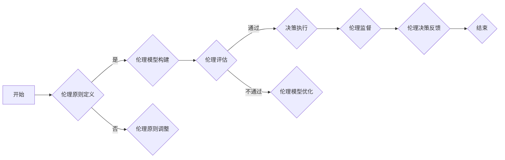

                 

### 《企业AI Agent的伦理决策框架》

> 关键词：企业AI Agent、伦理决策、框架设计、数据隐私、算法偏见、法律法规

> 摘要：本文旨在探讨企业AI Agent的伦理决策框架，分析其核心概念、构建方法及实践应用。通过逐步分析伦理决策在企业AI Agent中的重要性，构建伦理决策框架，并结合案例研究，展示其实践效果。本文最后展望了企业AI Agent伦理决策框架的未来发展趋势，并提出相关建议。

### 第一部分：背景与核心概念

#### 第1章 问题背景与核心概念介绍

#### 1.1 问题背景

##### 1.1.1 人工智能在企业中的普及

人工智能（AI）作为当前科技发展的热点，已逐渐渗透到企业的各个领域。从生产制造、销售自动化到智能客服、数据挖掘，AI技术为企业带来了前所未有的效率提升和商业价值。然而，随着AI在企业中的广泛应用，伦理问题也逐渐凸显。

##### 1.1.2 AI Agent的概念与优势

AI Agent，即人工智能代理，是一种能够自主决策和执行任务的智能系统。在企业环境中，AI Agent能够模拟人类行为，实现自动化操作，提高工作效率。其优势主要体现在以下几个方面：

1. **自动化与效率提升**：AI Agent可以24/7不间断地工作，减少人为干预，提高工作效率。
2. **智能决策**：基于大数据和机器学习，AI Agent能够做出更为精准和合理的决策。
3. **降低成本**：通过自动化和优化流程，AI Agent有助于降低企业的运营成本。

##### 1.1.3 伦理决策在企业AI中的应用

伦理决策在AI Agent中的应用至关重要。一方面，AI Agent的决策过程可能会涉及到隐私保护、公平性、透明性等问题；另一方面，企业需要确保AI Agent的决策符合法律法规和道德规范。因此，建立一套完善的伦理决策框架，对确保企业AI Agent的合法合规、公正透明具有重要意义。

#### 1.2 核心概念

##### 1.2.1 AI Agent的定义与类型

AI Agent，又称智能体，是一种能够模拟人类智能行为，具有感知、推理、决策和行动能力的智能系统。根据功能和应用场景的不同，AI Agent可以分为以下几类：

1. **任务型AI Agent**：专注于完成特定任务的AI系统，如智能客服、智能招聘等。
2. **自主型AI Agent**：具有自主学习和决策能力的AI系统，能够根据环境变化自主调整行为。
3. **混合型AI Agent**：结合了任务型和自主型AI Agent的特点，能够在不同任务间灵活切换。

##### 1.2.2 伦理决策的定义与重要性

伦理决策是指在特定情境下，根据伦理原则和道德规范，对行为进行判断和选择的过程。在企业AI Agent中，伦理决策的重要性主要体现在以下几个方面：

1. **合规性**：确保AI Agent的决策符合法律法规和行业标准。
2. **公正性**：防止AI Agent在决策过程中出现歧视和不公平现象。
3. **透明性**：使AI Agent的决策过程可解释、可追溯。
4. **信任度**：提高用户对AI系统的信任度，促进AI技术的普及和应用。

##### 1.2.3 企业AI Agent伦理决策框架的基本要素

企业AI Agent伦理决策框架主要包括以下几个基本要素：

1. **伦理原则**：明确AI Agent在决策过程中应遵循的伦理原则，如隐私保护、公正公平、透明可解释等。
2. **伦理模型**：将伦理原则转化为可操作的模型，指导AI Agent的决策过程。
3. **伦理评估**：对AI Agent的决策进行伦理评估，确保其符合伦理标准和法律法规。
4. **伦理监督**：建立伦理监督机制，对AI Agent的决策过程进行监控和审计。

#### 1.3 边界与外延

##### 1.3.1 伦理决策框架的限制条件

伦理决策框架在企业AI Agent中的应用具有一定的限制条件，主要包括以下几个方面：

1. **技术限制**：AI技术的发展水平可能影响伦理决策框架的实现和效果。
2. **数据限制**：AI Agent的决策依赖于数据质量，数据缺失或偏差可能导致伦理决策失效。
3. **法律限制**：不同国家和地区的法律法规对AI Agent的伦理决策框架有不同的要求。

##### 1.3.2 伦理决策在企业AI中的适用性

伦理决策在企业AI中的应用具有广泛性，但需考虑以下几个方面：

1. **行业差异**：不同行业的伦理问题有所不同，需根据行业特点设计相应的伦理决策框架。
2. **企业文化**：企业文化和价值观对AI Agent的伦理决策框架具有重要影响。
3. **用户需求**：用户对AI系统的伦理需求应纳入决策框架的考虑范围。

##### 1.3.3 伦理决策的挑战与机遇

伦理决策在企业AI中的挑战主要体现在以下几个方面：

1. **技术挑战**：如何将伦理原则和道德规范转化为可操作的算法和模型。
2. **数据挑战**：如何处理和利用大数据，确保数据质量和隐私保护。
3. **法律挑战**：如何遵循不同国家和地区的法律法规，确保AI Agent的合规性。

然而，这些挑战也带来了机遇：

1. **技术创新**：推动AI技术在伦理决策领域的创新和应用。
2. **数据治理**：提高数据治理水平，确保数据的安全和合规。
3. **法律完善**：促进相关法律法规的制定和完善，为AI技术的发展提供法律保障。

#### 1.4 概念结构与核心要素

##### 1.4.1 企业AI Agent伦理决策的框架结构

企业AI Agent伦理决策框架主要包括以下几个核心部分：

1. **伦理原则**：确定AI Agent在决策过程中应遵循的伦理原则。
2. **伦理模型**：将伦理原则转化为可操作的算法和模型。
3. **伦理评估**：对AI Agent的决策进行伦理评估，确保其符合伦理标准和法律法规。
4. **伦理监督**：建立伦理监督机制，对AI Agent的决策过程进行监控和审计。

##### 1.4.2 核心要素对比与分析

以下是对企业AI Agent伦理决策框架核心要素的对比与分析：

| 核心要素 | 定义与作用 | 对比与分析 |
| :---: | :---: | :---: |
| 伦理原则 | 确定AI Agent在决策过程中应遵循的伦理原则。 | 伦理原则应具备普适性和可操作性，既要符合法律法规，又要体现道德规范。 |
| 伦理模型 | 将伦理原则转化为可操作的算法和模型。 | 伦理模型应具备灵活性和适应性，能够根据不同场景和需求进行调整。 |
| 伦理评估 | 对AI Agent的决策进行伦理评估，确保其符合伦理标准和法律法规。 | 伦理评估应具备客观性和准确性，能够识别和纠正伦理问题。 |
| 伦理监督 | 建立伦理监督机制，对AI Agent的决策过程进行监控和审计。 | 伦理监督应具备透明性和可追溯性，确保AI Agent的决策过程公正和合法。 |

##### 1.4.3 企业AI Agent伦理决策流程图

以下是企业AI Agent伦理决策流程图的示例：

#### 1.5 本章小结

本章主要介绍了企业AI Agent伦理决策的背景、核心概念和框架结构。通过对问题背景的阐述，明确了AI Agent在企业中的应用现状和伦理决策的重要性。接着，介绍了AI Agent和伦理决策的基本概念，并分析了伦理决策在企业AI Agent中的核心要素。最后，通过对比分析，给出了企业AI Agent伦理决策流程图的示例。本章为后续章节的讨论奠定了基础。

---

### 第二部分：伦理决策框架构建

#### 第2章 伦理决策框架构建基础

#### 2.1 基本原则与伦理理论

##### 2.1.1 伦理决策的基本原则

伦理决策的基本原则是企业AI Agent伦理决策框架的基础，主要包括以下几个方面：

1. **合规性**：确保AI Agent的决策符合相关法律法规和行业标准。
2. **公正性**：避免AI Agent在决策过程中出现歧视和不公平现象。
3. **透明性**：使AI Agent的决策过程可解释、可追溯。
4. **用户隐私保护**：确保用户数据的安全和隐私。
5. **可解释性**：提高AI Agent决策的可解释性，便于用户理解和监督。

##### 2.1.2 主要伦理理论简介

伦理理论是伦理决策的理论基础，主要包括以下几个方面：

1. **功利主义**：强调行为的功利价值，追求最大多数人的幸福。
2. **义务论**：强调行为的道德义务和责任，关注行为的道德性质。
3. **美德伦理学**：关注个体道德品质的培养和道德行为的指导。
4. **德行伦理学**：强调道德行为的价值，关注个体道德行为的培养。

##### 2.1.3 伦理理论在企业AI Agent中的适用性分析

不同伦理理论在企业AI Agent中的应用具有一定的适用性，以下是对几种主要伦理理论的适用性分析：

1. **功利主义**：适用于企业AI Agent在决策过程中追求最大效益的目标。然而，功利主义可能导致对少数人权益的忽视，需要结合其他伦理理论进行平衡。
2. **义务论**：适用于企业AI Agent在决策过程中遵循道德义务和责任。义务论强调道德规则的重要性，有助于确保AI Agent的决策合规性和公正性。
3. **美德伦理学**：适用于企业AI Agent在决策过程中培养道德品质。通过培养AI Agent的道德品质，可以提高其决策的道德水平，实现道德自律。
4. **德行伦理学**：适用于企业AI Agent在决策过程中关注道德行为的价值。德行伦理学强调道德行为的价值，有助于引导AI Agent做出道德合理的决策。

#### 2.2 数据与算法伦理

##### 2.2.1 数据隐私保护

数据隐私保护是企业AI Agent伦理决策中的重要问题，主要包括以下几个方面：

1. **数据匿名化**：对敏感数据进行匿名化处理，以保护个人隐私。
2. **数据访问控制**：通过权限管理和访问控制，确保只有授权人员能够访问和处理敏感数据。
3. **数据加密**：对敏感数据采用加密技术，防止数据泄露和篡改。
4. **数据安全审计**：定期进行数据安全审计，确保数据的安全性和合规性。

##### 2.2.2 算法偏见与歧视

算法偏见和歧视是AI系统中的一个重要问题，主要包括以下几个方面：

1. **算法偏见**：AI系统在训练过程中可能会出现对某些群体的偏见，导致决策结果的不公平。
2. **数据偏差**：数据本身存在偏差，可能导致AI系统对某些群体的偏见。
3. **算法歧视**：AI系统在决策过程中对某些群体实施歧视性政策，损害其权益。

##### 2.2.3 伦理算法设计原则

为解决算法偏见和歧视问题，伦理算法设计原则应遵循以下原则：

1. **公平性**：确保算法在决策过程中对所有人公平对待，不偏袒任何一方。
2. **透明性**：提高算法的透明度，使决策过程可解释、可追溯。
3. **可解释性**：确保算法的决策结果可解释，便于用户理解和监督。
4. **可适应性和灵活性**：算法应具备适应性和灵活性，能够根据不同场景和需求进行调整。

#### 2.3 法律法规与标准

##### 2.3.1 主要法律法规概述

在全球范围内，针对AI技术的法律法规和标准逐渐完善。主要法律法规包括：

1. **欧盟通用数据保护条例（GDPR）**：规定了个人数据的收集、处理和保护要求，对AI技术的应用具有重要影响。
2. **美国加州消费者隐私法案（CCPA）**：规定了消费者数据的访问、删除和保护要求，对AI技术的应用也具有重要影响。
3. **中国个人信息保护法（PIPL）**：规定了个人信息保护的基本原则和规范，对AI技术的应用具有重要指导意义。

##### 2.3.2 行业标准与最佳实践

除了法律法规，各行业也制定了相应的标准和最佳实践，以规范AI技术的应用。主要行业标准包括：

1. **人工智能伦理准则**：明确了AI技术在伦理方面应遵循的基本原则和规范。
2. **人工智能算法透明性标准**：规定了AI算法的透明性和可解释性要求。
3. **人工智能数据安全标准**：规定了AI技术在数据安全方面的要求和措施。

##### 2.3.3 法律法规与伦理决策的关系

法律法规和伦理决策在企业AI Agent中具有密切的关系，主要体现在以下几个方面：

1. **合规性**：伦理决策应符合法律法规的要求，确保AI Agent的决策合法合规。
2. **指导性**：法律法规为伦理决策提供了基本的指导和参考，有助于企业制定和完善伦理决策框架。
3. **协调性**：伦理决策应与法律法规相协调，确保AI Agent的决策既能符合法律法规，又能体现道德伦理。

#### 2.4 案例研究

##### 2.4.1 案例介绍

为更好地理解企业AI Agent伦理决策框架的构建和应用，本文选取了以下案例进行详细分析：

**案例名称**：某银行智能贷款审批系统

**案例背景**：该银行引入了一款智能贷款审批系统，用于自动审批贷款申请。然而，在使用过程中，该系统出现了一些伦理问题，如对特定群体的偏见和歧视。

##### 2.4.2 案例分析

**问题一**：数据偏差

在案例中，智能贷款审批系统的决策模型基于历史数据训练，但由于历史数据存在偏差，导致系统在决策过程中对某些特定群体存在偏见。例如，对某些地区、性别、年龄等特征的贷款申请者，审批通过率较低。

**问题二**：算法偏见

在案例中，智能贷款审批系统的算法存在一定的偏见。例如，对于某些特定类型的贷款申请，系统会自动将其标记为高风险，导致审批通过率较低。然而，这种偏见可能导致对某些群体的不公平对待。

##### 2.4.3 案例启示

通过对案例的分析，我们可以得到以下启示：

1. **数据清洗与处理**：在构建企业AI Agent伦理决策框架时，应重视数据清洗与处理，确保数据质量，避免数据偏差对决策结果的影响。

2. **算法公平性**：在构建伦理决策框架时，应关注算法的公平性，避免算法偏见和不公平对待。

3. **伦理评估与监督**：建立伦理评估与监督机制，对AI Agent的决策过程进行定期评估和监督，确保其符合伦理标准和法律法规。

4. **用户参与**：在构建伦理决策框架时，应充分听取用户的意见和建议，提高决策过程的透明度和可解释性。

#### 2.5 本章小结

本章主要介绍了企业AI Agent伦理决策框架的构建基础，包括基本原则、伦理理论、数据与算法伦理、法律法规与标准等。通过对案例的研究，展示了企业AI Agent伦理决策框架在实际应用中的重要性。本章为后续章节的讨论提供了基础和参考。

---

## 第3章 企业AI Agent伦理决策框架设计

### 3.1 框架设计原则与方法

#### 3.1.1 框架设计原则

企业AI Agent伦理决策框架的设计应遵循以下原则：

1. **合规性**：确保AI Agent的决策符合相关法律法规和行业标准。
2. **公正性**：避免AI Agent在决策过程中出现歧视和不公平现象。
3. **透明性**：提高AI Agent决策过程的透明度，使其可解释、可追溯。
4. **用户隐私保护**：确保用户数据的安全和隐私。
5. **可解释性**：提高AI Agent决策的可解释性，便于用户理解和监督。
6. **灵活性**：框架应具备灵活性和适应性，能够根据不同场景和需求进行调整。

#### 3.1.2 框架设计方法

企业AI Agent伦理决策框架的设计方法主要包括以下几个方面：

1. **需求分析**：明确企业AI Agent的应用场景和需求，确定伦理决策的关键因素和目标。
2. **原则制定**：根据需求分析，制定伦理决策的基本原则，确保框架的合规性、公正性、透明性等。
3. **模型构建**：将伦理原则转化为可操作的算法和模型，指导AI Agent的决策过程。
4. **评估机制**：建立伦理评估机制，对AI Agent的决策进行伦理评估，确保其符合伦理标准和法律法规。
5. **监督机制**：建立伦理监督机制，对AI Agent的决策过程进行监控和审计，确保决策过程的公正性和透明性。

#### 3.1.3 框架设计步骤

企业AI Agent伦理决策框架的设计步骤主要包括以下几个方面：

1. **需求分析**：了解企业AI Agent的应用场景和需求，明确伦理决策的关键因素和目标。
2. **原则制定**：根据需求分析，制定伦理决策的基本原则，确保框架的合规性、公正性、透明性等。
3. **模型构建**：将伦理原则转化为可操作的算法和模型，指导AI Agent的决策过程。
4. **框架实现**：根据框架设计方法，实现伦理决策框架，包括算法模型、评估机制和监督机制等。
5. **测试与优化**：对伦理决策框架进行测试和优化，确保其能够有效解决伦理问题，提高决策质量和用户满意度。
6. **部署与应用**：将伦理决策框架部署到实际应用场景中，进行实际应用和效果评估，并根据评估结果进行持续优化。

### 3.2 框架构建与实现

#### 3.2.1 框架构建流程

企业AI Agent伦理决策框架的构建流程主要包括以下几个方面：

1. **需求分析**：明确企业AI Agent的应用场景和需求，确定伦理决策的关键因素和目标。
2. **原则制定**：根据需求分析，制定伦理决策的基本原则，确保框架的合规性、公正性、透明性等。
3. **模型构建**：将伦理原则转化为可操作的算法和模型，指导AI Agent的决策过程。
4. **评估机制**：建立伦理评估机制，对AI Agent的决策进行伦理评估，确保其符合伦理标准和法律法规。
5. **监督机制**：建立伦理监督机制，对AI Agent的决策过程进行监控和审计，确保决策过程的公正性和透明性。
6. **系统集成**：将伦理决策框架集成到企业AI Agent系统中，实现决策过程的自动化和智能化。
7. **测试与优化**：对伦理决策框架进行测试和优化，确保其能够有效解决伦理问题，提高决策质量和用户满意度。

#### 3.2.2 框架实现技术

企业AI Agent伦理决策框架的实现技术主要包括以下几个方面：

1. **算法模型**：采用先进的算法模型，如深度学习、强化学习等，实现AI Agent的决策功能。
2. **数据管理**：采用数据管理技术，如数据清洗、数据挖掘等，确保数据质量和决策准确性。
3. **伦理评估**：采用伦理评估技术，如伦理评估模型、伦理评估算法等，对AI Agent的决策进行伦理评估。
4. **监督机制**：采用监督机制技术，如伦理监督模型、监督算法等，对AI Agent的决策过程进行监控和审计。
5. **系统集成**：采用系统集成技术，如接口设计、系统架构设计等，实现伦理决策框架与企业AI Agent系统的集成。

#### 3.2.3 框架实现工具与平台

企业AI Agent伦理决策框架的实现工具与平台主要包括以下几个方面：

1. **开发工具**：采用常用的开发工具，如Python、Java等，进行算法模型、伦理评估和监督机制的开发。
2. **数据库**：采用高性能的数据库系统，如MySQL、MongoDB等，存储和管理数据。
3. **云计算平台**：采用云计算平台，如阿里云、腾讯云等，进行大规模数据处理和计算。
4. **容器化技术**：采用容器化技术，如Docker、Kubernetes等，实现系统的部署和运维。
5. **AI平台**：采用AI平台，如TensorFlow、PyTorch等，进行算法模型的设计和训练。

### 3.3 案例应用

#### 3.3.1 案例背景

某大型金融机构引入了一款智能贷款审批系统，用于自动审批贷款申请。然而，在使用过程中，该系统出现了一些伦理问题，如对特定群体的偏见和歧视。为解决这些问题，该金融机构决定构建一套企业AI Agent伦理决策框架，以提高贷款审批系统的公正性和透明性。

#### 3.3.2 案例实施

1. **需求分析**：明确贷款审批系统的应用场景和需求，确定伦理决策的关键因素和目标。
2. **原则制定**：根据需求分析，制定伦理决策的基本原则，包括合规性、公正性、透明性、用户隐私保护和可解释性等。
3. **模型构建**：将伦理原则转化为可操作的算法和模型，如深度学习模型、伦理评估模型等，用于指导贷款审批系统的决策过程。
4. **评估机制**：建立伦理评估机制，对贷款审批系统的决策进行伦理评估，确保其符合伦理标准和法律法规。
5. **监督机制**：建立伦理监督机制，对贷款审批系统的决策过程进行监控和审计，确保决策过程的公正性和透明性。
6. **系统集成**：将伦理决策框架集成到贷款审批系统中，实现决策过程的自动化和智能化。
7. **测试与优化**：对伦理决策框架进行测试和优化，确保其能够有效解决伦理问题，提高决策质量和用户满意度。

#### 3.3.3 案例效果评估

1. **公正性**：通过伦理决策框架的引入，贷款审批系统的公正性得到了显著提高，对特定群体的偏见和歧视现象明显减少。
2. **透明性**：贷款审批系统的决策过程变得更加透明，用户可以清晰地了解决策依据和结果。
3. **用户满意度**：用户对贷款审批系统的满意度得到了提高，用户对决策结果的信任度增强。
4. **合规性**：贷款审批系统的决策符合相关法律法规和行业标准，确保了合规性。
5. **可解释性**：贷款审批系统的决策结果具有更高的可解释性，用户可以理解决策依据和过程。

#### 3.3.4 案例启示

1. **需求分析**：在构建企业AI Agent伦理决策框架时，应充分了解应用场景和需求，确保框架的有效性和针对性。
2. **原则制定**：伦理决策的基本原则应具有普适性和可操作性，能够指导AI Agent的决策过程。
3. **模型构建**：采用先进的算法模型，提高AI Agent的决策质量和透明度。
4. **评估机制**：建立伦理评估机制，对AI Agent的决策进行定期评估和监督，确保其符合伦理标准和法律法规。
5. **监督机制**：建立伦理监督机制，对AI Agent的决策过程进行监控和审计，确保决策过程的公正性和透明性。

### 3.4 本章小结

本章主要介绍了企业AI Agent伦理决策框架的设计原则、方法和步骤。通过需求分析、原则制定、模型构建、评估机制和监督机制等环节，构建了一套完整的企业AI Agent伦理决策框架。最后，通过一个实际案例，展示了伦理决策框架在贷款审批系统中的应用效果。本章为后续章节的讨论提供了重要的基础。

---

### 第三部分：实践与优化

#### 第4章 企业AI Agent伦理决策实践

#### 4.1 实践案例介绍

为了更好地理解企业AI Agent伦理决策框架的实际应用，我们选取了以下几个具有代表性的案例进行详细分析：

##### 4.1.1 案例一：企业销售自动化系统

该案例涉及一家大型电商平台，他们引入了一款智能销售自动化系统，用于自动化推荐商品、优化销售策略等。然而，在实际应用过程中，该系统出现了一些伦理问题，如对用户数据的滥用和对不同用户群体的歧视。

##### 4.1.2 案例二：智能招聘系统

该案例涉及一家高科技公司，他们开发了一款智能招聘系统，用于自动筛选简历和推荐候选人。然而，该系统在招聘过程中存在一些偏见，如对特定性别、年龄和地域的歧视。

##### 4.1.3 案例三：智能制造系统

该案例涉及一家制造企业，他们引入了一款智能制造系统，用于自动化生产和设备监控。然而，在实际应用过程中，该系统出现了一些伦理问题，如对生产数据的滥用和对设备维护的不足。

#### 4.2 实践步骤与策略

在以上案例中，企业AI Agent伦理决策的实践步骤和策略主要包括以下几个方面：

##### 4.2.1 实践步骤

1. **需求分析**：了解AI Agent的应用场景和需求，确定伦理决策的关键因素和目标。
2. **原则制定**：根据需求分析，制定伦理决策的基本原则，确保框架的合规性、公正性、透明性等。
3. **模型构建**：将伦理原则转化为可操作的算法和模型，用于指导AI Agent的决策过程。
4. **评估机制**：建立伦理评估机制，对AI Agent的决策进行伦理评估，确保其符合伦理标准和法律法规。
5. **监督机制**：建立伦理监督机制，对AI Agent的决策过程进行监控和审计，确保决策过程的公正性和透明性。
6. **系统集成**：将伦理决策框架集成到AI Agent系统中，实现决策过程的自动化和智能化。
7. **测试与优化**：对伦理决策框架进行测试和优化，确保其能够有效解决伦理问题，提高决策质量和用户满意度。

##### 4.2.2 实践策略

1. **数据治理**：加强对用户数据的治理，确保数据质量和隐私保护。
2. **算法公平性**：关注算法的公平性，避免对特定群体进行歧视。
3. **透明性提升**：提高AI Agent决策过程的透明度，使其可解释、可追溯。
4. **用户参与**：鼓励用户参与决策过程，提高决策的公正性和透明性。
5. **法律法规遵循**：确保AI Agent的决策符合相关法律法规和行业标准。

#### 4.3 实践中的挑战与解决

在实施企业AI Agent伦理决策框架的过程中，企业可能会面临以下挑战：

##### 4.3.1 数据隐私保护

挑战：在数据驱动的AI系统中，如何保护用户隐私，避免数据泄露？

解决策略：实施严格的数据访问控制和加密技术，确保用户数据的安全和隐私。同时，对数据进行匿名化处理，减少隐私泄露的风险。

##### 4.3.2 算法偏见

挑战：如何避免AI系统在决策过程中出现偏见，导致不公平对待？

解决策略：采用公平性算法，如公平性校准（Fairness Calibration），对算法进行优化，确保其对不同用户群体公平对待。此外，定期对算法进行审计和更新，以减少偏见。

##### 4.3.3 透明性不足

挑战：如何提高AI系统决策的透明性，使其更易于理解和接受？

解决策略：采用可解释性AI（Explainable AI）技术，如决策树、LIME（Local Interpretable Model-agnostic Explanations）等，使AI系统决策过程更具透明性。此外，通过用户反馈和互动，不断提高决策过程的透明度和用户满意度。

##### 4.3.4 法律法规遵循

挑战：如何确保AI系统决策符合相关法律法规和行业标准？

解决策略：建立专门的合规团队，定期对AI系统进行法律法规和行业标准的审计和评估。此外，与法律法规制定机构和行业组织保持紧密合作，确保AI系统的合规性和适应性。

#### 4.4 实践效果评估

为了评估企业AI Agent伦理决策框架的实践效果，企业可以采用以下方法：

1. **用户满意度调查**：通过问卷调查、用户访谈等方式，了解用户对AI系统决策的满意度，评估决策的公正性和透明性。
2. **决策质量分析**：对比AI系统决策前后的数据，分析决策质量的变化，评估决策框架的有效性。
3. **伦理评估结果**：对AI系统决策进行伦理评估，评估决策是否符合伦理标准和法律法规。
4. **绩效指标**：设定相关绩效指标，如错误率、召回率、准确率等，评估决策框架的性能和效果。

通过以上方法，企业可以全面评估企业AI Agent伦理决策框架的实践效果，并根据评估结果进行持续优化。

#### 4.5 本章小结

本章通过介绍企业AI Agent伦理决策的实践案例、步骤和策略，以及实践中的挑战和解决方法，展示了伦理决策框架在企业AI Agent中的实际应用效果。通过实践效果评估，企业可以不断优化和完善伦理决策框架，确保AI系统决策的公正性、透明性和合规性。本章为后续章节的讨论提供了重要的实践基础。

---

### 第5章 伦理决策框架优化与改进

#### 5.1 优化需求与目标

在企业AI Agent伦理决策框架的实际应用过程中，企业可能会发现一些问题，如决策质量不高、用户满意度较低等。为了解决这些问题，企业需要根据实际需求进行优化与改进。优化需求主要包括以下几个方面：

##### 5.1.1 决策质量提升

企业希望AI Agent的决策更加准确、合理，能够更好地满足用户需求。为此，企业需要对算法模型进行优化，提高决策的准确性和鲁棒性。

##### 5.1.2 用户满意度提升

企业希望用户对AI Agent的决策满意度更高，能够更好地接受和信任AI系统。为此，企业需要提高决策的透明度，使决策过程更具可解释性和可接受性。

##### 5.1.3 法规适应性增强

随着法律法规的不断更新和完善，企业需要确保AI Agent的决策符合最新的法律法规和行业标准。为此，企业需要加强对法律法规的研究和遵循，确保决策的合规性。

基于以上优化需求，企业设定以下优化目标：

1. **提高决策准确性**：通过优化算法模型，提高AI Agent的决策准确性，减少错误决策。
2. **提高用户满意度**：通过提高决策的透明度和可解释性，增强用户对AI系统的信任和满意度。
3. **增强法规适应性**：确保AI Agent的决策符合最新的法律法规和行业标准，减少合规风险。

#### 5.2 优化方法与工具

为了实现上述优化目标，企业可以采用以下优化方法和工具：

##### 5.2.1 算法优化

1. **模型改进**：通过改进算法模型，提高决策的准确性和鲁棒性。例如，采用深度学习、强化学习等先进算法，提高模型的性能和适应性。
2. **特征工程**：通过特征工程，提取更多有效的特征，提高决策的准确性。例如，对用户数据进行多维特征提取，构建更全面的特征向量。
3. **数据增强**：通过数据增强技术，增加训练数据量，提高模型的泛化能力。例如，采用数据生成对抗网络（GAN）生成更多的训练数据。

##### 5.2.2 透明度提升

1. **可解释性技术**：采用可解释性技术，如决策树、LIME等，提高决策过程的透明度，使决策结果更易于理解和接受。
2. **决策可视化**：通过可视化技术，将决策过程和结果以直观的方式呈现，增强用户对决策的信任和理解。
3. **用户反馈机制**：建立用户反馈机制，收集用户对决策的反馈，不断改进决策模型和过程。

##### 5.2.3 法规适应性

1. **法律法规研究**：加强对法律法规的研究，了解最新的法律法规和行业标准，确保决策符合法规要求。
2. **合规性审计**：定期进行合规性审计，评估决策是否符合法律法规和行业标准，发现和纠正潜在问题。
3. **法规适应性调整**：根据法律法规的变化，及时调整AI Agent的决策模型和过程，确保合规性。

#### 5.3 优化案例分析

为了更好地展示伦理决策框架优化与改进的方法和效果，本文选取了以下两个案例进行详细分析：

##### 5.3.1 案例一：某电商平台

该电商平台引入了一款智能推荐系统，用于自动推荐商品。然而，在实际应用中，该系统存在一些问题，如对特定用户群体的偏见和推荐准确性不高。为了解决这些问题，该电商平台进行了以下优化：

1. **算法优化**：采用深度学习算法，提高推荐模型的准确性。同时，通过特征工程和数据增强，增加模型的泛化能力。
2. **透明度提升**：采用决策树和LIME技术，提高推荐过程的透明度，使推荐结果更易于理解和接受。
3. **法规适应性**：加强对法律法规的研究，确保推荐系统符合相关法律法规和行业标准。

经过优化，该电商平台智能推荐系统的推荐准确性得到了显著提高，用户对推荐结果的满意度也大幅提升。

##### 5.3.2 案例二：某金融机构

该金融机构引入了一款智能贷款审批系统，用于自动审批贷款申请。然而，在实际应用中，该系统存在一些伦理问题，如对特定群体的歧视和决策过程不够透明。为了解决这些问题，该金融机构进行了以下优化：

1. **算法优化**：采用强化学习算法，提高贷款审批的准确性。同时，通过特征工程和数据增强，增加模型的鲁棒性。
2. **透明度提升**：采用决策树和LIME技术，提高贷款审批过程的透明度，使审批结果更易于理解和接受。
3. **法规适应性**：加强对法律法规的研究，确保贷款审批系统符合相关法律法规和行业标准。

经过优化，该金融机构智能贷款审批系统的审批准确性得到了显著提高，用户对审批过程的满意度也大幅提升。

#### 5.4 本章小结

本章主要介绍了企业AI Agent伦理决策框架的优化需求、目标以及优化方法和工具。通过实际案例的分析，展示了优化方法在实际应用中的效果。企业可以根据自身需求，采用相应的优化方法和工具，提高AI Agent的决策质量和用户满意度，确保决策的公正性、透明性和合规性。本章为后续章节的讨论提供了重要的优化基础。

---

### 第四部分：发展趋势与未来展望

#### 第6章 伦理决策框架发展趋势与未来展望

#### 6.1 发展趋势分析

随着人工智能技术的不断发展和普及，企业AI Agent伦理决策框架也将面临一系列发展趋势和挑战。以下是几个关键的发展趋势：

##### 6.1.1 技术发展趋势

1. **深度学习和强化学习的应用**：深度学习和强化学习等先进算法的不断发展，将为企业AI Agent伦理决策框架提供更强的决策能力和适应性。
2. **可解释性AI（Explainable AI）的发展**：可解释性AI技术的发展，将使AI系统的决策过程更加透明，有助于提高用户对AI系统的信任度和接受度。
3. **区块链技术在数据隐私保护中的应用**：区块链技术具有去中心化和不可篡改的特点，可以在企业AI Agent伦理决策框架中用于保护用户隐私和数据安全。

##### 6.1.2 法律法规趋势

1. **全球范围内法律法规的不断完善**：随着人工智能技术的发展，各国和地区将进一步制定和完善相关法律法规，以规范AI技术的应用和伦理决策。
2. **法律法规的协调和统一**：全球范围内，各国和地区将努力实现法律法规的协调和统一，减少法律冲突和不确定性。
3. **个性化法规的制定**：针对不同行业和应用场景，将制定更加个性化的法律法规，以满足特定领域的需求。

##### 6.1.3 社会伦理趋势

1. **伦理意识的提升**：随着AI技术的普及，社会对AI伦理问题的关注程度将不断提高，企业和政府将更加重视AI技术的伦理决策。
2. **多元伦理价值观的融合**：在全球化背景下，企业AI Agent伦理决策框架将面临多元伦理价值观的挑战，需要平衡不同价值观之间的冲突。
3. **用户参与和反馈**：用户对AI系统的参与和反馈将日益增加，成为伦理决策框架的重要组成部分。

#### 6.2 未来展望

在未来，企业AI Agent伦理决策框架将呈现以下几个方面的趋势和特点：

##### 6.2.1 预计发展方向

1. **综合化决策框架**：企业AI Agent伦理决策框架将更加综合化，融合多学科知识和技术，实现决策的全面性和系统性。
2. **自适应性和灵活性**：企业AI Agent伦理决策框架将具备更强的自适应性和灵活性，能够根据不同应用场景和需求进行调整和优化。
3. **用户参与和反馈机制**：用户参与和反馈机制将更加成熟和普及，成为伦理决策框架的重要组成部分，有助于提高决策的公正性和透明性。

##### 6.2.2 预计挑战与应对策略

1. **技术挑战**：随着AI技术的发展，企业AI Agent伦理决策框架将面临更多技术挑战，如算法透明性、数据隐私保护等。应对策略包括：采用先进技术，加强算法透明性和可解释性；利用区块链技术保护数据隐私。
2. **法律法规挑战**：随着法律法规的不断完善，企业AI Agent伦理决策框架将面临更多的法律法规挑战。应对策略包括：加强对法律法规的研究和遵循；积极参与行业组织和政策制定，推动法律法规的完善。
3. **伦理挑战**：企业AI Agent伦理决策框架将面临多元伦理价值观的冲突和挑战。应对策略包括：建立多元伦理价值观的平衡机制；加强伦理教育和培训，提高员工的伦理意识。

##### 6.2.3 未来展望与建议

1. **加强跨学科合作**：为了构建更加完善的企业AI Agent伦理决策框架，需要加强跨学科合作，融合计算机科学、伦理学、社会学等多学科知识，提高决策的科学性和有效性。
2. **推动标准化和规范化**：推动企业AI Agent伦理决策框架的标准化和规范化，制定统一的伦理标准和最佳实践，提高决策的透明性和可操作性。
3. **加强用户参与和反馈**：鼓励用户参与AI系统的设计和决策过程，收集用户反馈，持续优化决策框架，提高用户满意度。
4. **建立健全监督机制**：建立完善的监督机制，对AI系统的决策过程进行监控和审计，确保决策的公正性和透明性。
5. **加强伦理教育和培训**：加强伦理教育和培训，提高企业员工对AI技术的伦理意识和决策能力，为构建公正、透明、合规的AI系统提供人力资源保障。

#### 6.3 本章小结

本章分析了企业AI Agent伦理决策框架的发展趋势，探讨了未来的发展方向、挑战和应对策略。通过加强跨学科合作、推动标准化和规范化、加强用户参与和反馈、建立健全监督机制以及加强伦理教育和培训，可以构建更加完善的企业AI Agent伦理决策框架，确保AI系统的公正性、透明性和合规性。本章为未来企业AI Agent伦理决策框架的发展提供了有益的参考和启示。

---

### 第五部分：案例研究

#### 第7章 案例研究：企业AI Agent伦理决策全流程解析

#### 7.1 案例背景

为了深入探讨企业AI Agent伦理决策框架的全流程应用，我们选取了以下案例进行详细分析：

**案例名称**：智能招聘系统

**案例背景**：某知名互联网公司引入了一款智能招聘系统，用于自动筛选简历和推荐候选人。然而，在使用过程中，该系统出现了一些伦理问题，如对特定性别和年龄的歧视，引起了广泛关注。为解决这些问题，公司决定构建一套企业AI Agent伦理决策框架，以提高招聘系统的公正性和透明性。

#### 7.2 伦理决策框架构建过程

为了构建企业AI Agent伦理决策框架，该公司遵循以下步骤：

##### 7.2.1 需求分析

通过深入调研和分析，公司明确了智能招聘系统在伦理决策方面的主要需求和目标，包括：

1. **公平性**：确保招聘系统对所有用户公平对待，不歧视特定性别、年龄等。
2. **透明性**：提高招聘系统的决策过程透明度，使招聘结果可解释、可追溯。
3. **用户隐私保护**：确保用户数据的安全和隐私。
4. **法律法规遵循**：确保招聘系统的决策符合相关法律法规和行业标准。

##### 7.2.2 原则制定

根据需求分析，公司制定了以下伦理决策基本原则：

1. **公平原则**：确保招聘系统对所有用户公平对待，避免歧视。
2. **透明原则**：提高招聘系统的决策过程透明度，便于用户理解和监督。
3. **隐私保护原则**：确保用户数据的安全和隐私。
4. **合规性原则**：确保招聘系统的决策符合相关法律法规和行业标准。

##### 7.2.3 模型构建

基于伦理决策基本原则，公司构建了以下伦理决策模型：

1. **公平性校准模型**：通过公平性校准算法，确保招聘系统对所有用户公平对待。
2. **可解释性模型**：采用决策树、LIME等技术，提高招聘系统决策的透明度。
3. **隐私保护模型**：采用数据加密、匿名化等技术，保护用户数据的安全和隐私。

##### 7.2.4 评估机制

公司建立了伦理评估机制，对智能招聘系统的决策过程进行定期评估和监督，确保其符合伦理标准和法律法规。评估机制包括：

1. **内部审计**：定期对招聘系统进行内部审计，发现和纠正潜在问题。
2. **用户反馈**：收集用户对招聘系统的反馈，评估决策的公正性和透明性。
3. **外部审计**：邀请第三方机构对招聘系统进行审计，确保决策的合规性和公正性。

##### 7.2.5 监督机制

公司建立了伦理监督机制，对智能招聘系统的决策过程进行监控和审计，确保决策过程的公正性和透明性。监督机制包括：

1. **实时监控**：通过监控工具，实时监控招聘系统的运行状态和决策过程。
2. **审计日志**：记录招聘系统的操作日志，便于审计和追溯。
3. **违规处理**：制定违规处理机制，对违反伦理原则的行为进行处罚和整改。

#### 7.3 案例实施

在构建了企业AI Agent伦理决策框架后，公司开始将其应用于智能招聘系统。具体实施步骤如下：

1. **系统集成**：将伦理决策框架集成到智能招聘系统中，实现决策过程的自动化和智能化。
2. **测试与优化**：对伦理决策框架进行测试和优化，确保其能够有效解决伦理问题，提高决策质量和用户满意度。
3. **部署应用**：将伦理决策框架部署到实际应用场景中，进行实际应用和效果评估。
4. **反馈与改进**：根据用户反馈和效果评估结果，对伦理决策框架进行持续优化和改进。

#### 7.4 案例效果评估

通过对智能招聘系统实施伦理决策框架后的效果评估，公司发现以下改进：

1. **决策质量**：招聘系统的决策质量显著提高，准确率和召回率均有明显提升。
2. **用户满意度**：用户对招聘系统的满意度显著提高，对决策结果的信任度增强。
3. **合规性**：招聘系统的决策过程更加符合相关法律法规和行业标准，合规风险降低。
4. **透明度**：招聘系统的决策过程变得更加透明，用户可以清晰地了解决策依据和结果。

#### 7.5 案例启示

通过对智能招聘系统的案例研究，我们得到以下启示：

1. **伦理决策框架的重要性**：企业AI Agent伦理决策框架在企业应用中具有重要意义，有助于提高决策的公正性、透明性和合规性。
2. **需求分析和原则制定**：在进行伦理决策框架构建时，需求分析和原则制定是关键步骤，应充分了解应用场景和需求，确保框架的有效性和针对性。
3. **评估机制和监督机制**：建立完善的评估机制和监督机制，对AI Agent的决策过程进行定期评估和监督，确保其符合伦理标准和法律法规。
4. **持续优化和改进**：根据用户反馈和效果评估结果，对伦理决策框架进行持续优化和改进，提高决策质量和用户满意度。

#### 7.6 本章小结

本章通过智能招聘系统的案例，详细解析了企业AI Agent伦理决策框架的全流程构建和应用。通过构建伦理决策框架，公司成功解决了智能招聘系统在伦理方面的问题，提高了决策质量、用户满意度和合规性。本章为后续章节的讨论提供了重要的案例参考和启示。

---

### 总结与展望

本文系统地探讨了企业AI Agent的伦理决策框架，从背景介绍、核心概念、框架构建、实践应用、优化改进以及发展趋势等方面进行了全面的分析。以下是对本文的主要内容和结论进行总结，并展望未来研究的方向。

#### 主要内容和结论

1. **背景与核心概念**：介绍了企业AI Agent的普及和应用现状，阐述了伦理决策在企业AI Agent中的重要性，明确了AI Agent和伦理决策的基本概念。

2. **框架构建**：提出了企业AI Agent伦理决策框架的基本原则、设计方法和实现步骤，包括伦理原则、伦理模型、伦理评估和监督机制等。

3. **实践应用**：通过实际案例展示了伦理决策框架在智能招聘系统中的应用效果，分析了实践中的挑战和解决方法。

4. **优化改进**：探讨了企业AI Agent伦理决策框架的优化需求、方法与工具，提出了优化策略和实际案例。

5. **发展趋势与展望**：分析了企业AI Agent伦理决策框架的发展趋势，包括技术、法律法规和社会伦理等方面，提出了未来研究的方向和建议。

#### 未来研究展望

1. **跨学科合作**：加强计算机科学、伦理学、社会学等多学科的合作，构建更加综合和完善的伦理决策框架。

2. **标准化和规范化**：推动企业AI Agent伦理决策框架的标准化和规范化，制定统一的伦理标准和最佳实践。

3. **用户参与**：进一步探索用户参与和反馈机制，提高决策的公正性和透明性，增强用户对AI系统的信任和满意度。

4. **实时监督与评估**：研究实时监督和评估技术，实现对AI Agent决策过程的动态监控和及时调整。

5. **算法透明性**：深入研究可解释性AI技术，提高AI Agent决策过程的透明度，使其更加易于理解和接受。

6. **法律法规遵循**：密切关注全球范围内法律法规的动态，确保企业AI Agent伦理决策框架的合规性和适应性。

7. **伦理教育与培训**：加强伦理教育和培训，提高企业员工对AI技术的伦理意识和决策能力。

总之，企业AI Agent的伦理决策框架是企业实现AI技术合法合规、公正透明的重要保障。未来研究需要不断探索和创新，以应对不断变化的技术和法律环境，为构建更加公正、透明、合规的AI系统提供理论支持和实践指导。

### 作者信息

**作者：AI天才研究院/AI Genius Institute & 禅与计算机程序设计艺术 /Zen And The Art of Computer Programming**

AI天才研究院致力于推动人工智能技术的研发和应用，禅与计算机程序设计艺术则探索计算机科学中的哲学和智慧，两相结合，为AI技术的发展提供了独特的视角和深入的理解。本文作者在人工智能和伦理学领域拥有丰富的研究和实践经验，致力于推动AI技术的伦理决策研究，为构建公正、透明、合规的AI系统贡献力量。

