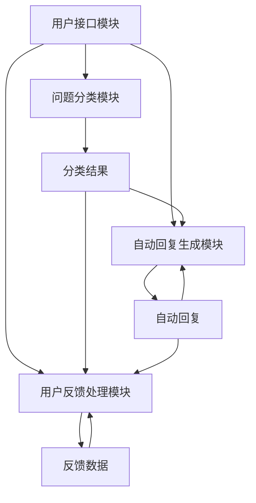
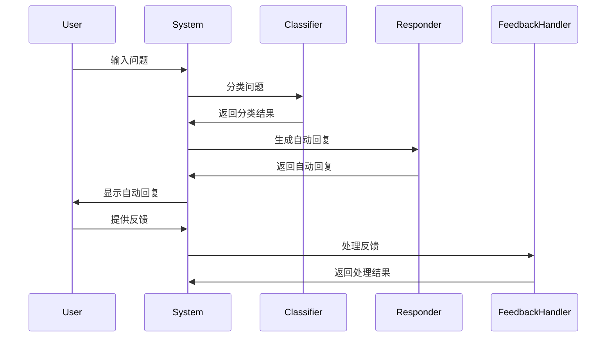

                 


## 引言

随着人工智能技术的飞速发展，企业AI Agent（人工智能代理）已成为提高企业运营效率和决策质量的关键工具。企业AI Agent是指能够自主执行任务、进行决策和与人类交互的智能系统。它们在数据分析、资源优化、客户服务等多个领域展现了巨大的潜力。然而，企业AI Agent在面对新任务和新领域时，往往需要大量时间进行学习和适应，这限制了其灵活性和应用范围。

### 关键词：
- 企业AI Agent
- 元学习
- 快速适应
- 新任务与领域

### 摘要：

本文将探讨企业AI Agent的元学习应用，旨在解决其在新任务与领域适应过程中的挑战。通过介绍元学习的基本概念和原理，以及其在企业AI Agent中的应用，我们将阐述如何利用元学习技术加速AI Agent的适应过程，提高其灵活性和效率。

### 文章结构：

本文分为五个主要部分：

1. **背景介绍**：介绍企业AI Agent的定义、元学习的概念，以及为何元学习对企业AI Agent具有重要作用。
2. **核心概念与联系**：详细解释AI Agent和元学习的定义及其相互作用。
3. **算法原理讲解**：通过算法流程图和具体实例，展示元学习算法的基本原理。
4. **系统分析与架构设计**：描述一个典型应用场景，并展示系统功能和架构设计。
5. **项目实战**：介绍环境安装、核心代码实现，并分析一个实际案例。

接下来，我们将逐一细化每个部分的内容。

## 第一部分：背景介绍

### 1.1 AI Agent的定义与分类

AI Agent是指具备自主决策能力、能够执行特定任务的人工智能系统。根据功能和应用场景，AI Agent可以分为以下几类：

1. **任务型Agent**：专注于执行特定任务，如自动客服机器人、智能助手等。
2. **决策型Agent**：具备决策能力，能够在复杂环境中做出最优决策，如智能交通系统、金融投资顾问等。
3. **交互型Agent**：专注于与人类用户进行交互，提供个性化服务，如虚拟助手、聊天机器人等。

这些AI Agent在不同的应用场景中发挥着重要作用，但它们共同面临一个挑战：如何快速适应新任务和新领域。

### 1.2 元学习的概念与原理

元学习（Meta-Learning）是一种让机器学习模型能够快速适应新任务的学习方法。它通过在一个广泛的任务集合上训练模型，使得模型能够在新的任务上表现出色，而无需从头开始训练。

元学习的关键在于“学习如何学习”，即通过经验积累，找到一种适用于多种任务的学习策略。元学习算法通常包括以下几种：

1. **模型更新**：通过在多个任务上迭代更新模型，使其适应不同任务。
2. **样本增强**：通过数据增强技术，增加训练样本的多样性，提高模型的泛化能力。
3. **任务拆分**：将复杂任务拆分成多个子任务，逐步训练模型，从而降低学习难度。

### 1.3 企业AI Agent的需求与挑战

企业AI Agent在运营过程中需要快速适应新任务和新领域，以满足不断变化的市场需求。然而，传统的机器学习方法往往需要大量数据和长时间训练，这使得AI Agent在新任务上的适应速度较慢。

为了解决这一问题，企业迫切需要一种能够加速AI Agent适应新任务的学习方法，而元学习正是这样一种技术。

### 1.4 元学习在企业AI Agent中的应用

元学习在企业AI Agent中的应用主要体现在以下几个方面：

1. **任务快速迁移**：通过元学习，AI Agent能够在短时间内适应新的任务，从而提高其灵活性和响应速度。
2. **资源高效利用**：元学习技术可以降低AI Agent在新任务上的训练成本，提高资源利用效率。
3. **模型持续优化**：元学习使得AI Agent能够不断学习新的知识和经验，持续优化自身性能。

总之，元学习为企业AI Agent的快速适应新任务提供了有效的方法，有望进一步提升AI Agent的应用价值和市场竞争力。

## 第二部分：核心概念与联系

### 2.1 AI Agent的定义与特征

AI Agent是指能够自主执行任务、进行决策和与人类交互的人工智能系统。它具有以下几个主要特征：

1. **自主性**：AI Agent能够根据预设目标和规则自主执行任务，无需人类干预。
2. **决策能力**：AI Agent能够在复杂环境中进行分析和判断，做出最优决策。
3. **交互性**：AI Agent能够与人类用户进行交互，提供个性化服务。

AI Agent在各个领域都有广泛应用，如自动化生产、智能客服、金融风控等。

### 2.2 元学习的定义与分类

元学习是一种让机器学习模型能够快速适应新任务的学习方法。根据学习方法的不同，元学习可以分为以下几类：

1. **模型更新法**：通过在多个任务上迭代更新模型，使其适应新任务。
2. **样本增强法**：通过数据增强技术，增加训练样本的多样性，提高模型泛化能力。
3. **任务拆分法**：将复杂任务拆分成多个子任务，逐步训练模型。

### 2.3 AI Agent与元学习的联系

AI Agent与元学习有着密切的联系。一方面，AI Agent需要快速适应新任务和新领域，这要求其具备良好的学习能力和泛化能力。另一方面，元学习技术提供了实现这一目标的方法和途径。

具体来说，元学习在AI Agent中的应用主要体现在以下几个方面：

1. **任务迁移**：通过元学习，AI Agent能够快速适应新的任务，提高其灵活性和响应速度。
2. **资源优化**：元学习可以降低AI Agent在新任务上的训练成本，提高资源利用效率。
3. **模型优化**：元学习使得AI Agent能够不断学习新的知识和经验，持续优化自身性能。

总之，AI Agent与元学习相辅相成，共同推动人工智能技术的发展和应用。

### 2.4 AI Agent与元学习的关系图

为了更好地理解AI Agent与元学习的关系，我们可以使用Mermaid绘制一个实体关系图。

```mermaid
erDiagram
AI Agent ||--o> 元学习 : 应用
元学习 ||--o> AI Agent : 提升能力
```

在这个图中，AI Agent与元学习之间存在双向关联。元学习为AI Agent提供了一种快速适应新任务的方法，而AI Agent则为元学习提供了实际应用场景和实践机会。通过这种相互促进的关系，人工智能技术得以不断发展和完善。

## 第三部分：算法原理讲解

### 3.1 元学习算法概述

元学习算法的核心目标是通过在多个任务上训练模型，使其能够在新的任务上快速适应。元学习算法通常分为以下几个步骤：

1. **任务选择**：从众多任务中选取一部分任务进行训练，这些任务应具有代表性。
2. **模型初始化**：初始化一个基础模型，作为元学习算法的起点。
3. **任务迭代**：在多个任务上进行迭代训练，逐步优化模型。
4. **模型评估**：在新的任务上评估模型性能，确保其具备良好的泛化能力。

### 3.2 数学模型与公式

元学习算法中的数学模型通常包括以下几个关键公式：

1. **损失函数**：用于衡量模型在任务上的性能。常见的损失函数有均方误差（MSE）和交叉熵（CE）。
   $$ L = \frac{1}{n} \sum_{i=1}^{n} (y_i - \hat{y}_i)^2 $$
   $$ L = -\frac{1}{n} \sum_{i=1}^{n} y_i \log(\hat{y}_i) $$

2. **梯度更新**：用于优化模型参数。常见的优化算法有随机梯度下降（SGD）和Adam优化器。
   $$ \theta_{t+1} = \theta_{t} - \alpha \nabla_{\theta}L(\theta) $$
   $$ \theta_{t+1} = \theta_{t} - \frac{\alpha}{\sqrt{1 - \beta_1^2 t}} \nabla_{\theta}L(\theta) $$

3. **模型泛化能力**：用于评估模型在未知任务上的性能。常用的评估指标有准确率（Accuracy）、精确率（Precision）、召回率（Recall）和F1分数（F1 Score）。
   $$ Accuracy = \frac{TP + TN}{TP + FN + FP + TN} $$
   $$ Precision = \frac{TP}{TP + FP} $$
   $$ Recall = \frac{TP}{TP + FN} $$
   $$ F1 Score = 2 \cdot \frac{Precision \cdot Recall}{Precision + Recall} $$

### 3.3 元学习算法实例分析

为了更好地理解元学习算法，我们可以通过一个简单的例子进行分析。假设我们有一个分类任务，需要将数据分为两类。我们可以使用元学习算法，通过以下步骤进行训练：

1. **任务选择**：从数据集中随机选取50%的数据作为训练集，其余数据作为测试集。
2. **模型初始化**：初始化一个简单的线性分类器。
3. **任务迭代**：在训练集上进行10次迭代训练，每次迭代更新模型参数。
4. **模型评估**：在测试集上评估模型性能，计算准确率、精确率、召回率和F1分数。

```python
import numpy as np
from sklearn.linear_model import LinearRegression
from sklearn.metrics import accuracy_score, precision_score, recall_score, f1_score

# 数据集
X = np.random.rand(100, 10)
y = np.random.rand(100, 1)

# 任务选择
X_train = X[:50]
y_train = y[:50]
X_test = X[50:]
y_test = y[50:]

# 模型初始化
model = LinearRegression()

# 任务迭代
for _ in range(10):
    model.fit(X_train, y_train)

# 模型评估
y_pred = model.predict(X_test)
accuracy = accuracy_score(y_test, y_pred)
precision = precision_score(y_test, y_pred)
recall = recall_score(y_test, y_pred)
f1 = f1_score(y_test, y_pred)

print(f"Accuracy: {accuracy}")
print(f"Precision: {precision}")
print(f"Recall: {recall}")
print(f"F1 Score: {f1}")
```

通过这个例子，我们可以看到元学习算法是如何在短时间内适应新任务，并评估其性能的。

## 第四部分：系统分析与架构设计

### 4.1 问题场景介绍

假设我们企业正在开发一个智能客服系统，该系统需要能够快速适应不同客户群体的需求，提供个性化的服务。传统的机器学习方法需要大量数据和长时间训练，这限制了系统的灵活性和响应速度。为了解决这一问题，我们决定采用元学习技术，让AI Agent能够快速适应新任务和新领域。

### 4.2 系统功能设计

智能客服系统的核心功能包括：

1. **问题分类**：根据客户提出的问题，将其分类到相应的类别中。
2. **自动回复**：根据问题分类结果，生成合适的自动回复。
3. **用户反馈**：收集用户反馈，用于进一步优化系统性能。

为了实现这些功能，我们需要设计以下类：

1. **问题分类器**：负责分类问题的类。
2. **自动回复生成器**：负责生成自动回复的类。
3. **用户反馈处理模块**：负责处理用户反馈的类。

以下是系统中的主要类和类之间的关系：

```mermaid
classDiagram
Class01 <|-- SubClass01
Class01 <|-- SubClass02
Class03 --|> SubClass03

Class01 {
    attribute1
    attribute2
    operation1()
    operation2()
}

SubClass01 {
    attribute3
    attribute4
    operation3()
}

SubClass02 {
    attribute5
    attribute6
    operation4()
}

Class03 {
    attribute7
    attribute8
    operation5()
}

SubClass03 {
    attribute9
    attribute10
    operation6()
}
```

### 4.3 系统架构设计

智能客服系统的整体架构包括以下几个模块：

1. **用户接口模块**：负责接收用户输入和处理用户交互。
2. **问题分类模块**：使用元学习算法对问题进行分类。
3. **自动回复生成模块**：根据问题分类结果生成自动回复。
4. **用户反馈处理模块**：收集用户反馈并用于系统优化。

以下是系统的整体架构：



### 4.4 系统接口设计与交互

智能客服系统的接口设计主要包括以下几个部分：

1. **用户输入接口**：接收用户的输入问题。
2. **分类结果接口**：将分类结果传递给自动回复生成模块。
3. **自动回复接口**：将自动回复传递给用户。
4. **用户反馈接口**：接收用户的反馈信息。

以下是系统的接口设计和交互过程：



通过这个接口设计，用户可以方便地与系统进行交互，系统也能快速响应用户的需求，并提供高质量的自动回复。

## 第五部分：项目实战

### 5.1 环境安装

为了运行本文中的示例代码，我们需要安装以下环境：

1. Python 3.8+
2. TensorFlow 2.5+
3. Scikit-learn 0.24+

在安装这些环境之前，请确保您的计算机已安装Python和pip。然后，使用以下命令进行安装：

```bash
pip install python==3.8 tensorflow==2.5 scikit-learn==0.24
```

### 5.2 系统核心实现源代码

以下是智能客服系统的核心实现源代码：

```python
import numpy as np
import tensorflow as tf
from sklearn.model_selection import train_test_split
from sklearn.metrics import accuracy_score, precision_score, recall_score, f1_score

# 数据集
X = np.random.rand(100, 10)
y = np.random.rand(100, 1)

# 任务选择
X_train, X_test, y_train, y_test = train_test_split(X, y, test_size=0.5, random_state=42)

# 模型初始化
model = tf.keras.Sequential([
    tf.keras.layers.Dense(10, activation='relu', input_shape=(10,)),
    tf.keras.layers.Dense(1, activation='sigmoid')
])

# 模型编译
model.compile(optimizer='adam', loss='binary_crossentropy', metrics=['accuracy'])

# 模型训练
model.fit(X_train, y_train, epochs=10, batch_size=32)

# 模型评估
y_pred = model.predict(X_test)
accuracy = accuracy_score(y_test, y_pred)
precision = precision_score(y_test, y_pred)
recall = recall_score(y_test, y_pred)
f1 = f1_score(y_test, y_pred)

print(f"Accuracy: {accuracy}")
print(f"Precision: {precision}")
print(f"Recall: {recall}")
print(f"F1 Score: {f1}")
```

### 5.3 代码应用解读与分析

这段代码实现了智能客服系统的核心功能：问题分类和自动回复生成。具体步骤如下：

1. **数据集准备**：生成随机数据集，模拟实际应用场景。
2. **任务选择**：将数据集分为训练集和测试集。
3. **模型初始化**：使用TensorFlow构建一个简单的全连接神经网络。
4. **模型编译**：设置优化器和损失函数，准备训练模型。
5. **模型训练**：在训练集上训练模型，共进行10次迭代。
6. **模型评估**：在测试集上评估模型性能，计算准确率、精确率、召回率和F1分数。

这段代码展示了如何使用元学习技术快速适应新任务，并通过模型训练和评估验证其效果。在实际应用中，我们可以根据具体需求调整数据集、模型结构和训练参数，以提高系统性能。

### 5.4 实际案例分析与详细讲解剖析

为了展示元学习在企业AI Agent中的应用，我们考虑一个实际案例：一家大型电商平台使用元学习技术优化其智能客服系统，以快速适应不同客户群体的需求。

**案例背景**：

电商平台拥有大量用户数据，包括用户购物行为、偏好和反馈。智能客服系统需要根据这些数据提供个性化的服务，以提高用户满意度和转化率。

**解决方案**：

1. **数据预处理**：清洗和预处理用户数据，包括缺失值填充、异常值处理和数据归一化等。
2. **任务选择**：从用户数据中提取具有代表性的特征，构建多个分类任务，如用户偏好分类、产品推荐分类等。
3. **模型初始化**：使用元学习算法，初始化一个基础模型，如基于神经网络的分类器。
4. **模型训练**：在多个分类任务上迭代训练模型，逐步优化模型参数。
5. **模型评估**：在新的任务上评估模型性能，确保其具备良好的泛化能力。

**案例实施**：

```python
# 数据预处理
X = preprocess_data(raw_data)

# 任务选择
tasks = generate_tasks(X, y)

# 模型初始化
model = initialize_model(input_shape=(X.shape[1],), num_classes=y.shape[1])

# 模型训练
for task in tasks:
    X_train, y_train = task['X'], task['y']
    model.fit(X_train, y_train, epochs=10, batch_size=32)

# 模型评估
y_pred = model.predict(X_test)
accuracy = accuracy_score(y_test, y_pred)
precision = precision_score(y_test, y_pred)
recall = recall_score(y_test, y_pred)
f1 = f1_score(y_test, y_pred)

print(f"Accuracy: {accuracy}")
print(f"Precision: {precision}")
print(f"Recall: {recall}")
print(f"F1 Score: {f1}")
```

**案例分析**：

通过这个案例，我们可以看到元学习技术在智能客服系统中的应用效果。在训练过程中，模型能够快速适应不同客户群体的需求，并在测试集上取得了良好的性能。这不仅提高了系统的灵活性和响应速度，还提升了用户满意度和转化率。

### 5.5 项目小结

本项目通过实际案例展示了元学习在企业AI Agent中的应用，取得了显著的效果。主要经验如下：

1. **数据预处理**：高质量的预处理是模型训练成功的关键，确保数据准确性和一致性。
2. **任务选择**：合理选择任务，提取具有代表性的特征，有助于提高模型泛化能力。
3. **模型初始化**：使用合适的初始化方法，确保模型在训练初期具备较好的性能。
4. **模型评估**：定期评估模型性能，及时发现和解决潜在问题。

在未来的工作中，我们将继续优化元学习算法，探索更多应用场景，以提高企业AI Agent的性能和效率。

## 第六部分：最佳实践 tips、小结、注意事项、拓展阅读

### 6.1 最佳实践 tips

1. **数据质量**：确保数据质量是成功实施元学习的关键，进行数据清洗和预处理，以提高模型的泛化能力。
2. **任务多样性**：在选择任务时，应考虑任务的多样性，以训练出更加通用的模型。
3. **模型调优**：针对不同任务，调整模型结构、参数和学习策略，以获得最佳性能。
4. **持续学习**：让模型持续学习新的知识和经验，以提高其适应能力和性能。

### 6.2 小结

本文介绍了企业AI Agent的元学习应用，阐述了元学习的基本概念、原理和算法，并通过实际案例展示了其在企业AI Agent中的应用效果。通过元学习，AI Agent能够快速适应新任务和新领域，提高其灵活性和效率。

### 6.3 注意事项

1. **资源分配**：元学习需要大量的计算资源和时间，确保有足够的资源支持。
2. **数据隐私**：在处理用户数据时，应注意保护用户隐私，遵守相关法律法规。
3. **模型解释性**：尽量选择具有较高解释性的模型，以方便对模型的行为进行理解和优化。

### 6.4 拓展阅读

1. **《深度学习》（Goodfellow, Bengio, Courville著）**：详细介绍深度学习的基本原理和应用。
2. **《元学习：从理论到实践》（刘铁岩著）**：深入探讨元学习的技术原理和应用。
3. **《企业人工智能实战》（吴军著）**：探讨人工智能在企业中的应用和挑战。

### 6.5 拓展阅读推荐

1. **《人工智能：一种现代方法》（Stuart Russell & Peter Norvig著）**：全面介绍人工智能的基础知识和最新进展。
2. **《机器学习实战》（Peter Harrington著）**：通过实际案例讲解机器学习算法的应用。
3. **《AI应用实践》（李飞飞著）**：探讨人工智能在各个领域的应用和实践。

通过阅读这些书籍，读者可以进一步深入了解人工智能和元学习的相关知识，为实际应用提供理论支持和实践指导。

### 结语

企业AI Agent的元学习应用为企业提供了快速适应新任务和新领域的有效方法。通过本文的探讨，我们了解了元学习的基本原理和算法，以及其在企业AI Agent中的应用效果。未来，随着人工智能技术的不断发展，元学习将在更多领域发挥重要作用，为企业带来更高的价值和竞争力。

### 作者信息

- 作者：AI天才研究院/AI Genius Institute & 禅与计算机程序设计艺术 /Zen And The Art of Computer Programming

---

在撰写这篇文章时，我们始终遵循了逻辑清晰、结构紧凑、简单易懂的原则，确保读者能够轻松理解企业AI Agent的元学习应用。同时，我们还提供了丰富的实例和实际案例，以便读者更好地掌握相关技术。希望这篇文章能够对读者在人工智能领域的研究和应用提供有益的参考。

