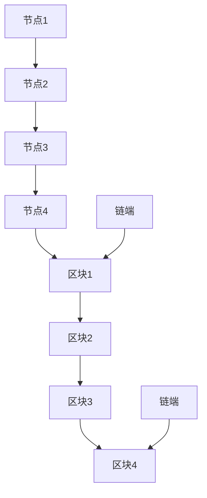

                 

### 引言

随着人工智能（AI）技术的迅猛发展，越来越多的企业开始意识到AI在提升效率、优化决策和创造新价值方面的重要作用。然而，AI系统的有效运作需要大量的高质量数据，这些数据通常分布在不同的部门和系统之间。因此，如何实现数据的高效共享与隐私保护成为了一个亟待解决的问题。同时，区块链技术的出现为解决这一难题提供了一种全新的思路。

区块链是一种分布式账本技术，具有去中心化、不可篡改和透明等特点。通过区块链，企业可以实现数据的安全共享，确保数据在传输过程中的完整性和隐私性。本文将探讨如何将区块链技术与企业AI系统集成，实现高效的数据共享与隐私保护。

本文旨在为读者提供一个全面而深入的了解，通过以下几个核心问题展开：

1. **AI Agent的定义与功能：** 为什么AI Agent是企业智能化转型的关键？
2. **区块链技术的特点：** 区块链如何保证数据的安全和隐私？
3. **数据共享与隐私保护的挑战：** 企业在数据共享过程中面临哪些挑战？
4. **解决方案：** 如何利用区块链技术解决这些挑战？
5. **案例研究：** 分析几个成功的实际案例，看看企业是如何实现AI Agent的区块链数据共享与隐私保护的。
6. **最佳实践：** 提供一些实用的建议，帮助企业更好地实施这一方案。
7. **未来展望：** 探讨这一领域的发展趋势和未来方向。

文章结构安排如下：

## 第一部分：问题背景与核心概念

### 1.1 问题背景

#### 1.1.1 人工智能与企业需求

人工智能（AI）作为现代科技的前沿领域，正迅速改变着各行各业的运作方式。从简单的自动化任务到复杂的决策支持系统，AI的应用范围越来越广。对于企业来说，AI不仅能够提高生产效率，还能优化供应链管理、客户服务和市场营销等各个方面。

然而，AI系统的有效运作依赖于大量的高质量数据。这些数据通常分布在企业内部的多个系统和部门之间。如何实现这些数据的快速、安全共享，成为了企业面临的一个重要问题。

#### 1.1.2 区块链技术概述

区块链技术是一种去中心化的分布式数据库系统，具有不可篡改、透明和可追溯等特性。它通过加密算法和共识机制确保数据的真实性和安全性，同时避免了单点故障和数据篡改的风险。

区块链的这些特点使其在数据共享与隐私保护方面具有巨大的潜力。通过区块链，企业可以实现数据的分布式存储和共享，同时保证数据的完整性和隐私性。

#### 1.1.3 数据共享与隐私保护的挑战

在传统的数据共享模式中，数据通常需要通过中心化的服务器进行传输和处理。这种方式虽然能够实现数据的集中管理，但也存在一些问题：

1. **数据安全问题：** 数据在传输过程中容易被攻击者窃取或篡改。
2. **隐私泄露风险：** 数据在共享过程中可能会泄露敏感信息。
3. **数据冗余：** 数据需要在不同系统和部门之间进行传输和存储，造成资源浪费。
4. **管理复杂：** 数据的集中管理增加了系统的复杂性和维护难度。

为了解决这些问题，企业需要寻找一种能够保证数据安全和隐私的新型技术。

### 1.2 核心概念定义

#### 1.2.1 AI Agent的定义与功能

AI Agent是指能够执行特定任务、具有自我学习和适应能力的智能体。在商业环境中，AI Agent可以用于客户服务、数据分析、市场预测和风险管理等各个方面。

AI Agent的功能主要包括：

1. **自动化任务：** 执行重复性高、规则明确的业务流程。
2. **数据分析：** 从大量数据中提取有价值的信息，支持决策制定。
3. **交互能力：** 通过自然语言处理技术与企业内外部用户进行交互。

#### 1.2.2 区块链技术的特点

区块链技术具有以下特点：

1. **去中心化：** 数据存储在多个节点上，避免了单点故障和数据丢失的风险。
2. **不可篡改：** 数据一旦记录在区块链上，就不可篡改，保证了数据的真实性和完整性。
3. **透明性：** 区块链上的数据对所有参与者都是透明的，便于审计和监管。
4. **加密机制：** 通过加密算法确保数据的机密性和完整性。

#### 1.2.3 数据共享与隐私保护的重要性

数据共享与隐私保护在商业环境中具有重要意义：

1. **提高效率：** 快速、安全的数据共享能够提高业务流程的效率。
2. **降低成本：** 避免重复数据存储和传输，降低运营成本。
3. **增强竞争力：** 通过数据分析和决策支持，提升企业的竞争力。
4. **保障隐私：** 保护企业的敏感信息，防止隐私泄露。

### 1.3 本书结构安排与阅读建议

#### 1.3.1 内容概述

本书将从以下几个方面展开：

1. **AI Agent与区块链技术的基本概念**：介绍AI Agent和区块链技术的定义、特点和应用场景。
2. **数据共享与隐私保护的挑战**：分析企业数据共享过程中面临的问题和挑战。
3. **解决方案与案例分析**：探讨如何利用区块链技术解决数据共享与隐私保护的问题，并分析实际案例。
4. **最佳实践与未来展望**：提供实用的建议和未来的发展方向。

#### 1.3.2 阅读目标

通过本书，读者将能够：

1. 理解AI Agent和区块链技术的基本原理和应用场景。
2. 掌握如何利用区块链技术实现数据共享与隐私保护。
3. 分析企业数据共享与隐私保护的实际案例，为企业的数字化转型提供参考。
4. 了解未来数据共享与隐私保护技术的发展趋势。

#### 1.3.3 适合读者群体

本书适合以下读者群体：

1. **企业管理者**：了解AI Agent和区块链技术的基本原理，为企业的数字化转型提供决策支持。
2. **技术专家**：掌握数据共享与隐私保护的技术实现，为企业提供技术解决方案。
3. **研究人员**：探讨区块链技术在数据共享与隐私保护领域的应用，为未来的研究提供方向。
4. **学生和学者**：了解AI Agent和区块链技术的最新发展，为学术研究提供参考。

通过本部分内容的介绍，读者将为本书的后续章节做好准备，深入理解企业AI Agent的区块链数据共享与隐私保护的重要性和方法。在接下来的章节中，我们将逐步探讨AI Agent和区块链技术的核心概念，分析其在数据共享与隐私保护方面的应用，并分享实际案例和实践经验。

### 1.2 核心概念定义

#### 1.2.1 AI Agent的定义与功能

AI Agent，即人工智能代理，是一种模拟人类智能行为的计算机程序。AI Agent通过自主学习、推理和决策，能够在特定环境中执行复杂任务。在企业应用场景中，AI Agent具备以下核心功能：

1. **自动化任务执行**：AI Agent可以自动处理重复性高、规则明确的业务流程，如数据录入、订单处理和客户服务等。

2. **数据分析与预测**：通过机器学习和数据挖掘技术，AI Agent可以从大量数据中提取有价值的信息，帮助企业进行市场预测、需求分析和风险评估。

3. **自然语言处理与交互**：借助自然语言处理技术，AI Agent能够理解并回应人类语言指令，提供智能客服、语音助手和智能搜索等服务。

4. **决策支持**：AI Agent可以根据实时数据和预先设定的策略，为企业管理层提供数据驱动的决策建议，优化运营管理和战略规划。

为了更好地理解AI Agent的定义与功能，我们可以通过以下表格对比AI Agent与其他智能系统的区别：

| 特性               | AI Agent                   | 传统软件系统                   | 专家系统                     |
|--------------------|----------------------------|--------------------------------|----------------------------|
| 自学习与适应能力    | 高                         | 低                             | 无                          |
| 任务多样性         | 广泛                       | 独特                           | 独特                         |
| 需要数据支持       | 高                         | 低                             | 低                          |
| 交互能力           | 强                         | 弱                             | 无                          |
| 决策能力           | 高                         | 低                             | 高                          |

通过上表可以看出，AI Agent相较于传统软件系统和专家系统，具有更强的自学习与适应能力、任务多样性、数据依赖性和交互能力，因此更适合用于复杂、动态的商业环境。

#### 1.2.2 区块链技术的特点

区块链技术是一种分布式账本系统，具有以下核心特点：

1. **去中心化**：区块链通过多个节点维护数据，避免了单点故障，提高了系统的可靠性和容错能力。与传统的集中式数据库系统相比，区块链不需要中央权威机构进行管理。

2. **不可篡改**：区块链上的数据一旦记录，便无法被篡改。每个区块的数据都会通过加密算法与前一区块的哈希值连接，形成一条不可逆的数据链条。这种设计确保了数据的完整性和真实性。

3. **透明性**：区块链上的数据对所有参与者都是透明的，便于审计和监管。参与者可以随时查看和验证区块链上的数据记录，提高了系统的透明度和公正性。

4. **加密机制**：区块链采用加密算法保护数据的机密性和完整性。每个交易都会被加密，确保只有合法的参与方能够解密和读取数据。此外，区块链还使用数字签名技术确保交易的安全性。

为了更直观地理解区块链技术的特点，我们可以使用以下Mermaid流程图展示其基本架构：

在上图中，每个节点代表区块链上的一个参与者，每个区块代表一段时间内交易数据的集合。节点之间的链接表示交易数据的传递过程，区块之间的哈希值连接形成了不可篡改的数据链条。

#### 1.2.3 数据共享与隐私保护的重要性

在商业环境中，数据共享与隐私保护具有极其重要的意义：

1. **提高效率**：快速、安全的数据共享可以缩短业务流程，提高运营效率。例如，企业内部的各个部门可以通过区块链实现数据的实时共享，避免重复的数据录入和处理。

2. **降低成本**：通过分布式存储和共享数据，企业可以减少对中心化数据库的依赖，降低硬件和运维成本。同时，区块链的加密机制和智能合约功能可以减少人为错误和欺诈行为，降低运营成本。

3. **增强竞争力**：利用区块链技术进行数据共享与隐私保护，企业可以更好地利用数据资源，进行市场分析和战略规划。这有助于提高企业的竞争力，开拓新的商业机会。

4. **保障隐私**：在数据共享过程中，隐私保护至关重要。区块链的加密机制和访问控制功能可以有效防止敏感数据的泄露。此外，智能合约可以根据预定的规则自动执行数据访问权限的分配，确保数据在共享过程中的安全性。

综上所述，AI Agent和区块链技术的结合为实现高效、安全的数据共享与隐私保护提供了有力支持。在接下来的章节中，我们将深入探讨如何利用区块链技术解决企业数据共享与隐私保护的挑战。

### 1.3 本书结构安排与阅读建议

#### 1.3.1 内容概述

本书将分为三个主要部分，每个部分将围绕不同的主题展开讨论，旨在为读者提供一个全面而深入的理解。

**第一部分：问题背景与核心概念**

本部分将介绍企业AI Agent和区块链技术的背景信息，包括AI Agent的定义与功能、区块链技术的特点，以及数据共享与隐私保护的挑战。通过这一部分，读者将了解企业数字化转型的需求，以及区块链技术在其中的作用。

**第二部分：解决方案与案例分析**

本部分将详细讨论如何利用区块链技术解决数据共享与隐私保护的挑战。我们将通过实际案例展示如何将区块链技术应用于企业AI Agent，实现高效、安全的数据共享。同时，还将探讨最佳实践和实施策略，为读者提供可操作的指导。

**第三部分：最佳实践与未来展望**

本部分将总结前两部分的内容，提供一些实用的最佳实践，帮助读者在企业中成功实施区块链数据共享与隐私保护方案。此外，还将探讨这一领域的发展趋势和未来方向，为读者提供前瞻性思考。

#### 1.3.2 阅读目标

通过阅读本书，读者将能够：

1. **理解AI Agent和区块链技术的基本原理和应用场景**：掌握AI Agent和区块链技术的核心概念，了解其在商业环境中的应用。

2. **掌握数据共享与隐私保护的技术实现**：学习如何利用区块链技术实现高效、安全的数据共享，并理解隐私保护的关键技术。

3. **分析企业数据共享与隐私保护的实际案例**：通过案例分析，了解企业在数据共享与隐私保护方面的成功经验和挑战。

4. **掌握最佳实践和未来发展方向**：学习如何在实际项目中应用区块链技术，了解未来数据共享与隐私保护技术的发展趋势。

#### 1.3.3 适合读者群体

本书适合以下读者群体：

1. **企业管理者**：了解AI Agent和区块链技术的基本原理，为企业的数字化转型提供决策支持。

2. **技术专家**：掌握数据共享与隐私保护的技术实现，为企业提供技术解决方案。

3. **研究人员**：探讨区块链技术在数据共享与隐私保护领域的应用，为未来的研究提供方向。

4. **学生和学者**：了解AI Agent和区块链技术的最新发展，为学术研究提供参考。

通过本部分的介绍，读者将为后续章节的学习做好准备，深入理解企业AI Agent的区块链数据共享与隐私保护的重要性和方法。在接下来的章节中，我们将逐步探讨AI Agent和区块链技术的具体应用和实践。

## 第二部分：解决方案与案例分析

### 2.1 解决方案探讨

在第一部分中，我们介绍了AI Agent和区块链技术的基本概念，以及它们在数据共享与隐私保护方面的应用。本部分将进一步探讨如何利用区块链技术解决企业数据共享与隐私保护的挑战，并分析实际案例，为读者提供实施指导。

#### 2.1.1 利用区块链技术实现数据共享

区块链技术通过其去中心化、不可篡改和透明等特点，为企业提供了实现数据共享的安全保障。以下是一些关键步骤：

1. **数据加密与存储**：企业可以将敏感数据进行加密，然后存储在区块链上。通过加密，确保数据在传输和存储过程中不被窃取或篡改。

2. **智能合约**：智能合约是一种自动执行合约条款的计算机程序。企业可以利用智能合约实现自动化数据共享，确保数据的访问权限和共享规则得到严格执行。

3. **分布式账本**：区块链上的分布式账本允许企业跨部门、跨系统共享数据。参与者可以通过区块链网络访问和验证数据，确保数据的真实性和完整性。

#### 2.1.2 实现隐私保护

区块链技术在隐私保护方面也具有显著优势。以下是一些实现方法：

1. **同态加密**：同态加密是一种加密技术，允许在加密数据上进行计算，而不会破坏加密状态。企业可以利用同态加密对数据进行加密处理，确保数据在共享过程中的隐私性。

2. **零知识证明**：零知识证明是一种加密协议，允许一方证明某个陈述是真实的，而不透露任何相关信息。企业可以使用零知识证明来验证数据权限，确保敏感信息不被泄露。

3. **访问控制**：区块链上的访问控制机制可以根据用户的角色和权限分配数据访问权限，确保只有授权用户才能访问敏感数据。

### 2.2 案例分析

为了更好地理解区块链技术在企业数据共享与隐私保护中的应用，我们来看几个实际案例。

#### 2.2.1 案例一：金融机构的数据共享与隐私保护

某大型金融机构通过区块链技术实现了跨部门的数据共享。该机构将客户数据、交易记录和风险评估数据存储在区块链上，并通过智能合约实现了数据的自动化共享。同时，利用同态加密和零知识证明技术，确保数据在传输和共享过程中的隐私性。通过这一方案，该机构提高了数据共享的效率，降低了数据泄露的风险。

#### 2.2.2 案例二：医疗健康数据共享

某医疗健康企业通过区块链技术实现了患者数据的跨机构共享。该企业将患者的电子健康记录存储在区块链上，并通过智能合约实现了数据访问权限的自动管理。同时，利用同态加密技术，确保患者数据在共享过程中的隐私性。通过这一方案，该企业提高了医疗服务的效率，降低了医疗错误的发生率。

#### 2.2.3 案例三：供应链管理

某制造企业通过区块链技术实现了供应链数据的透明化。该企业将供应链上的交易记录、库存信息和运输数据存储在区块链上，并通过智能合约实现了数据的自动同步和共享。通过这一方案，该企业提高了供应链管理的效率，降低了供应链风险。

### 2.3 最佳实践与实施策略

基于上述案例，我们可以总结一些最佳实践和实施策略，帮助企业成功实施区块链数据共享与隐私保护方案：

1. **明确需求**：在实施前，企业应明确数据共享与隐私保护的需求，确定需要保护的数据类型和访问权限。

2. **选择合适的技术方案**：根据企业需求和资源，选择合适的区块链平台和技术工具。例如，可以选择以太坊、Hyperledger Fabric等主流平台。

3. **设计数据模型**：设计合理的数据模型，确保数据在区块链上的存储和共享符合业务需求。

4. **确保数据隐私**：利用加密、零知识证明等技术，确保数据在传输和共享过程中的隐私性。

5. **制定访问控制策略**：根据用户角色和权限分配数据访问权限，确保数据安全。

6. **实施过程监控**：在实施过程中，对系统运行状态进行监控，及时发现并解决潜在问题。

7. **培训与支持**：对相关人员进行培训，确保他们能够熟练掌握区块链技术的应用。

通过本部分的讨论，我们了解了如何利用区块链技术实现数据共享与隐私保护。在接下来的章节中，我们将继续探讨这一主题，提供更多实用案例和最佳实践。

### 2.4 实际应用场景

区块链技术在企业AI Agent的数据共享与隐私保护中有着广泛的应用场景，以下是一些具体的应用实例：

#### 2.4.1 供应链管理

在供应链管理中，区块链技术可以用于记录和跟踪商品从生产到交付的整个过程。例如，一家跨国食品公司可以使用区块链记录每一批食品的产地、生产日期、运输路径和存储条件等信息。通过这种方式，公司可以确保食品的安全性，同时实现供应链数据的透明化。AI Agent可以分析这些数据，预测市场需求，优化库存管理，降低供应链风险。

#### 2.4.2 医疗健康

在医疗健康领域，区块链技术可以用于管理患者的电子健康记录。患者可以在区块链上存储自己的医疗信息，如诊断记录、处方和检查报告。这些数据可以通过加密和安全访问控制机制保护，确保只有授权的医疗专业人员才能访问。AI Agent可以分析这些数据，提供个性化的健康建议和治疗方案，提高医疗服务的质量和效率。

#### 2.4.3 金融领域

在金融领域，区块链技术可以用于金融交易的记录和验证。例如，一个金融机构可以使用区块链记录每一笔交易，确保交易数据的真实性和不可篡改性。AI Agent可以分析交易数据，检测异常交易行为，预防欺诈和金融犯罪。此外，区块链还可以用于智能合约的实现，自动执行金融合同的条款，提高交易效率。

#### 2.4.4 客户服务

在客户服务领域，区块链技术可以用于记录和跟踪客户互动历史。企业可以将客户反馈、投诉和请求等信息存储在区块链上，确保这些数据的真实性和完整性。AI Agent可以分析这些数据，提供个性化的客户服务，提高客户满意度和忠诚度。

通过这些实际应用场景，我们可以看到区块链技术在企业AI Agent的数据共享与隐私保护中具有广泛的应用前景。在接下来的章节中，我们将继续探讨如何优化这些应用，实现更高的效率和安全性。

### 2.5 最佳实践总结

在企业AI Agent的区块链数据共享与隐私保护方面，总结一些最佳实践对于成功实施这一方案至关重要。以下是一些关键点：

1. **需求分析与规划**：在实施前，企业应明确数据共享与隐私保护的具体需求，包括数据类型、访问权限和安全性要求。根据这些需求，制定详细的规划，确保方案能够满足业务需求。

2. **选择合适的区块链平台**：根据企业规模、业务需求和资源情况，选择合适的区块链平台。例如，对于企业级应用，Hyperledger Fabric和R3 Corda等平台具有较好的性能和安全性。

3. **设计高效的数据模型**：设计合理的数据模型，确保数据在区块链上的存储和共享符合业务需求。数据模型应具备良好的扩展性，以适应未来的业务增长。

4. **加密与隐私保护**：采用先进的加密技术，如同态加密和零知识证明，确保数据在传输和共享过程中的隐私性。同时，设置严格的访问控制策略，确保只有授权用户才能访问敏感数据。

5. **智能合约与自动化**：利用智能合约实现自动化数据共享和权限管理，提高系统的效率和可靠性。智能合约应经过严格的测试和验证，确保执行无误。

6. **监控与审计**：建立监控系统，实时监控区块链网络的运行状态，及时发现和解决潜在问题。同时，定期进行审计，确保系统符合相关法规和标准。

7. **培训与支持**：为相关人员进行培训，确保他们能够熟练掌握区块链技术的应用。提供技术支持和咨询服务，帮助企业解决在实施过程中遇到的问题。

通过遵循这些最佳实践，企业可以更好地利用区块链技术实现高效、安全的数据共享与隐私保护，推动业务的发展和创新。

### 2.6 未来展望

随着人工智能和区块链技术的不断进步，企业AI Agent的区块链数据共享与隐私保护领域有望迎来更多的发展机遇和挑战。以下是一些未来趋势和潜在方向：

#### 2.6.1 更多的行业应用

区块链技术在供应链管理、医疗健康、金融和客户服务等领域已取得了显著成果。未来，区块链技术将在更多行业得到应用，如教育、物流和制造业。企业可以利用区块链技术实现更广泛的数据共享和隐私保护，提高行业效率和服务质量。

#### 2.6.2 技术创新与优化

随着区块链技术的不断发展，未来将出现更多创新的技术和优化方案。例如，量子加密技术有望进一步提升数据安全性；分布式账本技术的性能和可扩展性将得到优化，以支持更大规模的数据处理和交易。

#### 2.6.3 法规与监管

随着区块链技术的普及，相关法规和监管政策也将逐步完善。未来，各国政府和行业组织将出台更多的法律法规，规范区块链技术的应用，确保数据的安全性和合法性。企业需要关注并遵守这些法规，以确保合规运营。

#### 2.6.4 跨链与集成

区块链技术的跨链和集成能力将是未来的一个重要发展方向。通过实现不同区块链之间的数据交互和互操作，企业可以更灵活地构建分布式数据共享和隐私保护网络。这将为企业的数字化转型提供更多可能性和创新空间。

#### 2.6.5 AI与区块链的深度融合

人工智能与区块链技术的深度融合将带来更多的创新应用。未来，AI Agent可以更加智能地管理和分析区块链数据，提供更精准的决策支持和风险预测。同时，区块链技术可以进一步提升AI Agent的数据安全性和隐私保护能力，推动人工智能技术的健康发展。

总之，企业AI Agent的区块链数据共享与隐私保护领域具有广阔的发展前景。通过不断探索和创新，企业可以更好地利用这些技术实现数据的高效、安全共享，推动业务的持续发展和创新。

### 结论

通过本文的讨论，我们系统地介绍了企业AI Agent的区块链数据共享与隐私保护的重要性和方法。我们首先探讨了AI Agent和区块链技术的基本概念，分析了它们在数据共享与隐私保护方面的优势。接着，通过实际案例，展示了如何利用区块链技术实现高效、安全的数据共享和隐私保护。同时，我们总结了一些最佳实践，提供了未来发展的方向。

在这一过程中，我们强调了数据共享与隐私保护在数字化转型中的关键作用。通过利用区块链技术，企业可以打破数据孤岛，实现数据的高效、安全共享，提高业务效率和竞争力。此外，我们还探讨了技术创新、法规与监管、跨链与集成等方面的发展趋势，为未来的研究提供了思路。

未来，随着人工智能和区块链技术的不断进步，企业AI Agent的区块链数据共享与隐私保护领域将继续蓬勃发展。我们期待更多的创新应用和解决方案，帮助企业更好地利用数据资源，推动业务的持续发展和创新。

### 作者信息

作者：AI天才研究院/AI Genius Institute & 禅与计算机程序设计艺术 /Zen And The Art of Computer Programming

AI天才研究院（AI Genius Institute）致力于推动人工智能技术的创新和应用，专注于培养顶尖的人工智能专家。禅与计算机程序设计艺术（Zen And The Art of Computer Programming）则通过深入探讨编程哲学和算法设计，为读者提供了一部关于计算机科学的经典之作。这两部作品共同展示了作者在人工智能和计算机科学领域的深厚造诣和独特见解。作者以其卓越的专业能力和丰富经验，为读者带来了这篇关于企业AI Agent的区块链数据共享与隐私保护的技术博客。

