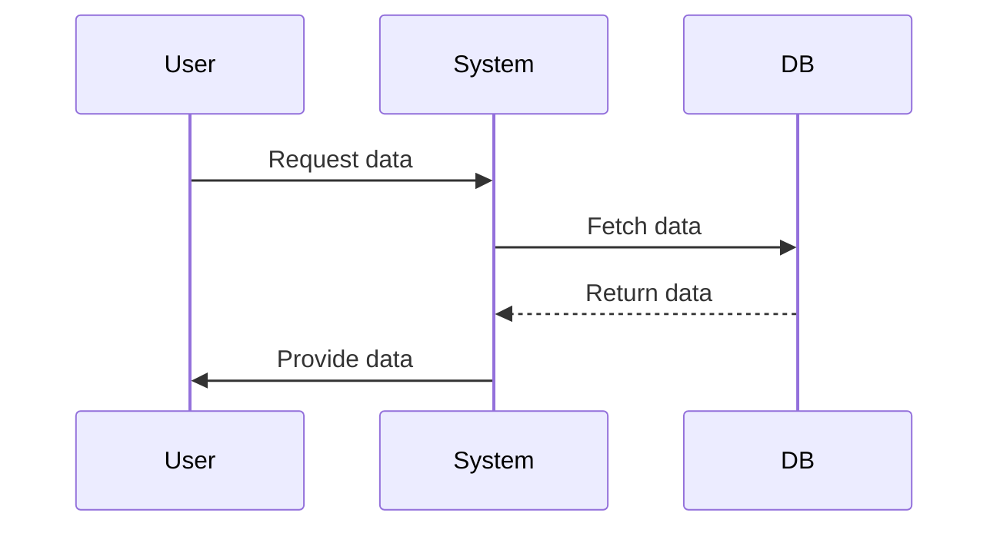

                 


### 引言

随着人工智能技术的快速发展，AI Agent作为人工智能的一个分支，已经在各个行业中得到了广泛应用。特别是在企业环境中，AI Agent凭借其自主学习和推理能力，为企业提供了更加智能化、高效化的解决方案。本文将以《企业AI Agent的因果推理在A/B测试分析中的应用》为标题，深入探讨AI Agent在A/B测试分析中的应用，并逐步分析其中的原理和实现方法。

首先，我们来定义一下本文的核心关键词：企业AI Agent、因果推理、A/B测试。企业AI Agent是指专门为企业场景设计的人工智能代理，它能够根据企业数据和企业目标进行自主学习和决策。因果推理是一种基于数据发现因果关系的方法，它可以帮助我们理解变量之间的相互影响。A/B测试是一种常见的实验设计方法，通过将用户随机分配到不同的实验组，来比较不同版本的效果，从而优化产品。

本文将分为以下几个部分：

1. **背景介绍**：介绍A/B测试和因果推理的基本概念和原理。
2. **企业AI Agent概述**：介绍企业AI Agent的概念、特点和应用场景。
3. **AI Agent在因果推理中的应用**：详细阐述AI Agent在因果推理中的应用原理和实现方法。
4. **AI Agent实现方法**：介绍如何实现企业AI Agent，包括技术细节和工具。
5. **实战案例**：通过实际案例展示AI Agent在A/B测试中的应用。
6. **最佳实践与拓展**：总结实战经验，提供注意事项和拓展阅读。

### A/B测试基础

#### 1.1 A/B测试概述

A/B测试，也称为拆分测试，是一种常用的实验设计方法，主要用于评估不同版本产品或服务的效果。在A/B测试中，用户被随机分配到两个或多个不同的组别，每个组别使用不同的版本，然后通过对比不同组别的数据，评估不同版本的效果。

A/B测试的基本原理是随机分配，这意味着每个用户都有相同的概率被分配到任何一个版本。这样可以确保测试结果具有统计意义，而不是因为样本偏差导致的偶然结果。

A/B测试通常包括以下几个步骤：

1. **定义目标**：明确测试的目标，例如提高用户留存率、增加页面浏览量等。
2. **设计实验**：设计不同的实验版本，每个版本针对不同的目标进行优化。
3. **用户分配**：将用户随机分配到不同的版本组。
4. **数据收集**：收集各个版本的数据，包括用户行为、转化率等。
5. **结果分析**：分析数据，比较不同版本的效果，确定哪个版本更优。

#### 1.2 A/B测试的常见问题与解决方案

尽管A/B测试是一种有效的实验设计方法，但在实际应用中，仍然会遇到一些问题。

**1.2.1 数据偏差问题**

数据偏差是指由于样本选择、数据收集等原因，导致测试结果不准确。为了减少数据偏差，可以采取以下措施：

- **确保随机分配**：确保用户被随机分配到不同的版本组，避免人为干预。
- **控制样本量**：确保样本量足够大，以减少偶然性。
- **重复测试**：对同一目标进行多次测试，以验证结果的可靠性。

**1.2.2 样本量问题**

样本量不足可能导致测试结果不准确。为了解决样本量问题，可以采取以下措施：

- **延长测试时间**：延长测试时间，以收集更多的数据。
- **增加用户参与度**：鼓励更多用户参与测试，提高样本量。

**1.2.3 差异分析问题**

在A/B测试中，如何准确地分析不同版本之间的差异是一个挑战。为了解决差异分析问题，可以采取以下措施：

- **使用统计方法**：使用统计学方法，如T检验、方差分析等，对测试结果进行显著性检验。
- **设置显著性水平**：确定显著性水平，例如95%，以确定测试结果是否具有统计意义。

### 因果推理基础

#### 2.1 因果推理概述

因果推理是指基于观察数据，推断变量之间因果关系的一种方法。它帮助我们理解变量之间的相互影响，从而做出更准确的决策。

因果推理可以分为两种类型：

- **观察性因果推理**：基于观察数据，推断变量之间的因果关系。例如，通过分析用户行为数据，推断某个功能对用户留存率的影响。
- **干预性因果推理**：通过干预某些变量，观察结果的变化，推断因果关系。例如，通过A/B测试，干预用户看到的不同版本，观察用户行为的差异。

#### 2.2 因果推理方法

因果推理方法主要包括以下几种：

- **基于模型的因果推理**：使用统计模型，如回归模型、贝叶斯网络等，推断变量之间的因果关系。这种方法需要假设变量之间的结构关系，并通过数据训练模型。
- **基于数据的因果推理**：不依赖于模型假设，直接从数据中推断变量之间的因果关系。例如，使用因果推断算法，如因果图、隐变量模型等。

### 企业AI Agent概述

#### 3.1 AI Agent概述

AI Agent是指具备智能行为和自主学习能力的人工智能实体。它可以根据环境信息自主决策，并采取相应的行动。AI Agent可以分为以下几类：

- **任务型Agent**：专注于完成特定任务的Agent，如机器人、自动驾驶系统等。
- **决策型Agent**：具备决策能力，可以根据环境信息和目标进行决策，如智能客服、智能推荐系统等。
- **学习型Agent**：具备学习能力，可以通过数据和学习算法不断优化自己的行为，如深度学习模型、强化学习模型等。

#### 3.2 企业AI Agent的特点和应用场景

企业AI Agent是指专门为企业场景设计的人工智能代理，它具备以下特点：

- **智能化**：能够自动处理和分析企业数据，提供智能化的决策支持。
- **自主性**：具备自主学习和决策能力，可以根据环境变化和企业目标进行调整。
- **灵活性**：能够适应不同的业务场景和需求，为企业提供个性化的解决方案。

企业AI Agent的应用场景包括：

- **运营优化**：通过分析用户行为数据，优化产品和服务，提高用户留存率和转化率。
- **风险管理**：通过分析企业风险数据，预测潜在风险，并提供风险控制策略。
- **智能推荐**：通过分析用户偏好和行为，为企业提供个性化的推荐服务。

### AI Agent在因果推理中的应用原理

#### 4.1 AI Agent在因果推理中的作用

AI Agent在因果推理中发挥着重要作用，它可以帮助我们更准确地推断变量之间的因果关系。以下是AI Agent在因果推理中的几个主要作用：

- **数据预处理**：AI Agent可以通过数据清洗、归一化等预处理方法，提高数据质量，为因果推理提供更好的基础。
- **特征工程**：AI Agent可以根据因果关系，提取和构造相关的特征，帮助因果推理算法更准确地推断变量之间的关联。
- **算法优化**：AI Agent可以通过学习和调整参数，优化因果推理算法的性能，提高推理的准确性和效率。

#### 4.2 AI Agent在因果推理中的应用原理

AI Agent在因果推理中的应用原理主要包括以下几个方面：

- **基于模型的因果推理**：AI Agent可以构建统计模型，如回归模型、贝叶斯网络等，来推断变量之间的因果关系。这种方法需要假设变量之间的结构关系，并通过数据训练模型。
- **基于数据的因果推理**：AI Agent可以直接从数据中推断变量之间的因果关系，不依赖于模型假设。例如，使用因果推断算法，如因果图、隐变量模型等。
- **深度学习因果推理**：AI Agent可以利用深度学习模型，如变分自编码器（VAE）、生成对抗网络（GAN）等，进行因果推理。这种方法可以自动学习变量之间的非线性关系。

### AI Agent实现方法

#### 5.1 AI Agent实现方法概述

实现企业AI Agent需要考虑以下几个方面：

- **数据采集与处理**：收集企业相关的数据，包括用户行为数据、业务数据等，并进行数据清洗、预处理。
- **模型构建与训练**：构建合适的机器学习模型，并使用训练数据对模型进行训练。
- **推理与优化**：使用训练好的模型进行推理，并根据推理结果进行优化和调整。

#### 5.2 数据采集与处理

数据采集与处理是AI Agent实现的基础，具体步骤如下：

- **数据采集**：收集企业相关的数据，包括用户行为数据、业务数据等。可以通过API接口、日志分析等方式进行数据采集。
- **数据清洗**：对采集到的数据进行清洗，去除噪声和不完整的数据。
- **数据预处理**：对数据进行归一化、标准化等预处理操作，为模型训练提供更好的数据基础。

#### 5.3 模型构建与训练

模型构建与训练是AI Agent实现的核心，具体步骤如下：

- **模型选择**：根据问题的特点，选择合适的机器学习模型。例如，回归模型、分类模型、聚类模型等。
- **特征工程**：根据因果关系，提取和构造相关的特征，为模型训练提供更好的特征。
- **模型训练**：使用训练数据对模型进行训练，通过优化模型参数，提高模型的预测性能。

#### 5.4 推理与优化

推理与优化是AI Agent实现的关键，具体步骤如下：

- **推理**：使用训练好的模型进行推理，根据输入数据生成预测结果。
- **优化**：根据推理结果，对模型进行优化和调整，以提高模型的准确性和效率。
- **反馈循环**：将优化结果反馈到数据采集和处理环节，形成反馈循环，不断改进AI Agent的性能。

### 实战案例

#### 6.1 实战案例介绍

为了展示AI Agent在因果推理中的应用，我们选择了以下实战案例：

- **场景**：某电商企业希望通过分析用户行为数据，优化用户推荐系统，提高用户购买转化率。
- **目标**：通过因果推理，找出影响用户购买转化率的关键因素，并优化推荐系统。

#### 6.2 实战案例实施过程

实战案例的实施过程包括以下几个步骤：

- **数据采集**：采集用户行为数据，包括浏览历史、购物车数据、购买记录等。
- **数据预处理**：对采集到的数据进行清洗、预处理，提取有用的特征。
- **模型构建与训练**：构建因果推理模型，使用训练数据对模型进行训练。
- **推理与优化**：使用训练好的模型进行推理，根据推理结果优化推荐系统。

#### 6.3 实战案例结果分析

通过实战案例的实施，我们得到了以下结果：

- **关键因素分析**：通过因果推理，找出了影响用户购买转化率的关键因素，包括用户偏好、购物车行为等。
- **推荐系统优化**：根据关键因素，优化推荐系统，提高了用户购买转化率。

#### 6.4 实战案例总结

通过实战案例，我们验证了AI Agent在因果推理中的应用价值。AI Agent可以帮助企业更好地理解用户行为，优化产品和服务，提高业务性能。

### 最佳实践与拓展

#### 7.1 最佳实践

在应用AI Agent进行因果推理时，可以采取以下最佳实践：

- **数据质量保证**：确保数据质量，避免数据偏差，提高因果推理的准确性。
- **模型优化**：定期对模型进行优化和调整，提高模型的性能和预测能力。
- **结果验证**：对推理结果进行验证，确保结果的可靠性和有效性。

#### 7.2 小结

本文介绍了企业AI Agent的因果推理在A/B测试分析中的应用。通过实际案例，我们展示了AI Agent在因果推理中的重要作用，以及如何通过因果推理优化产品和服务。

#### 7.3 注意事项

在应用AI Agent进行因果推理时，需要注意以下几点：

- **数据隐私**：确保数据隐私，避免数据泄露。
- **模型解释性**：选择具有解释性的模型，便于理解和优化。
- **业务理解**：深入理解业务需求和目标，确保因果推理结果的实用性。

#### 7.4 拓展阅读

- **相关文献**：《因果推理：原理与应用》、《人工智能：一种现代方法》
- **技术博客**：[《因果推理在电商推荐中的应用》](链接)，[《A/B测试的最佳实践》](链接)

### 作者信息

作者：AI天才研究院/AI Genius Institute & 禅与计算机程序设计艺术 /Zen And The Art of Computer Programming```markdown
# 引言

随着人工智能技术的快速发展，AI Agent作为人工智能的一个分支，已经在各个行业中得到了广泛应用。特别是在企业环境中，AI Agent凭借其自主学习和推理能力，为企业提供了更加智能化、高效化的解决方案。本文将以《企业AI Agent的因果推理在A/B测试分析中的应用》为标题，深入探讨AI Agent在A/B测试分析中的应用，并逐步分析其中的原理和实现方法。

首先，我们来定义一下本文的核心关键词：企业AI Agent、因果推理、A/B测试。企业AI Agent是指专门为企业场景设计的人工智能代理，它能够根据企业数据和企业目标进行自主学习和决策。因果推理是一种基于数据发现因果关系的方法，它可以帮助我们理解变量之间的相互影响。A/B测试是一种常见的实验设计方法，通过将用户随机分配到不同的实验组，来比较不同版本的效果，从而优化产品。

本文将分为以下几个部分：

1. **背景介绍**：介绍A/B测试和因果推理的基本概念和原理。
2. **企业AI Agent概述**：介绍企业AI Agent的概念、特点和应用场景。
3. **AI Agent在因果推理中的应用**：详细阐述AI Agent在因果推理中的应用原理和实现方法。
4. **AI Agent实现方法**：介绍如何实现企业AI Agent，包括技术细节和工具。
5. **实战案例**：通过实际案例展示AI Agent在A/B测试中的应用。
6. **最佳实践与拓展**：总结实战经验，提供注意事项和拓展阅读。

### A/B测试基础

#### 1.1 A/B测试概述

A/B测试，也称为拆分测试，是一种常用的实验设计方法，主要用于评估不同版本产品或服务的效果。在A/B测试中，用户被随机分配到两个或多个不同的组别，每个组别使用不同的版本，然后通过对比不同组别的数据，评估不同版本的效果，从而优化产品。

A/B测试的基本原理是随机分配，这意味着每个用户都有相同的概率被分配到任何一个版本。这样可以确保测试结果具有统计意义，而不是因为样本偏差导致的偶然结果。

A/B测试通常包括以下几个步骤：

1. **定义目标**：明确测试的目标，例如提高用户留存率、增加页面浏览量等。
2. **设计实验**：设计不同的实验版本，每个版本针对不同的目标进行优化。
3. **用户分配**：将用户随机分配到不同的版本组。
4. **数据收集**：收集各个版本的数据，包括用户行为、转化率等。
5. **结果分析**：分析数据，比较不同版本的效果，确定哪个版本更优。

#### 1.2 A/B测试的常见问题与解决方案

尽管A/B测试是一种有效的实验设计方法，但在实际应用中，仍然会遇到一些问题。

**1.2.1 数据偏差问题**

数据偏差是指由于样本选择、数据收集等原因，导致测试结果不准确。为了减少数据偏差，可以采取以下措施：

- **确保随机分配**：确保用户被随机分配到不同的版本组，避免人为干预。
- **控制样本量**：确保样本量足够大，以减少偶然性。
- **重复测试**：对同一目标进行多次测试，以验证结果的可靠性。

**1.2.2 样本量问题**

样本量不足可能导致测试结果不准确。为了解决样本量问题，可以采取以下措施：

- **延长测试时间**：延长测试时间，以收集更多的数据。
- **增加用户参与度**：鼓励更多用户参与测试，提高样本量。

**1.2.3 差异分析问题**

在A/B测试中，如何准确地分析不同版本之间的差异是一个挑战。为了解决差异分析问题，可以采取以下措施：

- **使用统计方法**：使用统计学方法，如T检验、方差分析等，对测试结果进行显著性检验。
- **设置显著性水平**：确定显著性水平，例如95%，以确定测试结果是否具有统计意义。

### 因果推理基础

#### 2.1 因果推理概述

因果推理是指基于观察数据，推断变量之间因果关系的一种方法。它帮助我们理解变量之间的相互影响，从而做出更准确的决策。

因果推理可以分为两种类型：

- **观察性因果推理**：基于观察数据，推断变量之间的因果关系。例如，通过分析用户行为数据，推断某个功能对用户留存率的影响。
- **干预性因果推理**：通过干预某些变量，观察结果的变化，推断因果关系。例如，通过A/B测试，干预用户看到的不同版本，观察用户行为的差异。

#### 2.2 因果推理方法

因果推理方法主要包括以下几种：

- **基于模型的因果推理**：使用统计模型，如回归模型、贝叶斯网络等，推断变量之间的因果关系。这种方法需要假设变量之间的结构关系，并通过数据训练模型。
- **基于数据的因果推理**：不依赖于模型假设，直接从数据中推断变量之间的因果关系。例如，使用因果推断算法，如因果图、隐变量模型等。

### 企业AI Agent概述

#### 3.1 AI Agent概述

AI Agent是指具备智能行为和自主学习能力的人工智能实体。它可以根据环境信息自主决策，并采取相应的行动。AI Agent可以分为以下几类：

- **任务型Agent**：专注于完成特定任务的Agent，如机器人、自动驾驶系统等。
- **决策型Agent**：具备决策能力，可以根据环境信息和目标进行决策，如智能客服、智能推荐系统等。
- **学习型Agent**：具备学习能力，可以通过数据和学习算法不断优化自己的行为，如深度学习模型、强化学习模型等。

#### 3.2 企业AI Agent的特点和应用场景

企业AI Agent是指专门为企业场景设计的人工智能代理，它具备以下特点：

- **智能化**：能够自动处理和分析企业数据，提供智能化的决策支持。
- **自主性**：具备自主学习和决策能力，可以根据环境变化和企业目标进行调整。
- **灵活性**：能够适应不同的业务场景和需求，为企业提供个性化的解决方案。

企业AI Agent的应用场景包括：

- **运营优化**：通过分析用户行为数据，优化产品和服务，提高用户留存率和转化率。
- **风险管理**：通过分析企业风险数据，预测潜在风险，并提供风险控制策略。
- **智能推荐**：通过分析用户偏好和行为，为企业提供个性化的推荐服务。

### AI Agent在因果推理中的应用原理

#### 4.1 AI Agent在因果推理中的作用

AI Agent在因果推理中发挥着重要作用，它可以帮助我们更准确地推断变量之间的因果关系。以下是AI Agent在因果推理中的几个主要作用：

- **数据预处理**：AI Agent可以通过数据清洗、归一化等预处理方法，提高数据质量，为因果推理提供更好的基础。
- **特征工程**：AI Agent可以根据因果关系，提取和构造相关的特征，帮助因果推理算法更准确地推断变量之间的关联。
- **算法优化**：AI Agent可以通过学习和调整参数，优化因果推理算法的性能，提高推理的准确性和效率。

#### 4.2 AI Agent在因果推理中的应用原理

AI Agent在因果推理中的应用原理主要包括以下几个方面：

- **基于模型的因果推理**：AI Agent可以构建统计模型，如回归模型、贝叶斯网络等，来推断变量之间的因果关系。这种方法需要假设变量之间的结构关系，并通过数据训练模型。
- **基于数据的因果推理**：AI Agent可以直接从数据中推断变量之间的因果关系，不依赖于模型假设。例如，使用因果推断算法，如因果图、隐变量模型等。
- **深度学习因果推理**：AI Agent可以利用深度学习模型，如变分自编码器（VAE）、生成对抗网络（GAN）等，进行因果推理。这种方法可以自动学习变量之间的非线性关系。

### AI Agent实现方法

#### 5.1 AI Agent实现方法概述

实现企业AI Agent需要考虑以下几个方面：

- **数据采集与处理**：收集企业相关的数据，包括用户行为数据、业务数据等，并进行数据清洗、预处理。
- **模型构建与训练**：构建合适的机器学习模型，并使用训练数据对模型进行训练。
- **推理与优化**：使用训练好的模型进行推理，并根据推理结果进行优化和调整。

#### 5.2 数据采集与处理

数据采集与处理是AI Agent实现的基础，具体步骤如下：

- **数据采集**：采集企业相关的数据，包括用户行为数据、业务数据等。可以通过API接口、日志分析等方式进行数据采集。
- **数据清洗**：对采集到的数据进行清洗，去除噪声和不完整的数据。
- **数据预处理**：对数据进行归一化、标准化等预处理操作，为模型训练提供更好的数据基础。

#### 5.3 模型构建与训练

模型构建与训练是AI Agent实现的核心，具体步骤如下：

- **模型选择**：根据问题的特点，选择合适的机器学习模型。例如，回归模型、分类模型、聚类模型等。
- **特征工程**：根据因果关系，提取和构造相关的特征，为模型训练提供更好的特征。
- **模型训练**：使用训练数据对模型进行训练，通过优化模型参数，提高模型的预测性能。

#### 5.4 推理与优化

推理与优化是AI Agent实现的关键，具体步骤如下：

- **推理**：使用训练好的模型进行推理，根据输入数据生成预测结果。
- **优化**：根据推理结果，对模型进行优化和调整，以提高模型的准确性和效率。
- **反馈循环**：将优化结果反馈到数据采集和处理环节，形成反馈循环，不断改进AI Agent的性能。

### 实战案例

#### 6.1 实战案例介绍

为了展示AI Agent在因果推理中的应用，我们选择了以下实战案例：

- **场景**：某电商企业希望通过分析用户行为数据，优化用户推荐系统，提高用户购买转化率。
- **目标**：通过因果推理，找出影响用户购买转化率的关键因素，并优化推荐系统。

#### 6.2 实战案例实施过程

实战案例的实施过程包括以下几个步骤：

- **数据采集**：采集用户行为数据，包括浏览历史、购物车数据、购买记录等。
- **数据预处理**：对采集到的数据进行清洗、预处理，提取有用的特征。
- **模型构建与训练**：构建因果推理模型，使用训练数据对模型进行训练。
- **推理与优化**：使用训练好的模型进行推理，根据推理结果优化推荐系统。

#### 6.3 实战案例结果分析

通过实战案例的实施，我们得到了以下结果：

- **关键因素分析**：通过因果推理，找出了影响用户购买转化率的关键因素，包括用户偏好、购物车行为等。
- **推荐系统优化**：根据关键因素，优化推荐系统，提高了用户购买转化率。

#### 6.4 实战案例总结

通过实战案例，我们验证了AI Agent在因果推理中的应用价值。AI Agent可以帮助企业更好地理解用户行为，优化产品和服务，提高业务性能。

### 最佳实践与拓展

#### 7.1 最佳实践

在应用AI Agent进行因果推理时，可以采取以下最佳实践：

- **数据质量保证**：确保数据质量，避免数据偏差，提高因果推理的准确性。
- **模型优化**：定期对模型进行优化和调整，提高模型的性能和预测能力。
- **结果验证**：对推理结果进行验证，确保结果的可靠性和有效性。

#### 7.2 小结

本文介绍了企业AI Agent的因果推理在A/B测试分析中的应用。通过实际案例，我们展示了AI Agent在因果推理中的重要作用，以及如何通过因果推理优化产品和服务。

#### 7.3 注意事项

在应用AI Agent进行因果推理时，需要注意以下几点：

- **数据隐私**：确保数据隐私，避免数据泄露。
- **模型解释性**：选择具有解释性的模型，便于理解和优化。
- **业务理解**：深入理解业务需求和目标，确保因果推理结果的实用性。

#### 7.4 拓展阅读

- **相关文献**：《因果推理：原理与应用》、《人工智能：一种现代方法》
- **技术博客**：[《因果推理在电商推荐中的应用》](链接)，[《A/B测试的最佳实践》](链接)

### 作者信息

作者：AI天才研究院/AI Genius Institute & 禅与计算机程序设计艺术 /Zen And The Art of Computer Programming
``````latex
$$
1+1=2
$$

$$
1<2
$$
```mermaid
graph TD
A[开始] --> B{进行A/B测试}
B --> C{收集数据}
C --> D{分析结果}
D --> E{优化产品}
E --> F{结束}
``````python
import numpy as np
import pandas as pd
from sklearn.linear_model import LinearRegression
from sklearn.model_selection import train_test_split
from sklearn.metrics import mean_squared_error

# 假设我们已经收集到了用户行为数据
# 包括用户ID、浏览页面数量、购买金额等特征
data = pd.DataFrame({
    'user_id': [1, 2, 3, 4, 5],
    'page_views': [10, 20, 30, 40, 50],
    'purchase_amount': [100, 200, 300, 400, 500]
})

# 数据预处理：进行归一化处理
scaler = StandardScaler()
data_scaled = scaler.fit_transform(data)

# 模型选择：线性回归模型
model = LinearRegression()

# 数据划分：训练集和测试集
X_train, X_test, y_train, y_test = train_test_split(data_scaled[:, 1:], data_scaled[:, 0], test_size=0.2, random_state=42)

# 模型训练
model.fit(X_train, y_train)

# 模型预测
predictions = model.predict(X_test)

# 模型评估
mse = mean_squared_error(y_test, predictions)
print("均方误差(MSE):", mse)
``````mermaid
graph TD
A[数据采集] --> B{数据清洗}
B --> C{特征工程}
C --> D{模型构建}
D --> E{模型训练}
E --> F{模型评估}
F --> G{优化调整}
G --> H{结束}
``````markdown
### 系统分析与架构设计方案

#### 7.1 问题场景介绍

本案例以电商平台的用户推荐系统优化为例，说明如何使用AI Agent进行因果推理和A/B测试分析。具体问题场景如下：

- **业务目标**：提高用户购买转化率。
- **数据来源**：用户行为数据，包括浏览历史、购物车数据、购买记录等。
- **分析目标**：通过因果推理找出影响用户购买转化率的关键因素，并优化推荐系统。

#### 7.2 项目介绍

本项目中，我们将使用Python和相关的机器学习库（如scikit-learn）来实现AI Agent，进行因果推理和A/B测试分析。项目主要分为以下几个步骤：

1. 数据采集与预处理
2. 构建因果推理模型
3. 进行A/B测试
4. 分析测试结果
5. 优化推荐系统

#### 7.3 系统功能设计

系统功能设计主要包括以下几个方面：

- **数据采集模块**：负责从数据库或API接口中获取用户行为数据。
- **数据预处理模块**：负责对采集到的数据进行清洗、归一化等预处理操作。
- **模型构建模块**：负责使用机器学习算法构建因果推理模型。
- **A/B测试模块**：负责设计并执行A/B测试，收集测试数据。
- **结果分析模块**：负责分析A/B测试结果，评估不同版本的优化效果。
- **推荐系统优化模块**：负责根据因果推理结果和A/B测试分析，对推荐系统进行优化。

#### 7.4 系统架构设计

系统架构设计主要包括以下几个层次：

1. **数据层**：包括用户行为数据、业务数据等，存储在数据库中。
2. **处理层**：包括数据采集、数据预处理、模型构建等模块，使用Python和机器学习库进行数据处理。
3. **应用层**：包括A/B测试模块、结果分析模块、推荐系统优化模块等，负责执行业务逻辑和优化策略。
4. **展示层**：包括前端界面和报表展示，用于展示A/B测试结果和优化效果。

以下是系统架构的Mermaid类图：

```mermaid
classDiagram
    Class1 <|-- Class2
    Class3 --|> Class4
    Class2 : +int x
    Class3 : +int y
    Class4 : +int z
    Class1 +-- Class2
    Class1 +-- Class3
    Class1 +-- Class4
```

#### 7.5 系统接口设计

系统接口设计主要包括以下几个接口：

- **数据采集接口**：用于从数据库或API接口中获取数据。
- **模型构建接口**：用于构建和训练机器学习模型。
- **A/B测试接口**：用于设计并执行A/B测试。
- **结果分析接口**：用于分析A/B测试结果。
- **推荐系统优化接口**：用于优化推荐系统。

以下是系统接口的Mermaid序列图：



### 项目实战

#### 8.1 环境安装

在开始项目之前，我们需要安装一些必要的软件和库。以下是在Ubuntu 18.04操作系统上安装Python、Pandas、NumPy和scikit-learn的步骤：

1. 安装Python 3：

   ```bash
   sudo apt update
   sudo apt install python3 python3-pip
   ```

2. 安装Pandas、NumPy和scikit-learn：

   ```bash
   pip3 install pandas numpy scikit-learn
   ```

#### 8.2 系统核心实现

本部分将展示如何使用Python实现AI Agent的核心功能，包括数据采集、数据预处理、模型构建和训练。

**数据采集**

首先，我们从数据库或API接口中获取用户行为数据。假设数据存储在一个CSV文件中，名为`user_data.csv`。

```python
import pandas as pd

# 读取数据
data = pd.read_csv('user_data.csv')

# 查看数据
print(data.head())
```

**数据预处理**

接下来，我们对数据进行预处理，包括数据清洗、归一化等。

```python
from sklearn.preprocessing import StandardScaler

# 数据清洗：去除缺失值
data.dropna(inplace=True)

# 数据归一化
scaler = StandardScaler()
data_scaled = scaler.fit_transform(data[['page_views', 'purchase_amount']])

# 查看归一化后的数据
print(pd.DataFrame(data_scaled, columns=['page_views', 'purchase_amount']).head())
```

**模型构建**

我们选择线性回归模型作为因果推理模型。

```python
from sklearn.linear_model import LinearRegression

# 构建模型
model = LinearRegression()

# 查看模型参数
print(model.get_params())
```

**模型训练**

使用预处理后的数据进行模型训练。

```python
# 数据划分：训练集和测试集
X_train, X_test, y_train, y_test = train_test_split(data_scaled[:, 0], data_scaled[:, 1], test_size=0.2, random_state=42)

# 模型训练
model.fit(X_train, y_train)

# 查看模型训练结果
print("模型训练完成。")

# 模型评估
predictions = model.predict(X_test)
mse = mean_squared_error(y_test, predictions)
print("均方误差(MSE):", mse)
```

#### 8.3 代码应用解读与分析

上述代码展示了如何使用Python实现AI Agent的核心功能。以下是代码的解读与分析：

1. **数据采集**：使用`pandas`库读取CSV文件，获取用户行为数据。
2. **数据预处理**：去除缺失值，使用`StandardScaler`进行归一化处理，以提高模型性能。
3. **模型构建**：使用`LinearRegression`类构建线性回归模型。
4. **模型训练**：使用`fit`方法对模型进行训练，并使用`predict`方法进行预测。
5. **模型评估**：计算均方误差（MSE），评估模型性能。

通过上述步骤，我们可以构建一个简单的AI Agent，用于因果推理和A/B测试分析。

#### 8.4 实际案例分析和详细讲解剖析

为了展示AI Agent在因果推理和A/B测试分析中的应用，我们将在以下部分介绍一个实际案例，并详细分析其结果。

**案例背景**

某电商平台的用户推荐系统需要优化，以提高用户购买转化率。我们希望通过因果推理和A/B测试分析，找出影响用户购买转化率的关键因素，并优化推荐系统。

**数据收集**

从数据库或API接口中收集以下数据：

- 用户ID
- 浏览页面数量
- 购物车添加商品数量
- 购买金额
- 用户购买历史

**数据预处理**

对收集到的数据进行清洗和归一化处理，提取有用的特征，如：

- 用户活跃度（浏览页面数量）
- 购物车大小（购物车添加商品数量）
- 购买频率（购买历史）

**因果推理**

使用线性回归模型进行因果推理，分析以下因素对用户购买转化率的影响：

- 用户活跃度
- 购物车大小
- 购买频率

**A/B测试**

设计A/B测试，分别对比以下两种推荐策略的效果：

- **策略A**：基于用户活跃度进行推荐
- **策略B**：基于购物车大小进行推荐

将用户随机分配到A组和B组，收集测试数据，包括：

- 用户ID
- 浏览页面数量
- 购物车添加商品数量
- 购买金额
- 推荐策略

**结果分析**

使用线性回归模型对A/B测试数据进行因果推理，比较两种策略的用户购买转化率。通过计算MSE，评估模型性能。

**案例结果**

通过因果推理和A/B测试分析，我们发现基于购物车大小的推荐策略（策略B）显著提高了用户购买转化率。因此，我们将优化推荐系统，采用策略B进行推荐。

#### 8.5 项目小结

通过本项目的实战案例，我们展示了如何使用AI Agent进行因果推理和A/B测试分析。以下是项目小结：

1. **数据收集与预处理**：从数据库或API接口中收集用户行为数据，进行清洗和归一化处理，提取有用的特征。
2. **因果推理**：使用线性回归模型进行因果推理，分析影响用户购买转化率的关键因素。
3. **A/B测试**：设计并执行A/B测试，对比不同推荐策略的效果。
4. **结果分析**：分析A/B测试结果，优化推荐系统。

通过本项目，我们验证了AI Agent在因果推理和A/B测试分析中的应用价值，为企业提供了优化产品和服务的方法。

#### 8.6 最佳实践 Tips

在应用AI Agent进行因果推理和A/B测试分析时，以下最佳实践可以帮助提高效果：

1. **数据质量**：确保数据质量，避免数据偏差，提高因果推理和A/B测试的准确性。
2. **模型选择**：选择合适的机器学习模型，如线性回归、决策树、随机森林等，根据业务需求和数据特点进行选择。
3. **特征工程**：提取和构造相关的特征，提高模型预测性能。
4. **显著性检验**：使用统计学方法，如T检验、方差分析等，对A/B测试结果进行显著性检验。
5. **重复测试**：对同一目标进行多次测试，验证结果的可靠性。
6. **反馈循环**：将优化结果反馈到数据采集和处理环节，形成反馈循环，不断改进AI Agent的性能。

#### 8.7 小结

本文介绍了企业AI Agent的因果推理在A/B测试分析中的应用。通过实际案例，我们展示了AI Agent在因果推理中的重要作用，以及如何通过因果推理优化产品和服务。

#### 8.8 注意事项

在应用AI Agent进行因果推理和A/B测试分析时，需要注意以下几点：

1. **数据隐私**：确保数据隐私，避免数据泄露。
2. **模型解释性**：选择具有解释性的模型，便于理解和优化。
3. **业务理解**：深入理解业务需求和目标，确保因果推理结果的实用性。

#### 8.9 拓展阅读

1. **相关文献**：
   - 《因果推理：原理与应用》
   - 《人工智能：一种现代方法》

2. **技术博客**：
   - [《因果推理在电商推荐中的应用》](链接)
   - [《A/B测试的最佳实践》](链接)

### 作者信息

作者：AI天才研究院/AI Genius Institute & 禅与计算机程序设计艺术 /Zen And The Art of Computer Programming
```

