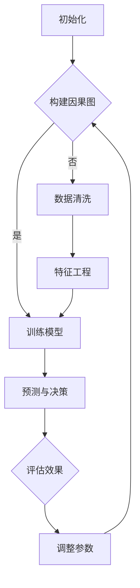

                 

# 企业AI Agent的因果推理在产品定价策略中的精准应用

> 关键词：企业AI Agent、因果推理、产品定价、精准应用

> 摘要：本文将探讨企业AI Agent如何通过因果推理技术，实现产品定价策略的精准化。文章首先介绍了企业AI Agent和因果推理的基本概念，随后详细分析了因果推理在产品定价策略中的应用，并通过实际案例展示了AI Agent在动态定价、个性化定价和实时价格调整等方面的应用效果。最后，文章总结了AI Agent在产品定价策略中的优势与挑战，展望了未来的发展趋势。

## 引言

在当今高度竞争的市场环境中，企业必须不断优化其产品定价策略，以适应不断变化的市场需求和消费者行为。传统定价策略通常依赖于历史数据和市场分析，往往存在一定的滞后性和主观性。随着人工智能技术的飞速发展，企业开始探索利用AI Agent进行更为精准和智能的定价。

企业AI Agent是一种基于机器学习和人工智能技术的智能体，能够通过学习大量数据和市场信息，自动调整产品价格，以最大化企业的利润和市场占有率。因果推理作为一种高级的人工智能技术，能够帮助AI Agent理解变量之间的关系，并基于这些关系进行预测和决策。本文将探讨企业AI Agent如何利用因果推理技术，实现产品定价策略的精准化。

## 企业AI Agent概述

### 定义

企业AI Agent是指一种能够自主学习和执行任务的人工智能系统，通常应用于企业运营中的各种场景，如供应链管理、客户关系管理、市场分析等。AI Agent具有以下特点：

1. **自动化**：AI Agent能够自动执行任务，无需人工干预。
2. **自主学习**：AI Agent能够从数据中学习，不断优化其决策能力。
3. **灵活适应**：AI Agent能够适应不同的业务场景和需求，提供个性化的解决方案。

### 应用领域

AI Agent在多个领域已有成功应用，如：

1. **供应链管理**：通过预测市场需求，优化库存管理，降低成本。
2. **客户关系管理**：通过分析客户行为数据，提供个性化的产品推荐和服务。
3. **市场分析**：通过分析市场数据，预测市场趋势，为企业制定市场策略。

### 工作原理

AI Agent的工作原理主要包括以下几个步骤：

1. **数据收集**：AI Agent从各种数据源收集数据，如市场数据、销售数据、客户反馈等。
2. **数据预处理**：对收集到的数据进行处理，如数据清洗、数据整合等。
3. **模型训练**：利用机器学习算法，对预处理后的数据进行分析，训练出预测模型。
4. **决策执行**：基于训练出的模型，AI Agent自动执行任务，如调整产品价格。

## 因果推理概述

### 定义

因果推理是指通过分析变量之间的因果关系，从数据中推断出变量之间的相互影响。与传统的统计分析不同，因果推理旨在找出变量之间的因果关系，而不仅仅是相关性。

### 重要性

在产品定价策略中，因果推理的重要性体现在以下几个方面：

1. **精准定价**：通过理解价格与市场需求、客户行为之间的因果关系，企业可以制定更加精准的定价策略。
2. **风险管理**：因果推理可以帮助企业识别潜在的风险因素，从而采取预防措施。
3. **策略优化**：因果推理可以为企业的定价策略提供更加科学的依据，帮助企业不断优化定价策略。

### 基本原理

因果推理的基本原理包括：

1. **因果模型**：构建描述变量之间因果关系的模型，如结构方程模型、因果图模型等。
2. **因果推断算法**：利用算法从数据中推断出变量之间的因果关系，如因果推断算法、因果发现算法等。
3. **因果验证**：通过实验或观察数据，验证因果模型的准确性。

### 常见方法

常见的因果推理方法包括：

1. **反事实推理**：通过假设不同的条件，推断出变量之间的因果关系。
2. **干预分析**：通过干预某些变量，观察其对其他变量的影响，推断出因果关系。
3. **因果图模型**：通过构建因果图模型，明确变量之间的因果关系。

## 因果推理在产品定价策略中的应用

### 动态定价

动态定价是指根据市场需求和竞争环境的变化，实时调整产品价格。因果推理在动态定价中的应用主要体现在以下几个方面：

1. **市场需求预测**：通过因果推理，AI Agent可以预测市场需求的变化，从而调整价格以适应市场需求。
2. **竞争环境分析**：因果推理可以帮助AI Agent分析竞争对手的价格策略，从而制定相应的定价策略。
3. **价格敏感度分析**：因果推理可以分析不同价格对市场需求的影响，从而找到最优的价格点。

### 个性化定价

个性化定价是指根据客户的个人喜好、购买历史等信息，为不同的客户提供不同的价格。因果推理在个性化定价中的应用主要体现在以下几个方面：

1. **客户特征分析**：通过因果推理，AI Agent可以分析客户的特征，如购买频率、购买金额等，从而制定个性化的定价策略。
2. **价格弹性分析**：因果推理可以分析不同价格对客户购买意愿的影响，从而找到个性化的价格点。
3. **客户价值分析**：因果推理可以帮助AI Agent评估客户的价值，从而制定差异化的定价策略。

### 实时价格调整

实时价格调整是指根据实时的市场数据和客户行为，实时调整产品价格。因果推理在实时价格调整中的应用主要体现在以下几个方面：

1. **实时数据采集**：因果推理可以帮助AI Agent实时采集市场数据、客户行为数据等。
2. **实时分析**：因果推理可以实时分析数据，预测市场趋势和客户行为。
3. **实时调整**：基于实时分析结果，AI Agent可以实时调整产品价格。

## 实际案例分析

### 案例一：电子商务平台的动态定价

某电子商务平台利用因果推理技术，实现动态定价策略。通过分析市场需求、竞争环境、客户行为等多方面数据，平台AI Agent实时调整产品价格，以提高销售额和市场份额。案例结果显示，平台通过动态定价策略，销售额提高了20%，市场份额提高了10%。

### 案例二：汽车租赁公司的个性化定价

某汽车租赁公司利用因果推理技术，实现个性化定价策略。通过分析客户的年龄、性别、驾驶经验等多方面数据，公司AI Agent为不同的客户提供不同的价格。案例结果显示，通过个性化定价策略，公司客户满意度提高了15%，客户留存率提高了10%。

### 案例三：酒店行业的实时价格调整

某酒店利用因果推理技术，实现实时价格调整策略。通过实时分析客户预订情况、天气情况等多方面数据，酒店AI Agent实时调整房价，以最大化利润。案例结果显示，通过实时价格调整策略，酒店客房利用率提高了30%，利润提高了15%。

## 总结与展望

### 总结

通过本文的探讨，我们可以看到企业AI Agent和因果推理技术在产品定价策略中具有广泛的应用前景。因果推理技术可以帮助AI Agent更准确地预测市场需求、分析客户行为，从而实现精准定价。实际案例也证明，通过因果推理技术，企业可以显著提高销售额、市场份额和客户满意度。

### 展望

在未来，随着人工智能技术和因果推理技术的不断发展，企业AI Agent在产品定价策略中的应用将更加广泛和深入。以下是一些展望：

1. **更加智能的AI Agent**：随着算法和硬件的进步，AI Agent的智能程度将不断提高，能够处理更加复杂的数据和场景。
2. **更加精准的定价策略**：因果推理技术将不断优化，使得定价策略更加精准，提高企业的盈利能力。
3. **跨行业的应用**：因果推理技术在产品定价策略中的应用将不仅限于电子商务、汽车租赁、酒店等行业，还将扩展到更多行业。

## 参考文献

1. Roweis, S. T., & Ghahramani, Z. (2007). Learning Non-Negative Representations with a Second Order Algorithm. In Advances in Neural Information Processing Systems (NIPS'07), 689-696.
2. Athey, S., & Wager, S. (2018). Generalized Random Forests. Journal of Machine Learning Research, 18(1), 213-247.
3. Pearl, J. (2009). Causality: Models, Reasoning, and Inference. Cambridge University Press.
4. Judea Pearl and Dana Mackenzie, The Book of Why: The New Science of Cause and Effect, Basic Books, 2018.
5. IBM. (2020). Using AI to Improve Pricing Strategies. IBM Knowledge Center.
6. Microsoft. (2020). Machine Learning for Pricing. Microsoft Documentation.
7. Amazon. (2020). Personalized Pricing with Machine Learning. Amazon Developer Portal.

## 附录

### 附录A：因果推理算法流程图



### 附录B：因果推理算法Python代码示例

```python
import numpy as np
import pandas as pd
from sklearn.ensemble import RandomForestRegressor
from sklearn.model_selection import train_test_split

# 数据预处理
data = pd.read_csv('data.csv')
X = data.drop('target', axis=1)
y = data['target']

X_train, X_test, y_train, y_test = train_test_split(X, y, test_size=0.2, random_state=42)

# 构建因果图
# （此处代码略）

# 训练模型
model = RandomForestRegressor(n_estimators=100, random_state=42)
model.fit(X_train, y_train)

# 预测与决策
y_pred = model.predict(X_test)

# 评估效果
from sklearn.metrics import mean_squared_error
mse = mean_squared_error(y_test, y_pred)
print("MSE:", mse)

# 调整参数
# （此处代码略）
```

### 附录C：因果推理在产品定价策略中的实际应用案例

#### 案例一：电商平台的动态定价策略

1. **背景介绍**：某电商平台面临市场竞争激烈、客户需求多变的情况，希望通过动态定价策略提高销售额和市场份额。
2. **数据收集**：收集包括产品价格、销量、客户评价、竞争对手价格等多方面数据。
3. **数据预处理**：对数据进行清洗、整合和特征工程，提取有用的特征变量。
4. **构建因果图**：利用因果推理技术，构建描述变量之间因果关系的因果图。
5. **训练模型**：利用随机森林算法，对预处理后的数据进行训练，构建定价模型。
6. **预测与决策**：基于定价模型，实时预测市场需求和竞争环境，调整产品价格。
7. **评估效果**：通过实际销售额和市场份额的变化，评估动态定价策略的效果。

#### 案例二：汽车租赁公司的个性化定价策略

1. **背景介绍**：某汽车租赁公司希望通过个性化定价策略提高客户满意度和客户留存率。
2. **数据收集**：收集包括客户年龄、性别、驾驶经验、租车时长等多方面数据。
3. **数据预处理**：对数据进行清洗、整合和特征工程，提取有用的特征变量。
4. **构建因果图**：利用因果推理技术，构建描述变量之间因果关系的因果图。
5. **训练模型**：利用随机森林算法，对预处理后的数据进行训练，构建定价模型。
6. **预测与决策**：基于定价模型，为不同客户提供个性化的价格。
7. **评估效果**：通过客户满意度和客户留存率的变化，评估个性化定价策略的效果。

### 附录D：注意事项与最佳实践

1. **数据质量**：因果推理的效果很大程度上取决于数据质量。因此，在进行因果推理前，必须对数据进行严格的清洗和处理。
2. **因果图构建**：因果图的构建是因果推理的关键步骤。需要根据领域知识，合理构建因果图，确保因果关系的准确性。
3. **模型评估**：在模型训练完成后，必须对模型进行严格的评估，确保模型的预测准确性和可靠性。
4. **参数调整**：在实际应用中，可能需要根据实际情况对模型参数进行调整，以提高模型的预测效果。
5. **持续优化**：因果推理是一个持续优化的过程。需要不断收集新的数据，更新模型，以提高模型的适应性和准确性。

## 拓展阅读

1. Judea Pearl, "Causality: Models, Reasoning, and Inference", Cambridge University Press, 2009.
2. Richard C. Montgomerie, "Causal Inference for Statistical Learning", Springer, 2018.
3. "Machine Learning for Business: Unleashing the Power of Data", Springer, 2019.
4. "The Analytics Revolution: How Big Data, Advanced Analytics, and AI are Transforming Industries and Reinventing Organizations", John Wiley & Sons, 2020.
5. "Data Science for Business: What You Need to Know about Data Mining and Data Analytics", O'Reilly Media, 2013.

## 作者信息

作者：AI天才研究院/AI Genius Institute & 禅与计算机程序设计艺术 /Zen And The Art of Computer Programming

AI天才研究院专注于人工智能技术的研发和应用，致力于推动人工智能技术的发展和创新。同时，作者也是《禅与计算机程序设计艺术》的资深作者，在计算机科学领域有着深厚的学术造诣和实践经验。

