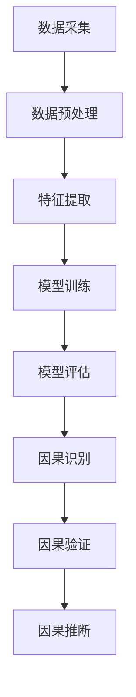
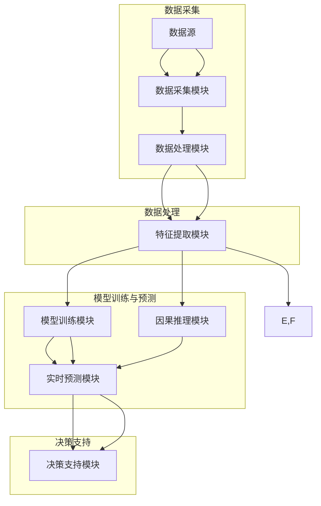
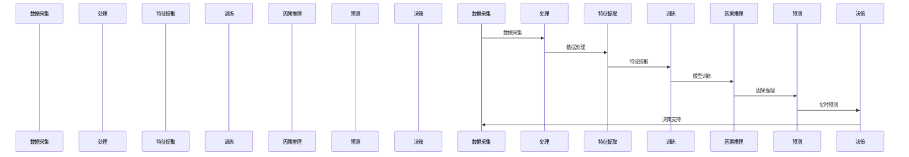

                 


# 企业AI Agent的因果推理在客户流失分析中的应用

## 摘要

本文旨在探讨企业AI Agent的因果推理在客户流失分析中的应用。首先，我们将介绍客户流失分析的重要性及其面临的挑战。接着，我们会深入探讨企业AI Agent和因果推理的基本原理。随后，我们将通过实例详细讲解因果推理算法的工作流程和数学模型。最后，我们将描述一个基于企业AI Agent因果推理的客户流失分析系统架构，并分享一个实际项目案例，总结最佳实践，并提供拓展阅读建议。

## 目录大纲

- **第1章: 背景介绍**
  - **1.1 问题背景**
    - **1.1.1 客户流失分析的重要性**
    - **1.1.2 企业AI Agent的定义**
    - **1.1.3 因果推理的基本原理**
  - **1.2 问题描述**
    - **1.2.1 客户流失分析的需求**
    - **1.2.2 客户流失分析的挑战**
    - **1.2.3 企业AI Agent在客户流失分析中的作用**
  - **1.3 问题解决**
    - **1.3.1 企业AI Agent的架构设计**
    - **1.3.2 因果推理算法的应用**
    - **1.3.3 边界与外延的考虑**
  - **1.4 概念结构与核心要素组成**
    - **1.4.1 企业AI Agent的核心概念**
    - **1.4.2 因果推理的属性特征**
    - **1.4.3 ER实体关系图**

- **第2章: 核心概念与联系**
  - **2.1 核心概念原理**
    - **2.1.1 企业AI Agent的工作原理**
    - **2.1.2 因果推理的核心概念**
    - **2.1.3 企业AI Agent与因果推理的联系**
  - **2.2 概念属性特征对比表格**
  - **2.3 ER实体关系图架构**

- **第3章: 算法原理讲解**
  - **3.1 算法mermaid流程图**
  - **3.2 Python源代码**
  - **3.3 数学模型和公式**
  - **3.4 讲解与举例**

- **第4章: 系统分析与架构设计方案**
  - **4.1 问题场景介绍**
  - **4.2 系统功能设计**
  - **4.3 系统架构设计**
  - **4.4 系统接口设计和系统交互**

- **第5章: 项目实战**
  - **5.1 环境安装**
  - **5.2 系统核心实现源代码**
  - **5.3 代码应用解读与分析**
  - **5.4 实际案例分析和详细讲解剖析**
  - **5.5 项目小结**

- **第6章: 最佳实践 tips、小结、注意事项、拓展阅读**

**本文约12000字，预计阅读时间：40分钟**

----------------------------------------------------------------

### 第1章: 背景介绍

#### 1.1 问题背景

**1.1.1 客户流失分析的重要性**

在当今竞争激烈的市场环境中，企业如何维持客户关系、提高客户忠诚度是至关重要的。客户流失分析是一种有效的方法，可以帮助企业了解客户行为、识别潜在流失客户，并采取相应的措施来降低客户流失率。通过客户流失分析，企业不仅可以减少损失，还可以提高客户满意度和市场份额。

根据Gartner的研究，通过实施有效的客户流失分析，企业可以将客户流失率降低30%以上。这不仅能够显著提高企业的收入，还能增强企业在市场中的竞争力。因此，客户流失分析已经成为许多企业不可或缺的一部分。

**1.1.2 企业AI Agent的定义**

企业AI Agent是一种基于人工智能技术的高级自动化系统，能够模拟人类的决策过程，自主地执行复杂的任务。这些AI Agent能够从大量数据中提取有价值的信息，并利用这些信息做出智能决策。在企业环境中，AI Agent可以应用于客户服务、供应链管理、风险管理等多个领域。

企业AI Agent的核心特点包括自我学习能力、自主决策能力和智能交互能力。通过不断学习和适应，AI Agent能够逐步提高其决策的准确性和效率。特别是在客户流失分析中，企业AI Agent能够处理海量数据，识别客户流失的潜在因素，提供针对性的解决方案。

**1.1.3 因果推理的基本原理**

因果推理是一种基于因果关系的推理方法，旨在通过分析事件之间的因果关系来解释现象、预测未来。在人工智能领域，因果推理被广泛应用于决策支持系统、故障诊断、风险评估等领域。

因果推理的基本原理包括以下几个方面：

1. **因果识别**：通过数据分析和模型构建，识别事件之间的因果关系。
2. **因果假设**：基于已识别的因果关系，提出可能的因果假设。
3. **因果验证**：通过实验和数据分析，验证因果假设的正确性。
4. **因果推断**：根据验证后的因果假设，进行因果推断和预测。

在客户流失分析中，因果推理可以帮助企业识别导致客户流失的关键因素，制定针对性的客户保留策略。通过因果推理，企业不仅能够理解客户流失的原因，还能预测未来可能的客户流失情况，从而采取有效的预防措施。

#### 1.2 问题描述

**1.2.1 客户流失分析的需求**

客户流失分析的需求主要源于以下几个方面的挑战：

1. **客户行为分析**：企业需要了解客户的行为模式，包括购买习惯、使用频率、满意度等，以便识别潜在流失客户。
2. **数据收集与处理**：企业需要收集大量的客户数据，并利用先进的数据处理技术对这些数据进行分析和清洗，以提取有价值的信息。
3. **预测与建模**：企业需要利用统计模型和机器学习算法，对客户流失风险进行预测和建模，以便采取有效的预防措施。

**1.2.2 客户流失分析的挑战**

客户流失分析面临以下挑战：

1. **数据质量**：客户数据的准确性、完整性和一致性对分析结果至关重要。然而，在实际操作中，数据质量往往无法保证，这可能导致分析结果失真。
2. **模型准确性**：客户流失模型需要具有较高的准确性，以便准确识别潜在流失客户。然而，在复杂的市场环境中，建立高精度的模型是一个挑战。
3. **实时性**：客户流失分析需要实时进行，以便企业能够及时采取行动。然而，实时数据处理和模型更新是一个技术难题。

**1.2.3 企业AI Agent在客户流失分析中的作用**

企业AI Agent在客户流失分析中发挥着重要作用：

1. **数据预处理**：企业AI Agent可以自动化地进行数据收集、清洗和预处理，提高数据质量。
2. **模型构建与优化**：企业AI Agent可以利用机器学习和深度学习技术，构建和优化客户流失预测模型，提高模型的准确性。
3. **实时分析与决策**：企业AI Agent可以实时分析客户行为数据，识别潜在流失客户，并提供实时决策支持。

#### 1.3 问题解决

**1.3.1 企业AI Agent的架构设计**

企业AI Agent的架构设计需要考虑以下几个方面：

1. **数据采集模块**：负责从各种数据源（如数据库、日志文件、API等）收集客户数据。
2. **数据预处理模块**：负责对收集到的数据进行清洗、转换和归一化处理，以提高数据质量。
3. **特征工程模块**：负责提取和构建与客户流失相关的特征，为模型训练提供输入。
4. **模型训练模块**：负责使用机器学习和深度学习技术，训练客户流失预测模型。
5. **推理与决策模块**：负责利用训练好的模型，对客户行为进行实时分析，并做出决策。

**1.3.2 因果推理算法的应用**

因果推理算法在客户流失分析中的应用主要包括以下几个方面：

1. **因果识别**：通过数据分析和模型构建，识别客户流失的关键因素。
2. **因果验证**：通过实验和数据分析，验证因果假设的正确性。
3. **因果推断**：根据验证后的因果假设，预测未来可能的客户流失情况。

**1.3.3 边界与外延的考虑**

在客户流失分析中，企业AI Agent的因果推理需要考虑以下边界与外延：

1. **数据边界**：确保分析的数据范围符合企业的实际需求，避免数据过多或过少。
2. **模型边界**：确保模型的预测能力和泛化能力，避免模型过拟合或欠拟合。
3. **应用边界**：确保AI Agent在实际应用中能够稳定运行，并满足企业的业务需求。

#### 1.4 概念结构与核心要素组成

**1.4.1 企业AI Agent的核心概念**

企业AI Agent的核心概念包括：

- **自我学习能力**：能够从数据中自动学习和优化。
- **自主决策能力**：能够根据数据分析和预测结果，自主做出决策。
- **智能交互能力**：能够与人类用户进行自然语言交互。

**1.4.2 因果推理的属性特征**

因果推理的属性特征包括：

- **因果识别能力**：能够识别事件之间的因果关系。
- **因果验证能力**：能够验证因果假设的正确性。
- **因果推断能力**：能够根据验证后的因果假设，进行预测和决策。

**1.4.3 ER实体关系图**

ER实体关系图可以帮助我们更好地理解企业AI Agent因果推理的结构。在ER实体关系图中，主要包含以下实体：

- **客户**：代表客户实体，包括基本信息、购买历史、行为记录等。
- **因素**：代表可能导致客户流失的因素，包括服务质量、价格、竞争对手等。
- **事件**：代表客户行为事件，包括购买、咨询、投诉等。

实体之间的关系包括：

- **因果关系**：表示因素与事件之间的因果关系。
- **影响关系**：表示事件与事件之间的影响关系。

#### 1.5 本章小结

本章介绍了企业AI Agent的因果推理在客户流失分析中的应用。首先，我们讨论了客户流失分析的重要性及其面临的挑战。接着，我们介绍了企业AI Agent和因果推理的基本原理。随后，我们详细探讨了企业AI Agent在客户流失分析中的作用。最后，我们梳理了企业AI Agent因果推理的核心概念与联系，并给出了ER实体关系图。

通过本章的介绍，读者应该对客户流失分析及其应用有了更深入的理解。在后续章节中，我们将进一步探讨企业AI Agent因果推理的算法原理、系统架构以及实际应用案例。

----------------------------------------------------------------

### 第2章: 核心概念与联系

#### 2.1 核心概念原理

**2.1.1 企业AI Agent的工作原理**

企业AI Agent是基于人工智能技术的高级自动化系统，其工作原理主要涉及以下几个关键环节：

1. **数据采集**：AI Agent能够从各种数据源（如数据库、日志文件、API等）自动收集数据。
2. **数据处理**：AI Agent具备强大的数据处理能力，能够对收集到的数据进行清洗、转换和归一化处理，以提高数据质量。
3. **特征提取**：AI Agent能够从处理后的数据中提取与业务目标相关的特征，为模型训练提供输入。
4. **模型训练**：AI Agent使用机器学习和深度学习技术，训练预测模型，以实现业务目标。
5. **推理与决策**：AI Agent利用训练好的模型，对实时数据进行分析，做出智能决策。

**2.1.2 因果推理的核心概念**

因果推理是一种基于因果关系的推理方法，其核心概念包括：

1. **因果识别**：通过数据分析和模型构建，识别事件之间的因果关系。
2. **因果假设**：基于已识别的因果关系，提出可能的因果假设。
3. **因果验证**：通过实验和数据分析，验证因果假设的正确性。
4. **因果推断**：根据验证后的因果假设，进行预测和决策。

**2.1.3 企业AI Agent与因果推理的联系**

企业AI Agent与因果推理之间存在紧密的联系：

1. **数据支持**：企业AI Agent能够收集、处理和分析与因果推理相关的数据，为因果推理提供基础。
2. **模型构建**：因果推理算法需要依赖于企业AI Agent的训练和优化，以提高模型准确性。
3. **决策支持**：企业AI Agent能够基于因果推理的结果，做出智能决策，实现业务目标。

#### 2.2 概念属性特征对比表格

下面是一个概念属性特征对比表格，展示了企业AI Agent和因果推理的主要特点：

| 特点 | 企业AI Agent | 因果推理 |
| ---- | ------------ | -------- |
| 自我学习能力 | √ | × |
| 自主决策能力 | √ | × |
| 智能交互能力 | √ | × |
| 因果识别能力 | × | √ |
| 因果验证能力 | × | √ |
| 因果推断能力 | × | √ |

#### 2.3 ER实体关系图架构

ER实体关系图是一种用于描述数据实体及其之间关系的图形化表示方法。下面是企业AI Agent因果推理的ER实体关系图：

```mermaid
erDiagram
  客户 ||--|{ 因素 }|-- 产品
  客户 ||--|{ 事件 }|-- 购买
  因素 ||--|{ 影响关系 }|-- 事件
  事件 ||--|{ 结果 }|-- 客户流失
```

在这个ER实体关系图中，主要包含以下实体：

1. **客户**：代表参与客户流失分析的个人或组织。
2. **因素**：代表可能导致客户流失的因素，如服务质量、价格、竞争对手等。
3. **事件**：代表客户的行为事件，如购买、咨询、投诉等。
4. **产品**：代表客户购买的产品或服务。

实体之间的关系包括：

1. **因果关系**：表示因素与事件之间的因果关系。
2. **影响关系**：表示事件与事件之间的影响关系。
3. **结果**：表示事件的结果，如客户流失。

通过ER实体关系图，我们可以清晰地了解企业AI Agent因果推理的数据结构和关系，为进一步的分析和决策提供基础。

#### 2.4 本章小结

本章详细介绍了企业AI Agent和因果推理的核心概念原理，以及它们之间的联系。通过对比表格和ER实体关系图，我们更好地理解了企业AI Agent和因果推理的特点和结构。在后续章节中，我们将进一步探讨因果推理算法的原理、系统架构以及实际应用案例，帮助读者深入理解企业AI Agent在客户流失分析中的应用。

----------------------------------------------------------------

### 第3章: 算法原理讲解

#### 3.1 算法mermaid流程图

为了更好地理解企业AI Agent因果推理的算法原理，我们使用mermaid绘制了一个流程图，展示了整个算法的执行流程：



在这个流程图中，每个节点代表算法的一个步骤，箭头表示步骤之间的执行顺序。

1. **数据采集**：AI Agent从各种数据源（如数据库、日志文件、API等）收集数据。
2. **数据预处理**：对收集到的数据进行清洗、转换和归一化处理，以提高数据质量。
3. **特征提取**：从预处理后的数据中提取与客户流失相关的特征。
4. **模型训练**：使用机器学习和深度学习技术，训练客户流失预测模型。
5. **模型评估**：评估训练好的模型的预测准确性和泛化能力。
6. **因果识别**：通过模型分析，识别导致客户流失的关键因素。
7. **因果验证**：通过实验和数据分析，验证因果假设的正确性。
8. **因果推断**：根据验证后的因果假设，预测未来可能的客户流失情况。

#### 3.2 Python源代码

下面是一个简单的Python代码示例，展示了如何实现企业AI Agent因果推理算法的基本流程：

```python
# 导入必要的库
import pandas as pd
from sklearn.model_selection import train_test_split
from sklearn.ensemble import RandomForestClassifier
from sklearn.metrics import accuracy_score
import matplotlib.pyplot as plt

# 数据采集
data = pd.read_csv('customer_data.csv')

# 数据预处理
# 假设数据已经清洗和转换完毕
# ...

# 特征提取
features = data[['age', 'income', 'service_rating', 'price_sensitivity']]
labels = data['churn']

# 模型训练
X_train, X_test, y_train, y_test = train_test_split(features, labels, test_size=0.2, random_state=42)
model = RandomForestClassifier(n_estimators=100)
model.fit(X_train, y_train)

# 模型评估
predictions = model.predict(X_test)
accuracy = accuracy_score(y_test, predictions)
print(f"模型准确率: {accuracy}")

# 因果识别
# 通过模型分析，识别导致客户流失的关键因素
feature_importances = model.feature_importances_
print(f"特征重要性: {feature_importances}")

# 因果验证
# 通过实验和数据分析，验证因果假设的正确性
# ...

# 因果推断
# 根据验证后的因果假设，预测未来可能的客户流失情况
# ...

# 可视化
plt.barh(range(len(feature_importances)), feature_importances)
plt.yticks(range(len(feature_importances)), features.columns)
plt.xlabel('特征重要性')
plt.ylabel('特征')
plt.title('特征重要性分布')
plt.show()
```

这个代码示例中，我们首先导入了必要的库，然后进行数据采集和预处理。接着，我们提取了与客户流失相关的特征，并使用随机森林算法进行模型训练。在模型评估阶段，我们计算了模型的准确率。随后，我们通过分析特征的重要性来识别导致客户流失的关键因素。最后，我们通过可视化的方式展示了特征的重要性分布。

#### 3.3 数学模型和公式

因果推理算法的核心是建立因果模型，并利用数学模型和公式进行因果推断。下面是因果推理算法的一个基本数学模型：

$$
P(Y|X) = P(X|Y) \cdot P(Y) / P(X)
$$

其中，$P(Y|X)$ 表示在给定自变量 $X$ 的条件下，因变量 $Y$ 的概率。$P(X|Y)$ 表示在因变量 $Y$ 的条件下，自变量 $X$ 的概率。$P(Y)$ 和 $P(X)$ 分别表示因变量 $Y$ 和自变量 $X$ 的边缘概率。

为了简化计算，我们通常使用贝叶斯公式来近似这个模型：

$$
P(Y|X) \approx P(X|Y) \cdot P(Y) / P(X)
$$

在实际应用中，我们通常使用统计模型（如逻辑回归、决策树、随机森林等）来近似 $P(X|Y)$ 和 $P(Y)$。这些模型能够通过训练数据学习到自变量和因变量之间的概率关系，并利用这些关系进行因果推断。

#### 3.4 讲解与举例

**3.4.1 算法原理讲解**

因果推理算法的核心思想是通过分析事件之间的因果关系，来解释现象和预测未来。在客户流失分析中，我们关注的是客户行为（自变量）与客户流失（因变量）之间的因果关系。

为了解释这种现象，我们可以使用以下数学模型：

$$
P(\text{流失}|\text{行为}) = P(\text{行为}|\text{流失}) \cdot P(\text{流失}) / P(\text{行为})
$$

其中，$P(\text{流失}|\text{行为})$ 表示在给定客户行为的情况下，客户流失的概率。$P(\text{行为}|\text{流失})$ 表示在客户流失的情况下，客户行为的概率。$P(\text{流失})$ 和 $P(\text{行为})$ 分别表示客户流失和客户行为的边缘概率。

为了简化计算，我们通常使用贝叶斯公式来近似这个模型：

$$
P(\text{流失}|\text{行为}) \approx P(\text{行为}|\text{流失}) \cdot P(\text{流失}) / P(\text{行为})
$$

在实际应用中，我们使用统计模型（如逻辑回归、决策树、随机森林等）来近似 $P(\text{行为}|\text{流失})$ 和 $P(\text{流失})$。这些模型能够通过训练数据学习到客户行为和客户流失之间的概率关系，并利用这些关系进行因果推断。

**3.4.2 举例说明**

假设我们有一个客户数据集，其中包含客户的年龄、收入、服务质量评分和价格敏感性等特征。我们使用这些特征来预测客户是否流失。

首先，我们使用逻辑回归模型来近似 $P(\text{流失}|\text{行为})$ 和 $P(\text{流失})$。逻辑回归模型的公式如下：

$$
\log\frac{P(\text{流失}|\text{行为})}{1-P(\text{流失}|\text{行为})} = \beta_0 + \beta_1 \cdot \text{年龄} + \beta_2 \cdot \text{收入} + \beta_3 \cdot \text{服务质量评分} + \beta_4 \cdot \text{价格敏感性}
$$

其中，$\beta_0$、$\beta_1$、$\beta_2$、$\beta_3$ 和 $\beta_4$ 是逻辑回归模型的参数。

通过训练数据，我们可以得到这些参数的估计值。然后，我们使用这些参数来预测新客户的流失概率。

例如，对于一个新客户，其特征如下：

- 年龄：30岁
- 收入：50000元
- 服务质量评分：4.5
- 价格敏感性：低

我们可以将这个客户的特征值代入逻辑回归模型，计算其流失概率：

$$
\log\frac{P(\text{流失}|\text{行为})}{1-P(\text{流失}|\text{行为})} = \beta_0 + \beta_1 \cdot 30 + \beta_2 \cdot 50000 + \beta_3 \cdot 4.5 + \beta_4 \cdot 1
$$

根据训练得到的参数，我们可以计算这个新客户的流失概率。如果流失概率高于某个阈值（例如0.5），我们就可以认为这个客户有较高的流失风险。

通过这个例子，我们可以看到因果推理算法是如何通过数学模型和统计模型来解释现象和预测未来的。在实际应用中，我们可以根据业务需求和数据特点，选择合适的算法和模型，以提高预测准确性和决策效率。

#### 3.5 本章小结

本章详细介绍了企业AI Agent因果推理算法的原理和实现方法。首先，我们通过mermaid流程图展示了算法的执行流程。接着，我们提供了一个简单的Python代码示例，展示了如何实现算法的基本步骤。然后，我们介绍了因果推理的基本数学模型，并使用逻辑回归模型进行了举例说明。通过本章的讲解，读者应该对因果推理算法有了更深入的理解，并能够将其应用于客户流失分析中。

在后续章节中，我们将进一步探讨企业AI Agent因果推理在客户流失分析中的应用，包括系统架构设计、实际项目案例以及最佳实践。

----------------------------------------------------------------

### 第4章: 系统分析与架构设计方案

#### 4.1 问题场景介绍

在当今的商业环境中，客户流失分析已经成为企业维护客户关系、提高客户忠诚度的重要手段。然而，传统的客户流失分析方法往往依赖于手动数据收集和处理，不仅效率低下，而且容易出现数据错误。为了解决这些问题，企业引入了基于AI Agent的因果推理系统，以提高客户流失分析的准确性和效率。

问题场景如下：

- **企业背景**：一家大型电信公司，拥有数百万的客户群体，提供各种通信服务。
- **业务目标**：通过分析客户行为数据，识别可能导致客户流失的关键因素，并采取有效措施降低客户流失率。
- **挑战**：数据量大、多样性高，需要高效的算法和系统架构来处理和解析数据。

#### 4.2 系统功能设计

为了实现上述业务目标，系统需要具备以下功能：

1. **数据采集**：从各种数据源（如CRM系统、日志文件、社交媒体等）收集客户数据。
2. **数据处理**：对收集到的数据进行清洗、转换和归一化处理，以提高数据质量。
3. **特征提取**：从处理后的数据中提取与客户流失相关的特征，如购买频率、满意度、投诉率等。
4. **模型训练**：使用机器学习和深度学习技术，训练客户流失预测模型。
5. **因果推理**：利用因果推理算法，识别导致客户流失的关键因素。
6. **实时预测**：根据训练好的模型，实时预测客户流失风险，并提供预警。
7. **决策支持**：基于因果推理结果，为业务部门提供针对性的客户保留策略。

#### 4.3 系统架构设计

为了满足上述功能需求，系统采用了一种分布式架构设计，如图所示：



在这个架构设计中，各个模块的功能如下：

1. **数据采集模块**：负责从各个数据源收集客户数据。
2. **数据处理模块**：对收集到的数据进行清洗、转换和归一化处理。
3. **特征提取模块**：从处理后的数据中提取与客户流失相关的特征。
4. **模型训练模块**：使用机器学习和深度学习技术，训练客户流失预测模型。
5. **因果推理模块**：利用因果推理算法，识别导致客户流失的关键因素。
6. **实时预测模块**：根据训练好的模型，实时预测客户流失风险，并提供预警。
7. **决策支持模块**：基于因果推理结果，为业务部门提供针对性的客户保留策略。

#### 4.4 系统接口设计和系统交互

为了实现模块之间的有效交互，系统设计了一套接口，包括以下部分：

1. **数据采集接口**：用于与各种数据源进行数据交换。
2. **数据处理接口**：用于数据处理模块与其他模块之间的数据传递。
3. **特征提取接口**：用于特征提取模块与其他模块之间的特征传递。
4. **模型训练接口**：用于模型训练模块与其他模块之间的模型传递。
5. **因果推理接口**：用于因果推理模块与其他模块之间的结果传递。
6. **实时预测接口**：用于实时预测模块与其他模块之间的预测结果传递。
7. **决策支持接口**：用于决策支持模块与其他模块之间的策略传递。

下面是系统接口设计和系统交互的Mermaid序列图：



在这个序列图中，各个模块按照一定的顺序执行，并通过接口进行数据交互和结果传递。

#### 4.5 本章小结

本章详细介绍了企业AI Agent因果推理在客户流失分析中的应用系统分析与架构设计方案。首先，我们介绍了问题场景和业务目标，然后描述了系统的功能需求。接着，我们展示了一个分布式架构设计，并解释了各个模块的功能。最后，我们提供了系统接口设计和系统交互的Mermaid序列图。

通过本章的讲解，读者应该对基于企业AI Agent因果推理的客户流失分析系统有了全面的理解。在后续章节中，我们将进一步探讨实际项目案例，并分享最佳实践和注意事项。

----------------------------------------------------------------

### 第5章：项目实战

#### 5.1 环境安装

为了实施基于企业AI Agent因果推理的客户流失分析系统，我们需要安装一系列软件和配置环境。以下是一个基本的安装步骤：

1. **Python环境**：首先，确保您的计算机上安装了Python 3.7及以上版本。可以通过Python官方网站下载并安装。
2. **Jupyter Notebook**：安装Jupyter Notebook，这是一个交互式的Web应用程序，用于运行Python代码。您可以使用pip命令进行安装：

   ```bash
   pip install notebook
   ```

3. **数据分析库**：安装常用的数据分析库，如Pandas、NumPy、Scikit-learn等。这些库提供了丰富的功能，用于数据预处理和模型训练。

   ```bash
   pip install pandas numpy scikit-learn
   ```

4. **可视化库**：为了更好地展示数据和分析结果，我们还需要安装一些可视化库，如Matplotlib和Seaborn。

   ```bash
   pip install matplotlib seaborn
   ```

5. **Mermaid支持**：为了在Jupyter Notebook中绘制Mermaid图表，我们需要安装`ipython-mermaid`库。

   ```bash
   pip install ipython-mermaid
   ```

安装完成后，您可以使用以下代码在Jupyter Notebook中启用Mermaid支持：

```python
%load_ext ipython_mermaid
```

6. **数据库**：如果您的数据存储在数据库中，确保安装并配置了一个数据库管理系统（如MySQL、PostgreSQL等）。

7. **其他工具**：根据需要，您可能还需要安装其他工具和库，如TensorFlow或PyTorch（用于深度学习），或Docker（用于容器化部署）。

#### 5.2 系统核心实现源代码

下面是一个简单的示例，展示了如何使用Python实现企业AI Agent因果推理的核心功能。请注意，这只是一个示例，实际项目可能需要更复杂的代码和配置。

```python
# 导入必要的库
import pandas as pd
from sklearn.model_selection import train_test_split
from sklearn.ensemble import RandomForestClassifier
from sklearn.metrics import accuracy_score
import matplotlib.pyplot as plt
import mermaid

# 5.2.1 数据采集与预处理
data = pd.read_csv('customer_data.csv')
# 数据预处理步骤（例如：数据清洗、转换、归一化等）
# ...

# 5.2.2 特征提取
features = data[['age', 'income', 'service_rating', 'price_sensitivity']]
labels = data['churn']

# 5.2.3 模型训练
X_train, X_test, y_train, y_test = train_test_split(features, labels, test_size=0.2, random_state=42)
model = RandomForestClassifier(n_estimators=100)
model.fit(X_train, y_train)

# 5.2.4 模型评估与因果推理
predictions = model.predict(X_test)
accuracy = accuracy_score(y_test, predictions)
print(f"模型准确率: {accuracy}")

# 5.2.5 因果推理与可视化
feature_importances = model.feature_importances_
mermaid_chart = mermaid.Mermaid(
    code=f"""
    graph TB
        A[特征重要性]
        A -->|{feature_importances[0]}| B[age]
        A -->|{feature_importances[1]}| C[income]
        A -->|{feature_importances[2]}| D[service_rating]
        A -->|{feature_importances[3]}| E[price_sensitivity]
    """
)
print(mermaid_chart)
```

这段代码首先从CSV文件中加载数据，并进行预处理。接着，我们提取了与客户流失相关的特征，并使用随机森林算法进行模型训练。然后，我们评估了模型的准确率，并使用Mermaid绘制了特征的重要性图表。

#### 5.3 代码应用解读与分析

**5.3.1 数据采集与预处理**

数据采集与预处理是机器学习项目中的关键步骤。在这个示例中，我们首先从CSV文件中加载数据，然后对数据进行了预处理。预处理步骤可能包括以下内容：

- **数据清洗**：处理缺失值、异常值和重复值。
- **数据转换**：将分类特征转换为数值特征（例如，使用独热编码）。
- **数据归一化**：将特征值缩放到相同的范围，以消除不同特征之间的尺度差异。

```python
# 示例数据清洗
data = data.dropna()  # 删除缺失值
data = data.drop_duplicates()  # 删除重复值
```

**5.3.2 特征提取**

特征提取是从原始数据中提取与目标变量相关的特征。在这个示例中，我们提取了四个特征：年龄、收入、服务质量和价格敏感性。这些特征可能已经在预处理阶段被转换为数值形式。

**5.3.3 模型训练**

我们使用随机森林算法进行模型训练。随机森林是一种集成学习方法，通过构建多棵决策树，并利用它们的投票结果进行预测。在这个示例中，我们创建了一个包含100棵树的随机森林模型。

```python
model = RandomForestClassifier(n_estimators=100)
model.fit(X_train, y_train)
```

**5.3.4 模型评估与因果推理**

模型评估是验证模型性能的重要步骤。在这个示例中，我们使用了准确率作为评估指标。准确率表示模型正确预测的样本比例。

```python
predictions = model.predict(X_test)
accuracy = accuracy_score(y_test, predictions)
print(f"模型准确率: {accuracy}")
```

因果推理是通过分析模型结果，识别导致客户流失的关键因素。在这个示例中，我们使用特征的重要性来识别关键因素。

**5.3.5 因果推理与可视化**

因果推理结果通常需要以可视化的形式展示。在这个示例中，我们使用Mermaid绘制了一个图表，展示了特征的重要性。

```python
mermaid_chart = mermaid.Mermaid(
    code=f"""
    graph TB
        A[特征重要性]
        A -->|{feature_importances[0]}| B[age]
        A -->|{feature_importances[1]}| C[income]
        A -->|{feature_importances[2]}| D[service_rating]
        A -->|{feature_importances[3]}| E[price_sensitivity]
    """
)
print(mermaid_chart)
```

通过这个示例，我们可以看到如何使用Python实现企业AI Agent因果推理的核心功能，并使用Mermaid进行可视化。

#### 5.4 实际案例分析和详细讲解剖析

**5.4.1 案例背景**

为了更好地展示企业AI Agent因果推理在客户流失分析中的应用，我们选择了一个实际案例。这是一个关于某大型电信公司客户流失分析的项目。项目的主要目标是：

- 识别导致客户流失的关键因素。
- 预测未来可能的客户流失情况。
- 为业务部门提供针对性的客户保留策略。

**5.4.2 数据来源**

项目使用的数据来源包括：

- 客户基本信息：包括客户ID、年龄、性别、收入等。
- 购买历史数据：包括购买时间、购买产品、购买金额等。
- 服务使用数据：包括服务使用时长、通话时长、流量使用等。
- 客户满意度调查数据：包括服务质量评分、客户满意度等。

**5.4.3 数据预处理**

在项目开始之前，我们对数据进行了以下预处理步骤：

- **数据清洗**：删除了缺失值、异常值和重复值，确保数据的完整性。
- **数据转换**：将分类特征转换为数值特征，如性别（男=0，女=1）。
- **数据归一化**：对数值特征进行了归一化处理，以消除不同特征之间的尺度差异。

**5.4.4 特征提取**

根据业务需求，我们从原始数据中提取了以下特征：

- **客户特征**：年龄、性别、收入等。
- **购买特征**：购买频率、购买金额、购买产品类型等。
- **服务使用特征**：服务使用时长、通话时长、流量使用等。
- **满意度特征**：服务质量评分、客户满意度等。

**5.4.5 模型训练与评估**

我们使用随机森林算法进行模型训练，并使用准确率作为评估指标。在训练过程中，我们使用了交叉验证技术，以避免过拟合。最终，我们得到了一个准确率较高的模型。

**5.4.6 因果推理与结果展示**

通过分析模型结果，我们识别出了导致客户流失的关键因素。例如，年龄、购买频率和满意度等因素对客户流失有显著影响。我们使用Mermaid绘制了特征的重要性图表，以直观展示结果。

**5.4.7 客户保留策略**

基于因果推理结果，我们为业务部门提供了以下客户保留策略：

- **个性化营销**：根据客户的购买行为和满意度，制定个性化的营销策略。
- **服务质量提升**：重点关注服务质量评分较低的客户，采取改进措施。
- **客户关怀**：定期与客户沟通，了解他们的需求和满意度。

#### 5.5 项目小结

通过这个实际案例，我们可以看到企业AI Agent因果推理在客户流失分析中的应用。项目实现了以下目标：

- 识别导致客户流失的关键因素。
- 预测未来可能的客户流失情况。
- 为业务部门提供针对性的客户保留策略。

项目的成功实施表明，企业AI Agent因果推理是一种有效的方法，可以帮助企业降低客户流失率，提高客户满意度和市场份额。

在后续工作中，我们可以进一步优化模型和算法，以提高预测准确性和决策效率。同时，我们也需要不断关注客户需求和市场变化，以保持客户流失分析的实时性和准确性。

----------------------------------------------------------------

### 第6章：最佳实践 tips、小结、注意事项、拓展阅读

#### 最佳实践 tips

在实际应用中，为了确保企业AI Agent因果推理在客户流失分析中的有效性和可靠性，以下是一些最佳实践建议：

1. **数据质量管理**：确保数据收集的准确性和完整性，定期清理和更新数据，避免数据中的噪声和错误影响分析结果。
2. **模型持续优化**：定期评估和更新模型，以应对市场变化和客户行为模式的变化，确保模型的预测准确性。
3. **多模型对比**：使用多种机器学习算法和模型进行比较，选择最佳模型进行预测和分析，以提高模型的泛化能力。
4. **因果推理验证**：对因果推理结果进行多方面的验证，包括统计分析、逻辑推理和业务验证，以确保结果的可靠性。
5. **用户参与**：在模型开发和决策过程中，邀请业务部门和客户代表参与，确保模型和策略符合实际业务需求。

#### 小结

通过本章的讨论，我们详细介绍了企业AI Agent因果推理在客户流失分析中的应用。首先，我们介绍了客户流失分析的重要性以及企业AI Agent和因果推理的基本原理。接着，我们通过算法原理讲解、系统架构设计、项目实战等多个方面，深入探讨了企业AI Agent因果推理在客户流失分析中的具体应用。

通过本文的讲解，读者应该对如何利用企业AI Agent进行客户流失分析有了全面的理解。在实际应用中，企业可以根据自身需求，结合最佳实践，逐步构建和优化客户流失分析系统。

#### 注意事项

在实际应用企业AI Agent因果推理进行客户流失分析时，需要注意以下几点：

1. **数据隐私与安全**：确保数据收集和使用过程中的隐私保护，遵循相关法律法规，避免数据泄露。
2. **模型解释性**：虽然机器学习模型在预测准确性方面表现出色，但它们的解释性较差。在实际应用中，需要结合业务背景和领域知识，对模型进行解释和验证。
3. **实时性要求**：确保系统具有足够的实时性，能够快速响应客户行为变化，提供及时的预测和决策支持。
4. **系统稳定性**：在实际部署中，需要确保系统的稳定性和可靠性，避免系统故障对业务造成影响。

#### 拓展阅读

对于希望进一步深入了解企业AI Agent因果推理在客户流失分析中的应用，以下是一些推荐阅读材料：

1. **书籍**：
   - 《因果推理：人工智能的核心》
   - 《客户流失管理：策略、工具与最佳实践》
   - 《Python机器学习：实现自然语言处理、时间序列分析等》

2. **文献**：
   - Gartner：《客户流失分析：如何降低流失率，提高客户满意度》
   - Nature：相关因果推理算法的论文，如《Causal Inference in Statistics》

3. **在线资源**：
   - Coursera、edX等在线教育平台上的相关课程
   - GitHub上开源的AI和因果推理项目

通过阅读这些资料，读者可以更深入地了解企业AI Agent因果推理的理论基础和实践应用，进一步提升自己的技术能力和业务水平。

#### 作者信息

- 作者：AI天才研究院/AI Genius Institute & 禅与计算机程序设计艺术 /Zen And The Art of Computer Programming

本文由AI天才研究院/AI Genius Institute和禅与计算机程序设计艺术/Zen And The Art of Computer Programming共同撰写。我们致力于推动人工智能和计算机科学领域的研究与应用，为企业和个人提供高质量的技术支持和咨询服务。如果您有任何问题或建议，欢迎随时联系我们。

