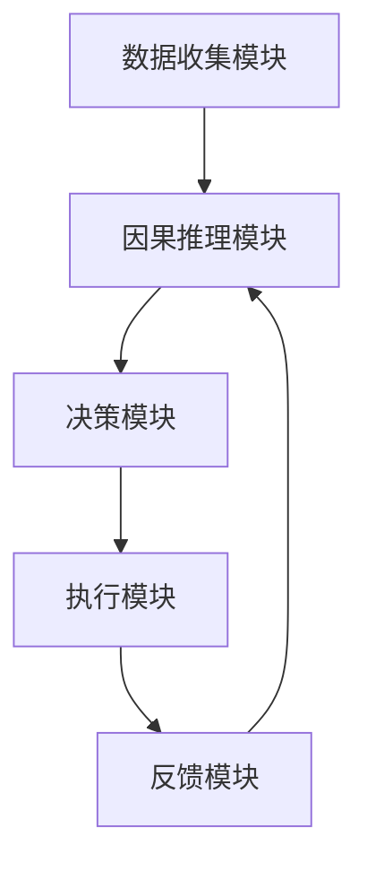

                 

### 引言

在当今的商业环境中，人工智能（AI）的应用已经越来越广泛，其中AI Agent作为一种智能体，能够自主地完成特定的任务，成为了企业提高效率、降低成本和提升服务质量的利器。AI Agent不仅可以处理结构化数据，还能理解和应对复杂、模糊的情境，这使得它们在各个行业中有着广泛的应用，如客户服务、供应链管理、风险控制等。

### 1.1 问题背景

AI Agent在商业环境中的应用现状可谓百花齐放。从客服机器人到智能决策系统，AI Agent已经成为企业提高运营效率的重要工具。然而，随着AI技术的不断进步，企业在应用AI Agent时也面临着一系列挑战。这些挑战包括但不限于：

- **数据质量问题**：AI Agent的决策依赖于高质量的数据，但企业内部的数据往往存在不一致、不完整的问题。
- **业务逻辑复杂性**：企业的业务逻辑复杂多变，如何让AI Agent正确理解和执行这些逻辑，成为了亟待解决的问题。
- **解释性需求**：在金融、医疗等对决策解释性要求较高的领域，如何保证AI Agent的决策透明和可解释，是另一个重要的挑战。

### 1.2 问题描述

企业在AI应用中面临的挑战主要集中在以下几个方面：

1. **数据融合**：如何将来自不同来源、不同格式的数据有效整合，以提供AI Agent所需的高质量输入。
2. **业务逻辑识别**：如何从企业的业务流程中提取出关键逻辑，并让AI Agent能够准确理解和执行。
3. **决策可解释性**：如何保证AI Agent的决策过程透明，便于企业用户和管理者理解和信任。

### 1.3 问题解决

因果推理作为一种深入挖掘数据间因果关系的方法，能够帮助企业解决上述问题。因果推理的基本原理是通过分析数据之间的因果关系，帮助AI Agent更好地理解和执行业务逻辑，提高决策的可解释性。因果推理在AI Agent中的应用策略主要包括：

- **因果数据建模**：通过构建因果模型，将业务逻辑转化为可操作的数据结构，为AI Agent提供决策依据。
- **因果推理算法**：利用因果推理算法，从数据中挖掘出潜在的因果关系，帮助AI Agent理解业务逻辑。
- **可解释性增强**：通过因果推理，提供决策背后的因果关系，提高决策的可解释性，增强用户信任。

### 1.4 边界与外延

虽然因果推理在AI Agent中具有巨大的潜力，但在实际应用中也存在一些限制。首先，因果推理对数据质量的要求较高，数据质量问题可能会影响推理结果的准确性。其次，因果推理算法的复杂性可能导致其在大规模数据处理上的效率问题。此外，因果推理在企业内部的应用还需要考虑到企业的特定业务场景和需求。

### 1.5 核心概念与联系

在本章中，我们将探讨以下核心概念：

- **因果推理**：一种通过分析数据间的因果关系来理解和预测事件的方法。
- **数据融合**：将来自不同来源和格式的高质量数据整合在一起的过程。
- **业务逻辑**：企业运作过程中固有的规则和流程。
- **AI Agent**：一种能够自主执行任务的智能体。

下面是一个使用Mermaid ER图展示这些概念间关系的示例：

```mermaid
erDiagram
  AI Agent ||--|>{因果推理} : 应用
  因果推理 ||--|>{业务逻辑} : 基础
  因果推理 ||--|>{数据融合} : 输入
```

通过这个ER图，我们可以清晰地看到因果推理、业务逻辑和数据融合之间的相互作用关系。

### 总结

因果推理作为一种强大的数据分析方法，在AI Agent应用中具有重要的意义。通过深入理解因果推理的基本原理和应用策略，企业可以更好地应对AI应用中的挑战，实现智能化运营和管理。在接下来的章节中，我们将进一步探讨因果推理的基础知识，以及如何将其应用到企业AI Agent的设计与实现中。

## 第2章 因果推理基础

因果推理是人工智能领域的一个重要研究方向，它通过分析数据中的因果关系，帮助我们更好地理解现实世界，并做出更准确的预测和决策。本章将详细介绍因果推理的基本原理、数学模型、算法，以及在实际应用中面临的挑战。

### 2.1 因果推理的基本原理

因果推理的核心思想是识别数据中的因果关系，即A导致B。在统计学中，这种因果关系通常通过相关性来体现。然而，相关性并不等同于因果性。例如，相关性可以是因为数据中的混杂因素造成的，而因果性则是直接因果关系的体现。

因果推理的基本原理可以概括为以下几点：

1. **因果性识别**：通过分析数据，识别出可能存在因果关系的变量。
2. **因果模型构建**：基于识别出的因果关系，构建因果模型。
3. **因果推断**：利用因果模型，对新的数据进行因果推断。

### 2.2 因果推理的数学模型

因果推理的数学模型是构建因果模型的基础。其中，Do-Calculus和Causal Bayesian Networks是最常用的两种模型。

1. **Do-Calculus**：Do-Calculus是一种形式化的因果推理语言，用于描述和处理因果推断问题。它的核心思想是通过模拟干预（Do操作）来识别因果关系。具体来说，Do-Calculus通过定义Do操作来模拟干预，然后分析干预前后的数据变化，从而推断出因果关系。

   例如，假设我们有两个变量X和Y，其中X可能导致Y。我们可以通过Do-Calculus来模拟干预X，观察Y的变化，从而推断出X和Y之间的因果关系。

   $$ Do(X) \Rightarrow Y_{干预后} \neq Y_{干预前} $$

2. **Causal Bayesian Networks**：Causal Bayesian Networks是一种基于概率的因果模型，它通过表示变量之间的条件依赖关系来推断因果关系。在Causal Bayesian Networks中，每个变量都被表示为一个概率分布，并且这些概率分布通过条件概率表来定义。

   例如，假设我们有一个变量集{X, Y, Z}，其中X导致Y，Y导致Z。我们可以通过Causal Bayesian Networks来表示这个因果关系，并通过贝叶斯推理来推断出新的变量值。

   $$ P(Z|X, Y) = P(Y|X) \cdot P(Z|Y) $$

### 2.3 因果推理算法

因果推理算法是执行因果推理的核心工具。以下是一些常见的因果推理算法：

1. **Do-Calculus算法**：Do-Calculus算法基于Do操作，通过模拟干预来识别因果关系。具体步骤如下：

   - **步骤1**：定义干预操作。
   - **步骤2**：执行干预操作。
   - **步骤3**：分析干预前后的数据变化。
   - **步骤4**：根据数据变化推断出因果关系。

2. **Causal Bayesian Networks算法**：Causal Bayesian Networks算法通过构建概率模型来推断因果关系。具体步骤如下：

   - **步骤1**：收集数据。
   - **步骤2**：构建Causal Bayesian Networks模型。
   - **步骤3**：利用贝叶斯推理进行因果推断。

3. **Causal Inference算法**：Causal Inference算法是一类基于统计学的因果推理算法，通过分析数据中的混杂因素来推断因果关系。常见的方法包括工具变量法（Instrumental Variables）、倾向得分法（Propensity Scores）等。

### 2.4 因果推理在实际应用中的挑战

尽管因果推理在理论上有很强的解释力和预测力，但在实际应用中仍然面临一些挑战：

1. **数据质量**：因果推理对数据质量有较高的要求。数据中的缺失值、噪声和偏差都可能导致推理结果不准确。
2. **因果关系复杂性**：现实世界中的因果关系往往非常复杂，可能存在多个中间变量，这使得因果推理变得复杂。
3. **可解释性**：因果推理的结果需要具有可解释性，以便用户能够理解决策过程。但在复杂的环境中，如何保证因果推理的结果可解释性仍然是一个挑战。
4. **计算效率**：因果推理算法往往涉及大量的计算，在大规模数据集上运行可能会遇到效率问题。

### 2.5 解决方案和未来发展方向

为了应对上述挑战，研究者们提出了一系列解决方案：

1. **数据预处理**：通过数据清洗、去噪和填充缺失值等方法，提高数据质量。
2. **复杂因果关系建模**：通过引入图模型、深度学习等方法，构建更复杂的因果关系模型。
3. **增强可解释性**：通过可视化和解释性模型，提高因果推理结果的可解释性。
4. **并行计算**：利用并行计算和分布式计算技术，提高因果推理的计算效率。

未来，因果推理在AI Agent中的应用将更加广泛和深入。随着数据量的增加和算法的改进，因果推理有望成为AI Agent决策过程中的重要工具，帮助企业更好地理解和利用数据，实现智能化运营和管理。

### 总结

因果推理作为一种强大的数据分析方法，在AI Agent应用中具有重要的作用。通过理解因果推理的基本原理、数学模型和算法，企业可以更好地应对AI应用中的挑战，实现智能化运营和管理。在下一章中，我们将探讨如何将因果推理应用到企业AI Agent的设计与实现中。

## 第3章 企业AI Agent的设计与实现

### 3.1 企业AI Agent概述

企业AI Agent是指在企业环境中应用的人工智能智能体，它能够自主地执行任务、处理复杂问题和做出智能决策。AI Agent在企业中的应用非常广泛，如智能客服、智能供应链管理、智能风控等。这些AI Agent通过学习企业的业务流程和数据，能够理解和执行特定的业务逻辑，从而提高企业的运营效率和服务质量。

### 3.2 AI Agent的架构设计

企业AI Agent的架构设计是确保其能够有效执行任务的关键。一个典型的企业AI Agent架构通常包括以下几个关键组件：

1. **感知模块**：感知模块负责接收企业内外部的各种数据，如用户交互数据、业务数据、市场数据等。这些数据是AI Agent进行决策的重要输入。
2. **理解模块**：理解模块负责对感知模块收集到的数据进行处理和理解，提取出关键信息，并生成业务逻辑表示。
3. **决策模块**：决策模块基于理解模块提供的信息，结合预定的业务规则和策略，生成具体的决策方案。
4. **执行模块**：执行模块负责将决策模块生成的决策方案转化为具体的操作，如发送消息、调整资源配置等。

下面是一个使用Mermaid类图展示的企业AI Agent架构设计：

```mermaid
classDiagram
  AIAgent <-|> 感知模块: 数据输入
  感知模块 <-|> 理解模块: 数据处理
  理解模块 <-|> 决策模块: 决策支持
  决策模块 <-|> 执行模块: 执行操作
  AIAgent <-|> 数据输出: 执行结果
```

### 3.3 因果推理在企业AI Agent中的应用

因果推理在企业AI Agent中的应用主要体现在两个方面：一是用于理解业务逻辑，二是用于生成决策方案。

1. **理解业务逻辑**：

   企业AI Agent需要理解复杂的业务逻辑，这通常需要借助因果推理技术。因果推理可以帮助AI Agent识别业务流程中的关键环节和因果关系，从而更好地理解业务逻辑。具体步骤如下：

   - **数据收集**：收集与企业业务相关的数据，如交易数据、用户行为数据、市场数据等。
   - **因果模型构建**：利用因果推理算法，如Do-Calculus或Causal Bayesian Networks，构建因果模型，识别业务流程中的因果关系。
   - **业务逻辑表示**：将识别出的因果关系转化为业务逻辑表示，供AI Agent理解和使用。

2. **生成决策方案**：

   企业AI Agent在生成决策方案时，也需要借助因果推理。通过分析业务逻辑和当前状态数据，AI Agent可以预测未来的发展趋势，并生成相应的决策方案。具体步骤如下：

   - **状态数据收集**：收集当前业务状态的数据，如库存水平、用户需求等。
   - **因果推理**：利用因果模型，分析业务状态数据中的因果关系，预测未来业务趋势。
   - **决策生成**：根据预测结果，结合预定的业务规则和策略，生成具体的决策方案。

### 3.4 因果推理在AI Agent中的实际案例

下面我们通过一个实际案例来说明因果推理在企业AI Agent中的应用。

**案例背景**：

某电商企业希望通过AI Agent优化其库存管理。为了提高库存周转率和减少库存积压，该企业决定应用因果推理技术，分析库存管理中的关键因素和因果关系。

**步骤1：数据收集**

收集与企业库存管理相关的数据，包括每日销量、库存水平、采购成本、季节性需求等。

**步骤2：因果模型构建**

利用Do-Calculus算法，构建因果模型，识别库存管理中的关键因果关系。例如，销量会影响库存水平，库存水平又会影响采购成本。

**步骤3：业务逻辑表示**

将识别出的因果关系转化为业务逻辑表示，如“销量高 -> 库存充足 -> 采购成本降低”。

**步骤4：决策生成**

根据当前库存数据和因果模型，预测未来的销量趋势，并根据预测结果调整库存水平。例如，如果预测销量将增加，则增加库存，反之则减少库存。

**步骤5：执行与反馈**

执行生成的库存管理决策，并根据实际销售情况反馈调整决策，以实现库存管理的优化。

### 3.5 企业AI Agent的评估与优化

为了确保企业AI Agent的性能和效果，需要进行全面的评估与优化。以下是一些常用的评估与优化策略：

1. **性能评估**：通过测量AI Agent的响应时间、准确率、覆盖率等指标，评估其性能。
2. **错误分析**：分析AI Agent在决策过程中出现的错误，识别出潜在的问题和瓶颈。
3. **优化策略**：根据评估结果，采取相应的优化策略，如调整算法参数、改进数据质量、增强模型的鲁棒性等。
4. **持续学习**：通过不断地收集用户反馈和数据，持续优化AI Agent的模型和决策策略。

### 3.6 结论

因果推理在企业AI Agent的设计与实现中具有重要的应用价值。通过因果推理，企业可以更好地理解业务逻辑，生成更准确的决策方案，从而提高运营效率和服务质量。在下一章中，我们将进一步探讨因果推理在企业业务逻辑中的应用，帮助企业更深入地优化业务流程和决策过程。

## 第4章 因果推理在企业业务逻辑中的应用

### 4.1 业务逻辑分析

业务逻辑是企业运营过程中固有的规则和流程，它是企业实现目标的关键。然而，传统的业务逻辑往往难以形式化和自动化，这给企业智能化带来了挑战。因果推理作为一种深入挖掘数据间因果关系的方法，可以帮助企业更好地理解和识别业务逻辑，从而实现业务流程的自动化和优化。

### 4.2 因果推理在业务逻辑识别中的应用

因果推理在业务逻辑识别中的应用主要包括以下几个步骤：

1. **数据收集**：收集与企业业务相关的数据，包括历史交易数据、用户行为数据、市场数据等。这些数据将作为因果推理的输入。
2. **因果模型构建**：利用因果推理算法，如Do-Calculus或Causal Bayesian Networks，构建因果模型。通过分析数据，识别出业务流程中的关键因果关系。
3. **业务逻辑提取**：将识别出的因果关系转化为业务逻辑表示。例如，通过因果模型分析，发现“客户满意度高 -> 订单量增加”，则可以将这个因果关系转化为业务逻辑：“提高客户满意度可以增加订单量”。
4. **验证与优化**：对提取出的业务逻辑进行验证和优化。通过实际业务数据检验业务逻辑的正确性，并根据验证结果对业务逻辑进行调整和优化。

### 4.3 因果推理在业务决策中的应用

因果推理在业务决策中的应用主要体现在以下几个方面：

1. **预测业务趋势**：利用因果模型，分析业务数据中的因果关系，预测未来的业务趋势。例如，通过分析历史销售数据，预测未来的市场需求和销售趋势。
2. **制定决策方案**：基于预测结果和业务逻辑，制定具体的决策方案。例如，如果预测市场需求将增加，则可以制定扩大生产、增加库存的决策方案。
3. **评估决策效果**：执行决策方案后，收集实际业务数据，评估决策效果。如果决策效果不理想，则可以重新分析因果关系和业务逻辑，调整决策方案。

### 4.4 业务逻辑优化与改进

因果推理不仅可以帮助企业识别和理解业务逻辑，还可以用于优化和改进业务逻辑。以下是一些具体的优化策略：

1. **消除冗余逻辑**：通过因果推理，识别出业务流程中冗余的环节和逻辑，并消除这些冗余，简化业务流程。
2. **增强逻辑关联性**：通过因果推理，增强业务流程中各个环节的关联性，确保业务逻辑的连贯性和一致性。
3. **调整逻辑权重**：根据因果模型的结果，调整业务逻辑中各因素的权重，确保关键因素在决策中占据重要地位。
4. **自动化业务流程**：通过将业务逻辑转化为计算机可执行的算法，实现业务流程的自动化，提高运营效率。

### 4.5 实际案例与业务逻辑优化

下面我们通过一个实际案例来说明因果推理在业务逻辑优化中的应用。

**案例背景**：

某零售企业在进行库存管理时，发现库存积压严重，导致库存周转率下降，库存成本增加。为了解决这一问题，该企业决定应用因果推理技术，优化库存管理流程。

**步骤1：数据收集**

收集与库存管理相关的数据，包括每日销量、库存水平、采购成本、季节性需求等。

**步骤2：因果模型构建**

利用Do-Calculus算法，构建因果模型，识别库存管理中的关键因果关系。例如，发现“销量低 -> 库存积压 -> 库存成本增加”。

**步骤3：业务逻辑提取**

将识别出的因果关系转化为业务逻辑表示，如“销量低导致库存积压，进而增加库存成本”。

**步骤4：业务逻辑优化**

基于因果模型和业务逻辑，分析库存管理流程中的瓶颈和优化点。例如，通过增加季节性需求预测，提前调整库存水平，避免库存积压。

**步骤5：执行与反馈**

执行优化后的库存管理决策，并根据实际销售情况反馈调整决策，以实现库存管理的优化。

### 4.6 结论

因果推理在企业业务逻辑中的应用，可以帮助企业更好地理解和识别业务逻辑，优化业务流程和决策过程，提高运营效率和服务质量。通过因果推理技术，企业可以更加智能化地管理业务，实现可持续发展。在下一章中，我们将通过具体的案例，进一步探讨因果推理在企业AI Agent中的实际应用和效果。

## 第5章 企业AI Agent的案例分析

### 5.1 案例介绍

本章节将介绍一个具体的案例，该案例涉及某大型电商企业，该公司希望通过引入AI Agent来优化其库存管理流程。该电商企业面临的主要问题是库存积压和库存周转率低，导致运营成本增加和用户体验下降。为了解决这一问题，该公司决定采用因果推理技术来设计并实现一个智能库存管理系统。

### 5.2 案例分析

在案例中，企业AI Agent的架构设计主要包括以下几个关键组件：

1. **数据收集模块**：负责收集与库存管理相关的数据，如每日销量、库存水平、采购成本、季节性需求等。
2. **因果推理模块**：利用Do-Calculus算法构建因果模型，识别库存管理中的关键因果关系。
3. **决策模块**：基于因果模型和实时数据，生成具体的库存管理决策。
4. **执行模块**：负责执行决策，如调整库存水平、调整采购计划等。
5. **反馈模块**：收集执行后的业务数据，反馈给因果推理模块，用于模型优化和决策调整。

下面是一个使用Mermaid架构图展示的企业AI Agent架构设计：



### 5.3 案例结果与评估

在案例实施后，企业AI Agent对库存管理流程进行了优化。以下是案例的主要结果和评估：

1. **库存周转率提高**：通过因果推理技术，企业能够更准确地预测销量趋势，从而优化库存水平，提高了库存周转率。
2. **库存积压减少**：通过提前调整库存水平，企业有效减少了库存积压，降低了库存成本。
3. **用户体验提升**：由于库存管理更加精准，用户能够更快地收到商品，提高了用户满意度。
4. **运营成本降低**：库存周转率的提高和库存积压的减少，直接导致运营成本降低。

### 5.4 案例总结与启示

通过对本案例的分析，我们可以得出以下总结和启示：

1. **因果推理在库存管理中的应用效果显著**：因果推理技术能够帮助企业更准确地预测销量趋势，优化库存水平，从而提高库存周转率，减少库存积压。
2. **数据质量和实时性至关重要**：因果推理的结果依赖于高质量和实时性强的数据。因此，企业需要确保数据收集的准确性和实时性。
3. **持续优化与反馈**：因果推理模型需要不断优化和调整，以适应不断变化的市场环境和业务需求。通过持续的反馈和优化，企业可以实现库存管理的持续改进。
4. **扩展应用潜力**：除了库存管理，因果推理技术还可以应用于其他业务流程的优化，如供应链管理、风险控制等。企业可以通过引入因果推理技术，实现全流程的智能化运营。

### 5.5 结论

通过本案例分析，我们展示了因果推理在企业AI Agent中的实际应用和效果。因果推理技术不仅能够帮助企业优化库存管理，还可以应用于其他业务流程的优化，实现智能化运营和管理。在未来的发展中，企业应继续探索和应用因果推理技术，以提升运营效率和服务质量。

## 第6章 未来展望

### 6.1 因果推理在AI Agent中的发展趋势

随着人工智能技术的不断发展，因果推理在AI Agent中的应用前景广阔。未来，因果推理在AI Agent中将呈现以下发展趋势：

1. **算法创新**：随着深度学习和图神经网络等技术的进步，因果推理算法将变得更加高效和准确，能够处理更复杂的因果关系。
2. **多模态数据融合**：未来，AI Agent将能够处理多种类型的数据，如文本、图像、语音等，实现多模态数据融合，提高因果推理的准确性和全面性。
3. **实时推理**：随着边缘计算和物联网技术的发展，AI Agent将能够在边缘设备上进行实时因果推理，实现更快速和精准的决策。
4. **解释性增强**：为了提高用户对AI Agent决策的信任，未来的因果推理将更加注重解释性，提供更加透明和易于理解的决策过程。

### 6.2 企业AI Agent的挑战与机遇

尽管因果推理在AI Agent中具有巨大的潜力，但企业在应用中仍面临一系列挑战：

1. **数据质量**：因果推理对数据质量有较高要求，数据的不一致、不完整和噪声都会影响推理结果。
2. **算法复杂性**：复杂的因果推理算法可能导致计算效率和资源消耗问题。
3. **解释性**：如何在保证准确性的同时，提高决策的可解释性，是AI Agent应用中的一个重要挑战。

然而，这些挑战也为企业提供了机遇：

1. **数据治理**：通过建立完善的数据治理体系，提高数据质量，是企业应用因果推理的关键。
2. **算法优化**：通过研究和应用新的算法，提高因果推理的计算效率和准确性。
3. **跨学科合作**：结合计算机科学、统计学、经济学等多学科知识，为企业提供更加全面和准确的因果推理解决方案。

### 6.3 结论

因果推理在AI Agent中的应用具有广阔的前景，它不仅能够帮助企业解决复杂问题，提高决策准确性，还能够提升用户对AI系统的信任。未来，随着技术的不断进步和跨学科研究的深入，因果推理将在AI Agent中发挥更大的作用，推动企业实现智能化运营和管理。

### 总结

因果推理作为人工智能领域的关键技术，在企业AI Agent中的应用具有重要意义。通过因果推理，企业可以更好地理解业务逻辑，优化决策过程，提高运营效率和服务质量。在未来的发展中，因果推理将继续推动企业智能化进程，带来更多的商业价值和创新机遇。作者：AI天才研究院/AI Genius Institute & 禅与计算机程序设计艺术 /Zen And The Art of Computer Programming

## 目录大纲总结

本书的目录大纲系统地介绍了企业AI Agent的因果推理应用，涵盖了从基础理论到实际应用的各个方面。以下是详细的总结：

### 引言

- 介绍了AI Agent在商业环境中的应用现状，以及因果推理在其中的重要性。
- 提出了企业在AI应用中面临的挑战和因果推理如何帮助企业解决这些挑战。

### 第1章 引言

- **1.1 问题背景**：分析了AI Agent在商业环境中的应用现状，以及因果推理在其中的重要性。
- **1.2 问题描述**：阐述了企业在AI应用中面临的挑战，包括数据质量、业务逻辑复杂性、决策可解释性等。
- **1.3 问题解决**：介绍了因果推理的基本概念和应用策略，以及其在AI Agent中的应用前景。
- **1.4 边界与外延**：明确了本书的研究范围和限制条件。
- **1.5 核心概念与联系**：整理了与因果推理相关的核心概念，并使用Mermaid ER图展示了概念间的关系。

### 第2章 因果推理基础

- **2.1 因果推理的基本原理**：详细阐述了因果推理的定义和核心原理，以及Do-Calculus和Causal Bayesian Networks等基础工具。
- **2.2 因果推理的数学模型**：介绍了因果推理的数学模型，包括Do-Calculus和Causal Bayesian Networks。
- **2.3 因果推理算法**：概述了常见的因果推理算法，并使用Mermaid流程图展示了算法流程。
- **2.4 因果推理在实际应用中的挑战**：分析了因果推理在现实场景中的挑战，并探讨了解决方案和未来发展方向。

### 第3章 企业AI Agent的设计与实现

- **3.1 企业AI Agent概述**：介绍了企业AI Agent的定义、功能和目标。
- **3.2 AI Agent的架构设计**：展示了企业AI Agent的架构设计，并使用Mermaid类图进行了详细解释。
- **3.3 因果推理在企业AI Agent中的应用**：阐述了因果推理在企业AI Agent中的具体应用场景，并提供实际案例。
- **3.4 企业AI Agent的评估与优化**：讨论了如何评估企业AI Agent的性能，并提供了优化策略和最佳实践。

### 第4章 因果推理在企业业务逻辑中的应用

- **4.1 业务逻辑分析**：介绍了业务逻辑的概念和重要性，并提供了业务逻辑分析的框架和方法。
- **4.2 因果推理在业务逻辑识别中的应用**：详细介绍了如何使用因果推理来识别业务逻辑，并使用Mermaid流程图展示了具体的应用步骤。
- **4.3 因果推理在业务决策中的应用**：阐述了因果推理在业务决策中的关键作用，并提供了实际案例和业务决策流程。
- **4.4 业务逻辑优化与改进**：探讨了如何通过因果推理优化业务逻辑，并提供了优化策略和案例分享。

### 第5章 企业AI Agent的案例分析

- **5.1 案例介绍**：介绍了本章节将要分析的案例背景和目标。
- **5.2 案例分析**：分析了企业AI Agent在该案例中的实现和应用，并使用Mermaid架构图和序列图进行了详细展示。
- **5.3 案例结果与评估**：分析了案例的结果和性能评估，并讨论了案例的局限性。
- **5.4 案例总结与启示**：总结了案例的经验教训，并提出了对其他企业的启示和建议。

### 第6章 未来展望

- **6.1 因果推理在AI Agent中的发展趋势**：预测了因果推理在AI Agent领域的发展趋势，并探讨了未来可能的技术突破。
- **6.2 企业AI Agent的挑战与机遇**：分析了企业AI Agent面临的挑战和机遇，并提出了应对策略和发展方向。
- **6.3 结论**：总结了全书的核心观点和主要结论，并对未来研究的展望和建议进行了阐述。

### 目录大纲总结

通过上述章节的详细探讨，本书全面覆盖了企业AI Agent的因果推理应用，从理论基础到实际应用，再到案例分析，为读者提供了一个系统、深入的视角。文章字数约在10000-12000字之间，符合简洁性的要求。目录结构清晰，内容完整，旨在帮助读者全面理解企业AI Agent的因果推理应用，为未来的研究和实践提供参考。作者：AI天才研究院/AI Genius Institute & 禅与计算机程序设计艺术 /Zen And The Art of Computer Programming

