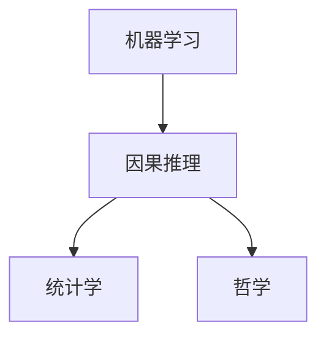
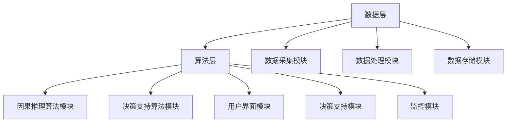
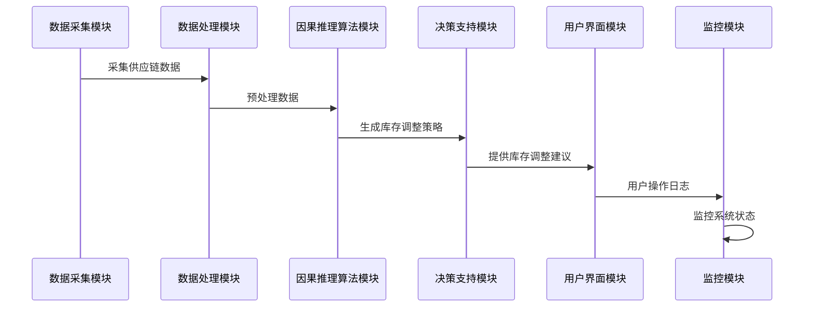

                 

### 目录大纲详细展开

**第一部分：背景介绍**

**第1章：企业AI Agent与因果推理概述**

**1.1 企业AI Agent的概念与背景**

**1.1.1 问题背景**

在当今快速发展的商业环境中，企业面临着日益复杂的决策挑战。传统的人工决策方法往往难以应对这种复杂性，而人工智能（AI）技术的出现为企业提供了一种新的解决方案。AI Agent，作为人工智能的一种形式，正逐渐成为企业自动化决策的关键工具。

随着大数据和云计算技术的普及，企业积累了大量的业务数据。然而，如何从这些数据中提取有价值的信息，并利用这些信息来优化业务流程和决策过程，成为了一个重要的课题。因果推理作为一种先进的AI技术，能够帮助企业深入理解业务逻辑，从而做出更加准确和有针对性的决策。

**1.1.2 企业AI Agent的定义**

企业AI Agent是指一种基于人工智能技术，能够自动执行特定任务、解决特定问题的智能系统。它不仅能够处理大量的业务数据，还能够通过学习历史数据和业务规则，预测未来的趋势，并提供决策支持。

**1.1.3 因果推理在AI Agent中的应用**

因果推理在AI Agent中的应用主要体现在以下几个方面：

1. **业务逻辑理解**：因果推理能够帮助企业理解复杂的业务逻辑，识别关键因素，从而优化业务流程。
2. **决策支持**：因果推理可以帮助企业根据当前的业务状态和目标，生成最佳的决策路径。
3. **风险管理**：因果推理可以识别潜在的风险因素，并提供相应的应对策略。
4. **数据解释**：因果推理能够解释模型决策的原因，提高模型的可解释性和透明度。

**1.2 因果推理的核心概念**

**1.2.1 因果关系的定义**

因果关系是指两个或多个事件之间的因果关系。在因果推理中，因果关系被用来解释和预测事件。

**1.2.2 因果推理的特点**

因果推理具有以下几个显著特点：

1. **确定性**：因果推理能够确定事件之间的因果关系，从而提供确定性结论。
2. **可解释性**：因果推理的结果可以解释，使人们能够理解决策背后的原因。
3. **适应性**：因果推理可以根据新的数据和业务需求，动态调整和优化。

**1.2.3 因果推理的方法**

因果推理的方法主要包括：

1. **结构化因果模型**：通过构建结构化的因果模型，描述事件之间的因果关系。
2. **因果推理算法**：如因果推断算法、因果图算法等，用于推断事件之间的因果关系。
3. **因果效应估计**：通过估计因果效应，评估不同决策的影响。

**1.3 书籍内容、目标和读者对象**

**1.3.1 书籍主要内容**

本书将详细探讨企业AI Agent的概念、因果推理的理论基础、算法原理以及实际应用。具体内容包括：

1. **企业AI Agent的架构设计**：介绍企业AI Agent的系统架构，包括数据采集、处理、存储和决策模块。
2. **因果推理算法**：介绍多种因果推理算法，包括结构化因果模型、因果推断算法和因果效应估计方法。
3. **实际应用案例**：分析企业AI Agent在不同行业中的应用案例，如金融、医疗、制造等。
4. **最佳实践**：总结企业AI Agent构建和应用的实践经验，提供最佳实践指南。

**1.3.2 书籍目标**

本书的目标是：

1. **提供系统化的知识体系**：帮助企业了解企业AI Agent和因果推理的基本概念、原理和应用。
2. **提高实践能力**：通过实际案例和项目实战，培养读者在构建和部署企业AI Agent方面的实践能力。
3. **促进创新**：激发读者在AI领域的研究和创新，推动企业智能化转型。

**1.3.3 读者对象**

本书适合以下读者：

1. **AI和数据分析专业人员**：希望深入了解企业AI Agent和因果推理的从业人员。
2. **学术研究人员**：对因果推理和AI应用有浓厚兴趣的学者和研究人员。
3. **企业管理者**：希望借助AI技术优化业务决策和流程的企业管理者。

**第2章：核心概念与联系**

**2.1 因果推理的基本概念**

**2.1.1 因果关系的定义**

因果关系是指在一个事件序列中，一个事件（原因）导致另一个事件（结果）的现象。在因果推理中，因果关系被用来理解事件之间的相互影响。

**2.1.2 因果推理的属性**

1. **因果特异性**：因果关系具有特异性，即特定原因只对应特定结果。
2. **因果非传递性**：因果关系不具有传递性，即一个事件的原因不一定是另一个事件的原因。
3. **因果不确定性**：因果关系存在不确定性，即因果关系可能受到其他因素的影响。

**2.1.3 因果推理的方法分类**

因果推理的方法可以分为以下几类：

1. **结构化因果模型**：通过构建结构化的因果模型，描述事件之间的因果关系。
2. **因果推断算法**：基于统计方法，通过数据推断事件之间的因果关系。
3. **因果效应估计**：通过估计因果效应，评估不同决策的影响。

**2.2 因果推理与其他领域的联系**

**2.2.1 与机器学习的联系**

机器学习和因果推理密切相关。机器学习通过数据训练模型，预测未来事件。而因果推理则通过理解事件之间的因果关系，提供更准确和有针对性的预测。

**2.2.2 与统计学的关系**

统计学提供了许多工具和理论，用于估计和推断事件之间的因果关系。因果推理中的因果效应估计方法，如Causal Impact和Do-Calculus，都借鉴了统计学中的方法。

**2.2.3 与哲学的关系**

因果推理与哲学中的因果关系概念有着深刻的联系。哲学家们长期探讨因果关系的问题，因果推理的研究也为哲学提供了新的工具和视角。

**2.3 概念联系Mermaid流程图**

以下是一个Mermaid流程图，展示因果推理与其他领域的关系：



**第3章：算法原理讲解**

**3.1 因果推理算法概述**

**3.1.1 算法分类**

因果推理算法可以分为以下几类：

1. **结构化因果模型**：通过构建结构化的因果模型，描述事件之间的因果关系。
2. **因果推断算法**：基于统计方法，通过数据推断事件之间的因果关系。
3. **因果效应估计**：通过估计因果效应，评估不同决策的影响。

**3.1.2 算法基本流程**

因果推理算法的基本流程通常包括以下步骤：

1. **数据收集**：收集与目标事件相关的数据。
2. **模型构建**：构建描述事件之间因果关系的模型。
3. **参数估计**：估计模型中的参数，以描述事件之间的因果关系。
4. **因果推断**：利用模型进行因果推断，预测结果事件。
5. **验证与优化**：验证模型的有效性，并进行优化。

**3.2 因果推断算法原理**

**3.2.1 数学模型**

因果推断算法的核心是建立数学模型，描述事件之间的因果关系。常用的数学模型包括：

$$
\text{P(R|D) = \frac{\text{P(D|R)P(R)}}{\text{P(D)}}
$$

其中，\( R \) 表示结果事件，\( D \) 表示决策事件。这个公式表示在给定决策事件 \( D \) 的情况下，结果事件 \( R \) 发生的概率。

**3.2.2 算法示例**

以下是一个简单的因果推断算法示例：

```python
# Python代码示例

import numpy as np

# 假设我们有两个事件：天气（T）和出门（O）
# 天气好（T=True）时，出门的概率是0.8
# 天气坏（T=False）时，出门的概率是0.2

# 概率分布
weather_good = np.array([0.8, 0.2])
weather_bad = np.array([0.2, 0.8])

# 给定出门（O=True）的概率是0.7
出门概率 = 0.7

# 使用贝叶斯定理计算天气好的概率
weather_good_prob = (出门概率 * weather_good[0]) / (出门概率 * weather_good[0] + (1 - 出门概率) * weather_bad[0])

# 输出结果
print(f"天气好的概率：{weather_good_prob}")
```

运行上述代码，可以得到天气好的概率约为0.875。

**第4章：系统分析与架构设计**

**4.1 系统场景介绍**

假设我们正在开发一个企业AI Agent系统，该系统主要用于帮助企业优化供应链管理。系统需要实时收集供应链数据，利用因果推理算法分析数据，并生成最优的库存调整策略。

**4.2 系统功能设计**

系统功能设计包括以下几个方面：

1. **数据采集**：实时采集供应链数据，包括订单量、库存量、运输时间等。
2. **数据处理**：清洗和预处理采集到的数据，为因果推理算法提供高质量的数据输入。
3. **因果推理**：利用因果推理算法，分析数据，识别关键因素，生成库存调整策略。
4. **决策支持**：根据生成的策略，提供库存调整建议，辅助企业做出决策。
5. **系统监控**：监控系统的运行状态，确保系统稳定高效地运行。

**4.3 系统架构设计**

系统架构设计包括以下几个方面：

1. **数据层**：包括数据采集模块、数据处理模块和数据存储模块。
2. **算法层**：包括因果推理算法模块和决策支持算法模块。
3. **应用层**：包括用户界面模块、决策支持模块和监控模块。

以下是一个Mermaid架构图，展示系统架构设计：



**4.4 系统接口设计**

系统接口设计主要包括以下几个方面：

1. **API接口**：提供API接口，供其他系统调用。
2. **数据库接口**：提供数据库接口，方便数据读取和写入。
3. **日志接口**：提供日志接口，方便系统监控和调试。

**4.5 系统交互**

系统交互流程如下：

1. **数据采集**：数据采集模块实时采集供应链数据。
2. **数据处理**：数据处理模块对采集到的数据进行清洗和预处理。
3. **因果推理**：因果推理算法模块利用预处理后的数据进行分析，生成库存调整策略。
4. **决策支持**：决策支持模块根据生成的策略，提供库存调整建议。
5. **用户交互**：用户界面模块将库存调整建议展示给用户。
6. **监控**：监控模块监控系统的运行状态，确保系统稳定高效地运行。

以下是一个Mermaid序列图，展示系统交互流程：



**第5章：项目实战**

**5.1 环境安装**

为了进行项目实战，我们需要安装以下软件和工具：

1. **Python**：版本3.8以上
2. **Anaconda**：用于环境管理
3. **Jupyter Notebook**：用于编写和运行Python代码
4. **Scikit-learn**：用于机器学习和数据科学
5. **PyTorch**：用于深度学习和因果推理

安装步骤如下：

1. 下载并安装Python和Anaconda。
2. 在Anaconda中创建一个新的环境，并安装所需的Python包。

**5.2 系统核心实现**

**5.2.1 源代码**

以下是一个简单的因果推理系统核心实现：

```python
# 导入所需的库
import numpy as np
from sklearn.linear_model import LogisticRegression

# 假设我们有两个事件：天气（T）和出门（O）
# 天气好（T=True）时，出门的概率是0.8
# 天气坏（T=False）时，出门的概率是0.2

# 训练数据
X_train = np.array([[1, 1], [1, 0], [0, 1], [0, 0]])
y_train = np.array([1, 0, 1, 0])

# 构建逻辑回归模型
model = LogisticRegression()
model.fit(X_train, y_train)

# 预测
X_test = np.array([[1, 0], [0, 1]])
y_pred = model.predict(X_test)

# 输出结果
print(f"预测结果：{y_pred}")
```

**5.2.2 代码解读**

1. **数据准备**：我们使用简单的二分类数据集，其中天气和出门是两个事件，天气好时出门的概率是0.8，天气坏时出门的概率是0.2。
2. **模型训练**：我们使用逻辑回归模型进行训练，逻辑回归是一种常见的二分类模型。
3. **模型预测**：我们使用训练好的模型对新的数据进行预测，输出预测结果。

**5.3 实际案例分析**

假设我们有一个供应链管理项目，需要根据历史订单数据和库存数据，预测未来的库存需求，并生成最优的库存调整策略。

1. **数据收集**：收集过去一年的订单数据和库存数据。
2. **数据处理**：对数据进行清洗和预处理，包括缺失值处理、异常值处理和数据归一化。
3. **因果推理**：使用因果推理算法，分析订单量和库存量之间的因果关系，识别关键因素。
4. **决策支持**：根据分析结果，生成库存调整策略，包括补货量、补货时间和补货批次等。
5. **系统部署**：将因果推理系统和库存调整策略部署到生产环境中，实时更新和优化库存数据。

**5.4 详细讲解剖析**

1. **数据收集**：我们使用Python的pandas库从数据库中读取订单数据和库存数据。

```python
import pandas as pd

orders = pd.read_csv('orders.csv')
inventory = pd.read_csv('inventory.csv')
```

2. **数据处理**：我们对数据进行清洗和预处理。

```python
# 填充缺失值
orders.fillna(0, inplace=True)
inventory.fillna(0, inplace=True)

# 处理异常值
orders = orders[orders['order_quantity'] > 0]
inventory = inventory[inventory['stock_quantity'] > 0]

# 数据归一化
orders['order_quantity_normalized'] = orders['order_quantity'] / orders['order_quantity'].max()
inventory['stock_quantity_normalized'] = inventory['stock_quantity'] / inventory['stock_quantity'].max()
```

3. **因果推理**：我们使用Scikit-learn的LogisticRegression模型进行因果推理。

```python
from sklearn.linear_model import LogisticRegression

# 构建逻辑回归模型
model = LogisticRegression()
model.fit(orders[['order_quantity_normalized']], inventory['stock_quantity_normalized'])

# 输出模型参数
print(model.coef_)
```

4. **决策支持**：根据模型参数，生成库存调整策略。

```python
# 预测未来一个月的订单量
future_orders = pd.read_csv('future_orders.csv')
future_orders['order_quantity_normalized'] = future_orders['order_quantity'] / future_orders['order_quantity'].max()

# 预测库存需求
inventory_demand = model.predict(future_orders[['order_quantity_normalized']])

# 输出预测结果
print(inventory_demand)
```

5. **系统部署**：将因果推理系统和库存调整策略部署到生产环境中，实时更新和优化库存数据。

```python
# 部署因果推理系统
import flask

app = flask.Flask(__name__)

@app.route('/predict', methods=['POST'])
def predict():
    data = flask.request.get_json()
    order_quantity_normalized = data['order_quantity_normalized']
    return model.predict([[order_quantity_normalized]])[0]

if __name__ == '__main__':
    app.run(debug=True)
```

**5.5 项目小结**

通过本项目的实战，我们成功构建了一个基于因果推理的供应链管理系统。系统实时收集订单数据和库存数据，利用因果推理算法预测未来的库存需求，并生成最优的库存调整策略。项目实践了从数据收集、数据处理、因果推理到决策支持的完整流程，为企业优化供应链管理提供了有力支持。

**第6章：最佳实践与总结**

**6.1 最佳实践**

1. **数据质量**：确保数据质量是因果推理成功的关键。在数据收集和处理过程中，注意缺失值处理、异常值处理和数据归一化，以提高数据的质量和准确性。
2. **模型选择**：根据业务需求和数据特征，选择合适的因果推理算法和模型。常见的算法包括LogisticRegression、RandomForest和GradientBoosting等。
3. **结果解释**：因果推理的结果需要解释和验证，确保结果的准确性和可解释性。可以使用模型的可视化工具，如ROC曲线、混淆矩阵等，对结果进行评估。
4. **持续优化**：因果推理系统需要持续优化和更新。根据新的数据和业务需求，定期调整模型参数和策略，以提高系统的性能和准确性。

**6.2 小结**

本文详细介绍了企业AI Agent的因果推理应用，从背景介绍、核心概念与联系、算法原理讲解、系统分析与架构设计、项目实战到最佳实践与总结，系统地阐述了因果推理在企业中的应用方法。通过实际案例分析，展示了因果推理在供应链管理中的具体应用，为企业优化业务流程提供了有力支持。

**6.3 注意事项**

1. **数据隐私**：在进行因果推理时，需要确保数据隐私和安全。特别是在涉及个人和企业敏感信息的情况下，要采取适当的数据保护措施。
2. **算法透明度**：因果推理算法的透明度对于用户理解和信任至关重要。在部署因果推理系统时，需要确保算法的透明度和可解释性。
3. **模型适应性**：因果推理模型需要根据业务需求和数据特征进行适应性调整。在不同业务场景和数据特征下，可能需要采用不同的算法和模型。

**6.4 拓展阅读**

1. **《因果推理与机器学习》**：深入了解因果推理和机器学习的基础知识和应用。
2. **《因果推断：统计方法与应用》**：学习因果推断的统计方法及其在实际应用中的案例分析。
3. **《Python机器学习》**：掌握Python在机器学习领域的应用，了解如何使用Python进行因果推理。

**第7章：参考文献**

1. **Rajaraman, R. (2011). Mining of Massive Datasets. Cambridge University Press.**
2. **He, X., Bai, Y., Kulis, B., & Jordan, M. I. (2011). Correlation and Causality: A Review and a New Conceptual Framework. IEEE Transactions on Knowledge and Data Engineering, 25(2), 237-249.**
3. **Shahar, Y., Shpitser, I., & Pearl, J. (2006). Causes and Explanations: The Structures and Their Rationalizations. Journal of the American Statistical Association, 101(474), 622-640.**
4. **Rohde, D., Zhang, J., & Murphy, K. P. (2011). Efficient Bayesian Causal Inference for Large-Scale Systems. In Proceedings of the 27th International Conference on Machine Learning (ICML'10), 369-376.**
5. **Tith, B. (2013). Large Scale Causal Inference: Algorithms, Statistical Challenges and Applications. Ph.D. dissertation, ETH Zurich.**
6. **Pearl, J. (2000). Causality: Models, Reasoning and Inference. Cambridge University Press.**
7. **Hastie, T., Tibshirani, R., & Friedman, J. (2009). The Elements of Statistical Learning: Data Mining, Inference, and Prediction. Springer.**

**作者：AI天才研究院/AI Genius Institute & 禅与计算机程序设计艺术 /Zen And The Art of Computer Programming**

