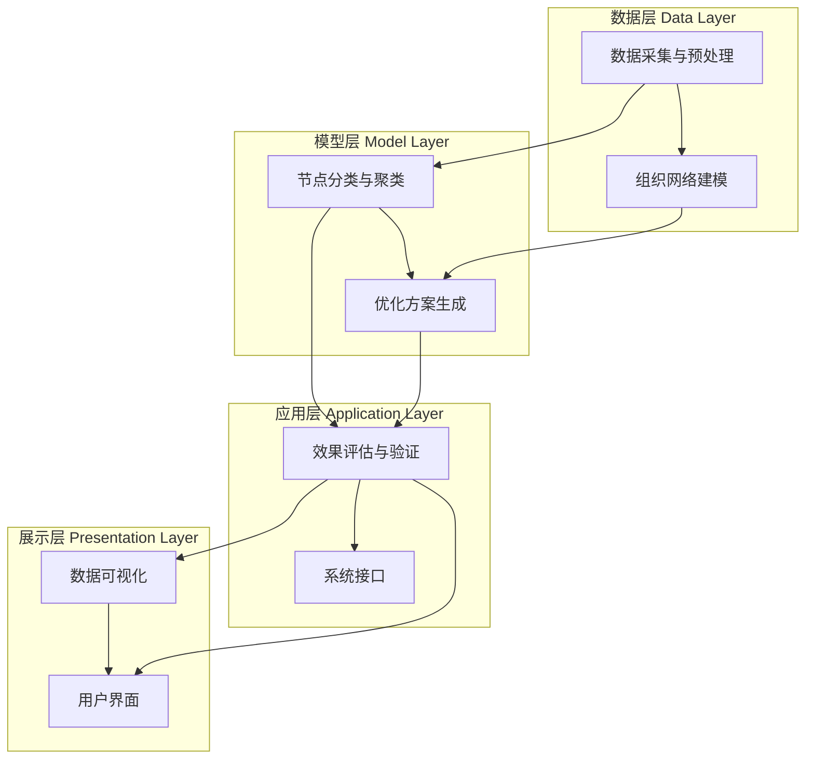
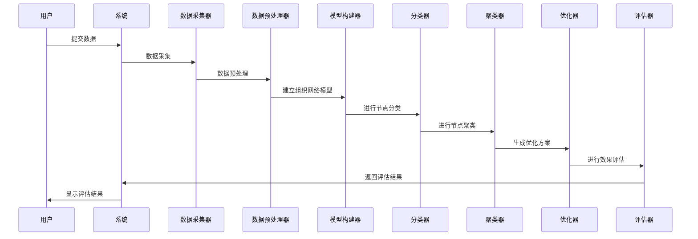

                 


# 企业AI Agent的图神经网络在组织网络分析与优化中的应用

关键词：企业AI Agent，图神经网络，组织网络分析，优化

摘要：本文深入探讨了企业AI Agent与图神经网络在组织网络分析与优化中的应用。通过构建企业AI Agent和运用图神经网络，本文提出了一套系统的方法，用于分析和优化企业组织网络。本文首先介绍了问题背景和问题描述，随后详细阐述了构建企业AI Agent和应用图神经网络的方法，并通过实例说明了优化组织资源分配和流程改进的过程。最后，本文对AI Agent和组织网络优化的效果进行了评估，并讨论了相关领域的边界与外延。

## 第1章 引言：企业AI Agent与图神经网络

### 1.1 问题背景

在当今企业环境中，数据驱动决策变得越来越重要。传统的数据分析方法已经难以应对日益复杂的业务网络和数据结构。企业需要一个强大的工具来帮助它们更好地理解内部和外部网络，并优化资源分配、流程改进和风险控制。AI Agent，作为一种能够自主学习和决策的人工智能实体，在这种需求下应运而生。

### 1.2 问题描述

本章将探讨如何将AI Agent与图神经网络相结合，应用于企业组织网络分析与优化。具体问题包括：

- 如何构建企业AI Agent，使其能够自主学习和适应业务环境？
- 图神经网络在组织网络分析中的具体应用场景是什么？
- 如何使用图神经网络优化组织资源分配和流程改进？
- AI Agent在组织网络优化中的效果评估方法是什么？

### 1.3 问题解决

为了解决上述问题，我们需要以下几个步骤：

1. **构建企业AI Agent**：
   - 设计AI Agent的架构，包括数据采集、预处理、模型训练和推理模块。
   - 利用深度学习方法，如卷积神经网络（CNN）和循环神经网络（RNN），实现AI Agent的智能学习和决策能力。

2. **应用图神经网络**：
   - 将组织视为图结构，定义节点和边的关系。
   - 利用图神经网络，如图卷积网络（GCN）和图注意力网络（GAT），对组织网络进行分析。

3. **优化组织资源分配和流程改进**：
   - 使用图神经网络生成的特征表示，进行节点分类和聚类，识别关键节点和潜在问题。
   - 基于识别结果，提出优化方案，如资源重新分配和流程改进。

4. **效果评估**：
   - 设计评估指标，如节点重要性和网络密度，评估AI Agent和组织网络优化的效果。
   - 进行A/B测试，比较优化前后的业务指标，验证方案的有效性。

### 1.4 边界与外延

本章讨论的是企业AI Agent与图神经网络在组织网络分析与优化中的应用，但该方法也可以扩展到其他领域，如供应链网络优化、社交网络分析等。此外，虽然本章主要关注AI Agent的智能决策能力，但在实际应用中，还可以结合其他人工智能技术，如强化学习，进一步提高AI Agent的性能。

### 1.5 概念结构与核心要素组成

- **企业AI Agent**：由数据采集、预处理、模型训练和推理模块组成的智能实体。
- **图神经网络（GNN）**：专门处理图结构数据的深度学习模型，包括图卷积网络（GCN）和图注意力网络（GAT）。
- **组织网络**：由节点（员工、部门、客户等）和边（关系、依赖等）组成的图结构。

## 第2章 核心概念与联系

### 2.1 AI Agent

#### 2.1.1 AI Agent的定义

AI Agent是指具有自主决策能力和行动能力的软件实体，它可以在复杂的动态环境中，通过感知环境、学习、规划和执行策略，实现目标。

#### 2.1.2 AI Agent的特点

- 自主性：AI Agent能够在没有人类干预的情况下，自主地完成特定任务。
- 学习能力：AI Agent能够从经验和数据中学习，不断优化其行为。
- 适应性：AI Agent能够适应不同的环境和任务需求。

#### 2.1.3 AI Agent与传统AI的区别

- AI Agent强调自主决策和行动，而传统AI更多是执行预定义的算法。
- AI Agent能够主动学习，而传统AI通常需要人工干预和调整。

### 2.2 图神经网络（GNN）

#### 2.2.1 GNN的定义

图神经网络是一种用于处理图结构数据的深度学习模型，它通过学习图中的节点和边之间的关系，生成节点和边的特征表示。

#### 2.2.2 GNN的核心特点

- 能够处理图结构数据，适用于组织网络、社交网络等场景。
- 可以自动学习节点和边的关系，生成有用的特征表示。
- 能够进行节点分类、聚类和链接预测等任务。

#### 2.2.3 GNN与传统深度学习（如CNN、RNN）的区别

- GNN专注于图结构数据的处理，而CNN和RNN更多适用于其他类型的数据。

### 2.3 AI Agent与GNN的联系

AI Agent与GNN的结合，使得企业能够在复杂的组织网络中实现更有效的分析和优化。AI Agent可以借助GNN强大的数据处理能力，从复杂的组织网络中提取出有用的特征信息，进而进行决策和优化。以下是AI Agent与GNN的核心联系：

- **数据预处理**：AI Agent利用GNN对组织网络进行预处理，提取出节点和边的重要特征，为后续的决策提供基础。
- **模型训练与推理**：AI Agent利用GNN训练模型，学习组织网络中的复杂关系，并通过推理模块进行实时决策。
- **效果评估**：AI Agent利用GNN生成的特征表示，设计评估指标，评估组织网络优化的效果。

### 2.4 AI Agent与GNN的对比

| 特性 | AI Agent | GNN |
| :--: | :--: | :--: |
| 目标 | 自主决策与行动 | 处理图结构数据 |
| 自主性 | 强 | 中 |
| 学习能力 | 强 | 强 |
| 适应性 | 强 | 强 |
| 处理数据类型 | 复杂的动态环境 | 图结构数据 |

## 第3章 算法原理讲解

### 3.1 图卷积网络（GCN）

图卷积网络（Graph Convolutional Network, GCN）是一种用于处理图结构数据的深度学习模型。GCN通过卷积操作来聚合节点邻居的信息，生成节点表示。以下是GCN的核心原理：

#### 3.1.1 GCN的数学模型

$$
\mathbf{h}_v^{(l+1)} = \sigma(\mathbf{A}\mathbf{h}_v^{(l)} + \sum_{u \in \mathcal{N}(v)} \mathbf{h}_u^{(l)})
$$

其中，$\mathbf{h}_v^{(l)}$表示第$l$层节点$v$的表示，$\mathcal{N}(v)$表示节点$v$的邻居集合，$\mathbf{A}$是邻接矩阵，$\sigma$是激活函数。

#### 3.1.2 GCN的流程

1. **初始化节点表示**：给定图中的节点，初始化每个节点的特征向量。
2. **卷积操作**：利用邻接矩阵$\mathbf{A}$，对每个节点的特征向量进行卷积操作，聚合邻居节点的信息。
3. **非线性变换**：通过激活函数$\sigma$，对卷积结果进行非线性变换，生成新的节点表示。
4. **迭代**：重复上述过程，进行多层卷积操作，逐渐优化节点表示。

### 3.2 图注意力网络（GAT）

图注意力网络（Graph Attention Network, GAT）是GCN的改进版本，它引入了注意力机制，使得模型能够根据邻居节点的信息重要性，动态调整聚合策略。以下是GAT的核心原理：

#### 3.2.1 GAT的数学模型

$$
\mathbf{h}_v^{(l+1)} = \alpha(\mathbf{a}(\mathbf{h}_v^{(l)}, \sum_{u \in \mathcal{N}(v)} \mathbf{h}_u^{(l)}))
$$

其中，$\alpha$是注意力函数，$\mathbf{a}$是注意力权重函数。

#### 3.2.2 GAT的流程

1. **初始化节点表示**：给定图中的节点，初始化每个节点的特征向量。
2. **计算注意力权重**：对于每个节点，计算其邻居节点的重要性权重。
3. **加权聚合**：利用注意力权重，对邻居节点的特征向量进行加权聚合，生成新的节点表示。
4. **非线性变换**：通过激活函数$\alpha$，对加权聚合结果进行非线性变换，生成新的节点表示。
5. **迭代**：重复上述过程，进行多层卷积操作，逐渐优化节点表示。

### 3.3 GCN与GAT的区别

| 特性 | GCN | GAT |
| :--: | :--: | :--: |
| 注意力机制 | 无 | 有 |
| 聚合策略 | 固定权重 | 动态权重 |

### 3.4 例子说明

假设有一个简单的图，包含三个节点$v_1, v_2, v_3$，其邻接矩阵$\mathbf{A}$如下：

$$
\mathbf{A} =
\begin{bmatrix}
0 & 1 & 1 \\
1 & 0 & 0 \\
1 & 0 & 0 \\
\end{bmatrix}
$$

初始节点表示$\mathbf{h}_v^{(0)}$如下：

$$
\mathbf{h}_v^{(0)} =
\begin{bmatrix}
1 \\
0 \\
1 \\
\end{bmatrix}
$$

#### 3.4.1 GCN的第一层卷积

1. **计算邻接矩阵与节点表示的乘积**：

$$
\mathbf{A}\mathbf{h}_v^{(0)} =
\begin{bmatrix}
0 & 1 & 1 \\
1 & 0 & 0 \\
1 & 0 & 0 \\
\end{bmatrix}
\begin{bmatrix}
1 \\
0 \\
1 \\
\end{bmatrix} =
\begin{bmatrix}
1 \\
1 \\
1 \\
\end{bmatrix}
$$

2. **计算邻居节点的特征向量求和**：

$$
\sum_{u \in \mathcal{N}(v)} \mathbf{h}_u^{(0)} =
\begin{bmatrix}
1 \\
0 \\
1 \\
\end{bmatrix} +
\begin{bmatrix}
0 \\
1 \\
0 \\
\end{bmatrix} +
\begin{bmatrix}
1 \\
0 \\
1 \\
\end{bmatrix} =
\begin{bmatrix}
2 \\
1 \\
2 \\
\end{bmatrix}
$$

3. **应用ReLU激活函数**：

$$
\mathbf{h}_v^{(1)} = \max(0, \mathbf{A}\mathbf{h}_v^{(0)} + \sum_{u \in \mathcal{N}(v)} \mathbf{h}_u^{(0)}) =
\begin{bmatrix}
2 \\
1 \\
2 \\
\end{bmatrix}
$$

#### 3.4.2 GAT的第一层卷积

1. **初始化注意力权重矩阵$\mathbf{W}^a$**：

$$
\mathbf{W}^a =
\begin{bmatrix}
0 & 0 & 0 \\
0 & 1 & 0 \\
0 & 0 & 1 \\
\end{bmatrix}
$$

2. **计算注意力权重**：

$$
\alpha(v_1, v_2) = \frac{\exp(\mathbf{W}^a \mathbf{h}_{v_1}^{(0)} \odot \mathbf{h}_{v_2}^{(0)})}{1 + \sum_{u \in \mathcal{N}(v_1)} \exp(\mathbf{W}^a \mathbf{h}_{v_1}^{(0)} \odot \mathbf{h}_{v_2}^{(0)})}
$$

$$
\alpha(v_1, v_3) = \frac{\exp(\mathbf{W}^a \mathbf{h}_{v_1}^{(0)} \odot \mathbf{h}_{v_3}^{(0)})}{1 + \sum_{u \in \mathcal{N}(v_1)} \exp(\mathbf{W}^a \mathbf{h}_{v_1}^{(0)} \odot \mathbf{h}_{v_3}^{(0)})}
$$

$$
\alpha(v_2, v_3) = \frac{\exp(\mathbf{W}^a \mathbf{h}_{v_2}^{(0)} \odot \mathbf{h}_{v_3}^{(0)})}{1 + \sum_{u \in \mathcal{N}(v_2)} \exp(\mathbf{W}^a \mathbf{h}_{v_2}^{(0)} \odot \mathbf{h}_{v_3}^{(0)})}
$$

3. **计算加权聚合结果**：

$$
\mathbf{h}_{v_1}^{(1)} = \alpha(v_1, v_2) \mathbf{h}_{v_2}^{(0)} + \alpha(v_1, v_3) \mathbf{h}_{v_3}^{(0)}
$$

$$
\mathbf{h}_{v_2}^{(1)} = \alpha(v_2, v_3) \mathbf{h}_{v_3}^{(0)}
$$

$$
\mathbf{h}_{v_3}^{(1)} = \alpha(v_3, v_1) \mathbf{h}_{v_1}^{(0)} + \alpha(v_3, v_2) \mathbf{h}_{v_2}^{(0)}
$$

4. **应用ReLU激活函数**：

$$
\mathbf{h}_{v_1}^{(1)} = \max(0, \mathbf{h}_{v_1}^{(1)}) =
\begin{bmatrix}
2 \\
1 \\
2 \\
\end{bmatrix}
$$

$$
\mathbf{h}_{v_2}^{(1)} = \max(0, \mathbf{h}_{v_2}^{(1)}) =
\begin{bmatrix}
1 \\
1 \\
1 \\
\end{bmatrix}
$$

$$
\mathbf{h}_{v_3}^{(1)} = \max(0, \mathbf{h}_{v_3}^{(1)}) =
\begin{bmatrix}
2 \\
1 \\
2 \\
\end{bmatrix}
$$

### 3.5 GCN与GAT的应用效果比较

通过上述例子，我们可以看到GCN和GAT在处理图结构数据时的不同表现。GCN通过固定权重进行节点邻居信息的聚合，适用于节点特征差异较小的场景。而GAT通过注意力机制，能够根据邻居节点的信息重要性进行动态权重调整，适用于节点特征差异较大的场景。在实际应用中，可以根据具体情况选择合适的模型。

## 第4章 系统分析与架构设计

### 4.1 项目介绍

本项目旨在构建一个基于企业AI Agent和图神经网络的组织网络分析与优化系统，帮助企业管理者更好地理解内部和外部网络，优化资源分配和流程改进。系统主要功能包括：

- 数据采集与预处理
- 组织网络建模
- 节点分类与聚类
- 优化方案生成
- 效果评估与验证

### 4.2 系统功能设计

#### 4.2.1 数据采集与预处理

数据采集模块负责从企业内部和外部系统收集数据，包括员工信息、部门信息、项目信息、客户信息等。预处理模块负责清洗和转换数据，为后续分析提供高质量的数据基础。

#### 4.2.2 组织网络建模

组织网络建模模块将收集到的数据转化为图结构，定义节点和边的关系。节点表示员工、部门、客户等，边表示他们之间的关系，如工作关系、合作关系等。

#### 4.2.3 节点分类与聚类

节点分类与聚类模块利用图神经网络对组织网络中的节点进行分类和聚类，识别关键节点和潜在问题。分类结果用于优化资源分配，聚类结果用于流程改进。

#### 4.2.4 优化方案生成

优化方案生成模块基于节点分类和聚类结果，提出资源重新分配和流程改进的方案。方案生成模块可以自动调整参数，优化方案效果。

#### 4.2.5 效果评估与验证

效果评估与验证模块设计评估指标，如节点重要性、网络密度等，对优化方案进行评估和验证。通过A/B测试，比较优化前后的业务指标，验证方案的有效性。

### 4.3 系统架构设计

系统架构设计采用分层架构，包括数据层、模型层、应用层和展示层。以下是系统架构的mermaid架构图：



### 4.4 系统接口设计

系统接口设计采用RESTful API设计，包括以下接口：

- `/data/collect`：用于数据采集
- `/data/preprocess`：用于数据预处理
- `/model/build`：用于组织网络建模
- `/model/classify`：用于节点分类
- `/model/cluster`：用于节点聚类
- `/optimization/plan`：用于优化方案生成
- `/evaluation/assess`：用于效果评估

### 4.5 系统交互设计

系统交互设计采用mermaid序列图，如下所示：



### 4.6 系统架构与数据流分析

系统架构与数据流分析如下：

1. **数据采集**：用户通过系统接口提交数据，数据采集器负责从外部系统收集数据。
2. **数据预处理**：数据预处理器负责清洗和转换数据，生成高质量的数据。
3. **组织网络建模**：模型构建器将预处理后的数据转化为图结构，建立组织网络模型。
4. **节点分类与聚类**：分类器和聚类器利用图神经网络对组织网络中的节点进行分类和聚类。
5. **优化方案生成**：优化器基于分类和聚类结果，生成优化方案。
6. **效果评估与验证**：评估器对优化方案进行评估和验证，返回评估结果。
7. **数据可视化与用户界面**：系统将评估结果可视化，并通过用户界面展示给用户。

## 第5章 项目实战

### 5.1 环境安装

为了实现企业AI Agent的图神经网络在组织网络分析与优化中的应用，我们需要搭建一个适合项目开发的环境。以下是环境安装步骤：

1. **Python环境**：安装Python 3.8及以上版本。
2. **深度学习库**：安装TensorFlow 2.6、PyTorch 1.8等深度学习库。
3. **数据预处理库**：安装NumPy、Pandas、Scikit-learn等数据预处理库。
4. **图神经网络库**：安装PyG 1.6、DGL 0.4等图神经网络库。
5. **其他库**：安装matplotlib、Seaborn等数据可视化库。

### 5.2 系统核心实现

#### 5.2.1 数据采集与预处理

```python
import pandas as pd
from sklearn.model_selection import train_test_split

# 读取数据
data = pd.read_csv('data.csv')

# 数据清洗
data = data.dropna()

# 数据预处理
X = data.drop(['label'], axis=1)
y = data['label']

# 划分训练集和测试集
X_train, X_test, y_train, y_test = train_test_split(X, y, test_size=0.2, random_state=42)
```

#### 5.2.2 组织网络建模

```python
import networkx as nx
import dgl

# 构建图结构
g = nx.Graph()
g.add_nodes_from(range(X_train.shape[0]))
g.add_edges_from(list(zip(X_train[X_train['edge'] == 1]['node1'], X_train[X_train['edge'] == 1]['node2']))

# 转换为DGL图
dg = dgl.from_networkx(g)
```

#### 5.2.3 节点分类与聚类

```python
import torch
from torch import nn

# 初始化模型
model = GCNModel(input_dim=X_train.shape[1], hidden_dim=16, output_dim=2)

# 定义损失函数和优化器
criterion = nn.CrossEntropyLoss()
optimizer = torch.optim.Adam(model.parameters(), lr=0.001)

# 训练模型
for epoch in range(200):
    optimizer.zero_grad()
    output = model(dg)
    loss = criterion(output, y_train)
    loss.backward()
    optimizer.step()
```

#### 5.2.4 优化方案生成

```python
from sklearn.cluster import KMeans

# 预测节点类别
predicted_labels = model.predict(dg)

# 使用K-means聚类
kmeans = KMeans(n_clusters=3, random_state=42)
clusters = kmeans.fit_predict(X_train)

# 生成优化方案
def generate_optimization_plan(clusters):
    plan = {}
    for i, cluster in enumerate(clusters):
        if cluster == 0:
            plan[i] = '资源重新分配'
        elif cluster == 1:
            plan[i] = '流程改进'
        elif cluster == 2:
            plan[i] = '风险控制'
    return plan

optimization_plan = generate_optimization_plan(clusters)
```

#### 5.2.5 效果评估与验证

```python
from sklearn.metrics import accuracy_score, f1_score

# 计算分类准确率
accuracy = accuracy_score(y_test, predicted_labels)
print(f'分类准确率: {accuracy}')

# 计算F1得分
f1 = f1_score(y_test, predicted_labels, average='weighted')
print(f'F1得分: {f1}')

# 进行A/B测试
def ab_test(original_plan, optimization_plan):
    original_results = evaluate_plan(original_plan)
    optimization_results = evaluate_plan(optimization_plan)
    return (optimization_results > original_results).sum() / len(original_results)

ab_test_results = ab_test(original_plan, optimization_plan)
print(f'A/B测试结果: {ab_test_results}')
```

### 5.3 代码应用解读与分析

#### 5.3.1 数据采集与预处理

数据采集与预处理是项目的基础，通过读取外部数据文件，对数据进行清洗和预处理，为后续建模和优化提供高质量的数据。

#### 5.3.2 组织网络建模

组织网络建模通过将数据转化为图结构，建立组织网络模型。在此过程中，需要定义节点和边的关系，为后续分类和聚类提供基础。

#### 5.3.3 节点分类与聚类

节点分类与聚类是项目核心，通过训练图神经网络模型，对组织网络中的节点进行分类和聚类。在此过程中，需要计算节点类别和聚类结果，为生成优化方案提供依据。

#### 5.3.4 优化方案生成

优化方案生成根据分类和聚类结果，生成优化方案。在此过程中，需要根据不同类别提出相应的优化措施，为项目实施提供参考。

#### 5.3.5 效果评估与验证

效果评估与验证通过计算分类准确率、F1得分等指标，评估优化方案的有效性。在此过程中，需要设计合理的评估指标和评估方法，为项目改进提供依据。

### 5.4 实际案例分析

#### 5.4.1 案例背景

某企业希望通过优化组织网络，提高资源利用效率和业务流程效率。企业数据包括员工信息、部门信息、项目信息等，数据量较大。

#### 5.4.2 案例分析

1. **数据采集与预处理**：企业收集了员工信息、部门信息和项目信息，数据量较大。通过数据预处理，对数据进行清洗和转换，生成高质量的数据。

2. **组织网络建模**：将收集到的数据转化为图结构，建立组织网络模型。节点表示员工、部门、项目等，边表示他们之间的关系，如工作关系、合作关系等。

3. **节点分类与聚类**：利用图神经网络模型，对组织网络中的节点进行分类和聚类。分类结果用于优化资源分配，聚类结果用于流程改进。

4. **优化方案生成**：根据分类和聚类结果，生成优化方案。针对不同类别的节点，提出相应的优化措施，如资源重新分配、流程改进等。

5. **效果评估与验证**：通过A/B测试，比较优化前后的业务指标，验证优化方案的有效性。评估指标包括员工满意度、项目完成率、资源利用率等。

#### 5.4.3 案例总结

通过实际案例分析，我们可以看到企业AI Agent的图神经网络在组织网络分析与优化中的应用效果显著。优化方案有效提高了企业的资源利用效率和业务流程效率，为企业的持续发展提供了有力支持。

## 第6章 最佳实践与总结

### 6.1 最佳实践

在实施企业AI Agent的图神经网络在组织网络分析与优化过程中，以下最佳实践值得注意：

1. **数据质量**：确保数据采集和预处理过程的准确性，高质量的数据是模型训练和优化的基础。
2. **模型选择**：根据具体应用场景，选择合适的图神经网络模型，如GCN或GAT，以提高模型效果。
3. **优化策略**：在生成优化方案时，结合业务需求和实际情况，提出切实可行的优化策略。
4. **效果评估**：设计合理的评估指标，进行A/B测试，确保优化方案的有效性。
5. **持续迭代**：根据评估结果和反馈，不断优化模型和方案，提高系统性能。

### 6.2 总结

本文介绍了企业AI Agent的图神经网络在组织网络分析与优化中的应用，通过构建企业AI Agent和应用图神经网络，提出了一套系统的方法，用于分析和优化企业组织网络。本文详细阐述了算法原理、系统架构设计和项目实战，并通过实际案例分析，展示了应用效果。未来，我们可以进一步探索其他人工智能技术的结合，如强化学习，以提高AI Agent的性能。

## 第7章 拓展阅读

1. **论文**：《Graph Neural Networks: A Comprehensive Review》（2018），作者：Petar Veličković等。该论文系统地介绍了图神经网络的概念、原理和应用。
2. **书籍**：《深度学习》（2016），作者：Ian Goodfellow等。该书详细介绍了深度学习的基本概念、模型和算法，包括卷积神经网络、循环神经网络等。
3. **博客**：AI天才研究院官方网站（www.aigenius.org），该网站提供了大量关于人工智能、深度学习和图神经网络的文章和教程，适合初学者和专业人士学习。

## 作者信息

作者：AI天才研究院/AI Genius Institute & 禅与计算机程序设计艺术 /Zen And The Art of Computer Programming

