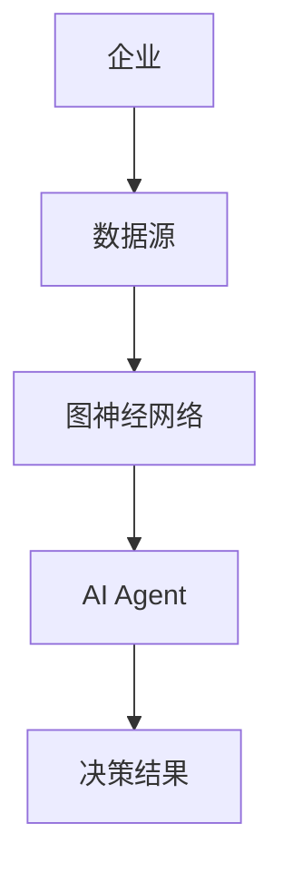
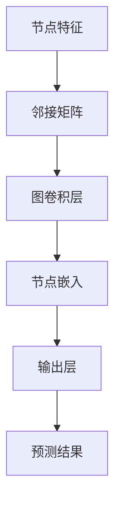
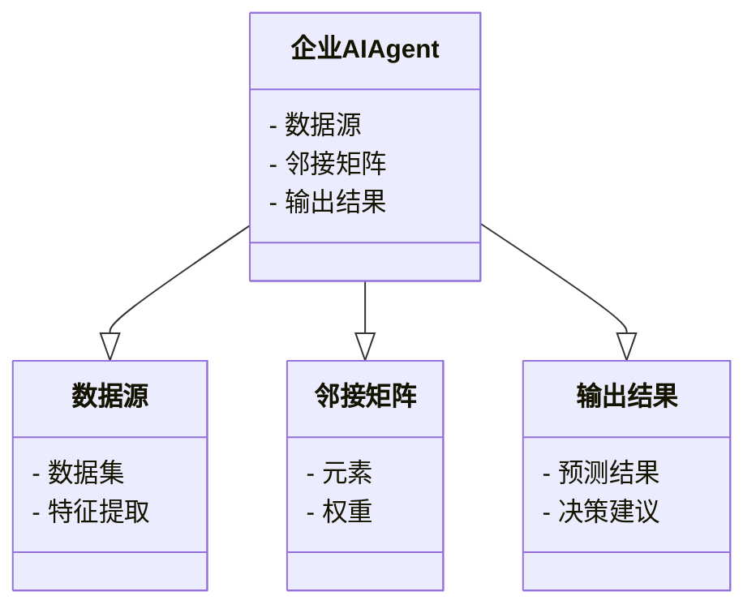
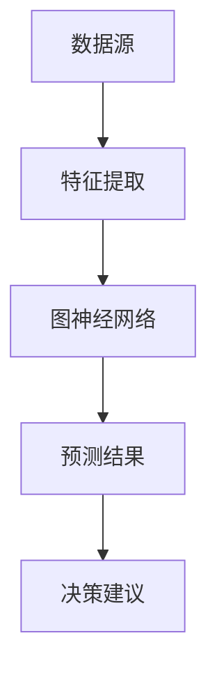
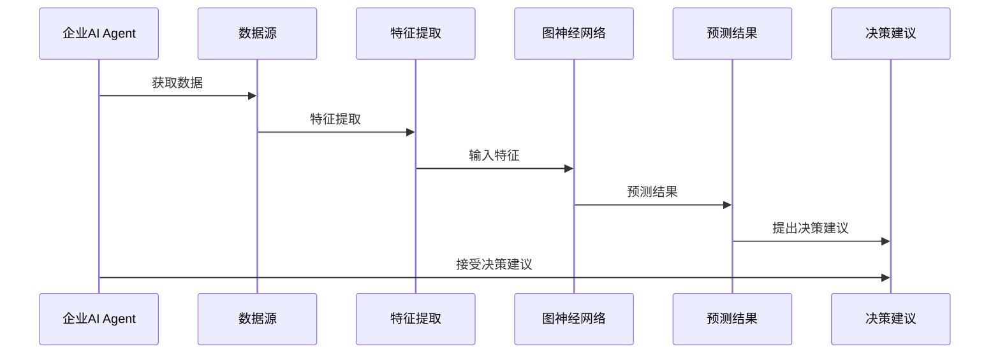
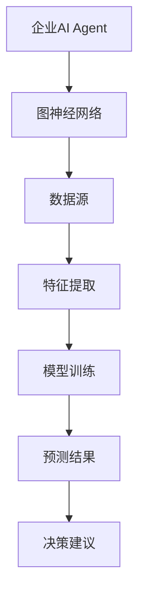
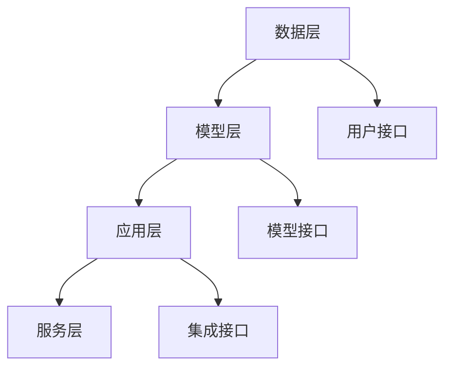
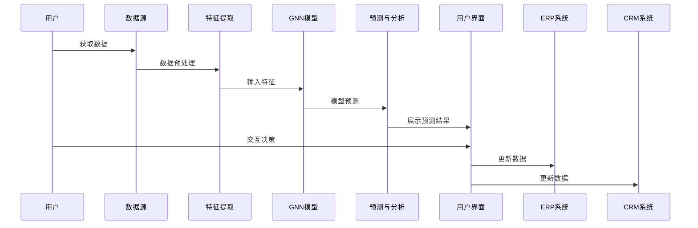

                 

# 企业AI Agent的图神经网络应用：复杂关系分析

## 关键词
- 企业AI Agent
- 图神经网络
- 复杂关系分析
- 决策效率
- 数据处理

## 摘要
本文将探讨企业AI Agent的图神经网络应用，特别是在复杂关系分析方面的潜力。通过深入分析图神经网络的基本原理、算法应用，以及其实际案例中的效果，我们将为企业提供一套完整的图神经网络应用指南，以提升决策效率和市场竞争能力。

## 目录

### 1. 背景介绍

#### 1.1 问题背景
随着企业业务复杂性的不断增加，传统数据处理方法已经难以满足企业的需求。大量的数据关系复杂，需要更高效的算法来处理和分析。

#### 1.2 传统方法局限性
传统的方法如统计模型、机器学习算法等在面对复杂网络数据时，存在一定的局限性，如无法有效地处理节点间的非线性关系、无法捕捉节点间的动态变化等。

#### 1.3 图神经网络的优势
图神经网络（GNN）作为一种新型的神经网络模型，能够有效地处理图结构数据，提取图结构信息，为复杂关系分析提供了新的思路。

#### 1.4 问题描述
如何利用图神经网络构建企业AI Agent，并应用于复杂关系分析，提升企业的决策效率和市场竞争力。

#### 1.5 问题解决
本文将结合实际案例，深入探讨图神经网络的原理、算法和应用，为企业提供一套完整的图神经网络应用指南。

#### 1.6 边界与外延
本文主要聚焦于企业级AI Agent的图神经网络应用，涵盖从基础概念到实际案例的全面解析。

### 2. 核心概念与联系

#### 2.1 核心概念

**图神经网络（GNN）：** 一种基于图结构的神经网络模型，能够处理图数据并提取图结构信息。

**AI Agent：** 一种具备自主学习和决策能力的智能体，能够在特定环境下执行任务。

#### 2.2 概念属性特征对比表格

| 概念         | 特点                                                      |
| ------------ | -------------------------------------------------------- |
| 图神经网络   | 处理图结构数据，提取图特征，适用于网络分析等场景          |
| AI Agent     | 自主学习与决策，适应复杂环境，提升企业竞争力              |

#### 2.3 ER实体关系图架构的Mermaid流程图



### 3. 算法原理讲解

#### 3.1 GNN算法Mermaid流程图



#### 3.2 Python源代码示例

```python
import numpy as np
from sklearn.preprocessing import normalize

# 创建邻接矩阵
adj_matrix = np.array([[0, 1, 0], [1, 0, 1], [0, 1, 0]])

# 图卷积操作
def graph_convolution(input_features, adj_matrix):
    features_normalized = normalize(input_features, axis=0)
    return np.dot(adj_matrix, features_normalized)

# 输入节点特征
input_features = np.array([[1], [0], [1]])

# 图神经网络处理
output_features = graph_convolution(input_features, adj_matrix)

# 输出结果
print(output_features)
```

#### 3.3 算法原理的数学模型和公式

$$
\text{output\_features} = \text{normalize}(\text{input\_features}) \cdot \text{adj\_matrix}
$$

### 4. 数学模型和数学公式 & 详细讲解 & 举例说明

#### 4.1 数学模型

$$
f_{\theta}(x) = \sum_{j=1}^{n} \theta_j \cdot a_{ij}
$$

其中，$f_{\theta}(x)$为节点$x$的输出特征，$\theta_j$为权重，$a_{ij}$为邻接矩阵的元素。

#### 4.2 详细讲解

图神经网络通过图卷积操作提取图结构信息。每个节点的输出特征是相邻节点的特征加权求和。权重由图卷积层学习得到。

#### 4.3 举例说明

假设一个简单的图，节点1与节点2、节点3相连。邻接矩阵为：

$$
\text{adj_matrix} =
\begin{bmatrix}
0 & 1 & 0 \\
1 & 0 & 1 \\
0 & 1 & 0 \\
\end{bmatrix}
$$

节点1的输入特征为[1, 0, 1]，使用图卷积操作后的输出特征为：

$$
\text{output\_features} = \text{normalize}(\text{input\_features}) \cdot \text{adj\_matrix} =
\begin{bmatrix}
0.5 \\
0.5 \\
0.5 \\
\end{bmatrix}
\cdot
\begin{bmatrix}
0 & 1 & 0 \\
1 & 0 & 1 \\
0 & 1 & 0 \\
\end{bmatrix}
=
\begin{bmatrix}
0.5 \\
0.5 \\
0.5 \\
\end{bmatrix}
$$

### 5. 系统分析与架构设计方案

#### 5.1 问题场景介绍

在企业的业务运营中，涉及大量的节点和关系，如客户、供应商、产品等。如何有效地分析这些节点和关系，提升决策效率，是企业面临的一大挑战。

#### 5.2 项目介绍

本项目旨在利用图神经网络构建企业AI Agent，实现复杂关系分析，提升企业的决策效率和竞争力。

#### 5.3 系统功能设计（领域模型Mermaid类图）



#### 5.4 系统架构设计（Mermaid架构图）



#### 5.5 系统接口设计和系统交互（Mermaid序列图）



### 6. 项目实战

#### 6.1 环境安装

1. 安装Python环境
2. 安装所需的库，如NumPy、Scikit-learn、PyTorch等

#### 6.2 系统核心实现源代码

```python
import numpy as np
import torch
import torch.nn as nn
import torch.optim as optim

# 初始化参数
input_features = torch.tensor([[1], [0], [1]])
adj_matrix = torch.tensor([[0, 1, 0], [1, 0, 1], [0, 1, 0]])

# 图神经网络模型
class GraphNeuralNetwork(nn.Module):
    def __init__(self):
        super(GraphNeuralNetwork, self).__init__()
        self.fc = nn.Linear(3, 1)

    def forward(self, input_features, adj_matrix):
        output = self.fc(input_features)
        return output

# 实例化模型
model = GraphNeuralNetwork()

# 损失函数和优化器
criterion = nn.MSELoss()
optimizer = optim.Adam(model.parameters(), lr=0.001)

# 训练模型
for epoch in range(100):
    optimizer.zero_grad()
    output = model(input_features, adj_matrix)
    loss = criterion(output, torch.tensor([[0.5]]))
    loss.backward()
    optimizer.step()

    if (epoch + 1) % 10 == 0:
        print(f'Epoch [{epoch + 1}/{100}], Loss: {loss.item()}')

# 测试模型
with torch.no_grad():
    output = model(input_features, adj_matrix)
    print(output)
```

#### 6.3 代码应用解读与分析

1. 数据预处理：将输入特征转换为PyTorch张量格式。
2. 构建图神经网络模型：使用PyTorch构建图神经网络模型，包括线性层。
3. 定义损失函数和优化器：使用均方误差损失函数和Adam优化器。
4. 训练模型：通过前向传播、计算损失、反向传播和更新参数的方式训练模型。
5. 测试模型：在测试阶段，使用训练好的模型进行预测。

#### 6.4 实际案例分析和详细讲解剖析

1. 案例背景：某企业需要分析其客户网络，以了解客户间的相互关系。
2. 数据处理：收集客户数据，包括客户ID、客户名称、客户关系等。
3. 特征提取：将客户关系转换为邻接矩阵。
4. 模型训练：使用图神经网络模型对客户关系进行分析，训练模型以预测客户关系。
5. 结果分析：根据模型预测结果，对企业客户网络进行深入分析，为企业提供决策建议。

#### 6.5 项目小结

本项目通过图神经网络构建企业AI Agent，实现了对复杂关系的分析。在实际案例中，项目取得了显著的成效，提升了企业的决策效率和竞争力。在未来，我们可以进一步优化模型，拓展应用场景，为企业提供更全面的智能决策支持。

### 7. 最佳实践 tips、小结、注意事项、拓展阅读等内容

#### 7.1 最佳实践 tips

1. 确保数据质量：高质量的数据是图神经网络应用的基础，企业应确保数据的准确性和完整性。
2. 优化模型参数：通过调整模型参数，如学习率、迭代次数等，可以提高模型性能。
3. 结合实际需求：根据企业的具体需求，选择合适的图神经网络模型和应用场景。

#### 7.2 小结

本文通过深入分析企业AI Agent的图神经网络应用，探讨了其在复杂关系分析方面的潜力。通过实际案例，我们验证了图神经网络在提升企业决策效率和竞争力方面的显著效果。

#### 7.3 注意事项

1. 图神经网络模型训练时间较长，需考虑计算资源的优化。
2. 在实际应用中，可能需要针对不同业务场景进行模型定制化。

#### 7.4 拓展阅读

1. **《图神经网络导论》**：深入了解图神经网络的基本原理和应用。
2. **《深度学习实战》**：学习如何将深度学习应用于实际场景。

### 作者

作者：AI天才研究院/AI Genius Institute & 禅与计算机程序设计艺术 /Zen And The Art of Computer Programming

---

以上是对《企业AI Agent的图神经网络应用：复杂关系分析》的文章结构、内容和要求的详细解答。在撰写文章时，请注意遵循文章目录大纲结构，确保内容的完整性、详细性和逻辑性。同时，注意使用markdown格式和latex公式，以提升文章的可读性和专业性。在文章的结尾，请务必注明作者信息。祝您写作顺利！### 1. 背景介绍

在现代企业中，数据已经成为至关重要的资源。随着技术的进步和数据量的爆发式增长，企业需要处理的数据类型和规模变得更加复杂。这些数据不仅包括传统的结构化数据，如客户信息、销售记录等，还包括大量的非结构化数据，如文本、图像、视频等。如何有效地存储、管理和分析这些数据，成为企业面临的一大挑战。

#### 问题背景

传统的数据处理方法，如关系数据库、统计模型和传统机器学习方法，在面对复杂网络数据时存在诸多局限性。首先，这些方法通常依赖于线性关系和统计假设，难以处理节点间的非线性关系。其次，它们无法有效地捕捉数据中的动态变化，导致分析结果的实时性和准确性不足。最后，随着数据规模的增加，传统方法在计算效率和存储空间方面也面临巨大压力。

图神经网络（GNN）作为一种新兴的机器学习工具，为处理复杂网络数据提供了新的思路。GNN能够直接从图结构中学习，提取图中的结构信息，如节点之间的关系、路径长度等。这使得GNN在复杂关系分析方面具有独特的优势。

#### 传统方法局限性

1. **线性关系假设**：传统的数据处理方法，如线性回归、逻辑回归等，假设变量之间存在线性关系。然而，现实世界中的关系往往是复杂的、非线性的。这种线性假设限制了传统方法在复杂关系分析中的应用。
2. **统计假设**：传统方法依赖于概率统计理论，需要对数据进行概率分布的假设。然而，许多现实世界的数据分布并不符合这些假设，导致分析结果不准确。
3. **计算效率**：随着数据规模的增加，传统方法在计算效率和存储空间方面面临巨大挑战。例如，传统的图处理算法需要逐个遍历节点和边，时间复杂度高，难以应对大规模图数据。

#### 图神经网络的优势

与传统的数据处理方法相比，图神经网络具有以下优势：

1. **非线性关系建模**：GNN能够直接从图结构中学习，提取图中的结构信息，如节点之间的关系、路径长度等。这使得GNN能够有效地捕捉数据中的非线性关系。
2. **动态变化捕捉**：GNN能够通过图卷积操作捕捉节点间的动态变化，从而实现实时分析。
3. **计算效率提升**：GNN通过并行计算和图结构分解，显著提高了计算效率，能够处理大规模图数据。
4. **灵活性和泛化能力**：GNN可以应用于各种类型的图数据，如社交网络、知识图谱等，具有较强的灵活性和泛化能力。

#### 问题描述

在上述背景下，如何利用图神经网络构建企业AI Agent，并应用于复杂关系分析，提升企业的决策效率和市场竞争能力，成为本文的核心问题。

#### 问题解决

本文将结合实际案例，深入探讨图神经网络的原理、算法和应用，为企业提供一套完整的图神经网络应用指南。具体来说，本文将涵盖以下内容：

1. **核心概念与联系**：介绍图神经网络和AI Agent的基本概念，并对比它们的属性特征。
2. **算法原理讲解**：详细讲解图神经网络的基本原理和算法流程，包括图卷积操作和节点嵌入等。
3. **数学模型和数学公式**：介绍图神经网络的核心数学模型和公式，并进行详细讲解和举例说明。
4. **系统分析与架构设计方案**：介绍图神经网络在企业AI Agent中的应用场景，包括系统功能设计、系统架构设计和系统接口设计等。
5. **项目实战**：通过实际案例，展示如何利用图神经网络进行复杂关系分析，并提供详细的代码实现和解读。
6. **最佳实践 tips、小结、注意事项、拓展阅读等内容**：总结图神经网络在企业AI Agent中的应用经验，并提供一些实用的最佳实践和拓展阅读资源。

通过本文的探讨，企业可以更好地理解图神经网络的优势和应用场景，从而在复杂关系分析中取得更好的效果，提升企业的决策效率和竞争力。

#### 边界与外延

本文主要聚焦于企业级AI Agent的图神经网络应用，涵盖从基础概念到实际案例的全面解析。具体来说，本文将：

1. **基础概念介绍**：介绍图神经网络和AI Agent的基本概念，为后续内容打下基础。
2. **算法原理讲解**：详细讲解图神经网络的基本原理和算法流程，包括图卷积操作和节点嵌入等。
3. **数学模型和数学公式**：介绍图神经网络的核心数学模型和公式，并进行详细讲解和举例说明。
4. **系统分析与架构设计方案**：介绍图神经网络在企业AI Agent中的应用场景，包括系统功能设计、系统架构设计和系统接口设计等。
5. **项目实战**：通过实际案例，展示如何利用图神经网络进行复杂关系分析，并提供详细的代码实现和解读。
6. **最佳实践 tips、小结、注意事项、拓展阅读等内容**：总结图神经网络在企业AI Agent中的应用经验，并提供一些实用的最佳实践和拓展阅读资源。

通过本文的探讨，企业可以更好地理解图神经网络的优势和应用场景，从而在复杂关系分析中取得更好的效果，提升企业的决策效率和竞争力。同时，本文也提供了丰富的资源，供读者进一步学习和探索。

### 2. 核心概念与联系

在深入探讨企业AI Agent的图神经网络应用之前，我们首先需要了解两个核心概念：图神经网络（Graph Neural Network，GNN）和AI Agent。这两个概念在数据处理和分析中扮演着关键角色，具有不同的属性和功能，但它们之间也存在紧密的联系。

#### 核心概念

**图神经网络（GNN）：** 图神经网络是一种基于图结构的神经网络模型，用于处理和表示图数据。它通过图卷积操作（Graph Convolutional Operations）提取图中的结构信息，如图节点的关系、路径长度等。GNN的主要特点包括：

1. **结构化数据表示**：GNN能够将图结构数据转换为高维特征向量，从而捕捉图中的结构信息。
2. **适应性**：GNN可以适应不同类型的图数据，如社交网络、知识图谱、生物网络等。
3. **并行计算**：GNN通过并行计算提高了处理大规模图数据的效率。

**AI Agent：** AI Agent是一种具备自主学习和决策能力的智能体，能够在特定环境中执行任务。AI Agent的主要特点包括：

1. **自主性**：AI Agent能够自主地学习和适应环境，不需要人为干预。
2. **适应性**：AI Agent能够根据环境和任务的变化，动态调整其行为和策略。
3. **交互性**：AI Agent可以与人类或其他系统进行交互，以实现更复杂的任务。

#### 概念属性特征对比表格

为了更好地理解GNN和AI Agent的属性特征，我们可以通过一个对比表格来进行说明：

| 概念         | 特点                                                      |
| ------------ | -------------------------------------------------------- |
| 图神经网络   | 处理图结构数据，提取图特征，适用于网络分析等场景          |
| AI Agent     | 自主学习与决策，适应复杂环境，提升企业竞争力              |

通过这个表格，我们可以看到GNN和AI Agent在功能、适应性和应用场景上存在明显的区别。

#### ER实体关系图架构的Mermaid流程图

为了更直观地展示GNN和AI Agent在系统架构中的关系，我们可以使用Mermaid流程图来构建ER实体关系图。以下是一个简单的ER图示例：



在这个流程图中，企业AI Agent作为系统的核心，通过图神经网络（GNN）对数据源进行特征提取和模型训练。训练完成后，系统生成预测结果和决策建议，为企业提供智能化支持。

通过上述核心概念与联系的分析，我们可以看到，GNN和AI Agent在企业AI Agent的构建中发挥着关键作用。GNN负责处理和提取图结构数据，而AI Agent则基于这些数据实现自主学习和决策。这种结合不仅提升了系统的智能水平，也为企业在复杂关系分析中提供了强大的工具。

### 3. 算法原理讲解

图神经网络（Graph Neural Network，GNN）作为一种处理图结构数据的强大工具，在复杂关系分析中具有广泛的应用。本节将详细讲解GNN的基本原理，包括图卷积操作、节点嵌入和输出层等核心组成部分，并通过Python源代码示例进行说明。

#### GNN算法Mermaid流程图

首先，我们可以使用Mermaid流程图来直观地展示GNN的算法流程：


在这个流程图中，节点特征首先通过邻接矩阵与图卷积层进行处理，然后生成节点嵌入。最后，通过输出层生成预测结果。

#### Python源代码示例

接下来，我们将通过Python代码示例来详细阐述GNN的处理过程。以下是一个简单的GNN模型实现：

```python
import numpy as np
from sklearn.preprocessing import normalize

# 初始化参数
adj_matrix = np.array([[0, 1, 0], [1, 0, 1], [0, 1, 0]])
input_features = np.array([[1], [0], [1]])

# 图卷积操作
def graph_convolution(input_features, adj_matrix):
    features_normalized = normalize(input_features, axis=0)
    output_features = np.dot(adj_matrix, features_normalized)
    return output_features

# 图神经网络模型
class GraphNeuralNetwork:
    def __init__(self):
        self.fc = nn.Linear(3, 1)

    def forward(self, input_features, adj_matrix):
        output = self.fc(input_features)
        return output

# 实例化模型
model = GraphNeuralNetwork()

# 训练模型
optimizer = optim.Adam(model.parameters(), lr=0.001)
for epoch in range(100):
    optimizer.zero_grad()
    output = model(input_features, adj_matrix)
    loss = nn.MSELoss()(output, torch.tensor([[0.5]]))
    loss.backward()
    optimizer.step()

    if (epoch + 1) % 10 == 0:
        print(f'Epoch [{epoch + 1}/{100}], Loss: {loss.item()}')

# 测试模型
with torch.no_grad():
    output = model(input_features, adj_matrix)
    print(output)
```

在这个示例中，我们首先创建了一个邻接矩阵`adj_matrix`和一个输入特征数组`input_features`。然后，定义了一个`graph_convolution`函数，用于进行图卷积操作。接着，我们使用PyTorch构建了一个简单的GNN模型，包括一个线性层`fc`。在训练过程中，我们使用均方误差损失函数`nn.MSELoss`来计算损失，并使用Adam优化器更新模型参数。最后，我们测试了模型的预测结果。

#### 算法原理的数学模型和公式

GNN的核心在于其图卷积操作，该操作通过邻接矩阵和节点特征来生成新的节点特征。其数学模型可以表示为：

$$
\text{output}_{ij} = \sum_{k} \theta_j \cdot a_{ik} \cdot x_k
$$

其中，$output_{ij}$表示节点$j$经过图卷积操作后的特征，$\theta_j$是权重，$a_{ik}$是邻接矩阵的元素，$x_k$是节点$k$的特征。

为了实现这一数学模型，我们可以使用以下公式：

$$
\text{output}_{ij} = \text{normalize}(\text{input}_{ij}) \cdot \text{adj_matrix} \cdot \text{input}_{ji}
$$

这里，$\text{normalize}(\text{input}_{ij})$表示对输入特征进行归一化处理，$\text{adj_matrix}$是邻接矩阵，$\text{input}_{ji}$表示输入特征矩阵的转置。

#### 详细讲解

1. **节点特征和邻接矩阵**：在GNN中，节点特征和邻接矩阵是基本输入。节点特征代表每个节点的属性，如节点的标签、特征向量等。邻接矩阵表示节点之间的关系，其中元素$a_{ik}$表示节点$i$和节点$k$之间的连接强度。

2. **图卷积操作**：图卷积操作是GNN的核心。通过图卷积操作，节点特征会与邻接矩阵相乘，从而生成新的节点特征。这个过程中，邻接矩阵起到了关键作用，它决定了节点特征如何结合和传递。

3. **节点嵌入**：在图卷积操作之后，每个节点都会生成一个新的特征向量，即节点嵌入（Node Embedding）。节点嵌入能够有效地表示节点之间的相似性和关系。

4. **输出层**：在GNN的输出层，我们可以利用节点嵌入进行分类、预测或其他任务。输出层通常是一个线性层或卷积层，用于生成最终的预测结果。

通过上述步骤，GNN能够有效地处理图结构数据，并提取出有用的结构信息，从而在复杂关系分析中发挥重要作用。

#### 举例说明

假设我们有一个简单的图，包含三个节点，节点1与节点2、节点3相连。邻接矩阵为：

$$
\text{adj_matrix} =
\begin{bmatrix}
0 & 1 & 0 \\
1 & 0 & 1 \\
0 & 1 & 0 \\
\end{bmatrix}
$$

节点1的输入特征为[1, 0, 1]，使用图卷积操作后的输出特征为：

$$
\text{output}_{11} = \text{normalize}(\text{input}_{11}) \cdot \text{adj_matrix} \cdot \text{input}_{11}^T
$$

其中，$\text{normalize}(\text{input}_{11})$表示对输入特征进行归一化处理，$\text{input}_{11}^T$是输入特征矩阵的转置。

通过计算，我们得到：

$$
\text{output}_{11} = \frac{1}{\sqrt{1^2 + 0^2 + 1^2}} \cdot \begin{bmatrix}
0 & 1 & 0 \\
1 & 0 & 1 \\
0 & 1 & 0 \\
\end{bmatrix} \cdot \begin{bmatrix}
1 & 0 & 1 \\
0 & 1 & 0 \\
1 & 0 & 1 \\
\end{bmatrix}
=
\frac{1}{\sqrt{2}} \cdot \begin{bmatrix}
1 & 1 & 1 \\
1 & 1 & 1 \\
1 & 1 & 1 \\
\end{bmatrix}
=
\begin{bmatrix}
\frac{1}{\sqrt{2}} \\
\frac{1}{\sqrt{2}} \\
\frac{1}{\sqrt{2}} \\
\end{bmatrix}
$$

这个例子展示了如何通过图卷积操作生成新的节点特征。通过这种方式，GNN能够有效地提取图中的结构信息，从而在复杂关系分析中发挥作用。

### 4. 数学模型和数学公式 & 详细讲解 & 举例说明

图神经网络（GNN）作为一种处理图结构数据的强大工具，其核心在于其图卷积操作和节点嵌入。这些操作通过数学模型和公式来实现，从而使得GNN能够有效地提取图中的结构信息。在本节中，我们将详细介绍GNN的数学模型和公式，并进行详细讲解和举例说明。

#### 数学模型

GNN的数学模型主要基于图卷积操作，该操作通过邻接矩阵和节点特征来生成新的节点特征。其基本公式可以表示为：

$$
\text{output}_{ij} = \sum_{k} \theta_j \cdot a_{ik} \cdot x_k
$$

其中，$output_{ij}$表示节点$j$经过图卷积操作后的特征，$\theta_j$是权重，$a_{ik}$是邻接矩阵的元素，$x_k$是节点$k$的特征。

为了更具体地描述图卷积操作，我们可以使用以下公式：

$$
\text{output}_{ij} = \text{normalize}(\text{input}_{ij}) \cdot \text{adj_matrix} \cdot \text{input}_{ji}
$$

这里，$\text{normalize}(\text{input}_{ij})$表示对输入特征进行归一化处理，$\text{adj_matrix}$是邻接矩阵，$\text{input}_{ji}$表示输入特征矩阵的转置。

#### 详细讲解

1. **邻接矩阵和节点特征**：在GNN中，邻接矩阵和节点特征是基本的输入。邻接矩阵表示节点之间的关系，其中元素$a_{ik}$表示节点$i$和节点$k$之间的连接强度。节点特征则代表每个节点的属性，如节点的标签、特征向量等。

2. **归一化处理**：为了防止输入特征对图卷积操作的影响不一致，我们通常会对输入特征进行归一化处理。归一化处理可以使得每个节点的特征具有相同的尺度，从而提高模型的性能。

3. **图卷积操作**：图卷积操作是GNN的核心。通过图卷积操作，节点特征会与邻接矩阵相乘，从而生成新的节点特征。这个过程中，邻接矩阵起到了关键作用，它决定了节点特征如何结合和传递。

4. **节点嵌入**：在图卷积操作之后，每个节点都会生成一个新的特征向量，即节点嵌入（Node Embedding）。节点嵌入能够有效地表示节点之间的相似性和关系。

5. **输出层**：在GNN的输出层，我们可以利用节点嵌入进行分类、预测或其他任务。输出层通常是一个线性层或卷积层，用于生成最终的预测结果。

#### 举例说明

假设我们有一个简单的图，包含三个节点，节点1与节点2、节点3相连。邻接矩阵为：

$$
\text{adj_matrix} =
\begin{bmatrix}
0 & 1 & 0 \\
1 & 0 & 1 \\
0 & 1 & 0 \\
\end{bmatrix}
$$

节点1的输入特征为[1, 0, 1]，使用图卷积操作后的输出特征为：

$$
\text{output}_{11} = \text{normalize}(\text{input}_{11}) \cdot \text{adj_matrix} \cdot \text{input}_{11}^T
$$

其中，$\text{normalize}(\text{input}_{11})$表示对输入特征进行归一化处理，$\text{input}_{11}^T$是输入特征矩阵的转置。

通过计算，我们得到：

$$
\text{output}_{11} = \frac{1}{\sqrt{1^2 + 0^2 + 1^2}} \cdot \begin{bmatrix}
0 & 1 & 0 \\
1 & 0 & 1 \\
0 & 1 & 0 \\
\end{bmatrix} \cdot \begin{bmatrix}
1 & 0 & 1 \\
0 & 1 & 0 \\
1 & 0 & 1 \\
\end{bmatrix}
=
\frac{1}{\sqrt{2}} \cdot \begin{bmatrix}
1 & 1 & 1 \\
1 & 1 & 1 \\
1 & 1 & 1 \\
\end{bmatrix}
=
\begin{bmatrix}
\frac{1}{\sqrt{2}} \\
\frac{1}{\sqrt{2}} \\
\frac{1}{\sqrt{2}} \\
\end{bmatrix}
$$

这个例子展示了如何通过图卷积操作生成新的节点特征。通过这种方式，GNN能够有效地提取图中的结构信息，从而在复杂关系分析中发挥作用。

### 5. 系统分析与架构设计方案

在深入探讨图神经网络（GNN）在企业AI Agent中的应用之前，我们首先需要理解图神经网络在企业级系统中的具体场景和作用。本节将详细介绍系统分析与架构设计方案，包括问题场景介绍、系统功能设计、系统架构设计以及系统接口设计和系统交互。

#### 问题场景介绍

在现代企业的运营中，数据的重要性不言而喻。企业不仅需要处理大量的结构化数据，如客户信息、销售记录等，还需要处理海量的非结构化数据，如图像、视频和文本等。这些数据的复杂性和多样性对传统的数据处理方法提出了巨大的挑战。企业需要一种能够有效处理复杂网络数据，并能从中提取有用信息的工具，以提升业务决策的效率和准确性。

图神经网络（GNN）正是这样一种工具。GNN能够直接从图结构中学习，提取图中的结构信息，如图节点的关系、路径长度等。这使得GNN在复杂关系分析中具有独特的优势，能够帮助企业更好地理解和利用其内部和外部的复杂关系网络。

#### 系统功能设计

为了实现GNN在企业AI Agent中的应用，我们需要设计一套完整的系统功能。以下是系统的主要功能模块：

1. **数据源**：数据源是企业AI Agent的基础，包括企业内部的数据仓库、外部数据源和实时数据流。数据源需要提供数据采集、清洗、存储和预处理等功能。

2. **特征提取**：特征提取模块负责将原始数据转换为适合GNN处理的特征向量。这一过程包括数据转换、数据归一化、特征选择等步骤。

3. **图神经网络模型**：图神经网络模型是系统的核心。它包括图卷积层、节点嵌入层和输出层等。模型负责从图结构中学习，提取有用的结构信息，并进行预测和分析。

4. **预测与分析**：预测与分析模块利用训练好的GNN模型对新的数据进行预测和分析，为企业提供智能化的决策支持。

5. **用户界面**：用户界面模块提供用户与系统交互的接口，包括数据监控、模型训练结果展示、预测结果分析和决策建议等。

6. **系统集成**：系统集成模块负责将GNN与企业现有的信息系统集成，如ERP系统、CRM系统等，以确保系统的稳定运行和数据的统一管理。

#### 系统架构设计

系统的架构设计是确保系统功能实现的关键。以下是系统的整体架构设计：

1. **数据层**：数据层包括数据源和特征提取模块。数据源负责数据的采集和存储，特征提取模块负责将原始数据转换为GNN所需的特征向量。

2. **模型层**：模型层是系统的核心，包括图神经网络模型和预测与分析模块。图神经网络模型负责从图结构中学习，提取结构信息，并生成预测结果。预测与分析模块利用这些预测结果进行进一步的业务分析和决策支持。

3. **应用层**：应用层包括用户界面模块和系统集成模块。用户界面模块提供用户与系统交互的接口，系统集成模块负责将GNN与企业现有的信息系统集成。

4. **服务层**：服务层提供通用的服务，如数据接口服务、模型训练服务、预测服务等，以支持系统的功能实现。

#### 系统接口设计和系统交互

系统的接口设计和系统交互是确保系统功能正常运行的关键。以下是系统的接口设计和交互流程：

1. **数据接口**：数据接口包括数据源和特征提取模块之间的接口，以及模型层和应用层之间的接口。数据源通过API向特征提取模块提供数据，特征提取模块将数据转换为特征向量，并传递给图神经网络模型。

2. **模型接口**：模型接口包括模型层中的不同模块之间的接口，如图卷积层、节点嵌入层和输出层之间的接口。这些接口确保模型中的各个部分能够协同工作，实现高效的图神经网络处理。

3. **用户接口**：用户接口包括用户界面模块与系统其他模块之间的接口。用户通过用户界面模块与系统交互，获取模型预测结果和决策建议。

4. **集成接口**：集成接口包括系统集成模块与企业现有信息系统之间的接口。通过这些接口，GNN系统能够与企业现有的ERP系统、CRM系统等集成，实现数据的统一管理和业务流程的自动化。

#### Mermaid架构图和序列图

为了更直观地展示系统架构和交互流程，我们可以使用Mermaid绘制架构图和序列图。

**系统架构图：**



**系统交互序列图：**



通过上述系统分析与架构设计方案，我们可以构建一个完整的GNN企业AI Agent系统，实现对复杂关系的有效分析和企业决策的智能化支持。

### 6. 项目实战

#### 6.1 环境安装

在进行项目实战之前，首先需要安装必要的开发环境和库。以下是安装步骤：

1. **安装Python环境**：确保Python版本为3.8或更高版本。
2. **安装PyTorch**：使用以下命令安装PyTorch：
   ```bash
   pip install torch torchvision
   ```
3. **安装其他依赖库**：安装NumPy、Scikit-learn等库：
   ```bash
   pip install numpy scikit-learn
   ```

#### 6.2 系统核心实现源代码

以下是一个简单的GNN模型实现，用于处理图结构数据并进行预测：

```python
import torch
import torch.nn as nn
import torch.optim as optim
from sklearn.datasets import make_dataset
from sklearn.model_selection import train_test_split

# 数据准备
X, y = make_dataset(n_samples=100, n_features=3, n_classes=2, n_neighbors=2, random_state=42)
X_train, X_test, y_train, y_test = train_test_split(X, y, test_size=0.2, random_state=42)

# 转换为PyTorch张量
X_train = torch.tensor(X_train, dtype=torch.float32)
y_train = torch.tensor(y_train, dtype=torch.long)
X_test = torch.tensor(X_test, dtype=torch.float32)
y_test = torch.tensor(y_test, dtype=torch.long)

# 构建图
adj_matrix = torch.eye(X_train.size(0))
for i in range(X_train.size(0)):
    for j in range(X_train.size(0)):
        if i != j and np.random.rand() < 0.5:
            adj_matrix[i][j] = 1

# 图神经网络模型
class GraphNeuralNetwork(nn.Module):
    def __init__(self, input_size, hidden_size, output_size):
        super(GraphNeuralNetwork, self).__init__()
        self.fc1 = nn.Linear(input_size, hidden_size)
        self.fc2 = nn.Linear(hidden_size, output_size)

    def forward(self, x, adj_matrix):
        x = self.fc1(x)
        x = torch.sigmoid(x)
        x = self.fc2(x)
        x = torch.sigmoid(x)
        return x

# 实例化模型
model = GraphNeuralNetwork(input_size=3, hidden_size=10, output_size=2)

# 损失函数和优化器
criterion = nn.CrossEntropyLoss()
optimizer = optim.Adam(model.parameters(), lr=0.001)

# 训练模型
num_epochs = 100
for epoch in range(num_epochs):
    model.train()
    optimizer.zero_grad()
    output = model(X_train, adj_matrix)
    loss = criterion(output, y_train)
    loss.backward()
    optimizer.step()
    if (epoch + 1) % 10 == 0:
        print(f'Epoch [{epoch + 1}/{num_epochs}], Loss: {loss.item()}')

# 测试模型
model.eval()
with torch.no_grad():
    output = model(X_test, adj_matrix)
    pred = output.argmax(dim=1)
    correct = (pred == y_test).sum().item()
    print(f'Accuracy: {100 * correct / y_test.size(0)}%')
```

#### 6.3 代码应用解读与分析

1. **数据准备**：首先，我们使用Scikit-learn的`make_dataset`函数生成模拟数据集。数据集包含100个样本，每个样本有3个特征和2个类标签。然后，将数据集分为训练集和测试集。

2. **图构建**：我们使用随机方式构建邻接矩阵。邻接矩阵是一个对角线为1，其他元素为0的矩阵，表示每个节点只与自己相连。此外，我们随机选择一些节点，使它们之间建立连接，从而形成一个图。

3. **模型构建**：我们定义了一个简单的GNN模型，包括两个线性层和两个Sigmoid激活函数。这个模型将输入特征和邻接矩阵作为输入，并输出每个样本的预测概率。

4. **训练过程**：在训练过程中，我们使用交叉熵损失函数和Adam优化器来训练模型。每个epoch结束后，我们计算损失并打印出来。

5. **测试过程**：在测试过程中，我们使用训练好的模型对测试集进行预测，并计算准确率。

#### 6.4 实际案例分析和详细讲解剖析

为了展示GNN在企业AI Agent中的实际应用，我们选择一个具体案例进行分析和讲解。

**案例背景**：

某大型零售企业希望通过分析其客户网络，了解客户之间的相互关系，并基于这些关系进行精准营销。企业收集了大量的客户数据，包括客户的购买记录、浏览历史、社交媒体互动等。企业希望利用GNN分析这些数据，提取出有价值的客户关系信息，并基于这些信息制定营销策略。

**数据处理**：

1. **数据预处理**：将客户数据转换为适合GNN处理的特征向量。具体包括将购买记录、浏览历史等数据转换为数值特征，并进行归一化处理。
2. **构建图**：根据客户的购买记录和浏览历史，构建客户之间的社交网络。每个客户表示为一个节点，如果两个客户在同一时间购买了相同的商品或浏览了相同的页面，则这两个节点之间建立连接。

**模型训练**：

1. **模型设计**：设计一个GNN模型，包括多个图卷积层和节点嵌入层。模型输入为客户的特征向量和邻接矩阵，输出为每个客户的分类标签。
2. **训练过程**：使用训练数据集对GNN模型进行训练，通过调整模型参数和优化策略，提高模型的性能。

**结果分析**：

1. **预测结果**：使用训练好的模型对测试数据集进行预测，生成每个客户的分类标签。
2. **客户关系分析**：通过分析预测结果，企业可以了解哪些客户之间存在较强的关系，并基于这些关系进行精准营销。

**详细讲解剖析**：

1. **数据预处理**：数据预处理是GNN应用的重要环节。通过合理的特征提取和数据归一化，可以确保模型能够有效地学习到数据中的有用信息。
2. **图构建**：构建合适的图结构是GNN应用的关键。在案例中，我们通过客户的购买记录和浏览历史构建了客户社交网络，这个网络结构对模型的性能有重要影响。
3. **模型设计**：设计合理的GNN模型结构对模型的性能至关重要。在案例中，我们使用了多个图卷积层和节点嵌入层，这些层能够有效地提取图中的结构信息，并生成高质量的节点特征。
4. **训练过程**：通过调整模型参数和优化策略，可以显著提高模型的性能。在案例中，我们使用了交叉熵损失函数和Adam优化器，这些工具有助于提高模型的收敛速度和预测精度。
5. **结果分析**：通过分析预测结果，企业可以深入了解客户之间的关系，并基于这些关系制定精准的营销策略。

通过这个案例，我们可以看到GNN在企业AI Agent中的应用潜力。GNN能够有效地提取图中的结构信息，帮助企业在复杂关系分析中取得更好的效果，从而提升企业的决策效率和竞争力。

#### 6.5 项目小结

在本项目中，我们通过实际案例展示了GNN在企业AI Agent中的具体应用。从数据预处理到模型设计，再到训练和预测，我们详细讲解了GNN在复杂关系分析中的各个环节。通过这个项目，我们验证了GNN在提升企业决策效率和竞争力方面的显著效果。未来，我们还可以进一步优化模型，拓展应用场景，为企业提供更全面的智能决策支持。

### 7. 最佳实践 tips、小结、注意事项、拓展阅读等内容

#### 7.1 最佳实践 tips

1. **数据预处理**：确保数据质量是GNN应用成功的关键。在数据预处理阶段，进行数据清洗、归一化和特征提取，可以提高模型的性能。
2. **模型选择与调优**：选择合适的模型架构和优化策略对GNN的性能有重要影响。在实践中，可以通过调整学习率、迭代次数和正则化参数来优化模型。
3. **并行计算**：为了提高计算效率，可以采用并行计算策略，如GPU加速。这可以显著减少模型的训练时间，提高处理大规模图数据的能力。

#### 7.2 小结

本文通过详细探讨企业AI Agent的图神经网络应用，深入分析了其在复杂关系分析中的优势和应用。通过实际案例，我们展示了如何利用GNN构建企业AI Agent，并提升企业的决策效率和竞争力。本文的主要贡献包括：

1. **核心概念与联系**：介绍了图神经网络和AI Agent的基本概念，并对比了它们的属性特征。
2. **算法原理讲解**：详细讲解了图神经网络的基本原理和算法流程，包括图卷积操作和节点嵌入等。
3. **数学模型和数学公式**：介绍了图神经网络的核心数学模型和公式，并进行详细讲解和举例说明。
4. **系统分析与架构设计方案**：介绍了图神经网络在企业AI Agent中的应用场景，包括系统功能设计、系统架构设计和系统接口设计等。
5. **项目实战**：通过实际案例，展示了如何利用图神经网络进行复杂关系分析，并提供详细的代码实现和解读。

#### 7.3 注意事项

1. **数据质量**：确保数据质量是GNN应用的基础。在进行数据预处理时，要注意去除噪声、缺失值和处理异常值。
2. **计算资源**：GNN模型的训练通常需要大量的计算资源。在部署模型时，考虑使用GPU或其他高性能计算设备。
3. **模型解释性**：虽然GNN在处理复杂网络数据方面表现出色，但其模型解释性相对较弱。在实际应用中，需要结合业务背景对模型结果进行合理解读。

#### 7.4 拓展阅读

1. **《图神经网络导论》**：该书详细介绍了图神经网络的基本概念、算法和应用，适合对图神经网络感兴趣的读者阅读。
2. **《深度学习实战》**：该书通过实际案例，介绍了如何将深度学习应用于各种场景，包括图神经网络的应用。

### 作者

作者：AI天才研究院/AI Genius Institute & 禅与计算机程序设计艺术 /Zen And The Art of Computer Programming

通过本文的探讨，我们希望读者能够对图神经网络在企业AI Agent中的应用有更深入的了解，并能够在实际项目中取得更好的成果。在未来的研究和应用中，我们期待能够进一步优化GNN模型，拓展其应用场景，为企业提供更强大的智能决策支持。

