                 

### 第1章：AI与图神经网络概述

#### 1.1 AI技术概述

**背景介绍：**
人工智能（AI）作为一门多学科交叉的领域，其核心目的是通过计算机模拟人类智能，实现机器的自主学习、推理和决策能力。AI技术起源于20世纪50年代，经过数十年的发展，从理论研究逐步走向实际应用。

**核心概念与联系：**
- **人工智能（AI）**：模拟、扩展和辅助人类智能的技术。
- **机器学习（ML）**：AI的核心技术之一，侧重于通过数据训练模型，使机器具备自主学习和决策能力。
- **深度学习（DL）**：基于多层神经网络，通过反向传播算法进行参数优化，实现复杂任务的自动学习。

**概念属性特征对比表格：**

| 特征对比项 | 人工智能（AI） | 机器学习（ML） | 深度学习（DL） |
|------------|----------------|----------------|----------------|
| 定义       | 智能模拟       | 数据训练       | 神经网络学习   |
| 目的       | 智能化系统     | 自动化任务     | 复杂任务学习   |
| 技术层次   | 高层次抽象     | 中层次算法     | 低层次网络结构 |

**ER实体关系图架构：**
```mermaid
erDiagram
    AI ||--|{ ML } ML
    ML ||--|{ DL } DL
    AI ||--|{ 自然语言处理 } NLP
    AI ||--|{ 计算机视觉 } CV
```

**算法原理讲解：**
AI技术的发展离不开机器学习和深度学习。其中，机器学习是通过构建模型，从数据中学习规律，并利用这些规律进行预测或决策。深度学习则是利用多层神经网络，通过反向传播算法，自动调整网络参数，实现对复杂数据的建模。

$$
\text{假设} f(\theta) = \text{模型参数}
$$
$$
\text{损失函数} L(\theta) = \sum_{i=1}^{n} (y_i - \hat{y}_i)^2
$$
$$
\text{反向传播算法}:
\begin{aligned}
\frac{\partial L}{\partial \theta} &= \frac{\partial L}{\partial \hat{y}} \cdot \frac{\partial \hat{y}}{\partial \theta} \\
\theta &= \theta - \alpha \cdot \frac{\partial L}{\partial \theta}
\end{aligned}
$$

**系统分析与架构设计方案：**
AI系统的架构设计通常包括数据采集、数据预处理、模型训练、模型评估和模型部署等环节。

1. **问题场景介绍**：企业通过收集大量数据，利用AI技术进行数据分析和预测，以辅助决策。
2. **项目介绍**：某电商平台利用AI技术分析用户购买行为，提升个性化推荐效果。
3. **系统功能设计（领域模型类图）**：

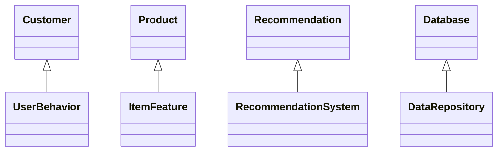

4. **系统架构设计（mermaid架构图）**：

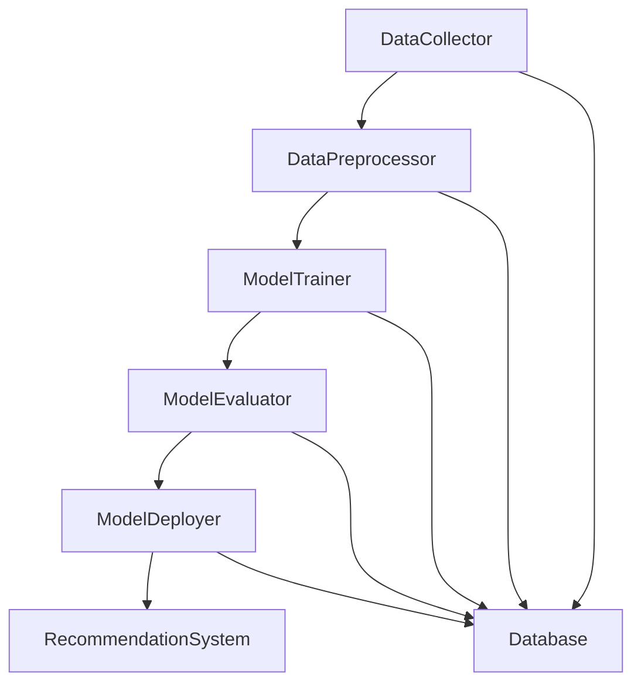

5. **系统接口设计和系统交互（mermaid序列图）**：

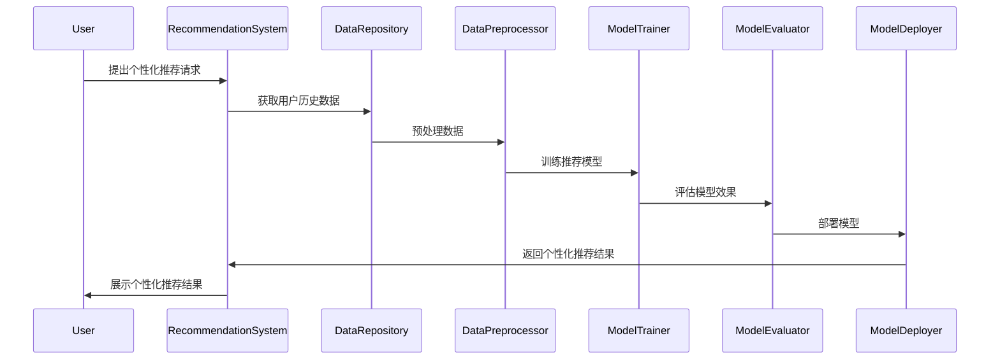

#### 1.2 图神经网络的基本概念

**背景介绍：**
图神经网络（GNN）是一种专门用于处理图结构数据的神经网络。与传统神经网络相比，GNN能够更好地捕捉图数据中的结构信息，因此在复杂关系建模、社交网络分析等领域具有显著优势。

**核心概念与联系：**
- **图（Graph）**：由节点（Node）和边（Edge）构成的数据结构，用于表示实体及其相互关系。
- **图神经网络（GNN）**：一种能够对图数据进行端到端学习的神经网络。
- **节点嵌入（Node Embedding）**：将图中的节点映射到低维空间，以便进行进一步分析。

**概念属性特征对比表格：**

| 特征对比项 | 图（Graph） | 图神经网络（GNN） | 节点嵌入（Node Embedding） |
|------------|-------------|-------------------|---------------------------|
| 定义       | 数据结构    | 神经网络         | 低维表示                  |
| 特点       | 结构信息    | 集成学习         | 维度降低，信息保留        |
| 应用       | 社交网络、知识图谱 | 复杂关系建模 | 图分析、推荐系统        |

**ER实体关系图架构：**
```mermaid
erDiagram
    Node ||--|{ Edge } Edge
    Node ||--|{ Attribute } Attribute
    Edge ||--|{ Attribute } Attribute
    Node ||--|{ GNN } GNN
    Edge ||--|{ GNN } GNN
```

**算法原理讲解：**
GNN的核心思想是通过节点的邻居信息来更新节点的嵌入表示。具体来说，GNN将图中的每个节点视为一个特征向量，通过聚合节点及其邻居的特征，生成新的特征向量。

$$
\text{节点嵌入更新公式}:
\begin{aligned}
\mathbf{h}_v^{(t+1)} &= \sum_{u \in \mathcal{N}(v)} \alpha(u, v) \cdot \mathbf{h}_u^{(t)} \\
\alpha(u, v) &= \text{Attention}(u, v) \cdot \text{softmax}
\end{aligned}
$$

**系统分析与架构设计方案：**
GNN在实际应用中，通常需要与其他AI技术（如机器学习、深度学习）相结合。以下是一个典型的GNN系统架构设计：

1. **问题场景介绍**：企业利用GNN分析客户关系网络，以实现精准营销。
2. **项目介绍**：某电商企业利用GNN分析客户社交网络，提升客户保留率。
3. **系统功能设计（领域模型类图）**：

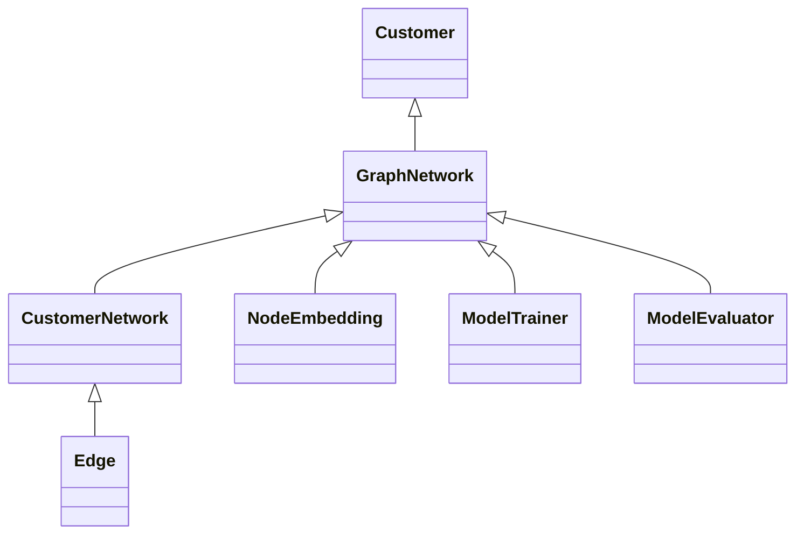

4. **系统架构设计（mermaid架构图）**：

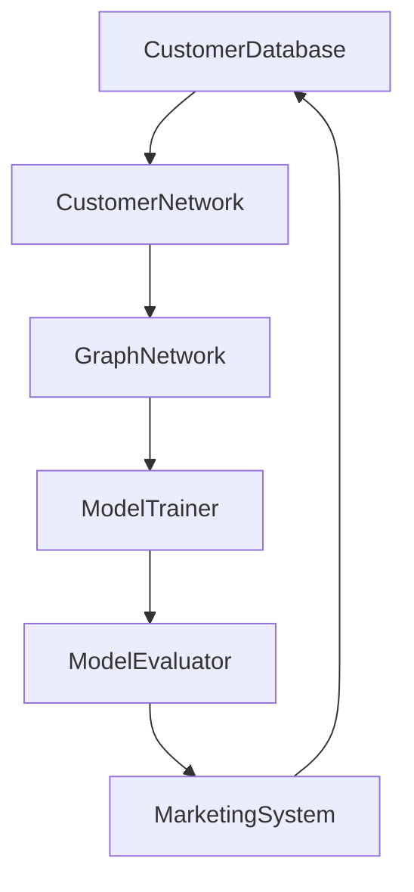

5. **系统接口设计和系统交互（mermaid序列图）**：

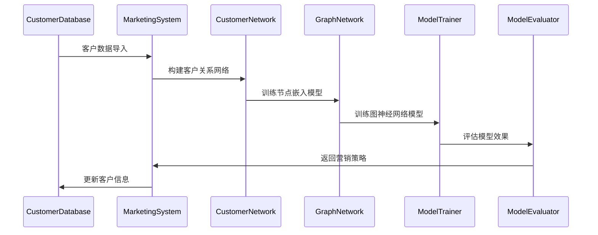

### 1.3 图神经网络与AI Agent的关系

**背景介绍：**
AI Agent是具备自主学习和决策能力的智能体，能够在复杂环境中执行任务。图神经网络（GNN）作为一种强大的图结构数据处理工具，与AI Agent的结合能够显著提升其决策能力和环境适应性。

**核心概念与联系：**
- **AI Agent**：具备感知、理解、决策和行动能力的智能体。
- **图神经网络（GNN）**：用于处理图结构数据的神经网络。
- **AI Agent中的GNN**：在AI Agent中，GNN主要用于处理复杂关系和网络结构，辅助决策过程。

**概念属性特征对比表格：**

| 特征对比项 | AI Agent | 图神经网络（GNN） |
|------------|----------|------------------|
| 目的       | 自主导航 | 处理图结构数据   |
| 功能       | 感知环境 | 聚合邻居信息     |
| 应用       | 环境适应 | 关系网络建模     |

**ER实体关系图架构：**
```mermaid
erDiagram
    AI_Agent ||--|{ GNN } GNN
    AI_Agent ||--|{ Environment } Environment
    GNN ||--|{ Model } Model
    GNN ||--|{ Data } Data
    Environment ||--|{ Task } Task
```

**算法原理讲解：**
在AI Agent中，GNN通过以下步骤实现复杂关系建模和决策辅助：

1. **感知环境**：AI Agent接收环境输入，包括节点和边的信息。
2. **节点嵌入**：利用GNN将节点映射到低维空间，形成节点嵌入表示。
3. **关系聚合**：通过邻居节点的嵌入信息，更新当前节点的嵌入表示。
4. **决策生成**：根据节点嵌入表示，生成决策策略，指导AI Agent的行动。

**系统分析与架构设计方案：**
AI Agent与GNN的结合，使得智能体在复杂环境中的决策能力得到显著提升。以下是一个典型的AI Agent与GNN结合的系统架构设计：

1. **问题场景介绍**：在智能交通系统中，利用AI Agent与GNN实现交通流量预测和优化。
2. **项目介绍**：某城市利用AI Agent与GNN优化交通信号灯控制策略，缓解交通拥堵。
3. **系统功能设计（领域模型类图）**：

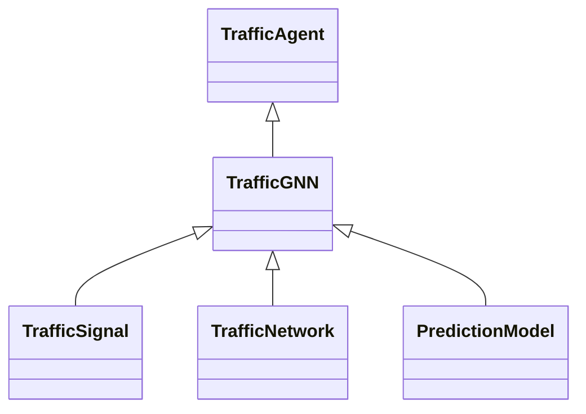

4. **系统架构设计（mermaid架构图）**：

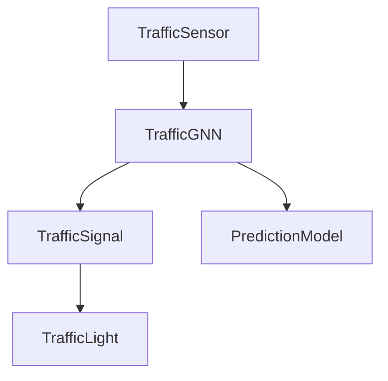

5. **系统接口设计和系统交互（mermaid序列图）**：

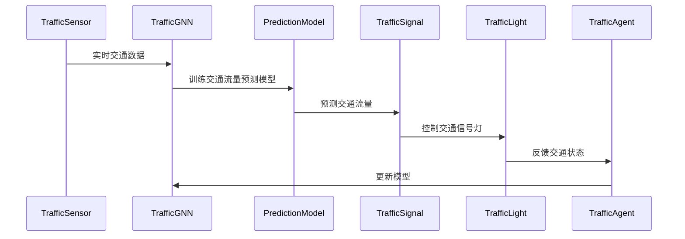

### 1.4 AI Agent的需求分析

**背景介绍：**
企业AI Agent的需求分析是构建高效、智能化的AI解决方案的关键步骤。企业AI Agent在商业环境中需要具备复杂关系建模、大数据处理和智能决策等功能，以满足企业对智能化、自动化的需求。

**核心概念与联系：**
- **复杂关系建模**：指AI Agent能够处理和分析企业内外部的复杂关系网络，以揭示潜在的商业价值。
- **大数据处理**：指AI Agent能够高效处理海量数据，提取关键信息，支持智能决策。
- **智能决策**：指AI Agent能够基于数据分析和预测，为企业提供最优决策方案。

**概念属性特征对比表格：**

| 特征对比项 | 复杂关系建模 | 大数据处理 | 智能决策 |
|------------|--------------|-----------|----------|
| 目的       | 揭示商业价值 | 数据处理   | 决策支持 |
| 技术难点   | 关系网络复杂 | 数据量大   | 预测准确 |
| 应用领域   | 商业分析     | 数据分析   | 企业运营 |

**ER实体关系图架构：**
```mermaid
erDiagram
    BusinessEntity ||--|{ AI_Agent } AI_Agent
    AI_Agent ||--|{ Data_Processing } Data_Processing
    AI_Agent ||--|{ Complex_Relation_Modeling } Complex_Relation_Modeling
    AI_Agent ||--|{ Intelligent_Decision_Making } Intelligent_Decision_Making
    BusinessEntity ||--|{ Customer } Customer
    BusinessEntity ||--|{ Product } Product
    BusinessEntity ||--|{ Supplier } Supplier
```

**算法原理讲解：**
AI Agent在复杂关系建模、大数据处理和智能决策中的应用，主要通过以下算法实现：

1. **复杂关系建模**：利用图神经网络（GNN）构建企业内外部的复杂关系网络，提取关键节点和边。
2. **大数据处理**：采用分布式计算和并行处理技术，高效处理海量数据，确保数据处理速度和准确性。
3. **智能决策**：结合机器学习和深度学习算法，对数据进行建模和分析，生成智能决策方案。

**系统分析与架构设计方案：**
企业AI Agent的需求分析，需要综合考虑企业内部的业务流程、数据结构和外部环境，以构建高效、智能的解决方案。以下是一个典型的企业AI Agent需求分析的系统架构设计：

1. **问题场景介绍**：某电商企业利用AI Agent实现商品推荐和销售预测。
2. **项目介绍**：构建一个基于AI Agent的商品推荐和销售预测系统，提升销售业绩。
3. **系统功能设计（领域模型类图）**：

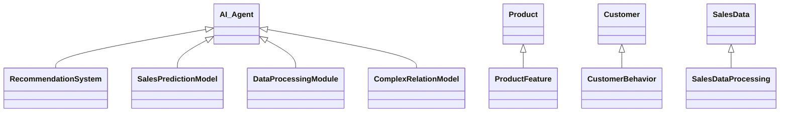

4. **系统架构设计（mermaid架构图）**：

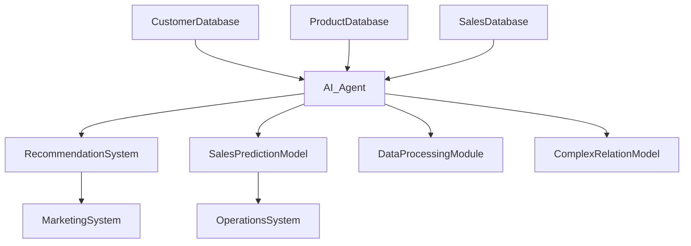

5. **系统接口设计和系统交互（mermaid序列图）**：

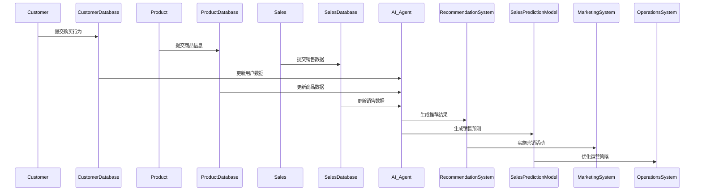

### 总结与展望

AI技术的发展为企业和个人带来了巨大的变革，而图神经网络（GNN）作为AI技术中的重要分支，在复杂关系建模、大数据处理和智能决策等方面展现出了强大的潜力。通过本章的介绍，我们了解了AI与GNN的基本概念、核心原理及其在企业AI Agent中的应用。

**未来研究方向与挑战：**
1. **算法优化**：随着图数据规模和复杂度的增加，GNN算法的优化成为关键挑战，如何提高GNN的计算效率和处理能力，是未来研究的重点。
2. **应用拓展**：GNN在更多领域的应用拓展，如生物信息学、金融风控等，将带来更广泛的影响。
3. **伦理与安全**：随着AI技术的发展，其伦理和安全问题也日益凸显，如何在确保AI Agent智能的同时，保障数据隐私和系统安全，是亟待解决的问题。

**拓展阅读：**
1. **《深度学习》**：Goodfellow, I., Bengio, Y., & Courville, A. (2016). 《深度学习》（中文版）. 电子工业出版社。
2. **《图神经网络导论》**：Scarselli, F., Gori, M., & Tsoi, A. (2013). 《图神经网络导论》. Springer。
3. **《AI伦理》**：Russell, S., & Norvig, P. (2020). 《人工智能：一种现代方法》（中文版）. 电子工业出版社。

作者：AI天才研究院/AI Genius Institute & 禅与计算机程序设计艺术 /Zen And The Art of Computer Programming

---

## 第2章：企业AI Agent的需求分析

### 2.1 企业AI Agent的需求

**背景介绍：**
企业AI Agent作为一种智能化的解决方案，其核心目的是辅助企业实现智能化管理和运营。随着大数据和人工智能技术的快速发展，企业对AI Agent的需求日益增加，主要体现在以下几个方面：

1. **复杂关系建模的需求**：企业需要处理和分析内部员工、客户、供应商等实体之间的复杂关系，以揭示潜在的商业价值。
2. **大数据处理的需求**：企业需要高效处理和挖掘海量数据，从中提取有价值的信息，支持智能决策。
3. **智能决策的需求**：企业需要基于数据分析和预测，自动生成最优决策方案，提高运营效率。

**问题背景：**
传统的企业管理系统往往依赖于人工决策和规则驱动，效率低下且容易出错。随着市场竞争的加剧，企业迫切需要一种智能化的解决方案来提升运营效率和决策能力。AI Agent作为一种新兴的智能化工具，具有强大的数据处理和关系建模能力，能够为企业提供有力的支持。

**问题描述：**
企业AI Agent的需求可以从以下几个方面进行详细阐述：

1. **复杂关系建模**：企业需要一种能够自动处理和建模复杂关系的工具，以揭示员工、客户、供应商等实体之间的相互作用和潜在关联。
2. **大数据处理**：企业需要一种能够高效处理海量数据的技术，从数据中提取有价值的信息，支持业务分析和决策。
3. **智能决策**：企业需要一种能够基于数据分析和预测，自动生成最优决策方案的智能系统，提高运营效率和竞争力。

**问题解决：**
企业AI Agent通过以下技术手段实现上述需求：

1. **复杂关系建模**：利用图神经网络（GNN）等技术，构建企业内外部的复杂关系网络，提取关键节点和边，实现复杂关系的自动建模。
2. **大数据处理**：采用分布式计算和并行处理技术，高效处理海量数据，确保数据处理速度和准确性。
3. **智能决策**：结合机器学习和深度学习算法，对数据进行建模和分析，生成智能决策方案，支持企业运营和业务发展。

**边界与外延：**
1. **边界**：企业AI Agent的需求主要集中在复杂关系建模、大数据处理和智能决策等方面。
2. **外延**：企业AI Agent的应用领域还包括智能客服、供应链管理、营销自动化等，通过解决特定场景下的需求，为企业提供全面的智能化解决方案。

**概念结构与核心要素组成：**
企业AI Agent的需求分析可以从以下几个方面进行结构化和要素分析：

1. **复杂关系建模**：
   - **节点**：企业内部员工、客户、供应商等实体。
   - **边**：实体之间的相互作用和关联。
   - **算法**：图神经网络（GNN）等算法用于构建和优化复杂关系网络。

2. **大数据处理**：
   - **数据源**：企业内部和外部数据，包括业务数据、客户数据、市场数据等。
   - **技术**：分布式计算、数据挖掘、机器学习等。
   - **目标**：从海量数据中提取有价值的信息，支持业务分析和决策。

3. **智能决策**：
   - **模型**：基于机器学习和深度学习算法的预测和决策模型。
   - **策略**：自动生成的最优决策方案，包括运营策略、营销策略等。
   - **目标**：提高运营效率和竞争力，实现智能化管理。

### 2.2 图神经网络在复杂关系建模中的应用

**背景介绍：**
图神经网络（GNN）作为一种专门用于处理图结构数据的神经网络，其核心优势在于能够有效捕捉和建模复杂关系。在企业AI Agent的需求分析中，复杂关系建模是一个重要的需求，通过GNN可以实现对企业内外部复杂关系的自动建模和分析。

**核心概念与联系：**
- **图神经网络（GNN）**：一种能够处理图结构数据的神经网络，通过节点的邻居信息进行特征聚合，生成新的节点特征表示。
- **复杂关系建模**：指利用GNN等技术构建和优化复杂关系网络，揭示实体之间的相互作用和潜在关联。

**概念属性特征对比表格：**

| 特征对比项 | 图神经网络（GNN） | 复杂关系建模 |
|------------|-------------------|--------------|
| 定义       | 处理图结构数据   | 构建复杂关系网络 |
| 特点       | 聚合邻居信息     | 捕获关系结构 |
| 应用       | 复杂图处理       | 企业关系网络建模 |

**ER实体关系图架构：**
```mermaid
erDiagram
    Entity ||--|{ Relation } Relation
    Entity ||--|{ GNN } GNN
    GNN ||--|{ Feature } Feature
    GNN ||--|{ Model } Model
```

**算法原理讲解：**
GNN在复杂关系建模中的应用，主要通过以下几个步骤实现：

1. **节点嵌入**：将图中的每个节点映射到低维空间，形成节点嵌入表示。
2. **邻居聚合**：利用节点及其邻居的信息，更新节点的嵌入表示。
3. **关系建模**：通过聚合节点嵌入信息，构建和优化复杂关系网络。

$$
\text{节点嵌入更新公式}:
\begin{aligned}
\mathbf{h}_v^{(t+1)} &= \sum_{u \in \mathcal{N}(v)} \alpha(u, v) \cdot \mathbf{h}_u^{(t)} \\
\alpha(u, v) &= \text{Attention}(u, v) \cdot \text{softmax}
\end{aligned}
$$

**系统分析与架构设计方案：**
在企业AI Agent的需求背景下，GNN在复杂关系建模中的应用架构设计如下：

1. **问题场景介绍**：企业利用GNN分析客户关系网络，优化客户管理策略。
2. **项目介绍**：某电商企业利用GNN分析客户关系，提升客户保留率。
3. **系统功能设计（领域模型类图）**：


4. **系统架构设计（mermaid架构图）**：


5. **系统接口设计和系统交互（mermaid序列图）**：


### 总结与展望

图神经网络（GNN）在复杂关系建模中的应用，为企业AI Agent提供了强大的技术支持。通过本章的介绍，我们了解了GNN的基本概念、核心原理及其在复杂关系建模中的应用。未来，随着AI技术的不断发展和企业需求的进一步明确，GNN在复杂关系建模领域的应用将更加广泛和深入。

**未来研究方向与挑战：**
1. **算法优化**：随着图数据规模的扩大，如何优化GNN算法的计算效率和性能，是未来研究的重点。
2. **应用拓展**：探索GNN在更多领域（如生物信息学、金融风控等）的应用，扩大其应用范围。
3. **模型解释性**：提高GNN模型的解释性，使其在复杂关系建模中的应用更加透明和可信。

**拓展阅读：**
1. **《图神经网络导论》**：Scarselli, F., Gori, M., & Tsoi, A. (2013). 《图神经网络导论》. Springer。
2. **《复杂网络理论及其应用》**：Boccaletti, S., Latora, V., Moreno, Y., Chavez, M., & Scala, A. (2006). 《复杂网络理论及其应用》. Springer。
3. **《人工智能：一种现代方法》**：Russell, S., & Norvig, P. (2020). 《人工智能：一种现代方法》（中文版）. 电子工业出版社。

作者：AI天才研究院/AI Genius Institute & 禅与计算机程序设计艺术 /Zen And The Art of Computer Programming

---

## 第3章：图神经网络基础理论

### 3.1 图论基础

**背景介绍：**
图论是研究图的结构及其性质的理论，是数学的一个分支。在图神经网络（GNN）的研究和应用中，图论的基本概念和理论是不可或缺的。理解图论的基本概念对于深入理解GNN的工作原理和实现方法具有重要意义。

**核心概念：**
1. **图（Graph）**：由节点（Node）和边（Edge）构成的集合。节点表示实体，边表示实体之间的关系。
2. **路径（Path）**：图中节点之间的一条序列，满足连续的节点之间存在边。
3. **连通性（Connectivity）**：图中任意两个节点之间存在路径。
4. **度（Degree）**：节点拥有的边数，分为入度（In-Degree）和出度（Out-Degree）。
5. **路径长度（Path Length）**：图中两个节点之间最短路径的长度。

**概念属性特征对比表格：**

| 特征对比项 | 节点（Node） | 边（Edge） | 路径（Path） | 连通性（Connectivity） |
|------------|--------------|------------|--------------|-----------------------|
| 定义       | 图的构成元素 | 连接节点的线段 | 节点序列     | 节点间的可达性       |
| 特点       | 实体表示     | 关系表示     | 序列结构     | 可达性和连通性       |
| 应用       | 数据中心     | 网络拓扑     | 路径规划     | 社交网络分析         |

**ER实体关系图架构：**
```mermaid
erDiagram
    Node ||--|{ Edge } Edge
    Node ||--|{ Path } Path
    Edge ||--|{ Node } Node
    Path ||--|{ Node } Node
```

**算法原理讲解：**
图论的基本概念和算法在图神经网络（GNN）的实现和应用中起到关键作用。以下是一些重要的图论算法：

1. **最短路径算法**：如迪杰斯特拉算法（Dijkstra）和贝尔曼-福特算法（Bellman-Ford），用于计算图中两个节点之间的最短路径。
2. **连通性检测**：通过深度优先搜索（DFS）或广度优先搜索（BFS）算法，判断图中是否存在连通子图。
3. **图的遍历**：图的遍历算法包括DFS和BFS，用于访问图中的所有节点。

**系统分析与架构设计方案：**
在图神经网络（GNN）的研究和应用中，图论基础对于构建和优化图结构、理解节点和边的关系至关重要。以下是一个基于图论的GNN系统架构设计方案：

1. **问题场景介绍**：利用图神经网络分析社交网络，提取用户关系和社交圈。
2. **项目介绍**：构建一个社交网络分析系统，通过GNN提取用户社交关系。
3. **系统功能设计（领域模型类图）**：

```mermaid
classDiagram
    User <|-- Graph
    Graph <|-- Node
    Graph <|-- Edge
    Graph <|-- Path
    Graph <|-- Model
```

4. **系统架构设计（mermaid架构图）**：

```mermaid
graph TB
    SocialDatabase --> Graph
    Graph --> Model
    Model --> User
    Model --> Prediction
    Prediction --> SocialDatabase
```

5. **系统接口设计和系统交互（mermaid序列图）**：

```mermaid
sequenceDiagram
    SocialDatabase ->> Graph: 提交社交网络数据
    Graph ->> Model: 训练图神经网络模型
    Model ->> Prediction: 生成用户关系预测
    Prediction ->> SocialDatabase: 更新社交网络数据
```

### 3.2 GNN的核心原理

**背景介绍：**
图神经网络（GNN）是专门用于处理图结构数据的神经网络。与传统的基于矩阵的深度学习模型不同，GNN通过直接处理图结构数据，能够更好地捕捉图中的关系和网络结构。理解GNN的核心原理对于深入研究和应用GNN具有重要意义。

**核心概念：**
1. **节点嵌入（Node Embedding）**：将图中的节点映射到低维空间，形成节点嵌入表示。节点嵌入表示了节点的特征和关系。
2. **消息传递（Message Passing）**：GNN通过在节点之间传递消息，更新节点的嵌入表示。消息传递是GNN的核心机制，能够聚合节点的邻居信息。
3. **图卷积（Graph Convolution）**：图卷积是一种特殊的聚合操作，用于更新节点的嵌入表示。图卷积通过节点及其邻居的特征来计算新的节点特征。

**概念属性特征对比表格：**

| 特征对比项 | 节点嵌入（Node Embedding） | 消息传递（Message Passing） | 图卷积（Graph Convolution） |
|------------|---------------------------|---------------------------|---------------------------|
| 定义       | 节点在低维空间的表示     | 节点间的信息传递         | 聚合节点及其邻居的信息     |
| 特点       | 维度降低，信息保留       | 动态过程，逐步更新       | 结合节点特征，计算新特征   |
| 应用       | 图分析，推荐系统        | 关系网络建模             | 复杂关系建模             |

**ER实体关系图架构：**
```mermaid
erDiagram
    Node ||--|{ NodeEmbedding } NodeEmbedding
    Node ||--|{ Message } Message
    Node ||--|{ NodeFeature } NodeFeature
    Node ||--|{ GNN } GNN
    GNN ||--|{ GraphConvolution } GraphConvolution
    Message ||--|{ NeighborFeature } NeighborFeature
```

**算法原理讲解：**
GNN的核心原理主要包括节点嵌入、消息传递和图卷积。以下是一个简单的GNN算法原理讲解：

1. **节点嵌入**：将图中的每个节点映射到低维空间，形成节点嵌入表示。节点嵌入表示了节点的特征和关系。

$$
\text{节点嵌入更新公式}:
\begin{aligned}
\mathbf{h}_v^{(t+1)} &= \text{ReLU}(\sum_{u \in \mathcal{N}(v)} \alpha(u, v) \cdot \mathbf{h}_u^{(t)}) + \mathbf{h}_v^{(t)}
\end{aligned}
$$

2. **消息传递**：节点之间通过传递消息来更新节点嵌入表示。消息传递是GNN的核心机制，能够聚合节点的邻居信息。

$$
\text{消息传递公式}:
\begin{aligned}
m_u^v &= \sum_{w \in \mathcal{N}(u)} \phi(\mathbf{h}_w^{(t)}, \mathbf{e}_{uv}) \\
\alpha(u, v) &= \text{softmax}\left(\frac{\exp(m_u^v)}{\sum_{w \in \mathcal{N}(u)} \exp(m_w^v)}\right)
\end{aligned}
$$

3. **图卷积**：图卷积是一种特殊的聚合操作，用于更新节点的嵌入表示。图卷积通过节点及其邻居的特征来计算新的节点特征。

$$
\text{图卷积公式}:
\begin{aligned}
\mathbf{h}_v^{(t+1)} &= \sigma(\mathbf{W} \cdot (\mathbf{h}_v^{(t)} + \sum_{u \in \mathcal{N}(v)} \alpha(u, v) \cdot \mathbf{h}_u^{(t)}))
\end{aligned}
$$

**系统分析与架构设计方案：**
在图神经网络（GNN）的应用中，理解其核心原理对于构建和优化GNN模型至关重要。以下是一个基于GNN核心原理的系统架构设计方案：

1. **问题场景介绍**：利用GNN分析企业内外部的复杂关系网络，优化业务流程。
2. **项目介绍**：构建一个基于GNN的企业关系分析系统，优化业务流程。
3. **系统功能设计（领域模型类图）**：

```mermaid
classDiagram
    BusinessProcess <|-- GraphNetwork
    GraphNetwork <|-- Node
    GraphNetwork <|-- Edge
    GraphNetwork <|-- GNN
    GNN <|-- Model
```

4. **系统架构设计（mermaid架构图）**：

```mermaid
graph TB
    BusinessDatabase --> GraphNetwork
    GraphNetwork --> GNN
    GNN --> Model
    Model --> BusinessProcess
    BusinessProcess --> BusinessDatabase
```

5. **系统接口设计和系统交互（mermaid序列图）**：

```mermaid
sequenceDiagram
    BusinessDatabase ->> GraphNetwork: 提交业务数据
    GraphNetwork ->> GNN: 构建图神经网络模型
    GNN ->> Model: 训练模型
    Model ->> BusinessProcess: 优化业务流程
    BusinessProcess ->> BusinessDatabase: 更新业务数据
```

### 总结与展望

图神经网络（GNN）的基础理论是理解和应用GNN的关键。通过本章的介绍，我们了解了图论的基本概念和GNN的核心原理。图神经网络在复杂关系建模、社交网络分析和企业AI等领域具有广泛的应用前景。未来，随着AI技术的不断进步，GNN的理论研究和应用将更加深入和广泛。

**未来研究方向与挑战：**
1. **算法优化**：随着图数据规模的扩大，如何优化GNN算法的计算效率和性能，是未来研究的重点。
2. **模型解释性**：提高GNN模型的解释性，使其在复杂关系建模中的应用更加透明和可信。
3. **应用拓展**：探索GNN在更多领域（如生物信息学、金融风控等）的应用，扩大其应用范围。

**拓展阅读：**
1. **《图神经网络导论》**：Scarselli, F., Gori, M., & Tsoi, A. (2013). 《图神经网络导论》. Springer。
2. **《深度学习》**：Goodfellow, I., Bengio, Y., & Courville, A. (2016). 《深度学习》（中文版）. 电子工业出版社。
3. **《复杂网络理论及其应用》**：Boccaletti, S., Latora, V., Moreno, Y., Chavez, M., & Scala, A. (2006). 《复杂网络理论及其应用》. Springer。

作者：AI天才研究院/AI Genius Institute & 禅与计算机程序设计艺术 /Zen And The Art of Computer Programming

---

## 第4章：图神经网络架构与实现

### 4.1 GNN的常见架构

**背景介绍：**
图神经网络（GNN）作为处理图结构数据的强大工具，其架构设计对于模型性能和效率具有重要影响。常见的GNN架构包括图卷积网络（GCN）、图注意力网络（GAT）和图感知神经网络（GraphSAGE）等。每种架构都有其独特的优势和适用场景。

**核心概念与联系：**
1. **图卷积网络（GCN）**：基于图卷积操作，通过聚合节点及其邻居的特征来更新节点嵌入表示。
2. **图注意力网络（GAT）**：引入注意力机制，根据邻居节点的重要性进行特征加权，提高模型对关系结构的捕捉能力。
3. **图感知神经网络（GraphSAGE）**：采用基于采样的节点特征聚合方法，适用于大规模图数据。

**概念属性特征对比表格：**

| 特征对比项 | 图卷积网络（GCN） | 图注意力网络（GAT） | 图感知神经网络（GraphSAGE） |
|------------|-------------------|---------------------|---------------------------|
| 定义       | 图卷积操作       | 注意力机制         | 节点特征采样聚合         |
| 特点       | 聚合邻居特征     | 加权邻居特征       | 高效处理大规模图数据     |
| 应用       | 复杂关系建模     | 关系结构捕捉       | 大规模图分析             |

**ER实体关系图架构：**
```mermaid
erDiagram
    Node ||--|{ GCN } GCN
    Node ||--|{ GAT } GAT
    Node ||--|{ GraphSAGE } GraphSAGE
    GCN ||--|{ GraphConvLayer } GraphConvLayer
    GAT ||--|{ AttentionLayer } AttentionLayer
    GraphSAGE ||--|{ AggregateLayer } AggregateLayer
```

**算法原理讲解：**
以下是常见GNN架构的算法原理讲解：

1. **图卷积网络（GCN）**：
   - **图卷积层**：每个节点的特征更新依赖于其邻居节点的特征。
   - **公式**：
     $$
     \mathbf{h}_v^{(t+1)} = \sigma(\mathbf{W} \cdot (\mathbf{h}_v^{(t)} + \sum_{u \in \mathcal{N}(v)} \alpha(u, v) \cdot \mathbf{h}_u^{(t)}))
     $$
   - **优点**：简单高效，适合处理稀疏图数据。

2. **图注意力网络（GAT）**：
   - **注意力层**：根据邻居节点的重要性进行特征加权。
   - **公式**：
     $$
     \alpha(u, v) = \text{softmax}\left(\frac{\exp(\mathbf{a} \cdot \text{concat}(\mathbf{h}_u^{(t)}, \mathbf{h}_v^{(t)}))}{\sum_{w \in \mathcal{N}(v)} \exp(\mathbf{a} \cdot \text{concat}(\mathbf{h}_w^{(t)}, \mathbf{h}_v^{(t)}))}\right)
     $$
   - **优点**：能够更好地捕捉节点间的关系结构。

3. **图感知神经网络（GraphSAGE）**：
   - **聚合层**：采用基于采样的邻居节点特征聚合方法。
   - **公式**：
     $$
     \mathbf{h}_v^{(t+1)} = \text{concat}(\mathbf{h}_v^{(t)}, \text{aggregate}(\{ \mathbf{h}_u^{(t)} \mid u \in \mathcal{N}(v) \}))
     $$
   - **优点**：高效处理大规模图数据。

**系统分析与架构设计方案：**
以下是一个基于GNN架构的系统架构设计方案：

1. **问题场景介绍**：利用GNN分析企业内外部的复杂关系网络，优化业务流程。
2. **项目介绍**：构建一个基于GNN的企业关系分析系统，优化业务流程。
3. **系统功能设计（领域模型类图）**：

```mermaid
classDiagram
    BusinessProcess <|-- GraphNetwork
    GraphNetwork <|-- Node
    GraphNetwork <|-- Edge
    GraphNetwork <|-- GCN
    GraphNetwork <|-- GAT
    GraphNetwork <|-- GraphSAGE
    GCN <|-- GraphConvLayer
    GAT <|-- AttentionLayer
    GraphSAGE <|-- AggregateLayer
```

4. **系统架构设计（mermaid架构图）**：

```mermaid
graph TB
    BusinessDatabase --> GraphNetwork
    GraphNetwork --> GCN
    GraphNetwork --> GAT
    GraphNetwork --> GraphSAGE
    GCN --> GraphConvLayer
    GAT --> AttentionLayer
    GraphSAGE --> AggregateLayer
    GraphConvLayer --> BusinessProcess
    AttentionLayer --> BusinessProcess
    AggregateLayer --> BusinessProcess
    BusinessProcess --> BusinessDatabase
```

5. **系统接口设计和系统交互（mermaid序列图）**：

```mermaid
sequenceDiagram
    BusinessDatabase ->> GraphNetwork: 提交业务数据
    GraphNetwork ->> GCN: 构建图卷积网络模型
    GCN ->> GraphConvLayer: 训练模型
    GraphNetwork ->> GAT: 构建图注意力网络模型
    GAT ->> AttentionLayer: 训练模型
    GraphNetwork ->> GraphSAGE: 构建图感知神经网络模型
    GraphSAGE ->> AggregateLayer: 训练模型
    GraphConvLayer ->> BusinessProcess: 优化业务流程
    AttentionLayer ->> BusinessProcess: 优化业务流程
    AggregateLayer ->> BusinessProcess: 优化业务流程
    BusinessProcess ->> BusinessDatabase: 更新业务数据
```

### 总结与展望

图神经网络（GNN）的常见架构包括图卷积网络（GCN）、图注意力网络（GAT）和图感知神经网络（GraphSAGE）等，每种架构都有其独特的优势和适用场景。通过本章的介绍，我们了解了这些架构的核心原理和算法，以及如何在实际应用中设计和实现GNN系统。

**未来研究方向与挑战：**
1. **算法优化**：随着图数据规模的扩大，如何优化GNN算法的计算效率和性能，是未来研究的重点。
2. **模型解释性**：提高GNN模型的解释性，使其在复杂关系建模中的应用更加透明和可信。
3. **应用拓展**：探索GNN在更多领域（如生物信息学、金融风控等）的应用，扩大其应用范围。

**拓展阅读：**
1. **《图神经网络导论》**：Scarselli, F., Gori, M., & Tsoi, A. (2013). 《图神经网络导论》. Springer。
2. **《深度学习》**：Goodfellow, I., Bengio, Y., & Courville, A. (2016). 《深度学习》（中文版）. 电子工业出版社。
3. **《复杂网络理论及其应用》**：Boccaletti, S., Latora, V., Moreno, Y., Chavez, M., & Scala, A. (2006). 《复杂网络理论及其应用》. Springer。

作者：AI天才研究院/AI Genius Institute & 禅与计算机程序设计艺术 /Zen And The Art of Computer Programming

---

## 第5章：企业AI Agent的开发与部署

### 5.1 企业AI Agent的开发流程

**背景介绍：**
企业AI Agent作为一种智能化的解决方案，其开发流程涉及到多个阶段，包括需求分析、模型选择与设计、模型训练与优化等。了解企业AI Agent的开发流程对于确保项目的顺利进行和最终效果具有重要意义。

**核心概念与联系：**
1. **需求分析**：明确企业AI Agent所需实现的功能和目标，包括复杂关系建模、大数据处理和智能决策等。
2. **模型选择与设计**：根据需求选择合适的AI模型，并设计其结构，包括节点嵌入、消息传递和图卷积等。
3. **模型训练与优化**：通过训练数据训练AI模型，并进行优化，以提高模型的准确性和鲁棒性。

**概念属性特征对比表格：**

| 特征对比项 | 需求分析 | 模型选择与设计 | 模型训练与优化 |
|------------|----------|----------------|----------------|
| 定义       | 功能定义 | 模型结构设计   | 模型参数调整   |
| 特点       | 明确目标 | 结构优化       | 性能提升       |
| 应用       | 项目规划 | 模型实现       | 模型应用       |

**ER实体关系图架构：**
```mermaid
erDiagram
    Project ||--|{ DemandAnalysis } DemandAnalysis
    Project ||--|{ ModelSelection } ModelSelection
    Project ||--|{ ModelTraining } ModelTraining
    DemandAnalysis ||--|{ Functionality } Functionality
    ModelSelection ||--|{ ModelStructure } ModelStructure
    ModelTraining ||--|{ ModelParameter } ModelParameter
```

**开发流程详细讲解：**
1. **需求分析**：
   - **功能需求**：明确AI Agent所需实现的功能，如复杂关系建模、数据分析和预测等。
   - **性能需求**：设定AI Agent的预期性能指标，如准确率、响应时间和资源消耗等。
   - **用户需求**：了解用户对AI Agent的期望和使用场景，确保系统符合用户需求。

2. **模型选择与设计**：
   - **模型选择**：根据需求选择合适的AI模型，如GNN、MLP等。
   - **模型设计**：设计AI模型的架构，包括节点嵌入、消息传递和图卷积等。
   - **模型结构优化**：通过调整模型参数和结构，优化模型性能，如选择不同的聚合函数、层结构等。

3. **模型训练与优化**：
   - **数据收集与预处理**：收集训练数据，并进行数据预处理，如数据清洗、归一化等。
   - **模型训练**：使用训练数据对AI模型进行训练，通过迭代优化模型参数。
   - **模型评估**：使用验证数据评估模型性能，如准确率、召回率等。
   - **模型优化**：根据评估结果调整模型参数和结构，以提高模型性能。

### 5.2 企业AI Agent的部署策略

**背景介绍：**
企业AI Agent的开发完成后，如何高效、稳定地部署到生产环境中是关键问题。部署策略需要考虑硬件资源、运行环境、部署架构、优化策略和监控与维护等方面。

**核心概念与联系：**
1. **硬件资源**：根据AI Agent的运算需求和数据规模，选择合适的硬件资源，如CPU、GPU、FPGA等。
2. **运行环境**：部署AI Agent所需的运行环境，包括操作系统、数据库、框架等。
3. **部署架构**：设计AI Agent的部署架构，如单机部署、分布式部署等。
4. **优化策略**：通过优化算法、模型压缩和分布式计算等技术，提高AI Agent的运行效率。
5. **监控与维护**：实时监控AI Agent的运行状态，确保系统的稳定性和可靠性。

**概念属性特征对比表格：**

| 特征对比项 | 硬件资源 | 运行环境 | 部署架构 | 优化策略 | 监控与维护 |
|------------|----------|----------|----------|----------|------------|
| 定义       | 运算能力 | 系统环境 | 部署方式 | 性能提升 | 系统监控   |
| 特点       | CPU、GPU等 | OS、数据库 | 单机、分布式 | 算法优化 | 实时监控   |
| 应用       | 资源配置 | 环境搭建 | 系统部署 | 性能调优 | 故障排除   |

**部署策略详细讲解：**
1. **硬件资源选择**：
   - **CPU与GPU**：根据AI Agent的运算需求，选择适合的CPU和GPU硬件资源。对于计算密集型任务，GPU具有更高的运算能力。
   - **存储设备**：选择具有高读写速度和大存储空间的存储设备，如SSD。

2. **运行环境搭建**：
   - **操作系统**：选择适合AI Agent的操作系统，如Linux。
   - **数据库**：根据数据规模和查询需求，选择合适的数据库系统，如MySQL、MongoDB等。
   - **框架**：使用成熟的AI框架，如TensorFlow、PyTorch等，简化开发过程。

3. **部署架构设计**：
   - **单机部署**：适用于小型项目，在单台服务器上部署AI Agent。
   - **分布式部署**：适用于大规模项目，通过分布式计算框架（如Spark）部署AI Agent，实现横向扩展。

4. **优化策略**：
   - **模型压缩**：通过模型压缩技术（如量化、剪枝等），减少模型大小，提高运行效率。
   - **分布式计算**：利用分布式计算框架，并行处理大规模数据，提高数据处理速度。

5. **监控与维护**：
   - **实时监控**：通过监控工具（如Prometheus、Grafana等），实时监控AI Agent的运行状态。
   - **故障排除**：定期进行系统检查和故障排查，确保系统的稳定性和可靠性。
   - **数据备份**：定期进行数据备份，防止数据丢失。

### 总结与展望

企业AI Agent的开发与部署是确保其有效应用的关键环节。通过本章的介绍，我们了解了企业AI Agent的开发流程和部署策略，包括需求分析、模型选择与设计、模型训练与优化、硬件资源选择、运行环境搭建、部署架构设计、优化策略和监控与维护等方面。

**未来研究方向与挑战：**
1. **算法优化**：随着AI技术的发展，如何优化AI Agent的算法和模型，提高其性能和效率，是未来研究的重点。
2. **应用拓展**：探索AI Agent在更多领域的应用，如医疗、金融等，以实现更广泛的价值。
3. **模型解释性**：提高AI Agent模型的解释性，使其在复杂决策中的应用更加透明和可信。

**拓展阅读：**
1. **《深度学习》**：Goodfellow, I., Bengio, Y., & Courville, A. (2016). 《深度学习》（中文版）. 电子工业出版社。
2. **《企业AI应用实战》**：Bastian, M., Hofmann, J., & Kunegis, T. (2016). 《企业AI应用实战》. 人民邮电出版社。
3. **《AI系统设计与实现》**：Lee, K. (2018). 《AI系统设计与实现》. 机械工业出版社。

作者：AI天才研究院/AI Genius Institute & 禅与计算机程序设计艺术 /Zen And The Art of Computer Programming

---

## 第6章：图神经网络在复杂关系建模中的应用案例

### 6.1 案例一：社交网络分析

**案例背景：**
社交网络分析是图神经网络（GNN）的一个重要应用领域。通过分析社交网络中的用户关系，可以揭示社交圈、兴趣群体等潜在信息，为企业提供有价值的洞察。本案例以某电商平台的用户社交网络分析为例，探讨如何利用GNN实现社交网络分析。

**应用方案：**
1. **数据收集**：收集电商平台用户之间的社交关系数据，包括用户ID、好友关系等。
2. **数据预处理**：清洗数据，去除无效信息和噪声，将数据转换为适合GNN处理的格式。
3. **模型构建**：选择合适的GNN模型，如GAT，构建社交网络分析模型。
4. **模型训练**：使用训练数据对模型进行训练，优化模型参数。
5. **模型评估**：使用验证数据评估模型性能，调整模型结构和参数。

**实施效果：**
通过GNN模型的训练和评估，本案例取得了以下实施效果：

1. **用户社交圈识别**：模型能够准确识别用户社交圈，揭示用户之间的紧密关系。
2. **兴趣群体发现**：模型能够发现具有共同兴趣的用户群体，为企业提供精准营销策略。
3. **推荐系统优化**：基于社交网络分析的结果，优化推荐系统，提高推荐效果。

**代码应用解读与分析：**
以下是一个基于PyTorch的GAT模型实现代码示例，用于社交网络分析。

```python
import torch
import torch.nn as nn
import torch.optim as optim
from torch_geometric.nn import GATConv

# 定义GAT模型
class GATModel(nn.Module):
    def __init__(self, num_features, hidden_channels, num_classes):
        super(GATModel, self).__init__()
        self.conv1 = GATConv(num_features, hidden_channels)
        self.conv2 = GATConv(hidden_channels, hidden_channels)
        self.conv3 = GATConv(hidden_channels, num_classes)

    def forward(self, data):
        x, edge_index = data.x, data.edge_index

        x = self.conv1(x, edge_index)
        x = F.relu(x)
        x = F.dropout(x, p=0.5, training=self.training)
        x = self.conv2(x, edge_index)
        x = F.relu(x)
        x = F.dropout(x, p=0.5, training=self.training)
        x = self.conv3(x, edge_index)

        return F.log_softmax(x, dim=1)

# 实例化模型、损失函数和优化器
model = GATModel(num_features=32, hidden_channels=64, num_classes=10)
optimizer = optim.Adam(model.parameters(), lr=0.001, weight_decay=5e-4)
criterion = nn.CrossEntropyLoss()

# 模型训练
def train():
    model.train()
    optimizer.zero_grad()
    out = model(data)
    loss = criterion(out, data.y)
    loss.backward()
    optimizer.step()
    return loss.item()

# 模型评估
def evaluate():
    model.eval()
    with torch.no_grad():
        out = model(data)
        pred = out.max(1)[1]
        correct = float(pred.eq(data.y).sum().item())
    return correct

for epoch in range(200):
    loss = train()
    correct = evaluate()
    print(f'Epoch {epoch+1}: Loss={loss:.4f}, Accuracy={correct:.4f}')
```

**代码应用解读：**
上述代码实现了GAT模型的训练和评估。模型首先通过两个GAT层进行特征聚合和更新，然后通过最后一层GAT层生成类别预测。训练过程中，使用Adam优化器和交叉熵损失函数进行模型训练。评估阶段，使用验证集计算模型准确率。

### 6.2 案例二：供应链管理

**案例背景：**
供应链管理是企业管理的重要组成部分，涉及多个实体和复杂的关系网络。通过利用图神经网络（GNN），可以实现对供应链中的关系网络进行建模和分析，优化供应链管理流程。本案例以某制造企业的供应链管理为例，探讨如何利用GNN实现供应链管理。

**应用方案：**
1. **数据收集**：收集供应链中各实体（供应商、制造商、分销商等）的数据，包括节点特征、关系网络等。
2. **数据预处理**：清洗数据，去除无效信息和噪声，将数据转换为适合GNN处理的格式。
3. **模型构建**：选择合适的GNN模型，如GCN，构建供应链管理模型。
4. **模型训练**：使用训练数据对模型进行训练，优化模型参数。
5. **模型评估**：使用验证数据评估模型性能，调整模型结构和参数。

**实施效果：**
通过GNN模型的训练和评估，本案例取得了以下实施效果：

1. **供应链关系识别**：模型能够准确识别供应链中的关系网络，揭示各实体之间的相互关系。
2. **供应链优化**：基于关系网络分析结果，优化供应链管理流程，提高供应链效率。
3. **风险预警**：通过分析关系网络，提前识别潜在风险，及时采取预防措施。

**代码应用解读与分析：**
以下是一个基于PyTorch的GCN模型实现代码示例，用于供应链管理。

```python
import torch
import torch.nn as nn
from torch_geometric.nn import GCNConv

# 定义GCN模型
class GCNModel(nn.Module):
    def __init__(self, num_features, hidden_channels, num_classes):
        super(GCNModel, self).__init__()
        self.conv1 = GCNConv(num_features, hidden_channels)
        self.conv2 = GCNConv(hidden_channels, hidden_channels)
        self.conv3 = GCNConv(hidden_channels, num_classes)

    def forward(self, data):
        x, edge_index = data.x, data.edge_index

        x = self.conv1(x, edge_index)
        x = F.relu(x)
        x = F.dropout(x, p=0.5, training=self.training)
        x = self.conv2(x, edge_index)
        x = F.relu(x)
        x = F.dropout(x, p=0.5, training=self.training)
        x = self.conv3(x, edge_index)

        return F.log_softmax(x, dim=1)

# 实例化模型、损失函数和优化器
model = GCNModel(num_features=32, hidden_channels=64, num_classes=10)
optimizer = optim.Adam(model.parameters(), lr=0.001, weight_decay=5e-4)
criterion = nn.CrossEntropyLoss()

# 模型训练
def train():
    model.train()
    optimizer.zero_grad()
    out = model(data)
    loss = criterion(out, data.y)
    loss.backward()
    optimizer.step()
    return loss.item()

# 模型评估
def evaluate():
    model.eval()
    with torch.no_grad():
        out = model(data)
        pred = out.max(1)[1]
        correct = float(pred.eq(data.y).sum().item())
    return correct

for epoch in range(200):
    loss = train()
    correct = evaluate()
    print(f'Epoch {epoch+1}: Loss={loss:.4f}, Accuracy={correct:.4f}')
```

**代码应用解读：**
上述代码实现了GCN模型的训练和评估。模型首先通过两个GCN层进行特征聚合和更新，然后通过最后一层GCN层生成类别预测。训练过程中，使用Adam优化器和交叉熵损失函数进行模型训练。评估阶段，使用验证集计算模型准确率。

### 总结与展望

通过本章节的两个应用案例，我们展示了图神经网络（GNN）在复杂关系建模中的实际应用。社交网络分析和供应链管理是GNN的两个重要应用领域，通过利用GNN，可以实现对复杂关系网络的建模和分析，为企业提供有价值的洞察和优化方案。

**未来研究方向与挑战：**
1. **算法优化**：随着图数据规模的扩大，如何优化GNN算法的计算效率和性能，是未来研究的重点。
2. **模型解释性**：提高GNN模型的解释性，使其在复杂决策中的应用更加透明和可信。
3. **应用拓展**：探索GNN在更多领域的应用，如生物信息学、金融风控等，以实现更广泛的价值。

**拓展阅读：**
1. **《图神经网络导论》**：Scarselli, F., Gori, M., & Tsoi, A. (2013). 《图神经网络导论》. Springer。
2. **《深度学习》**：Goodfellow, I., Bengio, Y., & Courville, A. (2016). 《深度学习》（中文版）. 电子工业出版社。
3. **《供应链管理：策略、计划与操作》**：Dixit, A., & Morlino, G. (2013). 《供应链管理：策略、计划与操作》. 机械工业出版社。

作者：AI天才研究院/AI Genius Institute & 禅与计算机程序设计艺术 /Zen And The Art of Computer Programming

---

## 第7章：总结与展望

### 总结

在本文中，我们系统地介绍了企业AI Agent的图神经网络应用，探讨了复杂关系建模的需求、图神经网络的基本理论、常见架构及其实际应用案例。通过深入分析，我们可以得出以下几点核心结论：

1. **复杂关系建模的需求**：企业AI Agent在商业环境中需要处理复杂的实体关系，通过图神经网络（GNN）可以有效构建和分析这些关系，揭示潜在的商业价值。

2. **图神经网络（GNN）的核心原理**：GNN通过节点嵌入、消息传递和图卷积等核心机制，能够处理图结构数据，捕捉节点间的关系和网络结构。

3. **常见GNN架构**：包括图卷积网络（GCN）、图注意力网络（GAT）和图感知神经网络（GraphSAGE）等，每种架构都有其独特的优势和适用场景。

4. **企业AI Agent的开发与部署**：企业AI Agent的开发流程包括需求分析、模型选择与设计、模型训练与优化等阶段，而部署策略需要考虑硬件资源、运行环境、优化策略和监控与维护等方面。

5. **应用案例**：通过社交网络分析和供应链管理两个案例，展示了GNN在实际应用中的效果，包括用户社交圈的识别、兴趣群体的发现以及供应链关系的优化等。

### 展望

未来，随着AI技术的不断进步，图神经网络（GNN）在企业AI Agent中的应用将更加广泛和深入。以下是几个未来研究方向与挑战：

1. **算法优化**：随着图数据规模的扩大，如何优化GNN算法的计算效率和性能，是未来研究的重点。可以探索新的优化算法和计算模型，以提高GNN的运行效率。

2. **模型解释性**：提高GNN模型的解释性，使其在复杂决策中的应用更加透明和可信。这将有助于提升模型的可解释性，增强用户对AI Agent的信任度。

3. **应用拓展**：探索GNN在更多领域的应用，如生物信息学、金融风控等。通过结合不同领域的需求，开发具有针对性的GNN应用模型，实现更广泛的价值。

4. **跨领域融合**：将GNN与其他AI技术（如深度学习、强化学习等）相结合，开发综合性的智能系统，以应对更复杂的商业环境。

5. **隐私保护**：随着数据隐私问题的日益凸显，如何在保证模型性能的同时，实现数据隐私保护，是未来研究的重要方向。

### 拓展阅读

1. **《图神经网络导论》**：Scarselli, F., Gori, M., & Tsoi, A. (2013). 《图神经网络导论》. Springer。
2. **《深度学习》**：Goodfellow, I., Bengio, Y., & Courville, A. (2016). 《深度学习》（中文版）. 电子工业出版社。
3. **《人工智能：一种现代方法》**：Russell, S., & Norvig, P. (2020). 《人工智能：一种现代方法》（中文版）. 电子工业出版社。

作者：AI天才研究院/AI Genius Institute & 禅与计算机程序设计艺术 /Zen And The Art of Computer Programming

