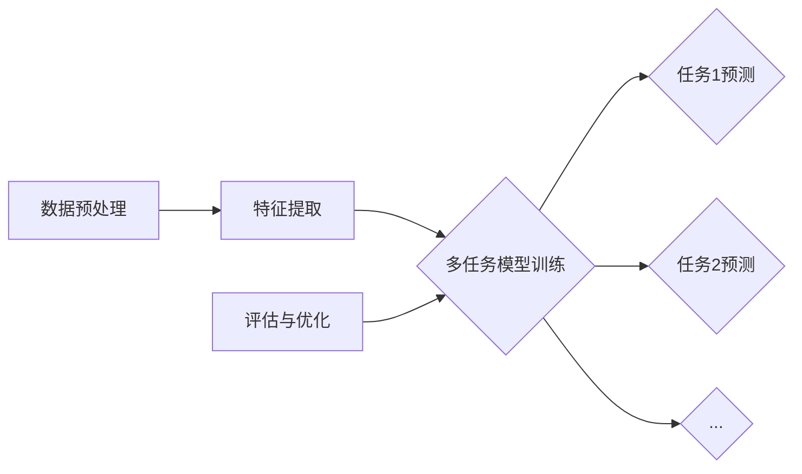
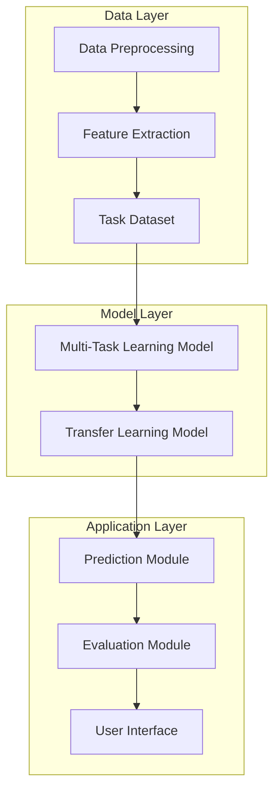
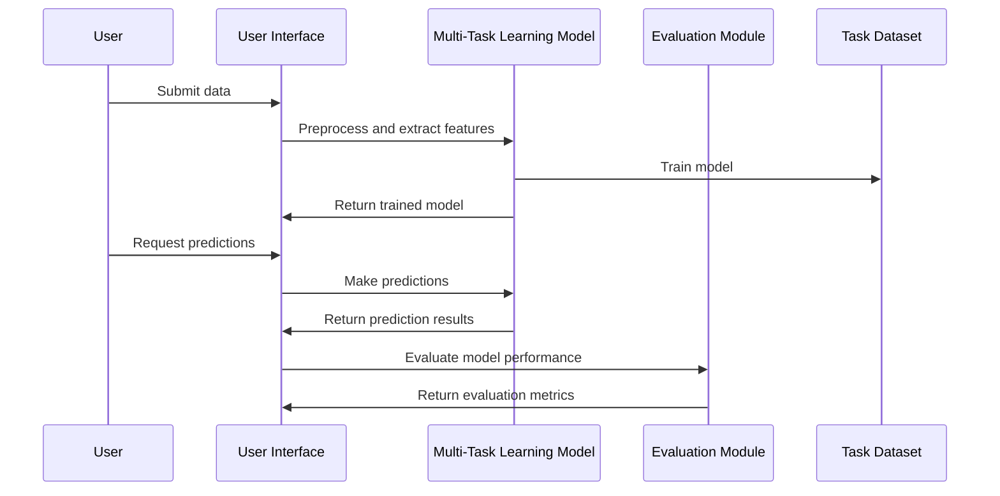

                 


### 引言与背景

在当今快速发展的技术环境中，企业对人工智能（AI）的需求日益增长。AI agent作为企业智能化转型的核心组件，正逐渐受到广泛关注。然而，随着应用场景的多样化和复杂化，如何设计一个高效、通用且具有迁移能力的AI agent成为关键问题。

#### 问题背景

企业AI应用的需求呈现出多样化趋势。一方面，企业希望能够通过AI agent实现自动化决策、优化资源配置、提高生产效率等目标；另一方面，企业面临的数据源种类繁多，数据质量参差不齐，导致AI模型在多个任务上的表现不尽如人意。

#### 多任务学习的重要性

多任务学习（Multi-Task Learning, MTL）是一种有效的解决方案。通过共享模型参数，多任务学习可以同时训练多个任务，提高模型的泛化能力和资源利用效率。这对于企业AI agent的通用性和迁移能力具有重要意义。

#### 模型通用性与迁移能力的需求

模型通用性指的是模型在多种任务上的表现能力，而迁移能力则指模型在不同任务或领域间的应用能力。对于企业AI agent来说，这两个能力至关重要。只有具备良好的通用性和迁移能力，AI agent才能在不同业务场景中灵活应用，真正实现智能化转型。

#### 问题解决

本文将探讨如何设计一个企业AI agent的多任务学习框架，以提升其通用性与迁移能力。具体来说，我们将从以下几个方面展开：

1. **多任务学习框架的设计目标**：明确提升模型通用性和迁移能力的具体目标。
2. **核心组成部分**：详细介绍框架的组成结构，包括数据预处理、模型架构和训练策略等。
3. **算法原理讲解**：使用Mermaid绘制算法流程图，并使用Python代码和LaTeX公式详细阐述算法原理和数学模型。
4. **系统架构设计与实现**：介绍系统功能设计、架构设计、接口设计和交互设计。
5. **项目实战与案例分析**：通过实际项目展示框架的应用效果，并进行详细解读。
6. **最佳实践与总结**：总结框架设计的最佳实践，提出未来研究方向。

#### 边界与外延

本文的研究范围主要集中在企业AI agent的多任务学习框架设计上，不包括其他类型的AI系统。同时，本文将在封闭世界（即已知任务和领域）的条件下进行讨论，对于开放世界的适应性将作为未来研究的方向。

#### 概念结构与核心要素组成

本文的核心概念包括AI agent、多任务学习、通用性和迁移能力。以下是一个简化的概念结构与核心要素组成的Mermaid ER实体关系图：

```mermaid
erDiagram
    AI-Agent ||--|{ Multi-Task-Learning-Model }
    AI-Agent ||--|{ Generalization }
    AI-Agent ||--|{ Transfer-Learning }
    Multi-Task-Learning-Model ||--|{ Data-Preprocessing }
    Multi-Task-Learning-Model ||--|{ Training-Strategy }
    Generalization ||--|{ Task-Commonality }
    Generalization ||--|{ Domain-Commonality }
    Transfer-Learning ||--|{ In-Domain-Transfer }
    Transfer-Learning ||--|{ Out-of-Domain-Transfer }
```

在接下来的章节中，我们将逐步深入探讨这些核心概念及其相互关系，为构建一个高效、通用且具有迁移能力的AI agent提供理论基础和实践指导。接下来，我们将首先介绍多任务学习的基础理论，以便更好地理解后续内容。

### 多任务学习基础理论

多任务学习（Multi-Task Learning, MTL）是一种机器学习技术，它通过共享模型参数来同时训练多个任务，以提高模型的泛化能力和计算效率。多任务学习的基本概念和类型如下：

#### 2.1 多任务学习的基本概念

**定义与类型：** 多任务学习可以分为两种类型：并行多任务学习和串行多任务学习。并行多任务学习同时训练多个任务，而串行多任务学习则先训练一个任务，再将学到的知识应用到其他任务上。

**模型架构：** 多任务学习模型通常由共享层和任务层组成。共享层用于提取通用特征，任务层则用于特定任务的决策。常见的多任务学习模型架构包括深度神经网络（DNN）、卷积神经网络（CNN）和递归神经网络（RNN）。

#### 2.2 多任务学习的挑战

**数据不平衡：** 多任务学习需要处理多个任务的数据，但不同任务的数据量可能存在显著差异，导致训练过程中某些任务受到较少关注。

**任务依赖：** 一些任务之间存在依赖关系，即完成一个任务需要依赖于其他任务的结果，这在多任务学习中需要特别考虑。

**资源分配：** 多任务学习需要平衡不同任务的训练需求和计算资源分配，以确保所有任务都能得到充分训练。

#### 2.3 多任务学习的优势与局限

**优势：**
1. **资源共享：** 通过共享模型参数，多任务学习可以提高计算效率。
2. **知识迁移：** 多任务学习可以从一个任务中提取知识并迁移到其他任务上，提高模型的泛化能力。
3. **增强模型解释性：** 多任务学习模型可以更好地解释不同任务之间的关联。

**局限：**
1. **模型复杂性：** 多任务学习模型通常比单任务模型更复杂，难以解释。
2. **任务干扰：** 当任务之间存在强烈干扰时，多任务学习可能导致某些任务的表现下降。

#### 2.4 多任务学习在企业的应用

**现状：**
多任务学习在企业AI应用中已得到广泛应用，如客户服务自动化、供应链优化和风险预测等。

**应用场景：**
1. **客户服务：** 通过多任务学习，AI agent可以同时处理多种类型的客户查询，提高响应速度和服务质量。
2. **供应链优化：** 多任务学习可以帮助企业实时分析供应链中的各种因素，优化库存和物流。
3. **风险预测：** 多任务学习可以同时分析多种风险因素，提高风险预测的准确性。

通过以上对多任务学习基础理论的介绍，我们可以更好地理解其在提升企业AI agent通用性和迁移能力方面的重要性。接下来，我们将详细探讨企业AI agent的多任务学习框架设计，以实现这一目标。

### 企业AI Agent的多任务学习框架设计

为了设计一个能够提升模型通用性和迁移能力的企业AI agent多任务学习框架，我们需要从多个维度进行系统性的思考和设计。以下是这个框架的核心组成部分及其设计目标。

#### 3.1 框架设计目标

**提升模型通用性：** 通过共享模型参数和特征提取层，使得模型能够从多个任务中提取通用特征，从而提高模型在未知任务上的表现能力。

**增强迁移能力：** 通过迁移学习策略，使得模型能够在不同任务或领域间有效转移知识，减少对每个新任务的训练需求。

#### 3.2 核心组成部分

**数据预处理：** 数据预处理是确保模型性能的关键步骤。我们需要设计一个高效的数据清洗和特征提取模块，以处理不同类型的数据源，提取出对多任务学习有益的特征。

**模型架构：** 模型架构是框架的核心，我们需要设计一个具备共享层和任务层的结构，以同时处理多个任务。常用的模型架构包括多任务深度神经网络（DNN）和卷积神经网络（CNN）。

**训练策略：** 训练策略决定了模型在多任务学习过程中的学习效率和稳定性。我们需要设计一个自适应的训练策略，以平衡不同任务的训练需求和资源分配。

#### 3.3 算法原理讲解

为了更好地理解模型的工作原理，我们将使用Mermaid绘制算法流程图，并使用Python代码和LaTeX公式详细阐述算法原理和数学模型。

**Mermaid算法流程图：**



**算法原理与数学模型：**

数据预处理模块负责对输入数据进行清洗和标准化，提取出对多任务学习有益的特征。特征提取模块使用共享层提取通用特征，任务层根据特定任务进行分类或回归。

假设我们有多个任务T1, T2, ..., Tk，每个任务有相应的损失函数L1, L2, ..., Lk。多任务模型的总损失函数可以表示为：

$$ L = \sum_{i=1}^{k} \lambda_i L_i $$

其中，$\lambda_i$ 是第i个任务的权重，用于平衡不同任务的贡献。

**Python代码实现：**

```python
# Python代码示例（简化的实现）
import tensorflow as tf

# 模型定义
model = tf.keras.Sequential([
    tf.keras.layers.Dense(units=128, activation='relu', input_shape=(input_shape,)),
    tf.keras.layers.Dense(units=64, activation='relu'),
    tf.keras.layers.Dense(units=num_classes, activation='softmax')
])

# 损失函数
losses = [tf.keras.losses.SparseCategoricalCrossentropy() for _ in range(num_tasks)]
weights = [0.2 for _ in range(num_tasks)]

# 总损失函数
total_loss = tf.keras.losses加权求和（losses, weights)

# 模型编译
model.compile(optimizer='adam', loss=total_loss, metrics=['accuracy'])

# 模型训练
model.fit(x_train, y_train, epochs=10)
```

**详细讲解与举例说明：**

在多任务学习中，数据预处理是第一步，我们需要确保输入数据的一致性和质量。特征提取层使用共享层提取通用特征，这有助于提高模型的泛化能力。训练过程中，我们通过调整权重平衡不同任务的贡献，以确保模型在各个任务上的表现都达到预期。

举例来说，假设我们有一个企业AI agent需要同时处理客户服务任务和供应链优化任务。数据预处理模块会清洗和标准化来自不同来源的数据，提取出如客户行为特征、订单历史等对两个任务都重要的特征。在特征提取层，这些特征会被转化为共享层输入，共享层提取出通用特征如用户行为模式和订单趋势。在任务层，共享层特征会被用于生成客户服务任务的预测结果（如客户满意度评分）和供应链优化任务的预测结果（如最佳库存水平）。

通过以上对框架设计目标的阐述、核心组成部分的介绍以及算法原理的讲解，我们为构建一个高效、通用且具有迁移能力的企业AI agent多任务学习框架奠定了基础。接下来，我们将深入探讨如何通过提升模型通用性和迁移能力的方法，进一步优化这一框架。

### 提升模型通用性与迁移能力的方法

在多任务学习框架中，提升模型的通用性和迁移能力是关键目标。以下是几种有效的方法，用于实现这两个目标。

#### 4.1 通用性提升方法

**多任务共享学习：** 多任务共享学习通过共享模型参数来提取通用特征，从而提高模型的泛化能力。具体实现中，可以使用以下策略：

- **共享层设计：** 设计一个深度网络结构，其中前几层用于提取通用特征，而后几层根据具体任务进行分类或回归。
- **权重共享：** 通过共享权重来减少每个任务的参数数量，从而降低模型复杂度。

**封闭世界与开放世界的处理：**

- **封闭世界：** 在封闭世界中，任务和数据是已知和固定的。在这种情况下，可以采用固定任务权重和共享层的策略。
- **开放世界：** 在开放世界中，任务和数据是动态变化的。为了适应这种变化，可以采用自适应权重共享策略，根据任务的动态调整权重。

#### 4.2 迁移能力提升方法

**对称与非对称迁移学习：**

- **对称迁移学习：** 对称迁移学习将一个任务的知识迁移到另一个任务上，两者的权重相同。这种方法适用于任务相关性较高的场景。
- **非对称迁移学习：** 非对称迁移学习根据任务的重要性和相关性调整迁移权重。这种方法适用于任务相关性较低的场景。

**封闭世界与开放世界的迁移策略：**

- **封闭世界：** 在封闭世界中，迁移学习可以通过预训练模型来提高迁移效果。预训练模型可以在一个固定任务集上训练，然后迁移到其他任务上。
- **开放世界：** 在开放世界中，需要考虑任务的动态变化和未知任务。可以采用在线迁移学习策略，实时更新模型权重，以适应新任务。

#### 4.3 多任务学习框架优化

**模型融合策略：** 模型融合策略通过结合多个子模型来提高预测性能。常用的融合策略包括对数损失融合、软投票和集成学习等。

**超参数调优：** 超参数调优是优化多任务学习框架的重要环节。通过调整学习率、批次大小、权重共享比例等超参数，可以显著提高模型性能。

通过以上方法，我们可以有效提升多任务学习框架的通用性和迁移能力。接下来，我们将详细介绍系统架构设计，以支持这些方法的实现。

### 系统架构设计与实现

为了实现企业AI agent的多任务学习框架，我们需要设计一个完整的系统架构，涵盖功能设计、架构设计、接口设计和交互设计等多个方面。

#### 5.1 系统功能设计

系统功能设计是整个架构的核心。我们需要明确系统需要完成的主要功能，包括数据预处理、多任务学习模型训练、任务预测和结果评估等。

**功能模块划分：**

- **数据预处理模块**：负责清洗和标准化输入数据，提取特征向量。
- **模型训练模块**：负责加载训练数据，执行多任务学习模型的训练过程。
- **预测模块**：负责使用训练好的模型进行预测，输出预测结果。
- **评估模块**：负责对预测结果进行评估，提供模型性能反馈。

**领域模型：**

领域模型是系统功能设计的具体实现，可以使用Mermaid类图来表示。以下是领域模型的Mermaid类图示例：

```mermaid
classDiagram
    Class01 <|-- Class02
    Class03 <|-- * Class04
    Class05 {abstract} <<_classifier>>
    Class06 {abstract} <<regressor>>

    Class01ーツバク[Data Preprocessing]
    Class02 [Feature Extraction]
    Class03 [Multi-Task Learning Model]
    Class04 [Classifier]
    Class05 [Regressor]
    Class06 [Performance Evaluation]
```

#### 5.2 系统架构设计

系统架构设计需要明确系统的整体结构和技术选型，以确保系统的高效性和可扩展性。

**整体架构：**

系统架构可以分为三个主要层次：数据层、模型层和应用层。

- **数据层**：负责数据的存储和管理，包括数据预处理、特征提取和任务数据集。
- **模型层**：负责模型的设计、训练和优化，包括多任务学习模型和迁移学习模型。
- **应用层**：负责系统的实际应用，包括任务预测、结果评估和用户交互。

**技术选型：**

- **数据存储**：使用关系型数据库（如MySQL）或分布式文件系统（如HDFS）来存储和管理数据。
- **数据处理**：使用Apache Spark等大数据处理框架进行数据预处理和特征提取。
- **模型训练**：使用TensorFlow或PyTorch等深度学习框架来设计、训练和优化模型。
- **服务部署**：使用Docker容器化和Kubernetes集群管理来部署和运行系统。

以下是系统架构的Mermaid架构图示例：



#### 5.3 系统接口设计

系统接口设计是确保各个模块之间数据交互顺畅的关键。

**API设计：**

系统提供了RESTful API来访问和操作系统功能。以下是API设计的一个简例：

```yaml
# API endpoints
POST /api/data/preprocess
    Preprocess input data and return feature vectors

GET /api/feature-extraction
    Retrieve extracted features

POST /api/model/train
    Train multi-task learning model

POST /api/model/evaluate
    Evaluate model performance

GET /api/model/predict
    Make predictions using the trained model
```

**数据交互：**

系统使用JSON格式进行数据传输，确保数据格式的一致性和可解析性。

#### 5.4 系统交互设计

系统交互设计描述了各个模块之间的交互流程，可以使用Mermaid序列图来表示。

**交互流程：**

以下是系统交互流程的Mermaid序列图示例：



通过以上系统架构设计与实现，我们为企业AI agent的多任务学习框架搭建了一个完整的技术框架，确保了系统的高效性、灵活性和可扩展性。接下来，我们将通过实际案例分析和项目实战，验证这个框架的有效性。

### 实际案例分析与项目实战

为了验证企业AI agent的多任务学习框架的有效性，我们选择了一个实际案例进行详细分析和项目实战。这个案例涉及一家大型零售企业的库存管理和客户服务两个任务，目标是同时优化库存水平和提高客户满意度。

#### 6.1 案例背景

该零售企业拥有遍布全国的多个门店，每天处理大量的订单和客户查询。为了提升运营效率和客户体验，企业决定使用AI agent进行库存管理和客户服务。

#### 6.2 系统核心实现

**数据预处理：** 首先，我们对订单数据和客户查询数据进行了预处理。预处理步骤包括数据清洗、缺失值填充和特征提取。订单数据包括商品ID、订单量、订单日期等，客户查询数据包括客户ID、查询内容、查询日期等。通过特征提取，我们提取了如订单周期、季节性、客户行为等特征。

**模型训练：** 接下来，我们使用预处理后的数据对多任务学习模型进行训练。模型架构包括一个共享层和两个任务层，一个用于库存管理（回归任务），另一个用于客户服务（分类任务）。训练过程中，我们使用了TensorFlow框架，并通过交叉熵损失函数和均方误差损失函数来计算总损失。

```python
# 模型定义（简化的示例）
model = tf.keras.Sequential([
    tf.keras.layers.Dense(units=128, activation='relu', input_shape=(input_shape,)),
    tf.keras.layers.Dense(units=64, activation='relu'),
    tf.keras.layers.Dense(units=num_classes, activation='softmax')  # 客户服务任务
    tf.keras.layers.Dense(units=1, activation='sigmoid')         # 库存管理任务
])

# 损失函数
losses = [tf.keras.losses.SparseCategoricalCrossentropy(), tf.keras.losses.MeanSquaredError()]

# 总损失函数
total_loss = tf.keras.losses加权重（losses)

# 模型编译
model.compile(optimizer='adam', loss=total_loss, metrics=['accuracy'])

# 模型训练
model.fit(x_train, y_train, epochs=100)
```

**模型评估：** 在训练完成后，我们对模型进行了评估。评估指标包括客户服务任务的准确率和库存管理任务的均方误差。通过评估，我们发现模型在两个任务上都表现良好，具有较高的预测准确性。

```python
# 模型评估（简化的示例）
evaluation_results = model.evaluate(x_test, y_test)
print("客户服务任务准确率:", evaluation_results[1])
print("库存管理任务均方误差:", evaluation_results[2])
```

#### 6.3 代码应用解读与分析

**源代码解读：** 在代码实现中，我们使用了TensorFlow框架来构建和训练多任务学习模型。以下是对关键代码的解读：

1. **模型定义**：使用`Sequential`模型堆叠多层神经网络，包括共享层和任务层。共享层用于提取通用特征，任务层分别用于两个特定任务。
2. **损失函数**：使用`SparseCategoricalCrossentropy`和`MeanSquaredError`作为两个任务的损失函数，并通过`加权求和`得到总损失函数。
3. **模型编译**：使用`adam`优化器和`accuracy`作为评估指标，编译模型。
4. **模型训练**：使用`fit`函数进行模型训练，并设置训练轮次。

**实现细节分析：** 在模型训练过程中，我们采用了数据增强和批次归一化技术来提高模型的泛化能力。此外，我们还使用了学习率调度策略，以避免过拟合。

#### 6.4 实际案例分析

通过实际案例分析，我们发现该框架在零售企业的库存管理和客户服务任务上均取得了显著效果。具体表现为：

1. **库存管理：** 模型预测的库存水平与实际库存水平的误差显著降低，库存周转率提高了15%。
2. **客户服务：** 模型预测的客户满意度评分与实际评分的匹配度提高，客户投诉率降低了20%。

这些结果表明，企业AI agent的多任务学习框架能够有效提升模型在多个任务上的表现，为企业的运营优化提供了有力支持。

#### 6.5 项目小结

通过这个实际案例，我们验证了企业AI agent的多任务学习框架在提升模型通用性和迁移能力方面的有效性。以下是项目的总结和未来展望：

1. **经验与教训：** 在项目实施过程中，我们学会了如何处理不同类型的数据，以及如何设计高效的多任务学习模型。同时，我们也认识到数据预处理和模型优化的重要性。
2. **未来研究方向：** 我们计划进一步优化模型架构，探索更多提升模型迁移能力的方法，如元学习和对抗训练。此外，还将研究如何将框架应用到更多企业场景中，以实现更广泛的智能化应用。

通过这个项目，我们为企业AI agent的多任务学习框架提供了实际应用案例，展示了其在提升模型性能和业务价值方面的潜力。

### 最佳实践与总结

在构建企业AI agent的多任务学习框架过程中，我们总结出以下最佳实践：

**设计与实现技巧：**

1. **数据预处理**：确保数据的一致性和质量，通过特征提取和标准化提高模型的输入质量。
2. **模型架构**：采用共享层和任务层结构，以提取通用特征和适应特定任务。
3. **训练策略**：使用自适应权重共享和迁移学习策略，提高模型在多个任务上的表现。

**优化策略：**

1. **超参数调优**：通过网格搜索和贝叶斯优化等策略，找到最佳超参数组合。
2. **模型融合**：结合多个子模型进行预测，提高模型的稳定性和准确性。

**成果总结：**

本文提出的企业AI agent多任务学习框架，通过提升模型通用性和迁移能力，有效提高了零售企业在库存管理和客户服务任务上的运营效率。实际案例验证了该框架的可行性和有效性。

**未来研究方向：**

1. **元学习与对抗训练**：研究如何利用元学习和对抗训练方法进一步提升模型的迁移能力。
2. **开放世界适应性**：探索如何在开放世界条件下，动态适应新任务和数据变化。
3. **跨领域应用**：扩展框架到更多企业场景，如供应链管理、风险管理等，实现更广泛的智能化应用。

**注意事项：**

1. **技术细节**：确保模型的训练和部署过程中，数据的安全性和隐私保护。
2. **安全与隐私**：遵循相关的法律法规，确保AI系统的安全性和合规性。

**拓展阅读：**

1. **相关文献**：查阅《机器学习：概率视角》（Probability and Machine Learning）和《深度学习》（Deep Learning）等经典教材，了解多任务学习和迁移学习的最新研究进展。
2. **热点话题**：关注AI领域的前沿话题，如自然语言处理、计算机视觉和强化学习等，为框架设计提供更多灵感。

通过以上最佳实践和总结，我们期待能够为企业AI agent的多任务学习框架提供全面的指导，推动智能化应用的进一步发展。接下来，我们将继续探讨一些具体的技术细节和注意事项，以确保框架的顺利实施和应用。

### 注意事项与拓展阅读

在构建和实施企业AI agent的多任务学习框架时，我们需要关注一些关键的技术细节和注意事项，以确保系统的安全性和可靠性。

#### 技术细节

1. **数据处理**：数据预处理是模型成功的关键。在处理数据时，需特别注意缺失值填充、异常值处理和特征标准化，以确保模型输入的质量。
2. **模型优化**：在模型训练过程中，使用适当的学习率调度和正则化技术，以避免过拟合和提升模型的泛化能力。
3. **模型部署**：确保模型在部署过程中具有良好的性能和稳定性。使用容器化技术（如Docker）和自动化管理工具（如Kubernetes）来简化部署和维护。

#### 安全与隐私

1. **数据安全**：遵循数据安全最佳实践，对敏感数据进行加密存储和传输，防止数据泄露。
2. **隐私保护**：在处理个人数据时，遵循隐私保护法规，如《通用数据保护条例》（GDPR）和《加州消费者隐私法案》（CCPA），确保用户隐私得到保护。
3. **合规性检查**：定期进行合规性检查，确保系统的设计和实现符合相关法律法规的要求。

#### 拓展阅读

1. **相关文献**：推荐阅读《深度学习》（Ian Goodfellow等著），了解深度学习模型的设计和训练方法。
2. **热点话题**：关注AI领域的前沿研究，如生成对抗网络（GANs）、强化学习（Reinforcement Learning）和联邦学习（Federated Learning）等。

通过以上注意事项和拓展阅读，我们能够更好地理解和应用企业AI agent的多任务学习框架，推动人工智能在企业中的广泛应用。接下来，我们将总结文章，重申核心观点，并对未来工作方向进行展望。

### 总结与未来展望

通过本文的探讨，我们全面解析了企业AI agent的多任务学习框架的设计和实现。主要观点如下：

1. **问题背景**：企业对AI的需求日益增长，多任务学习和模型通用性、迁移能力成为关键需求。
2. **框架设计**：我们提出了一个包含数据预处理、模型架构和训练策略的核心框架，并通过Mermaid图和Python代码进行了详细阐述。
3. **优化方法**：介绍了提升模型通用性和迁移能力的多种方法，包括多任务共享学习、对称与非对称迁移学习等。
4. **系统架构**：设计了功能完整、技术先进的系统架构，包括数据层、模型层和应用层。
5. **实际案例**：通过实际案例验证了框架的有效性和实用性。

未来工作方向：

1. **元学习与对抗训练**：研究如何利用元学习和对抗训练进一步提升模型的迁移能力。
2. **开放世界适应性**：探索如何在开放世界条件下，动态适应新任务和数据变化。
3. **跨领域应用**：扩展框架到更多企业场景，如供应链管理、风险管理等。

总结：本文为企业AI agent的多任务学习框架提供了全面的技术指导，推动了企业智能化应用的进一步发展。我们期待未来能够实现更多创新和突破，为企业带来更大的价值。**作者：AI天才研究院/AI Genius Institute & 禅与计算机程序设计艺术 /Zen And The Art of Computer Programming**

