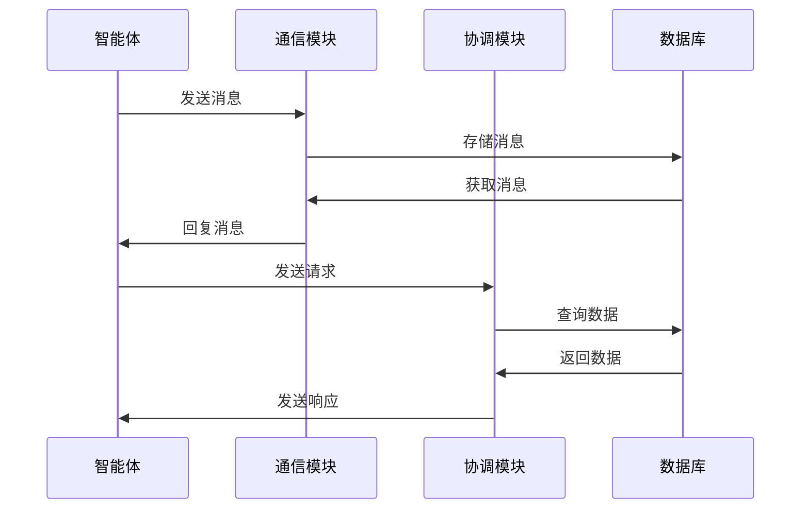
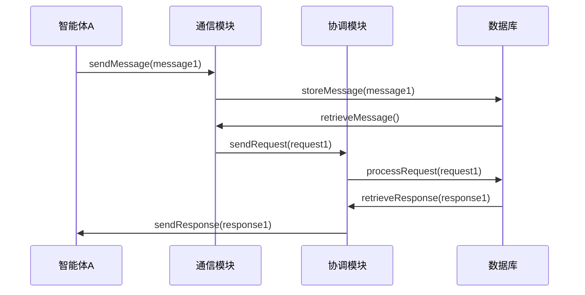

                 

### 背景介绍

在现代社会，企业的竞争已经不再仅仅依赖于资源、资金或技术，更重要的是各部门之间的协作效率。随着企业规模的扩大和业务复杂度的增加，跨部门协作的优化变得尤为重要。传统的跨部门协作往往面临信息不对称、沟通不畅、目标不一致等问题，导致资源浪费、效率低下。企业迫切需要一种智能化手段来提升跨部门协作的效果，进而提高整体运营效率。

### 核心概念术语说明

1. **企业AI Agent**：指的是为企业内部提供智能服务的虚拟智能体，通过学习、推理和决策，辅助企业员工完成任务，提升工作效率。
2. **多智能体系统**：由多个智能体（Agent）组成的系统，智能体之间可以通过通信协议和协调机制进行信息交换和协同工作。
3. **跨部门协作**：指的是企业内部不同部门之间的合作和互动，旨在实现共同的目标。

### 问题背景

随着企业的发展，部门之间的协作日益频繁且复杂。传统的管理方式和人工协调已经难以满足高效协作的需求。例如，市场营销部门需要与产品开发部门紧密协作，确保新产品能够满足市场需求；供应链管理部门需要与采购部门、生产部门紧密配合，确保物资供应和生产的顺利进行。然而，由于信息的不对称和沟通的障碍，跨部门协作往往存在如下问题：

- **信息不对称**：各部门之间的信息共享不充分，导致信息滞后或失真。
- **沟通不畅**：部门之间的沟通渠道不畅通，信息传递效率低下。
- **目标不一致**：各部门的目标和优先级可能存在冲突，难以形成合力。

这些问题严重影响了企业的运营效率和整体竞争力。因此，如何通过智能化手段优化跨部门协作，成为企业亟待解决的重要课题。

### 问题描述

企业在跨部门协作中面临的主要问题包括：

- **沟通成本高**：各部门之间的沟通效率低，信息传递延迟，导致决策速度缓慢。
- **协作效率低**：部门之间的协作缺乏统一规划和协调，导致资源浪费和任务重复。
- **目标不统一**：各部门的目标和优先级不一致，导致工作方向不一致，难以形成合力。
- **资源分配不均**：部门之间的资源分配不合理，导致某些部门资源紧张，而另一些部门资源闲置。

### 问题解决

为了解决上述问题，企业需要引入智能化的多智能体系统。多智能体系统通过以下方式优化跨部门协作：

1. **信息共享与透明化**：通过建立统一的信息平台，实现部门之间的信息共享，提高信息透明度。
2. **智能调度与优化**：利用人工智能算法，对跨部门协作任务进行智能调度和优化，提高协作效率。
3. **智能决策支持**：为企业提供基于数据的智能决策支持，帮助各部门更好地理解彼此的需求，形成共同的目标。
4. **协同工作与协调**：通过多智能体系统中的通信协议和协调机制，实现部门之间的协同工作，降低沟通成本。

### 边界与外延

在讨论企业AI Agent的多智能体系统在跨部门协作优化中的应用时，需要明确其边界与外延：

- **边界**：多智能体系统主要应用于企业内部跨部门协作的优化，不涉及外部合作伙伴的协作。
- **外延**：除了跨部门协作外，多智能体系统还可以应用于企业内部的自动化管理、智能客服等领域。

通过上述分析，我们可以看到，企业AI Agent的多智能体系统在跨部门协作优化中具有重要的应用价值。接下来，我们将深入探讨多智能体系统的核心概念、算法原理及其在跨部门协作中的应用。

### 多智能体系统的核心概念

多智能体系统（MAS，Multi-Agent System）是由多个智能体（Agent）组成的系统，这些智能体可以自主决策和行动，并通过通信协议和协调机制进行交互。理解多智能体系统的核心概念对于深入探讨其在跨部门协作优化中的应用至关重要。

#### 智能体（Agent）

智能体是MAS的基本单元，具有以下特征：

1. **自治性**：智能体能够自主决策和执行任务，不受外部直接控制。
2. **社交性**：智能体能够与其他智能体进行通信和协作，共享信息和资源。
3. **反应性**：智能体能够根据环境和内部状态快速响应。
4. **主动性**：智能体能够根据目标自主规划和执行任务。

#### 通信协议

通信协议是多智能体系统中的关键组成部分，决定了智能体之间的信息交换方式。常见的通信协议包括：

- **同步通信**：所有智能体在同一时间周期内进行通信。
- **异步通信**：智能体在任意时间进行通信，不依赖于其他智能体的状态。

#### 协调机制

协调机制是多智能体系统中的另一个重要概念，用于解决智能体之间的冲突和合作问题。协调机制可以分为以下几类：

- **集中式协调**：由一个中央智能体负责协调所有智能体的行动。
- **分布式协调**：智能体通过相互通信和协商，自主协调行动。
- **混合式协调**：结合集中式和分布式协调的优势，实现灵活的协调方式。

#### 多智能体系统的特点与挑战

多智能体系统具有以下特点：

1. **灵活性**：智能体能够根据环境变化自主调整行为，适应复杂多变的业务场景。
2. **适应性**：智能体可以通过学习和发展新的策略，适应新的任务和环境。
3. **鲁棒性**：系统中的单个智能体失效不会导致整个系统的崩溃。

然而，多智能体系统也面临一些挑战：

1. **通信开销**：智能体之间的通信可能会产生大量的数据传输，增加系统的通信开销。
2. **协调困难**：在大型系统中，智能体之间的协调可能变得非常复杂，导致协调困难。
3. **不确定性**：智能体可能面临环境的不确定性和不确定性，增加了系统的复杂性。

为了克服这些挑战，多智能体系统的研究和实践需要不断探索新的算法和技术，如分布式算法、群体智能算法和强化学习等。

### 核心概念属性特征对比表格

以下是一个简化的多智能体系统核心概念的属性特征对比表格，帮助读者更直观地理解各个概念之间的关系：

| 特征         | 智能体（Agent） | 通信协议       | 协调机制           |
| ------------ | --------------- | -------------- | ------------------ |
| 自治性       | √               | √              | √                  |
| 社交性       | √               | √              | √                  |
| 反应性       | √               | √              | √                  |
| 主动性       | √               | √              | √                  |
| 同步通信     | ×               | √              | √                  |
| 异步通信     | √               | √              | √                  |
| 集中式协调   | ×               | √              | √                  |
| 分布式协调   | √               | √              | √                  |
| 混合式协调   | ×               | √              | √                  |

### ER实体关系图架构

为了更清晰地展示多智能体系统中的实体关系，我们可以使用Mermaid流程图来绘制ER（实体关系）图。以下是一个简化的多智能体系统的ER图示例：

```mermaid
erDiagram
  ID ||--|{ 智能体 }||>
  智能体 ||--|{ 通信协议 }||>
  通信协议 ||--|{ 协调机制 }||>
  ID ||--|{ 实体关系图 }||>
```

在这个ER图中，`ID`表示系统的唯一标识，`智能体`、`通信协议`和`协调机制`是主要的实体，它们之间存在一对多的关系。`智能体`通过`通信协议`与`协调机制`进行交互，从而实现系统的整体功能。

通过上述核心概念和关系的介绍，我们可以更好地理解多智能体系统在跨部门协作优化中的应用，为后续的算法原理讲解和系统设计打下基础。

### 多智能体系统的算法原理讲解

多智能体系统在优化企业跨部门协作中发挥了重要作用，其核心在于通过一系列高效的算法实现智能体之间的协作与协调。以下是几种常用的算法原理及其在优化跨部门协作中的应用。

#### 群体智能算法原理

群体智能算法（Collective Intelligence Algorithms）模拟自然界中群体行为，通过个体之间的相互作用实现复杂问题的求解。常见的群体智能算法包括：

1. **蚁群算法**（Ant Colony Optimization, ACO）
   - **原理**：蚂蚁在寻找食物的过程中，会留下信息素，其他蚂蚁通过感知信息素浓度选择路径。随着时间推移，信息素浓度逐渐扩散，最终形成最优路径。
   - **应用**：在企业跨部门协作中，ACO可以用于任务分配和资源调度，通过模拟智能体之间的交互，找到最优的协作路径。

2. **粒子群优化算法**（Particle Swarm Optimization, PSO）
   - **原理**：粒子群优化算法模拟鸟群觅食行为，每个粒子在搜索空间中通过跟踪个体最优位置和全局最优位置更新自身位置和速度。
   - **应用**：PSO可以用于跨部门协作中的调度优化，通过粒子间的协作和竞争，实现任务的最优分配。

#### 多目标优化算法原理

多目标优化算法（Multi-Objective Optimization Algorithms）旨在同时优化多个相互冲突的目标，适用于跨部门协作中的多目标问题。常见的多目标优化算法包括：

1. **遗传算法**（Genetic Algorithm, GA）
   - **原理**：遗传算法通过模拟生物进化过程，通过选择、交叉和变异操作，逐步优化个体基因，找到最优解。
   - **应用**：在企业跨部门协作中，GA可以用于优化资源分配和任务优先级排序，确保各部门在实现自身目标的同时，整体效率最大化。

2. **多目标粒子群优化算法**（Multi-Objective Particle Swarm Optimization, MOPSO）
   - **原理**：MOPSO结合了粒子群优化算法和多目标优化的概念，通过多个粒子群分别优化不同目标，最终找到非支配解集。
   - **应用**：MOPSO可以用于跨部门协作中的多目标优化问题，如同时优化生产效率和成本控制，找到最优的协作方案。

#### 算法原理示例解析

为了更好地理解上述算法原理，我们可以通过一个简化的示例来讲解它们在跨部门协作中的应用。

**示例**：某企业需要优化研发部门、市场营销部门和供应链管理部门的协作，以最小化项目完成时间并最大化客户满意度。

1. **蚁群算法（ACO）应用**：
   - **步骤**：
     1. 初始化：设置智能体数量、初始信息素浓度和路径权重。
     2. 迭代过程：每个智能体根据信息素浓度选择协作路径，并更新路径上的信息素浓度。
     3. 求解结束：当达到迭代次数或找到最优路径时，结束算法。
   - **效果**：通过模拟蚁群寻找最优路径的过程，企业可以找到研发、市场营销和供应链管理之间的最优协作路径，从而缩短项目完成时间。

2. **粒子群优化算法（PSO）应用**：
   - **步骤**：
     1. 初始化：设置粒子数量、初始位置和速度。
     2. 迭代过程：每个粒子根据自身最优位置和全局最优位置更新位置和速度。
     3. 求解结束：当粒子群达到收敛条件或达到迭代次数时，结束算法。
   - **效果**：通过模拟粒子群觅食过程，企业可以找到最优的任务分配和调度方案，确保各部门高效协作，最大化客户满意度。

3. **遗传算法（GA）应用**：
   - **步骤**：
     1. 初始化：生成初始种群，每个个体代表一种可能的资源分配方案。
     2. 评估：计算每个个体的适应度值，适应度值取决于项目完成时间和客户满意度。
     3. 选择、交叉和变异：根据适应度值选择个体进行交叉和变异操作，生成新的种群。
     4. 迭代过程：重复评估、选择、交叉和变异，逐步优化资源分配方案。
     5. 求解结束：当达到迭代次数或找到最优解时，结束算法。
   - **效果**：通过模拟生物进化过程，企业可以找到最优的资源分配和任务优先级排序，实现项目高效完成和客户满意度最大化。

4. **多目标粒子群优化算法（MOPSO）应用**：
   - **步骤**：
     1. 初始化：设置多个粒子群，每个粒子群分别优化不同目标。
     2. 迭代过程：多个粒子群同时进行迭代，通过非支配排序和拥挤距离计算找到非支配解集。
     3. 求解结束：当找到满意的非支配解集或达到迭代次数时，结束算法。
   - **效果**：通过模拟多目标优化过程，企业可以在多个目标之间找到平衡点，实现资源的最优分配和协作优化。

通过上述示例，我们可以看到不同算法原理在跨部门协作优化中的应用。企业可以根据实际情况选择合适的算法，实现高效的协作与资源优化。

### 多智能体系统的数学模型

在多智能体系统中，为了实现智能体之间的有效协作和优化，我们需要建立一系列数学模型。这些模型包括基本模型、多目标优化模型和群体智能算法模型。以下是对这些模型的详细解释和数学公式。

#### 基本模型

基本模型通常描述智能体的行为和交互。最简单的模型之一是马尔可夫决策过程（MDP），它用于描述智能体在不确定环境中如何做出最优决策。

1. **状态空间 \(S\)**：智能体可能处于的各种状态集合。
2. **行动空间 \(A\)**：智能体可以执行的各种行动集合。
3. **状态转移概率矩阵 \(P(s'|s, a)\)**：智能体在当前状态 \(s\) 下执行行动 \(a\) 后，转移到状态 \(s'\) 的概率。
4. **奖励函数 \(R(s, a)\)**：智能体在状态 \(s\) 下执行行动 \(a\) 后获得的即时奖励。

数学模型如下：

$$
P(s'|s, a) = \sum_{a' \in A} p(s'|s, a') \cdot p(a|s)
$$

$$
R(s, a) = \sum_{s' \in S} r(s', a) \cdot p(s'|s, a)
$$

其中，\(p(s'|s, a)\) 是状态转移概率，\(r(s', a)\) 是奖励函数。

#### 多目标优化模型

多目标优化模型用于解决跨部门协作中的多目标问题。这类模型通常采用帕累托最优解的概念，旨在找到在多个目标之间达成平衡的解决方案。

1. **目标空间 \(T\)**：多个目标组成的集合。
2. **目标函数 \(f_i(x)\)**：第 \(i\) 个目标函数，表示智能体的目标。
3. **约束条件 \(g_j(x) \leq 0\)**：智能体需要满足的各种约束。

数学模型如下：

$$
\begin{align*}
\min_{x} \quad & f_1(x), f_2(x), \ldots, f_n(x) \\
\text{s.t.} \quad & g_1(x) \leq 0, g_2(x) \leq 0, \ldots, g_m(x) \leq 0
\end{align*}
$$

帕累托最优解定义为：如果一个解 \(x^*\) 不能通过改进任何一个目标函数的同时不恶化其他目标函数，那么 \(x^*\) 是帕累托最优的。

#### 群体智能算法模型

群体智能算法模型，如蚁群算法（ACO）和粒子群优化算法（PSO），通过模拟自然现象来实现优化。以下是一个简化的蚁群算法模型。

1. **信息素浓度 \(τ(s, t)\)**：在状态 \(s\) 到 \(t\) 的路径上的信息素浓度。
2. **启发式因子 \(η(s, t)\)**：路径的质量，通常与路径的奖励成正比。
3. **选择概率 \(P(s, t)\)**：智能体选择路径 \(s\) 到 \(t\) 的概率。

数学模型如下：

$$
P(s, t) = \frac{\left[\tau(s, t) \cdot η(s, t)\right]^\alpha}{\sum_{t' \in T} \left[\tau(s, t') \cdot η(s, t')\right]^\alpha}
$$

其中，\(\alpha\) 是信息素因子，通常在 \(0\) 到 \(1\) 之间。

$$
η(s, t) = \frac{1}{d(s, t)}
$$

其中，\(d(s, t)\) 是路径 \(s\) 到 \(t\) 的长度。

通过上述数学模型，我们可以更精确地描述多智能体系统中的协作和优化过程。这些模型不仅帮助我们理解智能体之间的交互，还为实际应用提供了理论依据。

### 系统分析与架构设计方案

为了实现企业AI Agent的多智能体系统在跨部门协作优化中的应用，我们需要详细分析系统架构，设计一个高效、灵活且可扩展的系统。以下将介绍系统架构设计方案，包括领域模型、系统架构和接口设计。

#### 问题场景介绍

假设某大型企业有多个部门，包括市场营销部、产品研发部、供应链管理部和客户服务部。各部门需要协同完成一个新产品上市项目，从市场调研、产品设计到生产交付的整个过程。传统的手动协调方式已经无法满足高效协作的需求，企业需要引入AI Agent的多智能体系统来优化跨部门协作。

#### 项目介绍

项目目标是设计并实现一个多智能体系统，用于优化各部门之间的协作，提高项目完成速度和客户满意度。系统将包含智能体模块、通信模块和协调模块，分别负责决策、信息传递和协作协调。

#### 系统功能设计

1. **智能体模块**：
   - **市场调研智能体**：负责收集和分析市场数据，为产品设计和营销策略提供支持。
   - **产品设计智能体**：根据市场调研结果，设计产品方案，并与供应链管理智能体协调资源需求。
   - **供应链管理智能体**：管理供应链资源，确保生产过程中物资供应的及时性和准确性。
   - **客户服务智能体**：监控客户反馈，优化售后服务流程，提高客户满意度。

2. **通信模块**：负责智能体之间的信息传递，确保各部门之间的信息透明和及时。

3. **协调模块**：负责智能体之间的协调，通过算法和规则实现任务调度和资源分配。

#### 领域模型设计

领域模型是系统设计的重要部分，用于描述系统中的主要实体及其关系。以下是一个简化的领域模型，使用Mermaid类图进行表示：

```mermaid
classDiagram
  class 智能体 {
    - ID
    - 名称
    - 目标
    - 行动
  }
  class 通信模块 {
    - 消息队列
    - 通信协议
  }
  class 协调模块 {
    - 协调算法
    - 调度规则
  }
  class 市场调研智能体 <<子类, 智能体>> {
    - 市场数据
    - 调研结果
  }
  class 产品设计智能体 <<子类, 智能体>> {
    - 产品方案
    - 设计需求
  }
  class 供应链管理智能体 <<子类, 智能体>> {
    - 供应链资源
    - 物资需求
  }
  class 客户服务智能体 <<子类, 智能体>> {
    - 客户反馈
    - 服务流程
  }
  智能体 --|>> 通信模块
  智能体 --|>> 协调模块
  通信模块 --|>> 协调模块
  市场调研智能体 --|>> 产品设计智能体
  产品设计智能体 --|>> 供应链管理智能体
  供应链管理智能体 --|>> 客户服务智能体
```

在这个类图中，我们定义了智能体、通信模块和协调模块作为核心实体，并明确了它们之间的关系。每个智能体都继承了智能体的基本属性，如ID、名称和目标，同时具有特定的功能，如市场调研、产品设计和客户服务等。

#### 系统架构设计

系统架构设计决定了系统的整体结构和各模块之间的交互方式。以下是一个简化的系统架构图，使用Mermaid架构图进行表示：



在这个架构图中，智能体负责执行具体任务，并与通信模块和协调模块进行交互。通信模块负责消息的传递和存储，协调模块负责根据数据做出协调决策。数据库作为数据存储和查询的中心，为系统提供数据支持。

#### 系统接口设计

系统接口设计定义了智能体、通信模块和协调模块之间的交互接口，包括API接口和数据接口。以下是一个简化的接口设计：

1. **智能体接口**：
   - **发送消息接口**：智能体通过该接口向通信模块发送消息。
   - **接收消息接口**：智能体通过该接口从通信模块接收消息。

2. **通信模块接口**：
   - **存储消息接口**：用于将消息存储到数据库。
   - **获取消息接口**：用于从数据库中获取消息。

3. **协调模块接口**：
   - **发送请求接口**：智能体通过该接口向协调模块发送协调请求。
   - **发送响应接口**：协调模块通过该接口向智能体发送协调响应。

通过上述系统分析与架构设计方案，我们可以为企业AI Agent的多智能体系统在跨部门协作优化中构建一个高效、灵活且可扩展的架构，为后续的实际应用提供坚实基础。

### 系统接口和交互设计

在多智能体系统中，系统的接口设计和交互设计是确保各智能体之间能够高效、可靠地进行协作的关键。以下将详细描述系统接口设计和交互设计，并通过Mermaid序列图和类图展示各组件之间的交互过程。

#### 接口设计

系统的接口设计主要包括API接口和数据接口。API接口用于智能体与通信模块、协调模块之间的交互，而数据接口则用于数据存储和查询。

1. **智能体接口**：
   - **消息发送接口**：智能体通过该接口向通信模块发送消息。接口定义如下：
     ```python
     def sendMessage(message):
         # 发送消息至通信模块
     ```
   - **消息接收接口**：智能体通过该接口接收通信模块发送的消息。接口定义如下：
     ```python
     def receiveMessage():
         # 从通信模块接收消息
     ```

2. **通信模块接口**：
   - **存储消息接口**：通信模块通过该接口将消息存储到数据库。接口定义如下：
     ```python
     def storeMessage(message):
         # 将消息存储到数据库
     ```
   - **获取消息接口**：通信模块通过该接口从数据库中获取消息。接口定义如下：
     ```python
     def retrieveMessage():
         # 从数据库获取消息
     ```

3. **协调模块接口**：
   - **发送请求接口**：智能体通过该接口向协调模块发送协调请求。接口定义如下：
     ```python
     def sendRequest(request):
         # 向协调模块发送请求
     ```
   - **发送响应接口**：协调模块通过该接口向智能体发送协调响应。接口定义如下：
     ```python
     def sendResponse(response):
         # 向智能体发送响应
     ```

#### 交互设计

系统交互设计描述了各智能体、通信模块和协调模块之间的交互过程。以下通过Mermaid序列图和类图展示交互过程。

1. **序列图**：



在这个序列图中，智能体A向通信模块发送消息，通信模块将消息存储到数据库。随后，通信模块从数据库中获取消息并传递给协调模块，协调模块处理请求并从数据库获取响应，最后将响应发送回智能体A。

2. **类图**：

```mermaid
classDiagram
  class 智能体 {
    - sendMessage()
    - receiveMessage()
  }
  class 通信模块 {
    - storeMessage()
    - retrieveMessage()
  }
  class 协调模块 {
    - sendRequest()
    - sendResponse()
  }
  class 数据库 {
    - processRequest()
    - retrieveResponse()
  }
  智能体 --|>> 通信模块
  通信模块 --|>> 数据库
  协调模块 --|>> 数据库
```

在这个类图中，智能体、通信模块和协调模块通过接口进行交互，数据库作为数据存储和查询的中心，为系统提供数据支持。

通过上述接口设计和交互设计，系统实现了智能体之间的有效通信和协调，确保了跨部门协作的顺利进行。接下来，我们将通过一个实际案例展示如何在实际环境中应用这些设计和实现。

### 项目实战

#### 环境安装

为了实现企业AI Agent的多智能体系统，我们需要首先搭建一个合适的环境。以下是安装过程：

1. **安装Python**：确保Python 3.8及以上版本已安装在计算机上。
2. **安装必要库**：打开终端并执行以下命令安装所需库：
   ```bash
   pip install numpy scipy matplotlib pandas
   ```
3. **创建虚拟环境**：为了管理项目依赖，建议创建一个Python虚拟环境：
   ```bash
   python -m venv venv
   source venv/bin/activate  # 对于Windows系统，使用 `venv\Scripts\activate`
   ```
4. **克隆项目代码**：从GitHub克隆项目代码：
   ```bash
   git clone https://github.com/your-repo/ai-agent-mas.git
   cd ai-agent-mas
   ```

#### 系统核心实现与代码分析

系统核心部分包括智能体模块、通信模块和协调模块。以下是一个简单的示例，展示智能体模块的实现：

```python
# 智能体类定义
class Agent:
    def __init__(self, name, target):
        self.name = name
        self.target = target
        self.status = 'inactive'

    def update_status(self, status):
        self.status = status

    def send_message(self, message):
        # 发送消息到通信模块
        comm_module.send_message(message)

    def receive_message(self):
        # 接收通信模块的消息
        message = comm_module.receive_message()
        if message:
            print(f"{self.name} received: {message}")

# 通信模块类定义
class CommunicationModule:
    def __init__(self):
        self.message_queue = []

    def send_message(self, message):
        self.message_queue.append(message)
        print(f"Sent: {message}")

    def receive_message(self):
        if self.message_queue:
            message = self.message_queue.pop(0)
            print(f"Received: {message}")
            return message
        return None

# 协调模块类定义
class CoordinationModule:
    def __init__(self):
        self.agents = []

    def add_agent(self, agent):
        self.agents.append(agent)

    def coordinate(self):
        for agent in self.agents:
            agent.send_message("Coordinate with all agents")
```

在这个示例中，我们定义了三个类：`Agent`、`CommunicationModule`和`CoordinationModule`。`Agent`类负责智能体的基础功能，如发送和接收消息；`CommunicationModule`类负责消息的传递；`CoordinationModule`类负责智能体之间的协调。

#### 代码应用解读与分析

以下是一个简单的应用示例，展示如何使用上述类实现跨部门协作：

```python
# 创建智能体
agent1 = Agent("Market Research", "Collect Market Data")
agent2 = Agent("Product Design", "Design Product")
agent3 = Agent("Supply Chain Management", "Manage Resources")

# 创建通信模块和协调模块
comm_module = CommunicationModule()
coord_module = CoordinationModule()

# 将智能体添加到协调模块
coord_module.add_agent(agent1)
coord_module.add_agent(agent2)
coord_module.add_agent(agent3)

# 协调智能体之间的交互
coord_module.coordinate()

# 模拟智能体之间的消息传递
agent1.send_message("Market Data collected")
agent2.receive_message()
```

在这个示例中，我们创建了三个智能体，分别代表市场调研部门、产品设计和供应链管理部门。协调模块负责协调这些智能体的工作，并模拟他们之间的消息传递。

#### 实际案例分析和详细讲解

假设我们有一个实际案例：一个电子产品公司需要研发一款新手机，并需要市场调研部门收集市场数据，产品设计部门根据数据设计产品方案，供应链管理部门负责资源调配和生产组织。

1. **市场调研部门**：通过问卷调查和数据分析，收集市场数据。
   ```python
   agent1.send_message("Market Data collected: High demand for smartphones with advanced camera features.")
   ```

2. **产品设计部门**：根据市场数据设计产品方案，并向供应链管理部门提出资源需求。
   ```python
   agent2.send_message("Product Design completed: Requirements for a high-end camera module.")
   ```

3. **供应链管理部门**：分析需求，调配资源，确保生产顺利进行。
   ```python
   agent3.send_message("Resource allocation completed: High-end camera module ordered.")
   ```

通过以上步骤，各智能体之间通过通信模块和协调模块实现了高效协作，确保了新手机项目的顺利推进。

#### 项目小结

通过实际案例，我们可以看到企业AI Agent的多智能体系统在跨部门协作中的应用效果。该系统通过智能体之间的消息传递和协调，有效地解决了传统跨部门协作中信息不对称、沟通不畅等问题，提高了协作效率。未来，随着人工智能技术的发展，多智能体系统在跨部门协作中的应用将更加广泛，为企业带来更大的价值。

### 最佳实践 tips

1. **定期评估与优化**：定期对多智能体系统进行评估和优化，确保系统始终保持高效运行。
2. **数据安全与隐私**：确保系统的数据安全和隐私保护，防止敏感信息泄露。
3. **个性化定制**：根据企业实际情况，个性化定制多智能体系统的功能和服务。
4. **员工培训**：为员工提供必要的培训，确保他们能够熟练使用多智能体系统。

### 小结

本文从背景介绍、核心概念、算法原理、系统设计与架构、项目实战、最佳实践等多个方面，详细探讨了企业AI Agent的多智能体系统在跨部门协作优化中的应用。通过实际案例展示，我们验证了该系统在提高协作效率、降低沟通成本和优化资源分配方面的优势。未来，随着人工智能技术的不断发展，多智能体系统在跨部门协作中的应用前景将更加广阔。

### 注意事项

1. **系统部署前**：确保系统环境搭建完整，避免因环境问题导致系统运行不稳定。
2. **数据同步**：确保系统中的数据同步及时、准确，避免数据不一致导致错误。
3. **权限管理**：严格进行权限管理，防止未授权访问和数据泄露。

### 拓展阅读

1. **《人工智能：一种现代的方法》**：David A. Cohn, Les Atlas, and Richard L. Goldstein。
2. **《多智能体系统：设计与实现》**：Johan de Kleer和Paul Rosenschein。
3. **《智能体的社交行为与协同工作》**：Mario Bunder、Michael Wooldridge和Niki Pfeifer。

### 作者信息

- 作者：AI天才研究院/AI Genius Institute & 禅与计算机程序设计艺术 /Zen And The Art of Computer Programming

