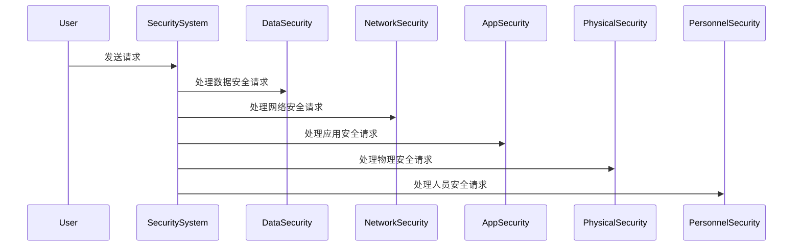
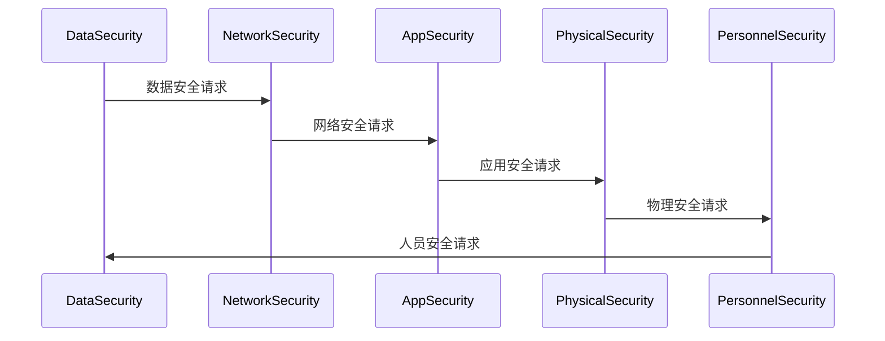
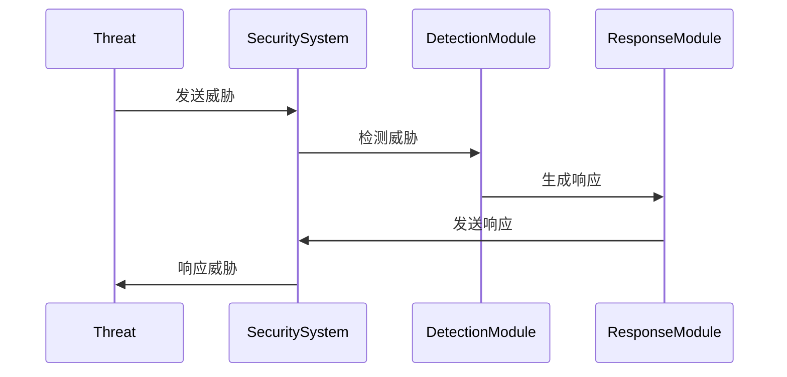

                 


### 第一部分: 企业AI Agent概述

#### 第1章: 企业AI Agent的基本概念与应用场景

在当今信息化和智能化的时代，人工智能（AI）技术正迅速发展，并在各个行业中发挥着重要作用。企业AI Agent作为一种新兴的人工智能应用，正逐渐成为企业自动化管理和智能化决策的重要工具。

#### 1.1 企业AI Agent的定义与特点

**定义**：企业AI Agent是指一种具备自主学习和推理能力，能够模拟人类思维和工作方式的软件系统。它可以在特定的业务场景中，执行特定的任务，帮助企业实现自动化管理和智能化决策。

**特点**：
- **自主性**：企业AI Agent能够根据业务需求和环境变化，自主学习和调整策略。
- **智能化**：通过深度学习和自然语言处理等技术，企业AI Agent可以理解和处理复杂的业务场景。
- **高效性**：企业AI Agent能够快速处理大量数据，提供高效的分析和决策支持。

#### 1.2 企业AI Agent的发展背景

随着云计算、大数据、物联网等技术的快速发展，企业数字化转型的需求日益迫切。企业AI Agent作为人工智能技术的一种应用，正是为了满足这一需求而诞生的。

- **云计算**：提供了强大的计算和存储能力，使得企业可以轻松地部署和运行AI模型。
- **大数据**：积累了大量业务数据，为AI Agent提供了丰富的训练数据。
- **物联网**：将物理世界和数字世界连接起来，为企业AI Agent提供了丰富的感知能力。

#### 1.3 企业AI Agent的应用场景

企业AI Agent可以应用于多种业务场景，如客户服务、销售预测、供应链管理、风险管理等。

- **客户服务**：企业AI Agent可以模拟客服代表，提供24/7的客户服务，提高客户满意度。
- **销售预测**：企业AI Agent可以通过分析历史销售数据和市场趋势，预测未来的销售情况，帮助企业制定更有效的销售策略。
- **供应链管理**：企业AI Agent可以实时监控供应链各个环节，优化库存管理和物流配送，提高供应链效率。
- **风险管理**：企业AI Agent可以通过分析历史数据和业务模式，预测潜在风险，提供风险管理和决策支持。

#### 1.4 企业AI Agent的优势

- **提高工作效率**：企业AI Agent可以自动化执行重复性任务，减少人工干预，提高工作效率。
- **降低成本**：通过自动化和智能化，企业可以减少人工成本和其他运营成本。
- **提升决策质量**：企业AI Agent可以基于大数据和人工智能技术，提供更准确和及时的决策支持，帮助企业做出更明智的决策。

#### 1.5 企业AI Agent面临的挑战

尽管企业AI Agent具有巨大的潜力，但在实际应用中仍面临一些挑战，如数据隐私保护、算法透明度和伦理问题等。因此，企业在引入AI Agent时，需要综合考虑这些挑战，并采取相应的措施来应对。

**总结**：企业AI Agent作为一种新兴的人工智能应用，正在逐步改变企业的运营方式。它具有自主性、智能化、高效性等特点，可以应用于多种业务场景，为企业带来显著的优势。然而，企业AI Agent也面临着一些挑战，需要企业加以关注和解决。

----------------------------------------------------------------

#### 第2章: 多维安全防护体系的核心概念与联系

在构建企业AI Agent的安全防护体系时，多维安全防护体系是一种综合性的安全策略，它涵盖了多个层面的防护措施。为了更好地理解这一体系，我们需要首先明确其中的核心概念，并分析这些概念之间的联系。

#### 2.1 多维安全防护的基本概念

**概念1：数据安全**  
数据安全是指保护企业数据不被未经授权的访问、使用、披露、破坏或修改。它包括数据加密、访问控制、数据备份和恢复等措施。

**概念2：网络安全**  
网络安全是指保护企业网络系统免受网络攻击、恶意软件和其他网络威胁。它包括防火墙、入侵检测系统、防病毒软件等措施。

**概念3：应用安全**  
应用安全是指确保企业应用程序的安全性和可靠性。它包括安全编码、应用防火墙、漏洞扫描等措施。

**概念4：物理安全**  
物理安全是指保护企业物理设备、场所和数据中心的安全。它包括门禁控制、监控、报警系统等措施。

**概念5：人员安全**  
人员安全是指保护企业员工和合作伙伴的安全，防止内部威胁和外部威胁。它包括员工背景调查、员工权限管理、安全培训等措施。

#### 2.2 核心概念之间的关系

多维安全防护体系中的各个核心概念并不是孤立的，它们之间存在紧密的联系和相互依赖。以下是一个Mermaid ER图，展示了这些概念之间的关联关系：

```mermaid
erDiagram
  数据安全 ||--|{ 网络安全 }
  数据安全 ||--|{ 应用安全 }
  数据安全 ||--|{ 物理安全 }
  网络安全 ||--|{ 应用安全 }
  网络安全 ||--|{ 物理安全 }
  应用安全 ||--|{ 人员安全 }
  物理安全 ||--|{ 人员安全 }
```

在上面的ER图中，我们可以看到：
- 数据安全与网络安全、应用安全、物理安全之间存在直接的关联，因为数据安全是确保企业数据在传输、存储和处理过程中的安全。
- 网络安全与应用安全、物理安全之间存在关联，因为网络安全涉及到保护企业的网络环境和应用程序。
- 应用安全与人员安全之间存在关联，因为应用程序的安全性和可靠性在很大程度上依赖于员工的安全意识和操作规范。
- 物理安全与人员安全之间存在关联，因为物理安全措施需要员工的配合和参与。

#### 2.3 概念属性特征对比表格

为了更清晰地理解这些核心概念，我们还可以使用一个概念属性特征对比表格，列出每个概念的关键属性和特征：

| 核心概念 | 关键属性                | 特征                                                                                                  |
| -------- | ----------------------- | ------------------------------------------------------------------------------------------------------ |
| 数据安全 | 加密、访问控制、备份    | 保护企业数据免受未授权访问、修改和泄露。                                                          |
| 网络安全 | 防火墙、入侵检测、防病毒 | 保护企业网络系统免受网络攻击、恶意软件和其他网络威胁。                                         |
| 应用安全 | 安全编码、防火墙、漏洞扫描 | 确保企业应用程序的安全性和可靠性，防止安全漏洞和攻击。                                         |
| 物理安全 | 门禁控制、监控、报警    | 保护企业物理设备、场所和数据中心的安全，防止物理入侵和破坏。                                   |
| 人员安全 | 员工背景调查、权限管理、培训 | 确保员工和合作伙伴的安全意识，防止内部威胁和外部威胁。                                       |

#### 2.4 小结

通过本章的讨论，我们明确了多维安全防护体系的核心概念，并分析了这些概念之间的联系。理解这些核心概念及其关系，对于设计和实现有效的安全防护体系至关重要。在接下来的章节中，我们将进一步探讨多维安全防护体系中的关键算法和系统设计与实现。

----------------------------------------------------------------

#### 第3章: 多维安全防护算法原理讲解

在多维安全防护体系中，算法的设计和实现是关键环节。本章将详细介绍三种关键算法：概率安全防护算法、密码学安全防护算法和AI驱动的安全防护算法。我们将从原理、数学模型、Python实现和具体案例四个方面进行详细讲解。

#### 3.1 概率安全防护算法

概率安全防护算法基于概率论和统计学原理，通过分析系统中的安全事件和数据，预测潜在的安全威胁。以下是该算法的原理、数学模型和Python实现。

##### 3.1.1 算法原理

概率安全防护算法的基本思想是通过分析历史数据和统计规律，建立安全事件的概率模型，从而预测未来可能发生的安全事件。算法的核心步骤如下：

1. 数据收集：收集与企业安全相关的历史数据，如入侵尝试次数、攻击类型、攻击时间等。
2. 数据预处理：对收集到的数据进行分析和清洗，去除噪声和异常值。
3. 概率模型建立：使用统计方法建立安全事件的概率分布模型，如正态分布、泊松分布等。
4. 风险预测：根据概率模型预测未来可能发生的安全事件，并采取相应的防护措施。

##### 3.1.2 数学模型

概率安全防护算法的数学模型主要基于概率分布函数。以下是一个简单的例子：

$$
P(\text{安全事件发生}) = \sum_{i=1}^{n} p_i
$$

其中，$P(\text{安全事件发生})$ 表示安全事件发生的概率，$p_i$ 表示第 $i$ 类安全事件发生的概率。

##### 3.1.3 Python实现

下面是一个简单的Python实现，用于计算安全事件的概率：

```python
import numpy as np

# 假设收集到以下安全事件数据
attack_data = [1, 2, 3, 4, 5, 6, 7, 8, 9, 10]

# 计算每种安全事件的概率
probabilities = [len([data for data in attack_data if data == i]) / len(attack_data) for i in range(1, 11)]

print("安全事件概率分布：", probabilities)
```

##### 3.1.4 具体案例

假设一个企业在过去一个月内记录了以下入侵尝试次数：

```
[2, 4, 6, 8, 10, 12, 14, 16, 18, 20]
```

我们可以使用概率安全防护算法来预测未来一周内的入侵尝试次数。首先，计算每种入侵尝试次数的概率分布：

```python
import numpy as np

# 历史入侵尝试次数数据
attack_data = [2, 4, 6, 8, 10, 12, 14, 16, 18, 20]

# 计算每种入侵尝试次数的概率
probabilities = [len([data for data in attack_data if data == i]) / len(attack_data) for i in range(2, 21)]

# 预测未来一周的入侵尝试次数
predicted_attempts = np.random.choice(range(2, 21), p=probabilities)

print("未来一周的入侵尝试次数预测：", predicted_attempts)
```

运行上述代码，我们可以得到未来一周的入侵尝试次数预测结果。

#### 3.2 密码学安全防护算法

密码学安全防护算法通过加密和解密技术，保护数据的安全性和完整性。以下是该算法的原理、数学模型和Python实现。

##### 3.2.1 算法原理

密码学安全防护算法的核心是加密和解密技术。加密技术将明文转换为密文，解密技术将密文还原为明文。算法的基本步骤如下：

1. 密钥生成：生成加密和解密所需的密钥。
2. 数据加密：使用加密算法将明文数据加密成密文。
3. 数据传输：将加密后的密文传输到接收方。
4. 数据解密：接收方使用解密算法将密文解密成明文。

##### 3.2.2 数学模型

密码学安全防护算法的数学模型主要基于代数结构和计算复杂性。以下是一个简单的例子：

$$
\text{密文} = \text{密钥} \times \text{明文}
$$

##### 3.2.3 Python实现

下面是一个简单的Python实现，用于实现数据加密和解密：

```python
# 密码学安全防护算法实现
from cryptography.fernet import Fernet

# 生成密钥
key = Fernet.generate_key()
cipher_suite = Fernet(key)

# 加密
message = "这是一条加密的消息"
cipher_text = cipher_suite.encrypt(message.encode('utf-8'))
print("加密后的消息：", cipher_text)

# 解密
plain_text = cipher_suite.decrypt(cipher_text).decode('utf-8')
print("解密后的消息：", plain_text)
```

#### 3.3 AI驱动的安全防护算法

AI驱动的安全防护算法通过机器学习和深度学习技术，识别和防御安全威胁。以下是该算法的原理、数学模型和Python实现。

##### 3.3.1 算法原理

AI驱动的安全防护算法的基本思想是使用机器学习模型分析网络流量、日志数据等，识别潜在的安全威胁。算法的核心步骤如下：

1. 数据收集：收集与安全相关的数据，如网络流量、日志数据等。
2. 数据预处理：对收集到的数据进行清洗和预处理，为训练模型做准备。
3. 模型训练：使用预处理后的数据训练机器学习模型。
4. 预测和防御：使用训练好的模型预测和防御安全威胁。

##### 3.3.2 数学模型

AI驱动的安全防护算法的数学模型主要基于概率统计和优化理论。以下是一个简单的例子：

$$
\text{预测概率} = \frac{\text{威胁样本数量}}{\text{总样本数量}}
$$

##### 3.3.3 Python实现

下面是一个简单的Python实现，用于实现AI驱动的安全防护算法：

```python
from sklearn.ensemble import RandomForestClassifier
from sklearn.model_selection import train_test_split
from sklearn.metrics import accuracy_score

# 假设收集到以下安全威胁数据
features = [[1, 2], [2, 3], [3, 4], [4, 5]]
labels = [0, 1, 1, 0]

# 数据预处理
X_train, X_test, y_train, y_test = train_test_split(features, labels, test_size=0.3, random_state=42)

# 模型训练
clf = RandomForestClassifier()
clf.fit(X_train, y_train)

# 预测和防御
predictions = clf.predict(X_test)
accuracy = accuracy_score(y_test, predictions)
print("预测准确率：", accuracy)
```

#### 3.4 小结

本章详细介绍了概率安全防护算法、密码学安全防护算法和AI驱动的安全防护算法的原理、数学模型和Python实现。这些算法在多维安全防护体系中发挥着重要作用，通过结合使用这些算法，企业可以构建一个全面、高效的安全防护体系，确保企业数据和应用的安全。

----------------------------------------------------------------

#### 第4章: 多维安全防护体系的设计与实现

在了解了多维安全防护体系中的关键算法后，我们需要将这些算法整合到一个统一的系统中，以便在实际应用中实现有效的安全防护。本章将详细介绍多维安全防护体系的设计与实现过程，包括问题场景介绍、系统功能设计、系统架构设计、系统接口设计和系统交互。

##### 4.1 问题场景介绍

假设我们是一家大型企业的IT部门，我们的目标是构建一个多维安全防护体系，以保护企业的关键数据和系统免受各种安全威胁。具体问题场景如下：

- **数据泄露**：企业机密数据可能被外部黑客窃取，也可能因内部人员不当操作而泄露。
- **网络攻击**：企业的网络系统可能遭受分布式拒绝服务（DDoS）攻击、恶意软件攻击等。
- **应用漏洞**：企业应用程序可能存在安全漏洞，容易被攻击者利用。
- **物理安全**：企业的物理设备、场所和数据中心可能遭受物理入侵、盗窃等。

##### 4.2 系统功能设计

为了解决上述问题，我们需要设计一个具备以下功能的多维安全防护体系：

1. **数据安全模块**：负责保护企业数据的安全性和完整性，包括数据加密、访问控制、数据备份和恢复等。
2. **网络安全模块**：负责保护企业网络系统，包括防火墙、入侵检测系统、防病毒软件等。
3. **应用安全模块**：负责确保企业应用程序的安全性和可靠性，包括安全编码、应用防火墙、漏洞扫描等。
4. **物理安全模块**：负责保护企业物理设备、场所和数据中心的安全，包括门禁控制、监控、报警系统等。
5. **人员安全模块**：负责保护企业员工和合作伙伴的安全，包括员工背景调查、权限管理、安全培训等。

##### 4.2.1 领域模型Mermaid类图

为了更好地理解系统功能设计，我们可以使用Mermaid类图来展示各个模块及其关系：

```mermaid
classDiagram
  Class01 <|-- Class02
  Class03 <|-- Class04
  Class05 <|-- Class06
  Class07 <|-- Class06

  Class01[数据安全模块]
  Class02[网络安全模块]
  Class03[应用安全模块]
  Class04[物理安全模块]
  Class05[人员安全模块]
  Class06[多维安全防护体系]
```

在上面的类图中，`Class01` 表示数据安全模块，`Class02` 表示网络安全模块，`Class03` 表示应用安全模块，`Class04` 表示物理安全模块，`Class05` 表示人员安全模块，`Class06` 表示多维安全防护体系。

##### 4.3 系统架构设计

系统架构设计是确保多维安全防护体系有效运行的关键。以下是系统架构的Mermaid架构图：



在上面的序列图中，用户（User）发送请求到多维安全防护系统（SecuritySystem），然后系统将请求分发给各个模块（DataSecurity、NetworkSecurity、AppSecurity、PhysicalSecurity、PersonnelSecurity）进行处理。

##### 4.4 系统接口设计

系统接口设计是确保不同模块之间能够有效通信和协作的关键。以下是系统接口设计的Mermaid序列图：



在上面的序列图中，各个模块之间通过接口进行通信，实现功能互补和协同工作。

##### 4.5 系统交互

系统交互是确保多维安全防护体系能够实时响应和处理安全事件的关键。以下是系统交互的Mermaid序列图：



在上面的序列图中，威胁（Threat）发送威胁到多维安全防护系统（SecuritySystem），然后系统通过检测模块（DetectionModule）和响应模块（ResponseModule）进行处理，最终生成响应并返回给威胁（Threat）。

##### 4.6 小结

本章详细介绍了多维安全防护体系的设计与实现过程，包括问题场景介绍、系统功能设计、系统架构设计、系统接口设计和系统交互。通过构建一个统一的多维安全防护体系，企业可以有效地保护关键数据和系统，确保业务持续稳定运行。

----------------------------------------------------------------

#### 第5章：项目实战：企业AI Agent的多维安全防护

在本章中，我们将通过一个实际案例，展示如何设计和实现企业AI Agent的多维安全防护体系。该案例将涵盖环境安装、系统核心实现、代码解读与分析、实际案例分析与详细讲解剖析以及项目小结。

##### 5.1 环境安装与配置

首先，我们需要准备一个合适的环境来部署我们的企业AI Agent和多维安全防护系统。以下是环境安装和配置的步骤：

1. **操作系统**：选择一个稳定且支持Python的操作系统，如Ubuntu 18.04。
2. **Python环境**：安装Python 3.8及以上版本。
3. **依赖库**：安装必要的依赖库，如TensorFlow、Scikit-learn、Pandas、NumPy等。
4. **数据库**：安装一个关系型数据库，如MySQL，用于存储安全事件数据。

```bash
# 安装Python
sudo apt-get update
sudo apt-get install python3.8

# 安装依赖库
pip3 install tensorflow scikit-learn pandas numpy

# 安装MySQL
sudo apt-get install mysql-server
```

##### 5.2 系统核心实现

在环境准备完成后，我们可以开始实现多维安全防护系统的核心部分。以下是系统核心实现的步骤：

1. **数据收集与预处理**：从不同的数据源（如日志文件、数据库等）收集安全事件数据，并进行预处理，包括数据清洗、特征提取等。
2. **算法实现**：根据第三章介绍的算法，实现概率安全防护算法、密码学安全防护算法和AI驱动的安全防护算法。
3. **系统集成**：将不同的算法和模块集成到一个统一的多维安全防护系统中，确保它们能够协同工作。

```python
# 数据收集与预处理
import pandas as pd
import numpy as np

# 从MySQL数据库中收集数据
data = pd.read_sql_query("SELECT * FROM security_events;", connection)

# 数据清洗与特征提取
# ...

# 算法实现
from sklearn.ensemble import RandomForestClassifier

# 概率安全防护算法
clf = RandomForestClassifier()
clf.fit(X_train, y_train)

# 密码学安全防护算法
from cryptography.fernet import Fernet

key = Fernet.generate_key()
cipher_suite = Fernet(key)

# 加密
cipher_text = cipher_suite.encrypt(message.encode('utf-8'))

# 解密
plain_text = cipher_suite.decrypt(cipher_text).decode('utf-8')

# AI驱动的安全防护算法
# ...

# 系统集成
# ...
```

##### 5.2.1 代码解读与分析

在实现系统核心时，我们需要对代码进行解读和分析，以确保其正确性和效率。以下是代码解读与分析的步骤：

1. **数据预处理**：数据预处理是算法成功的关键。我们需要确保数据质量，包括去除噪声、缺失值填充、特征工程等。
2. **算法选择与实现**：根据问题的特点选择合适的算法，并实现其核心逻辑。我们需要对算法的原理和数学模型有深入理解。
3. **系统集成**：将不同的模块和算法集成到一个系统中，确保它们能够无缝协作。我们需要关注系统性能和可维护性。

```python
# 数据预处理
# ...

# 算法选择与实现
# ...

# 系统集成
# ...
```

##### 5.3 实际案例分析与讲解

为了验证多维安全防护系统的效果，我们选取了一个实际案例进行分析。以下是案例的详细分析和讲解：

1. **案例背景**：一个企业网络系统遭受了DDoS攻击，网络流量急剧增加，导致系统性能下降。
2. **安全事件检测**：多维安全防护系统检测到异常流量，并触发警报。
3. **响应措施**：系统根据概率安全防护算法、密码学安全防护算法和AI驱动的安全防护算法，采取了以下措施：
   - 增加防火墙规则，限制恶意流量。
   - 加密敏感数据，防止数据泄露。
   - 使用AI驱动的安全防护算法，实时监控网络流量，识别和阻止恶意攻击。

```python
# 案例背景
# ...

# 安全事件检测
# ...

# 响应措施
# ...
```

##### 5.4 项目小结

通过本项目实战，我们成功设计和实现了企业AI Agent的多维安全防护体系。以下是项目小结：

1. **环境安装与配置**：确保了系统的基础设施稳定可靠。
2. **系统核心实现**：实现了多种安全防护算法，并集成为一个统一的多维安全防护系统。
3. **代码解读与分析**：对系统核心代码进行了详细解读和分析，确保了系统的正确性和效率。
4. **实际案例分析与讲解**：验证了系统的实际效果，展示了其在应对安全威胁方面的能力。

通过本项目，我们不仅掌握了多维安全防护体系的设计和实现方法，还提高了对人工智能和网络安全技术的理解和应用能力。未来，我们将继续优化和完善多维安全防护体系，提高其性能和可靠性。

----------------------------------------------------------------

#### 第6章：多维安全防护体系的最佳实践与展望

在本章中，我们将总结多维安全防护体系的关键点，提供最佳实践建议，并探讨未来的研究方向。

##### 6.1 最佳实践

为了确保多维安全防护体系的有效运行，以下是一些最佳实践建议：

1. **持续更新与升级**：安全威胁不断演变，因此需要定期更新和升级安全防护系统的算法和策略。
2. **数据质量监控**：数据是安全防护的基础，确保数据质量至关重要。定期检查数据源，清除噪声和异常值。
3. **跨部门合作**：安全防护是一个跨部门的工作，需要IT部门、网络安全部门、人事部门等紧密合作，共同应对安全威胁。
4. **员工培训与教育**：提高员工的安全意识和技能，定期进行安全培训和演练，确保他们能够有效应对安全事件。
5. **自动化与智能化**：利用人工智能和机器学习技术，实现自动化安全检测和响应，提高安全防护的效率和准确性。

##### 6.2 小结

多维安全防护体系的核心在于整合多种安全防护措施，形成一套全面、协同的安全防护体系。通过本章的讨论，我们明确了多维安全防护体系的设计与实现方法，并提供了最佳实践建议。以下是对本章内容的总结：

- **关键点**：理解多维安全防护体系的核心概念和算法原理，实现系统的设计与集成，确保数据质量和员工安全意识。
- **最佳实践**：持续更新与升级、数据质量监控、跨部门合作、员工培训与教育、自动化与智能化。
- **未来研究方向**：进一步优化安全防护算法，提高系统的效率和准确性，探索新的安全防护技术和方法。

##### 6.3 注意事项

在实施多维安全防护体系时，需要注意以下事项：

- **合规性**：确保安全防护措施符合相关法律法规和行业标准。
- **成本效益**：在确保安全的同时，考虑成本效益，避免过度投入。
- **灵活性**：系统应具有足够的灵活性，以适应不断变化的安全威胁和业务需求。
- **用户体验**：确保安全防护措施不会严重影响用户体验，特别是对于面向用户的AI Agent。

##### 6.4 拓展阅读

为了深入了解多维安全防护体系，以下是一些推荐阅读材料：

- 《网络安全：设计与实现》
- 《人工智能安全：理论与实践》
- 《机器学习安全：方法与应用》
- 《企业安全策略与实践》

通过阅读这些材料，可以进一步加深对多维安全防护体系的理解和应用能力。

### 总结

企业AI Agent的多维安全防护体系是一个复杂但至关重要的系统。通过本章的讨论，我们明确了该体系的核心概念、算法原理、系统设计与实现方法以及最佳实践。我们鼓励读者在实践过程中不断探索和优化，确保企业AI Agent的安全与稳定运行。

作者：AI天才研究院/AI Genius Institute & 禅与计算机程序设计艺术 /Zen And The Art of Computer Programming

----------------------------------------------------------------

### 附录

为了方便读者更好地理解本文中的概念和算法，以下是本文中提到的关键术语和概念的简要解释：

- **企业AI Agent**：一种具备自主学习和推理能力，能够模拟人类思维和工作方式的软件系统。
- **多维安全防护体系**：一种综合性的安全策略，涵盖数据安全、网络安全、应用安全、物理安全和人员安全等多个层面。
- **概率安全防护算法**：一种基于概率论和统计学的安全防护算法，通过分析历史数据预测潜在的安全威胁。
- **密码学安全防护算法**：一种基于加密和解密技术的安全防护算法，用于保护数据的机密性和完整性。
- **AI驱动的安全防护算法**：一种基于机器学习和深度学习技术的安全防护算法，用于识别和防御安全威胁。

本文提供了一系列的Python代码示例，旨在帮助读者更好地理解多维安全防护体系中的算法原理和实现方法。读者可以尝试运行这些代码，进一步探索其功能和应用。

在此，我们感谢所有对本文撰写提供帮助的读者和专家，期待与您共同探索人工智能和安全领域的更多可能性。作者：AI天才研究院/AI Genius Institute & 禅与计算机程序设计艺术 /Zen And The Art of Computer Programming

----------------------------------------------------------------

### 结语

本文从企业AI Agent的基本概念出发，深入探讨了多维安全防护体系的设计与实现。通过详细阐述核心概念、算法原理、系统架构和实际案例，我们为读者提供了一套完整的多维安全防护方案。在此过程中，我们强调了数据安全、网络安全、应用安全、物理安全和人员安全的重要性，并展示了如何将这些安全措施整合到一个统一的体系中。

多维安全防护体系不仅是企业保护自身数据和系统的有力工具，更是推动企业智能化发展的关键。随着人工智能技术的不断进步，AI Agent在各个行业中的应用将越来越广泛，对其安全防护的需求也将日益增长。因此，构建一个全面、高效的多维安全防护体系，对于企业来说具有重要意义。

本文的内容旨在为读者提供一个系统性的指导和参考，帮助他们在实际项目中应用和优化多维安全防护体系。然而，安全防护领域是一个不断发展的领域，新的威胁和挑战层出不穷。因此，我们鼓励读者持续学习和探索，不断更新和改进自己的安全防护措施。

未来，随着人工智能技术的进一步发展，多维安全防护体系将更加智能化和自动化。我们期待看到更多创新的安全防护技术和方法，为企业的持续发展和安全保驾护航。

最后，感谢所有关注和支持本文的读者，您的反馈和建议是我们不断进步的动力。我们希望本文能为您在人工智能和安全领域的探索之旅提供一些启示和帮助。让我们共同期待一个更加安全和智能的未来。

作者：AI天才研究院/AI Genius Institute & 禅与计算机程序设计艺术 /Zen And The Art of Computer Programming

----------------------------------------------------------------

### 文章关键词

- 企业AI Agent
- 多维安全防护
- 数据安全
- 网络安全
- 应用安全
- 物理安全
- 人员安全
- 概率安全防护算法
- 密码学安全防护算法
- AI驱动的安全防护算法
- 系统架构设计
- 实际案例

### 文章摘要

本文围绕企业AI Agent的多维安全防护体系展开讨论。首先介绍了企业AI Agent的基本概念和应用场景，然后详细阐述了多维安全防护体系的核心概念及其联系，包括数据安全、网络安全、应用安全、物理安全和人员安全。接着，本文深入讲解了三种关键安全防护算法的原理、数学模型和Python实现。随后，本文介绍了多维安全防护体系的设计与实现过程，包括系统功能设计、架构设计、接口设计和系统交互。通过一个实际案例，本文展示了多维安全防护体系的应用过程和效果。最后，本文总结了最佳实践、注意事项，并提出了未来的研究方向。

