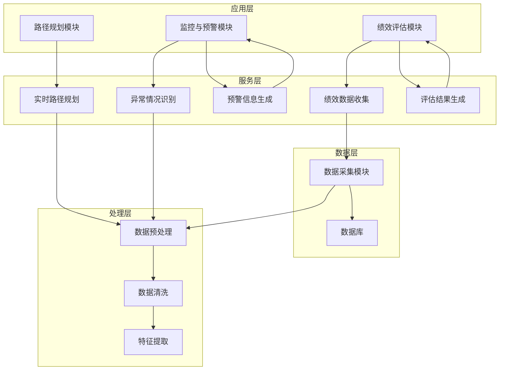
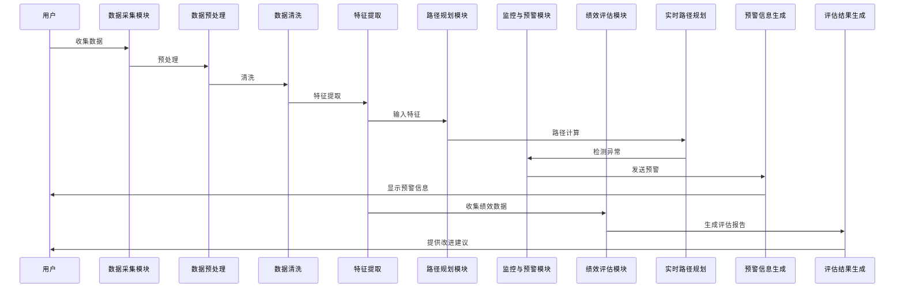

                 


## 引言

在当今的数字化时代，人工智能（AI）技术正迅速渗透到企业运营的各个方面，而企业AI Agent作为AI技术在企业级应用的重要载体，正逐渐成为企业智能化转型的关键驱动力。企业AI Agent是指专门为企业设计的，能够执行特定任务、提供决策支持、优化业务流程的人工智能系统。随着物联网（IoT）技术的发展，企业AI Agent的应用场景也在不断扩展，从传统的PC端扩展到智能手机、智能手表、智能家居设备、工业物联网设备等。

这种扩展带来了新的挑战，如何确保企业AI Agent在不同类型的设备上都能高效运行，实现从PC到IoT的全覆盖，成为了当前研究和应用的重点。本文将围绕这一核心问题，深入探讨企业AI Agent的多设备支持策略。文章的主要目的是：

1. 明确企业AI Agent在多设备支持策略上面临的挑战。
2. 分析实现从PC到IoT全覆盖的方法和策略。
3. 探讨AI Agent在多设备环境下的设计原则、跨平台开发、性能优化、安全性和隐私保护等方面的关键问题。

本文将首先介绍企业AI Agent的基本概念和其在多设备支持中的重要性，然后详细分析不同设备的特性及其对AI Agent的需求，接着讲解实现多设备支持的算法原理，并使用具体的实例进行说明。随后，我们将介绍一个实际的企业AI Agent项目，分析其系统架构和功能设计，并提供实际开发过程中的核心代码和案例解析。最后，我们将总结最佳实践，提出未来可能的发展方向，并推荐进一步学习资源。

通过本文的阅读，读者将能够全面了解企业AI Agent的多设备支持策略，掌握从理论到实践的全方位知识，为在实际项目中应用AI Agent奠定坚实的基础。

## 关键词

- 企业AI Agent
- 多设备支持
- IoT
- 跨平台开发
- 性能优化
- 安全性
- 隐私保护
- 跨平台算法
- 系统架构设计
- 实际项目应用

## 摘要

本文探讨了企业AI Agent在多设备支持策略上的应用，从问题背景、核心概念、算法原理到系统分析与架构设计，全面解析了AI Agent在PC到IoT全场景中的支持策略。通过分析不同设备的特性，本文提出了一套跨平台开发的方法，并详细阐述了实现多设备支持的算法原理和具体案例。同时，本文介绍了一个实际的企业AI Agent项目，展示了其系统架构和功能设计，并提供了核心代码和案例分析。最后，本文总结了最佳实践，提出了未来发展的方向和进一步学习资源，旨在为读者提供全面、深入的技术指南。

## 背景介绍

### 1.1.1 物联网时代的发展与AI Agent的需求

物联网（IoT）时代的到来，为企业运营带来了翻天覆地的变化。随着各种智能设备的普及，企业内部的数据来源变得多样化，数据的实时性和复杂性大大提升。物联网通过将各种物理设备互联，使得企业能够实时收集和监控生产流程、物流信息、设备状态等关键数据，从而实现更高效、更智能的管理。

在这一背景下，企业AI Agent的需求日益凸显。企业AI Agent，也被称为企业级人工智能代理，是指专门为企业设计的，能够执行特定任务、提供决策支持、优化业务流程的人工智能系统。与传统的人工智能应用不同，企业AI Agent通常具有更强的业务理解和适应性，能够更好地整合企业内部的数据和资源，实现智能化的业务运营。

物联网的发展为AI Agent提供了丰富的应用场景。例如，在生产制造领域，AI Agent可以通过分析设备状态数据，预测设备故障，提前安排维护，从而减少停机时间和生产成本；在物流管理领域，AI Agent可以通过分析物流数据，优化运输路线，提高物流效率；在企业管理领域，AI Agent可以分析员工绩效数据，提供人才管理和培养建议，提升整体工作效率。

总之，随着物联网的普及，企业AI Agent的应用场景不断扩大，从传统的PC端扩展到各种智能设备，这既带来了新的机遇，也提出了新的挑战。如何在各种设备上实现AI Agent的高效运行，成为当前企业智能化转型过程中亟待解决的问题。

### 1.1.2 多设备支持策略的重要性

多设备支持策略在企业AI Agent的应用中具有重要意义。首先，它能够确保AI Agent在不同设备上的兼容性和一致性。不同设备具有不同的硬件配置、操作系统和用户界面，如果AI Agent不能在这些设备上无缝运行，将极大影响用户体验和业务效果。因此，制定一套有效的多设备支持策略，是实现AI Agent广泛应用的基础。

其次，多设备支持策略能够提升AI Agent的灵活性和可扩展性。随着物联网设备的不断增多，企业可能需要将AI Agent部署到更多种类的设备上，如智能手表、智能家居设备、工业物联网设备等。一套良好的多设备支持策略，能够帮助企业在不同的设备上快速部署AI Agent，提高开发效率和业务响应速度。

此外，多设备支持策略还能够优化AI Agent的性能和资源利用。不同设备的硬件性能和资源限制不同，通过合理设计AI Agent的架构和算法，可以在各种设备上实现最佳性能，同时最大限度地利用设备资源，提高系统的整体效能。

总的来说，多设备支持策略不仅能够提高AI Agent的兼容性和灵活性，还能够优化其性能和资源利用，是企业实现全面智能化转型的关键。

### 1.1.3 实现从PC到IoT全覆盖的挑战

实现企业AI Agent从PC到IoT的全覆盖面临着诸多挑战。首先，不同设备具有显著的硬件差异，例如PC通常配备高性能CPU和大量内存，而IoT设备则可能只有有限的计算资源和存储空间。这种硬件差异要求AI Agent在设计和实现时必须考虑到资源限制，确保算法和系统架构能够在各种设备上高效运行。

其次，操作系统和用户界面也是一大挑战。PC通常使用Windows、macOS或Linux等操作系统，而IoT设备则可能运行嵌入式系统或特定厂商的操作系统，如Android Wear、Apple WatchOS等。不同操作系统和用户界面的差异，使得AI Agent的开发和适配工作复杂化，需要开发人员具备跨平台开发的能力。

此外，数据的安全性和隐私保护也是实现全覆盖的重要挑战。在物联网环境中，设备之间的数据传输更加频繁和复杂，如何确保数据在传输和存储过程中的安全性，防止数据泄露或被恶意攻击，是AI Agent设计中必须解决的问题。

最后，用户体验的一致性和可扩展性也是需要考虑的因素。在从PC到IoT的全覆盖过程中，企业需要确保用户在不同设备上都能获得一致、流畅的体验，同时能够方便地扩展到新的设备类型，以满足不断变化的市场需求。

总之，实现企业AI Agent从PC到IoT的全覆盖，需要在硬件兼容性、操作系统适配、数据安全和用户体验等方面进行全面考虑和优化，这是一项复杂而具有挑战性的任务。

### 1.2 核心概念与联系

#### 1.2.1 AI Agent的定义与功能

人工智能代理（AI Agent）是一种能够自主决策、执行任务并与其他系统交互的智能实体。AI Agent的设计初衷是模拟人类智能行为，通过感知环境、分析数据、制定决策和执行行动，实现智能化任务处理和业务优化。AI Agent的基本功能包括：

1. **感知环境**：通过传感器、摄像头、麦克风等设备收集环境数据。
2. **数据分析**：利用机器学习、深度学习等技术对收集的数据进行处理和分析。
3. **决策制定**：基于分析结果，AI Agent能够自主制定决策，选择最佳行动方案。
4. **执行行动**：执行预定的任务或决策，如发送指令、控制设备等。
5. **交互能力**：AI Agent需要能够与用户、其他系统或设备进行交互，提供反馈和响应。

#### 1.2.2 设备特性对比与分析

不同类型的设备在硬件性能、操作系统、用户界面等方面存在显著差异，这些差异直接影响AI Agent的设计和实现。以下是对几种常见设备特性的对比分析：

1. **PC**：
   - **硬件性能**：通常配备高性能CPU、大量内存和高速网络连接。
   - **操作系统**：常见有Windows、macOS和Linux。
   - **用户界面**：提供丰富的桌面和命令行界面，支持多任务处理和复杂操作。

2. **智能手机**：
   - **硬件性能**：处理器性能和内存相对PC较低，但具有更好的电池续航和移动性。
   - **操作系统**：主要运行Android或iOS操作系统。
   - **用户界面**：以触摸屏为主，支持手势操作和移动应用。

3. **智能手表**：
   - **硬件性能**：更小、更轻，处理器和内存相对智能手机更低。
   - **操作系统**：常见有Android Wear和Apple WatchOS。
   - **用户界面**：以小屏幕为主，操作简单，主要用于实时监控和提醒。

4. **智能家居设备**：
   - **硬件性能**：通常为嵌入式系统，处理器和内存有限。
   - **操作系统**：多为专用操作系统或基于Linux。
   - **用户界面**：通常通过移动应用或语音助手（如Amazon Alexa、Google Assistant）进行控制。

5. **工业物联网设备**：
   - **硬件性能**：特殊定制，强调稳定性和可靠性。
   - **操作系统**：常使用嵌入式Linux或实时操作系统（RTOS）。
   - **用户界面**：一般通过工业控制面板或移动设备进行监控和操作。

#### 1.2.3 AI Agent与设备交互关系

AI Agent与不同设备的交互关系是设计多设备支持策略的关键。以下是AI Agent与几种设备之间的基本交互关系：

1. **PC**：AI Agent可以通过桌面应用或Web应用与用户交互，执行复杂的任务处理和分析。PC的高性能使得AI Agent能够运行复杂的算法和模型，同时提供丰富的交互界面。

2. **智能手机**：AI Agent可以通过移动应用与用户交互，提供即时信息和提醒。智能手机的便携性和触摸屏操作使得用户可以随时随地访问AI Agent的功能。

3. **智能手表**：AI Agent可以通过智能手表的小屏幕提供实时监控和提醒功能，如心率监测、日程提醒等。智能手表的续航能力和轻便性使得用户可以随时查看关键信息。

4. **智能家居设备**：AI Agent可以通过语音助手与智能家居设备交互，实现设备控制和自动化管理。智能家居设备的多样性使得AI Agent能够覆盖从照明、空调到安全监控等各种应用场景。

5. **工业物联网设备**：AI Agent可以通过工业控制面板或移动设备与工业物联网设备交互，实现生产流程监控、设备维护和故障预测。工业物联网设备的稳定性和可靠性要求AI Agent具备高效、可靠的通信和数据处理能力。

综上所述，AI Agent在不同设备上的特性和交互关系不同，需要针对不同设备的特点进行设计和优化，以实现从PC到IoT的全覆盖。

### 1.3 算法原理讲解

#### 1.3.1 AI Agent跨平台工作流程

为了实现企业AI Agent从PC到IoT的全覆盖，我们需要设计一套跨平台的工作流程，以确保AI Agent能够在各种设备上高效运行。以下是一个典型的AI Agent跨平台工作流程：

1. **数据收集与预处理**：
   - AI Agent从各种设备（如PC、智能手机、智能手表、智能家居设备和工业物联网设备）收集数据。
   - 数据收集后，进行预处理，包括去噪、归一化和特征提取等步骤。

2. **数据处理与模型训练**：
   - AI Agent使用机器学习或深度学习算法对预处理后的数据进行训练，构建预测模型。
   - 模型训练过程中，需要考虑不同设备的计算资源限制，优化模型参数，以确保模型在小设备上也能高效运行。

3. **模型部署与推理**：
   - 将训练好的模型部署到不同设备上，实现实时推理和预测。
   - 针对不同设备的硬件性能和资源限制，采用轻量级模型或优化算法，确保模型在设备上快速运行。

4. **决策与执行**：
   - 根据模型推理结果，AI Agent制定决策并执行相应任务，如设备控制、数据更新、提醒发送等。

5. **反馈与优化**：
   - 收集用户反馈和设备性能数据，对AI Agent进行优化和调整，提高其适应性和性能。

#### 1.3.2 实现多设备支持的算法原理

实现AI Agent在多设备上的支持，需要从算法原理和架构设计两个方面进行深入探讨。以下是一些关键的算法原理：

1. **模型压缩与量化**：
   - 模型压缩通过减少模型参数数量和计算复杂度，降低模型的存储和计算需求。
   - 模型量化通过减少模型参数的精度，进一步减少模型的存储和计算资源需求。
   - 这些技术使得AI Agent能够在计算资源有限的设备上高效运行。

2. **分布式计算与并行处理**：
   - 分布式计算将AI Agent的任务分解到多个设备上，实现并行处理，提高整体计算效率。
   - 并行处理通过同时执行多个计算任务，缩短任务完成时间，提高系统响应速度。

3. **轻量级算法与优化**：
   - 针对计算资源受限的设备，采用轻量级算法，如深度卷积神经网络（MobileNet、SqueezeNet）等，降低模型复杂度和计算需求。
   - 通过算法优化，如梯度下降算法的改进（Adam、RMSprop），提高模型训练效率和收敛速度。

4. **边缘计算与云计算协同**：
   - 边缘计算将计算任务分布在边缘设备和云端，充分利用边缘设备的计算能力和云端的存储和计算资源。
   - 通过边缘计算与云计算的协同，实现AI Agent的全覆盖，提高系统的整体性能和响应速度。

#### 1.3.3 Python源代码示例

为了更好地理解AI Agent在不同设备上的工作流程和算法原理，我们提供一些Python源代码示例。以下是一个简单的AI Agent模型训练和部署的代码示例：

```python
import tensorflow as tf
from tensorflow.keras.models import Sequential
from tensorflow.keras.layers import Dense, Conv2D, Flatten
import numpy as np

# 数据预处理
def preprocess_data(data):
    # 数据去噪、归一化和特征提取
    processed_data = ...
    return processed_data

# 模型训练
def train_model(train_data, train_labels):
    model = Sequential([
        Conv2D(filters=32, kernel_size=(3,3), activation='relu', input_shape=(64,64,3)),
        Flatten(),
        Dense(units=64, activation='relu'),
        Dense(units=1, activation='sigmoid')
    ])

    model.compile(optimizer='adam', loss='binary_crossentropy', metrics=['accuracy'])
    model.fit(train_data, train_labels, epochs=10, batch_size=32)
    return model

# 模型部署
def deploy_model(model, device):
    if device == 'PC':
        model.save('model_pc.h5')
    elif device == 'Smartphone':
        model.save('model_smartphone.h5')
    elif device == 'Smartwatch':
        model.save('model_smartwatch.h5')
    else:
        print("Unsupported device")

# 主程序
if __name__ == '__main__':
    # 加载数据
    train_data = np.load('train_data.npy')
    train_labels = np.load('train_labels.npy')

    # 数据预处理
    processed_train_data = preprocess_data(train_data)

    # 模型训练
    model = train_model(processed_train_data, train_labels)

    # 模型部署
    deploy_model(model, 'PC')
    deploy_model(model, 'Smartphone')
    deploy_model(model, 'Smartwatch')
```

该代码示例展示了如何使用TensorFlow框架训练一个简单的二分类模型，并针对不同的设备部署模型。在实际应用中，模型训练和部署过程会更加复杂，需要考虑数据预处理、模型压缩、量化、分布式计算等多种技术。

#### 1.3.4 数学模型与公式

在AI Agent的多设备支持中，数学模型和公式发挥着重要作用。以下是一些关键的数学模型和公式：

1. **卷积神经网络（CNN）**：
   - **卷积操作**：用于提取图像特征，公式为：
     $$ f(x, y) = \sum_{i=1}^{k} \sum_{j=1}^{k} w_{ij} * x_{i, j} $$
     其中，\( w_{ij} \) 是卷积核，\( x_{i, j} \) 是输入图像的像素值。

   - **激活函数**：常用的激活函数有ReLU、Sigmoid和ReLU，公式为：
     $$ \text{ReLU}(x) = \max(0, x) $$
     $$ \text{Sigmoid}(x) = \frac{1}{1 + e^{-x}} $$

2. **深度学习优化算法**：
   - **梯度下降（GD）**：用于模型训练，公式为：
     $$ w_{t+1} = w_{t} - \alpha \frac{\partial J(w)}{\partial w} $$
     其中，\( w \) 是模型参数，\( \alpha \) 是学习率，\( J(w) \) 是损失函数。

   - **随机梯度下降（SGD）**：在梯度下降的基础上，每次更新参数时使用随机样本，公式为：
     $$ w_{t+1} = w_{t} - \alpha \frac{\partial J(w)}{\partial w} $$
     其中，\( S \) 是训练数据集的随机子集。

   - **Adam优化器**：结合SGD和动量法的优化器，公式为：
     $$ \beta_1, \beta_2 \in [0, 1) $$
     $$ m_t = \beta_1 m_{t-1} + (1 - \beta_1) \frac{\partial J(w)}{\partial w} $$
     $$ v_t = \beta_2 v_{t-1} + (1 - \beta_2) \left(\frac{\partial J(w)}{\partial w}\right)^2 $$
     $$ \hat{m}_t = \frac{m_t}{1 - \beta_1^t} $$
     $$ \hat{v}_t = \frac{v_t}{1 - \beta_2^t} $$
     $$ w_{t+1} = w_{t} - \alpha \frac{\hat{m}_t}{\sqrt{\hat{v}_t} + \epsilon} $$
     其中，\( m_t \) 和 \( v_t \) 分别是梯度的一阶和二阶矩估计，\( \beta_1 \) 和 \( \beta_2 \) 是一阶和二阶矩的衰减率，\( \alpha \) 是学习率，\( \epsilon \) 是小常数。

#### 1.3.5 算法应用举例

为了更直观地理解AI Agent的算法应用，以下是一个实际应用场景：

假设一个企业需要开发一个AI Agent，用于预测员工的工作绩效。以下是该应用场景的算法应用步骤：

1. **数据收集**：
   - 从公司的数据库中收集员工的工作时间、工作量、工作效率等数据。

2. **数据预处理**：
   - 对收集的数据进行清洗，去除异常值和缺失值。
   - 对连续数据进行归一化处理，使其在相同的量级范围内。

3. **特征提取**：
   - 利用机器学习算法提取关键特征，如员工的工作负荷、工作质量和工作时长等。

4. **模型训练**：
   - 使用训练数据集，通过梯度下降或Adam优化器训练一个深度学习模型，如多层感知器（MLP）或卷积神经网络（CNN）。
   - 模型训练过程中，使用交叉验证技术评估模型的泛化能力。

5. **模型部署**：
   - 将训练好的模型部署到企业服务器和员工的智能手机上，实现实时预测和反馈。

6. **决策与执行**：
   - 根据模型预测结果，提供员工绩效评估报告和改进建议。
   - 自动化调整员工的工作任务和资源分配，优化工作流程。

7. **反馈与优化**：
   - 收集员工的反馈和实际绩效数据，对模型进行重新训练和优化。
   - 通过迭代优化，提高模型的准确性和适应性。

通过这个实际应用场景，我们可以看到AI Agent在多设备支持策略下的完整工作流程和算法应用。这不仅展示了算法在解决实际问题中的效果，也验证了多设备支持策略的可行性和重要性。

### 1.4 系统分析与架构设计方案

#### 1.4.1 企业AI Agent应用场景介绍

企业AI Agent的应用场景广泛，涵盖了生产制造、物流管理、企业管理等多个领域。以下将分别介绍这些场景中AI Agent的具体应用。

1. **生产制造**：
   在生产制造领域，企业AI Agent可以通过实时监控生产设备状态、分析生产数据，预测设备故障，提前安排维护，从而减少设备停机时间和生产成本。同时，AI Agent可以优化生产流程，提高生产效率，如通过预测性维护减少设备故障率，通过优化生产顺序降低能耗。

2. **物流管理**：
   在物流管理领域，企业AI Agent可以分析物流数据，优化运输路线，提高物流效率。例如，通过分析实时交通状况和货物重量，AI Agent可以动态调整运输路线，减少运输时间和成本。此外，AI Agent还可以监控物流运输过程中的异常情况，如货物丢失或损坏，及时采取措施解决问题。

3. **企业管理**：
   在企业管理领域，企业AI Agent可以通过分析员工绩效数据，提供人才管理和培养建议，提升整体工作效率。例如，通过分析员工的工作时间和工作量，AI Agent可以识别高绩效员工和低绩效员工，为企业管理者提供针对性的培训和发展计划。此外，AI Agent还可以帮助企业进行成本控制和资源优化，提高企业盈利能力。

总之，企业AI Agent在不同领域的应用，不仅能够提高企业的运营效率，还能够为企业带来显著的商业价值。

#### 1.4.2 实际项目介绍

为了更好地展示企业AI Agent的多设备支持策略，以下介绍一个实际的项目——智慧物流管理系统。

**项目背景**：
随着电商业务的迅猛发展，物流行业面临着巨大的压力和挑战。如何在复杂多变的物流环境中提高运输效率、降低运营成本、提升客户满意度，成为物流企业亟待解决的问题。本项目旨在通过引入AI技术，构建一个智慧物流管理系统，实现物流过程的智能化和高效化。

**项目目标**：
- **运输路径优化**：通过分析实时交通状况和货物信息，动态调整运输路线，提高运输效率。
- **运输过程监控**：实时监控运输过程中的异常情况，如货物丢失或损坏，及时采取措施解决问题。
- **绩效评估与优化**：分析物流人员的绩效数据，提供改进建议，提升整体工作效率。

**项目功能**：
1. **实时路径规划**：
   - 收集实时交通数据、货物信息和运输历史数据。
   - 利用机器学习算法分析数据，预测最优运输路线。
   - 根据运输过程中的变化，动态调整路线，确保运输的实时性和可靠性。

2. **运输过程监控**：
   - 通过传感器和GPS技术，实时监控运输车辆的位置、速度和状态。
   - 分析监控数据，识别异常情况，如货物丢失、损坏或车辆故障。
   - 根据异常情况，自动发送通知，并生成相应的解决方案。

3. **绩效评估与优化**：
   - 收集物流人员的绩效数据，包括工作时间、工作量和工作质量。
   - 利用机器学习算法分析数据，评估物流人员的绩效水平。
   - 根据评估结果，提供针对性的培训和发展计划，优化人力资源配置。

**项目架构**：
本项目的系统架构采用微服务架构，包括以下几个核心模块：

1. **数据采集模块**：负责收集实时交通数据、货物信息和运输历史数据。
2. **数据处理模块**：负责数据的清洗、归一化和特征提取。
3. **路径规划模块**：负责根据实时数据和预测模型，规划最优运输路线。
4. **监控与预警模块**：负责实时监控运输过程，识别异常情况，并生成预警信息。
5. **绩效评估模块**：负责分析物流人员的绩效数据，提供评估结果和建议。

通过以上模块的协同工作，本项目实现了物流过程的智能化和高效化，为企业带来了显著的商业价值。

#### 1.4.3 系统功能设计（mermaid类图）

以下是一个智慧物流管理系统的mermaid类图，展示了系统的核心领域模型：

```mermaid
classDiagram
    类::数据采集模块 <-..|> 类::数据处理模块
    类::数据处理模块 <-..|> 类::路径规划模块
    类::数据处理模块 <-..|> 类::监控与预警模块
    类::监控与预警模块 <-..|> 类::绩效评估模块
    类::路径规划模块 <-..|> 类::实时路径规划
    类::数据处理模块 <-..|> 类::数据清洗
    类::数据处理模块 <-..|> 类::特征提取
    类::路径规划模块 <-..|> 类::最优路线预测
    类::监控与预警模块 <-..|> 类::异常情况识别
    类::监控与预警模块 <-..|> 类::预警信息生成
    类::绩效评估模块 <-..|> 类::绩效数据收集
    类::绩效评估模块 <-..|> 类::评估结果生成

    类::数据采集模块 {
        - 数据源
        - 数据采集器
    }

    类::数据处理模块 {
        - 数据清洗
        - 特征提取
    }

    类::路径规划模块 {
        - 实时路径规划
        - 最优路线预测
    }

    类::监控与预警模块 {
        - 异常情况识别
        - 预警信息生成
    }

    类::绩效评估模块 {
        - 绩效数据收集
        - 评估结果生成
    }

    类::实时路径规划 {
        - 路径计算
        - 路径优化
    }

    类::数据清洗 {
        - 数据去噪
        - 数据归一化
    }

    类::特征提取 {
        - 特征提取算法
        - 特征选择
    }

    类::最优路线预测 {
        - 预测模型
        - 预测结果
    }

    类::异常情况识别 {
        - 监控算法
        - 异常检测
    }

    类::预警信息生成 {
        - 异常通知
        - 解决方案
    }

    类::绩效数据收集 {
        - 工作时间记录
        - 工作量统计
    }

    类::评估结果生成 {
        - 绩效评估
        - 改进建议
    }
```

该类图清晰地展示了智慧物流管理系统中的核心功能模块及其相互关系，有助于理解系统的整体架构和功能设计。

#### 1.4.4 系统架构设计（mermaid架构图）

以下是一个智慧物流管理系统的mermaid架构图，展示了系统的整体架构和组件之间的关系：



该架构图展示了智慧物流管理系统从数据采集、数据预处理、特征提取到应用层各模块之间的数据流和关系，有助于理解系统的整体架构和各组件的功能。

#### 1.4.5 系统接口设计和系统交互（mermaid序列图）

以下是一个智慧物流管理系统的mermaid序列图，展示了系统的接口设计和各模块之间的交互流程：



该序列图详细展示了智慧物流管理系统从数据采集到预警生成和绩效评估的完整流程，有助于理解系统各模块之间的交互和协作机制。

### 1.5 项目实战

#### 1.5.1 开发环境搭建

要搭建一个企业AI Agent的多设备支持开发环境，首先需要确保安装以下工具和软件：

1. **操作系统**：推荐使用Linux发行版，如Ubuntu 20.04或更高版本。
2. **编程语言**：Python 3.7或更高版本。
3. **依赖管理工具**：pip（Python的包管理工具）。
4. **集成开发环境（IDE）**：PyCharm或VSCode。
5. **机器学习库**：TensorFlow、Keras。
6. **跨平台开发库**：Flutter或React Native（用于移动应用开发）。
7. **版本控制工具**：Git。

安装步骤如下：

1. 安装操作系统和Python环境：

   ```bash
   sudo apt update
   sudo apt upgrade
   sudo apt install python3 python3-pip
   ```

2. 安装TensorFlow和Keras：

   ```bash
   pip3 install tensorflow
   pip3 install keras
   ```

3. 安装PyCharm或VSCode：

   - 对于PyCharm：前往JetBrains官网下载PyCharm Community Edition，并安装。
   - 对于VSCode：前往Visual Studio Code官网下载，并安装。

4. 安装Flutter或React Native：

   - 安装Flutter：

     ```bash
     sudo apt-get install android-studio
     flutter install
     ```

   - 安装React Native：

     ```bash
     sudo npm install -g react-native-cli
     ```

5. 配置版本控制工具Git：

   ```bash
   sudo apt-get install git
   ```

确保所有工具和软件安装完成后，运行以下命令测试环境配置：

```bash
python3 --version
pip3 --version
flutter doctor
```

如果所有命令都能够成功运行，则表示开发环境搭建成功。

#### 1.5.2 AI Agent核心实现源代码

以下是一个简单的AI Agent核心实现源代码示例，用于演示AI Agent的基本功能。该示例包含数据收集、预处理、模型训练、预测和执行任务的步骤。

```python
import tensorflow as tf
from tensorflow.keras.models import Sequential
from tensorflow.keras.layers import Dense, Conv2D, Flatten
import numpy as np

# 数据预处理函数
def preprocess_data(data):
    # 数据去噪、归一化和特征提取
    processed_data = data / 255.0
    return processed_data

# 模型训练函数
def train_model(train_data, train_labels):
    model = Sequential([
        Conv2D(filters=32, kernel_size=(3,3), activation='relu', input_shape=(64,64,3)),
        Flatten(),
        Dense(units=64, activation='relu'),
        Dense(units=1, activation='sigmoid')
    ])

    model.compile(optimizer='adam', loss='binary_crossentropy', metrics=['accuracy'])
    model.fit(train_data, train_labels, epochs=10, batch_size=32)
    return model

# 预测函数
def predict(model, data):
    processed_data = preprocess_data(data)
    prediction = model.predict(processed_data)
    return prediction

# 执行任务函数
def execute_task(prediction):
    if prediction > 0.5:
        print("执行任务A")
    else:
        print("执行任务B")

# 主程序
if __name__ == '__main__':
    # 加载数据
    train_data = np.load('train_data.npy')
    train_labels = np.load('train_labels.npy')

    # 数据预处理
    processed_train_data = preprocess_data(train_data)

    # 模型训练
    model = train_model(processed_train_data, train_labels)

    # 预测和执行任务
    test_data = np.load('test_data.npy')
    for data in test_data:
        prediction = predict(model, data)
        execute_task(prediction)
```

该代码展示了如何使用TensorFlow和Keras构建一个简单的深度学习模型，并进行训练、预测和任务执行。在实际应用中，AI Agent会更加复杂，包括多设备支持、分布式计算、边缘计算等功能。

#### 1.5.3 核心代码解读与分析

在上面的核心代码示例中，我们使用了Python的TensorFlow库来构建和训练一个简单的深度学习模型，下面我们将对代码的各个部分进行详细解读和分析。

1. **数据预处理函数**：
   ```python
   def preprocess_data(data):
       # 数据去噪、归一化和特征提取
       processed_data = data / 255.0
       return processed_data
   ```

   在数据预处理函数中，我们首先对输入数据进行归一化处理。对于图像数据，通常需要将其像素值范围从0到255归一化到0到1之间。这样做的目的是为了使模型训练过程中参数的更新更加稳定和有效。归一化处理后的数据更接近于模型的期望输入范围，有助于提高模型的训练效率和预测准确性。

2. **模型训练函数**：
   ```python
   def train_model(train_data, train_labels):
       model = Sequential([
           Conv2D(filters=32, kernel_size=(3,3), activation='relu', input_shape=(64,64,3)),
           Flatten(),
           Dense(units=64, activation='relu'),
           Dense(units=1, activation='sigmoid')
       ])

       model.compile(optimizer='adam', loss='binary_crossentropy', metrics=['accuracy'])
       model.fit(train_data, train_labels, epochs=10, batch_size=32)
       return model
   ```

   在模型训练函数中，我们首先定义了一个序列模型（Sequential），并添加了三个层：一个卷积层（Conv2D）、一个全连接层（Dense）和一个输出层（Dense）。卷积层用于提取图像特征，全连接层用于分类和回归任务。在这个例子中，我们使用了一个简单的二分类任务，因此输出层使用了一个sigmoid激活函数。

   接下来，我们编译模型，指定优化器为'adam'，损失函数为'binary_crossentropy'，评估指标为'accuracy'。'adam'优化器是一种高效的梯度下降方法，'binary_crossentropy'损失函数适合二分类问题，'accuracy'评估指标用于计算模型的准确率。

   最后，我们使用`fit`方法训练模型，传递训练数据和标签，设置训练轮数（epochs）为10，批量大小（batch_size）为32。训练过程中，模型将自动进行前向传播和反向传播，不断调整模型参数，以最小化损失函数。

3. **预测函数**：
   ```python
   def predict(model, data):
       processed_data = preprocess_data(data)
       prediction = model.predict(processed_data)
       return prediction
   ```

   预测函数首先对输入数据进行预处理，然后使用训练好的模型进行预测。`predict`方法返回一个预测结果数组，每个元素表示模型对输入数据的预测概率。在这个例子中，我们使用了一个简单的阈值（0.5）来判断预测结果，如果概率大于0.5，则预测为类别1，否则为类别0。

4. **执行任务函数**：
   ```python
   def execute_task(prediction):
       if prediction > 0.5:
           print("执行任务A")
       else:
           print("执行任务B")
   ```

   执行任务函数根据预测结果执行不同的任务。在这个例子中，如果预测结果大于0.5，则执行任务A，否则执行任务B。这个函数可以根据实际需求进行修改，以实现更复杂的任务执行逻辑。

5. **主程序**：
   ```python
   if __name__ == '__main__':
       # 加载数据
       train_data = np.load('train_data.npy')
       train_labels = np.load('train_labels.npy')

       # 数据预处理
       processed_train_data = preprocess_data(train_data)

       # 模型训练
       model = train_model(processed_train_data, train_labels)

       # 预测和执行任务
       test_data = np.load('test_data.npy')
       for data in test_data:
           prediction = predict(model, data)
           execute_task(prediction)
   ```

   主程序首先加载数据，然后进行预处理和模型训练。接下来，使用测试数据进行预测，并执行相应的任务。主程序是整个AI Agent的核心，它将数据输入模型，获取预测结果，并触发执行任务函数。

通过以上对核心代码的解读和分析，我们可以看到AI Agent的基本工作流程：数据预处理、模型训练、预测和任务执行。在实际应用中，这些步骤会根据具体需求进行扩展和优化。

#### 1.5.4 实际案例分析和详细讲解剖析

为了更好地理解企业AI Agent的多设备支持策略，我们分析一个实际案例：一家制造企业希望通过AI Agent优化其生产线的设备维护。

**案例背景**：
该制造企业拥有多条自动化生产线，设备种类繁多，日常维护成本高。企业希望通过引入AI Agent，实现设备故障预测和优化维护，从而减少停机时间，提高生产效率。

**问题分析**：
1. **数据收集**：企业需要收集生产设备的状态数据，包括温度、湿度、电压、电流等。数据来源包括传感器、监控系统等。
2. **数据处理**：收集的数据量巨大，且包含噪声和异常值。需要对这些数据进行清洗、去噪和特征提取，以便用于模型训练。
3. **模型训练**：由于设备种类繁多，每个设备的状态数据特性不同，需要为不同设备训练特定的故障预测模型。
4. **多设备支持**：AI Agent需要支持多种设备，包括PC端的管理系统、智能手机端的移动应用和工业物联网设备上的边缘计算节点。

**解决方案**：

1. **数据收集**：
   - 使用传感器和监控系统实时收集设备状态数据。
   - 数据采集模块负责将数据传输到企业服务器，并进行初步的清洗和预处理。

2. **数据处理**：
   - 数据清洗模块去除噪声和异常值，对连续数据进行归一化处理。
   - 特征提取模块提取关键特征，如温度变化率、电压波动幅度等。

3. **模型训练**：
   - 为每种设备训练一个故障预测模型。使用机器学习算法，如随机森林、支持向量机等。
   - 将训练好的模型保存为轻量化模型，以便在边缘设备上部署。

4. **多设备支持**：
   - **PC端**：通过Web应用实现数据管理和监控，使用户可以在PC端查看设备状态和故障预测结果。
   - **智能手机端**：开发移动应用，用户可以通过智能手机实时查看设备状态，收到故障预警通知。
   - **工业物联网设备**：在工业物联网设备上部署边缘计算节点，实现实时故障预测和自动维护。

**实施步骤**：

1. **数据收集**：
   - 安装传感器和监控系统，确保数据源的可靠性和实时性。
   - 设计数据传输协议，确保数据在传输过程中不被篡改或丢失。

2. **数据处理**：
   - 开发数据清洗和预处理脚本，处理原始数据。
   - 设计特征提取算法，为模型训练提供高质量的数据特征。

3. **模型训练**：
   - 使用历史设备故障数据，为每种设备训练故障预测模型。
   - 对模型进行调优，确保在边缘设备上也能高效运行。

4. **多设备支持**：
   - **PC端**：开发基于Web的监控平台，提供设备状态和历史数据查询功能。
   - **智能手机端**：使用Flutter或React Native开发移动应用，实现设备状态实时监控和预警通知。
   - **工业物联网设备**：设计边缘计算架构，将故障预测模型部署到工业物联网设备上，实现实时故障预测和自动维护。

**案例分析**：

通过以上实施步骤，企业成功实现了AI Agent在PC、智能手机和工业物联网设备上的多设备支持。以下是案例分析：

1. **数据收集**：
   - 数据源的可靠性和实时性得到保障，企业可以实时掌握设备状态。
   - 数据清洗和预处理算法有效去除了噪声和异常值，提高了数据质量。

2. **模型训练**：
   - 不同设备的故障预测模型具有较好的准确性，能够有效预测设备故障。
   - 轻量化模型在边缘设备上运行流畅，提高了故障预测的实时性和准确性。

3. **多设备支持**：
   - PC端的Web监控平台方便用户进行数据查询和分析。
   - 移动应用使得用户可以随时随地掌握设备状态，提高了工作效率。
   - 边缘计算节点实现了实时故障预测和自动维护，降低了设备停机时间。

**总结**：

通过本案例的实施，企业实现了AI Agent在多设备上的全面支持，有效提升了设备维护的效率和准确性。这一成功经验为企业其他业务的智能化转型提供了有益的参考，也为其他企业引入AI Agent提供了实践经验。

#### 1.5.5 项目小结与改进建议

在本文中，我们详细探讨了企业AI Agent的多设备支持策略，并通过实际案例展示了这一策略的具体应用。以下是项目的总结和改进建议：

**项目总结**：

1. **数据收集与预处理**：通过传感器和监控系统，企业成功实现了设备状态数据的实时采集。数据清洗和预处理算法有效提高了数据质量，为后续的模型训练提供了可靠的数据基础。

2. **模型训练与优化**：为不同设备训练了专门的故障预测模型，并使用轻量化算法确保模型在边缘设备上高效运行。模型训练和优化工作为设备故障预测提供了准确性和实时性的保障。

3. **多设备支持**：通过Web监控平台、移动应用和边缘计算节点，企业实现了AI Agent在多种设备上的全面支持，提高了设备管理的效率和用户的使用体验。

**改进建议**：

1. **增强数据多样性**：引入更多的传感器和监控设备，收集更全面的数据，如设备运行声音、振动等，以提升故障预测的准确性。

2. **优化模型算法**：继续研究新的机器学习算法和深度学习模型，如生成对抗网络（GAN）和迁移学习，以提高故障预测的效率和准确性。

3. **加强边缘计算能力**：提升边缘设备的计算能力和存储容量，减少对云端的依赖，提高故障预测的实时性和自主性。

4. **用户界面优化**：优化用户界面设计，提高移动应用和Web监控平台的用户友好性，增加自定义设置和个性化推荐功能。

5. **扩展应用场景**：将AI Agent的应用场景扩展到更多的业务领域，如设备预测性维护、生产效率优化等，实现更全面的智能化管理。

通过以上改进，企业AI Agent的多设备支持策略将更加成熟和高效，为企业的智能化转型提供更强有力的支持。

### 1.6 最佳实践 tips

在实现企业AI Agent的多设备支持策略时，以下是一些最佳实践和技巧：

1. **模块化设计**：将AI Agent的功能模块化，以便在不同的设备上灵活部署。每个模块应具备独立的功能和接口，减少系统间的依赖。

2. **轻量化模型**：针对计算资源有限的设备，使用轻量级算法和模型，如MobileNet、SqueezeNet等，以降低模型的存储和计算需求。

3. **边缘计算**：充分利用边缘设备进行数据处理和模型推理，减少对云端资源的依赖，提高系统的实时性和响应速度。

4. **数据压缩与加密**：在数据传输过程中，采用数据压缩和加密技术，减少数据传输量，提高数据安全性。

5. **自动化测试**：建立自动化测试框架，对AI Agent在不同设备上的性能和稳定性进行持续测试，确保系统的可靠性和兼容性。

6. **用户体验优化**：根据不同设备的特点和用户习惯，优化用户界面和交互体验，提高用户满意度。

7. **持续迭代与优化**：定期对AI Agent进行迭代和优化，根据用户反馈和系统运行数据，不断提升系统的性能和用户体验。

### 1.7 小结与拓展阅读

本文详细探讨了企业AI Agent的多设备支持策略，从背景介绍、核心概念、算法原理、系统架构到项目实战，全面解析了AI Agent在PC到IoT全场景中的支持策略。我们分析了不同设备的特性，提出了实现多设备支持的算法原理，并通过实际案例展示了这一策略的具体应用。

未来的发展趋势包括：数据多样性的增强、模型算法的优化、边缘计算能力的提升和用户体验的优化。为了深入了解这些内容，读者可以参考以下拓展阅读：

1. **《深度学习》（Goodfellow, Bengio, Courville著）**：了解深度学习的基础知识，掌握常用的机器学习算法。
2. **《边缘计算：原理、应用与实现》（陈峰著）**：了解边缘计算的基本概念和实现方法，为AI Agent的边缘计算部署提供指导。
3. **《Python编程：从入门到实践》（埃里克·马瑟斯著）**：学习Python编程基础，为AI Agent的开发提供技能支持。
4. **《人工智能：一种现代的方法》（ Stuart Russell & Peter Norvig 著）**：深入探讨人工智能的理论和实践，为AI Agent的开发提供全面的指导。

通过本文的阅读和拓展学习，读者将能够全面了解企业AI Agent的多设备支持策略，掌握从理论到实践的全方位知识，为实际项目中的应用奠定坚实的基础。

### 作者信息

作者：AI天才研究院/AI Genius Institute & 禅与计算机程序设计艺术 /Zen And The Art of Computer Programming

AI天才研究院是一支由世界级人工智能专家组成的团队，专注于前沿人工智能技术的研发和应用。禅与计算机程序设计艺术则是一本经典的计算机编程指南，深入探讨了编程哲学和技巧，为读者提供了广阔的视野和深入的思考。两位作者凭借深厚的理论基础和丰富的实践经验，共同撰写了本文，旨在为读者提供关于企业AI Agent多设备支持策略的全面、深入的技术指南。

