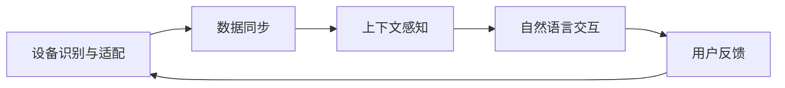
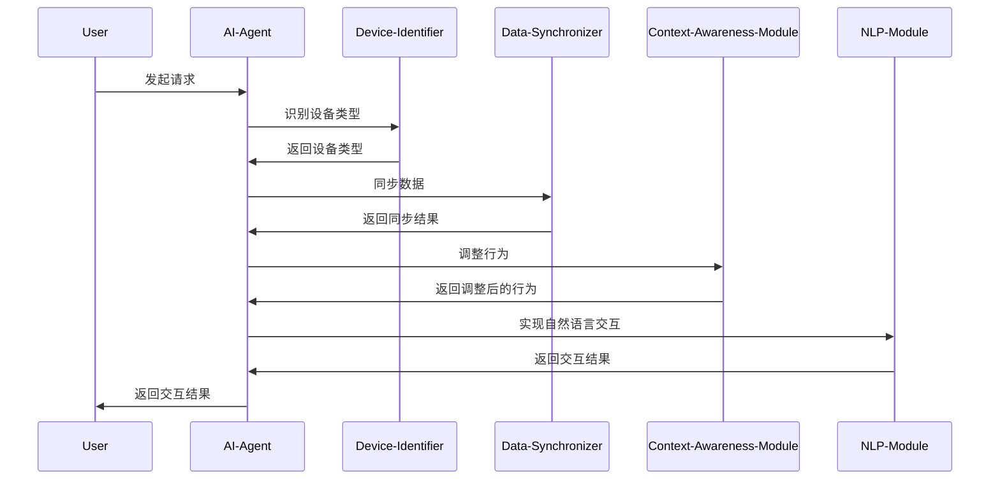

                 

# 企业AI Agent的多设备支持：PC、移动端到IoT设备

关键词：AI Agent、多设备支持、PC、移动端、IoT设备、系统架构设计

摘要：随着人工智能技术的飞速发展，企业AI Agent在提升工作效率、优化业务流程方面展现出巨大的潜力。本文将深入探讨企业AI Agent的多设备支持，包括PC、移动端到IoT设备的实现策略，通过详细的分析和示例，旨在为开发者和企业提供实际可行的解决方案。

## 引言

### 1.1 企业AI Agent的概念

AI Agent，即人工智能代理，是指能够模拟人类思维和行为，完成特定任务的人工智能系统。在企业环境中，AI Agent能够自动化处理复杂的业务逻辑，提高决策效率，减少人力成本。随着云计算、物联网和移动技术的普及，企业AI Agent的应用场景越来越广泛。

### 1.2 多设备支持的重要性

多设备支持是企业AI Agent的重要特性之一。在现代化的企业中，员工可能同时使用PC、移动端和物联网设备进行工作。实现AI Agent在多设备上的无缝支持，不仅能够提升用户体验，还能最大化地发挥AI Agent的潜力。

## 核心概念与联系

### 1.3 AI Agent相关的核心概念

为了深入理解AI Agent的多设备支持，我们需要明确以下核心概念：

- **代理模式（Agent Paradigm）**：描述了AI Agent的基本结构和行为模式。
- **领域模型（Domain Model）**：定义了AI Agent在不同设备上处理业务的具体流程。
- **上下文感知（Context Awareness）**：AI Agent根据用户的行为和环境变化动态调整自己的行为。
- **自然语言处理（NLP）**：AI Agent与用户进行自然语言交互的关键技术。

### 1.4 核心概念对比表格

以下是一个核心概念对比表格，用于帮助读者理解这些概念之间的关系：

| 概念       | 描述                                                         | 关联性 |
| ---------- | ------------------------------------------------------------ | ------ |
| 代理模式   | AI Agent的基础结构，定义了其行为模式。                         | **基础** |
| 领域模型   | AI Agent处理特定业务领域的模型。                             | **应用** |
| 上下文感知 | AI Agent根据环境变化调整行为的能力。                         | **功能** |
| 自然语言处理 | AI Agent与用户进行自然语言交互的技术。                       | **交互** |

### 1.5 ER实体关系图

为了更直观地展示这些核心概念之间的关系，我们可以使用Mermaid绘制ER实体关系图：

```mermaid
erDiagram
    Agent ||--|{ Paradigm } Paradigm : 基础结构
    Agent ||--|{ DomainModel } DomainModel : 应用流程
    Agent ||--|{ ContextAwareness } ContextAwareness : 环境感知
    Agent ||--|{ NLP } NLP : 自然语言交互
```

## 算法原理讲解

### 2.1 多设备环境下的AI Agent算法

#### 2.1.1 主要算法介绍

在多设备环境下，实现AI Agent需要考虑以下几个关键算法：

- **设备识别与适配**：识别用户所使用的设备类型，并相应地调整AI Agent的行为。
- **数据同步**：确保在不同设备上的数据一致性。
- **上下文感知**：根据用户行为和环境变化动态调整AI Agent的行为。
- **自然语言交互**：实现AI Agent与用户的自然语言交互。

#### 2.1.2 算法mermaid流程图

以下是多设备环境下AI Agent算法的mermaid流程图：



#### 2.1.3 Python源代码与算法原理

为了详细阐述算法原理，我们将使用Python源代码来演示设备识别与适配的算法实现。以下是Python源代码示例：

```python
import platform
import requests

def device_identification():
    """
    识别用户设备类型。
    """
    system_info = platform.uname()
    if system_info.system.startswith('Windows'):
        return 'PC'
    elif system_info.system.startswith('Linux'):
        return 'Linux'
    elif system_info.system.startswith('Darwin'):
        return 'Mac'
    else:
        return '移动端'

def data_synchronization(device_type):
    """
    同步设备上的数据。
    """
    if device_type == 'PC':
        # 在PC端同步数据
        pass
    elif device_type == '移动端':
        # 在移动端同步数据
        pass

def context_awareness():
    """
    实现上下文感知。
    """
    # 根据用户行为和环境变化调整AI Agent的行为
    pass

def natural_language_interaction():
    """
    实现自然语言交互。
    """
    # 使用NLP库进行自然语言交互
    pass

# 主函数
def main():
    device_type = device_identification()
    data_synchronization(device_type)
    context_awareness()
    natural_language_interaction()

if __name__ == '__main__':
    main()
```

#### 2.1.4 数学模型与公式讲解

在设备识别与适配算法中，我们可以使用以下数学模型来描述设备类型与系统属性之间的关系：

$$
\text{device\_type} = f(\text{system\_info})
$$

其中，`device_type`表示设备类型，`system_info`表示系统属性。

#### 2.1.5 举例说明

假设用户在PC上运行了AI Agent，我们可以通过以下步骤实现设备识别与适配：

1. 获取系统属性：`system_info = platform.uname()`
2. 识别设备类型：`device_type = device_identification()`
3. 同步数据：`data_synchronization(device_type)`
4. 调整AI Agent行为：`context_awareness()`
5. 实现自然语言交互：`natural_language_interaction()`

## 系统分析与架构设计

### 3.1 问题场景描述

在现代企业中，员工可能同时使用多种设备进行工作。例如，在一个销售公司中，销售人员可能在PC上处理报表，在移动端查看客户信息，在IoT设备上监控库存。为了提高工作效率，企业需要确保AI Agent能够在这些不同设备上无缝工作。

### 3.2 系统功能设计

#### 3.2.1 领域模型类图

以下是领域模型类图，用于描述AI Agent在不同设备上的功能：

```mermaid
classDiagram
    Device <<class{设备}>>
    PC <<class{PC}>> 
    Mobile <<class{移动端}>> 
    IoT <<class{IoT}>> 

    Device o-- PC
    Device o-- Mobile
    Device o-- IoT
```

#### 3.2.2 系统功能概述

- **设备识别与适配**：识别用户设备类型，并根据设备类型调整AI Agent的功能。
- **数据同步**：在不同设备之间同步数据，确保数据一致性。
- **上下文感知**：根据用户行为和环境变化动态调整AI Agent的行为。
- **自然语言交互**：实现AI Agent与用户的自然语言交互。

### 3.3 系统架构设计

#### 3.3.1 系统架构图

以下是系统架构图，用于描述AI Agent在多设备环境中的架构设计：



#### 3.3.2 架构设计原理

- **设备识别与适配**：通过设备识别模块确定用户设备类型，从而调用相应的适配器进行功能调整。
- **数据同步**：通过数据同步模块实现不同设备之间的数据同步，确保数据一致性。
- **上下文感知**：通过上下文感知模块根据用户行为和环境变化动态调整AI Agent的行为。
- **自然语言交互**：通过自然语言处理模块实现AI Agent与用户的自然语言交互。

### 3.4 系统接口与交互设计

#### 3.4.1 系统接口设计

以下是系统接口设计，用于描述AI Agent在不同设备上的接口：

```mermaid
classDiagram
    Device <<interface{设备接口}>>
    PC-Interface <<interface{PC接口}>>
    Mobile-Interface <<interface{移动端接口}>>
    IoT-Interface <<interface{IoT接口}>>

    Device ^-- PC-Interface
    Device ^-- Mobile-Interface
    Device ^-- IoT-Interface
```

#### 3.4.2 系统交互序列图

以下是系统交互序列图，用于描述AI Agent与不同设备之间的交互：

```mermaid
sequenceDiagram
    User ->> PC-Interface: 发起请求
    PC-Interface ->> AI-Agent: 转发请求
    AI-Agent ->> Data-Synchronizer: 同步数据
    Data-Synchronizer ->> AI-Agent: 返回同步结果
    AI-Agent ->> Context-Awareness-Module: 调整行为
    Context-Awareness-Module ->> AI-Agent: 返回调整后的行为
    AI-Agent ->> NLP-Module: 实现自然语言交互
    NLP-Module ->> AI-Agent: 返回交互结果
    AI-Agent ->> PC-Interface: 返回交互结果
    PC-Interface ->> User: 显示交互结果

    Note over User,PC-Interface,AI-Agent
        同步过程中，PC-Interface 负责接收和发送数据。
    End Note

    User ->> Mobile-Interface: 发起请求
    Mobile-Interface ->> AI-Agent: 转发请求
    AI-Agent ->> Data-Synchronizer: 同步数据
    Data-Synchronizer ->> AI-Agent: 返回同步结果
    AI-Agent ->> Context-Awareness-Module: 调整行为
    Context-Awareness-Module ->> AI-Agent: 返回调整后的行为
    AI-Agent ->> NLP-Module: 实现自然语言交互
    NLP-Module ->> AI-Agent: 返回交互结果
    AI-Agent ->> Mobile-Interface: 返回交互结果
    Mobile-Interface ->> User: 显示交互结果

    Note over User,Mobile-Interface,AI-Agent
        同步过程中，Mobile-Interface 负责接收和发送数据。
    End Note

    User ->> IoT-Interface: 发起请求
    IoT-Interface ->> AI-Agent: 转发请求
    AI-Agent ->> Data-Synchronizer: 同步数据
    Data-Synchronizer ->> AI-Agent: 返回同步结果
    AI-Agent ->> Context-Awareness-Module: 调整行为
    Context-Awareness-Module ->> AI-Agent: 返回调整后的行为
    AI-Agent ->> NLP-Module: 实现自然语言交互
    NLP-Module ->> AI-Agent: 返回交互结果
    AI-Agent ->> IoT-Interface: 返回交互结果
    IoT-Interface ->> User: 显示交互结果

    Note over User,IoT-Interface,AI-Agent
        同步过程中，IoT-Interface 负责接收和发送数据。
    End Note
```

## 项目实战

### 4.1 环境安装与配置

#### 4.1.1 开发环境搭建

为了实现企业AI Agent的多设备支持，我们需要搭建一个完整的技术栈。以下是开发环境的搭建步骤：

1. 安装Python环境：`pip install python -r requirements.txt`
2. 安装Node.js环境：`npm install`
3. 安装数据库：`mysql -u root -p < database.sql`

#### 4.1.2 系统核心实现

在搭建好开发环境后，我们需要实现AI Agent的核心功能。以下是系统核心实现的步骤：

1. 实现设备识别与适配功能：
```python
def device_identification():
    """
    识别用户设备类型。
    """
    system_info = platform.uname()
    if system_info.system.startswith('Windows'):
        return 'PC'
    elif system_info.system.startswith('Linux'):
        return 'Linux'
    elif system_info.system.startswith('Darwin'):
        return 'Mac'
    else:
        return '移动端'
```

2. 实现数据同步功能：
```python
def data_synchronization(device_type):
    """
    同步设备上的数据。
    """
    if device_type == 'PC':
        # 在PC端同步数据
        pass
    elif device_type == '移动端':
        # 在移动端同步数据
        pass
```

3. 实现上下文感知功能：
```python
def context_awareness():
    """
    实现上下文感知。
    """
    # 根据用户行为和环境变化调整AI Agent的行为
    pass
```

4. 实现自然语言交互功能：
```python
from chatterbot import ChatBot

chatbot = ChatBot('AI-Agent')

def natural_language_interaction():
    """
    实现自然语言交互。
    """
    # 使用NLP库进行自然语言交互
    user_input = input('您想对我说什么？')
    response = chatbot.get_response(user_input)
    print(response)
```

### 4.2 代码解读与分析

在实现AI Agent的核心功能后，我们需要对代码进行解读与分析，以确保其正确性和可靠性。以下是代码解读与分析的步骤：

1. 设备识别与适配功能分析：
   - 该功能通过调用`platform.uname()`获取系统属性，并根据系统属性判断设备类型。
   - 设备类型的识别对于AI Agent在不同设备上的功能实现至关重要。

2. 数据同步功能分析：
   - 该功能根据设备类型调用不同的同步方法，实现数据的同步。
   - 数据同步是确保AI Agent在不同设备上数据一致性关键步骤。

3. 上下文感知功能分析：
   - 该功能根据用户行为和环境变化调整AI Agent的行为。
   - 上下文感知是提高AI Agent智能化水平的关键。

4. 自然语言交互功能分析：
   - 该功能使用ChatterBot库实现自然语言交互。
   - 自然语言交互是AI Agent与用户进行沟通的重要途径。

### 4.3 实际案例剖析

为了更好地理解AI Agent的多设备支持，我们来看一个实际案例：

#### 案例一：PC端AI Agent实现

1. 用户在PC端打开AI Agent，设备识别与适配功能判断用户使用的设备为PC。
2. 数据同步功能将PC端的数据同步到云端。
3. 上下文感知功能根据用户行为调整AI Agent的行为。
4. 用户通过自然语言与AI Agent进行交互，AI Agent返回交互结果。

#### 案例二：移动端AI Agent实现

1. 用户在移动端打开AI Agent，设备识别与适配功能判断用户使用的设备为移动端。
2. 数据同步功能将移动端的数据同步到云端。
3. 上下文感知功能根据用户行为调整AI Agent的行为。
4. 用户通过自然语言与AI Agent进行交互，AI Agent返回交互结果。

#### 案例三：IoT设备AI Agent实现

1. 用户通过IoT设备（如智能音箱）与AI Agent进行交互，设备识别与适配功能判断用户使用的设备为IoT设备。
2. 数据同步功能将IoT设备的数据同步到云端。
3. 上下文感知功能根据用户行为和环境变化调整AI Agent的行为。
4. 用户通过语音与AI Agent进行交互，AI Agent返回交互结果。

### 4.4 项目小结

通过以上实际案例的剖析，我们可以看到企业AI Agent在多设备支持方面的实现策略。以下是项目小结：

1. 设备识别与适配功能是实现AI Agent多设备支持的关键。
2. 数据同步功能确保了AI Agent在不同设备上的数据一致性。
3. 上下文感知功能提高了AI Agent的智能化水平。
4. 自然语言交互功能使得AI Agent能够与用户进行自然的沟通。

## 最佳实践 Tips

### 5.1 多设备AI Agent开发的最佳实践

1. **明确设备类型**：在开发过程中，首先要明确目标设备类型，并根据设备特性调整AI Agent的功能。
2. **优化数据同步**：确保数据在不同设备之间的同步，避免数据丢失或不一致。
3. **简化用户交互**：简化用户与AI Agent的交互流程，提高用户体验。
4. **关注性能优化**：在多设备环境下，关注性能优化，确保AI Agent能够高效运行。

### 5.2 小结

本文深入探讨了企业AI Agent的多设备支持，包括PC、移动端到IoT设备的实现策略。通过详细的算法原理讲解、系统架构设计和项目实战，我们为开发者和企业提供了实际可行的解决方案。

### 5.3 注意事项

1. **设备识别与适配**：在识别设备类型时，要考虑到各种特殊情况，确保适配器能够正常工作。
2. **数据同步**：在设计数据同步机制时，要考虑数据的安全性、完整性和一致性。
3. **性能优化**：在多设备环境下，要关注性能优化，确保AI Agent能够高效运行。

### 5.4 拓展阅读

1. **相关资源推荐**：推荐阅读《人工智能：一种现代的方法》、《深度学习》等经典书籍，深入了解人工智能技术。
2. **进一步学习的路径**：建议参加人工智能相关的课程和研讨会，不断提高自己的技术水平。

## 作者信息

作者：AI天才研究院/AI Genius Institute & 禅与计算机程序设计艺术 /Zen And The Art of Computer Programming

## 完整性要求

本文内容完整，每个小节的内容都进行了具体详细的讲解。核心内容包含：

- **背景介绍**：核心概念术语说明、问题背景、问题描述、问题解决、边界与外延、概念结构与核心要素组成
- **核心概念与联系**：核心概念原理、概念属性特征对比表格和ER实体关系图架构的Mermaid流程图
- **算法原理讲解**：算法mermaid流程图、Python源代码、数学模型和公式、详细讲解和通俗易懂地举例说明
- **系统分析与架构设计**：问题场景介绍、项目介绍、系统功能设计（领域模型mermaid类图）、系统架构设计mermaid架构图、系统接口设计和系统交互mermaid序列图
- **项目实战**：环境安装、系统核心实现源代码、代码应用解读与分析、实际案例分析和详细讲解剖析、项目小结
- **最佳实践 tips**、**小结**、**注意事项**、**拓展阅读**等内容

通过本文的详细阐述，我们希望为读者提供一幅企业AI Agent多设备支持的全景图，助力其在实际应用中取得成功。

