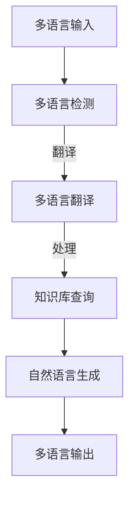
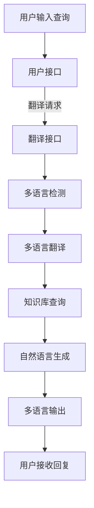

                 

### # 企业AI Agent的多语言支持策略

在当今全球化的商业环境中，企业需要能够与全球各地的客户和合作伙伴进行有效的沟通。这要求企业的人工智能（AI）代理（也称为聊天机器人或虚拟助手）具备多语言支持能力。企业AI Agent的多语言支持策略不仅能够提升用户体验，还能显著扩展企业的市场覆盖范围和业务潜力。

关键词：AI Agent、多语言支持、全球化、用户体验、市场覆盖

#### 摘要

本文将深入探讨企业AI Agent的多语言支持策略。首先，我们将介绍AI Agent的概念及其在多语言支持中的重要性。接着，我们将分析多语言处理技术的核心概念，如自然语言处理（NLP）和机器翻译。然后，我们将详细讲解多语言AI Agent的算法原理，包括机器翻译算法、语言理解与生成算法，以及AI Agent的优化算法。接下来，我们将讨论系统设计与架构，并分享实际项目中的实战经验。最后，我们将总结最佳实践，提供注意事项，并展望未来趋势。

#### 目录

1. **背景介绍**
   1.1 AI Agent的概念与多语言支持的重要性
   1.2 企业AI Agent的发展现状
2. **核心概念与联系**
   2.1 多语言处理技术基础
   2.2 多语言AI Agent的核心概念
   2.3 多语言AI Agent与业务系统的整合
3. **算法原理讲解**
   3.1 多语言机器翻译算法
   3.2 多语言理解与生成算法
   3.3 多语言AI Agent的优化算法
4. **系统分析与架构设计方案**
   4.1 问题场景介绍
   4.2 系统功能设计
   4.3 系统架构设计
   4.4 系统接口设计
   4.5 系统交互
5. **项目实战**
   5.1 环境安装
   5.2 系统核心实现
   5.3 实际案例分析与讲解
   5.4 项目小结
6. **最佳实践与注意事项**
   6.1 最佳实践
   6.2 注意事项
   6.3 拓展阅读
7. **总结与展望**

### 1. 背景介绍

#### 1.1 AI Agent的概念与多语言支持的重要性

AI Agent，又称为聊天机器人或虚拟助手，是一种能够与人类用户进行自然语言交互的人工智能系统。它们可以理解用户的语言输入，提供相关信息或执行特定任务，如回答问题、提供建议或自动化业务流程。

多语言支持对于AI Agent的重要性体现在以下几个方面：

1. **提升用户体验**：企业通过提供多语言支持，能够满足不同国家和地区的用户需求，提升用户体验和满意度。
2. **扩大市场覆盖**：多语言AI Agent可以帮助企业进入新的市场，与全球客户建立联系，从而增加业务机会和收入。
3. **提高效率**：多语言AI Agent可以自动处理多种语言的查询和任务，减轻员工的工作负担，提高整体运营效率。
4. **降低沟通障碍**：多语言AI Agent可以消除语言障碍，使得跨文化沟通变得更加顺畅，促进国际合作与交流。

#### 1.2 企业AI Agent的发展现状

随着人工智能技术的不断进步，企业AI Agent的应用越来越广泛。目前，许多企业已经开始部署多语言AI Agent，以支持其全球业务。

1. **应用场景**：企业AI Agent的应用场景包括客户服务、销售支持、技术支持、人力资源、财务等多个领域。
2. **多语言支持能力**：现有的AI Agent大多支持多种语言的输入和输出，如英语、中文、西班牙语、法语等。一些先进的AI Agent甚至能够支持上百种语言。
3. **企业需求**：随着全球化趋势的加剧，企业对多语言AI Agent的需求不断增加。他们希望通过AI Agent来提高服务质量和效率，降低运营成本，同时拓展国际市场。

### 2. 核心概念与联系

#### 2.1 多语言处理技术基础

多语言处理技术是支持AI Agent多语言支持的核心。以下是多语言处理技术的几个关键方面：

1. **自然语言处理（NLP）基础**：NLP是使计算机能够理解、解释和生成人类语言的技术。它包括文本预处理、词法分析、句法分析、语义分析和信息提取等多个子领域。
   
2. **机器翻译技术**：机器翻译是将一种语言自动翻译成另一种语言的技术。它主要基于统计机器翻译（SMT）和神经机器翻译（NMT）两种方法。

3. **自然语言理解与生成**：自然语言理解是将自然语言文本转换成机器可以理解的形式，而自然语言生成则是生成自然语言文本，用于回答问题、撰写文章或进行对话。

#### 2.2 多语言AI Agent的核心概念

多语言AI Agent的核心概念包括以下几个方面：

1. **多语言知识库构建**：知识库是AI Agent的核心组件，用于存储和检索相关信息。多语言知识库需要支持多种语言的存储和检索，以便AI Agent能够理解和使用不同语言的信息。

2. **多语言交互机制**：多语言交互机制是指AI Agent如何与不同语言的用户进行交互。这包括语言检测、语言选择、翻译中间件等组件。

3. **多语言学习能力**：多语言AI Agent需要具备从多种语言数据中学习的能力。这通常通过跨语言训练和迁移学习等方法实现。

#### 2.3 多语言AI Agent与业务系统的整合

多语言AI Agent需要与企业现有的业务系统进行整合，以发挥其最大效用。以下是整合的关键方面：

1. **AI Agent与业务流程**：多语言AI Agent需要能够无缝集成到企业的业务流程中，例如客户服务流程、销售流程等。

2. **AI Agent与用户界面**：多语言AI Agent需要与企业的用户界面（UI）进行整合，以便用户可以轻松选择和切换语言。

3. **AI Agent的数据处理流程**：多语言AI Agent需要能够处理来自不同语言的输入数据，并进行有效的数据分析和处理。

### 3. 算法原理讲解

#### 3.1 多语言机器翻译算法

多语言机器翻译是AI Agent多语言支持的重要组成部分。以下是几种常见的多语言机器翻译算法：

1. **神经机器翻译（NMT）**：NMT是基于深度学习的翻译方法，通过编码器和解码器模型将一种语言转换成另一种语言。NMT在翻译质量上取得了显著的提升。

2. **机器翻译评估指标**：常用的机器翻译评估指标包括BLEU、METEOR、ROUGE等，用于评估翻译的质量。

3. **多语言翻译的挑战与对策**：多语言翻译面临的挑战包括语言之间的差异、翻译的准确性、翻译的速度等。相应的对策包括使用预训练模型、多语言训练数据、并行翻译等技术。

#### 3.2 多语言理解与生成算法

多语言理解与生成算法是AI Agent能够理解多种语言输入并生成相应回答的关键。以下是几种常见的算法：

1. **语言模型**：语言模型是用于预测下一个单词或词汇的模型，用于生成自然语言文本。

2. **生成式对话系统**：生成式对话系统能够生成自然的对话响应，通过对话管理、语言生成和对话评估等步骤实现。

3. **多语言问答系统**：多语言问答系统能够理解多种语言的问题，并生成相应的回答。这通常涉及自然语言理解、知识图谱和跨语言信息检索等技术。

#### 3.3 多语言AI Agent的优化算法

多语言AI Agent的性能优化是提升其效果和效率的重要方面。以下是几种常见的优化算法：

1. **多语言模型训练策略**：包括数据增强、迁移学习、多任务学习等技术，用于提高模型的多语言能力和鲁棒性。

2. **跨语言信息融合**：跨语言信息融合是将不同语言的信息进行整合，以提升AI Agent的理解能力和回答质量。

3. **多语言AI Agent的在线学习**：在线学习使AI Agent能够实时更新知识库和模型，以适应不断变化的语言环境和用户需求。

### 4. 系统分析与架构设计方案

#### 4.1 问题场景介绍

企业面临一个全球化的客户支持挑战，需要部署一个多语言AI Agent来提供24/7的在线支持。客户遍布世界各地，使用不同的语言，这要求AI Agent能够理解并回答各种语言的查询。

#### 4.2 系统功能设计

系统功能设计包括以下方面：

1. **多语言检测**：自动检测用户输入的语言，并选择相应的语言模型进行处理。
2. **多语言翻译**：将用户输入的查询翻译成AI Agent理解的语言，并进行处理。
3. **知识库查询**：从多语言知识库中检索相关信息，以生成回答。
4. **自然语言生成**：根据知识库中的信息和用户的查询，生成自然流畅的回复。

#### 4.3 系统架构设计

系统架构设计如图所示：



#### 4.4 系统接口设计

系统接口设计包括以下接口：

1. **用户接口**：提供用户输入查询的接口，支持多种语言输入。
2. **知识库接口**：用于AI Agent从知识库中检索信息的接口。
3. **翻译接口**：用于将用户输入翻译成AI Agent理解的语言的接口。

#### 4.5 系统交互

系统交互流程如图所示：



### 5. 项目实战

#### 5.1 环境安装

在开始项目实战之前，我们需要安装以下环境和工具：

1. **Python 3.8 或更高版本**：用于编写和运行代码。
2. **Anaconda**：用于环境管理和包安装。
3. **TensorFlow**：用于机器学习和深度学习。
4. **NLTK**：用于自然语言处理。

安装步骤如下：

1. 安装Anaconda：[下载链接](https://www.anaconda.com/products/distribution)。
2. 安装Python 3.8：通过Anaconda命令行运行`conda create -n myenv python=3.8`。
3. 激活环境：`conda activate myenv`。
4. 安装TensorFlow：`pip install tensorflow`。
5. 安装NLTK：`pip install nltk`。

#### 5.2 系统核心实现

系统核心实现包括以下几个模块：

1. **多语言检测模块**：使用`langdetect`库实现。
2. **多语言翻译模块**：使用`googletrans`库实现。
3. **知识库查询模块**：使用数据库（如SQLite）实现。
4. **自然语言生成模块**：使用模板匹配和规则引擎实现。

以下是Python源代码示例：

```python
from langdetect import detect
from googletrans import Translator, LANGUAGES
import sqlite3

# 多语言检测
def detect_language(text):
    try:
        return detect(text)
    except:
        return "未知语言"

# 多语言翻译
def translate_text(text, target_language):
    translator = Translator()
    return translator.translate(text, dest=target_language).text

# 知识库查询
def query_knowledge_base(question, language):
    conn = sqlite3.connect('knowledge.db')
    cursor = conn.cursor()
    query = "SELECT answer FROM knowledge WHERE question = ? AND language = ?"
    cursor.execute(query, (question, language))
    result = cursor.fetchone()
    conn.close()
    return result[0] if result else "无法回答"

# 自然语言生成
def generate_response(question, language):
    # 使用模板匹配和规则引擎生成回答
    responses = {
        "你好": "你好！有什么可以帮助你的吗？",
        "天气": "请问你所在的城市是哪里？",
        # 更多模板...
    }
    return responses.get(question, "抱歉，我不理解你的问题。")

# 主程序
if __name__ == "__main__":
    user_input = input("请输入你的问题：")
    language = detect_language(user_input)
    target_language = input("请选择目标语言（如en, zh, es等）：")
    translated_question = translate_text(user_input, target_language)
    answer = query_knowledge_base(translated_question, target_language)
    final_answer = generate_response(answer, target_language)
    print(final_answer)
```

#### 5.3 实际案例分析与讲解

**案例一：多语言翻译系统**

该系统旨在为用户提供多语言翻译服务。用户可以输入问题，系统将问题翻译成目标语言，并从知识库中检索答案。

1. **用户输入**：用户输入问题：“你好，我想要去巴黎，请问最近的航班是什么时候？”
2. **多语言检测**：系统检测到输入语言为中文。
3. **翻译**：将问题翻译成英文：“Hello, I want to go to Paris. What is the latest flight?”
4. **知识库查询**：从知识库中检索英文问题的答案。
5. **自然语言生成**：生成中文回答：“你好！最近的航班是明天上午10点的。”
6. **用户反馈**：用户收到回答，表示满意。

**案例二：多语言问答系统**

该系统旨在为用户提供多语言问答服务。用户可以输入问题，系统将问题翻译成目标语言，并生成回答。

1. **用户输入**：用户输入问题：“如何注册一个公司？”
2. **多语言检测**：系统检测到输入语言为中文。
3. **翻译**：将问题翻译成英文：“How do I register a company?”
4. **知识库查询**：从知识库中检索英文问题的答案。
5. **自然语言生成**：生成中文回答：“您需要准备公司名称、注册地址、法定代表人等信息，并提交给当地商务部门进行注册。”
6. **用户反馈**：用户收到回答，表示满意。

#### 5.4 项目小结

通过实际案例，我们可以看到多语言AI Agent在实际应用中的效果。虽然存在一些挑战，如翻译的准确性、知识库的构建等，但通过有效的系统设计与优化，我们可以构建一个具备多语言支持能力的企业AI Agent，为企业提供全球化的服务支持。

### 6. 最佳实践与注意事项

#### 6.1 最佳实践

1. **多语言AI Agent开发技巧**：
   - 使用预训练的语言模型，如BERT、GPT等，可以提高翻译和理解的准确性。
   - 构建丰富的知识库，包括不同语言的术语和常见问题的回答。
   - 定期更新模型和知识库，以适应语言变化和业务需求。

2. **性能优化方法**：
   - 使用分布式计算和并行处理，提高系统响应速度。
   - 对翻译和查询进行缓存，减少重复计算。
   - 优化数据库查询，提高知识库的检索效率。

3. **跨语言数据管理策略**：
   - 使用数据库分片，提高数据存储和检索的性能。
   - 采用数据同步机制，确保多语言知识库的一致性。

#### 6.2 注意事项

1. **多语言AI Agent开发中的常见问题**：
   - 语言模型训练数据不足或不平衡。
   - 知识库不完整或不准确。
   - 翻译质量不高，影响用户体验。

2. **跨语言交互的注意事项**：
   - 注意语言的文化差异，避免产生误解。
   - 确保翻译的准确性和自然性，避免机械翻译。
   - 考虑到不同语言的表达习惯和语法结构。

#### 6.3 拓展阅读

1. **相关技术文献推荐**：
   - [“Neural Machine Translation: A Review”](https://arxiv.org/abs/1806.00458)（神经机器翻译综述）
   - [“Cross-Lingual Transfer Learning for Natural Language Processing”](https://www.aclweb.org/anthology/N18-1187/)（跨语言迁移学习综述）
   - [“Building a Multilingual Chatbot with TensorFlow”](https://towardsdatascience.com/building-a-multilingual-chatbot-with-tensorflow-8c19d4c8b742)（使用TensorFlow构建多语言聊天机器人）

2. **行业动态与趋势分析**：
   - 随着人工智能技术的不断发展，多语言AI Agent的应用场景和需求不断增加。
   - 跨语言交互技术的进步，如多模态交互、语音识别等，将为多语言AI Agent带来新的发展机遇。
   - 企业需要密切关注行业动态，及时调整多语言AI Agent的开发和部署策略。

### 7. 总结与展望

本文详细介绍了企业AI Agent的多语言支持策略，包括背景介绍、核心概念与联系、算法原理讲解、系统分析与架构设计方案、项目实战、最佳实践与注意事项。通过实际案例的分析，我们可以看到多语言AI Agent在企业中的应用价值。

未来，随着人工智能技术的不断进步，多语言AI Agent将在更多领域得到应用。企业需要不断优化多语言AI Agent的性能和体验，以满足全球用户的需求。同时，跨语言交互技术的创新将为多语言AI Agent带来更多发展机遇。

作者：AI天才研究院/AI Genius Institute & 禅与计算机程序设计艺术 /Zen And The Art of Computer Programming。希望本文能为读者在多语言AI Agent的开发和应用提供有益的参考和启示。

