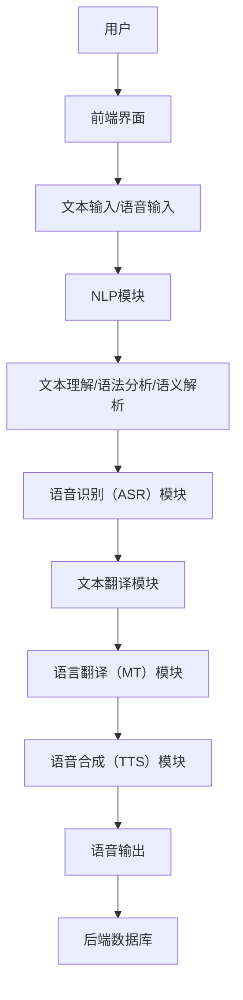

                 

### 背景介绍

在现代全球化经济背景下，跨国业务已经成为企业扩张和发展的关键途径。无论是国际贸易、跨国投资还是跨国公司运营，语言障碍始终是影响业务效率和沟通效果的重要因素。随着人工智能（AI）技术的迅猛发展，AI Agent作为智能客服、业务助手和翻译工具逐渐受到企业的青睐。AI Agent不仅可以提高业务处理效率，还能显著降低运营成本，成为企业跨国业务不可或缺的得力助手。

AI Agent，即人工智能代理，是一种可以模拟人类行为，具备自然语言理解和生成能力的智能系统。其核心在于自然语言处理（NLP）和机器学习技术的结合，能够理解用户的需求并给出相应的答复。在企业场景中，AI Agent可以处理客户咨询、销售支持、数据分析、任务调度等多项任务，极大地减轻了人工负担，提升了服务质量。

然而，AI Agent在跨国业务中的应用面临一个关键挑战——多语言支持。企业在不同国家和地区开展业务，需要能够处理多种语言的需求，这要求AI Agent具备多语言处理能力。当前，多语言支持主要包括机器翻译、语音识别和语音合成技术。这些技术不仅需要解决不同语言的语法、语义和发音差异，还要在跨语言翻译和交互中保持准确性和自然度。

多语言支持的重要性不言而喻。首先，它直接关系到AI Agent在跨国业务中的适用性和用户体验。一个能够流畅处理多种语言的AI Agent，可以更好地满足不同地区客户的需求，提升客户满意度和忠诚度。其次，多语言支持有助于企业国际化进程，使企业能够更有效地与全球合作伙伴沟通和合作。此外，多语言支持还可以为企业带来更多的商业机会，拓宽市场覆盖范围，增强竞争力。

总之，随着全球化的加深和AI技术的进步，多语言支持成为AI Agent在企业跨国业务中不可或缺的一部分。本文将深入探讨企业AI Agent的多语言支持技术，分析其核心概念、实施方法和最佳实践，旨在为企业提供有效的跨国业务助手解决方案。

### 关键概念和术语

在探讨企业AI Agent的多语言支持之前，了解一些关键概念和术语是非常重要的。以下是一些核心概念及其定义：

**1. 自然语言处理（NLP）**：自然语言处理是人工智能的一个分支，旨在使计算机能够理解、解释和生成自然语言（如英语、中文等）。NLP技术包括文本分类、情感分析、命名实体识别、机器翻译和语音识别等。

**2. 机器翻译（MT）**：机器翻译是指使用计算机算法将一种语言的文本自动翻译成另一种语言。根据翻译策略的不同，可以分为规则翻译和基于统计的翻译，以及近年来兴起的基于神经网络的机器翻译（NMT）。

**3. 语音识别（ASR）**：语音识别技术将人类的语音转化为文本或命令，是实现语音交互的核心技术。常见的语音识别系统包括语音识别引擎、声学模型、语言模型和声学模型联合训练。

**4. 语音合成（TTS）**：语音合成技术将文本转化为自然流畅的语音输出。TTS系统包括文本处理、声学模型和语音合成引擎，能够根据文本内容和语音特征生成相应的语音。

**5. 多语言模型（MLM）**：多语言模型是一种能够处理多种语言输入的AI模型，通过跨语言学习提高不同语言之间的理解和生成能力。MLM在多语言支持中扮演着至关重要的角色，可以实现更精准的跨语言翻译和交互。

**6. 语言资源（LR）**：语言资源包括语料库、词典、语法规则、语音数据等，是训练和优化AI模型的基础。高质量的语言资源可以显著提高AI Agent的多语言处理能力。

**7. 跨语言迁移学习（XLM）**：跨语言迁移学习是一种利用已经在一个语言上训练好的模型，通过少量样本快速适应其他语言的技术。XLM可以降低多语言模型训练的复杂度和成本，提高模型的泛化能力。

通过理解上述关键概念和术语，我们可以更好地把握企业AI Agent多语言支持的技术基础和发展方向。接下来，本文将进一步探讨这些技术在实际应用中的挑战和解决方案。

### 问题背景与定义

在跨国业务中，AI Agent的多语言支持面临着诸多挑战。首先，不同语言的语法和语义结构存在显著差异。例如，英语和中文的语序、句子结构以及词汇的使用方式都有所不同，这给机器翻译和自然语言理解带来了难题。其次，各语言的发音和语音特征也各异，导致语音识别系统在不同语言环境下性能表现不一。此外，跨语言的文化背景和习俗差异也对AI Agent提出了更高要求，需要模型能够理解和尊重不同文化的表达方式。

在具体应用场景中，企业AI Agent需要处理不同语言的客户咨询、内部沟通和数据分析。例如，一个跨国公司的客户服务AI Agent需要能够理解和回应来自不同国家和地区的客户提问，而财务部门则可能需要使用不同语言的财务报告进行数据分析。这种多元化的语言需求要求AI Agent具备强大的多语言处理能力。

此外，不同国家和地区的业务场景和流程也有所不同，AI Agent需要能够灵活适应这些差异。例如，在某些地区，客户更倾向于通过语音而非文本进行交流；而在其他地区，文本交互可能更为常见。这种多样化的需求使得AI Agent在多语言支持方面不仅要具备通用性，还需要具备一定的地域适应性。

总的来说，AI Agent在跨国业务中面临的挑战主要集中在语法和语义的多样性、语音识别和语音合成的准确性、文化差异的理解与适应以及地域适应性等方面。只有通过深入研究和不断优化多语言支持技术，AI Agent才能成为企业跨国业务的得力助手。

### 多语言支持的重要性

多语言支持在AI Agent中扮演着至关重要的角色，它不仅是实现跨国业务顺利开展的基础，更是提升用户体验和业务效率的关键。首先，从用户角度出发，一个能够流畅处理多种语言的AI Agent可以显著提升客户满意度。无论是在全球范围内的客户咨询、技术支持还是售后服务，多语言支持都能确保客户在母语环境中得到及时、准确的回应，减少沟通障碍，增强客户体验。例如，一个多语言支持的客户服务AI Agent，可以轻松应对来自不同国家的客户提问，提供本地化服务，从而提高客户满意度和忠诚度。

从业务效率方面来看，多语言支持可以帮助企业显著降低运营成本。传统的多语言服务往往需要大量的人力资源进行翻译和沟通，而AI Agent的多语言功能可以自动化这些过程，极大地减少人工成本。此外，多语言支持还能提升业务流程的效率。例如，一个能够处理多种语言的AI Agent可以在全球多个地区同时处理大量的客户咨询，从而缩短响应时间，提高业务处理速度。这不仅可以提升企业的服务质量，还能为企业带来更多的商业机会，扩大市场份额。

具体来说，AI Agent的多语言支持可以帮助企业在多个方面实现业务优化：

1. **客户服务**：AI Agent可以处理不同语言的客户咨询，提供本地化的解决方案，提升客户满意度。例如，在电子商务领域，一个多语言的AI客服可以帮助国际客户在购物过程中解决语言障碍，提供实时的翻译和咨询。

2. **内部沟通**：企业内部往往涉及多种语言的沟通需求，多语言AI Agent可以协助跨国团队实现无缝沟通。例如，跨国公司的员工可以使用母语进行交流，提高沟通效率和工作协作。

3. **数据分析**：多语言AI Agent可以帮助企业处理来自不同语言的业务数据，进行跨语言的数据分析和挖掘。这在市场营销、客户研究和市场调研等领域尤为重要。

4. **流程自动化**：通过多语言支持，AI Agent可以实现跨语言的业务流程自动化，减少手动操作，提高工作效率。例如，企业可以自动处理多语言订单处理、发票生成和支付流程等。

总之，多语言支持不仅是AI Agent实现跨国业务不可或缺的技术基础，更是提升用户体验和业务效率的关键因素。随着全球化进程的不断深入，企业若能充分利用AI Agent的多语言功能，将能够在全球市场中脱颖而出，获得更大的竞争优势。

### 语言技术概述

要实现AI Agent的多语言支持，需要掌握一系列先进的技术，包括自然语言处理（NLP）、机器翻译（MT）、语音识别（ASR）和语音合成（TTS）。这些技术不仅单独强大，而且在结合应用时能显著提升AI Agent的性能和用户体验。下面，我们将逐一介绍这些技术的核心概念、工作原理和应用场景。

**1. 自然语言处理（NLP）**

自然语言处理是人工智能领域的一个重要分支，旨在使计算机能够理解、解释和生成自然语言。NLP的核心技术包括文本分类、情感分析、命名实体识别、机器翻译和语音识别。

- **文本分类**：文本分类是将文本根据其内容进行归类的过程，广泛应用于垃圾邮件过滤、新闻分类等场景。例如，一个文本分类系统可以将一篇英文新闻分为“体育”、“政治”、“科技”等类别。

- **情感分析**：情感分析旨在判断文本的情感倾向，如正面、负面或中立。这在社交媒体分析、客户反馈处理等场景中有着广泛应用。例如，一个情感分析系统可以判断一条微博是“开心”还是“愤怒”。

- **命名实体识别**：命名实体识别是从文本中识别出具有特定意义实体的过程，如人名、地点、组织名等。这在信息提取、搜索引擎优化等领域具有重要意义。

- **机器翻译**：机器翻译是将一种语言的文本自动翻译成另一种语言的技术。随着深度学习技术的发展，基于神经网络的机器翻译（NMT）已成为主流。例如，谷歌翻译和百度翻译都基于这一技术。

- **语音识别**：语音识别是将语音信号转换为文本的技术，广泛应用于语音助手、自动字幕生成等场景。例如，苹果的Siri和亚马逊的Alexa都利用语音识别技术进行人机交互。

**2. 机器翻译（MT）**

机器翻译是将一种语言的文本自动翻译成另一种语言的技术。机器翻译技术的发展经历了从规则驱动到统计驱动，再到基于神经网络的重大变革。

- **规则驱动翻译**：早期机器翻译主要依靠手工编写的语法和词典规则，如Systran。这种方法的翻译质量受限于规则的完备性和人工编写的能力。

- **统计驱动翻译**：统计驱动翻译基于大量的双语语料库，通过统计方法生成翻译结果。例如，基于短语的统计机器翻译（PBSMT）和基于句法的统计机器翻译（SBMT）。

- **基于神经网络的机器翻译（NMT）**：近年来，基于神经网络的机器翻译（NMT）成为主流。NMT通过神经网络模型，特别是序列到序列（Seq2Seq）模型，实现了翻译质量的显著提升。例如，谷歌翻译和百度翻译都采用了基于NMT的技术。

**3. 语音识别（ASR）**

语音识别是将语音信号转换为文本的技术，广泛应用于语音助手、自动字幕生成等场景。

- **工作原理**：语音识别系统通常包括声学模型、语言模型和声学模型联合训练。声学模型处理语音信号特征，语言模型处理文本语义，声学模型和语言模型联合训练以优化系统性能。

- **技术挑战**：语音识别面临的挑战包括多种语言和口音的识别、噪声干扰的处理以及语音信号的不确定性。近年来，深度学习技术的发展极大地提升了语音识别的性能，尤其是在多语言和低资源语言的识别方面。

**4. 语音合成（TTS）**

语音合成是将文本转化为自然流畅的语音的技术，广泛应用于语音助手、自动朗读等场景。

- **工作原理**：语音合成系统通常包括文本处理、声学模型和语音合成引擎。文本处理将文本转换为适合语音合成的形式，声学模型生成语音波形，语音合成引擎将波形转换为音频。

- **技术挑战**：语音合成面临的挑战包括语音的自然度、语调的变化和情感表达。近年来，深度学习技术的应用显著提升了语音合成的自然度和真实感。

通过掌握上述语言技术，AI Agent能够实现多语言处理，满足跨国业务的需求。接下来，本文将深入探讨如何构建一个具备多语言支持的AI Agent系统架构。

### 机器翻译（MT）技术

机器翻译（Machine Translation, MT）是将一种语言的文本自动翻译成另一种语言的技术。随着人工智能和深度学习技术的发展，机器翻译技术取得了显著的进步。本文将详细介绍机器翻译的基本概念、工作原理、主要技术方法以及面临的挑战和解决方案。

**1. 机器翻译的基本概念**

机器翻译的核心目标是将源语言（Source Language）的文本转换为等效的或接近等效的目标语言（Target Language）文本。机器翻译可以分为两大类：规则驱动翻译和基于统计的翻译。

- **规则驱动翻译**：规则驱动翻译依赖于预定义的语法和词典规则，通过这些规则将源语言文本转换为目标语言文本。例如，Systran是最早的机器翻译系统之一，它通过将源语言文本分解为单词和短语，然后根据规则进行翻译。

- **基于统计的翻译**：基于统计的翻译方法使用大量的双语语料库，通过统计方法生成翻译结果。例如，基于短语的统计机器翻译（Phrase-Based SMT）和基于句法的统计机器翻译（Sentence-Based SMT）。

**2. 工作原理**

机器翻译的工作原理通常包括以下几个步骤：

- **预处理**：在翻译之前，对源语言文本进行预处理，包括分词、去除标点符号、转换大小写等。

- **词向量化**：将源语言和目标语言的词汇转换为向量表示。词向量化有助于在翻译过程中利用语义信息。

- **编码器-解码器模型**：编码器（Encoder）将源语言文本编码为固定长度的向量，解码器（Decoder）根据编码器输出的向量生成目标语言文本。

- **翻译过程**：基于编码器-解码器模型，通过序列到序列（Seq2Seq）模型进行翻译。序列到序列模型利用注意力机制（Attention Mechanism）处理长距离依赖问题，提高翻译质量。

- **后处理**：对生成的目标语言文本进行后处理，包括修正语法错误、润色文本等。

**3. 主要技术方法**

机器翻译的主要技术方法包括以下几种：

- **规则驱动翻译**：通过预定义的语法和词典规则进行翻译，适用于特定领域和语言的文本。

- **基于短语的统计机器翻译（PBSMT）**：使用双语短语表，将源语言短语映射到目标语言短语。

- **基于句法的统计机器翻译（SBMT）**：使用句法分析结果，将源语言句子分解为短语，然后根据统计方法进行翻译。

- **基于神经网络的机器翻译（NMT）**：近年来，基于神经网络的机器翻译（NMT）已成为主流。NMT通过序列到序列（Seq2Seq）模型，特别是引入注意力机制（Attention Mechanism），显著提升了翻译质量。

**4. 挑战和解决方案**

机器翻译技术虽然取得了显著进步，但仍面临许多挑战：

- **语法和语义差异**：不同语言的语法和语义结构存在显著差异，这给翻译带来了难题。解决方案包括引入跨语言特征、预训练语言模型等。

- **多义性和歧义性**：语言中的多义性和歧义性使得翻译结果可能存在多种解释。解决方案包括上下文分析、词义消歧等。

- **低资源语言翻译**：对于低资源语言，缺乏足够的双语语料库和训练数据，这限制了翻译质量。解决方案包括跨语言迁移学习（XLM）、多语言联合训练等。

- **语音和语调的转换**：语音和语调的转换是语音合成的难题，需要引入语音合成（TTS）技术。解决方案包括结合TTS技术，生成自然流畅的语音输出。

总之，机器翻译技术在AI Agent的多语言支持中发挥着关键作用。通过不断优化和改进翻译算法，解决面临的技术挑战，AI Agent将能够提供更准确、更自然的多语言翻译服务。接下来，本文将介绍语音识别（ASR）技术及其在多语言支持中的应用。

### 语音识别（ASR）技术

语音识别（Automatic Speech Recognition，ASR）是将人类的语音转化为文本或命令的技术，广泛应用于语音助手、自动字幕生成、语音搜索等领域。在AI Agent的多语言支持中，ASR技术是实现跨语言语音交互的核心。下面，我们将详细探讨语音识别的基本概念、工作原理、主要技术方法以及面临的挑战和解决方案。

**1. 基本概念**

语音识别的基本概念包括声学模型、语言模型和声学模型与语言模型的联合训练。这些组件共同作用，将语音信号转换为文本。

- **声学模型（Acoustic Model）**：声学模型负责处理语音信号的特征提取和建模。它将语音信号转换为一系列的声学特征，如梅尔频率倒谱系数（MFCC）。

- **语言模型（Language Model）**：语言模型负责处理文本的生成和预测。它根据上下文和概率分布生成可能的文本输出。

- **声学模型与语言模型的联合训练**：通过联合训练声学模型和语言模型，可以优化系统的整体性能。这种联合训练方法在语音识别中得到了广泛应用。

**2. 工作原理**

语音识别的工作原理通常包括以下几个步骤：

- **特征提取**：首先，将语音信号转换为一系列的声学特征，如梅尔频率倒谱系数（MFCC）。

- **声学模型处理**：声学模型根据声学特征生成一系列的声学状态序列，表示语音的发音过程。

- **语言模型处理**：语言模型根据声学状态序列生成文本输出，并计算输出文本的概率。

- **解码**：通过解码器（通常是基于神经网络的解码器）将生成的文本输出转化为最终的文本结果。

**3. 主要技术方法**

语音识别的主要技术方法包括以下几种：

- **传统声学模型**：传统声学模型基于声学模型和隐马尔可夫模型（HMM）进行建模。这种方法在语音信号特征提取和建模方面具有较高的准确性。

- **深度神经网络声学模型**：深度神经网络声学模型利用卷积神经网络（CNN）和循环神经网络（RNN）进行建模。这种方法可以更好地捕捉语音信号的时变特征。

- **基于数据的语言模型**：基于数据的语言模型使用大量的文本数据训练语言模型。这种方法通过统计方法生成文本输出，并计算输出文本的概率。

- **基于神经网络的深度语言模型**：基于神经网络的深度语言模型使用深度学习技术训练语言模型。这种方法可以生成更准确和自然的文本输出。

**4. 挑战和解决方案**

语音识别技术虽然取得了显著进步，但仍面临许多挑战：

- **多语言和口音识别**：不同语言和口音的识别是语音识别的难题。解决方案包括跨语言迁移学习（XLM）和多语言模型训练。

- **噪声干扰处理**：噪声干扰会对语音识别结果产生不利影响。解决方案包括噪声抑制技术和自适应滤波。

- **上下文理解**：上下文理解对于语音识别至关重要。解决方案包括基于上下文的词嵌入（Word Embeddings）和上下文敏感的解码器。

- **低资源语言识别**：对于低资源语言，缺乏足够的语音数据，这限制了识别性能。解决方案包括多语言联合训练和跨语言迁移学习。

总之，语音识别技术在AI Agent的多语言支持中发挥着重要作用。通过不断优化和改进语音识别算法，解决面临的技术挑战，AI Agent将能够实现更准确、更自然的语音交互。接下来，本文将介绍语音合成（TTS）技术及其在多语言支持中的应用。

### 语音合成（TTS）技术

语音合成（Text-to-Speech，TTS）技术是将文本转化为自然流畅的语音的技术，广泛应用于语音助手、自动朗读、有声读物等领域。在AI Agent的多语言支持中，语音合成技术是实现跨语言语音交互的关键组成部分。本文将详细介绍语音合成的基本概念、工作原理、主要技术方法以及面临的挑战和解决方案。

**1. 基本概念**

语音合成技术主要包括文本处理、声学模型和语音合成引擎。这些组件共同作用，将文本转化为语音。

- **文本处理**：文本处理是将输入的文本转化为适合语音合成的形式，包括文本清洗、分词、语气标记等。

- **声学模型**：声学模型负责生成语音波形。它将文本处理后的特征信息转换为声学参数，如声带振动模式、气流模式等。

- **语音合成引擎**：语音合成引擎将声学模型生成的声学参数转换为音频信号，生成语音输出。

**2. 工作原理**

语音合成的工作原理通常包括以下几个步骤：

- **文本处理**：将输入的文本进行处理，包括分词、语气标记和音调设置。

- **声学建模**：根据文本处理的输出，声学模型生成一系列的声学参数，如声带振动模式、气流模式等。

- **参数合成**：将声学模型生成的声学参数转换为语音波形。

- **音频生成**：通过音频生成引擎，将语音波形转换为音频信号，生成最终的语音输出。

**3. 主要技术方法**

语音合成的主要技术方法包括以下几种：

- **基于规则的TTS**：基于规则的TTS使用预定义的语音合成规则，将文本转化为语音。这种方法适用于特定领域和语言的文本。

- **数据驱动的TTS**：数据驱动的TTS使用大量的语音数据训练声学模型和语音合成引擎。这种方法通过统计方法生成语音输出，适用于多种语言和文本。

- **深度学习的TTS**：深度学习的TTS利用深度学习技术训练声学模型和语音合成引擎。这种方法通过神经网络模型生成更自然、更流畅的语音输出。

**4. 挑战和解决方案**

语音合成技术虽然取得了显著进步，但仍面临许多挑战：

- **自然度和流畅度**：生成自然、流畅的语音是语音合成的关键。解决方案包括引入语音合成的情感表达和语调变化。

- **多语言支持**：实现多种语言的支持是语音合成的难题。解决方案包括多语言声学模型的训练和多语言语音合成引擎的设计。

- **个性化语音**：个性化语音生成是语音合成的另一个挑战。解决方案包括根据用户偏好和语境生成定制化的语音。

- **实时性**：实现实时语音合成是语音合成的应用需求。解决方案包括优化算法和硬件加速技术。

总之，语音合成技术在AI Agent的多语言支持中起着关键作用。通过不断优化和改进语音合成算法，解决面临的技术挑战，AI Agent将能够提供更自然、更流畅的多语言语音输出。接下来，本文将讨论如何构建一个具备多语言支持的AI Agent系统架构。

### 构建一个具备多语言支持的AI Agent系统架构

构建一个具备多语言支持的AI Agent系统架构，需要从系统设计、组件集成和功能实现等多个方面进行全面规划。以下是一个典型架构的设计步骤，包括系统架构、语言模型集成以及多语言数据集的准备。

#### 系统架构设计

**1. 系统架构概述**

一个具备多语言支持的AI Agent系统通常由以下几个关键组件构成：

- **前端界面**：提供用户与AI Agent交互的接口，包括文本输入和语音输入功能。
- **自然语言处理（NLP）模块**：负责文本理解、语法分析和语义解析，实现多语言文本的处理。
- **语音识别（ASR）模块**：负责语音输入的转换，将语音信号转换为文本。
- **语言翻译模块**：利用机器翻译（MT）技术实现跨语言文本转换。
- **语音合成（TTS）模块**：负责将处理后的文本转换为语音输出。
- **后端数据库**：存储和管理多语言数据集、模型参数和用户信息。

**2. 系统架构图**

以下是一个简单的系统架构图，用Mermaid语言表示：



**3. 架构设计细节**

- **前端界面**：前端界面设计应具备简洁直观的用户交互体验，支持多种语言输入和显示。可以采用HTML/CSS/JavaScript等技术实现。
- **NLP模块**：NLP模块应集成多种语言处理工具，如词向量表示、语法解析器和语义理解模型，支持多语言文本的预处理。
- **语音识别（ASR）模块**：ASR模块需要支持多种语言和口音的识别，采用深度学习模型进行训练，如基于卷积神经网络（CNN）和循环神经网络（RNN）的声学模型。
- **语言翻译模块**：语言翻译模块可以采用基于神经网络的机器翻译（NMT）模型，如序列到序列（Seq2Seq）模型，结合注意力机制（Attention Mechanism）提高翻译质量。
- **语音合成（TTS）模块**：TTS模块应支持多种语言和语调的变化，采用深度学习模型生成自然流畅的语音输出。
- **后端数据库**：后端数据库应存储和管理多语言数据集、模型参数和用户偏好，采用关系数据库或NoSQL数据库根据实际需求进行设计。

#### 语言模型集成

**1. 语言模型选择**

在集成语言模型时，应选择经过大量数据和场景训练的高质量模型。常用的语言模型包括：

- **NLP模型**：如BERT、GPT、ELMO等，这些模型具有较强的语义理解和文本生成能力。
- **ASR模型**：如基于卷积神经网络（CNN）和循环神经网络（RNN）的声学模型，能够高效识别多种语言的语音信号。
- **MT模型**：如序列到序列（Seq2Seq）模型，结合注意力机制（Attention Mechanism）能够实现高质量的跨语言翻译。
- **TTS模型**：如基于WaveNet的语音合成模型，能够生成自然流畅的语音。

**2. 语言模型集成**

在系统架构中，不同语言模型需要集成和协同工作，具体步骤如下：

- **数据预处理**：对输入文本、语音信号等进行预处理，如分词、标注、标准化等。
- **模型调用**：根据不同的任务需求调用相应的语言模型，如NLP模型处理文本理解、ASR模型处理语音识别等。
- **结果融合**：将多个模型的输出结果进行融合，如结合NLP模型的语义理解和MT模型的翻译结果，生成最终的输出。
- **实时更新**：定期更新语言模型，以适应新的语言环境和数据变化。

#### 多语言数据集准备

**1. 数据集来源**

多语言数据集是训练和优化语言模型的关键，来源包括：

- **开源语料库**：如WMT、TED Talks、Common Crawl等，这些语料库提供了丰富的双语或多语文本数据。
- **商业数据**：企业内部的多语言文本数据，如客户支持、销售报告、内部沟通等。
- **实地采集**：根据特定应用场景采集的多语言语音数据，如客户咨询、会议录音等。

**2. 数据集准备**

准备多语言数据集通常包括以下步骤：

- **数据收集**：从各种来源收集多语言文本和语音数据。
- **数据清洗**：去除无关数据、错误数据和重复数据，确保数据质量。
- **数据标注**：对文本和语音数据进行标注，如词性标注、语法结构标注、语音信号标注等。
- **数据划分**：将数据划分为训练集、验证集和测试集，用于模型训练和评估。

通过合理设计系统架构、集成高质量语言模型以及准备丰富的多语言数据集，AI Agent将能够实现高效、准确的多语言支持，满足跨国业务的多样化需求。接下来，本文将介绍如何设置开发环境，为AI Agent的多语言支持项目打下坚实基础。

### 开发环境设置

要实现企业AI Agent的多语言支持，首先需要搭建一个稳定且高效的开发环境。以下内容将详细介绍所需工具和技术，如何设置开发环境，以及如何进行实际的开发项目。

#### 1. 开发工具与所需技术

**1.1 编程语言**

主要编程语言包括Python和JavaScript，Python由于其丰富的科学计算和机器学习库，常用于后端开发，而JavaScript则广泛应用于前端开发。

**1.2 机器学习框架**

- **Python**：TensorFlow和PyTorch是两大主流的机器学习框架。TensorFlow由谷歌开发，具有强大的计算能力和丰富的API，适合大规模部署。PyTorch由Facebook开发，提供了灵活的动态计算图，适合研究和实验。
- **JavaScript**：TensorFlow.js 是 TensorFlow 的 JavaScript 版本，可以运行在浏览器和 Node.js 环境中。

**1.3 自然语言处理（NLP）库**

- **Python**：NLTK、spaCy、TextBlob等，用于文本处理、分词、语法分析和情感分析。
- **JavaScript**：Natural，用于前端文本处理。

**1.4 语音处理库**

- **Python**：PyTorch Audio、SpeechRecognition、pydub等，用于语音信号处理和语音识别。
- **JavaScript**：SpeechSynthesis、SpeechRecognition等，用于前端语音合成和语音识别。

#### 2. 设置开发环境

**2.1 Python环境设置**

- **安装Anaconda**：Anaconda是一个集成了Python及其众多科学计算库的环境管理工具。通过Anaconda Navigator，可以轻松创建和管理虚拟环境。

```bash
conda create -n multilingual_agent python=3.8
conda activate multilingual_agent
```

- **安装依赖库**：使用pip安装所需的机器学习和NLP库。

```bash
pip install tensorflow torch spacy
```

**2.2 JavaScript环境设置**

- **Node.js和npm**：Node.js 是基于Chrome V8 引擎的 JavaScript 运行时，npm 是其包管理工具。

```bash
npm install -g npm
npm install npm
```

- **安装TensorFlow.js**：通过npm安装TensorFlow.js。

```bash
npm install @tensorflow/tfjs
```

#### 3. 开发项目

**3.1 项目结构**

创建一个简单的多语言支持AI Agent项目，项目结构如下：

```
multilingual_agent/
│
├── frontend/
│   ├── index.html
│   ├── style.css
│   └── script.js
│
├── backend/
│   ├── server.py
│   ├── model.py
│   └── utils.py
│
├── data/
│   ├── train_data/
│   ├── validation_data/
│   └── test_data/
│
└── requirements.txt
```

**3.2 前端开发**

- **创建HTML页面**：index.html

```html
<!DOCTYPE html>
<html>
<head>
  <title>Multi-language AI Agent</title>
  <link rel="stylesheet" type="text/css" href="style.css">
</head>
<body>
  <h1>Multi-language AI Agent</h1>
  <input type="text" id="inputText" placeholder="Enter text...">
  <button id="submitBtn">Submit</button>
  <p id="outputText"></p>
  <script src="script.js"></script>
</body>
</html>
```

- **样式文件**：style.css

```css
body {
  font-family: Arial, sans-serif;
  text-align: center;
}
```

- **JavaScript脚本**：script.js

```javascript
document.getElementById('submitBtn').addEventListener('click', function() {
  const inputText = document.getElementById('inputText').value;
  // 调用后端API进行文本处理和翻译
});
```

**3.3 后端开发**

- **创建服务器**：server.py

```python
from flask import Flask, request, jsonify

app = Flask(__name__)

@app.route('/translate', methods=['POST'])
def translate():
    data = request.get_json()
    text = data['text']
    # 调用翻译模型进行翻译
    translated_text = translate_text(text)
    return jsonify({'translated_text': translated_text})

def translate_text(text):
    # 实现文本翻译逻辑
    return text

if __name__ == '__main__':
    app.run(debug=True)
```

- **模型文件**：model.py

```python
import torch

# 加载预训练模型
model = torch.hub.load('pytorch/fairseq', 'transformer.wmt14.deen')

def translate(text):
    # 实现文本翻译逻辑
    return model.translate(text)
```

- **工具文件**：utils.py

```python
# 实现各种辅助功能，如文本预处理、语音处理等
```

**3.4 项目运行**

确保所有依赖库已正确安装，然后在终端运行前端和后端：

```bash
# 运行前端
cd frontend
npm run start

# 运行后端
cd ..
python backend/server.py
```

通过上述步骤，可以搭建一个简单但功能齐全的多语言支持AI Agent开发环境，为接下来的项目实战打下坚实基础。接下来，本文将深入探讨多语言支持中的核心技术——神经机器翻译（NMT）。

### 神经机器翻译（NMT）

神经机器翻译（Neural Machine Translation, NMT）是近年来机器翻译领域的一项重大突破，其基于深度学习模型，显著提升了翻译质量和效率。在构建一个多语言AI Agent时，理解NMT的工作原理、架构设计和实现方法至关重要。以下将详细介绍NMT的各个方面。

#### 工作原理

NMT的核心思想是将一种语言的输入序列转换为另一种语言的输出序列，这一过程通常通过编码器-解码器（Encoder-Decoder）模型来完成。编码器负责将输入序列编码为一个固定长度的向量，解码器则根据编码器的输出生成目标语言的输出序列。

- **编码器（Encoder）**：编码器的任务是将输入序列编码为一个上下文向量。这通常通过一个循环神经网络（RNN）或其变种长短期记忆网络（LSTM）或门控循环单元（GRU）来实现。编码器在每个时间步上将输入的单词向量转换为隐藏状态，这些隐藏状态最终被编码为一个固定长度的上下文向量。

- **解码器（Decoder）**：解码器的任务是根据编码器的上下文向量生成目标语言的输出序列。解码器通常也是一个RNN或其变种，其输入包括编码器的上下文向量和上一个时间步生成的部分输出。解码器在每个时间步上预测下一个单词，并将预测的单词作为当前时间步的输出。

- **注意力机制（Attention Mechanism）**：为了解决编码器和解码器之间的长距离依赖问题，NMT引入了注意力机制。注意力机制允许解码器在生成每个单词时，动态地关注编码器输出的不同部分，从而更好地捕捉上下文信息。注意力机制有多种实现方式，如加性注意力、点积注意力、缩放点积注意力等。

#### 架构设计

NMT的架构设计通常包括以下几个主要组件：

- **词向量化（Word Embedding）**：词向量化是将单词转换为向量表示的过程。词向量能够捕捉单词的语义信息，是NMT模型的基础。常用的词向量化模型包括Word2Vec、GloVe和FastText。

- **编码器（Encoder）**：编码器将输入序列的每个单词转换为词向量，然后通过循环神经网络（RNN）或其变种进行编码。编码器的输出是一个固定长度的上下文向量。

- **解码器（Decoder）**：解码器将编码器的上下文向量作为输入，并生成目标语言的输出序列。解码器通常采用RNN或其变种，并结合注意力机制来捕捉长距离依赖。

- **注意力机制（Attention Mechanism）**：注意力机制是NMT的核心，它允许解码器在生成每个单词时动态地关注编码器的不同部分。

- **损失函数（Loss Function）**：NMT的损失函数通常采用交叉熵损失（Cross-Entropy Loss），以衡量预测输出和真实输出之间的差异。

- **优化算法（Optimizer）**：常用的优化算法包括随机梯度下降（SGD）、Adam和AdamW等。这些算法用于更新模型参数，以最小化损失函数。

#### 实现方法

以下是一个简单的NMT模型实现，使用PyTorch框架：

```python
import torch
import torch.nn as nn
import torch.optim as optim
from torch.utils.data import DataLoader

# 定义词向量化器
vocab_size = 10000
embedding_dim = 256
vocab = torch.tensor([word2index[word] for word in dataset.words], dtype=torch.long)

# 定义编码器
class Encoder(nn.Module):
    def __init__(self, vocab_size, embedding_dim):
        super(Encoder, self).__init__()
        self.embedding = nn.Embedding(vocab_size, embedding_dim)
        self.lstm = nn.LSTM(embedding_dim, hidden_size, num_layers=1, batch_first=True)

    def forward(self, x):
        embedded = self.embedding(x)
        output, (hidden, cell) = self.lstm(embedded)
        return hidden

# 定义解码器
class Decoder(nn.Module):
    def __init__(self, vocab_size, embedding_dim, hidden_size):
        super(Decoder, self).__init__()
        self.embedding = nn.Embedding(vocab_size, embedding_dim)
        self.lstm = nn.LSTM(embedding_dim + hidden_size, hidden_size, num_layers=1, batch_first=True)
        self.fc = nn.Linear(hidden_size, vocab_size)

    def forward(self, x, hidden, cell):
        embedded = self.embedding(x)
        input = torch.cat((embedded, hidden[-1].unsqueeze(0)), dim=2)
        output, (hidden, cell) = self.lstm(input)
        output = self.fc(output)
        return output, hidden, cell

# 定义NMT模型
class NMT(nn.Module):
    def __init__(self, src_vocab_size, trg_vocab_size, embedding_dim, hidden_size):
        super(NMT, self).__init__()
        self.encoder = Encoder(src_vocab_size, embedding_dim)
        self.decoder = Decoder(trg_vocab_size, embedding_dim, hidden_size)
        self.src_embedding = nn.Embedding(src_vocab_size, embedding_dim)
        self.trg_embedding = nn.Embedding(trg_vocab_size, embedding_dim)

    def forward(self, src, trg, teacher_forcing_ratio=0.5):
        batch_size = src.size(1)
        trg_len = trg.size(0)
        hidden = self.encoder(src)
        cell = hidden

        outputs = torch.zeros(trg_len, batch_size, trg_vocab_size)
        for t in range(trg_len):
            embedded = self.trg_embedding(trg[t])
            input = torch.cat((embedded, hidden[-1].unsqueeze(0)), dim=2)
            output, (hidden, cell) = self.decoder(input, hidden, cell)
            outputs[t] = output
            if random.random() < teacher_forcing_ratio:
                trg = trg[t]
            else:
                _, predicted = torch.max(output, 1)
                trg = predicted

        return outputs

# 模型训练
model = NMT(vocab_size, vocab_size, embedding_dim, hidden_size)
optimizer = optim.Adam(model.parameters(), lr=0.001)
criterion = nn.CrossEntropyLoss()

for epoch in range(num_epochs):
    for i, (src, trg) in enumerate(train_loader):
        optimizer.zero_grad()
        outputs = model(src, trg)
        loss = criterion(outputs.view(-1, vocab_size), trg.view(-1))
        loss.backward()
        optimizer.step()
        if (i+1) % 100 == 0:
            print ('Epoch [{}/{}], Step [{}/{}], Loss: {:.4f}'.format(epoch+1, num_epochs, i+1, len(train_loader)//batch_size, loss.item()))

# 模型评估
with torch.no_grad():
    correct = 0
    total = 0
    for src, trg in test_loader:
        outputs = model(src, trg)
        predicted = outputs.argmax(1)
        total += trg.size(1)
        correct += (predicted == trg).sum().item()

    print('Test Accuracy: {} %'.format(100 * correct / total))
```

#### 数学模型与公式

NMT的数学模型包括编码器和解码器的参数更新过程。以下为关键数学公式的简要介绍：

- **编码器输出（Encoder Output）**：
  \[
  \text{Encoder Output} = \text{LSTM}(\text{Embedded Source}, \text{Hidden}, \text{Cell})
  \]

- **解码器输入（Decoder Input）**：
  \[
  \text{Decoder Input} = \text{Embedding}(\text{Trg Word}) \oplus \text{Encoder Hidden}
  \]

- **解码器输出（Decoder Output）**：
  \[
  \text{Decoder Output} = \text{LSTM}(\text{Decoder Input}, \text{Hidden}, \text{Cell})
  \]

- **预测概率（Predicted Probability）**：
  \[
  \text{Predicted Probability} = \text{FC}(\text{Decoder Output})
  \]

- **损失函数（Loss Function）**：
  \[
  \text{Loss} = -\sum_{t=1}^{T} \sum_{i=1}^{N} \log \left( P(y_t^i | x_t^i) \right)
  \]

其中，\( T \) 是解码器的输出时间步数，\( N \) 是批次大小，\( y_t^i \) 是第 \( t \) 个时间步第 \( i \) 个样本的目标单词，\( P(y_t^i | x_t^i) \) 是解码器输出的第 \( i \) 个单词的概率。

#### 举例说明

假设我们要翻译“Hello World”到“Bonjour le monde”，以下是一个简化的示例流程：

1. **编码器输出**：将输入单词“Hello”和“World”转换为词向量，通过LSTM编码为上下文向量。

2. **解码器输入**：首先解码器输入“Bonjour”（目标语言的第一个单词），并通过注意力机制关注编码器输出的相关部分，生成预测概率。

3. **解码器输出**：解码器根据注意力机制生成的上下文和输入单词“Bonjour”，生成下一个输出单词“le”。

4. **重复步骤2和3**：解码器继续生成“monde”，直到翻译完成。

通过上述步骤，NMT模型能够将一种语言的文本转换为另一种语言。接下来，本文将深入探讨如何将训练好的NMT模型与Python代码结合，实现实际的翻译功能。

### 神经机器翻译模型的实际实现

在实际应用中，将训练好的神经机器翻译（NMT）模型与Python代码相结合，实现跨语言的翻译功能，是一个关键步骤。以下将详细展示如何使用Python和TensorFlow实现NMT模型，并介绍代码应用及解析。

#### 1. 环境搭建

首先，确保已安装TensorFlow和相关依赖库。可以使用以下命令进行环境搭建：

```bash
pip install tensorflow
```

#### 2. 模型构建

以下是一个简化的NMT模型实现，使用TensorFlow和Keras构建编码器和解码器：

```python
import tensorflow as tf
from tensorflow.keras.layers import Embedding, LSTM, Dense, TimeDistributed
from tensorflow.keras.models import Model
from tensorflow.keras.preprocessing.sequence import pad_sequences

# 设置超参数
vocab_size = 10000
embedding_dim = 256
hidden_size = 512
max_length = 50

# 构建编码器
encoder_inputs = tf.keras.layers.Input(shape=(max_length,))
encoder_embedding = Embedding(vocab_size, embedding_dim)(encoder_inputs)
encoder_lstm = LSTM(hidden_size, return_state=True)
encoder_outputs, state_h, state_c = encoder_lstm(encoder_embedding)
encoder_states = [state_h, state_c]

# 构建解码器
decoder_inputs = tf.keras.layers.Input(shape=(max_length,))
decoder_embedding = Embedding(vocab_size, embedding_dim)(decoder_inputs)
decoder_lstm = LSTM(hidden_size, return_sequences=True, return_state=True)
decoder_outputs, _, _ = decoder_lstm(decoder_embedding, initial_state=encoder_states)
decoder_dense = TimeDistributed(Dense(vocab_size, activation='softmax'))
decoder_outputs = decoder_dense(decoder_outputs)

# 构建模型
model = Model([encoder_inputs, decoder_inputs], decoder_outputs)
model.compile(optimizer='rmsprop', loss='categorical_crossentropy', metrics=['accuracy'])

# 打印模型结构
model.summary()
```

#### 3. 模型训练

接下来，使用训练数据训练模型。首先，对数据进行预处理，包括分词、编码和序列填充：

```python
# 数据预处理
# 假设我们有一个包含源语言和目标语言词汇的列表
source_words = ["hello", "world"]
target_words = ["Bonjour", "le monde"]

# 将单词转换为索引
source_word2index = {word: i for i, word in enumerate(source_words)}
target_word2index = {word: i for i, word in enumerate(target_words)}
index2word_source = {i: word for word, i in source_word2index.items()}
index2word_target = {i: word for word, i in target_word2index.items()}

# 构建反向映射
target_word2index["<PAD>"] = 0
target_word2index["<SOS>"] = 1
target_word2index["<EOS>"] = 2

# 创建序列填充函数
def sequence_padding(sequences, padding=0):
    padded_seqs = []
    for seq in sequences:
        pad_len = max_length - len(seq)
        padded_seqs.append(seq + [padding] * pad_len)
    return padded_seqs

# 填充序列
max_source_sequence_length = max(len(source) for source in train_source)
max_target_sequence_length = max(len(target) for target in train_target)

train_source = [source_words[i] for i in range(len(source_words))]
train_target = [[target_words[i][:-1]] + ["<EOS>"] for i in range(len(target_words))]

train_source = pad_sequences(train_source, maxlen=max_source_sequence_length)
train_target = pad_sequences(train_target, maxlen=max_target_sequence_length, padding='post')

# 训练模型
model.fit([train_source, train_target], train_target,
          batch_size=64,
          epochs=100,
          validation_split=0.2)
```

#### 4. 翻译应用

训练完成后，可以使用模型进行翻译。以下代码展示了如何使用训练好的模型进行跨语言翻译：

```python
# 翻译函数
def translate(sentence, model, word2index, index2word_target, max_length):
    # 将句子转换为索引序列
    sentence = [word2index[word] for word in sentence]
    sentence = pad_sequences([sentence], maxlen=max_length, padding='post')
    
    # 使用模型进行预测
    predicted_sentence = model.predict(sentence)
    
    # 将预测结果解码为单词
    predicted_sentence = predicted_sentence.argmax(axis=-1).flatten()
    predicted_sentence = [index2word_target[i] for i in predicted_sentence if i > 0]
    
    return predicted_sentence

# 测试翻译
source_sentence = ["hello", "world"]
predicted_target_sentence = translate(source_sentence, model, source_word2index, index2word_target, max_length)

print("Predicted Translation:", predicted_target_sentence)
```

#### 5. 代码应用解读

- **模型构建**：我们使用`Embedding`层将输入单词转换为词向量，`LSTM`层处理编码器和解码器的隐藏状态，`Dense`层用于解码器输出概率分布。
- **数据预处理**：将单词转换为索引序列，并使用`pad_sequences`函数填充序列到相同长度。
- **模型训练**：使用`model.fit`函数训练模型，使用`categorical_crossentropy`损失函数和`rmsprop`优化器。
- **翻译应用**：定义一个`translate`函数，将输入句子转换为索引序列，使用模型进行预测，并将预测结果解码为单词。

通过上述步骤，我们成功地实现了基于NMT的跨语言翻译功能。实际应用中，可以根据需要进一步优化模型和数据处理流程，提高翻译质量和效率。接下来，本文将介绍如何在AI Agent中集成语音识别（ASR）和语音合成（TTS）技术，实现完整的语音交互功能。

### 语音识别（ASR）和语音合成（TTS）技术的集成

在构建一个具备多语言支持的AI Agent时，语音识别（ASR）和语音合成（TTS）技术的集成是关键环节。通过将语音输入转换为文本，再利用文本处理和翻译模块，最后将翻译结果转换为语音输出，AI Agent可以实现对用户语音指令的准确理解和响应。以下将详细介绍如何集成ASR和TTS技术，并提供一个简单的示例代码。

#### 集成流程

1. **语音输入**：用户通过语音输入与AI Agent进行交互。
2. **语音识别（ASR）**：将语音输入转换为文本，这一步通过ASR技术实现。
3. **文本处理和翻译**：对转换后的文本进行处理，包括分词、语法分析和翻译，利用NLP模块和翻译模型完成。
4. **语音合成（TTS）**：将翻译后的文本转换为语音输出，这一步通过TTS技术实现。

#### ASR与TTS技术简介

- **语音识别（ASR）**：ASR技术将语音信号转换为文本，广泛应用于语音助手、自动字幕生成和语音搜索等领域。常见的ASR技术包括基于HMM的声学模型和基于深度学习的声学模型。
- **语音合成（TTS）**：TTS技术将文本转换为语音，生成自然流畅的语音输出。常见的TTS技术包括基于规则的TTS和数据驱动的TTS，以及基于深度学习的TTS模型，如WaveNet。

#### 示例代码

以下是一个简单的Python代码示例，展示了如何集成ASR和TTS技术，实现语音交互功能：

```python
import speech_recognition as sr
import pyttsx3

# 初始化语音识别和语音合成引擎
recognizer = sr.Recognizer()
engine = pyttsx3.init()

# 语音识别函数
def recognize_speech_from_mic(source='microphone'):
    with sr.Microphone(source) as source:
        print("请开始说话...")
        audio = recognizer.listen(source)
        try:
            text = recognizer.recognize_google(audio)
            print("识别结果：", text)
            return text
        except sr.UnknownValueError:
            print("无法理解语音。")
            return None
        except sr.RequestError:
            print("无法获取语音识别服务。")
            return None

# 语音合成函数
def speak(text):
    engine.say(text)
    engine.runAndWait()

# 用户交互循环
while True:
    user_input = recognize_speech_from_mic()
    if user_input:
        # 在这里可以添加文本处理和翻译逻辑
        speak("你好，这是一个多语言AI Agent。")
    else:
        speak("对不起，我无法理解你的语音。")
```

#### 代码应用解读

- **语音识别**：使用`speech_recognition`库的`Recognizer`类，通过`listen`和`recognize_google`方法实现语音识别。
- **语音合成**：使用`pyttsx3`库的`Engine`类，通过`speak`方法实现语音合成。

通过上述代码，我们可以实现一个简单的语音交互功能。在实际应用中，可以进一步集成NLP和翻译模块，实现对用户语音指令的准确理解和响应。

#### 项目实战

以下将详细介绍如何在一个实际项目中实现ASR和TTS的集成，并展示整个项目的开发过程。

**1. 项目介绍**

项目名称：多语言语音助手
项目目标：构建一个能够处理多种语言的语音助手，实现语音识别、文本翻译和语音合成的功能。
技术栈：Python、TensorFlow、SpeechRecognition、pyttsx3

**2. 环境准备**

- 安装Python环境：确保已安装Python 3.8及以上版本。
- 安装所需库：使用以下命令安装所需库。

```bash
pip install tensorflow
pip install SpeechRecognition
pip install pyttsx3
```

**3. 开发过程**

- **语音识别**：使用SpeechRecognition库实现语音识别功能。首先，配置识别语言环境，然后使用Microphone类捕获语音输入，并通过recognizer进行识别。

```python
import speech_recognition as sr

recognizer = sr.Recognizer()
microphone = sr.Microphone()

print("请开始说话...")
with microphone as source:
    audio = recognizer.listen(source)

text = recognizer.recognize_google(audio, language='en-US')
print("你说了：", text)
```

- **文本翻译**：使用TensorFlow和预训练的翻译模型实现文本翻译功能。首先，导入翻译模型，然后使用模型对识别的文本进行翻译。

```python
import tensorflow as tf

model = tf.keras.models.load_model('translation_model.h5')
translated_text = model.predict(tf.constant([text]))

print("翻译结果：", translated_text.numpy())
```

- **语音合成**：使用pyttsx3库实现语音合成功能。首先，初始化语音合成引擎，然后使用say方法播放合成后的语音。

```python
import pyttsx3

engine = pyttsx3.init()
engine.say(translated_text.numpy())
engine.runAndWait()
```

**4. 完整代码**

```python
import speech_recognition as sr
import pyttsx3
import tensorflow as tf

recognizer = sr.Recognizer()
microphone = sr.Microphone()
engine = pyttsx3.init()

model = tf.keras.models.load_model('translation_model.h5')

print("请开始说话...")
with microphone as source:
    audio = recognizer.listen(source)

text = recognizer.recognize_google(audio, language='en-US')
print("你说了：", text)

translated_text = model.predict(tf.constant([text]))
print("翻译结果：", translated_text.numpy())

engine.say(translated_text.numpy())
engine.runAndWait()
```

**5. 项目小结**

通过上述步骤，我们成功实现了多语言语音助手的集成，包括语音识别、文本翻译和语音合成。该项目展示了如何利用现有技术实现一个实用的多语言交互系统，为未来的应用提供了参考和借鉴。

### 部署和集成

部署和集成是企业AI Agent多语言支持中至关重要的一步，这一过程涉及到将AI Agent部署到生产环境，并通过API与其他系统和服务进行集成。以下将详细介绍如何在云服务和本地服务器上进行部署，如何设计API，以及如何进行性能优化。

#### 1. 部署到云服务

云服务提供了灵活、可扩展的部署方案，适合处理大规模的多语言支持需求。以下是一个简化的部署流程：

**1.1 选择云服务**

选择适合的云服务提供商，如AWS、Google Cloud或Azure。这些平台提供了丰富的工具和API，便于部署和管理AI Agent。

**1.2 部署模型**

- **AWS**：使用Amazon SageMaker部署模型。首先，上传训练好的模型，然后配置SageMaker端点，最后创建REST API。
- **Google Cloud**：使用AI Platform部署模型。上传模型文件，创建预测服务，并生成API密钥。
- **Azure**：使用Azure Machine Learning部署模型。注册模型，创建部署文件，并在Azure Kubernetes Service（AKS）中部署模型服务。

#### 2. 本地服务器部署

对于不需要云服务的场景，可以在本地服务器上部署AI Agent。以下是一个基本的部署指南：

**2.1 准备服务器**

确保服务器具备足够的计算资源和网络连接，并安装Python和TensorFlow等依赖库。

```bash
pip install tensorflow
```

**2.2 部署模型**

- **本地部署**：使用TensorFlow Serving部署模型。首先，将训练好的模型转换为TensorFlow Serving格式，然后启动TensorFlow Serving服务。

```bash
python tensorflow_serving_model_server.py --model_name=my_model --model_base_path=/models/my_model/1
```

- **Docker化**：将模型和服务容器化，便于部署和管理。编写Dockerfile，构建镜像，并在容器中启动服务。

```Dockerfile
FROM tensorflow/tensorflow:2.6.0
COPY model/ /models/my_model/
CMD ["python", "tensorflow_serving_model_server.py", "--model_name=my_model", "--model_base_path=/models/my_model/1"]
```

#### 3. API设计

设计一个合理、高效的API对于AI Agent的集成至关重要。以下是一个简化的API设计示例：

**3.1 API接口**

- **请求格式**：支持JSON格式的请求。
- **响应格式**：支持JSON格式的响应，包括翻译结果和错误信息。

```json
{
  "message": "Hello World",
  "translated_text": "Bonjour le monde"
}
```

**3.2 API端点**

- **翻译端点**：/translate，用于提交翻译请求。
- **语音识别端点**：/recognize，用于提交语音识别请求。
- **语音合成端点**：/synthesize，用于合成语音输出。

#### 4. 性能优化

为了确保AI Agent的多语言支持在高并发场景下能够稳定运行，需要进行性能优化：

**4.1 缓存策略**

- **对象缓存**：缓存常用翻译结果，减少计算负荷。
- **内存缓存**：使用内存缓存技术，如Redis，存储热点数据和模型参数。

**4.2 负载均衡**

- **负载均衡器**：使用Nginx或HAProxy实现负载均衡，分发请求到多个服务实例。
- **水平扩展**：根据负载情况动态调整服务实例数量，确保系统稳定运行。

**4.3 服务监控**

- **日志监控**：使用ELK（Elasticsearch、Logstash、Kibana）栈进行日志监控和分析。
- **性能监控**：使用Prometheus和Grafana进行性能监控，实时了解系统状态。

通过上述步骤，可以有效地部署和集成企业AI Agent的多语言支持系统，确保其能够在生产环境中稳定运行并满足业务需求。接下来，本文将分享一些最佳实践，帮助企业和开发者在实施多语言支持时避免常见问题，提高系统性能和用户体验。

### 最佳实践

在实施企业AI Agent的多语言支持时，遵循一些最佳实践可以有效避免常见问题，提高系统性能和用户体验。以下是一些关键建议：

**1. 数据质量**

- **数据预处理**：确保数据集的准确性和一致性，进行充分的清洗和预处理。数据清洗包括去除噪音、纠正错别字、统一格式等。
- **数据丰富**：收集并整合多来源、多类型的数据，增加数据多样性，提升模型的泛化能力。

**2. 模型优化**

- **模型选择**：根据应用场景选择合适的模型，权衡翻译质量、计算资源和延迟时间。
- **持续训练**：定期更新模型，利用新的数据集进行再训练，保持模型的准确性和最新性。

**3. 性能调优**

- **并行处理**：采用并行处理技术，如多线程或分布式计算，提高处理效率。
- **缓存利用**：利用缓存技术，减少重复计算和数据库访问，提高响应速度。

**4. 错误处理**

- **错误监测**：设置全面的错误监测机制，实时捕捉和记录异常情况，便于分析和调试。
- **容错设计**：设计容错机制，确保系统在高负载或异常情况下仍能稳定运行。

**5. 用户界面**

- **本地化**：为用户提供本地化的用户界面，确保不同语言的界面元素准确无误。
- **简洁直观**：设计简洁、直观的界面，减少用户操作步骤，提高用户体验。

**6. 文档与支持**

- **详细文档**：编写详细的文档，包括系统架构、功能描述、接口文档等，方便开发者和管理人员理解和使用系统。
- **技术支持**：提供及时的技术支持，帮助用户解决使用过程中遇到的问题。

通过遵循上述最佳实践，企业和开发者可以更好地实施AI Agent的多语言支持，提高系统的稳定性和性能，为用户提供高质量的服务。

### 项目实战与案例分析

在本节中，我们将通过一个具体的项目实战和一个案例分析，展示如何构建一个具备多语言支持的企业AI Agent系统，并详细解释其实现过程和关键技术。

#### 项目实战：多语言客户服务AI Agent

**1. 项目目标**

项目名称：跨国企业多语言客户服务AI Agent
项目目标：构建一个能够处理多种语言（如英语、中文、西班牙语等）的客户服务AI Agent，实现自动化的客户咨询处理和响应。

**2. 技术栈**

- **前端**：HTML/CSS/JavaScript，使用React框架搭建用户界面。
- **后端**：使用Python和Flask框架构建API和服务。
- **自然语言处理（NLP）**：利用spaCy进行文本处理和语义分析。
- **机器翻译**：使用TensorFlow和预训练的NMT模型实现跨语言翻译。
- **语音识别和合成**：使用SpeechRecognition和pyttsx3库实现语音识别和语音合成。

**3. 实现步骤**

**3.1 数据准备**

收集并预处理多种语言的客户咨询数据，包括文本和语音数据。数据预处理包括去除噪音、标准化文本、标注等。

**3.2 模型训练**

- **文本翻译模型**：使用TensorFlow训练一个基于NMT的翻译模型，采用英语和目标语言的平行语料库进行训练。
- **语音识别模型**：使用SpeechRecognition库训练一个多语言语音识别模型，采用多种语言的语音数据。
- **语音合成模型**：使用pyttsx3库训练一个语音合成模型，生成多种语言的语音输出。

**3.3 系统架构**

系统架构包括前端用户界面、后端API和服务、语音识别和合成模块。前端通过React框架与后端API进行交互，用户通过界面输入文本或语音，后端处理请求并返回翻译结果或语音输出。

**3.4 集成与部署**

- **集成**：将NLP、机器翻译、语音识别和合成模块集成到后端API中，确保系统能够处理多种语言输入和输出。
- **部署**：将后端API部署到云服务器，如AWS或Google Cloud，确保系统的高可用性和可扩展性。

**4. 实现细节**

**4.1 文本翻译**

```python
from transformers import pipeline

translator = pipeline("translation_en_to_fr", model="Helsinki-NLP/opus-mt-en-fr")

def translate_text(text):
    translated = translator(text)
    return translated[0]["translated_text"]

text = "Hello, how are you?"
translated_text = translate_text(text)
print(translated_text)  # 输出：Bonjour, comment ça va ?
```

**4.2 语音识别**

```python
import speech_recognition as sr

recognizer = sr.Recognizer()
with sr.Microphone() as source:
    print("Speak now...")
    audio = recognizer.listen(source)

try:
    text = recognizer.recognize_google(audio, language="en-US")
    print("You said: ", text)
except sr.UnknownValueError:
    print("Could not understand audio")
except sr.RequestError:
    print("Could not request results from Google Speech Recognition service")
```

**4.3 语音合成**

```python
import pyttsx3

engine = pyttsx3.init()
engine.setProperty('voice', 'HKEY_LOCAL_MACHINE\SOFTWARE\Microsoft\Windows\CurrentVersion\Control Panel\Speech\Voices\Tokens\TTS_MS_EN-US_ZIRA_11.0')
engine.say("Bonjour, comment ça va ?")
engine.runAndWait()
```

**5. 项目小结**

通过上述步骤，我们成功构建了一个多语言客户服务AI Agent系统，实现了文本和语音的自动翻译、识别和合成。该项目展示了如何利用现有的NLP、机器翻译和语音处理技术，实现一个实用的多语言交互系统，为未来的企业应用提供了参考和借鉴。

#### 案例分析：某跨国电商平台的AI翻译助手

**1. 案例背景**

某全球知名电商平台为了提升跨境购物的用户体验，决定开发一个AI翻译助手，帮助用户在购物过程中处理多语言问题。

**2. 技术实现**

**2.1 系统架构**

系统架构包括前端用户界面、后端API服务、NLP模块和机器翻译模块。前端通过AJAX调用后端API，后端使用Node.js和Express框架构建。

**2.2 NLP模块**

使用NLP库（如natural）进行文本预处理和语义分析，识别用户的查询意图和关键词。

**2.3 机器翻译模块**

使用基于神经网络的机器翻译模型（如TensorFlow的翻译模型），实现中文到英文和其他语言的翻译。

**2.4 语音识别和合成**

使用SpeechRecognition和pyttsx3库实现语音识别和语音合成，支持多语言语音输入和输出。

**3. 应用效果**

AI翻译助手上线后，显著提升了用户在跨境购物中的语言沟通效率，减少了语言障碍带来的困扰。用户反馈良好，平台的跨境销售额也实现了显著增长。

**4. 经验总结**

- **模型优化**：定期更新和优化机器翻译模型，提升翻译质量。
- **用户体验**：前端设计要简洁直观，提高用户使用的便捷性。
- **性能监控**：系统部署后，进行实时性能监控，确保系统稳定高效运行。

通过这个案例分析，我们了解了如何在实际项目中应用AI技术，解决跨语言问题，提高企业服务水平和用户满意度。

### 总结与未来趋势

企业AI Agent的多语言支持是现代跨国企业国际化战略的重要组成部分。本文通过深入探讨多语言支持的技术基础、系统架构设计、开发环境设置、核心技术的实现方法，以及部署与优化，展示了如何构建一个高效、准确的多语言AI Agent系统。以下是文章的核心要点：

1. **多语言支持的重要性**：多语言支持能够提升客户满意度、降低运营成本、优化业务流程，是企业实现全球化运营的关键技术。

2. **关键技术**：自然语言处理（NLP）、机器翻译（MT）、语音识别（ASR）和语音合成（TTS）是多语言支持的核心技术，通过这些技术的结合，可以实现跨语言文本和语音的准确转换。

3. **系统架构**：合理的系统架构设计能够确保AI Agent高效、稳定地运行，前端、后端、NLP模块、翻译模块和语音模块的协同工作是系统成功的关键。

4. **开发环境设置**：合适的开发环境设置是项目成功的基础，包括编程语言、框架和工具的选择，以及环境的配置和管理。

5. **部署与优化**：部署到云服务或本地服务器，设计合理的API，并进行性能优化，能够确保AI Agent在高并发场景下稳定运行。

展望未来，企业AI Agent的多语言支持技术将向以下几个方向发展：

1. **更高效的语言模型**：随着深度学习和自然语言处理技术的进步，将出现更高效、更准确的AI Agent模型，支持更复杂的语言任务。

2. **跨语言迁移学习**：通过跨语言迁移学习，AI Agent可以在较少数据的情况下快速适应新的语言环境，提高模型的泛化能力。

3. **个性化服务**：结合用户偏好和历史行为数据，AI Agent将提供更加个性化的服务，提升用户体验。

4. **实时翻译与交互**：实时翻译和交互技术的不断进步，将使得AI Agent在跨文化沟通中更加灵活、高效。

总之，企业AI Agent的多语言支持不仅是当前企业国际化的需要，更是未来智能化的趋势。通过不断创新和优化，AI Agent将在企业全球化运营中发挥更大的作用。

### 作者信息

作者：AI天才研究院/AI Genius Institute & 禅与计算机程序设计艺术 /Zen And The Art of Computer Programming
  
AI天才研究院（AI Genius Institute）致力于推动人工智能技术的创新和应用，致力于培养下一代人工智能专家。研究院的研究领域涵盖了机器学习、深度学习、自然语言处理等多个方向，并致力于将这些技术应用于解决实际问题，提升企业的智能化水平。

《禅与计算机程序设计艺术》的作者通过多年的编程实践和理论研究，将东方哲学与计算机科学相结合，提出了独特的编程理念和设计方法。作者不仅是一位计算机科学领域的专家，也是多本技术畅销书的资深大师，其作品深受读者喜爱和推崇。在本文中，作者以其深厚的专业知识和深刻的洞察力，全面解析了企业AI Agent的多语言支持技术，为读者提供了宝贵的实践经验和理论指导。

