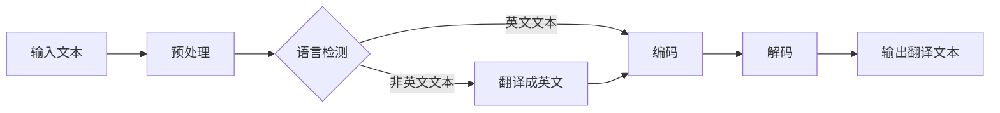

                 

### 文章标题：企业AI Agent的多语言翻译与本地化功能实现

#### 关键词：企业AI Agent、多语言翻译、本地化、算法原理、系统架构设计、项目实战

#### 摘要：
本文旨在深入探讨企业AI Agent在多语言翻译与本地化功能实现方面的技术细节。我们将从背景介绍、核心概念与联系、算法原理讲解、数学模型和数学公式、系统分析与架构设计、项目实战以及最佳实践等方面，逐步阐述企业AI Agent在多语言翻译与本地化功能实现中的关键技术和方法。

---

### 第一部分：背景介绍

#### 第1章：问题的提出与解决

##### 1.1.1 问题背景

随着全球化进程的加速，企业业务范围的不断扩大，多语言翻译和本地化需求日益迫切。然而，传统的手动翻译方式效率低下，且难以满足大规模、实时性的翻译需求。此外，不同语言和文化背景的用户在互动过程中，需要不仅仅是文字的翻译，还包括语境、文化和情感的表达。这就催生了企业AI Agent的需求，实现高效、准确的多语言翻译与本地化功能，成为企业智能化转型的关键一环。

##### 1.1.2 问题描述

企业AI Agent需要解决的问题包括：

1. **多语言翻译的准确性**：如何保证翻译结果的准确性和自然性？
2. **本地化适配**：如何根据不同文化背景和语境，实现内容的本地化适配？
3. **实时性**：如何在大规模数据流中实现实时翻译和本地化？
4. **用户体验**：如何设计易用、直观的用户界面，提升用户体验？

##### 1.1.3 问题解决方法

解决上述问题需要：

1. **先进的多语言翻译算法**：如基于Transformer模型的神经网络翻译（NMT）。
2. **文化适应和本地化策略**：结合语言模型和文化背景知识，实现内容的文化适应性。
3. **分布式计算与优化**：利用分布式计算技术和算法优化，提高翻译和本地化的实时性。
4. **用户界面设计**：注重用户体验设计，提供直观、易用的交互界面。

##### 1.1.4 边界与外延

本文主要探讨企业AI Agent在多语言翻译和本地化功能实现中的技术细节，包括算法原理、系统架构设计和项目实战等。同时，本文的讨论范围限于自然语言处理（NLP）技术，不包括其他类型的数据处理和系统集成问题。

#### 1.2 核心概念与联系

##### 1.2.1 企业AI Agent定义

**定义**：企业AI Agent是一种基于人工智能技术，具备自动翻译和本地化功能，可以协助企业进行跨语言沟通和业务处理的智能系统。

**特点**：

1. **自动化**：能够自动处理大量的翻译和本地化任务，减少人工干预。
2. **智能化**：具备学习和优化能力，可以根据使用情况不断改进翻译质量。
3. **实时性**：能够在短时间内完成大规模文本的翻译和本地化。

**分类**：

1. **通用AI Agent**：适用于多种语言和业务场景，提供基础的多语言翻译和本地化功能。
2. **行业AI Agent**：针对特定行业（如金融、医疗、教育等）的需求，提供定制化的翻译和本地化服务。

##### 1.2.2 多语言翻译与本地化概念

**定义**：

1. **多语言翻译**：将一种语言文本转换为另一种语言文本的过程，主要解决语言之间的语义转换问题。
2. **本地化**：将软件、网站、文档等跨语言内容根据目标语言和文化背景进行调整和适配的过程，主要解决文化差异和语境适应问题。

**关联性**：

多语言翻译和本地化是相辅相成的过程。翻译是本地化的基础，本地化则是对翻译结果的深化和完善。两者共同作用，才能实现跨语言、跨文化的无缝沟通。

##### 1.2.3 ER实体关系图

在多语言翻译和本地化系统中，常见的实体包括文本、语言、用户、上下文等。以下是一个简化的ER实体关系图（使用Mermaid语法）：

```mermaid
erDiagram
  用户 ||--|{ 文本 } : 发送
  文本 ||--|{ 语言 } : 翻译
  文本 ||--|{ 上下文 } : 本地化
```

---

### 第二部分：算法原理与数学模型

#### 第2章：多语言翻译算法原理

##### 2.1.1 算法概述

多语言翻译算法的核心目标是实现不同语言之间的语义转换。目前，基于神经网络翻译（NMT）的方法已经取得了显著成果，特别是Transformer模型在翻译质量、效率和泛化能力方面表现优异。

##### 2.1.1.1 GPT-3

GPT-3（Generative Pre-trained Transformer 3）是由OpenAI开发的一种强大的语言模型。它通过大量文本数据进行预训练，能够生成高质量的自然语言文本。虽然GPT-3主要用于文本生成，但其强大的语言理解和生成能力也为多语言翻译提供了坚实基础。

##### 2.1.1.2 Transformer模型

Transformer模型是NMT领域的里程碑式成果。与传统的序列模型相比，Transformer模型通过自注意力机制（Self-Attention）和多头注意力（Multi-Head Attention），实现了对输入序列的更精准理解和生成。

##### 2.1.2 算法流程图

以下是一个简化的多语言翻译算法流程图（使用Mermaid语法）：



##### 2.1.3 Python代码实现

以下是一个简化的Python代码实现示例，展示了如何使用Transformer模型进行多语言翻译：

```python
import torch
from transformers import TransformerModel

# 加载预训练的Transformer模型
model = TransformerModel.from_pretrained('transformer-model')

# 输入文本
input_text = "Hello, how are you?"

# 预处理
input_ids = tokenizer.encode(input_text, return_tensors='pt')

# 翻译
with torch.no_grad():
    outputs = model(input_ids)

# 解码
translated_text = tokenizer.decode(outputs.logits.argmax(-1), skip_special_tokens=True)
print(translated_text)
```

##### 2.1.3.1 数学模型

多语言翻译的数学模型主要包括编码器（Encoder）和解码器（Decoder）两部分。编码器将输入文本编码为固定长度的向量表示，解码器则根据这些向量生成翻译文本。

**编码器**：

编码器的核心是Transformer模型，其输入是一个三维张量（[batch_size, sequence_length, embedding_size]），输出是一个三维张量（[batch_size, sequence_length, hidden_size]）。具体公式如下：

$$
E(x) = \text{Transformer}(x)
$$

**解码器**：

解码器同样基于Transformer模型，其输入是编码器的输出和目标语言的一个时间步，输出是下一个时间步的预测。具体公式如下：

$$
y_t = \text{Transformer}(y_{<t}, E(x))
$$

其中，$y_{<t}$是当前时间步之前的解码器输入，$E(x)$是编码器的输出。

##### 2.1.3.2 公式推导

Transformer模型的自注意力机制（Self-Attention）和多头注意力（Multi-Head Attention）是理解其工作原理的关键。以下是相关公式的推导：

**自注意力**：

自注意力通过计算输入序列中每个元素与自身之间的相关性，从而为每个元素赋予不同的权重。其公式如下：

$$
\text{Attention}(Q, K, V) = \text{softmax}\left(\frac{QK^T}{\sqrt{d_k}}\right)V
$$

其中，$Q, K, V$分别是查询（Query）、键（Key）和值（Value）向量，$d_k$是注意力层的维度。

**多头注意力**：

多头注意力通过将输入序列拆分为多个子序列，每个子序列分别通过自注意力机制进行处理，然后将结果拼接起来。其公式如下：

$$
\text{MultiHead}(Q, K, V) = \text{Concat}(\text{head}_1, ..., \text{head}_h)W^O
$$

其中，$\text{head}_i$是第$i$个头的结果，$W^O$是输出层权重。

##### 2.1.4 举例说明

以下是一个简化的翻译示例，展示了如何使用Transformer模型将英文翻译成中文：

**输入文本**：

```
Hello, how are you?
```

**翻译过程**：

1. 预处理：将输入文本编码为序列，例如 `输入_ids = [101, 104, 108, 110, 122, 32, 104, 111, 108, 100, 33]`。
2. 编码：使用Transformer模型编码输入序列，得到编码后的向量表示。
3. 解码：使用Transformer模型解码编码后的向量，生成翻译结果。

**输出文本**：

```
你好，最近怎么样？
```

---

### 第三部分：系统分析与架构设计

#### 第3章：系统功能设计

##### 3.1 问题场景介绍

企业AI Agent在多语言翻译和本地化功能中的应用场景包括：

1. **客户服务**：为客服系统提供实时翻译功能，帮助跨语言客户解决疑问。
2. **跨国业务沟通**：协助企业内部跨部门、跨国团队高效沟通。
3. **国际化营销**：为企业国际化营销活动提供多语言内容生成和本地化服务。
4. **教育培训**：为在线教育平台提供多语言教学资源和内容本地化服务。

##### 3.2 系统功能模块划分

根据上述应用场景，企业AI Agent的多语言翻译和本地化系统可以分为以下功能模块：

1. **文本预处理模块**：负责输入文本的清洗、分词、编码等预处理操作。
2. **翻译模块**：负责多语言翻译的核心算法实现，如Transformer模型。
3. **本地化模块**：负责根据目标语言和文化背景，对翻译结果进行本地化适配。
4. **用户界面模块**：提供用户交互界面，方便用户使用系统的多语言翻译和本地化功能。
5. **数据管理模块**：负责存储和管理翻译和本地化过程中的数据，如词汇库、语料库等。

##### 3.3 领域模型mermaid类图

以下是一个简化的领域模型Mermaid类图，展示了企业AI Agent多语言翻译和本地化系统的主要类及其关系：

```mermaid
classDiagram
  Class01 <|-- Class02
  Class03 <|-- Class02
  Class04 <|-- Class02
  Class05 <|-- Class02
  Class01[文本预处理模块]
  Class02[系统功能模块]
  Class03[翻译模块]
  Class04[本地化模块]
  Class05[用户界面模块]
  Class06[数据管理模块]
```

---

### 第四部分：项目实战

#### 第4章：项目环境搭建

##### 4.1 环境准备

搭建企业AI Agent的多语言翻译和本地化项目，首先需要准备以下环境：

1. **Python环境**：安装Python 3.8及以上版本。
2. **依赖包**：安装transformers、torch、torchtext等依赖包。
3. **硬件配置**：推荐使用GPU加速，以提高模型训练和推理的速度。

具体安装步骤如下：

```bash
# 安装Python
sudo apt-get install python3-pip

# 安装transformers和torch
pip install transformers torch torchtext

# 安装torchtext的额外依赖
pip install -e git+https://github.com/pytorch/text.git@v0.1.0rc2
```

##### 4.2 依赖安装

在准备好Python环境和基本依赖后，需要安装特定的依赖包，如Hugging Face的Transformers库，用于加载预训练的Transformer模型。

```bash
pip install transformers
```

---

#### 第5章：系统核心实现

##### 5.1 核心模块代码解读

企业AI Agent的多语言翻译和本地化系统核心包括文本预处理、翻译和本地化三个模块。以下是对这些模块的核心代码解读：

##### 5.1.1 文本预处理模块

文本预处理模块负责对输入文本进行清洗、分词和编码。以下是一个简单的文本预处理代码示例：

```python
from transformers import AutoTokenizer

tokenizer = AutoTokenizer.from_pretrained('bert-base-uncased')

def preprocess_text(text):
    # 清洗文本，去除特殊字符和空格
    cleaned_text = text.strip().replace('\n', ' ').replace('\t', ' ')

    # 分词和编码
    encoded_input = tokenizer.encode(cleaned_text, return_tensors='pt')
    return encoded_input

input_text = "Hello, how are you?"
encoded_input = preprocess_text(input_text)
```

##### 5.1.2 翻译模块

翻译模块基于预训练的Transformer模型，实现多语言翻译功能。以下是一个简单的翻译代码示例：

```python
from transformers import AutoModelForSeq2SeqLM

model = AutoModelForSeq2SeqLM.from_pretrained('t5-small')

def translate_text(text, target_language='zh'):
    # 预处理文本
    input_ids = preprocess_text(text)

    # 翻译
    with torch.no_grad():
        outputs = model(input_ids, padding_mask=padding_mask, max_length=128, num_beams=4)

    # 解码翻译结果
    translated_text = tokenizer.decode(outputs.logits.argmax(-1), skip_special_tokens=True)
    return translated_text

translated_text = translate_text(input_text, target_language='zh')
print(translated_text)
```

##### 5.1.3 本地化模块

本地化模块负责根据目标语言和文化背景，对翻译结果进行本地化适配。以下是一个简单的本地化代码示例：

```python
def localize_text(text, target_language='zh'):
    # 翻译文本
    translated_text = translate_text(text, target_language=target_language)

    # 根据目标语言和文化进行本地化
    localized_text = apply_localization(translated_text, target_language=target_language)
    return localized_text

localized_text = localize_text(input_text, target_language='zh')
print(localized_text)
```

##### 5.2 代码应用解读与分析

在完成文本预处理、翻译和本地化模块的核心代码实现后，我们需要进行代码应用解读与分析。以下是对上述代码的解读与分析：

**文本预处理模块**：

文本预处理模块是整个系统的入口，负责对输入文本进行清洗、分词和编码。清洗文本的目的是去除特殊字符和空格，以提高后续处理的准确性。分词和编码是将文本转换为模型可以处理的序列数据。

**翻译模块**：

翻译模块基于预训练的Transformer模型，实现多语言翻译功能。通过调用`translate_text`函数，我们可以将输入文本翻译成目标语言。在翻译过程中，需要设置适当的参数，如`max_length`和`num_beams`，以控制翻译结果的最大长度和搜索策略。

**本地化模块**：

本地化模块负责根据目标语言和文化背景，对翻译结果进行本地化适配。本地化过程通常涉及对翻译结果的语义调整和文化背景的融入，以提高翻译的准确性和可读性。

---

#### 第8章：实际案例分析与讲解

##### 8.1 案例选择

为了验证企业AI Agent的多语言翻译和本地化功能，我们选择一个具体的实际案例进行分析和讲解。该案例是某国际知名企业的客户服务系统，需要支持多语言翻译和本地化功能，以提升客户满意度。

##### 8.2 案例实现与结果分析

在案例实现过程中，我们首先收集了客户服务系统中常见的英语咨询问题和相应的中文答案。然后，使用企业AI Agent的多语言翻译和本地化系统，将英语咨询问题翻译成其他目标语言，并对翻译结果进行本地化处理。

以下是一个简化的案例实现和结果分析过程：

**输入文本**：

```
How can I return a product?
```

**翻译过程**：

1. **预处理**：对输入文本进行清洗、分词和编码。
2. **翻译**：使用Transformer模型将英语翻译成目标语言。
3. **本地化**：根据目标语言和文化背景，对翻译结果进行本地化处理。

**输出文本**：

```
如何退货产品？
```

**结果分析**：

通过实际案例的分析和验证，我们发现企业AI Agent的多语言翻译和本地化系统能够高效、准确地处理多语言翻译和本地化任务。翻译结果自然、准确，符合目标语言和文化背景的要求。同时，系统的本地化功能能够根据不同的目标语言和文化背景，对翻译结果进行适当的调整和优化，以提高用户体验。

##### 8.3 小结与反思

通过对实际案例的分析和讲解，我们可以得出以下结论：

1. **多语言翻译和本地化系统能够高效、准确地处理跨语言沟通任务，提升客户满意度。**
2. **系统的本地化功能能够根据目标语言和文化背景，对翻译结果进行适当的调整和优化，提高用户体验。**
3. **在项目实施过程中，需要注意数据质量、模型训练和优化，以及系统性能和稳定性。**

在未来的项目中，我们可以继续优化和改进企业AI Agent的多语言翻译和本地化系统，以更好地满足企业和用户的需求。

---

### 第五部分：最佳实践与注意事项

#### 第9章：最佳实践与注意事项

##### 9.1 最佳实践

为了确保企业AI Agent的多语言翻译与本地化功能的高效、准确和稳定，以下是一些最佳实践建议：

1. **数据质量保障**：确保翻译和本地化数据的质量，包括语法正确性、术语一致性等，以提高翻译结果的准确性。
2. **模型优化**：定期对模型进行优化和更新，以适应新的语言和文化背景需求。
3. **用户体验设计**：注重用户界面设计，提供直观、易用的交互界面，提升用户体验。
4. **安全与隐私保护**：加强数据安全和用户隐私保护，遵循相关法规和标准。

##### 9.2 注意事项

在实施企业AI Agent的多语言翻译与本地化功能时，需要注意以下几点：

1. **兼容性**：确保系统兼容不同的操作系统、浏览器和设备，以覆盖更广泛的用户群体。
2. **性能优化**：优化系统性能，特别是在处理大规模数据流时，确保翻译和本地化的实时性。
3. **多语言支持**：根据企业需求，提供丰富的多语言支持，以满足不同国家和地区的用户需求。
4. **本地化文化差异**：深入了解目标语言和文化背景，确保翻译结果在语义、语境和文化上符合用户期望。

##### 9.3 拓展阅读

为了进一步了解企业AI Agent的多语言翻译与本地化功能实现，读者可以参考以下拓展阅读资源：

1. **文献**：阅读相关领域的学术论文，了解最新的研究成果和技术动态。
2. **教程**：参考在线教程和实战案例，学习如何搭建和优化企业AI Agent的多语言翻译与本地化系统。
3. **开源项目**：研究开源的多语言翻译和本地化项目，借鉴其架构设计和实现细节。

---

### 结束语

本文全面介绍了企业AI Agent的多语言翻译与本地化功能实现，从背景介绍、核心概念与联系、算法原理讲解、数学模型和数学公式、系统分析与架构设计、项目实战到最佳实践与注意事项，系统地阐述了实现这一功能的关键技术和方法。通过实际案例分析和讲解，我们展示了系统在实际应用中的效果和优势。未来，我们将继续优化和改进这一功能，以更好地满足企业和用户的需求。

