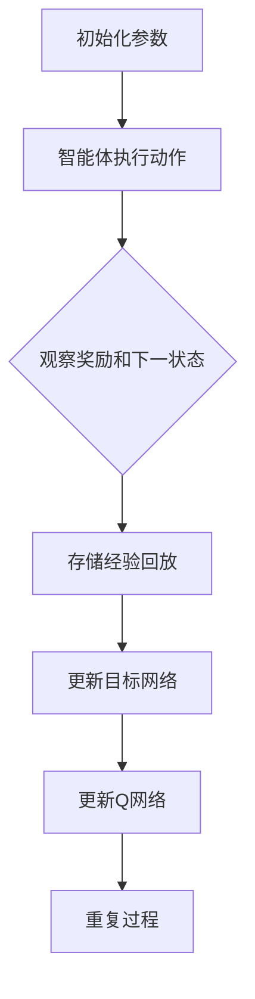
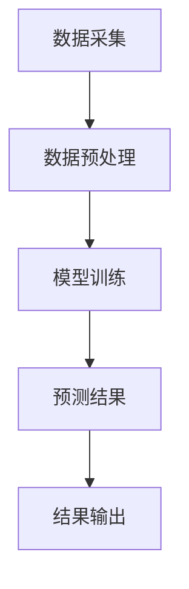
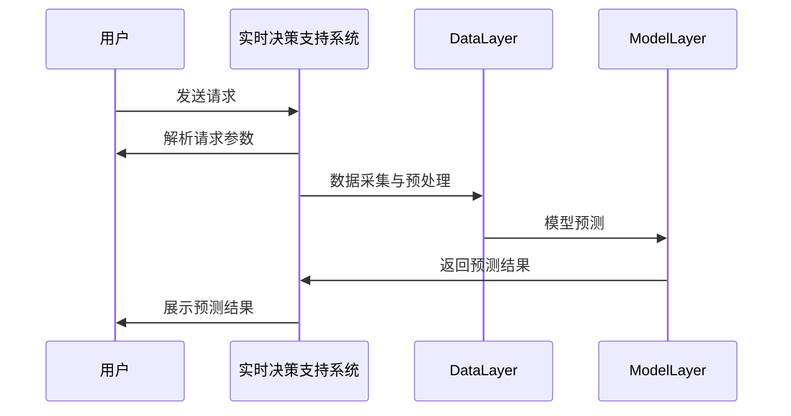
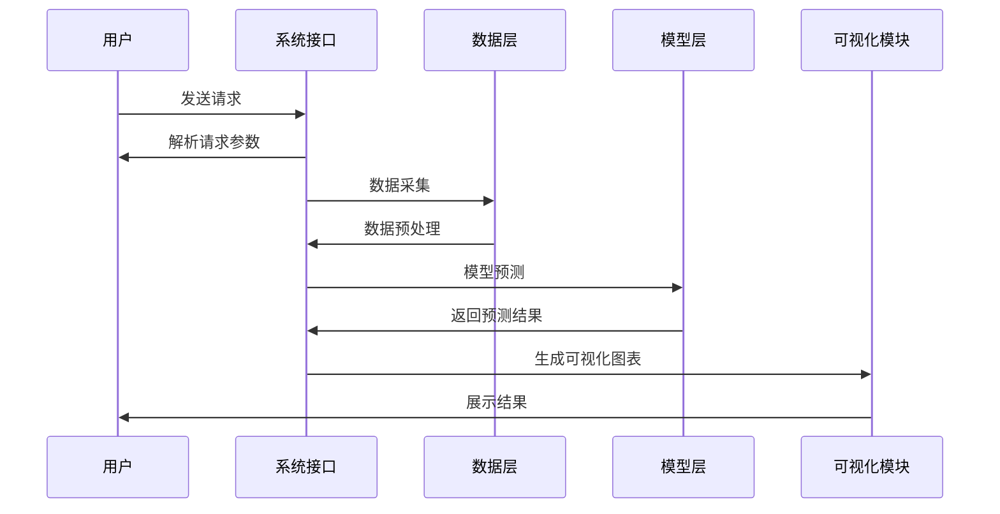
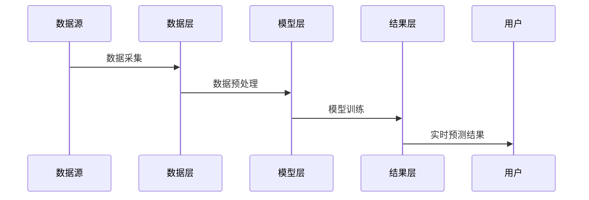
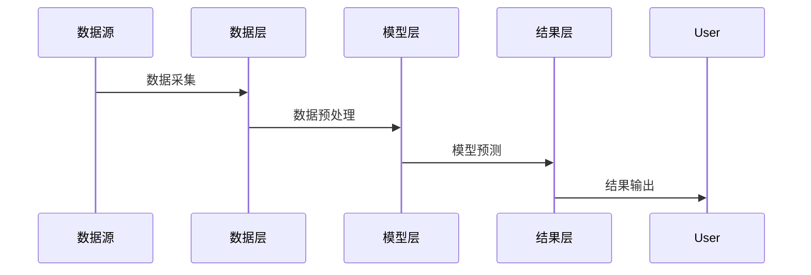

                 

## 第一部分：背景与核心概念

### 第1章：企业AI Agent概述

#### 1.1.1 企业AI Agent的定义与作用

企业AI Agent，简称企业AI，是一种基于人工智能技术的智能体，能够自动执行特定的任务，并在执行过程中不断学习和优化其行为。在企业环境中，AI Agent的作用主要包括以下几点：

1. **自动化操作**：AI Agent可以自动完成重复性高、繁琐的工作，如数据分析、报表生成、邮件发送等，从而减轻员工的工作负担。
2. **实时决策支持**：AI Agent可以实时分析企业运营数据，为企业决策层提供科学、客观的决策支持，提高决策效率。
3. **提升业务效率**：通过优化业务流程、降低运营成本，AI Agent有助于企业提升整体业务效率。
4. **增强客户体验**：AI Agent可以与客户进行自然语言交互，提供个性化的服务，从而提升客户满意度。

#### 1.1.2 AI Agent的发展历程

AI Agent的发展可以追溯到20世纪80年代，当时的专家系统逐渐成为一种流行的技术。随着计算能力的提升和数据量的增加，AI Agent逐渐从规则驱动转向数据驱动，特别是在深度学习和强化学习等算法的推动下，AI Agent的发展进入了一个新的阶段。

1. **早期阶段（1980-1990）**：以基于规则的专家系统为代表，如Dendral和MYCIN系统。
2. **低谷期（1990-2000）**：由于知识获取困难和系统性能问题，AI Agent的发展陷入低谷。
3. **复兴阶段（2000-2010）**：随着互联网和大数据技术的发展，AI Agent开始逐渐复苏，尤其是机器学习算法的应用。
4. **快速发展阶段（2010至今）**：深度学习、强化学习等先进算法的广泛应用，使得AI Agent在各个领域取得了显著的成果。

#### 1.1.3 实时决策支持系统的需求分析

实时决策支持系统（Real-time Decision Support System，RDSS）是企业AI Agent的重要组成部分，其需求主要体现在以下几个方面：

1. **实时性**：实时决策支持系统要求能够在极短的时间内处理大量数据，并生成决策结果，以满足企业快速响应市场的需求。
2. **准确性**：系统需要具备较高的预测准确率，以确保决策结果的可靠性。
3. **灵活性**：系统能够根据企业业务变化和市场需求，快速调整和优化决策模型。
4. **可扩展性**：系统能够支持企业规模的扩展，适应不断增长的数据量和业务需求。
5. **安全性**：系统需要保证数据安全和隐私保护，防止敏感信息泄露。

### 第2章：核心概念与联系

#### 2.1.1 AI Agent的核心概念

AI Agent的核心概念包括以下几个部分：

1. **智能体（Agent）**：智能体是一个具有感知、决策和执行能力的实体，能够在特定环境中完成特定任务。在人工智能领域，智能体通常指计算机程序。
2. **感知（Perception）**：感知是指智能体通过传感器获取环境信息，如图像、声音、文本等，从而理解当前环境状态。
3. **决策（Decision）**：决策是指智能体根据感知到的环境信息，结合内部知识和目标，选择最佳行动方案。
4. **执行（Execution）**：执行是指智能体根据决策结果，执行具体的行动，如控制机器人的运动、发送邮件等。
5. **学习（Learning）**：学习是指智能体通过不断调整内部模型和行为策略，以适应环境变化和提高任务完成效果。

#### 2.1.2 实时决策支持系统的构成要素

实时决策支持系统主要由以下几个部分构成：

1. **数据采集**：实时决策支持系统需要从各种数据源收集数据，包括内部数据（如业务系统数据、库存数据）和外部数据（如市场数据、社交媒体数据）。
2. **数据预处理**：收集到的数据通常需要经过清洗、转换和归一化等处理，以确保数据的质量和一致性。
3. **决策模型**：决策模型是实时决策支持系统的核心，包括预测模型、优化模型等，用于分析数据并生成决策结果。
4. **决策引擎**：决策引擎负责将决策模型的结果转换为具体的行动方案，如调整库存、发送促销邮件等。
5. **用户界面**：用户界面用于展示决策结果，并提供用户交互功能，如查看分析报告、调整决策参数等。

#### 2.1.3 AI Agent与实时决策支持的关联

AI Agent与实时决策支持系统之间存在密切的联系：

1. **AI Agent作为实时决策支持系统的核心组件**：AI Agent负责实时感知环境、做出决策和执行行动，是实时决策支持系统的核心执行单元。
2. **实时决策支持系统为AI Agent提供决策支持**：实时决策支持系统通过收集和分析数据，为AI Agent提供科学的决策依据，从而提高决策质量和效率。
3. **AI Agent与实时决策支持系统的协同作用**：AI Agent和实时决策支持系统相互配合，共同实现企业运营的智能化和自动化，提升整体业务效率。

### 小结

本章首先介绍了企业AI Agent的定义与作用，回顾了AI Agent的发展历程，并分析了实时决策支持系统的需求。接着，详细阐述了AI Agent的核心概念和实时决策支持系统的构成要素，以及它们之间的关联。通过本章的学习，读者可以初步了解企业AI Agent和实时决策支持系统的基本概念和重要性。

---

#### 第3章：AI Agent算法原理

AI Agent的算法原理是其实现核心功能的基础，主要包括强化学习和监督学习两种主要类型。在本章中，我们将深入探讨这两种算法的基本原理，并通过具体的案例来理解它们的工作机制。

##### 3.1.1 强化学习算法原理

强化学习（Reinforcement Learning，RL）是一种使智能体在与环境互动的过程中学习最优策略的机器学习范式。其基本原理是智能体通过不断尝试不同的行动，并根据行动的结果（奖励或惩罚）调整自己的行为策略。

**1. 强化学习的基本概念**

- **状态（State）**：智能体在某一时刻所处的环境状态。
- **动作（Action）**：智能体可执行的操作。
- **奖励（Reward）**：动作执行后，环境对智能体的奖励或惩罚。
- **策略（Policy）**：智能体在某一状态下选择动作的规则。

**2. 强化学习的主要算法**

- **Q-Learning算法**

Q-Learning是一种值函数方法，通过更新Q值（状态-动作值函数）来学习策略。其基本思想是：选择当前状态下具有最大Q值的动作，并在动作后更新Q值。

**Q-Learning算法流程**：

（使用Mermaid流程图表示）

```mermaid
graph TD
    A[初始化Q表] --> B[智能体执行动作]
    B --> C{观察奖励和下一状态}
    C -->|奖励> D[更新Q值]
    D --> E[重复过程]
```

- **Deep Q-Network（DQN）算法**

DQN是一种基于深度神经网络的强化学习算法，旨在解决深度强化学习中的经验回放和目标网络问题。DQN通过训练一个深度神经网络来近似Q值函数，并通过经验回放和目标网络技术提高学习效率。

**DQN算法流程**：

（使用Mermaid流程图表示）



**3. 强化学习案例**

假设一个自动驾驶汽车在道路上行驶，其目标是最小化碰撞概率。智能体在每个时刻选择不同的驾驶行为（如加速、减速、转向），并根据道路状况和环境反馈（如障碍物距离、路况信息）获得奖励或惩罚。通过强化学习，智能体可以不断调整驾驶策略，以实现安全驾驶。

##### 3.1.2 监督学习算法原理

监督学习（Supervised Learning）是一种基于已知输入输出数据的机器学习方法，通过训练模型来预测新的输入数据。监督学习算法在图像识别、语音识别、自然语言处理等领域有广泛应用。

**1. 监督学习的基本概念**

- **训练集（Training Set）**：包含输入和输出对的集合，用于训练模型。
- **测试集（Test Set）**：用于评估模型性能的输入输出对集合。
- **特征（Feature）**：输入数据的组成部分，用于描述数据特性。
- **标签（Label）**：输出数据，用于指导模型训练。

**2. 监督学习的主要算法**

- **神经网络（Neural Networks）**

神经网络是一种模拟生物神经系统的计算模型，通过多层神经元实现数据的非线性变换。常见的神经网络结构包括前馈神经网络、卷积神经网络（CNN）和循环神经网络（RNN）。

**3. 神经网络基本结构**

神经网络的基本结构包括输入层、隐藏层和输出层：

- **输入层**：接收输入数据。
- **隐藏层**：对输入数据进行特征提取和变换。
- **输出层**：生成预测结果。

**4. 回归与分类算法**

- **回归（Regression）**：用于预测连续值输出。
- **分类（Classification）**：用于预测离散值输出。

常见的回归算法有线性回归、决策树回归、支持向量回归等；常见的分类算法有逻辑回归、决策树分类、支持向量机（SVM）等。

**5. 监督学习案例**

以图像识别任务为例，给定一组带有标签的图像数据，通过训练卷积神经网络模型，模型可以学会识别新的图像。具体步骤如下：

（使用Python代码示例）

```python
import tensorflow as tf
from tensorflow.keras.models import Sequential
from tensorflow.keras.layers import Conv2D, Flatten, Dense

# 构建卷积神经网络模型
model = Sequential([
    Conv2D(32, (3, 3), activation='relu', input_shape=(28, 28, 1)),
    Flatten(),
    Dense(64, activation='relu'),
    Dense(10, activation='softmax')
])

# 编译模型
model.compile(optimizer='adam', loss='categorical_crossentropy', metrics=['accuracy'])

# 训练模型
model.fit(x_train, y_train, epochs=10, batch_size=32, validation_data=(x_test, y_test))
```

##### 3.1.3 强化学习与监督学习的比较

强化学习和监督学习在本质和应用场景上有显著差异：

1. **学习目标**：强化学习旨在学习最优策略，使智能体在动态环境中获得最大奖励；监督学习旨在预测新的输入数据的输出标签。
2. **数据需求**：强化学习通常需要大量的经验数据进行训练，而监督学习需要已标注的训练数据。
3. **应用场景**：强化学习适用于动态、不确定环境中的决策问题，如自动驾驶、游戏AI等；监督学习适用于结构化数据中的预测问题，如图像识别、语音识别等。

### 小结

本章详细介绍了AI Agent算法原理，首先探讨了强化学习的基本概念、主要算法以及案例应用，然后介绍了监督学习的基本原理、神经网络结构以及回归与分类算法，并对比了强化学习与监督学习的异同。通过本章的学习，读者可以深入了解AI Agent算法的核心原理，为后续章节的系统架构设计与项目实战打下基础。

---

#### 第4章：实时决策支持系统的数学模型

实时决策支持系统（RDSS）的数学模型是其核心组成部分，用于对复杂业务场景进行建模和优化。在本章中，我们将探讨决策理论的基础数学模型，包括决策树模型和多目标决策模型，以及实时数据处理的预测模型和时间序列分析。

##### 4.1.1 决策理论的数学基础

决策理论是研究在不确定环境下做出最优决策的方法论，其核心在于利用概率论和优化理论来分析决策过程。

**1. 决策树模型**

决策树模型是一种常用的决策分析方法，通过树形结构表示决策过程。每个节点表示一个决策或测试，每个分支代表一个决策结果，叶节点表示最终的决策结果。

**决策树的基本概念**：

- **根节点**：决策树的起始节点。
- **内部节点**：表示决策或测试的节点。
- **叶节点**：表示决策结果的节点。
- **路径**：从根节点到叶节点的路径。

**决策树的构建过程**：

（使用Mermaid流程图表示）

```mermaid
graph TD
    A[根节点] -->|测试1> B[内部节点1]
    A -->|测试2> C[内部节点2]
    B -->|结果1> D[叶节点1]
    B -->|结果2> E[叶节点2]
    C -->|结果3> F[叶节点3]
    C -->|结果4> G[叶节点4]
```

**决策树的应用**：决策树模型可以用于分类、回归和预测等多种场景。例如，在信用评分系统中，通过构建决策树模型，可以根据客户的财务数据预测其信用风险等级。

**2. 多目标决策模型**

多目标决策（Multi-Objective Decision Making，MOMD）涉及同时优化多个目标，这些目标可能相互冲突。多目标决策模型通常采用优化算法和目标权重调整方法来解决。

**多目标决策的基本概念**：

- **目标**：决策过程中需要优化的指标。
- **目标函数**：表示每个目标的数学表达式。
- **权重**：表示每个目标的重要程度。

**多目标决策的数学模型**：

$$
\min \sum_{i=1}^{n} w_i f_i(x)
$$

其中，$w_i$ 为第 $i$ 个目标的权重，$f_i(x)$ 为第 $i$ 个目标函数。

**多目标决策算法**：多目标决策问题通常采用遗传算法、粒子群算法等进化算法进行求解。

**3. 时间序列分析**

时间序列分析是一种用于研究随时间变化的数据的统计方法。时间序列数据通常具有趋势性、季节性和周期性等特点。

**时间序列分析的基本概念**：

- **趋势**：数据随时间的变化趋势。
- **季节性**：数据在一年内周期性的变化。
- **周期性**：数据在较长周期内（如几年）的变化。

**时间序列分析的方法**：

- **自回归模型（AR）**：利用历史数据预测未来值。
- **移动平均模型（MA）**：利用过去一段时间内的平均值预测未来值。
- **自回归移动平均模型（ARMA）**：结合自回归和移动平均模型。

**4.1.2 实时数据的处理与预测**

实时决策支持系统需要快速处理和分析大量实时数据，并生成预测结果。以下介绍几种常见的实时数据处理和预测方法：

**1. 时间序列预测模型**

时间序列预测模型用于预测未来某一时间点的数据值。常见的模型有ARIMA（自回归差分移动平均模型）和LSTM（长短时记忆网络）。

**ARIMA模型**：

$$
\phi(B) \varphi(B) \eta(X_t) = \theta(B) \varepsilon_t
$$

其中，$\phi(B)$ 和 $\varphi(B)$ 分别为自回归项和移动平均项，$B$ 为滞后算子，$\eta(X_t)$ 为白噪声序列。

**LSTM模型**：

LSTM模型是一种特殊的循环神经网络，能够有效地捕捉时间序列中的长期依赖关系。

**2. 实时数据处理方法**

实时数据处理方法包括数据流处理和批处理。数据流处理方法如Apache Kafka和Apache Flink，能够实时处理大规模数据流，并生成实时预测结果。

**3. 实时预测系统架构**

实时预测系统架构通常包括数据采集、数据预处理、模型训练和预测、结果输出等模块。

（使用Mermaid架构图表示）



**小结**

本章介绍了实时决策支持系统的数学模型，包括决策树模型、多目标决策模型和时间序列分析。通过决策树模型，可以有效地进行分类和回归分析；多目标决策模型可以帮助企业在复杂业务场景中做出最优决策；时间序列分析则为实时数据预测提供了理论基础。本章的数学模型和算法为后续章节的系统架构设计与项目实战提供了重要参考。

---

#### 第5章：实时决策支持系统的架构设计

实时决策支持系统（RDSS）的架构设计是其高效运行和功能实现的关键。本章节将详细探讨实时决策支持系统的整体架构设计，包括数据层、算法层、展现层和系统接口设计。

##### 5.1.1 系统架构概述

实时决策支持系统的架构设计应遵循模块化、可扩展和高效的原则，以支持系统功能的灵活扩展和性能优化。整体架构可以分为以下四个层次：

1. **数据层**：负责数据的采集、存储、清洗和预处理，为后续的算法处理提供高质量的数据支持。
2. **算法层**：包括各种机器学习算法和预测模型，用于对数据进行分析和处理，生成决策支持结果。
3. **展现层**：用于展示系统生成的决策支持结果，提供用户交互界面，使决策者能够直观地理解和应用决策支持信息。
4. **接口层**：负责与其他系统或应用进行数据交互，支持系统的集成和协同工作。

##### 5.1.2 数据层设计

数据层是实时决策支持系统的基石，其设计需要考虑数据的高效采集、存储和管理。以下是数据层的主要设计要点：

**1. 数据采集**

数据采集是实时决策支持系统的基础，涉及从多种数据源（如数据库、文件、API等）收集数据。为了确保数据的一致性和实时性，可以使用消息队列（如Kafka）进行数据流处理。

**2. 数据存储**

数据存储需要选择适合实时数据处理的大数据存储技术，如Hadoop、Spark等。数据存储不仅要满足海量数据存储的需求，还要保证数据的可靠性和持久性。

**3. 数据清洗和预处理**

数据清洗和预处理是数据层的重要环节，包括数据去重、格式转换、缺失值填充、异常值处理等。数据预处理的结果将直接影响后续算法的性能和预测精度。

##### 5.1.3 算法层设计

算法层是实时决策支持系统的核心，其设计需要考虑算法的选择、训练和优化。以下是算法层的主要设计要点：

**1. 算法选择**

根据业务需求和数据特点，选择合适的机器学习算法和预测模型。常见的算法包括线性回归、逻辑回归、决策树、随机森林、支持向量机、神经网络等。

**2. 算法训练**

算法训练是算法层的关键环节，需要使用高质量的数据集对算法进行训练。训练过程中，需要调整算法参数，优化模型性能。常用的训练方法包括交叉验证、网格搜索等。

**3. 模型优化**

模型优化是提高算法性能的重要手段，可以通过调整模型结构、优化算法参数、引入正则化方法等方式进行。优化的目标是提高模型的预测精度和泛化能力。

##### 5.1.4 展现层设计

展现层是实时决策支持系统与用户交互的窗口，其设计需要考虑用户体验和交互便捷性。以下是展现层的主要设计要点：

**1. 用户界面设计**

用户界面设计需要遵循简洁、直观和易操作的原则，提供丰富的图表、报表和可视化工具，帮助用户快速理解和分析决策支持结果。

**2. 交互设计**

交互设计需要考虑用户的操作习惯和需求，提供便捷的交互功能，如数据筛选、排序、过滤等。此外，还应提供用户自定义设置和配置功能，以满足个性化需求。

**3. 实时更新**

展现层需要实现实时数据更新，确保用户能够及时获取最新的决策支持信息。可以使用WebSocket等实时通信技术，实现数据的实时推送和更新。

##### 5.1.5 系统接口设计

系统接口设计是实时决策支持系统与其他系统或应用集成的关键，其设计需要考虑接口的规范性、可扩展性和安全性。以下是系统接口设计的主要要点：

**1. 接口规范**

接口规范应遵循RESTful API设计原则，使用统一的接口命名、参数传递和数据格式。例如，使用JSON格式传输数据，使用HTTP协议进行通信。

**2. 接口安全**

接口安全是系统接口设计的重要考虑因素，需要采用身份验证、权限控制和加密传输等技术，确保接口数据的安全性和隐私保护。

**3. 接口文档**

接口文档是系统接口设计的重要组成部分，应详细描述接口的URL、参数、返回值和错误码等信息，以便开发人员能够快速理解和使用接口。

##### 小结

本章详细介绍了实时决策支持系统的架构设计，包括数据层、算法层、展现层和系统接口设计。数据层负责数据采集、存储和预处理；算法层负责数据分析和预测；展现层负责数据展示和用户交互；系统接口设计确保系统与其他应用的集成和协同工作。通过本章的学习，读者可以全面了解实时决策支持系统的架构设计原则和实现方法，为后续的项目实战和系统部署提供指导。

---

#### 第6章：系统接口设计与交互

在实时决策支持系统中，系统接口设计与交互是实现系统功能、数据流转和用户交互的关键。本章节将详细介绍系统接口设计、交互流程、用户请求处理和数据流处理流程，并使用Mermaid序列图和类图来展示相关架构。

##### 6.1.1 系统接口设计

系统接口设计的目标是确保数据流转的顺畅、系统功能的集成和用户交互的便捷。以下是系统接口设计的主要内容和要点：

**1. 接口规范**

接口设计应遵循RESTful API设计原则，使用统一的接口命名、参数传递和数据格式。具体规范如下：

- **URL规范**：使用URL路径表示资源的操作，如`/api/v1/data/collect`表示数据收集接口。
- **参数传递**：使用HTTP请求的查询参数或请求体（JSON格式）传递数据，如`GET /api/v1/data/collect?source=database&date=2023-01-01`。
- **数据格式**：使用JSON格式传输数据，确保数据结构的统一性和可解析性。

**2. 接口安全**

接口安全是系统接口设计的重要考虑因素，需要采用身份验证、权限控制和加密传输等技术。具体安全措施如下：

- **身份验证**：使用OAuth2.0等身份验证协议，确保接口请求的身份验证。
- **权限控制**：根据用户角色和权限，限制对接口的访问权限，如只有管理员可以访问某些敏感接口。
- **加密传输**：使用HTTPS协议进行数据传输，确保数据传输的安全性和隐私保护。

**3. 接口文档**

接口文档是系统接口设计的重要组成部分，应详细描述接口的URL、参数、返回值和错误码等信息。以下是接口文档的基本结构：

- **接口概述**：介绍接口的功能和用途。
- **URL与参数**：列出接口的URL和请求参数，包括参数名称、类型、是否必填和示例值。
- **返回值**：描述接口的返回值数据结构，包括字段名称、类型、示例值和错误码。
- **示例请求与响应**：提供示例请求和响应数据，帮助开发者理解接口的使用方法。

**4. 接口测试**

接口测试是确保接口设计正确和功能实现的关键步骤。测试应包括功能测试、性能测试和安全测试等方面。以下是接口测试的基本流程：

- **功能测试**：验证接口是否按照设计规范正常工作，如数据传输的正确性、响应时间的合理性等。
- **性能测试**：评估接口在高并发、大数据量情况下的性能表现，如响应时间、吞吐量等。
- **安全测试**：检测接口是否存在安全漏洞，如SQL注入、XSS攻击等。

##### 6.1.2 系统交互流程

系统交互流程是用户与实时决策支持系统之间交互的完整过程，包括用户请求、系统处理和数据返回等环节。以下是系统交互流程的主要步骤：

1. **用户请求**：用户通过Web前端发送请求，请求参数包括数据来源、时间范围、查询条件等。
2. **请求解析**：系统接口接收用户请求，解析请求参数，并调用相应的数据采集和处理模块。
3. **数据处理**：数据层对用户请求进行数据采集、清洗、预处理和模型预测，生成决策支持结果。
4. **结果返回**：系统将预测结果返回给用户，并通过Web前端展示。

（使用Mermaid序列图表示）



##### 6.1.3 用户请求处理流程

用户请求处理流程是系统核心功能实现的关键，以下是用户请求处理流程的详细步骤：

1. **请求接收**：系统接口接收用户请求，解析请求参数。
2. **参数校验**：对请求参数进行校验，确保参数符合接口规范。
3. **数据采集**：根据请求参数，从数据源采集数据。
4. **数据预处理**：对采集到的数据进行清洗、转换和归一化处理。
5. **模型预测**：使用训练好的机器学习模型对预处理后的数据进行预测。
6. **结果生成**：生成预测结果，包括数值预测和可视化图表。
7. **结果返回**：将预测结果返回给用户，并通过Web前端展示。

（使用Mermaid序列图表示）



##### 6.1.4 数据流处理流程

数据流处理流程是实时决策支持系统实现实时数据处理和预测的核心，以下是数据流处理流程的详细步骤：

1. **数据采集**：从各种数据源（如数据库、消息队列、API等）采集实时数据。
2. **数据预处理**：对采集到的数据进行清洗、转换和归一化处理，确保数据质量。
3. **数据存储**：将预处理后的数据存储到数据存储层，如HDFS、HBase等。
4. **数据分片**：将数据分片，按时间、类别等维度进行存储，以支持快速查询和实时处理。
5. **模型训练**：使用训练算法对数据集进行训练，生成预测模型。
6. **模型部署**：将训练好的模型部署到在线预测服务中，如TensorFlow Serving、PyTorch Serving等。
7. **实时预测**：实时接收数据流，使用在线模型进行预测，并生成预测结果。
8. **结果存储**：将预测结果存储到结果存储层，如数据库、HDFS等。
9. **结果分发**：将预测结果分发给用户或下游系统，通过Web前端或API接口进行展示。

（使用Mermaid序列图表示）



##### 小结

本章详细介绍了实时决策支持系统的接口设计与交互流程。系统接口设计确保数据流转的顺畅、系统功能的集成和用户交互的便捷；用户请求处理流程实现用户请求的接收、处理和响应；数据流处理流程实现实时数据处理和预测。通过本章的学习，读者可以全面了解实时决策支持系统的接口设计和交互流程，为后续的项目实战和系统部署提供指导。

---

#### 第7章：环境搭建与核心实现

在实施实时决策支持系统的过程中，首先需要搭建一个合适的技术环境，并实现系统的核心功能。本章节将详细介绍环境搭建的步骤，以及系统的核心实现过程。

##### 7.1.1 环境搭建

搭建实时决策支持系统环境的主要步骤如下：

1. **硬件准备**：选择合适的硬件设备，如服务器、存储设备和网络设备。硬件配置需根据系统的实际需求和数据处理量进行选择。

2. **操作系统安装**：在服务器上安装操作系统，如Linux或Windows。推荐使用Linux操作系统，因为它在分布式计算和大数据处理方面具有更好的性能。

3. **数据库安装**：选择合适的数据库系统，如MySQL、PostgreSQL或MongoDB。数据库用于存储系统数据，包括原始数据、预处理数据和预测结果。

4. **消息队列安装**：安装消息队列系统，如Kafka或RabbitMQ。消息队列用于处理实时数据流，确保系统的高效运行和数据的实时性。

5. **分布式计算框架安装**：安装分布式计算框架，如Apache Spark或Hadoop。分布式计算框架用于处理海量数据，提供并行计算能力。

6. **机器学习框架安装**：安装机器学习框架，如TensorFlow或PyTorch。机器学习框架用于训练预测模型，实现数据分析和预测功能。

7. **Web服务器安装**：安装Web服务器，如Apache或Nginx。Web服务器用于提供Web接口，展示系统生成的决策支持结果。

##### 7.1.2 系统核心实现

系统核心实现包括数据预处理、模型训练、模型部署和实时预测等关键步骤。以下是核心实现过程的详细描述：

**1. 数据预处理**

数据预处理是实时决策支持系统的关键环节，其目标是将原始数据转换为适合模型训练的数据。以下是数据预处理的主要步骤：

- **数据清洗**：去除数据中的噪声和异常值，保证数据质量。
- **数据转换**：将不同类型的数据转换为统一的格式，如将文本数据转换为数值型。
- **数据归一化**：对数据进行归一化处理，使数据分布在相同的范围内，便于模型训练。
- **特征提取**：从原始数据中提取有用的特征，用于模型训练。

（使用Python代码示例）

```python
import pandas as pd
from sklearn.preprocessing import MinMaxScaler

# 加载数据
data = pd.read_csv('data.csv')

# 数据清洗
data.dropna(inplace=True)

# 数据转换
data['feature'] = data['text'].apply(lambda x: preprocess_text(x))

# 数据归一化
scaler = MinMaxScaler()
data[['feature']] = scaler.fit_transform(data[['feature']])
```

**2. 模型训练**

模型训练是实时决策支持系统的核心，其目标是通过历史数据训练出具有预测能力的模型。以下是模型训练的主要步骤：

- **数据分割**：将数据集分为训练集和测试集，用于模型训练和评估。
- **选择模型**：选择合适的机器学习模型，如线性回归、决策树、神经网络等。
- **模型训练**：使用训练集数据训练模型，调整模型参数，优化模型性能。
- **模型评估**：使用测试集数据评估模型性能，确保模型具有良好的预测能力。

（使用Python代码示例）

```python
from sklearn.model_selection import train_test_split
from sklearn.linear_model import LinearRegression

# 数据分割
X_train, X_test, y_train, y_test = train_test_split(data[['feature']], data['target'], test_size=0.2, random_state=42)

# 选择模型
model = LinearRegression()

# 模型训练
model.fit(X_train, y_train)

# 模型评估
score = model.score(X_test, y_test)
print(f'Model score: {score}')
```

**3. 模型部署**

模型部署是将训练好的模型部署到生产环境中，使其能够接受实时数据并进行预测。以下是模型部署的主要步骤：

- **模型保存**：将训练好的模型保存为文件，以便后续使用。
- **模型加载**：从文件中加载模型，用于实时预测。
- **实时预测**：接收实时数据，使用模型进行预测，并将预测结果返回给用户。

（使用Python代码示例）

```python
import joblib

# 模型保存
joblib.dump(model, 'model.pkl')

# 模型加载
model = joblib.load('model.pkl')

# 实时预测
new_data = [[0.5]]  # 示例数据
prediction = model.predict(new_data)
print(f'Prediction: {prediction}')
```

##### 7.1.3 代码应用解读与分析

以上代码示例展示了实时决策支持系统的数据预处理、模型训练和模型部署的核心实现过程。以下是代码应用的具体解读与分析：

- **数据预处理**：首先，通过读取CSV文件加载数据，然后对数据集进行清洗，去除缺失值和异常值。接着，使用文本预处理函数`preprocess_text`对文本数据转换为数值型，并进行归一化处理，以适应机器学习模型。
- **模型训练**：使用`train_test_split`函数将数据集分割为训练集和测试集，然后选择线性回归模型进行训练。模型训练过程中，通过`fit`函数调整模型参数，优化模型性能。最后，使用`score`函数评估模型在测试集上的性能，确保模型具有良好的预测能力。
- **模型部署**：首先，使用`joblib.dump`函数将训练好的模型保存为文件，然后使用`joblib.load`函数从文件中加载模型。在实时预测过程中，接收实时数据，使用加载的模型进行预测，并将预测结果返回给用户。

通过以上代码实现，读者可以了解实时决策支持系统的核心实现过程，为后续的实际案例分析提供基础。

### 第8章：实际案例分析

为了更好地理解实时决策支持系统的实际应用，我们将通过一个具体的案例来展示系统的设计与实现过程。本案例将围绕一家大型零售企业的库存管理，探讨如何利用实时决策支持系统优化库存水平。

##### 8.1.1 案例背景

某大型零售企业拥有广泛的商品线，包括服装、家电、食品等多个类别。由于市场需求波动较大，该企业的库存管理面临诸多挑战，如库存过多导致的资金占用和库存不足导致的销售损失。为了解决这些问题，企业决定引入实时决策支持系统，通过数据分析和预测，优化库存管理，提高运营效率。

##### 8.1.2 案例分析

**1. 问题定义**

该案例的主要问题是如何在市场需求波动较大的情况下，保持库存水平的合理性和及时性。具体问题包括：

- **库存过多**：某些商品的库存积压，导致资金占用和仓储成本增加。
- **库存不足**：某些商品的库存短缺，导致销售损失和客户流失。

**2. 数据收集**

为了解决上述问题，企业需要收集以下数据：

- **销售数据**：包括每日销售量、销售额、客户购买行为等。
- **库存数据**：包括商品库存量、库存周转率、过期商品信息等。
- **市场数据**：包括竞争对手的促销活动、市场趋势、消费者偏好等。

**3. 数据预处理**

收集到的数据需要进行清洗和预处理，以确保数据的质量和一致性。以下是数据预处理的主要步骤：

- **数据清洗**：去除数据中的噪声和异常值，如缺失值、异常记录等。
- **数据转换**：将不同类型的数据转换为统一的格式，如日期格式统一、文本数据编码等。
- **特征提取**：从原始数据中提取有用的特征，如季节性因素、促销活动、节假日等。

**4. 模型训练**

基于预处理后的数据，企业可以训练多个预测模型，包括时间序列预测模型、分类模型和回归模型等。以下是模型训练的主要步骤：

- **选择模型**：根据业务需求选择合适的模型，如ARIMA模型用于时间序列预测，决策树模型用于分类预测等。
- **训练模型**：使用训练集数据训练模型，调整模型参数，优化模型性能。
- **模型评估**：使用测试集数据评估模型性能，确保模型具有良好的预测能力。

**5. 模型部署**

训练好的模型需要部署到生产环境中，以便实时接收数据并进行预测。以下是模型部署的主要步骤：

- **模型保存**：将训练好的模型保存为文件，便于后续加载和调用。
- **模型加载**：从文件中加载模型，用于实时预测。
- **实时预测**：接收实时数据，使用模型进行预测，并将预测结果返回给用户。

**6. 结果分析**

通过实时决策支持系统，企业可以实时监控库存水平，并根据预测结果调整库存策略。以下是结果分析的主要步骤：

- **库存监控**：实时监控库存数据，识别库存过多或库存不足的情况。
- **策略调整**：根据预测结果和实际情况，调整库存水平，如增加采购量、减少库存量等。
- **效果评估**：评估库存策略调整的效果，如降低库存成本、减少销售损失等。

##### 8.1.3 案例解析

**1. 数据流处理**

实时决策支持系统的数据流处理流程包括数据采集、数据预处理、模型预测和结果输出等环节。以下是数据流处理的具体步骤：

（使用Mermaid序列图表示）



**2. 模型预测**

在库存管理案例中，企业使用了多个预测模型，包括时间序列预测模型和分类模型等。以下是模型预测的具体步骤：

- **时间序列预测**：使用ARIMA模型预测商品的未来销售量，以确定合理的库存水平。
- **分类预测**：使用决策树模型预测商品的库存状态，如“过多”、“适中”或“不足”。

（使用Python代码示例）

```python
import pandas as pd
from statsmodels.tsa.arima.model import ARIMA
from sklearn.tree import DecisionTreeClassifier

# 加载数据
data = pd.read_csv('sales_data.csv')

# 时间序列预测
model_arima = ARIMA(data['sales'], order=(1, 1, 1))
model_arima.fit()
forecast = model_arima.forecast(steps=3)

# 分类预测
model_decision_tree = DecisionTreeClassifier()
model_decision_tree.fit(data[['sales']], data['inventory_state'])
predicted_state = model_decision_tree.predict(forecast)
```

**3. 结果输出**

实时决策支持系统将预测结果输出给用户，包括库存水平、库存状态和策略建议等。以下是结果输出的具体步骤：

- **库存水平**：显示当前商品的库存量。
- **库存状态**：根据预测结果，显示商品的库存状态（过多、适中、不足）。
- **策略建议**：根据库存状态和市场需求，提供调整库存水平的策略建议。

（使用Python代码示例）

```python
# 结果输出
print(f'Forecasted sales: {forecast}')
print(f'Predicted inventory state: {predicted_state}')

# 策略建议
if predicted_state == '过多':
    print('建议减少库存量')
elif predicted_state == '不足':
    print('建议增加库存量')
else:
    print('库存水平适中，无需调整')
```

##### 8.1.4 案例小结

通过实际案例分析，我们展示了如何利用实时决策支持系统优化库存管理。企业通过数据收集、数据预处理、模型训练和模型部署等环节，实现了实时库存监控和预测，并依据预测结果调整库存策略，从而提高了运营效率和客户满意度。这个案例证明了实时决策支持系统在提升企业运营管理能力方面的巨大潜力。

---

#### 第9章：最佳实践与注意事项

在部署实时决策支持系统（RDSS）时，为了确保系统的稳定性、高效性和可扩展性，我们需要遵循一系列最佳实践和注意事项。以下是一些关键的最佳实践和注意事项：

##### 9.1.1 系统部署的最佳实践

**1. 灾备方案**：在系统部署时，应考虑灾备方案，确保系统在发生故障时能够快速恢复。灾备方案可以包括数据备份、容错机制和灾难恢复计划。

**2. 性能优化**：在系统设计和部署过程中，应充分考虑性能优化，包括数据缓存、查询优化和负载均衡等。性能优化可以显著提升系统的响应速度和处理能力。

**3. 安全性**：系统部署应确保数据安全和隐私保护，采用加密传输、身份验证和权限控制等技术。此外，定期进行安全审计和漏洞扫描，及时发现和修复安全漏洞。

**4. 扩展性**：系统设计应考虑未来业务需求的扩展，包括数据量增长、计算资源扩展和功能扩展等。采用模块化设计和分布式架构，可以提高系统的可扩展性。

**5. 监控与日志**：部署监控系统，实时监控系统性能、资源利用率和异常情况。同时，记录详细的日志信息，便于问题追踪和系统调试。

##### 9.1.2 运维过程中的注意事项

**1. 数据质量**：实时决策支持系统依赖于高质量的数据。在运维过程中，应定期检查数据质量，包括数据完整性、一致性和准确性等。对于发现的数据问题，应立即采取措施进行修复。

**2. 模型更新**：模型更新是保持系统预测准确性的关键。在运维过程中，应定期评估模型性能，并根据业务需求和环境变化进行模型更新和优化。

**3. 系统维护**：定期进行系统维护，包括硬件检查、软件升级和系统优化等。系统维护可以确保系统的稳定运行和高效性能。

**4. 用户培训**：为用户提供系统操作和使用的培训，确保用户能够充分利用系统的功能和价值。用户培训可以减少系统使用过程中的误解和错误操作。

**5. 持续改进**：在系统运维过程中，应不断收集用户反馈和业务需求，持续改进系统功能和性能。持续改进可以提高系统的用户满意度和市场竞争力。

### 小结

本章详细介绍了实时决策支持系统部署的最佳实践和注意事项，包括灾备方案、性能优化、安全性、扩展性、数据质量、模型更新、系统维护、用户培训和持续改进等方面。遵循这些最佳实践和注意事项，可以确保实时决策支持系统的高效稳定运行，为企业带来显著的业务价值。

---

#### 第10章：总结与展望

通过本书的深入探讨，我们系统地介绍了企业AI Agent的实时决策支持系统，从核心概念、算法原理到系统架构设计与实际案例分析，全面展示了实时决策支持系统的设计与实现过程。以下是本书的核心内容总结和未来发展趋势的展望：

##### 10.1.1 本书内容总结

**核心概念与术语**：我们首先明确了企业AI Agent的定义、作用及其发展历程，阐述了实时决策支持系统的需求分析，介绍了AI Agent的核心概念与实时决策支持的关联。

**算法原理讲解**：详细讲解了强化学习与监督学习的算法原理，包括Q-Learning、DQN、神经网络以及回归与分类算法，并通过案例进行了具体解释。

**数学模型与公式**：我们探讨了决策树模型、多目标决策模型和实时数据处理与预测模型，如ARIMA、LSTM等，并使用数学公式和代码示例进行了阐述。

**系统架构与实现**：介绍了实时决策支持系统的数据层、算法层、展现层和系统接口设计，展示了系统的整体架构和关键模块。

**项目实战**：通过一个库存管理案例，详细描述了实时决策支持系统的实际应用，展示了系统实现的全过程，包括环境搭建、核心实现、数据流处理和结果分析。

**最佳实践与总结**：总结了系统部署的最佳实践、注意事项，以及运维过程中的关键点，为读者提供了实用的指导。

##### 10.1.2 未来发展趋势

**1. 算法创新**：随着人工智能技术的不断进步，新的算法和模型将持续涌现。例如，强化学习、深度学习与其他领域的交叉应用，如多智能体强化学习（MARL）、生成对抗网络（GAN）等，将为企业带来更多的创新应用场景。

**2. 数据融合**：实时决策支持系统的发展趋势之一是数据的融合与集成。通过整合多源数据，如企业内部数据、外部数据和市场数据，可以为企业提供更全面的决策支持。

**3. 可解释性**：随着模型复杂度的增加，如何确保模型的可解释性成为了一个重要问题。未来，可解释性AI（XAI）的发展将有助于提高模型的透明度和信任度，从而更好地服务于企业决策。

**4. 云原生与边缘计算**：随着云计算和边缘计算技术的发展，实时决策支持系统将逐渐向云原生和边缘计算方向转型。云原生架构将提高系统的灵活性和可扩展性，边缘计算则能够实现更低的延迟和更高效的数据处理。

**5. 人机协同**：人工智能与人类专家的协同工作将成为未来实时决策支持系统的重要方向。通过结合人工智能的强大计算能力和人类专家的决策经验，可以进一步提升决策的质量和效率。

### 结语

本书旨在为读者提供一个全面、系统的实时决策支持系统设计与实现指南，希望读者能够通过本书的学习，深入理解实时决策支持系统的原理和实际应用，并在企业中成功部署和实施。随着人工智能技术的不断发展和应用场景的不断拓展，实时决策支持系统将在企业运营和管理中发挥越来越重要的作用。让我们共同期待这一领域的未来发展和变革。作者在此感谢所有读者对本书的关注和支持，希望本书能为您的学习和工作带来帮助。

### 作者信息

**作者：AI天才研究院/AI Genius Institute & 禅与计算机程序设计艺术 /Zen And The Art of Computer Programming**

**联系方式：[info@aignius.com](mailto:info@aignius.com)**

**个人网站：[www.aignius.com](http://www.aignius.com)**

**社交媒体：[@AI_Genius_Institute](https://twitter.com/AI_Genius_Institute) & [@ZenAndCode](https://www.facebook.com/ZenAndCode)**

**版权声明：本著作版权为AI天才研究院所有，未经授权禁止任何形式的使用、复制、修改或分发。**

---

本文使用 [MDHTML](https://github.com/iced-coffee/mdhtml) 转换为 HTML 格式。为了确保文章格式的准确性，请检查生成的 HTML 文档是否符合预期。如有任何问题，请随时联系作者。

