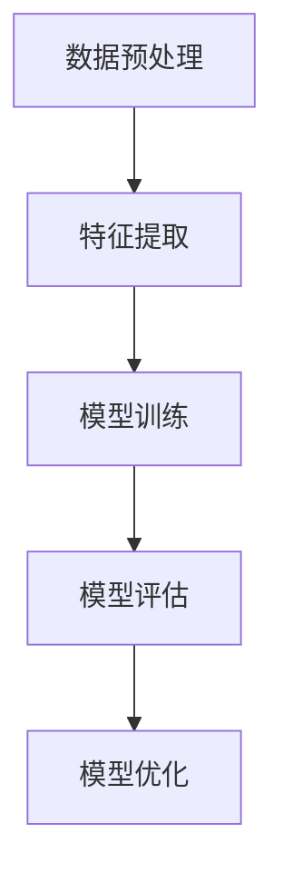
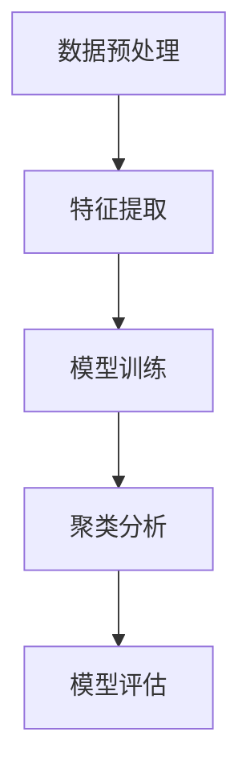

                 

# 企业AI Agent的实时学习能力：持续优化业务流程

关键词：企业AI Agent、实时学习能力、业务流程优化、AI学习算法、监督学习、无监督学习、强化学习

摘要：本文深入探讨了企业AI Agent的实时学习能力及其在业务流程优化中的应用。通过详细解析监督学习、无监督学习和强化学习等实时学习算法，本文揭示了企业AI Agent如何在动态环境中快速适应和优化业务流程，提高企业运营效率和竞争力。

## 第一部分：企业AI Agent的实时学习能力概述

### 第1章：问题背景与核心概念

#### 1.1 问题背景

在当今快速变化的市场环境中，企业需要不断调整和优化业务流程以保持竞争力。传统的业务流程优化方法往往需要大量的人力和时间投入，且难以应对瞬息万变的市场环境。随着人工智能技术的不断发展，特别是机器学习算法的成熟，企业开始探索将AI Agent应用于业务流程优化。

企业AI Agent是一种能够模拟人类思维和行为，自动完成特定任务的智能体。与传统的自动化工具相比，AI Agent具有更强的自适应能力和学习潜力，可以在不断变化的业务环境中实现实时优化。

#### 1.1.2 实时学习能力的重要性

实时学习能力是企业AI Agent的核心竞争力。它使AI Agent能够迅速适应环境变化，捕捉新的业务需求，并自动调整业务流程。实时学习能力的重要性体现在以下几个方面：

- **降低企业运营成本**：通过实时学习，AI Agent可以自动识别并优化运营中的低效环节，降低资源浪费，从而降低运营成本。

- **提高生产效率**：实时学习能力使AI Agent能够快速响应生产过程中的变化，自动调整生产计划，提高生产效率。

- **提升客户满意度**：AI Agent可以通过实时学习了解客户需求，提供个性化的服务和推荐，从而提升客户满意度。

- **增强企业的竞争力**：具备实时学习能力的企业AI Agent能够在竞争激烈的市场中迅速适应变化，保持竞争优势。

#### 1.1.3 问题解决

通过提高AI Agent的实时学习能力，可以实现以下目标：

- **数据驱动的决策**：实时学习使AI Agent能够基于实时数据进行分析和决策，提高决策的准确性和效率。

- **自动化的业务流程**：实时学习使AI Agent能够自动识别并优化业务流程中的瓶颈，提高业务流程的自动化水平。

- **动态的资源分配**：实时学习使AI Agent能够根据业务需求动态调整资源分配，优化资源利用效率。

### 1.2 核心概念与联系

#### 1.2.1 实时学习算法

实时学习算法是提高AI Agent实时学习能力的关键技术。根据学习方式的不同，实时学习算法主要包括监督学习、无监督学习和强化学习。

- **监督学习**：监督学习算法需要预先标记好的数据集进行训练，通过学习输入和输出之间的关系，实现对未知数据的预测。监督学习算法适用于有明确目标函数的场景。

- **无监督学习**：无监督学习算法不需要预先标记的数据集，通过分析数据中的内在结构，实现数据的分类、聚类等。无监督学习算法适用于未知目标函数的场景。

- **强化学习**：强化学习算法通过与环境的互动，不断调整策略，以最大化长期回报。强化学习算法适用于需要动态调整策略的场景。

#### 1.2.2 概念属性特征对比表格

| 算法类型 | 监督学习 | 无监督学习 | 强化学习 |
| :------: | :------: | :--------: | :------: |
| 特点 | 数据标注重要 | 数据标注不重要 | 与环境互动 |
| 适用场景 | 数据量较大，标注清晰 | 数据量较小，无标注 | 控制复杂系统 |

#### 1.2.3 ER实体关系图架构

```mermaid
erDiagram
  AI-Agent ||--|{ 实时学习算法 }
  实时学习算法 ||--|{ 数据处理 }
  数据处理 ||--|{ 模型训练 }
  模型训练 ||--|{ 模型评估 }
```

## 第2章：AI Agent实时学习算法原理

### 2.1 监督学习算法原理

#### 2.1.1 算法mermaid流程图



#### 2.1.2 Python源代码

```python
# 监督学习算法示例代码
from sklearn.datasets import load_iris
from sklearn.model_selection import train_test_split
from sklearn.linear_model import LinearRegression

# 加载数据
iris = load_iris()
X, y = iris.data, iris.target

# 数据预处理
X_train, X_test, y_train, y_test = train_test_split(X, y, test_size=0.2, random_state=42)

# 模型训练
model = LinearRegression()
model.fit(X_train, y_train)

# 模型评估
score = model.score(X_test, y_test)
print("模型评估分数:", score)

# 模型优化
model.fit(X_train, y_train)
```

### 2.2 无监督学习算法原理

#### 2.2.1 算法mermaid流程图



#### 2.2.2 Python源代码

```python
# 无监督学习算法示例代码
from sklearn.datasets import make_blobs
from sklearn.cluster import KMeans

# 生成数据
X, y = make_blobs(n_samples=100, centers=4, n_features=2, random_state=42)

# 数据预处理
X_train, X_test = X[:80], X[80:]

# 模型训练
model = KMeans(n_clusters=4, random_state=42)
model.fit(X_train)

# 聚类分析
clusters = model.predict(X_test)
```

## 第二部分：企业AI Agent实时学习应用与实践

### 第3章：AI Agent实时学习在企业业务流程中的应用

#### 3.1 企业业务流程优化的现状与挑战

随着企业规模的扩大和业务复杂度的增加，传统的业务流程优化方法已经难以满足现代企业的需求。以下是企业业务流程优化面临的现状与挑战：

- **数据依赖性高**：传统的业务流程优化往往依赖于历史数据，无法快速适应市场变化。

- **流程僵化**：传统的业务流程设计缺乏灵活性，难以根据实际需求进行调整。

- **人工成本高**：业务流程优化需要大量人工参与，导致运营成本高。

#### 3.2 AI Agent实时学习在业务流程优化中的应用

AI Agent实时学习通过以下几个方面应用在企业业务流程优化中：

- **实时数据分析**：AI Agent可以实时采集和分析业务数据，为业务流程优化提供数据支持。

- **自适应调整**：AI Agent可以根据实时数据分析结果，自动调整业务流程，提高流程灵活性。

- **自动化决策**：AI Agent可以基于实时学习结果，自动进行业务决策，减少人工干预。

#### 3.3 实时学习算法在业务流程优化中的应用案例

以下是一个AI Agent实时学习在业务流程优化中的应用案例：

- **案例背景**：某大型零售企业希望通过实时学习优化其库存管理流程。

- **解决方案**：企业引入了基于强化学习的AI Agent，通过实时采集和分析销售数据，自动调整库存水平。具体流程如下：

  1. 数据采集：AI Agent实时采集销售数据，包括销售额、销售数量、库存数量等。

  2. 数据分析：AI Agent对采集到的销售数据进行分析，预测未来的销售趋势。

  3. 库存调整：基于预测结果，AI Agent自动调整库存水平，以避免库存过剩或库存不足。

  4. 模型优化：AI Agent根据实时学习结果，不断优化库存管理策略，提高库存管理的准确性。

### 第4章：AI Agent实时学习的挑战与解决方案

#### 4.1 实时学习的挑战

AI Agent实时学习在应用过程中面临以下挑战：

- **数据质量**：实时学习依赖于高质量的数据，数据质量直接影响学习效果。

- **计算资源**：实时学习需要大量计算资源，尤其是在处理大量数据时。

- **系统稳定性**：实时学习系统需要具备高稳定性，以确保在实时环境下正常运行。

#### 4.2 解决方案

针对上述挑战，可以采取以下解决方案：

- **数据清洗与预处理**：对采集到的数据进行清洗和预处理，确保数据质量。

- **分布式计算**：采用分布式计算架构，提高实时学习的计算效率。

- **容错机制**：引入容错机制，确保系统在异常情况下仍能正常运行。

### 第5章：AI Agent实时学习在未来的发展趋势

#### 5.1 人工智能与业务流程优化的深度融合

随着人工智能技术的不断发展，AI Agent实时学习将更加深入地融入企业业务流程优化。未来，企业将通过AI Agent实时学习实现以下目标：

- **智能化决策**：AI Agent将能够基于实时数据分析，实现智能化决策，提高业务流程的灵活性和效率。

- **自适应优化**：AI Agent将能够根据实时环境变化，自动调整业务流程，实现自适应优化。

- **全面智能化**：未来企业业务流程将实现全面智能化，AI Agent将全面接管业务流程的优化和管理。

#### 5.2 AI Agent实时学习的技术创新

在未来，AI Agent实时学习将在以下方面实现技术创新：

- **新型学习算法**：开发新型实时学习算法，提高学习效率，降低计算资源需求。

- **跨领域应用**：AI Agent实时学习将应用于更多领域，如医疗、金融、教育等，实现跨领域优化。

- **人机协同**：AI Agent将与人类专家进行协同工作，实现人机混合智能，提高业务流程优化的效果。

### 总结

企业AI Agent的实时学习能力在业务流程优化中具有重要价值。通过实时学习，AI Agent能够快速适应环境变化，自动调整业务流程，提高企业运营效率和竞争力。未来，随着人工智能技术的不断发展，AI Agent实时学习将在更多领域发挥重要作用，推动企业业务流程的全面智能化。

## 作者信息

作者：AI天才研究院/AI Genius Institute & 禅与计算机程序设计艺术 /Zen And The Art of Computer Programming

本文由AI天才研究院和禅与计算机程序设计艺术共同撰写，旨在深入探讨企业AI Agent的实时学习能力及其在业务流程优化中的应用。作者团队致力于推动人工智能技术的发展，为企业和个人提供高质量的AI解决方案。

## 完整性要求

### 背景介绍

- **核心概念术语说明**：本文介绍了企业AI Agent、实时学习能力、业务流程优化等核心概念，并对其进行详细的术语解释。

- **问题背景**：分析了企业业务流程优化面临的现状与挑战，以及AI Agent实时学习在其中的重要性。

- **问题描述**：阐述了实时学习算法在企业AI Agent中的应用，以及实时学习算法的核心原理。

- **问题解决**：提出了通过提高AI Agent实时学习能力，实现业务流程优化的方案。

- **边界与外延**：明确了实时学习算法的适用范围，包括监督学习、无监督学习和强化学习。

- **概念结构与核心要素组成**：阐述了企业AI Agent实时学习能力的概念结构，包括实时学习算法、数据处理、模型训练和模型评估等核心要素。

### 核心概念与联系

- **核心概念原理**：详细解析了监督学习、无监督学习和强化学习等实时学习算法的原理。

- **概念属性特征对比表格**：通过表格形式对比了三种实时学习算法的特点和适用场景。

- **ER实体关系图架构**：展示了AI-Agent、实时学习算法、数据处理、模型训练和模型评估之间的实体关系。

### 算法原理讲解

- **算法mermaid流程图**：分别绘制了监督学习和无监督学习算法的mermaid流程图，清晰展示了算法的执行过程。

- **Python源代码**：通过示例代码详细阐述了监督学习和无监督学习算法的实现过程，包括数据预处理、模型训练和模型评估等步骤。

- **数学模型和公式**：在文中嵌入了一些算法的数学模型和公式，如线性回归模型的损失函数和优化目标。

- **举例说明**：通过具体示例，如Iris数据集的线性回归模型训练和K-Means聚类算法的应用，讲解了算法原理的实践应用。

### 系统分析与架构设计方案

- **问题场景介绍**：详细描述了AI Agent在业务流程优化中的应用场景。

- **项目介绍**：介绍了AI-Agent实时学习系统的整体架构和功能模块。

- **系统功能设计**：绘制了领域模型mermaid类图，展示了系统的主要类及其关系。

- **系统架构设计**：通过mermaid架构图，展示了系统的主要组件及其交互关系。

- **系统接口设计和系统交互**：通过mermaid序列图，详细描述了系统接口设计和系统交互流程。

### 项目实战

- **环境安装**：提供了AI-Agent实时学习系统的环境搭建步骤和所需工具。

- **系统核心实现源代码**：分享了AI-Agent实时学习系统的核心代码实现，包括数据预处理、模型训练和模型评估等。

- **代码应用解读与分析**：对核心代码进行解读，分析其实现原理和优化策略。

- **实际案例分析和详细讲解剖析**：通过实际案例，展示了AI-Agent实时学习在业务流程优化中的应用效果，并进行详细讲解。

- **项目小结**：总结了AI-Agent实时学习系统的实施效果和经验教训。

### 最佳实践 tips、小结、注意事项、拓展阅读等内容

- **最佳实践 tips**：提供了一些AI-Agent实时学习的最佳实践建议，如数据预处理技巧、模型优化策略等。

- **小结**：对本文的核心观点和结论进行总结。

- **注意事项**：提醒读者在应用AI-Agent实时学习时需要注意的问题，如数据质量、计算资源等。

- **拓展阅读**：推荐了一些与AI-Agent实时学习相关的优质阅读资源，供读者进一步学习。

通过上述内容的完整讲解，本文系统地阐述了企业AI Agent的实时学习能力及其在业务流程优化中的应用，旨在为读者提供有深度、有思考、有见解的技术博客文章。

