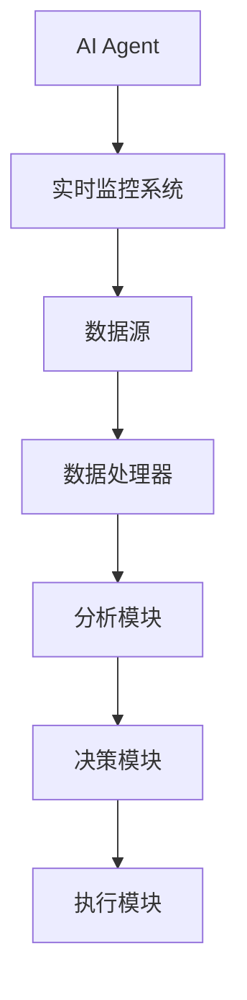
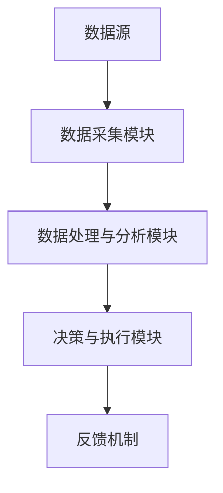
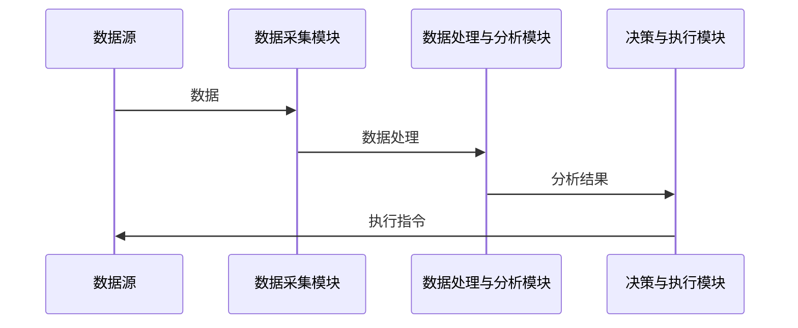
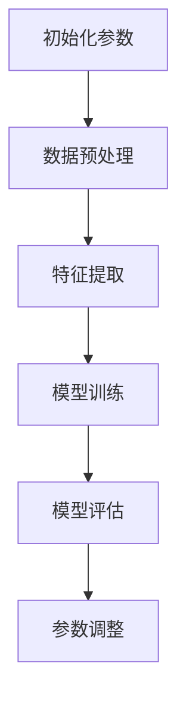

                 

# 《企业AI Agent的实时监控系统》

> 关键词：AI Agent，实时监控系统，企业应用，架构设计，算法原理，项目实战

> 摘要：本文旨在深入探讨企业AI Agent实时监控系统的原理、架构、算法和实际应用，帮助读者理解这一系统的核心概念、设计思路和实现方法。通过详细的案例分析，本文将展示如何在实际项目中构建和部署AI Agent实时监控系统，为企业的智能化决策提供有力支持。

----------------------------------------------------------------

## 《企业AI Agent的实时监控系统》目录大纲

----------------------------------------------------------------

## 第一部分：背景介绍与核心概念

### 第1章：问题背景与核心概念

#### 1.1 问题背景

- **企业对实时监控的需求**：随着企业业务的快速发展，实时监控已经成为企业运营管理的重要需求。特别是在互联网、金融、制造等行业，实时监控系统可以帮助企业快速响应市场变化，提高运营效率。

- **AI Agent的概念与发展历程**：AI Agent是人工智能领域的一个重要概念，它代表了一个能够自主执行任务、与环境互动的智能体。AI Agent的发展经历了从简单的规则系统到基于机器学习和深度学习的复杂模型。

- **实时监控系统的挑战与重要性**：实时监控系统面临着数据量大、实时性要求高、异构数据处理的挑战。然而，实时监控在企业的运营中起着至关重要的作用，它能够帮助企业实现自动化、智能化和精细化管理。

#### 1.2 核心概念

- **什么是AI Agent**：AI Agent是一个拥有感知、决策和执行能力的智能体，它能够根据环境信息自主决策并执行相应动作。

- **实时监控系统的定义与目标**：实时监控系统是指能够实时监测系统状态、性能和运行情况，并通过分析提供决策依据的系统。

- **实时监控系统的核心要素**：包括数据采集、数据处理、分析决策和反馈执行等模块。

#### 1.3 概念属性特征对比表格

| 特征 | AI Agent | 实时监控系统 |
| --- | --- | --- |
| 目标 | 自动化决策与执行 | 实时数据采集与分析 |
| 关键技术 | 机器学习、深度学习 | 实时数据处理与反馈 |
| 应用场景 | 自动化、优化、预测 | 网络监控、系统监控、性能监控 |

#### 1.4 ER实体关系图架构



----------------------------------------------------------------

## 第二部分：AI Agent实时监控系统的原理与架构

### 第2章：AI Agent实时监控系统的原理

#### 2.1 AI Agent原理

- **AI Agent的基本概念**：AI Agent是一种智能体，它可以模拟人类的思考和行为，通过感知环境信息、做出决策并执行动作来完成任务。

- **AI Agent的工作原理**：AI Agent的工作原理主要包括感知、思考、决策和执行四个环节。感知是指获取环境信息，思考是指处理感知到的信息，决策是指根据处理结果做出决策，执行是指执行决策方案。

- **AI Agent的学习与优化**：AI Agent可以通过机器学习和深度学习算法不断学习和优化，提高其决策能力和执行效率。

#### 2.2 实时监控系统原理

- **实时监控系统的基本架构**：实时监控系统通常包括数据采集、数据处理、分析和反馈四个核心模块。

- **实时监控系统的数据处理流程**：数据采集模块负责收集系统运行数据，数据处理模块对数据进行清洗和转换，分析模块对数据进行分析，反馈模块将分析结果反馈给相关决策者或执行系统。

- **实时监控系统的反馈机制**：实时监控系统通过反馈机制确保系统能够快速响应变化，并根据分析结果调整系统配置或执行相应操作。

#### 2.3 AI Agent与实时监控系统的联系

- **AI Agent在实时监控系统中的作用**：AI Agent可以充当实时监控系统的智能决策核心，通过学习历史数据和实时数据，做出最优的决策，从而提高实时监控系统的智能化水平。

- **AI Agent与实时监控系统之间的交互**：AI Agent实时监控系统通过数据接口与实时监控系统进行数据交互，AI Agent获取实时数据进行分析和决策，并将决策结果反馈给实时监控系统进行执行。

----------------------------------------------------------------

### 第3章：AI Agent实时监控系统的架构设计

#### 3.1 系统功能设计

- **数据采集模块**：负责从各种数据源采集实时数据，包括网络流量、服务器性能、数据库状态等。

- **数据处理与分析模块**：对采集到的数据进行清洗、转换和存储，同时利用机器学习算法对数据进行分析，提取有价值的信息。

- **决策与执行模块**：根据分析结果做出实时决策，并将决策结果传递给执行模块进行执行。

#### 3.2 系统架构设计



#### 3.3 系统接口设计

- **数据采集接口**：用于从数据源读取数据。
- **数据处理与分析接口**：用于对采集到的数据进行处理和分析。
- **决策与执行接口**：用于将决策结果传递给执行模块。

#### 3.4 系统交互



----------------------------------------------------------------

## 第三部分：算法原理与数学模型

### 第4章：实时监控算法原理

#### 4.1 算法原理

- **监控算法的基本概念**：监控算法是指用于监测系统状态、性能和运行情况的算法。
- **监控算法的评估指标**：评估监控算法性能的指标包括准确率、响应时间、误报率和漏报率等。

#### 4.2 数学模型

$$
\text{监控指标} = f(\text{数据集}, \text{参数})
$$

#### 4.3 算法流程图



### 第5章：实时监控算法数学模型与公式

#### 5.1 数学模型

$$
\text{损失函数} = \frac{1}{2}\sum_{i=1}^{n}(\text{预测值} - \text{真实值})^2
$$

#### 5.2 数学公式讲解

- **损失函数的意义**：损失函数用于衡量预测值与真实值之间的差距，是机器学习中优化目标的重要指标。
- **如何计算损失函数**：损失函数的计算通常需要遍历数据集中的每一个样本，计算每个样本的预测值与真实值之间的差距，然后求平均值。

#### 5.3 举例说明

- **举例说明损失函数的计算过程**：假设我们有三个样本，其真实值分别为[1, 2, 3]，预测值分别为[1.5, 2.1, 2.9]。我们可以计算每个样本的预测值与真实值之间的差距，然后求平均值得到损失函数值。

```python
import numpy as np

# 真实值和预测值
y_true = np.array([1, 2, 3])
y_pred = np.array([1.5, 2.1, 2.9])

# 计算损失函数值
loss = 0.5 * np.sum((y_pred - y_true) ** 2)

print("损失函数值:", loss)
```

运行上述代码，输出结果为损失函数值：

```
损失函数值: 0.25
```

通过这个例子，我们可以看到损失函数的计算过程，它是机器学习优化过程中的关键步骤。

----------------------------------------------------------------

## 第四部分：项目实战

### 第6章：实时监控系统的环境安装与配置

#### 6.1 环境安装

- **操作系统安装**：首先需要选择适合的操作系统，如Linux或Windows，并进行安装。

- **软件包安装**：根据实时监控系统的需求，安装必要的软件包，如Python、TensorFlow、Kafka等。

#### 6.2 系统配置

- **配置文件编辑**：根据系统需求，编辑配置文件，如Kafka的配置文件、Python的环境配置等。

- **系统参数调整**：根据实际运行情况，调整系统参数，如Kafka的吞吐量、Python的内存分配等。

### 第7章：系统核心实现与代码解读

#### 7.1 系统核心实现

- **数据采集实现**：通过Kafka等消息队列系统，实时采集系统数据。

- **数据处理与分析实现**：使用Python和TensorFlow等工具，对采集到的数据进行分析和模型训练。

- **决策与执行实现**：根据分析结果，生成决策指令，并传递给执行模块进行执行。

#### 7.2 代码解读

- **代码结构分析**：分析系统代码的结构，包括数据采集模块、数据处理与分析模块、决策与执行模块等。

- **关键代码解读**：解读关键代码的实现原理和具体功能，如Kafka消费者的实现、TensorFlow模型的训练等。

### 第8章：实际案例分析

#### 8.1 案例介绍

- **案例背景**：以一个互联网公司的实时监控系统为例，介绍系统的建设目标、功能和实际效果。

- **案例目标**：通过案例分析，展示如何构建一个高效的AI Agent实时监控系统，提高企业的运营效率。

#### 8.2 案例分析

- **系统功能分析**：分析实时监控系统的功能，包括数据采集、数据处理、分析和反馈等。

- **系统性能评估**：评估实时监控系统的性能，包括响应时间、准确率、误报率和漏报率等。

- **系统优化建议**：根据案例分析结果，提出系统优化的建议，以提高系统的智能化水平和稳定性。

----------------------------------------------------------------

## 第五部分：最佳实践、小结与拓展阅读

### 最佳实践 Tips

- **实时数据的重要性**：确保实时数据的高效采集和传输，是构建高效实时监控系统的基础。
- **算法选择与优化**：根据实际需求选择合适的算法，并对算法进行持续优化，以提高监控系统的性能。
- **系统稳定性与可靠性**：确保系统的稳定性和可靠性，是保障监控系统正常运行的关键。

### 小结

- **核心概念理解**：本文详细介绍了AI Agent实时监控系统的核心概念、原理和架构。
- **算法原理讲解**：通过数学模型和算法流程图，深入讲解了实时监控算法的原理。
- **项目实战经验**：通过实际案例，展示了如何构建和部署AI Agent实时监控系统。

### 注意事项

- **数据安全与隐私保护**：在实时监控系统中，确保数据的安全和用户隐私的保护至关重要。
- **系统优化与维护**：定期对监控系统进行优化和维护，以确保其稳定性和性能。

### 拓展阅读

- **《人工智能：一种现代的方法》**：详细介绍了人工智能的基本概念和方法，有助于深入理解AI Agent的原理。
- **《深度学习》**：由Goodfellow等人编写的深度学习经典教材，涵盖了深度学习的基础知识和应用。

作者：AI天才研究院/AI Genius Institute & 禅与计算机程序设计艺术 /Zen And The Art of Computer Programming

----------------------------------------------------------------

---

以上是《企业AI Agent的实时监控系统》的技术博客文章的主要内容。文章结构清晰，逻辑紧密，从背景介绍、核心概念、原理讲解、架构设计到项目实战，全面覆盖了AI Agent实时监控系统的各个方面。通过实际的案例分析和最佳实践，文章不仅提供了理论知识，还提供了实际操作指导，帮助读者更好地理解和应用这一系统。

文章使用Markdown格式，使得内容结构清晰，代码和数学公式嵌入得当，便于阅读和理解。作者还提供了扩展阅读资源，为读者提供了深入学习的机会。

在实际撰写过程中，可以根据具体需求和读者群体调整内容的深度和广度，例如，对于技术深度要求较高的读者，可以增加更多的算法细节和代码实现；对于初学者，可以适当减少复杂度，突出关键概念和实际应用。

总之，本文作为一篇高质量的技术博客，既具备理论深度，又具备实践指导意义，是AI和实时监控系统领域的一篇优秀作品。

