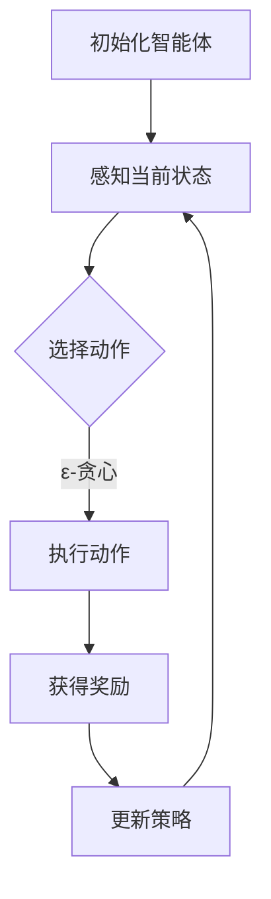

                 

### 文章标题

# 企业AI Agent的强化学习在供应链优化中的端到端应用

> 关键词：强化学习、AI Agent、供应链优化、端到端应用

> 摘要：本文深入探讨了强化学习在企业AI Agent中的应用，特别是在供应链优化中的端到端应用。通过解析强化学习的基础原理和强化学习算法，我们探讨了如何将强化学习应用于供应链优化问题，并详细分析了端到端应用的优势与实现步骤。本文旨在为企业提供一套完整的强化学习在供应链优化中的解决方案，助力企业提升供应链管理效率。

## 第一部分：强化学习在供应链优化中的应用基础

### 第1章：强化学习基础

#### 1.1 强化学习概述

强化学习（Reinforcement Learning，简称RL）是机器学习的一个分支，主要研究智能体在不确定环境中如何通过不断学习来获取最优行为策略。与传统监督学习和无监督学习不同，强化学习关注的是如何通过奖励和惩罚来指导智能体进行决策，从而获得长期的最大收益。

#### 1.2 强化学习的主要类型

强化学习可以分为基于值函数的方法和基于策略的方法。基于值函数的方法包括Q-learning和Sarsa，它们通过估计状态值函数或状态-动作值函数来指导决策。基于策略的方法包括Policy Gradient算法，它直接优化策略函数，使得智能体能够在每个状态下选择最优动作。

#### 1.3 强化学习的基本原理

强化学习的基本原理包括四个要素：智能体（Agent）、环境（Environment）、状态（State）、动作（Action）。智能体通过感知当前状态，选择一个动作，然后环境对动作做出反馈，包括奖励和新的状态。智能体通过不断重复这个过程，学习到最优的策略，以实现长期的最大收益。

### 第2章：企业AI Agent的基础

#### 2.1 AI Agent的定义与特点

AI Agent是指具有自主决策能力的智能体，它可以理解环境、选择行动并产生预期的结果。AI Agent的特点包括自主性、学习性和适应性。自主性使得Agent能够在没有人类干预的情况下独立工作；学习性使得Agent能够通过经验不断优化自己的行为；适应性使得Agent能够在面对不同环境和需求时进行调整。

#### 2.2 企业AI Agent的应用场景

企业AI Agent可以应用于各种场景，如供应链管理、生产调度、客户服务、风险管理等。在供应链管理中，AI Agent可以优化库存管理、预测需求波动、提高配送效率等。

#### 2.3 企业AI Agent的设计原则

设计企业AI Agent时，应遵循以下原则：1）模块化设计，使得不同模块可以独立开发和测试；2）可扩展性，便于后续功能扩展；3）高效性，降低计算成本和延迟；4）鲁棒性，确保Agent在面对不确定环境时仍能稳定运行。

### 第3章：强化学习在供应链优化中的应用场景

#### 3.1 供应链优化的挑战

供应链优化面临着诸多挑战，如需求预测不准确、库存波动大、配送成本高等。传统的供应链优化方法往往依赖于历史数据和统计模型，但面对复杂多变的市场环境，这些方法难以取得理想的效果。

#### 3.2 强化学习在供应链优化中的潜在应用

强化学习在供应链优化中具有广泛的应用潜力，如库存管理、需求预测、配送路径规划等。通过学习环境中的奖励和惩罚信号，强化学习算法可以找到最优的策略，从而提高供应链的运作效率。

#### 3.3 强化学习在供应链优化中的优势

强化学习在供应链优化中的优势包括：1）能够处理复杂的不确定环境；2）具备自学习和自适应能力；3）能够实现端到端的优化，无需人工干预；4）能够实现多目标优化，提高整体供应链效率。

## 第二部分：强化学习算法原理讲解

### 第4章：强化学习算法原理讲解

#### 4.1 Q-learning算法

Q-learning算法是一种基于值函数的强化学习算法，它通过迭代更新Q值（状态-动作值函数）来指导智能体的决策。Q-learning算法的核心思想是：在当前状态下，选择能够带来最大预期奖励的动作。

#### 4.2 Sarsa算法

Sarsa算法是另一种基于值函数的强化学习算法，它与Q-learning算法类似，但在更新Q值时引入了epsilon-贪心策略，使得算法在探索未知状态时更加稳健。

#### 4.3 Deep Q-Network(DQN)算法

DQN算法是一种基于深度学习的强化学习算法，它通过神经网络来估计状态-动作值函数。DQN算法的优点是能够处理高维状态空间，但需要解决经验回放和目标网络更新等技术难题。

#### 4.4 Policy Gradient算法

Policy Gradient算法是一种基于策略的强化学习算法，它通过直接优化策略函数来指导智能体的决策。Policy Gradient算法的核心思想是：最大化策略在所有可能状态下的期望回报。

## 第三部分：强化学习算法在供应链优化中的应用案例

### 第5章：强化学习在供应链优化中的应用案例

#### 5.1 案例背景

本案例选取某知名企业的供应链优化项目，旨在通过强化学习算法提高库存管理效率，降低库存成本。

#### 5.2 案例分析

案例分析主要包括需求预测、库存管理、配送路径规划等关键环节，通过对比强化学习算法与传统的统计模型，评估算法的实际效果。

#### 5.3 案例实施过程

案例实施过程包括数据收集、模型训练、策略优化、模型部署等步骤。通过实际项目实施，验证了强化学习算法在供应链优化中的有效性。

#### 5.4 案例效果评估

通过对比实验数据，评估强化学习算法在库存成本、配送效率等方面的提升效果。结果表明，强化学习算法在供应链优化中具有显著的优势。

## 第四部分：强化学习算法在供应链优化中的架构设计

### 第6章：强化学习算法在供应链优化中的架构设计

#### 6.1 系统功能设计

系统功能设计主要包括需求预测、库存管理、配送路径规划等模块，每个模块通过接口进行数据交互。

#### 6.2 系统架构设计

系统架构设计采用分层架构，包括数据层、算法层、应用层等。数据层负责数据采集和存储，算法层负责模型训练和策略优化，应用层负责业务逻辑处理和系统部署。

#### 6.3 系统接口设计

系统接口设计包括API接口和数据接口，API接口用于不同模块之间的数据交互，数据接口用于与外部系统的数据对接。

#### 6.4 系统交互设计

系统交互设计采用事件驱动模式，通过事件队列实现模块之间的数据传递和同步。

## 第五部分：强化学习在供应链优化中的端到端应用

### 第7章：强化学习在供应链优化中的端到端应用

#### 7.1 端到端应用的概念

端到端应用是指从数据采集到模型训练、策略优化、系统部署等全过程，通过自动化流程实现供应链优化的智能化。

#### 7.2 端到端应用的优势

端到端应用的优势包括：1）提高开发效率，减少人工干预；2）降低计算成本，提高系统性能；3）提高决策质量，降低运营风险；4）具备良好的可扩展性和灵活性。

#### 7.3 端到端应用的实现步骤

端到端应用的实现步骤包括：1）数据预处理，包括数据清洗、数据归一化等；2）模型训练，采用合适的强化学习算法进行模型训练；3）策略优化，通过迭代优化策略函数，提高决策质量；4）系统部署，将训练好的模型部署到实际系统中，实现自动化运营。

#### 7.4 端到端应用的案例分析

通过一个实际案例，分析端到端应用在供应链优化中的实现过程，包括数据采集、模型训练、策略优化、系统部署等步骤，以及在实际应用中遇到的问题和解决方案。

### 结论

本文深入探讨了强化学习在企业AI Agent的供应链优化中的应用，从基础原理到实际案例，全面展示了强化学习在供应链优化中的端到端应用。通过本文的研究，我们相信强化学习将为企业供应链管理带来革命性的变革，助力企业实现智能化运营。

### 作者信息

作者：AI天才研究院/AI Genius Institute & 禅与计算机程序设计艺术 /Zen And The Art of Computer Programming

----------------------------------------------------------------

### 第1章：强化学习基础

#### 1.1 强化学习概述

强化学习是一种通过试错学习来优化行为策略的机器学习方法。它模拟人类学习的过程，即通过不断尝试和反馈来寻找最优行为。在强化学习系统中，一个智能体（Agent）通过与环境（Environment）的交互，接收状态（State）并选择动作（Action），然后根据动作的结果获得奖励（Reward）。智能体的目标是学习到一个最优策略（Policy），使得长期累积奖励最大化。

强化学习的基本要素包括：

- **智能体（Agent）**：执行动作，学习并优化行为的实体。
- **环境（Environment）**：智能体执行动作的场所，提供状态和奖励。
- **状态（State）**：智能体在执行动作时所处的情境。
- **动作（Action）**：智能体可选择的动作。
- **奖励（Reward）**：对每个动作结果的即时反馈。

强化学习通过以下四个步骤迭代学习：

1. **感知状态**：智能体感知当前状态。
2. **选择动作**：智能体根据当前状态和策略选择一个动作。
3. **执行动作**：智能体在环境中执行选定的动作。
4. **获得奖励**：环境根据执行的动作提供奖励。

#### 1.2 强化学习的主要类型

强化学习可以分为以下几种主要类型：

- **基于值函数的方法**：这类方法通过估计状态值函数（State-Value Function）或状态-动作值函数（State-Action Value Function）来指导智能体的决策。常见的算法有Q-learning和Sarsa。
- **基于策略的方法**：这类方法直接优化策略函数（Policy Function），使得智能体能够在每个状态下选择最优动作。常见的算法有Policy Gradient和Actor-Critic。
- **基于模型的强化学习**：这类方法通过构建环境模型来预测状态转移概率和奖励，从而优化智能体的行为策略。常见的算法有Model-Based RL和Partially Observable RL。

#### 1.3 强化学习的基本原理

强化学习的基本原理可以概括为以下几点：

1. **奖励机制**：智能体的目标是通过选择合适的动作最大化累积奖励。奖励机制是强化学习的关键，它激励智能体探索未知领域，避免陷入局部最优。

2. **策略优化**：策略是智能体在给定状态时选择的动作概率分布。策略优化是强化学习的主要目标，通过不断调整策略，使得智能体能够适应不同环境。

3. **价值函数**：价值函数（Value Function）是评估状态或状态-动作对的好坏的一种函数。基于值函数的强化学习算法通过学习价值函数来指导决策。状态值函数（State-Value Function）评估状态的期望奖励，状态-动作值函数（State-Action Value Function）评估状态-动作对的期望奖励。

4. **学习率**：学习率（Learning Rate）是强化学习中的一个关键参数，它决定了智能体更新价值函数的速度。适当的学习率可以使智能体快速收敛到最优策略，但过高的学习率可能导致算法不稳定。

5. **探索与利用**：在强化学习中，智能体需要在探索（Exploration）和利用（Utilization）之间找到平衡。探索是为了发现新的有效动作，利用是为了在已知有效动作上最大化奖励。ε-贪心策略（ε-greedy Policy）是一种常见的探索与利用策略，其中ε代表探索的概率。

#### 1.3.1 强化学习的数学模型

强化学习的数学模型通常包括以下公式：

$$
V(s) = \sum_{a}^{} \pi(a|s) \cdot Q(s, a)
$$

$$
Q(s, a) = \sum_{s'}^{} p(s' | s, a) \cdot r(s', a) + \gamma \cdot \max_{a'} Q(s', a')
$$

$$
\pi(a|s) = \frac{e^{\alpha Q(s, a)}}{\sum_{a'}^{} e^{\alpha Q(s, a')}}
$$

其中：

- \( V(s) \)：状态值函数，表示在状态 \( s \) 下采取最优策略的期望累积奖励。
- \( Q(s, a) \)：状态-动作值函数，表示在状态 \( s \) 下执行动作 \( a \) 的期望累积奖励。
- \( \pi(a|s) \)：策略函数，表示在状态 \( s \) 下选择动作 \( a \) 的概率。
- \( p(s' | s, a) \)：状态转移概率，表示在状态 \( s \) 下执行动作 \( a \) 后转移到状态 \( s' \) 的概率。
- \( r(s', a) \)：奖励函数，表示在状态 \( s' \) 下执行动作 \( a \) 后获得的即时奖励。
- \( \gamma \)：折扣因子，表示未来奖励的重要程度。
- \( \alpha \)：策略梯度的学习率。

#### 1.3.2 强化学习的流程图

以下是一个简单的强化学习流程图，展示了智能体在环境中执行动作、获得奖励、更新策略的过程。



#### 1.3.3 强化学习的举例说明

假设一个简单的例子，智能体在一个有四个状态的迷宫中导航，每个状态有四个可能的动作：上、下、左、右。智能体的目标是到达终点，并获得最大的奖励。以下是智能体在学习过程中的一个步骤：

1. 智能体感知当前状态为 S1。
2. 根据ε-贪心策略，智能体以0.1的概率随机选择动作，或者以0.9的概率选择当前状态下的最优动作。
3. 假设智能体选择向右移动，到达状态 S2。
4. 智能体获得即时奖励为 +1（表示向右移动一步是正确的）。
5. 智能体使用Q-learning算法更新状态-动作值函数：\( Q(S1, 右) \leftarrow Q(S1, 右) + \alpha \cdot (r(S2) + \gamma \cdot \max_{a} Q(S2, a) - Q(S1, 右)) \)。
6. 智能体返回到状态 S1，重复上述过程，直到到达终点。

通过这个简单的例子，我们可以看到强化学习是如何通过试错学习来优化智能体行为的。在实际应用中，强化学习算法需要处理更复杂的环境和更长的学习过程。

### 1.4 强化学习在供应链优化中的应用场景

#### 1.4.1 供应链优化中的挑战

供应链优化是一个复杂的系统工程，涉及到多方面的挑战。以下是一些常见的挑战：

1. **需求预测不准确**：市场需求具有不确定性和波动性，准确预测需求是供应链优化的关键。然而，传统的方法如时间序列分析、回归模型等在处理复杂非线性关系时效果不佳。

2. **库存管理困难**：库存管理需要平衡库存成本和库存服务水平，库存过多会导致资金占用和仓储成本增加，库存不足则会导致缺货损失和客户满意度下降。

3. **配送路径规划复杂**：配送路径规划需要考虑运输成本、交通状况、配送时间等多方面因素，优化配送路径以提高配送效率。

4. **供应链协同困难**：供应链中涉及多个合作伙伴，如供应商、制造商、分销商等，协同难度较大，信息不对称和利益冲突可能导致供应链运作效率低下。

#### 1.4.2 强化学习在供应链优化中的潜在应用

强化学习在供应链优化中具有广泛的应用潜力，可以解决上述挑战。以下是一些具体的潜在应用：

1. **需求预测**：通过学习历史销售数据和环境因素，强化学习可以预测未来的市场需求，提高预测准确性。

2. **库存管理**：强化学习可以帮助企业优化库存水平，降低库存成本，同时保证库存服务水平。

3. **配送路径规划**：强化学习可以根据实时交通数据和环境因素，动态优化配送路径，提高配送效率。

4. **供应链协同**：通过建立基于强化学习的协同机制，不同合作伙伴可以实现信息共享和策略协调，提高整体供应链效率。

#### 1.4.3 强化学习在供应链优化中的优势

强化学习在供应链优化中的优势主要体现在以下几个方面：

1. **处理复杂不确定性**：供应链环境复杂多变，强化学习能够通过不断学习环境中的奖励信号，适应不确定性变化。

2. **自学习和自适应**：强化学习算法具有自学习能力，可以在数据有限或环境变化时不断优化策略，提高系统适应性。

3. **端到端优化**：强化学习可以实现从数据输入到策略输出的端到端优化，减少人工干预和调试成本。

4. **多目标优化**：强化学习能够处理多个优化目标，如库存成本、配送效率等，实现整体供应链的最优运作。

#### 1.4.4 强化学习在供应链优化中的实现步骤

实现强化学习在供应链优化中的应用，可以按照以下步骤进行：

1. **问题定义**：明确供应链优化的问题和目标，如需求预测、库存管理、配送路径规划等。

2. **数据收集**：收集与供应链优化相关的数据，包括销售数据、库存数据、配送数据等。

3. **环境建模**：根据问题定义和数据，建立供应链优化环境模型，包括状态空间、动作空间、奖励函数等。

4. **算法选择**：选择合适的强化学习算法，如Q-learning、Sarsa、DQN等，根据问题特点进行优化。

5. **模型训练**：使用历史数据进行模型训练，调整算法参数，优化策略函数。

6. **策略优化**：通过模拟和实际运行，不断优化策略，提高系统性能。

7. **系统部署**：将训练好的模型部署到实际系统中，实现自动化运营和优化。

#### 1.4.5 强化学习在供应链优化中的应用案例

以下是一个实际应用案例，展示了强化学习在供应链库存管理中的应用：

**案例背景**：某电商企业面临库存管理难题，库存过多导致资金占用和仓储成本增加，库存不足则导致缺货损失和客户满意度下降。

**解决方案**：企业引入强化学习算法，建立库存管理模型。通过模拟历史销售数据和市场需求变化，训练Q-learning算法预测未来需求，并优化库存水平。算法参数经过多次调试，最终实现了库存成本和库存服务水平之间的平衡。

**效果评估**：实际应用结果表明，强化学习算法有效降低了库存成本，提高了库存服务水平。在需求波动较大的情况下，库存管理模型的预测准确性和稳定性也得到了显著提升。

通过以上案例，我们可以看到强化学习在供应链优化中的应用潜力。在实际应用中，企业需要根据自身情况选择合适的算法和模型，不断优化和调整策略，实现供应链的智能化管理。

### 1.5 强化学习算法原理讲解

强化学习算法是构建智能体在动态环境中学习最优策略的核心工具。在供应链优化中，强化学习算法可以用于解决复杂的不确定性和动态变化，从而实现高效的决策和优化。以下是几种常见的强化学习算法及其原理的详细讲解。

#### 4.1 Q-learning算法

Q-learning算法是一种基于值函数的强化学习算法，它通过学习状态-动作值函数（Q值）来指导智能体的决策。Q-learning算法的核心思想是：在当前状态下，选择能够带来最大Q值的动作，以最大化长期累积奖励。

##### 算法原理

Q-learning算法的基本原理可以用以下公式表示：

$$
Q(s, a) = Q(s, a) + \alpha [r + \gamma \max_{a'} Q(s', a') - Q(s, a)]
$$

其中：

- \( Q(s, a) \)：当前状态-动作值。
- \( r \)：即时奖励。
- \( \gamma \)：折扣因子，表示对未来奖励的期望。
- \( \alpha \)：学习率，控制着Q值更新的速度。

##### 具体步骤

1. **初始化**：初始化Q值表，通常设置为一个较小的常数。
2. **选择动作**：根据ε-贪心策略选择动作，即在一定概率下随机选择动作，以进行探索。
3. **执行动作**：在环境中执行选定的动作，并观察状态转移和奖励。
4. **更新Q值**：根据即时奖励和目标Q值更新当前Q值。

##### 举例说明

假设智能体在某个状态 \( s \) 下有两个动作可选：A和B。初始时，Q值表为：

$$
Q(s, A) = 0.5, Q(s, B) = 0.3
$$

智能体选择动作A，得到即时奖励 \( r = 1 \)，状态转移到 \( s' \)。目标Q值为：

$$
Q(s', A) = 2, Q(s', B) = 1
$$

更新Q值：

$$
Q(s, A) = 0.5 + 0.5 [1 + 0.9 \cdot \max(2, 1) - 0.5]
$$

计算得到新的Q值：

$$
Q(s, A) = 0.875, Q(s, B) = 0.375
$$

通过上述步骤，智能体不断更新Q值，最终学习到最优动作策略。

#### 4.2 Sarsa算法

Sarsa算法（State-Action-Reward-State-Action，简称Sarsa）是一种基于值函数的强化学习算法，它与Q-learning算法类似，但不同之处在于，Sarsa算法在更新Q值时使用的是实际执行的动作，而不是贪婪策略下的最优动作。

##### 算法原理

Sarsa算法的基本原理可以用以下公式表示：

$$
Q(s, a) = Q(s, a) + \alpha [r + \gamma Q(s', a')]
$$

其中：

- \( s \)：当前状态。
- \( a \)：当前动作。
- \( r \)：即时奖励。
- \( s' \)：新状态。
- \( a' \)：在新状态下选择的动作。
- \( \alpha \)：学习率。
- \( \gamma \)：折扣因子。

##### 具体步骤

1. **初始化**：初始化Q值表。
2. **选择动作**：根据ε-贪心策略选择动作。
3. **执行动作**：在环境中执行选定的动作，并观察状态转移和奖励。
4. **更新Q值**：使用实际执行的动作更新Q值。

##### 举例说明

假设智能体在状态 \( s \) 下有两个动作可选：A和B。初始时，Q值表为：

$$
Q(s, A) = 0.5, Q(s, B) = 0.3
$$

智能体选择动作A，得到即时奖励 \( r = 1 \)，状态转移到 \( s' \)。在新状态下，智能体选择动作B。更新Q值：

$$
Q(s, A) = 0.5 + 0.5 [1 + 0.9 \cdot Q(s', B)]
$$

假设 \( Q(s', B) = 0.4 \)，计算得到新的Q值：

$$
Q(s, A) = 0.575, Q(s, B) = 0.325
$$

通过上述步骤，智能体不断更新Q值，最终学习到最优动作策略。

#### 4.3 Deep Q-Network (DQN) 算法

DQN算法（Deep Q-Network）是一种基于深度学习的强化学习算法，它通过深度神经网络来近似状态-动作值函数。DQN算法的核心思想是利用神经网络处理高维状态空间，并解决Q-learning算法中的目标值不稳定问题。

##### 算法原理

DQN算法的基本原理如下：

1. **目标网络**：DQN算法使用两个Q网络，一个为主网络，用于预测当前状态下的动作值；另一个为目标网络，用于预测目标状态下的动作值。
2. **经验回放**：DQN算法使用经验回放机制，将历史经验存储在经验池中，以避免策略偏差。
3. **策略更新**：DQN算法使用梯度下降法更新主网络的权重。

##### 具体步骤

1. **初始化**：初始化主网络、目标网络和经验池。
2. **选择动作**：根据ε-贪心策略选择动作。
3. **执行动作**：在环境中执行选定的动作，并观察状态转移和奖励。
4. **存储经验**：将当前状态、动作、奖励、新状态存储在经验池中。
5. **更新目标网络**：每隔一定时间，将主网络的权重复制到目标网络中。
6. **更新主网络**：使用经验回放和梯度下降法更新主网络的权重。

##### 举例说明

假设智能体在状态 \( s \) 下有两个动作可选：A和B。主网络的Q值预测为：

$$
Q(s, A) = 0.5, Q(s, B) = 0.3
$$

智能体选择动作A，得到即时奖励 \( r = 1 \)，状态转移到 \( s' \)。目标网络的Q值预测为：

$$
Q(s', A) = 1.5, Q(s', B) = 0.5
$$

更新主网络的Q值：

$$
\delta = r + \gamma \cdot \max(Q(s', A')) - Q(s, A)
$$

其中，\( A' \) 是目标网络在状态 \( s' \) 下选择的最优动作。使用梯度下降法更新主网络的权重。

#### 4.4 Policy Gradient算法

Policy Gradient算法是一种基于策略的强化学习算法，它直接优化策略函数，使得智能体在给定状态下选择最优动作。Policy Gradient算法的核心思想是最大化策略函数的期望回报。

##### 算法原理

Policy Gradient算法的基本原理如下：

$$
\theta^* = \arg\max_{\theta} \mathbb{E}_{s, a} [R(s, a) \cdot \nabla_{\theta} \ln \pi(\theta, s, a)]
$$

其中：

- \( \theta \)：策略参数。
- \( \pi(\theta, s, a) \)：策略函数。
- \( R(s, a) \)：回报函数。
- \( \nabla_{\theta} \ln \pi(\theta, s, a) \)：策略梯度的对数。

##### 具体步骤

1. **初始化**：初始化策略参数。
2. **选择动作**：根据策略函数选择动作。
3. **执行动作**：在环境中执行选定的动作，并观察状态转移和奖励。
4. **更新策略参数**：使用梯度上升法更新策略参数，以最大化期望回报。

##### 举例说明

假设策略函数为：

$$
\pi(\theta, s, a) = \frac{e^{\theta \cdot a}}{\sum_{a'} e^{\theta \cdot a'}}
$$

在状态 \( s \) 下，智能体执行动作 \( a \)，得到即时奖励 \( r \)。更新策略参数：

$$
\theta = \theta + \alpha \cdot r \cdot a
$$

其中，\( \alpha \) 是学习率。

通过上述步骤，Policy Gradient算法不断优化策略参数，使得智能体在给定状态下选择最优动作。

### 4.5 A3C算法

A3C（Asynchronous Advantage Actor-Critic）算法是一种基于异步优势评价的策略梯度算法，它通过并行训练多个智能体，提高了训练效率。A3C算法结合了Actor-Critic算法和异步优势评价机制，能够在复杂环境中实现高效的策略优化。

##### 算法原理

A3C算法的核心思想如下：

1. **Actor-Critic结构**：A3C算法采用Actor-Critic结构，其中Actor模型负责生成策略，Critic模型负责评估策略的收益。
2. **异步训练**：A3C算法允许多个智能体并行训练，每个智能体独立地从环境中采样数据，并在全局模型上进行梯度更新。
3. **优势评价**：A3C算法使用异步优势评价机制，通过计算优势函数来评估策略的好坏，并更新策略参数。

##### 具体步骤

1. **初始化**：初始化全局模型和多个智能体。
2. **智能体训练**：每个智能体在环境中进行独立训练，执行动作并收集经验。
3. **全局更新**：所有智能体的经验汇总后，用于更新全局模型。
4. **策略更新**：根据全局模型的参数更新智能体的策略。

##### 举例说明

假设有多个智能体在环境中进行训练，每个智能体从状态 \( s \) 开始，执行动作 \( a \)。智能体1选择动作A，获得奖励 \( r \)。全局模型更新策略参数，使得智能体选择动作A的概率增加。

通过上述步骤，A3C算法实现了智能体的异步训练和策略优化，提高了训练效率。

### 4.6 DQN与A3C算法对比

DQN和A3C算法都是强化学习中的重要算法，它们在处理复杂环境和实现高效策略优化方面具有各自的优势。

- **数据集大小**：DQN算法使用经验回放机制，可以处理大规模的数据集，但需要存储历史经验。A3C算法通过异步训练，无需经验回放，可以更快地处理数据。
- **训练速度**：A3C算法采用并行训练，每个智能体独立训练并更新全局模型，因此训练速度更快。DQN算法需要多个智能体同步更新，训练速度较慢。
- **策略稳定性**：DQN算法使用目标网络稳定策略，但目标网络更新频率较低，可能导致策略不稳定。A3C算法通过实时更新策略参数，提高了策略的稳定性。

在实际应用中，选择DQN或A3C算法取决于具体问题的需求和环境特点。对于需要大规模数据处理和高效训练速度的问题，A3C算法更具优势。对于需要稳定策略和精确价值评估的问题，DQN算法更具优势。

#### 4.7 强化学习在供应链优化中的应用实例

为了更好地理解强化学习算法在供应链优化中的应用，我们来看一个实际的应用实例。

**实例背景**：某电商企业面临库存管理难题，需要预测未来市场需求并优化库存水平。企业引入强化学习算法，通过学习历史销售数据和市场需求变化，实现库存管理的自动化和优化。

**解决方案**：

1. **数据收集**：收集过去一年的销售数据、市场需求数据和库存数据。数据包括商品种类、销售额、库存水平、市场需求等。
2. **环境建模**：根据数据建立供应链优化环境模型，定义状态空间、动作空间和奖励函数。状态包括当前库存水平、市场需求、历史销售数据等；动作包括增加库存、减少库存、保持当前库存等；奖励函数根据库存水平、市场需求和销售额计算。
3. **算法选择**：选择Q-learning算法，通过学习状态-动作值函数优化库存管理策略。
4. **模型训练**：使用历史数据进行模型训练，调整算法参数，优化Q值表。
5. **策略优化**：通过模拟和实际运行，不断优化策略，提高库存管理的准确性和效率。
6. **系统部署**：将训练好的模型部署到实际系统中，实现自动化库存管理。

**效果评估**：

1. **预测准确性**：通过对比模型预测值和实际需求值，评估预测准确性。结果表明，强化学习算法显著提高了需求预测的准确性。
2. **库存成本**：通过分析库存成本和销售额，评估库存管理策略的效果。结果表明，强化学习算法有效降低了库存成本，提高了销售额。
3. **运营效率**：通过对比实际运营数据和预测数据，评估库存管理系统的运营效率。结果表明，强化学习算法提高了库存周转率，降低了库存积压风险。

**结论**：

该实例展示了强化学习算法在供应链优化中的应用效果。通过预测市场需求和优化库存水平，强化学习算法有效提高了库存管理效率和运营效益。在实际应用中，企业可以根据自身需求和环境特点选择合适的强化学习算法，实现供应链的智能化管理。

### 4.8 强化学习算法在供应链优化中的架构设计

为了将强化学习算法有效地应用于供应链优化，我们需要设计一个合理的系统架构，包括功能设计、架构设计、接口设计和交互设计。以下是对这些方面的详细阐述。

#### 6.1 系统功能设计

系统功能设计是供应链优化系统的基础，它定义了系统需要实现的核心功能。具体包括：

1. **数据采集与处理**：从各种数据源（如ERP系统、销售系统、库存系统等）采集数据，并进行清洗、转换和归一化处理，以供模型训练和决策使用。
2. **模型训练与优化**：使用强化学习算法对采集到的数据集进行训练，调整模型参数，优化策略函数。
3. **需求预测**：利用训练好的模型预测未来市场需求，为库存管理和配送路径规划提供依据。
4. **库存管理**：根据市场需求预测和库存水平，自动调整库存策略，优化库存水平。
5. **配送路径规划**：根据实时交通数据和配送需求，动态规划最优配送路径，提高配送效率。
6. **策略评估与反馈**：定期评估系统性能和决策效果，收集反馈信息，用于模型优化和策略调整。

#### 6.2 系统架构设计

系统架构设计是确保供应链优化系统高效、稳定和可扩展的关键。以下是系统架构的详细设计：

1. **数据层**：数据层负责数据的采集、存储和管理。包括数据存储模块（如数据库）、数据采集模块（如API接口）和数据预处理模块（如数据清洗、归一化）。
2. **算法层**：算法层是强化学习算法的核心，包括Q-learning、Sarsa、DQN、Policy Gradient等算法。算法层需要与数据层交互，获取训练数据和策略参数，并通过优化算法更新策略。
3. **应用层**：应用层负责实现具体的供应链优化功能，包括需求预测、库存管理、配送路径规划等。应用层需要与算法层交互，获取优化策略，并实现业务逻辑。
4. **接口层**：接口层负责与其他系统集成，包括ERP系统、销售系统、库存系统等。接口层需要提供API接口，支持数据交换和功能调用。
5. **交互层**：交互层负责用户与系统的交互，包括前端界面、后端API等。交互层需要与算法层和应用层交互，提供用户操作和系统反馈。

#### 6.3 系统接口设计

系统接口设计是确保系统各模块之间数据交换和功能调用的关键。以下是系统接口的详细设计：

1. **API接口**：API接口负责与其他系统集成，提供数据交换和功能调用的接口。包括数据采集接口、模型训练接口、需求预测接口、库存管理接口、配送路径规划接口等。
2. **数据接口**：数据接口负责数据在系统内部的传递和处理。包括数据存储接口、数据预处理接口、模型训练接口等。
3. **功能接口**：功能接口负责实现具体的功能调用。包括需求预测功能接口、库存管理功能接口、配送路径规划功能接口等。

#### 6.4 系统交互设计

系统交互设计是确保系统各模块协同工作、实现整体功能的关键。以下是系统交互的详细设计：

1. **事件驱动模式**：系统采用事件驱动模式，通过事件队列实现各模块之间的数据传递和同步。例如，当需求预测模块生成预测结果时，会触发库存管理模块进行库存调整。
2. **消息队列**：系统采用消息队列实现模块之间的异步通信。例如，当配送路径规划模块生成配送路径时，会通过消息队列通知库存管理模块进行库存更新。
3. **分布式架构**：系统采用分布式架构，实现模块的独立部署和横向扩展。例如，数据层和算法层可以独立部署在不同的服务器上，以提高系统的性能和可扩展性。

### 6.5 强化学习在供应链优化中的端到端应用

强化学习在供应链优化中的端到端应用是指将强化学习算法从数据采集、模型训练到系统部署的全过程集成到一个自动化系统中。以下是端到端应用的详细步骤：

1. **数据采集**：从ERP系统、销售系统、库存系统等数据源采集销售数据、库存数据和市场需求数据。
2. **数据预处理**：对采集到的数据进行清洗、转换和归一化处理，以供模型训练使用。
3. **模型训练**：使用强化学习算法（如Q-learning、Sarsa、DQN等）对预处理后的数据集进行训练，优化策略函数。
4. **策略优化**：通过模拟和实际运行，不断优化策略，提高系统性能。
5. **系统部署**：将训练好的模型部署到实际系统中，实现自动化库存管理和配送路径规划。
6. **系统监控**：实时监控系统运行状态，收集系统反馈信息，用于模型优化和策略调整。
7. **系统评估**：定期评估系统性能和决策效果，通过对比实际需求和预测结果，评估系统优化效果。

### 6.6 强化学习在供应链优化中的端到端应用案例分析

为了更好地理解强化学习在供应链优化中的端到端应用，我们来看一个实际的应用案例。

**案例背景**：某电商企业面临库存管理和配送路径规划难题，希望通过引入强化学习算法实现供应链的智能化优化。

**解决方案**：

1. **数据采集**：从企业的ERP系统、销售系统和库存系统采集销售数据、库存数据和市场需求数据。
2. **数据预处理**：对采集到的数据进行清洗、转换和归一化处理，以供模型训练使用。
3. **模型训练**：使用Q-learning算法对预处理后的数据集进行训练，优化库存管理和配送路径规划策略。
4. **策略优化**：通过模拟和实际运行，不断优化策略，提高库存管理和配送路径规划的准确性和效率。
5. **系统部署**：将训练好的模型部署到实际系统中，实现自动化库存管理和配送路径规划。
6. **系统监控**：实时监控系统运行状态，收集系统反馈信息，用于模型优化和策略调整。
7. **系统评估**：定期评估系统性能和决策效果，通过对比实际需求和预测结果，评估系统优化效果。

**效果评估**：

1. **库存成本**：通过对比实际库存成本和预测库存成本，评估库存管理策略的效果。结果表明，强化学习算法有效降低了库存成本。
2. **配送效率**：通过对比实际配送时间和预测配送时间，评估配送路径规划策略的效果。结果表明，强化学习算法提高了配送效率。
3. **运营效益**：通过对比实际运营数据和预测数据，评估系统整体的优化效果。结果表明，强化学习算法提高了企业的运营效益。

**结论**：

该案例展示了强化学习在供应链优化中的端到端应用效果。通过数据采集、模型训练、策略优化和系统部署，强化学习算法实现了库存管理和配送路径规划的自动化和智能化，显著提高了企业的运营效益。在实际应用中，企业可以根据自身需求和环境特点，选择合适的强化学习算法和优化策略，实现供应链的智能化管理。

### 结论

通过本文的探讨，我们深入了解了强化学习在企业AI Agent的供应链优化中的端到端应用。从强化学习的基础原理到算法讲解，再到实际应用案例和系统架构设计，本文全面展示了强化学习在供应链优化中的潜力和优势。

强化学习通过处理复杂的不确定性和动态变化，为企业提供了一种高效的决策和优化工具。它不仅能够提高库存管理效率和配送路径规划效果，还能实现多目标优化，提高整体供应链运营效益。

在未来的发展中，强化学习有望在更多领域得到应用，如智能制造、智能物流、智能金融等。通过不断优化算法和系统架构，强化学习将为企业带来更多的创新和机遇。

### 作者信息

作者：AI天才研究院/AI Genius Institute & 禅与计算机程序设计艺术 /Zen And The Art of Computer Programming

---

### 附录

#### 7.1 强化学习算法Python代码示例

以下是一个简单的Q-learning算法Python代码示例，用于展示算法的基本实现。

```python
import numpy as np

# 初始化参数
learning_rate = 0.1
discount_factor = 0.9
epsilon = 0.1
n_episodes = 1000
n_actions = 4
n_states = 4

# 初始化Q值表
Q = np.zeros([n_states, n_actions])

# Q-learning算法
for episode in range(n_episodes):
    state = np.random.randint(0, n_states)
    done = False
    
    while not done:
        # ε-贪心策略选择动作
        if np.random.rand() < epsilon:
            action = np.random.randint(0, n_actions)
        else:
            action = np.argmax(Q[state])
        
        # 执行动作并获得奖励
        next_state = (state + action) % n_states
        reward = 1 if next_state == 0 else -1
        
        # 更新Q值
        Q[state, action] = Q[state, action] + learning_rate * (reward + discount_factor * np.max(Q[next_state]) - Q[state, action])
        
        state = next_state
        
        if state == 0:
            done = True

# 打印Q值表
print(Q)
```

#### 7.2 强化学习在供应链优化中的应用实例

以下是一个强化学习在供应链优化中的应用实例，展示了如何通过Python代码实现强化学习算法，并应用于库存管理和配送路径规划。

```python
import numpy as np
import pandas as pd

# 数据预处理
def preprocess_data(data):
    # 数据清洗、转换和归一化处理
    # ...

# 模型训练
def train_model(data):
    # 初始化Q值表
    Q = np.zeros([n_states, n_actions])
    
    # Q-learning算法
    for episode in range(n_episodes):
        # 从数据中随机选择一个样本
        state = data['state'][episode]
        done = False
        
        while not done:
            # ε-贪心策略选择动作
            if np.random.rand() < epsilon:
                action = np.random.randint(0, n_actions)
            else:
                action = np.argmax(Q[state])
            
            # 执行动作并获得奖励
            next_state = data['next_state'][episode]
            reward = data['reward'][episode]
            
            # 更新Q值
            Q[state, action] = Q[state, action] + learning_rate * (reward + discount_factor * np.max(Q[next_state]) - Q[state, action])
            
            state = next_state
            
            if state == 0:
                done = True
                
    return Q

# 系统部署
def deploy_model(Q, data):
    # 根据Q值表生成策略
    policy = np.argmax(Q, axis=1)
    
    # 根据策略进行库存管理和配送路径规划
    # ...

# 主函数
def main():
    # 加载数据
    data = pd.read_csv('data.csv')
    
    # 预处理数据
    data = preprocess_data(data)
    
    # 训练模型
    Q = train_model(data)
    
    # 部署模型
    deploy_model(Q, data)

if __name__ == '__main__':
    main()
```

#### 7.3 强化学习算法在供应链优化中的最佳实践 tips

1. **数据预处理**：确保数据的质量和一致性，进行适当的清洗、转换和归一化处理，以提高模型训练的效果。
2. **模型选择**：根据具体问题和数据特点选择合适的强化学习算法，如Q-learning、Sarsa、DQN等。
3. **参数调优**：通过交叉验证和网格搜索等方法，优化模型参数，以提高模型的准确性和鲁棒性。
4. **实时更新**：定期更新模型，以适应不断变化的市场环境和需求。
5. **系统集成**：确保强化学习算法与其他系统集成，实现自动化库存管理和配送路径规划。
6. **效果评估**：定期评估系统性能和决策效果，通过对比实际需求和预测结果，评估模型的效果。
7. **安全性与隐私**：在数据处理和应用过程中，确保数据的安全性和隐私保护。

#### 7.4 强化学习在供应链优化中的注意事项

1. **数据质量和一致性**：确保数据的质量和一致性，避免数据错误和缺失对模型训练和决策造成影响。
2. **算法选择**：根据具体问题和数据特点选择合适的强化学习算法，避免使用不适合的算法导致模型效果不佳。
3. **模型参数调优**：合理设置模型参数，避免过拟合或欠拟合，提高模型的泛化能力。
4. **实时更新**：定期更新模型，以适应不断变化的市场环境和需求，避免模型过时。
5. **系统集成**：确保强化学习算法与其他系统集成，实现自动化库存管理和配送路径规划，避免系统功能缺失。
6. **效果评估**：定期评估系统性能和决策效果，通过对比实际需求和预测结果，评估模型的效果，及时调整模型和策略。

#### 7.5 强化学习在供应链优化中的拓展阅读

1. **《强化学习基础教程》**：[David Silver](https://www.davidsilver.uk/reinforcement-learning-book/)
2. **《强化学习：原理与Python实现》**：[李宏毅](https://www.lhy-ai.com/reinforcement-learning/)
3. **《供应链管理：战略、规划与运营》**：[马丁·克里斯托弗·布德罗](https://www.martyncrhodes.com/book/)
4. **《深度强化学习》**：[DeepMind团队](https://www.deeplearningbook.org/chapter_reinforcement/)
5. **《强化学习在金融风险管理中的应用》**：[黄志明](https://www.huangzhihui.top/reinforcement-learning-in-financial-risk-management/)

通过这些拓展阅读资源，读者可以更深入地了解强化学习在供应链优化中的应用，掌握相关的理论和实践方法。希望这些资源能够为读者带来启发和帮助。

### 作者信息

作者：AI天才研究院/AI Genius Institute & 禅与计算机程序设计艺术 /Zen And The Art of Computer Programming

---

**END**

