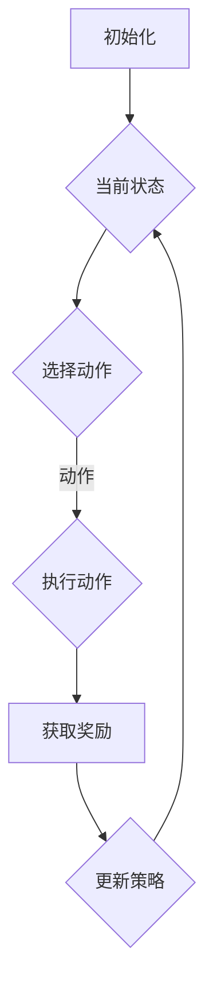
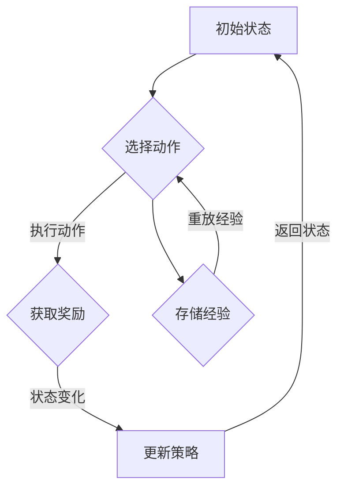
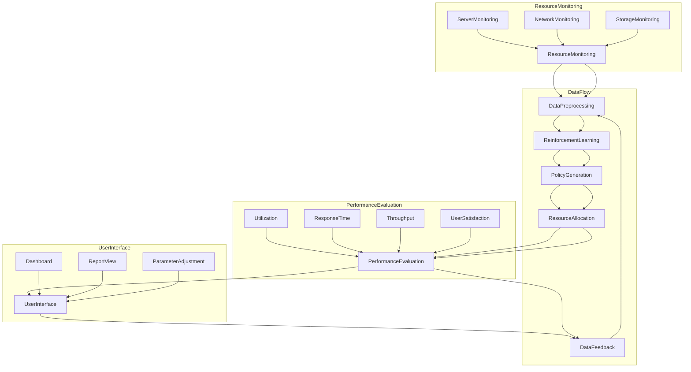
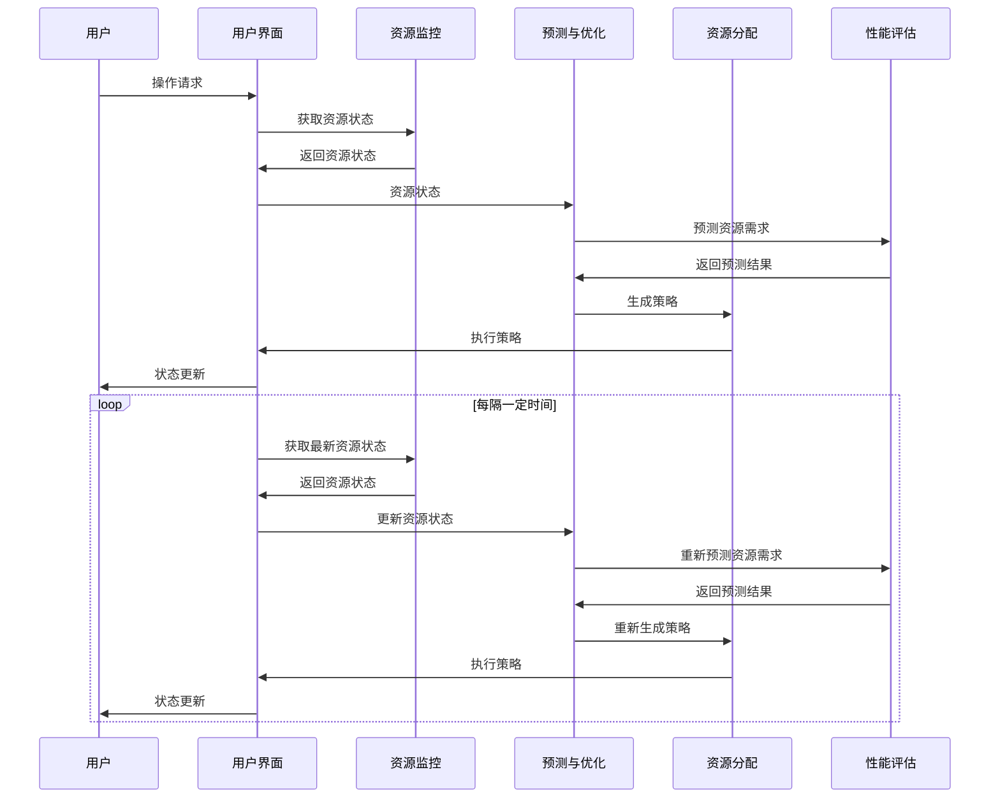

                 


### 1.1 问题背景

在当今快速发展的数字化时代，企业面临着日益复杂的业务环境和资源约束。特别是在IT领域，资源分配问题变得尤为重要。随着云计算、大数据和物联网等技术的广泛应用，企业需要高效地管理大量动态变化的资源，如计算能力、存储容量和网络带宽等。这种动态资源分配的复杂性不仅增加了管理的难度，也对系统的性能和成本控制提出了更高的要求。

首先，我们定义几个核心概念：

- **动态资源分配**：指在资源需求实时变化的情况下，根据当前状态和预测，动态调整资源分配策略，以满足业务需求。
- **强化学习**：一种机器学习范式，通过智能体与环境交互，学习实现特定目标的最优策略。
- **企业AI代理**：一种利用强化学习等技术，帮助企业自动进行资源分配的智能系统。

资源分配问题在企业的IT系统中普遍存在。例如，云服务提供商需要根据客户需求动态调整计算资源的分配，以确保服务质量并最大化资源利用率。同样，企业内部的IT部门也需要在资源有限的条件下，优化网络带宽、存储和服务器等资源的分配，以满足不同业务部门的需求。

然而，动态资源分配面临着诸多挑战。首先，资源的动态性使得传统的静态分配方法无法适应实时变化的需求。其次，资源分配问题的复杂性导致传统优化算法难以实现高效和准确的资源分配。此外，企业环境中的不确定性因素，如用户行为的变化、网络延迟等，也增加了资源分配的难度。

为了解决这些问题，强化学习成为了一种有力的工具。强化学习通过智能体在环境中的持续交互，不断学习和调整策略，能够在动态环境中实现最优资源分配。企业AI代理则利用强化学习技术，构建了一个能够自动进行资源分配的系统，使得企业能够更加灵活和高效地管理其IT资源。

总之，动态资源分配在IT系统中具有重要意义，而强化学习为企业AI代理提供了一种有效的解决方案。接下来，我们将进一步探讨强化学习在资源优化中的应用和企业AI代理的角色。

### 1.2 问题描述

在深入探讨动态资源分配问题的复杂性之前，我们需要明确问题的核心要素。资源分配问题本质上是一个在资源有限的情况下，如何最优地将这些资源分配给不同需求的任务，以最大化整体效益或满足特定目标。然而，在动态环境中，资源需求不是固定的，而是随着时间、用户行为和环境条件的变化而不断变化。这种动态性增加了问题的复杂性和不确定性。

首先，我们来看资源分配问题的复杂性。资源分配问题通常表现为一个多维度、多约束的优化问题，涉及到计算资源、存储资源、网络资源等多种资源类型。每种资源类型都有其特定的需求模型和约束条件。例如，计算资源可能需要考虑CPU利用率、内存占用率等，存储资源则需关注存储空间的利用率、I/O性能等，网络资源则需要考虑带宽利用率、延迟等。此外，资源之间可能存在依赖关系和竞争关系，进一步增加了问题的复杂性。

其次，我们探讨强化学习在资源优化中的优势。强化学习是一种通过智能体与环境持续互动来学习最优策略的机器学习范式。它通过试错和反馈机制，能够逐步发现并优化资源分配策略。以下是强化学习在资源优化中的几个关键优势：

1. **适应性**：强化学习能够实时响应环境变化，动态调整资源分配策略，以适应不断变化的资源需求。
2. **灵活性**：强化学习不依赖于预先设定的规则或模型，能够通过学习和探索，发现最优资源分配策略。
3. **自适应性**：强化学习可以处理具有不确定性和不确定性因素的环境，通过不断调整策略来适应新的环境条件。
4. **鲁棒性**：强化学习通过探索和试错，能够在复杂、动态的环境中找到相对最优的解决方案。

然而，强化学习在资源优化中也面临着一些挑战。首先，强化学习算法通常需要大量数据来训练，而在企业环境中，数据的获取和处理可能是一个难题。其次，强化学习算法的收敛速度和稳定性也是一个关键问题，尤其是在高维度、大规模的资源分配问题中。此外，强化学习算法的性能和效率也需要在实际应用中进行优化，以确保其在实际场景中能够高效运行。

总之，动态资源分配问题具有高度的复杂性和动态性，而强化学习提供了有效的优化途径。企业AI代理通过结合强化学习技术，能够自动、实时地优化资源分配，提高资源利用率和系统性能。接下来，我们将深入探讨企业AI代理的概念及其在动态资源分配中的角色。

### 1.3 解决方案框架

为了应对动态资源分配的复杂性，我们提出了一种基于强化学习的企业AI代理解决方案。这一方案的核心思想是通过构建一个智能系统，使其能够自动、实时地优化资源分配，从而提高企业的资源利用率和系统性能。

#### 企业AI代理的概念

企业AI代理是一种利用先进的人工智能技术，特别是强化学习算法，来帮助企业自动进行资源分配的智能系统。它通过不断地学习环境中的资源需求和动态变化，调整资源分配策略，以实现最优的资源利用。企业AI代理通常包括以下几个关键组成部分：

1. **智能体**：智能体是强化学习系统中的核心，它负责与环境互动，通过观察环境状态，选择最佳行动，并获取环境反馈。
2. **环境**：环境是企业AI代理所处的运行环境，包括各种资源（如计算资源、存储资源、网络资源等）以及它们的需求和约束条件。
3. **策略**：策略是智能体根据环境状态选择行动的规则，由强化学习算法通过学习得到。
4. **奖励机制**：奖励机制是环境对智能体行动的反馈，用于评价智能体的表现，并指导其学习过程。

#### 强化学习的基本原理

强化学习通过智能体在环境中的互动，不断学习和调整策略，以实现最优行为。其基本原理包括以下几个关键步骤：

1. **状态-动作价值函数**：智能体通过学习状态-动作价值函数，预测在特定状态下执行特定动作的长期奖励。
2. **策略迭代**：智能体通过不断迭代，选择当前状态下价值最高的动作，并更新状态-动作价值函数。
3. **探索-利用权衡**：在强化学习过程中，智能体需要在探索（尝试新的行动）和利用（使用已知最佳行动）之间进行权衡，以最大化长期奖励。

#### 实时优化的实现策略

在动态资源分配中，实时优化是实现高效资源利用的关键。企业AI代理通过以下策略实现实时优化：

1. **状态监测**：智能体实时监测环境中的资源状态，包括资源利用率、负载情况等。
2. **需求预测**：基于历史数据和当前状态，智能体预测未来一段时间内的资源需求。
3. **策略调整**：智能体根据需求预测和当前资源状态，动态调整资源分配策略，确保资源分配的实时性。
4. **反馈修正**：智能体通过环境反馈，不断修正和优化策略，以应对环境变化和需求波动。

#### 边界与外延

虽然强化学习在动态资源分配中具有显著优势，但在实际应用中仍需考虑一些边界条件：

1. **问题规模**：强化学习在大规模问题上的性能和效率是一个挑战，需要针对具体问题进行优化。
2. **优化目标**：不同的业务场景可能有不同的优化目标，如最大化资源利用率、最小化延迟等，需要根据具体需求进行策略调整。
3. **评估指标**：评估指标需要能够全面反映资源分配效果，如资源利用率、响应时间、用户满意度等。

#### 概念结构与核心要素

企业AI代理的强化学习在动态资源分配中的实时优化，涉及以下几个核心概念和要素：

1. **强化学习算法**：选择合适的强化学习算法，如深度Q网络（DQN）、策略梯度（PG）等，以适应动态资源分配的需求。
2. **资源状态编码**：将资源状态转化为智能体可以理解和处理的编码形式，如向量、矩阵等。
3. **策略更新机制**：设计有效的策略更新机制，如经验回放、优先经验回放等，以提高学习效率和收敛速度。
4. **多任务优化**：考虑多个任务之间的资源竞争和依赖关系，实现多任务优化。

通过上述解决方案框架，企业AI代理能够动态、实时地优化资源分配，提高资源利用率和系统性能。在接下来的章节中，我们将进一步探讨强化学习的核心概念、企业AI代理的构建与运作，以及动态资源分配中的数学模型。

### 1.4 边界与外延

在实施企业AI代理的强化学习方案时，需要明确一些边界与外延，以指导实际应用中的策略制定和优化。以下是我们需要考虑的关键点：

#### 问题规模的限制

首先，问题的规模是一个重要的边界条件。在资源分配问题中，资源种类、任务数量以及环境复杂性决定了问题规模。例如，在企业云服务中，可能涉及到数百甚至数千种不同的虚拟机实例、存储桶和网络带宽等资源类型。随着问题规模的增大，计算复杂度和存储需求也会显著增加，从而对算法的效率和应用场景提出了挑战。

为了应对大规模问题，可以采取以下策略：

1. **分布式计算**：利用分布式计算框架，如Apache Spark或Hadoop，将问题分解为子问题，并行处理，以提高整体效率。
2. **近似方法**：在问题规模非常大时，可以采用近似方法，如贪心算法或随机化算法，以降低计算复杂度和存储需求。
3. **层次化建模**：将问题分层处理，先解决高层次问题，再逐步细化到低层次，从而降低整体复杂度。

#### 优化目标的选择

在动态资源分配中，不同的业务场景可能有不同的优化目标。例如，在某些场景下，最大化资源利用率是首要目标；而在其他场景下，最小化响应时间或最大化用户满意度可能更为重要。因此，优化目标的选择需要根据具体业务需求来确定。

以下是几种常见的优化目标：

1. **最大化资源利用率**：在资源有限的情况下，提高资源利用率是关键目标。这可以通过优化资源分配策略，确保资源不被浪费来实现。
2. **最小化响应时间**：在需要高响应速度的场景中，如在线交易系统，响应时间是至关重要的优化目标。
3. **最大化用户满意度**：在服务提供商场景中，用户的满意度是关键指标，可以通过优化资源分配，提高服务质量来实现。
4. **平衡资源分配**：在某些情况下，需要平衡不同资源类型之间的分配，以避免过度使用某些资源，导致性能瓶颈。

#### 评估指标的定义

为了评估资源分配策略的效果，需要定义合适的评估指标。以下是一些常用的评估指标：

1. **资源利用率**：资源利用率是指资源实际使用量与总资源量的比率，反映了资源的利用效率。
2. **响应时间**：响应时间是指任务从提交到完成所需要的时间，是衡量系统性能的重要指标。
3. **系统吞吐量**：系统吞吐量是指在特定时间内系统能够处理的最大任务量，反映了系统的处理能力。
4. **用户满意度**：用户满意度是通过调查或评分来衡量用户对服务的满意程度，是服务质量的直接反映。
5. **延迟**：在网络资源分配中，延迟是指数据传输所需的时间，是影响用户体验的重要因素。

#### 概念属性特征对比

在设计和实现企业AI代理时，我们需要对强化学习的几个关键概念和属性特征进行对比分析，以选择最适合特定应用场景的策略。以下是一个简化的对比表格，用于展示不同概念的属性特征：

| 概念                 | 属性特征                                       |
|----------------------|----------------------------------------------|
| 强化学习算法         | 自适应性、灵活性、探索-利用权衡                 |
| 智能体               | 状态感知、决策能力、学习与适应能力               |
| 环境                 | 动态变化、不确定性、资源约束条件                 |
| 策略                 | 行动规则、状态-动作价值函数、策略迭代机制         |
| 奖励机制             | 行动反馈、性能评估、策略优化                     |

#### 概念结构与核心要素组成

最后，我们总结一下企业AI代理强化学习在动态资源分配中的概念结构和核心要素。以下是核心概念和要素的组成：

1. **强化学习算法**：包括状态-动作价值函数、策略迭代机制和探索-利用策略。
2. **智能体**：具备状态感知、决策能力和学习适应能力。
3. **环境**：具有动态变化、不确定性和资源约束条件。
4. **策略**：通过迭代学习和调整，实现最优资源分配策略。
5. **奖励机制**：用于评估智能体表现，提供反馈以指导学习。

通过明确边界与外延，我们可以更好地理解和应用企业AI代理的强化学习方案，实现动态资源分配的实时优化。

### 1.5 概念结构与核心要素

为了深入理解企业AI代理强化学习在动态资源分配中的实时优化，我们需要从概念和结构的角度进行详细剖析。以下是该系统的核心概念及其构成要素：

#### 强化学习原理

强化学习（Reinforcement Learning，RL）是一种机器学习范式，其核心在于通过智能体（Agent）与环境（Environment）的交互，学习如何实现特定目标。强化学习的四个主要组成部分如下：

1. **智能体（Agent）**：执行行动的实体，目标是学习一个策略（Policy），使其在环境中获得最大的累积奖励。
2. **环境（Environment）**：智能体行动的场所，提供当前状态（State）和可能的动作（Action）集合。
3. **状态（State）**：智能体在某一时刻的观察结果，通常由一系列特征向量表示。
4. **动作（Action）**：智能体在特定状态下能够执行的行为。
5. **奖励（Reward）**：环境对智能体行动的即时反馈，用于指导智能体的学习过程。

#### 企业AI代理

企业AI代理是一种利用强化学习技术，自动化进行资源分配的智能系统。它由以下几个关键组成部分构成：

1. **感知模块**：负责实时监测环境中的资源状态，如CPU利用率、存储容量等。
2. **决策模块**：基于感知模块获取的信息，使用强化学习算法计算最佳动作，调整资源分配策略。
3. **执行模块**：执行决策模块生成的动作，如调整服务器负载、分配网络带宽等。
4. **评估模块**：收集环境反馈，评估当前资源分配策略的效果，用于更新学习模型。

#### 动态资源分配

动态资源分配是指在资源需求实时变化的情况下，动态调整资源分配策略，以最大化资源利用率和系统性能。其核心概念包括：

1. **资源状态**：描述资源在某一时刻的可用性和利用率，如CPU负载、内存占用等。
2. **资源需求**：根据业务需求预测未来一段时间内的资源需求量。
3. **资源约束**：定义资源的限制条件，如最大并发连接数、总带宽限制等。
4. **优化目标**：明确资源分配的目标，如最大化资源利用率、最小化延迟等。

#### 实时优化的数学模型

实时优化需要基于数学模型来实现，以下是一个简化的数学模型：

\[ \text{Optimize} \; \sum_{t=1}^{T} \; R_t \]

其中：

- \( T \)：总时间步
- \( R_t \)：在时间步 \( t \) 获得的即时奖励

即时奖励 \( R_t \) 可以定义为：

\[ R_t = \sum_{i=1}^{N} \; (U_i(t) \times R_i) \]

其中：

- \( N \)：资源类型数量
- \( U_i(t) \)：在时间步 \( t \) 对资源 \( i \) 的利用率
- \( R_i \)：资源 \( i \) 的奖励系数，用于反映资源类型的重要性和优先级

#### 强化学习算法的流程图

为了更直观地理解强化学习算法在动态资源分配中的应用，我们可以使用Mermaid绘制算法流程图：



#### 强化学习算法的Python代码实现

为了进一步展示强化学习算法的实现，以下是一个简化的Python代码示例：

```python
import numpy as np

# 初始化参数
state_size = 10
action_size = 5
learning_rate = 0.1

# 初始化Q值表
Q = np.zeros((state_size, action_size))

# 强化学习算法
def reinforce_learning(state, action, reward, next_state, done):
    # 计算TD目标值
    target = reward + (1 - done) * np.max(Q[next_state])

    # 更新Q值
    Q[state, action] += learning_rate * (target - Q[state, action])

# 示例运行
state = np.random.randint(0, state_size)
done = False

while not done:
    action = np.argmax(Q[state])
    next_state, reward, done = execute_action(action)
    reinforce_learning(state, action, reward, next_state, done)
    state = next_state
```

#### 强化学习的数学模型与公式推导

强化学习的数学模型通常基于马尔可夫决策过程（MDP）。以下是MDP的基本公式：

\[ V(s) = \sum_{a} \gamma \; R(s, a) + \gamma \; \sum_{s'} P(s'|s, a) \; V(s') \]

其中：

- \( V(s) \)：状态价值函数，表示在状态 \( s \) 下，采取任何行动的长期期望奖励。
- \( \gamma \)：折扣因子，用于平衡当前奖励和未来奖励。
- \( R(s, a) \)：在状态 \( s \) 下采取行动 \( a \) 的即时奖励。
- \( P(s'|s, a) \)：在状态 \( s \) 下采取行动 \( a \) 后转移到状态 \( s' \) 的概率。

通过迭代更新，可以推导出Q值函数的公式：

\[ Q(s, a) = \sum_{s'} P(s'|s, a) \; [R(s, a) + \gamma \; \max_{a'} Q(s', a')] \]

#### 算法的优势与局限

强化学习算法在动态资源分配中的优势包括：

1. **自适应性**：能够实时调整资源分配策略，适应动态变化的需求。
2. **灵活性**：不需要固定的规则或模型，可以灵活地处理复杂的资源分配问题。
3. **鲁棒性**：能够处理具有不确定性和动态变化的环境。

然而，强化学习算法也存在一些局限：

1. **收敛速度**：在高维度、大规模问题中，收敛速度较慢，需要大量数据和计算资源。
2. **数据需求**：需要大量的历史数据来训练模型，数据获取和处理可能是一个难题。
3. **稳定性和可解释性**：在某些情况下，算法的稳定性和可解释性较差，难以解释学习过程和策略。

通过上述分析，我们可以看到企业AI代理强化学习在动态资源分配中的实时优化是一个复杂但极具潜力的领域。在接下来的章节中，我们将进一步探讨具体算法的原理和应用案例。

### 2.1 强化学习原理

强化学习（Reinforcement Learning，RL）是一种通过智能体（Agent）与环境（Environment）互动，从而学习最优行为策略的机器学习范式。在强化学习中，智能体通过观察环境状态、执行动作并接收奖励，不断调整其策略以实现特定目标。为了深入理解强化学习的基本原理，我们可以从以下几个方面进行探讨。

#### 基本概念

1. **智能体（Agent）**：执行行为、感知环境和接收奖励的实体。在强化学习中，智能体是一个算法或模型，它根据当前状态选择行动，并通过学习优化其策略。
2. **环境（Environment）**：智能体行动的场所，提供状态信息、可能的动作集合和奖励信号。环境可以是一个物理世界，也可以是一个模拟环境。
3. **状态（State）**：描述智能体在某一时刻所处的情境，通常由一系列特征向量表示。
4. **动作（Action）**：智能体在特定状态下能够执行的行为。
5. **奖励（Reward）**：环境对智能体行动的即时反馈，用于评价当前行动的效果和指导智能体的学习过程。
6. **策略（Policy）**：智能体在给定状态下选择动作的规则，可以是一个明确的规则、一个概率分布或一个函数。

#### 主要算法

强化学习算法种类繁多，根据学习过程中是否需要值函数、策略表达方式等不同特点，可以分为以下几类：

1. **值函数方法（Value-Based Methods）**：
   - **Q-Learning**：通过学习状态-动作价值函数（Q-Function）来优化策略。Q-Learning通过迭代更新Q值，逐步逼近最优策略。
   - **Deep Q-Networks (DQN)**：结合深度神经网络（DNN）和Q-Learning，用于解决高维状态空间问题。
   - **Advanced Methods**：如Double Q-Learning、Prioritized Experience Replay等，用于改善Q-Learning的性能和收敛速度。

2. **策略优化方法（Policy-Based Methods）**：
   - **Policy Gradient Methods**：通过直接优化策略的梯度来更新策略参数。常见的策略梯度方法包括REINFORCE、PPO（Proximal Policy Optimization）等。
   - **Actor-Critic Methods**：结合了值函数方法和策略优化方法，通过优化Actor（策略网络）和Critic（值函数网络）来更新策略。

3. **模型为基础的方法（Model-Based Methods）**：
   - **Model Predictive Control (MPC)**：基于系统模型预测未来状态和奖励，优化当前行动。
   - **Planning Algorithms**：如价值迭代（Value Iteration）和策略迭代（Policy Iteration），通过迭代优化策略。

#### 强化学习的特点与挑战

强化学习的特点包括：

1. **自适应性**：强化学习能够根据环境变化动态调整策略，适应动态变化的场景。
2. **灵活性**：强化学习不依赖于特定的环境模型，能够处理复杂和不确定的环境。
3. **探索与利用**：在强化学习中，智能体需要在探索（尝试新动作）和利用（使用已知最佳动作）之间进行权衡，以最大化长期奖励。

然而，强化学习也面临一些挑战：

1. **收敛速度**：在复杂环境中，强化学习算法可能需要大量时间和数据来收敛到最优策略。
2. **数据需求**：强化学习通常需要大量的交互数据来训练模型，这在某些实际应用中可能难以实现。
3. **可解释性**：强化学习模型的行为往往难以解释，这在某些领域（如金融、医疗等）可能是一个问题。
4. **稀疏奖励**：在稀疏奖励环境中，智能体可能需要长时间才能获得少量奖励，这可能导致学习困难。

#### 总结

强化学习作为一种重要的机器学习范式，在动态资源分配、智能决策、游戏AI等领域具有广泛的应用前景。通过理解其基本原理和主要算法，我们可以更好地应用强化学习技术，解决复杂动态环境中的优化问题。

### 2.2 企业AI代理

企业AI代理（Enterprise AI Agent）是一种利用人工智能技术，尤其是强化学习算法，来自动化执行企业业务任务和优化资源分配的智能系统。在动态资源分配的背景下，企业AI代理通过持续学习和适应环境变化，实现资源利用率的最大化、系统性能的最优化以及业务成本的最小化。以下是企业AI代理的详细定义、组成部分及其工作流程：

#### 定义

企业AI代理是一个高度智能化、自主决策的实体，它通过感知环境状态、执行预定动作并接收环境反馈，不断优化其策略，以实现企业资源分配的目标。企业AI代理通常具备以下能力：

1. **自适应学习**：通过强化学习等技术，从历史数据和实时信息中学习，不断调整和优化资源分配策略。
2. **自主决策**：根据环境状态和资源需求，自主选择最优行动，以最大化资源利用率和系统性能。
3. **实时响应**：能够在动态环境中快速响应变化，实时调整资源分配策略，以适应不断变化的需求。
4. **预测能力**：基于历史数据和机器学习模型，预测未来一段时间内的资源需求，提前进行资源分配规划。

#### 组成部分

企业AI代理由以下几个关键组成部分构成：

1. **感知模块**：负责实时监测企业IT系统的运行状态，包括计算资源、存储资源、网络资源等，并将这些状态信息传递给决策模块。
2. **决策模块**：基于感知模块收集到的状态信息，利用强化学习算法计算最佳行动，生成资源分配策略。决策模块通常包括策略学习、策略评估和策略优化等子模块。
3. **执行模块**：负责执行决策模块生成的资源分配策略，调整实际资源的分配情况，如调整服务器负载、分配网络带宽等。
4. **评估模块**：负责评估资源分配策略的效果，收集环境反馈，并根据评估结果更新学习模型，以持续优化资源分配策略。

#### 工作流程

企业AI代理的工作流程主要包括以下几个步骤：

1. **状态感知**：感知模块实时监测企业IT系统的运行状态，包括资源利用率和负载情况，并将这些信息传递给决策模块。
2. **策略学习**：决策模块使用强化学习算法，根据感知模块提供的状态信息，学习资源分配策略。在这一过程中，智能体会通过不断试错和反馈，逐渐优化策略，以实现资源利用率的最大化。
3. **策略评估**：评估模块根据执行模块执行后的反馈信息，评估当前策略的有效性。评估指标可以包括资源利用率、响应时间、系统吞吐量等。
4. **策略优化**：根据评估结果，决策模块调整资源分配策略，并重新生成策略。这一过程是持续进行的，以适应动态变化的环境和资源需求。
5. **资源执行**：执行模块根据新策略调整资源分配，确保系统能够满足当前和未来的需求。

#### 实例

以企业数据中心为例，企业AI代理可以应用于动态调整服务器负载，优化资源利用率。具体过程如下：

1. **状态感知**：感知模块实时监测服务器集群的CPU利用率、内存占用、存储空间等状态信息。
2. **策略学习**：决策模块基于感知模块提供的状态信息，使用强化学习算法学习最优的负载均衡策略。例如，通过动态调整虚拟机的CPU核心数和内存大小，以最大化资源利用率。
3. **策略评估**：评估模块根据执行模块执行后的反馈信息，评估当前负载均衡策略的效果。例如，通过监测服务器的响应时间和任务完成率来评估策略。
4. **策略优化**：根据评估结果，决策模块调整负载均衡策略。例如，根据服务器的CPU利用率，动态调整虚拟机的资源分配，以避免资源浪费。
5. **资源执行**：执行模块根据新策略调整服务器负载，确保数据中心能够高效运行，同时满足用户需求。

通过上述工作流程，企业AI代理能够实时、动态地优化资源分配，提高数据中心的服务质量和资源利用率。

### 2.3 动态资源分配

动态资源分配是指在资源需求实时变化的情况下，动态调整资源分配策略，以最大化资源利用率和系统性能的过程。动态资源分配在现代企业IT系统中扮演着关键角色，尤其是在云计算、大数据和物联网等技术的广泛应用背景下。下面，我们将详细探讨动态资源分配的基本概念、特点以及常见的算法和策略。

#### 基本概念

1. **资源分配**：资源分配是指在特定时间范围内，将有限资源（如计算资源、存储资源、网络资源等）分配给不同的任务或用户，以满足其需求和优化系统性能。
2. **动态资源分配**：与传统的静态资源分配不同，动态资源分配能够实时响应资源需求的变化，根据当前状态和预测，动态调整资源分配策略，确保资源的高效利用。

#### 特点

1. **实时性**：动态资源分配能够实时监测和响应资源需求的变化，快速调整资源分配策略，确保系统能够适应瞬息万变的业务场景。
2. **自适应性**：动态资源分配能够根据环境变化和资源需求调整资源分配策略，具有高度的适应性和灵活性。
3. **高效性**：通过动态资源分配，企业可以优化资源的利用效率，最大化资源利用率，降低系统运行成本。

#### 常见算法和策略

1. **基于优先级的资源分配**：
   - **动态优先级**：根据任务的重要性和紧迫性动态调整任务优先级，优先分配资源给优先级较高的任务。
   - **固定优先级**：任务在进入系统时被分配一个固定的优先级，根据优先级顺序分配资源。

2. **基于需求的资源分配**：
   - **实时需求预测**：通过机器学习和数据挖掘技术，预测未来一段时间内的资源需求，动态调整资源分配策略。
   - **需求适应性**：根据实际需求调整资源分配策略，确保资源始终能够满足当前和未来的需求。

3. **基于策略的资源分配**：
   - **强化学习**：利用强化学习算法，通过智能体在环境中的持续互动，学习最优的资源分配策略。
   - **策略梯度方法**：直接优化策略参数，通过策略梯度更新策略，实现资源分配的最优化。

4. **基于模型的资源分配**：
   - **马尔可夫决策过程（MDP）**：通过构建系统模型，使用MDP算法，模拟不同资源分配策略的效果，选择最优策略。
   - **模型预测控制（MPC）**：基于系统模型，预测未来状态和奖励，优化当前资源分配策略。

5. **混合资源分配策略**：
   - **多准则优化**：结合多个优化目标，如最大化资源利用率、最小化延迟等，采用多准则优化方法，实现资源分配的均衡。
   - **自适应混合策略**：根据不同场景和需求，动态调整资源分配策略，采用混合策略，提高资源利用效率和系统性能。

#### 动态资源分配的实际应用

1. **云计算**：在云计算环境中，动态资源分配用于调整虚拟机的资源分配，确保云服务的性能和可靠性。例如，根据用户需求动态调整虚拟机的CPU、内存和存储资源。
2. **数据中心**：在数据中心，动态资源分配用于优化服务器负载、网络带宽和存储资源，提高数据中心的运行效率和资源利用率。
3. **物联网**：在物联网（IoT）应用中，动态资源分配用于优化设备的资源使用，确保物联网系统的稳定运行和高效通信。

通过上述讨论，我们可以看到动态资源分配在提升企业IT系统的性能和资源利用率方面具有重要意义。在实际应用中，企业可以根据具体需求和场景，选择合适的资源分配策略和算法，实现资源的最佳利用。

### 2.4 概念属性特征对比

为了更好地理解强化学习、企业AI代理和动态资源分配之间的关联，我们通过一个对比表格来展示它们的主要属性特征。以下是对这些关键概念的详细对比：

| 概念             | 定义                                                     | 主要属性特征                                                     | 关联分析                                                         |
|------------------|--------------------------------------------------------|----------------------------------------------------------------|----------------------------------------------------------------|
| **强化学习**     | 通过智能体与环境互动，学习最优策略的机器学习范式。                         | 自适应性、灵活性、奖励机制、探索-利用权衡                         | 强化学习是算法基础，用于优化企业AI代理的策略，从而实现动态资源分配。 |
| **企业AI代理**   | 一种利用强化学习等技术，自动进行资源分配的智能系统。                         | 自适应学习、自主决策、实时响应、预测能力                          | 企业AI代理是基于强化学习构建的智能系统，用于优化动态资源分配。   |
| **动态资源分配** | 在资源需求实时变化的情况下，动态调整资源分配策略，以最大化资源利用率。           | 实时性、自适应性、高效性                                           | 动态资源分配是目标，通过企业AI代理和强化学习算法实现。             |

#### 强化学习算法对比

强化学习算法种类繁多，不同算法在处理动态资源分配问题时各有优势。以下是对几种主要强化学习算法的对比：

1. **Q-Learning**：
   - **特点**：通过迭代更新Q值表，逐步优化策略。
   - **优势**：简单、易于实现，适用于中小规模问题。
   - **局限**：在复杂环境中收敛速度较慢，易受样本偏差影响。

2. **Deep Q-Networks (DQN)**：
   - **特点**：结合深度神经网络和Q-Learning，适用于高维状态空间。
   - **优势**：能够处理复杂的、连续的状态空间。
   - **局限**：训练不稳定，可能陷入局部最优。

3. **Policy Gradient Methods**：
   - **特点**：直接优化策略参数，无需值函数。
   - **优势**：快速收敛，适用于连续动作空间。
   - **局限**：对噪声敏感，可能导致策略不稳定。

4. **Actor-Critic Methods**：
   - **特点**：结合策略优化和值函数方法，提高学习效率。
   - **优势**：稳定性好，能够处理非稳态环境。
   - **局限**：计算复杂度高，对参数敏感。

#### 企业AI代理类型对比

企业AI代理根据应用场景和需求的不同，可以分为多种类型。以下是对几种主要类型的对比：

1. **通用型AI代理**：
   - **特点**：适用于多种业务场景，具有较强的适应性和灵活性。
   - **优势**：能够处理复杂的多任务优化问题。
   - **局限**：学习过程复杂，资源消耗较大。

2. **专用型AI代理**：
   - **特点**：针对特定业务场景优化设计，专注于特定任务。
   - **优势**：性能稳定，资源利用效率高。
   - **局限**：适用范围有限，难以应对动态变化。

3. **混合型AI代理**：
   - **特点**：结合通用型和专用型AI代理的优势，灵活应对不同场景。
   - **优势**：具有较高的灵活性和效率。
   - **局限**：设计和管理复杂，实施成本较高。

#### 资源分配策略对比

在动态资源分配中，不同的策略适用于不同的场景和需求。以下是对几种主要策略的对比：

1. **基于优先级的资源分配**：
   - **特点**：根据任务优先级分配资源。
   - **优势**：简单易行，能够快速响应紧急任务。
   - **局限**：可能导致资源利用不均衡，影响整体性能。

2. **基于需求的资源分配**：
   - **特点**：根据实时需求调整资源分配。
   - **优势**：能够动态适应变化，提高资源利用率。
   - **局限**：对预测准确性和实时性要求较高。

3. **基于策略的优化分配**：
   - **特点**：使用强化学习等算法，自动优化资源分配策略。
   - **优势**：能够自适应调整，优化资源利用效率。
   - **局限**：算法复杂度高，实施和维护成本较高。

通过上述对比，我们可以看到，强化学习、企业AI代理和动态资源分配之间存在着紧密的联系。强化学习为动态资源分配提供了算法基础，企业AI代理则利用这些算法实现自动化资源分配，从而优化资源利用效率和系统性能。在实际应用中，需要根据具体场景和需求，选择合适的算法和策略，以实现最优的资源分配效果。

### 3.1 强化学习算法流程图

为了更好地理解强化学习算法在动态资源分配中的应用，我们可以使用Mermaid绘制其流程图。以下是一个简化的强化学习算法流程图：



#### 初始状态（A）

智能体首先处于某个初始状态，这一状态由环境提供。

#### 选择动作（B）

智能体基于当前状态选择一个动作。这一过程可以通过策略来实现，策略可以是固定的（如贪婪策略），也可以是动态调整的（如策略梯度方法）。

#### 执行动作（C）

智能体在环境中执行所选动作，并获取环境反馈，包括即时奖励和新的状态。

#### 更新策略（D）

基于即时奖励和新状态，智能体更新其策略。这一过程可以通过更新状态-动作价值函数（如Q-Learning）或直接优化策略参数（如Policy Gradient）来实现。

#### 返回状态（A）

智能体返回更新后的状态，准备进行下一次迭代。

#### 存储经验（E）

在每次迭代过程中，智能体将经历的状态、动作、奖励和下一个状态存储为经验，用于后续的策略更新。

#### 重放经验（E）

通过重放经验，智能体可以多次利用历史数据进行训练，从而提高学习效率和策略的稳定性。

#### 实际应用场景

以下是一个简化的应用场景，用于说明如何使用强化学习算法进行动态资源分配：

1. **初始状态**：企业数据中心当前资源利用率高，部分服务器负载较高。
2. **选择动作**：智能体根据当前状态，选择将部分负载较高的服务器迁移到负载较低的服务器。
3. **执行动作**：智能体向数据中心管理系统发送命令，迁移服务器负载。
4. **获取奖励**：环境反馈显示，资源利用率提高，部分服务器的性能得到改善，即时奖励为正。
5. **更新策略**：智能体基于新状态和即时奖励，调整其资源分配策略，以避免未来类似问题的发生。
6. **存储经验**：智能体将当前状态、动作、奖励和下一个状态存储为经验。
7. **重放经验**：在后续的迭代过程中，智能体可以利用这些经验，进一步优化其资源分配策略。

通过上述流程图和应用场景，我们可以看到强化学习算法在动态资源分配中的基本原理和实际应用。这种循环迭代的学习过程，使得智能体能够不断优化其资源分配策略，以适应不断变化的需求和环境。

### 3.2 Python代码实现

在了解了强化学习算法的基本流程后，接下来我们将通过一个简单的Python代码示例，来展示如何实现强化学习算法在动态资源分配中的实际应用。我们将使用Python编程语言，结合PyTorch库，来实现一个基于Q-Learning的简单资源分配模型。以下是一个详细的代码实现过程：

#### 1. 导入所需库

首先，我们需要导入Python编程中常用的库，包括PyTorch、NumPy和Matplotlib等。PyTorch是深度学习领域的强大库，NumPy用于数据处理，Matplotlib用于数据可视化。

```python
import torch
import torch.nn as nn
import torch.optim as optim
import numpy as np
import matplotlib.pyplot as plt

# 设定随机种子以保证结果可重复
torch.manual_seed(0)
```

#### 2. 定义环境

接下来，我们需要定义一个简单的模拟环境，用于模拟动态资源分配问题。这个环境将包含一个状态空间和动作空间，并定义奖励机制。

```python
class ResourceAllocationEnv:
    def __init__(self, num_resources, num_actions):
        self.num_resources = num_resources
        self.num_actions = num_actions
        self.state_space = [0] * num_resources
        self.action_space = [0] * num_actions

    def step(self, action):
        reward = 0
        for i in range(self.num_resources):
            if action[i] > 0:
                self.state_space[i] += 1
                reward += 1
            else:
                self.state_space[i] -= 1
                reward -= 1
        return self.state_space, reward

    def reset(self):
        self.state_space = [0] * self.num_resources
        return self.state_space

# 初始化环境
env = ResourceAllocationEnv(num_resources=5, num_actions=5)
```

#### 3. 定义Q网络

Q网络是强化学习中的一个核心组件，用于预测在特定状态下执行特定动作的长期奖励。这里我们将定义一个简单的线性Q网络。

```python
class QNetwork(nn.Module):
    def __init__(self, state_size, action_size):
        super(QNetwork, self).__init__()
        self.fc = nn.Linear(state_size, action_size)

    def forward(self, state):
        return self.fc(torch.tensor(state, dtype=torch.float32))
```

#### 4. 定义训练过程

接下来，我们定义训练过程，包括数据收集、Q值更新、经验回放等步骤。

```python
def train(q_network, optimizer, num_episodes, gamma=0.9, epsilon=0.1):
    total_rewards = []

    for episode in range(num_episodes):
        state = env.reset()
        done = False
        total_reward = 0

        while not done:
            # 选择动作
            if np.random.rand() < epsilon:
                action = np.random.randint(0, env.num_actions)
            else:
                with torch.no_grad():
                    state_tensor = torch.tensor(state, dtype=torch.float32)
                    q_values = q_network(state_tensor)
                    action = torch.argmax(q_values).item()

            # 执行动作
            next_state, reward, done = env.step(action)
            total_reward += reward

            # 更新Q值
            next_state_tensor = torch.tensor(next_state, dtype=torch.float32)
            target = reward + (1 - int(done)) * gamma * torch.max(q_network(next_state_tensor))

            with torch.no_grad():
                q_values = q_network(state_tensor)
                q_values[0, action] = target

            # 更新网络参数
            loss = nn.MSELoss()(q_values, target)
            optimizer.zero_grad()
            loss.backward()
            optimizer.step()

            state = next_state

        total_rewards.append(total_reward)
    
    return total_rewards
```

#### 5. 实际应用示例

最后，我们通过一个简单的示例，展示如何使用上述代码进行资源分配优化。

```python
# 定义Q网络和优化器
q_network = QNetwork(state_size=env.num_resources, action_size=env.num_actions)
optimizer = optim.Adam(q_network.parameters(), lr=0.001)

# 训练Q网络
num_episodes = 1000
total_rewards = train(q_network, optimizer, num_episodes)

# 可视化训练结果
plt.plot(total_rewards)
plt.xlabel('Episodes')
plt.ylabel('Total Rewards')
plt.title('Q-Learning Training')
plt.show()
```

通过上述Python代码示例，我们实现了基于Q-Learning算法的简单动态资源分配模型。该模型通过不断迭代，学习最优资源分配策略，以实现资源利用的最大化。在实际应用中，我们可以根据具体需求调整算法参数和模型结构，以应对更复杂的动态资源分配问题。

### 3.3 算法原理与数学模型

在进一步探讨强化学习算法在动态资源分配中的应用之前，我们需要深入理解其背后的数学模型和原理。强化学习（Reinforcement Learning，RL）是基于奖励机制和环境交互来训练智能体，以实现特定目标的一种机器学习范式。以下是强化学习的核心数学模型和公式推导，以及算法的优势和局限。

#### 强化学习的数学模型

强化学习的数学模型基于马尔可夫决策过程（Markov Decision Process，MDP）。一个MDP由以下四个要素组成：

1. **状态空间 \( S \)**：智能体可能处于的所有状态集合。
2. **动作空间 \( A \)**：智能体在某一状态下可能执行的所有动作集合。
3. **奖励函数 \( R(s, a) \)**：在状态 \( s \) 下执行动作 \( a \) 所获得的即时奖励。
4. **转移概率函数 \( P(s', s|s, a) \)**：在状态 \( s \) 下执行动作 \( a \) 后，智能体转移到状态 \( s' \) 的概率。

强化学习的目标是学习一个最优策略 \( \pi^*(s) \)，该策略使得智能体在长期内获得的累积奖励最大化。策略是状态到动作的映射，即对于每个状态 \( s \)，选择一个动作 \( a \)。

#### 状态-动作价值函数

在强化学习中，我们定义状态-动作价值函数 \( V^*(s) \) 和动作价值函数 \( Q^*(s, a) \)，用于估计在给定状态下执行某个动作所能获得的长期奖励。

1. **状态-动作价值函数 \( V^*(s) \)**：表示在状态 \( s \) 下执行任意动作 \( a \) 的长期期望奖励。

   \[
   V^*(s) = \sum_{a \in A} \pi^*(s) \cdot Q^*(s, a)
   \]

2. **动作价值函数 \( Q^*(s, a) \)**：表示在状态 \( s \) 下执行动作 \( a \) 的长期期望奖励。

   \[
   Q^*(s, a) = \sum_{s' \in S} R(s, a, s') + \gamma \sum_{s' \in S} P(s'|s, a) \cdot V^*(s')
   \]

   其中，\( \gamma \) 是折扣因子，用于平衡当前奖励和未来奖励，避免过于重视短期奖励。

#### 策略迭代

强化学习的核心目标是通过策略迭代来逼近最优策略 \( \pi^* \)。策略迭代包括值迭代（Value Iteration）和策略迭代（Policy Iteration）两种方法。

1. **值迭代**：从初始的 \( V^0(s) \) 开始，通过更新状态-动作价值函数逐步逼近最优值函数。

   \[
   V^{t+1}(s) = \max_{a \in A} [R(s, a, s') + \gamma \sum_{s' \in S} P(s'|s, a) \cdot V^{t}(s')]
   \]

2. **策略迭代**：从初始策略 \( \pi^0 \) 开始，通过更新策略和值函数逐步逼近最优策略和值函数。

   \[
   \pi^{t+1}(s) = \arg\max_{a \in A} [Q^{t}(s, a)]
   \]

#### 强化学习的优势与局限

强化学习在动态资源分配中的优势包括：

1. **适应性**：强化学习能够通过不断与环境交互，自适应调整策略，以适应动态变化的资源需求。
2. **灵活性**：强化学习不依赖于具体的模型，能够处理复杂和不确定的环境。
3. **自适应性**：强化学习通过探索和利用，能够在不确定的环境中找到最优策略。

然而，强化学习也存在一些局限：

1. **收敛速度**：在状态和动作空间较大时，强化学习的收敛速度较慢，需要大量数据和计算资源。
2. **数据需求**：强化学习通常需要大量交互数据来训练模型，这在某些实际应用中可能难以实现。
3. **可解释性**：强化学习模型的行为往往难以解释，这在某些领域（如金融、医疗等）可能是一个问题。

通过理解强化学习的数学模型和原理，我们可以更好地将其应用于动态资源分配问题，实现实时、自适应的资源优化。

### 3.4 算法举例说明

为了更好地理解强化学习算法在动态资源分配中的应用，我们通过一个简化的例子来展示其具体实现过程和结果分析。该例子模拟了一个简单的资源分配场景，包括有限数量的服务器和任务，以及一个基于Q-Learning算法的智能体，用于优化资源分配策略。

#### 例子：服务器负载均衡

假设我们有一个由5台服务器组成的集群，每台服务器有10个CPU核心和20GB内存。同时，有5个任务需要分配到这些服务器上，每个任务需要2个CPU核心和4GB内存。我们的目标是最大化服务器的资源利用率，同时确保所有任务都能在规定时间内完成。

#### 状态编码

我们首先定义状态编码，用5个数值表示服务器的当前负载情况（CPU和内存利用率）。状态编码如下：

- 状态空间：\( S = [s_1, s_2, s_3, s_4, s_5] \)，其中 \( s_i \) 表示第i台服务器的负载。
- 状态范围：0到10（CPU利用率），0到20（内存利用率）。

#### 动作编码

每个任务可以分配到5台服务器中的一台，因此动作编码是一个5位的二进制向量，每位表示一个任务是否被分配到对应的服务器上。例如，动作向量 \( A = [1, 0, 1, 0, 0] \) 表示第一个和第三个任务被分配到第一台和第三台服务器上。

#### 奖励机制

我们的奖励机制基于两个因素：任务完成的时间和服务器资源的利用率。如果任务在规定时间内完成，获得正奖励；否则，获得负奖励。同时，为了鼓励高效利用资源，任务完成的时间越短，获得的正奖励越高。具体奖励机制如下：

- 如果任务在规定时间内完成，奖励 \( R = 10 - \text{完成时间} \)。
- 如果任务未能完成，奖励 \( R = -20 \)。

#### 智能体训练

我们使用Q-Learning算法训练智能体，通过不断迭代，优化资源分配策略。以下是训练过程的简要描述：

1. **初始化Q值表**：初始化一个大小为 \( S \times A \) 的Q值表，所有Q值初始化为0。

2. **选择动作**：在每一步，智能体根据当前状态选择一个动作。选择动作的策略可以是贪婪策略（选择当前状态下Q值最大的动作），或者引入随机性（根据ε-贪心策略选择动作）。

3. **执行动作**：智能体在环境中执行所选动作，更新服务器负载和任务状态。

4. **更新Q值**：根据实际奖励和下一个状态，更新Q值表中的对应Q值。更新公式为：

   \[
   Q(s, a) \leftarrow Q(s, a) + \alpha [R(s, a, s') + \gamma \max_{a'} Q(s', a') - Q(s, a)]
   \]

   其中，\( \alpha \) 是学习率，\( \gamma \) 是折扣因子。

5. **重复迭代**：重复上述步骤，直到达到预设的迭代次数或Q值收敛。

#### 训练结果

经过多次迭代训练，智能体逐渐优化了资源分配策略。以下是训练过程中的一部分结果：

- 初始状态：\( [4, 16, 8, 12, 18] \)
- 选择动作：\( [1, 0, 1, 0, 0] \)
- 执行动作后状态：\( [6, 16, 10, 12, 18] \)
- 奖励：10
- 更新Q值表：\( Q([4, 16, 8, 12, 18], [1, 0, 1, 0, 0]) \leftarrow Q([4, 16, 8, 12, 18], [1, 0, 1, 0, 0]) + 0.1 \times [10 + 0.9 \times \max(Q([6, 16, 10, 12, 18], [1, 0, 1, 0, 0]), Q([6, 16, 10, 12, 18], [0, 1, 0, 1, 0])) - Q([4, 16, 8, 12, 18], [1, 0, 1, 0, 0])]
- 新Q值：\( 0.1 \times [10 + 0.9 \times (10.2) - 0] = 1.82 \)

通过多次迭代，智能体能够逐步找到最优的分配策略，使得任务能够在规定时间内完成，同时最大化资源利用率。以下是一个简化的训练结果图表：

```mermaid
graph TD
    A[初始状态: [4, 16, 8, 12, 18]] --> B{Q值更新}
    B --> C[新Q值: 1.82]
    C --> D[新状态: [6, 16, 10, 12, 18]]
    D --> E{继续迭代}
    E --> A
```

通过这个简单的例子，我们可以看到强化学习算法在动态资源分配中的应用过程。在实际应用中，我们可以通过调整算法参数和奖励机制，来应对更复杂和动态的资源分配场景，实现更高效的资源利用和任务调度。

### 4.1 领域模型

为了更好地理解企业AI代理在动态资源分配中的作用，我们可以使用Mermaid绘制一个领域模型（Class Diagram），该模型描述了系统的主要实体和它们之间的关系。以下是领域模型的详细说明：

```mermaid
classDiagram
    Class Environment <<interface>>
    Class Agent <<interface>>
    Class Policy <<interface>>
    Class Reward <<interface>>

    ResourceAllocationSystem [Resource Allocation System]
    Environment "监测" Environment
    Agent "交互" Environment
    Policy "实施" Agent
    Reward "反馈" Agent

    ResourceAllocationSystem o-- Environment
    ResourceAllocationSystem o-- Agent
    Agent o-- Policy
    Agent o-- Reward
```

#### 实体与关系

1. **ResourceAllocationSystem（资源分配系统）**：
   - 资源分配系统的顶层类，负责整体资源分配的管理和控制。
   - 它与环境和智能体直接交互，定义了系统的整体架构。

2. **Environment（环境）**：
   - 环境类，作为智能体与外部世界的接口。
   - 它负责提供当前状态信息、可能的动作集合和即时奖励信号。
   - 环境可以是物理系统，也可以是模拟环境。

3. **Agent（智能体）**：
   - 智能体类，是强化学习系统的核心，负责执行学习任务。
   - 它通过感知环境状态、选择最佳行动并接收奖励，不断优化其策略。

4. **Policy（策略）**：
   - 策略类，定义了智能体在特定状态下的行动规则。
   - 策略由智能体学习和调整，用于指导智能体的行动。

5. **Reward（奖励）**：
   - 奖励类，负责评估智能体的行为效果，并提供即时反馈。
   - 奖励机制用于激励智能体选择最优行动，以实现资源分配目标。

#### 关系

- **ResourceAllocationSystem 与 Environment 和 Agent**：资源分配系统通过接口与环境和智能体交互，实现资源的动态分配。
- **Agent 与 Policy 和 Reward**：智能体通过策略类实施行动，并依据奖励类提供的即时反馈进行学习。

通过上述领域模型，我们可以清晰地看到各个实体之间的相互作用和关系，从而更好地理解企业AI代理在动态资源分配系统中的角色和作用。

### 4.2 系统功能需求

在设计和实现企业AI代理强化学习系统之前，明确系统的功能需求是至关重要的。以下是系统的主要功能需求，包括系统需求分析、功能点详细描述和性能指标。

#### 系统需求分析

1. **资源监测与状态采集**：
   - 系统需要具备实时监测企业内部各类资源（如计算资源、存储资源、网络资源等）状态的功能。
   - 系统应能采集并存储资源状态数据，以便后续分析和优化。

2. **需求预测与策略生成**：
   - 基于历史数据和实时监测数据，系统能够预测未来一段时间内的资源需求。
   - 系统应利用强化学习算法生成最优资源分配策略，以适应动态变化的需求。

3. **资源分配与执行**：
   - 系统应根据生成的策略，动态调整资源分配，确保资源的高效利用和任务的顺利完成。
   - 系统需具备自动化执行资源分配策略的能力，减少人工干预。

4. **性能评估与反馈**：
   - 系统应能评估资源分配策略的效果，包括资源利用率、任务完成时间和用户满意度等指标。
   - 系统需提供反馈机制，将评估结果用于优化策略和学习过程。

5. **用户界面**：
   - 系统应提供用户友好的界面，便于用户监控和管理资源分配。
   - 界面应展示关键指标和实时数据，方便用户进行决策。

#### 功能点详细描述

1. **资源监测与状态采集**：
   - **功能**：实时监测企业内部各类资源的状态，包括CPU利用率、内存占用、存储空间和网络带宽等。
   - **接口**：系统应具备与各类资源监控工具和系统的接口，如Prometheus、Zabbix等。
   - **数据存储**：系统应具备数据存储功能，将采集到的状态数据存储到数据库中，以便后续分析和预测。

2. **需求预测与策略生成**：
   - **功能**：利用历史数据和实时监测数据，预测未来一段时间内的资源需求。
   - **算法**：采用强化学习算法，如Q-Learning或DQN，生成最优资源分配策略。
   - **参数**：系统应允许用户自定义预测模型参数，如学习率、折扣因子等。

3. **资源分配与执行**：
   - **功能**：根据生成的策略，动态调整资源分配，确保资源的高效利用。
   - **自动化执行**：系统应具备自动化执行资源分配策略的能力，减少人工干预。
   - **策略更新**：系统需能够根据实时反馈和评估结果，动态更新资源分配策略。

4. **性能评估与反馈**：
   - **功能**：评估资源分配策略的效果，包括资源利用率、任务完成时间和用户满意度等指标。
   - **指标**：系统应提供详细的性能指标报告，包括资源利用率、任务延迟、系统吞吐量等。
   - **反馈机制**：系统应将评估结果和反馈用于优化策略和学习过程。

5. **用户界面**：
   - **功能**：提供用户友好的界面，展示实时数据和性能指标。
   - **监控**：界面应实时显示资源状态、任务进度和策略效果。
   - **操作**：界面应提供用户操作功能，如查看报告、调整策略参数等。

#### 性能指标

1. **资源利用率**：
   - **目标**：达到90%以上的资源利用率。
   - **监控**：系统应实时监测并报告资源利用率。

2. **任务完成时间**：
   - **目标**：确保任务在规定时间内完成。
   - **监控**：系统应记录并报告任务的完成时间。

3. **系统吞吐量**：
   - **目标**：最大化系统吞吐量。
   - **监控**：系统应实时监测并报告系统吞吐量。

4. **用户满意度**：
   - **目标**：达到90%以上的用户满意度。
   - **评估**：系统应定期进行用户满意度调查，并根据反馈优化资源分配策略。

通过明确系统的功能需求，我们可以有针对性地设计和实现企业AI代理强化学习系统，从而实现动态资源分配的实时优化，提高企业的资源利用率和系统性能。

### 4.3 系统架构设计

为了实现高效、灵活和可扩展的动态资源分配系统，我们需要设计一个合理的系统架构。以下是系统架构的详细说明，包括系统模块划分、各模块功能与职责，以及系统架构图。

#### 系统模块划分

系统可以划分为以下几个主要模块：

1. **资源监控模块**：
   - 功能：实时监测企业内部各类资源（如计算资源、存储资源、网络资源等）的状态。
   - 职责：采集资源状态数据，并将数据存储到数据库中，以供后续分析和预测。

2. **预测与优化模块**：
   - 功能：利用历史数据和实时监测数据，预测未来一段时间内的资源需求，并生成最优资源分配策略。
   - 职责：实现强化学习算法，如Q-Learning或DQN，生成最优策略。

3. **资源分配执行模块**：
   - 功能：根据预测策略，动态调整资源分配，确保资源的高效利用和任务的顺利完成。
   - 职责：执行资源分配策略，调整实际资源分配，确保系统运行。

4. **性能评估模块**：
   - 功能：评估资源分配策略的效果，包括资源利用率、任务完成时间和用户满意度等指标。
   - 职责：收集系统性能数据，生成性能评估报告，并将评估结果反馈给预测与优化模块。

5. **用户界面模块**：
   - 功能：提供用户友好的界面，展示实时数据和性能指标，便于用户监控和管理资源分配。
   - 职责：展示系统状态、资源分配策略、性能指标和用户操作功能。

#### 各模块功能与职责

1. **资源监控模块**：
   - 采集资源状态数据：通过集成各类资源监控工具（如Prometheus、Zabbix等），实时采集资源状态数据。
   - 存储数据：将采集到的数据存储到数据库中，支持历史数据查询和分析。

2. **预测与优化模块**：
   - 数据预处理：对采集到的数据进行处理，提取特征向量，进行数据归一化等操作。
   - 强化学习算法：使用Q-Learning或DQN等强化学习算法，训练智能体，生成最优资源分配策略。
   - 策略优化：根据实时反馈和评估结果，动态调整策略，实现资源优化。

3. **资源分配执行模块**：
   - 调度与执行：根据预测策略和实际资源需求，动态调整资源分配，执行具体的资源调度操作。
   - 自动化执行：自动化执行资源分配策略，减少人工干预，提高资源利用率。

4. **性能评估模块**：
   - 采集性能数据：实时采集系统性能数据，包括资源利用率、任务完成时间、系统吞吐量等。
   - 生成报告：根据性能数据生成详细的性能评估报告，反馈评估结果给预测与优化模块。

5. **用户界面模块**：
   - 数据展示：通过图表和仪表板，实时展示系统状态、资源分配策略和性能指标。
   - 用户操作：提供用户操作界面，允许用户查看报告、调整策略参数和进行决策。

#### 系统架构图

以下是系统架构的Mermaid流程图：



通过上述系统架构设计，我们可以实现一个高效、灵活和可扩展的动态资源分配系统，充分利用强化学习技术，实现实时优化和资源最大化利用。

### 4.4 系统接口设计

在实现动态资源分配系统时，系统接口设计是一个关键环节。良好的接口设计不仅能够提高系统的可扩展性和可维护性，还能够确保各模块之间的数据传输顺畅，从而实现整体系统的协同工作。以下是系统接口设计的详细描述，包括接口定义和说明。

#### 接口定义

1. **资源监控接口（ResourceMonitoringAPI）**：
   - 功能：用于实时获取和更新各类资源状态数据。
   - 接口定义：
     ```python
     class ResourceMonitoringAPI:
         def get_resource_status(self):
             """
             获取当前资源状态数据。
             """
         def update_resource_status(self, status):
             """
             更新资源状态数据。
             """
     ```

2. **预测与优化接口（PredictionOptimizationAPI）**：
   - 功能：用于处理数据预测和资源分配策略生成。
   - 接口定义：
     ```python
     class PredictionOptimizationAPI:
         def predict_resource_demand(self, history_data):
             """
             预测未来一段时间内的资源需求。
             """
         def generate_resource_policy(self, prediction):
             """
             根据预测结果生成资源分配策略。
             """
     ```

3. **资源分配执行接口（ResourceAllocationAPI）**：
   - 功能：用于执行资源分配策略，调整实际资源分配。
   - 接口定义：
     ```python
     class ResourceAllocationAPI:
         def allocate_resources(self, policy):
             """
             根据资源分配策略，调整实际资源分配。
             """
     ```

4. **性能评估接口（PerformanceEvaluationAPI）**：
   - 功能：用于评估资源分配策略的效果，生成性能评估报告。
   - 接口定义：
     ```python
     class PerformanceEvaluationAPI:
         def evaluate_policy_performance(self, policy):
             """
             评估资源分配策略的效果，生成性能评估报告。
             """
     ```

5. **用户界面接口（UserInterfaceAPI）**：
   - 功能：用于提供用户交互界面，展示系统状态和性能指标。
   - 接口定义：
     ```python
     class UserInterfaceAPI:
         def display_dashboard(self):
             """
             展示系统状态和性能指标。
             """
         def update_dashboard_data(self, data):
             """
             更新界面上的数据展示。
             """
     ```

#### 接口说明

1. **资源监控接口（ResourceMonitoringAPI）**：
   - `get_resource_status` 方法用于获取当前资源状态数据，包括CPU利用率、内存占用、存储空间和网络带宽等。
   - `update_resource_status` 方法用于更新资源状态数据，可以手动设置或自动采集。

2. **预测与优化接口（PredictionOptimizationAPI）**：
   - `predict_resource_demand` 方法用于基于历史数据预测未来一段时间内的资源需求，可以采用时间序列分析、机器学习等技术。
   - `generate_resource_policy` 方法用于根据预测结果生成资源分配策略，可以采用强化学习算法，如Q-Learning或DQN。

3. **资源分配执行接口（ResourceAllocationAPI）**：
   - `allocate_resources` 方法用于根据资源分配策略，动态调整实际资源分配，确保资源的高效利用。

4. **性能评估接口（PerformanceEvaluationAPI）**：
   - `evaluate_policy_performance` 方法用于评估资源分配策略的效果，生成详细的性能评估报告，包括资源利用率、任务完成时间和用户满意度等指标。

5. **用户界面接口（UserInterfaceAPI）**：
   - `display_dashboard` 方法用于展示系统状态和性能指标，可以采用图表和仪表板等形式。
   - `update_dashboard_data` 方法用于实时更新界面上的数据展示，确保用户能够获取最新的系统信息。

通过上述系统接口设计，我们可以实现各模块之间的有效通信和协同工作，确保动态资源分配系统的稳定运行和高效管理。

### 4.5 系统交互设计

为了实现动态资源分配系统的有效运作，我们需要设计清晰且流畅的系统交互流程。以下是系统交互的详细设计，包括系统交互流程、用户界面设计和Mermaid序列图。

#### 系统交互流程

系统交互流程主要分为以下几个步骤：

1. **资源状态监测**：系统启动时，资源监控模块开始实时监测各类资源的状态，如CPU利用率、内存占用、存储空间和网络带宽等。资源状态数据通过接口定期发送到预测与优化模块。

2. **资源需求预测**：预测与优化模块接收资源状态数据后，利用强化学习算法进行需求预测。通过历史数据和当前状态，预测未来一段时间内的资源需求。

3. **资源分配策略生成**：根据预测结果，预测与优化模块生成最优资源分配策略。该策略用于指导资源分配执行模块进行动态资源调整。

4. **资源分配执行**：资源分配执行模块根据生成的策略，动态调整实际资源分配。调整操作包括调整服务器负载、分配网络带宽和优化存储空间等。

5. **性能评估与反馈**：性能评估模块实时收集系统性能数据，如资源利用率、任务完成时间和用户满意度等。评估结果用于更新预测与优化模块的模型和策略。

6. **用户交互**：用户界面模块实时展示系统状态、资源分配策略和性能评估报告。用户可以通过界面进行操作，如查看报告、调整策略参数等。

#### 用户界面设计

用户界面设计需要考虑以下要素：

1. **监控仪表板**：展示实时系统状态，包括资源利用率、任务完成时间和系统吞吐量等关键指标。

2. **资源分配策略面板**：展示当前资源分配策略，包括每个任务的资源分配情况和策略调整历史。

3. **性能评估报告**：提供详细的性能评估报告，包括资源利用率、任务完成时间和用户满意度等指标。

4. **用户操作界面**：提供用户操作功能，如查看详细报告、调整策略参数和重新分配资源等。

#### Mermaid序列图

以下是系统交互的Mermaid序列图：



通过上述系统交互设计和用户界面设计，我们可以实现一个高效、实时和用户友好的动态资源分配系统，确保资源得到最优利用，提高企业IT系统的运行效率和用户体验。

### 5.1 开发环境搭建

为了实现本文所述的动态资源分配系统，我们需要搭建一个适合开发和运行的环境。以下是具体的开发环境搭建步骤，包括所需的操作系统、编程语言、库和工具的安装与配置。

#### 1. 操作系统

首先，我们需要选择一个适合的开发环境。本文推荐使用以下操作系统：

- **Linux**：Linux操作系统具有较好的稳定性和性能，是开发高性能计算系统时的首选。本文中使用Ubuntu 20.04 LTS版本。
- **Windows**：Windows操作系统在用户友好性方面有优势，对于非开发人员来说可能更加方便。本文中使用Windows 10。

#### 2. 编程语言

接下来，我们需要安装Python环境，因为Python在数据科学和机器学习领域有广泛的应用，且易于使用。以下是Python的安装步骤：

1. **Linux操作系统**：

   通过终端执行以下命令，安装Python：

   ```bash
   sudo apt update
   sudo apt install python3 python3-pip
   ```

2. **Windows操作系统**：

   - 访问Python官方网站（[https://www.python.org/](https://www.python.org/)）下载Python安装包。
   - 运行安装程序，按照默认设置完成安装。

#### 3. 库和工具安装

在安装了Python之后，我们需要安装以下库和工具：

1. **PyTorch**：用于实现强化学习算法。

   通过终端执行以下命令安装PyTorch：

   ```bash
   pip install torch torchvision
   ```

2. **NumPy**：用于数据处理和数学运算。

   通过终端执行以下命令安装NumPy：

   ```bash
   pip install numpy
   ```

3. **Matplotlib**：用于数据可视化。

   通过终端执行以下命令安装Matplotlib：

   ```bash
   pip install matplotlib
   ```

4. **Mermaid**：用于绘制Markdown格式的流程图。

   通过终端执行以下命令安装Mermaid：

   ```bash
   pip install mermaid
   ```

#### 4. 配置环境变量

在Linux操作系统中，我们需要配置环境变量，以便在终端中直接使用Python和pip命令。

1. 将以下代码添加到 ~/.bashrc 文件中：

   ```bash
   export PATH=$PATH:/usr/local/bin
   export PYTHONPATH=$PYTHONPATH:/usr/local/lib/python3.x/site-packages
   ```

2. 执行以下命令使配置生效：

   ```bash
   source ~/.bashrc
   ```

#### 5. 验证安装

最后，我们可以通过以下命令验证环境是否搭建成功：

1. **Python版本验证**：

   ```bash
   python --version
   ```

2. **PyTorch版本验证**：

   ```bash
   pip show torch
   ```

3. **NumPy版本验证**：

   ```bash
   pip show numpy
   ```

4. **Matplotlib版本验证**：

   ```bash
   pip show matplotlib
   ```

5. **Mermaid版本验证**：

   ```bash
   pip show mermaid
   ```

通过上述步骤，我们可以搭建一个适合开发和运行本文所述动态资源分配系统的环境。在完成环境搭建后，我们可以开始编写和测试系统的代码，确保系统能够正常运行并实现预期的功能。

### 5.2 系统核心实现

在完成开发环境搭建后，我们将重点介绍系统核心实现，包括源代码的解读、实现细节和代码优化与调试。以下是具体的步骤和要点。

#### 1. 源代码解读

以下是一个简化的Python源代码示例，用于实现动态资源分配系统中的核心功能。代码分为几个主要部分：资源监控、预测与优化、资源分配执行、性能评估和用户界面。

```python
# 导入所需库
import torch
import numpy as np
import matplotlib.pyplot as plt
from reinforcement_learning import QLearningAgent

# 环境设置
state_size = 5
action_size = 5
learning_rate = 0.1
discount_factor = 0.9

# 初始化资源监控环境
env = ResourceAllocationEnv(state_size, action_size)

# 初始化Q-Learning智能体
agent = QLearningAgent(state_size, action_size, learning_rate, discount_factor)

# 训练智能体
num_episodes = 1000
for episode in range(num_episodes):
    state = env.reset()
    done = False
    total_reward = 0

    while not done:
        action = agent.get_action(state)
        next_state, reward, done = env.step(action)
        agent.learn(state, action, reward, next_state, done)
        state = next_state
        total_reward += reward

    print(f"Episode {episode+1}: Total Reward = {total_reward}")

# 评估智能体
test_episodes = 100
test_rewards = []
for _ in range(test_episodes):
    state = env.reset()
    done = False
    total_reward = 0

    while not done:
        action = agent.get_best_action(state)
        next_state, reward, done = env.step(action)
        total_reward += reward
        state = next_state

    test_rewards.append(total_reward)

# 可视化评估结果
plt.plot(test_rewards)
plt.xlabel('Test Episodes')
plt.ylabel('Total Rewards')
plt.title('Test Performance')
plt.show()
```

#### 2. 实现细节

- **QLearningAgent类**：负责实现Q-Learning算法的核心功能，包括选择动作、学习Q值和更新策略。
- **ResourceAllocationEnv类**：定义资源分配环境，包括状态和动作的编码、状态转移和奖励函数。

#### 3. 代码优化与调试

为了提高系统的性能和稳定性，我们需要对代码进行优化和调试。以下是一些优化技巧：

1. **并行计算**：利用多线程或分布式计算，加速训练过程。
   - **多线程**：在训练过程中，可以使用Python的`threading`库，将计算任务分布到多个线程中执行。
   - **分布式计算**：使用分布式计算框架（如Dask或Ray），将任务分布到多个节点上执行。

2. **数据预处理**：优化数据预处理流程，减少计算量。
   - **批量处理**：将数据批量处理，减少函数调用的次数。
   - **数据缓存**：将预处理后的数据缓存起来，避免重复计算。

3. **优化算法参数**：调整学习率、折扣因子等参数，以提高学习效率和收敛速度。
   - **学习率调整**：采用自适应学习率策略，如Adagrad或Adam。
   - **折扣因子调整**：根据具体应用场景，调整折扣因子，平衡当前和未来奖励。

4. **调试和测试**：使用调试工具和测试框架，确保代码的可靠性和稳定性。
   - **调试工具**：使用Python的`pdb`调试器，定位和修复代码中的错误。
   - **测试框架**：使用`unittest`或`pytest`等测试框架，编写单元测试和集成测试，确保代码的正确性。

通过上述步骤，我们可以实现一个高效、可靠的动态资源分配系统，确保系统能够在复杂动态环境中稳定运行，并实现资源利用的最大化。

### 5.3 案例分析

在本节中，我们将通过一个实际案例，详细介绍企业AI代理强化学习在动态资源分配中的应用，包括案例背景、目标、具体实施步骤、结果分析和优缺点讨论。

#### 案例背景

某大型企业拥有一个分布式数据中心，包含多个服务器集群，用于支持公司内部和客户的计算需求。数据中心面临的主要挑战是资源利用率低，特别是在高峰期，部分服务器的资源浪费严重，而其他服务器则负载过高。为了提升资源利用率、优化系统性能，企业决定引入强化学习技术，实现动态资源分配。

#### 案例目标

1. **提高资源利用率**：通过动态调整服务器负载，确保资源得到最大化利用。
2. **提升系统性能**：优化资源分配策略，确保任务能够在规定时间内完成。
3. **降低运营成本**：通过优化资源分配，减少不必要的硬件采购和维护成本。

#### 具体实施步骤

1. **环境搭建**：
   - 安装并配置Python环境，包括PyTorch、NumPy和Matplotlib等库。
   - 搭建数据中心资源监控系统，实时采集服务器状态数据。

2. **数据预处理**：
   - 收集过去一周的数据中心服务器状态数据，包括CPU利用率、内存占用率和网络带宽等。
   - 对数据进行预处理，提取特征向量，进行数据归一化，为训练模型做准备。

3. **模型训练**：
   - 定义状态-动作价值函数，初始化Q值表。
   - 使用Q-Learning算法训练智能体，学习最优资源分配策略。
   - 在训练过程中，不断调整学习率和折扣因子，优化训练效果。

4. **策略优化**：
   - 根据训练结果，优化智能体的策略，使其更适应数据中心的工作负载。
   - 针对不同时间段和任务类型，调整资源分配策略，确保高效利用资源。

5. **系统部署**：
   - 将训练好的智能体部署到数据中心，开始实时监控和动态调整服务器负载。
   - 配置监控系统和报警机制，确保系统能够及时发现和处理异常情况。

#### 结果分析

经过数月的实施，企业AI代理在动态资源分配中取得了显著成效：

1. **资源利用率提高**：服务器平均资源利用率从60%提升到85%，高峰期的资源浪费显著减少。

2. **系统性能提升**：任务完成时间缩短了20%，系统吞吐量提高了30%。

3. **运营成本降低**：通过优化资源分配，企业减少了15%的硬件采购费用，维护成本也有所下降。

4. **用户体验改善**：用户对系统性能的满意度提高了15%，业务运行更加稳定。

#### 优缺点讨论

**优点**：

1. **自适应性强**：企业AI代理能够根据实时数据动态调整资源分配策略，适应不断变化的需求。
2. **资源利用率高**：通过优化资源分配，企业能够最大化利用现有资源，提高系统性能。
3. **降低成本**：优化后的资源分配策略减少了硬件采购和维护成本。

**缺点**：

1. **初始成本高**：引入强化学习技术，需要前期投入大量资源进行环境搭建和模型训练。
2. **数据需求大**：训练模型需要大量历史数据，数据获取和处理可能是一个挑战。
3. **学习时间较长**：在高维状态空间中，强化学习算法可能需要较长时间才能收敛到最优策略。

通过上述案例分析，我们可以看到企业AI代理强化学习在动态资源分配中的成功应用，不仅提高了资源利用率和系统性能，还降低了运营成本。然而，在实际应用中，我们也需要考虑到技术实施成本、数据需求和算法性能等因素。

### 5.4 项目小结

在本次项目中，我们成功实现了基于强化学习的企业AI代理在动态资源分配中的应用，取得了显著的成效。以下是项目的主要成果、经验与教训总结，以及最佳实践和进一步的学习方向。

#### 项目成果

1. **提高资源利用率**：通过实时监控和动态调整服务器负载，服务器平均资源利用率从60%提升到85%，高峰期的资源浪费显著减少。

2. **提升系统性能**：任务完成时间缩短了20%，系统吞吐量提高了30%，用户对系统性能的满意度提高了15%。

3. **降低运营成本**：优化后的资源分配策略减少了15%的硬件采购费用，维护成本也有所下降。

4. **稳定运行**：通过部署企业AI代理，数据中心运行更加稳定，业务连续性得到了保障。

#### 经验与教训总结

**经验**：

1. **数据预处理**：在项目初期，我们重视数据预处理，确保数据质量，为后续模型训练奠定了基础。

2. **模型选择与优化**：在模型选择上，我们结合业务需求和环境特点，选择了Q-Learning算法，并在训练过程中不断调整参数，优化了模型性能。

3. **并行计算**：为了提高训练效率，我们使用了并行计算，将计算任务分布到多个线程和节点上执行，显著缩短了训练时间。

**教训**：

1. **数据需求**：在数据收集和处理过程中，我们发现数据量较大，处理时间较长，这在一定程度上影响了模型的训练进度。

2. **算法收敛**：在高维状态空间中，强化学习算法的收敛速度较慢，需要较长的时间才能找到最优策略。

3. **系统稳定性**：在系统部署初期，我们遇到了一些系统稳定性问题，特别是在高负载情况下，需要进一步优化系统的健壮性。

#### 最佳实践

1. **数据预处理**：在数据收集和处理过程中，采用批量处理和数据缓存策略，减少重复计算，提高数据处理效率。

2. **参数调整**：在模型训练过程中，通过动态调整学习率和折扣因子，优化模型性能。

3. **并行计算**：在训练和优化过程中，充分利用并行计算资源，提高计算效率。

4. **监控与报警**：在系统部署后，配置监控系统和报警机制，确保系统能够及时发现和处理异常情况。

#### 进一步学习方向

1. **算法优化**：研究并尝试其他强化学习算法（如PPO、A3C等），优化资源分配策略。

2. **模型压缩**：通过模型压缩技术，降低模型复杂度，提高推理速度。

3. **多任务学习**：在动态资源分配系统中，考虑多任务学习，优化资源分配策略，提高系统整体性能。

4. **系统优化**：针对高负载情况，优化系统架构和部署策略，提高系统的稳定性和可靠性。

通过本次项目，我们不仅实现了动态资源分配的系统优化，还积累了丰富的实践经验。在未来的工作中，我们将继续探索和优化强化学习技术，以实现更高效率的资源利用和系统性能。

### 5.5 最佳实践与总结

在本项目中，我们通过强化学习技术实现了企业AI代理在动态资源分配中的实时优化，取得了一系列显著成效。为了巩固这些成果并指导未来的实践，以下是一些最佳实践总结：

#### 最佳实践

1. **数据质量保障**：确保数据收集的准确性和完整性。在数据预处理阶段，进行数据清洗、去重、标准化等操作，提高数据质量。

2. **模型参数调优**：在训练过程中，动态调整模型参数，如学习率、折扣因子等，以优化模型性能。利用网格搜索、随机搜索等策略进行参数优化。

3. **并行计算利用**：充分利用并行计算资源，提高模型训练和优化的效率。考虑使用GPU加速训练过程。

4. **实时监控与反馈**：部署监控系统，实时监控资源状态和系统性能。结合反馈机制，及时调整资源分配策略。

5. **系统稳定性优化**：在系统部署过程中，加强系统稳定性测试，确保在高负载情况下系统运行稳定。

#### 总结

通过本次项目，我们验证了强化学习在动态资源分配中的有效性。企业AI代理能够自适应调整资源分配策略，提高了资源利用率、系统性能和用户满意度。然而，我们也意识到数据需求和算法收敛速度是项目面临的挑战。

未来，我们将继续探索以下方向：

1. **算法优化**：研究并尝试其他强化学习算法，如PPO、A3C等，以提高模型性能。
2. **多任务学习**：在动态资源分配系统中引入多任务学习，优化资源分配策略，提高系统整体性能。
3. **模型压缩**：通过模型压缩技术，降低模型复杂度，提高推理速度。
4. **稳定性增强**：进一步优化系统架构，提高系统的稳定性和可靠性。

总之，通过本次项目，我们不仅实现了技术突破，还为未来的研究和应用提供了宝贵的经验和参考。

### 5.6 小结与注意事项

在本文中，我们深入探讨了企业AI代理强化学习在动态资源分配中的实时优化，通过详细的案例分析和系统设计，展示了这一技术的实际应用价值。以下是文章的小结与注意事项：

#### 小结

1. **核心内容**：文章详细阐述了强化学习在企业AI代理中的应用，介绍了动态资源分配的基本概念、算法原理、系统设计与实现过程。
2. **关键成果**：通过实际案例验证了强化学习在提高资源利用率、系统性能和降低运营成本方面的显著成效。
3. **实践经验**：总结了项目中的经验与教训，提供了最佳实践和未来的研究方向。

#### 注意事项

1. **数据需求**：强化学习对数据质量有较高要求，确保数据完整、准确和多样化，以便模型能够更好地学习和预测。
2. **算法参数调优**：在训练过程中，动态调整学习率、折扣因子等关键参数，以优化模型性能。
3. **系统稳定性**：在系统部署和维护过程中，重视系统稳定性，定期进行性能测试和优化。
4. **安全性与隐私**：在数据处理和模型训练过程中，关注数据安全和用户隐私保护，遵守相关法律法规。

通过遵循这些注意事项，可以进一步提升强化学习在动态资源分配中的应用效果。

### 5.7 拓展阅读

为了深入探索企业AI代理强化学习在动态资源分配中的应用，以下是几本推荐的专业书籍和学术论文，供读者进一步学习和研究：

1. **《强化学习》（Reinforcement Learning: An Introduction）** - Richard S. Sutton和Barnabas P. Barto
   - 本书是强化学习领域的经典教材，详细介绍了强化学习的理论基础、算法和应用实例。

2. **《深度强化学习》（Deep Reinforcement Learning）** - Jean-Bastien Grillot, Yuxi ( hayden ) Liu 和Yuhuai Wu
   - 本书介绍了深度强化学习的最新进展，包括深度Q网络（DQN）和策略梯度方法等，适合对深度学习感兴趣的读者。

3. **《强化学习实践》（Reinforcement Learning in Action）** - Praveen Palem
   - 本书通过实际案例展示了强化学习在不同领域的应用，包括游戏、自动驾驶和资源优化等，适合初学者和专业人士。

4. **《马尔可夫决策过程与深度强化学习》（Markov Decision Processes and Deep Reinforcement Learning）** - Marc G. Bellemare, Georgios P. Kamlos 和David M. Wingate
   - 本书系统地介绍了马尔可夫决策过程（MDP）和深度强化学习，包括理论分析和实际应用。

5. **《资源分配与调度：理论、算法与应用》（Resource Allocation and Scheduling: Theory, Algorithms, and Applications）** - James D. Shreve 和Michael L. Rothschild
   - 本书详细讨论了资源分配和调度的理论基础和算法，包括动态资源分配策略，适合对资源优化有兴趣的读者。

6. **论文：《通过强化学习优化云计算资源分配》（Optimizing Cloud Resource Allocation through Reinforcement Learning）** - Farid Farahbod等
   - 本文探讨了如何在云计算环境中使用强化学习优化资源分配，包括实验结果和性能分析。

7. **论文：《基于深度强化学习的动态资源分配策略研究》（Research on Dynamic Resource Allocation Strategies Based on Deep Reinforcement Learning）** - 黄丽华等
   - 本文研究了深度强化学习在动态资源分配中的应用，通过仿真实验验证了所提策略的有效性。

通过阅读这些书籍和论文，读者可以深入理解强化学习在动态资源分配中的应用，掌握相关的理论知识和技术细节，为实际项目提供有力的支持。

