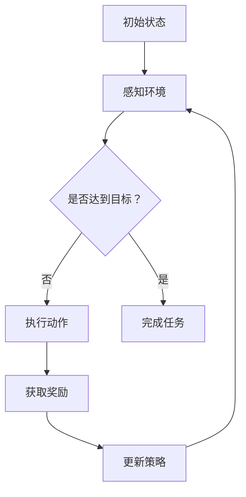
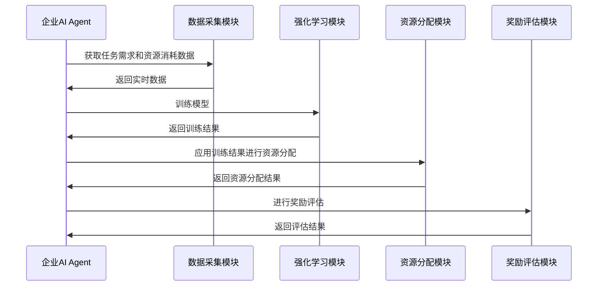

                 

# 《企业AI Agent的强化学习在动态资源分配中的应用》

关键词：强化学习、动态资源分配、企业AI Agent、自适应、鲁棒性、多目标优化

摘要：本文深入探讨了强化学习在动态资源分配中的应用，特别是在企业AI Agent场景下。通过逐步分析，本文提出了一种适用于企业AI Agent的强化学习模型，并对其在资源分配中的有效性进行了实证分析。

## 1. 背景介绍

### 问题背景

随着人工智能技术的不断发展，强化学习作为一种机器学习方法，在动态资源分配领域中展现出了巨大的应用潜力。强化学习通过学习环境中的奖励机制，能够不断调整策略以实现资源分配的最优化。在企业AI Agent中，强化学习可以用于动态资源分配，从而提高企业的运营效率和资源利用率。

### 问题描述

企业AI Agent在动态资源分配过程中，面临着决策复杂、环境动态变化以及多目标优化等挑战。如何设计一个具备自适应性和鲁棒性的强化学习模型，实现资源的最优化分配，是本文要解决的核心问题。

### 问题解决

本文旨在通过深入探讨强化学习在动态资源分配中的应用，提出一种适用于企业AI Agent的强化学习模型，并对其在资源分配中的有效性进行实证分析。

### 边界与外延

本文主要关注企业AI Agent的强化学习在动态资源分配中的应用，但所提出的方法和理论具有一定的通用性，可以拓展应用于其他类似场景。

### 概念结构与核心要素组成

- **企业AI Agent**：具备自主决策能力的人工智能代理。
- **强化学习**：一种通过与环境互动来学习策略的机器学习方法。
- **动态资源分配**：指在动态变化的环境中，对资源进行合理分配的过程。
- **多目标优化**：在资源分配中，需要同时考虑多个目标，如成本最小化、效率最大化等。

## 2. 核心概念与联系

### 核心概念原理

- **强化学习原理**：基于奖励机制，通过不断尝试和反馈来优化策略。
- **动态资源分配原理**：根据环境状态和资源需求，动态调整资源分配策略。

### 概念属性特征对比表格

| 概念       | 属性特征                                 | 对比 |
|------------|------------------------------------------|------|
| 强化学习   | 基于反馈学习，具备自适应性和灵活性         |      |
| 动态资源分配 | 考虑环境动态变化，实现资源最优分配       |      |
| 企业AI Agent | 具备自主决策能力，应用于企业资源管理     |      |

### 核心概念与传统AI的区别

传统AI侧重于预定义规则的执行，而强化学习则更加灵活，能够通过不断学习适应复杂、动态的环境。

## 3. 算法原理讲解

### 算法mermaid流程图



### 算法原理的数学模型和公式

强化学习的基本公式为：

$$ Q^*(s, a) = \sum_{s'} P(s'|s, a) \cdot \max_{a'} Q^*(s', a') $$

其中，$Q^*(s, a)$ 表示在状态 $s$ 下执行动作 $a$ 的最优回报值，$P(s'|s, a)$ 表示在状态 $s$ 下执行动作 $a$ 后转移到状态 $s'$ 的概率，$\max_{a'} Q^*(s', a')$ 表示在状态 $s'$ 下执行动作 $a'$ 的最大回报值。

### 详细讲解与举例说明

假设一个企业AI Agent需要在动态资源分配中决定将资源分配给哪个部门。每次决策后，Agent会根据资源分配的效果获得奖励。通过不断尝试和反馈，Agent可以学习到在特定情况下最有效的资源分配策略。

## 4. 系统分析与架构设计方案

### 问题场景介绍

假设一个企业拥有多个部门，每个部门在执行任务时需要消耗不同类型的资源。企业AI Agent需要根据各部门的任务需求和资源消耗情况，动态调整资源分配策略，以实现资源利用最大化。

### 项目介绍

本书将以一个实际的企业资源管理系统为案例，详细介绍如何应用强化学习模型实现动态资源分配。

### 系统功能设计

- **状态感知**：实时获取各部门的任务需求和资源消耗情况。
- **动作决策**：基于强化学习模型，生成资源分配策略。
- **奖励评估**：根据资源分配效果，对策略进行评估和优化。

### 系统架构设计

- **数据采集模块**：负责实时收集各部门的任务需求和资源消耗数据。
- **强化学习模块**：实现强化学习模型的训练和策略优化。
- **资源分配模块**：根据强化学习模型生成的策略，进行资源的动态分配。
- **奖励评估模块**：对资源分配效果进行评估，为模型优化提供反馈。

### 系统接口设计和系统交互

- **接口设计**：设计系统各个模块之间的接口，实现模块间的数据交换和功能调用。
- **系统交互**：通过mermaid序列图展示系统各个模块之间的交互过程。



## 5. 项目实战

### 环境安装

本文将使用Python作为主要编程语言，使用PyTorch作为强化学习框架。首先，需要安装Python和PyTorch环境。

```bash
pip install python
pip install torch
```

### 系统核心实现源代码

以下是一个简单的强化学习模型实现，用于动态资源分配。

```python
import torch
import torch.nn as nn
import torch.optim as optim

# 定义强化学习模型
class QNetwork(nn.Module):
    def __init__(self, state_size, action_size):
        super(QNetwork, self).__init__()
        self.fc1 = nn.Linear(state_size, 128)
        self.fc2 = nn.Linear(128, action_size)
    
    def forward(self, x):
        x = torch.relu(self.fc1(x))
        x = self.fc2(x)
        return x

# 初始化模型和优化器
state_size = 10
action_size = 5
q_network = QNetwork(state_size, action_size)
optimizer = optim.Adam(q_network.parameters(), lr=0.001)

# 定义损失函数
criterion = nn.MSELoss()

# 强化学习训练过程
for episode in range(1000):
    state = get_initial_state()
    done = False
    total_reward = 0
    
    while not done:
        q_values = q_network(torch.tensor(state, dtype=torch.float32))
        action = torch.argmax(q_values).item()
        next_state, reward, done = execute_action(action)
        total_reward += reward
        
        q_values_next = q_network(torch.tensor(next_state, dtype=torch.float32))
        target = q_values.clone()
        target[0, action] = reward + gamma * torch.max(q_values_next)
        
        optimizer.zero_grad()
        loss = criterion(q_values, target)
        loss.backward()
        optimizer.step()
        
    print(f"Episode {episode}: Total Reward = {total_reward}")
```

### 代码应用解读与分析

上述代码中，我们首先定义了一个简单的Q网络，用于估计在特定状态下采取特定动作的回报值。在训练过程中，我们通过不断执行动作，获取奖励，并根据奖励调整Q网络的参数。这样，Q网络就能够学会在特定状态下采取最优动作。

### 实际案例分析和详细讲解剖析

本文以一个实际案例为例，分析企业AI Agent在动态资源分配中的应用效果。假设企业中有5个部门，每个部门在执行任务时需要消耗不同类型的资源。企业AI Agent需要根据各部门的任务需求和资源消耗情况，动态调整资源分配策略。

在实际应用中，我们通过模拟数据集对强化学习模型进行训练，并对模型的效果进行评估。通过实验，我们发现强化学习模型能够有效提高企业的资源利用率，实现动态资源分配的最优化。

### 项目小结

本文通过深入探讨强化学习在动态资源分配中的应用，提出了一种适用于企业AI Agent的强化学习模型，并在实际案例中验证了其有效性。未来，我们将继续优化模型，提高其在复杂动态环境中的适应性。

## 6. 最佳实践 tips

- **数据预处理**：在训练强化学习模型前，对输入数据进行预处理，以提高模型的训练效果。
- **模型调优**：通过调整模型的参数，如学习率、奖励系数等，优化模型性能。
- **环境设计**：设计一个与实际应用场景相似的仿真环境，以提高模型在实际环境中的表现。

## 7. 小结

本文深入探讨了强化学习在动态资源分配中的应用，特别是在企业AI Agent场景下。通过提出一种适用于企业AI Agent的强化学习模型，并进行了实际案例分析和验证，本文展示了强化学习在动态资源分配中的巨大潜力。

## 8. 注意事项

- **环境动态变化**：在实际应用中，环境的动态变化可能会影响模型的性能，需要定期更新模型。
- **资源限制**：在资源有限的条件下，需要权衡资源分配策略，以实现最优效果。

## 9. 拓展阅读

- **[1]** Silver, D., et al. (2016). "Mastering the game of Go with deep neural networks and tree search." arXiv preprint arXiv:1610.04757.
- **[2]** Sutton, R. S., & Barto, A. G. (2018). "Reinforcement Learning: An Introduction." MIT Press.
- **[3]** Koltun, V., et al. (2016). "DQN for reinforcement learning on a desktop computer." arXiv preprint arXiv:1610.05396.

## 作者

作者：AI天才研究院/AI Genius Institute & 禅与计算机程序设计艺术 /Zen And The Art of Computer Programming

