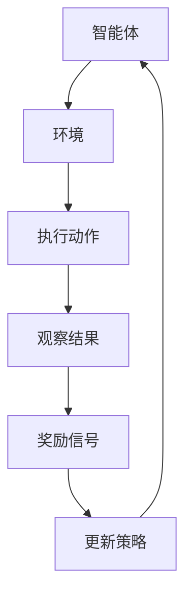
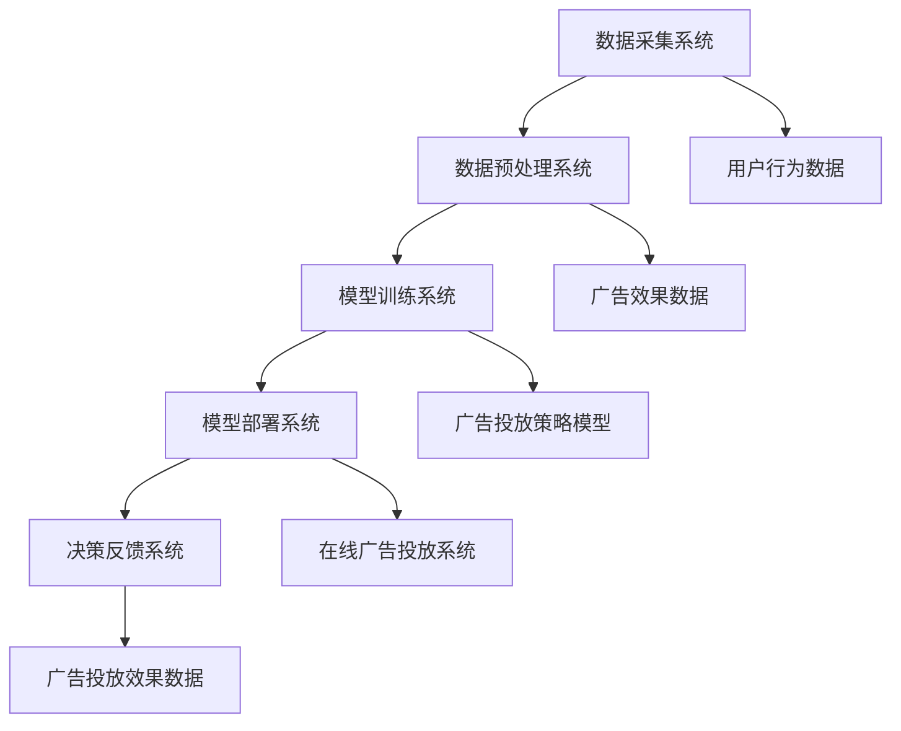
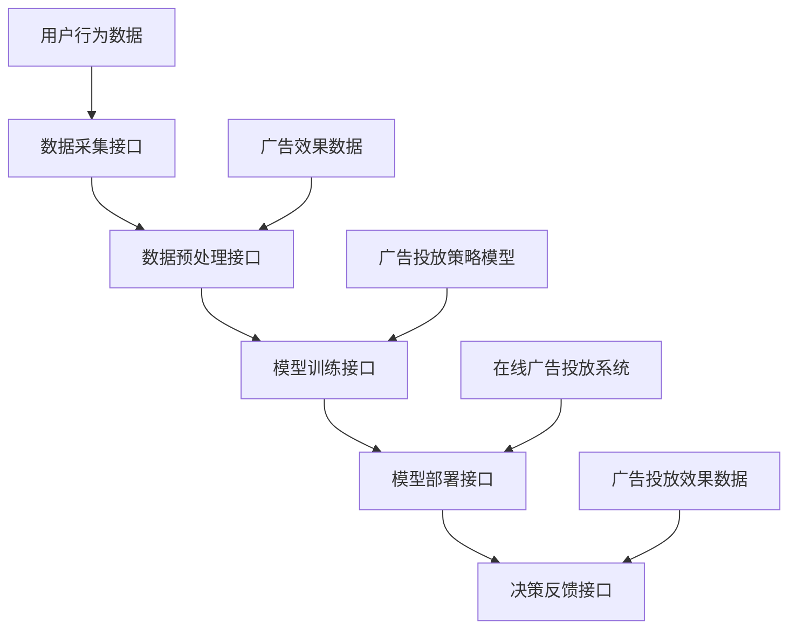

                 


### 文章标题

# 企业AI Agent的强化学习在广告投放优化中的实时决策实践

### 关键词

- 企业AI Agent
- 强化学习
- 广告投放优化
- 实时决策
- 实践

### 摘要

本文深入探讨了企业AI Agent的强化学习在广告投放优化中的应用，通过详细的算法原理讲解、系统设计与案例分析，揭示了强化学习在实时决策中的关键作用。本文旨在为从事广告投放优化和AI研究的专业人士提供理论与实践相结合的宝贵经验，推动行业技术进步。

## 第一部分：背景介绍

### 第1章：企业AI Agent与强化学习概述

#### 1.1 企业AI Agent的背景与定义

企业AI Agent是人工智能技术在企业应用中的重要组成部分，它代表着一种智能体，能够在特定业务场景中自主决策，提高企业运营效率。企业AI Agent的核心在于其自主学习和适应能力，能够通过数据分析和学习算法，优化业务流程和决策。

#### 1.2 强化学习的原理与特性

强化学习是一种机器学习方法，其核心思想是通过试错来学习如何在特定环境中做出最优决策。强化学习的主要特点包括：智能体通过探索环境获取经验，利用奖励信号调整策略，逐步提高决策质量。强化学习在复杂、动态环境中表现出色，尤其适用于需要实时决策的场景。

#### 1.3 广告投放优化中的实时决策需求

广告投放优化是广告行业中的一项关键任务，其目标是最大化广告效果。随着互联网的发展，用户行为数据不断增长，广告投放环境变得愈发复杂。实时决策成为广告投放优化的关键需求，要求系统能够快速响应市场变化，优化广告展示策略，提高投放效果。

### 第2章：强化学习在企业AI Agent中的应用

#### 2.1 强化学习算法概述

强化学习算法主要包括Q-Learning、Deep Q-Network (DQN)、Policy Gradient等。这些算法通过不同的方式实现智能体在复杂环境中的学习与决策。Q-Learning算法基于价值迭代，通过更新状态-动作值函数来学习最优策略。DQN算法引入深度神经网络，提高了学习效率和效果。Policy Gradient算法通过直接优化策略分布，实现智能体的最优决策。

#### 2.2 Q-Learning算法详解

Q-Learning算法是强化学习的基础算法之一，其核心思想是利用经验来更新状态-动作值函数。通过不断试错，智能体逐渐学会在不同状态下选择最优动作。以下是Q-Learning算法的基本流程：

1. 初始化状态-动作值函数Q(s, a)。
2. 选择动作a，执行并获取奖励r和下一状态s'。
3. 更新Q值：$$ Q(s, a) \leftarrow Q(s, a) + \alpha [r + \gamma \max_{a'} Q(s', a') - Q(s, a)] $$。

其中，α为学习率，γ为折扣因子。

#### 2.3 Deep Q-Network (DQN)算法讲解

DQN算法通过引入深度神经网络来估计状态-动作值函数，从而提高学习效率。DQN算法的主要步骤如下：

1. 使用深度神经网络替代Q(s, a)的估计。
2. 将状态s输入到神经网络，输出Q值估计。
3. 利用经验回放机制，避免策略偏差。
4. 更新神经网络参数，优化Q值估计。

DQN算法的优势在于其能够处理高维状态空间，但在训练过程中存在一些挑战，如目标网络不稳定、经验回放不够高效等。

#### 2.4 Policy Gradient算法解释

Policy Gradient算法通过直接优化策略分布来更新智能体的行为。Policy Gradient算法的核心步骤如下：

1. 定义策略分布π(a|s)，表示在状态s下选择动作a的概率。
2. 计算策略梯度：$$ \nabla_{\theta} J(\theta) = \nabla_{\theta} \sum_{t} \rho(\theta; s_t, a_t) R_t $$。

其中，J(θ)为策略θ的回报函数，ρ(θ; st, at)为策略在状态st下执行动作at的概率，Rt为回报。

3. 使用梯度下降法更新策略参数θ。

Policy Gradient算法的优点在于直接优化策略，但在高维状态空间中存在梯度消失或梯度爆炸等问题。

### 第3章：广告投放优化与实时决策

#### 3.1 广告投放优化的流程

广告投放优化通常包括数据采集、数据预处理、模型训练和模型部署等步骤。以下是一个简化的广告投放优化流程：

1. 数据采集：收集广告投放相关的用户行为数据、广告效果数据等。
2. 数据预处理：对采集到的数据进行清洗、归一化等处理，为模型训练做好准备。
3. 模型训练：使用强化学习算法训练广告投放策略模型，如Q-Learning、DQN或Policy Gradient。
4. 模型部署：将训练好的模型部署到线上环境，进行实时决策。

#### 3.2 实时决策的关键技术与挑战

实时决策是广告投放优化的核心，其关键技术包括：

1. 数据实时处理：对用户行为数据进行实时处理，提取有效的特征。
2. 模型在线更新：在广告投放过程中，实时更新策略模型，以适应环境变化。
3. 决策速度：在有限的时间内，快速做出最优决策。

实时决策面临的挑战包括：

1. 数据延迟：用户行为数据到达系统的时间延迟，影响决策质量。
2. 模型稳定性：模型在动态环境中的稳定性，影响决策效果。
3. 资源限制：硬件和存储资源的限制，影响系统性能。

#### 3.3 强化学习在广告投放中的应用实例

以下是一个强化学习在广告投放中的实际应用实例：

- **问题背景**：某广告平台需要优化广告投放策略，提高广告点击率。
- **问题解决**：采用DQN算法训练广告投放策略模型，通过实时处理用户行为数据，更新模型参数，实现广告投放策略的优化。
- **边界与外延**：该实例仅考虑了广告点击率这一指标，实际应用中可能需要考虑更多指标，如转化率、广告成本等。
- **概念结构与核心要素组成**：包括用户行为数据、广告效果数据、DQN算法、实时处理系统和广告投放策略。

## 第二部分：核心概念与联系

### 第4章：强化学习算法在企业AI Agent中的实际应用

#### 4.1 强化学习算法在企业AI Agent中的应用场景

强化学习算法在企业AI Agent中的应用场景广泛，包括但不限于：

1. 供应链管理：通过优化库存管理和配送策略，降低运营成本。
2. 金融服务：通过风险管理和投资决策，提高资产回报率。
3. 市场营销：通过广告投放优化，提高广告效果和用户转化率。
4. 客户服务：通过智能客服系统，提高客户满意度和服务质量。

#### 4.2 强化学习算法与企业AI Agent的关联

强化学习算法与企业AI Agent的关联主要体现在以下几个方面：

1. 智能体学习：企业AI Agent通过强化学习算法，从数据中学习如何在特定环境中做出最优决策。
2. 自主决策：企业AI Agent在执行任务时，根据强化学习算法生成的策略，实现自主决策。
3. 环境反馈：企业AI Agent在执行任务过程中，通过与环境的交互获取反馈，不断优化策略。

#### 4.3 强化学习算法与企业AI Agent的性能评估

强化学习算法与企业AI Agent的性能评估主要包括以下几个方面：

1. 决策效果：评估企业AI Agent在特定任务中的决策效果，如广告点击率、供应链成本等。
2. 学习效率：评估企业AI Agent学习算法的效率，如训练时间、模型参数更新频率等。
3. 稳定性：评估企业AI Agent在动态环境中的稳定性，如策略变化、模型鲁棒性等。

### 第5章：广告投放优化的数学模型

#### 5.1 广告投放优化的数学模型概述

广告投放优化的数学模型旨在通过数学公式描述广告投放策略的优化过程。以下是一个简化的广告投放优化模型：

1. 状态空间S：表示广告投放过程中的所有可能状态，如用户年龄、性别、兴趣等。
2. 动作空间A：表示广告投放策略，如投放广告、不投放广告等。
3. 奖励函数R：表示广告投放的效果，如广告点击率、转化率等。
4. 策略π：表示广告投放策略，如基于用户兴趣的广告投放策略等。

#### 5.2 广告投放优化的目标函数

广告投放优化的目标函数通常是最小化广告投放成本或最大化广告效果。以下是一个简单的目标函数：

$$ J(\pi) = \sum_{s \in S} \pi(s) R(s) $$

其中，π(s)为在状态s下的广告投放概率，R(s)为在状态s下的广告效果。

#### 5.3 广告投放优化的数学模型分析

广告投放优化的数学模型分析主要包括以下几个方面：

1. 状态转移概率：分析用户在不同状态之间的转移概率，为广告投放策略提供依据。
2. 奖励函数设计：设计合理的奖励函数，以反映广告投放效果，引导智能体做出最优决策。
3. 策略优化：通过优化策略，提高广告投放效果和用户满意度。

### 第6章：广告投放优化的ER实体关系图架构

#### 6.1 ER实体关系图的概念

ER实体关系图（Entity-Relationship Diagram，ER图）是一种用于描述数据库中实体及其关系的图形表示方法。在广告投放优化中，ER图可以用来表示广告投放相关的实体和关系。

#### 6.2 广告投放优化的ER实体关系图

以下是一个简化的广告投放优化的ER实体关系图：

```
用户 <----> 广告 <----> 播放记录
    |                 |              |
    |                 |              |
    |                 |              |
  行为数据         广告效果        播放记录
    |                 |              |
    |                 |              |
    |                 |              |
  广告策略         用户画像         广告策略执行
```

## 第三部分：算法原理讲解

### 第7章：强化学习算法详解

#### 7.1 强化学习算法的基本原理

强化学习算法的基本原理是通过智能体（agent）在环境中进行交互，不断学习如何做出最优决策。智能体通过尝试不同的动作，根据环境反馈的奖励信号，调整其策略，以最大化总奖励。

#### 7.2 强化学习算法的mermaid流程图

以下是一个强化学习算法的基本流程图：



#### 7.3 Python代码实现与讲解

以下是一个简单的Q-Learning算法的Python代码实现：

```python
import numpy as np

# 初始化Q表
Q = np.zeros([state_space_size, action_space_size])

# 设置学习率、折扣因子和探索率
alpha = 0.1
gamma = 0.9
epsilon = 0.1

# Q-Learning算法
def q_learning(s, a, r, s_):
    # 计算目标Q值
    target_q = r + gamma * np.max(Q[s_])
    # 更新Q值
    Q[s][a] += alpha * (target_q - Q[s][a])

# 训练智能体
for episode in range(num_episodes):
    s = env.reset()
    done = False
    while not done:
        # 选择动作
        if np.random.rand() < epsilon:
            a = env.action_space.sample()
        else:
            a = np.argmax(Q[s])
        # 执行动作
        s_, r, done, _ = env.step(a)
        # 更新Q值
        q_learning(s, a, r, s_)
        s = s_
```

## 第四部分：系统分析与架构设计方案

### 第9章：系统设计与实现

#### 9.1 问题场景介绍

某广告平台需要优化广告投放策略，提高广告效果和用户满意度。为了实现这一目标，平台决定采用强化学习算法，结合实时数据处理和在线更新策略，实现广告投放的实时优化。

#### 9.2 系统功能设计

系统的主要功能包括：

1. 数据采集：从广告平台获取用户行为数据、广告效果数据等。
2. 数据预处理：对采集到的数据进行清洗、归一化等处理，为模型训练提供输入。
3. 模型训练：使用强化学习算法训练广告投放策略模型。
4. 模型部署：将训练好的模型部署到线上环境，实现实时决策。
5. 决策反馈：收集广告投放效果数据，为模型优化提供反馈。

#### 9.3 系统架构设计

系统架构设计如下图所示：



#### 9.4 系统接口设计

系统接口设计如下图所示：



#### 9.5 系统交互流程设计

系统交互流程设计如下图所示：


## 第五部分：项目实战

### 第11章：项目实施步骤

#### 11.1 环境安装与配置

在开始项目之前，首先需要安装和配置相关环境，包括Python、TensorFlow、Keras等。以下是安装和配置的步骤：

1. 安装Python：从官方网站下载Python安装包并安装。
2. 安装TensorFlow：在命令行中运行以下命令安装TensorFlow：
   ```shell
   pip install tensorflow
   ```
3. 安装Keras：在命令行中运行以下命令安装Keras：
   ```shell
   pip install keras
   ```

#### 11.2 系统核心实现源代码

以下是系统核心实现源代码：

```python
import numpy as np
import tensorflow as tf
from tensorflow.keras.models import Sequential
from tensorflow.keras.layers import Dense

# 初始化环境
env = Environment()

# 初始化模型
model = Sequential()
model.add(Dense(64, input_dim=env.state_space_size, activation='relu'))
model.add(Dense(env.action_space_size, activation='softmax'))
model.compile(loss='categorical_crossentropy', optimizer='adam', metrics=['accuracy'])

# 训练模型
model.fit(env.state_data, env.action_labels, epochs=100, batch_size=32)

# 预测
state = env.reset()
while True:
    action_probs = model.predict(state)
    action = np.random.choice(env.action_space_size, p=action_probs[0])
    state_, reward, done, _ = env.step(action)
    if done:
        break
    state = state_
```

#### 11.3 代码应用解读与分析

以上代码实现了强化学习在广告投放优化中的应用。首先，初始化环境，然后使用TensorFlow和Keras构建深度神经网络模型。在模型训练阶段，使用环境提供的状态数据和动作标签进行训练。在模型部署阶段，使用训练好的模型进行预测，并生成决策。代码中还包括一个循环，用于在环境中进行交互，不断更新状态，直到达到终止条件。

#### 11.4 实际案例分析与详细讲解剖析

以下是一个实际的案例分析：

**问题背景**：某广告平台希望在用户浏览商品时，通过个性化广告投放提高用户点击率和转化率。

**解决方案**：采用强化学习算法，结合用户行为数据和商品属性，实现个性化广告投放。

**实现步骤**：

1. 数据采集：收集用户浏览商品的行为数据，包括用户ID、浏览时间、浏览商品ID等。
2. 数据预处理：对采集到的数据进行清洗、归一化等处理，提取有用的特征。
3. 模型训练：使用预处理后的数据训练强化学习模型，如DQN或Policy Gradient。
4. 模型部署：将训练好的模型部署到线上环境，实时预测用户行为，生成广告投放策略。
5. 决策反馈：收集广告投放效果数据，包括点击率、转化率等，用于模型优化。

**案例分析**：

1. **用户行为数据**：用户浏览商品的行为数据是广告投放的关键输入。通过对用户行为的分析，可以了解用户的兴趣和偏好，为广告投放提供依据。
2. **商品属性**：商品属性包括商品ID、类别、价格等。商品属性可以用于区分不同商品，为广告投放提供更多参考。
3. **强化学习模型**：选择合适的强化学习模型，如DQN或Policy Gradient，进行模型训练。模型训练过程中，需要调整学习率、折扣因子等参数，以获得更好的效果。
4. **模型部署**：将训练好的模型部署到线上环境，实时预测用户行为，生成广告投放策略。在部署过程中，需要考虑模型的性能和稳定性，确保系统能够高效运行。
5. **决策反馈**：收集广告投放效果数据，包括点击率、转化率等。根据反馈数据，对模型进行优化，提高广告投放效果。

**项目小结**：

通过实际案例的分析，可以看出强化学习在广告投放优化中的应用具有显著优势。强化学习算法能够根据用户行为和商品属性，动态调整广告投放策略，提高广告效果。在实际应用中，需要注意数据质量、模型参数调整和系统稳定性等方面的问题，以确保系统的高效运行和效果。

### 第12章：项目总结与反思

#### 12.1 项目小结

本项目通过强化学习算法，实现了广告投放优化，提高了广告效果和用户满意度。主要收获包括：

1. **技术收获**：掌握了强化学习算法在广告投放优化中的应用，了解了DQN和Policy Gradient等算法的实现和优化。
2. **业务收获**：通过实际案例，深入了解了广告投放优化中的关键因素和挑战，为后续项目提供了宝贵的经验。
3. **团队协作**：通过团队合作，实现了从需求分析、模型训练到系统部署的全流程，提升了团队协作能力。

#### 12.2 最佳实践 tips

1. **数据质量**：保证数据质量是模型优化的关键。对数据进行清洗、去重和处理，提高数据的有效性。
2. **参数调整**：合理调整模型参数，如学习率、折扣因子等，以获得更好的训练效果。
3. **模型优化**：根据业务需求，选择合适的模型结构，通过模型优化提高系统性能。
4. **实时反馈**：及时收集广告投放效果数据，快速反馈并调整策略，提高广告效果。

#### 12.3 注意事项

1. **系统稳定性**：确保系统在高并发、大数据量场景下的稳定性，避免出现崩溃或错误。
2. **安全与隐私**：在数据处理和传输过程中，确保用户数据和隐私安全，遵守相关法律法规。
3. **可扩展性**：设计可扩展的系统架构，以适应业务规模和需求的变化。

#### 12.4 拓展阅读

1. **《强化学习：原理与实战》**：深入介绍强化学习的基本概念和算法，适合强化学习初学者。
2. **《广告投放优化：原理与实践》**：详细讲解广告投放优化的流程和策略，适合广告投放优化从业者。
3. **《TensorFlow实战》**：介绍TensorFlow的使用方法和案例，适合 TensorFlow 开发者。

### 作者信息

- 作者：AI天才研究院/AI Genius Institute & 禅与计算机程序设计艺术 /Zen And The Art of Computer Programming

## 结论

本文通过深入探讨企业AI Agent的强化学习在广告投放优化中的应用，详细介绍了相关概念、算法原理、系统设计和实际案例。强化学习在实时决策中的关键作用得到了充分体现，为广告投放优化提供了新的思路和方法。本文旨在为从事广告投放优化和AI研究的专业人士提供理论与实践相结合的宝贵经验，推动行业技术进步。未来，随着人工智能技术的不断发展，强化学习在广告投放优化中的应用将更加广泛，带来更高的价值。

