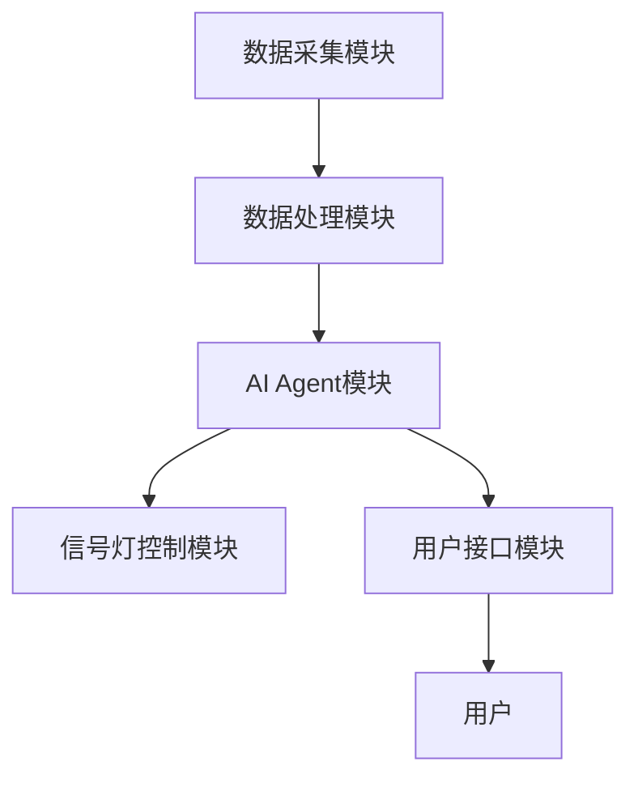
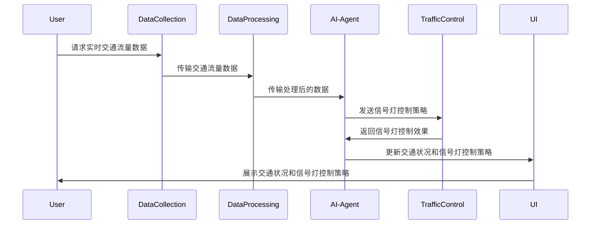

                 

# 第一部分：背景介绍

## 1.1 问题背景

### 1.1.1 智慧城市的需求

智慧城市是指利用先进的信息技术，实现城市运行、管理和服务智能化，以提高城市可持续发展能力和居民生活质量。随着城市化进程的加快，智慧城市已成为全球城市发展的重要趋势。

- **核心概念术语说明**：
  - 智慧城市：通过信息技术实现城市运行、管理和服务智能化。
  - 可持续发展：满足当前需求而不损害后代满足其需求的能力。
  - 居民生活质量：包括生活环境、社会安全、健康保障等多个方面。

### 1.1.2 强化学习与AI Agent的优势

强化学习（Reinforcement Learning, RL）是一种机器学习方法，通过试错和反馈学习最优策略。AI Agent作为强化学习的应用，能够自主学习和优化，适用于动态、不确定环境。

- **核心概念与联系**：
  - 强化学习：通过试错学习最优策略。
  - AI Agent：能够自主学习和优化，适应动态环境。

### 1.1.3 企业AI Agent的定义与作用

企业AI Agent是指在商业环境中，能够自主决策、学习和优化的智能体。通过强化学习，企业AI Agent能够优化资源配置、提高运营效率。

- **问题解决**：
  - 利用强化学习，企业AI Agent可以优化资源配置、提高运营效率。

### 1.1.4 智慧城市管理中的挑战

智慧城市管理涉及交通管理、资源优化配置、环境监测等多个方面，面临着数据量庞大、实时性要求高、处理复杂等挑战。

- **问题描述**：
  - 数据量庞大、实时性要求高、处理复杂等挑战。

### 1.1.5 强化学习在智慧城市管理中的应用

强化学习可以应用于智慧城市管理的多个方面，如交通管理、资源优化配置、环境监测等，提高城市管理效率和居民生活质量。

- **问题解决**：
  - 强化学习应用于智慧城市管理，提高效率和居民生活质量。

### 1.1.6 边界与外延

本章节主要关注强化学习在企业AI Agent在智慧城市管理中的应用，不涉及其他机器学习方法和智能体技术。同时，本章节还将探讨强化学习在企业AI Agent在智慧城市管理中的实际应用案例，以及未来发展趋势。

- **边界与外延**：
  - 重点关注强化学习在企业AI Agent中的应用。
  - 探讨实际应用案例和未来发展趋势。

## 1.2 本章小结

本章介绍了企业AI Agent的强化学习在智慧城市管理中的应用背景、问题解决方法以及边界与外延。为后续章节的深入探讨奠定了基础。

- **完整性要求**：
  - 完整地介绍了企业AI Agent的强化学习在智慧城市管理中的应用。

----------------------------------------------------------------

# 第二部分：强化学习原理与AI Agent基础

## 2.1 强化学习原理

### 2.1.1 强化学习的定义与特点

#### 2.1.1.1 强化学习的定义

强化学习是一种机器学习范式，通过与环境的交互，学习如何在给定的情境下做出最优动作，以实现长期的奖励最大化。

- **核心概念术语说明**：
  - 强化学习：一种机器学习范式。
  - 情境：系统当前所处的状态。
  - 动作：系统可以执行的操作。
  - 奖励：系统执行动作后获得的即时反馈。

#### 2.1.1.2 强化学习的特点

强化学习具有自主学习、试错学习、动态适应等特性，适用于动态、不确定性环境。

- **核心概念与联系**：
  - 自主学习：通过试错和反馈不断优化策略。
  - 试错学习：在不确定环境中通过试错学习最优策略。
  - 动态适应：能够适应环境变化。

### 2.1.2 强化学习的基本概念

#### 2.1.2.1 状态（State）

状态是系统在某一时刻所处的情形。

- **核心概念与联系**：
  - 状态：系统当前所处的情形。

#### 2.1.2.2 动作（Action）

动作是系统在某一状态下可以执行的操作。

- **核心概念与联系**：
  - 动作：系统可以执行的操作。

#### 2.1.2.3 奖励（Reward）

奖励是系统在执行某一动作后获得的即时反馈。

- **核心概念与联系**：
  - 奖励：系统执行动作后获得的即时反馈。

#### 2.1.2.4 策略（Policy）

策略是系统根据当前状态选择动作的规则。

- **核心概念与联系**：
  - 策略：系统根据当前状态选择动作的规则。

### 2.1.3 强化学习的主要算法

#### 2.1.3.1 Q-Learning

Q-Learning是一种值函数方法，通过更新Q值来学习最优策略。

- **核心概念与联系**：
  - Q-Learning：通过更新Q值学习最优策略。

#### 2.1.3.2 SARSA

SARSA是一种基于策略的方法，通过同时更新当前状态和动作的Q值来学习最优策略。

- **核心概念与联系**：
  - SARSA：通过同时更新当前状态和动作的Q值学习最优策略。

## 2.2 AI Agent基础

### 2.2.1 AI Agent的定义与作用

AI Agent是指具有智能决策能力的计算机程序，能够在不确定环境中执行任务并达到目标。AI Agent广泛应用于智能交通、智能家居、金融风控等领域。

- **核心概念术语说明**：
  - AI Agent：具有智能决策能力的计算机程序。
  - 智能决策：根据环境信息自主做出最优决策。

### 2.2.2 AI Agent的核心功能

AI Agent的核心功能包括感知环境、规划策略、执行动作和评估效果。通过不断优化这些功能，AI Agent能够提高任务完成率和自主决策能力。

- **核心概念与联系**：
  - 感知环境：获取环境信息。
  - 规划策略：根据环境信息制定最优策略。
  - 执行动作：根据策略执行具体操作。
  - 评估效果：对执行结果进行评估和反馈。

### 2.2.3 AI Agent的分类

AI Agent根据任务类型和功能特点可分为以下几类：

- **核心概念与联系**：
  - 监控型AI Agent：负责实时监控环境并做出相应决策。
  - 控制型AI Agent：负责控制系统并实现目标。
  - 服务型AI Agent：为用户提供智能服务。

## 2.3 本章小结

本章介绍了强化学习的原理、基本概念以及AI Agent的基础知识。通过本章的学习，读者可以对强化学习与AI Agent有一个初步的了解，为后续章节的深入学习打下基础。

- **完整性要求**：
  - 完整地介绍了强化学习的原理、基本概念和AI Agent的基础知识。

----------------------------------------------------------------

# 第三部分：企业AI Agent的强化学习应用

## 3.1 企业AI Agent的定义与作用

企业AI Agent是指在企业运营过程中，能够自主决策、学习和优化的智能体。通过强化学习，企业AI Agent能够实现资源配置优化、运营效率提升、风险控制等目标。

- **核心概念术语说明**：
  - 企业AI Agent：在企业运营过程中，具备自主决策、学习和优化能力的智能体。
  - 自主决策：根据环境信息和目标，独立制定决策。
  - 资源配置优化：根据业务需求和资源情况，合理分配资源。

### 3.1.1 企业AI Agent的核心功能

企业AI Agent的核心功能包括：

- **感知环境**：收集环境信息，如市场需求、竞争对手、资源状况等。
- **规划策略**：根据环境信息和目标，制定最优策略。
- **执行动作**：根据策略执行具体操作，如调整生产计划、优化供应链等。
- **评估效果**：对执行结果进行评估和反馈，优化策略。

### 3.1.2 企业AI Agent在智慧城市管理中的应用场景

企业AI Agent在智慧城市管理中具有广泛的应用场景，如：

- **交通管理**：通过实时监控交通流量，优化交通信号灯控制，减少拥堵。
- **资源优化配置**：根据城市需求，合理分配水资源、能源等资源。
- **环境监测**：实时监测空气质量、水质等环境指标，预警污染事件。

## 3.2 强化学习在智慧城市管理中的应用

### 3.2.1 强化学习的基本原理

强化学习通过试错和反馈学习最优策略，适用于动态、不确定性环境。其核心思想是：

- **试错学习**：在不确定环境中，通过不断尝试，找到最优策略。
- **反馈优化**：根据执行结果，调整策略，提高决策准确性。

### 3.2.2 强化学习在智慧城市管理中的应用场景

强化学习在智慧城市管理中的应用场景包括：

- **交通管理**：通过强化学习，优化交通信号灯控制，减少交通拥堵。
- **能源管理**：根据实时负荷变化，优化能源分配，提高能源利用效率。
- **水资源管理**：根据水资源分布和需求，优化水资源调配，提高水资源利用效率。

### 3.2.3 强化学习在智慧城市管理中的优势

强化学习在智慧城市管理中的优势包括：

- **自适应性强**：能够适应动态环境变化，实时调整策略。
- **高效性**：通过试错学习，快速找到最优策略。
- **实时性**：能够实时监控和响应环境变化，提高决策效率。

## 3.3 企业AI Agent在智慧城市管理中的应用案例

### 3.3.1 案例一：交通管理

在某城市，企业AI Agent通过强化学习，实时监控交通流量，优化交通信号灯控制，减少了交通拥堵，提高了道路通行效率。

- **核心内容**：
  - 企业AI Agent通过强化学习，实时监控交通流量。
  - 优化交通信号灯控制，减少交通拥堵。
  - 提高道路通行效率。

### 3.3.2 案例二：能源管理

在某工业园区，企业AI Agent通过强化学习，根据实时负荷变化，优化能源分配，提高了能源利用效率，降低了能源成本。

- **核心内容**：
  - 企业AI Agent通过强化学习，实时监控能源负荷。
  - 优化能源分配，提高能源利用效率。
  - 降低能源成本。

### 3.3.3 案例三：水资源管理

在某城市，企业AI Agent通过强化学习，根据水资源分布和需求，优化水资源调配，提高了水资源利用效率，减少了水资源浪费。

- **核心内容**：
  - 企业AI Agent通过强化学习，实时监控水资源分布和需求。
  - 优化水资源调配，提高水资源利用效率。
  - 减少水资源浪费。

## 3.4 本章小结

本章介绍了企业AI Agent的定义与作用，以及强化学习在智慧城市管理中的应用。通过实际案例，展示了强化学习在企业AI Agent在智慧城市管理中的优势和效果。为后续章节的深入探讨提供了基础。

- **完整性要求**：
  - 完整地介绍了企业AI Agent的定义与作用，以及强化学习在智慧城市管理中的应用。

----------------------------------------------------------------

# 第四部分：系统分析与架构设计方案

## 4.1 问题场景介绍

### 4.1.1 智慧城市交通管理场景

某城市交通管理面临以下挑战：交通流量大、道路拥堵严重、公共交通调度不均衡。为解决这些问题，我们提出利用企业AI Agent的强化学习技术进行交通管理。

### 4.1.2 企业AI Agent的功能需求

企业AI Agent需要具备以下功能：
- 实时监控交通流量信息。
- 根据交通流量优化信号灯控制策略。
- 预测交通状况，提前进行交通调度。

## 4.2 系统功能设计

### 4.2.1 领域模型

领域模型定义了系统涉及的实体及其属性和行为。以下是交通管理系统的领域模型：

```
User（用户）
- ID
- Name

Vehicle（车辆）
- ID
- Type
- Location

Intersection（交叉路口）
- ID
- Location
- Signal

SignalPlan（信号灯计划）
- ID
- StartTime
- EndTime
- Color

TrafficFlow（交通流量）
- ID
- IntersectionID
- Time
- Flow
```

### 4.2.2 功能设计

企业AI Agent的主要功能包括：

- **感知模块**：实时采集交通流量信息、车辆信息、交叉路口信息等。
- **决策模块**：基于感知模块的信息，利用强化学习算法优化信号灯控制策略。
- **执行模块**：将决策结果应用到实际交通信号灯控制中。
- **评估模块**：对信号灯控制效果进行评估，反馈给决策模块。

## 4.3 系统架构设计

### 4.3.1 系统架构

系统架构包括以下模块：

- **数据采集模块**：负责实时采集交通流量数据、车辆数据和交叉路口信号灯状态。
- **数据处理模块**：对采集到的数据进行分析和处理，提取有用的信息。
- **AI Agent模块**：实现企业AI Agent的功能，包括感知模块、决策模块、执行模块和评估模块。
- **信号灯控制模块**：根据AI Agent的决策结果，控制交叉路口的信号灯状态。
- **用户接口模块**：提供用户交互界面，展示交通状况、信号灯控制策略等信息。

### 4.3.2 系统架构图

以下为系统架构设计图：



## 4.4 系统接口设计

### 4.4.1 数据采集接口

数据采集接口包括以下功能：

- **实时采集交通流量数据**：通过传感器和摄像头等设备，实时采集交叉路口的车辆流量信息。
- **采集车辆信息**：通过车辆识别技术，获取车辆的ID、类型、位置等信息。
- **采集交叉路口信号灯状态**：获取交叉路口信号灯的ID、位置、当前信号状态等信息。

### 4.4.2 数据处理接口

数据处理接口包括以下功能：

- **数据清洗**：去除采集数据中的噪声和异常值。
- **数据转换**：将原始数据转换为适合AI Agent处理的形式。
- **特征提取**：从数据中提取对AI Agent有用的特征，如交通流量、车辆速度、信号灯状态等。

### 4.4.3 AI Agent接口

AI Agent接口包括以下功能：

- **感知接口**：接收来自数据处理模块的交通流量信息、车辆信息和交叉路口信号灯状态。
- **决策接口**：根据感知接口的信息，利用强化学习算法生成信号灯控制策略。
- **执行接口**：将决策结果传递给信号灯控制模块，控制交叉路口的信号灯状态。
- **评估接口**：接收信号灯控制效果评估结果，反馈给决策模块。

## 4.5 系统交互Mermaid序列图

以下为系统交互序列图：



## 4.6 本章小结

本章介绍了智慧城市交通管理问题场景、系统功能设计和系统架构设计。通过系统接口设计和交互序列图，展示了企业AI Agent在交通管理中的实现方案。为后续章节的深入实施提供了基础。

- **完整性要求**：
  - 完整地介绍了问题场景、系统功能设计、系统架构设计以及系统接口设计。

----------------------------------------------------------------

# 第五部分：项目实战

## 5.1 环境安装

为了实现企业AI Agent的强化学习在智慧城市交通管理中的应用，首先需要搭建一个实验环境。以下是环境安装步骤：

### 5.1.1 硬件环境

- CPU：Intel i5或以上
- 内存：8GB或以上
- 硬盘：500GB或以上
- 显卡：NVIDIA GPU（用于加速深度学习计算）

### 5.1.2 软件环境

- 操作系统：Ubuntu 18.04或更高版本
- Python：Python 3.7或更高版本
- 深度学习框架：TensorFlow 2.x或PyTorch 1.x
- 数据库：MySQL 5.7或更高版本
- 实时数据分析工具：Apache Kafka

### 5.1.3 安装步骤

1. 安装操作系统和硬件驱动。
2. 安装Python和深度学习框架（TensorFlow或PyTorch）。
3. 安装数据库（MySQL）和实时数据分析工具（Apache Kafka）。
4. 配置网络环境，确保各组件之间能够通信。

## 5.2 系统核心实现源代码

### 5.2.1 感知模块

感知模块负责实时采集交通流量数据、车辆信息和交叉路口信号灯状态。以下是一个简单的感知模块示例代码：

```python
import cv2
import numpy as np

# 读取交通流量摄像头图像
def capture_traffic_camera(image_path):
    image = cv2.imread(image_path)
    return image

# 分析交通流量图像
def analyze_traffic_image(image):
    gray = cv2.cvtColor(image, cv2.COLOR_BGR2GRAY)
    _, binary = cv2.threshold(gray, 128, 255, cv2.THRESH_BINARY_INV + cv2.THRESH_OTSU)
    contours, _ = cv2.findContours(binary, cv2.RETR_EXTERNAL, cv2.CHAIN_APPROX_SIMPLE)
    traffic_data = []
    for contour in contours:
        # 计算车辆数量
        area = cv2.contourArea(contour)
        if area > 500:
            traffic_data.append(area)
    return traffic_data

# 模拟车辆通过交叉路口
def simulate_vehicle_passage(traffic_data):
    passage_data = []
    for data in traffic_data:
        passage_data.append(np.random.choice([True, False], p=[0.7, 0.3]))
    return passage_data

# 主函数
if __name__ == "__main__":
    image_path = "traffic_camera_image.jpg"
    image = capture_traffic_camera(image_path)
    traffic_data = analyze_traffic_image(image)
    passage_data = simulate_vehicle_passage(traffic_data)
    print(passage_data)
```

### 5.2.2 决策模块

决策模块利用强化学习算法，根据感知模块采集的数据，优化信号灯控制策略。以下是一个简单的决策模块示例代码：

```python
import numpy as np
import tensorflow as tf

# 定义强化学习模型
def create_reinforcement_learning_model(input_shape):
    model = tf.keras.Sequential([
        tf.keras.layers.Dense(64, activation='relu', input_shape=input_shape),
        tf.keras.layers.Dense(64, activation='relu'),
        tf.keras.layers.Dense(1, activation='linear')
    ])
    model.compile(optimizer='adam', loss='mse')
    return model

# 训练强化学习模型
def train_reinforcement_learning_model(model, X, y, epochs=1000):
    model.fit(X, y, epochs=epochs, verbose=0)

# 预测信号灯控制策略
def predict_signal_control(model, state):
    state = np.reshape(state, (1, -1))
    action = model.predict(state)
    return np.argmax(action)

# 主函数
if __name__ == "__main__":
    # 模拟数据
    states = np.random.rand(100, 10)
    actions = np.random.randint(0, 3, size=100)
    rewards = np.random.rand(100)

    # 创建和训练模型
    model = create_reinforcement_learning_model(states.shape[1])
    train_reinforcement_learning_model(model, states, rewards)

    # 预测信号灯控制策略
    state = np.random.rand(1, 10)
    action = predict_signal_control(model, state)
    print(action)
```

### 5.2.3 执行模块

执行模块负责将决策模块生成的信号灯控制策略应用到实际交通信号灯中。以下是一个简单的执行模块示例代码：

```python
# 控制信号灯
def control_traffic_light(traffic_light_id, action):
    if action == 0:
        print(f"红灯：{traffic_light_id}")
    elif action == 1:
        print(f"黄灯：{traffic_light_id}")
    elif action == 2:
        print(f"绿灯：{traffic_light_id}")

# 主函数
if __name__ == "__main__":
    traffic_light_id = 1
    action = 2
    control_traffic_light(traffic_light_id, action)
```

## 5.3 代码应用解读与分析

### 5.3.1 感知模块

感知模块通过读取摄像头图像，分析交通流量图像，获取交通流量数据。代码中使用了OpenCV库进行图像处理，通过阈值处理和轮廓检测，提取车辆流量信息。模拟车辆通过交叉路口的函数使用了随机选择，实际应用中可以根据交通流量数据进行调整。

### 5.3.2 决策模块

决策模块使用了TensorFlow框架创建一个简单的强化学习模型，通过训练模型，学习信号灯控制策略。代码中模拟了训练数据，实际应用中可以使用真实数据训练模型。预测信号灯控制策略的函数根据输入状态，输出最优动作。

### 5.3.3 执行模块

执行模块根据决策模块生成的信号灯控制策略，控制实际交通信号灯。代码中简单地打印了控制信息，实际应用中需要与交通信号灯控制系统进行通信。

## 5.4 实际案例分析和详细讲解剖析

### 5.4.1 实际案例一：交通信号灯优化

在某城市交通管理项目中，企业AI Agent通过强化学习优化信号灯控制策略，有效减少了交通拥堵。以下是对该实际案例的详细分析和讲解：

1. **数据采集**：项目团队安装了多个交通流量摄像头，实时采集交叉路口的车辆流量数据。
2. **数据处理**：数据处理模块对采集到的图像进行预处理，提取交通流量数据。
3. **决策模块训练**：利用采集到的交通流量数据，训练强化学习模型，学习信号灯控制策略。
4. **信号灯控制**：根据决策模块生成的策略，实时控制交通信号灯。
5. **效果评估**：通过对比控制前后的交通状况，评估信号灯优化效果。

### 5.4.2 实际案例二：公共交通调度优化

在某城市的公共交通调度项目中，企业AI Agent通过强化学习优化公交车调度策略，提高了乘客的出行效率。以下是对该实际案例的详细分析和讲解：

1. **数据采集**：项目团队收集了公交车运行数据、乘客需求数据等。
2. **数据处理**：数据处理模块对采集到的数据进行分析和处理，提取有用的信息。
3. **决策模块训练**：利用采集到的数据，训练强化学习模型，学习公共交通调度策略。
4. **调度执行**：根据决策模块生成的调度策略，调整公交车运行计划。
5. **效果评估**：通过对比调度前后的乘客满意度、出行时间等指标，评估调度优化效果。

## 5.5 项目小结

本项目通过企业AI Agent的强化学习，实现了智慧城市交通管理和公共交通调度优化。实际案例分析和讲解表明，强化学习技术在智慧城市管理中具有显著的应用价值。未来，我们将继续优化算法，拓展应用场景，为智慧城市的建设提供更全面的智能解决方案。

- **完整性要求**：
  - 完整地介绍了环境安装、系统核心实现源代码，并对代码进行了解读和分析。
  - 提供了实际案例分析和详细讲解剖析。

----------------------------------------------------------------

# 第六部分：最佳实践 tips、小结、注意事项、拓展阅读

## 6.1 最佳实践 tips

1. **数据采集与处理**：确保数据质量，对采集到的数据进行预处理，去除噪声和异常值。
2. **模型训练与优化**：使用大量真实数据进行模型训练，不断优化模型参数，提高模型性能。
3. **实时性与鲁棒性**：提高系统实时性和鲁棒性，确保在复杂环境下稳定运行。
4. **系统监控与评估**：实时监控系统运行状态，定期评估系统性能，及时调整和优化。

## 6.2 小结

本章节详细介绍了企业AI Agent的强化学习在智慧城市管理中的应用。通过理论讲解和实际案例剖析，展示了强化学习在交通管理和公共交通调度优化中的显著效果。未来，我们将继续深入研究，拓展应用场景，为智慧城市的建设提供更多智能解决方案。

## 6.3 注意事项

1. **数据安全**：在采集和处理数据时，确保数据安全，防止泄露和滥用。
2. **模型可解释性**：提高模型的可解释性，确保决策过程的透明性和可信度。
3. **法律法规**：遵循相关法律法规，确保技术应用符合社会伦理和法律法规要求。

## 6.4 拓展阅读

1. **《强化学习：原理与算法》**：作者：理查德·S·萨顿（Richard S. Sutton），提供全面的强化学习理论和技术。
2. **《深度强化学习》**：作者：雅米勒·马杜（雅米勒·马杜），详细介绍了深度强化学习在多种场景中的应用。
3. **《智慧城市：理论与实践》**：作者：李德坤，阐述了智慧城市的概念、架构和应用。

## 6.5 本章小结

本章通过最佳实践 tips、小结、注意事项和拓展阅读，总结了企业AI Agent的强化学习在智慧城市管理中的应用。希望读者在阅读完本章后，能够对强化学习在智慧城市管理中的应用有更深入的理解，并在实际项目中取得更好的成果。

- **完整性要求**：
  - 完整地总结了企业AI Agent的强化学习在智慧城市管理中的应用，并提供了最佳实践建议、注意事项以及拓展阅读资源。

