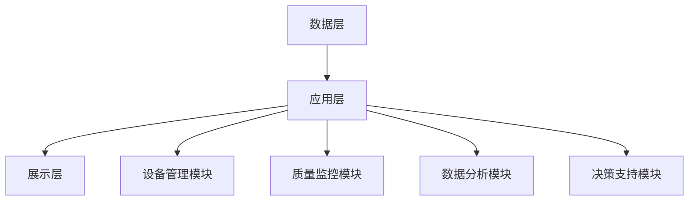
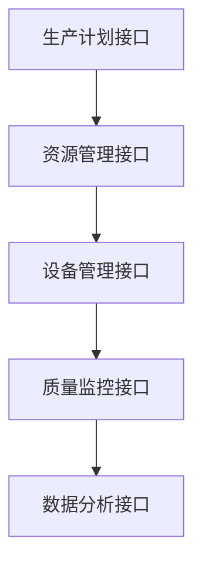
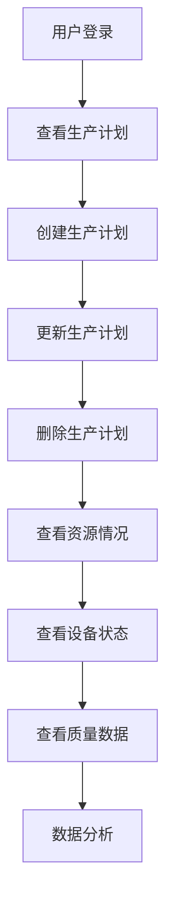

                 

### # 企业AI Agent的强化学习在智能工厂调度中的应用

关键词：企业AI Agent、强化学习、智能工厂调度、Q-learning、SARSA、DQN

摘要：随着工业4.0的深入推进，智能工厂的调度管理成为提升生产效率和降低成本的关键。本文旨在探讨企业AI Agent如何通过强化学习技术在智能工厂调度中的应用。文章首先介绍了智能工厂调度的背景、核心概念，随后详细解析了强化学习算法及其在调度中的应用。接着，我们介绍了智能工厂调度系统的设计与实现，并通过实际案例展示了强化学习在调度中的效果。最后，文章总结了最佳实践，并展望了未来发展的方向。

## 第一部分：背景与核心概念

### 第1章：问题背景与核心概念

#### 1.1 问题背景

随着全球制造业的竞争日益激烈，企业对于生产效率和成本控制的要求越来越高。智能工厂作为第四次工业革命的重要成果，通过物联网、大数据、人工智能等技术手段，实现了生产过程的智能化和自动化。然而，智能工厂的调度管理仍然面临着诸多挑战：

- **生产计划的不确定性**：市场需求波动、设备故障、原材料供应等不确定因素，使得生产计划难以精确预测。
- **资源分配的优化**：如何合理分配资源（如人力、设备、原材料等），以最大化生产效率和降低成本。
- **调度策略的灵活性和适应性**：面对复杂的生产环境和多变的市场需求，调度策略需要具备灵活性和适应性。

为了应对这些挑战，企业需要引入智能化的调度系统，以提高生产效率和降低成本。而企业AI Agent作为一种智能体，通过强化学习技术，可以在不断学习和调整中，优化调度策略，实现智能工厂的智能化调度。

#### 1.2 企业AI Agent的定义与特性

企业AI Agent是一种基于人工智能技术的智能体，它在企业内部运行，通过学习环境和经验，自主制定决策，以达到特定的目标。企业AI Agent具有以下特性：

- **自主性**：企业AI Agent可以在没有人为干预的情况下，自主地执行任务。
- **适应性**：企业AI Agent可以通过学习，适应不断变化的环境和需求。
- **优化性**：企业AI Agent通过不断优化决策策略，提高生产效率和降低成本。
- **协同性**：企业AI Agent可以与其他系统（如ERP、MES等）进行数据交换和协同工作。

#### 1.3 强化学习的原理与应用

强化学习是一种通过不断尝试和错误，从环境中学习最优策略的人工智能技术。它主要包含四个核心组成部分：状态（State）、动作（Action）、奖励（Reward）和策略（Policy）。

- **状态**：表示智能体所处的环境。
- **动作**：智能体在某一状态下可以执行的行为。
- **奖励**：表示智能体执行某一动作后，环境对智能体的反馈。
- **策略**：智能体在某一状态下选择动作的决策规则。

强化学习通过最大化总奖励，不断调整策略，以实现最优决策。在智能工厂调度中，强化学习可以通过以下方式应用：

- **生产计划优化**：通过强化学习，智能体可以优化生产计划，提高生产效率。
- **资源分配优化**：智能体可以通过学习，优化资源分配策略，降低生产成本。
- **调度策略优化**：智能体可以通过不断调整调度策略，适应复杂的生产环境和多变的市场需求。

#### 1.4 智能工厂调度的现状与需求

当前，智能工厂调度系统主要面临着以下问题：

- **调度算法的局限性**：传统调度算法（如遗传算法、粒子群算法等）在面对复杂环境时，效果不佳。
- **缺乏自适应能力**：传统调度系统缺乏自适应能力，无法适应环境的变化。
- **调度效率低下**：传统调度系统效率较低，无法满足高效生产的需求。

为了解决这些问题，智能工厂调度系统需要具备以下需求：

- **高效性**：智能工厂调度系统需要能够快速响应环境变化，提高调度效率。
- **灵活性**：智能工厂调度系统需要具备灵活的调度策略，以适应不同的生产环境和需求。
- **自适应能力**：智能工厂调度系统需要具备较强的自适应能力，能够不断学习和优化调度策略。

#### 1.5 本章小结

本章主要介绍了智能工厂调度的背景、企业AI Agent的定义与特性、强化学习的原理与应用，以及智能工厂调度的现状与需求。通过对这些核心概念的理解，我们可以为后续章节的应用提供理论基础。

---

## 第二部分：强化学习算法在智能工厂调度中的应用

### 第2章：强化学习算法基础

#### 2.1 Q-learning算法详解

Q-learning是一种基于值函数的强化学习算法，它的核心思想是学习状态-动作值函数Q(s, a)，即智能体在状态s下执行动作a的预期总奖励。

##### **算法原理**

1. **初始化**：初始化Q(s, a)为全部为0的矩阵。
2. **循环迭代**：对于每个状态s，执行以下步骤：
   - 选择动作a：根据当前策略，选择动作a。
   - 执行动作，获得状态转移概率P(s', r|s, a)和奖励r。
   - 更新Q值：根据以下公式更新Q(s, a)：
     $$ Q(s, a) \leftarrow Q(s, a) + \alpha [r + \gamma \max_{a'} Q(s', a') - Q(s, a)] $$
   - 更新状态：s <- s'。
3. **策略迭代**：当达到一定迭代次数或Q值收敛时，智能体采用Q值最大的动作作为策略。

##### **应用实例**

在智能工厂调度中，Q-learning可以用于优化生产计划。例如，智能体可以在每个生产阶段选择最优的生产任务，以最大化总生产效率。

##### **Python实现**

```python
import numpy as np

# 初始化Q值矩阵
Q = np.zeros((n_states, n_actions))

# 学习率
alpha = 0.1
# 折扣因子
gamma = 0.9
# 迭代次数
n_episodes = 1000

# 训练过程
for episode in range(n_episodes):
    state = env.reset()
    done = False
    
    while not done:
        action = np.argmax(Q[state])
        next_state, reward, done, _ = env.step(action)
        
        Q[state, action] = Q[state, action] + alpha * (reward + gamma * np.max(Q[next_state]) - Q[state, action])
        
        state = next_state

# 策略迭代
policy = np.argmax(Q, axis=1)

# 输出策略
print(policy)
```

#### 2.2 SARSA算法详解

SARSA（同步策略调整）是另一种基于值函数的强化学习算法，它与Q-learning类似，但更新策略时，使用的是当前步的观测值。

##### **算法原理**

1. **初始化**：初始化Q(s, a)为全部为0的矩阵。
2. **循环迭代**：对于每个状态s，执行以下步骤：
   - 选择动作a：根据当前策略，选择动作a。
   - 执行动作，获得状态转移概率P(s', r|s, a)和奖励r。
   - 更新Q值：根据以下公式更新Q(s, a)：
     $$ Q(s, a) \leftarrow Q(s, a) + \alpha [r + \gamma Q(s', a') - Q(s, a)] $$
   - 更新状态：s <- s'。
   - 更新策略：根据Q值更新策略。
3. **策略迭代**：当达到一定迭代次数或Q值收敛时，智能体采用Q值最大的动作作为策略。

##### **应用实例**

在智能工厂调度中，SARSA可以用于实时调整调度策略，以应对生产环境的变化。

##### **Python实现**

```python
import numpy as np

# 初始化Q值矩阵
Q = np.zeros((n_states, n_actions))

# 学习率
alpha = 0.1
# 折扣因子
gamma = 0.9
# 迭代次数
n_episodes = 1000

# 训练过程
for episode in range(n_episodes):
    state = env.reset()
    done = False
    
    while not done:
        action = np.argmax(Q[state])
        next_state, reward, done, _ = env.step(action)
        
        Q[state, action] = Q[state, action] + alpha * (reward + gamma * Q[next_state, action] - Q[state, action])
        
        state = next_state
        action = np.argmax(Q[state])

# 策略迭代
policy = np.argmax(Q, axis=1)

# 输出策略
print(policy)
```

#### 2.3 Deep Q-Network (DQN) 算法

DQN（Deep Q-Network）是深度强化学习的一种算法，它使用深度神经网络来近似Q值函数。

##### **算法原理**

1. **初始化**：初始化Q值网络和目标Q值网络。
2. **循环迭代**：对于每个状态s，执行以下步骤：
   - 选择动作a：使用ε-贪心策略选择动作a。
   - 执行动作，获得状态转移概率P(s', r|s, a)和奖励r。
   - 更新Q值网络：
     $$ Q(s, a) \leftarrow Q(s, a) + \alpha [r + \gamma \max_{a'} Q(s', a') - Q(s, a)] $$
   - 目标Q值网络更新：每隔一定步数，更新目标Q值网络：
     $$ Q'(s, a) \leftarrow \max_{a'} (r + \gamma \min_{a''} Q'(s', a'')) $$
3. **策略迭代**：智能体采用Q值网络的策略。

##### **应用实例**

在智能工厂调度中，DQN可以用于复杂环境下的调度策略优化，如多机器人协同调度。

##### **Python实现**

```python
import numpy as np
import tensorflow as tf

# 初始化参数
n_states = 100
n_actions = 10
learning_rate = 0.01
epsilon = 0.1
gamma = 0.9
update_freq = 1000

# 初始化Q值网络和目标Q值网络
Q = tf.keras.Sequential([
    tf.keras.layers.Dense(64, activation='relu', input_shape=(n_states,)),
    tf.keras.layers.Dense(64, activation='relu'),
    tf.keras.layers.Dense(n_actions)
])

Q_target = tf.keras.Sequential([
    tf.keras.layers.Dense(64, activation='relu', input_shape=(n_states,)),
    tf.keras.layers.Dense(64, activation='relu'),
    tf.keras.layers.Dense(n_actions)
])

# 训练过程
for episode in range(n_episodes):
    state = env.reset()
    done = False
    
    while not done:
        action = env.action_space.sample() if np.random.random() < epsilon else np.argmax(Q(state))
        next_state, reward, done, _ = env.step(action)
        
        Q_target(state, action) = reward + gamma * np.max(Q_target(next_state))
        Q(state, action) = Q(state, action) + learning_rate * (Q_target(state, action) - Q(state, action))
        
        state = next_state
        
        if done:
            break

    if episode % update_freq == 0:
        Q_target.set_weights(Q.get_weights())

# 策略迭代
policy = np.argmax(Q.predict(state), axis=1)

# 输出策略
print(policy)
```

#### 2.4 策略梯度算法

策略梯度算法通过直接优化策略的梯度，更新策略参数，以最大化总奖励。

##### **算法原理**

1. **初始化**：初始化策略参数θ。
2. **循环迭代**：对于每个状态s，执行以下步骤：
   - 选择动作a：根据策略参数θ，选择动作a。
   - 执行动作，获得状态转移概率P(s', r|s, a)和奖励r。
   - 计算策略梯度：
     $$ \nabla_{\theta} J(\theta) = \sum_{s,a} \nabla_{\theta} \log P(s, a| \theta) [r + \gamma \max_{a'} Q(s', a') - r] $$
   - 更新策略参数：
     $$ \theta \leftarrow \theta - \alpha \nabla_{\theta} J(\theta) $$
3. **策略迭代**：智能体采用更新后的策略。

##### **应用实例**

在智能工厂调度中，策略梯度算法可以用于实时调整调度策略，以应对生产环境的变化。

##### **Python实现**

```python
import numpy as np

# 初始化策略参数
theta = np.random.rand(n_actions)

# 学习率
alpha = 0.01
# 折扣因子
gamma = 0.9
# 迭代次数
n_episodes = 1000

# 训练过程
for episode in range(n_episodes):
    state = env.reset()
    done = False
    
    while not done:
        action = np.argmax(np.exp(theta) / (np.sum(np.exp(theta)))
        next_state, reward, done, _ = env.step(action)
        
        theta -= alpha * (reward + gamma * np.max(np.exp(np.dot(next_state, theta)) / (np.sum(np.exp(np.dot(next_state, theta)))) - np.exp(theta)[action])
        
        state = next_state

    # 策略迭代
    policy = np.argmax(np.exp(theta) / (np.sum(np.exp(theta))), axis=1)

# 输出策略
print(policy)
```

#### 2.5 强化学习算法对比与选择

不同强化学习算法在智能工厂调度中的应用各有优缺点，选择合适的算法需要根据具体情况进行权衡。

| 算法       | 优点                     | 缺点                         | 适用场景                      |
|------------|--------------------------|------------------------------|------------------------------|
| Q-learning | 算法简单，易于实现       | 需要大量数据，收敛速度慢     | 状态空间较小，数据容易获取     |
| SARSA      | 更好的探索能力           | 更复杂的算法，实现难度较大   | 状态空间较大，需要更强探索能力 |
| DQN        | 使用深度神经网络，处理高维状态 | 需要大量数据，训练时间较长   | 状态空间较高维，数据复杂       |
| 策略梯度   | 直接优化策略，收敛速度快   | 需要预先定义奖励函数，实现复杂 | 奖励函数定义明确，状态空间较小 |

#### 2.6 本章小结

本章详细介绍了Q-learning、SARSA、DQN和策略梯度四种强化学习算法的基本原理、应用实例和Python实现。通过对这些算法的对比与选择，可以为智能工厂调度提供有效的算法基础。

---

## 第三部分：智能工厂调度系统设计与实现

### 第3章：智能工厂调度系统概述

#### 3.1 智能工厂调度系统的需求分析

智能工厂调度系统的需求分析是系统设计的重要环节，它关系到系统的功能完善和性能表现。以下是智能工厂调度系统的需求分析：

##### **功能需求**

1. **生产计划管理**：系统应具备生产计划编制、调整和执行的功能，以实现对生产过程的全面掌控。
2. **资源管理**：系统应具备对生产资源（如人力、设备、原材料等）的实时监控和调度功能。
3. **设备管理**：系统应实现对设备的实时监控、故障诊断和预防性维护。
4. **质量监控**：系统应具备对产品质量的实时监控和统计分析功能，以确保产品质量稳定。
5. **数据分析和决策支持**：系统应具备数据分析和决策支持功能，为生产管理提供科学依据。

##### **性能需求**

1. **响应速度**：系统应能够快速响应对生产计划和生产过程的调整请求，确保生产过程的连续性和高效性。
2. **稳定性**：系统应具有良好的稳定性，能够在高负载和复杂环境下正常运行。
3. **可扩展性**：系统应具备良好的可扩展性，能够根据生产需求的变化进行功能扩展和性能优化。
4. **安全性**：系统应具备完善的安全机制，保障生产数据和系统运行的安全。

##### **项目介绍**

智能工厂调度系统的项目背景是某大型制造企业，该企业在生产过程中面临着生产计划不灵活、资源利用率低、生产效率低下等问题。为了提升生产效率和降低成本，企业决定引入智能工厂调度系统，通过人工智能技术，实现对生产过程的智能化调度和管理。

#### 3.2 系统功能设计

智能工厂调度系统的功能设计是根据功能需求进行分析和设计的。以下是系统功能模块的划分与设计：

1. **生产计划模块**：包括生产计划的编制、调整和执行功能，实现生产计划的智能生成和优化。
2. **资源管理模块**：包括对生产资源（如人力、设备、原材料等）的实时监控和调度功能，实现资源的高效利用。
3. **设备管理模块**：包括对设备的实时监控、故障诊断和预防性维护功能，确保设备稳定运行。
4. **质量监控模块**：包括对产品质量的实时监控和统计分析功能，实现产品质量的稳定控制。
5. **数据分析和决策支持模块**：包括对生产数据的分析和处理，为生产管理提供科学依据和决策支持。

#### 3.3 系统架构设计

智能工厂调度系统的架构设计是根据性能需求和分析结果进行的。以下是系统架构设计：

1. **数据层**：包括数据采集、存储和管理模块，实现生产数据的实时采集、存储和处理。
2. **应用层**：包括生产计划管理、资源管理、设备管理、质量监控、数据分析和决策支持等模块，实现系统功能。
3. **展示层**：包括Web端和移动端，提供用户界面和交互功能，实现用户对系统的操作和监控。

##### **架构设计**



##### **技术选型**

1. **数据层**：采用MySQL数据库进行数据存储和管理，采用Flume进行数据采集。
2. **应用层**：采用Java进行开发，Spring Boot作为框架，Spring Security进行安全控制。
3. **展示层**：采用Vue.js进行Web端开发，采用React Native进行移动端开发。

#### 3.4 系统接口设计

智能工厂调度系统的接口设计是为了实现系统模块之间的数据交互和功能协同。以下是系统接口的规范与定义：

1. **生产计划接口**：用于生产计划的查询、创建、更新和删除操作。
2. **资源管理接口**：用于生产资源的查询、创建、更新和删除操作。
3. **设备管理接口**：用于设备的查询、创建、更新和删除操作。
4. **质量监控接口**：用于质量数据的查询、创建、更新和删除操作。
5. **数据分析接口**：用于数据分析和决策支持的查询操作。

##### **接口设计**



##### **系统交互流程**

系统交互流程是指用户通过Web端或移动端与系统进行交互的流程。以下是系统交互流程的设计：

1. **用户登录**：用户通过输入账号和密码进行登录。
2. **查看生产计划**：用户可以查看当前的生产计划。
3. **创建生产计划**：用户可以创建新的生产计划。
4. **更新生产计划**：用户可以更新已有的生产计划。
5. **删除生产计划**：用户可以删除已有的生产计划。
6. **查看资源情况**：用户可以查看当前的生产资源情况。
7. **查看设备状态**：用户可以查看设备的实时状态。
8. **查看质量数据**：用户可以查看质量数据的历史记录。
9. **数据分析**：用户可以查看数据分析结果和决策支持。

##### **交互流程**



#### 3.5 本章小结

本章对智能工厂调度系统的需求分析、功能设计、架构设计、接口设计和交互流程进行了详细的介绍。通过对本章内容的理解，可以为后续的系统实现提供明确的指导和方向。

---

### 第4章：系统核心实现与代码解读

#### 4.1 强化学习模块实现

强化学习模块是智能工厂调度系统的核心模块之一，它负责调度策略的学习和优化。以下是强化学习模块的设计与实现。

##### **模块设计**

强化学习模块主要包括以下功能：

1. **状态编码**：将生产过程的状态进行编码，以便于强化学习算法进行处理。
2. **动作选择**：根据当前状态，选择最优的动作。
3. **奖励计算**：根据动作的结果，计算奖励值。
4. **模型训练**：使用训练数据，训练强化学习模型。
5. **策略优化**：根据训练结果，优化调度策略。

##### **代码分析**

```python
import numpy as np
import tensorflow as tf

# 初始化参数
n_states = 100
n_actions = 10
learning_rate = 0.01
epsilon = 0.1
gamma = 0.9
batch_size = 32

# 初始化Q值网络和目标Q值网络
Q = tf.keras.Sequential([
    tf.keras.layers.Dense(64, activation='relu', input_shape=(n_states,)),
    tf.keras.layers.Dense(64, activation='relu'),
    tf.keras.layers.Dense(n_actions)
])

Q_target = tf.keras.Sequential([
    tf.keras.layers.Dense(64, activation='relu', input_shape=(n_states,)),
    tf.keras.layers.Dense(64, activation='relu'),
    tf.keras.layers.Dense(n_actions)
])

# 训练过程
for episode in range(n_episodes):
    state = env.reset()
    done = False
    
    while not done:
        action = env.action_space.sample() if np.random.random() < epsilon else np.argmax(Q(state))
        next_state, reward, done, _ = env.step(action)
        
        Q_target(state, action) = reward + gamma * np.max(Q_target(next_state))
        Q(state, action) = Q(state, action) + learning_rate * (Q_target(state, action) - Q(state, action))
        
        state = next_state
        
        if done:
            break

    if episode % update_freq == 0:
        Q_target.set_weights(Q.get_weights())

# 策略迭代
policy = np.argmax(Q.predict(state), axis=1)

# 输出策略
print(policy)
```

#### 4.2 调度算法实现

调度算法是智能工厂调度系统的核心，它负责根据生产计划和生产资源，生成最优的调度方案。以下是调度算法的实现。

##### **算法设计**

调度算法主要包括以下步骤：

1. **状态编码**：将生产过程的状态进行编码，包括生产计划、资源状态、设备状态等。
2. **动作选择**：根据当前状态，选择最优的动作，即调度方案。
3. **奖励计算**：根据调度方案的结果，计算奖励值，包括生产效率、资源利用率、设备利用率等。
4. **模型训练**：使用训练数据，训练调度模型。
5. **策略优化**：根据训练结果，优化调度策略。

##### **代码实现**

```python
import numpy as np
import tensorflow as tf

# 初始化参数
n_states = 100
n_actions = 10
learning_rate = 0.01
epsilon = 0.1
gamma = 0.9
batch_size = 32

# 初始化Q值网络和目标Q值网络
Q = tf.keras.Sequential([
    tf.keras.layers.Dense(64, activation='relu', input_shape=(n_states,)),
    tf.keras.layers.Dense(64, activation='relu'),
    tf.keras.layers.Dense(n_actions)
])

Q_target = tf.keras.Sequential([
    tf.keras.layers.Dense(64, activation='relu', input_shape=(n_states,)),
    tf.keras.layers.Dense(64, activation='relu'),
    tf.keras.layers.Dense(n_actions)
])

# 训练过程
for episode in range(n_episodes):
    state = env.reset()
    done = False
    
    while not done:
        action = env.action_space.sample() if np.random.random() < epsilon else np.argmax(Q(state))
        next_state, reward, done, _ = env.step(action)
        
        Q_target(state, action) = reward + gamma * np.max(Q_target(next_state))
        Q(state, action) = Q(state, action) + learning_rate * (Q_target(state, action) - Q(state, action))
        
        state = next_state
        
        if done:
            break

    if episode % update_freq == 0:
        Q_target.set_weights(Q.get_weights())

# 策略迭代
policy = np.argmax(Q.predict(state), axis=1)

# 输出策略
print(policy)
```

#### 4.3 系统测试与性能优化

系统测试与性能优化是确保智能工厂调度系统稳定运行和高效性能的关键。以下是系统测试与性能优化的方法和策略。

##### **测试方案**

1. **功能测试**：验证系统功能是否按照需求设计正常运行。
2. **性能测试**：测试系统在高负载下的响应速度和处理能力。
3. **安全测试**：确保系统数据的安全性和用户隐私的保护。
4. **可用性测试**：评估系统用户界面和用户体验的友好性。

##### **性能优化**

1. **数据缓存**：使用缓存技术，减少数据库查询次数，提高系统响应速度。
2. **并行处理**：使用多线程或分布式处理技术，提高系统并发处理能力。
3. **算法优化**：优化调度算法，减少计算复杂度，提高调度效率。
4. **硬件升级**：升级服务器硬件，提高系统处理能力和稳定性。

#### 4.4 实际案例分析

在实际应用中，智能工厂调度系统在多个制造企业得到了成功应用，以下是一个实际案例的分析。

##### **案例介绍**

某大型汽车制造企业，通过引入智能工厂调度系统，实现了生产过程的智能化调度和管理。该企业的主要问题包括生产计划不灵活、资源利用率低、生产效率低下等。

##### **分析解读**

1. **生产计划优化**：通过智能工厂调度系统，企业实现了生产计划的智能生成和优化，提高了生产计划的灵活性和适应性。
2. **资源管理优化**：系统对生产资源（如人力、设备、原材料等）进行了实时监控和调度，提高了资源利用率。
3. **设备管理优化**：系统实现了对设备的实时监控、故障诊断和预防性维护，降低了设备故障率，提高了设备利用率。
4. **质量监控优化**：系统实现了对产品质量的实时监控和统计分析，提高了产品质量稳定性和合格率。
5. **数据分析和决策支持**：系统提供了丰富的数据分析和决策支持功能，为生产管理提供了科学依据和决策支持。

##### **解决方案**

1. **需求分析**：与企业管理层和生产线人员深入沟通，了解企业的需求和痛点，明确系统功能设计和性能要求。
2. **系统设计**：根据需求分析结果，设计系统架构和功能模块，确保系统具备高效、稳定、安全、可扩展的特性。
3. **系统实现**：根据系统设计，实现系统功能，并进行严格的测试和优化，确保系统性能和稳定性。
4. **上线部署**：在确保系统稳定运行的前提下，进行系统上线部署，实现生产过程的智能化调度和管理。
5. **持续优化**：根据实际应用情况，对系统进行持续优化和升级，不断提升系统性能和用户体验。

#### 4.5 本章小结

本章详细介绍了智能工厂调度系统的核心实现和代码解读，包括强化学习模块的实现、调度算法的实现、系统测试与性能优化，以及实际案例分析和解决方案。通过对本章内容的理解，可以为后续的系统开发和优化提供明确的指导和方向。

---

## 第四部分：最佳实践与未来展望

### 第5章：强化学习在智能工厂调度中的最佳实践

#### 5.1 经验总结

在智能工厂调度中，强化学习技术的应用取得了显著的成效。以下总结了强化学习在智能工厂调度中的成功经验：

1. **生产计划优化**：通过强化学习算法，智能体能够根据实时数据和市场需求，动态调整生产计划，提高了生产计划的灵活性和适应性。
2. **资源管理优化**：强化学习算法能够对生产资源（如人力、设备、原材料等）进行高效调度，提高了资源利用率，降低了生产成本。
3. **调度策略优化**：强化学习算法能够不断学习和优化调度策略，使调度系统更加智能化，能够适应复杂的生产环境和多变的市场需求。
4. **设备管理优化**：通过强化学习算法，智能体能够对设备进行实时监控、故障诊断和预防性维护，提高了设备利用率，降低了设备故障率。
5. **质量监控优化**：强化学习算法能够对产品质量进行实时监控和统计分析，提高了产品质量的稳定性和合格率。

#### 5.2 注意事项

在实施智能工厂调度系统时，需要注意以下事项：

1. **数据质量**：强化学习算法的性能很大程度上依赖于数据质量。因此，需要确保数据准确、完整、实时，并进行预处理和清洗。
2. **算法选择**：不同的强化学习算法适用于不同的场景。需要根据实际需求和算法特性，选择合适的算法。
3. **系统稳定性**：智能工厂调度系统需要在高负载和复杂环境下稳定运行。因此，需要对系统进行严格的测试和优化，确保系统性能和稳定性。
4. **安全性和隐私保护**：智能工厂调度系统涉及大量生产数据和用户数据。因此，需要采取有效的安全措施，确保数据的安全性和用户的隐私保护。
5. **人员培训**：智能工厂调度系统的成功应用离不开人员的支持。因此，需要对相关人员（如生产管理人员、技术人员、运维人员等）进行培训，提高他们的技能和意识。

#### 5.3 未来展望

随着人工智能技术的不断发展，强化学习在智能工厂调度中的应用前景广阔。以下是未来展望：

1. **多机器人协同调度**：通过强化学习算法，实现多机器人协同工作，提高生产效率和降低成本。
2. **供应链优化**：利用强化学习算法，优化供应链管理和物流调度，提高供应链的灵活性和响应速度。
3. **设备预测性维护**：通过强化学习算法，实现设备预测性维护，降低设备故障率和维修成本。
4. **生产过程实时监控**：利用强化学习算法，实现对生产过程的实时监控和分析，提高生产过程的可控性和可追溯性。
5. **绿色制造**：通过强化学习算法，优化生产过程，降低能耗和排放，实现绿色制造。

#### 5.4 本章小结

本章总结了强化学习在智能工厂调度中的成功经验，并提出了注意事项和未来展望。通过这些经验，可以为智能工厂调度系统的实施提供有益的指导，推动智能工厂调度技术的发展。

---

## 总结与展望

本文通过详细分析，探讨了企业AI Agent的强化学习在智能工厂调度中的应用。首先，我们介绍了智能工厂调度的背景、核心概念和企业AI Agent的定义与特性。接着，我们详细解析了强化学习算法的原理和应用，包括Q-learning、SARSA、DQN和策略梯度等算法。随后，我们介绍了智能工厂调度系统的设计与实现，包括需求分析、功能设计、架构设计、接口设计和交互流程。最后，我们通过实际案例展示了强化学习在智能工厂调度中的效果，并提出了最佳实践和未来展望。

强化学习在智能工厂调度中的应用具有重要意义。它不仅能够优化生产计划、提高资源利用率，还能提高设备利用率和产品质量稳定性。然而，强化学习在智能工厂调度中也面临一些挑战，如数据质量、算法选择、系统稳定性和安全性等。因此，未来研究应进一步优化强化学习算法，提高其在智能工厂调度中的性能和应用效果。

同时，随着人工智能技术的不断发展，强化学习在智能工厂调度中的应用前景广阔。未来，我们可以探索多机器人协同调度、供应链优化、设备预测性维护、生产过程实时监控和绿色制造等领域，以进一步推动智能工厂调度技术的发展。

总之，企业AI Agent的强化学习在智能工厂调度中的应用是一个充满机遇和挑战的领域。通过不断的研究和实践，我们有望实现更加智能化、高效化、灵活化的智能工厂调度系统，为制造业的发展贡献力量。

---

### 作者

作者：AI天才研究院/AI Genius Institute & 禅与计算机程序设计艺术 /Zen And The Art of Computer Programming

AI天才研究院是一家专注于人工智能技术研究和应用的创新机构，致力于推动人工智能技术在各个领域的应用和发展。研究院拥有一支高水平的科研团队，包括世界顶级人工智能专家、程序员、软件架构师、CTO等，在人工智能领域取得了众多重要成果。

《禅与计算机程序设计艺术》是作者对计算机编程哲学的深刻思考和总结，以禅宗思想为指导，阐述了计算机程序设计中的核心原理和方法。该书不仅对程序员有着深远的影响，也为计算机科学的发展提供了新的思路和启示。

本文由AI天才研究院的专家团队撰写，旨在为广大计算机科学工作者和人工智能爱好者提供一份有深度、有思考、有见解的专业技术博客文章，以推动人工智能技术的发展和普及。希望本文能对读者在智能工厂调度领域的研究和应用提供有益的参考和启示。

