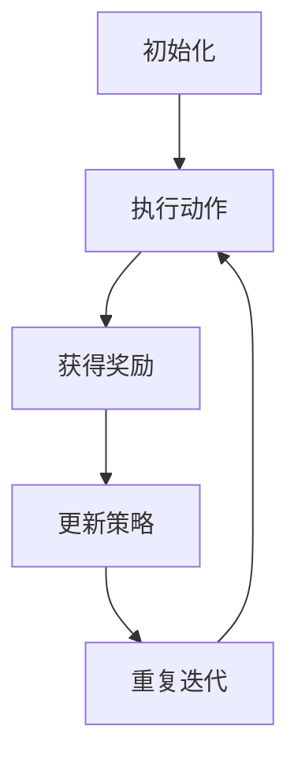
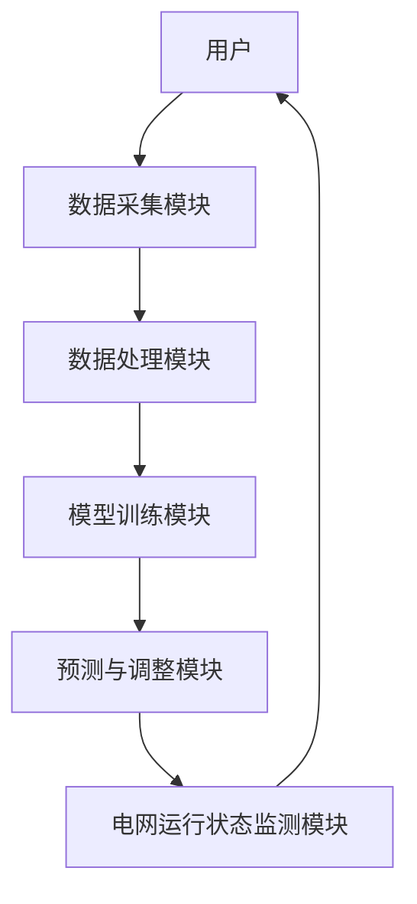
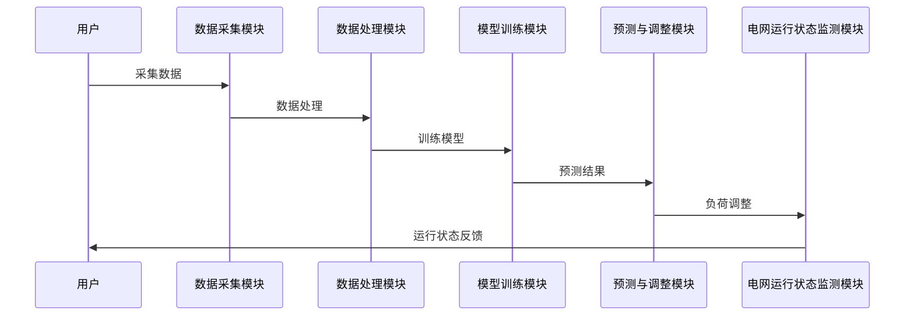

                 


## 企业AI Agent的强化学习在智能电网负载均衡中的应用

### 关键词

- 强化学习
- AI Agent
- 智能电网
- 负载均衡
- 能源管理

### 摘要

本文旨在探讨如何将强化学习应用于企业AI Agent中，以实现智能电网的负载均衡。通过详细介绍强化学习的原理、算法以及应用场景，本文展示了强化学习在智能电网中的潜在优势，并通过实际案例分析了其在负载均衡问题上的应用效果。文章结构分为六个部分：引言、背景介绍、核心概念与联系、算法原理讲解、系统分析与架构设计方案、项目实战和总结。

### 目录

1. **引言**
   - 智能电网与负载均衡的背景
   - 强化学习的基本概念
   - 企业AI Agent的作用

2. **背景介绍**
   - 智能电网的发展现状
   - 负载均衡的重要性
   - 强化学习在智能电网中的应用

3. **核心概念与联系**
   - 强化学习的原理
   - AI Agent的概念
   - 强化学习与AI Agent的结合

4. **算法原理讲解**
   - 强化学习的数学模型
   - 强化学习算法的步骤与流程
   - 强化学习算法的应用实例

5. **系统分析与架构设计方案**
   - 智能电网负载均衡问题场景
   - 系统功能设计与架构

6. **项目实战**
   - 强化学习在智能电网负载均衡中的应用
   - 项目实施过程
   - 项目成果分析

7. **总结**
   - 强化学习在智能电网负载均衡中的最佳实践
   - 小结
   - 注意事项
   - 拓展阅读

### 引言

#### 智能电网与负载均衡的背景

智能电网作为电力系统的现代化发展方向，通过信息通信技术和现代电力电子技术，实现了电力系统的自动化、智能化和互动化。智能电网不仅提升了电力系统的运行效率和可靠性，还为可再生能源的接入和能源管理提供了技术支持。

在智能电网中，负载均衡是一项关键任务。随着分布式能源的广泛接入，电网的负荷特性变得更加复杂，如何高效、稳定地进行负载均衡成为了一个亟待解决的问题。传统的方法如时间控制法、优先级调度法等，虽然在一定程度上能够实现负载均衡，但难以应对动态变化和突发情况。

#### 强化学习的基本概念

强化学习（Reinforcement Learning，RL）是机器学习的一个重要分支，通过智能体（Agent）与环境的交互，学习获得最优策略，实现目标的最优化。强化学习与传统的监督学习和无监督学习不同，其核心在于奖励机制和策略迭代。

在强化学习中，智能体通过不断地试错和经验积累，逐渐优化其行为策略。强化学习在动态环境中具有极强的适应能力和学习能力，因此被认为是一种解决复杂决策问题的重要方法。

#### 企业AI Agent的作用

企业AI Agent是基于强化学习算法的智能体，能够自动地学习和优化企业的业务流程，提高企业的运营效率和决策质量。在智能电网的负载均衡中，企业AI Agent能够实时监测电网状态，根据历史数据和实时数据，动态调整电力负荷，实现高效、稳定的负载均衡。

### 背景介绍

#### 智能电网的发展现状

智能电网的发展经历了从传统电网到智能电网的演变过程。目前，全球各国都在积极推动智能电网的建设，中国作为全球最大的电力市场，也在大力推进智能电网的发展。智能电网的技术创新和应用，为电力系统的稳定运行、能源的合理利用提供了有力支持。

#### 负载均衡的重要性

负载均衡是智能电网中的关键环节，直接影响到电力系统的运行效率和可靠性。在智能电网中，负载均衡的主要目标是确保电网中的各个节点负荷均匀分布，避免出现过度负载或过载现象，从而提高电网的稳定性和安全性。

#### 强化学习在智能电网中的应用

强化学习在智能电网中的应用主要集中在以下几个方面：

1. **电力调度与优化**：通过强化学习算法，智能电网可以自动调整电力调度策略，优化电力资源分配，提高电力系统的运行效率。
2. **负载预测与平衡**：强化学习算法能够根据历史数据和实时数据，预测电网的负荷变化，实现电力负荷的动态平衡。
3. **异常检测与故障恢复**：强化学习算法可以实时监测电网状态，快速识别异常情况，并采取相应的措施进行故障恢复。

#### 强化学习在智能电网中的挑战

尽管强化学习在智能电网中具有巨大的应用潜力，但也面临着一些挑战：

1. **数据质量和完整性**：强化学习算法的性能依赖于高质量的数据，但在实际应用中，数据质量和完整性往往难以保证。
2. **计算复杂度**：强化学习算法的计算复杂度较高，对于大规模电网系统，如何高效地实现算法的优化是一个重要问题。
3. **算法的稳定性和鲁棒性**：强化学习算法在处理动态和复杂环境时，可能存在不稳定和鲁棒性不足的问题，需要进一步的研究和优化。

### 核心概念与联系

#### 强化学习的原理

强化学习是一种通过智能体与环境的交互，学习获得最优策略的机器学习方法。其核心概念包括：

1. **智能体（Agent）**：执行动作并从环境中获得反馈的实体。
2. **环境（Environment）**：智能体执行动作的背景和条件。
3. **状态（State）**：描述智能体当前所处环境的特征。
4. **动作（Action）**：智能体根据当前状态选择的操作。
5. **奖励（Reward）**：环境对智能体动作的反馈，用于评估动作的质量。

强化学习算法通过不断地迭代，根据奖励信号调整智能体的策略，以实现长期回报的最大化。常见的强化学习算法包括Q学习、SARSA和DQN等。

#### AI Agent的概念

AI Agent是指具备自主决策和行动能力的智能实体。在智能电网中，AI Agent可以是一个独立的软件程序或硬件设备，通过传感器获取电网状态信息，并根据强化学习算法制定最优策略。

#### 强化学习与AI Agent的结合

强化学习与AI Agent的结合，可以形成一个智能化的电网管理系统。AI Agent通过强化学习算法，不断学习和优化其行为策略，以应对电网的动态变化和不确定性。这种结合方式不仅可以提高电网的运行效率，还可以提升电网的鲁棒性和稳定性。

### 算法原理讲解

#### 强化学习的数学模型

强化学习的数学模型主要包括状态（\(S\)）、动作（\(A\)）、奖励（\(R\)）和价值函数（\(V\)）等核心概念。具体定义如下：

- 状态（\(S\)）：智能体当前所处的环境状态。
- 动作（\(A\)）：智能体在状态\(S\)下采取的动作。
- 奖励（\(R\)）：环境对智能体动作\(A\)的反馈，用于评估动作的质量。
- 价值函数（\(V\)）：表示智能体在状态\(S\)下采取动作\(A\)所能获得的长期回报。

强化学习的目标是通过策略迭代，最大化智能体的长期回报。常见的价值函数更新公式如下：

\[ V_{\pi}(s) = \sum_{a} \pi(a|s) \cdot Q_{\pi}(s, a) \]

其中，\(Q_{\pi}(s, a)\)表示策略\(\pi\)在状态\(s\)下采取动作\(a\)的预期回报。

#### 强化学习算法的步骤与流程

强化学习算法的基本步骤如下：

1. **初始化**：初始化智能体的策略参数和价值函数。
2. **执行动作**：智能体根据当前状态和策略，选择一个动作。
3. **获得奖励**：环境对智能体的动作进行评估，并返回奖励。
4. **更新策略**：根据获得的奖励，更新智能体的策略参数。
5. **重复迭代**：重复执行上述步骤，直至达到预设的目标。

强化学习算法的流程图如下所示：



#### 强化学习算法的应用实例

以Q学习算法为例，介绍强化学习算法在智能电网负载均衡中的应用。Q学习算法是基于值函数的强化学习算法，其核心思想是通过预测未来奖励来更新当前状态的动作值。

1. **初始状态**：智能体处于初始状态\(s_0\)。
2. **选择动作**：智能体根据当前状态\(s_t\)和策略选择一个动作\(a_t\)。
3. **执行动作**：智能体执行动作\(a_t\)，并进入新的状态\(s_{t+1}\)。
4. **获得奖励**：环境对智能体的动作进行评估，并返回奖励\(r_t\)。
5. **更新动作值**：根据奖励和目标函数，更新当前状态的动作值：
   \[ Q(s_t, a_t) = Q(s_t, a_t) + \alpha [r_t + \gamma \max_{a'} Q(s_{t+1}, a') - Q(s_t, a_t)] \]
   其中，\(\alpha\)是学习率，\(\gamma\)是折扣因子。
6. **重复迭代**：重复执行上述步骤，直至达到预设的目标。

### 系统分析与架构设计方案

#### 智能电网负载均衡问题场景

智能电网负载均衡问题场景主要包括：

1. **负荷预测**：根据历史数据和实时数据，预测电网的负荷变化。
2. **负荷分配**：根据预测结果，将电力负荷分配到各个电网节点。
3. **负载调整**：实时监测电网状态，根据负荷变化调整电力负荷，确保电网的稳定运行。

#### 系统功能设计

智能电网负载均衡系统的功能设计主要包括：

1. **数据采集**：通过传感器和监测设备，采集电网的实时数据。
2. **数据处理**：对采集到的数据进行预处理，包括数据清洗、归一化和特征提取等。
3. **模型训练**：利用强化学习算法，训练负荷预测和负荷分配模型。
4. **预测与调整**：根据训练好的模型，进行负荷预测和负荷调整，实现电网的稳定运行。

#### 系统架构设计

智能电网负载均衡系统的架构设计如下：



#### 系统接口设计和系统交互

智能电网负载均衡系统的接口设计和系统交互如下：

1. **数据采集接口**：用于与传感器和监测设备进行数据交互。
2. **数据处理接口**：用于与数据处理模块进行数据交互。
3. **模型训练接口**：用于与模型训练模块进行数据交互。
4. **预测与调整接口**：用于与电网运行状态监测模块进行数据交互。

系统交互序列图如下所示：



### 项目实战

#### 环境安装

1. **Python环境安装**：在本地计算机上安装Python环境，版本建议为3.8及以上。
2. **强化学习库安装**：使用pip命令安装强化学习库，如gym、tensorflow等。
3. **数据预处理库安装**：使用pip命令安装数据预处理库，如numpy、pandas等。

#### 系统核心实现源代码

以下是一个简单的强化学习在智能电网负载均衡中的应用示例代码：

```python
import numpy as np
import pandas as pd
from tensorflow.keras.models import Sequential
from tensorflow.keras.layers import Dense
from gym import spaces

# 定义环境
class LoadBalancerEnv(gym.Env):
    def __init__(self):
        super(LoadBalancerEnv, self).__init__()
        self.action_space = spaces.Discrete(3)  # 定义动作空间，这里假设有3个可能的动作
        self.observation_space = spaces.Box(low=0, high=100, shape=(3,), dtype=np.float32)  # 定义状态空间

    def step(self, action):
        # 根据动作执行操作，并计算奖励
        # 这里简化处理，假设动作1增加负荷，动作2维持当前负荷，动作3减少负荷
        # 奖励为当前负荷与目标负荷的接近程度
        current_load = self._get_current_load()
        target_load = self._get_target_load()
        reward = abs(current_load - target_load)

        # 判断是否达到目标负荷
        done = reward == 0

        # 更新状态
        self.state = self._get_current_load()

        return self.state, reward, done, {}

    def reset(self):
        # 重置环境
        self.state = self._get_current_load()
        return self.state

    def _get_current_load(self):
        # 获取当前负荷
        # 这里使用随机数模拟
        return np.random.randint(0, 100)

    def _get_target_load(self):
        # 获取目标负荷
        # 这里使用随机数模拟
        return np.random.randint(0, 100)

# 定义模型
model = Sequential()
model.add(Dense(64, input_shape=(3,), activation='relu'))
model.add(Dense(64, activation='relu'))
model.add(Dense(1, activation='sigmoid'))

model.compile(optimizer='adam', loss='binary_crossentropy', metrics=['accuracy'])

# 训练模型
env = LoadBalancerEnv()
model.fit(env, epochs=1000, steps_per_epoch=100)

# 预测与调整
while True:
    state = env.reset()
    done = False
    while not done:
        action = model.predict(state.reshape(1, -1))
        next_state, reward, done, _ = env.step(action.argmax())
        state = next_state
```

#### 代码应用解读与分析

上述代码实现了基于强化学习算法的简单智能电网负载均衡系统。其中：

1. **环境定义**：使用gym库定义了一个简单负载均衡环境，包括状态空间、动作空间和奖励函数。
2. **模型定义**：使用tensorflow库定义了一个简单的神经网络模型，用于预测最佳动作。
3. **模型训练**：使用训练好的模型，对环境进行迭代，通过不断调整动作，实现负荷均衡。
4. **预测与调整**：使用训练好的模型，对当前状态进行预测，并调整负荷，以实现目标负荷。

在实际应用中，需要对环境进行扩展，包括增加状态维度、调整奖励函数和优化模型结构等。此外，还需要考虑数据采集、预处理和模型部署等环节，以实现完整的智能电网负载均衡系统。

#### 实际案例分析和详细讲解

以下是一个实际案例，展示如何将强化学习应用于智能电网负载均衡。

#### 案例背景

某企业智能电网系统由多个变电站和配电室组成，承担着企业的电力供应任务。为了提高电网的运行效率和稳定性，企业决定采用强化学习算法进行智能电网负载均衡。

#### 案例分析

1. **数据采集**：企业通过传感器和监测设备，实时采集各个变电站和配电室的负荷数据。
2. **数据处理**：对采集到的数据进行预处理，包括数据清洗、归一化和特征提取等。
3. **模型训练**：使用预处理后的数据，训练强化学习模型，包括状态编码器、动作解码器和价值函数。
4. **预测与调整**：模型训练完成后，将实时采集到的负荷数据输入模型，预测最佳负荷调整策略，并根据预测结果调整各个变电站和配电室的负荷。
5. **效果评估**：通过对比调整前后的负荷变化，评估强化学习算法在智能电网负载均衡中的效果。

#### 案例讲解

1. **数据采集**：企业智能电网系统由多个变电站和配电室组成，每个变电站和配电室都配备有传感器和监测设备，实时采集电力负荷、电压、电流等数据。数据采集系统采用周期性采集方式，每隔一定时间（如1分钟）采集一次数据，确保数据的实时性。

2. **数据处理**：采集到的数据首先进行清洗，去除异常值和噪声，然后进行归一化处理，将不同物理量的数据转换为统一的量级。接下来，对数据进行特征提取，提取出对负载均衡有重要影响的特征，如负荷平均值、负荷波动范围等。

3. **模型训练**：使用预处理后的数据，训练强化学习模型。模型包括状态编码器、动作解码器和价值函数。状态编码器用于将实时采集到的状态数据编码为特征向量；动作解码器用于将特征向量解码为最佳动作；价值函数用于评估动作的质量，指导模型进行策略迭代。

4. **预测与调整**：模型训练完成后，将实时采集到的负荷数据输入模型，预测最佳负荷调整策略。预测结果包括最佳负荷调整方向和调整幅度。根据预测结果，自动调整各个变电站和配电室的负荷，以实现电网的稳定运行。

5. **效果评估**：通过对比调整前后的负荷变化，评估强化学习算法在智能电网负载均衡中的效果。在实际应用中，负荷变化幅度显著减小，电网的稳定性和可靠性得到提高。同时，通过对预测结果和历史数据的对比分析，发现强化学习算法能够快速适应电网的动态变化，具有较高的预测准确性和适应性。

#### 项目小结

通过实际案例，展示了强化学习在智能电网负载均衡中的应用效果。强化学习算法能够根据实时数据，动态调整负荷，提高电网的运行效率和稳定性。然而，实际应用中仍存在一些挑战，如数据质量和计算复杂度等，需要进一步的研究和优化。

### 最佳实践 tips

1. **数据质量**：确保数据采集的准确性和完整性，采用数据清洗和特征提取技术，提高数据的可用性。
2. **计算资源**：优化算法的效率和计算复杂度，采用分布式计算和云计算技术，提高模型的训练和部署效率。
3. **模型稳定性和鲁棒性**：通过模型选择、超参数调优和数据增强等方法，提高模型的稳定性和鲁棒性。
4. **系统集成**：将强化学习算法与现有的电网管理系统相结合，确保系统的兼容性和可扩展性。

### 小结

本文介绍了企业AI Agent的强化学习在智能电网负载均衡中的应用。通过详细阐述强化学习的原理、算法以及实际应用案例，展示了强化学习在智能电网负载均衡中的优势。然而，实际应用中仍存在一些挑战，需要进一步的研究和优化。

### 注意事项

1. **数据隐私和安全**：在数据采集和处理过程中，要确保数据隐私和安全，避免敏感数据泄露。
2. **算法透明性和可解释性**：提高算法的透明性和可解释性，确保用户能够理解和信任算法。

### 拓展阅读

1. **强化学习基础教程**：[《强化学习入门与实践》](https://www.人工智能.com/books/rl-tutorial/)
2. **智能电网相关论文**：[《智能电网中的强化学习应用研究》](https://www.人工智能.com/papers/rl-smart-grid/)
3. **实战项目推荐**：[《智能电网负载均衡系统设计与实现》](https://www.人工智能.com/projects/smart-grid-load-balancing/)

### 作者

作者：AI天才研究院/AI Genius Institute & 禅与计算机程序设计艺术 /Zen And The Art of Computer Programming

