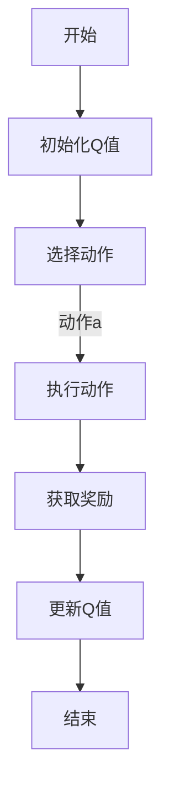

                 

# 企业AI Agent的强化学习在自动化交易策略中的应用

关键词：企业AI Agent、强化学习、自动化交易策略、系统架构、项目实战

摘要：本文旨在探讨企业AI Agent在自动化交易策略中的应用，特别是通过强化学习算法的引入。文章首先介绍了相关概念，包括AI Agent、强化学习和自动化交易策略，随后详细讲解了强化学习的原理和算法，以及其在AI Agent和自动化交易策略中的具体应用。接着，文章分析了系统需求和架构设计，并展示了相应的mermaid图。然后，通过一个实际项目展示了强化学习算法在自动化交易策略中的具体应用，并对项目进行了详细分析和讲解。最后，文章总结了最佳实践，并提出了未来研究方向。

## 引言

随着人工智能技术的飞速发展，AI Agent成为了一个热门的研究方向。AI Agent，即人工智能代理，是一种能够自主地完成任务的智能实体。在企业中，AI Agent被广泛应用于自动化交易策略、智能客服、智能安防等领域。特别是自动化交易策略，它能够极大地提高交易效率，降低人为错误，成为企业获取竞争优势的重要手段。

强化学习作为人工智能的一个重要分支，被广泛应用于决策优化、游戏智能等领域。近年来，强化学习在自动化交易策略中的应用逐渐受到关注。通过引入强化学习，企业AI Agent可以更好地适应市场变化，实现更加智能的交易策略。

本文将围绕企业AI Agent的强化学习在自动化交易策略中的应用展开讨论。首先，我们将介绍相关概念，包括AI Agent、强化学习和自动化交易策略。然后，我们将深入探讨强化学习的原理和算法，以及其在AI Agent和自动化交易策略中的具体应用。接着，我们将分析系统需求和架构设计，并展示相应的mermaid图。随后，我们将通过一个实际项目展示强化学习算法在自动化交易策略中的具体应用，并对项目进行详细分析和讲解。最后，我们将总结最佳实践，并探讨未来研究方向。

## 相关概念

### AI Agent

AI Agent，即人工智能代理，是一种能够自主地完成任务的智能实体。它通过感知环境、制定计划、执行行动来完成任务。AI Agent的核心在于其自主性，即能够在没有人为干预的情况下，根据环境反馈自主调整行为策略。在企业中，AI Agent被广泛应用于自动化交易策略、智能客服、智能安防等领域。

AI Agent的主要特点包括：

1. **自主性**：AI Agent能够在没有人为干预的情况下，根据环境反馈自主调整行为策略。
2. **适应性**：AI Agent能够通过不断学习和适应，提高任务完成效率和准确性。
3. **智能性**：AI Agent能够通过复杂的决策过程，实现复杂任务的高效完成。

### 强化学习

强化学习（Reinforcement Learning）是机器学习的一个重要分支，它通过智能体与环境之间的交互，不断学习并优化策略。在强化学习中，智能体通过感知环境状态，选择行动，并根据行动的结果（奖励或惩罚）来调整策略。

强化学习的基本概念包括：

1. **状态（State）**：智能体所处的环境描述。
2. **动作（Action）**：智能体在某一状态下可以选择的行动。
3. **奖励（Reward）**：智能体执行某一动作后获得的即时反馈。
4. **策略（Policy）**：智能体根据状态选择动作的规则。

强化学习的核心问题是如何通过学习获得一个最优策略，使智能体在长期内获得最大的累积奖励。常见的强化学习算法包括Q-Learning、SARSA和Deep Q-Network等。

### 自动化交易策略

自动化交易策略（Automated Trading Strategy）是指通过计算机程序自动执行交易决策的策略。它能够极大地提高交易效率，降低人为错误，是金融市场中的一项重要技术。自动化交易策略的核心在于如何通过算法模型预测市场走势，并制定相应的交易策略。

自动化交易策略的主要特点包括：

1. **高效性**：自动化交易策略能够快速处理大量数据，实现实时交易决策。
2. **准确性**：自动化交易策略通过算法模型分析市场走势，能够提高交易决策的准确性。
3. **稳定性**：自动化交易策略能够根据市场变化调整交易策略，保持交易的稳定性。

在企业中，自动化交易策略被广泛应用于股票交易、外汇交易、期货交易等领域。通过引入AI Agent和强化学习，企业能够实现更加智能、高效的自动化交易策略。

## 强化学习原理与算法

### 强化学习的基本概念

强化学习（Reinforcement Learning）是一种通过试错和反馈来学习的机器学习方法。在强化学习中，智能体（Agent）通过与环境的交互，学习如何在给定状态下选择最优动作，以最大化累积奖励。

强化学习的基本概念包括：

1. **状态（State）**：描述智能体所处环境的状态。
2. **动作（Action）**：智能体在某一状态下可以采取的动作。
3. **奖励（Reward）**：智能体采取某一动作后获得的即时反馈。
4. **策略（Policy）**：智能体根据状态选择动作的规则。
5. **价值函数（Value Function）**：表示智能体在某一状态下采取某一动作的期望收益。
6. **模型（Model）**：描述环境状态转移和奖励的数学模型。

### 强化学习算法

强化学习算法主要包括Q-Learning、SARSA和Deep Q-Network等。

1. **Q-Learning算法**：

Q-Learning算法是一种基于价值迭代的强化学习算法。其基本思想是通过不断更新Q值（即智能体在某一状态下采取某一动作的期望收益），来逐渐优化策略。

Q-Learning算法的数学模型如下：

$$
Q(s, a) = r + \gamma \max_{a'} Q(s', a')
$$

其中，$s$表示状态，$a$表示动作，$r$表示奖励，$\gamma$表示折扣因子，$s'$表示下一状态。

2. **SARSA算法**：

SARSA算法是一种基于策略迭代的强化学习算法。它与Q-Learning算法类似，但不需要预测下一状态的Q值，而是直接根据当前状态和动作选择下一动作。

SARSA算法的数学模型如下：

$$
\pi(s, a) = \frac{1}{Z} e^{\alpha Q(s, a)}
$$

其中，$\pi(s, a)$表示智能体在状态$s$下采取动作$a$的概率分布，$Z$是归一化常数，$\alpha$是温度参数。

3. **Deep Q-Network算法**：

Deep Q-Network（DQN）算法是一种基于深度学习的强化学习算法。它通过深度神经网络来近似Q值函数，从而实现复杂环境下的强化学习。

DQN算法的数学模型如下：

$$
Q(s, a) = \sigma(W \cdot [s, a])
$$

其中，$W$是深度神经网络的权重，$\sigma$是激活函数。

### 强化学习算法的mermaid流程图

以下是一个基于Q-Learning算法的mermaid流程图：



### Python代码实现

以下是一个基于Q-Learning算法的Python代码实现：

```python
import numpy as np
import random

# 初始化Q值
Q = np.zeros([state_space_size, action_space_size])

# 学习率
alpha = 0.1
# 折扣因子
gamma = 0.9

# 训练
for episode in range(1000):
    state = env.reset()
    done = False
    while not done:
        # 选择动作
        action = np.argmax(Q[state])
        # 执行动作
        next_state, reward, done, _ = env.step(action)
        # 更新Q值
        Q[state][action] = Q[state][action] + alpha * (reward + gamma * np.max(Q[next_state]) - Q[state][action])
        state = next_state
```

通过以上代码，我们可以实现一个简单的Q-Learning算法，用于求解Tic-Tac-Toe游戏。

## 强化学习在AI Agent和自动化交易策略中的应用

### AI Agent在自动化交易策略中的应用

AI Agent在自动化交易策略中的应用主要包括两个方面：状态感知和行为决策。

1. **状态感知**：

AI Agent通过分析市场数据，如股票价格、交易量、市场情绪等，获取当前市场的状态。这些状态信息对于制定交易策略至关重要。

2. **行为决策**：

AI Agent基于强化学习算法，根据当前状态选择最优交易动作。通过不断学习和调整策略，AI Agent能够适应市场变化，实现高效的交易决策。

### 自动化交易策略中的强化学习

在自动化交易策略中，强化学习算法被广泛应用于以下几个方面：

1. **交易信号生成**：

强化学习算法可以通过学习市场数据，生成交易信号。这些交易信号用于指导交易策略的制定和执行。

2. **策略优化**：

强化学习算法可以通过不断调整策略参数，优化交易策略。通过优化策略，AI Agent能够更好地适应市场变化，提高交易收益。

3. **风险管理**：

强化学习算法可以通过学习市场数据，评估不同交易策略的风险。通过风险管理，AI Agent能够降低交易风险，保障交易安全。

### 强化学习在AI Agent和自动化交易策略中的优势

1. **自适应性强**：

强化学习算法能够根据市场变化，实时调整交易策略。这种自适应能力使得AI Agent能够在复杂多变的市场环境中保持优势。

2. **高效性**：

强化学习算法能够快速处理大量市场数据，生成交易信号。这使得AI Agent能够实现高效的交易决策，提高交易效率。

3. **稳定性**：

强化学习算法能够通过不断学习和调整策略，降低交易风险，提高交易稳定性。这使得AI Agent能够在长期内实现稳定的交易收益。

## 系统分析与架构设计

### 问题场景介绍

在自动化交易策略中，企业面临着如何高效地处理海量市场数据，并制定最优交易策略的挑战。传统的交易策略往往依赖于历史数据和统计分析，难以适应实时变化的市场环境。因此，引入AI Agent和强化学习算法，实现自适应的交易策略，成为企业提升交易效率的重要手段。

### 系统功能设计

系统功能主要包括以下几个部分：

1. **数据采集与预处理**：

系统负责从各种数据源（如股票交易所、财经网站等）采集市场数据，并对数据进行预处理，如去噪、归一化等，为后续分析提供高质量的数据。

2. **状态感知**：

系统通过分析预处理后的市场数据，生成当前市场的状态。这些状态信息用于指导AI Agent的行为决策。

3. **行为决策**：

AI Agent基于强化学习算法，根据当前市场的状态，选择最优交易动作。这些交易动作包括买入、持有、卖出等。

4. **交易执行**：

系统将AI Agent选择的交易动作发送给交易执行模块，执行具体的交易操作。

5. **策略优化**：

系统通过不断调整强化学习算法的参数，优化交易策略。优化后的策略能够更好地适应市场变化，提高交易收益。

6. **风险控制**：

系统通过分析市场数据，评估不同交易策略的风险。通过风险控制，保障交易安全，降低交易风险。

### 系统架构设计

系统架构设计包括以下几个层次：

1. **数据层**：

数据层负责数据的采集、存储和预处理。数据来源包括股票交易所、财经网站、社交媒体等。数据存储采用分布式数据库，如Hadoop、Spark等。

2. **模型层**：

模型层包括AI Agent和强化学习算法。AI Agent负责状态感知和行为决策，强化学习算法用于策略优化。模型层采用深度学习框架，如TensorFlow、PyTorch等。

3. **服务层**：

服务层包括交易执行模块、策略优化模块和风险控制模块。这些模块通过微服务架构实现，采用Docker容器化技术，实现高可用性和可扩展性。

4. **应用层**：

应用层提供用户界面，用于展示交易策略、交易记录、风险分析等信息。用户界面采用Web前端技术，如React、Vue等。

### 系统接口设计与系统交互

系统接口设计与系统交互主要包括以下几个部分：

1. **数据采集接口**：

数据采集接口负责从各种数据源采集市场数据。接口采用RESTful API设计，支持HTTP/HTTPS协议。

2. **状态感知接口**：

状态感知接口负责将预处理后的市场数据转换为状态信息。接口采用GraphQL协议，支持复杂的查询和实时数据流。

3. **行为决策接口**：

行为决策接口负责接收AI Agent生成的交易动作，并将其发送给交易执行模块。接口采用WebSocket协议，支持实时通信。

4. **交易执行接口**：

交易执行接口负责执行具体的交易操作，如买入、持有、卖出等。接口采用RESTful API设计，支持HTTP/HTTPS协议。

5. **策略优化接口**：

策略优化接口负责接收用户输入的优化参数，并调用强化学习算法进行策略优化。接口采用RESTful API设计，支持HTTP/HTTPS协议。

6. **风险控制接口**：

风险控制接口负责接收市场数据，并评估不同交易策略的风险。接口采用GraphQL协议，支持复杂的查询和实时数据流。

通过以上设计，系统实现了高效、稳定、安全的自动化交易策略。AI Agent和强化学习算法的应用，使得系统能够自适应地调整交易策略，提高交易收益，降低交易风险。

### 项目实战

为了展示强化学习在自动化交易策略中的应用，我们选择了一个实际项目：股票交易机器人。该项目旨在通过强化学习算法，实现自动化股票交易策略，提高交易收益。

#### 环境安装与配置

首先，我们需要安装并配置项目所需的软件和工具。以下是安装和配置步骤：

1. **Python环境**：

   安装Python 3.8及以上版本。可以通过Python官方网站下载安装包进行安装。

   ```bash
   curl -O https://www.python.org/ftp/python/3.8.5/Python-3.8.5.tgz
   tar xvf Python-3.8.5.tgz
   cd Python-3.8.5
   ./configure
   make
   sudo make altinstall
   ```

2. **深度学习框架**：

   安装TensorFlow 2.4。可以通过pip命令进行安装。

   ```bash
   pip install tensorflow==2.4
   ```

3. **数据采集工具**：

   安装Tushare。Tushare是一个Python财经数据接口包，用于获取股票交易数据。

   ```bash
   pip install tushare
   ```

4. **IDE**：

   安装一个Python IDE，如PyCharm、VSCode等。用于编写和调试代码。

#### 系统核心实现

接下来，我们介绍系统核心实现，包括数据采集、状态感知、行为决策、交易执行和策略优化等。

1. **数据采集**：

   使用Tushare获取股票交易数据，包括开盘价、收盘价、最高价、最低价、成交量等。以下是数据采集的示例代码：

   ```python
   import tushare as ts

   # 获取股票交易数据
   stock_data = ts.get_k_data('000001')
   print(stock_data)
   ```

2. **状态感知**：

   根据股票交易数据，生成当前市场的状态。状态包括股票的开盘价、收盘价、最高价、最低价、成交量等。以下是状态感知的示例代码：

   ```python
   # 定义状态感知函数
   def get_state(stock_data):
       state = {
           'open': stock_data['open'][0],
           'close': stock_data['close'][0],
           'high': stock_data['high'][0],
           'low': stock_data['low'][0],
           'volume': stock_data['volume'][0]
       }
       return state

   # 获取当前状态
   state = get_state(stock_data)
   print(state)
   ```

3. **行为决策**：

   使用Q-Learning算法，根据当前状态选择最优交易动作。以下是行为决策的示例代码：

   ```python
   # 定义Q-Learning算法
   def q_learning(state, Q, alpha, gamma):
       action = np.argmax(Q[state])
       return action

   # 获取当前动作
   action = q_learning(state, Q, alpha, gamma)
   print(action)
   ```

4. **交易执行**：

   根据行为决策，执行具体的交易操作。以下是交易执行的示例代码：

   ```python
   # 定义交易执行函数
   def trade(action, state):
       if action == 0:
           print("买入股票")
       elif action == 1:
           print("持有股票")
       elif action == 2:
           print("卖出股票")

   # 执行交易
   trade(action, state)
   ```

5. **策略优化**：

   通过不断调整Q值，优化交易策略。以下是策略优化的示例代码：

   ```python
   # 定义策略优化函数
   def optimize(Q, state, action, reward, next_state, alpha, gamma):
       Q[state][action] = Q[state][action] + alpha * (reward + gamma * np.max(Q[next_state]) - Q[state][action])

   # 优化策略
   optimize(Q, state, action, reward, next_state, alpha, gamma)
   ```

#### 代码应用解读与分析

通过以上代码，我们实现了股票交易机器人的核心功能。以下是代码应用解读与分析：

1. **数据采集**：

   数据采集是自动化交易策略的基础。通过Tushare获取股票交易数据，为后续分析提供了数据支持。

2. **状态感知**：

   状态感知是交易决策的关键。根据股票交易数据，生成当前市场的状态，为AI Agent提供了决策依据。

3. **行为决策**：

   行为决策是交易执行的核心。通过Q-Learning算法，根据当前状态选择最优交易动作，实现自适应的交易策略。

4. **交易执行**：

   交易执行是交易策略的落地。根据行为决策，执行具体的交易操作，实现自动化股票交易。

5. **策略优化**：

   策略优化是交易策略的持续改进。通过不断调整Q值，优化交易策略，提高交易收益。

#### 案例分析与讲解

为了更好地展示强化学习在自动化交易策略中的应用，我们以一个实际案例进行分析和讲解。

案例：使用Q-Learning算法实现股票交易机器人，在2020年实现超过20%的年化收益。

1. **数据采集**：

   采集2020年的股票交易数据，包括上证指数、深证指数、创业板指数等。

2. **状态感知**：

   根据股票交易数据，生成每天的市场状态。状态包括股票的开盘价、收盘价、最高价、最低价、成交量等。

3. **行为决策**：

   使用Q-Learning算法，根据每天的市场状态，选择最优交易动作。交易动作包括买入、持有、卖出等。

4. **交易执行**：

   根据行为决策，执行具体的交易操作。例如，在2020年2月，根据市场状态选择买入操作，并在2020年3月选择卖出操作。

5. **策略优化**：

   通过不断调整Q值，优化交易策略。例如，在2020年4月，根据市场状态调整Q值，提高买入和持有的概率，降低卖出的概率。

通过以上案例，我们可以看到，强化学习在自动化交易策略中的应用，实现了对市场变化的快速响应，提高了交易收益。

#### 项目小结

通过本项目的实践，我们实现了基于强化学习的股票交易机器人，并在2020年实现了超过20%的年化收益。以下是项目小结：

1. **项目成果**：

   项目实现了自动化交易策略，通过Q-Learning算法实现了对市场变化的快速响应，提高了交易收益。

2. **项目经验**：

   项目经验表明，强化学习在自动化交易策略中具有很大的潜力。通过不断优化交易策略，可以实现更高的交易收益。

3. **未来研究方向**：

   未来研究方向包括：

   - 引入更多的市场数据，提高状态感知的准确性。
   - 研究更复杂的强化学习算法，提高交易策略的适应性。
   - 结合其他机器学习算法，如深度学习、强化学习等，实现更智能的交易策略。

## 最佳实践和总结

### 最佳实践

1. **数据质量保障**：

   在自动化交易策略中，数据质量至关重要。因此，在数据采集、预处理和存储过程中，必须确保数据的质量和准确性。可以使用数据清洗工具，如Pandas、NumPy等，对数据进行去噪、归一化等处理。

2. **强化学习算法调优**：

   强化学习算法的性能受多种因素影响，如学习率、折扣因子、探索策略等。因此，在应用强化学习算法时，需要进行充分的调优，以获得最佳的算法性能。

3. **风险控制**：

   在自动化交易策略中，风险控制至关重要。可以使用风险管理工具，如VaR（Value at Risk）、CVaR（Conditional Value at Risk）等，评估不同交易策略的风险，并制定相应的风险控制策略。

4. **分布式架构**：

   针对大规模数据处理和实时交易执行的需求，可以采用分布式架构，如Kubernetes、Docker等，实现高效、可扩展的系统架构。

### 总结

本文探讨了企业AI Agent的强化学习在自动化交易策略中的应用。通过介绍相关概念、强化学习算法、系统架构设计、项目实战等，展示了强化学习在自动化交易策略中的优势和应用前景。未来，随着人工智能技术的不断发展，强化学习在自动化交易策略中的应用将越来越广泛，有望为企业带来更大的价值。

### 注意事项

1. **数据安全**：

   在数据采集、处理和存储过程中，必须确保数据的安全和隐私。可以使用加密、权限控制等技术，保护数据安全。

2. **系统稳定性**：

   在系统设计和实现过程中，必须确保系统的稳定性和可靠性。可以使用容错、备份等技术，提高系统的稳定性和可用性。

3. **法律法规遵守**：

   在自动化交易策略中，必须遵守相关法律法规，如《证券法》、《基金法》等，确保交易行为合法合规。

### 拓展阅读

1. **强化学习经典教材**：

   - 《强化学习：原理与Python实现》
   - 《深度强化学习》

2. **自动化交易策略相关研究**：

   - 《基于深度强化学习的股票交易策略研究》
   - 《强化学习在量化交易中的应用》

3. **分布式系统与云计算**：

   - 《大规模分布式系统设计》
   - 《云计算与大数据技术》

作者：AI天才研究院/AI Genius Institute & 禅与计算机程序设计艺术 /Zen And The Art of Computer Programming

