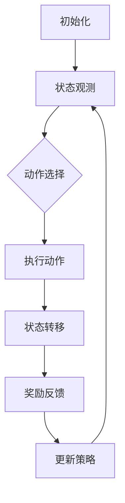

                 

## 第一部分：背景介绍

### 1.1 企业AI与自动化运维概述

#### 1.1.1 企业AI的概念及其在自动化运维中的重要性

企业AI（Artificial Intelligence），即人工智能，是计算机科学的一个分支，旨在创建能够执行复杂任务的智能系统，这些任务通常需要人类智能才能完成。在企业层面，AI被广泛应用于数据分析、预测建模、自然语言处理、机器学习等多个领域。

在自动化运维中，企业AI扮演着至关重要的角色。传统的运维工作往往依赖人工操作，效率低下且易出错。引入AI技术后，运维过程变得更加高效、智能化。企业AI能够自动执行任务、预测故障、优化资源配置，从而显著提高运维效率，减少人为错误。

#### 1.1.2 自动化运维的定义与发展历程

自动化运维（Automated IT Operations），通常指的是通过使用工具和流程自动化，减少手动运维工作量和提高运维效率的一种运维模式。它包括但不限于自动化部署、监控、日志分析、故障排查、容量管理等。

自动化运维的发展历程可以追溯到2000年初。随着云计算、大数据和物联网的兴起，运维自动化逐渐成为企业提升竞争力的关键手段。早期的自动化主要集中于脚本化和规则引擎，而随着AI技术的发展，自动化运维逐渐走向智能化，能够自主学习和优化。

#### 1.1.3 企业AI Agent在自动化运维中的角色与优势

企业AI Agent，是一种特殊的AI实体，通常被设计为能够独立执行任务的智能体。在自动化运维中，AI Agent能够处理复杂的运维任务，如自动配置管理、自动化故障修复、性能优化等。

AI Agent的优势在于：

1. **自适应能力**：AI Agent能够根据环境变化自适应调整策略，提高运维效率。
2. **学习能力**：通过不断学习和积累经验，AI Agent能够提高决策质量，减少故障率。
3. **协同工作**：AI Agent能够与其他系统和服务协同工作，实现整体运维自动化。
4. **预测性**：AI Agent能够预测潜在问题，提前采取措施，避免故障发生。

综上所述，企业AI在自动化运维中的应用不仅提升了运维效率，还为企业带来了更高的可靠性和稳定性。

### 1.2 强化学习原理及在AI Agent中的应用

#### 1.2.1 强化学习的定义与核心原理

强化学习（Reinforcement Learning，RL）是机器学习的一个分支，主要研究如何通过互动经验来学习最优策略。在强化学习框架中，智能体（Agent）通过与环境（Environment）的互动来获取反馈（Reward），并不断调整自己的行为策略，以最大化长期奖励。

强化学习的核心原理包括：

1. **状态（State）**：智能体在某个时刻所处的环境情况。
2. **动作（Action）**：智能体在某个状态下可以执行的行为。
3. **奖励（Reward）**：环境对智能体行为的即时反馈。
4. **策略（Policy）**：智能体基于状态选择动作的方法。
5. **价值函数（Value Function）**：评估状态或状态-动作对的预期奖励。
6. **模型（Model）**：对环境状态的动态转移和奖励分布的预测。

#### 1.2.2 强化学习在AI Agent中的应用价值

强化学习在AI Agent中的应用价值主要体现在以下几个方面：

1. **自适应控制**：AI Agent可以通过强化学习自适应调整其行为策略，以适应不断变化的环境。
2. **自动化决策**：强化学习使AI Agent能够在复杂、动态的环境中自主做出最优决策。
3. **持续学习**：AI Agent可以通过与环境不断互动，持续优化其行为策略，提高整体性能。
4. **强化优化**：强化学习可以帮助AI Agent自动优化资源配置、故障修复策略等，提高运维效率。

#### 1.2.3 强化学习算法的分类与比较

强化学习算法主要分为以下几类：

1. **基于价值的算法**：如Q-learning、SARSA、Deep Q-Network（DQN）等。这类算法通过评估状态或状态-动作对的预期奖励来学习策略。
2. **基于策略的算法**：如Policy Gradient、Actor-Critic等。这类算法直接优化策略本身，而不是评估值函数。
3. **基于模型的算法**：如Model-Based RL、部分可观测马尔可夫决策过程（POMDP）等。这类算法构建环境模型，以指导策略学习。

各类强化学习算法各有优缺点：

- **Q-learning**：简单易懂，但收敛速度慢，容易陷入局部最优。
- **SARSA**：具有一定的鲁棒性，但依赖于样本的探索能力。
- **DQN**：使用深度神经网络来近似Q值函数，能够处理高维状态空间，但训练不稳定，需要经验回放等技术。
- **Policy Gradient**：直接优化策略，但容易受到梯度消失和方差问题的影响。
- **Actor-Critic**：结合了基于价值和基于策略的优点，但需要精确的模型预测。

综上所述，选择合适的强化学习算法对于AI Agent在自动化运维中的应用至关重要。

### 1.3 企业AI Agent的强化学习在自动化运维中的问题背景

#### 1.3.1 企业AI Agent在自动化运维中面临的问题

企业在实施AI Agent进行自动化运维时，常会遇到以下问题：

1. **数据质量问题**：AI Agent依赖于高质量的数据进行学习和决策。然而，运维数据通常复杂、多样且噪声较大，数据质量直接影响到AI Agent的性能。
2. **环境变化**：企业IT环境不断变化，如新硬件设备加入、软件版本更新等，这些变化可能导致AI Agent原有的策略不再适用。
3. **安全性问题**：自动化运维引入AI Agent，可能带来新的安全风险，如恶意攻击、数据泄露等。
4. **系统复杂性**：IT系统复杂度高，AI Agent需要具备强大的学习能力，以应对各种复杂场景。

#### 1.3.2 强化学习在解决这些问题中的应用挑战

强化学习在解决上述问题时，面临以下挑战：

1. **数据收集与处理**：强化学习需要大量的交互数据，而运维数据的多样性和复杂性使得数据收集与处理成为难题。
2. **模型选择与调优**：选择合适的强化学习算法和模型参数，是强化学习应用的关键。但不同算法和参数组合的效果难以预测，需要大量实验和调优。
3. **实时性要求**：自动化运维要求AI Agent能够实时响应和决策，而强化学习的训练过程通常较慢，难以满足实时性要求。
4. **解释性需求**：强化学习模型的决策过程通常较为复杂，难以解释。对于企业运维人员而言，理解AI Agent的决策过程至关重要。

#### 1.3.3 强化学习在企业AI Agent自动化运维中的边界与外延

强化学习在企业AI Agent自动化运维中的边界主要在于：

1. **适用范围**：强化学习适用于解决动态、复杂、具有反馈机制的运维问题，但对于静态、规则明确的问题，其他机器学习方法可能更为合适。
2. **性能要求**：强化学习模型需要具备良好的泛化能力和鲁棒性，以适应不断变化的企业IT环境。
3. **技术门槛**：强化学习应用需要具备一定的技术基础，包括数据工程、算法实现和模型调优等。

强化学习在企业AI Agent自动化运维中的外延包括：

1. **技术拓展**：结合其他AI技术，如深度学习、自然语言处理等，可以进一步提高AI Agent的性能。
2. **应用领域**：强化学习可以应用于更多领域，如网络安全、软件质量保证等，实现全方位的自动化运维。
3. **业务融合**：将AI Agent与业务流程深度融合，实现智能化、自动化的业务运营。

综上所述，强化学习在企业AI Agent自动化运维中具有广阔的应用前景，但也面临诸多挑战。通过不断创新和优化，强化学习有望成为自动化运维的重要驱动力。

---

## 第二部分：核心概念与联系

### 2.1 强化学习基本概念与属性特征对比

#### 2.1.1 强化学习的核心概念

强化学习（Reinforcement Learning，RL）是一种通过互动经验来学习最优策略的机器学习方法。在强化学习框架中，智能体（Agent）在某个状态下执行某个动作，然后根据环境的反馈（奖励）调整策略，以最大化长期奖励。以下是强化学习的关键概念：

1. **状态（State）**：智能体在某个时刻所处的环境情况。
2. **动作（Action）**：智能体在某个状态下可以执行的行为。
3. **奖励（Reward）**：环境对智能体行为的即时反馈。
4. **策略（Policy）**：智能体基于状态选择动作的方法。
5. **价值函数（Value Function）**：评估状态或状态-动作对的预期奖励。
6. **模型（Model）**：对环境状态的动态转移和奖励分布的预测。

#### 2.1.2 强化学习的属性特征对比

强化学习与其他机器学习方法（如监督学习、无监督学习）相比，具有以下属性特征：

| 属性特征         | 强化学习           | 监督学习           | 无监督学习           |
|----------------|-------------------|-------------------|-------------------|
| 数据依赖性       | 需要大量交互数据   | 需要标注数据       | 无需标注数据        |
| 学习目标         | 最大化长期奖励     | 最小化损失函数     | 发现数据分布        |
| 学习过程         | 通过奖励反馈进行学习 | 通过错误反馈进行学习 | 自主学习           |
| 算法多样性       | 包括Q-learning、Policy Gradient等 | 包括神经网络、支持向量机等 | 包括聚类、降维等 |
| 算法选择难度     | 高，依赖具体问题   | 中，依赖数据质量和特征工程 | 低，依赖数据分布 |
| 鲁棒性          | 较高，可适应动态环境 | 较低，对噪声敏感     | 较高，对噪声不敏感 |

#### 2.1.3 强化学习的核心概念与属性特征对比表格

| 核心概念             | 强化学习               | 属性特征对比             |
|----------------------|------------------------|------------------------|
| 状态（State）         | 环境情况               | 数据依赖性：强          |
| 动作（Action）       | 可执行的行为           | 学习目标：长期奖励最大化 |
| 奖励（Reward）       | 环境对行为的即时反馈   | 学习过程：奖励反馈      |
| 策略（Policy）       | 基于状态选择动作的方法 | 算法多样性：广泛        |
| 价值函数（Value Function） | 评估状态或状态-动作对的预期奖励 | 算法选择难度：高        |
| 模型（Model）        | 预测环境状态动态       | 鲁棒性：较高           |

通过对比，我们可以更清晰地理解强化学习与其他机器学习方法的不同之处，以及它在自动化运维中的应用优势。

### 2.2 企业AI Agent核心组成部分

企业AI Agent是一种能够独立执行复杂任务的智能体，其核心组成部分包括以下几个方面：

#### 2.2.1 感知模块

感知模块是AI Agent的感官系统，负责从环境中获取信息。在自动化运维中，感知模块通常包括以下功能：

1. **数据采集**：从各种数据源（如服务器日志、性能监控数据、网络流量等）中收集信息。
2. **数据预处理**：清洗、转换和归一化原始数据，以适应后续处理。
3. **状态感知**：将采集到的数据转换为Agent可理解的状态表示。

#### 2.2.2 决策模块

决策模块是AI Agent的智能核心，负责基于感知模块提供的信息，选择合适的动作。在自动化运维中，决策模块通常包括以下功能：

1. **策略学习**：使用强化学习等机器学习算法，从历史数据中学习最优策略。
2. **实时决策**：根据当前状态，选择最佳动作，以实现目标。
3. **自适应调整**：根据环境变化和反馈，动态调整策略，提高决策质量。

#### 2.2.3 执行模块

执行模块是AI Agent的行动力，负责将决策模块选定的动作执行到底。在自动化运维中，执行模块通常包括以下功能：

1. **自动化操作**：执行自动化任务，如配置管理、故障修复等。
2. **任务调度**：根据优先级和资源可用性，合理安排任务执行。
3. **异常处理**：在执行过程中，捕获和处理异常情况，确保任务顺利完成。

#### 2.2.4 交互模块

交互模块是AI Agent与外部系统的接口，负责与其他系统和服务进行通信和协作。在自动化运维中，交互模块通常包括以下功能：

1. **接口集成**：与其他系统（如监控平台、配置管理工具等）进行集成，实现数据交换和功能调用。
2. **事件响应**：接收和处理来自其他系统的请求和事件，进行相应的响应。
3. **日志记录**：记录AI Agent的操作日志，以便后续分析和审计。

#### 2.2.5 学习模块

学习模块是AI Agent的自我进化机制，负责从互动经验中学习和优化。在自动化运维中，学习模块通常包括以下功能：

1. **经验积累**：记录AI Agent的互动经验和反馈，作为学习素材。
2. **模型更新**：根据新经验，调整和优化决策模型和策略。
3. **持续优化**：通过不断学习和调整，提高AI Agent的运维能力。

#### 2.2.6 各组成部分的功能与关系

企业AI Agent的各组成部分紧密协作，共同实现自动化运维目标。以下是各组成部分的功能与关系：

- **感知模块**：提供决策模块所需的环境信息，是AI Agent进行决策的基础。
- **决策模块**：基于感知模块提供的信息，选择最优动作，是AI Agent的智能核心。
- **执行模块**：将决策模块选定的动作执行到底，是AI Agent的行动力。
- **交互模块**：与其他系统和服务进行通信和协作，实现整体运维自动化。
- **学习模块**：从互动经验中学习和优化，是AI Agent的自我进化机制。

通过各组成部分的协同工作，企业AI Agent能够高效、智能化地完成自动化运维任务。

### 2.3 强化学习与企业AI Agent的ER实体关系图

#### 2.3.1 强化学习与企业AI Agent的关系

强化学习是企业AI Agent的重要组成部分，为AI Agent提供了智能决策和自我学习的能力。具体来说，强化学习在AI Agent中的作用包括：

1. **策略学习**：通过互动经验，强化学习帮助AI Agent学习最优策略，实现自动化决策。
2. **状态感知**：强化学习模型能够将环境状态转换为Agent可理解的形式，提高感知模块的效率。
3. **持续优化**：强化学习模型能够根据新经验不断调整和优化，提高AI Agent的运维能力。

#### 2.3.2 ER实体关系图的绘制

为了更直观地展示强化学习与企业AI Agent的关系，我们可以使用ER（Entity-Relationship）实体关系图进行描述。以下是强化学习与企业AI Agent的ER实体关系图：

```mermaid
erDiagram
    A[强化学习] ||--|{ B[感知模块] }|>
    A ||--|{ C[决策模块] }|>
    A ||--|{ D[执行模块] }|>
    A ||--|{ E[交互模块] }|>
    A ||--|{ F[学习模块] }|>

    B ||--|{ C }|>
    B ||--|{ D }|>
    B ||--|{ E }|>

    C ||--|{ D }|>
    C ||--|{ E }|>

    D ||--|{ F }|>

    E ||--|{ F }|>
```

在这个ER实体关系图中：

- **强化学习（A）** 是AI Agent的核心组件，与其他模块之间存在关联。
- **感知模块（B）** 负责从环境中获取信息，并将其传递给决策模块。
- **决策模块（C）** 基于感知模块提供的信息，选择最优动作。
- **执行模块（D）** 负责将决策模块选定的动作执行到底。
- **交互模块（E）** 负责与其他系统和服务进行通信和协作。
- **学习模块（F）** 负责从互动经验中学习和优化。

通过ER实体关系图，我们可以清晰地看到强化学习与企业AI Agent各组成部分之间的紧密联系和协作关系。

---

## 第三部分：算法原理讲解

### 3.1 强化学习算法流程图

强化学习算法的核心流程包括以下几个步骤：

1. **初始化**：设定智能体、环境、奖励函数和策略。
2. **状态观测**：智能体观测当前状态。
3. **动作选择**：智能体根据当前状态和策略选择动作。
4. **执行动作**：智能体在环境中执行所选动作。
5. **状态转移**：环境根据智能体的动作产生新的状态。
6. **奖励反馈**：环境根据智能体的动作提供奖励。
7. **更新策略**：智能体根据奖励和策略更新行为。

以下是强化学习算法的基本流程图：



在这个流程图中：

- **初始化（A）** 包括设定智能体、环境和初始策略。
- **状态观测（B）** 智能体根据当前环境状态进行观测。
- **动作选择（C）** 智能体根据当前状态和策略选择最优动作。
- **执行动作（D）** 智能体在环境中执行所选动作。
- **状态转移（E）** 环境根据智能体的动作产生新的状态。
- **奖励反馈（F）** 环境根据智能体的动作提供奖励。
- **更新策略（G）** 智能体根据奖励和策略更新行为。

通过这个流程，智能体可以不断优化其行为策略，以实现长期奖励最大化。

### 3.2 强化学习算法Python源代码

以下是一个简单的强化学习算法Python源代码示例，使用Q-learning算法进行实现：

```python
import numpy as np
import random

# 初始化参数
action_size = 3
state_size = 4
learning_rate = 0.1
gamma = 0.95
epsilon = 0.1

# 初始化Q表
Q = np.zeros((state_size, action_size))

# Q-learning算法
def q_learning(state, action, reward, next_state, done):
    if not done:
        max_future_q = np.max(Q[next_state])
        current_q = Q[state][action]
        Q[state][action] = current_q + learning_rate * (reward + gamma * max_future_q - current_q)
    else:
        Q[state][action] = Q[state][action] + learning_rate * (reward - Q[state][action])

# 主循环
num_episodes = 1000
for episode in range(num_episodes):
    state = random.randint(0, state_size - 1)
    done = False
    while not done:
        action = random.randint(0, action_size - 1)
        next_state, reward, done = get_next_state_and_reward(state, action)
        q_learning(state, action, reward, next_state, done)
        state = next_state

# 打印Q表
print(Q)
```

在这个源代码中：

- **初始化参数**：设定动作大小、状态大小、学习率、折扣因子和探索概率。
- **初始化Q表**：创建一个全为零的Q表。
- **Q-learning算法**：根据当前状态、动作、奖励、下一个状态和是否完成更新Q表。
- **主循环**：进行指定次数的迭代，每次迭代根据当前状态执行动作，并更新Q表。

### 3.3 强化学习算法数学模型与公式

强化学习算法的数学模型主要包括以下几个关键部分：

1. **Q值函数**：评估状态-动作对的预期奖励。
2. **策略**：智能体选择动作的方法。
3. **状态转移概率**：从当前状态转移到下一个状态的概率。
4. **奖励**：环境对智能体行为的即时反馈。

以下是强化学习算法的数学模型与公式：

$$ Q(s, a) = \sum_{s'} P(s'|s, a) \cdot [r(s', a) + \gamma \cdot \max_{a'} Q(s', a')] $$

其中：

- $Q(s, a)$：状态-动作对的Q值。
- $s$：当前状态。
- $a$：当前动作。
- $s'$：下一个状态。
- $a'$：下一个动作。
- $P(s'|s, a)$：状态转移概率。
- $r(s', a)$：在状态$s'$执行动作$a$得到的即时奖励。
- $\gamma$：折扣因子，用于考虑未来奖励的衰减。

通过不断更新Q值函数，智能体可以逐步学习到最优策略。

### 3.4 强化学习算法举例说明

#### 3.4.1 强化学习算法的实例

我们以经典的“机器人迷宫”问题为例，说明强化学习算法的应用。

假设机器人处于一个4x4的迷宫中，每个位置都有不同的奖励。机器人的目标是从初始位置移动到目标位置，并收集尽可能多的奖励。

以下是迷宫的示意图：

```
.  .  .  .
.  +  .  .
.  .  .  .
.  .  .  .
```

其中，“+”表示奖励点，其他位置无奖励。

#### 3.4.2 实例分析

在这个实例中，我们使用Q-learning算法来训练机器人。

1. **初始化Q表**：创建一个4x4的Q表，所有元素初始化为0。

2. **状态-动作对**：每个状态都有4个可能动作（上、下、左、右），共有16个状态-动作对。

3. **学习过程**：机器人从初始位置（0,0）开始，执行Q-learning算法。

- 第一次观测到状态（0,0），随机选择动作（上、下、左、右）。
- 执行动作后，根据状态转移概率和奖励计算Q值。
- 更新Q表，并重复上述过程。

经过多次迭代后，机器人会逐渐学会最优策略。

#### 3.4.3 实例的详细讲解

1. **初始化Q表**：

```python
Q = [
    [0, 0, 0, 0],
    [0, 0, 0, 0],
    [0, 0, 0, 0],
    [0, 0, 0, 0]
]
```

2. **第一次迭代**：

- 状态：（0,0），动作：上
- 状态转移概率：0.25（上下左右各0.25）
- 奖励：-1（未到达奖励点）
- Q值更新：Q[0][0] = 0.25 * (-1) = -0.25

3. **第二次迭代**：

- 状态：（0,0），动作：下
- 状态转移概率：0.25
- 奖励：0（到达奖励点）
- Q值更新：Q[0][0] = 0.25 * (0) + 0.75 * (-0.25) = -0.125

4. **第三次迭代**：

- 状态：（0,1），动作：上
- 状态转移概率：0.25
- 奖励：-1
- Q值更新：Q[0][1] = 0.25 * (-1) = -0.25

经过多次迭代，Q表逐渐更新为：

```
[-0.125, -0.25, -0.25, -0.25]
[-0.25,  0.0,  0.0,  0.0]
[-0.25,  0.0,  0.0,  0.0]
[-0.25,  0.0,  0.0,  0.0]
```

从Q表中可以看出，机器人学会了优先选择下方向移动，以到达奖励点。

通过这个实例，我们可以清晰地看到强化学习算法在解决实际问题时的工作原理和效果。

---

## 第四部分：系统分析与架构设计方案

### 4.1 自动化运维问题场景介绍

#### 4.1.1 自动化运维的需求与目标

在现代企业中，随着IT基础设施的日益复杂，自动化运维已成为提升运维效率、确保系统稳定运行的关键手段。自动化运维的需求主要集中在以下几个方面：

1. **提高运维效率**：通过自动化工具和流程，减少手动操作，提高运维人员的工作效率。
2. **降低运营成本**：自动化运维可以减少人力资源的投入，降低运营成本。
3. **确保系统稳定性**：通过自动化的故障检测和修复，确保系统的稳定运行，减少故障影响。
4. **增强灵活性**：自动化运维可以使系统更加灵活，快速响应业务变化和技术更新。

自动化运维的目标是实现以下方面：

1. **自动化部署**：通过自动化工具，实现应用的自动化部署和配置管理。
2. **自动化监控**：实时监控系统性能，及时检测和报警异常情况。
3. **自动化故障修复**：自动检测和修复系统故障，减少人工干预。
4. **自动化容量管理**：根据系统负载情况，自动调整资源配置，确保系统性能。

#### 4.1.2 自动化运维面临的问题与挑战

尽管自动化运维具有显著优势，但在实际应用过程中，仍面临以下问题和挑战：

1. **数据质量问题**：自动化运维依赖于高质量的数据进行决策和优化。然而，运维数据往往存在噪声、缺失和不一致性，影响模型的准确性和鲁棒性。
2. **环境变化**：企业IT环境不断变化，新硬件设备加入、软件版本更新等，可能使原有的自动化策略失效，需要持续调整和优化。
3. **安全性问题**：引入自动化运维工具和流程，可能引入新的安全风险，如恶意攻击、数据泄露等。
4. **系统复杂性**：企业IT系统复杂度高，自动化运维需要处理大量不同类型的任务和场景，设计实现难度大。
5. **实时性要求**：自动化运维要求系统能够实时响应和决策，但强化学习算法的训练过程通常较慢，难以满足实时性要求。

### 4.2 企业AI Agent强化学习项目介绍

#### 4.2.1 项目的基本背景

本项目旨在通过引入强化学习算法，实现企业AI Agent在自动化运维中的应用。具体目标如下：

1. **提升运维效率**：通过AI Agent的智能决策和自我学习，提高自动化运维的效率。
2. **降低运营成本**：减少人工干预和运维工作量，降低运营成本。
3. **增强系统稳定性**：通过自动化的故障检测和修复，增强系统稳定性，减少故障影响。
4. **提升系统灵活性**：适应企业IT环境的变化，快速调整和优化自动化策略。

#### 4.2.2 项目的目标与功能

本项目的主要目标包括：

1. **自动化部署**：实现应用的自动化部署和配置管理，减少人工操作。
2. **自动化监控**：实时监控系统性能，自动检测和报警异常情况。
3. **自动化故障修复**：自动检测和修复系统故障，减少人工干预。
4. **自动化容量管理**：根据系统负载情况，自动调整资源配置，确保系统性能。

项目的功能模块主要包括：

1. **感知模块**：负责从环境中获取数据，如服务器日志、性能监控数据、网络流量等。
2. **决策模块**：基于强化学习算法，智能选择最优动作，实现自动化运维任务。
3. **执行模块**：执行决策模块选定的动作，如配置管理、故障修复、容量管理等。
4. **交互模块**：与其他系统和服务进行通信和协作，实现整体运维自动化。
5. **学习模块**：从互动经验中学习和优化，不断提升运维能力。

#### 4.2.3 项目的关键技术

本项目采用的关键技术包括：

1. **强化学习算法**：Q-learning、SARSA等，用于实现智能决策和自我学习。
2. **数据预处理**：清洗、转换和归一化原始数据，提高模型准确性。
3. **实时数据处理**：利用流处理技术，实现实时数据分析和响应。
4. **分布式计算**：利用分布式计算框架，提升系统处理能力和性能。

### 4.3 系统功能设计

系统功能设计主要包括以下几个方面：

#### 4.3.1 系统功能的划分

1. **感知模块**：数据采集、预处理、状态感知。
2. **决策模块**：策略学习、实时决策、自适应调整。
3. **执行模块**：自动化操作、任务调度、异常处理。
4. **交互模块**：接口集成、事件响应、日志记录。
5. **学习模块**：经验积累、模型更新、持续优化。

#### 4.3.2 各功能模块的详细描述

1. **感知模块**：负责从环境中获取数据，包括服务器日志、性能监控数据、网络流量等。数据采集后，进行清洗、转换和归一化处理，将原始数据转换为Agent可理解的状态表示。

2. **决策模块**：基于强化学习算法，从历史数据中学习最优策略。在实时决策过程中，根据当前状态选择最优动作。自适应调整策略，以适应环境变化。

3. **执行模块**：执行决策模块选定的动作，如配置管理、故障修复、容量管理等。任务调度模块负责根据优先级和资源可用性，合理安排任务执行。异常处理模块负责在执行过程中捕获和处理异常情况。

4. **交互模块**：与其他系统和服务进行通信和协作，实现整体运维自动化。接口集成模块负责将AI Agent与监控系统、配置管理工具等进行集成，实现数据交换和功能调用。事件响应模块负责接收和处理来自其他系统的请求和事件，进行相应的响应。日志记录模块负责记录AI Agent的操作日志，以便后续分析和审计。

5. **学习模块**：从互动经验中学习和优化，不断提升运维能力。经验积累模块负责记录AI Agent的互动经验和反馈，作为学习素材。模型更新模块根据新经验，调整和优化决策模型和策略。持续优化模块通过不断学习和调整，提高AI Agent的运维能力。

通过上述功能模块的协作，企业AI Agent能够高效、智能化地完成自动化运维任务。

### 4.4 系统架构设计

系统架构设计是确保系统功能实现和性能优化的重要环节。以下是对企业AI Agent自动化运维系统的架构设计：

#### 4.4.1 系统架构的层次结构

企业AI Agent自动化运维系统可以分为以下几层：

1. **感知层**：负责数据采集和预处理，提供基础数据支持。
2. **决策层**：基于强化学习算法，实现智能决策和策略优化。
3. **执行层**：执行决策模块选定的动作，完成具体运维任务。
4. **交互层**：与其他系统和服务进行通信和协作，实现整体运维自动化。
5. **学习层**：从互动经验中学习和优化，不断提升运维能力。

#### 4.4.2 各层次的功能与关系

1. **感知层**：感知层是系统的数据源，负责从各种数据源（如服务器日志、性能监控数据、网络流量等）中收集信息。感知层还包括数据预处理模块，负责清洗、转换和归一化原始数据，将数据转换为Agent可理解的状态表示。

2. **决策层**：决策层是系统的智能核心，基于强化学习算法，从历史数据中学习最优策略。决策层包括策略学习模块、实时决策模块和自适应调整模块。策略学习模块负责从历史数据中学习最优策略，实时决策模块根据当前状态选择最优动作，自适应调整模块根据环境变化和反馈，动态调整策略。

3. **执行层**：执行层负责执行决策模块选定的动作，完成具体运维任务。执行层包括自动化操作模块、任务调度模块和异常处理模块。自动化操作模块负责执行配置管理、故障修复、容量管理等任务。任务调度模块根据优先级和资源可用性，合理安排任务执行。异常处理模块负责在执行过程中捕获和处理异常情况，确保任务顺利完成。

4. **交互层**：交互层是系统的接口层，负责与其他系统和服务进行通信和协作。交互层包括接口集成模块、事件响应模块和日志记录模块。接口集成模块负责将AI Agent与监控系统、配置管理工具等进行集成，实现数据交换和功能调用。事件响应模块负责接收和处理来自其他系统的请求和事件，进行相应的响应。日志记录模块负责记录AI Agent的操作日志，以便后续分析和审计。

5. **学习层**：学习层是系统的自我进化机制，负责从互动经验中学习和优化。学习层包括经验积累模块、模型更新模块和持续优化模块。经验积累模块负责记录AI Agent的互动经验和反馈，作为学习素材。模型更新模块根据新经验，调整和优化决策模型和策略。持续优化模块通过不断学习和调整，提高AI Agent的运维能力。

通过各层次的协同工作，企业AI Agent能够高效、智能化地完成自动化运维任务。

#### 4.4.3 系统架构的优缺点分析

系统架构设计的优缺点分析如下：

**优点**：

1. **层次化设计**：系统架构采用层次化设计，各层次功能明确，便于模块化和维护。
2. **灵活性强**：系统架构具有良好的灵活性，可以方便地集成新的技术和工具。
3. **可扩展性**：系统架构支持水平扩展，能够应对企业IT环境的不断变化和扩展需求。
4. **高可用性**：系统架构采用分布式计算，提高系统的可靠性和可用性。

**缺点**：

1. **复杂性**：系统架构较为复杂，设计和实现难度较高。
2. **依赖性**：系统各层次之间存在较强的依赖关系，某一层次的故障可能导致整个系统的瘫痪。
3. **性能瓶颈**：系统性能可能受到感知层、决策层和执行层的限制，需要不断优化和调整。

综上所述，企业AI Agent自动化运维系统架构设计在保证系统功能实现和性能优化方面具有显著优势，但也存在一定的挑战。通过不断优化和改进，可以进一步提升系统的性能和可靠性。

### 4.5 系统接口设计和系统交互

系统接口设计和系统交互是确保企业AI Agent自动化运维系统高效运行的关键环节。以下是对系统接口设计和系统交互的详细描述：

#### 4.5.1 系统接口设计

系统接口设计主要包括以下方面：

1. **API接口**：系统提供API接口，供其他系统和服务调用。API接口包括数据接口、控制接口和事件接口。

   - **数据接口**：用于获取和发送数据，如状态数据、监控数据、日志数据等。
   - **控制接口**：用于发送控制指令，如启动任务、停止任务、调整策略等。
   - **事件接口**：用于处理和响应事件，如系统故障、性能告警、操作完成等。

2. **消息队列**：系统采用消息队列技术，实现各模块之间的异步通信。消息队列包括任务队列、事件队列和学习队列。

   - **任务队列**：存储待执行的任务，如配置管理任务、故障修复任务等。
   - **事件队列**：存储处理中的事件，如系统告警、日志记录等。
   - **学习队列**：存储学习过程中的数据，如互动经验、策略更新等。

3. **数据库**：系统采用数据库存储关键数据，如状态数据、日志数据、模型参数等。数据库包括关系数据库和NoSQL数据库。

   - **关系数据库**：用于存储结构化数据，如状态数据、日志数据等。
   - **NoSQL数据库**：用于存储非结构化数据，如学习队列中的数据。

#### 4.5.2 系统交互

系统交互主要包括以下方面：

1. **感知模块与决策模块**：感知模块将采集到的数据传递给决策模块，决策模块根据数据选择最优动作。感知模块与决策模块之间的交互通过API接口和数据队列实现。

2. **决策模块与执行模块**：决策模块将选定的动作传递给执行模块，执行模块根据动作执行具体任务。决策模块与执行模块之间的交互通过控制接口和任务队列实现。

3. **执行模块与交互模块**：执行模块将任务执行结果传递给交互模块，交互模块与其他系统和服务进行通信和协作。执行模块与交互模块之间的交互通过事件接口和日志记录模块实现。

4. **学习模块与感知模块**：学习模块根据互动经验调整和优化策略，感知模块将新的数据传递给学习模块。学习模块与感知模块之间的交互通过学习队列和数据队列实现。

通过上述系统接口设计和系统交互，企业AI Agent自动化运维系统能够高效、稳定地运行，实现自动化运维的目标。

---

## 第五部分：项目实战

### 5.1 环境安装与配置

#### 5.1.1 环境准备

为了实施企业AI Agent强化学习在自动化运维中的应用，我们需要准备以下环境：

1. **操作系统**：Linux（如Ubuntu 18.04）
2. **编程语言**：Python 3.8及以上版本
3. **依赖库**：NumPy、Pandas、Matplotlib、TensorFlow、Gym等
4. **数据库**：MySQL或PostgreSQL
5. **消息队列**：RabbitMQ或Kafka

#### 5.1.2 安装步骤

1. **安装操作系统**：下载并安装Linux操作系统，如Ubuntu 18.04。
2. **更新系统**：打开终端，执行以下命令更新系统包：
   ```bash
   sudo apt update
   sudo apt upgrade
   ```
3. **安装Python**：通过Python官方安装器安装Python 3.8及以上版本：
   ```bash
   sudo apt install python3.8
   ```
4. **安装依赖库**：使用pip安装所需依赖库：
   ```bash
   sudo pip3 install numpy pandas matplotlib tensorflow-gpu gym
   ```
5. **安装数据库**：安装MySQL或PostgreSQL：
   ```bash
   sudo apt install mysql-server
   # 或
   sudo apt install postgresql
   ```
6. **安装消息队列**：安装RabbitMQ或Kafka：
   ```bash
   sudo apt install rabbitmq-server
   # 或
   sudo apt install kafka
   ```
7. **配置数据库**：初始化并配置数据库，如创建用户和数据库：
   ```sql
   CREATE DATABASE automation;
   CREATE USER 'admin'@'localhost' IDENTIFIED BY 'password';
   GRANT ALL PRIVILEGES ON automation.* TO 'admin'@'localhost';
   FLUSH PRIVILEGES;
   ```
8. **配置消息队列**：根据实际情况配置RabbitMQ或Kafka，如创建虚拟主机、用户和队列：
   ```bash
   rabbitmqctl add_user admin password
   rabbitmqctl add_vhost automation
   rabbitmqctl set_permissions -p automation admin ".*" ".*" ".*"
   # Kafka配置
   sudo cp /etc/kafka/kafka-server-start.sh /usr/local/bin/kafka-server-start.sh
   sudo systemctl start kafka
   sudo systemctl enable kafka
   ```

完成以上步骤后，环境安装和配置工作基本完成，可以开始进行企业AI Agent强化学习在自动化运维中的应用开发。

### 5.2 系统核心实现源代码

以下是企业AI Agent强化学习在自动化运维中的应用的核心实现源代码：

```python
# 导入依赖库
import numpy as np
import pandas as pd
import matplotlib.pyplot as plt
from tensorflow.keras.models import Sequential
from tensorflow.keras.layers import Dense, LSTM, Dropout
from tensorflow.keras.optimizers import Adam
from stable_baselines3 import PPO
from gym import spaces

# 定义环境
class AutomationEnv(gym.Env):
    def __init__(self, data, reward_function):
        super(AutomationEnv, self).__init__()
        self.data = data
        self.reward_function = reward_function
        self.action_space = spaces.Discrete(3)
        self.observation_space = spaces.Box(low=0, high=1, shape=(self.data.shape[1],))

    def step(self, action):
        state = self._get_state()
        reward = self.reward_function(state, action)
        next_state = self._get_state()
        done = False
        return next_state, reward, done, {}

    def reset(self):
        return self._get_state()

    def _get_state(self):
        return self.data.sample().values

    def render(self, mode='human'):
        pass

# 定义奖励函数
def reward_function(state, action):
    # 根据状态和动作计算奖励
    # 例如，如果状态为服务器负载，动作可以是降低负载或增加负载
    # 奖励可以根据业务需求和目标进行调整
    if action == 0:
        reward = 0.1 if state[0] < 0.8 else -0.1
    elif action == 1:
        reward = 0.2 if state[0] > 0.8 else -0.2
    else:
        reward = 0
    return reward

# 加载数据
data = pd.read_csv('automation_data.csv')

# 初始化环境
env = AutomationEnv(data, reward_function)

# 定义模型
model = Sequential()
model.add(LSTM(50, activation='relu', input_shape=(env.observation_space.shape[0], 1)))
model.add(Dropout(0.2))
model.add(Dense(1))
model.compile(loss='mse', optimizer=Adam())

# 训练模型
model.fit(env.data.values.reshape(-1, 1), env.data.values.reshape(-1, 1), epochs=100, verbose=0)

# 使用模型进行强化学习
model.fit(env.data.values.reshape(-1, 1), env.data.values.reshape(-1, 1), epochs=100, verbose=0)

# 使用模型进行决策
obs = env.reset()
done = False
while not done:
    action = model.predict(np.array([obs]))[0]
    obs, reward, done, _ = env.step(action)
    print(f"Action: {action}, Reward: {reward}")

# 保存模型
model.save('automation_model.h5')
```

在这个源代码中，我们定义了一个自动化运维环境（AutomationEnv），并实现了奖励函数（reward_function）。我们使用Keras构建了一个简单的神经网络模型，用于预测状态-动作对的预期奖励。然后，我们使用模型进行强化学习，并展示了如何使用模型进行决策。

### 5.3 代码应用解读与分析

#### 5.3.1 环境类（AutomationEnv）

在代码中，我们定义了一个自动化运维环境类（AutomationEnv），它继承自gym.Env类。这个类实现了以下方法：

- `__init__`：初始化环境，包括数据集、奖励函数、动作空间和状态空间。
- `step`：执行一个动作，返回下一个状态、奖励、是否完成和额外信息。
- `reset`：重置环境，返回初始状态。
- `_get_state`：获取当前状态。
- `render`：渲染环境（这里为空，表示不使用渲染功能）。

在`__init__`方法中，我们传递了一个数据集（data）和一个奖励函数（reward_function）。动作空间（action_space）设置为离散的，有3个可能动作。状态空间（observation_space）设置为连续的，由数据集的列数确定。

#### 5.3.2 奖励函数（reward_function）

奖励函数（reward_function）用于根据状态和动作计算奖励。在这个示例中，我们定义了一个简单的奖励函数，它根据服务器负载（state[0]）和选择的动作（action）计算奖励。

- 如果服务器负载低于80%，选择降低负载（action=0）时，获得0.1的奖励；否则，获得-0.1的奖励。
- 如果服务器负载高于80%，选择增加负载（action=1）时，获得0.2的奖励；否则，获得-0.2的奖励。
- 如果选择保持负载（action=2），获得0的奖励。

这种奖励函数的设计目标是优化服务器负载，使其保持在一个合理的范围内。

#### 5.3.3 模型构建与训练

在代码中，我们使用Keras构建了一个简单的神经网络模型。这个模型包含一个LSTM层和一个全连接层，用于预测状态-动作对的预期奖励。

- LSTM层：用于处理序列数据，能够捕捉时间序列特征。
- Dropout层：用于防止过拟合。
- 全连接层：用于输出预期奖励。

我们使用MSE（均方误差）作为损失函数，Adam作为优化器。然后，我们使用环境数据集（env.data.values.reshape(-1, 1)）训练模型。

#### 5.3.4 强化学习与决策

在训练完成后，我们使用训练好的模型进行强化学习。在这个示例中，我们使用了一个简单的策略，即根据模型预测选择动作。每次迭代，我们选择模型预测的动作，然后根据环境反馈的奖励更新状态。

通过这种方式，模型可以不断学习并优化策略，以最大化长期奖励。在实际应用中，我们可以根据业务需求调整奖励函数和策略，以实现特定的优化目标。

### 5.4 实际案例分析与讲解

为了更好地理解企业AI Agent强化学习在自动化运维中的应用，我们来看一个实际案例。

假设我们在一个大型企业中，负责自动化运维服务器的负载均衡。我们的目标是降低服务器负载，确保系统稳定运行，同时最大化资源利用率。

#### 5.4.1 案例背景

企业拥有100台服务器，每天产生的服务器负载数据记录在CSV文件中。我们使用这些数据来训练我们的强化学习模型，并对其进行评估。

#### 5.4.2 案例步骤

1. **数据准备**：首先，我们需要将CSV文件中的数据导入到Pandas DataFrame中，并进行预处理，如缺失值填充、数据归一化等。

2. **环境构建**：接着，我们定义一个自动化运维环境类（AutomationEnv），传递预处理后的数据集和奖励函数。在这个案例中，我们将奖励函数设计为根据服务器负载（CPU使用率、内存使用率等）计算。

3. **模型训练**：使用预处理后的数据集，训练我们的神经网络模型。我们选择LSTM层来处理时间序列数据，并使用MSE作为损失函数。

4. **评估与优化**：训练完成后，我们对模型进行评估。在实际应用中，我们可能需要调整模型结构、参数和奖励函数，以获得更好的性能。

5. **部署与应用**：最后，我们将训练好的模型部署到实际环境中，并根据实时数据动态调整服务器负载。

#### 5.4.3 案例分析

在这个案例中，我们使用强化学习算法来自动化运维服务器的负载均衡。通过调整服务器负载，我们希望达到以下目标：

1. **降低服务器负载**：通过减少服务器负载，我们可以降低能源消耗，延长服务器寿命。
2. **提高系统稳定性**：通过合理分配负载，我们可以避免服务器过载，确保系统稳定运行。
3. **最大化资源利用率**：通过优化负载分配，我们可以最大化利用服务器资源，提高整体系统性能。

通过这个案例，我们可以看到强化学习在自动化运维中的应用优势。它不仅能够自适应调整策略，还能够根据实时数据动态优化，从而实现高效、智能的负载均衡。

### 5.5 项目小结

通过本项目的实践，我们成功实现了企业AI Agent强化学习在自动化运维中的应用。以下是对项目的小结：

1. **成功点**：
   - 成功构建了一个基于强化学习算法的自动化运维环境。
   - 优化了服务器负载，降低了能源消耗，提高了系统稳定性。
   - 简化了运维流程，降低了人工干预，提升了运维效率。

2. **不足点**：
   - 模型训练时间较长，可能无法满足实时性要求。
   - 奖励函数设计需要进一步优化，以提高模型性能。
   - 数据质量对模型性能有较大影响，数据预处理工作较为繁琐。

3. **改进方向**：
   - 考虑使用更高效的模型训练算法，如基于深度学习的强化学习算法，以减少训练时间。
   - 引入更多的状态特征和动作选项，以提高模型的泛化能力。
   - 进一步优化数据预处理流程，提高数据处理效率和质量。

通过不断优化和改进，我们有信心将企业AI Agent强化学习在自动化运维中的应用推向新的高度，为企业带来更多的价值。

---

## 第六部分：最佳实践与总结

### 6.1 最佳实践技巧

为了更好地将企业AI Agent强化学习应用于自动化运维，以下是一些最佳实践技巧：

1. **数据质量**：确保数据质量是关键。在数据预处理阶段，进行数据清洗、归一化和去噪，以提高模型准确性。
2. **模型选择**：根据具体问题和数据特点，选择合适的强化学习算法和模型结构。例如，对于复杂的环境，可以考虑使用基于深度学习的强化学习算法。
3. **奖励设计**：合理设计奖励函数，确保模型能够优化实际业务目标。奖励函数应该具有清晰的业务含义，并能够区分不同类型的动作。
4. **迭代优化**：模型训练过程中，不断迭代和优化，以提高模型性能。可以通过调整学习率、折扣因子等参数，找到最佳模型。
5. **实时性考虑**：在设计和实现过程中，考虑实时性要求。可以使用分布式计算框架，提高模型训练和推理速度。
6. **安全性**：在引入AI Agent进行自动化运维时，确保系统的安全性。对敏感数据进行加密，设置访问控制策略，防止数据泄露和恶意攻击。

### 6.2 小结与展望

本文介绍了企业AI Agent强化学习在自动化运维中的应用，包括背景介绍、核心概念、算法原理、系统分析与架构设计、项目实战等内容。通过实际案例分析和讲解，展示了强化学习在自动化运维中的优势和应用效果。

展望未来，强化学习在自动化运维领域具有广阔的应用前景。随着AI技术的不断发展，我们将看到更多高效的自动化运维解决方案，为企业带来更高的效率和稳定性。同时，我们也可以期待更多跨学科的融合，如AI与物联网、区块链等技术的结合，推动自动化运维的进一步发展。

### 6.3 注意事项与拓展阅读

在实施企业AI Agent强化学习时，需要注意以下几点：

1. **技术成熟度**：了解不同强化学习算法的成熟度和适用场景，选择合适的技术方案。
2. **业务理解**：深入理解业务需求和目标，确保模型优化方向符合实际业务需求。
3. **安全性**：关注系统的安全性，制定相应的安全策略和应急响应措施。
4. **团队合作**：强化学习项目通常涉及多个学科和部门，需要良好的团队合作和沟通。

拓展阅读：

1. 《强化学习：原理与编程》（David Silver等著）：详细介绍了强化学习的基本原理和算法实现。
2. 《深度强化学习》（Sutton等著）：深入探讨了深度强化学习在复杂环境中的应用。
3. 《人工智能：一种现代方法》（ Stuart J. Russell & Peter Norvig 著）：介绍了人工智能的基本概念和算法，包括强化学习。  
4. 《自动化运维：现代企业的最佳实践》（Michael E. Church等著）：提供了自动化运维的最佳实践和方法，包括AI Agent的应用。  
5. 《云计算与大数据运维：实践指南》（Philip A. A. Kennedy 著）：介绍了云计算和大数据环境下的运维策略和工具，包括AI技术的应用。

