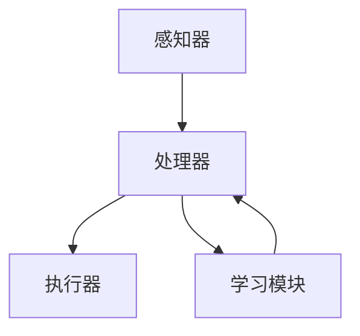
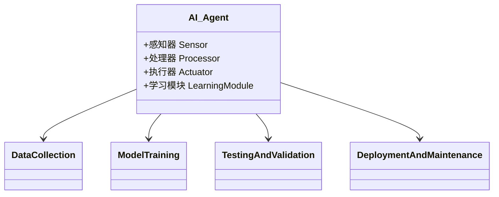
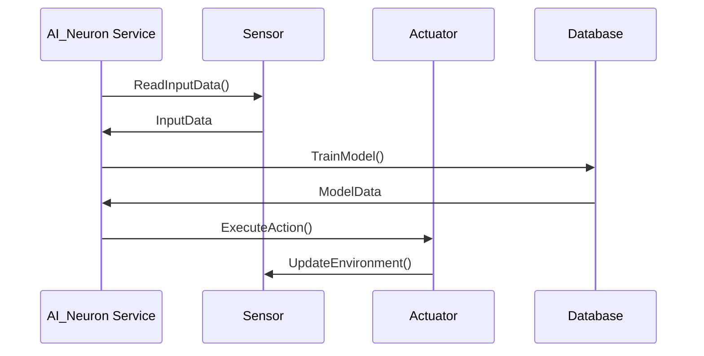
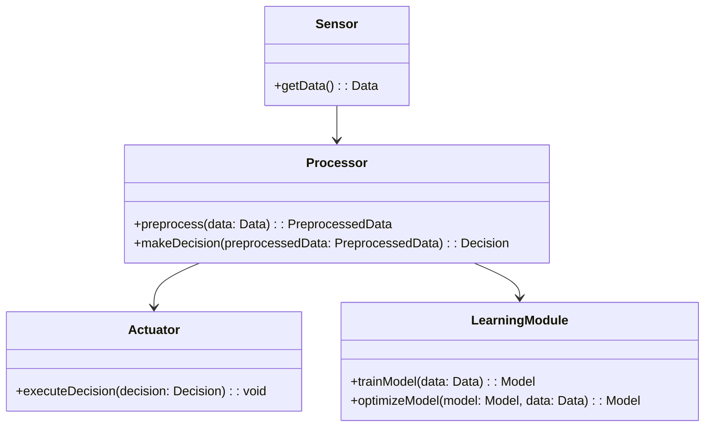
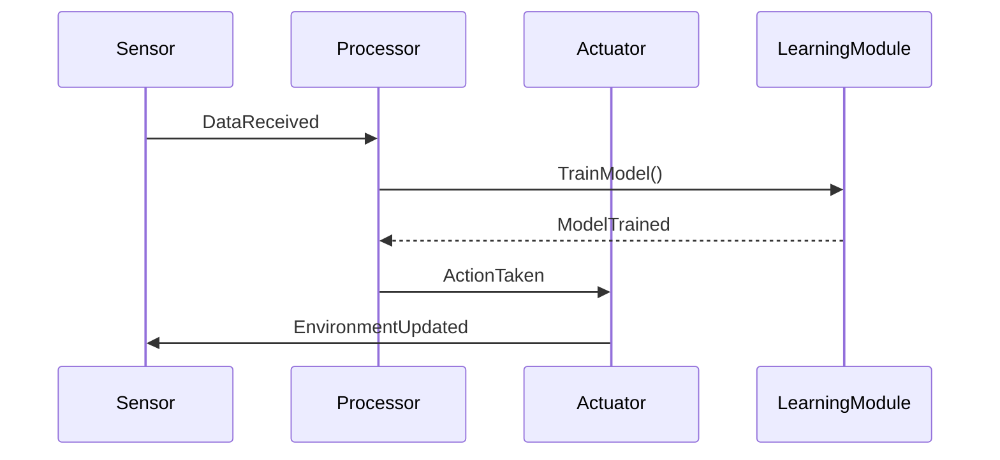

                 


### 文章标题：企业AI Agent的微服务架构设计

关键词：企业AI Agent，微服务架构，AI微服务设计，微服务技术，AI微服务实现，AI微服务应用

摘要：本文将深入探讨企业AI Agent的微服务架构设计，从基础概念到实际实现，详细阐述AI Agent在微服务架构中的角色、优势、设计原则，以及具体的架构实施策略和最佳实践。文章旨在为企业IT专业人士和开发者提供一套全面、实用的AI微服务架构解决方案。

## 目录

1. **引言**
    1.1 问题背景
    1.2 目标和范围
    1.3 阅读对象
    1.4 文章结构

2. **AI Agent基础**
    2.1 AI Agent定义
    2.2 AI Agent类型
    2.3 AI Agent架构
    2.4 AI Agent开发流程
    2.5 AI Agent应用场景
    2.6 AI Agent开发挑战

3. **微服务架构概念**
    3.1 微服务定义
    3.2 微服务优势
    3.3 微服务设计原则
    3.4 微服务相关技术

4. **AI Agent微服务设计**
    4.1 AI Agent微服务架构设计
    4.2 AI Agent微服务组件
    4.3 AI Agent微服务交互模式

5. **架构实施**
    5.1 微服务架构实施策略
    5.2 微服务部署和运维
    5.3 微服务安全监控

6. **API设计与集成**
    6.1 API设计原则
    6.2 API集成方法
    6.3 AI Agent API示例

7. **安全性监控与部署**
    7.1 安全性设计
    7.2 监控策略
    7.3 部署实践

8. **案例研究**
    8.1 案例背景
    8.2 案例实施
    8.3 案例分析

9. **最佳实践与未来趋势**
    9.1 设计最佳实践
    9.2 运维最佳实践
    9.3 未来发展趋势

10. **结论**

---

### 1. 引言

#### 1.1 问题背景

在当今快速发展的数字经济时代，企业面临着越来越多的竞争和变革。为了在激烈的市场环境中保持竞争力，企业需要快速响应市场变化，提高业务流程的效率和灵活性。人工智能（AI）技术的引入被认为是解决这些问题的关键之一。

AI Agent作为AI技术的具体应用，具备自主学习和决策能力，可以协助企业完成复杂任务，如数据分析、预测建模、自动化管理等。然而，随着AI Agent在企业应用中的广泛部署，传统的单体架构逐渐暴露出其扩展性差、维护困难等问题。因此，如何设计一个高效、可扩展的AI Agent微服务架构成为企业IT专业人士面临的重要挑战。

#### 1.2 目标和范围

本文的目标是为企业IT专业人士和开发者提供一套关于企业AI Agent微服务架构设计的全面指南。文章将涵盖以下内容：

- AI Agent的基础概念、类型、架构和开发流程。
- 微服务架构的定义、优势、设计原则和相关技术。
- AI Agent微服务架构的设计和实施策略。
- API设计、安全性监控与部署的最佳实践。
- 案例研究，以展示实际应用中的成功实践。
- 未来发展趋势和最佳实践总结。

#### 1.3 阅读对象

本文适合以下读者群体：

- 企业软件架构师和开发者，对AI技术和微服务架构有基本了解。
- AI研究者和开发人员，希望了解如何将AI Agent集成到微服务架构中。
- 企业IT经理和运维人员，负责AI系统的部署和运维。

#### 1.4 文章结构

本文结构分为十个部分，包括引言、AI Agent基础、微服务架构概念、AI Agent微服务设计、架构实施、API设计与集成、安全性监控与部署、案例研究、最佳实践与未来趋势和结论。每个部分都将逐步深入，从概念介绍到具体实践，帮助读者全面理解并掌握企业AI Agent微服务架构设计的关键技术和方法。

### 2. AI Agent基础

#### 2.1 AI Agent定义

AI Agent，即人工智能代理，是一种具备自主学习和决策能力的软件实体。它能够感知环境，基于预设的目标或规则进行决策，并执行相应的行动。AI Agent的核心在于其自主性，即能够在没有外部直接控制的情况下完成特定的任务。

AI Agent的典型特征包括：

- **感知能力**：通过传感器或数据接口获取环境信息。
- **决策能力**：基于感知到的信息和预设规则或学习到的模式进行决策。
- **行动能力**：执行决策结果，通过执行器或API与外部系统交互。

AI Agent的应用范围非常广泛，从智能家居、无人驾驶到工业自动化、金融服务等，都在不断拓展其应用场景。

#### 2.2 AI Agent类型

根据功能和特点，AI Agent可以分为以下几种类型：

- **反应性Agent**：这种类型的Agent基于感知到的当前环境状态直接作出反应。它们不涉及长期的决策规划，而是对实时事件做出响应。例如，智能家居中的温度调节系统。
- **深思熟虑的Agent**：这类Agent在决策前会进行复杂的分析和规划。它们不仅考虑当前状态，还会预测未来可能发生的情况。自动驾驶汽车是深思熟虑Agent的一个典型例子。
- **目标导向Agent**：目标导向Agent在执行任务时始终以目标为导向，通过不断调整行为来达到目标。例如，金融交易中的自动交易系统。

不同类型的AI Agent在不同的应用场景中具有不同的优势。选择合适的AI Agent类型对于实现高效、可靠的系统至关重要。

#### 2.3 AI Agent架构

AI Agent的架构通常包括以下几个核心组件：

- **感知器**：感知器负责收集环境数据，如传感器、API接口等。
- **处理器**：处理器接收感知器收集到的数据，进行预处理、分析和决策。
- **执行器**：执行器负责将处理器的决策转化为实际动作，如机器人手臂、API调用等。

以下是AI Agent架构的Mermaid流程图：



#### 2.4 AI Agent开发流程

AI Agent的开发流程通常包括以下几个阶段：

1. **需求分析**：确定AI Agent需要完成的具体任务和目标。
2. **设计架构**：根据需求设计AI Agent的架构，包括组件选择和接口定义。
3. **数据收集**：收集训练数据，为AI Agent的学习和训练提供基础。
4. **模型训练**：使用训练数据训练AI Agent的模型，使其能够完成预定的任务。
5. **测试和验证**：通过模拟环境和实际场景测试AI Agent的性能，确保其满足需求。
6. **部署和运维**：将AI Agent部署到生产环境中，进行持续监控和优化。

以下是一个简化的AI Agent开发流程的Mermaid类图：



#### 2.5 AI Agent应用场景

AI Agent的应用场景非常广泛，以下是一些典型的应用场景：

- **智能家居**：AI Agent可以监控家庭环境，调节灯光、温度和安全性设置。
- **无人驾驶**：AI Agent负责处理车辆感知、决策和控制，实现自动驾驶。
- **工业自动化**：AI Agent可以监控生产线，进行质量检测、故障诊断和自动化控制。
- **金融服务**：AI Agent可以协助进行风险评估、投资决策和客户服务。
- **医疗保健**：AI Agent可以辅助诊断、治疗规划和患者管理。

不同应用场景对AI Agent的需求和设计有所不同，但总体目标都是为了提高效率、减少人力成本和提升用户体验。

#### 2.6 AI Agent开发挑战

在AI Agent的开发过程中，可能会遇到以下几个挑战：

- **数据质量**：AI Agent的性能很大程度上取决于训练数据的质量。收集和清洗高质量的训练数据是开发过程中的关键。
- **算法选择**：不同的应用场景需要不同的算法，选择合适的算法对于实现高效、准确的AI Agent至关重要。
- **可解释性**：AI Agent的决策过程需要具备一定的可解释性，以便用户理解和信任其决策结果。
- **安全性**：AI Agent需要在安全的环境中运行，避免被恶意攻击或滥用。

这些挑战需要通过综合考虑技术、数据和伦理等多方面因素来解决。

### 3. 微服务架构概念

#### 3.1 微服务定义

微服务架构（Microservices Architecture）是一种基于组件的分布式系统架构，它将应用程序分解为一组独立的、松耦合的服务。每个服务都负责实现特定的业务功能，并通过轻量级的通信协议（如HTTP RESTful API）进行交互。

微服务的核心特点是：

- **独立性**：每个服务都是独立的，可以单独部署、扩展和更新。
- **自治**：每个服务都有自己独立的数据库和其他资源，不受其他服务的影响。
- **小规模**：服务通常规模较小，专注于完成特定的业务功能。

微服务架构的出现是为了解决单体架构在扩展性、灵活性和维护性方面的不足。通过将应用程序分解为多个独立的服务，可以更好地适应变化和应对复杂业务需求。

#### 3.2 微服务优势

微服务架构具有以下显著优势：

- **可扩展性**：通过独立部署和扩展服务，可以灵活地满足业务需求，提高系统的整体性能。
- **灵活性**：服务之间松耦合，可以独立开发和部署，便于技术创新和业务调整。
- **维护性**：服务独立维护，降低系统复杂度，提高故障定位和修复效率。
- **可重用性**：服务可以独立重构和优化，提高开发效率和资源利用率。

微服务架构的这些优势使其成为现代企业应用架构的首选。

#### 3.3 微服务设计原则

设计微服务架构时，需要遵循以下原则：

- **服务自治**：确保每个服务拥有独立的数据库和其他资源，减少依赖。
- **功能单一**：每个服务专注于完成特定的业务功能，避免过大的功能耦合。
- **松耦合**：服务之间通过轻量级通信协议进行交互，减少直接依赖，提高系统的灵活性。
- **事件驱动**：使用事件驱动模式，使服务能够异步通信，提高系统的扩展性和容错性。

这些设计原则有助于构建高效、可靠和可扩展的微服务架构。

#### 3.4 微服务相关技术

实现微服务架构需要一系列相关的技术和工具：

- **服务注册与发现**：服务注册与发现机制（如Eureka、Consul）用于管理服务的注册和发现，确保服务之间的通信。
- **API网关**：API网关（如Kong、Spring Cloud Gateway）用于统一管理和路由客户端请求，提供安全性和监控功能。
- **容器化技术**：容器化技术（如Docker、Kubernetes）用于部署和运行服务，提高系统的可移植性和扩展性。
- **服务编排**：服务编排工具（如Kubernetes、Apache Camel）用于自动化服务的部署、扩展和管理。
- **分布式事务**：分布式事务框架（如Seata、TCC）用于处理跨服务的分布式事务，确保数据一致性。

这些技术和工具共同构成了微服务架构的实现基础。

### 4. AI Agent微服务设计

#### 4.1 AI Agent微服务架构设计

AI Agent微服务架构设计的目标是创建一个灵活、可扩展且易于维护的系统，以支持企业中多样化的AI应用场景。以下是AI Agent微服务架构设计的关键原则和组件：

1. **服务自治**：确保每个AI Agent服务拥有独立的数据库和其他资源，减少依赖，提高系统的自治性。
2. **功能单一**：每个AI Agent服务应专注于实现特定的AI功能，如感知、决策、执行等，避免过大的功能耦合。
3. **松耦合**：通过轻量级通信协议（如HTTP RESTful API）和服务注册与发现机制（如Eureka）实现服务之间的松耦合，提高系统的灵活性和可扩展性。
4. **事件驱动**：采用事件驱动模式，使AI Agent服务能够异步通信，提高系统的容错性和扩展性。

以下是AI Agent微服务架构的一个示例：



在这个示例中，AI_Neuron服务负责处理感知、训练和决策功能。Sensor服务负责读取环境输入数据，Actuator服务负责执行决策结果，DB服务负责存储模型数据和训练数据。

#### 4.2 AI Agent微服务组件

AI Agent微服务架构的核心组件包括感知器、处理器、执行器和学习模块。以下是这些组件的详细说明：

- **感知器（Sensor）**：感知器是AI Agent的感官，用于收集环境数据。感知器可以是物理传感器（如摄像头、温度传感器）或虚拟传感器（如API接口、数据库查询）。
- **处理器（Processor）**：处理器接收感知器收集到的数据，进行预处理、分析和决策。处理器可以是机器学习模型、规则引擎或其他智能算法。
- **执行器（Actuator）**：执行器是AI Agent的执行单元，负责将处理器的决策转化为实际动作。执行器可以是机械臂、机器人、API调用或其他控制设备。
- **学习模块（LearningModule）**：学习模块用于训练和优化AI Agent的模型。学习模块可以是深度学习框架（如TensorFlow、PyTorch）或其他机器学习算法库。

以下是AI Agent微服务组件的Mermaid类图：



#### 4.3 AI Agent微服务交互模式

AI Agent微服务的交互模式通常基于事件驱动和异步通信。以下是AI Agent微服务交互模式的一个示例：

1. **事件触发**：感知器收集到数据后，触发一个事件，通知处理器进行数据处理。
2. **数据处理**：处理器接收事件通知，对数据进行预处理和分析，生成决策。
3. **决策执行**：处理器将决策结果发送给执行器，执行器根据决策结果执行相应动作。
4. **结果反馈**：执行器将执行结果反馈给感知器，感知器更新环境数据，触发新一轮的事件循环。

以下是AI Agent微服务交互模式的Mermaid序列图：



通过事件驱动和异步通信，AI Agent微服务可以实现高效的交互和协同工作，提高系统的响应速度和可扩展性。

### 5. 架构实施

#### 5.1 微服务架构实施策略

实施微服务架构需要一系列的策略和步骤，以下是一些关键策略：

1. **服务拆分**：将大型单体应用程序分解为小型、自治的服务，每个服务负责一个特定的业务功能。
2. **服务注册与发现**：使用服务注册与发现机制（如Eureka、Consul）确保服务之间的动态通信和协调。
3. **API网关**：部署API网关（如Kong、Spring Cloud Gateway）统一管理和路由客户端请求，提高系统的安全性和可维护性。
4. **容器化与编排**：使用容器化技术（如Docker、Kubernetes）部署和运行服务，提高系统的可移植性和可扩展性。
5. **分布式事务**：采用分布式事务框架（如Seata、TCC）处理跨服务的分布式事务，确保数据一致性。
6. **监控与日志**：部署监控和日志系统（如Prometheus、ELK Stack），实时监控服务性能和日志记录，快速发现和解决问题。

#### 5.2 微服务部署和运维

部署和运维微服务架构需要考虑以下几个关键方面：

1. **自动化部署**：使用自动化工具（如Kubernetes、Ansible）实现服务的自动化部署和更新，减少人为错误和部署时间。
2. **服务监控**：实时监控服务性能、可用性和错误率，及时发现和解决问题。
3. **弹性伸缩**：根据业务需求和负载情况，动态调整服务实例的数量和资源分配，确保系统的稳定性和性能。
4. **容错机制**：设计容错机制，如服务重启、重试和回滚，提高系统的可靠性和容错能力。
5. **日志管理和分析**：收集和存储服务日志，进行实时分析和告警，帮助快速定位和解决问题。

#### 5.3 微服务安全监控

微服务架构的安全性监控是一个复杂而关键的领域，以下是一些关键策略：

1. **身份认证与授权**：使用安全协议（如OAuth 2.0、JWT）进行用户身份认证和授权，确保只有授权用户才能访问服务。
2. **数据加密**：对传输数据和存储数据进行加密，防止数据泄露和篡改。
3. **安全审计**：实时记录和审计用户操作和系统事件，确保系统安全性和合规性。
4. **API安全**：使用API网关和WAF（Web应用防火墙）检测和防止恶意攻击，如SQL注入、DDoS等。
5. **监控与告警**：部署监控工具（如Prometheus、ELK Stack）实时监控系统安全指标，设置告警规则，及时发现和响应安全事件。

通过实施上述策略和步骤，企业可以实现高效、稳定、安全的微服务架构，为AI Agent的应用提供可靠的支持。

### 6. API设计与集成

#### 6.1 API设计原则

API（应用程序编程接口）是微服务架构中至关重要的一环，良好的API设计能够提高系统的可维护性和可扩展性。以下是API设计的一些关键原则：

1. **RESTful设计**：采用RESTful风格设计API，确保接口简洁、易用，遵循统一接口原则。
2. **资源导向**：以资源为核心设计API，每个API调用对应一个资源操作（如获取、创建、更新、删除）。
3. **状态转移**：通过HTTP状态码和响应体传递状态信息，确保客户端可以正确处理API响应。
4. **统一格式**：使用统一的格式（如JSON、XML）传递数据，简化客户端实现，提高互操作性。
5. **文档化**：提供详细的API文档，包括接口描述、请求参数、返回值和示例，方便开发者使用和理解。

#### 6.2 API集成方法

在微服务架构中，API集成是实现服务协同和业务流程自动化的重要手段。以下是几种常见的API集成方法：

1. **同步集成**：客户端直接调用API，等待响应后进行下一步操作。适用于请求响应时间较短的场景。
2. **异步集成**：通过消息队列（如Kafka、RabbitMQ）实现API调用和响应的异步处理，提高系统的灵活性和容错能力。
3. **API网关集成**：使用API网关（如Kong、Spring Cloud Gateway）统一管理和路由API调用，提供负载均衡、缓存和安全等功能。
4. **服务总线集成**：使用服务总线（如Apache ServiceMix、MuleSoft）实现多个API和服务之间的集成，支持多种消息协议和数据格式。

#### 6.3 AI Agent API示例

以下是一个AI Agent API的示例，展示了如何使用RESTful风格设计API：

```http
# 获取AI Agent的状态
GET /ai-agent/status

# 创建AI Agent
POST /ai-agent
Content-Type: application/json

{
  "name": "智能库存管理",
  "description": "协助优化库存管理，减少库存成本"
}

# 更新AI Agent
PUT /ai-agent/12345
Content-Type: application/json

{
  "name": "智能库存优化",
  "description": "优化库存管理，提高库存周转率"
}

# 删除AI Agent
DELETE /ai-agent/12345
```

在这个示例中，API提供了获取、创建、更新和删除AI Agent的接口，客户端可以通过这些接口实现对AI Agent的操作。API设计遵循RESTful风格，接口简单、清晰，便于开发者使用。

### 7. 安全性监控与部署

#### 7.1 安全性设计

在AI Agent微服务架构中，安全性设计是一个关键环节。以下是一些安全性设计的要点：

1. **用户身份验证**：使用强密码策略和多因素认证（如短信验证码、指纹识别）确保用户身份的合法性。
2. **访问控制**：根据用户的角色和权限设置访问控制策略，确保用户只能访问其授权的资源。
3. **数据加密**：对传输中的数据使用TLS协议进行加密，对存储中的数据使用加密算法进行加密，防止数据泄露。
4. **安全审计**：记录用户操作和系统事件，进行安全审计，及时发现和响应安全事件。
5. **API安全**：使用API网关和WAF检测和防止恶意攻击，如SQL注入、DDoS攻击等。
6. **依赖库安全**：定期检查和更新第三方依赖库，修复安全漏洞，确保系统安全。

#### 7.2 监控策略

监控是确保AI Agent微服务架构稳定运行的重要手段。以下是一些监控策略：

1. **性能监控**：监控服务响应时间、系统资源使用情况（如CPU、内存、磁盘使用率），及时发现性能瓶颈。
2. **日志监控**：收集和存储系统日志，进行实时分析和告警，快速发现和解决问题。
3. **异常监控**：设置异常检测规则，监控系统中的异常行为和错误，如服务挂起、请求超时等。
4. **告警通知**：通过邮件、短信、微信等方式实时通知相关人员，确保问题得到及时处理。
5. **自动化运维**：使用自动化工具（如Ansible、Puppet）实现系统的自动化部署、扩缩容和故障恢复，提高运维效率。

#### 7.3 部署实践

部署是AI Agent微服务架构实施的重要环节。以下是一些部署实践：

1. **容器化部署**：使用容器化技术（如Docker）将服务打包成容器，提高系统的可移植性和可扩展性。
2. **自动化部署**：使用自动化工具（如Kubernetes、Ansible）实现服务的自动化部署和更新，减少人工操作，提高部署效率。
3. **持续集成与持续部署**（CI/CD）：采用CI/CD流程，自动化测试和部署服务，确保代码质量和系统稳定性。
4. **蓝绿部署**：采用蓝绿部署策略，将新版本的服务与旧版本的服务并行运行，逐步切换流量，确保系统平稳升级。
5. **灰度发布**：采用灰度发布策略，逐步将流量分配给新版本的服务，确保新版本服务的稳定性和安全性。

通过实施上述安全性和监控策略，以及遵循容器化和自动化部署实践，企业可以构建一个安全、稳定、高效的AI Agent微服务架构。

### 8. 案例研究

#### 8.1 案例背景

某大型电商平台在面临日益激烈的竞争和快速变化的市场需求时，决定引入AI Agent来优化其库存管理和订单处理流程。该电商平台每天处理大量的订单和库存数据，传统的单体架构已无法满足其扩展性和灵活性需求。通过引入微服务架构和AI技术，该电商平台希望实现智能化的库存管理和高效的订单处理。

#### 8.2 案例实施

为了实现上述目标，该电商平台采取了以下实施步骤：

1. **需求分析**：明确库存管理和订单处理的关键业务需求，确定AI Agent的功能和性能指标。
2. **架构设计**：设计基于微服务和AI技术的库存管理和订单处理架构，包括服务拆分、API设计、数据存储和通信机制等。
3. **服务开发**：开发感知器、处理器、执行器和学习模块等关键组件，实现库存管理和订单处理的AI功能。
4. **数据收集**：收集和清洗库存和订单数据，为AI Agent的训练和优化提供基础。
5. **模型训练**：使用训练数据训练库存管理和订单处理的AI模型，优化模型性能和准确性。
6. **测试和验证**：在模拟环境和实际场景中测试和验证AI Agent的性能，确保其满足业务需求。
7. **部署和运维**：将AI Agent部署到生产环境中，进行实时监控和优化，确保系统的稳定性和性能。

#### 8.3 案例分析

通过引入AI Agent微服务架构，该电商平台取得了以下显著成效：

1. **库存优化**：AI Agent通过分析历史销售数据和季节性趋势，实现了智能化的库存管理，减少了库存积压和缺货现象，提高了库存周转率。
2. **订单处理效率**：AI Agent自动化处理订单，减少了人工干预，提高了订单处理速度和准确性，降低了运营成本。
3. **系统稳定性**：微服务架构提高了系统的可扩展性和灵活性，通过容器化和自动化部署，确保了系统的稳定运行和快速响应。
4. **用户体验**：智能化的库存管理和订单处理提高了用户购物体验，增加了用户满意度和忠诚度。

通过这个案例，我们可以看到AI Agent微服务架构在优化企业业务流程和提升用户体验方面的巨大潜力。该案例的实施也为其他企业提供了宝贵的经验和参考。

### 9. 最佳实践与未来趋势

#### 9.1 设计最佳实践

在设计和实施企业AI Agent微服务架构时，以下是一些最佳实践：

1. **需求驱动设计**：基于实际业务需求设计AI Agent的功能和性能指标，确保系统与业务紧密贴合。
2. **模块化开发**：将AI Agent拆分为感知器、处理器、执行器和学习模块等独立模块，提高系统的可维护性和可扩展性。
3. **标准化API设计**：遵循RESTful风格设计API，确保接口简洁、易用，便于开发者理解和集成。
4. **数据质量和治理**：确保数据质量和数据治理，为AI Agent的训练和优化提供高质量的数据基础。
5. **安全性和监控**：在设计阶段考虑安全性和监控需求，实施严格的身份认证、访问控制和日志记录策略。

#### 9.2 运维最佳实践

在运维企业AI Agent微服务架构时，以下是一些最佳实践：

1. **自动化部署和扩缩容**：使用自动化工具和容器化技术实现服务的自动化部署和扩缩容，提高运维效率。
2. **监控和告警**：实时监控服务性能和日志记录，设置告警规则，确保系统的稳定性和性能。
3. **故障恢复**：设计容错机制和故障恢复策略，确保系统在异常情况下能够快速恢复。
4. **持续集成与持续部署**：采用CI/CD流程，自动化测试和部署服务，确保代码质量和系统稳定性。
5. **成本优化**：通过优化资源使用和自动化运维，降低系统成本，提高ROI。

#### 9.3 未来发展趋势

随着AI技术和微服务架构的不断发展，企业AI Agent微服务架构的未来趋势包括：

1. **智能化**：AI技术将更加智能化，实现自主学习和自我优化，提高系统的自适应能力和决策准确性。
2. **实时性**：实时数据处理和分析将变得更加重要，AI Agent需要能够实时响应和调整，以满足动态业务需求。
3. **边缘计算**：随着物联网和边缘计算的发展，AI Agent将更多地部署在边缘设备上，实现更高效的数据处理和实时响应。
4. **多模态交互**：AI Agent将支持多种模态的数据输入和输出，如语音、图像、文本等，实现更加自然和多样化的交互方式。
5. **生态化**：AI Agent将融入更广泛的生态系统，与其他系统和设备紧密协作，实现跨领域和跨行业的应用。

### 10. 结论

本文深入探讨了企业AI Agent的微服务架构设计，从基础概念到实际实现，详细阐述了AI Agent在微服务架构中的角色、优势、设计原则，以及具体的架构实施策略和最佳实践。通过案例研究和未来发展趋势的讨论，本文展示了AI Agent微服务架构在企业中的应用价值和潜力。

我们相信，随着AI技术和微服务架构的不断发展，企业AI Agent微服务架构将为企业带来更高的业务价值和技术创新，成为企业数字化转型的重要支撑。我们期待与读者共同探索和分享AI Agent微服务架构的更多最佳实践和应用案例。

### 作者信息

作者：AI天才研究院/AI Genius Institute & 禅与计算机程序设计艺术 /Zen And The Art of Computer Programming

---

本文全面系统地探讨了企业AI Agent的微服务架构设计，包括核心概念、设计原则、架构实施、API设计、安全性监控与部署、案例研究以及未来趋势。通过深入分析，本文为企业IT专业人士和开发者提供了一套实用的AI微服务架构解决方案，旨在助力企业在数字化时代实现业务创新和效率提升。希望本文能对您的AI微服务架构设计实践带来启示和帮助。如果您对本文有任何疑问或建议，欢迎在评论区留言交流。让我们共同探索AI微服务架构的更多可能。再次感谢您的阅读！

