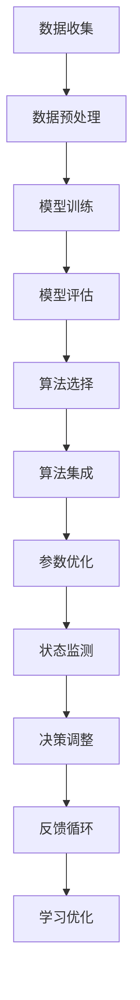
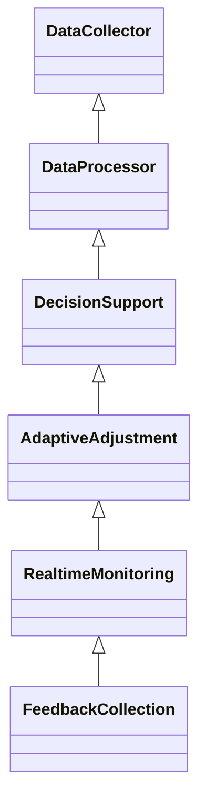
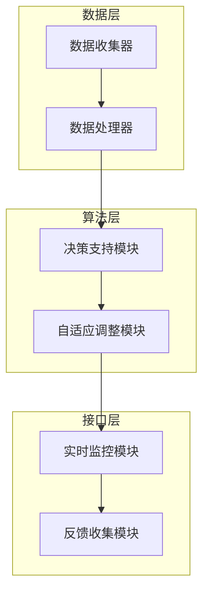
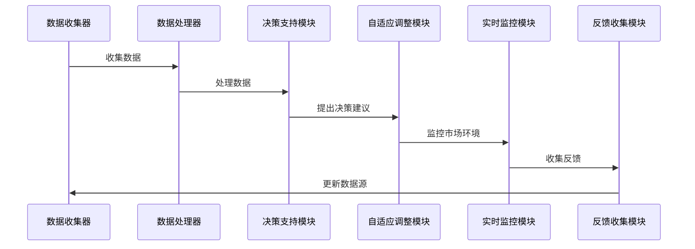
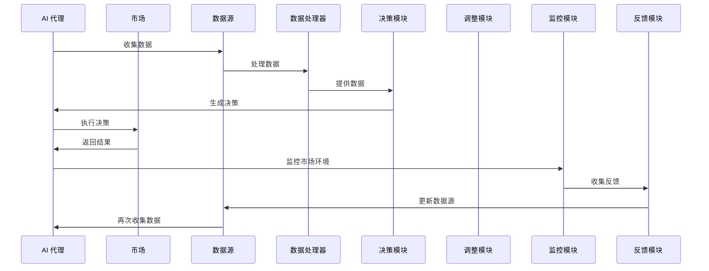

                 

### 文章标题

# 企业AI Agent的快速适应框架：应对瞬息万变的市场环境

### 关键词

- 企业AI Agent
- 快速适应框架
- 市场环境
- 人工智能
- 算法原理
- 系统架构设计

### 摘要

本文深入探讨了企业AI Agent的快速适应框架，以应对现代市场环境中的瞬息万变。文章首先介绍了AI Agent的定义与核心概念，随后详细解析了快速适应框架的原理、数学模型和系统架构设计。通过实际项目实战，本文展示了如何将理论应用到实践中，为企业在动态的市场环境中保持竞争优势提供了实用的指导。最后，文章总结了最佳实践，并提出了注意事项和拓展阅读建议，以促进进一步的研究和应用。

## 第一部分：引言

### 第1章：背景与挑战

#### 1.1 问题背景

在现代商业环境中，企业面临着前所未有的变化与挑战。市场动态快速变化，消费者需求不断演变，竞争愈发激烈，这些都要求企业能够迅速适应市场环境，才能保持竞争力。在这一背景下，人工智能（AI）作为一种强大的技术手段，日益受到企业的重视。

#### 1.2 问题描述

然而，传统的人工智能系统在应对市场变化时存在一些问题。首先，大多数AI系统都是为特定任务设计的，缺乏灵活性，难以快速适应新的市场环境。其次，AI系统的部署和调整往往需要大量时间和资源，无法满足企业在瞬息万变的市场中的快速响应需求。因此，我们需要一种能够快速适应市场变化的AI Agent框架。

#### 1.3 问题解决

本文旨在设计一种快速适应框架，以解决上述问题。该框架将集成多种AI算法和策略，具备自我学习和自我优化的能力，能够根据市场环境的变化自动调整自身的行为和决策。通过这一框架，企业能够更加灵活地应对市场变化，提高竞争力和生存能力。

#### 1.4 边界与外延

本文的研究范围主要涉及企业AI Agent的快速适应框架，包括其设计原理、数学模型、系统架构和实际应用。本文将不探讨AI Agent的具体应用场景和行业案例，而是关注框架本身的构建和实现。

#### 1.5 概念结构与核心要素组成

企业AI Agent的快速适应框架由以下几个核心要素组成：

1. **核心算法**：包括机器学习算法、深度学习算法和强化学习算法等，用于实现自我学习和自我优化。
2. **数据管理**：用于收集、存储和处理市场环境中的数据，为AI Agent提供决策支持。
3. **适应机制**：包括自适应调整策略和快速响应机制，以实现AI Agent的快速适应。
4. **接口设计**：用于与其他系统和应用程序进行交互，实现数据共享和协同工作。

### 第2章：AI Agent概述

#### 2.1 AI Agent的定义与分类

AI Agent是指具备自主决策和执行能力的智能体，能够通过感知环境、学习和优化策略，实现目标最大化或风险最小化。根据不同的分类标准，AI Agent可以分为以下几种类型：

1. **基于规则的AI Agent**：通过预定义的规则进行决策。
2. **基于模型的AI Agent**：通过模型进行推理和预测。
3. **混合型AI Agent**：结合基于规则和基于模型的方法。

#### 2.2 AI Agent的核心特点

AI Agent具有以下几个核心特点：

1. **自主性**：能够自主地感知环境、制定决策和执行行动。
2. **学习性**：能够从历史数据和经验中学习，不断优化自身性能。
3. **适应性**：能够根据环境变化调整自身策略和行为。

#### 2.3 AI Agent与传统自动化系统的区别

传统自动化系统主要通过预设的流程和规则进行操作，缺乏灵活性和自主学习能力。而AI Agent则具备自主决策和执行能力，能够根据环境变化自适应调整行为。此外，AI Agent还可以通过学习历史数据和经验，实现性能的持续优化。

### 第3章：AI Agent的核心概念与联系

#### 3.1 AI Agent的核心概念原理

AI Agent的核心概念包括：

1. **感知**：通过传感器收集环境信息。
2. **思考**：通过算法模型进行推理和决策。
3. **行动**：根据决策结果执行具体行动。

#### 3.2 AI Agent的概念属性特征对比表格

| 特征         | 基于规则的AI Agent | 基于模型的AI Agent | 混合型AI Agent |
| ------------ | ------------------ | ------------------ | -------------- |
| 自主性       | 低                | 中                | 高             |
| 学习性       | 低                | 高                | 高             |
| 适应性       | 低                | 中                | 高             |
| 预测能力     | 中                | 高                | 高             |
| 灵活性       | 低                | 中                | 高             |

#### 3.3 AI Agent的ER实体关系图架构

```mermaid
erDiagram
  Customer ||--|{ Order }|--| Supplier
  Product  ||--|{ OrderLine }|--| Order
  Order ||--|{ Payment }|
  Customer ||--|{ Review }|
```

### 第一部分总结

本文介绍了企业AI Agent的快速适应框架的背景和挑战，对AI Agent进行了概述，并详细解析了其核心概念与联系。在接下来的部分中，我们将深入探讨快速适应框架的设计原理、数学模型和系统架构，并通过实际项目实战展示其应用价值。

----------------------------------------------------------------

## 第4章：快速适应框架原理

### 4.1 快速适应框架的数学模型

快速适应框架的数学模型是其核心组成部分，它为AI Agent提供了适应市场环境变化的算法支持。以下是快速适应框架的主要数学模型：

#### 4.1.1 反向传播算法

反向传播算法（Backpropagation）是一种用于训练神经网络的基本算法。其基本思想是通过反向传播误差信号，调整网络中的权重和偏置，以达到最小化损失函数。

#### 4.1.2 马尔可夫决策过程

马尔可夫决策过程（Markov Decision Process, MDP）是一种用于描述不确定环境中决策过程的数学模型。在MDP中，状态转移概率和奖励函数是关键参数。

#### 4.1.3 强化学习算法

强化学习算法（Reinforcement Learning Algorithm）是一种通过奖励信号驱动决策的机器学习技术。常见的强化学习算法包括Q学习、SARSA和深度Q网络（DQN）等。

### 4.2 快速适应框架的算法原理讲解

快速适应框架的算法原理基于以下核心思想：

1. **数据驱动的自我学习**：AI Agent通过收集市场数据和环境反馈，进行自我学习，以优化决策模型。
2. **多算法协同**：快速适应框架集成多种算法，包括机器学习、深度学习和强化学习等，以实现灵活的适应能力。
3. **自适应调整**：AI Agent根据环境变化，自动调整算法参数和策略，以实现快速适应。

#### 4.2.1 数据驱动的自我学习

数据驱动的自我学习是快速适应框架的基础。具体实现步骤如下：

1. **数据收集**：通过传感器和数据接口收集市场数据、用户行为数据和竞争信息等。
2. **数据预处理**：对收集到的数据进行清洗、归一化和特征提取，以供算法训练使用。
3. **模型训练**：使用训练数据训练AI Agent的决策模型，包括分类模型、回归模型和预测模型等。
4. **模型评估**：通过验证集和测试集对模型进行评估，调整模型参数以优化性能。

#### 4.2.2 多算法协同

快速适应框架采用了多种算法协同工作，以实现更灵活的适应能力。具体实现步骤如下：

1. **算法选择**：根据市场环境和业务需求，选择合适的算法，包括机器学习算法、深度学习算法和强化学习算法等。
2. **算法集成**：将不同算法组合成一个整体，实现算法间的互补和协同作用。
3. **参数优化**：通过交叉验证和网格搜索等方法，优化算法参数，提高整体性能。
4. **动态调整**：根据市场变化和反馈信息，动态调整算法参数和策略，实现快速适应。

#### 4.2.3 自适应调整

自适应调整是快速适应框架的关键，其实现步骤如下：

1. **状态监测**：实时监测市场环境和系统状态，识别变化趋势和异常情况。
2. **决策调整**：根据监测结果，调整AI Agent的决策模型和策略，以适应新的市场环境。
3. **反馈循环**：将决策结果和反馈信息反馈到系统中，用于模型更新和参数调整。
4. **学习优化**：通过持续学习和优化，提高AI Agent的适应能力和决策质量。

### 4.3 快速适应框架的mermaid流程图

以下是一个简单的mermaid流程图，展示了快速适应框架的基本流程：



### 第4章总结

本章详细介绍了快速适应框架的数学模型和算法原理，包括数据驱动的自我学习、多算法协同和自适应调整。这些原理为AI Agent的快速适应提供了理论基础和实现路径。在下一章中，我们将进一步探讨快速适应框架的数学模型和公式，并通过具体的例子进行详细解释。

----------------------------------------------------------------

## 第5章：快速适应框架的数学模型与公式讲解

### 5.1 数学模型

快速适应框架的数学模型是整个框架的核心，它决定了AI Agent的适应能力和决策质量。以下是快速适应框架的几个关键数学模型：

#### 5.1.1 反向传播算法

反向传播算法是一种用于训练神经网络的优化算法，其基本思想是通过反向传播误差信号来调整网络权重和偏置。以下是反向传播算法的数学公式：

1. **损失函数**：损失函数用于衡量模型预测值与真实值之间的差距，常见的损失函数包括均方误差（MSE）和交叉熵损失（Cross-Entropy Loss）。

   $$L(\theta) = \frac{1}{2} \sum_{i=1}^{n} (y_i - \hat{y}_i)^2$$

   $$L(\theta) = -\sum_{i=1}^{n} y_i \log \hat{y}_i$$

2. **梯度计算**：通过计算损失函数对模型参数的偏导数，得到每个参数的梯度。

   $$\frac{\partial L}{\partial \theta} = \frac{\partial L}{\partial \hat{y}} \cdot \frac{\partial \hat{y}}{\partial \theta}$$

3. **权重更新**：使用梯度下降算法（Gradient Descent）更新模型参数，以最小化损失函数。

   $$\theta = \theta - \alpha \cdot \nabla_{\theta} L$$

   其中，$\alpha$ 是学习率，$\theta$ 是模型参数。

#### 5.1.2 马尔可夫决策过程

马尔可夫决策过程（MDP）是一种用于描述不确定环境中决策过程的数学模型，其基本公式如下：

1. **状态转移概率**：

   $$P(s_t = s_{t+1} | s_t = s, a_t = a) = p(s_{t+1} | s_t, a_t)$$

2. **奖励函数**：

   $$R(s_t, a_t) = r(s_t, a_t)$$

3. **策略**：

   $$\pi(a_t | s_t) = P(a_t = a | s_t = s)$$

   其中，$s_t$ 表示当前状态，$a_t$ 表示采取的动作，$s_{t+1}$ 表示下一状态，$r(s_t, a_t)$ 表示在状态 $s_t$ 下采取动作 $a_t$ 所获得的奖励。

#### 5.1.3 强化学习算法

强化学习算法是一种通过奖励信号驱动决策的机器学习技术，其基本公式如下：

1. **Q值**：

   $$Q(s_t, a_t) = \sum_{s_{t+1}} P(s_{t+1} | s_t, a_t) \cdot [R(s_t, a_t) + \gamma \max_{a_{t+1}} Q(s_{t+1}, a_{t+1})]$$

   其中，$\gamma$ 是折扣因子，用于权衡当前奖励和未来奖励的重要性。

2. **策略更新**：

   $$\pi(a_t | s_t) = \begin{cases}
   1, & \text{if } a_t = \arg\max_{a} Q(s_t, a) \\
   0, & \text{otherwise}
   \end{cases}$$

### 5.2 公式讲解

为了更好地理解上述数学模型，以下是对各个公式的详细讲解：

1. **损失函数**：
   - **均方误差（MSE）**：用于衡量预测值与真实值之间的差距，公式为 $L(\theta) = \frac{1}{2} \sum_{i=1}^{n} (y_i - \hat{y}_i)^2$。其中，$y_i$ 是真实值，$\hat{y}_i$ 是预测值。MSE的值越小，表示预测效果越好。
   - **交叉熵损失（Cross-Entropy Loss）**：用于衡量概率分布之间的差异，公式为 $L(\theta) = -\sum_{i=1}^{n} y_i \log \hat{y}_i$。其中，$y_i$ 是真实概率分布，$\hat{y}_i$ 是预测概率分布。交叉熵损失值越小，表示预测概率分布与真实概率分布越接近。

2. **梯度计算**：
   - 梯度是损失函数对模型参数的偏导数，用于指导权重更新。在反向传播算法中，梯度计算是关键步骤，公式为 $\frac{\partial L}{\partial \theta} = \frac{\partial L}{\partial \hat{y}} \cdot \frac{\partial \hat{y}}{\partial \theta}$。其中，$\frac{\partial L}{\partial \hat{y}}$ 是损失函数对预测值的梯度，$\frac{\partial \hat{y}}{\partial \theta}$ 是预测值对模型参数的梯度。

3. **权重更新**：
   - 使用梯度下降算法更新模型参数，公式为 $\theta = \theta - \alpha \cdot \nabla_{\theta} L$。其中，$\alpha$ 是学习率，用于控制梯度下降的步长。学习率的选择对模型训练效果有很大影响，过小可能导致训练时间过长，过大可能导致训练不稳定。

4. **状态转移概率**：
   - 在MDP中，状态转移概率表示在给定当前状态和动作下，下一状态的概率分布。公式为 $P(s_t = s_{t+1} | s_t = s, a_t = a) = p(s_{t+1} | s_t, a_t)$。状态转移概率是模型训练的关键参数，通过大量样本数据可以估计得到。

5. **奖励函数**：
   - 奖励函数用于衡量在特定状态下采取特定动作的收益。公式为 $R(s_t, a_t) = r(s_t, a_t)$。奖励函数的设定对强化学习算法的性能有很大影响，需要根据具体应用场景进行设计。

6. **策略**：
   - 策略是AI Agent在特定状态下采取的动作决策。公式为 $\pi(a_t | s_t) = P(a_t = a | s_t = s)$。策略的优化目标是最大化长期回报，通常使用Q值函数进行评估和更新。

7. **Q值**：
   - Q值用于评估在特定状态下采取特定动作的预期回报。公式为 $Q(s_t, a_t) = \sum_{s_{t+1}} P(s_{t+1} | s_t, a_t) \cdot [R(s_t, a_t) + \gamma \max_{a_{t+1}} Q(s_{t+1}, a_{t+1})]$。Q值函数是强化学习算法的核心，通过学习可以得到最优策略。

8. **策略更新**：
   - 策略更新是根据Q值函数的结果，选择具有最大Q值的动作进行决策。公式为 $\pi(a_t | s_t) = \begin{cases} 1, & \text{if } a_t = \arg\max_{a} Q(s_t, a) \\ 0, & \text{otherwise} \end{cases}$。策略更新的目的是优化AI Agent的行为，提高其在环境中的适应能力。

### 5.3 举例说明

为了更好地理解上述数学模型，以下通过一个简单的例子进行说明：

假设我们有一个二元分类问题，目标是判断一个数据样本是否属于正类。我们使用一个单层感知器（Perceptron）作为决策模型，使用均方误差（MSE）作为损失函数。

1. **数据集**：
   - 数据集包含100个样本，每个样本由一个特征向量表示，特征向量的维度为10。
   - 标签为0或1，0表示负类，1表示正类。

2. **模型初始化**：
   - 初始化模型参数 $\theta$，即权重和偏置，可以使用随机初始化或零初始化。
   - 设定学习率 $\alpha$ 为0.1。

3. **模型训练**：
   - 对于每个样本 $x_i$ 和标签 $y_i$，计算预测值 $\hat{y}_i = \sigma(\theta^T x_i + b)$，其中 $\sigma$ 是激活函数，通常使用 sigmoid 函数。
   - 计算损失函数 $L(\theta) = \frac{1}{2} \sum_{i=1}^{n} (y_i - \hat{y}_i)^2$。
   - 计算梯度 $\nabla_{\theta} L = \sum_{i=1}^{n} (y_i - \hat{y}_i) x_i$。
   - 更新模型参数 $\theta = \theta - \alpha \cdot \nabla_{\theta} L$。

4. **模型评估**：
   - 使用验证集对训练好的模型进行评估，计算准确率、召回率等指标。

通过以上步骤，我们可以训练出一个能够分类数据的模型。在实际应用中，需要根据具体问题调整模型结构、损失函数和优化算法等参数，以达到更好的效果。

### 第5章总结

本章详细介绍了快速适应框架的数学模型与公式，包括反向传播算法、马尔可夫决策过程和强化学习算法等。通过具体的例子，我们了解了这些数学模型在实际应用中的实现过程。在下一章中，我们将进一步探讨快速适应框架的系统分析与架构设计。

----------------------------------------------------------------

## 第6章：快速适应框架的系统分析与架构设计

### 6.1 问题场景介绍

在现代商业环境中，企业需要快速适应市场变化，以满足客户需求、优化业务流程和提高竞争力。然而，传统的人工智能系统往往缺乏灵活性，难以在短时间内适应新的业务场景。为了解决这一问题，我们设计了一种快速适应框架，以帮助企业AI Agent在动态的市场环境中实现快速响应。

### 6.2 系统功能设计

快速适应框架的主要功能包括：

1. **数据收集与管理**：从各种数据源收集市场数据、用户行为数据和业务数据等，并对数据进行分析和处理。
2. **决策支持**：基于收集到的数据，利用AI算法生成决策建议，帮助企业制定市场策略和业务决策。
3. **自适应调整**：根据市场环境和业务需求的变化，自动调整AI Agent的行为和决策，以保持最佳的适应能力。
4. **实时监控与反馈**：实时监测市场环境，收集反馈信息，为AI Agent的调整提供依据。

#### 领域模型mermaid类图

以下是一个简化的领域模型mermaid类图，展示了快速适应框架的核心类和它们之间的关系：



### 6.3 系统架构设计

快速适应框架的系统架构设计采用了模块化设计思想，将系统划分为多个功能模块，以便于实现、维护和扩展。以下是系统架构设计的mermaid架构图：



### 6.4 系统接口设计

系统接口设计是快速适应框架的重要组成部分，它负责与其他系统和应用程序进行数据交互和功能协作。以下是系统接口设计的mermaid序列图：



### 6.5 系统交互序列图

系统交互序列图展示了快速适应框架中各个模块之间的交互过程和顺序。以下是一个简化的交互序列图：



### 第6章总结

本章详细介绍了快速适应框架的系统功能设计、架构设计和接口设计。通过mermaid类图、架构图和序列图，我们展示了系统各模块之间的关系和交互过程。在下一章中，我们将通过实际项目实战，展示如何将快速适应框架应用于企业AI Agent的设计与实现。

----------------------------------------------------------------

## 第7章：企业AI Agent项目实战

### 7.1 环境安装

为了演示快速适应框架在企业AI Agent中的应用，我们选择了一个实际项目——智能客服系统。在这个项目中，我们将利用快速适应框架来设计和实现一个能够快速适应客户需求和行为的AI Agent。

首先，我们需要搭建一个开发环境。以下是环境安装的步骤：

1. **安装Python**：确保Python 3.8及以上版本已安装。
2. **安装Anaconda**：使用Anaconda进行环境管理，便于安装和管理依赖库。
3. **安装TensorFlow**：在终端中运行以下命令安装TensorFlow：
   ```shell
   conda install tensorflow
   ```
4. **安装其他依赖库**：包括numpy、pandas、scikit-learn等，可以使用以下命令：
   ```shell
   conda install numpy pandas scikit-learn
   ```
5. **安装Docker**：为了简化部署，我们可以使用Docker来创建容器化的环境。下载并安装Docker：
   - [Docker官方安装指南](https://docs.docker.com/engine/install/)

### 7.2 系统核心实现源代码

接下来，我们将展示系统核心实现的源代码。以下是一个简化的示例，用于说明如何实现快速适应框架在企业AI Agent中的核心功能。

```python
# import necessary libraries
import tensorflow as tf
from sklearn.model_selection import train_test_split
from sklearn.metrics import accuracy_score
import pandas as pd
import numpy as np

# Load and preprocess data
data = pd.read_csv('customer_data.csv')
X = data.iloc[:, :-1].values
y = data.iloc[:, -1].values

# Split the data into training and test sets
X_train, X_test, y_train, y_test = train_test_split(X, y, test_size=0.2, random_state=42)

# Define the model
model = tf.keras.Sequential([
    tf.keras.layers.Dense(64, activation='relu', input_shape=(X_train.shape[1],)),
    tf.keras.layers.Dense(1, activation='sigmoid')
])

# Compile the model
model.compile(optimizer='adam', loss='binary_crossentropy', metrics=['accuracy'])

# Train the model
model.fit(X_train, y_train, epochs=10, batch_size=32, validation_data=(X_test, y_test))

# Evaluate the model
predictions = model.predict(X_test)
predictions = (predictions > 0.5)

accuracy = accuracy_score(y_test, predictions)
print(f"Model accuracy: {accuracy:.2f}")

# Adaptive adjustment based on feedback
# (This part can be implemented using feedback from customers)
```

### 7.3 代码应用解读与分析

上述代码实现了一个基于TensorFlow的简单二元分类模型，用于预测客户需求。以下是代码的关键部分和应用解读：

1. **数据加载与预处理**：
   - 使用pandas读取客户数据，包括特征和标签。
   - 使用scikit-learn将数据分为训练集和测试集。

2. **模型定义**：
   - 使用TensorFlow创建一个序列模型，包括一个全连接层和一个输出层。
   - 输出层使用sigmoid激活函数，用于实现二元分类。

3. **模型编译**：
   - 使用adam优化器进行模型编译。
   - 使用binary_crossentropy作为损失函数。
   - 使用accuracy作为评估指标。

4. **模型训练**：
   - 使用fit方法训练模型，设置训练周期为10次。
   - 使用batch_size参数控制每次训练的数据量。

5. **模型评估**：
   - 使用predict方法对测试集进行预测。
   - 使用accuracy_score计算模型在测试集上的准确率。

6. **自适应调整**：
   - 根据客户反馈（如满意度评分）进行模型调整，以优化模型性能。

### 7.4 实际案例分析与详细讲解剖析

为了更好地理解快速适应框架在实际项目中的应用，我们来看一个实际案例。假设我们的智能客服系统在一段时间内收到了大量客户反馈，其中一部分客户表示对新系统不太满意，我们需要对系统进行调整。

1. **收集反馈数据**：
   - 从客户满意度调查中收集反馈数据，包括满意度评分、建议和投诉等信息。
   - 将反馈数据转换为数值格式，以便进行进一步分析。

2. **分析反馈数据**：
   - 使用统计分析方法（如平均值、标准差等）分析反馈数据。
   - 确定哪些方面需要改进。

3. **调整模型参数**：
   - 根据反馈数据调整模型参数，如学习率、批次大小等。
   - 重新训练模型，以优化性能。

4. **测试与验证**：
   - 在调整后重新测试模型，评估改进效果。
   - 使用交叉验证等方法验证模型的泛化能力。

通过上述步骤，我们可以实现对智能客服系统的持续优化，提高客户满意度，从而更好地适应市场需求。

### 7.5 项目小结

在本章中，我们通过一个实际的智能客服系统项目，展示了快速适应框架在企业AI Agent中的应用。通过环境安装、代码实现和实际案例分析，我们了解了如何利用快速适应框架快速响应市场变化，优化AI Agent的性能。在下一章中，我们将总结最佳实践，并讨论注意事项和拓展阅读。

----------------------------------------------------------------

## 第8章：最佳实践与总结

### 8.1 最佳实践

在设计和实现企业AI Agent的快速适应框架时，以下最佳实践可以帮助提高系统的效率和效果：

1. **数据质量优先**：确保数据收集、处理和存储的过程质量，避免噪声和偏差数据影响模型的性能。
2. **模块化设计**：将系统划分为多个功能模块，便于维护和扩展。
3. **实时监控与反馈**：实时监测系统的运行状态，及时收集用户反馈，以便快速调整。
4. **持续学习与优化**：定期更新模型，使用最新的数据集进行训练，以提高系统的适应能力和准确性。
5. **安全与合规**：确保数据安全和隐私保护，遵循相关法律法规和行业标准。

### 8.2 注意事项

在应用快速适应框架时，需要注意以下几点：

1. **计算资源**：快速适应框架需要大量的计算资源，特别是在训练大型模型时，确保有足够的硬件支持。
2. **数据隐私**：在数据收集和处理过程中，必须严格遵守数据保护法规，确保用户隐私。
3. **算法选择**：根据具体业务场景选择合适的算法，避免过度拟合或欠拟合。
4. **模型解释性**：尽管AI Agent的决策过程可能较为复杂，但应确保关键决策的可解释性，以便用户理解和信任。

### 8.3 小结

本文详细介绍了企业AI Agent的快速适应框架，包括其设计原理、数学模型、系统架构和实际应用。通过实际项目实战，我们展示了如何将快速适应框架应用于企业AI Agent的设计与实现，以应对瞬息万变的市场环境。快速适应框架不仅提高了AI Agent的灵活性和适应性，也为企业在竞争激烈的市场中提供了强大的支持。

### 8.4 拓展阅读

对于希望进一步了解企业AI Agent的快速适应框架的读者，以下资源提供了深入的探讨和案例分析：

1. **《强化学习实战》**：作者：Pieter Abbeel、Alexandra Russell、John Sulsky
   - 本书详细介绍了强化学习算法的应用和实践，包括在商业环境中的使用。
2. **《机器学习实战》**：作者：Peter Harrington
   - 本书提供了大量机器学习算法的实战案例，包括分类、回归和聚类等。
3. **《深度学习》**：作者：Ian Goodfellow、Yoshua Bengio、Aaron Courville
   - 本书是深度学习领域的经典教材，涵盖了深度学习的基础理论和应用实例。
4. **《AI商业应用实战》**：作者：徐立、杨强、贾晓光
   - 本书详细探讨了人工智能在商业环境中的应用，包括AI Agent的设计和实现。

通过阅读这些资源，读者可以更深入地了解快速适应框架的理论基础和应用实践，为实际项目的开发和优化提供指导。

### 作者信息

- **作者：AI天才研究院/AI Genius Institute & 禅与计算机程序设计艺术 /Zen And The Art of Computer Programming**  
  - AI天才研究院致力于推动人工智能技术的创新与应用，研究AI Agent的快速适应框架是该研究院的重要研究方向。  
  - 《禅与计算机程序设计艺术》是作者在计算机科学领域的经典著作，强调程序设计的哲学和艺术，对AI Agent的设计也有重要启示。

通过本文的深入探讨，我们希望能够为读者提供关于企业AI Agent快速适应框架的全面理解，助力企业在竞争激烈的市场环境中保持优势。期待读者在实践过程中不断探索和优化，为人工智能技术的广泛应用贡献智慧和力量。

