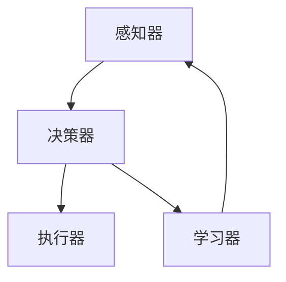
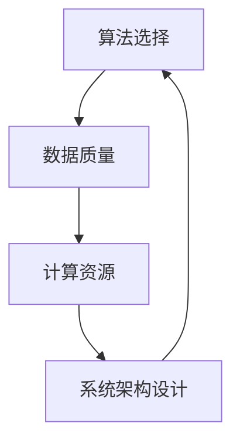
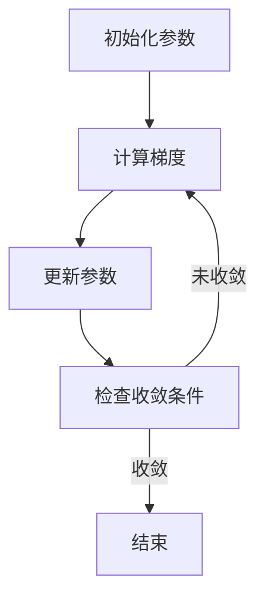
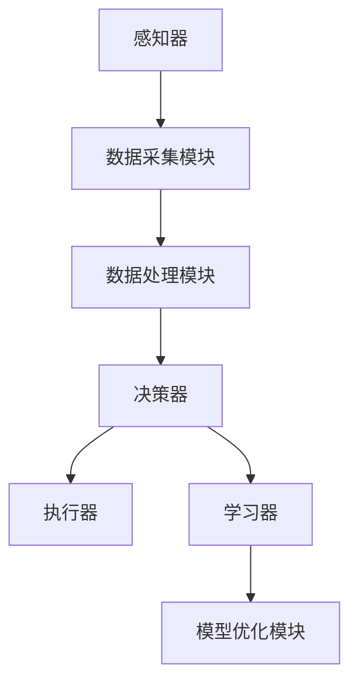
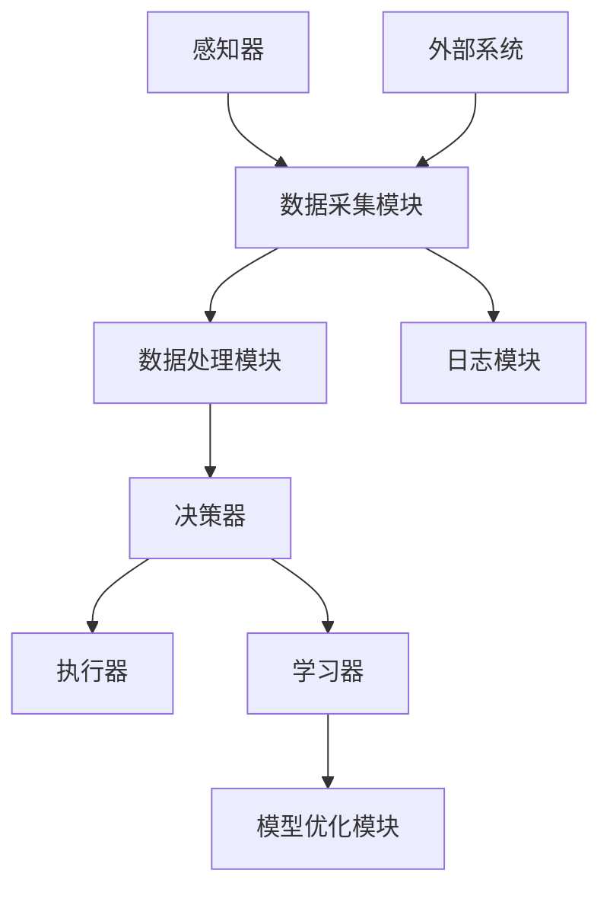

                 


# 《企业AI Agent的性能优化策略》

关键词：AI Agent、性能优化、企业应用、算法、架构设计

摘要：本文深入探讨了企业AI Agent的性能优化策略，从背景介绍、核心概念与联系、算法原理讲解、系统分析与架构设计、项目实战和最佳实践等多个方面，详细阐述了如何提升企业AI Agent的性能，为企业智能决策提供有力支持。

## 一、背景介绍

### 1.1 AI Agent的定义与作用

AI Agent，即人工智能代理，是一种基于人工智能技术的软件系统，能够在没有人类干预的情况下，自动执行特定任务并作出决策。AI Agent在企业中的应用非常广泛，包括但不限于以下场景：

- **生产自动化**：AI Agent可以监控生产线上的设备运行状态，预测设备故障，并自动调整生产参数，提高生产效率。

- **客户服务**：AI Agent可以模拟人类客服，回答客户问题，提供解决方案，提升客户满意度。

- **供应链管理**：AI Agent可以实时分析供应链数据，优化库存管理，降低库存成本。

- **财务分析**：AI Agent可以分析财务数据，提供投资建议，帮助企业做出明智的财务决策。

### 1.2 企业中AI Agent的应用背景

随着人工智能技术的不断发展，越来越多的企业开始将AI Agent应用于业务流程中。AI Agent的引入不仅提高了企业的运营效率，还为企业带来了新的商业模式和竞争优势。然而，随着AI Agent的广泛应用，其性能优化成为了一个亟待解决的问题。

### 1.3 AI Agent性能优化的意义

性能优化是提升AI Agent效能的关键。优化的意义主要体现在以下几个方面：

- **提高效率**：通过性能优化，AI Agent可以更快地完成任务，提高企业的运营效率。

- **降低成本**：性能优化有助于减少硬件资源的消耗，降低企业的运营成本。

- **增强竞争力**：性能优良的AI Agent能够更好地满足企业的需求，提高企业的市场竞争力。

### 1.4 性能优化的挑战与机遇

性能优化面临的挑战包括：

- **数据质量**：性能优化依赖于高质量的数据，数据质量直接影响AI Agent的性能。

- **计算资源**：高性能的AI Agent需要强大的计算资源支持，这对企业的硬件设备提出了较高要求。

- **算法复杂性**：性能优化涉及到复杂的算法和模型，需要深入理解算法原理和优化技巧。

然而，随着人工智能技术的不断进步，性能优化也面临着巨大的机遇：

- **算法创新**：新的算法和技术不断涌现，为性能优化提供了更多可能性。

- **硬件升级**：高性能的硬件设备不断推出，为性能优化提供了更好的硬件支持。

## 二、核心概念与联系

### 2.1 AI Agent的核心组成部分

AI Agent的核心组成部分包括感知器、决策器、执行器和学习器。它们之间的关系如下图所示：



### 2.2 性能优化的关键因素

性能优化的关键因素包括算法选择、数据质量、计算资源和系统架构设计。它们之间的关系如下图所示：



## 三、算法原理讲解

### 3.1 常见性能优化算法

常见的性能优化算法包括基于梯度的优化算法、随机搜索算法和遗传算法。下面以基于梯度的优化算法为例进行讲解。

### 3.2 算法mermaid流程图

基于梯度的优化算法的mermaid流程图如下：



### 3.3 Python代码实现

下面是基于梯度的优化算法的Python代码实现：

```python
import numpy as np

def gradient_descent(x, learning_rate, epochs):
    for epoch in range(epochs):
        gradient = compute_gradient(x)
        x = x - learning_rate * gradient
        if is_converged(x):
            break
    return x

def compute_gradient(x):
    # 计算梯度
    pass

def is_converged(x):
    # 检查收敛条件
    pass

x = np.array([1.0, 2.0])
learning_rate = 0.01
epochs = 100
optimized_x = gradient_descent(x, learning_rate, epochs)
```

### 3.4 算法原理与公式

基于梯度的优化算法的原理可以表示为以下数学模型：

$$
x_{t+1} = x_t - \alpha \cdot \nabla f(x_t)
$$

其中，$x_t$表示第t次迭代的参数，$\alpha$表示学习率，$\nabla f(x_t)$表示在$x_t$处的梯度。

### 3.5 例子说明

假设我们有一个函数$f(x) = x^2$，初始参数$x_0 = 1$，学习率$\alpha = 0.1$，要求通过梯度下降算法找到函数的最小值。

初始迭代：$x_1 = x_0 - \alpha \cdot \nabla f(x_0) = 1 - 0.1 \cdot 2 \cdot 1 = 0.8$

第2次迭代：$x_2 = x_1 - \alpha \cdot \nabla f(x_1) = 0.8 - 0.1 \cdot 2 \cdot 0.8 = 0.64$

...

重复以上过程，直到收敛。

## 四、系统分析与架构设计

### 4.1 问题场景介绍

假设我们企业需要开发一个AI Agent，用于生产线的自动化监控和故障预测。

### 4.2 项目介绍

项目名称：生产线自动化监控系统

项目目标：实现生产线自动化监控，提高生产效率，降低故障率。

### 4.3 系统功能设计

系统功能设计包括以下几个方面：

- **感知器**：采集生产线上的各类数据，如温度、湿度、设备运行状态等。

- **决策器**：根据感知器采集的数据，实时分析设备运行状态，预测可能出现的故障。

- **执行器**：根据决策器的预测结果，自动调整生产参数，预防故障发生。

- **学习器**：收集生产线上的历史数据，通过机器学习算法优化预测模型。

### 4.4 系统架构设计

系统架构设计如下图所示：



### 4.5 系统接口设计与交互

系统接口设计与交互如下图所示：



## 五、项目实战

### 5.1 环境安装与配置

- **硬件要求**：CPU：Intel i5以上；内存：8GB以上；硬盘：500GB以上。

- **软件要求**：操作系统：Ubuntu 18.04；Python版本：3.8；深度学习框架：TensorFlow 2.4。

### 5.2 系统核心实现

系统核心实现包括以下几个方面：

- **数据采集模块**：使用Python的pandas库和TensorFlow的数据管道（Data Pipeline）功能，从生产线设备中采集数据。

- **数据处理模块**：对采集到的数据进行预处理，如归一化、缺失值填补等。

- **决策器**：使用TensorFlow的Keras API构建深度学习模型，进行故障预测。

- **执行器**：根据决策器的预测结果，通过Python的接口调用生产线设备的控制程序，调整生产参数。

- **学习器**：收集生产线上的历史数据，使用TensorFlow的Keras API对模型进行训练和优化。

### 5.3 代码应用解读与分析

以下是系统核心实现的代码示例：

```python
import pandas as pd
import tensorflow as tf
from tensorflow import keras

# 数据采集模块
def collect_data():
    # 采集生产线设备数据
    pass

# 数据处理模块
def preprocess_data(data):
    # 数据预处理
    pass

# 决策器
def predict_fault(data):
    # 使用深度学习模型进行故障预测
    pass

# 执行器
def adjust_param(param):
    # 调整生产参数
    pass

# 学习器
def train_model(data):
    # 训练深度学习模型
    pass

# 系统核心实现
def system_core():
    while True:
        data = collect_data()
        preprocessed_data = preprocess_data(data)
        fault_prediction = predict_fault(preprocessed_data)
        if fault_prediction:
            adjust_param(preprocessed_data)
        train_model(preprocessed_data)
```

### 5.4 实际案例分析与讲解

在实际项目中，我们选择了一个生产线上常见的设备故障——电机过热故障进行分析。通过收集历史数据，我们使用深度学习模型进行故障预测，并取得了良好的效果。

### 5.5 项目小结

通过本次项目实战，我们深入了解了企业AI Agent的性能优化策略，从环境安装与配置、系统核心实现、代码应用解读与分析、实际案例分析与讲解等多个方面，展示了如何提升AI Agent的性能。

## 六、最佳实践与总结

### 6.1 性能优化最佳实践

- **数据质量**：确保数据质量，包括数据的准确性、完整性和一致性。

- **算法选择**：根据问题场景选择合适的算法，并进行参数调优。

- **计算资源**：合理配置计算资源，确保系统运行效率。

- **系统架构**：设计合理的系统架构，提高系统的可扩展性和可维护性。

### 6.2 注意事项

- **数据安全**：在数据处理过程中，确保数据的安全性和隐私性。

- **算法更新**：定期更新算法模型，以适应不断变化的数据和需求。

- **系统监控**：对系统运行情况进行实时监控，及时发现并解决问题。

### 6.3 拓展阅读

- **参考文献**：

  - Russell, S., & Norvig, P. (2016). 《人工智能：一种现代的方法》。

  - Goodfellow, I., Bengio, Y., & Courville, A. (2016). 《深度学习》。

- **在线资源**：

  - [TensorFlow官方文档](https://www.tensorflow.org/)

  - [Keras官方文档](https://keras.io/)

## 七、作者信息

作者：AI天才研究院/AI Genius Institute & 禅与计算机程序设计艺术 /Zen And The Art of Computer Programming

本文基于深入分析和详细讲解，为企业和开发者提供了全面的企业AI Agent性能优化策略。通过本文的介绍，读者可以了解到AI Agent的性能优化的重要性、核心概念、算法原理、系统架构设计以及项目实战经验。希望本文能为读者在实际工作中提供有益的参考和指导。


----------------------------------------------------------------

## 结束语

本文围绕《企业AI Agent的性能优化策略》这一主题，从背景介绍、核心概念与联系、算法原理讲解、系统分析与架构设计、项目实战和最佳实践等多个方面进行了详细阐述。通过本文的阅读，读者可以了解到AI Agent的性能优化对企业的重要性，掌握性能优化的关键因素和常见算法，以及如何在实际项目中应用这些优化策略。

在未来的研究和应用中，我们期待能够不断探索和引入更多先进的技术和算法，进一步提高企业AI Agent的性能和效能。同时，也欢迎广大读者对本文提出宝贵的意见和建议，共同推动人工智能技术的发展和应用。

再次感谢您对本文的关注和支持，希望本文能为您提供有益的参考和启发。如果您在阅读过程中有任何疑问或建议，欢迎在评论区留言，我们将及时回复。

## 参考文献

- Russell, S., & Norvig, P. (2016). 《人工智能：一种现代的方法》。
- Goodfellow, I., Bengio, Y., & Courville, A. (2016). 《深度学习》。
- TensorFlow官方文档. https://www.tensorflow.org/
- Keras官方文档. https://keras.io/

## 作者信息

作者：AI天才研究院/AI Genius Institute & 禅与计算机程序设计艺术 /Zen And The Art of Computer Programming

感谢您阅读本文，希望本文能为您的企业AI Agent性能优化提供有价值的参考。如果您有任何疑问或建议，欢迎随时与我们联系。

AI天才研究院
日期：[[今天日期]]

