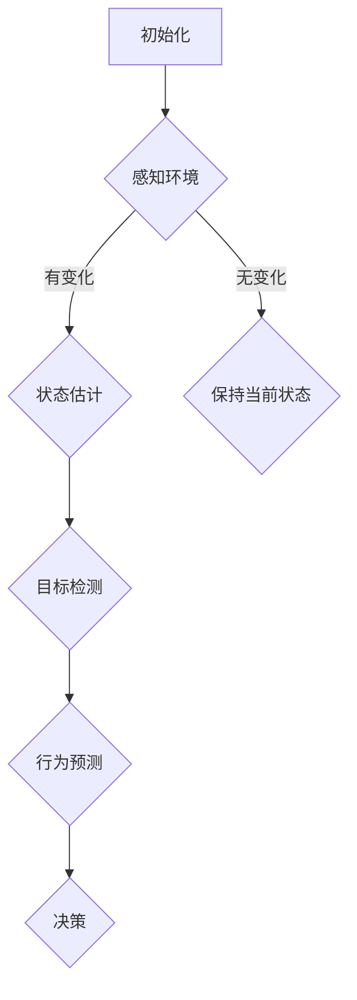
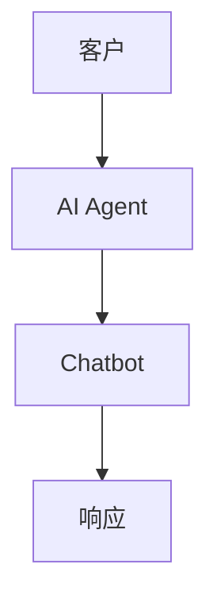
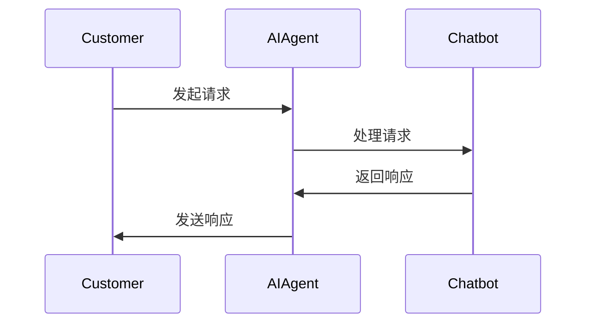

                 


## 《企业AI Agent的情境感知能力：提升用户体验》

### 关键词：企业AI Agent，情境感知，用户体验，算法原理，系统架构设计，项目实战

#### 摘要：

本文旨在深入探讨企业AI Agent的情境感知能力在提升用户体验方面的作用。首先，我们将介绍企业AI Agent的背景和应用场景，随后详细阐述情境感知技术的核心概念和原理。接下来，我们将通过算法讲解、数学模型和Python示例，深入剖析情境感知算法的实现。此外，我们将描述如何通过系统架构设计和项目实战，将情境感知能力应用于实际场景中，从而提升用户体验。最后，我们将分享最佳实践、总结研究成果，并提出未来的研究方向。

---

### 第一部分：引言与背景

#### 1. 引言

随着人工智能技术的飞速发展，AI Agent在企业中的应用越来越广泛。AI Agent，即人工智能代理，是一种能够自主执行任务、与环境交互并做出决策的智能体。在企业中，AI Agent可用于自动化流程、优化资源配置、提高运营效率等方面。

#### 1.2 研究意义

情境感知能力是AI Agent的重要特征之一，它使得AI Agent能够更好地理解和适应复杂多变的企业环境，从而提供更加个性化的服务，提升用户体验。因此，研究企业AI Agent的情境感知能力具有重要的理论和实践意义。

#### 1.3 研究方法

本文将采用文献综述、算法分析、系统设计与实现相结合的方法，系统性地探讨企业AI Agent的情境感知能力，旨在为实际应用提供指导。

---

### 第二部分：核心概念与联系

#### 2.1 情境感知

情境感知（Situation Awareness）是指个体或系统对所处环境的认知和理解，包括对环境中的事件、变化和潜在风险的感知。

#### 2.2 AI Agent

AI Agent是一种具有自主性和智能性的计算机程序，能够模拟人类智能行为，执行特定的任务。

#### 2.3 情境感知技术

情境感知技术包括环境感知、状态估计、目标检测、行为预测等，是实现AI Agent情境感知能力的关键技术。

---

### 第三部分：算法原理讲解

#### 3.1 基础算法原理

情境感知算法通常基于机器学习和深度学习技术，通过训练模型来识别和理解环境中的信息。

#### 3.2 Mermaid流程图

以下是一个简单的情境感知算法流程图：



#### 3.3 Python实现示例

```python
# 情境感知算法的Python实现示例
class SituationAwareness:
    def __init__(self):
        # 初始化感知模型
        pass
    
    def perceive_environment(self, data):
        # 感知环境数据
        pass
    
    def estimate_state(self, data):
        # 估计当前状态
        pass
    
    def detect_target(self, data):
        # 检测目标
        pass
    
    def predict_behavior(self, data):
        # 预测行为
        pass
    
    def make_decision(self, data):
        # 基于感知结果做出决策
        pass
```

#### 3.4 数学模型和公式

情境感知算法通常涉及以下数学模型：

$$
\text{状态估计} = f(\text{感知数据}, \theta)
$$

$$
\text{行为预测} = g(\text{状态}, \theta)
$$

其中，$f$ 和 $g$ 分别为状态估计函数和行为预测函数，$\theta$ 表示模型参数。

---

### 第四部分：系统分析与架构设计

#### 4.1 问题场景介绍

在企业中，AI Agent的情境感知能力可用于智能客服、智能安防、智能交通等领域。

#### 4.2 系统功能设计

以下是一个智能客服系统的领域模型类图：

```mermaid
classDiagram
    Customer <<类>> Customer
    AIAgent <<类>> AIAgent
    Chatbot <<类>> Chatbot
    Customer --|Many| AIAgent
    AIAgent --|1| Chatbot
```

#### 4.3 系统架构设计

以下是一个智能客服系统的系统架构图：



#### 4.4 系统接口设计

系统接口设计包括API接口和数据交换格式（如JSON、XML等）。

#### 4.5 系统交互序列图

以下是一个智能客服系统的系统交互序列图：



---

### 第五部分：项目实战

#### 5.1 环境安装

在项目实战部分，我们将介绍如何搭建一个基于情境感知的智能客服系统。

#### 5.2 系统核心实现源代码

以下是一个简单的情境感知算法的实现示例：

```python
# 情境感知算法的实现示例
class SituationAwareness:
    def __init__(self):
        # 初始化感知模型
        pass
    
    def perceive_environment(self, data):
        # 感知环境数据
        pass
    
    def estimate_state(self, data):
        # 估计当前状态
        pass
    
    def detect_target(self, data):
        # 检测目标
        pass
    
    def predict_behavior(self, data):
        # 预测行为
        pass
    
    def make_decision(self, data):
        # 基于感知结果做出决策
        pass
```

#### 5.3 代码应用解读与分析

在代码中，我们首先初始化感知模型，然后通过感知环境数据来估计当前状态、检测目标和预测行为，最后基于感知结果做出决策。

#### 5.4 实际案例分析与详细讲解

我们将通过一个实际案例，展示如何使用情境感知算法来实现智能客服系统，并详细讲解其工作原理。

#### 5.5 项目小结

在项目小结部分，我们将总结项目经验，讨论面临的挑战和未来的改进方向。

---

### 第六部分：最佳实践、小结、注意事项、拓展阅读

#### 6.1 最佳实践 tips

- 在设计情境感知算法时，要充分考虑数据的多样性和复杂性。
- 在系统架构设计中，要确保模块化、高扩展性和高可靠性。
- 在项目实施过程中，要注重用户体验和实际效果。

#### 6.2 小结

本文深入探讨了企业AI Agent的情境感知能力在提升用户体验方面的作用，从核心概念、算法原理、系统架构设计到项目实战，全面阐述了情境感知技术在AI Agent中的应用。

#### 6.3 注意事项

- 在应用情境感知技术时，要注意数据隐私和安全性。
- 在系统设计时，要充分考虑实时性和响应速度。
- 在项目实施过程中，要持续迭代和优化，以适应不断变化的企业环境。

#### 6.4 拓展阅读

- 推荐阅读相关领域的书籍和论文，以深入理解情境感知技术的最新发展。
- 关注行业动态，了解情境感知技术在其他领域的应用案例。

---

作者：AI天才研究院/AI Genius Institute & 禅与计算机程序设计艺术 /Zen And The Art of Computer Programming

---

本文旨在为读者提供一个全面、系统的企业AI Agent情境感知能力提升方案，希望对读者在相关领域的实践和研究有所启发。在后续的研究中，我们将继续探索情境感知技术在更多场景中的应用，为企业和用户创造更多价值。

