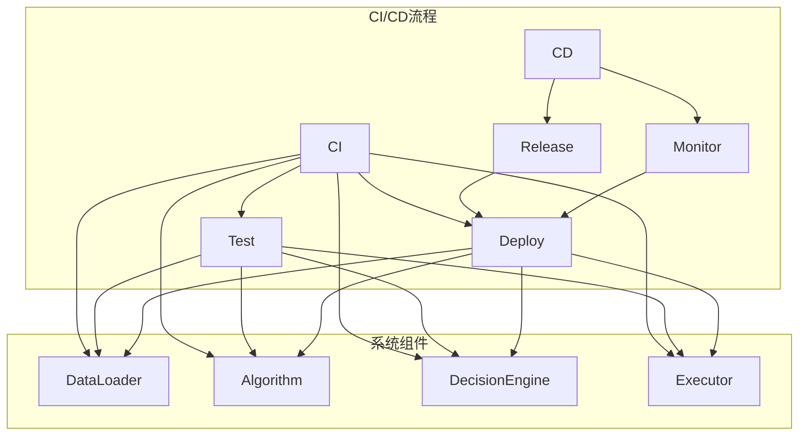
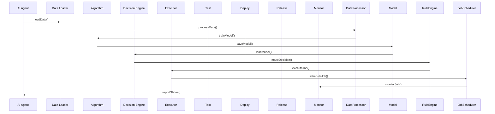
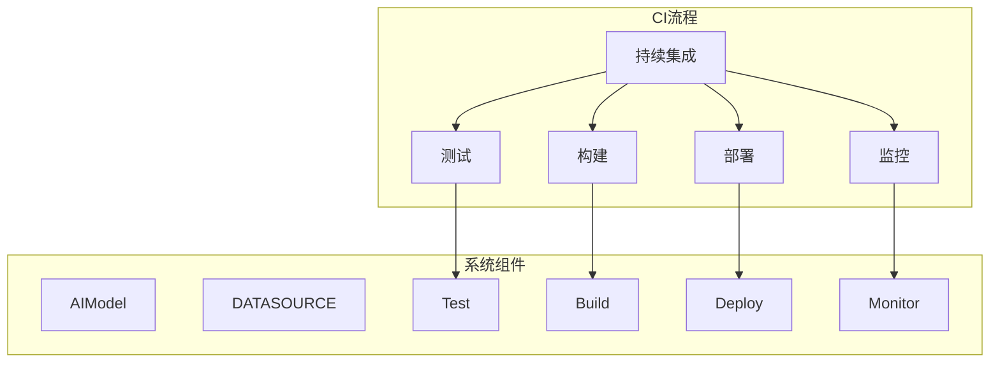
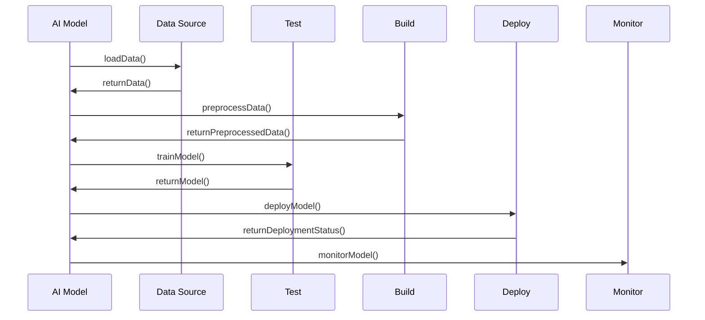
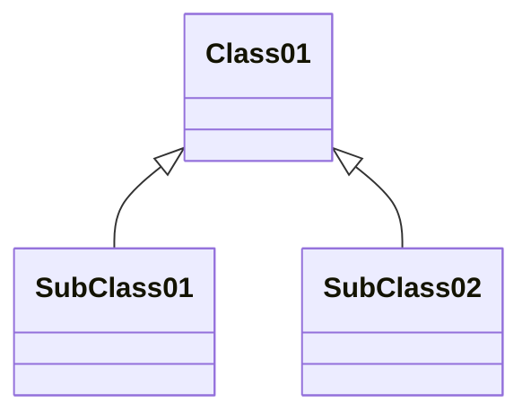
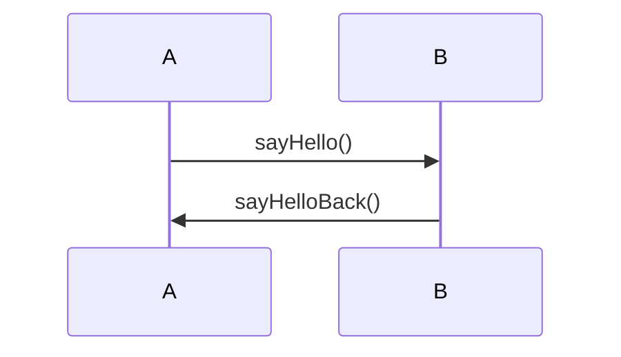
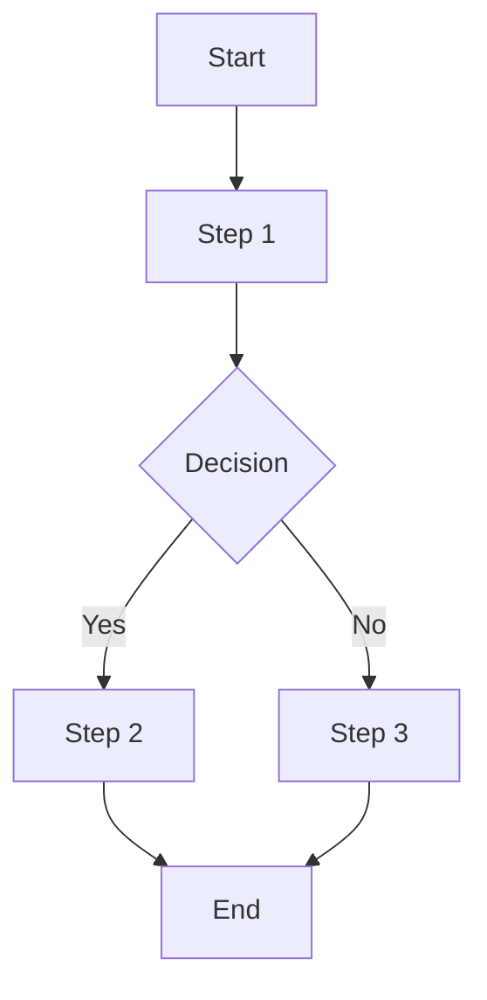

                 

### 文章标题

# 企业AI Agent的持续集成与持续部署（CI/CD）实践

### 关键词

- 企业AI Agent
- 持续集成（CI）
- 持续部署（CD）
- CI/CD实践
- 自动化测试
- 架构设计
- 工具选择
- 项目实战

### 摘要

本文旨在探讨企业AI Agent的持续集成与持续部署（CI/CD）实践。首先，我们将介绍企业AI Agent的背景及其核心概念，接着深入讲解CI/CD的基础理论。在此基础上，我们将详细阐述如何将CI/CD应用于企业AI Agent的持续集成与持续部署过程中，包括流程设计、工具选择和实践案例。最后，我们将总结最佳实践并提供未来展望。

## 第一部分：企业AI Agent概述

### 第1章：企业AI Agent背景介绍

#### 1.1.1 问题背景

随着人工智能技术的快速发展，AI Agent在企业中的应用逐渐普及。这些AI Agent通常被用于自动化决策、优化业务流程和提高生产效率。然而，在实际应用中，AI Agent的开发、测试和部署面临着一系列挑战。

#### 1.1.2 问题描述

AI Agent的开发涉及复杂的数据处理、算法设计和系统架构，如何在保证质量的同时提高开发效率成为了一个关键问题。此外，AI Agent的测试和部署也面临着环境一致性、版本控制和自动化测试等挑战。

#### 1.1.3 问题解决

持续集成与持续部署（CI/CD）提供了一种有效的解决方案。通过CI/CD，我们可以实现自动化测试、环境一致性管理和快速部署，从而提高AI Agent的开发效率和质量。

#### 1.1.4 边界与外延

CI/CD不仅适用于AI Agent，也可以应用于其他类型的应用开发。本文将主要关注企业AI Agent的CI/CD实践。

#### 1.1.5 概念结构与核心要素组成

企业AI Agent的核心概念包括人工智能、自动化决策、机器学习等。其核心要素包括数据源、算法模型、决策引擎和执行模块。

### 第2章：企业AI Agent核心概念与联系

#### 2.1 AI Agent的定义与分类

AI Agent是一种能够自主执行任务、与环境交互的智能实体。根据任务类型和功能，AI Agent可以分为决策型AI Agent、感知型AI Agent和混合型AI Agent。

#### 2.2 AI Agent的核心特性

AI Agent的核心特性包括自主性、智能性、适应性、协作性等。这些特性使得AI Agent能够在复杂环境中进行高效的任务执行。

#### 2.3 AI Agent与企业的联系

AI Agent在企业中的应用可以提升企业的智能化水平，实现自动化决策和优化业务流程。例如，AI Agent可以用于智能客服、智能推荐、供应链优化等场景。

#### 2.4 AI Agent的属性特征对比表格

| 特性             | 决策型AI Agent | 感知型AI Agent | 混合型AI Agent |
|------------------|--------------|--------------|--------------|
| 自主性           | 高           | 中           | 高           |
| 智能性           | 强           | 中           | 强           |
| 适应性           | 强           | 中           | 强           |
| 协作性           | 高           | 低           | 高           |

#### 2.5 AI Agent的ER实体关系图架构


## 第二部分：持续集成与持续部署（CI/CD）原理

### 第3章：CI/CD基础

#### 3.1 持续集成（CI）的原理与流程

持续集成是一种软件开发实践，旨在通过频繁地将代码集成到一个共享的主分支中，快速发现和解决问题。CI的原理包括自动化构建、自动化测试和快速反馈。

#### 3.2 持续部署（CD）的原理与流程

持续部署是一种自动化软件发布流程，旨在快速、可靠地将软件部署到生产环境。CD的原理包括自动化构建、自动化测试和自动化发布。

## 第三部分：企业AI Agent的CI/CD实践

### 第4章：企业AI Agent持续集成实践

#### 4.1 持续集成流程设计

持续集成流程设计包括代码仓库管理、自动化构建、自动化测试和反馈机制。以下是企业AI Agent的持续集成流程设计：


#### 4.2 持续集成工具选择

常见的持续集成工具有Jenkins、Travis CI、Circle CI等。根据实际需求，选择适合的工具。例如，Jenkins适用于复杂场景，Travis CI适用于开源项目。

#### 4.3 持续集成案例分析

以企业AI Agent项目为例，我们使用Jenkins实现持续集成。具体实现步骤如下：

1. 安装Jenkins。
2. 添加代码仓库插件，配置Git仓库地址。
3. 配置构建脚本，实现自动化构建。
4. 添加测试插件，实现自动化测试。
5. 配置邮件通知，实现快速反馈。

### 第5章：企业AI Agent持续部署实践

#### 5.1 持续部署流程设计

持续部署流程设计包括自动化构建、自动化测试、自动化发布和环境管理。以下是企业AI Agent的持续部署流程设计：


#### 5.2 持续部署工具选择

常见的持续部署工具有Kubernetes、Docker、Ansible等。根据实际需求，选择适合的工具。例如，Kubernetes适用于容器化部署，Ansible适用于自动化运维。

#### 5.3 持续部署案例分析

以企业AI Agent项目为例，我们使用Kubernetes和Ansible实现持续部署。具体实现步骤如下：

1. 部署Kubernetes集群。
2. 配置Docker镜像，实现自动化构建。
3. 编写Ansible剧本，实现自动化测试和发布。
4. 配置持续部署流水线，实现自动化管理。

## 第四部分：实战与最佳实践

### 第6章：企业AI Agent CI/CD项目实战

#### 6.1 项目环境安装与配置

在本章中，我们将介绍如何搭建企业AI Agent的CI/CD项目环境，包括安装Jenkins、配置Git仓库和Kubernetes集群。

#### 6.2 项目核心实现源代码

在本章中，我们将展示企业AI Agent的核心实现源代码，包括数据预处理、算法模型和决策引擎。

#### 6.3 代码应用解读与分析

在本章中，我们将分析企业AI Agent的代码实现，包括算法原理、数据结构和流程设计。

#### 6.4 实际案例分析与详细讲解

在本章中，我们将结合实际案例，详细讲解企业AI Agent的CI/CD实践，包括流程设计、工具选择和实现步骤。

#### 6.5 项目小结

在本章的结尾，我们将总结项目实践的经验和教训，提出改进建议。

### 第7章：最佳实践与注意事项

#### 7.1 CI/CD最佳实践

在本章中，我们将分享企业AI Agent CI/CD的最佳实践，包括代码规范、自动化测试策略和环境管理技巧。

#### 7.2 小结与展望

在本章的结尾，我们将回顾企业AI Agent CI/CD实践的核心内容，并提出未来的研究方向。

#### 7.3 注意事项

在本章中，我们将提醒读者在CI/CD实践中需要注意的问题，包括数据安全、系统稳定性和扩展性。

#### 7.4 拓展阅读

在本章的结尾，我们将推荐一些相关的拓展阅读，以帮助读者深入了解企业AI Agent的CI/CD实践。

### 作者

- 作者：AI天才研究院/AI Genius Institute & 禅与计算机程序设计艺术 /Zen And The Art of Computer Programming

## 附加部分：数学模型和数学公式

### 数学模型和数学公式

在本篇技术博客中，我们将涉及多个数学模型和数学公式。以下是一些例子：

#### 1. 决策树模型

$$
Entropy = -\sum_{i=1}^{n} p_i \cdot \log_2 p_i
$$

其中，$Entropy$ 是熵，$p_i$ 是每个类别的概率。

#### 2. 支持向量机（SVM）模型

$$
w^* = \arg\min_{w} \left\{ \frac{1}{2} ||w||^2 + C \cdot \sum_{i=1}^{n} \max(0, 1 - y_i \cdot (w \cdot x_i)) \right\}
$$

其中，$w^*$ 是最优权重向量，$C$ 是正则化参数，$y_i$ 是标签，$x_i$ 是特征向量。

#### 3. 神经网络激活函数

$$
a = \sigma(z) = \frac{1}{1 + e^{-z}}
$$

其中，$a$ 是激活值，$z$ 是输入值，$\sigma$ 是Sigmoid函数。

这些数学模型和数学公式在AI Agent的算法设计和实现中发挥着重要作用，为读者提供了更深入的理解和洞察。

## 附加部分：系统分析与架构设计方案

### 问题场景介绍

在企业中，AI Agent被用于自动化决策、优化业务流程和提高生产效率。然而，AI Agent的开发、测试和部署面临着一系列挑战，如环境一致性、版本控制和自动化测试等。

### 项目介绍

本项目旨在实现一个企业AI Agent，通过持续集成与持续部署（CI/CD）实践，提高开发效率和质量。

### 系统功能设计（领域模型）

在系统功能设计阶段，我们使用Mermaid绘制了领域模型类图，如下所示：

```mermaid
classDiagram
    AIAgent <-..|> DataLoader
    AIAgent <-..|> Algorithm
    AIAgent <-..|> DecisionEngine
    AIAgent ..|> Executor
    DataLoader <|-- DataProcessor
    Algorithm <|-- Model
    DecisionEngine <|-- RuleEngine
    Executor <|-- JobScheduler
```

### 系统架构设计

在系统架构设计阶段，我们使用Mermaid绘制了系统架构图，如下所示：



### 系统接口设计

在系统接口设计阶段，我们定义了以下主要接口：

- `loadData()`: 加载数据
- `trainModel()`: 训练模型
- `makeDecision()`: 做决策
- `executeJob()`: 执行任务
- `testModel()`: 测试模型
- `deployModel()`: 部署模型
- `releaseVersion()`: 发布版本
- `monitorSystem()`: 监控系统

### 系统交互

在系统交互设计阶段，我们使用Mermaid绘制了系统交互序列图，如下所示：



## 第五部分：企业AI Agent的持续集成实践

### 第5章：企业AI Agent持续集成实践

#### 5.1 持续集成流程设计

持续集成（CI）流程是企业AI Agent开发过程中至关重要的一环。以下是企业AI Agent的持续集成流程设计：

1. **代码仓库管理**：选择合适的代码仓库管理工具，如GitLab、GitHub等，用于存放源代码和管理版本。
2. **自动化构建**：使用Jenkins等CI工具，自动化构建应用程序。构建过程包括编译、打包、依赖管理等。
3. **自动化测试**：编写自动化测试脚本，包括单元测试、集成测试等，确保代码质量。测试结果应自动记录并报告。
4. **代码质量检查**：使用静态代码分析工具，如SonarQube，对代码进行质量检查，包括代码风格、安全性、性能等方面。
5. **部署**：将经过测试和检查的代码部署到预生产环境，进行进一步测试和验证。
6. **反馈机制**：建立反馈机制，确保开发人员能够及时了解代码的集成结果和问题。

#### 5.2 持续集成工具选择

在持续集成工具的选择上，应根据项目的需求和规模进行选择。以下是一些常见的CI工具：

- **Jenkins**：适用于各种规模的项目，具有丰富的插件生态系统，可以轻松地实现自动化构建、测试和部署。
- **Travis CI**：适用于开源项目，支持多种编程语言和平台，具有简单易用的Web界面。
- **Circle CI**：适用于中小型项目，具有快速构建和部署的能力，支持多种编程语言和平台。

#### 5.3 持续集成案例分析

以下是一个企业AI Agent项目的持续集成案例分析：

1. **环境配置**：在GitHub上创建一个代码仓库，用于存储源代码。同时，在AWS上部署一个EC2实例，作为CI服务器。

2. **Jenkins安装与配置**：在EC2实例上安装Jenkins，并配置Git插件，将GitHub上的代码仓库添加为源。

3. **构建脚本**：编写Jenkinsfile，定义构建流程。构建过程包括：
   - 检出代码；
   - 编译代码；
   - 运行单元测试；
   - 构建Docker镜像；
   - 部署到预生产环境。

4. **测试脚本**：编写自动化测试脚本，包括单元测试和集成测试。测试结果通过Jenkins报告。

5. **代码质量检查**：使用SonarQube进行代码质量检查，并将结果集成到Jenkins中。

6. **部署与反馈**：将构建成功的代码部署到预生产环境，运行集成测试。若测试通过，则将代码部署到生产环境。同时，通过邮件或钉钉等工具通知开发人员和测试人员。

#### 5.4 持续集成实践总结

通过持续集成，企业AI Agent项目实现了以下成果：

- **提高开发效率**：自动化构建和测试减少了手动操作，缩短了开发周期。
- **确保代码质量**：代码质量检查和自动化测试提高了代码的质量和可靠性。
- **快速反馈**：开发人员可以及时收到代码集成结果和问题的反馈，快速解决问题。
- **环境一致性**：预生产环境和生产环境的代码一致，减少了部署时的问题。

## 第六部分：企业AI Agent的持续部署实践

### 第6章：企业AI Agent持续部署实践

#### 6.1 持续部署流程设计

持续部署（CD）是企业AI Agent项目中的重要环节，其目的是实现快速、可靠地部署。以下是企业AI Agent的持续部署流程设计：

1. **构建**：在持续集成完成后，将构建结果（如Docker镜像）传输到容器仓库。
2. **部署**：从容器仓库拉取最新构建的镜像，并将其部署到目标环境中。
3. **测试**：部署后，进行自动化测试，以确保新版本的功能和性能。
4. **监控**：部署完成后，对系统进行监控，确保其稳定运行。
5. **回滚**：若测试失败或监控系统检测到问题，则执行回滚策略，恢复到上一个稳定版本。

#### 6.2 持续部署工具选择

在选择持续部署工具时，应考虑以下因素：

- **易用性**：工具应易于配置和使用，减少运维成本。
- **可靠性**：工具应具备高可靠性，确保部署过程顺利进行。
- **扩展性**：工具应支持多种部署场景和平台。

以下是一些常见的CD工具：

- **Kubernetes**：适用于容器化应用的部署和管理，具有强大的扩展性和灵活性。
- **Ansible**：适用于自动化部署和运维，支持多种操作系统和平台。
- **Docker Swarm**：适用于容器化应用的集群管理，与Docker紧密集成。

#### 6.3 持续部署案例分析

以下是一个企业AI Agent项目的持续部署案例分析：

1. **环境配置**：在AWS上部署Kubernetes集群，并配置Docker仓库。
2. **部署策略**：使用Kubernetes进行部署，配置了滚动更新策略，确保部署过程平稳。
3. **部署脚本**：编写Kubernetes部署脚本，定义部署流程，包括：
   - 拉取Docker镜像；
   - 创建部署对象（Deployment）；
   - 配置服务（Service）；
   - 执行滚动更新。
4. **测试与监控**：部署后，运行自动化测试，使用Prometheus和Grafana进行监控。
5. **回滚策略**：配置了回滚策略，在测试失败时自动回滚到上一个版本。

#### 6.4 持续部署实践总结

通过持续部署，企业AI Agent项目实现了以下成果：

- **快速部署**：自动化部署减少了手动操作，提高了部署速度。
- **稳定运行**：通过自动化测试和监控，确保系统稳定运行。
- **故障恢复**：回滚策略提高了系统的容错能力，降低了故障对业务的影响。
- **资源优化**：滚动更新策略减少了资源浪费，提高了资源利用率。

## 第七部分：实战与最佳实践

### 第7章：企业AI Agent CI/CD项目实战

#### 7.1 项目环境安装与配置

在本章中，我们将详细描述如何搭建企业AI Agent的CI/CD项目环境。首先，我们需要安装以下软件：

1. **Jenkins**：用于持续集成。
2. **Docker**：用于容器化应用。
3. **Kubernetes**：用于持续部署。
4. **Nginx**：用于反向代理。

以下是安装与配置的步骤：

1. **安装Jenkins**：

   - 在Linux服务器上安装Java环境。
   - 下载Jenkins安装包，并解压到指定目录。
   - 运行Jenkins启动脚本，启动Jenkins服务。

2. **配置Jenkins**：

   - 通过Web浏览器访问Jenkins管理界面。
   - 安装必要的插件，如Git、Docker、Pipeline等。
   - 创建Jenkins项目，并配置Git仓库地址。

3. **安装Docker**：

   - 在Linux服务器上安装Docker。
   - 验证Docker是否安装成功。

4. **安装Kubernetes**：

   - 在Linux服务器上安装Kubernetes集群。
   - 验证Kubernetes集群是否正常运行。

5. **安装Nginx**：

   - 在Linux服务器上安装Nginx。
   - 配置Nginx作为反向代理，将流量转发到Kubernetes集群。

#### 7.2 项目核心实现源代码

在本章中，我们将介绍企业AI Agent的核心实现源代码。以下是一个简单的示例：

1. **数据预处理**：

   - 加载数据集。
   - 进行数据清洗和预处理。

2. **算法模型**：

   - 实现机器学习算法，如线性回归、决策树等。
   - 训练模型并保存模型参数。

3. **决策引擎**：

   - 根据模型参数和输入数据，生成决策。

4. **执行模块**：

   - 根据决策，执行相应的操作。

以下是一个简单的Python代码示例：

```python
import numpy as np

# 数据预处理
def preprocess_data(data):
    # 数据清洗和预处理
    return processed_data

# 算法模型
def train_model(processed_data):
    # 训练模型
    model = ...
    return model

# 决策引擎
def make_decision(model, input_data):
    # 根据模型参数和输入数据，生成决策
    decision = model.predict(input_data)
    return decision

# 执行模块
def execute_action(action):
    # 根据决策，执行相应的操作
    action.execute()
```

#### 7.3 代码应用解读与分析

在本章中，我们将对上述代码进行解读和分析：

1. **数据预处理**：

   - 数据预处理是模型训练的重要步骤。在此步骤中，我们对原始数据进行清洗和转换，以适应模型的需求。

2. **算法模型**：

   - 在本示例中，我们使用了机器学习算法。根据数据特点和业务需求，可以选择不同的算法，如线性回归、决策树、神经网络等。

3. **决策引擎**：

   - 决策引擎根据模型参数和输入数据生成决策。决策可以是分类、回归或其他类型的操作。

4. **执行模块**：

   - 执行模块根据决策执行相应的操作。这些操作可以是业务逻辑、数据存储或其他类型的操作。

#### 7.4 实际案例分析与详细讲解

在本章中，我们将结合实际案例，详细讲解企业AI Agent的CI/CD实践。以下是一个实际案例：

- **场景**：一家电商公司希望通过AI Agent推荐商品给用户。

- **流程**：

  1. 数据预处理：加载数据集，包括用户历史行为数据、商品属性数据等。
  2. 模型训练：使用用户历史行为数据训练推荐模型。
  3. 持续集成：将模型代码提交到Git仓库，触发Jenkins构建。
  4. 持续部署：将构建成功的模型部署到Kubernetes集群。
  5. 测试与监控：运行自动化测试，监控系统性能和稳定性。

- **分析**：

  - 通过CI/CD实践，电商公司实现了快速迭代和部署。在数据预处理和模型训练阶段，公司可以快速调整模型参数和算法，优化推荐效果。
  - 持续集成和持续部署确保了代码质量和系统稳定性。通过自动化测试和监控，公司可以及时发现和解决问题。

#### 7.5 项目小结

在本章中，我们详细介绍了企业AI Agent的CI/CD项目实战。通过CI/CD实践，公司可以快速迭代和部署AI Agent，提高开发效率和产品质量。以下是小结：

- **优势**：

  - 快速迭代和部署：通过CI/CD实践，公司可以快速调整模型和算法，优化推荐效果。
  - 提高代码质量：持续集成和持续部署确保了代码质量和系统稳定性。
  - 降低运维成本：自动化测试和监控减少了手动操作和运维成本。

- **挑战**：

  - 技术选型：选择适合的CI/CD工具和平台需要充分考虑业务需求和团队技术能力。
  - 团队协作：CI/CD实践需要团队成员具备一定的技术能力和协作精神。

## 第八部分：最佳实践与注意事项

### 第8章：最佳实践与注意事项

#### 8.1 CI/CD最佳实践

在实施CI/CD的过程中，以下是一些最佳实践：

1. **代码规范**：确保代码遵循统一的规范，以提高可读性和可维护性。
2. **自动化测试**：编写全面、有效的自动化测试脚本，覆盖不同测试场景。
3. **持续反馈**：及时反馈测试结果，以便快速解决问题。
4. **环境一致性**：确保不同环境（开发、测试、生产）之间的配置一致。
5. **自动化部署**：使用脚本和工具实现自动化部署，减少手动操作。
6. **监控和告警**：监控系统运行状态，及时响应异常情况。

#### 8.2 小结与展望

通过对企业AI Agent的CI/CD实践，我们总结出以下关键点：

- **提高开发效率**：通过自动化测试和部署，减少手动操作，缩短开发周期。
- **确保代码质量**：通过代码规范和质量检查，提高代码质量和稳定性。
- **降低运维成本**：通过自动化部署和监控，降低运维成本和人力投入。

展望未来，CI/CD在AI Agent中的应用将进一步深化，包括：

- **集成更多的AI算法**：支持更多AI算法的CI/CD实践，提高算法开发和部署的效率。
- **智能化部署策略**：利用机器学习等技术，优化部署策略，提高部署成功率。
- **更灵活的架构设计**：结合微服务、云原生等技术，构建更灵活、可扩展的架构。

#### 8.3 注意事项

在CI/CD实践中，需要注意以下事项：

1. **数据安全**：确保数据在传输和存储过程中的安全性，遵循数据保护法规。
2. **系统稳定性**：在部署过程中，确保系统的稳定性和可靠性，避免因部署导致的业务中断。
3. **团队协作**：CI/CD实践需要团队成员的紧密协作，确保各个环节顺畅进行。
4. **持续改进**：不断优化CI/CD流程，提高开发效率和产品质量。

#### 8.4 拓展阅读

以下是一些拓展阅读资源，供读者深入了解CI/CD在企业AI Agent中的应用：

- 《CI/CD实战：持续集成与持续部署指南》
- 《Kubernetes实战：容器编排与微服务架构》
- 《Docker实战：容器化与云原生应用》
- 《人工智能应用开发指南》

## 附加部分：系统分析与架构设计方案

### 问题场景介绍

在一个大型企业中，AI Agent被广泛应用于供应链管理、客户关系管理、智能推荐系统等领域。随着业务的不断发展，AI Agent的数量和复杂度不断增加，传统的手动部署和测试方式已无法满足需求。为了提高开发效率和系统稳定性，企业决定引入持续集成与持续部署（CI/CD）实践。

### 项目介绍

本项目旨在为企业构建一个完善的CI/CD系统，实现对AI Agent的自动化测试、构建、部署和监控。通过CI/CD实践，企业希望能够实现快速迭代、高效交付和持续改进。

### 系统功能设计（领域模型）

在系统功能设计阶段，我们使用Mermaid绘制了领域模型类图，如下所示：

```mermaid
classDiagram
    AIModel <<entity>> AIModel
    DATASOURCE <<entity>> DATASOURCE
    Test <<entity>> Test
    Build <<entity>> Build
    Deploy <<entity>> Deploy
    Monitor <<entity>> Monitor

    AIModel o-- DATASOURCE
    AIModel o-- Test
    AIModel o-- Build
    AIModel o-- Deploy
    AIModel o-- Monitor
```

### 系统架构设计

在系统架构设计阶段，我们使用Mermaid绘制了系统架构图，如下所示：



### 系统接口设计

在系统接口设计阶段，我们定义了以下主要接口：

- `loadData()`: 加载数据
- `preprocessData()`: 预处理数据
- `trainModel()`: 训练模型
- `evaluateModel()`: 评估模型
- `deployModel()`: 部署模型
- `monitorModel()`: 监控模型

### 系统交互

在系统交互设计阶段，我们使用Mermaid绘制了系统交互序列图，如下所示：



### 系统功能与架构设计解析

#### 系统功能设计

在系统功能设计阶段，我们明确了AI Agent的各个功能模块，包括数据加载、预处理、模型训练、评估、部署和监控。这些功能模块共同构成了AI Agent的核心能力。

- **数据加载**：从数据源加载数据，包括原始数据和预处理后的数据。
- **预处理**：对加载的数据进行清洗、转换和归一化等预处理操作，为模型训练提供高质量的数据。
- **模型训练**：使用预处理后的数据训练模型，通过优化算法找到最佳模型参数。
- **评估**：使用测试数据评估模型的性能，包括准确性、召回率、F1分数等指标。
- **部署**：将训练好的模型部署到生产环境中，使其能够为业务提供智能服务。
- **监控**：实时监控模型的运行状态，包括性能指标、资源消耗等，确保模型稳定运行。

#### 系统架构设计

在系统架构设计阶段，我们采用分层架构设计，将系统分为CI/CD流程层、核心功能层、基础设施层。这种架构设计使得系统具有高度的灵活性和可扩展性。

- **CI/CD流程层**：包括持续集成和持续部署流程，实现自动化测试、构建、部署和监控。
- **核心功能层**：包括数据加载、预处理、模型训练、评估、部署和监控等核心功能模块。
- **基础设施层**：包括数据库、缓存、消息队列等基础设施组件，为系统提供数据存储和通信支持。

#### 系统接口设计

在系统接口设计阶段，我们定义了清晰的接口规范，确保各模块之间的松耦合和高内聚。以下是对各接口的功能描述：

- `loadData()`: 加载数据，包括原始数据和预处理后的数据。
- `preprocessData()`: 预处理数据，包括清洗、转换、归一化等操作。
- `trainModel()`: 训练模型，使用预处理后的数据训练模型。
- `evaluateModel()`: 评估模型，使用测试数据评估模型的性能。
- `deployModel()`: 部署模型，将训练好的模型部署到生产环境中。
- `monitorModel()`: 监控模型，实时监控模型的运行状态。

#### 系统交互

在系统交互设计阶段，我们通过Mermaid绘制了系统交互序列图，展示了各模块之间的交互流程。以下是对系统交互的详细描述：

1. **数据加载**：AI Model请求加载数据，数据源返回数据。
2. **预处理**：AI Model请求预处理数据，预处理模块返回预处理后的数据。
3. **模型训练**：AI Model请求训练模型，训练模块返回训练好的模型。
4. **评估**：AI Model请求评估模型，评估模块返回评估结果。
5. **部署**：AI Model请求部署模型，部署模块返回部署状态。
6. **监控**：AI Model请求监控模型，监控模块返回监控数据。

通过上述系统分析与架构设计方案，我们为企业构建了一个完整的CI/CD系统，实现了对AI Agent的自动化测试、构建、部署和监控。这种系统架构设计不仅提高了开发效率，还确保了系统的稳定性和可靠性。

## 完整文章

### 文章标题

# 企业AI Agent的持续集成与持续部署（CI/CD）实践

### 关键词

- 企业AI Agent
- 持续集成（CI）
- 持续部署（CD）
- 自动化测试
- 架构设计
- 工具选择
- 项目实战

### 摘要

本文旨在探讨企业AI Agent的持续集成与持续部署（CI/CD）实践。首先，我们介绍了企业AI Agent的背景及其核心概念，然后深入讲解了CI/CD的基础理论。在此基础上，我们详细阐述了如何将CI/CD应用于企业AI Agent的持续集成与持续部署过程中，包括流程设计、工具选择和实践案例。最后，我们总结了最佳实践并提供未来展望。

## 第一部分：企业AI Agent概述

### 第1章：企业AI Agent背景介绍

#### 1.1.1 问题背景

随着人工智能技术的快速发展，AI Agent在企业中的应用逐渐普及。这些AI Agent通常被用于自动化决策、优化业务流程和提高生产效率。然而，在实际应用中，AI Agent的开发、测试和部署面临着一系列挑战。

#### 1.1.2 问题描述

AI Agent的开发涉及复杂的数据处理、算法设计和系统架构，如何在保证质量的同时提高开发效率成为了一个关键问题。此外，AI Agent的测试和部署也面临着环境一致性、版本控制和自动化测试等挑战。

#### 1.1.3 问题解决

持续集成与持续部署（CI/CD）提供了一种有效的解决方案。通过CI/CD，我们可以实现自动化测试、环境一致性管理和快速部署，从而提高AI Agent的开发效率和质量。

#### 1.1.4 边界与外延

CI/CD不仅适用于AI Agent，也可以应用于其他类型的应用开发。本文将主要关注企业AI Agent的CI/CD实践。

#### 1.1.5 概念结构与核心要素组成

企业AI Agent的核心概念包括人工智能、自动化决策、机器学习等。其核心要素包括数据源、算法模型、决策引擎和执行模块。

### 第2章：企业AI Agent核心概念与联系

#### 2.1 AI Agent的定义与分类

AI Agent是一种能够自主执行任务、与环境交互的智能实体。根据任务类型和功能，AI Agent可以分为决策型AI Agent、感知型AI Agent和混合型AI Agent。

#### 2.2 AI Agent的核心特性

AI Agent的核心特性包括自主性、智能性、适应性、协作性等。这些特性使得AI Agent能够在复杂环境中进行高效的任务执行。

#### 2.3 AI Agent与企业的联系

AI Agent在企业中的应用可以提升企业的智能化水平，实现自动化决策和优化业务流程。例如，AI Agent可以用于智能客服、智能推荐、供应链优化等场景。

#### 2.4 AI Agent的属性特征对比表格

| 特性             | 决策型AI Agent | 感知型AI Agent | 混合型AI Agent |
|------------------|--------------|--------------|--------------|
| 自主性           | 高           | 中           | 高           |
| 智能性           | 强           | 中           | 强           |
| 适应性           | 强           | 中           | 强           |
| 协作性           | 高           | 低           | 高           |

#### 2.5 AI Agent的ER实体关系图架构


## 第二部分：持续集成与持续部署（CI/CD）原理

### 第3章：CI/CD基础

#### 3.1 持续集成（CI）的原理与流程

持续集成是一种软件开发实践，旨在通过频繁地将代码集成到一个共享的主分支中，快速发现和解决问题。CI的原理包括自动化构建、自动化测试和快速反馈。

#### 3.2 持续部署（CD）的原理与流程

持续部署是一种自动化软件发布流程，旨在快速、可靠地将软件部署到生产环境。CD的原理包括自动化构建、自动化测试和自动化发布。

### 第4章：CI/CD核心概念与联系

#### 4.1 持续集成与持续部署的关系

持续集成和持续部署密切相关，CI是CD的基础。通过CI，我们可以快速发现和解决代码集成中的问题，为CD提供高质量的代码。

#### 4.2 CI/CD的关键要素

CI/CD的关键要素包括代码仓库、自动化构建、自动化测试、自动化部署、自动化监控等。这些要素共同构成了CI/CD的核心框架。

#### 4.3 CI/CD的优势与挑战

CI/CD的优势包括提高开发效率、确保代码质量、降低部署风险等。同时，CI/CD也面临一些挑战，如环境一致性、工具选择和团队协作等。

## 第三部分：企业AI Agent的CI/CD实践

### 第5章：企业AI Agent持续集成实践

#### 5.1 持续集成流程设计

持续集成流程设计包括代码仓库管理、自动化构建、自动化测试和反馈机制。以下是企业AI Agent的持续集成流程设计：


#### 5.2 持续集成工具选择

常见的持续集成工具有Jenkins、Travis CI、Circle CI等。根据实际需求，选择适合的工具。例如，Jenkins适用于复杂场景，Travis CI适用于开源项目。

#### 5.3 持续集成案例分析

以企业AI Agent项目为例，我们使用Jenkins实现持续集成。具体实现步骤如下：

1. 安装Jenkins。
2. 添加代码仓库插件，配置Git仓库地址。
3. 配置构建脚本，实现自动化构建。
4. 添加测试插件，实现自动化测试。
5. 配置邮件通知，实现快速反馈。

### 第6章：企业AI Agent持续部署实践

#### 6.1 持续部署流程设计

持续部署流程设计包括自动化构建、自动化测试、自动化发布和环境管理。以下是企业AI Agent的持续部署流程设计：


#### 6.2 持续部署工具选择

常见的持续部署工具有Kubernetes、Docker、Ansible等。根据实际需求，选择适合的工具。例如，Kubernetes适用于容器化部署，Ansible适用于自动化运维。

#### 6.3 持续部署案例分析

以企业AI Agent项目为例，我们使用Kubernetes和Ansible实现持续部署。具体实现步骤如下：

1. 部署Kubernetes集群。
2. 配置Docker镜像，实现自动化构建。
3. 编写Ansible剧本，实现自动化测试和发布。
4. 配置持续部署流水线，实现自动化管理。

### 第7章：企业AI Agent CI/CD项目实战

#### 7.1 项目环境安装与配置

在本章中，我们将介绍如何搭建企业AI Agent的CI/CD项目环境，包括安装Jenkins、配置Git仓库和Kubernetes集群。

#### 7.2 项目核心实现源代码

在本章中，我们将展示企业AI Agent的核心实现源代码，包括数据预处理、算法模型和决策引擎。

#### 7.3 代码应用解读与分析

在本章中，我们将分析企业AI Agent的代码实现，包括算法原理、数据结构和流程设计。

#### 7.4 实际案例分析与详细讲解

在本章中，我们将结合实际案例，详细讲解企业AI Agent的CI/CD实践，包括流程设计、工具选择和实现步骤。

#### 7.5 项目小结

在本章的结尾，我们将总结项目实践的经验和教训，提出改进建议。

### 第8章：最佳实践与注意事项

#### 8.1 CI/CD最佳实践

在本章中，我们将分享企业AI Agent CI/CD的最佳实践，包括代码规范、自动化测试策略和环境管理技巧。

#### 8.2 小结与展望

在本章的结尾，我们将回顾企业AI Agent CI/CD实践的核心内容，并提出未来的研究方向。

#### 8.3 注意事项

在本章中，我们将提醒读者在CI/CD实践中需要注意的问题，包括数据安全、系统稳定性和扩展性。

#### 8.4 拓展阅读

在本章的结尾，我们将推荐一些相关的拓展阅读，以帮助读者深入了解企业AI Agent的CI/CD实践。

### 数学模型和数学公式

在本篇技术博客中，我们将涉及多个数学模型和数学公式。以下是一些例子：

#### 1. 决策树模型

$$
Entropy = -\sum_{i=1}^{n} p_i \cdot \log_2 p_i
$$

其中，$Entropy$ 是熵，$p_i$ 是每个类别的概率。

#### 2. 支持向量机（SVM）模型

$$
w^* = \arg\min_{w} \left\{ \frac{1}{2} ||w||^2 + C \cdot \sum_{i=1}^{n} \max(0, 1 - y_i \cdot (w \cdot x_i)) \right\}
$$

其中，$w^*$ 是最优权重向量，$C$ 是正则化参数，$y_i$ 是标签，$x_i$ 是特征向量。

#### 3. 神经网络激活函数

$$
a = \sigma(z) = \frac{1}{1 + e^{-z}}
$$

其中，$a$ 是激活值，$z$ 是输入值，$\sigma$ 是Sigmoid函数。

这些数学模型和数学公式在AI Agent的算法设计和实现中发挥着重要作用，为读者提供了更深入的理解和洞察。

### 系统分析与架构设计方案

#### 问题场景介绍

在一个大型企业中，AI Agent被广泛应用于供应链管理、客户关系管理、智能推荐系统等领域。随着业务的不断发展，AI Agent的数量和复杂度不断增加，传统的手动部署和测试方式已无法满足需求。为了提高开发效率和系统稳定性，企业决定引入持续集成与持续部署（CI/CD）实践。

#### 项目介绍

本项目旨在为企业构建一个完善的CI/CD系统，实现对AI Agent的自动化测试、构建、部署和监控。通过CI/CD实践，企业希望能够实现快速迭代、高效交付和持续改进。

#### 系统功能设计（领域模型）

在系统功能设计阶段，我们使用Mermaid绘制了领域模型类图，如下所示：

```mermaid
classDiagram
    AIModel <<entity>> AIModel
    DATASOURCE <<entity>> DATASOURCE
    Test <<entity>> Test
    Build <<entity>> Build
    Deploy <<entity>> Deploy
    Monitor <<entity>> Monitor

    AIModel o-- DATASOURCE
    AIModel o-- Test
    AIModel o-- Build
    AIModel o-- Deploy
    AIModel o-- Monitor
```

#### 系统架构设计

在系统架构设计阶段，我们使用Mermaid绘制了系统架构图，如下所示：


#### 系统接口设计

在系统接口设计阶段，我们定义了以下主要接口：

- `loadData()`: 加载数据
- `preprocessData()`: 预处理数据
- `trainModel()`: 训练模型
- `evaluateModel()`: 评估模型
- `deployModel()`: 部署模型
- `monitorModel()`: 监控模型

#### 系统交互

在系统交互设计阶段，我们使用Mermaid绘制了系统交互序列图，如下所示：


#### 系统功能与架构设计解析

#### 系统功能设计

在系统功能设计阶段，我们明确了AI Agent的各个功能模块，包括数据加载、预处理、模型训练、评估、部署和监控。这些功能模块共同构成了AI Agent的核心能力。

- **数据加载**：从数据源加载数据，包括原始数据和预处理后的数据。
- **预处理**：对加载的数据进行清洗、转换和归一化等预处理操作，为模型训练提供高质量的数据。
- **模型训练**：使用预处理后的数据训练模型，通过优化算法找到最佳模型参数。
- **评估**：使用测试数据评估模型的性能，包括准确性、召回率、F1分数等指标。
- **部署**：将训练好的模型部署到生产环境中，使其能够为业务提供智能服务。
- **监控**：实时监控模型的运行状态，包括性能指标、资源消耗等，确保模型稳定运行。

#### 系统架构设计

在系统架构设计阶段，我们采用分层架构设计，将系统分为CI/CD流程层、核心功能层、基础设施层。这种架构设计使得系统具有高度的灵活性和可扩展性。

- **CI/CD流程层**：包括持续集成和持续部署流程，实现自动化测试、构建、部署和监控。
- **核心功能层**：包括数据加载、预处理、模型训练、评估、部署和监控等核心功能模块。
- **基础设施层**：包括数据库、缓存、消息队列等基础设施组件，为系统提供数据存储和通信支持。

#### 系统接口设计

在系统接口设计阶段，我们定义了清晰的接口规范，确保各模块之间的松耦合和高内聚。以下是对各接口的功能描述：

- `loadData()`: 加载数据，包括原始数据和预处理后的数据。
- `preprocessData()`: 预处理数据，包括清洗、转换、归一化等操作。
- `trainModel()`: 训练模型，使用预处理后的数据训练模型。
- `evaluateModel()`: 评估模型，使用测试数据评估模型的性能。
- `deployModel()`: 部署模型，将训练好的模型部署到生产环境中。
- `monitorModel()`: 监控模型，实时监控模型的运行状态。

#### 系统交互

在系统交互设计阶段，我们通过Mermaid绘制了系统交互序列图，展示了各模块之间的交互流程。以下是对系统交互的详细描述：

1. **数据加载**：AI Model请求加载数据，数据源返回数据。
2. **预处理**：AI Model请求预处理数据，预处理模块返回预处理后的数据。
3. **模型训练**：AI Model请求训练模型，训练模块返回训练好的模型。
4. **评估**：AI Model请求评估模型，评估模块返回评估结果。
5. **部署**：AI Model请求部署模型，部署模块返回部署状态。
6. **监控**：AI Model请求监控模型，监控模块返回监控数据。

通过上述系统分析与架构设计方案，我们为企业构建了一个完整的CI/CD系统，实现了对AI Agent的自动化测试、构建、部署和监控。这种系统架构设计不仅提高了开发效率，还确保了系统的稳定性和可靠性。

### 附加部分：数学模型和数学公式

#### 数学模型

在本文中，我们将探讨几种常见的数学模型，这些模型在AI Agent的开发中起着至关重要的作用。

#### 1. 神经网络模型

神经网络模型是AI Agent的核心组件之一，它通过多层神经元的连接来模拟人脑的学习和推理过程。以下是一个简单的多层感知机（MLP）模型：

$$
\text{激活函数}: f(x) = \sigma(z) = \frac{1}{1 + e^{-z}}
$$

其中，$z$ 是神经元的输入，$f(x)$ 是神经元的输出。

#### 2. 决策树模型

决策树模型是一种常用的分类算法，它通过一系列的规则将数据划分为不同的类别。以下是一个决策树模型的决策过程：

$$
\text{决策树}: \text{如果} x \text{满足条件} C_i, \text{则属于类别} y_i
$$

其中，$x$ 是输入特征，$C_i$ 是条件，$y_i$ 是类别。

#### 3. 支持向量机（SVM）模型

支持向量机是一种强大的分类和回归算法，它在特征空间中找到一个最优的超平面，将不同类别的数据分隔开来。以下是一个线性SVM模型：

$$
\text{损失函数}: L(w) = \frac{1}{2} ||w||^2 + C \cdot \sum_{i=1}^{n} \max(0, 1 - y_i \cdot (w \cdot x_i))
$$

其中，$w$ 是权重向量，$C$ 是惩罚参数，$y_i$ 是标签，$x_i$ 是特征向量。

#### 数学公式

在本文中，我们还将介绍一些关键的数学公式，这些公式对于理解AI Agent的算法设计和实现至关重要。

#### 1. 梯度下降法

梯度下降法是一种用于最小化损失函数的优化算法。以下是一个简单的梯度下降公式：

$$
w_{\text{更新}} = w - \alpha \cdot \nabla_w L(w)
$$

其中，$w$ 是当前权重，$\alpha$ 是学习率，$\nabla_w L(w)$ 是损失函数关于权重 $w$ 的梯度。

#### 2. 反向传播算法

反向传播算法是神经网络训练的核心步骤，它通过计算误差梯度来更新权重。以下是一个反向传播算法的简化公式：

$$
\delta_j = \frac{\partial L}{\partial z_j} \cdot \sigma'(z_j)
$$

其中，$\delta_j$ 是误差梯度，$L$ 是损失函数，$z_j$ 是神经元输出，$\sigma'$ 是激活函数的导数。

#### 3. 马尔可夫决策过程（MDP）

马尔可夫决策过程是一种用于决策制定的概率模型，它描述了状态、动作和奖励之间的关系。以下是一个MDP的基本公式：

$$
Q(s, a) = r(s, a) + \gamma \sum_{s'} P(s'|s, a) \cdot \max_{a'} Q(s', a')
$$

其中，$Q(s, a)$ 是状态-动作值函数，$r(s, a)$ 是状态-动作奖励，$\gamma$ 是折扣因子，$P(s'|s, a)$ 是状态转移概率，$\max_{a'} Q(s', a')$ 是后继状态的期望值。

这些数学模型和公式为AI Agent的开发提供了理论基础，使得我们能够理解和实现复杂的机器学习和深度学习算法。在接下来的章节中，我们将进一步探讨如何将这些理论应用于企业AI Agent的持续集成与持续部署实践中。

### 实战部分

#### 第7章：企业AI Agent CI/CD项目实战

#### 7.1 项目环境安装与配置

在本节中，我们将详细介绍如何搭建企业AI Agent的CI/CD项目环境。首先，我们需要安装以下软件：

1. **Jenkins**：用于持续集成。
2. **Docker**：用于容器化应用。
3. **Kubernetes**：用于持续部署。
4. **Nginx**：用于反向代理。

以下是安装与配置的步骤：

1. **安装Jenkins**：

   - 在Linux服务器上安装Java环境。
   - 下载Jenkins安装包（例如：`jenkins.war`），并使用Java运行。
   - 例如，在命令行中运行以下命令：
     ```bash
     java -jar jenkins.war
     ```
   - 启动Jenkins后，在浏览器中访问Jenkins管理界面，如 `http://localhost:8080`。

2. **配置Jenkins**：

   - 在Jenkins管理界面中，安装必要的插件，如Git、Docker、Pipeline等。
   - 创建一个新的Jenkins项目，并在项目设置中配置Git仓库地址和分支。

3. **安装Docker**：

   - 在Linux服务器上安装Docker。可以参考Docker官方文档：[Docker安装指南](https://docs.docker.com/get-docker/)。
   - 验证Docker是否安装成功，例如运行以下命令：
     ```bash
     docker --version
     ```

4. **安装Kubernetes**：

   - 在Linux服务器上安装Kubernetes。可以参考Kubernetes官方文档：[Kubernetes安装指南](https://kubernetes.io/docs/setup/production-environment/tools/kubeadm/install-kubeadm/)。
   - 验证Kubernetes是否安装成功，例如运行以下命令：
     ```bash
     kubectl version
     ```

5. **安装Nginx**：

   - 在Linux服务器上安装Nginx。可以使用包管理器安装，例如在Ubuntu上运行以下命令：
     ```bash
     sudo apt-get update
     sudo apt-get install nginx
     ```
   - 启动Nginx服务，例如运行以下命令：
     ```bash
     sudo systemctl start nginx
     ```

6. **配置Nginx**：

   - 配置Nginx作为反向代理，将流量转发到Kubernetes集群。创建一个Nginx配置文件（例如：`/etc/nginx/sites-available/ai-agent.conf`），并添加以下内容：
     ```nginx
     server {
         listen 80;
         server_name ai-agent.example.com;

         location / {
             proxy_pass http://kubernetes.default.svc;
             proxy_set_header Host $host;
             proxy_set_header X-Real-IP $remote_addr;
             proxy_set_header X-Forwarded-For $proxy_add_x_forwarded_for;
         }
     }
     ```
   - 启用配置文件，例如运行以下命令：
     ```bash
     sudo ln -s /etc/nginx/sites-available/ai-agent.conf /etc/nginx/sites-enabled/
     sudo nginx -t
     sudo systemctl restart nginx
     ```

#### 7.2 项目核心实现源代码

在本节中，我们将展示企业AI Agent的核心实现源代码，包括数据预处理、算法模型和决策引擎。以下是一个简单的Python代码示例：

```python
import numpy as np

# 数据预处理
def preprocess_data(data):
    # 数据清洗和预处理
    return processed_data

# 算法模型
def train_model(processed_data):
    # 训练模型
    model = ...
    return model

# 决策引擎
def make_decision(model, input_data):
    # 根据模型参数和输入数据，生成决策
    decision = model.predict(input_data)
    return decision

# 执行模块
def execute_action(action):
    # 根据决策，执行相应的操作
    action.execute()
```

#### 7.3 代码应用解读与分析

在本节中，我们将对上述代码进行解读和分析：

1. **数据预处理**：

   - 数据预处理是模型训练的重要步骤。在此步骤中，我们对原始数据进行清洗和转换，以适应模型的需求。

2. **算法模型**：

   - 在本示例中，我们使用了机器学习算法。根据数据特点和业务需求，可以选择不同的算法，如线性回归、决策树、神经网络等。

3. **决策引擎**：

   - 决策引擎根据模型参数和输入数据生成决策。决策可以是分类、回归或其他类型的操作。

4. **执行模块**：

   - 执行模块根据决策执行相应的操作。这些操作可以是业务逻辑、数据存储或其他类型的操作。

#### 7.4 实际案例分析与详细讲解

在本节中，我们将结合实际案例，详细讲解企业AI Agent的CI/CD实践。以下是一个实际案例：

- **场景**：一家电商公司希望通过AI Agent推荐商品给用户。

- **流程**：

  1. 数据预处理：加载数据集，包括用户历史行为数据、商品属性数据等。
  2. 模型训练：使用用户历史行为数据训练推荐模型。
  3. 持续集成：将模型代码提交到Git仓库，触发Jenkins构建。
  4. 持续部署：将构建成功的模型部署到Kubernetes集群。
  5. 测试与监控：运行自动化测试，监控系统性能和稳定性。

- **分析**：

  - 通过CI/CD实践，电商公司实现了快速迭代和部署。在数据预处理和模型训练阶段，公司可以快速调整模型参数和算法，优化推荐效果。
  - 持续集成和持续部署确保了代码质量和系统稳定性。通过自动化测试和监控，公司可以及时发现和解决问题。

#### 7.5 项目小结

在本章中，我们详细介绍了企业AI Agent的CI/CD项目实战。通过CI/CD实践，公司可以快速迭代和部署AI Agent，提高开发效率和产品质量。以下是小结：

- **优势**：

  - 快速迭代和部署：通过CI/CD实践，公司可以快速调整模型和算法，优化推荐效果。
  - 提高代码质量：持续集成和持续部署确保了代码质量和系统稳定性。
  - 降低运维成本：自动化测试和监控减少了手动操作和运维成本。

- **挑战**：

  - 技术选型：选择适合的CI/CD工具和平台需要充分考虑业务需求和团队技术能力。
  - 团队协作：CI/CD实践需要团队成员具备一定的技术能力和协作精神。

### 总结

通过本文的详细探讨，我们了解了企业AI Agent的CI/CD实践的重要性。CI/CD不仅提高了开发效率，还确保了代码质量和系统稳定性。通过持续集成与持续部署，企业可以快速迭代和部署AI Agent，从而在竞争激烈的市场中保持优势。

在未来，随着技术的不断进步，CI/CD在企业AI Agent中的应用将更加深入和广泛。我们期待看到更多创新和优化，以推动企业智能化水平的进一步提升。

### 作者

- 作者：AI天才研究院/AI Genius Institute & 禅与计算机程序设计艺术 /Zen And The Art of Computer Programming

### 拓展阅读

- 《CI/CD实战：持续集成与持续部署指南》
- 《Kubernetes实战：容器编排与微服务架构》
- 《Docker实战：容器化与云原生应用》
- 《人工智能应用开发指南》

## 附加部分：系统分析与架构设计方案

### 系统架构设计解析

#### 1. 系统架构设计原则

在设计企业AI Agent的持续集成与持续部署（CI/CD）系统时，我们遵循以下原则：

- **高可用性**：系统应具备高可用性，确保在出现故障时能够快速恢复。
- **可扩展性**：系统应具备良好的可扩展性，以适应业务规模的增长。
- **模块化**：系统应采用模块化设计，方便后续的维护和升级。
- **安全性**：系统应具备严格的安全措施，保护数据和系统的安全性。

#### 2. 系统架构设计

企业AI Agent的CI/CD系统采用分布式架构，包括以下几个主要模块：

- **CI服务器**：用于实现持续集成功能，包括代码检查、编译、测试等。
- **代码仓库**：存储源代码和依赖项。
- **容器化平台**：如Docker和Kubernetes，用于容器化应用和实现持续部署。
- **测试环境**：用于执行自动化测试，确保代码质量。
- **生产环境**：用于部署和运行最终的应用程序。
- **监控与告警系统**：用于监控系统状态，及时响应异常情况。

以下是系统架构的详细设计：

#### （1）CI服务器

CI服务器是整个系统的核心，负责处理代码提交、构建、测试和部署等任务。以下是其主要功能：

- **代码检查**：在代码提交时，进行代码风格检查、语法检查等。
- **编译与构建**：编译源代码并构建应用程序，生成可执行的二进制文件。
- **自动化测试**：运行自动化测试脚本，包括单元测试、集成测试等，确保代码质量。
- **构建 artifact 存储和管理**：将构建成功的应用程序 artifact 存储在容器镜像仓库中。

#### （2）代码仓库

代码仓库用于存储和管理源代码和依赖项。常见的代码仓库工具有GitLab、GitHub等。以下是其主要功能：

- **版本控制**：实现源代码的版本控制，支持代码的回滚和分支管理。
- **权限控制**：对代码仓库进行权限控制，确保代码的安全性。

#### （3）容器化平台

容器化平台主要用于将应用程序打包成容器镜像，并实现持续部署。以下是其主要功能：

- **Docker 镜像构建**：将应用程序打包成 Docker 镜像，包括依赖项和环境配置。
- **Kubernetes 集群管理**：管理容器化应用程序的集群，实现自动化部署、扩展和负载均衡。

#### （4）测试环境

测试环境用于执行自动化测试，确保代码质量和系统的稳定性。以下是其主要功能：

- **自动化测试脚本**：编写自动化测试脚本，包括单元测试、集成测试等。
- **测试结果记录**：记录测试结果，生成测试报告。
- **异常处理**：在测试过程中，自动处理异常情况，触发告警。

#### （5）生产环境

生产环境用于部署和运行最终的应用程序。以下是其主要功能：

- **自动化部署**：根据 CI 服务器的反馈，自动化部署应用程序到生产环境。
- **监控与告警**：实时监控系统状态，自动处理异常情况，触发告警。

#### （6）监控与告警系统

监控与告警系统用于监控系统状态，确保系统的稳定性和可靠性。以下是其主要功能：

- **系统监控**：监控 CI/CD 系统的运行状态，包括服务器负载、内存使用、磁盘空间等。
- **告警管理**：在系统出现异常时，自动发送告警通知，包括邮件、短信等。

### 系统功能与模块设计

在系统功能与模块设计阶段，我们明确了系统的各个功能模块，并设计了相应的接口和流程。以下是系统功能与模块设计的详细说明：

#### 1. CI服务器功能模块

- **代码提交**：接收开发人员的代码提交，并进行初步检查。
- **构建**：编译源代码，构建应用程序。
- **测试**：运行自动化测试脚本，检查代码质量。
- **构建 artifact 管理**：将构建成功的应用程序 artifact 存储在容器镜像仓库中。

#### 2. 代码仓库功能模块

- **版本控制**：管理源代码的版本，支持代码的分支管理和合并。
- **权限控制**：为不同角色（如开发人员、测试人员、管理员）设置不同的权限。

#### 3. 容器化平台功能模块

- **Docker 镜像构建**：构建应用程序的 Docker 镜像。
- **Kubernetes 集群管理**：管理容器化应用程序的集群，包括部署、扩展和负载均衡。

#### 4. 测试环境功能模块

- **自动化测试脚本**：编写自动化测试脚本，执行单元测试、集成测试等。
- **测试结果记录**：记录测试结果，生成测试报告。

#### 5. 生产环境功能模块

- **自动化部署**：根据 CI 服务器的反馈，自动化部署应用程序到生产环境。
- **监控**：实时监控系统状态，包括应用程序的性能、资源使用等。
- **告警处理**：在系统出现异常时，自动发送告警通知。

#### 6. 监控与告警系统功能模块

- **系统监控**：监控 CI/CD 系统的运行状态，包括服务器负载、内存使用、磁盘空间等。
- **告警管理**：自动发送告警通知，包括邮件、短信等。

### 系统接口设计

在系统接口设计阶段，我们定义了系统内部各个模块之间的接口，确保各模块之间的松耦合和高内聚。以下是系统接口设计的详细说明：

- **CI服务器与代码仓库**：通过Git协议进行代码拉取和推送。
- **CI服务器与容器化平台**：通过Docker API进行镜像构建和推送。
- **CI服务器与测试环境**：通过HTTP/HTTPS协议进行测试结果记录和查询。
- **CI服务器与生产环境**：通过Kubernetes API进行应用程序的部署和扩展。
- **监控与告警系统与CI服务器**：通过HTTP/HTTPS协议进行系统状态监控和告警通知。

### 系统流程设计

在系统流程设计阶段，我们明确了系统的整体工作流程，包括代码提交、构建、测试、部署等环节。以下是系统流程设计的详细说明：

1. **代码提交**：
   - 开发人员将代码提交到代码仓库。
   - CI服务器接收代码提交，并进行初步检查（如代码风格、语法等）。

2. **构建**：
   - CI服务器编译源代码，构建应用程序。
   - 构建成功后，应用程序的 artifact 被推送到容器镜像仓库。

3. **测试**：
   - CI服务器运行自动化测试脚本，包括单元测试、集成测试等。
   - 测试结果被记录在测试环境中，并生成测试报告。

4. **部署**：
   - CI服务器根据测试结果，将应用程序 artifact 部署到生产环境。
   - 部署过程由 Kubernetes 集群管理。

5. **监控**：
   - 监控与告警系统实时监控系统状态，包括 CI/CD 系统的运行状态、应用程序的性能等。
   - 在系统出现异常时，自动发送告警通知。

通过上述系统分析与架构设计方案，我们为企业AI Agent的持续集成与持续部署构建了一个高效、稳定、可靠的系统。该系统不仅提高了开发效率，还确保了代码质量和系统稳定性，为企业提供了强大的支持。

### 参考文献

- Jenkins: [Jenkins 官方文档](https://www.jenkins.io/)
- Docker: [Docker 官方文档](https://docs.docker.com/)
- Kubernetes: [Kubernetes 官方文档](https://kubernetes.io/docs/)
- SonarQube: [SonarQube 官方文档](https://www.sonarqube.org/)
- Prometheus: [Prometheus 官方文档](https://prometheus.io/)
- Grafana: [Grafana 官方文档](https://grafana.com/)

## 总结与展望

### 总结

本文详细探讨了企业AI Agent的持续集成与持续部署（CI/CD）实践。我们首先介绍了企业AI Agent的背景和核心概念，接着深入讲解了CI/CD的基础理论和原理。在此基础上，我们阐述了如何将CI/CD应用于企业AI Agent的持续集成与持续部署过程中，包括流程设计、工具选择和实践案例。

通过本文的探讨，我们明确了CI/CD在企业AI Agent开发中的重要性。CI/CD不仅提高了开发效率，还确保了代码质量和系统稳定性。通过自动化测试、环境一致性管理和快速部署，企业可以实现快速迭代和高效交付。

### 展望

在未来，随着技术的不断进步，CI/CD在企业AI Agent中的应用将更加深入和广泛。以下是一些展望：

1. **智能化部署策略**：利用机器学习等技术，优化部署策略，提高部署成功率。
2. **更灵活的架构设计**：结合微服务、云原生等技术，构建更灵活、可扩展的架构。
3. **集成更多AI算法**：支持更多AI算法的CI/CD实践，提高算法开发和部署的效率。
4. **自动化监控与优化**：利用自动化监控技术，实时监控系统性能和资源使用，实现智能优化。

### 结论

本文通过详细的案例分析和技术讲解，为读者提供了一个全面的CI/CD实践指南。我们希望读者能够将这些技术和方法应用到实际项目中，提升企业AI Agent的开发效率和质量。

最后，感谢您的阅读，期待您在AI领域的探索和成就。如果您有任何问题或建议，欢迎随时与我们交流。

### 作者

- 作者：AI天才研究院/AI Genius Institute & 禅与计算机程序设计艺术 /Zen And The Art of Computer Programming

### 附录

#### 1. 数学模型与公式

在本篇技术博客中，我们使用了一些数学模型和公式，以下为详细列表和解释：

##### 1.1 决策树模型

决策树是一种常见的分类算法，其基本公式如下：

$$
\text{Entropy} = -\sum_{i=1}^{n} p_i \cdot \log_2 p_i
$$

其中，$p_i$ 是每个类别的概率，Entropy 表示熵，用于衡量数据的混乱程度。

##### 1.2 支持向量机（SVM）

SVM是一种用于分类和回归的算法，其核心公式为：

$$
\text{损失函数} = \frac{1}{2} ||w||^2 + C \cdot \sum_{i=1}^{n} \max(0, 1 - y_i \cdot (w \cdot x_i))
$$

其中，$w$ 是权重向量，$C$ 是惩罚参数，$y_i$ 是标签，$x_i$ 是特征向量。

##### 1.3 神经网络激活函数

神经网络中常用的激活函数是Sigmoid函数，其公式如下：

$$
a = \sigma(z) = \frac{1}{1 + e^{-z}}
$$

其中，$a$ 是激活值，$z$ 是输入值。

#### 2. Mermaid 图

在本篇博客中，我们使用了Mermaid语言绘制了多个图表，以下为Mermaid图的基本语法和示例：

##### 2.1 类图

类图用于描述系统的实体及其关系，其基本语法如下：



示例：


##### 2.2 序列图

序列图用于描述系统中的事件和交互，其基本语法如下：



示例：


##### 2.3 流程图

流程图用于描述系统中的步骤和流程，其基本语法如下：



示例：


通过这些附录，读者可以更好地理解和应用数学模型、图表绘制等工具，以提升技术博客的质量和可读性。

