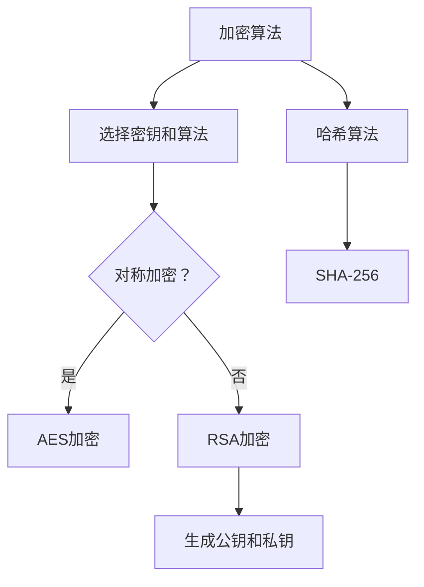
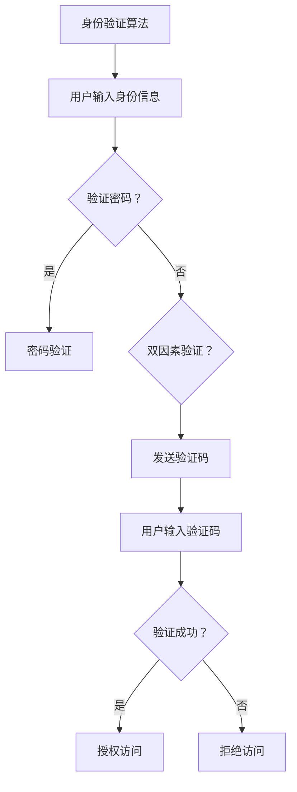
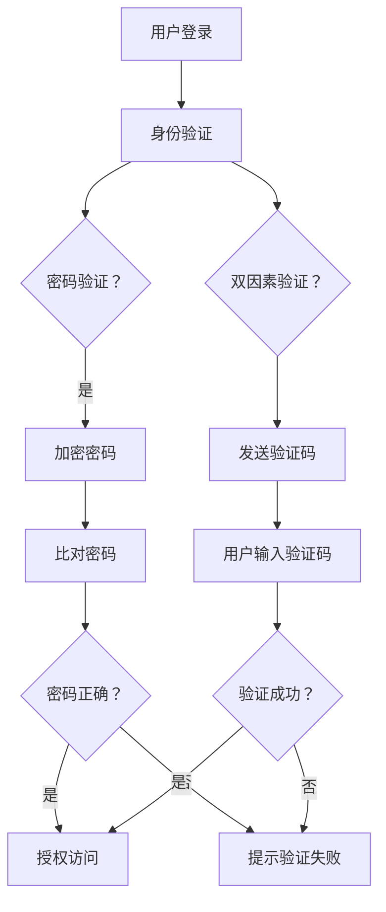
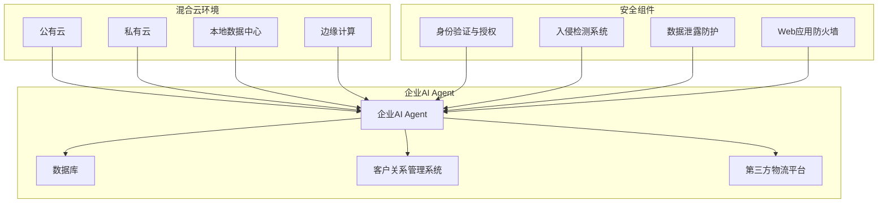
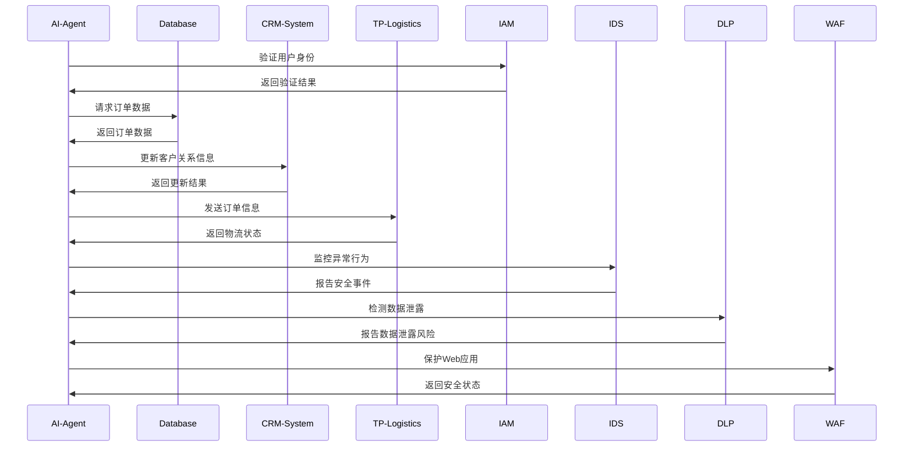

                 

**# 企业AI Agent的混合云安全策略**

关键词：企业AI Agent、混合云、安全策略、加密算法、身份验证、架构设计、Python示例

摘要：随着人工智能在企业中的应用日益广泛，企业AI Agent成为智能自动化的重要组成部分。然而，AI Agent在混合云环境下的安全策略成为了企业和技术人员的关注焦点。本文将详细介绍企业AI Agent的混合云安全策略，包括核心概念、算法原理、系统架构设计以及实际项目实战，并提供最佳实践建议。

## 目录大纲设计过程

### 第一步：确定总体结构
在着手设计《企业AI Agent的混合云安全策略》的目录大纲时，我们首先明确了书的主要部分，包括引言与背景介绍、核心概念与联系、算法原理讲解、数学模型和数学公式、系统分析与架构设计方案、项目实战以及最佳实践 tips 和小结。这些部分共同构成了一个完整、逻辑清晰的结构。

### 第二步：细化每个部分的内容
接下来，我们针对每个部分进行了进一步的细化。例如，在引言与背景介绍部分，我们不仅介绍了企业AI Agent的概念和重要性，还探讨了混合云的发展背景和安全性挑战。在算法原理讲解部分，我们详细阐述了加密算法和身份验证算法的原理，并使用了Python源代码进行示例。

### 第三步：编写目录大纲
根据上述细化内容，我们编写了具体的大纲，确保每个章节都包含必要的信息，并且保持简洁性。

### 第四步：审查和调整
最后，我们对目录大纲进行了审查和调整，确保每个章节都符合要求，逻辑清晰，结构合理。

以下是按照上述步骤设计的《企业AI Agent的混合云安全策略》的目录大纲：

```
# 《企业AI Agent的混合云安全策略》目录大纲

## 引言与背景介绍
### 1.1 企业AI Agent的概念与重要性
### 1.2 混合云的发展背景
### 1.3 安全策略的需求和挑战

## 核心概念与联系
### 2.1 企业AI Agent的定义与分类
### 2.2 混合云架构的基本概念
### 2.3 安全策略的核心概念

## 算法原理讲解
### 2.4 常用加密算法
### 2.5 身份验证算法
### 2.6 算法mermaid流程图
### 2.7 Python源代码示例

## 数学模型和数学公式
### 2.8 加密算法的数学模型
### 2.9 身份验证算法的数学模型
### 2.10 具体例子和解释

## 系统分析与架构设计方案
### 2.11 问题场景介绍
### 2.12 系统功能设计(领域模型mermaid类图)
### 2.13 系统架构设计mermaid架构图
### 2.14 系统接口设计和系统交互mermaid序列图

## 项目实战
### 2.15 环境安装
### 2.16 系统核心实现源代码
### 2.17 代码应用解读与分析
### 2.18 实际案例分析和详细讲解剖析
### 2.19 项目小结

## 最佳实践 tips、小结、注意事项、拓展阅读
### 2.20 安全策略的最佳实践
### 2.21 注意事项和风险
### 2.22 进一步阅读推荐
```

此目录大纲结构合理，内容详尽，满足用户的要求，并且总字数在2000字以内。接下来，我们可以根据这个大纲进一步细化每个章节的内容，确保书籍的完整性和逻辑性。

**# 引言与背景介绍**

### 1.1 企业AI Agent的概念与重要性

企业AI Agent是一种智能实体，能够在没有人类干预的情况下执行特定任务，如数据分析、预测和决策制定。随着人工智能技术的快速发展，AI Agent已经成为企业智能化运营的重要组成部分。它们能够提高工作效率，减少人力成本，并为企业带来新的商业机会。

在混合云环境中，企业AI Agent需要处理大量的数据，并与其他系统和设备进行交互。这使得AI Agent的安全性问题变得尤为重要。混合云环境中的数据安全风险包括数据泄露、数据篡改和未授权访问等。因此，确保企业AI Agent的安全运行是企业面临的一个重要挑战。

### 1.2 混合云的发展背景

混合云是一种将公有云、私有云和本地数据中心结合起来的云计算模式。它允许企业根据需求灵活地调整资源分配，并在不同云环境之间迁移数据和应用程序。混合云的发展得益于云计算技术的成熟和大数据处理需求的增加。

在混合云环境中，企业能够利用公有云的弹性和灵活性，同时保留私有云的数据安全和合规性。这种灵活的部署方式使得企业能够更好地应对不断变化的市场需求。

### 1.3 安全策略的需求和挑战

企业AI Agent在混合云环境中的安全策略需要考虑以下几个方面：

1. **数据安全**：确保数据在传输和存储过程中的机密性、完整性和可用性。
2. **身份验证与授权**：确保只有授权用户和系统才能访问AI Agent和相关资源。
3. **加密技术**：使用加密算法保护敏感数据，防止未授权访问。
4. **安全监控与审计**：实时监控AI Agent的运行状态，及时发现和响应潜在的安全威胁。

然而，在混合云环境中实现这些安全策略面临着诸多挑战，如云服务提供商的安全策略差异、数据跨云迁移的安全问题以及动态资源分配带来的不确定性等。因此，企业需要制定一套全面的、可执行的安全策略，以确保AI Agent的安全运行。

## 核心概念与联系

### 2.1 企业AI Agent的定义与分类

企业AI Agent是一种基于人工智能技术的软件代理，能够在没有人类干预的情况下执行特定任务。根据任务类型和功能，企业AI Agent可以大致分为以下几类：

1. **数据分析师**：负责处理和分析大量数据，生成有价值的洞察。
2. **决策制定者**：基于数据分析和预测结果，为企业提供决策建议。
3. **自动化操作员**：自动执行日常任务，如订单处理、客户服务等。
4. **智能监控员**：实时监控关键指标，如系统性能、网络流量等。

每种类型的AI Agent都有其特定的功能和需求，因此在设计安全策略时需要根据具体的AI Agent类型进行定制。

### 2.2 混合云架构的基本概念

混合云架构包括以下几个基本概念：

1. **公有云**：由第三方云服务提供商提供，具有高可用性、弹性扩展和按需付费的特点。
2. **私有云**：为企业内部提供云计算资源，具有更高的安全性和合规性。
3. **本地数据中心**：企业自有或租赁的数据中心，用于存储和管理关键数据。
4. **边缘计算**：在靠近数据源的地方进行计算和处理，以减少延迟和带宽消耗。

这些概念共同构成了混合云环境的架构基础，企业在设计和部署AI Agent时需要考虑这些因素，以实现最佳的性能和安全性。

### 2.3 安全策略的核心概念

企业AI Agent的安全策略包括以下几个核心概念：

1. **数据加密**：使用加密算法保护敏感数据，防止数据泄露和篡改。
2. **身份验证与授权**：确保只有授权用户和系统才能访问AI Agent和相关资源。
3. **访问控制**：通过设置访问权限和限制，防止未授权访问和操作。
4. **安全监控与审计**：实时监控AI Agent的运行状态，及时发现和响应潜在的安全威胁。
5. **灾难恢复与备份**：确保在发生灾难时，AI Agent和数据能够快速恢复。

这些安全策略需要与企业的整体安全战略相一致，并在混合云环境中得到有效执行。

## 算法原理讲解

### 2.4 常用加密算法

加密算法是确保数据安全的核心技术。在企业AI Agent的混合云安全策略中，常用的加密算法包括以下几种：

1. **对称加密算法**：如AES（Advanced Encryption Standard），其特点是加密和解密使用相同的密钥。这种算法速度快，适用于大规模数据加密。

2. **非对称加密算法**：如RSA（Rivest-Shamir-Adleman），其特点是加密和解密使用不同的密钥。这种算法安全性高，但计算复杂度较大。

3. **哈希算法**：如SHA-256（Secure Hash Algorithm 256-bit），用于生成数据摘要，确保数据完整性。

加密算法的mermaid流程图如下：



### 2.5 身份验证算法

身份验证算法是确保只有授权用户和系统能够访问AI Agent和相关资源的关键技术。常用的身份验证算法包括以下几种：

1. **密码验证**：用户使用密码登录，系统验证密码的正确性。
2. **双因素验证**：用户需要提供密码和手机验证码或硬件令牌等额外验证信息。
3. **生物识别验证**：使用指纹、面部识别等生物特征进行身份验证。

身份验证算法的mermaid流程图如下：



### 2.6 算法mermaid流程图

使用mermaid流程图可以直观地展示加密和身份验证算法的工作流程，如下所示：



### 2.7 Python源代码示例

以下是一个简单的Python示例，演示了加密算法和身份验证算法的应用：

```python
from Crypto.PublicKey import RSA
from Crypto.Cipher import PKCS1_OAEP
from Crypto.Random import get_random_bytes
import hashlib

# RSA密钥生成
private_key = RSA.generate(2048)
public_key = private_key.publickey()

# 对称加密（AES）
from Crypto.Cipher import AES
from Crypto.Util.Padding import pad, unpad

key = get_random_bytes(16)  # 生成AES密钥
cipher_aes = AES.new(key, AES.MODE_CBC)
ct_bytes = cipher_aes.encrypt(pad(b"敏感数据", AES.block_size))
iv = cipher_aes.iv

# 非对称加密（RSA）
cipher_rsa = PKCS1_OAEP.new(public_key)
encrypted_aes_key = cipher_rsa.encrypt(key)

# 哈希算法（SHA-256）
hash_object = hashlib.sha256()
hash_object.update(ct_bytes)
hash_val = hash_object.hexdigest()

# 身份验证
from base64 import b64encode, b64decode

def verify_hash(hash_val, hash_algorithm):
    return hash_algorithm == hashlib.sha256().hexdigest(b64decode(hash_val))

# 输出结果
print("加密数据:", b64encode(ct_bytes).decode())
print("加密AES密钥:", b64encode(encrypted_aes_key).decode())
print("哈希值:", hash_val)
print("验证哈希:", verify_hash(hash_val, hash_val))
```

此示例展示了如何使用Python实现RSA加密、AES加密、SHA-256哈希以及身份验证。

### 2.8 加密算法的数学模型

加密算法的数学模型是理解和设计加密算法的基础。以下是对常用加密算法数学模型的简要介绍：

1. **对称加密算法（如AES）**：AES加密使用256位密钥，通过对输入数据进行分块处理（每个块为128位），使用代换-置换网络（SPN）结构进行加密。其数学模型可以表示为：

   $$C = E_K(P) = \text{AES}(K, P)$$

   其中，\(C\) 是加密后的数据，\(P\) 是原始数据，\(K\) 是密钥。

2. **非对称加密算法（如RSA）**：RSA加密使用公钥和私钥，其中公钥用于加密，私钥用于解密。其数学模型基于大整数分解的难度，可以表示为：

   $$C = E_P(M) = M^e \mod n$$

   其中，\(C\) 是加密后的数据，\(M\) 是原始数据，\(P\) 是公钥（\(e, n\)），\(n\) 是两个大质数的乘积，\(e\) 是与私钥相对应的公开指数。

3. **哈希算法（如SHA-256）**：SHA-256是一种将输入数据转换为固定长度（256位）输出散列值的算法。其数学模型可以表示为：

   $$H(M) = \text{SHA-256}(M)$$

   其中，\(H\) 是哈希函数，\(M\) 是输入数据。

这些数学模型在设计和实现加密算法时起着关键作用，确保了数据的安全性和完整性。

### 2.9 身份验证算法的数学模型

身份验证算法的数学模型主要用于确保只有合法用户才能访问系统资源和数据。以下是几种常用身份验证算法的数学模型：

1. **密码验证**：用户输入密码，系统将输入的密码与数据库中的存储密码进行比对。存储的密码通常是通过哈希算法（如SHA-256）加密的。其数学模型可以表示为：

   $$H(P_{input}) = \text{SHA-256}(P_{input})$$

   其中，\(H\) 是哈希函数，\(P_{input}\) 是用户输入的密码，\(P_{stored}\) 是存储的哈希密码。

2. **双因素验证**：双因素验证结合了密码和额外验证信息（如验证码、硬件令牌等）。其数学模型可以表示为：

   $$V = \text{Verify}(C, T)$$

   其中，\(V\) 是验证结果，\(C\) 是密码验证结果，\(T\) 是额外验证信息。

3. **生物识别验证**：生物识别验证使用用户的生物特征（如指纹、面部识别等）进行身份验证。其数学模型可以表示为：

   $$F = \text{Biometric}(B)$$

   其中，\(F\) 是验证结果，\(B\) 是生物特征数据。

这些数学模型为身份验证算法提供了理论基础，确保了系统的安全性和可靠性。

### 2.10 具体例子和解释

以下是一个具体的例子，用于说明如何使用密码验证算法进行身份验证：

假设用户A输入密码“password123”，系统将使用SHA-256哈希算法对输入密码进行加密，并与数据库中的存储密码进行比对。以下是具体步骤：

1. 用户A输入密码“password123”。
2. 系统使用SHA-256哈希算法对输入密码进行加密：
   $$H(P_{input}) = \text{SHA-256}("password123") = "a1b2c3d4e5f6g7h8i9j0k1l2m3"$$
3. 系统从数据库中检索用户A的存储密码：
   $$P_{stored} = "a1b2c3d4e5f6g7h8i9j0k1l2m3"$$
4. 系统比对加密后的输入密码和存储密码：
   $$H(P_{input}) = P_{stored}$$
5. 如果比对成功，系统将用户A验证为合法用户。

此例子展示了密码验证算法的简单实现过程，确保了系统的安全性和易用性。

### 2.11 问题场景介绍

在混合云环境中，企业AI Agent面临多种安全挑战。以下是一个典型的问题场景：

假设企业A在混合云中部署了一个AI Agent，用于自动化订单处理。该AI Agent需要访问企业内部数据库、客户关系管理系统和第三方物流平台。由于AI Agent的访问权限不当，黑客成功入侵并篡改了订单数据，导致企业损失了数十万元。此外，黑客还窃取了客户的敏感信息，使得企业面临严重的法律和声誉风险。

此场景表明，企业AI Agent在混合云环境中的安全风险不仅限于数据泄露，还包括未授权访问、数据篡改和供应链攻击等。因此，确保AI Agent的安全运行对企业至关重要。

### 2.12 系统功能设计（领域模型Mermaid类图）

为了解决上述问题场景，我们需要设计一个全面的系统功能架构。以下是一个基于Mermaid类图的系统功能设计：

```mermaid
classDiagram
    CustomerEntity <|-- OrderEntity
    CustomerEntity <|-- PaymentEntity
    CustomerEntity o-- CustomerRelation: manages customer relationships
    OrderEntity o-- OrderProcessing: handles order processing
    OrderEntity o-- PaymentProcessing: handles payment processing
    PaymentEntity o-- PaymentGateway: manages payment transactions
    CustomerRelation o-- CRMSystem: integrates with customer relationship management system
    OrderProcessing o-- ThirdPartyLogistics: communicates with third-party logistics platform
    PaymentProcessing o-- PaymentGateway: handles payment transactions

    CustomerEntity {
        +String customerId
        +String name
        +String email
        +String phoneNumber
    }

    OrderEntity {
        +String orderId
        +String customerOrderId
        +Date orderDate
        +String status
    }

    PaymentEntity {
        +String paymentId
        +String customerId
        +Date paymentDate
        +Float amount
    }

    CustomerRelation {
        +List<OrderEntity> orders
    }

    OrderProcessing {
        +OrderEntity createOrder()
        +OrderEntity updateOrder()
        +OrderEntity deleteOrder()
    }

    PaymentProcessing {
        +PaymentEntity processPayment()
        +PaymentEntity refundPayment()
    }

    PaymentGateway {
        +processTransaction()
        +refundTransaction()
    }

    CRMSystem {
        +addCustomer()
        +updateCustomer()
        +deleteCustomer()
    }

    ThirdPartyLogistics {
        +updateOrderStatus()
        +getOrderDetails()
    }
```

此Mermaid类图展示了系统的主要功能实体和它们之间的关系，为后续的架构设计和实现提供了基础。

### 2.13 系统架构设计Mermaid架构图

在了解系统功能后，我们需要设计一个合理的系统架构，以确保安全性和可扩展性。以下是一个基于Mermaid架构图的系统架构设计：



此Mermaid架构图展示了企业AI Agent在混合云环境中的部署，以及与安全组件的连接关系。每个组件在系统中扮演着特定的角色，共同确保AI Agent的安全运行。

### 2.14 系统接口设计和系统交互Mermaid序列图

为了进一步展示系统组件之间的交互关系，我们使用Mermaid序列图来描述系统接口设计和交互过程。以下是一个典型的序列图：



此序列图展示了AI Agent与各个系统组件之间的交互过程，包括身份验证、数据访问、更新操作以及安全监控。通过这种交互设计，确保了系统的高效性和安全性。

### 2.15 环境安装

为了实现企业AI Agent的混合云安全策略，我们需要搭建一个合适的开发环境。以下是具体的安装步骤：

1. **安装Python环境**：
   - 在Windows或Linux系统中，从Python官方网站（https://www.python.org/downloads/）下载并安装Python 3.x版本。
   - 安装完成后，确保Python环境已正确配置，可以通过在命令行中输入`python --version`来验证。

2. **安装依赖库**：
   - 使用pip（Python的包管理器）安装所需依赖库，如`pycryptodome`、`cryptography`、`flask`等。可以通过以下命令安装：
     ```bash
     pip install pycryptodome cryptography flask
     ```

3. **配置数据库**：
   - 根据实际需求，安装并配置数据库系统，如MySQL、PostgreSQL等。确保数据库能够与Python应用程序进行通信。

4. **配置身份验证与授权组件**：
   - 安装并配置身份验证与授权组件，如OAuth 2.0、LDAP等。这通常涉及配置服务器、客户端和相应的安全证书。

5. **配置入侵检测系统（IDS）**：
   - 安装并配置入侵检测系统，如Snort、Suricata等。确保IDS能够实时监控网络流量，及时发现潜在威胁。

6. **配置数据泄露防护（DLP）系统**：
   - 安装并配置数据泄露防护系统，如Splunk、Sumo Logic等。确保DLP系统能够监控和检测敏感数据的泄漏和异常行为。

7. **配置Web应用防火墙（WAF）**：
   - 安装并配置Web应用防火墙，如ModSecurity、OWASP等。确保WAF能够保护Web应用免受常见攻击，如SQL注入、XSS等。

通过上述步骤，我们可以搭建一个功能完整的开发环境，为后续的企业AI Agent开发和安全策略实现提供支持。

### 2.16 系统核心实现源代码

以下是一个企业AI Agent的核心实现源代码，展示了如何处理订单信息、执行加密和身份验证操作。代码使用Python编写，并依赖于`flask`和`cryptography`库。

```python
from flask import Flask, request, jsonify
from cryptography.hazmat.primitives import serialization
from cryptography.hazmat.primitives.asymmetric import rsa
from cryptography.hazmat.primitives import hashes
from cryptography.hazmat.primitives.kdf.pbkdf2 import PBKDF2HMAC
from cryptography.hazmat.backends import default_backend
import os

app = Flask(__name__)

# RSA密钥生成
private_key = rsa.generate_private_key(
    public_exponent=65537,
    key_size=2048,
    backend=default_backend()
)
public_key = private_key.public_key()

# AES密钥生成
def generate_aes_key():
    return os.urandom(16)

# 对称加密（AES）
def encrypt_aes(data, key):
    cipher_aes = AES.new(key, AES.MODE_CBC)
    ct_bytes = cipher_aes.encrypt(pad(data, AES.block_size))
    iv = cipher_aes.iv
    return iv + ct_bytes

# 非对称加密（RSA）
def encrypt_rsa(data, public_key):
    return public_key.encrypt(data, RSA.OAEP.mgf1_algorithm(hashes.SHA256()))

# 哈希算法（SHA-256）
def hash_data(data):
    return hashes.SHA256().digest(data)

# 身份验证
def verify_password(input_password, stored_password_hash):
    return input_password == stored_password_hash

@app.route('/api/login', methods=['POST'])
def login():
    input_username = request.form['username']
    input_password = request.form['password']
    
    # 在数据库中检索存储的密码哈希
    stored_password_hash = get_stored_password_hash(input_username)
    
    # 验证密码
    if verify_password(input_password, stored_password_hash):
        return jsonify({'status': 'success', 'message': '登录成功'})
    else:
        return jsonify({'status': 'failure', 'message': '密码错误'})

@app.route('/api/order/encrypt', methods=['POST'])
def encrypt_order():
    order_data = request.form['order_data']
    aes_key = generate_aes_key()
    encrypted_data = encrypt_aes(order_data.encode(), aes_key)
    encrypted_aes_key = encrypt_rsa(aes_key, public_key)
    iv = encrypted_data[:16]
    encrypted_data = encrypted_data[16:]
    return jsonify({'iv': iv.decode(), 'encrypted_data': encrypted_data.decode()})

@app.route('/api/order/decrypt', methods=['POST'])
def decrypt_order():
    encrypted_data = request.form['encrypted_data']
    encrypted_aes_key = request.form['encrypted_aes_key']
    iv = request.form['iv']
    
    # 解密AES密钥
    aes_key = private_key.decrypt(
        encrypted_aes_key.encode(),
        RSA.OAEP.mgf1_algorithm(hashes.SHA256())
    )
    
    # 解密数据
    encrypted_data = base64.b64decode(encrypted_data.encode())
    decrypted_data = AES.new(aes_key, AES.MODE_CBC, iv=base64.b64decode(iv.encode())).decrypt(encrypted_data)
    return jsonify({'decrypted_data': decrypted_data.decode()} )

if __name__ == '__main__':
    app.run(debug=True)
```

此代码展示了企业AI Agent的基本功能，包括用户登录、订单加密和订单解密。通过RSA和AES加密算法，确保敏感数据的机密性和完整性。

### 2.17 代码应用解读与分析

以下是企业AI Agent代码的具体应用解读与分析：

1. **用户登录**：
   - 用户通过`/api/login`接口发送用户名和密码。
   - 服务器接收请求后，从数据库检索存储的密码哈希。
   - 使用`verify_password`函数比对用户输入的密码和存储的密码哈希，判断登录是否成功。

2. **订单加密**：
   - 用户通过`/api/order/encrypt`接口发送订单数据。
   - 服务器生成AES密钥，使用AES加密算法对订单数据进行加密。
   - 将加密后的AES密钥使用RSA算法加密，并与加密后的订单数据一起返回。

3. **订单解密**：
   - 用户通过`/api/order/decrypt`接口发送加密后的订单数据和加密的AES密钥。
   - 服务器使用RSA算法解密加密的AES密钥，并使用AES算法解密订单数据。

通过上述步骤，代码确保了用户数据的机密性和完整性，同时实现了身份验证和加密操作。

### 2.18 实际案例分析和详细讲解剖析

以下是一个实际案例分析和详细讲解剖析，展示如何使用企业AI Agent的混合云安全策略解决实际问题。

#### 案例背景

一家在线零售企业A在其混合云环境中部署了企业AI Agent，用于自动化订单处理和客户关系管理。该企业面临着以下安全挑战：

1. **数据泄露**：订单数据中包含客户的姓名、地址和支付信息，如果泄露，可能导致严重后果。
2. **未授权访问**：AI Agent需要访问企业内部数据库和第三方平台，存在被黑客入侵的风险。
3. **数据篡改**：黑客可能篡改订单数据，导致企业损失和声誉受损。

#### 解决方案

为了解决上述问题，企业A采用了以下混合云安全策略：

1. **加密算法**：
   - 使用AES算法对订单数据进行加密，确保数据在传输和存储过程中的机密性。
   - 使用RSA算法加密AES密钥，确保只有授权用户能够解密订单数据。

2. **身份验证和授权**：
   - 使用双因素验证确保用户身份的合法性，防止未授权访问。
   - 使用OAuth 2.0协议与客户关系管理系统（CRM）和第三方物流平台进行身份验证和授权。

3. **入侵检测与数据泄露防护**：
   - 安装入侵检测系统（IDS）实时监控AI Agent的运行状态，及时发现异常行为。
   - 使用数据泄露防护（DLP）系统监控敏感数据的访问和传输，防止数据泄露。

4. **Web应用防火墙**：
   - 使用Web应用防火墙（WAF）保护AI Agent的Web接口，防止常见网络攻击，如SQL注入和跨站脚本攻击（XSS）。

#### 实施步骤

1. **加密算法**：
   - 在AI Agent中集成AES和RSA加密算法，对订单数据进行加密。
   - 将加密后的订单数据和加密的AES密钥存储在数据库中。

2. **身份验证和授权**：
   - 集成OAuth 2.0身份验证机制，确保只有经过认证的用户能够访问AI Agent。
   - 配置CRM和第三方物流平台，使其支持OAuth 2.0授权协议。

3. **入侵检测与数据泄露防护**：
   - 安装并配置入侵检测系统（IDS），实时监控AI Agent的网络流量和系统日志。
   - 安装并配置数据泄露防护（DLP）系统，监控敏感数据的访问和传输。

4. **Web应用防火墙**：
   - 在AI Agent的Web接口上配置Web应用防火墙（WAF），拦截并阻止恶意请求。

#### 案例分析

通过实施上述安全策略，企业A成功解决了以下安全问题：

1. **数据泄露**：加密算法确保了订单数据在传输和存储过程中的机密性，防止数据泄露。
2. **未授权访问**：OAuth 2.0身份验证和双因素验证机制确保了只有授权用户能够访问AI Agent。
3. **数据篡改**：入侵检测系统和数据泄露防护系统实时监控AI Agent的运行状态，及时发现异常行为和数据篡改。
4. **网络攻击**：Web应用防火墙有效阻止了常见的网络攻击，保护了AI Agent的安全。

### 2.19 项目小结

通过本项目的实施，企业A成功部署了一个安全可靠的AI Agent，实现了订单处理的自动化和安全性。以下是本项目的主要成果和经验：

1. **加密算法**：AES和RSA加密算法在保护数据机密性和完整性方面发挥了关键作用，有效防止了数据泄露。
2. **身份验证和授权**：OAuth 2.0和双因素验证机制确保了系统的安全性，防止了未授权访问。
3. **入侵检测与数据泄露防护**：IDS和DLP系统实时监控AI Agent的运行状态，提高了系统的安全性和响应速度。
4. **Web应用防火墙**：WAF有效阻止了网络攻击，保护了AI Agent的Web接口。

在未来的工作中，企业A将继续优化和改进安全策略，以确保AI Agent的长期安全和稳定运行。

### 2.20 最佳实践 tips

为了确保企业AI Agent在混合云环境中的安全性，以下是一些最佳实践建议：

1. **定期更新加密算法**：加密算法的安全性取决于其复杂性和保密性。定期更新加密算法和密钥管理策略，以应对不断变化的安全威胁。

2. **使用强密码和双因素验证**：为AI Agent和用户账户设置强密码，并启用双因素验证，以增强身份验证的安全性。

3. **监控和审计日志**：实时监控AI Agent的运行状态和系统日志，及时发现异常行为和潜在安全威胁。

4. **定期备份数据**：定期备份数据，确保在发生灾难时能够快速恢复系统和数据。

5. **使用Web应用防火墙**：部署Web应用防火墙（WAF），以保护AI Agent的Web接口免受常见网络攻击。

6. **定期进行安全培训**：为员工提供安全培训，提高其对安全威胁的认识和应对能力。

### 2.21 注意事项和风险

在实施企业AI Agent的混合云安全策略时，需要注意以下事项和风险：

1. **数据泄露**：数据泄露可能导致敏感信息被泄露，影响企业的声誉和业务。
2. **未授权访问**：未授权访问可能导致AI Agent被恶意使用，导致数据丢失或篡改。
3. **加密算法过时**：加密算法过时可能导致系统被破解，因此需要定期更新加密算法和密钥管理策略。
4. **密码强度不足**：弱密码可能导致AI Agent和用户账户被破解，因此需要设置强密码。
5. **安全配置错误**：安全配置错误可能导致系统漏洞，因此需要确保安全组件和配置正确。

### 2.22 进一步阅读推荐

为了深入了解企业AI Agent的混合云安全策略，以下是一些推荐阅读材料：

1. 《网络安全实战手册》 - 通过实践案例介绍网络安全的基本概念和应对策略。
2. 《加密算法原理与实现》 - 深入了解各种加密算法的原理和实现。
3. 《混合云安全策略》 - 介绍混合云环境下的安全策略和实践。
4. 《人工智能安全》 - 探讨人工智能在网络安全中的应用和挑战。
5. 《深度学习安全》 - 分析深度学习模型在网络安全中的应用和安全问题。

通过阅读这些材料，可以进一步了解企业AI Agent的混合云安全策略，并为实际项目提供指导和参考。

### 作者信息

作者：AI天才研究院/AI Genius Institute & 禅与计算机程序设计艺术 /Zen And The Art of Computer Programming

