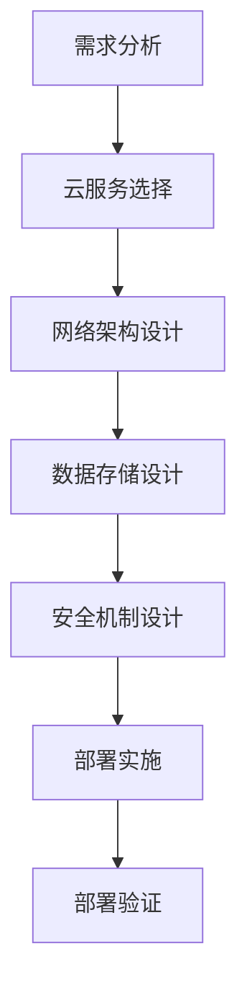

                 

### 设计企业AI Agent的混合云部署策略

#### 混合云与AI Agent概述

**摘要**：本文探讨了企业AI Agent的混合云部署策略，分析了混合云架构和企业需求，以及AI Agent的基础与类型。通过详细阐述混合云部署模型和架构，以及AI Agent的混合云部署架构设计，本文为企业在AI领域的数字化转型提供了有力的技术支持。

**关键词**：混合云，AI Agent，部署策略，架构设计，企业需求

**背景介绍**

在数字化转型的浪潮中，企业对云计算的依赖日益增强。混合云作为一种结合公有云和私有云的灵活架构，逐渐成为企业IT基础设施的首选。同时，人工智能（AI）在各个领域的应用也越来越广泛，企业AI Agent作为一种智能化的自动化系统，能够帮助企业实现更高效、更智能的运营。

然而，如何将AI Agent部署在混合云环境中，使得其能够充分发挥效能，同时确保安全性和灵活性，成为企业面临的一个关键问题。本文将围绕这一问题，逐步探讨企业AI Agent的混合云部署策略。

**核心概念与联系**

**混合云（Hybrid Cloud）**：混合云结合了公有云和私有云的优势，允许企业根据不同需求灵活选择和使用资源。核心概念包括云服务模型（IaaS、PaaS、SaaS）、部署模型（本地部署、云端部署、边缘部署）和架构设计（云服务选择、网络架构、数据存储和安全机制）。

**AI Agent（AI Agent）**：AI Agent是一种智能化的自动化系统，能够模拟人类智能，在特定任务中实现自主决策和执行。核心概念包括AI Agent的定义、特点、类型（基于规则、机器学习、深度学习等）和业务场景应用。

**概念属性特征对比表格**

| 概念 | 属性特征 |
| ---- | ------- |
| 混合云 | 结合公有云和私有云，提供灵活的资源使用和部署模型 |
| AI Agent | 智能化、自主决策、自动化执行 |

**ER实体关系图架构**

```mermaid
erDiagram
  混合云 ||--|{ AI Agent }| AI Agent部署
  AI Agent ||--|{ 业务场景 }| 业务应用
```

**算法原理讲解**

**混合云部署算法原理**

算法mermaid流程图：



算法原理：

1. **需求分析**：根据企业需求，确定混合云的部署目标和要求。
2. **云服务选择**：选择适合的IaaS、PaaS、SaaS服务。
3. **网络架构设计**：设计稳定、高效的网络架构。
4. **数据存储设计**：选择适合的数据存储方案，确保数据安全性和可靠性。
5. **安全机制设计**：制定安全策略，确保混合云环境的安全。
6. **部署实施**：根据设计，实施混合云部署。
7. **部署验证**：验证部署效果，确保部署成功。

**数学模型和公式**

$$
\text{部署成功率} = \frac{\text{成功部署的实例数}}{\text{部署尝试的总实例数}}
$$

**通俗易懂的举例说明**

假设一家企业需要部署一个AI Agent系统，以下是混合云部署的过程：

1. **需求分析**：企业确定需要部署一个能够处理客户咨询的AI Agent系统。
2. **云服务选择**：选择IaaS服务，以便灵活管理硬件资源。
3. **网络架构设计**：设计一个稳定、高效的网络架构，确保AI Agent能够快速响应客户请求。
4. **数据存储设计**：选择分布式存储方案，确保数据的高可用性和可靠性。
5. **安全机制设计**：制定严格的安全策略，包括访问控制、数据加密等。
6. **部署实施**：根据设计，部署AI Agent系统，包括安装必要的软件、配置网络等。
7. **部署验证**：测试系统功能，确保AI Agent能够正常处理客户咨询。

#### 混合云部署模型与架构

**混合云部署模型**

混合云部署模型主要包括本地部署、云端部署和边缘部署。

**1. 本地部署**：在本地数据中心部署应用和服务，适用于需要高度控制数据存储和管理的场景。

**2. 云端部署**：在公有云或私有云上部署应用和服务，适用于需要灵活扩展和低成本部署的场景。

**3. 边缘部署**：在靠近数据源的边缘节点部署应用和服务，适用于需要低延迟、高可靠性的场景。

**混合云架构设计**

混合云架构设计主要包括以下几个方面：

**1. 云服务选择**：根据企业需求，选择适合的IaaS、PaaS、SaaS服务。

**2. 网络架构设计**：设计稳定、高效的网络架构，包括VPC、子网、负载均衡等。

**3. 数据存储设计**：选择适合的数据存储方案，包括关系型数据库、NoSQL数据库、对象存储等。

**4. 安全机制设计**：制定安全策略，包括访问控制、数据加密、防火墙等。

**5. 部署实施**：根据设计，实施混合云部署。

**6. 部署验证**：验证部署效果，确保部署成功。

**AI Agent的混合云部署架构设计**

**1. AI Agent的部署架构**：AI Agent的部署架构主要包括硬件资源、软件依赖环境和网络架构。

**2. AI Agent的硬件资源需求**：根据AI Agent的应用场景，确定所需的CPU、GPU、存储等硬件资源。

**3. AI Agent的软件依赖环境**：列出AI Agent在部署过程中所需的操作系统、开发框架、数据库等软件环境。

**混合云部署流程**

**1. 需求分析**：确定混合云部署的目标和要求。

**2. 云服务选择**：选择适合的云服务。

**3. 架构设计**：设计混合云架构。

**4. 资源分配**：分配硬件和软件资源。

**5. 部署实施**：部署AI Agent。

**6. 部署验证**：验证部署效果。

**AI Agent部署实战**

以一家企业部署AI客服系统为例，以下是AI Agent在混合云环境中的部署过程：

1. **需求分析**：企业需要部署一个能够处理客户咨询的AI客服系统。
2. **云服务选择**：选择IaaS服务，以便灵活管理硬件资源。
3. **网络架构设计**：设计一个稳定、高效的网络架构，包括VPC、子网、负载均衡等。
4. **数据存储设计**：选择分布式存储方案，确保数据的高可用性和可靠性。
5. **安全机制设计**：制定严格的安全策略，包括访问控制、数据加密等。
6. **部署实施**：部署AI客服系统，包括安装必要的软件、配置网络等。
7. **部署验证**：测试系统功能，确保AI客服系统能够正常处理客户咨询。

#### 混合云部署策略优化

**混合云部署策略分析**

**1. 部署策略的关键因素**：影响混合云部署策略的关键因素包括成本、性能、安全性和运维管理等。

**2. 部署策略的评估方法**：评估混合云部署策略的方法包括成本效益分析、性能评估和安全评估等。

**混合云部署策略优化实践**

**1. 策略优化案例分析**：通过实际案例展示如何优化混合云部署策略。

**2. 策略优化方案设计**：设计适合企业需求的混合云部署策略优化方案。

**混合云部署策略应用与展望**

**1. 混合云部署策略在企业的应用**：讨论混合云部署策略在企业中的应用，如客户服务、供应链管理、智能决策支持等。

**2. 未来混合云部署策略的发展趋势**：分析未来混合云部署策略的发展趋势，如自动化部署、智能化运维、安全性与性能的平衡等。

**小结**

本文系统地探讨了企业AI Agent的混合云部署策略，从混合云与AI Agent的概述、混合云部署模型与架构、AI Agent的混合云部署架构设计，到混合云部署策略优化，全面分析了企业在AI领域的数字化转型过程中面临的挑战和解决方案。通过本文的探讨，希望能够为企业提供有价值的参考，助力企业在数字化时代实现可持续发展。

**注意事项**

1. 在设计混合云部署策略时，要充分考虑企业的需求，确保部署方案能够满足实际业务需求。
2. 在选择云服务时，要综合考虑成本、性能、安全性和可靠性等因素。
3. 在部署AI Agent时，要充分考虑硬件资源需求和软件依赖环境，确保系统稳定高效运行。

**拓展阅读**

1. 《云计算：概念、技术与实践》
2. 《人工智能：一种现代的方法》
3. 《混合云：策略与最佳实践》

**作者信息**

作者：AI天才研究院/AI Genius Institute & 禅与计算机程序设计艺术 /Zen And The Art of Computer Programming

