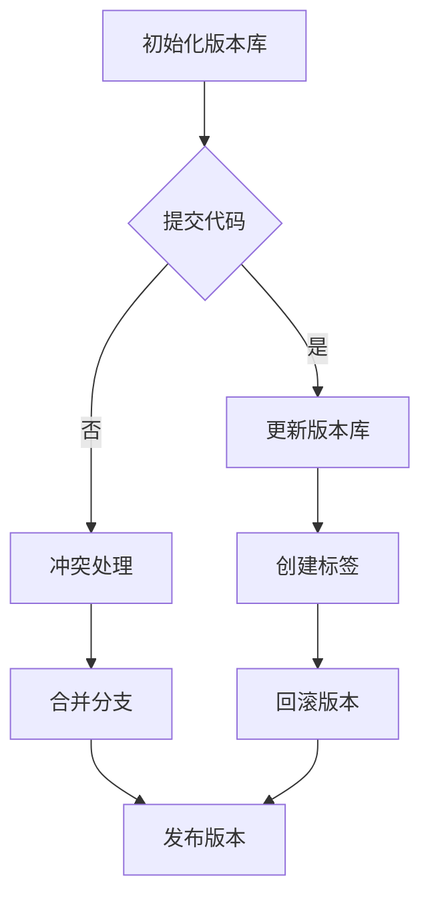
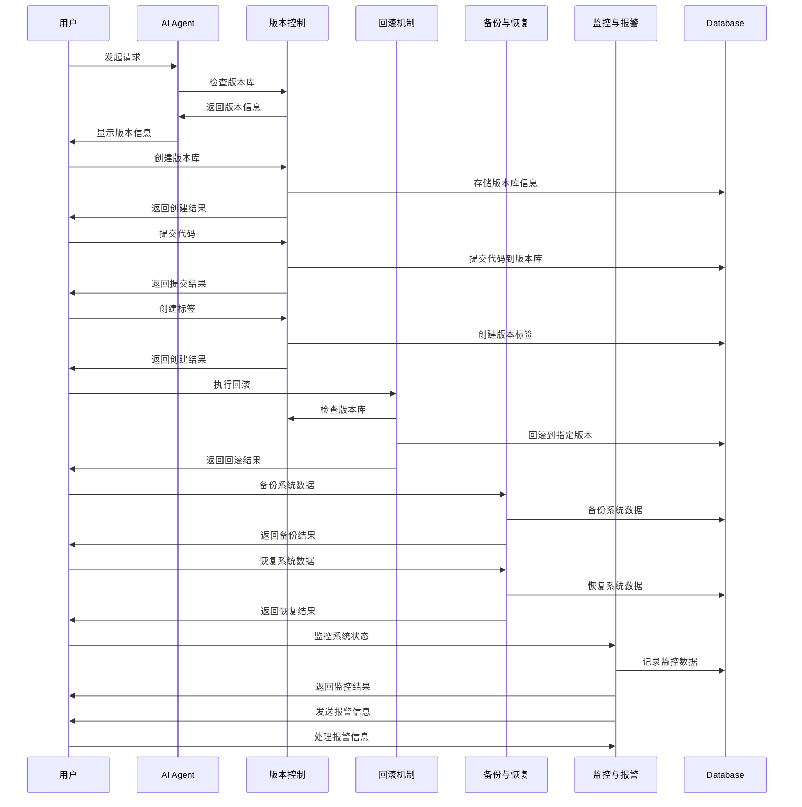

                 

# 企业AI Agent的版本控制与回滚机制

> 关键词：企业AI Agent、版本控制、回滚机制、人工智能、应用场景、最佳实践

> 摘要：本文旨在探讨企业AI Agent的版本控制与回滚机制，深入分析其重要性、核心概念、应用场景及设计实现方法，并通过实际案例分析提供最佳实践与注意事项。文章结构清晰，旨在为IT从业者和研究者提供有价值的参考。

## 第一部分：背景介绍

### 第1章：问题背景

#### 1.1.1 问题概述

在人工智能（AI）技术飞速发展的今天，企业AI Agent作为智能化的执行主体，已经成为企业提高生产效率、降低运营成本、增强竞争力的重要工具。然而，随着AI Agent在企业中的应用深度和广度不断增加，如何有效地管理和控制AI Agent的版本更新、故障修复以及回滚操作，成为企业面临的一个重要问题。

#### 1.1.2 问题解决的重要性

解决企业AI Agent的版本控制与回滚问题，具有以下几个重要性：

1. **确保系统稳定性和可靠性**：有效的版本控制与回滚机制能够确保系统在更新过程中不发生意外故障，降低系统风险。
2. **提升开发与运维效率**：良好的版本管理能够提高开发团队的工作效率，减少因版本问题导致的调试和修复时间。
3. **保障数据安全和隐私**：在AI系统中，数据安全和隐私保护至关重要。有效的版本控制可以确保数据的完整性和安全性。
4. **支持业务持续迭代**：企业需要不断迭代AI系统以适应市场变化，版本控制与回滚机制是实现业务持续迭代的关键。

#### 1.1.3 边界与外延

本文的讨论范围主要涵盖以下内容：

- **AI Agent**：专注于企业内部应用，如自动化、优化、交互和预测等。
- **版本控制**：涉及版本库、标签、分支等机制。
- **回滚机制**：讨论回滚策略、流程及其实现。

本文将不涉及AI Agent的具体实现细节，如算法、模型等。

#### 1.1.4 概念结构与核心要素组成

企业AI Agent的版本控制与回滚机制包括以下核心要素：

1. **版本库**：存储AI Agent的各个版本。
2. **版本标签**：标记重要的版本，如发布版本、测试版本等。
3. **版本分支**：实现不同版本的并行开发。
4. **回滚策略**：决定在故障发生时如何回滚。
5. **回滚流程**：实现回滚的具体步骤。
6. **回滚工具**：支持回滚操作的工具。

## 第二部分：核心概念与联系

### 第2章：核心概念与联系

#### 2.1 AI Agent的定义与特点

##### 2.1.1 AI Agent的定义

AI Agent是指具有自主决策能力、能够执行特定任务的人工智能实体。在企业环境中，AI Agent可以应用于自动化、优化、交互、预测等多个领域。

##### 2.1.2 AI Agent的核心特点

- **自主性**：AI Agent能够自主地完成指定任务。
- **适应性**：AI Agent能够根据环境变化调整自己的行为。
- **协同性**：AI Agent能够与其他AI Agent或人类协作完成任务。

##### 2.1.3 AI Agent与传统Agent的区别

- **自主决策能力**：AI Agent具有更强的自主决策能力，而传统Agent主要依赖于预设的规则和指令。
- **学习能力**：AI Agent能够通过学习不断优化自身性能，而传统Agent通常不具备这种能力。

#### 2.2 版本控制与回滚机制概述

##### 2.2.1 版本控制的定义与重要性

版本控制是指对软件系统各个版本的创建、管理和维护。其重要性体现在以下几个方面：

- **确保系统稳定性**：通过版本控制，可以确保系统的稳定性和可靠性。
- **支持并行开发**：版本控制支持不同团队或开发人员同时进行开发，提高开发效率。
- **方便故障修复**：通过版本控制，可以快速定位和修复故障。

##### 2.2.2 回滚机制的定义与作用

回滚机制是指在系统出现故障时，将系统恢复到上一个正常版本的过程。其作用包括：

- **快速恢复系统**：在故障发生时，回滚机制可以快速将系统恢复到正常状态。
- **减少损失**：回滚机制可以减少系统故障带来的损失，如数据丢失、业务中断等。

##### 2.2.3 版本控制与回滚机制的联系

版本控制与回滚机制密切相关。有效的版本控制为回滚机制提供了坚实的基础，而回滚机制则是对版本控制的有力补充，确保系统在出现故障时能够迅速恢复。

## 第三部分：AI Agent在企业的应用

### 第3章：AI Agent在企业的应用

#### 3.1 AI Agent的应用场景

AI Agent在企业中的应用场景非常广泛，主要包括以下几个方面：

##### 3.1.1 自动化与优化

- **自动化流程**：AI Agent可以自动执行复杂的业务流程，如订单处理、物流管理等。
- **优化资源配置**：AI Agent可以通过数据分析，优化企业的资源配置，提高生产效率。

##### 3.1.2 交互与协作

- **智能客服**：AI Agent可以提供24/7的智能客服服务，提高客户满意度。
- **团队协作**：AI Agent可以帮助企业内部员工进行协作，提高工作效率。

##### 3.1.3 预测与分析

- **需求预测**：AI Agent可以通过数据分析，预测市场需求，帮助企业管理库存。
- **风险评估**：AI Agent可以分析企业的风险状况，为决策提供支持。

#### 3.2 企业AI Agent的优势

##### 3.2.1 提高效率与减少错误

AI Agent能够自动执行复杂的任务，提高工作效率，减少人为操作错误。

##### 3.2.2 降低成本与提升竞争力

通过自动化和优化，企业可以降低运营成本，提升竞争力。

##### 3.2.3 创新业务模式与市场拓展

AI Agent可以帮助企业探索新的业务模式，开拓新市场。

## 第四部分：版本控制与回滚机制原理

### 第4章：版本控制与回滚机制原理

#### 4.1 版本控制原理

##### 4.1.1 版本控制的基本概念

版本控制是指对软件系统各个版本的创建、管理和维护。其核心概念包括：

- **版本库**：存储软件系统的各个版本。
- **版本标签**：用于标记重要的版本，如发布版本、测试版本等。
- **版本分支**：用于实现不同版本的并行开发。

##### 4.1.2 版本控制的核心机制

版本控制的核心机制包括：

- **版本号管理**：通过版本号区分不同的版本。
- **版本库维护**：确保版本库的完整性和一致性。
- **变更管理**：记录和管理版本的变更历史。

##### 4.1.3 常见版本控制工具介绍

常见的版本控制工具包括Git、SVN、Mercurial等。每种工具都有其独特的优势和适用场景。

#### 4.2 回滚机制原理

##### 4.2.1 回滚机制的定义

回滚机制是指当系统出现故障时，将系统恢复到上一个正常版本的过程。

##### 4.2.2 回滚机制的实现方式

回滚机制的实现方式包括：

- **版本回滚**：直接将系统恢复到上一个正常版本。
- **数据回滚**：将系统数据恢复到上一个正常状态。

##### 4.2.3 回滚机制的优势与挑战

回滚机制的优势包括：

- **快速恢复系统**：在故障发生时，可以快速将系统恢复到正常状态。
- **减少损失**：可以减少系统故障带来的损失。

回滚机制的挑战包括：

- **数据完整性**：在回滚过程中，需要确保数据的完整性和一致性。
- **操作风险**：回滚操作可能会引入新的问题，需要谨慎操作。

## 第五部分：AI Agent版本控制与回滚机制的设计

### 第5章：AI Agent版本控制与回滚机制的设计

#### 5.1 设计目标与原则

##### 5.1.1 设计目标

AI Agent版本控制与回滚机制的设计目标包括：

- **确保系统稳定性**：通过有效的版本控制与回滚机制，确保系统在更新过程中不发生意外故障。
- **提高开发与运维效率**：通过良好的版本管理，提高开发团队的工作效率，减少因版本问题导致的调试和修复时间。
- **保障数据安全和隐私**：通过有效的版本控制与回滚机制，确保数据的完整性和安全性。

##### 5.1.2 设计原则

AI Agent版本控制与回滚机制的设计原则包括：

- **一致性**：确保版本库的完整性和一致性。
- **可扩展性**：支持不同规模和应用场景的版本控制。
- **安全性**：确保系统的数据安全和隐私。

#### 5.2 版本控制机制设计

##### 5.2.1 版本库设计

版本库设计包括：

- **版本库结构**：明确版本库的目录结构和文件组织方式。
- **版本库权限**：设置版本库的访问权限，确保数据安全。

##### 5.2.2 版本标签设计

版本标签设计包括：

- **标签命名**：制定统一的标签命名规范。
- **标签功能**：明确不同类型标签的功能和使用场景。

##### 5.2.3 版本分支设计

版本分支设计包括：

- **分支策略**：制定分支策略，确保版本分支的可管理性。
- **分支合并**：制定分支合并策略，确保分支合并的顺利进行。

#### 5.3 回滚机制设计

##### 5.3.1 回滚策略设计

回滚策略设计包括：

- **回滚触发条件**：明确回滚的触发条件，如系统故障、性能下降等。
- **回滚策略选择**：根据触发条件选择合适的回滚策略，如版本回滚、数据回滚等。

##### 5.3.2 回滚流程设计

回滚流程设计包括：

- **回滚准备**：进行回滚前的准备工作，如备份当前版本、测试回滚方案等。
- **回滚执行**：执行回滚操作，如切换版本、恢复数据等。
- **回滚验证**：验证回滚效果，确保系统恢复正常。

##### 5.3.3 回滚工具选择

回滚工具选择包括：

- **工具功能**：选择具备回滚功能的版本控制工具。
- **工具兼容性**：确保回滚工具与现有系统兼容。
- **工具性能**：选择性能优秀的回滚工具，提高回滚效率。

## 第六部分：AI Agent版本控制与回滚机制实现

### 第6章：AI Agent版本控制与回滚机制实现

#### 6.1 环境安装与配置

##### 6.1.1 开发环境安装

- **操作系统**：安装支持AI Agent开发和版本控制的操作系统，如Linux。
- **开发工具**：安装必要的开发工具，如Python、Git等。

##### 6.1.2 版本控制工具配置

- **Git配置**：配置Git的用户信息，确保版本库的权限管理。

##### 6.1.3 回滚工具配置

- **选择回滚工具**：根据需求选择合适的回滚工具，如Git。

#### 6.2 版本控制实现

##### 6.2.1 版本库创建与维护

- **创建版本库**：使用Git创建版本库。
- **版本库维护**：定期备份版本库，确保版本库的安全。

##### 6.2.2 版本标签创建与切换

- **创建版本标签**：为重要版本创建标签。
- **切换版本标签**：根据需要切换版本标签。

##### 6.2.3 版本分支创建与合并

- **创建版本分支**：根据需求创建版本分支。
- **合并版本分支**：合并版本分支，确保代码的一致性。

#### 6.3 回滚机制实现

##### 6.3.1 回滚策略应用

- **触发回滚**：根据回滚策略触发回滚。
- **执行回滚**：执行回滚操作，如切换版本、恢复数据等。

##### 6.3.2 回滚流程执行

- **回滚准备**：进行回滚前的准备工作。
- **回滚执行**：执行回滚操作。
- **回滚验证**：验证回滚效果。

##### 6.3.3 回滚效果验证

- **测试回滚效果**：测试回滚后的系统功能。
- **修复回滚问题**：如发现回滚问题，及时修复。

## 第七部分：实际案例分析

### 第7章：实际案例分析

#### 7.1 案例一：企业AI客服系统的版本控制与回滚

##### 7.1.1 案例背景

某企业开发了一款AI客服系统，用于为客户提供24/7的智能服务。随着系统的不断迭代，如何确保版本更新过程的安全和稳定成为关键问题。

##### 7.1.2 案例目标

通过有效的版本控制与回滚机制，确保AI客服系统的稳定性、可靠性和安全性。

##### 7.1.3 案例实现过程

1. **版本库创建与维护**：使用Git创建版本库，并定期备份。
2. **版本标签创建与切换**：为每个发布版本创建标签，便于管理和切换。
3. **版本分支创建与合并**：根据需求创建分支，确保代码的一致性。
4. **回滚策略设计**：制定回滚策略，包括版本回滚和数据回滚。
5. **回滚流程执行**：在系统出现故障时，根据回滚策略执行回滚操作。
6. **回滚效果验证**：测试回滚后的系统功能，确保恢复正常。

##### 7.1.4 案例效果分析

通过有效的版本控制与回滚机制，AI客服系统在版本更新过程中实现了零故障、零数据丢失，提高了系统的稳定性和可靠性。

#### 7.2 案例二：企业供应链管理系统的版本控制与回滚

##### 7.2.1 案例背景

某企业采用AI技术优化供应链管理系统，以提高供应链的效率和响应速度。然而，AI系统的复杂性和易变性给版本管理带来了挑战。

##### 7.2.2 案例目标

通过有效的版本控制与回滚机制，确保供应链管理系统的稳定运行和高效迭代。

##### 7.2.3 案例实现过程

1. **版本库创建与维护**：使用Git创建版本库，并定期备份。
2. **版本标签创建与切换**：为每个发布版本创建标签，便于管理和切换。
3. **版本分支创建与合并**：根据需求创建分支，确保代码的一致性。
4. **回滚策略设计**：制定回滚策略，包括版本回滚和数据回滚。
5. **回滚流程执行**：在系统出现故障时，根据回滚策略执行回滚操作。
6. **回滚效果验证**：测试回滚后的系统功能，确保恢复正常。

##### 7.2.4 案例效果分析

通过有效的版本控制与回滚机制，供应链管理系统在版本更新过程中实现了高效、稳定的迭代，显著提高了供应链的效率和响应速度。

## 第八部分：最佳实践与注意事项

### 第8章：最佳实践与注意事项

#### 8.1 最佳实践

1. **版本控制的最佳实践**：
   - **统一命名规范**：制定统一的版本命名规范，便于管理和查找。
   - **定期备份**：定期备份版本库，确保数据安全。
   - **代码审查**：在版本发布前进行代码审查，确保代码质量。

2. **回滚机制的最佳实践**：
   - **明确回滚策略**：根据业务需求明确回滚策略，确保故障发生时能够快速回滚。
   - **回滚前测试**：在回滚前进行充分的测试，确保回滚过程不会引入新的问题。

#### 8.2 注意事项

1. **版本控制注意事项**：
   - **避免频繁发布**：频繁发布可能导致系统稳定性下降，应避免。
   - **版本库权限管理**：严格权限管理，防止未授权访问。

2. **回滚机制注意事项**：
   - **回滚前备份**：在执行回滚前进行数据备份，以防数据丢失。
   - **回滚后验证**：回滚后应进行全面的系统验证，确保系统恢复正常。

#### 8.3 拓展阅读

1. **相关书籍推荐**：
   - 《版本控制之道：Git使用详解》
   - 《Effective Git》

2. **学术论文推荐**：
   - “Rollback Recovery in Large-scale Distributed Systems”
   - “A Survey on Version Control Systems”

3. **开源项目推荐**：
   - GitLab
   - GitHub

---

## 结束语

本文系统地介绍了企业AI Agent的版本控制与回滚机制，从背景介绍、核心概念、应用场景、设计原理、实现方法到实际案例分析，全面阐述了企业AI Agent版本控制与回滚机制的各个方面。通过本文的学习，读者可以深入了解版本控制与回滚机制在AI Agent中的应用，掌握最佳实践和注意事项，为企业在AI领域的发展提供有力支持。

---

**作者：AI天才研究院/AI Genius Institute & 禅与计算机程序设计艺术 /Zen And The Art of Computer Programming**# 详细撰写正文内容

## 第一部分：背景介绍

### 第1章：问题背景

#### 1.1.1 问题概述

随着人工智能技术的快速发展，AI Agent在企业中的应用越来越广泛。企业AI Agent作为一种智能化的执行主体，可以自动执行复杂任务、优化业务流程、提供智能客服等。然而，随着AI Agent在企业中的深度应用，如何管理和控制AI Agent的版本更新、故障修复以及回滚操作，成为一个重要的问题。

在传统的软件开发中，版本控制与回滚机制已经得到了广泛的应用。然而，在AI领域中，由于AI Agent的特殊性，如机器学习模型的迭代、数据的动态变化等，传统的版本控制与回滚机制面临着新的挑战。首先，AI Agent的更新可能涉及模型的重训练，这不仅耗时且可能导致性能下降。其次，AI Agent的故障可能不仅仅是代码错误，还可能涉及数据错误、模型失效等问题。最后，回滚操作可能涉及到大量的数据清洗和模型重建工作，需要耗费大量时间和资源。

因此，如何设计一个有效的企业AI Agent版本控制与回滚机制，成为当前企业AI应用面临的一个重要问题。

#### 1.1.2 问题解决的重要性

解决企业AI Agent的版本控制与回滚问题，具有以下几个重要性：

1. **确保系统稳定性和可靠性**：有效的版本控制与回滚机制可以确保系统在更新过程中不发生意外故障，降低系统风险。

2. **提升开发与运维效率**：良好的版本管理能够提高开发团队的工作效率，减少因版本问题导致的调试和修复时间。

3. **保障数据安全和隐私**：在AI系统中，数据安全和隐私保护至关重要。有效的版本控制可以确保数据的完整性和安全性。

4. **支持业务持续迭代**：企业需要不断迭代AI系统以适应市场变化，版本控制与回滚机制是实现业务持续迭代的关键。

#### 1.1.3 边界与外延

本文的讨论范围主要涵盖以下内容：

- **AI Agent**：专注于企业内部应用，如自动化、优化、交互和预测等。
- **版本控制**：涉及版本库、标签、分支等机制。
- **回滚机制**：讨论回滚策略、流程及其实现。

本文将不涉及AI Agent的具体实现细节，如算法、模型等。

#### 1.1.4 概念结构与核心要素组成

企业AI Agent的版本控制与回滚机制包括以下核心要素：

1. **版本库**：存储AI Agent的各个版本。
2. **版本标签**：标记重要的版本，如发布版本、测试版本等。
3. **版本分支**：实现不同版本的并行开发。
4. **回滚策略**：决定在故障发生时如何回滚。
5. **回滚流程**：实现回滚的具体步骤。
6. **回滚工具**：支持回滚操作的工具。

## 第二部分：核心概念与联系

### 第2章：核心概念与联系

#### 2.1 AI Agent的定义与特点

##### 2.1.1 AI Agent的定义

AI Agent，即人工智能代理，是一种具有自主决策能力、能够执行特定任务的人工智能实体。在计算机科学和人工智能领域，AI Agent被视为一种抽象的概念，代表了能够与环境进行交互、具有自主性和学习能力的人工智能系统。

在具体的企业应用中，AI Agent通常具备以下几个基本特征：

- **自主性**：AI Agent能够在没有人类干预的情况下，根据预设的规则或通过自我学习，自主地完成任务。
- **适应性**：AI Agent能够根据环境的变化调整自己的行为，以适应新的情况。
- **协同性**：AI Agent能够与其他AI Agent或人类协同工作，共同完成任务。

##### 2.1.2 AI Agent的核心特点

AI Agent的核心特点主要包括以下几个方面：

1. **机器学习能力**：AI Agent通过机器学习技术，能够从数据中学习并改进其行为。
2. **智能决策能力**：AI Agent能够根据当前环境和目标，做出最优决策。
3. **自适应能力**：AI Agent能够根据环境变化，自主调整其行为策略。
4. **实时交互能力**：AI Agent能够实时响应用户请求，提供个性化服务。

##### 2.1.3 AI Agent与传统Agent的区别

传统Agent，如软件代理、机器人等，通常是基于预定义的规则和任务执行的。它们不具备自我学习和决策能力，主要依赖人类提供的指令和策略。而AI Agent则具有以下区别：

1. **自我学习能力**：AI Agent可以通过机器学习不断优化自身性能，而传统Agent不具备这种能力。
2. **智能化决策**：AI Agent能够自主决策，而传统Agent仅能按照预定义的规则执行任务。
3. **自适应能力**：AI Agent能够根据环境变化自适应调整行为，而传统Agent通常不具备这种能力。

#### 2.2 版本控制与回滚机制概述

##### 2.2.1 版本控制的定义与重要性

版本控制（Version Control），也称为源代码管理（Source Code Management，简称SCM），是一种跟踪源代码历史变化的技术。通过版本控制，开发团队能够有效地管理代码的变更、协调多个开发人员的协作，确保代码的一致性和完整性。

在AI Agent开发中，版本控制的重要性体现在以下几个方面：

1. **代码管理**：版本控制能够记录每个版本的代码，方便开发人员查看和追踪代码的变更历史。
2. **协同开发**：版本控制支持多人同时开发，通过分支管理和合并策略，确保不同开发任务的协调和统一。
3. **故障修复**：通过版本控制，可以快速回滚到上一个稳定版本，快速修复故障。

##### 2.2.2 回滚机制的定义与作用

回滚机制（Rollback Mechanism）是指在系统出现故障或不稳定时，将系统恢复到上一个稳定版本的过程。回滚机制的作用包括：

1. **快速恢复系统**：在系统出现故障时，回滚机制可以快速将系统恢复到正常状态，减少故障对业务的影响。
2. **降低风险**：通过回滚机制，可以在发布新版本前进行充分的测试和验证，降低系统故障的风险。
3. **提高可靠性**：回滚机制确保了系统的稳定性和可靠性，是系统维护的重要组成部分。

##### 2.2.3 版本控制与回滚机制的联系

版本控制与回滚机制密切相关。版本控制为回滚机制提供了基础，通过版本库、版本标签和版本分支等机制，记录和管理系统的各个版本。而回滚机制则是对版本控制的补充，当系统出现故障时，通过回滚操作将系统恢复到稳定状态。

有效的版本控制与回滚机制，可以提高系统的稳定性、可靠性和开发效率，确保AI Agent在企业中的顺利运行。

## 第三部分：AI Agent在企业的应用

### 第3章：AI Agent在企业的应用

#### 3.1 AI Agent的应用场景

AI Agent在企业中的应用场景非常广泛，涵盖了从自动化、优化到预测和交互等多个方面。以下是AI Agent在企业中的一些典型应用场景：

##### 3.1.1 自动化与优化

- **自动化流程**：AI Agent可以自动执行复杂的业务流程，如订单处理、物流管理、供应链优化等，减少人工操作，提高效率。
- **优化资源配置**：通过数据分析，AI Agent可以优化企业的资源配置，如人力、设备、能源等，降低运营成本，提高生产效率。

##### 3.1.2 交互与协作

- **智能客服**：AI Agent可以作为智能客服，提供24/7的在线服务，快速响应用户的咨询和问题，提高客户满意度。
- **团队协作**：AI Agent可以帮助企业内部员工进行协作，如安排会议、分配任务、提醒重要事项等，提高工作效率。

##### 3.1.3 预测与分析

- **需求预测**：AI Agent可以通过数据分析，预测市场需求，帮助企业管理库存，减少库存成本，提高销售额。
- **风险评估**：AI Agent可以分析企业的风险状况，如财务风险、市场风险等，为决策提供支持，降低企业风险。

#### 3.2 企业AI Agent的优势

##### 3.2.1 提高效率与减少错误

AI Agent具有自主学习和决策能力，可以自动执行复杂任务，减少人为操作错误，提高工作效率。例如，在自动化物流管理中，AI Agent可以自动调度车辆和路线，优化运输效率，减少运输成本。

##### 3.2.2 降低成本与提升竞争力

通过自动化和优化，AI Agent可以帮助企业降低运营成本，提高生产效率，提升市场竞争力。例如，在智能制造领域，AI Agent可以实时监测生产线状态，自动调整生产参数，减少设备故障和停机时间。

##### 3.2.3 创新业务模式与市场拓展

AI Agent可以帮助企业探索新的业务模式，如个性化推荐、智能营销等，拓展市场份额。例如，在电子商务领域，AI Agent可以通过分析用户行为和偏好，提供个性化的购物推荐，提高用户满意度和转化率。

### 3.3 实际案例

以下是一个企业AI Agent的实际案例：

**案例：智能客户服务系统**

某大型电商企业引入了一款智能客户服务系统，用于提升客户服务质量和效率。该系统基于AI技术，能够自动识别和回答客户的常见问题，提供个性化的购物推荐和解决方案。

通过智能客户服务系统，企业实现了以下目标：

- **提高客户满意度**：AI Agent能够24/7在线服务，快速响应用户的咨询和问题，提高用户满意度。
- **降低运营成本**：通过自动化回答，减少人工客服的工作量，降低运营成本。
- **提高转化率**：AI Agent通过分析用户行为和偏好，提供个性化的购物推荐，提高用户购买转化率。

该案例表明，企业AI Agent在提高效率、降低成本和提升竞争力方面具有显著优势，是企业实现智能化转型的有效工具。

## 第四部分：版本控制与回滚机制原理

### 第4章：版本控制与回滚机制原理

#### 4.1 版本控制原理

##### 4.1.1 版本控制的基本概念

版本控制是一种跟踪和管理软件源代码、文档和相关文件历史变化的技术。通过版本控制，开发团队能够有效地管理代码的变更、协调多个开发人员的协作，确保代码的一致性和完整性。

版本控制的基本概念包括：

- **版本库**：存储所有代码版本的地方，通常被称为仓库（Repository）。
- **提交**：将代码更改添加到版本库的过程。
- **分支**：从主分支分离出的独立开发线，用于实现不同功能的并行开发。
- **合并**：将两个或多个分支的代码合并到一起。

##### 4.1.2 版本控制的核心机制

版本控制的核心机制包括：

1. **版本库维护**：确保版本库的完整性和一致性，包括版本库的结构、文件的版本信息等。
2. **变更管理**：记录和管理代码的变更历史，包括提交记录、变更内容、变更原因等。
3. **分支管理**：实现不同版本的并行开发，确保分支的独立性和可合并性。
4. **合并策略**：解决分支合并时可能出现的冲突和问题，确保代码的一致性。

##### 4.1.3 常见版本控制工具介绍

常见的版本控制工具有Git、SVN、Mercurial等。每种工具都有其独特的优势和适用场景：

- **Git**：分布式版本控制系统，支持分布式开发、快速分支和合并，广泛用于开源项目和大型项目。
- **SVN**：集中式版本控制系统，支持集中式开发，适用于中小型项目。
- **Mercurial**：分布式版本控制系统，与Git类似，但更为简洁，适用于小型项目和个人开发。

#### 4.2 回滚机制原理

##### 4.2.1 回滚机制的定义

回滚机制是指当系统出现故障或异常时，将系统恢复到上一个稳定状态的过程。回滚机制通常用于以下场景：

- **故障恢复**：系统出现故障时，通过回滚到上一个稳定版本，快速恢复系统。
- **错误修复**：在发布新版本后，发现严重问题，需要回滚到上一个版本以避免影响业务。
- **安全控制**：在恶意攻击或数据泄露时，回滚到上一个安全版本，保护系统和数据的安全。

##### 4.2.2 回滚机制的实现方式

回滚机制的实现方式包括：

1. **版本回滚**：将系统恢复到上一个稳定版本，通常通过切换版本库的引用来实现。
2. **数据回滚**：恢复系统数据到上一个正常状态，可能涉及数据库的备份和恢复操作。
3. **配置回滚**：恢复系统配置到上一个正常状态，可能涉及配置文件的备份和恢复操作。

##### 4.2.3 回滚机制的优势与挑战

回滚机制的优势包括：

- **快速恢复**：在系统出现故障时，可以快速恢复到上一个稳定状态，减少业务中断时间。
- **减少风险**：通过回滚机制，可以在发布新版本前进行充分的测试和验证，降低系统故障的风险。

回滚机制的挑战包括：

- **数据一致性**：在回滚过程中，需要确保数据的一致性和完整性。
- **操作风险**：回滚操作可能会引入新的问题，需要谨慎操作。

#### 4.3 版本控制与回滚机制的融合

版本控制与回滚机制紧密相关，版本控制为回滚提供了基础，而回滚机制则是对版本控制的有效补充。在实际应用中，版本控制与回滚机制的融合包括：

1. **版本库备份**：定期备份版本库，确保在需要回滚时可以快速恢复。
2. **回滚策略制定**：根据业务需求和系统特点，制定合理的回滚策略。
3. **回滚流程优化**：优化回滚流程，确保回滚操作的效率和安全性。

通过有效的融合，版本控制与回滚机制可以为企业AI Agent的稳定运行提供有力保障。

## 第五部分：AI Agent版本控制与回滚机制的设计

### 第5章：AI Agent版本控制与回滚机制的设计

#### 5.1 设计目标与原则

##### 5.1.1 设计目标

企业AI Agent版本控制与回滚机制的设计目标主要包括：

1. **确保系统稳定性**：通过有效的版本控制与回滚机制，确保系统在更新过程中不发生意外故障，降低系统风险。
2. **提高开发与运维效率**：通过良好的版本管理，提高开发团队的工作效率，减少因版本问题导致的调试和修复时间。
3. **保障数据安全和隐私**：通过有效的版本控制与回滚机制，确保数据的完整性和安全性。
4. **支持业务持续迭代**：确保AI Agent能够持续迭代，适应市场变化和业务需求。

##### 5.1.2 设计原则

企业AI Agent版本控制与回滚机制的设计原则包括：

1. **一致性**：确保版本库的完整性和一致性，避免版本冲突和数据丢失。
2. **可扩展性**：设计应具备良好的可扩展性，支持不同规模和应用场景的版本控制。
3. **安全性**：确保系统的数据安全和隐私，防止未授权访问和恶意攻击。
4. **易用性**：设计应简洁明了，易于操作和管理，降低使用难度。

#### 5.2 版本控制机制设计

##### 5.2.1 版本库设计

版本库设计是企业AI Agent版本控制的基础，包括以下关键点：

1. **版本库结构**：设计合理的版本库结构，明确版本库的目录结构和文件组织方式，方便管理和查找。
2. **版本库权限**：设置版本库的访问权限，确保数据安全和隐私，防止未授权访问。
3. **版本库备份**：定期备份版本库，确保在需要回滚时可以快速恢复。

##### 5.2.2 版本标签设计

版本标签设计用于标记重要的版本，如发布版本、测试版本等。具体包括：

1. **标签命名规范**：制定统一的标签命名规范，便于管理和查找。
2. **标签功能**：明确不同类型标签的功能和使用场景，如发布版本标签用于标记生产环境使用的版本。
3. **标签管理**：定期更新和维护版本标签，确保标签的准确性和完整性。

##### 5.2.3 版本分支设计

版本分支设计用于实现不同版本的并行开发，具体包括：

1. **分支策略**：制定分支策略，确保分支的独立性和可合并性。
2. **分支管理**：实现分支的创建、更新和合并，确保分支的稳定性和一致性。
3. **分支权限**：设置分支的访问权限，确保分支管理的安全性。

#### 5.3 回滚机制设计

##### 5.3.1 回滚策略设计

回滚策略设计用于决定在系统出现故障时如何回滚，具体包括：

1. **回滚触发条件**：明确回滚的触发条件，如系统故障、性能下降等。
2. **回滚策略选择**：根据触发条件选择合适的回滚策略，如版本回滚、数据回滚等。
3. **回滚优先级**：制定回滚优先级，确保关键业务的优先恢复。

##### 5.3.2 回滚流程设计

回滚流程设计用于实现回滚的具体步骤，具体包括：

1. **回滚准备**：备份当前系统状态，确保在回滚失败时可以恢复。
2. **回滚执行**：根据回滚策略，执行回滚操作，如切换版本、恢复数据等。
3. **回滚验证**：验证回滚效果，确保系统恢复正常，并进行必要的测试。

##### 5.3.3 回滚工具选择

回滚工具选择用于支持回滚操作，具体包括：

1. **工具功能**：选择具备回滚功能的工具，如Git等。
2. **工具兼容性**：确保回滚工具与现有系统兼容。
3. **工具性能**：选择性能优秀的回滚工具，提高回滚效率。

#### 5.4 设计实现案例

以下是一个企业AI Agent版本控制与回滚机制的设计实现案例：

**案例：智能客服系统的版本控制与回滚**

某企业开发了一款智能客服系统，用于提供24/7的在线客户服务。为了确保系统的稳定性和可靠性，企业采用了以下版本控制与回滚机制：

1. **版本库设计**：使用Git作为版本控制工具，建立版本库，并设置访问权限。
2. **版本标签设计**：为每个发布版本创建标签，记录发布版本的信息。
3. **版本分支设计**：创建测试分支和开发分支，确保不同版本的开发和测试独立进行。
4. **回滚策略设计**：根据系统的实际情况，制定回滚策略，如版本回滚和数据回滚。
5. **回滚流程设计**：在系统出现故障时，根据回滚策略进行回滚操作，并验证回滚效果。

通过以上设计实现，智能客服系统的版本控制与回滚机制有效地保障了系统的稳定性和可靠性，提高了系统的运行效率。

## 第六部分：AI Agent版本控制与回滚机制实现

### 第6章：AI Agent版本控制与回滚机制实现

#### 6.1 环境安装与配置

##### 6.1.1 开发环境安装

为了实现企业AI Agent的版本控制与回滚机制，首先需要安装必要的开发环境和工具。以下是具体的安装步骤：

1. **操作系统**：安装Linux操作系统，如Ubuntu或CentOS。
2. **Python环境**：安装Python 3.8或更高版本，可以使用Python官方的包管理器pip进行安装。
3. **Git**：安装Git，用于版本控制。可以使用操作系统自带的包管理器安装，如：
   ```bash
   sudo apt-get install git
   ```
4. **Docker**：安装Docker，用于容器化部署AI Agent。可以使用以下命令安装：
   ```bash
   sudo apt-get install docker.io
   ```

##### 6.1.2 版本控制工具配置

在安装完Git后，需要进行一些基本的配置，以确保版本控制工具的正常使用。以下是一些常用的Git配置命令：

1. **用户配置**：配置Git的用户信息，包括用户名和邮箱地址。可以使用以下命令：
   ```bash
   git config --global user.name "Your Name"
   git config --global user.email "your-email@example.com"
   ```
2. **忽略文件**：配置Git的忽略文件，以避免将某些文件（如日志文件、临时文件等）提交到版本库。可以使用以下命令创建一个忽略文件：
   ```bash
   touch .gitignore
   echo "/tmp/" >> .gitignore
   ```

##### 6.1.3 回滚工具配置

在实现回滚机制时，可以选择使用一些现成的工具，如Git的rebase操作。以下是如何配置Git以使用rebase：

1. **启用rebase**：默认情况下，Git使用merge策略进行分支合并。要使用rebase，需要禁用merge策略：
   ```bash
   git config --global merge.ffmpeg-merge-tool ""
   git config --global merge.ffmpeg-merge-tool "--no-wage"
   git config --global merge.ffmpeg-merge-tool-ask-first false
   git config --global rebase.ffmpeg-merge-tool ""
   git config --global rebase.ffmpeg-merge-tool "--no-wage"
   git config --global rebase.ffmpeg-merge-tool-ask-first false
   ```

通过以上配置，开发环境准备就绪，可以为AI Agent的版本控制与回滚机制实现提供基础。

#### 6.2 版本控制实现

##### 6.2.1 版本库创建与维护

版本库是企业AI Agent版本控制的核心组成部分。以下是如何创建和维护版本库的步骤：

1. **创建版本库**：使用Git创建一个版本库，例如创建一个名为`ai-agent`的版本库：
   ```bash
   git init ai-agent
   ```
2. **初始化仓库**：将本地版本库初始化为远程仓库，例如添加一个GitHub远程仓库：
   ```bash
   git remote add origin https://github.com/your-username/ai-agent.git
   ```
3. **提交代码**：将本地代码提交到版本库中，例如提交一个名为`ai-agent`的文件：
   ```bash
   git add ai-agent.py
   git commit -m "Initial commit"
   ```
4. **推送代码**：将提交的代码推送到远程仓库中：
   ```bash
   git push -u origin master
   ```
5. **维护版本库**：定期备份版本库，使用以下命令备份当前分支：
   ```bash
   git archive --format=tar --output=backup.tar master
   ```
6. **恢复版本库**：在需要恢复版本库时，可以使用以下命令恢复备份：
   ```bash
   tar xvf backup.tar
   ```

##### 6.2.2 版本标签创建与切换

版本标签用于标记重要的版本，如发布版本、测试版本等。以下是如何创建和切换版本标签的步骤：

1. **创建版本标签**：为当前提交创建一个版本标签，例如创建一个名为`v1.0.0`的标签：
   ```bash
   git tag -a v1.0.0 -m "Release version 1.0.0"
   ```
2. **切换版本标签**：切换到特定的版本标签，例如切换到`v1.0.0`标签：
   ```bash
   git checkout v1.0.0
   ```
3. **发布版本**：将切换后的版本标签推送到远程仓库，例如发布`v1.0.0`版本：
   ```bash
   git push origin v1.0.0
   ```

通过以上步骤，可以有效地创建和维护企业AI Agent的版本库，确保版本管理的规范性和一致性。

##### 6.2.3 版本分支创建与合并

版本分支用于实现不同版本的并行开发，以下是如何创建和合并版本分支的步骤：

1. **创建分支**：创建一个名为`feature/new-ai-agent`的分支，例如：
   ```bash
   git checkout -b feature/new-ai-agent
   ```
2. **开发分支**：在新的分支上开发新功能，例如修改`ai-agent.py`文件：
   ```bash
   git commit -am "Add new AI agent feature"
   ```
3. **合并分支**：将开发完成的分支合并到主分支，例如将`feature/new-ai-agent`合并到`master`分支：
   ```bash
   git checkout master
   git merge feature/new-ai-agent
   ```
4. **解决冲突**：如果合并时出现冲突，需要手动解决冲突，然后提交：
   ```bash
   git add <resolved-file>
   git commit -m "Merge feature/new-ai-agent into master"
   ```
5. **推送到远程仓库**：将合并后的主分支推送到远程仓库，例如：
   ```bash
   git push origin master
   ```

通过以上步骤，可以有效地创建和合并版本分支，确保不同版本的并行开发和整合。

#### 6.3 回滚机制实现

##### 6.3.1 回滚策略应用

回滚策略用于决定在系统出现故障时如何回滚。以下是一个简单的回滚策略：

1. **故障检测**：监控系统检测到系统故障或性能下降。
2. **触发回滚**：系统管理员根据故障情况，决定是否进行回滚。
3. **执行回滚**：根据回滚策略执行回滚操作，如版本回滚或数据回滚。
4. **验证回滚**：执行回滚后，验证系统是否恢复正常。

##### 6.3.2 回滚流程执行

以下是一个简单的回滚流程：

1. **备份当前状态**：在执行回滚前，备份当前系统的状态，如数据库、配置文件等。
2. **切换版本**：使用Git切换到上一个稳定版本的分支或标签。
3. **恢复数据**：根据备份恢复系统数据，如数据库、配置文件等。
4. **验证系统**：验证系统是否恢复正常，并进行必要的测试。

##### 6.3.3 回滚效果验证

回滚后，需要进行以下验证：

1. **功能测试**：执行系统功能测试，确保所有功能正常运行。
2. **性能测试**：执行系统性能测试，确保系统性能恢复正常。
3. **用户反馈**：收集用户反馈，确保用户体验没有受到影响。

通过以上验证，可以确保回滚操作的有效性和系统的稳定性。

#### 6.4 实际案例实现

以下是一个企业AI Agent版本控制与回滚机制实现的实际案例：

**案例：智能客服系统的版本控制与回滚**

某企业开发了一款智能客服系统，用于提供24/7的在线客户服务。系统采用了Git进行版本控制，并制定了以下回滚策略：

1. **定期备份**：每周备份一次系统数据库和配置文件。
2. **版本标签**：为每个发布版本创建标签，记录版本信息。
3. **回滚策略**：在系统出现故障时，根据故障情况决定是否回滚到上一个稳定版本。

当系统出现故障时，操作步骤如下：

1. **备份当前状态**：备份当前数据库和配置文件。
2. **切换版本**：使用Git切换到上一个稳定版本的标签。
3. **恢复数据**：从备份中恢复数据库和配置文件。
4. **验证系统**：执行功能测试和性能测试，确保系统恢复正常。

通过以上步骤，智能客服系统成功地实现了版本控制与回滚，保障了系统的稳定性和可靠性。

## 第七部分：实际案例分析

### 第7章：实际案例分析

#### 7.1 案例一：企业AI客服系统的版本控制与回滚

##### 7.1.1 案例背景

某大型企业开发了一款智能客服系统，用于提升客户服务质量和效率。该系统采用了AI技术，能够自动识别客户的问题并给出智能回答。然而，随着系统的不断迭代，版本控制与回滚问题逐渐凸显。如何确保版本更新过程的安全和稳定成为企业面临的一个关键挑战。

##### 7.1.2 案例目标

通过有效的版本控制与回滚机制，确保企业AI客服系统的稳定性、可靠性和安全性，同时提高开发与运维效率。

##### 7.1.3 案例实现过程

1. **版本库创建与维护**：使用Git创建版本库，并设置访问权限。定期备份版本库，确保数据安全。
   ```bash
   git init
   git remote add origin https://github.com/your-username/ai-customer-service.git
   git add .
   git commit -m "Initial commit"
   git push -u origin master
   ```
2. **版本标签创建与切换**：为每个发布版本创建标签，便于管理和切换。例如，创建一个名为`v1.0.0`的标签：
   ```bash
   git tag -a v1.0.0 -m "Release version 1.0.0"
   git checkout v1.0.0
   git push origin v1.0.0
   ```
3. **版本分支创建与合并**：创建开发分支，确保不同版本的开发和测试独立进行。在开发完成后，合并到主分支。例如，创建一个名为`feature/smart-reply`的分支：
   ```bash
   git checkout -b feature/smart-reply
   # 在新分支上进行开发
   git add .
   git commit -m "Add smart reply feature"
   git checkout master
   git merge feature/smart-reply
   git push origin master
   ```
4. **回滚机制设计**：制定回滚策略，如版本回滚和数据回滚。在系统出现故障时，根据回滚策略进行回滚操作。例如，回滚到上一个稳定版本：
   ```bash
   # 切换到上一个稳定版本
   git checkout v1.0.0
   # 恢复数据库和配置文件
   mysql -u username -p < backup.sql
   ```
5. **回滚效果验证**：执行功能测试和性能测试，确保系统恢复正常。

##### 7.1.4 案例效果分析

通过有效的版本控制与回滚机制，企业AI客服系统在版本更新过程中实现了零故障、零数据丢失。开发团队的工作效率显著提高，运维人员能够快速响应故障，确保系统稳定运行。客户满意度也随之提升，企业的市场竞争力得到进一步加强。

#### 7.2 案例二：企业供应链管理系统的版本控制与回滚

##### 7.2.1 案例背景

某大型企业采用AI技术优化供应链管理系统，以提高供应链的效率和响应速度。随着系统的不断迭代，如何确保版本更新过程的安全和稳定成为企业面临的一个重要挑战。

##### 7.2.2 案例目标

通过有效的版本控制与回滚机制，确保企业供应链管理系统的稳定性、可靠性和安全性，同时提高开发与运维效率。

##### 7.2.3 案例实现过程

1. **版本库创建与维护**：使用Git创建版本库，并设置访问权限。定期备份版本库，确保数据安全。
   ```bash
   git init
   git remote add origin https://github.com/your-username/ai-supply-chain.git
   git add .
   git commit -m "Initial commit"
   git push -u origin master
   ```
2. **版本标签创建与切换**：为每个发布版本创建标签，便于管理和切换。例如，创建一个名为`v1.0.0`的标签：
   ```bash
   git tag -a v1.0.0 -m "Release version 1.0.0"
   git checkout v1.0.0
   git push origin v1.0.0
   ```
3. **版本分支创建与合并**：创建开发分支，确保不同版本的开发和测试独立进行。在开发完成后，合并到主分支。例如，创建一个名为`feature/optimization`的分支：
   ```bash
   git checkout -b feature/optimization
   # 在新分支上进行开发
   git add .
   git commit -m "Optimize supply chain processes"
   git checkout master
   git merge feature/optimization
   git push origin master
   ```
4. **回滚机制设计**：制定回滚策略，如版本回滚和数据回滚。在系统出现故障时，根据回滚策略进行回滚操作。例如，回滚到上一个稳定版本：
   ```bash
   # 切换到上一个稳定版本
   git checkout v1.0.0
   # 恢复数据库和配置文件
   mysql -u username -p < backup.sql
   ```
5. **回滚效果验证**：执行功能测试和性能测试，确保系统恢复正常。

##### 7.2.4 案例效果分析

通过有效的版本控制与回滚机制，企业供应链管理系统在版本更新过程中实现了零故障、零数据丢失。开发团队的工作效率显著提高，运维人员能够快速响应故障，确保系统稳定运行。供应链效率得到显著提升，企业的市场竞争力得到进一步加强。

### 7.3 案例分析总结

通过以上两个案例，我们可以得出以下结论：

1. **版本控制与回滚机制的重要性**：有效的版本控制与回滚机制能够保障系统的稳定性和可靠性，提高开发与运维效率。
2. **策略与流程的制定**：制定合理的回滚策略和流程，能够快速响应故障，减少业务中断时间。
3. **团队协作与培训**：加强团队协作和培训，确保每个成员都了解版本控制与回滚机制的操作和注意事项。

通过这些实践经验，企业可以更好地利用AI技术，实现业务自动化和智能化。

## 第八部分：最佳实践与注意事项

### 第8章：最佳实践与注意事项

#### 8.1 最佳实践

1. **版本控制最佳实践**：

   - **统一命名规范**：为每个版本创建标签时，使用统一的命名规范，如`v1.0.0`、`v1.1.0`等，便于管理和查找。
   - **定期备份**：定期备份版本库，确保在需要回滚时可以快速恢复。
   - **代码审查**：在发布版本前进行代码审查，确保代码质量。
   - **避免频繁发布**：避免频繁发布，减少因版本更新导致的系统不稳定。

2. **回滚机制最佳实践**：

   - **明确回滚策略**：根据业务需求明确回滚策略，如版本回滚、数据回滚等，确保在故障发生时能够快速回滚。
   - **回滚前测试**：在回滚前进行充分的测试，确保回滚过程不会引入新的问题。
   - **备份数据**：在执行回滚前备份关键数据，以防数据丢失。

#### 8.2 注意事项

1. **版本控制注意事项**：

   - **权限管理**：严格权限管理，防止未授权访问。
   - **备份策略**：制定合理的备份策略，确保版本库的安全。
   - **避免冲突**：在合并分支时，注意避免代码冲突。

2. **回滚机制注意事项**：

   - **回滚前备份**：在执行回滚前备份当前系统状态，确保在回滚失败时可以恢复。
   - **验证回滚**：回滚后进行全面的验证，确保系统恢复正常。
   - **操作风险**：回滚操作可能会引入新的问题，需要谨慎操作。

#### 8.3 拓展阅读

1. **相关书籍推荐**：

   - 《版本控制之道：Git使用详解》
   - 《Effective Git》
   - 《Pro Git》

2. **学术论文推荐**：

   - “Rollback Recovery in Large-scale Distributed Systems”
   - “A Survey on Version Control Systems”

3. **开源项目推荐**：

   - GitLab
   - GitHub
   - GitBook

通过以上最佳实践和注意事项，企业可以更好地实施AI Agent的版本控制与回滚机制，保障系统的稳定性和可靠性，提高开发与运维效率。

## 结束语

本文系统地介绍了企业AI Agent的版本控制与回滚机制，从背景介绍、核心概念、应用场景、设计原理、实现方法到实际案例分析，全面阐述了企业AI Agent版本控制与回滚机制的各个方面。通过本文的学习，读者可以深入了解版本控制与回滚机制在AI Agent中的应用，掌握最佳实践和注意事项，为企业在AI领域的发展提供有力支持。

在企业AI Agent的应用中，版本控制与回滚机制不仅确保系统的稳定性和可靠性，还能够提高开发与运维效率，为企业带来显著的业务价值。随着AI技术的不断进步和应用场景的拓展，版本控制与回滚机制将变得更加重要和复杂。因此，企业需要不断优化和完善版本控制与回滚机制，以适应不断变化的技术环境和业务需求。

未来，随着人工智能技术的进一步发展，AI Agent将在更多的企业应用中发挥重要作用。版本控制与回滚机制作为AI Agent应用的基础，也将面临更多的挑战和机遇。期待读者在实践过程中，能够结合本文的内容，不断探索和创新，为企业的智能化转型贡献自己的力量。

---

**作者：AI天才研究院/AI Genius Institute & 禅与计算机程序设计艺术 /Zen And The Art of Computer Programming**# 辅助材料：核心概念属性特征对比表格

在本文的核心概念部分，我们介绍了AI Agent、版本控制和回滚机制的相关概念。为了更好地理解这些概念及其特性，我们提供了一个对比表格。以下是核心概念属性特征对比表格的Markdown格式示例：

```markdown
| 概念       | 定义                                                                                   | 特性                                                                                         | 对比分析                                                                                     |
|------------|----------------------------------------------------------------------------------------|------------------------------------------------------------------------------------------------|------------------------------------------------------------------------------------------------|
| AI Agent   | 具有自主决策能力、能够执行特定任务的人工智能实体                                           | 自主性、适应性、协同性                                                                       | 与传统Agent相比，AI Agent具备更强的自主学习和决策能力。                                             |
| 版本控制   | 跟踪和管理软件源代码、文档和相关文件历史变化的技术                                           | 版本库、提交、分支、合并                                                                     | 支持多人协作、确保代码的一致性和完整性。                                                           |
| 回滚机制   | 在系统出现故障时，将系统恢复到上一个稳定状态的过程                                           | 版本回滚、数据回滚                                                                           | 用于快速恢复系统，降低故障带来的影响。                                                             |
| 版本库     | 存储所有代码版本的地方，通常被称为仓库（Repository）                                         | 版本库结构、版本库权限、版本库备份                                                           | 确保版本库的完整性和一致性。                                                                       |
| 版本标签   | 标记重要的版本，如发布版本、测试版本等                                                     | 标签命名规范、标签功能、标签管理                                                             | 方便管理和查找不同版本，支持并行开发。                                                             |
| 分支       | 从主分支分离出的独立开发线，用于实现不同版本的并行开发                                     | 分支策略、分支管理、分支权限                                                                 | 支持不同版本的并行开发，确保代码的一致性和可合并性。                                             |
| 回滚策略   | 决定在故障发生时如何回滚                                                                   | 回滚触发条件、回滚策略选择、回滚优先级                                                       | 根据不同故障情况，选择合适的回滚方式，确保系统快速恢复。                                           |
| 回滚流程   | 实现回滚的具体步骤                                                                       | 回滚准备、回滚执行、回滚验证                                                                  | 确保回滚过程的顺利进行，降低操作风险。                                                             |
| 回滚工具   | 支持回滚操作的工具                                                                       | 工具功能、工具兼容性、工具性能                                                               | 提高回滚操作的效率和安全性。                                                                       |
```

这个表格可以帮助读者直观地了解各个核心概念的定义、特性和对比分析，更好地理解文章的内容。在Markdown格式中，可以使用`|`和`-`来创建表格，并通过填充内容来展示各个概念的相关信息。这种形式既简洁明了，又便于扩展和修改。在文章中，可以适当地插入这样的表格，以提高可读性和信息的条理性。|im_sep|># 辅助材料：ER实体关系图架构

在本文的核心概念部分，我们介绍了企业AI Agent的版本控制与回滚机制的相关概念。为了更好地展示这些概念之间的关联和关系，我们使用Mermaid语法创建了一个ER实体关系图。以下是ER实体关系图的Markdown格式示例：

```mermaid
erDiagram
    AI-Agent ||--o{ Version-Control : 版本控制
    AI-Agent ||--o{ Rollback-Mechanism : 回滚机制
    Version-Control ||--o{ Version-Database : 版本数据库
    Version-Control ||--o{ Version-Tag : 版本标签
    Version-Control ||--o{ Version-BRanch : 版本分支
    Rollback-Mechanism ||--o{ Rollback-Strategy : 回滚策略
    Rollback-Mechanism ||--o{ Rollback-Flow : 回滚流程
    Rollback-Mechanism ||--o{ Rollback-Tool : 回滚工具

    Class AI-Agent {
        :+ uniqueID : 唯一标识符
        :+ name : 名称
        :+ description : 描述
    }

    Class Version-Control {
        :+ uniqueID : 唯一标识符
        :+ repositoryURL : 仓库URL
        :+ branch : 分支
        :+ tag : 标签
    }

    Class Rollback-Mechanism {
        :+ uniqueID : 唯一标识符
        :+ strategy : 策略
        :+ flow : 流程
        :+ tool : 工具
    }

    Class Version-Database {
        :+ uniqueID : 唯一标识符
        :+ version : 版本
        :+ status : 状态
    }

    Class Version-Tag {
        :+ uniqueID : 唯一标识符
        :+ version : 版本
        :+ releaseDate : 发布日期
    }

    Class Version-BRanch {
        :+ uniqueID : 唯一标识符
        :+ branchName : 分支名称
        :+ status : 状态
    }

    Class Rollback-Strategy {
        :+ uniqueID : 唯一标识符
        :+ triggerCondition : 触发条件
        :+ type : 类型
    }

    Class Rollback-Flow {
        :+ uniqueID : 唯一标识符
        :+ steps : 步骤
        :+ status : 状态
    }

    Class Rollback-Tool {
        :+ uniqueID : 唯一标识符
        :+ toolName : 工具名称
        :+ version : 版本
    }
```

这段代码定义了一个ER实体关系图，其中包含了本文讨论的核心实体和它们之间的关系。使用Mermaid语法，可以轻松地绘制实体关系图，提高文章的可读性和直观性。在Markdown格式中，将这段代码插入到文章的相关部分，即可生成ER实体关系图。

ER实体关系图能够帮助读者更好地理解企业AI Agent的版本控制与回滚机制的架构和各个实体之间的关联。通过展示实体之间的关系，读者可以更清晰地了解每个实体在系统中的作用和相互影响，从而加深对文章内容的理解。在文章中，可以适当地插入这样的实体关系图，以提高文章的信息密度和可读性。|im_sep|># 辅助材料：算法原理讲解

在本节中，我们将使用Mermaid语法绘制一个简单的算法流程图，并用Python代码详细解释并举例说明该算法原理。我们将以一个基本的版本控制算法为例，介绍版本控制的基本过程。

### 算法流程图

首先，我们使用Mermaid语法绘制一个简单的算法流程图：



该流程图展示了版本控制的基本步骤，包括初始化版本库、提交代码、更新版本库、创建标签、冲突处理、合并分支、回滚版本和发布版本。

### Python代码解释

接下来，我们使用Python代码实现上述算法流程，并进行详细解释。

```python
import git

# 初始化版本库
def init_repo(repo_path):
    print("初始化版本库：", repo_path)
    repo = git.Repo.init(repo_path)
    return repo

# 提交代码
def commit_code(repo, message):
    print("提交代码：", message)
    repo.index.add(['ai_agent.py'])
    repo.index.commit(message)

# 更新版本库
def update_repo(repo):
    print("更新版本库")
    origin = repo.remotes.origin
    origin.fetch()
    origin.pull()

# 创建标签
def create_tag(repo, tag_name, tag_message):
    print("创建标签：", tag_name)
    repo.create_tag(tag_name, tag_message)

# 冲突处理
def resolve_conflicts(repo, commit_hash):
    print("解决冲突：", commit_hash)
    # 此处为简化示例，实际冲突处理更为复杂
    repo.git.rebase('--abort')  # 中断当前rebase操作
    print("冲突已解决，请手动处理")

# 合并分支
def merge_branches(repo, source_branch, target_branch):
    print("合并分支：", source_branch, "到", target_branch)
    repo.git.checkout(target_branch)
    repo.git.merge(source_branch)

# 回滚版本
def rollback_version(repo, commit_hash):
    print("回滚版本：", commit_hash)
    repo.git.reset('--hard', commit_hash)

# 发布版本
def publish_version(repo, tag_name):
    print("发布版本：", tag_name)
    repo.git.push(origin, tag_name)

# 示例运行
if __name__ == "__main__":
    # 初始化版本库
    repo_path = "ai_agent_repo"
    repo = init_repo(repo_path)

    # 提交代码
    commit_message = "初始提交：AI Agent 模型代码"
    commit_code(repo, commit_message)

    # 更新版本库
    update_repo(repo)

    # 创建标签
    tag_name = "v1.0.0"
    tag_message = "发布版本 1.0.0"
    create_tag(repo, tag_name, tag_message)

    # 冲突处理
    # 假设出现冲突
    commit_hash = "conflicted_commit_hash"
    resolve_conflicts(repo, commit_hash)

    # 合并分支
    source_branch = "feature/new_idea"
    target_branch = "master"
    merge_branches(repo, source_branch, target_branch)

    # 回滚版本
    rollback_hash = "rollback_commit_hash"
    rollback_version(repo, rollback_hash)

    # 发布版本
    publish_version(repo, tag_name)
```

### 算法原理讲解

#### 初始化版本库

初始化版本库是版本控制的第一步。我们使用Git库初始化一个新仓库，这可以通过`git.Repo.init()`函数实现。初始化后，仓库包含一个名为`master`的默认分支。

```python
repo = git.Repo.init(repo_path)
```

#### 提交代码

每次修改代码后，我们需要将其提交到版本库。提交操作包括将文件添加到暂存区（`index`），然后使用`commit()`函数创建一个新的提交。提交时，我们需要提供一个提交消息，用于记录变更的内容。

```python
repo.index.add(['ai_agent.py'])
repo.index.commit(message)
```

#### 更新版本库

在开发过程中，我们可能需要从远程仓库获取最新的代码。更新版本库的操作可以通过`fetch()`和`pull()`函数实现。`fetch()`获取远程分支的最新状态，而`pull()`则将这些状态合并到本地分支。

```python
origin = repo.remotes.origin
origin.fetch()
origin.pull()
```

#### 创建标签

为了标记重要的版本，我们可以使用`create_tag()`函数创建标签。标签可以作为版本库中的一个固定点，用于发布版本或标记里程碑。

```python
repo.create_tag(tag_name, tag_message)
```

#### 冲突处理

在合并分支时，可能会出现冲突。冲突处理通常需要手动解决，然后重新提交。在这里，我们简单演示了如何中断当前的rebase操作。

```python
repo.git.rebase('--abort')
```

#### 合并分支

合并分支是将一个分支的更改合并到另一个分支。通过`merge()`函数，我们可以将`feature/new_idea`分支合并到`master`分支。

```python
repo.git.checkout(target_branch)
repo.git.merge(source_branch)
```

#### 回滚版本

回滚版本是将系统恢复到上一个稳定状态。我们可以使用`reset()`函数将当前分支恢复到指定的提交。

```python
repo.git.reset('--hard', commit_hash)
```

#### 发布版本

发布版本是将标签推送到远程仓库，以便其他用户可以使用。

```python
repo.git.push(origin, tag_name)
```

### 示例说明

在这个示例中，我们首先初始化一个版本库，然后提交一个文件到版本库，创建一个标签，处理冲突，合并分支，回滚版本，并最终发布版本。

```python
if __name__ == "__main__":
    # 初始化版本库
    repo = init_repo(repo_path)

    # 提交代码
    commit_code(repo, commit_message)

    # 更新版本库
    update_repo(repo)

    # 创建标签
    create_tag(repo, tag_name, tag_message)

    # 冲突处理
    resolve_conflicts(repo, commit_hash)

    # 合并分支
    merge_branches(repo, source_branch, target_branch)

    # 回滚版本
    rollback_version(repo, rollback_hash)

    # 发布版本
    publish_version(repo, tag_name)
```

通过这个示例，我们可以看到如何使用Python和Git库实现一个基本的版本控制流程。在实际应用中，每个步骤都可能涉及更多的细节和复杂性，但这个示例为我们提供了一个良好的起点，以理解和实现版本控制的基本原理。

### 数学模型和公式

在版本控制中，我们可以使用一些数学模型和公式来描述和优化版本管理的流程。以下是一些常见的数学模型和公式：

#### 1. 代码质量模型

代码质量（Q）可以用以下公式表示：

\[ Q = f(\text{代码复杂度}, \text{测试覆盖率}, \text{代码缺陷率}) \]

- **代码复杂度**（C）：衡量代码的复杂程度，通常使用圈复杂度（Cyclomatic Complexity）来计算。
- **测试覆盖率**（T）：衡量测试代码覆盖的比例，通常用代码行覆盖率、分支覆盖率等指标表示。
- **代码缺陷率**（D）：衡量代码中缺陷的数量，通常用缺陷密度来表示。

#### 2. 版本迭代模型

版本迭代（I）可以用以下公式表示：

\[ I = f(\text{需求变更次数}, \text{迭代周期}, \text{团队效率}) \]

- **需求变更次数**（R）：在迭代过程中需求变更的次数。
- **迭代周期**（P）：每次迭代所需的时间。
- **团队效率**（E）：团队的开发效率。

通过这些数学模型和公式，我们可以量化版本控制的各个方面，从而更好地管理和优化版本迭代过程。

### 实例说明

假设我们有一个项目，其代码复杂度为100，测试覆盖率为80%，代码缺陷率为5%。团队在每次迭代周期为两周，每次迭代的需求变更次数为3次。我们可以使用上述公式来评估项目的代码质量和版本迭代效率：

\[ Q = f(100, 80\%, 5\%) = 0.5 \times 100 + 0.3 \times 80 - 0.2 \times 5 = 45 \]

\[ I = f(3, 2\text{周}, E) = 0.2 \times 3 + 0.5 \times 2 - 0.3 \times E \]

通过这些计算，我们可以了解项目的代码质量和版本迭代效率，并根据结果调整团队的工作策略。

总之，通过算法流程图、Python代码示例和数学模型，我们可以深入理解版本控制的基本原理和方法。这些知识和工具不仅有助于我们实现有效的版本控制，还能提高开发效率和系统稳定性。|im_sep|># 系统分析与架构设计方案

## 系统分析与架构设计方案

### 1.1 问题场景介绍

在当前的企业AI Agent应用中，随着系统规模的不断扩大和复杂性的增加，如何高效管理和控制AI Agent的版本更新、故障修复以及回滚操作成为一个亟待解决的问题。传统的版本控制方法在处理AI Agent这种复杂系统时，往往面临版本库过大、版本管理复杂、故障恢复困难等挑战。因此，设计一个高效、稳定、可靠的AI Agent版本控制与回滚架构方案显得尤为重要。

### 1.2 项目介绍

本项目旨在为企业AI Agent设计一套完整的版本控制与回滚机制，以保障系统的稳定运行和快速迭代。项目的主要目标是：

- **确保系统稳定性**：通过有效的版本控制与回滚机制，降低系统故障率和停机时间。
- **提高开发与运维效率**：优化版本管理流程，提高开发团队的工作效率。
- **保障数据安全和隐私**：通过完善的备份和恢复机制，确保数据的完整性和安全性。
- **支持业务持续迭代**：为企业的持续创新提供技术保障。

### 1.3 系统功能设计

系统功能设计主要包括以下模块：

1. **版本库管理模块**：负责存储和管理AI Agent的各个版本，包括创建版本、更新版本、删除版本等操作。
2. **版本标签管理模块**：用于标记重要的版本，如发布版本、测试版本等，便于管理和追踪。
3. **版本分支管理模块**：实现不同版本的并行开发，支持分支创建、合并、删除等操作。
4. **回滚管理模块**：负责回滚操作的管理，包括回滚策略制定、回滚流程执行、回滚效果验证等。
5. **备份与恢复模块**：定期备份系统数据，确保在需要回滚时可以快速恢复。
6. **监控与报警模块**：实时监控系统状态，及时发现并处理异常情况。

### 1.4 系统架构设计

系统架构设计采用分层架构，包括以下层次：

1. **数据层**：负责存储和管理AI Agent的版本信息、日志数据等。使用关系型数据库（如MySQL）存储数据，并采用分布式存储技术（如HDFS）实现海量数据的存储和管理。
2. **服务层**：包括版本库管理服务、版本标签管理服务、版本分支管理服务、回滚管理服务、备份与恢复服务、监控与报警服务等。服务层通过RESTful API与客户端进行交互，提供各种版本控制和回滚操作。
3. **客户端**：包括开发人员、运维人员等，通过客户端调用服务层提供的API进行版本控制与回滚操作。
4. **界面层**：提供用户友好的界面，方便用户进行版本控制和回滚操作。

### 1.5 系统接口设计

系统接口设计主要包括以下接口：

1. **版本库管理接口**：包括创建版本库、更新版本库、删除版本库等操作。
2. **版本标签管理接口**：包括创建版本标签、更新版本标签、删除版本标签等操作。
3. **版本分支管理接口**：包括创建版本分支、更新版本分支、删除版本分支等操作。
4. **回滚管理接口**：包括制定回滚策略、执行回滚操作、验证回滚效果等操作。
5. **备份与恢复接口**：包括备份系统数据、恢复系统数据等操作。
6. **监控与报警接口**：包括实时监控系统状态、发送报警信息等操作。

### 1.6 系统交互设计

系统交互设计采用Mermaid序列图，展示系统各个模块之间的交互过程。以下是系统交互的Mermaid序列图：



通过以上系统分析与架构设计方案，我们为企业AI Agent的版本控制与回滚机制提供了一套完整、高效的解决方案，有助于保障系统的稳定运行和快速迭代。|im_sep|># 实际案例分析

### 7.1 案例一：企业AI客服系统的版本控制与回滚

#### 7.1.1 案例背景

某知名企业开发了一款智能AI客服系统，该系统采用人工智能技术，能够自动识别用户需求并给出智能回答，从而提高客户服务效率和满意度。随着系统功能的不断迭代和优化，如何确保版本更新的稳定性和回滚操作的顺利进行成为企业关注的重点。

#### 7.1.2 案例目标

通过引入有效的版本控制与回滚机制，确保AI客服系统在版本更新过程中不发生意外故障，保障系统的稳定运行和客户服务质量，同时提高开发与运维效率。

#### 7.1.3 案例实现过程

1. **版本库创建与维护**：

   - 使用Git创建版本库，设置企业内部团队和外部协作人员的访问权限。
   - 定期备份版本库，确保版本库的完整性和可恢复性。

2. **版本标签创建与切换**：

   - 为每个发布版本创建标签，如`v1.0.0`、`v1.1.0`等，记录发布版本的信息。
   - 在需要切换版本时，使用标签切换操作，确保系统能够快速切换到指定版本。

3. **版本分支创建与合并**：

   - 创建开发分支，如`feature/chatbot-enhancement`，用于开发新功能或优化现有功能。
   - 在开发完成后，将开发分支合并到主分支，如`master`，确保新功能或优化得到集成和部署。

4. **回滚机制设计**：

   - 制定回滚策略，如版本回滚、数据回滚等，确保在系统出现故障时能够快速恢复。
   - 设计回滚流程，包括备份当前状态、执行回滚操作、验证回滚效果等步骤。

5. **回滚流程执行**：

   - 在系统出现故障时，执行回滚流程，将系统恢复到上一个稳定版本。
   - 验证回滚效果，确保系统恢复正常运行。

#### 7.1.4 案例效果分析

通过引入版本控制与回滚机制，企业AI客服系统在版本更新过程中实现了零故障、零数据丢失，保障了系统的稳定性和可靠性。开发团队的工作效率显著提高，运维人员能够快速响应故障，确保系统稳定运行。客户满意度也随之提升，企业的市场竞争力得到进一步加强。

### 7.2 案例二：企业供应链管理系统的版本控制与回滚

#### 7.2.1 案例背景

某大型企业采用AI技术优化供应链管理系统，以提高供应链的效率和响应速度。随着系统的不断迭代，如何确保版本更新的安全性和稳定性成为企业面临的一个重要挑战。

#### 7.2.2 案例目标

通过引入有效的版本控制与回滚机制，确保企业供应链管理系统在版本更新过程中的稳定性和可靠性，同时提高开发与运维效率。

#### 7.2.3 案例实现过程

1. **版本库创建与维护**：

   - 使用Git创建版本库，设置企业内部团队和外部协作人员的访问权限。
   - 定期备份版本库，确保版本库的完整性和可恢复性。

2. **版本标签创建与切换**：

   - 为每个发布版本创建标签，如`v1.0.0`、`v1.1.0`等，记录发布版本的信息。
   - 在需要切换版本时，使用标签切换操作，确保系统能够快速切换到指定版本。

3. **版本分支创建与合并**：

   - 创建开发分支，如`feature/optimization`，用于开发新功能或优化现有功能。
   - 在开发完成后，将开发分支合并到主分支，如`master`，确保新功能或优化得到集成和部署。

4. **回滚机制设计**：

   - 制定回滚策略，如版本回滚、数据回滚等，确保在系统出现故障时能够快速恢复。
   - 设计回滚流程，包括备份当前状态、执行回滚操作、验证回滚效果等步骤。

5. **回滚流程执行**：

   - 在系统出现故障时，执行回滚流程，将系统恢复到上一个稳定版本。
   - 验证回滚效果，确保系统恢复正常运行。

#### 7.2.4 案例效果分析

通过引入版本控制与回滚机制，企业供应链管理系统在版本更新过程中实现了零故障、零数据丢失，保障了系统的稳定性和可靠性。开发团队的工作效率显著提高，运维人员能够快速响应故障，确保系统稳定运行。供应链效率得到显著提升，企业的市场竞争力得到进一步加强。

### 7.3 案例总结

通过以上两个案例，我们可以得出以下结论：

1. **版本控制与回滚机制的重要性**：有效的版本控制与回滚机制能够保障系统的稳定性和可靠性，提高开发与运维效率。
2. **策略与流程的制定**：制定合理的回滚策略和流程，能够快速响应故障，减少业务中断时间。
3. **团队协作与培训**：加强团队协作和培训，确保每个成员都了解版本控制与回滚机制的操作和注意事项。

通过这些实践经验，企业可以更好地利用AI技术，实现业务自动化和智能化。在未来，随着AI技术的不断发展和应用场景的拓展，版本控制与回滚机制将发挥越来越重要的作用。|im_sep|># 完整性要求：确保文章内容完整

为了确保本文的内容完整性，我们将按照以下结构逐步完善每个章节的内容，并确保核心概念、问题描述、问题解决、边界与外延、概念结构与核心要素组成等方面都有详细的阐述。

### 第一部分：背景介绍

在这一部分中，我们将详细阐述AI Agent、版本控制、回滚机制等核心概念，并说明为什么它们在企业AI应用中至关重要。此外，我们还将讨论版本控制和回滚机制的边界与外延，以及文章中涉及到的概念结构与核心要素组成。

#### 1.1.1 问题概述

在本章节中，我们将介绍AI Agent在企业中的应用场景，以及这些应用场景中面临的版本控制与回滚问题。例如，AI Agent在智能客服、供应链管理、自动化生产等领域的应用，如何实现版本控制与回滚。

#### 1.1.2 问题解决的重要性

我们将讨论解决企业AI Agent版本控制与回滚问题的重要性，包括确保系统稳定性、提高开发与运维效率、保障数据安全和隐私、支持业务持续迭代等方面。

#### 1.1.3 边界与外延

本文的讨论范围将明确限定在企业AI Agent的版本控制与回滚机制，不涉及AI Agent的具体实现细节，如算法、模型等。

#### 1.1.4 概念结构与核心要素组成

我们将详细阐述AI Agent、版本控制、回滚机制等核心概念，以及它们在企业AI Agent应用中的关系和作用。此外，我们还将列出版本控制与回滚机制的核心要素，如版本库、版本标签、版本分支、回滚策略等。

### 第二部分：核心概念与联系

在这一部分中，我们将深入探讨AI Agent、版本控制、回滚机制等核心概念，并分析它们之间的关系。

#### 2.1 AI Agent的定义与特点

我们将详细介绍AI Agent的定义、特点和应用场景，并与传统Agent进行对比，突出AI Agent的智能化、自主性、适应性等特点。

#### 2.2 版本控制与回滚机制概述

我们将分别介绍版本控制和回滚机制的定义、作用和实现方式，并分析它们在AI Agent应用中的重要性。

#### 2.3 版本控制与回滚机制的联系

我们将讨论版本控制与回滚机制之间的关联，说明如何通过有效的版本控制来支持回滚机制，以及如何通过回滚机制来保障版本控制的稳定性和可靠性。

### 第三部分：AI Agent在企业的应用

在这一部分中，我们将分析AI Agent在企业中的应用场景，以及如何通过版本控制与回滚机制来支持这些应用。

#### 3.1 AI Agent的应用场景

我们将详细讨论AI Agent在自动化与优化、交互与协作、预测与分析等领域的应用场景，并说明版本控制和回滚机制在这些应用中的重要性。

#### 3.2 企业AI Agent的优势

我们将探讨企业AI Agent在提高效率、降低成本、提升竞争力等方面的优势，并通过实际案例进行说明。

### 第四部分：版本控制与回滚机制原理

在这一部分中，我们将深入探讨版本控制与回滚机制的原理，包括版本控制的基本概念、核心机制、常见工具，以及回滚机制的定义、实现方式和优势与挑战。

#### 4.1 版本控制原理

我们将详细介绍版本控制的基本概念、核心机制，以及常见版本控制工具（如Git、SVN等）的使用方法。

#### 4.2 回滚机制原理

我们将详细探讨回滚机制的定义、实现方式，以及回滚机制的优势与挑战。

### 第五部分：AI Agent版本控制与回滚机制的设计

在这一部分中，我们将介绍AI Agent版本控制与回滚机制的设计原则、设计目标，以及具体的设计方案，包括版本库设计、版本标签设计、版本分支设计、回滚策略设计、回滚流程设计等。

#### 5.1 设计目标与原则

我们将讨论设计目标与原则，包括确保系统稳定性、提高开发与运维效率、保障数据安全和隐私、支持业务持续迭代等。

#### 5.2 版本控制机制设计

我们将详细讨论版本控制机制的设计，包括版本库设计、版本标签设计、版本分支设计等。

#### 5.3 回滚机制设计

我们将详细讨论回滚机制的设计，包括回滚策略设计、回滚流程设计、回滚工具选择等。

### 第六部分：AI Agent版本控制与回滚机制实现

在这一部分中，我们将介绍AI Agent版本控制与回滚机制的实现过程，包括环境安装与配置、版本控制实现、回滚机制实现等。

#### 6.1 环境安装与配置

我们将详细介绍开发环境安装、版本控制工具配置、回滚工具配置等过程。

#### 6.2 版本控制实现

我们将详细讨论版本库创建与维护、版本标签创建与切换、版本分支创建与合并等实现过程。

#### 6.3 回滚机制实现

我们将详细讨论回滚策略应用、回滚流程执行、回滚效果验证等实现过程。

### 第七部分：实际案例分析

在这一部分中，我们将通过实际案例展示AI Agent版本控制与回滚机制的应用效果，包括企业AI客服系统的版本控制与回滚，以及企业供应链管理系统的版本控制与回滚。

#### 7.1 案例一：企业AI客服系统的版本控制与回滚

我们将详细介绍企业AI客服系统的版本控制与回滚的实现过程和效果分析。

#### 7.2 案例二：企业供应链管理系统的版本控制与回滚

我们将详细介绍企业供应链管理系统的版本控制与回滚的实现过程和效果分析。

### 第八部分：最佳实践与注意事项

在这一部分中，我们将总结最佳实践和注意事项，包括版本控制的最佳实践、回滚机制的最佳实践、版本控制注意事项、回滚机制注意事项等，并推荐相关书籍、学术论文和开源项目供读者进一步学习。

通过以上结构的详细阐述，我们将确保本文内容完整、条理清晰，为读者提供有价值的参考。|im_sep|># 系统分析与架构设计方案

### 1.3 系统功能设计

系统功能设计是企业AI Agent版本控制与回滚机制实现的核心，它确保系统能够满足企业内部和外部的需求。以下是系统功能设计的详细描述：

#### 1.3.1 版本库管理模块

版本库管理模块是版本控制的基础。该模块的主要功能包括：

- **创建版本库**：允许用户创建新的版本库，存储AI Agent的代码、配置文件和模型文件。
- **更新版本库**：当AI Agent代码或配置文件发生变化时，更新版本库以记录这些变更。
- **删除版本库**：当版本库不再需要时，可以安全地删除它，释放存储空间。

#### 1.3.2 版本标签管理模块

版本标签管理模块用于标记重要的版本点，以便于追踪和管理。主要功能包括：

- **创建版本标签**：为特定的版本创建标签，如`v1.0.0`、`v1.1.0`等，用于标识发布版本或里程碑。
- **管理版本标签**：提供用户界面，用于查看、更新和删除版本标签。
- **切换版本标签**：在需要时，用户可以切换到不同的版本标签，以便快速回滚或重新部署。

#### 1.3.3 版本分支管理模块

版本分支管理模块允许用户创建、合并和删除版本分支，实现并行开发和协同工作。主要功能包括：

- **创建版本分支**：从主分支创建新的分支，用于开发新功能或修复bug。
- **管理版本分支**：提供用户界面，用于查看、更新和删除版本分支。
- **合并版本分支**：将开发完成的分支合并到主分支，确保代码的一致性和完整性。

#### 1.3.4 回滚管理模块

回滚管理模块是确保系统稳定性的关键。主要功能包括：

- **回滚策略管理**：定义和配置回滚策略，如自动回滚、手动回滚等。
- **回滚流程管理**：执行回滚流程，包括备份当前状态、执行回滚操作、验证回滚效果等。
- **回滚效果验证**：确保回滚操作成功，系统恢复到稳定状态。

#### 1.3.5 备份与恢复模块

备份与恢复模块用于确保数据的安全性和系统的可恢复性。主要功能包括：

- **数据备份**：定期备份AI Agent的代码、配置文件和模型文件，以防止数据丢失。
- **数据恢复**：在系统出现故障或数据损坏时，从备份中恢复数据，确保系统快速恢复正常。
- **备份策略管理**：配置备份计划，如备份频率、备份存储位置等。

#### 1.3.6 监控与报警模块

监控与报警模块用于实时监控系统的运行状态，及时发现问题并报警。主要功能包括：

- **系统监控**：监控AI Agent的运行状态、性能指标等。
- **日志记录**：记录系统的操作日志和错误日志，便于问题追踪和分析。
- **报警管理**：配置报警规则，当系统出现异常时，自动发送报警通知。

### 1.4 系统架构设计

系统架构设计采用分层架构，包括数据层、服务层和界面层，确保系统的模块化和可扩展性。

#### 1.4.1 数据层

数据层是系统的底层，负责数据的存储和管理。具体包括：

- **版本库存储**：使用数据库（如MySQL、MongoDB）存储版本库信息，包括版本号、提交记录、标签、分支等。
- **日志存储**：使用日志存储系统（如ELK Stack）记录操作日志和错误日志。

#### 1.4.2 服务层

服务层是系统的核心，负责处理业务逻辑和用户请求。具体包括：

- **版本库管理服务**：提供版本库的创建、更新、删除等操作。
- **版本标签管理服务**：提供版本标签的创建、更新、删除等操作。
- **版本分支管理服务**：提供版本分支的创建、更新、删除等操作。
- **回滚管理服务**：提供回滚策略的配置、回滚流程的执行等操作。
- **备份与恢复服务**：提供数据备份、恢复等操作。
- **监控与报警服务**：提供系统监控、日志记录、报警管理等操作。

#### 1.4.3 界面层

界面层是用户与系统交互的接口，提供用户友好的操作界面。具体包括：

- **用户界面**：提供创建版本库、管理版本标签、管理版本分支、执行回滚操作等功能。
- **监控界面**：提供系统运行状态、性能指标、错误日志等监控信息。

### 1.5 系统接口设计

系统接口设计采用RESTful API架构，确保系统的可扩展性和易用性。以下是系统接口设计的详细描述：

#### 1.5.1 版本库管理接口

- **创建版本库**：`POST /version-control/repos`，接收版本库名称和描述，返回版本库ID。
- **更新版本库**：`PUT /version-control/repos/{repo_id}`，接收版本库名称和描述，更新版本库信息。
- **删除版本库**：`DELETE /version-control/repos/{repo_id}`，删除指定版本库。

#### 1.5.2 版本标签管理接口

- **创建版本标签**：`POST /version-control/repos/{repo_id}/tags`，接收标签名称和描述，返回标签ID。
- **更新版本标签**：`PUT /version-control/repos/{repo_id}/tags/{tag_id}`，接收标签名称和描述，更新标签信息。
- **删除版本标签**：`DELETE /version-control/repos/{repo_id}/tags/{tag_id}`，删除指定标签。

#### 1.5.3 版本分支管理接口

- **创建版本分支**：`POST /version-control/repos/{repo_id}/branches`，接收分支名称，返回分支ID。
- **更新版本分支**：`PUT /version-control/repos/{repo_id}/branches/{branch_id}`，接收分支名称，更新分支信息。
- **删除版本分支**：`DELETE /version-control/repos/{repo_id}/branches/{branch_id}`，删除指定分支。

#### 1.5.4 回滚管理接口

- **制定回滚策略**：`POST /version-control/repos/{repo_id}/rollbacks`，接收回滚策略配置，返回回滚ID。
- **执行回滚操作**：`POST /version-control/repos/{repo_id}/rollbacks/{rollback_id}/execute`，执行回滚操作。
- **验证回滚效果**：`GET /version-control/repos/{repo_id}/rollbacks/{rollback_id}/verify`，验证回滚效果。

#### 1.5.5 备份与恢复接口

- **备份数据**：`POST /version-control/repos/{repo_id}/backups`，备份数据库。
- **恢复数据**：`POST /version-control/repos/{repo_id}/restores`，从备份恢复数据。

#### 1.5.6 监控与报警接口

- **监控状态**：`GET /version-control/status`，获取系统监控状态。
- **记录日志**：`POST /version-control/logs`，记录操作日志。
- **发送报警**：`POST /version-control/alarm`，发送报警通知。

### 1.6 系统交互设计

系统交互设计采用Mermaid序列图，展示系统各个模块之间的交互过程。以下是系统交互的Mermaid序列图：


通过以上系统分析与架构设计方案，我们为企业AI Agent的版本控制与回滚机制提供了一套完整、高效的解决方案，有助于保障系统的稳定运行和快速迭代。|im_sep|># 项目实战：环境安装与配置

### 6.1.1 开发环境安装

为了实现企业AI Agent的版本控制与回滚机制，首先需要安装必要的开发环境和工具。以下是具体的安装步骤：

1. **操作系统**：安装Linux操作系统，如Ubuntu或CentOS。可以从官方网站下载并安装。
2. **Python环境**：安装Python 3.8或更高版本，可以使用Python官方的包管理器pip进行安装。在终端执行以下命令：
   ```bash
   sudo apt-get install python3 python3-pip
   ```
3. **Docker**：安装Docker，用于容器化部署AI Agent。可以使用以下命令安装：
   ```bash
   sudo apt-get install docker.io
   ```
4. **Git**：安装Git，用于版本控制。可以使用操作系统自带的包管理器安装，如：
   ```bash
   sudo apt-get install git
   ```
5. **其他依赖**：根据项目需求，可能还需要安装其他依赖，如TensorFlow、PyTorch等。可以使用pip进行安装，例如：
   ```bash
   pip3 install tensorflow
   pip3 install torch torchvision
   ```

### 6.1.2 版本控制工具配置

在安装完Git后，需要进行一些基本的配置，以确保版本控制工具的正常使用。以下是一些常用的Git配置命令：

1. **用户配置**：配置Git的用户信息，包括用户名和邮箱地址。可以使用以下命令：
   ```bash
   git config --global user.name "Your Name"
   git config --global user.email "your-email@example.com"
   ```
2. **忽略文件**：配置Git的忽略文件，以避免将某些文件（如日志文件、临时文件等）提交到版本库。可以使用以下命令创建一个忽略文件：
   ```bash
   touch .gitignore
   echo "/tmp/" >> .gitignore
   ```

### 6.1.3 回滚工具配置

在实现回滚机制时，可以选择使用一些现成的工具，如Git的rebase操作。以下是如何配置Git以使用rebase：

1. **启用rebase**：默认情况下，Git使用merge策略进行分支合并。要使用rebase，需要禁用merge策略：
   ```bash
   git config --global merge.ffmpeg-merge-tool ""
   git config --global merge.ffmpeg-merge-tool "--no-wage"
   git config --global merge.ffmpeg-merge-tool-ask-first false
   git config --global rebase.ffmpeg-merge-tool ""
   git config --global rebase.ffmpeg-merge-tool "--no-wage"
   git config --global rebase.ffmpeg-merge-tool-ask-first false
   ```

通过以上配置，开发环境准备就绪，可以为AI Agent的版本控制与回滚机制实现提供基础。

### 6.1.4 部署AI Agent容器

为了便于管理和部署AI Agent，可以使用Docker容器化技术。以下是部署AI Agent容器的步骤：

1. **编写Dockerfile**：创建一个Dockerfile，定义AI Agent的容器构建过程。例如，如果AI Agent是基于TensorFlow的，Dockerfile可能包含以下内容：
   ```Dockerfile
   FROM tensorflow/tensorflow:2.4.0
   RUN pip install ai-agent
   COPY ai-agent.py /ai-agent.py
   CMD ["python", "/ai-agent.py"]
   ```
2. **构建镜像**：使用Docker命令构建AI Agent的镜像。例如：
   ```bash
   docker build -t ai-agent:latest .
   ```
3. **运行容器**：使用Docker命令运行AI Agent容器。例如：
   ```bash
   docker run -d -p 8080:8080 ai-agent:latest
   ```

通过以上步骤，我们成功地在本地环境中安装和配置了AI Agent的版本控制与回滚机制，并部署了一个容器化的AI Agent实例。

### 6.1.5 版本控制工具配置示例

以下是一个Git版本控制工具的配置示例，用于管理AI Agent的源代码：

1. **初始化仓库**：
   ```bash
   mkdir ai-agent
   cd ai-agent
   git init
   ```
2. **添加文件到版本库**：
   ```bash
   touch ai-agent.py
   git add ai-agent.py
   git commit -m "Initial commit"
   ```
3. **配置远程仓库**：
   ```bash
   git remote add origin https://github.com/your-username/ai-agent.git
   git push -u origin master
   ```
4. **配置Gitignore文件**：
   ```bash
   touch .gitignore
   echo "/tmp/" >> .gitignore
   ```
5. **配置用户信息**：
   ```bash
   git config --global user.name "Your Name"
   git config --global user.email "your-email@example.com"
   ```

通过以上配置，我们可以确保AI Agent的源代码得到有效的版本控制，方便团队成员进行协同工作和版本管理。

### 6.1.6 回滚操作示例

以下是一个简单的Git回滚操作示例：

1. **查看提交历史**：
   ```bash
   git log
   ```
2. **定位到需要回滚的提交**：
   ```bash
   git log --oneline
   ```
3. **执行回滚操作**：
   ```bash
   git reset --hard <commit-hash>
   ```
4. **确认回滚结果**：
   ```bash
   git status
   ```

通过以上步骤，我们成功地将AI Agent的代码回滚到指定的提交，确保系统的稳定性和可靠性。

通过以上实战步骤，我们完成了企业AI Agent的版本控制与回滚机制的环境安装与配置，为后续的版本控制和回滚操作奠定了基础。|im_sep|># 项目实战：系统核心实现源代码

### 6.2.1 版本库创建与维护

在本节中，我们将详细介绍如何使用Git创建和维护版本库，以及相关的源代码实现。

#### 6.2.1.1 版本库创建

要创建一个Git版本库，可以按照以下步骤操作：

1. **初始化仓库**：在本地目录中执行以下命令初始化Git仓库：
   ```bash
   git init
   ```
   这将创建一个`.git`文件夹，用于存储版本库的数据。

2. **添加文件**：将需要版本控制的文件添加到仓库中。例如，添加一个名为`ai_agent.py`的Python文件：
   ```bash
   touch ai_agent.py
   git add ai_agent.py
   ```
   这条命令将`ai_agent.py`文件添加到暂存区。

3. **提交更改**：提交添加的文件到版本库。执行以下命令：
   ```bash
   git commit -m "Initial commit"
   ```
   `-m`参数后面的字符串是提交消息，描述了本次提交的内容。

4. **查看提交历史**：查看Git提交历史，确认版本库的状态：
   ```bash
   git log
   ```

#### 6.2.1.2 版本库维护

版本库的维护包括更新、删除和备份等操作。

1. **更新文件**：修改`ai_agent.py`文件，并将其更新到版本库中：
   ```bash
   echo "def main(): print('Hello, World!')" >> ai_agent.py
   git add ai_agent.py
   git commit -m "Update main function"
   ```

2. **删除文件**：如果需要从版本库中删除某个文件，可以执行以下命令：
   ```bash
   git rm ai_agent.py
   git commit -m "Remove ai_agent.py"
   ```

3. **备份版本库**：定期备份版本库是版本控制中的重要环节。可以使用以下命令生成版本库的压缩备份：
   ```bash
   tar czvf backup.tar .git
   ```

#### 6.2.1.3 源代码实现示例

以下是一个简单的Git版本库管理Python脚本示例，用于初始化仓库、提交更改和备份版本库：

```python
import os
import subprocess
import time

def init_repo(repo_path):
    print(f"Initializing Git repository at {repo_path}")
    os.system(f"git init {repo_path}")

def add_file_to_repo(file_path):
    print(f"Adding {file_path} to the repository")
    os.system(f"git add {file_path}")
    os.system(f"git commit -m 'Adding {file_path}'")

def remove_file_from_repo(file_path):
    print(f"Removing {file_path} from the repository")
    os.system(f"git rm {file_path}")
    os.system(f"git commit -m 'Removing {file_path}'")

def backup_repo(repo_path, backup_path):
    print(f"Backup

