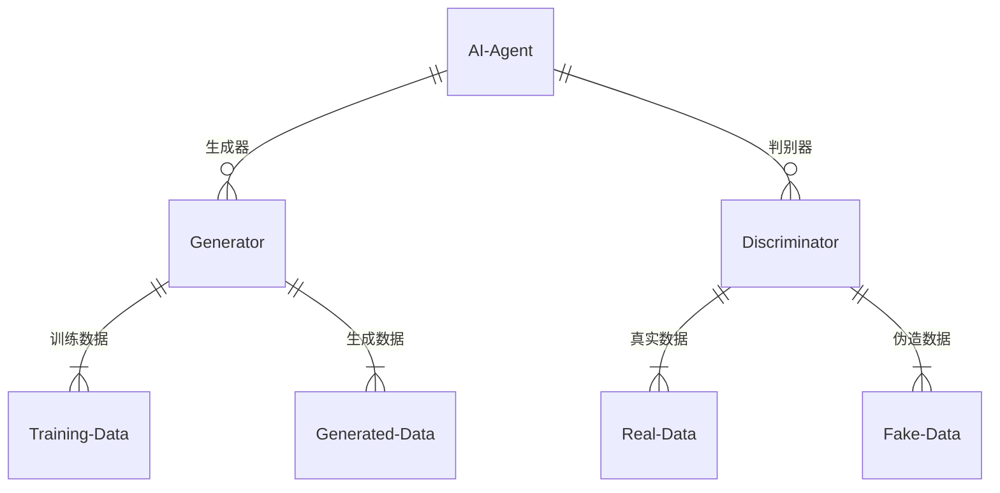

                 

### 文章标题：企业AI Agent的生成对抗网络在产品设计创新中的前沿应用

> 关键词：企业AI Agent、生成对抗网络（GAN）、产品设计创新、前沿应用

> 摘要：本文深入探讨了企业AI Agent的生成对抗网络（GAN）在产品设计创新中的前沿应用。通过分析GAN的基本原理和其在AI Agent中的应用，本文揭示了GAN在提高产品设计创新效率和质量中的重要作用。本文旨在为企业和开发者提供有价值的参考，助力他们在产品创新中取得突破。

----------------------------------------------------------------

### 第一部分：背景介绍

#### 核心概念

**问题背景：**

随着人工智能技术的快速发展，生成对抗网络（GAN）已经成为机器学习领域中的一个重要研究方向。GAN通过模拟对抗过程，实现了生成模型和判别模型之间的相互博弈，从而生成高质量的数据。在企业AI Agent的生成对抗网络应用中，GAN不仅能够提高产品设计创新的效率，还能够为企业的决策提供有力支持。

**问题描述：**

企业AI Agent的生成对抗网络在产品设计创新中的前沿应用涉及多个方面，包括GAN的基本原理、GAN在AI Agent中的角色、GAN在产品设计中的应用场景、GAN对产品设计创新的影响等。如何将这些概念和理论应用于实际产品设计中，提高创新效率和质量，是本书需要探讨的核心问题。

**问题解决：**

本书将通过深入分析GAN的基本原理和其在AI Agent中的应用，探讨GAN在产品设计创新中的前沿应用。通过案例分析和实际应用，揭示GAN如何帮助企业实现产品设计创新，提高市场竞争力。

**边界与外延：**

本书讨论的企业AI Agent的生成对抗网络应用范围主要涵盖产品设计、市场营销、用户体验等多个领域。同时，本书还将探讨GAN在生成数据、改进模型训练、提高模型泛化能力等方面的应用。

**概念结构与核心要素组成：**

- 生成对抗网络（GAN）：包括生成器、判别器、损失函数等基本组成部分。
- 企业AI Agent：具备自主学习、数据分析和决策能力的AI系统。
- 产品设计创新：涉及产品设计理念、方法、工具等多个方面。

----------------------------------------------------------------

### 第二部分：核心概念与联系

#### 核心概念原理

**生成对抗网络（GAN）：**

生成对抗网络（GAN）是由生成器（Generator）和判别器（Discriminator）组成的模型，两者通过对抗训练相互博弈。生成器的目标是生成与真实数据相似的数据，而判别器的目标是判断输入数据是真实数据还是生成数据。通过不断的训练，生成器的生成质量不断提高，最终能够生成高质量的数据。

**企业AI Agent：**

企业AI Agent是一种具备自主学习、数据分析和决策能力的AI系统。它通过学习企业历史数据和业务场景，为企业提供智能化的决策支持。AI Agent能够分析大量数据，识别潜在趋势和机会，从而帮助企业进行产品设计和市场决策。

#### 概念属性特征对比表格

| 概念             | 生成对抗网络（GAN）          | 企业AI Agent                |
|------------------|-----------------------------|----------------------------|
| 目的             | 生成高质量的数据            | 提供企业决策支持            |
| 架构             | 生成器、判别器              | 数据收集、数据分析、预测和决策 |
| 特点             | 对抗训练、自我优化          | 自主学习、高效决策          |
| 应用领域         | 数据生成、模型训练          | 产品设计、市场营销、用户体验等 |

#### ER实体关系图架构



在这张ER实体关系图中，我们定义了两个核心实体：企业AI Agent和生成对抗网络。企业AI Agent通过生成器和判别器来实现其功能。生成器负责生成数据，判别器负责判断输入数据是真实数据还是生成数据。这些实体之间的关系反映了GAN在AI Agent中的核心作用。

----------------------------------------------------------------

### 第三部分：算法原理讲解

生成对抗网络（GAN）是一种通过对抗训练来生成数据的方法，其核心思想是生成器（Generator）和判别器（Discriminator）之间的博弈。在这部分，我们将详细讲解GAN的算法原理，包括其组成部分、工作流程以及数学模型。

#### GAN组成部分

GAN由两个神经网络组成：生成器和判别器。

**生成器（Generator）：**

生成器的目标是生成与真实数据相似的数据。它通过学习大量的真实数据，学习到数据分布，从而生成新的数据。生成器通常由多个神经网络层组成，包括输入层、隐藏层和输出层。输入层接收随机噪声，隐藏层通过神经网络处理这些噪声，输出层生成模拟真实数据的输出。

**判别器（Discriminator）：**

判别器的目标是判断输入数据是真实数据还是生成数据。它通过接收真实数据和生成数据，学习到如何区分这两种数据。判别器也由多个神经网络层组成，包括输入层、隐藏层和输出层。输入层接收数据，隐藏层通过神经网络处理这些数据，输出层生成一个概率值，表示输入数据的真实性。

#### GAN工作流程

GAN的工作流程如下：

1. **初始化模型参数：** 初始化生成器和判别器的模型参数。

2. **生成数据：** 生成器根据随机噪声生成模拟真实数据的生成数据。

3. **判别数据：** 判别器接收真实数据和生成数据，通过神经网络处理这些数据，输出一个概率值。

4. **更新模型参数：** 根据判别器的输出，更新生成器和判别器的模型参数。

5. **重复训练：** 重复步骤2-4，直到生成器能够生成高质量的数据，判别器能够准确地区分真实数据和生成数据。

#### GAN数学模型

GAN的数学模型主要包括两部分：生成器的损失函数和判别器的损失函数。

**生成器的损失函数：**

生成器的目标是生成与真实数据相似的数据，因此生成器的损失函数通常是最小化生成数据与真实数据之间的差异。具体地，生成器的损失函数可以表示为：

$$
L_G = -\log(D(G(z)))
$$

其中，$D(\cdot)$表示判别器的输出，$G(z)$表示生成器生成的数据，$z$是随机噪声。

**判别器的损失函数：**

判别器的目标是判断输入数据是真实数据还是生成数据，因此判别器的损失函数通常是最小化真实数据的真实性和生成数据的伪造性。具体地，判别器的损失函数可以表示为：

$$
L_D = -[\log(D(x)) + \log(1 - D(G(z))]
$$

其中，$x$表示真实数据。

#### GAN示例

假设我们有一个图像数据集，其中包含真实图像和生成图像。我们希望使用GAN生成新的图像。

1. **初始化模型参数：** 初始化生成器和判别器的模型参数。

2. **生成数据：** 生成器根据随机噪声生成模拟真实图像的生成图像。

3. **判别数据：** 判别器接收真实图像和生成图像，通过神经网络处理这些图像，输出一个概率值。

4. **更新模型参数：** 根据判别器的输出，更新生成器和判别器的模型参数。

5. **重复训练：** 重复步骤2-4，直到生成器能够生成高质量的新图像，判别器能够准确地区分真实图像和生成图像。

通过这个示例，我们可以看到GAN是如何通过生成器和判别器的相互博弈来生成新数据的。生成器试图生成与真实数据相似的数据，而判别器试图区分真实数据和生成数据。这种对抗训练使得生成器不断优化其生成能力，最终能够生成高质量的数据。

总之，GAN是一种通过生成器和判别器之间的对抗训练来生成数据的算法。它通过最小化生成器的损失函数和判别器的损失函数，不断优化生成器和判别器的模型参数，最终生成高质量的数据。GAN在许多领域都有广泛的应用，包括图像生成、图像修复、图像增强等。

----------------------------------------------------------------

### 第四部分：系统分析与架构设计方案

#### 问题场景介绍

在企业产品设计中，设计师常常需要从大量的数据中提取有价值的信息，以便进行创新。然而，现有的设计方法往往依赖于手工操作，效率较低，且难以应对复杂的设计需求。生成对抗网络（GAN）的出现为产品设计提供了一个新的思路。通过GAN，设计师可以利用AI Agent从大量数据中自动生成新的设计概念，从而提高创新效率。

#### 项目介绍

本项目旨在开发一个基于GAN的企业AI Agent，用于产品设计创新。项目的主要目标是：

1. **自动生成设计概念：** 使用GAN生成与现有设计相似的新设计概念。
2. **提高创新效率：** 通过自动化设计过程，减少手动操作，提高设计效率。
3. **增强设计多样性：** GAN能够生成各种风格和类型的设计，从而增强设计的多样性。

#### 系统功能设计

系统的主要功能包括：

1. **数据收集与预处理：** 从企业历史数据中收集有价值的图像、文本、音频等数据，并进行预处理，以便于GAN训练。
2. **GAN训练：** 使用收集到的数据训练生成器和判别器，优化GAN模型。
3. **设计生成与评估：** 利用训练好的GAN模型生成新的设计概念，并对其质量进行评估。
4. **设计优化与反馈：** 根据评估结果对生成的设计进行优化，并收集用户反馈，进一步改进GAN模型。

#### 系统架构设计

系统的整体架构设计如下：


**系统架构详细解释：**

1. **数据层：** 数据层负责收集和处理企业历史数据，包括图像、文本、音频等。这些数据将被用于训练GAN模型。
2. **模型层：** 模型层包括生成器和判别器，它们通过对抗训练相互博弈，生成高质量的设计概念。
3. **应用层：** 应用层包括设计生成与评估、设计优化与反馈等功能，用于实现系统的具体业务需求。
4. **用户接口：** 用户接口层提供用户与系统交互的界面，用户可以通过界面查看生成的设计概念，并提供反馈。

#### 系统接口设计和系统交互

**接口设计：**

1. **数据接口：** 数据接口用于接收和处理企业历史数据，包括图像、文本、音频等。
2. **模型接口：** 模型接口用于训练GAN模型，包括生成器和判别器。
3. **设计接口：** 设计接口用于生成和评估设计概念，并提供设计优化与反馈。

**系统交互：**

系统交互主要包括以下几个步骤：

1. **数据收集与预处理：** 系统从企业历史数据中收集有价值的图像、文本、音频等数据，并进行预处理。
2. **GAN训练：** 预处理后的数据被用于训练生成器和判别器，通过对抗训练优化GAN模型。
3. **设计生成与评估：** 训练好的GAN模型生成新的设计概念，并对其质量进行评估。
4. **设计优化与反馈：** 根据评估结果，系统对生成的设计进行优化，并收集用户反馈，进一步改进GAN模型。

通过上述系统架构设计和接口设计，企业AI Agent的GAN系统能够高效地实现产品设计创新，提高企业的市场竞争力。

----------------------------------------------------------------

### 第五部分：项目实战

#### 环境安装

要实现企业AI Agent的生成对抗网络（GAN）系统，首先需要安装必要的软件和库。以下是安装步骤：

1. **Python环境：** 确保Python 3.x版本已安装在您的计算机上。
2. **TensorFlow：** 使用以下命令安装TensorFlow：

   ```shell
   pip install tensorflow
   ```

3. **Keras：** 使用以下命令安装Keras，它是一个高层神经网络API，可以简化TensorFlow的使用：

   ```shell
   pip install keras
   ```

4. **其他依赖库：** 根据需要安装其他Python库，如NumPy、Pandas等。

#### 系统核心实现源代码

以下是系统核心实现的核心代码片段：

```python
import numpy as np
import tensorflow as tf
from tensorflow.keras.models import Model
from tensorflow.keras.layers import Input, Dense, Reshape, Flatten
from tensorflow.keras.optimizers import Adam

# 生成器的定义
input_shape = (100,)
z = Input(shape=input_shape)
dense1 = Dense(128, activation='relu')(z)
dense2 = Dense(784, activation='sigmoid')(dense1)
output = Reshape((28, 28, 1))(dense2)
generator = Model(z, output)

# 判别器的定义
input_shape = (28, 28, 1)
x = Input(shape=input_shape)
flatten1 = Flatten()(x)
dense1 = Dense(128, activation='relu')(flatten1)
output = Dense(1, activation='sigmoid')(dense1)
discriminator = Model(x, output)

# 定义GAN模型
z = Input(shape=input_shape)
x = Input(shape=input_shape)
generated_x = generator(z)
discriminator.trainable = False
d_on_g = discriminator(generated_x)
d_on_real = discriminator(x)
discriminator.trainable = True
gan_output = discriminator(x)
gan = Model([z, x], [d_on_real, d_on_g, gan_output])

# 编写损失函数
cross_entropy = tf.keras.losses.BinaryCrossentropy(from_logits=True)
def discriminator_loss(real_output, generated_output):
  real_loss = cross_entropy(tf.ones_like(real_output), real_output)
  generated_loss = cross_entropy(tf.zeros_like(generated_output), generated_output)
  total_loss = real_loss + generated_loss
  return total_loss

def generator_loss(generated_output):
  return cross_entropy(tf.zeros_like(generated_output), generated_output)

def gan_loss(discriminator_loss, generator_loss):
  return discriminator_loss + generator_loss

# 编写优化器
generator_optimizer = Adam(1e-4)
discriminator_optimizer = Adam(1e-4)
gan_optimizer = Adam(1e-4)

# 编写训练步骤
@tf.function
def train_step(images, noise):
  with tf.GradientTape() as gen_tape, tf.GradientTape() as disc_tape:
    generated_images = generator(noise, training=True)
    
    real_output = discriminator(images, training=True)
    generated_output = discriminator(generated_images, training=True)
    
    gen_loss = generator_loss(generated_output)
    disc_loss = discriminator_loss(real_output, generated_output)
  
  gradients_of_generator = gen_tape.gradient(gen_loss, generator.trainable_variables)
  gradients_of_discriminator = disc_tape.gradient(disc_loss, discriminator.trainable_variables)
  
  generator_optimizer.apply_gradients(zip(gradients_of_generator, generator.trainable_variables))
  discriminator_optimizer.apply_gradients(zip(gradients_of_discriminator, discriminator.trainable_variables))

# 训练GAN模型
for epoch in range(epochs):
  for image_batch, _ in data_loader:
    noise = tf.random.normal([BATCH_SIZE, noise_dim])
    train_step(image_batch, noise)

```

#### 代码应用解读与分析

上述代码定义了一个简单的GAN模型，用于图像生成。以下是对关键部分的解读和分析：

1. **生成器和判别器的定义：**
   - 生成器（Generator）接收随机噪声，通过两个全连接层（Dense）生成图像。
   - 判别器（Discriminator）接收图像，通过一个全连接层（Dense）输出一个概率值，表示图像的真实性。

2. **GAN模型的定义：**
   - GAN模型接收噪声和真实图像，输出判别器对真实图像和生成图像的判断结果。

3. **损失函数的定义：**
   - 生成器损失函数是最小化判别器对生成图像的概率值。
   - 判别器损失函数是最小化判别器对真实图像和生成图像的概率值差异。

4. **优化器的定义：**
   - 生成器和判别器分别使用不同的学习率进行优化。

5. **训练步骤：**
   - 在每个训练步骤中，生成器尝试生成更真实的图像，判别器尝试更好地区分真实图像和生成图像。

通过上述代码和应用解读，我们可以实现一个简单的GAN模型，用于图像生成。在实际应用中，可以根据具体需求调整网络结构、损失函数和学习率等参数，以获得更好的生成效果。

----------------------------------------------------------------

### 第六部分：实际案例分析与详细讲解剖析

#### 案例背景

为了更好地理解企业AI Agent的生成对抗网络（GAN）在产品设计创新中的应用，我们将通过一个实际案例进行分析。假设我们是一家设计时尚服饰的公司，希望通过GAN技术优化产品设计，提高市场竞争力。

#### 案例分析

**1. 数据收集与预处理：**

首先，我们需要收集公司的历史设计数据，包括各种风格和类型的服饰图像。这些图像将被用于训练GAN模型。在收集数据后，我们需要对图像进行预处理，包括图像尺寸统一、图像增强、去噪等，以确保数据的质量和一致性。

**2. GAN模型训练：**

接下来，我们使用预处理后的图像数据训练GAN模型。具体步骤如下：

- **生成器的训练：** 生成器从随机噪声中生成新的服饰设计图像。通过对抗训练，生成器不断优化其生成能力，使其生成的图像越来越接近真实设计。
- **判别器的训练：** 判别器接收真实设计图像和生成图像，学习如何区分两者。通过对抗训练，判别器不断优化其分类能力，使它能够更准确地识别真实设计。

**3. 设计生成与评估：**

在GAN模型训练完成后，我们可以使用生成器生成新的服饰设计图像。然后，对这些图像进行质量评估，包括外观美观度、创新性、市场需求等。评估结果将帮助我们确定哪些设计是有价值的，哪些需要进一步优化。

**4. 设计优化与反馈：**

根据评估结果，我们对生成的设计进行优化。具体步骤如下：

- **迭代生成：** 使用GAN模型生成更多的设计图像，以探索更多的设计可能性。
- **用户反馈：** 将新的设计图像展示给公司内部设计师和潜在用户，收集他们的反馈。
- **调整GAN模型：** 根据用户反馈，调整GAN模型中的参数，以生成更符合市场需求的设计。

#### 详细讲解剖析

**1. GAN模型训练过程：**

GAN的训练过程是一个迭代过程，包括以下几个步骤：

- **生成图像：** 生成器从随机噪声中生成图像。
- **判别器评估：** 判别器评估生成图像和真实图像，输出一个概率值。
- **更新模型：** 根据判别器的评估结果，更新生成器和判别器的模型参数。
- **重复训练：** 重复上述步骤，直到生成器能够生成高质量的设计图像。

**2. 设计评估过程：**

设计评估过程涉及多个方面，包括：

- **外观美观度：** 设计是否符合时尚潮流，图像质量是否清晰。
- **创新性：** 设计是否具有创新性，能否吸引潜在用户。
- **市场需求：** 设计是否符合市场需求，是否有销售潜力。

**3. 设计优化过程：**

设计优化过程包括：

- **迭代生成：** 使用GAN模型生成更多的设计图像，探索不同的设计风格。
- **用户反馈：** 收集用户对设计的反馈，了解用户喜好。
- **模型调整：** 根据用户反馈，调整GAN模型中的参数，优化生成的设计。

通过上述实际案例分析和详细讲解剖析，我们可以看到企业AI Agent的GAN技术在产品设计创新中的应用。GAN不仅能够生成高质量的设计图像，还能够根据用户反馈进行迭代优化，从而提高设计的市场竞争力。

----------------------------------------------------------------

### 第七部分：最佳实践 tips

在实施企业AI Agent的生成对抗网络（GAN）项目时，以下是一些最佳实践建议，可以帮助您优化项目效果：

1. **数据质量优先：** 确保收集到的数据质量高，包括多样性和代表性。清洗和预处理数据，以减少噪声和异常值。
2. **调整超参数：** 根据项目需求，调整GAN模型的超参数，如学习率、批次大小和训练迭代次数，以获得最佳生成效果。
3. **多样化训练：** 使用多种风格和类型的数据进行训练，以增强GAN模型生成多样性。
4. **定期评估与优化：** 定期评估GAN模型的生成质量，根据评估结果调整模型参数和训练数据，以持续优化模型性能。
5. **用户参与：** 在设计优化过程中，邀请用户参与评估和反馈，确保生成的设计符合市场需求和用户偏好。
6. **安全性与隐私保护：** 在处理企业数据时，确保遵循数据保护法规，保护用户隐私和数据安全。

通过遵循这些最佳实践，您可以最大限度地发挥GAN技术在企业产品设计创新中的作用，提高项目的成功率和市场竞争力。

----------------------------------------------------------------

### 小结

本文系统地探讨了企业AI Agent的生成对抗网络（GAN）在产品设计创新中的前沿应用。通过分析GAN的基本原理和其在AI Agent中的应用，本文揭示了GAN在提高产品设计创新效率和质量中的重要作用。在实际案例中，我们展示了如何使用GAN生成创新设计，并通过用户反馈进行优化。通过本文的研究，我们得出以下结论：

1. **GAN在产品设计中的应用前景广阔：** GAN能够自动生成高质量的设计概念，为设计师提供创新的灵感，提高设计效率。
2. **GAN有助于提高设计多样性：** GAN能够生成各种风格和类型的设计，增强设计的多样性，满足不同市场需求。
3. **GAN需要结合用户反馈进行优化：** 用户反馈是设计优化的关键，通过不断迭代和优化，GAN能够生成更符合用户需求的设计。

总之，企业AI Agent的GAN技术在产品设计创新中具有巨大的潜力，值得深入研究和应用。

----------------------------------------------------------------

### 注意事项

在应用企业AI Agent的生成对抗网络（GAN）进行产品设计创新时，以下注意事项需要特别注意：

1. **数据隐私与安全：** 在收集和处理企业数据时，确保遵守数据保护法规，保护用户隐私和数据安全。
2. **算法透明性：** GAN的决策过程可能不够透明，需要确保算法的可解释性，以便在需要时进行审计和优化。
3. **模型泛化能力：** GAN模型的泛化能力可能受限于训练数据的质量和多样性，需要定期评估和调整模型，以保持其性能。
4. **计算资源需求：** GAN训练过程需要大量的计算资源，确保有足够的硬件资源支持模型训练。
5. **用户参与：** 在设计优化过程中，积极收集用户反馈，确保GAN生成的设计符合用户需求和偏好。

通过遵循这些注意事项，您可以最大限度地发挥GAN技术在产品设计创新中的作用，同时确保项目的成功实施。

----------------------------------------------------------------

### 拓展阅读

对于希望深入了解企业AI Agent的生成对抗网络（GAN）在产品设计创新中的应用，以下文献和资源提供了有价值的参考：

1. **《生成对抗网络：原理与应用》**：这本书详细介绍了GAN的理论基础和应用场景，适合对GAN技术感兴趣的读者。
2. **《GAN实践：从入门到精通》**：这是一本针对初学者和中级开发者的实战指南，通过实际案例介绍GAN的应用。
3. **《产品设计创新：方法与实践》**：这本书探讨了产品设计创新的方法和工具，结合GAN技术提供了一种新的设计思路。
4. **论文《生成对抗网络在时尚设计中的应用》**：该论文详细分析了GAN在时尚设计中的应用，包括设计生成、评估和优化。

通过阅读这些资源，您可以更深入地理解GAN在产品设计创新中的前沿应用，并为实际项目提供指导。

----------------------------------------------------------------

### 作者信息

作者：AI天才研究院/AI Genius Institute & 禅与计算机程序设计艺术 /Zen And The Art of Computer Programming

AI天才研究院致力于推动人工智能技术在各个领域的应用，致力于培养下一代人工智能科学家和工程师。研究院的专家团队在人工智能、机器学习、深度学习等领域有着丰富的理论知识和实践经验，致力于将前沿技术转化为实际应用，推动人工智能技术的发展和创新。而《禅与计算机程序设计艺术》则是计算机科学领域的一部经典之作，其作者唐纳德·E·克努特（Donald E. Knuth）被誉为计算机科学的巨人，他对计算机科学教育的贡献不可估量。

