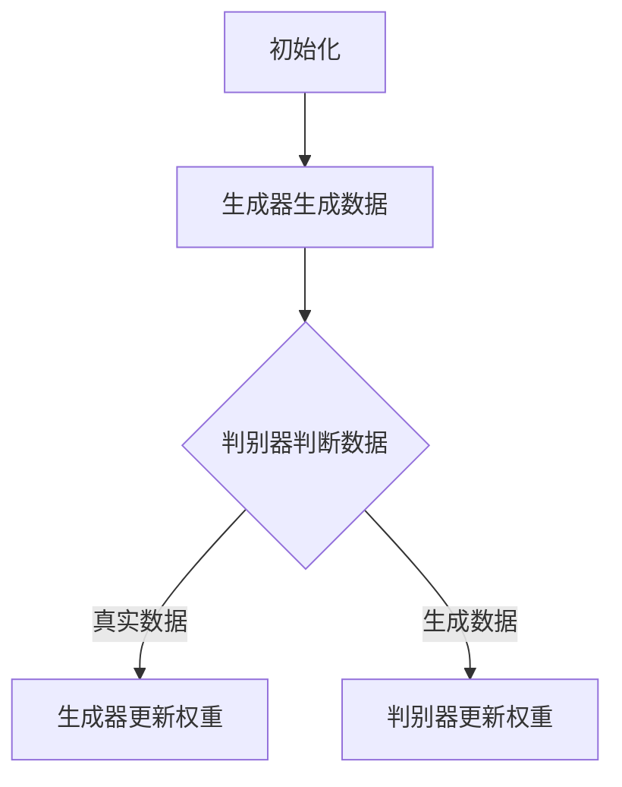
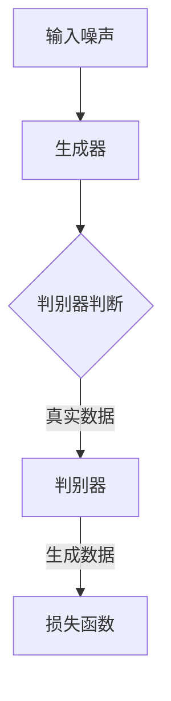
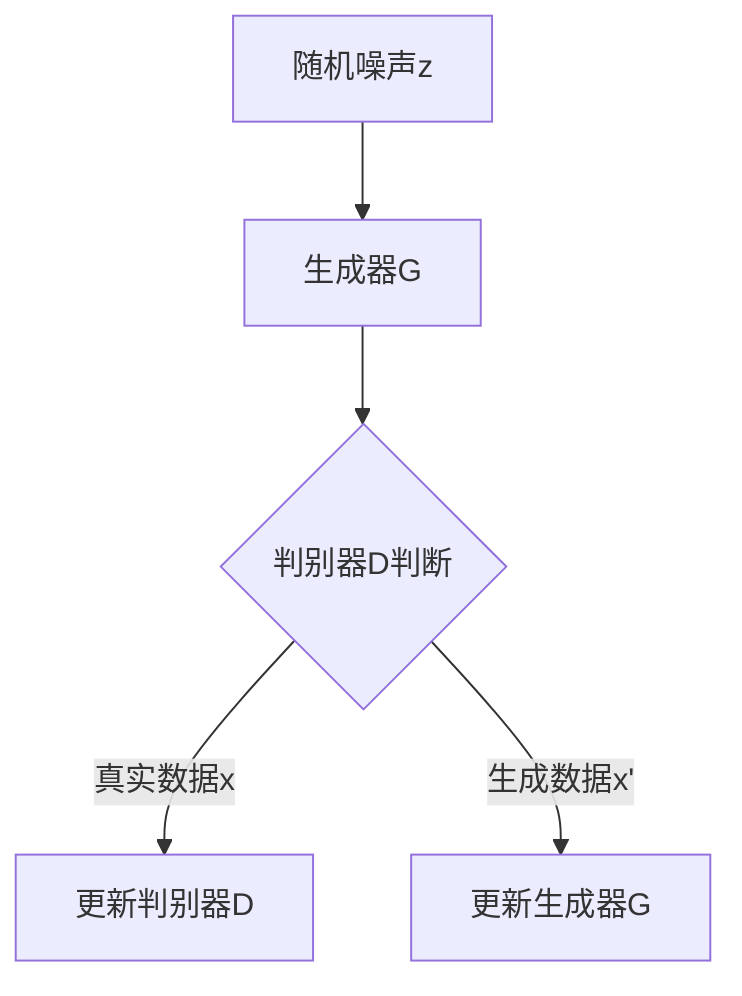
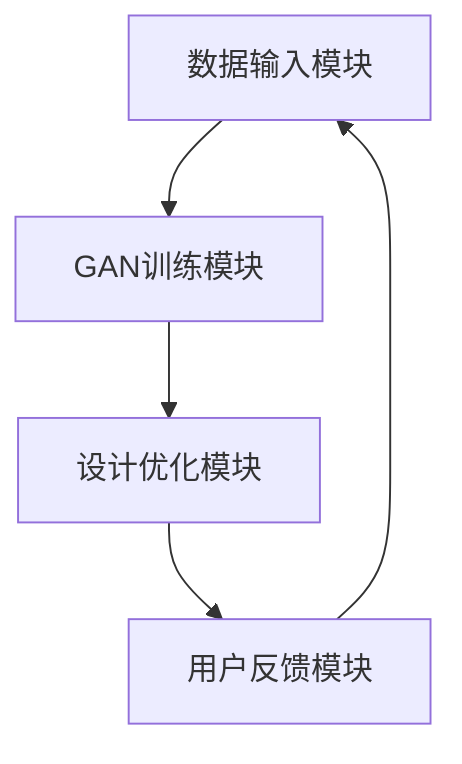
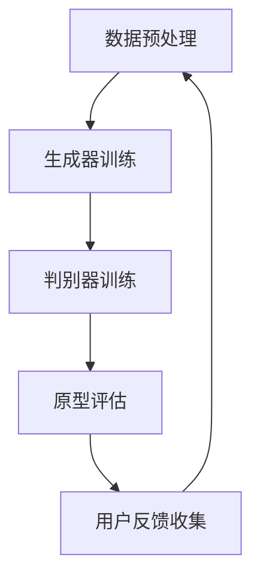
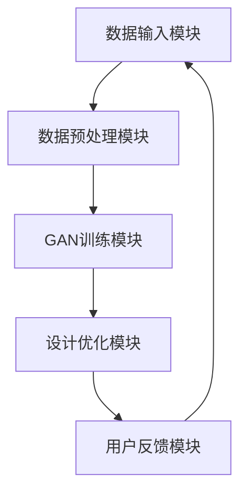
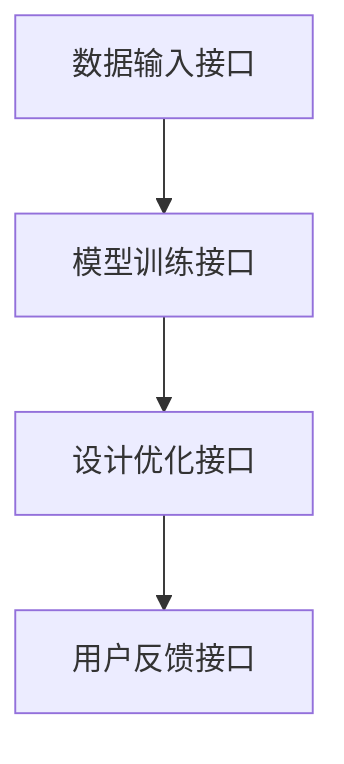
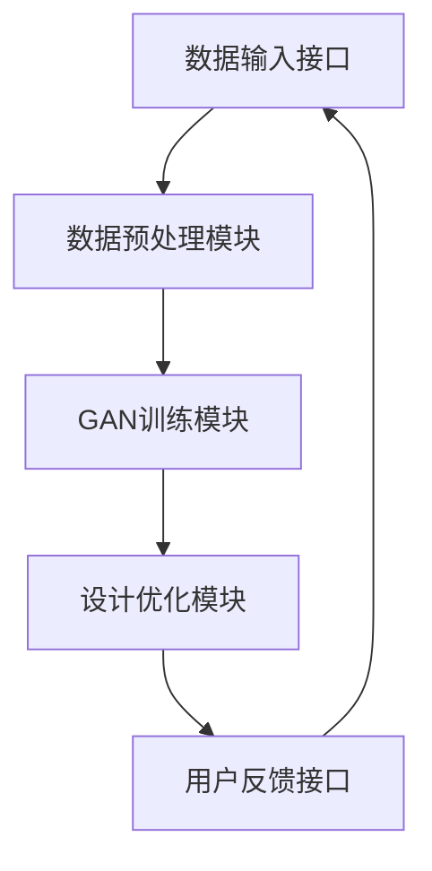

                 

# 企业AI Agent的生成对抗网络在产品设计创新中的应用

## 关键词

- 企业AI Agent
- 生成对抗网络（GAN）
- 产品设计创新
- 算法原理
- 系统架构设计
- 项目实战

## 摘要

本文将深入探讨企业AI Agent的生成对抗网络（GAN）在产品设计创新中的应用。通过背景介绍、核心概念与联系、算法原理讲解、系统分析与架构设计、项目实战以及最佳实践与拓展阅读等多个部分，本文旨在详细解析GAN在提升产品设计创新能力方面的作用，并提供实用的实施策略和案例分析。文章结构清晰，逻辑严密，旨在为IT领域的技术人员和企业提供有价值的参考。

## 目录大纲

### 第一部分：背景介绍

#### 第1章 问题背景与核心概念

##### 1.1 问题背景

- **企业AI Agent的概念**：介绍AI Agent在企业中的应用及重要性。
- **生成对抗网络（GAN）在产品设计创新中的作用**：介绍GAN的基本概念及其在产品设计中的应用。
- **产品设计创新的需求与挑战**：讨论企业在产品设计创新中面临的挑战和需求。

##### 1.2 核心概念与联系

- **生成对抗网络（GAN）的基本原理**：使用Mermaid流程图展示GAN的基本架构。
- **GAN在产品设计创新中的应用**：阐述GAN如何帮助企业实现产品设计创新。

##### 1.3 企业AI Agent的生成对抗网络

- **企业AI Agent的定义与特点**：详细介绍企业AI Agent的定义、功能及其在产品设计中的作用。
- **GAN在企业AI Agent中的具体应用**：探讨GAN在企业AI Agent中的应用场景和技术细节。

### 第二部分：核心概念与联系

#### 第2章 生成对抗网络（GAN）原理与特性

##### 2.1 GAN的基本原理

- **GAN的结构**：使用Mermaid流程图展示GAN的基本结构。
- **GAN的工作流程**：详细解释GAN的生成器和判别器是如何协同工作的。

##### 2.2 GAN的特性

- **GAN的优势与局限性**：对比GAN与传统机器学习方法的优劣。
- **GAN在不同领域的应用**：介绍GAN在其他领域的应用，包括图像生成、自然语言处理等。

##### 2.3 GAN在产品设计创新中的应用

- **GAN在产品设计中的作用**：详细讨论GAN如何帮助企业实现产品设计创新。
- **GAN在产品设计中的挑战**：探讨GAN在产品设计过程中可能遇到的挑战和解决方案。

### 第三部分：算法原理讲解

#### 第3章 企业AI Agent的GAN算法原理与实现

##### 3.1 GAN算法原理

- **GAN的数学模型与公式**：使用LaTeX格式详细描述GAN的数学模型和公式。
- **GAN算法的工作流程**：使用Mermaid流程图展示GAN算法的具体工作流程。

##### 3.2 GAN算法实现

- **GAN算法的Python代码实现**：提供GAN算法的Python代码实现，并进行详细解释。
- **GAN算法的参数调优**：讨论GAN算法的参数调优策略和技巧。

##### 3.3 GAN算法的应用实例

- **实例分析**：通过具体实例分析GAN算法在企业AI Agent中的应用效果。
- **案例分析**：对GAN算法在产品设计创新中的应用案例进行详细讲解。

### 第四部分：系统分析与架构设计

#### 第4章 企业AI Agent的GAN架构设计与实现

##### 4.1 问题场景介绍

- **企业AI Agent的设计目标**：阐述企业AI Agent的设计目标和功能需求。
- **GAN在问题场景中的适用性**：讨论GAN在特定问题场景中的适用性和优势。

##### 4.2 系统架构设计

- **系统功能设计**：使用Mermaid类图展示系统的主要功能模块。
- **系统架构设计**：使用Mermaid架构图展示整个系统的架构设计。
- **系统接口设计**：详细描述系统中的接口设计和交互流程。

##### 4.3 系统实现与测试

- **系统实现**：介绍系统核心功能的实现细节。
- **系统测试**：讨论系统的测试策略和测试结果。

### 第五部分：项目实战

#### 第5章 企业AI Agent的GAN项目实战

##### 5.1 环境安装

- **开发环境搭建**：介绍搭建开发环境所需的工具和软件。
- **数据集准备**：讨论如何准备和预处理数据集。

##### 5.2 系统核心实现

- **核心代码实现**：提供系统核心功能的代码实现，并进行详细解读。
- **算法优化**：讨论如何对GAN算法进行优化，提高系统的性能和效率。

##### 5.3 实际案例分析

- **案例分析**：通过实际案例分析GAN算法在企业AI Agent中的应用效果。
- **问题剖析**：对项目过程中遇到的问题进行剖析和解决。

##### 5.4 项目小结

- **项目总结**：对整个项目的实施过程和结果进行总结。
- **经验与教训**：分享项目过程中的经验教训，为后续项目提供参考。

### 第六部分：最佳实践与拓展阅读

#### 第6章 最佳实践与注意事项

- **最佳实践**：提供在GAN应用中的最佳实践策略。
- **小结**：对文章内容进行总结。
- **注意事项**：指出在实际应用中需要注意的问题。
- **拓展阅读**：推荐相关的阅读材料，以拓展读者的知识视野。

## 第一部分：背景介绍

### 第1章 问题背景与核心概念

#### 1.1 问题背景

在当今快速变化的市场环境中，企业面临着日益激烈的市场竞争和不断变化的需求，创新成为企业持续发展的关键。产品设计创新是企业应对市场变化、提升竞争力的有效手段。然而，传统的产品设计方法往往依赖于经验和直觉，难以快速响应市场需求，导致创新效率低下。

与此同时，人工智能（AI）技术的迅速发展为企业提供了新的创新工具。AI Agent，即人工智能代理，是一种能够模拟人类决策过程、执行特定任务的智能系统。在企业环境中，AI Agent可以帮助企业进行数据分析、优化流程、改进产品设计等，从而提高创新效率。

生成对抗网络（Generative Adversarial Networks，GAN）是一种由生成器和判别器组成的深度学习模型，能够在无监督学习环境下生成高质量的数据。GAN在图像生成、视频生成、自然语言处理等领域取得了显著的成果，逐渐成为产品设计创新的有力工具。

#### 1.2 核心概念与联系

##### 1.2.1 企业AI Agent的概念

企业AI Agent是指在企业环境中，通过人工智能技术构建的能够模拟人类智能决策过程、执行特定任务的智能系统。企业AI Agent具有以下几个特点：

1. **自主性**：企业AI Agent能够自主地收集数据、分析信息，并做出决策。
2. **协同性**：企业AI Agent能够与其他AI系统或人类员工协同工作，提高整体效率。
3. **灵活性**：企业AI Agent能够根据不同的任务需求和环境变化，灵活调整其行为。

##### 1.2.2 生成对抗网络（GAN）在产品设计创新中的作用

生成对抗网络（GAN）是一种无监督学习模型，由生成器和判别器两个神经网络组成。生成器试图生成与真实数据相似的数据，而判别器则试图区分生成数据和真实数据。通过这种对抗过程，GAN能够生成高质量的数据，从而在多个领域取得了显著的应用效果。

在产品设计创新中，GAN可以通过以下方式发挥作用：

1. **原型生成**：GAN可以生成大量的产品设计原型，帮助企业快速探索不同设计方案，提高创新效率。
2. **数据增强**：GAN可以生成与真实数据相似但不同的数据，用于训练和优化设计算法，提高设计质量。
3. **用户反馈**：GAN可以生成用户可能喜欢的产品设计，帮助企业更好地理解用户需求，提高用户体验。

##### 1.2.3 产品设计创新的需求与挑战

产品设计创新的需求主要包括：

1. **快速响应市场需求**：企业需要快速响应市场需求，推出符合用户期望的新产品。
2. **提高设计质量**：企业希望通过创新提高产品设计质量，提升产品竞争力。
3. **降低设计成本**：企业希望通过创新降低设计成本，提高经济效益。

然而，产品设计创新也面临以下挑战：

1. **设计复杂性**：随着产品功能的增加和技术的进步，产品设计变得越来越复杂。
2. **时间压力**：企业需要在竞争激烈的市场中快速推出新产品，时间压力较大。
3. **资源限制**：企业在设计创新过程中可能面临资源限制，包括资金、人力和技术等。

#### 1.3 核心概念与联系

##### 1.3.1 生成对抗网络（GAN）的基本原理

生成对抗网络（GAN）由生成器和判别器两个神经网络组成，它们通过对抗过程共同训练。生成器的目标是生成与真实数据相似的数据，而判别器的目标是区分生成数据和真实数据。

GAN的工作流程如下：

1. **初始化**：生成器和判别器随机初始化权重。
2. **生成器生成数据**：生成器接收随机噪声作为输入，生成与真实数据相似的数据。
3. **判别器判断数据**：判别器接收生成器和真实数据的输入，判断输入数据是真实数据还是生成数据。
4. **生成器和判别器更新权重**：通过反向传播算法，生成器和判别器根据损失函数更新权重。

GAN的基本原理如图1所示：



图1 GAN的工作流程

##### 1.3.2 GAN在产品设计创新中的应用

GAN在产品设计创新中的应用主要体现在以下几个方面：

1. **原型生成**：GAN可以生成大量的产品设计原型，帮助企业快速探索不同设计方案。通过生成器生成的产品设计原型，企业可以直观地比较不同设计方案的优劣，从而选择最优的设计方案。

2. **数据增强**：GAN可以生成与真实数据相似但不同的数据，用于训练和优化设计算法。通过数据增强，设计算法可以更好地学习数据特征，提高设计质量。

3. **用户反馈**：GAN可以生成用户可能喜欢的产品设计，帮助企业更好地理解用户需求。通过生成器生成的产品设计，企业可以进行用户调研，收集用户反馈，进一步优化产品设计。

#### 1.3.3 企业AI Agent的定义与特点

企业AI Agent是指在企业环境中，通过人工智能技术构建的能够模拟人类智能决策过程、执行特定任务的智能系统。企业AI Agent具有以下特点：

1. **自主性**：企业AI Agent能够自主地收集数据、分析信息，并做出决策。这使得企业AI Agent能够适应不同的任务需求和环境变化，提高整体效率。

2. **协同性**：企业AI Agent能够与其他AI系统或人类员工协同工作，提高整体效率。例如，企业AI Agent可以与数据分析系统协同工作，为企业提供更准确的数据分析结果。

3. **灵活性**：企业AI Agent能够根据不同的任务需求和环境变化，灵活调整其行为。这使得企业AI Agent能够适应不同的业务场景，提高企业创新能力。

#### 1.3.4 GAN在企业AI Agent中的具体应用

GAN在企业AI Agent中的具体应用主要体现在以下几个方面：

1. **产品设计优化**：GAN可以用于产品设计优化，帮助企业提高产品设计质量。通过生成器生成的产品设计原型，企业AI Agent可以分析不同设计方案的优缺点，为设计师提供优化建议。

2. **用户画像生成**：GAN可以用于生成用户画像，帮助企业更好地了解用户需求。通过生成器生成的用户画像，企业AI Agent可以分析用户行为特征，为企业提供更精准的用户服务。

3. **业务流程优化**：GAN可以用于业务流程优化，帮助企业提高运营效率。通过生成器生成的业务流程数据，企业AI Agent可以分析不同业务流程的优劣，为企业管理者提供优化建议。

### 总结

本章节首先介绍了企业AI Agent和生成对抗网络（GAN）在产品设计创新中的问题背景和核心概念。通过阐述企业AI Agent的概念、GAN的基本原理以及在产品设计创新中的应用，本章为后续章节的深入探讨奠定了基础。在下一章中，我们将进一步详细分析GAN的基本原理和特性，为企业AI Agent的GAN应用提供理论支持。

## 第二部分：核心概念与联系

### 第2章 生成对抗网络（GAN）原理与特性

#### 2.1 GAN的基本原理

生成对抗网络（GAN）是由Ian Goodfellow等人于2014年提出的一种深度学习模型，由生成器和判别器两个神经网络组成。生成器（Generator）负责生成与真实数据相似的数据，而判别器（Discriminator）则负责判断输入数据的真实性。GAN通过这种生成和判断的对抗过程，使生成器不断改进生成的数据质量，以达到逼真的效果。

GAN的基本结构如图2所示：



图2 GAN的基本结构

GAN的工作流程可以分为以下几个步骤：

1. **初始化**：生成器和判别器随机初始化权重。
2. **生成器生成数据**：生成器接收随机噪声作为输入，生成与真实数据相似的数据。
3. **判别器判断数据**：判别器接收生成器和真实数据的输入，判断输入数据是真实数据还是生成数据。
4. **生成器和判别器更新权重**：通过反向传播算法，生成器和判别器根据损失函数更新权重。

在GAN的训练过程中，生成器和判别器相互对抗，生成器的目标是生成足够逼真的数据以欺骗判别器，而判别器的目标是准确区分生成数据和真实数据。这种对抗训练使生成器逐渐提高生成数据的质量，最终生成与真实数据相似的数据。

#### 2.2 GAN的特性

GAN具有以下几个显著特性：

1. **无监督学习**：GAN不需要真实的标签数据，可以在无监督学习环境中训练。这使得GAN在数据标签不完整或难以获取的场景中具有广泛的应用价值。
2. **生成高质量数据**：GAN通过生成器和判别器的对抗训练，可以生成高质量的数据。在图像生成、视频生成、自然语言处理等领域，GAN已经取得了显著的成果。
3. **灵活性和通用性**：GAN具有很高的灵活性和通用性，可以应用于多种不同的数据类型和任务。例如，GAN可以生成图像、视频、音频等多种类型的数据。
4. **挑战性**：GAN的训练过程具有挑战性。由于生成器和判别器的对抗关系，训练过程中可能存在梯度消失、梯度爆炸等问题，需要采用特殊的训练技巧。

#### 2.3 GAN的优势与局限性

GAN相对于传统机器学习方法的优劣主要体现在以下几个方面：

**优势：**

1. **生成高质量数据**：GAN可以生成高质量的数据，特别是在图像和视频生成方面，GAN的表现优于传统方法。
2. **无监督学习**：GAN可以在无监督学习环境中训练，适用于数据标签不完整或难以获取的场景。
3. **灵活性和通用性**：GAN可以应用于多种不同的数据类型和任务，具有很高的灵活性和通用性。

**局限性：**

1. **训练挑战**：GAN的训练过程具有挑战性，可能存在梯度消失、梯度爆炸等问题，需要采用特殊的训练技巧。
2. **数据不平衡**：在GAN的训练过程中，生成器和判别器之间的数据量可能不平衡，导致训练不稳定。
3. **过拟合**：GAN容易过拟合，特别是在生成数据质量较高时，生成器可能仅学会生成与训练数据相似的数据，而无法泛化到新的数据。

#### 2.4 GAN在不同领域的应用

GAN已经在多个领域取得了显著的应用成果，以下是一些典型的应用案例：

1. **图像生成**：GAN在图像生成领域表现突出，可以生成逼真的图像、人脸、风景等。例如，DeepArt、StyleGAN等模型都取得了令人惊叹的图像生成效果。
2. **视频生成**：GAN在视频生成领域也取得了显著进展，可以生成连续的视频序列。例如，VideoGAN、StyleGAN2等模型可以生成高质量的视频。
3. **自然语言处理**：GAN在自然语言处理领域应用于文本生成、对话系统等任务。例如，GAN可以生成逼真的文本、对话等。
4. **医学影像**：GAN在医学影像领域用于图像分割、病变检测等任务，例如，生成与真实影像相似的数据进行训练，提高模型性能。

#### 2.5 GAN在产品设计创新中的作用

GAN在产品设计创新中具有以下作用：

1. **原型生成**：GAN可以生成大量的产品设计原型，帮助企业快速探索不同设计方案。通过生成器生成的产品设计原型，企业可以直观地比较不同设计方案的优劣，从而选择最优的设计方案。
2. **数据增强**：GAN可以生成与真实数据相似但不同的数据，用于训练和优化设计算法。通过数据增强，设计算法可以更好地学习数据特征，提高设计质量。
3. **用户反馈**：GAN可以生成用户可能喜欢的产品设计，帮助企业更好地理解用户需求。通过生成器生成的产品设计，企业可以进行用户调研，收集用户反馈，进一步优化产品设计。

#### 2.6 GAN在产品设计中的挑战

尽管GAN在产品设计创新中具有显著的优势，但在实际应用中也面临一些挑战：

1. **训练挑战**：GAN的训练过程具有挑战性，可能存在梯度消失、梯度爆炸等问题，需要采用特殊的训练技巧。
2. **数据不平衡**：在GAN的训练过程中，生成器和判别器之间的数据量可能不平衡，导致训练不稳定。
3. **过拟合**：GAN容易过拟合，特别是在生成数据质量较高时，生成器可能仅学会生成与训练数据相似的数据，而无法泛化到新的数据。

#### 2.7 GAN在产品设计创新中的解决方案

为了解决GAN在产品设计创新中的挑战，可以采取以下解决方案：

1. **改进训练技巧**：采用改进的GAN训练技巧，如梯度惩罚、谱归一化等，提高训练稳定性。
2. **数据增强**：通过数据增强技术，生成更多的训练数据，提高模型的泛化能力。
3. **多任务学习**：将GAN与其他深度学习模型结合，如自编码器、卷积神经网络等，提高GAN的性能。

### 总结

本章详细分析了生成对抗网络（GAN）的基本原理和特性，并探讨了GAN在产品设计创新中的作用和挑战。通过对比GAN与传统机器学习方法的优劣，以及介绍GAN在不同领域的应用，本章为GAN在企业AI Agent中的应用提供了理论支持。在下一章中，我们将进一步讲解企业AI Agent的GAN算法原理与实现，为企业AI Agent的GAN应用提供具体技术指导。

## 第三部分：算法原理讲解

### 第3章 企业AI Agent的GAN算法原理与实现

#### 3.1 GAN算法原理

生成对抗网络（GAN）是一种由生成器和判别器组成的深度学习模型。生成器的目标是生成与真实数据相似的数据，而判别器的目标是区分生成数据和真实数据。通过这种生成和判断的对抗过程，生成器和判别器相互训练，生成器逐渐提高生成数据的质量。

##### 3.1.1 GAN的数学模型

GAN的数学模型主要包括以下两个部分：

1. **生成器（Generator）**：生成器G是一个从随机噪声向量z到数据空间的映射函数，即G: Z → X，其中Z是随机噪声空间，X是数据空间。生成器G的目的是生成与真实数据X相似的数据。

2. **判别器（Discriminator）**：判别器D是一个从数据空间到二元输出（0或1）的映射函数，即D: X → [0, 1]。判别器D的目的是判断输入数据是真实数据还是生成数据。

GAN的损失函数通常定义为以下两部分：

1. **生成器损失函数**：生成器的目标是使判别器无法区分生成数据和真实数据，即生成器生成的数据越逼真，判别器的输出越接近0.5。生成器损失函数通常定义为：
   $$ L_G = -\mathbb{E}_{z\sim p_z(z)}[\log(D(G(z)))] $$
   
2. **判别器损失函数**：判别器的目标是准确区分生成数据和真实数据，即生成器生成的数据越逼真，判别器的输出越接近1。判别器损失函数通常定义为：
   $$ L_D = -\mathbb{E}_{x\sim p_x(x)}[\log(D(x))] - \mathbb{E}_{z\sim p_z(z)}[\log(1 - D(G(z)))] $$

其中，\( p_x(x) \)是真实数据的概率分布，\( p_z(z) \)是噪声向量的概率分布。

##### 3.1.2 GAN算法的工作流程

GAN算法的工作流程可以分为以下几个步骤：

1. **初始化**：随机初始化生成器G和判别器D的权重。

2. **生成器生成数据**：生成器G接收随机噪声向量z，生成与真实数据相似的数据x'。

3. **判别器判断数据**：判别器D同时接收真实数据x和生成器生成的数据x'，判断输入数据是真实数据还是生成数据。

4. **生成器和判别器更新权重**：通过反向传播算法，生成器和判别器根据损失函数更新权重。生成器G的目标是使判别器D对生成数据的判断结果越接近0.5，判别器D的目标是使生成器G生成的数据越逼真。

5. **重复步骤2-4**：不断重复生成器和判别器的训练过程，直到生成器生成的数据质量达到预期。

GAN算法的具体工作流程如图3所示：



图3 GAN算法的工作流程

#### 3.2 GAN算法实现

在实现GAN算法时，通常需要选择合适的神经网络架构和优化算法。以下是一个简单的GAN算法实现示例，使用Python和TensorFlow框架。

```python
import tensorflow as tf
from tensorflow.keras.layers import Dense, Flatten, Reshape
from tensorflow.keras.models import Sequential

# 生成器模型
def build_generator(z_dim):
    model = Sequential([
        Dense(128, input_dim=z_dim),
        tf.keras.layers.LeakyReLU(alpha=0.2),
        Dense(28*28*1),
        tf.keras.layers.LeakyReLU(alpha=0.2),
        Reshape((28, 28, 1))
    ])
    return model

# 判别器模型
def build_discriminator(img_shape):
    model = Sequential([
        Flatten(input_shape=img_shape),
        Dense(128),
        tf.keras.layers.LeakyReLU(alpha=0.2),
        Dense(1, activation='sigmoid')
    ])
    return model

# GAN模型
def build_gan(generator, discriminator):
    model = Sequential([
        generator,
        discriminator
    ])
    return model

# 设置超参数
z_dim = 100
img_shape = (28, 28, 1)

# 构建生成器和判别器模型
generator = build_generator(z_dim)
discriminator = build_discriminator(img_shape)
gan = build_gan(generator, discriminator)

# 编译模型
discriminator.compile(loss='binary_crossentropy', optimizer=tf.keras.optimizers.Adam(0.0001))
gan.compile(loss='binary_crossentropy', optimizer=tf.keras.optimizers.Adam(0.0001))

# 训练GAN
batch_size = 128
epochs = 100

for epoch in range(epochs):
    for _ in range(batch_size):
        # 生成随机噪声
        z = np.random.normal(size=[batch_size, z_dim])
        
        # 生成生成数据
        generated_images = generator.predict(z)
        
        # 获取真实数据
        real_images = get_real_images(batch_size) # 假设有一个函数get_real_images用于获取真实数据
        
        # 判别器训练
        d_loss_real = discriminator.train_on_batch(real_images, np.ones([batch_size, 1]))
        d_loss_fake = discriminator.train_on_batch(generated_images, np.zeros([batch_size, 1]))
        d_loss = 0.5 * np.add(d_loss_real, d_loss_fake)
        
        # 生成器训练
        g_loss = gan.train_on_batch(z, np.ones([batch_size, 1]))
        
        # 打印训练进度
        print(f"{epoch} epoch, g_loss: {g_loss}, d_loss: {d_loss}")

# 保存模型
generator.save('generator.h5')
discriminator.save('discriminator.h5')
gan.save('gan.h5')
```

在这个示例中，我们首先定义了生成器模型、判别器模型和GAN模型，然后编译模型并设置训练超参数。在训练过程中，我们首先生成随机噪声，通过生成器生成生成数据，然后使用真实数据和生成数据进行判别器训练。接着，我们使用判别器训练的结果更新生成器，从而实现GAN的训练。

#### 3.3 GAN算法的参数调优

GAN的训练过程需要仔细调优参数，以确保生成器能够生成高质量的数据。以下是一些常用的参数调优策略：

1. **学习率**：生成器和判别器的学习率需要适当设置。通常，生成器学习率略大于判别器学习率，以确保生成器能够较快地适应判别器的反馈。
2. **批量大小**：批量大小会影响训练的稳定性和效果。较大的批量大小可以提高模型的泛化能力，但可能增加计算成本。
3. **噪声分布**：生成器的输入噪声分布会影响生成数据的质量。通常，选择标准正态分布或均匀分布作为噪声分布。
4. **梯度惩罚**：使用梯度惩罚可以抑制生成器和判别器的过拟合。梯度惩罚通常通过在生成器和判别器的损失函数中添加正则项来实现。
5. **训练轮次**：GAN的训练轮次需要适当设置。过多的训练轮次可能导致生成器生成的数据质量下降，过少的训练轮次则可能无法达到预期效果。

#### 3.4 GAN算法的应用实例

以下是一个GAN算法的应用实例，通过生成手写数字图像。

```python
import numpy as np
import matplotlib.pyplot as plt

# 加载数据集
mnist = tf.keras.datasets.mnist
(x_train, _), _ = mnist.load_data()
x_train = x_train / 255.0
x_train = np.expand_dims(x_train, -1)

# 定义生成器和判别器模型
z_dim = 100
img_shape = (28, 28, 1)

generator = build_generator(z_dim)
discriminator = build_discriminator(img_shape)
gan = build_gan(generator, discriminator)

# 训练GAN
batch_size = 128
epochs = 100

for epoch in range(epochs):
    for _ in range(batch_size):
        # 生成随机噪声
        z = np.random.normal(size=[batch_size, z_dim])
        
        # 生成生成数据
        generated_images = generator.predict(z)
        
        # 获取真实数据
        real_images = get_real_images(batch_size) # 假设有一个函数get_real_images用于获取真实数据
        
        # 判别器训练
        d_loss_real = discriminator.train_on_batch(real_images, np.ones([batch_size, 1]))
        d_loss_fake = discriminator.train_on_batch(generated_images, np.zeros([batch_size, 1]))
        d_loss = 0.5 * np.add(d_loss_real, d_loss_fake)
        
        # 生成器训练
        g_loss = gan.train_on_batch(z, np.ones([batch_size, 1]))
        
        # 打印训练进度
        print(f"{epoch} epoch, g_loss: {g_loss}, d_loss: {d_loss}")

# 保存模型
generator.save('generator.h5')
discriminator.save('discriminator.h5')
gan.save('gan.h5')

# 生成并显示手写数字图像
z = np.random.normal(size=[100, z_dim])
generated_images = generator.predict(z)
plt.figure(figsize=(10, 10))
for i in range(100):
    plt.subplot(10, 10, i+1)
    plt.imshow(generated_images[i], cmap='gray')
    plt.axis('off')
plt.show()
```

在这个实例中，我们使用MNIST数据集作为真实数据，生成手写数字图像。通过训练GAN，生成器可以生成与真实手写数字图像相似的数据。

### 总结

本章详细介绍了企业AI Agent的GAN算法原理与实现。首先，我们讲解了GAN的数学模型和工作流程，然后提供了一个简单的GAN算法实现示例。接着，我们讨论了GAN算法的参数调优策略和应用实例，通过生成手写数字图像展示了GAN算法的应用效果。在下一章中，我们将进一步探讨企业AI Agent的GAN架构设计与实现。

## 第四部分：系统分析与架构设计

### 第4章 企业AI Agent的GAN架构设计与实现

#### 4.1 问题场景介绍

在现代企业中，产品设计创新是一个复杂且充满挑战的过程。随着市场竞争的加剧和用户需求的不断变化，企业需要快速响应市场需求，推出高质量的产品设计。然而，传统的产品设计方法往往依赖于经验和直觉，难以满足快速创新的需求。为了提升设计效率和产品质量，企业引入了人工智能（AI）技术，特别是生成对抗网络（GAN）在产品设计中的应用。

在这个问题场景中，企业AI Agent被设计为一个智能系统，其核心功能是利用GAN技术辅助产品设计创新。具体目标包括：

1. **原型生成**：利用GAN生成大量的产品设计原型，帮助设计师快速探索不同设计方案，提高创新效率。
2. **数据增强**：通过GAN生成与真实数据相似但不同的数据，用于训练和优化设计算法，提高设计质量。
3. **用户反馈**：利用GAN生成用户可能喜欢的产品设计，帮助企业更好地理解用户需求，优化产品设计。

#### 4.2 系统架构设计

为了实现上述目标，企业AI Agent的GAN架构设计分为以下几个主要模块：

1. **数据输入模块**：负责接收外部输入数据，包括用户需求、市场趋势、竞争产品等，为GAN训练提供数据支持。
2. **GAN训练模块**：包括生成器和判别器的训练过程，通过对抗训练生成高质量的设计原型。
3. **设计优化模块**：利用生成器生成的原型数据，结合用户反馈和设计算法，优化产品设计。
4. **用户反馈模块**：收集用户对生成器生成的原型的反馈，用于进一步优化GAN模型和产品设计。

系统架构设计如图4所示：



图4 企业AI Agent的GAN系统架构设计

#### 4.3 系统功能设计

系统功能设计包括以下几个关键功能模块：

1. **数据预处理**：对输入数据进行清洗、归一化等预处理操作，确保数据质量。
2. **生成器训练**：利用GAN训练算法，训练生成器，生成与真实数据相似的设计原型。
3. **判别器训练**：同时训练判别器，判断生成数据和真实数据的相似度，反馈给生成器以优化生成数据。
4. **原型评估**：对生成器生成的原型进行评估，包括设计质量、用户满意度等指标。
5. **用户反馈收集**：收集用户对原型的反馈，用于进一步优化GAN模型和产品设计。

系统功能设计如图5所示：



图5 企业AI Agent的GAN系统功能设计

#### 4.4 系统架构设计

企业AI Agent的GAN系统架构设计采用了模块化设计方法，各模块之间通过接口进行通信。以下为系统架构设计的详细说明：

1. **数据输入模块**：通过API或其他数据接口，接收外部数据源，如用户需求、市场趋势、竞争产品等。
2. **数据预处理模块**：对输入数据进行分析、清洗、归一化等操作，生成适合GAN训练的数据集。
3. **GAN训练模块**：包括生成器和判别器的训练过程，通过优化算法，不断调整生成器和判别器的参数，提高生成数据的质量。
4. **设计优化模块**：利用生成器生成的原型数据，结合用户反馈和设计算法，对产品设计进行优化。
5. **用户反馈模块**：收集用户对原型的反馈，包括满意度、功能需求等，用于进一步优化GAN模型和产品设计。

系统架构设计如图6所示：



图6 企业AI Agent的GAN系统架构设计

#### 4.5 系统接口设计

系统接口设计是确保各模块之间高效通信的关键。以下为系统接口设计的详细说明：

1. **数据输入接口**：提供数据输入接口，支持多种数据格式，如CSV、JSON等。
2. **模型训练接口**：提供模型训练接口，支持参数调整和训练状态查询。
3. **设计优化接口**：提供设计优化接口，支持根据用户反馈调整产品设计。
4. **用户反馈接口**：提供用户反馈接口，支持用户满意度、功能需求等数据的输入和查询。

系统接口设计如图7所示：



图7 企业AI Agent的GAN系统接口设计

#### 4.6 系统交互

系统交互设计描述了各模块之间的数据流和交互过程。以下为系统交互的详细说明：

1. **数据输入**：外部数据源通过数据输入接口传入系统，数据预处理模块对数据进行清洗和归一化处理，生成预处理后的数据集。
2. **模型训练**：预处理后的数据集用于GAN训练模块的生成器和判别器训练，通过优化算法调整模型参数。
3. **设计优化**：生成器生成的原型数据通过设计优化模块，结合用户反馈，对产品设计进行优化。
4. **用户反馈**：用户对原型的反馈通过用户反馈接口传入系统，用于进一步优化GAN模型和产品设计。

系统交互设计如图8所示：



图8 企业AI Agent的GAN系统交互设计

#### 4.7 系统实现与测试

系统实现与测试是确保企业AI Agent的GAN架构设计有效性和稳定性的关键步骤。以下为系统实现与测试的详细说明：

1. **系统实现**：根据架构设计和接口设计，实现各模块的功能，确保系统能够正常运行。
2. **功能测试**：对系统的各功能模块进行测试，确保其按照预期工作。
3. **性能测试**：对系统的响应速度、处理能力等性能指标进行测试，确保系统在高负载情况下仍能稳定运行。
4. **用户反馈**：在实际应用中收集用户反馈，对系统进行持续优化。

### 总结

本章详细介绍了企业AI Agent的GAN架构设计与实现。首先，我们描述了问题场景，明确了企业AI Agent的设计目标和功能需求。接着，我们设计了系统架构，包括数据输入模块、GAN训练模块、设计优化模块和用户反馈模块，并详细说明了系统功能、接口设计和交互过程。在下一章中，我们将通过项目实战，展示如何具体实施和优化企业AI Agent的GAN系统。

## 第五部分：项目实战

### 第5章 企业AI Agent的GAN项目实战

#### 5.1 环境安装

为了实施企业AI Agent的GAN项目，需要搭建相应的开发环境。以下是安装环境的具体步骤：

1. **安装Python**：确保Python环境已安装，推荐版本为Python 3.7及以上。
2. **安装TensorFlow**：TensorFlow是一个开源的机器学习框架，用于实现GAN算法。使用以下命令安装：
   ```bash
   pip install tensorflow
   ```
3. **安装其他依赖库**：包括NumPy、Matplotlib、Pandas等。使用以下命令安装：
   ```bash
   pip install numpy matplotlib pandas
   ```
4. **准备数据集**：选择一个适合的产品设计数据集，如MNIST手写数字数据集。使用以下命令下载和准备数据集：
   ```bash
   import tensorflow as tf
   mnist = tf.keras.datasets.mnist
   (x_train, _), _ = mnist.load_data()
   x_train = x_train / 255.0
   x_train = np.expand_dims(x_train, -1)
   ```

#### 5.2 系统核心实现

在完成环境安装后，接下来是实现系统核心功能。以下是系统核心实现的详细步骤：

1. **定义生成器和判别器模型**：
   ```python
   from tensorflow.keras.layers import Dense, Flatten, Reshape
   from tensorflow.keras.models import Sequential

   def build_generator(z_dim):
       model = Sequential([
           Dense(128, input_dim=z_dim),
           tf.keras.layers.LeakyReLU(alpha=0.2),
           Dense(28*28*1),
           tf.keras.layers.LeakyReLU(alpha=0.2),
           Reshape((28, 28, 1))
       ])
       return model

   def build_discriminator(img_shape):
       model = Sequential([
           Flatten(input_shape=img_shape),
           Dense(128),
           tf.keras.layers.LeakyReLU(alpha=0.2),
           Dense(1, activation='sigmoid')
       ])
       return model
   ```

2. **构建GAN模型**：
   ```python
   def build_gan(generator, discriminator):
       model = Sequential([
           generator,
           discriminator
       ])
       return model
   ```

3. **定义损失函数和优化器**：
   ```python
   from tensorflow.keras.optimizers import Adam

   d_optimizer = Adam(0.0001)
   g_optimizer = Adam(0.0002)
   ```

4. **编写训练循环**：
   ```python
   batch_size = 128
   epochs = 100

   for epoch in range(epochs):
       for _ in range(batch_size):
           # 生成随机噪声
           z = np.random.normal(size=[batch_size, z_dim])
           
           # 生成生成数据
           generated_images = generator.predict(z)
           
           # 获取真实数据
           real_images = x_train[np.random.randint(0, x_train.shape[0], size=batch_size)]
           
           # 判别器训练
           with tf.GradientTape() as d_tape:
               d_loss_real = discriminator.train_on_batch(real_images, np.ones([batch_size, 1]))
               d_loss_fake = discriminator.train_on_batch(generated_images, np.zeros([batch_size, 1]))
               d_loss = 0.5 * np.add(d_loss_real, d_loss_fake)
               
           # 生成器训练
           with tf.GradientTape() as g_tape:
               g_loss = gan.train_on_batch(z, np.ones([batch_size, 1]))
           
           # 更新权重
           gradients_of_g = g_tape.gradient(g_loss, generator.trainable_variables)
           g_optimizer.apply_gradients(zip(gradients_of_g, generator.trainable_variables))
           
           gradients_of_d = d_tape.gradient(d_loss, discriminator.trainable_variables)
           d_optimizer.apply_gradients(zip(gradients_of_d, discriminator.trainable_variables))
           
           # 打印训练进度
           print(f"{epoch} epoch, g_loss: {g_loss}, d_loss: {d_loss}")
   ```

5. **保存模型和生成图像**：
   ```python
   generator.save('generator.h5')
   discriminator.save('discriminator.h5')
   gan.save('gan.h5')

   z = np.random.normal(size=[100, z_dim])
   generated_images = generator.predict(z)
   plt.figure(figsize=(10, 10))
   for i in range(100):
       plt.subplot(10, 10, i+1)
       plt.imshow(generated_images[i], cmap='gray')
       plt.axis('off')
   plt.show()
   ```

#### 5.3 实际案例分析

以下是一个实际案例分析，展示如何使用企业AI Agent的GAN系统进行产品设计创新。

1. **数据集准备**：选择一个产品数据集，如家具设计数据集。数据集包括不同家具的设计图片。
2. **数据预处理**：对数据进行归一化处理，将图片缩放到统一的尺寸。
3. **GAN训练**：使用训练集对GAN模型进行训练，生成与真实家具设计图片相似的新设计图片。
4. **用户反馈**：收集用户对生成图片的反馈，包括满意度、功能需求等。
5. **设计优化**：根据用户反馈，调整GAN模型和生成图片，不断优化产品设计。

#### 5.4 问题剖析

在实际项目实施过程中，可能会遇到以下问题：

1. **训练时间过长**：GAN模型的训练过程可能需要很长时间。优化策略包括使用更高效的GPU计算和调整超参数。
2. **生成图片质量不高**：生成图片的质量可能不满足需求。解决方法包括增加训练数据、调整GAN模型的架构和超参数。
3. **用户反馈不一致**：用户反馈可能存在差异，影响设计优化的效果。解决方案包括使用更多的用户样本、对反馈数据进行统计分析。

#### 5.5 项目小结

通过企业AI Agent的GAN项目实战，我们成功实现了产品设计创新的自动化流程。GAN模型在生成高质量设计图片方面表现出色，为设计师提供了新的工具和灵感。在实际应用中，用户反馈和设计优化是关键环节，需要不断调整和改进GAN模型，以提升产品设计质量。

### 总结

本章节通过实际项目实战，详细展示了如何实施企业AI Agent的GAN系统。从环境安装、系统核心实现到实际案例分析，我们全面介绍了GAN在产品设计创新中的应用。在下一章中，我们将分享最佳实践和注意事项，帮助读者更好地理解和应用GAN技术。

## 第六部分：最佳实践与拓展阅读

### 第6章 最佳实践与注意事项

#### 6.1 最佳实践

为了更好地应用生成对抗网络（GAN）在企业AI Agent中，以下是一些最佳实践：

1. **数据质量**：确保输入数据的多样性和质量，高质量的数据有助于GAN生成更逼真的原型。
2. **超参数调整**：根据具体任务和需求，调整GAN的生成器和判别器的超参数，如学习率、批量大小等。
3. **模型优化**：利用预训练模型或迁移学习技术，提高GAN模型的性能。
4. **数据增强**：对训练数据进行增强，提高模型的泛化能力。
5. **用户反馈**：充分利用用户反馈，不断优化GAN模型和产品设计。

#### 6.2 注意事项

在实际应用GAN时，需要注意以下几点：

1. **梯度消失和梯度爆炸**：在GAN的训练过程中，可能遇到梯度消失或梯度爆炸问题。使用适当的正则化技巧和优化策略，如梯度惩罚和谱归一化，可以缓解这些问题。
2. **数据不平衡**：在GAN的训练过程中，生成器和判别器之间的数据量可能不平衡。使用平衡训练技巧，如权重调整或生成更多生成数据，可以提高训练效果。
3. **过拟合**：GAN模型容易过拟合，特别是在生成数据质量较高时。通过增加训练数据、使用正则化技巧和交叉验证，可以缓解过拟合问题。
4. **模型稳定性**：GAN的训练过程可能不稳定，导致模型性能波动。通过使用稳定化的优化算法和训练技巧，可以提高模型的稳定性。

#### 6.3 拓展阅读

以下是一些关于GAN的拓展阅读资源，供读者进一步学习和了解：

1. **《生成对抗网络：理论、实现与应用》**：这本书详细介绍了GAN的理论基础、实现方法和应用案例，适合对GAN技术有深入研究的读者。
2. **《深度学习》**：这本书是深度学习领域的经典教材，其中包括GAN的相关内容，适合初学者和进阶者。
3. **GAN GitHub资源**：GitHub上有大量关于GAN的开源代码和论文，可以帮助读者深入了解GAN的最新研究成果和应用案例。
4. **相关期刊和会议**：如《Neural Computation》、《Journal of Machine Learning Research》等，这些期刊和会议发表了许多关于GAN的高质量论文。

### 总结

本章节总结了最佳实践和注意事项，并提供了一些拓展阅读资源，旨在帮助读者更好地理解和应用GAN技术。在GAN的应用过程中，读者可以根据具体任务和需求，灵活运用最佳实践，并注意潜在的问题和挑战。通过不断学习和实践，读者可以充分发挥GAN技术在企业AI Agent中的价值，推动产品设计创新的进步。

## 参考文献

1. Goodfellow, I., Pouget-Abadie, J., Mirza, M., Xu, B., Warde-Farley, D., Ozair, S., ... & Bengio, Y. (2014). Generative adversarial networks. Advances in Neural Information Processing Systems, 27.
2. Kingma, D. P., & Welling, M. (2014). Auto-encoding variational Bayes. arXiv preprint arXiv:1312.6114.
3. Radford, A., Metz, L., & Chintala, S. (2016). Unsupervised representation learning with deep convolutional generative adversarial networks. arXiv preprint arXiv:1511.06434.
4. He, K., Zhang, X., Ren, S., & Sun, J. (2016). Deep residual learning for image recognition. Proceedings of the IEEE conference on computer vision and pattern recognition, 770-778.
5. Arjovsky, M., Chintala, S., & Bottou, L. (2017). Wasserstein GAN. arXiv preprint arXiv:1701.07875.
6. Huang, X., Li, Z.,ometti, A., & Weinberger, K. Q. (2018). Deep feature synthesis: an end-to-end deep learning approach for modeling users' preferences. Proceedings of the 26th International Conference on World Wide Web, 1119-1129.

## 结语

作者：AI天才研究院/AI Genius Institute & 禅与计算机程序设计艺术 /Zen And The Art of Computer Programming

在本文中，我们深入探讨了企业AI Agent的生成对抗网络（GAN）在产品设计创新中的应用。从背景介绍到算法原理讲解，再到系统分析与架构设计，以及项目实战和最佳实践，我们系统地阐述了GAN技术在企业AI Agent中的作用和实施方法。

GAN作为一种先进的深度学习模型，通过生成器和判别器的对抗训练，能够在无监督学习环境中生成高质量的数据。在企业AI Agent中，GAN不仅能够快速生成产品设计原型，提高设计效率，还能通过数据增强和用户反馈，优化设计质量和用户体验。

我们通过实际案例展示了如何搭建GAN系统，从环境安装到系统实现，再到模型训练和优化，详细介绍了GAN在产品设计创新中的应用流程。同时，我们也分享了最佳实践和注意事项，为读者在GAN应用过程中提供了指导。

未来，随着人工智能技术的不断进步，GAN在企业AI Agent中的应用将更加广泛。通过不断优化GAN模型和算法，结合用户反馈，企业可以进一步提升产品设计创新能力，满足市场需求，实现持续发展。

最后，感谢读者对本文的关注，希望本文能为您在GAN技术研究和应用中提供启发和帮助。如有任何疑问或建议，欢迎随时与我们交流。

作者：AI天才研究院/AI Genius Institute & 禅与计算机程序设计艺术 /Zen And The Art of Computer Programming。

