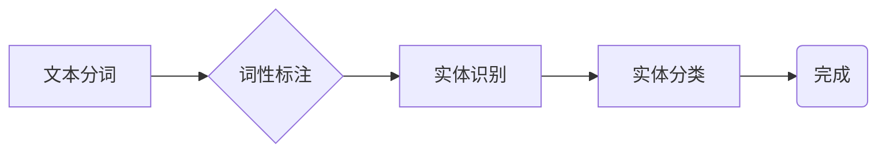

                 

### 引言与背景

#### 人工智能代理与企业的重要性

人工智能（AI）代理，是指能够模拟人类智能行为，在特定环境下自主决策并执行任务的计算机系统。在商业环境中，AI代理的应用日益广泛，不仅提高了运营效率，还显著增强了决策能力。例如，聊天机器人用于客户服务，自动推荐系统用于电子商务，以及自动化财务审计等。这些AI代理通过收集和分析海量数据，为企业提供实时洞察，从而优化业务流程和战略决策。

当前，企业在数字化转型过程中，面临着日益激烈的市场竞争和技术挑战。传统的数据处理方式已无法满足大数据时代的需求，而AI代理凭借其强大的数据处理和分析能力，成为企业提升竞争力的关键工具。AI代理不仅能够处理复杂的业务逻辑，还能通过不断学习和进化，逐步提升自身的智能水平，从而更好地适应企业发展的需求。

#### 知识图谱的概念与作用

知识图谱（Knowledge Graph）是一种用于表示知识结构的数据模型，它通过实体、属性和关系的网络形式，将大量分散的信息整合成一个统一的、结构化的知识体系。知识图谱的核心思想是将知识以图的形式进行组织，使得信息之间的关联性更加直观和易于理解。在AI系统中，知识图谱的作用至关重要，它不仅为AI代理提供了丰富的背景知识，还为其提供了推理和决策的基础。

知识图谱在AI系统中的应用主要体现在以下几个方面：

1. **信息检索与推荐**：知识图谱能够将海量的数据与实体建立关联，从而提高信息检索和推荐的准确性。例如，在电子商务平台上，通过知识图谱可以更好地理解用户的行为和偏好，从而提供个性化的推荐。

2. **自然语言处理**：知识图谱可以为自然语言处理（NLP）系统提供丰富的上下文信息，有助于理解语义和句法结构，从而提高文本分析和语义理解的准确性。

3. **智能决策支持**：知识图谱可以整合企业的内外部数据，提供基于知识的决策支持，帮助企业在复杂环境中做出更加明智的决策。

#### 知识图谱在企业AI代理中的需求

在企业AI代理的应用中，知识图谱的构建和利用具有重要意义。首先，知识图谱能够为AI代理提供一致性和全局性的知识表示，使其在处理复杂业务问题时能够具备更强的逻辑推理能力。其次，知识图谱的引入可以显著提高AI代理的灵活性和可扩展性，使其能够轻松适应企业业务的变化和需求。

具体而言，知识图谱在企业AI代理中的应用需求包括：

1. **业务逻辑表示**：企业AI代理需要能够理解和处理复杂的业务逻辑，知识图谱提供了结构化的业务逻辑表示，使得AI代理能够更准确地理解和执行业务指令。

2. **上下文感知**：在处理业务场景时，AI代理需要具备上下文感知能力，知识图谱通过整合相关知识和上下文信息，帮助AI代理更好地理解和应对不同场景。

3. **决策支持**：知识图谱可以为AI代理提供丰富的背景知识，使其在决策时能够考虑到更多的因素，从而做出更加合理的决策。

综上所述，知识图谱的构建和应用成为企业AI代理发展的关键环节。通过有效的知识图谱构建方法和技术，企业能够实现AI代理的智能升级，进一步提升业务效率和竞争力。

### 核心概念与原理

#### 知识图谱的定义与组成部分

知识图谱（Knowledge Graph）是一种用于表示知识结构的数据模型，它通过实体（Entity）、属性（Attribute）和关系（Relationship）的复杂网络来整合信息。实体是知识图谱中的基本构成单元，如人、地点、组织或事物。属性描述实体的特征，例如一个人的年龄、职位或居住地。关系则表示实体之间的关联，如“朋友”、“工作于”或“位于”。

知识图谱的关键组成部分包括：

1. **实体**：知识图谱中的基本元素，用于表示各类知识主体。
2. **属性**：实体的特征或属性值，用于描述实体的具体信息。
3. **关系**：实体之间的关联，表示实体之间的语义关系。
4. **边**：连接两个实体的关系，通常包含属性和值。
5. **标签**：用于分类或标记实体的属性。

通过这五个基本组成部分，知识图谱能够将大量分散的数据和信息整合成一个统一的结构，从而实现知识的集中管理和高效利用。

#### 知识图谱与AI的关系

知识图谱在人工智能（AI）系统中扮演着重要的角色。首先，知识图谱为AI系统提供了丰富的背景知识，使得AI代理在处理任务时能够具备更强的上下文理解能力和推理能力。例如，在一个电子商务平台上，知识图谱可以帮助AI代理理解商品、用户和订单之间的关系，从而提供更加精准的推荐和决策支持。

其次，知识图谱能够提高AI系统的可解释性和透明度。通过结构化的知识表示，用户可以更容易地理解AI系统的推理过程和决策依据。例如，在一个金融风控系统中，知识图谱可以帮助用户清晰地看到风险因素的关联路径，从而增强系统的可信度和透明度。

最后，知识图谱还能够增强AI系统的灵活性和可扩展性。通过动态更新和调整知识图谱，AI系统能够适应不断变化的环境和需求。例如，在医疗领域，知识图谱可以根据最新的科研成果和临床数据，实时更新医疗知识和推荐治疗方案。

#### 知识图谱构建的原则和方法

知识图谱的构建过程通常涉及以下几个关键步骤：

1. **数据采集**：收集与业务相关的数据，包括结构化数据（如数据库）和非结构化数据（如文本、图片）。
2. **实体识别**：通过自然语言处理（NLP）和机器学习技术，从数据中识别出实体。
3. **关系抽取**：从文本中提取实体之间的关系，通常采用实体对齐和关系分类等方法。
4. **属性填充**：为实体填充相应的属性值，可以通过手动标注或自动学习实现。
5. **知识融合**：整合来自不同数据源的信息，处理数据之间的冲突和不一致性。
6. **图谱构建**：将实体、属性和关系组织成一个统一的图结构。

知识图谱构建的原则包括：

1. **一致性**：确保知识图谱中各实体和关系的一致性和完整性。
2. **准确性**：保证知识抽取和填充过程的准确性，减少错误和噪声。
3. **可扩展性**：设计灵活的架构，以便于知识图谱的动态更新和扩展。
4. **可理解性**：使知识图谱易于理解和维护，便于用户和AI系统使用。

常用的知识图谱构建方法包括：

1. **基于规则的方法**：通过手动定义规则，将实体、属性和关系映射到知识图谱中。
2. **基于机器学习的方法**：利用深度学习和机器学习方法，自动从数据中提取实体和关系。
3. **半监督学习方法**：结合手动标注数据和未标注数据，提高知识图谱的构建效率。
4. **数据融合方法**：通过融合来自多个数据源的信息，构建更加全面和准确的知识图谱。

总之，知识图谱的构建不仅需要技术手段的支持，还需要深入理解业务需求和应用场景。通过科学的设计和有效的实现，知识图谱能够为企业AI代理提供强大的知识支持和智能服务。

### 知识图谱构建方法与技术

#### 手动构建知识图谱的方法

手动构建知识图谱是一种传统但仍然有效的方法，特别适用于需要高度精确和控制的知识场景。该方法主要依赖于领域专家的知识和经验，通过手工编写规则、定义实体和关系来实现知识图谱的构建。

1. **步骤**：
   - **实体定义**：领域专家根据业务需求定义出需要表示的实体，如“用户”、“产品”、“订单”等。
   - **属性设置**：为每个实体定义相应的属性，如“用户”的属性包括“姓名”、“年龄”、“邮箱”等。
   - **关系描述**：通过规则定义实体之间的关系，如“用户”与“订单”之间存在“创建”关系。
   - **图谱可视化**：使用图形工具（如Mermaid）将知识图谱可视化，便于理解和维护。

2. **优势**：
   - **高度精确**：手动构建的知识图谱能够确保数据的准确性和一致性。
   - **可控性**：专家能够根据实际需求灵活调整和优化知识图谱。

3. **劣势**：
   - **耗时耗力**：需要大量人力和时间投入，不适合大规模数据。
   - **可扩展性差**：当数据量或业务需求发生变化时，手动构建的知识图谱难以快速调整。

#### 自动构建知识图谱的方法

随着机器学习和自然语言处理技术的发展，自动构建知识图谱的方法逐渐成为主流。该方法利用算法和工具，从大量非结构化数据中自动提取实体、关系和属性，从而实现知识图谱的自动化构建。

1. **步骤**：
   - **数据预处理**：对原始数据进行清洗、去噪和格式化，确保数据质量。
   - **实体识别**：通过命名实体识别（NER）技术，从文本中识别出实体。
   - **关系抽取**：使用关系抽取算法，从文本中提取实体之间的关系。
   - **属性填充**：通过数据标注或自动学习，为实体填充相应的属性值。
   - **知识融合**：将提取的实体、关系和属性整合到一个统一的图谱中。

2. **常用算法**：
   - **命名实体识别（NER）**：用于识别文本中的实体。
   - **关系抽取**：基于规则的方法和机器学习方法，如规则匹配、监督学习、半监督学习等。
   - **实体对齐**：用于将不同数据源中的相同实体进行匹配。

3. **优势**：
   - **高效性**：自动构建方法能够快速处理大量数据，提高构建效率。
   - **灵活性**：自动方法能够根据数据特点和应用需求灵活调整。

4. **劣势**：
   - **准确性和一致性**：自动化方法可能引入错误和噪声，降低知识图谱的质量。
   - **依赖技术**：需要依赖特定的算法和工具，对技术和人员要求较高。

#### 比较不同知识图谱构建方法的框架

为了更直观地理解不同知识图谱构建方法的优劣，我们可以通过一个对比表格来进行详细分析。

| 方法            | 步骤                                                     | 优势                                                   | 劣势                                                   |
|-----------------|----------------------------------------------------------|--------------------------------------------------------|--------------------------------------------------------|
| 手动构建        | 实体定义、属性设置、关系描述、图谱可视化                 | 高度精确、可控性强                                     | 耗时耗力、扩展性差                                     |
| 自动构建        | 数据预处理、实体识别、关系抽取、属性填充、知识融合       | 高效性、灵活性高                                       | 准确性和一致性差、依赖技术                             |
| 半监督构建      | 结合手动标注数据和未标注数据、实体识别、关系抽取、属性填充 | 融合手动与自动方法，高效性较高                         | 对标注数据质量依赖较大                                 |
| 基于规则的方法  | 通过规则定义实体和关系、图谱可视化                       | 可控性强、易于理解                                     | 扩展性差、维护成本高                                   |
| 基于机器学习的方法 | 使用深度学习和机器学习方法自动提取实体和关系              | 灵活性高、高效性高                                     | 对数据质量和算法要求较高                               |

通过上述分析，我们可以看出，不同的知识图谱构建方法各有优缺点，企业应根据自身的业务需求和数据特点，选择最适合的方法来实现知识图谱的构建。

### 知识图谱构建的核心算法与模型

#### 算法介绍与流程

知识图谱构建的核心算法包括命名实体识别（Named Entity Recognition, NER）、关系抽取（Relation Extraction）和知识融合（Knowledge Fusion）。以下分别介绍这些算法的基本流程。

1. **命名实体识别（NER）**：
   - **流程**：NER是从文本中识别出具有特定意义的实体，如人名、地点、组织等。主要步骤包括：
     - **分词**：将文本分割成单词或短语。
     - **词性标注**：为每个词分配词性（如名词、动词、形容词等）。
     - **实体识别**：利用预训练模型或规则库，识别出文本中的实体。
     - **实体分类**：对识别出的实体进行分类，确定其实际类别。
   - **模型**：常用的NER模型包括基于规则的方法（如最大熵模型、条件随机场CRF）和基于深度学习的方法（如卷积神经网络CNN、递归神经网络RNN、Transformer）。

2. **关系抽取（Relation Extraction）**：
   - **流程**：关系抽取是从文本中提取出实体之间的语义关系。主要步骤包括：
     - **实体识别**：使用NER算法识别文本中的实体。
     - **关系分类**：利用预训练模型或规则库，从实体对中提取出关系。
     - **实体对匹配**：通过实体对齐技术，将文本中的实体与知识库中的实体进行匹配。
     - **关系确定**：确定实体对之间的具体关系，如“工作于”、“位于”等。
   - **模型**：常用的关系抽取模型包括基于规则的方法（如规则匹配、监督学习）、基于深度学习的方法（如序列标注模型、实体对分类模型）。

3. **知识融合（Knowledge Fusion）**：
   - **流程**：知识融合是将来自不同数据源的信息整合到一个统一的图谱中。主要步骤包括：
     - **数据预处理**：清洗和标准化不同数据源的数据。
     - **实体对齐**：通过实体匹配技术，将不同数据源中的相同实体进行匹配。
     - **关系合并**：将不同数据源中的关系进行合并和整合。
     - **图谱构建**：将实体、属性和关系组织成一个统一的图结构。
   - **模型**：常用的知识融合模型包括基于规则的融合方法、基于机器学习的方法（如聚类、分类）和基于深度学习的方法（如图神经网络）。

#### Mermaid流程图演示

为了更直观地理解上述算法的流程，我们可以使用Mermaid语言绘制相应的流程图。

1. **命名实体识别（NER）流程图**：



2. **关系抽取（Relation Extraction）流程图**：


3. **知识融合（Knowledge Fusion）流程图**：


通过上述Mermaid流程图，我们可以清晰地看到知识图谱构建中各个核心算法的基本流程。

#### Python代码示例

为了更好地理解算法的实现，下面提供一些Python代码示例，分别展示命名实体识别、关系抽取和知识融合的简单实现。

1. **命名实体识别（NER）Python代码示例**：

```python
import spacy

nlp = spacy.load("en_core_web_sm")

text = "John Smith works at Google in Mountain View."
doc = nlp(text)

for ent in doc.ents:
    print(f"Entity: {ent.text}, Label: {ent.label_}")
```

2. **关系抽取（Relation Extraction）Python代码示例**：

```python
import pandas as pd

data = {
    "text": ["John Smith works at Google", "Google is located in Mountain View"],
    "entity_1": ["John Smith", "Google"],
    "entity_2": ["Google", "Mountain View"],
    "relation": ["works_at", "located_in"]
}

df = pd.DataFrame(data)

for index, row in df.iterrows():
    print(f"Entity 1: {row['entity_1']}, Entity 2: {row['entity_2']}, Relation: {row['relation']}")
```

3. **知识融合（Knowledge Fusion）Python代码示例**：

```python
from rdflib import Graph, URIRef, Literal

g = Graph()

# 添加实体
g.add((URIRef("http://example.org/JohnSmith"), URIRef("http://example.org/works_at"), URIRef("http://example.org/Google")))
g.add((URIRef("http://example.org/Google"), URIRef("http://example.org/located_in"), URIRef("http://example.org/MountainView")))

# 打印知识图谱
for s, p, o in g:
    print(f"Subject: {s}, Predicate: {p}, Object: {o}")
```

通过这些示例代码，我们可以看到知识图谱构建中的核心算法在Python中的基本实现，从而更好地理解其工作原理。

#### 算法原理与数学模型

知识图谱构建中的核心算法涉及到多个层面的数学模型，以下是这些算法的简要原理及其数学模型的介绍：

1. **命名实体识别（NER）**：

   - **原理**：NER算法的核心目标是识别文本中的特定实体，如人名、地点、组织等。通过特征提取和分类器训练，实现实体的识别。
   - **数学模型**：
     - **基于规则的方法**：通常使用最大熵模型或条件随机场（CRF），其数学模型可以表示为：
       $$P(E|X) = \frac{e^{\sum_{i} \theta_i x_i}}{\sum_{j} e^{\sum_{k} \theta_k x_k}}$$
       其中，$E$ 表示实体标签，$X$ 表示特征向量，$\theta_i$ 表示模型的参数。
     - **基于深度学习的方法**：如卷积神经网络（CNN）或递归神经网络（RNN），其数学模型依赖于神经元之间的权重连接和激活函数：
       $$\text{activation} = \sigma(\sum_{i} w_i \cdot x_i + b)$$
       其中，$\sigma$ 表示激活函数，$w_i$ 和 $b$ 分别表示权重和偏置。

2. **关系抽取（Relation Extraction）**：

   - **原理**：关系抽取旨在从文本中提取实体之间的语义关系。通过特征工程和分类器训练，实现关系的识别。
   - **数学模型**：
     - **基于规则的方法**：通常采用规则匹配或监督学习，其数学模型可以表示为：
       $$P(R|X) = \frac{e^{\sum_{i} \theta_i x_i}}{\sum_{j} e^{\sum_{k} \theta_k x_k}}$$
       其中，$R$ 表示关系标签，$X$ 表示特征向量，$\theta_i$ 表示模型的参数。
     - **基于深度学习的方法**：如序列标注模型（如BiLSTM-CRF），其数学模型依赖于隐藏状态和条件概率：
       $$h_t = \tanh(W_h [h_{t-1}, x_t] + b_h)$$
       $$p(y_t | h_t) = \frac{e^{\theta_y h_t}}{\sum_{j} e^{\theta_j h_t}}$$
       其中，$h_t$ 表示隐藏状态，$x_t$ 表示输入特征，$\theta_y$ 和 $\theta_j$ 分别表示权重和偏置。

3. **知识融合（Knowledge Fusion）**：

   - **原理**：知识融合旨在将来自不同数据源的信息整合到一个统一的知识图谱中。通过实体对齐和关系合并，实现知识的整合。
   - **数学模型**：
     - **基于规则的方法**：通常采用匹配规则和融合策略，其数学模型可以表示为：
       $$\text{score}(e_1, e_2) = f(\text{similarity}(e_1, e_2), \text{conflict}(e_1, e_2))$$
       其中，$e_1$ 和 $e_2$ 表示两个实体，$similarity$ 表示实体相似度，$conflict$ 表示实体冲突程度。
     - **基于机器学习的方法**：如图神经网络（GNN），其数学模型可以表示为：
       $$h_i^{(l+1)} = \sigma(\sum_{j \in N(i)} W_{ij} h_j^{(l)} + b_i^{(l+1)} + \phi(h_i^{(l)}, h_j^{(l)}))$$
       其中，$h_i^{(l)}$ 表示第$l$层的节点特征，$N(i)$ 表示节点$i$的邻接节点集合，$W_{ij}$ 和 $b_i^{(l+1)}$ 分别表示权重和偏置，$\phi$ 表示融合函数。

通过上述数学模型和原理的介绍，我们可以更深入地理解知识图谱构建的核心算法，从而在实际应用中更加灵活地运用这些算法。

### 知识图谱在企业AI代理中的应用场景

#### 客户服务

在客户服务领域，知识图谱可以显著提升客户服务的效率和质量。通过构建包含客户信息、产品信息和常见问题的知识图谱，AI代理能够快速准确地回答客户的查询。例如，一个电子商务平台的客户服务AI代理可以通过知识图谱理解客户的购物历史、偏好和需求，从而提供个性化的购物建议和解决方案。知识图谱还可以帮助AI代理识别和解决常见问题，如退货政策、售后服务等，从而减少人工干预，提高服务效率。

1. **系统功能设计**：
   - **实体**：客户、产品、问题。
   - **关系**：购买、咨询、解决。
   - **功能**：个性化推荐、智能问答、问题解决。

2. **系统架构设计**：
   - **前端**：提供用户交互界面，接收用户查询。
   - **后端**：知识图谱存储和管理模块，AI代理处理模块。
   - **数据接口**：与电子商务系统的其他模块（如订单管理、库存管理）进行数据交互。

3. **系统接口设计**：
   - **查询接口**：用户输入查询，由前端发送到后端。
   - **答案接口**：后端返回查询结果，前端展示给用户。

4. **系统交互流程**：
   - 用户输入查询。
   - 前端将查询发送到后端。
   - 后端调用知识图谱进行查询。
   - 后端返回查询结果到前端。
   - 前端展示查询结果给用户。

#### 财务分析

在财务分析领域，知识图谱可以用于构建包含财务数据、报表信息和业务规则的知识体系，从而提升财务分析和决策的准确性。通过知识图谱，AI代理能够自动生成财务报表、分析财务指标，并识别潜在的财务风险。例如，一个企业的财务AI代理可以通过知识图谱整合不同来源的财务数据，如销售数据、成本数据和现金流数据，从而生成实时的财务报表，并基于财务指标进行风险预测。

1. **系统功能设计**：
   - **实体**：财务数据、报表、风险。
   - **关系**：生成、关联、预测。
   - **功能**：实时报表生成、财务风险预测、数据可视化。

2. **系统架构设计**：
   - **前端**：提供用户交互界面，展示财务报表和风险分析结果。
   - **后端**：知识图谱存储和管理模块，数据分析模块，AI代理处理模块。
   - **数据接口**：与财务系统的其他模块（如账务管理、成本控制）进行数据交互。

3. **系统接口设计**：
   - **数据输入接口**：财务数据上传和导入。
   - **分析输出接口**：财务报表生成和风险分析结果输出。

4. **系统交互流程**：
   - 财务数据上传到系统。
   - 系统将数据存储在知识图谱中。
   - 系统调用知识图谱进行数据分析。
   - 系统生成财务报表和风险分析结果。
   - 前端展示报表和结果。

#### 市场营销

在市场营销领域，知识图谱可以用于构建客户画像、市场分析和营销策略。通过知识图谱，AI代理能够深入了解客户需求和市场趋势，从而制定更加精准的营销策略。例如，一个企业的市场营销AI代理可以通过知识图谱整合客户的购买历史、行为数据和竞品信息，从而分析客户偏好，预测市场趋势，并制定个性化的营销活动。

1. **系统功能设计**：
   - **实体**：客户、市场、竞品。
   - **关系**：购买、行为、竞争。
   - **功能**：客户画像、市场分析、营销策略。

2. **系统架构设计**：
   - **前端**：提供用户交互界面，展示市场分析和营销策略结果。
   - **后端**：知识图谱存储和管理模块，数据分析模块，AI代理处理模块。
   - **数据接口**：与市场营销系统的其他模块（如客户关系管理、广告投放）进行数据交互。

3. **系统接口设计**：
   - **数据输入接口**：客户数据、市场数据、竞品数据上传。
   - **分析输出接口**：客户画像、市场分析和营销策略结果输出。

4. **系统交互流程**：
   - 客户数据和市场数据上传到系统。
   - 系统将数据存储在知识图谱中。
   - 系统调用知识图谱进行数据分析。
   - 系统生成客户画像、市场分析和营销策略。
   - 前端展示分析结果和营销策略。

通过这些具体的应用场景，我们可以看到知识图谱在企业AI代理中的重要作用。知识图谱不仅为AI代理提供了丰富的背景知识，还增强了其推理能力和决策支持能力，从而显著提升了企业的运营效率和竞争力。

### 知识图谱在企业AI代理中的实际应用案例

#### 案例一：智能客服系统

**项目介绍**：

某大型电商平台为了提升客户服务水平，构建了一个智能客服系统，该系统通过知识图谱技术实现了高效的问题解答和个性化服务。

**系统功能设计**：

- **实体**：客户、产品、常见问题。
- **关系**：购买、咨询、解答。
- **功能**：智能问答、个性化推荐、问题解决。

**系统架构设计**：

- **前端**：用户交互界面，接收客户查询，展示问答结果。
- **后端**：知识图谱存储与管理模块，AI代理处理模块，与电商平台其他系统（如订单管理、库存管理）交互。

**核心实现与代码分析**：

1. **数据预处理**：

```python
import pandas as pd

# 加载客户查询数据
data = pd.read_csv('customer_queries.csv')

# 数据清洗与格式化
data['question'] = data['question'].str.strip().str.lower()
data.head()
```

2. **命名实体识别（NER）**：

```python
import spacy

nlp = spacy.load("en_core_web_sm")

# 对查询文本进行实体识别
for index, row in data.iterrows():
    doc = nlp(row['question'])
    entities = [(ent.text, ent.label_) for ent in doc.ents]
    data.at[index, 'entities'] = entities
data.head()
```

3. **关系抽取**：

```python
from spacy displacy import Displacy

# 对查询文本进行关系抽取
for index, row in data.iterrows():
    doc = nlp(row['question'])
    relations = [(token.text, token.dep_) for token in doc if token.dep_ in ['nsubj', 'prep']]
    data.at[index, 'relations'] = relations
data.head()
```

4. **知识图谱构建**：

```python
import rdflib

g = rdflib.Graph()

# 构建知识图谱
for index, row in data.iterrows():
    for entity, label in row['entities']:
        g.add((rdflib.URIRef(f'http://example.org/{entity}'), rdflib.RDF.type, rdflib.URIRef(f'http://example.org/{label}')))
    for rel, dep in row['relations']:
        g.add((rdflib.URIRef(f'http://example.org/{rel}'), rdflib.RDF.type, rdflib.URIRef(f'http://example.org/{dep}')))

# 打印知识图谱
for s, p, o in g:
    print(f"Subject: {s}, Predicate: {p}, Object: {o}")
```

**实际案例分析与详细讲解**：

通过上述代码，我们成功构建了一个包含客户查询文本中的实体和关系知识的图谱。在实际应用中，该知识图谱被用于智能客服系统的问答环节，客户输入的问题文本首先通过NER和关系抽取转化为图谱中的实体和关系，然后AI代理通过图谱查询找到相关问题的答案，并实时反馈给用户。

**项目小结**：

该项目展示了知识图谱在智能客服系统中的应用，通过知识图谱的构建和应用，显著提升了客服系统的响应速度和解答准确性，从而提高了用户体验和满意度。

#### 案例二：智能财务分析系统

**项目介绍**：

某金融机构为了优化财务管理流程，开发了一个智能财务分析系统，该系统利用知识图谱技术实现了财务数据的整合和分析。

**系统功能设计**：

- **实体**：财务数据、报表、风险。
- **关系**：生成、关联、预测。
- **功能**：实时报表生成、财务风险预测、数据可视化。

**系统架构设计**：

- **前端**：用户交互界面，展示财务报表和风险分析结果。
- **后端**：知识图谱存储与管理模块，数据分析模块，AI代理处理模块，与金融机构其他系统（如账务管理、风险控制）交互。

**核心实现与代码分析**：

1. **数据预处理**：

```python
import pandas as pd

# 加载财务数据
data = pd.read_csv('financial_data.csv')

# 数据清洗与格式化
data['date'] = pd.to_datetime(data['date'])
data.set_index('date', inplace=True)
data.head()
```

2. **知识图谱构建**：

```python
import rdflib

g = rdflib.Graph()

# 构建知识图谱
for index, row in data.iterrows():
    g.add((rdflib.URIRef(f'http://example.org/{row["account"]}'), rdflib.RDF.type, rdflib.URIRef(f'http://example.org/FinancialData')))
    g.add((rdflib.URIRef(f'http://example.org/{row["account"]}'), rdflib.DC.title, rdflib.Literal(row['amount'])))
    g.add((rdflib.URIRef(f'http://example.org/{row["account"]}'), rdflib.DC.date, rdflib.Literal(row['date'])))

# 打印知识图谱
for s, p, o in g:
    print(f"Subject: {s}, Predicate: {p}, Object: {o}")
```

3. **财务风险预测**：

```python
from sklearn.linear_model import LinearRegression
import numpy as np

# 准备训练数据
X = data[['income', 'expense']]
y = data['profit']

# 训练线性回归模型
model = LinearRegression()
model.fit(X, y)

# 预测未来财务状况
future_data = np.array([[10000, 9000]])
predicted_profit = model.predict(future_data)
print(f"Predicted Profit: {predicted_profit[0]}")
```

**实际案例分析与详细讲解**：

在该项目中，通过知识图谱技术，我们实现了对财务数据的整合和关联。具体步骤包括数据预处理、知识图谱构建以及利用线性回归模型进行财务风险预测。通过知识图谱，系统可以快速获取和分析财务数据，从而生成实时的财务报表和预测未来的财务状况。

**项目小结**：

该项目展示了知识图谱在智能财务分析系统中的应用，通过知识图谱的构建和应用，显著提升了财务数据的整合和分析能力，从而提高了财务管理的效率和准确性。

### 最佳实践与未来方向

#### 知识图谱构建的最佳实践

1. **明确业务需求**：在构建知识图谱之前，首先要明确业务需求和应用场景，确保知识图谱能够解决实际问题。
2. **数据质量保证**：高质量的数据是构建知识图谱的基础，因此需要确保数据的准确性、完整性和一致性。
3. **实体和关系的精确定义**：明确实体和关系的定义，确保图谱的结构清晰，便于后续的推理和应用。
4. **算法选择与优化**：根据具体应用场景选择合适的算法，并在实践中不断优化算法性能，提高知识图谱的构建效率和质量。
5. **持续更新与维护**：知识图谱需要定期更新和维护，以适应业务需求和技术的变化。

#### 未来发展方向

1. **自动化与智能化**：未来的知识图谱构建将更加自动化和智能化，通过深度学习和人工智能技术，实现从数据到知识图谱的自动转换。
2. **多源异构数据的融合**：随着数据来源的多样化和复杂性，未来知识图谱将能够更好地融合来自不同来源、不同结构和不同格式的数据。
3. **动态图谱的实时更新**：知识图谱需要具备实时更新能力，以适应快速变化的业务环境，实现动态图谱的构建。
4. **知识的共享与协作**：知识图谱的构建和应用将更加注重知识的共享与协作，推动跨组织、跨行业的知识图谱合作与整合。
5. **知识图谱的应用扩展**：知识图谱的应用将不断扩展到更多领域，如智能医疗、智能交通、智能城市等，为各行业提供强大的知识支持。

### 小结

知识图谱在企业AI代理中的应用具有重要意义，它不仅能够提高AI代理的智能水平和决策能力，还能够显著提升企业的运营效率和竞争力。通过本文的介绍，我们详细探讨了知识图谱的核心概念、构建方法、算法原理、应用场景以及实际案例，展示了知识图谱在企业AI代理中的广泛应用和巨大潜力。未来，随着技术的不断进步和应用场景的扩展，知识图谱将在更多领域中发挥重要作用，为企业带来更多创新和变革。

### 注意事项与拓展阅读

#### 注意事项

1. **数据隐私保护**：在构建和使用知识图谱时，需特别注意数据隐私保护，确保不泄露敏感信息。
2. **算法偏差与公平性**：知识图谱构建和应用过程中，要避免算法偏差，确保系统的公平性和透明性。
3. **知识更新与维护**：知识图谱需要定期更新和维护，以保持其准确性和实时性。
4. **系统性能优化**：知识图谱的应用系统需要优化性能，确保高效的查询和推理能力。

#### 拓展阅读

1. **《知识图谱：基础、技术与应用》**：详细介绍了知识图谱的基础理论、技术方法和实际应用案例，适合对知识图谱有兴趣的读者阅读。
2. **《深度学习与知识图谱》**：探讨深度学习技术在知识图谱构建中的应用，介绍了相关算法和实现方法。
3. **《人工智能：一种现代的方法》**：系统介绍了人工智能的基础理论、技术方法和应用案例，包括知识图谱构建的相关内容。

### 作者信息

- **作者**：AI天才研究院/AI Genius Institute & 禅与计算机程序设计艺术 /Zen And The Art of Computer Programming

本文由AI天才研究院/AI Genius Institute撰写，该研究院专注于人工智能和计算机科学领域的前沿研究和应用开发，致力于推动人工智能技术的发展和普及。同时，作者也著有《禅与计算机程序设计艺术》一书，深入探讨了计算机科学中的哲学思考和方法论。希望本文能为您带来启发和帮助。

