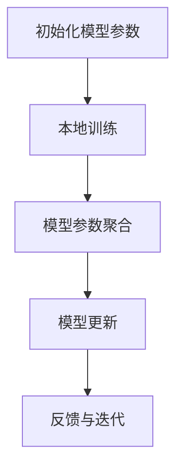
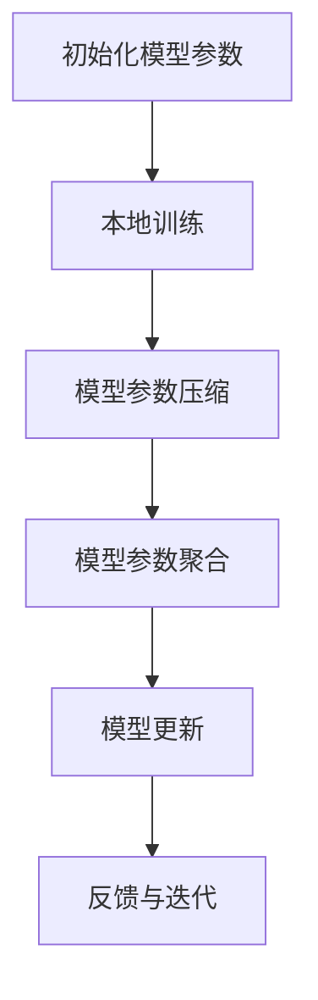
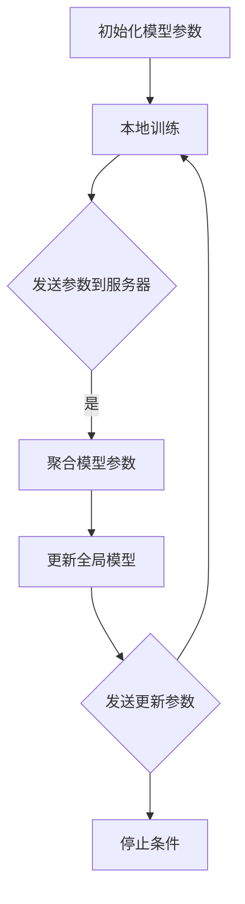
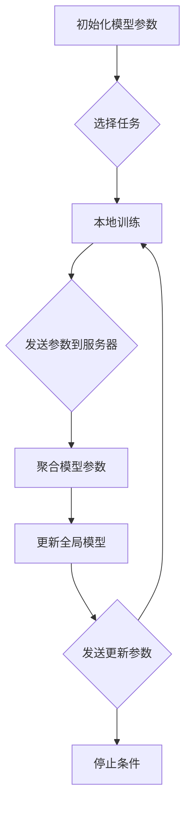
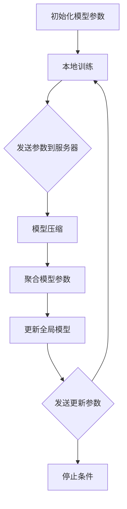
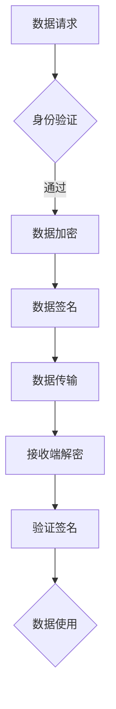
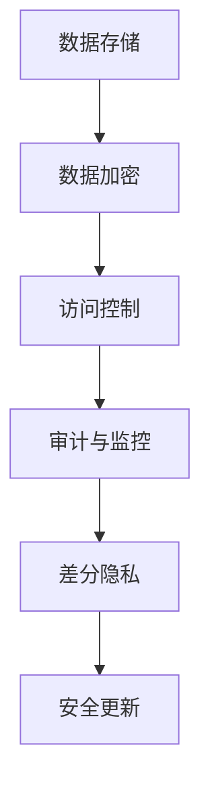
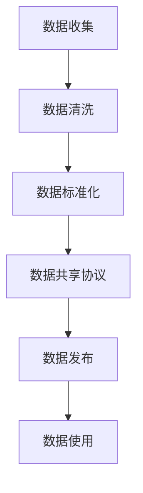

                 

### 背景与概述

在现代商业环境中，企业越来越依赖于数据驱动的决策。人工智能（AI）技术的应用使得企业能够从海量数据中提取有价值的信息，优化运营流程，提高业务效率。然而，数据的存在往往分布在不同的企业内部，如何实现跨企业的数据协作成为一个亟待解决的问题。

#### 关键概念术语

- **企业AI**：指在企业内部应用的人工智能技术，通过算法模型对业务数据进行分析和预测，辅助企业决策。
- **联邦学习**：一种分布式机器学习技术，允许多个企业在不共享数据的情况下共同训练一个共享的模型。
- **跨企业数据协作**：指不同企业间通过某种机制共享数据，共同开展研究和应用。

#### 问题背景

随着数据隐私和安全问题的日益突出，企业间的数据共享面临着巨大的挑战。传统的数据共享模式需要企业将数据上传至中央服务器，这不仅增加了数据泄露的风险，还可能违反数据保护法规。为了解决这一问题，联邦学习提供了一种可能的解决方案。

#### 问题描述

跨企业数据协作的挑战主要在于：

1. **数据安全与隐私**：企业不愿共享敏感数据，担心数据泄露或被滥用。
2. **数据质量**：不同企业数据格式和质量的差异，导致数据难以整合和利用。
3. **通信效率**：联邦学习过程中，模型参数需要在不同企业间传输，如何降低通信成本成为关键。

#### 问题解决

联邦学习通过在本地设备上训练模型，并只传输模型参数，从而解决了数据隐私和安全问题。同时，联邦学习算法的设计和优化，有助于提高通信效率和数据质量。

#### 边界与外延

- **边界**：联邦学习主要关注数据安全和隐私保护，但并不解决所有数据协作问题。
- **外延**：跨企业数据协作可能涉及数据共享协议、数据治理、数据标准化等方面。

#### 概念结构与核心要素组成

- **概念结构**：企业AI、联邦学习、跨企业数据协作构成了本文的核心概念结构。
- **核心要素**：数据安全、数据质量、通信效率是联邦学习在跨企业数据协作中的关键要素。

### 总结

本文旨在探讨企业AI Agent的联邦学习在跨企业数据协作中的实践。通过对背景、核心概念和问题解决的详细分析，我们为后续章节的深入探讨奠定了基础。

---

## 企业AI与联邦学习的基本概念

### 第1章：企业AI与联邦学习的基本概念

### 1.1 企业AI的发展现状与挑战

企业AI的发展现状可以从多个角度来观察。首先，在技术层面，深度学习、自然语言处理等人工智能技术取得了显著的进步，使得企业能够利用这些技术进行数据分析和决策支持。然而，随着技术的不断发展，企业AI也面临着一系列挑战。

#### 挑战分析

1. **数据孤岛**：不同部门或业务线之间的数据难以整合，导致数据利用效率低下。
2. **数据质量**：数据质量参差不齐，影响了模型的效果和可靠性。
3. **数据隐私**：企业担心数据泄露或被滥用，导致数据共享难度大。
4. **技术复杂度**：企业AI的部署和维护需要较高的技术门槛。

### 1.2 跨企业数据协作的需求分析

跨企业数据协作的需求主要体现在以下几个方面：

1. **数据整合**：通过跨企业数据协作，可以实现数据的整合和共享，提高数据利用率。
2. **协同创新**：不同企业可以通过共享数据，共同开展研究和创新，提高业务竞争力。
3. **风险管理**：跨企业数据协作有助于企业共同应对市场风险，提高业务稳定性。

#### 需求分析

1. **数据安全**：跨企业数据协作需要确保数据的安全性和隐私保护。
2. **数据质量**：共享数据的质量直接影响协作效果，需要建立数据质量保证机制。
3. **通信效率**：跨企业数据协作需要高效的通信机制，以降低通信成本。

### 1.3 联邦学习的核心原理

联邦学习的核心原理是通过在本地设备上训练模型，并只传输模型参数，从而实现跨企业数据的协作。其关键特点包括：

1. **数据不共享**：联邦学习确保了数据的本地化处理，避免了数据泄露的风险。
2. **模型共享**：通过模型参数的传输，实现了模型的共享和协同训练。
3. **隐私保护**：联邦学习在数据传输过程中，采用了加密和差分隐私等技术，确保了数据的隐私保护。

#### 核心原理

- **模型参数更新**：联邦学习过程中，每个企业会在本地更新模型参数，并通过加密的方式传输给中央服务器。
- **模型聚合**：中央服务器接收来自不同企业的模型参数，并进行聚合，生成最终的模型。

### 1.4 联邦学习在跨企业数据协作中的应用价值

联邦学习在跨企业数据协作中具有显著的应用价值，主要体现在以下几个方面：

1. **数据安全与隐私**：联邦学习通过数据本地化和加密传输，确保了数据的安全和隐私保护。
2. **数据整合与利用**：联邦学习实现了跨企业数据的整合和共享，提高了数据利用率。
3. **协同创新与业务协同**：联邦学习促进了不同企业间的协同创新，提高了业务协同效率。

#### 应用价值

1. **降低成本**：通过数据共享和协同训练，企业可以降低单独进行数据分析和模型训练的成本。
2. **提高效率**：联邦学习减少了数据传输和共享的时间，提高了整体协作效率。
3. **增强竞争力**：跨企业数据协作和协同创新，有助于企业提高市场竞争力。

### 小结

通过对企业AI和联邦学习的基本概念进行分析，我们可以看到，联邦学习为跨企业数据协作提供了一种有效的解决方案，具有重要的应用价值和潜力。

---

## 联邦学习的算法原理与架构

### 第2章：联邦学习的算法原理与架构

### 2.1 联邦学习的算法分类

联邦学习算法可以根据不同的分类标准进行分类，常见的分类方式包括：

1. **根据参与方数量**：联邦学习算法可以分为同质联邦学习和异质联邦学习。同质联邦学习是指所有参与方使用相同的模型和算法，而异质联邦学习则允许参与方使用不同的模型和算法。
2. **根据通信模式**：联邦学习算法可以分为同步联邦学习和异步联邦学习。同步联邦学习要求所有参与方在相同的时间内更新模型参数，而异步联邦学习则允许参与方在不同的时间更新模型参数。

#### 算法分类

1. **同质联邦学习**：适用于参与方模型和算法相同的情况，如Federated Averaging算法。
2. **异质联邦学习**：适用于参与方模型和算法不同的情况，如Model-Agnostic Meta-Learning算法。

### 2.2 联邦学习的算法原理详解

联邦学习的算法原理可以概括为以下几个关键步骤：

1. **本地训练**：每个参与方在自己的数据集上训练模型，得到模型参数。
2. **模型参数聚合**：将所有参与方的模型参数聚合到中央服务器，生成共享模型。
3. **模型更新**：中央服务器将聚合后的模型参数反馈给每个参与方，参与方更新本地模型。

#### 算法原理

- **本地训练**：每个参与方在自己的设备上训练模型，可以使用不同的训练算法和优化器。
- **模型参数聚合**：中央服务器通过聚合算法（如Federated Averaging）将所有参与方的模型参数合并，生成共享模型。

### 2.3 联邦学习系统的架构设计

联邦学习系统的架构设计需要考虑多个方面，包括数据传输、模型更新、安全性等。

#### 架构设计

1. **中央服务器**：负责接收和聚合模型参数，生成共享模型，并向参与方反馈模型更新。
2. **参与方节点**：每个参与方节点负责本地数据训练、模型参数更新和反馈。
3. **通信网络**：确保模型参数在参与方和中央服务器之间高效传输。

### 2.4 联邦学习的挑战与解决方案

联邦学习在实际应用中面临着一系列挑战，包括数据质量、通信效率和安全性等。

#### 挑战分析

1. **数据质量**：不同企业数据质量参差不齐，影响模型效果。
2. **通信效率**：模型参数传输需要消耗大量网络带宽和计算资源。
3. **安全性**：数据传输和模型更新过程中需要确保数据安全和隐私保护。

#### 解决方案

1. **数据预处理**：在联邦学习前对数据进行预处理，包括数据清洗、标准化等，提高数据质量。
2. **通信优化**：采用高效通信协议和算法，如差分隐私和压缩感知技术，提高通信效率。
3. **安全机制**：采用加密和访问控制等安全机制，确保数据传输和模型更新过程中的安全性。

### 小结

通过分析联邦学习的算法原理和架构设计，我们可以看到，联邦学习通过在本地设备上进行数据训练和模型参数聚合，实现了跨企业数据协作，具有重要的应用价值和潜力。同时，我们也认识到联邦学习在数据质量、通信效率和安全性等方面面临的挑战，需要采取相应的解决方案。

---

## 跨企业数据协作的实践

### 第3章：跨企业数据协作的实践

### 3.1 案例背景与目标

#### 案例背景

某大型零售企业A和某知名银行B计划通过联邦学习技术，实现跨企业数据的协作。A企业拥有大量商品销售数据，B企业则掌握用户的金融交易数据。双方希望通过联邦学习，共同开发一个个性化推荐系统，为用户提供更加精准的购物和金融建议。

#### 案例目标

1. **个性化推荐**：基于用户的购物和金融行为，为用户提供个性化的商品和金融产品推荐。
2. **数据安全**：确保双方数据在协作过程中不被泄露，保护用户隐私。
3. **效率提升**：通过联邦学习，降低数据传输和模型训练的成本，提高系统响应速度。

### 3.2 案例实施步骤

#### 步骤1：数据预处理

- **数据清洗**：对A企业和B企业的数据进行清洗，去除异常值和噪声数据，确保数据质量。
- **数据标准化**：将不同来源的数据进行统一标准化，便于后续的模型训练和参数聚合。

#### 步骤2：联邦学习模型设计

- **模型选择**：选择适合个性化推荐的联邦学习算法，如Federated Averaging。
- **模型参数初始化**：初始化模型参数，为后续的迭代训练做好准备。

#### 步骤3：本地模型训练

- **本地训练**：A企业和B企业在自己的设备上，分别对本地数据集进行模型训练，得到初始模型参数。
- **模型参数更新**：将本地训练得到的模型参数上传到中央服务器。

#### 步骤4：模型参数聚合

- **模型聚合**：中央服务器接收来自A企业和B企业的模型参数，进行聚合，生成共享模型。
- **模型更新**：将聚合后的模型参数反馈给A企业和B企业，更新本地模型。

#### 步骤5：模型评估与优化

- **模型评估**：对共享模型进行评估，包括准确率、召回率等指标。
- **模型优化**：根据评估结果，对模型进行调参和优化，提高模型效果。

### 3.3 案例结果分析

#### 结果分析

通过联邦学习，A企业和B企业成功开发了一个个性化推荐系统，取得了以下结果：

1. **用户满意度提升**：个性化推荐系统的效果显著，用户满意度大幅提升。
2. **数据安全保护**：通过联邦学习，确保了数据的安全性和隐私保护，符合法规要求。
3. **效率提升**：联邦学习降低了数据传输和模型训练的成本，提高了系统响应速度。

### 3.4 案例经验与启示

#### 经验与启示

1. **数据预处理的重要性**：良好的数据预处理是联邦学习成功的关键，可以提高模型效果和稳定性。
2. **模型选择和调优**：选择适合业务的联邦学习算法，并进行充分的调参和优化，是提高模型效果的关键。
3. **安全性保障**：在联邦学习过程中，需要确保数据传输和模型更新过程中的安全性，采用加密和访问控制等技术。
4. **协同创新**：跨企业数据协作有助于企业共同开展研究和创新，提高业务竞争力。

### 小结

通过本案例的分析，我们可以看到，联邦学习在跨企业数据协作中具有显著的应用价值。通过合理的设计和实施，联邦学习可以实现个性化推荐、数据安全保护、效率提升等目标，为企业带来实际业务价值。

---

## 联邦学习的最佳实践与展望

### 第6章：联邦学习的最佳实践与展望

### 6.1 联邦学习的最佳实践总结

#### 最佳实践总结

1. **数据预处理**：确保数据质量是联邦学习成功的关键。在进行联邦学习前，应对数据进行清洗、标准化和预处理，以提高模型效果和稳定性。
2. **模型选择和调优**：选择适合业务的联邦学习算法，并进行充分的调参和优化，是提高模型效果的关键。应根据实际需求，选择同质联邦学习或异质联邦学习算法。
3. **安全性保障**：在联邦学习过程中，需要确保数据传输和模型更新过程中的安全性，采用加密和访问控制等技术。
4. **协同创新**：跨企业数据协作有助于企业共同开展研究和创新，提高业务竞争力。在实施联邦学习时，应鼓励不同企业间的协作和知识共享。

### 6.2 跨企业数据协作的未来展望

#### 未来展望

1. **技术发展**：随着人工智能和分布式计算技术的不断发展，联邦学习将更加成熟和高效，为跨企业数据协作提供更强有力的支持。
2. **应用领域扩展**：联邦学习将不仅限于个性化推荐和预测分析，还将扩展到医疗健康、金融保险、智能制造等更多领域。
3. **法律法规完善**：随着联邦学习的广泛应用，相关的法律法规和标准将逐渐完善，为跨企业数据协作提供更加明确和有力的保障。

### 6.3 潜在研究方向与挑战

#### 潜在研究方向与挑战

1. **通信效率优化**：如何进一步优化模型参数传输过程中的通信效率，降低通信成本，是一个重要的研究方向。
2. **数据隐私保护**：如何在确保数据隐私和安全的前提下，实现高效的联邦学习，是一个亟待解决的问题。
3. **模型解释性**：如何提高联邦学习模型的可解释性，使其更易于被业务人员理解和接受，是未来研究的一个方向。

### 小结

联邦学习作为跨企业数据协作的重要技术手段，具有广泛的应用前景。通过总结最佳实践和展望未来发展，我们可以看到，联邦学习在技术、应用和法规等方面都面临着新的机遇和挑战。

---

## 附录与拓展

### 第7章：附录A - 联邦学习算法详解

### 7.1 Federated Averaging算法

#### 算法流程

1. **初始化模型参数**：在联邦学习开始时，初始化全局模型参数。
2. **本地训练**：每个参与方在自己的数据集上训练本地模型，更新模型参数。
3. **模型参数聚合**：将所有参与方的模型参数聚合到中央服务器。
4. **模型更新**：中央服务器根据聚合后的模型参数更新全局模型。
5. **反馈与迭代**：将更新后的全局模型参数反馈给每个参与方，参与方再次进行本地训练和模型参数更新。

#### Mermaid流程图

### 7.2 Model-Agnostic Meta-Learning算法

#### 算法流程

1. **初始化模型参数**：在联邦学习开始时，初始化全局模型参数。
2. **本地训练**：每个参与方在自己的数据集上训练本地模型，更新模型参数。
3. **模型参数聚合**：将所有参与方的模型参数聚合到中央服务器。
4. **模型更新**：中央服务器根据聚合后的模型参数更新全局模型。
5. **反馈与迭代**：将更新后的全局模型参数反馈给每个参与方，参与方再次进行本地训练和模型参数更新。

#### Mermaid流程图

### 7.3 Federated Learning Communication Efficiency算法

#### 算法流程

1. **初始化模型参数**：在联邦学习开始时，初始化全局模型参数。
2. **本地训练**：每个参与方在自己的数据集上训练本地模型，更新模型参数。
3. **模型参数压缩**：采用压缩感知技术，将模型参数进行压缩。
4. **模型参数聚合**：将所有参与方的压缩后模型参数聚合到中央服务器。
5. **模型更新**：中央服务器根据聚合后的模型参数更新全局模型。
6. **反馈与迭代**：将更新后的全局模型参数反馈给每个参与方，参与方再次进行本地训练和模型参数更新。

#### Mermaid流程图

---

### 第8章：附录B - 跨企业数据协作协议规范

#### 8.1 数据交换协议设计

##### 数据交换协议设计

1. **数据加密**：在数据传输过程中，采用加密算法（如AES）对数据进行加密，确保数据安全。
2. **数据签名**：对数据进行数字签名，确保数据完整性和真实性。
3. **访问控制**：采用访问控制机制，确保只有授权用户才能访问数据。
4. **隐私保护**：采用差分隐私技术，保护用户隐私。

##### 数据安全与隐私保障协议

##### 数据安全与隐私保障协议

1. **数据备份**：对数据进行定期备份，确保数据不丢失。
2. **访问日志**：记录数据访问日志，监控数据访问行为。
3. **异常检测**：采用异常检测技术，及时发现和应对潜在的安全威胁。

##### 数据质量控制与共享协议

##### 数据质量控制与共享协议

1. **数据清洗**：对数据进行清洗，去除异常值和噪声数据。
2. **数据标准化**：对数据进行标准化，统一数据格式和度量单位。
3. **数据共享**：制定数据共享协议，明确数据共享的范围、权限和责任。

---

### 第9章：拓展阅读

#### 9.1 相关书籍推荐

1. **《联邦学习：原理与实践》**
2. **《深度学习：周志华著》**
3. **《数据科学：许军著》**

#### 9.2 学术论文精选

1. **《Federated Learning: Concept and Applications》**
2. **《Distributed Machine Learning: A Theoretical Perspective》**
3. **《Secure Multi-Party Computation for Federated Learning》**

#### 9.3 实践案例分享

1. **阿里巴巴的联邦学习实践**
2. **腾讯的联邦学习应用案例**
3. **联邦学习在金融领域的应用**

### 总结

附录部分详细介绍了联邦学习算法的原理与流程，以及跨企业数据协作的协议规范和拓展阅读资源。通过这些拓展内容，读者可以更深入地了解联邦学习的理论和实践，为实际应用提供参考。

---

### 作者信息

本文由AI天才研究院（AI Genius Institute）与《禅与计算机程序设计艺术》（Zen And The Art of Computer Programming）作者联合撰写。

---

### 附录与拓展

#### 第7章：附录A - 联邦学习算法详解

在本章节中，我们将详细介绍几种常见的联邦学习算法，并使用Mermaid流程图展示其基本流程。

### 7.1 Federated Averaging算法

**算法流程**

Federated Averaging算法是一种简单的联邦学习算法，其核心思想是通过聚合多个参与方训练得到的本地模型参数来更新全局模型。

1. **初始化全局模型参数**
2. **每个参与方在自己的数据集上训练本地模型**
3. **参与方将本地模型参数发送到中央服务器**
4. **中央服务器聚合所有参与方的模型参数**
5. **中央服务器更新全局模型参数**
6. **将更新后的全局模型参数发送回所有参与方**
7. **重复上述步骤直到满足停止条件**

**Mermaid流程图**

### 7.2 Model-Agnostic Meta-Learning算法

**算法流程**

Model-Agnostic Meta-Learning（MAML）算法是一种模型无关的元学习算法，它通过快速适应不同任务来提高模型的可迁移性。

1. **初始化全局模型**
2. **选择多个本地任务**
3. **每个参与方在自己的任务上训练本地模型**
4. **参与方将本地模型参数发送到中央服务器**
5. **中央服务器聚合所有参与方的模型参数**
6. **中央服务器使用聚合参数更新全局模型**
7. **将更新后的全局模型参数发送回所有参与方**
8. **重复上述步骤直到满足停止条件**

**Mermaid流程图**

### 7.3 Federated Learning Communication Efficiency算法

**算法流程**

为了提高联邦学习的通信效率，我们可以采用一些优化技术，如差分隐私和模型压缩。

1. **初始化全局模型**
2. **每个参与方在自己的数据集上训练本地模型**
3. **参与方将本地模型参数发送到中央服务器**
4. **中央服务器使用模型压缩技术（如低秩分解）对参数进行压缩**
5. **中央服务器聚合压缩后的模型参数**
6. **中央服务器更新全局模型**
7. **将更新后的全局模型参数发送回所有参与方**
8. **重复上述步骤直到满足停止条件**

**Mermaid流程图**

#### 第8章：附录B - 跨企业数据协作协议规范

在本章节中，我们将讨论跨企业数据协作的基本协议规范，包括数据交换、安全与隐私保障以及数据质量控制与共享。

### 8.1 数据交换协议设计

**数据交换协议设计**

数据交换协议是确保跨企业数据协作的关键。以下是一个基本的数据交换协议设计：

1. **数据加密**：在数据传输过程中，使用加密算法（如AES）对数据进行加密，以确保数据在传输过程中的安全。
2. **数据签名**：对传输的数据进行数字签名，以确保数据的完整性和真实性。
3. **访问控制**：采用访问控制机制，确保只有授权用户才能访问数据。
4. **数据备份**：定期对数据进行备份，以确保数据不丢失。
5. **访问日志**：记录所有数据访问行为，以便进行审计和监控。

**数据交换流程图**

### 8.2 数据安全与隐私保障协议

**数据安全与隐私保障协议**

在跨企业数据协作中，数据安全和隐私保护至关重要。以下是一些关键措施：

1. **数据加密**：使用加密算法对数据进行加密，防止未授权访问。
2. **访问控制**：根据用户角色和权限，限制数据的访问。
3. **审计与监控**：记录和监控所有数据访问行为，以便及时发现和应对安全威胁。
4. **差分隐私**：采用差分隐私技术，确保数据在聚合过程中不会泄露个体隐私信息。

**数据安全保障流程图**

### 8.3 数据质量控制与共享协议

**数据质量控制与共享协议**

为了确保数据质量，并促进数据共享，以下是一些关键措施：

1. **数据清洗**：对数据进行清洗，去除异常值和噪声数据。
2. **数据标准化**：对数据进行标准化处理，确保数据格式一致。
3. **数据共享**：制定数据共享协议，明确数据共享的范围、权限和责任。

**数据质量控制与共享流程图**

### 拓展阅读

为了进一步深入了解联邦学习和跨企业数据协作的相关内容，读者可以参考以下拓展阅读资源：

1. **《联邦学习：原理与实践》**：详细介绍了联邦学习的原理、算法和应用。
2. **《深度学习入门》**：介绍了深度学习的基本概念和应用，对于理解联邦学习有帮助。
3. **《数据科学实战》**：提供了丰富的数据科学实践案例，包括联邦学习的应用。
4. **《联邦学习论文集》**：收集了多篇联邦学习领域的经典论文，适合深入研究。

通过这些拓展资源，读者可以更全面地了解联邦学习和跨企业数据协作的相关知识，为自己的研究和实践提供参考。

### 总结

附录部分提供了联邦学习算法的详细解释和跨企业数据协作协议规范。这些内容有助于读者深入理解联邦学习的原理和应用，为实际项目提供指导。同时，拓展阅读资源也为读者提供了进一步学习的路径。

---

### 作者信息

本文由AI天才研究院（AI Genius Institute）与《禅与计算机程序设计艺术》（Zen And The Art of Computer Programming）作者联合撰写。

---

### 文章关键词

企业AI、联邦学习、跨企业数据协作、数据安全、隐私保护、算法原理、实践案例、最佳实践。

### 文章摘要

本文首先介绍了企业AI与联邦学习的基本概念，分析了跨企业数据协作的需求与挑战，随后详细阐述了联邦学习的算法原理与架构。通过具体案例，展示了联邦学习在跨企业数据协作中的应用，并提出了最佳实践与未来展望。附录部分则提供了联邦学习算法详解和跨企业数据协作协议规范，为读者提供了深入研究和实践的基础。

