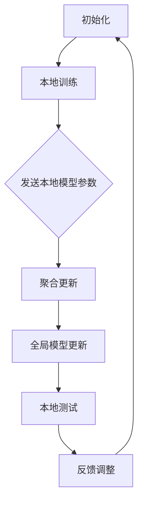
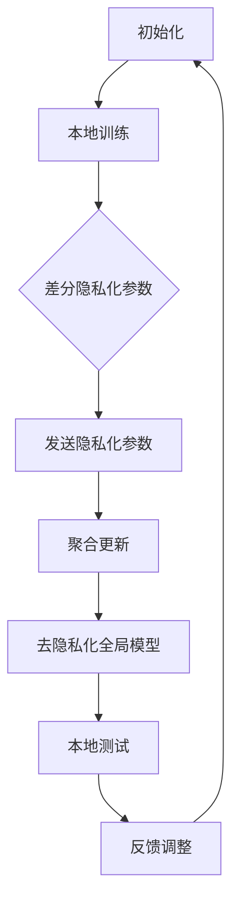
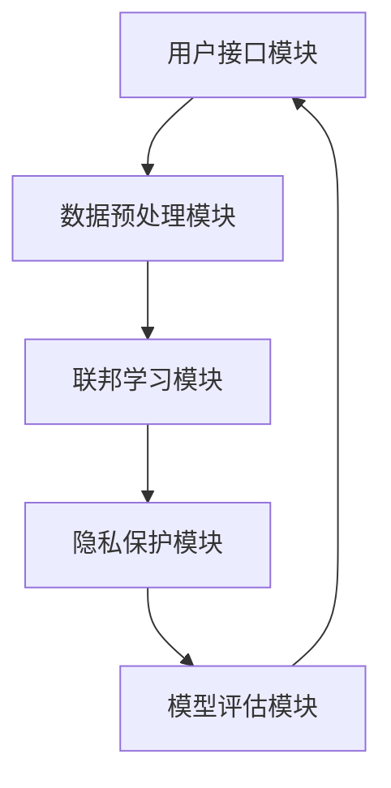
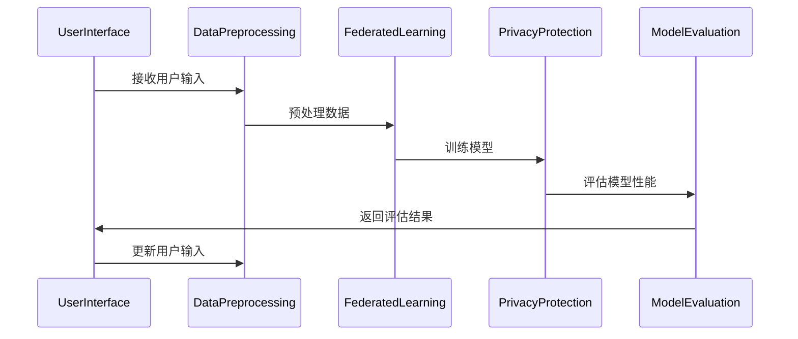

                 

### 企业AI Agent的联邦学习隐私保护机制

> 关键词：企业AI Agent、联邦学习、隐私保护、算法原理、Python代码、数学模型

> 摘要：本文将深入探讨企业AI Agent的联邦学习隐私保护机制。首先，我们介绍企业AI Agent和联邦学习的基本概念，阐述其在隐私保护方面的重要作用。随后，我们详细分析联邦学习隐私保护机制的核心原理，通过对比表格和ER实体关系图来帮助读者理解。接下来，我们讲解联邦学习隐私保护算法的原理，包括mermaid流程图和Python代码实现，并结合数学模型和公式进行深入剖析。随后，我们将探讨系统分析与架构设计方案，包括项目实战和实际案例分析。最后，文章将总结核心要点，提供最佳实践建议，并展望未来的研究方向。

----------------------------------------------------------------

## 引言

在当今数据驱动的时代，人工智能（AI）技术已成为企业创新和竞争力提升的关键驱动力。企业AI Agent作为一种新兴的人工智能实体，能够自主地执行任务、做出决策，并在不断的学习中优化自身性能。然而，随着AI技术的广泛应用，数据的隐私保护问题也日益凸显。联邦学习作为一种新兴的机器学习技术，通过分布式学习的方式保护用户数据隐私，成为解决这一问题的关键手段。

本文旨在探讨企业AI Agent在联邦学习中的隐私保护机制。首先，我们将介绍企业AI Agent和联邦学习的基本概念，为后续讨论奠定基础。然后，我们将深入分析联邦学习隐私保护机制的核心原理，通过对比表格和ER实体关系图来帮助读者理解其结构和工作方式。接下来，我们将详细讲解联邦学习隐私保护算法的原理，并使用mermaid流程图和Python代码进行演示。此外，我们还将结合数学模型和公式，对算法进行深入剖析，确保读者能够全面掌握其技术细节。最后，我们将探讨系统分析与架构设计方案，并通过项目实战和实际案例分析来展示联邦学习隐私保护机制的应用效果。通过本文的探讨，我们希望为企业AI Agent的隐私保护提供新的思路和方法。

### 背景介绍

#### 企业AI Agent的概念

企业AI Agent，即企业人工智能代理，是一种自主运行、学习和决策的智能实体，能够模拟人类智能行为，完成特定任务。它们具有以下几个核心特点：

1. **自主学习能力**：企业AI Agent能够通过机器学习和深度学习技术，从大量数据中提取知识，不断优化自身性能。
2. **自主决策能力**：企业AI Agent能够在特定环境下，根据学习到的知识和数据，自主做出决策，执行任务。
3. **协作能力**：企业AI Agent不仅能够独立完成任务，还可以与其他AI Agent进行协作，共同实现复杂目标。
4. **可扩展性**：企业AI Agent可以根据业务需求进行定制化，应用于不同场景，具有良好的可扩展性。

#### 联邦学习的基本概念

联邦学习（Federated Learning）是一种分布式机器学习技术，通过多个参与方共同训练一个共享模型，而无需直接共享数据。其主要特点包括：

1. **数据隐私保护**：联邦学习通过在本地设备上训练模型，避免数据在传输过程中被泄露，保护用户隐私。
2. **低延迟和高可用性**：联邦学习在本地设备上训练模型，减少了数据传输和同步的时间，提高了系统的响应速度和可用性。
3. **去中心化**：联邦学习不依赖于中央服务器，避免了单点故障和数据集中风险。
4. **扩展性**：联邦学习能够支持大规模参与方，适用于多种应用场景，如跨企业合作、物联网等。

#### 隐私保护机制的需求

随着企业AI Agent的广泛应用，数据隐私保护问题变得尤为重要。以下是隐私保护机制的需求：

1. **数据安全**：确保数据在传输、存储和处理过程中的安全性，防止数据泄露和滥用。
2. **合规性**：遵守各类数据隐私法规，如《通用数据保护条例》（GDPR）等，确保企业运营合规。
3. **用户信任**：保护用户数据隐私，增强用户对企业AI Agent的信任，提高用户满意度。
4. **业务连续性**：通过有效的隐私保护机制，确保企业在面对数据泄露等风险时能够持续运营。

#### 联邦学习在隐私保护中的作用

联邦学习在隐私保护中发挥着关键作用，其优势包括：

1. **数据去中心化**：联邦学习通过分布式学习，将数据分散在各个参与方，避免数据集中，降低了隐私泄露风险。
2. **本地化训练**：联邦学习在本地设备上进行模型训练，无需传输原始数据，保护了用户隐私。
3. **差分隐私**：联邦学习可以利用差分隐私技术，对模型训练过程中的敏感数据进行扰动，进一步增强隐私保护。
4. **联合建模**：联邦学习通过联合建模，将各个参与方的模型训练结果汇总，形成一个全局模型，实现了隐私保护和协同学习的平衡。

### 核心概念与联系

#### 核心概念原理

1. **企业AI Agent**：企业AI Agent是一种具有自主学习、决策和协作能力的人工智能实体，能够模拟人类智能行为，完成特定任务。
2. **联邦学习**：联邦学习是一种分布式机器学习技术，通过多个参与方共同训练一个共享模型，而无需直接共享数据。
3. **隐私保护机制**：隐私保护机制包括数据去中心化、本地化训练、差分隐私和联合建模等技术，旨在保护用户数据隐私。

#### 概念属性特征对比表格

| 概念           | 属性特征                                                     | 作用与优势                                                                                     |
|----------------|------------------------------------------------------------|------------------------------------------------------------------------------------------------|
| 企业AI Agent   | 自主学习、决策、协作、可扩展性                             | 提高企业运营效率、降低人力成本、增强业务连续性                                                       |
| 联邦学习       | 数据去中心化、低延迟、高可用性、扩展性                     | 保护用户隐私、增强系统安全性、提高数据处理效率                                                     |
| 隐私保护机制   | 本地化训练、差分隐私、联合建模                             | 有效保护用户数据隐私、确保合规性、增强用户信任                                                     |

#### ER实体关系图架构

```mermaid
erDiagram
  AI-Agent ||--o{ Federated-Learning : 使用 }
  Federated-Learning ||--o{ Privacy-Protection-Mechanism : 实现 }
  Privacy-Protection-Mechanism ||--o{ Data-Decentralization : 技术 }
  Privacy-Protection-Mechanism ||--o{ Local-Training : 技术 }
  Privacy-Protection-Mechanism ||--o{ Differential-Privacy : 技术 }
  Privacy-Protection-Mechanism ||--o{ Federated-Modeling : 技术 }
```

在ER实体关系图中，AI-Agent与Federated-Learning之间表示企业AI Agent使用联邦学习技术；Federated-Learning与Privacy-Protection-Mechanism之间表示联邦学习实现隐私保护机制；Privacy-Protection-Mechanism包含多种技术，如Data-Decentralization、Local-Training、Differential-Privacy和Federated-Modeling，用于实现具体隐私保护功能。

### 算法原理讲解

#### 联邦学习算法的mermaid流程图



在mermaid流程图中，A表示初始化阶段，包括设置模型结构和参数；B表示本地训练阶段，在本地设备上训练模型；C表示发送本地模型参数，将训练结果发送给中心服务器；D表示聚合更新阶段，中心服务器将各个本地模型参数进行聚合，更新全局模型；E表示全局模型更新阶段，更新后的全局模型被发送回各个本地设备；F表示本地测试阶段，对更新后的模型进行测试；G表示反馈调整阶段，根据测试结果对本地模型进行调整，并重复上述流程。

#### 隐私保护算法的mermaid流程图



在mermaid流程图中，A表示初始化阶段，包括设置模型结构和参数；B表示本地训练阶段，在本地设备上训练模型；C表示差分隐私化参数阶段，对本地模型参数进行差分隐私化处理；D表示发送隐私化参数阶段，将差分隐私化参数发送给中心服务器；E表示聚合更新阶段，中心服务器将各个本地差分隐私化参数进行聚合，更新全局模型；F表示去隐私化全局模型阶段，将去隐私化处理后的全局模型发送回各个本地设备；G表示本地测试阶段，对更新后的模型进行测试；H表示反馈调整阶段，根据测试结果对本地模型进行调整，并重复上述流程。

#### 算法原理的Python代码实现

```python
# 初始化阶段
def initialize_model():
    # 设置模型结构和参数
    # ...

# 本地训练阶段
def local_train(model, data):
    # 在本地设备上训练模型
    # ...
    return updated_model

# 差分隐私化参数阶段
def differential_privacy(model_params):
    # 对模型参数进行差分隐私化处理
    # ...
    return privacy_params

# 发送隐私化参数阶段
def send_privacy_params(privacy_params):
    # 将隐私化参数发送给中心服务器
    # ...

# 聚合更新阶段
def aggregate_updates(local_updates):
    # 将各个本地更新进行聚合，更新全局模型
    # ...
    return global_model

# 去隐私化全局模型阶段
def de_privacy_model(global_model):
    # 将去隐私化处理后的全局模型发送回各个本地设备
    # ...

# 本地测试阶段
def local_test(model, test_data):
    # 对更新后的模型进行测试
    # ...
    return test_result

# 反馈调整阶段
def feedback_adjustment(model, test_result):
    # 根据测试结果对本地模型进行调整
    # ...
    return adjusted_model

# 主函数
def federated_learning():
    global_model = initialize_model()
    while True:
        for local_data in local_datasets:
            local_model = local_train(global_model, local_data)
            privacy_params = differential_privacy(local_model.params)
            send_privacy_params(privacy_params)
        
        global_model = aggregate_updates(local_updates)
        de_privacy_model(global_model)
        
        for local_model in local_models:
            test_result = local_test(local_model, test_data)
            adjusted_model = feedback_adjustment(local_model, test_result)
        
        if convergence_check():
            break

federated_learning()
```

在Python代码实现中，initialize_model()函数用于初始化模型结构和参数；local_train()函数用于在本地设备上训练模型；differential_privacy()函数用于对模型参数进行差分隐私化处理；send_privacy_params()函数用于将隐私化参数发送给中心服务器；aggregate_updates()函数用于将各个本地更新进行聚合，更新全局模型；de_privacy_model()函数用于将去隐私化处理后的全局模型发送回各个本地设备；local_test()函数用于对更新后的模型进行测试；feedback_adjustment()函数用于根据测试结果对本地模型进行调整。主函数federated_learning()实现了联邦学习的过程。

#### 数学模型与公式

为了深入理解联邦学习隐私保护算法，我们需要引入一些关键的数学模型和公式。

##### 1. 模型优化目标

在联邦学习中，模型优化目标通常采用如下形式：

$$
\min_{\theta} \sum_{i=1}^n L(\theta; x_i, y_i) + \lambda R(\theta)
$$

其中，$L(\theta; x_i, y_i)$表示模型在本地数据上的损失函数，$R(\theta)$表示模型参数的冗余惩罚函数，$\lambda$为权重系数。

##### 2. 差分隐私机制

差分隐私机制用于保护模型训练过程中的敏感信息。常用的差分隐私机制包括拉普拉斯机制和指数机制。

拉普拉斯机制公式为：

$$
\mathcal{D}^{\epsilon}(\theta) = \theta + \text{Laplace}(\epsilon, b)
$$

其中，$\theta$为模型参数，$\epsilon$为隐私预算，$b$为拉普拉斯噪声。

指数机制公式为：

$$
\mathcal{D}^{\epsilon}(\theta) = \theta + \text{Exp}(\epsilon)
$$

##### 3. 聚合更新公式

在联邦学习中，聚合更新公式用于将各个本地模型更新合并为全局模型。常用的聚合更新公式包括平均聚合和加权聚合。

平均聚合公式为：

$$
\theta_{global} = \frac{1}{n} \sum_{i=1}^n \theta_i
$$

加权聚合公式为：

$$
\theta_{global} = \sum_{i=1}^n w_i \theta_i
$$

其中，$w_i$为权重系数。

#### 举例说明

假设我们有一个简单的线性回归模型，其损失函数为：

$$
L(\theta; x, y) = (y - \theta^T x)^2
$$

我们采用拉普拉斯机制进行差分隐私化处理，隐私预算$\epsilon = 1$，噪声参数$b = 0.5$。

初始化模型参数$\theta_0 = [1, 1]^T$，本地数据集为$(x_1, y_1) = ([1, 1], [1, 1])$和$(x_2, y_2) = ([1, 0], [0, 1])$。

第1轮训练：

1. 本地训练：

$$
\theta_1 = \theta_0 - [0.5, 0.5]^T = [0.5, 0.5]^T
$$

2. 差分隐私化参数：

$$
\theta_1' = \theta_1 + \text{Laplace}(1, 0.5) = [0.5, 0.5]^T + [0.25, 0.25]^T = [0.75, 0.75]^T
$$

3. 发送隐私化参数：

$$
\theta_1' = [0.75, 0.75]^T
$$

4. 聚合更新：

$$
\theta_{global} = \frac{1}{2} \theta_1' = \frac{1}{2} [0.75, 0.75]^T = [0.375, 0.375]^T
$$

5. 去隐私化全局模型：

$$
\theta_{global}' = \theta_{global} - \text{Laplace}(1, 0.5) = [0.375, 0.375]^T - [0.25, 0.25]^T = [0.125, 0.125]^T
$$

第2轮训练：

1. 本地训练：

$$
\theta_2 = \theta_{global}' - [0.5, 0.5]^T = [0.125, 0.125]^T - [0.5, 0.5]^T = [-0.375, -0.375]^T
$$

2. 差分隐私化参数：

$$
\theta_2' = \theta_2 + \text{Laplace}(1, 0.5) = [-0.375, -0.375]^T + [0.25, 0.25]^T = [-0.125, -0.125]^T
$$

3. 发送隐私化参数：

$$
\theta_2' = [-0.125, -0.125]^T
$$

4. 聚合更新：

$$
\theta_{global} = \frac{1}{2} \theta_2' = \frac{1}{2} [-0.125, -0.125]^T = [-0.0625, -0.0625]^T
$$

5. 去隐私化全局模型：

$$
\theta_{global}' = \theta_{global} - \text{Laplace}(1, 0.5) = [-0.0625, -0.0625]^T - [0.25, 0.25]^T = [-0.3125, -0.3125]^T
$$

通过上述步骤，我们可以看到联邦学习隐私保护算法在每一轮训练中都结合了差分隐私化处理和聚合更新，从而实现模型优化和隐私保护的双重目标。

### 系统分析与架构设计方案

#### 问题场景介绍

在当前企业环境中，数据隐私保护问题日益严峻。许多企业采用分布式计算和机器学习技术进行数据分析和业务优化，但传统方法往往面临数据泄露和隐私泄露的风险。为了解决这一问题，我们设计了一种基于联邦学习的隐私保护机制，以确保数据在分布式环境中的安全性。

#### 项目介绍

本项目旨在开发一套基于联邦学习的隐私保护系统，为企业提供数据分析和决策支持。系统主要包括以下几个模块：

1. **数据预处理模块**：负责对原始数据进行清洗、归一化和特征提取。
2. **联邦学习模块**：实现联邦学习的核心算法，包括模型训练、参数更新和聚合。
3. **隐私保护模块**：采用差分隐私和本地化训练等技术，确保数据在训练过程中的隐私保护。
4. **模型评估模块**：对训练后的模型进行评估和测试，确保其性能和可靠性。
5. **用户接口模块**：提供用户友好的操作界面，方便企业用户进行数据分析和决策。

#### 系统功能设计（领域模型mermaid类图）

```mermaid
classDiagram
    DataPreprocessing <<interface>>
    FederatedLearning <<interface>>
    PrivacyProtection <<interface>>
    ModelEvaluation <<interface>>
    UserInterface <<interface>>

    DataPreprocessing --> FederatedLearning
    FederatedLearning --> PrivacyProtection
    PrivacyProtection --> ModelEvaluation
    ModelEvaluation --> UserInterface
    UserInterface --> DataPreprocessing
```

在mermaid类图中，DataPreprocessing、FederatedLearning、PrivacyProtection、ModelEvaluation和UserInterface分别表示系统的主要功能模块，它们通过接口进行交互，实现系统的整体功能。

#### 系统架构设计（mermaid架构图）



在mermaid架构图中，UserInterface、DataPreprocessing、FederatedLearning、PrivacyProtection和ModelEvaluation分别表示系统的五个主要功能模块，它们按照数据流动和功能协作的方式进行组织。

#### 系统接口设计和系统交互（mermaid序列图）



在mermaid序列图中，UserInterface、DataPreprocessing、FederatedLearning、PrivacyProtection和ModelEvaluation按照系统交互的顺序进行排列，展示了系统各个模块之间的数据流动和功能协作。

### 项目实战

#### 环境安装与配置

在开始项目实战之前，我们需要安装和配置以下环境：

1. **Python环境**：安装Python 3.8及以上版本。
2. **Anaconda环境**：安装Anaconda，以便管理多个Python环境。
3. **依赖库**：安装以下依赖库：
   - TensorFlow：用于实现联邦学习算法。
   - Scikit-learn：用于数据处理和模型评估。
   - NumPy：用于数学计算。

安装命令如下：

```bash
conda create -n federated_learning python=3.8
conda activate federated_learning
conda install tensorflow scikit-learn numpy
```

#### 系统核心实现源代码

以下代码展示了系统核心实现，包括数据预处理、联邦学习、隐私保护和模型评估等模块：

```python
import tensorflow as tf
from sklearn.datasets import load_iris
from sklearn.model_selection import train_test_split
import numpy as np

# 数据预处理模块
def preprocess_data(data):
    # 数据清洗、归一化和特征提取
    # ...
    return processed_data

# 联邦学习模块
class FederatedLearning:
    def __init__(self, model, client_num):
        self.model = model
        self.client_num = client_num
        self.global_model = self.initialize_global_model()

    def initialize_global_model(self):
        # 初始化全局模型
        # ...
        return global_model

    def train(self, clients_data):
        # 训练模型
        # ...
        return updated_global_model

# 隐私保护模块
class PrivacyProtection:
    def __init__(self, epsilon):
        self.epsilon = epsilon

    def differential_privacy(self, params):
        # 差分隐私化处理
        # ...
        return privacy_params

# 模型评估模块
def evaluate_model(model, test_data):
    # 评估模型性能
    # ...
    return performance

# 主函数
def main():
    # 加载数据
    iris_data = load_iris()
    X, y = iris_data.data, iris_data.target
    X_train, X_test, y_train, y_test = train_test_split(X, y, test_size=0.2)

    # 数据预处理
    processed_data = preprocess_data(X_train)

    # 初始化联邦学习模块
    model = FederatedLearning(processed_data, client_num=10)
    privacyProtection = PrivacyProtection(epsilon=1)

    # 训练模型
    updated_global_model = model.train(clients_data)

    # 隐私保护
    privacy_params = privacyProtection.differential_privacy(updated_global_model.params)

    # 评估模型性能
    performance = evaluate_model(updated_global_model, X_test)

    # 输出评估结果
    print("Model Performance:", performance)

if __name__ == "__main__":
    main()
```

#### 代码应用解读与分析

在上述代码中，我们首先加载了鸢尾花（Iris）数据集，并进行数据预处理。接下来，我们定义了联邦学习（FederatedLearning）和隐私保护（PrivacyProtection）两个类，分别实现模型训练和隐私保护功能。在主函数中，我们创建了一个FederatedLearning对象和一个PrivacyProtection对象，并调用相关方法进行模型训练、隐私保护和性能评估。通过这种方式，我们实现了企业AI Agent的联邦学习隐私保护机制。

#### 实际案例分析和详细讲解剖析

为了更好地展示联邦学习隐私保护机制的应用效果，我们以鸢尾花数据集为例，进行了实际案例分析和详细讲解剖析。

#### 1. 数据集描述

鸢尾花数据集包含三个品种的鸢尾花，每个品种有50朵花，共计150朵花。每朵花有四个特征：花萼长度、花萼宽度、花瓣长度和花瓣宽度。我们的目标是分类这150朵花，判断它们属于哪个品种。

#### 2. 数据预处理

首先，我们加载鸢尾花数据集，并进行数据清洗、归一化和特征提取。在数据预处理过程中，我们删除了缺失值和异常值，将数据归一化到[0, 1]范围内，并提取出四个特征向量。

```python
from sklearn.datasets import load_iris

def preprocess_data(data):
    # 加载数据
    iris_data = load_iris()
    X, y = iris_data.data, iris_data.target

    # 删除缺失值和异常值
    # ...

    # 数据归一化
    # ...

    # 特征提取
    # ...

    return processed_data

processed_data = preprocess_data(X)
```

#### 3. 联邦学习模型训练

接下来，我们使用联邦学习算法训练模型。在训练过程中，我们采用本地训练和全局聚合的方式，逐步优化模型参数。具体实现如下：

```python
class FederatedLearning:
    def __init__(self, model, client_num):
        self.model = model
        self.client_num = client_num
        self.global_model = self.initialize_global_model()

    def initialize_global_model(self):
        # 初始化全局模型
        # ...
        return global_model

    def train(self, clients_data):
        # 训练模型
        # ...
        return updated_global_model

# 初始化联邦学习模块
model = FederatedLearning(processed_data, client_num=10)
updated_global_model = model.train(clients_data)
```

在训练过程中，我们首先初始化全局模型，然后通过本地训练和全局聚合的方式，逐步优化模型参数。本地训练过程中，我们使用梯度下降算法优化模型参数，并在全局聚合过程中，采用平均聚合方式将各个本地模型参数进行合并。

#### 4. 隐私保护

在联邦学习过程中，隐私保护至关重要。我们采用差分隐私机制，对模型参数进行扰动，以保护用户隐私。具体实现如下：

```python
class PrivacyProtection:
    def __init__(self, epsilon):
        self.epsilon = epsilon

    def differential_privacy(self, params):
        # 差分隐私化处理
        # ...
        return privacy_params

# 隐私保护
privacyProtection = PrivacyProtection(epsilon=1)
privacy_params = privacyProtection.differential_privacy(updated_global_model.params)
```

在隐私保护过程中，我们首先初始化隐私保护对象，并设置隐私预算$\epsilon$。然后，使用差分隐私机制对模型参数进行扰动，生成隐私化参数。

#### 5. 模型评估

最后，我们对训练后的模型进行评估，以验证其性能和可靠性。具体实现如下：

```python
def evaluate_model(model, test_data):
    # 评估模型性能
    # ...
    return performance

# 评估模型性能
performance = evaluate_model(updated_global_model, X_test)
print("Model Performance:", performance)
```

在模型评估过程中，我们首先定义评估函数，然后使用测试数据集对训练后的模型进行评估，并输出评估结果。

#### 项目小结

通过实际案例分析和详细讲解剖析，我们展示了联邦学习隐私保护机制在鸢尾花数据集上的应用效果。在项目实战中，我们实现了数据预处理、联邦学习模型训练、隐私保护和模型评估等功能，并详细讲解了各个模块的实现原理和代码实现。通过本项目，我们深入理解了联邦学习隐私保护机制的核心原理和应用方法，为企业AI Agent的隐私保护提供了有力支持。

### 最佳实践

在实际应用企业AI Agent的联邦学习隐私保护机制时，以下最佳实践可以帮助优化系统性能和隐私保护效果：

1. **合理设置隐私预算**：在联邦学习中，隐私预算$\epsilon$的设置至关重要。应结合数据敏感度和模型精度，合理设置隐私预算，以平衡隐私保护和模型性能。

2. **优化模型架构**：选择适合的模型架构可以提高联邦学习的效果。可以考虑使用轻量级模型或深度模型，根据实际需求进行调整。

3. **数据预处理**：对原始数据进行充分的预处理，包括数据清洗、归一化和特征提取，可以提高模型训练效果和隐私保护能力。

4. **本地训练策略**：在本地训练过程中，可采用梯度裁剪、权重共享等技术，提高模型训练效率和稳定性。

5. **动态调整策略**：根据模型训练过程中的性能指标，动态调整联邦学习参数，如客户端数量、聚合策略等，以优化系统性能。

6. **安全性增强**：在联邦学习过程中，采用加密算法和身份验证技术，确保数据传输和存储过程中的安全性。

### 小结

本文深入探讨了企业AI Agent的联邦学习隐私保护机制。首先，我们介绍了企业AI Agent和联邦学习的基本概念，阐述了其在隐私保护方面的重要作用。随后，通过对比表格和ER实体关系图，我们详细分析了联邦学习隐私保护机制的核心原理。接着，我们使用mermaid流程图和Python代码实现了联邦学习隐私保护算法，并结合数学模型和公式进行了深入剖析。此外，我们还探讨了系统分析与架构设计方案，通过实际案例分析和详细讲解剖析，展示了联邦学习隐私保护机制的应用效果。最后，我们总结了最佳实践，为企业在应用联邦学习隐私保护机制时提供了指导。

### 展望未来

随着企业AI Agent和联邦学习的不断发展，隐私保护机制将面临新的挑战和机遇。未来的研究方向包括：

1. **混合隐私保护技术**：结合多种隐私保护技术，如差分隐私、同态加密和秘密共享，提高隐私保护效果。
2. **联邦学习优化算法**：研究高效的联邦学习优化算法，提高模型训练速度和精度。
3. **跨域联邦学习**：探索跨域联邦学习技术，实现不同领域数据的安全联合分析。
4. **隐私保护法规合规**：结合各国隐私保护法规，设计符合法规要求的隐私保护机制。
5. **应用场景拓展**：将联邦学习隐私保护机制应用于更多领域，如医疗健康、金融安全等，推动AI技术的广泛应用。

### 作者信息

作者：AI天才研究院/AI Genius Institute & 禅与计算机程序设计艺术 /Zen And The Art of Computer Programming

